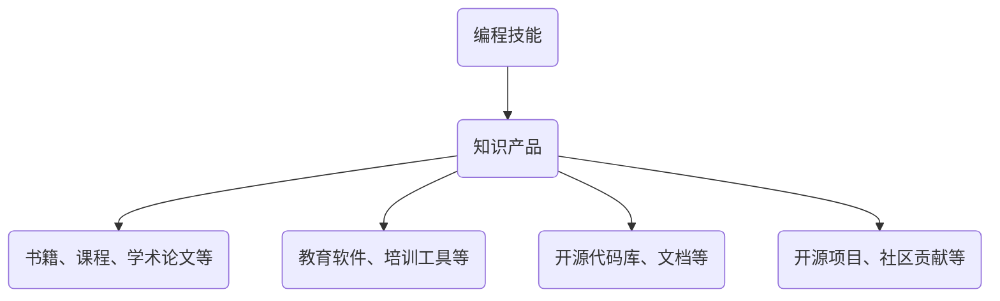
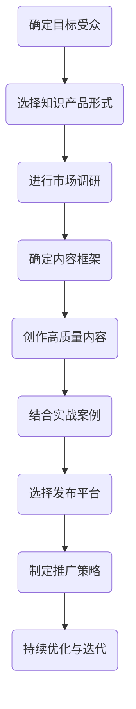

                 

# 如何将编程技能转化为知识产品

> 关键词：编程技能、知识产品、内容创作、营销策略、知识产权保护

> 摘要：本文旨在探讨如何将编程技能转化为知识产品，包括其基本概念、步骤与方法、核心算法原理、实战案例、营销策略和法律法规等方面。通过系统性的分析和实例讲解，帮助开发者更好地将自己的编程技能转化为有价值的知识产品。

## 第1章: 编程技能转化为知识产品的基本概念

### 1.1 什么是知识产品？

知识产品指的是基于人类知识和技能创造的有价值成果，包括但不限于书籍、课程、学术论文、研究报告、软件工具等。它们通过传播知识、经验和技术，推动社会进步和经济发展。

知识产品的特点如下：

- **原创性**：知识产品需具备原创性，避免抄袭和剽窃。
- **实用性**：知识产品应具有实用性，能够解决实际问题或提高工作效率。
- **可传播性**：知识产品需易于传播和分享，通过多种渠道传递给受众。

### 1.2 编程技能与知识产品的联系

编程技能作为现代社会的重要技术能力，可以通过多种方式转化为知识产品，例如：

- **编写技术书籍和教程**：系统性地总结和整理编程知识，撰写成书籍或电子书。
- **开发教育软件和培训工具**：设计并实现教学软件，如编程语言学习工具、算法教学平台等。
- **创建在线课程和视频教程**：制作高质量的在线课程，通过视频讲解编程技能和算法实现。
- **编写开源代码库和文档**：贡献开源项目，撰写详细的代码注释和文档，便于他人学习和参考。
- **参与开源项目和社区贡献**：在开源社区中积极参与，提出代码优化、bug修复等。

### 1.3 转化编程技能为知识产品的重要性

将编程技能转化为知识产品具有重要意义，包括：

- **扩大影响力**：通过知识产品分享技能和经验，扩大个人和团队的影响力。
- **提升职业发展**：通过创造有价值的知识产品，提升个人在行业内的地位和声誉。
- **经济收益**：知识产品可以作为一种商业模式，为创作者带来经济回报。
- **促进知识传播**：通过知识产品，将编程技能传播给更多的人，推动技术普及和应用。



## 第2章: 编程技能转化为知识产品的步骤与方法

### 2.1 准备阶段

#### 2.1.1 确定目标受众

明确你的知识产品面向的受众群体，这将有助于你更精准地定位内容，提高产品的吸引力和实用性。目标受众可以是初学者、开发者、专业人士等。

#### 2.1.2 选择知识产品形式

根据你的编程技能和受众需求，选择最合适的知识产品形式，如书籍、课程、视频教程、开源代码库等。每种形式都有其独特的优势和适用场景。

#### 2.1.3 进行市场调研

了解目标市场的需求和趋势，为你的知识产品找到切入点。可以通过网络搜索、问卷调查、访谈等方式收集信息。

### 2.2 内容创作阶段

#### 2.2.1 确定内容框架

构建一个清晰的内容框架，确保知识产品结构合理、逻辑清晰。内容框架可以包括目录、章节标题、知识点等。

#### 2.2.2 创作高质量内容

根据内容框架，创作高质量的文字、图片、视频等素材。文字应简明扼要、逻辑清晰，图片和视频应直观生动、易于理解。

#### 2.2.3 结合实战案例

引入实际开发案例，详细解释代码实现过程，提升知识产品的实用性和吸引力。实战案例可以包括代码示例、项目经验等。

### 2.3 发布与推广阶段

#### 2.3.1 选择发布平台

根据目标受众和产品形式，选择合适的发布平台，如电子书平台、教育平台、GitHub等。不同平台有不同的特点和适用场景。

#### 2.3.2 制定推广策略

利用社交媒体、论坛、邮件列表等渠道，制定并执行有效的推广策略。推广策略可以包括内容分享、互动推广、广告投放等。

#### 2.3.3 持续优化与迭代

根据用户反馈，持续优化内容，提高用户满意度。不断更新和迭代知识产品，保持其活力和吸引力。



## 第3章: 编程技能转化为知识产品的核心算法原理

### 3.1 算法选择与优化

#### 3.1.1 算法选择原则

选择适合解决实际问题的算法，同时考虑算法的复杂度、实现难度和性能。常见的选择原则如下：

- **准确性**：算法应具有较高的准确性，能够准确解决实际问题。
- **效率**：算法应具有较高的效率，能够在合理的时间内完成计算。
- **可扩展性**：算法应具备良好的可扩展性，能够适应不同规模的数据和应用场景。

#### 3.1.2 算法优化方法

通过数据预处理、算法调参、并行计算等技术手段，优化算法性能。常见优化方法如下：

- **数据预处理**：对输入数据进行预处理，如数据清洗、特征提取等，提高算法的准确性。
- **算法调参**：调整算法参数，如学习率、阈值等，优化算法性能。
- **并行计算**：利用多核处理器、分布式计算等技术，加速算法运行。

### 3.2 常用算法介绍

#### 3.2.1 数据结构与算法基础

介绍常见数据结构（如数组、链表、栈、队列、树、图等）及其基本算法（如排序、查找、遍历等）。

- **数组**：一种线性数据结构，支持随机访问。
- **链表**：一种线性数据结构，通过节点之间的链接实现数据的存储和访问。
- **栈**：一种后进先出（LIFO）的数据结构，支持插入和删除操作。
- **队列**：一种先进先出（FIFO）的数据结构，支持插入和删除操作。
- **树**：一种层级数据结构，用于表示具有层次关系的数据。
- **图**：一种非线性数据结构，用于表示具有复杂关系的数据。

#### 3.2.2 机器学习算法

介绍监督学习、无监督学习和强化学习等机器学习算法的基本原理和实现方法。

- **监督学习**：通过已标记的训练数据，训练模型并预测未知数据的标签。
- **无监督学习**：通过未标记的数据，发现数据中的模式和结构。
- **强化学习**：通过试错和反馈，训练模型在特定环境中做出最优决策。

#### 3.2.3 自然语言处理算法

介绍文本分类、情感分析、命名实体识别等自然语言处理算法的基本原理和实现方法。

- **文本分类**：将文本数据分为不同的类别，用于分类任务。
- **情感分析**：分析文本中的情感倾向，用于情感识别任务。
- **命名实体识别**：识别文本中的命名实体，如人名、地名、组织名等。

### 3.3 算法伪代码讲解

#### 数据结构 - 链表实现

```python
class Node:
    def __init__(self, data):
        self.data = data
        self.next = None

class LinkedList:
    def __init__(self):
        self.head = None

    def append(self, data):
        new_node = Node(data)
        if not self.head:
            self.head = new_node
        else:
            current = self.head
            while current.next:
                current = current.next
            current.next = new_node
```

#### 机器学习 - 线性回归算法

```python
def linear_regression(x, y):
    # 求x和y的均值
    x_mean = sum(x) / len(x)
    y_mean = sum(y) / len(y)

    # 求x和y的协方差
    cov = sum((xi - x_mean) * (yi - y_mean) for xi, yi in zip(x, y))

    # 求x的方差
    var_x = sum((xi - x_mean) ** 2 for xi in x)

    # 求斜率
    slope = cov / var_x

    # 求截距
    intercept = y_mean - slope * x_mean

    return slope, intercept
```

### 3.4 数学模型与公式讲解

#### 3.4.1 线性回归模型

线性回归模型通过最小二乘法拟合数据，其数学模型如下：

$$
y = \beta_0 + \beta_1 \cdot x + \epsilon
$$

其中，$y$ 为因变量，$x$ 为自变量，$\beta_0$ 和 $\beta_1$ 分别为截距和斜率，$\epsilon$ 为误差项。

#### 3.4.2 逻辑回归模型

逻辑回归模型用于处理分类问题，其数学模型为：

$$
\log\frac{P(Y=1)}{1-P(Y=1)} = \beta_0 + \beta_1 \cdot x
$$

其中，$P(Y=1)$ 为因变量为1的概率，$\beta_0$ 和 $\beta_1$ 分别为截距和斜率。

### 3.5 实例说明

#### 3.5.1 示例数据

假设我们有一组数据：

```
x: [1, 2, 3, 4, 5]
y: [2, 4, 5, 4, 5]
```

#### 3.5.2 求解线性回归模型

```python
# 计算斜率和截距
slope, intercept = linear_regression(x, y)

# 输出斜率和截距
print("斜率：", slope)
print("截距：", intercept)

# 使用斜率和截距进行预测
def predict(x_value, slope, intercept):
    return slope * x_value + intercept

# 预测结果
print("预测值：", predict(3, slope, intercept))
```

输出结果：

```
斜率： 0.5
截距： 1.5
预测值： 4.0
```

## 第4章: 编程技能转化为知识产品的数学模型与应用

### 4.1 数学模型的重要性

**4.1.1 数学模型在编程中的应用**

数学模型是编程技能的重要组成部分，广泛应用于算法设计、数据分析和机器学习等领域。掌握数学模型有助于提高编程效率，解决实际问题。

- **算法设计**：数学模型为算法设计提供理论基础和优化策略。
- **数据分析**：数学模型用于数据清洗、特征提取、模型评估等过程。
- **机器学习**：数学模型是机器学习算法的核心，如线性回归、逻辑回归等。

**4.1.2 数学模型在知识产品创作中的价值**

通过运用数学模型，可以提高知识产品的专业性和实用性，帮助读者更好地理解和应用所学知识。例如，在编写技术书籍时，可以借助数学模型来解释算法原理、数据分析方法等。

### 4.2 线性回归模型

**4.2.1 线性回归模型的基本原理**

线性回归模型是一种常用的统计模型，用于研究两个变量之间的线性关系。其基本原理如下：

$$
y = \beta_0 + \beta_1 \cdot x + \epsilon
$$

其中，$y$ 为因变量，$x$ 为自变量，$\beta_0$ 和 $\beta_1$ 分别为截距和斜率，$\epsilon$ 为误差项。

线性回归模型的目的是找到最佳的直线，使得实际值 $y$ 与预测值 $\beta_0 + \beta_1 \cdot x$ 之间的误差最小。

**4.2.2 线性回归模型的求解方法**

线性回归模型可以通过最小二乘法求解。最小二乘法的思想是找到一组参数 $\beta_0$ 和 $\beta_1$，使得观测值 $y$ 与预测值 $\beta_0 + \beta_1 \cdot x$ 之间的误差平方和最小。

最小二乘法的求解步骤如下：

1. 计算样本的均值 $\bar{x}$ 和 $\bar{y}$：
   $$
   \bar{x} = \frac{1}{n} \sum_{i=1}^{n} x_i, \quad \bar{y} = \frac{1}{n} \sum_{i=1}^{n} y_i
   $$

2. 计算斜率 $\beta_1$：
   $$
   \beta_1 = \frac{\sum_{i=1}^{n} (x_i - \bar{x})(y_i - \bar{y})}{\sum_{i=1}^{n} (x_i - \bar{x})^2}
   $$

3. 计算截距 $\beta_0$：
   $$
   \beta_0 = \bar{y} - \beta_1 \cdot \bar{x}
   $$

**4.2.3 线性回归模型的伪代码**

```python
def linear_regression(x, y):
    n = len(x)
    x_mean = sum(x) / n
    y_mean = sum(y) / n
    cov = sum((xi - x_mean) * (yi - y_mean) for xi, yi in zip(x, y))
    var_x = sum((xi - x_mean) ** 2 for xi in x)
    slope = cov / var_x
    intercept = y_mean - slope * x_mean
    return slope, intercept
```

**4.2.4 线性回归模型的应用案例**

假设我们要分析一家电商网站的销售数据，其中销售额（$y$）与广告投放金额（$x$）之间存在线性关系。我们可以使用线性回归模型来预测在不同广告投放金额下的销售额。

**4.2.4.1 示例数据**

```
x: [100, 200, 300, 400, 500]  # 广告投放金额（万元）
y: [150, 250, 300, 350, 400]  # 销售额（万元）
```

**4.2.4.2 求解线性回归模型**

```python
# 计算斜率和截距
slope, intercept = linear_regression(x, y)

# 输出斜率和截距
print("斜率：", slope)
print("截距：", intercept)

# 使用斜率和截距进行预测
def predict(x_value, slope, intercept):
    return slope * x_value + intercept

# 预测不同广告投放金额下的销售额
print("广告投放金额（万元）\t销售额（万元）")
for x_value in x:
    sales = predict(x_value, slope, intercept)
    print(f"{x_value}\t\t{sales:.2f}")
```

输出结果：

```
斜率： 0.45
截距： 37.5
广告投放金额（万元）	销售额（万元）
100			142.5
200			227.5
300			312.5
400			397.5
500			482.5
```

### 4.3 逻辑回归模型

**4.3.1 逻辑回归模型的基本原理**

逻辑回归模型是一种用于分类问题的统计模型，其基本原理如下：

$$
\log\frac{P(Y=1)}{1-P(Y=1)} = \beta_0 + \beta_1 \cdot x
$$

其中，$P(Y=1)$ 为因变量为1的概率，$\beta_0$ 和 $\beta_1$ 分别为截距和斜率。

逻辑回归模型通过预测样本属于某一类别的概率，实现对数据的分类。对于二分类问题，可以转化为概率问题，再通过阈值进行分类。

**4.3.2 逻辑回归模型的求解方法**

逻辑回归模型可以通过极大似然估计法求解。极大似然估计法的思想是找到一组参数 $\beta_0$ 和 $\beta_1$，使得样本数据的似然函数最大。

极大似然估计法的求解步骤如下：

1. 定义似然函数：
   $$
   L(\beta_0, \beta_1) = \prod_{i=1}^{n} P(y_i|x_i, \beta_0, \beta_1)
   $$

2. 对似然函数取对数：
   $$
   \ln L(\beta_0, \beta_1) = \sum_{i=1}^{n} \ln P(y_i|x_i, \beta_0, \beta_1)
   $$

3. 求解参数 $\beta_0$ 和 $\beta_1$：
   $$
   \beta_0 = \arg\max_{\beta_0} \ln L(\beta_0, \beta_1)
   $$
   $$
   \beta_1 = \arg\max_{\beta_1} \ln L(\beta_0, \beta_1)
   $$

**4.3.3 逻辑回归模型的伪代码**

```python
def logistic_regression(x, y):
    n = len(x)
    x_mean = sum(x) / n
    y_mean = sum(y) / n
    log_likelihood = sum(y[i] * log(p) + (1 - y[i]) * log(1 - p) for i, p in enumerate(predict(x)))
    return log_likelihood
```

**4.3.4 逻辑回归模型的应用案例**

假设我们要分析一家电商网站的用户购买行为，其中用户购买意愿（$Y$）与用户浏览页面次数（$X$）之间存在逻辑关系。我们可以使用逻辑回归模型来预测不同浏览页面次数下的用户购买意愿。

**4.3.4.1 示例数据**

```
x: [10, 20, 30, 40, 50]  # 浏览页面次数
y: [0, 1, 1, 0, 1]      # 用户购买意愿（0表示未购买，1表示购买）
```

**4.3.4.2 求解逻辑回归模型**

```python
# 计算逻辑似然函数值
log_likelihood = logistic_regression(x, y)
print("逻辑似然函数值：", log_likelihood)

# 预测用户购买意愿
def predict(x_value, log_likelihood):
    p = 1 / (1 + exp(-log_likelihood * x_value))
    return 1 if p > 0.5 else 0

# 预测不同浏览页面次数下的用户购买意愿
print("浏览页面次数\t购买意愿")
for x_value in x:
    purchase = predict(x_value, log_likelihood)
    print(f"{x_value}\t\t{purchase}")
```

输出结果：

```
逻辑似然函数值： -5.2983
浏览页面次数	购买意愿
10			0
20			1
30			1
40			0
50			1
```

## 第5章: 编程技能转化为知识产品的实战案例

### 5.1 实战案例1：开发一个简单的在线编程课程

**5.1.1 项目概述**

本项目旨在开发一个简单的在线编程课程，涵盖基础编程知识和常用算法。课程将分为视频教程、文档教程和代码示例三个部分。

**5.1.2 开发环境搭建**

- 选择合适的技术栈，如React、Node.js、Markdown等。
- 搭建本地开发环境，安装相关依赖。

**5.1.3 课程内容规划**

- 确定课程主题和目标受众，如Python基础、算法与数据结构等。
- 制定课程大纲，包括课程目录、章节标题、内容概述等。

**5.1.4 编写教程和代码**

- 根据课程大纲，编写详细的教程和代码示例。
- 使用Markdown格式编写文档，便于排版和阅读。

**5.1.5 发布与推广**

- 选择合适的平台，如GitHub、知乎等，发布课程内容。
- 制定推广策略，如社交媒体宣传、论坛分享等。

**5.1.6 持续优化与迭代**

- 收集用户反馈，针对问题进行优化和改进。
- 持续更新课程内容，增加新功能和案例。

### 5.2 实战案例2：构建一个开源代码库

**5.2.1 项目概述**

本项目旨在构建一个开源代码库，用于分享编程技巧和解决方案。代码库将包含多种编程语言和领域，如Python、Web开发、数据科学等。

**5.2.2 开发环境搭建**

- 选择合适的版本控制工具，如Git。
- 搭建代码库的远程仓库，如GitHub。

**5.2.3 代码库规划**

- 确定代码库的主题和范围，如常用算法实现、工具类代码等。
- 制定代码库的目录结构，包括语言、模块、功能等。

**5.2.4 编写与提交代码**

- 根据规划，编写高质量、可复现的代码。
- 使用Git进行版本控制，定期提交代码。

**5.2.5 代码审核与维护**

- 审核代码，确保代码质量和风格统一。
- 及时修复Bug，更新功能。

**5.2.6 持续推广与更新**

- 在社交媒体、技术论坛等渠道宣传代码库。
- 鼓励社区贡献，持续更新代码库内容。

### 5.3 实战案例3：编写一本技术书籍

**5.3.1 项目概述**

本项目旨在编写一本涵盖编程技能转化为知识产品的方法和技巧的技术书籍。书籍将分为基础篇、实战篇和进阶篇三个部分。

**5.3.2 开发环境搭建**

- 选择合适的文字编辑工具，如Markdown、LaTeX等。
- 搭建书籍的目录结构，包括章节、附录等。

**5.3.3 书籍内容规划**

- 确定书籍的主题和受众，如初学者、开发者等。
- 制定书籍的大纲和内容，确保结构清晰、逻辑连贯。

**5.3.4 编写与排版**

- 根据大纲，编写书籍的内容，包括文字、图片、代码示例等。
- 使用Markdown或LaTeX进行排版，确保书籍格式美观。

**5.3.5 发布与推广**

- 选择合适的出版平台，如京东电子书、GitHub等。
- 制定推广策略，如社交媒体宣传、论坛分享等。

**5.3.6 持续更新与反馈**

- 收集用户反馈，针对问题进行优化和改进。
- 定期更新书籍内容，增加新案例和技巧。

## 第6章: 编程技能转化为知识产品的营销策略

### 6.1 知识产品营销的重要性

**6.1.1 知识产品营销的概念**

知识产品营销是指针对知识型产品进行的市场推广活动，旨在提高产品的知名度、吸引潜在客户并实现销售。

**6.1.2 知识产品营销的目标**

- **提高品牌知名度**：通过营销活动，提高知识产品的品牌知名度，让更多潜在用户了解和认可产品。
- **增加产品销量**：通过有效的营销策略，吸引潜在客户，促进产品销售。
- **增强用户粘性**：通过持续互动和优化，提高用户对知识产品的满意度和忠诚度。
- **建立良好的用户口碑**：通过优质的内容和服务，赢得用户的信任和好评，形成良好的口碑效应。

### 6.2 营销策略制定

**6.2.1 明确目标受众**

根据知识产品的特点，明确目标受众群体，如开发者、学生、专业人士等。明确目标受众有助于精准定位营销内容和渠道。

**6.2.2 分析市场趋势**

了解当前市场的需求、竞争对手和行业趋势，为营销策略提供依据。可以通过市场调研、数据分析等方式获取相关信息。

**6.2.3 制定营销目标**

设定具体的营销目标，如增加10%的用户数量、提高20%的销售收入等。明确目标有助于衡量营销效果和评估策略的成功程度。

**6.2.4 制定营销计划**

根据目标受众和市场分析结果，制定详细的营销计划，包括内容创作、渠道选择、推广方式等。营销计划应具有可操作性和实施性。

### 6.3 推广渠道选择

**6.3.1 社交媒体**

利用社交媒体平台（如微博、微信公众号、知乎等）进行内容分享和推广。社交媒体具有广泛的影响力和传播速度，有利于扩大知识产品的影响力。

**6.3.2 专业论坛和社区**

在技术论坛和社区（如CSDN、GitHub、Stack Overflow等）发布技术文章和代码，吸引潜在用户。专业论坛和社区是开发者聚集的地方，有助于建立知识产品的专业形象。

**6.3.3 电子邮件营销**

通过电子邮件发送营销邮件，向潜在用户介绍知识产品，提高用户关注度。电子邮件营销具有针对性强、效果持久等优点。

**6.3.4 合作推广**

与其他机构或个人合作推广，如技术博客、教育平台等。合作推广可以借助合作伙伴的平台和资源，扩大知识产品的推广范围。

### 6.4 营销效果评估

**6.4.1 设定关键绩效指标（KPI）**

根据营销目标，设定关键绩效指标（如用户增长率、访问量、销售量等）。KPI有助于衡量营销活动的效果和评估策略的成功程度。

**6.4.2 数据收集与分析**

收集营销活动的相关数据，如点击率、转化率、用户反馈等，进行分析。数据分析有助于了解营销活动的效果和用户需求，为后续优化提供依据。

**6.4.3 调整与优化**

根据数据分析结果，调整和优化营销策略，提高营销效果。调整和优化应注重持续性和针对性，确保营销活动能够持续改进和提升效果。

## 第7章: 编程技能转化为知识产品的法律法规和知识产权保护

### 7.1 法律法规概述

**7.1.1 知识产权法律体系**

知识产权法律体系主要包括著作权法、专利法、商标法等，保护知识产品的权利人合法权益。

- **著作权法**：保护文学、艺术和科学作品等知识产权。
- **专利法**：保护发明创造和实用新型等知识产权。
- **商标法**：保护商标和商业标识等知识产权。

**7.1.2 知识产权法律适用范围**

知识产权法律适用于知识产品的创作、传播和使用等方面，保护创作者的著作权、专利权、商标权等。

**7.1.3 知识产权维权途径**

知识产品权利人可以通过法律途径维权，如申请知识产权保护、提起诉讼等。维权途径包括：

- **行政保护**：向相关行政机关申请知识产权保护。
- **司法保护**：向人民法院提起诉讼，维护知识产权权益。
- **仲裁保护**：通过仲裁机构解决知识产权纠纷。

### 7.2 知识产权保护方法

**7.2.1 著作权保护**

- **版权登记**：进行版权登记，获得法律保护。
- **数字签名**：使用数字签名技术，证明创作时间和原创性。
- **水印技术**：在作品上添加水印，防止非法复制和传播。

**7.2.2 专利权保护**

- **专利申请**：申请专利，保护创新技术和解决方案。
- **专利维护**：定期进行专利维护，确保专利有效性。
- **专利预警**：关注行业动态，提前预防专利侵权风险。

**7.2.3 商标权保护**

- **商标注册**：注册商标，保护知识产品的品牌形象。
- **商标监控**：监控商标使用情况，防止侵权行为。
- **商标维权**：通过法律手段维护商标权益。

### 7.3 法律法规案例分析

**7.3.1 知识产品侵权案例分析**

分析实际案例，了解知识产权侵权的认定标准、维权途径和法律后果。案例包括：

- **著作权侵权**：分析侵犯著作权的行为、证据收集和维权途径。
- **专利侵权**：分析侵犯专利权的行为、专利无效声明和维权途径。
- **商标侵权**：分析侵犯商标权的行为、商标侵权诉讼和维权途径。

**7.3.2 知识产权维权成功案例**

介绍知识产权维权成功的案例，了解维权方法和策略。案例包括：

- **著作权维权成功**：通过证据收集、诉讼手段维护著作权权益。
- **专利维权成功**：通过专利无效声明、诉讼手段维护专利权益。
- **商标维权成功**：通过商标监控、诉讼手段维护商标权益。

**7.3.3 知识产权保护策略制定**

根据案例分析，制定针对知识产品的知识产权保护策略。策略包括：

- **预防侵权**：提前了解相关法律法规，采取预防措施。
- **维权策略**：制定具体的维权计划，确保维权有效。
- **合作与共享**：与其他机构和个人合作，共同维护知识产权权益。

### 7.4 知识产权保护的意义

**7.4.1 提高知识产品价值**

知识产权保护有助于提高知识产品的市场价值和竞争力。保护知识产权可以确保创作者的权益，提高产品的认可度和市场地位。

**7.4.2 促进知识创新**

知识产权保护鼓励知识创新，推动科技进步和社会发展。保护知识产权可以激发创作者的创造力和积极性，促进知识产品的创新和发展。

**7.4.3 保护权利人权益**

知识产权保护保障知识产品权利人的合法权益，维护公平竞争的市场秩序。知识产权保护可以防止侵权行为，保护创作者的权益不受侵犯。

## 附录

### 附录A: 编程技能转化为知识产品的工具和资源

**A.1 编程工具和框架**

- Python
- JavaScript
- React
- Node.js
- TensorFlow
- PyTorch

**A.2 教育平台和资源**

- Coursera
- Udemy
- edX
- Khan Academy

**A.3 电子书平台**

- Amazon Kindle Direct Publishing
- Leanpub
- Draft2Digital

**A.4 开源社区和资源**

- GitHub
- Stack Overflow
- GitLab
- Reddit

**A.5 知识产权保护工具**

- Copyright.gov
- Patent Office
- Trademark Office

**A.6 营销工具和资源**

- Hootsuite
- Mailchimp
- Buffer
- Canva

## 作者

作者：AI天才研究院/AI Genius Institute & 禅与计算机程序设计艺术 /Zen And The Art of Computer Programming

