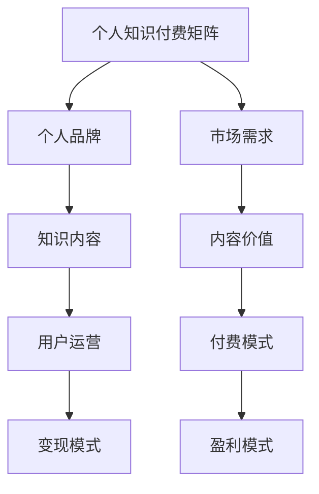

                 

### 文章标题

《如何打造个人知识付费矩阵》

> 关键词：知识付费、个人品牌、内容策划、用户运营、变现模式、案例分析

摘要：
本文旨在深入探讨如何构建和运营个人知识付费矩阵。通过分析知识付费市场的现状与趋势，解析个人知识付费矩阵的核心要素，详细介绍内容策划与制作、知识产品的包装与推广，以及用户运营与变现策略，本文为个人知识付费者提供了一套系统化的实战指南。同时，通过成功案例分析，总结实战指导与资源推荐，为知识付费的未来发展提出前瞻性思考与应对策略。

### 《如何打造个人知识付费矩阵》目录大纲

#### 第一部分：知识付费概述

##### 第1章：知识付费市场的现状与趋势
- 1.1 知识付费的定义与发展历程
- 1.2 知识付费市场的现状分析
- 1.3 知识付费趋势预测与机会识别

##### 第2章：个人知识付费矩阵的核心要素
- 2.1 个人品牌与影响力
- 2.2 知识内容的价值评估
- 2.3 付费模式的多样化

#### 第二部分：内容策划与制作

##### 第3章：知识内容的策划与设计
- 3.1 确定目标受众与需求
- 3.2 内容主题的定位与选择
- 3.3 内容形式的创新与应用

##### 第4章：内容制作与呈现技巧
- 4.1 文字内容写作技巧
- 4.2 视频内容拍摄与剪辑
- 4.3 音频内容录制与编辑

##### 第5章：知识产品的包装与推广
- 5.1 知识产品的品牌设计
- 5.2 传播渠道的选择与策略
- 5.3 用户互动与社群运营

#### 第三部分：用户运营与变现

##### 第6章：用户运营策略与技巧
- 6.1 用户画像与需求分析
- 6.2 用户反馈与满意度管理
- 6.3 用户忠诚度提升策略

##### 第7章：知识付费的商业模式与变现
- 7.1 个人知识付费的盈利模式
- 7.2 知识付费的定价策略
- 7.3 知识付费的可持续性发展

#### 第四部分：案例分析与实践指导

##### 第8章：成功案例分析
- 8.1 国内知名知识付费案例分析
- 8.2 国外知识付费平台案例分析
- 8.3 个人知识付费成功案例分析

##### 第9章：实战指导与资源推荐
- 9.1 知识付费工具与平台推荐
- 9.2 实战项目案例与实战技巧分享
- 9.3 持续学习与成长资源推荐

#### 第五部分：未来展望与挑战

##### 第10章：知识付费的未来发展趋势
- 10.1 新技术对知识付费的影响
- 10.2 知识付费在未来的社会角色
- 10.3 挑战与机遇并存

##### 第11章：应对策略与建议
- 11.1 个人知识付费者的应对策略
- 11.2 平台运营商的发展策略
- 11.3 行业监管与政策建议

#### 附录

##### 附录A：知识付费矩阵构建工具与资源
- A.1 主流知识付费平台介绍
- A.2 知识内容创作与编辑工具
- A.3 用户运营与数据分析工具

##### 附录B：知识付费成功案例分析
- B.1 案例一：XX 知识付费平台的发展历程
- B.2 案例二：XX 知识博主的成功经验
- B.3 案例三：XX 行业专家的知识变现之路

#### 核心概念与联系

**个人知识付费矩阵**


### 核心算法原理讲解

#### 知识内容的价值评估算法

```plaintext
// 伪代码：知识内容价值评估算法
function evaluateContentValue(content, userFeedback, marketTrend) {
    // 计算内容的质量得分
    qualityScore = calculateQualityScore(content);
    
    // 计算用户反馈的得分
    feedbackScore = calculateFeedbackScore(userFeedback);
    
    // 考虑市场趋势的影响
    trendScore = calculateTrendScore(marketTrend);
    
    // 综合评估内容的价值
    valueScore = qualityScore * feedbackScore * trendScore;
    
    return valueScore;
}

// 计算内容的质量得分
function calculateQualityScore(content) {
    // 实现细节...
    return qualityScore;
}

// 计算用户反馈的得分
function calculateFeedbackScore(userFeedback) {
    // 实现细节...
    return feedbackScore;
}

// 计算市场趋势的得分
function calculateTrendScore(marketTrend) {
    // 实现细节...
    return trendScore;
}
```

#### 用户忠诚度模型

```latex
$$
L(t) = \frac{1}{1 + e^{-\alpha \cdot (RT - C)}}
$$`

其中：
- \( L(t) \) 是在时间 \( t \) 的用户忠诚度。
- \( R \) 是用户对内容的满意度评分。
- \( T \) 是用户的参与度评分。
- \( C \) 是常数，用于调整模型参数。

举例说明：
```plaintext
假设一个用户对内容的满意度评分为 4.5，参与度评分为 3.8，常数 \( C \) 为 2。则：
L(t) = \frac{1}{1 + e^{-\alpha \cdot (4.5 \cdot 3.8 - 2)}}

如果 \( \alpha \) 为 0.1，则：
L(t) = \frac{1}{1 + e^{-0.1 \cdot (17.1 - 2)}}
L(t) ≈ \frac{1}{1 + e^{-1.51}}
L(t) ≈ 0.87

这意味着在给定参数下，用户在时间 \( t \) 的忠诚度约为 87%。
```

### 项目实战：代码实际案例和详细解释说明，开发环境搭建，源代码详细实现和代码解读，代码解读与分析

#### 实战案例：使用Python构建简单的知识付费平台

##### 1. 开发环境搭建
- 安装Python（建议使用Python 3.8及以上版本）
- 安装Flask框架：`pip install flask`
- 安装SQLAlchemy：`pip install sqlalchemy`
- 安装Flask-Migrate：`pip install flask-migrate`

##### 2. 源代码实现

**app.py**
```python
from flask import Flask, request, jsonify
from flask_sqlalchemy import SQLAlchemy

app = Flask(__name__)
app.config['SQLALCHEMY_DATABASE_URI'] = 'sqlite:///knowledge_pay.db'
db = SQLAlchemy(app)

class User(db.Model):
    id = db.Column(db.Integer, primary_key=True)
    username = db.Column(db.String(80), unique=True, nullable=False)
    email = db.Column(db.String(120), unique=True, nullable=False)
    password = db.Column(db.String(120), nullable=False)

class Content(db.Model):
    id = db.Column(db.Integer, primary_key=True)
    title = db.Column(db.String(120), nullable=False)
    content = db.Column(db.Text, nullable=False)
    price = db.Column(db.Float, nullable=False)

@app.route('/register', methods=['POST'])
def register():
    data = request.get_json()
    username = data.get('username')
    email = data.get('email')
    password = data.get('password')
    
    # 注册逻辑实现...
    
    return jsonify(message='Registered successfully!'), 201

@app.route('/login', methods=['POST'])
def login():
    data = request.get_json()
    username = data.get('username')
    password = data.get('password')
    
    # 登录逻辑实现...
    
    return jsonify(message='Logged in successfully!'), 200

@app.route('/content', methods=['POST'])
def create_content():
    data = request.get_json()
    title = data.get('title')
    content = data.get('content')
    price = data.get('price')
    
    # 创建内容逻辑实现...
    
    return jsonify(message='Content created successfully!'), 201

@app.route('/content/<int:content_id>', methods=['GET'])
def get_content(content_id):
    # 获取内容逻辑实现...
    
    return jsonify(content=data), 200

if __name__ == '__main__':
    db.create_all()
    app.run(debug=True)
```

##### 3. 代码解读与分析
- **数据库模型**：定义了用户和内容模型，用户模型包含用户名、邮箱和密码，内容模型包含标题、内容和价格。
- **注册和登录路由**：实现用户的注册和登录功能，接收JSON格式的请求，验证用户信息，并返回相应的响应。
- **内容创建路由**：允许管理员创建新的知识内容，接收JSON格式的请求，保存内容信息到数据库，并返回成功消息。
- **内容获取路由**：根据内容ID获取特定的知识内容，返回JSON格式的响应。

##### 4. 实际应用与扩展
- 可以添加更多的功能，如用户订阅内容、评论功能、内容分类等。
- 使用JWT（JSON Web Tokens）替代简单密码验证，提高安全性。
- 集成支付网关，实现内容付费购买功能。

通过这个简单的案例，读者可以了解如何搭建一个知识付费平台的基础架构，并在实践中不断扩展和完善。接下来，我们将深入分析知识付费市场的现状与趋势，为构建个人知识付费矩阵奠定基础。 ### 第1章：知识付费市场的现状与趋势

知识付费，作为一种新兴的商业模式，正在全球范围内迅速崛起。它指的是用户为了获取高质量的知识和信息，自愿支付一定费用的一种服务形式。知识付费的兴起，不仅改变了传统知识传播的途径，也为知识创作者提供了新的变现方式。

#### 1.1 知识付费的定义与发展历程

知识付费的定义较为广泛，它涵盖了各种形式的知识服务，如在线课程、电子书、付费问答、专业咨询、线上讲座等。知识付费的商业模式起源于互联网的普及和数字化技术的进步。最早的知识付费形式可以追溯到20世纪90年代的在线教育，随着互联网的发展，尤其是在21世纪初，电子商务平台的兴起，为知识付费提供了更加便捷的支付渠道。进入移动互联网时代，知识付费市场得到了进一步的发展。

知识付费的发展历程大致可以分为三个阶段：

1. **起步阶段（2000-2010年）**：这个阶段主要是以在线课程和教育视频为主，以Coursera、Udemy等平台为代表，它们提供了大量的在线课程，吸引了大量用户参与。
2. **快速增长阶段（2010-2015年）**：随着智能手机的普及，移动互联网的发展，知识付费市场迎来了爆发式增长。知乎、喜马拉雅等平台开始崛起，满足了用户在各个领域的知识需求。
3. **成熟阶段（2015年至今）**：知识付费市场逐渐成熟，不仅有大量的平台涌现，而且商业模式不断创新，如付费专栏、会员服务、知识变现等。这一阶段，知识付费已经成为了许多专业人士和个人品牌的重要收入来源。

#### 1.2 知识付费市场的现状分析

目前，知识付费市场呈现出以下几个显著特点：

1. **市场规模持续扩大**：根据市场研究数据，全球知识付费市场规模已经达到了数百亿美元，并且还在持续增长。尤其是在中国，随着互联网用户数量的增加和消费升级，知识付费市场的潜力巨大。
2. **用户群体多样化**：知识付费用户不仅包括学生、职场新人，还包括专业从业者、企业家等。他们对于知识的渴求不仅限于教育领域，还涵盖了职场技能、个人成长、投资理财等多个方面。
3. **内容形式多样化**：知识付费的内容形式越来越多样化，包括在线课程、电子书、音频、视频、直播、一对一咨询等。用户可以根据自己的需求和偏好选择适合自己的知识服务形式。
4. **平台竞争激烈**：知识付费市场吸引了大量平台和企业进入，竞争激烈。一些头部平台，如得到、知乎、喜马拉雅等，占据了大部分市场份额，而小型平台则通过细分市场和专业化内容来争取用户。

#### 1.3 知识付费趋势预测与机会识别

未来，知识付费市场将继续保持增长态势，并呈现出以下几大趋势：

1. **个性化服务增强**：随着大数据和人工智能技术的发展，知识付费平台将能够更精准地分析用户需求，提供个性化的知识服务，提升用户体验。
2. **垂直领域深化**：知识付费将更加垂直化，各个领域的专业知识和服务将得到更多关注。例如，在医疗、法律、金融等专业领域，知识付费将发挥更大的作用。
3. **跨界融合创新**：知识付费与其他行业的融合将带来新的商业模式。例如，知识付费与旅游、影视、电竞等领域的结合，将创造更多价值。
4. **全球市场拓展**：随着全球化的推进，知识付费市场将不再局限于某个地区或国家。尤其是对于中国等新兴市场，知识付费平台将有更大的拓展空间。

对于个人知识付费者来说，这些趋势意味着新的机会和挑战。首先，个人品牌建设将成为关键，拥有独特专业知识和强大影响力的个人将更容易在市场中脱颖而出。其次，内容创作和运营能力将更加重要，如何制作高质量、有吸引力的内容，以及如何有效推广和变现，是每个知识付费者都需要考虑的问题。

总之，知识付费市场正处于快速发展的阶段，个人知识付费者应紧跟市场趋势，不断优化自己的知识产品和服务，才能在激烈的市场竞争中立于不败之地。 ### 第2章：个人知识付费矩阵的核心要素

在知识付费市场中，个人知识付费矩阵是一个系统的框架，它不仅包括个人品牌与影响力的构建，还涉及到知识内容的价值评估、付费模式的多样化等核心要素。本章节将深入探讨这些要素，为构建个人知识付费矩阵提供理论支持和实战指导。

#### 2.1 个人品牌与影响力

个人品牌是知识付费成功的关键要素之一。一个强大的个人品牌能够吸引更多的关注和信任，从而为知识付费产品和服务带来更多的潜在客户。以下是构建个人品牌与影响力的一些关键步骤：

1. **定位明确**：个人品牌的首要任务是明确自己的专业领域和独特价值。通过深入研究和分析自己的专业技能和兴趣，找到自己独有的定位，以便在市场中脱颖而出。

2. **内容创作**：高质量的内容是构建个人品牌的基石。无论是文字、视频、音频还是直播，都需要具备专业性和独特性。持续地创作和发布高质量内容，能够提升个人在专业领域的权威性和影响力。

3. **社交媒体运营**：社交媒体是构建个人品牌的重要渠道。通过在各大社交媒体平台上发布专业内容、互动和分享，可以扩大个人品牌的知名度和影响力。

4. **口碑传播**：通过用户的口碑传播，可以进一步提升个人品牌的可信度和吸引力。鼓励用户在社交媒体上分享自己的使用体验，并积极回应用户的反馈，有助于建立良好的口碑。

5. **持续学习与成长**：个人品牌是一个持续建设的过程，需要不断地学习和成长。通过参加行业会议、研讨会、培训等活动，可以保持自己在专业领域的竞争力。

#### 2.2 知识内容的价值评估

知识内容的价值评估是决定知识付费产品定价和推广策略的重要因素。以下是一些评估知识内容价值的步骤和方法：

1. **市场需求分析**：首先，需要了解目标受众的需求，包括他们的痛点和需求点。通过市场调研和用户反馈，可以获取有价值的信息，为知识内容的价值评估提供依据。

2. **质量评估**：知识内容的质量是评估其价值的重要标准。内容的专业性、准确性、实用性、创新性等都会影响其价值。可以通过同行评审、用户评价等方式来评估内容的质量。

3. **受众反馈**：用户对知识内容的反馈是评估其价值的重要指标。通过收集用户的评价和反馈，可以了解内容的接受程度和改进方向。

4. **竞争对手分析**：了解竞争对手的知识内容质量和定价策略，可以帮助个人知识付费者更好地定位自己的内容价值，制定合适的定价策略。

5. **算法评估**：利用大数据和人工智能技术，可以开发出针对知识内容的价值评估算法。例如，通过计算内容的市场需求、用户反馈、质量得分等因素，生成一个综合的价值评分。

#### 2.3 付费模式的多样化

知识付费的付费模式多样化是吸引和留住用户的关键。以下是一些常见的付费模式：

1. **一次性付费**：用户购买一次性的知识产品，如电子书、课程等。这种模式适合内容较长、用户一次性消费的情境。

2. **订阅模式**：用户支付定期费用，获得持续更新的知识内容。这种模式适合提供持续更新内容的服务，如在线课程、杂志、专栏等。

3. **按需付费**：用户根据实际需求，选择购买特定的知识服务，如一对一咨询、问答等。这种模式适合个性化、定制化的服务。

4. **会员模式**：用户支付会员费用，享受平台的多种权益，如免费课程、专属服务、优先回答等。这种模式适合建立用户忠诚度和提高用户粘性。

5. **众筹模式**：通过众筹平台，用户提前预订知识产品，支持者可以获得优先购买权和一定的折扣。这种模式适合创新性、尚未验证的知识产品。

通过多样化的付费模式，个人知识付费者可以满足不同用户的需求，提高用户体验和满意度，从而实现知识付费的可持续发展和盈利。

总之，个人知识付费矩阵的核心要素包括个人品牌与影响力的构建、知识内容的价值评估、以及付费模式的多样化。这些要素相互关联，共同构成了个人知识付费的成功框架。通过深入理解和应用这些要素，个人知识付费者可以在竞争激烈的市场中脱颖而出，实现知识变现的目标。接下来，我们将探讨如何策划和设计高质量的知识内容。 ### 第3章：知识内容的策划与设计

知识内容的策划与设计是知识付费矩阵成功的关键环节。一个成功的知识内容不仅需要满足用户的需求，还需要具备独特的价值和创新的形式。本章节将详细讨论如何确定目标受众与需求、内容主题的定位与选择，以及内容形式的创新与应用。

#### 3.1 确定目标受众与需求

确定目标受众和了解用户需求是策划知识内容的第一步。以下是一些关键步骤和策略：

1. **用户调研**：通过问卷调查、访谈、用户行为分析等方式，了解目标用户的基本信息、兴趣爱好、需求痛点等。用户调研可以帮助你更好地了解用户，为内容策划提供依据。

2. **市场分析**：分析市场竞争格局，了解同类型知识内容的市场表现和用户反馈。通过市场分析，可以找到市场空白和需求缺口，从而确定自己的内容定位。

3. **定位分析**：根据用户调研和市场分析的结果，确定自己的目标受众群体。明确目标受众后，可以更有针对性地策划内容，满足他们的需求。

4. **需求排序**：对用户需求进行优先级排序，确定哪些需求是最紧迫和最有价值的。通过优先满足关键需求，可以提高用户满意度和忠诚度。

5. **持续迭代**：内容策划是一个持续迭代的过程。通过收集用户反馈和数据分析，不断调整和优化内容，以更好地满足用户需求。

#### 3.2 内容主题的定位与选择

内容主题的定位与选择是知识内容策划的核心。以下是一些策略和原则：

1. **专业领域**：选择自己最熟悉和最有经验的领域作为内容主题。专业领域的知识更容易引起共鸣，增加内容的可信度和权威性。

2. **热点话题**：紧跟行业热点和趋势，选择具有时效性和话题性的主题。热点话题能够吸引更多关注，增加内容的传播力度。

3. **差异化定位**：在众多同类型内容中，寻找差异化定位，提供独特的视角和价值。差异化定位可以帮助你在竞争激烈的市场中脱颖而出。

4. **用户痛点**：选择能够解决用户痛点的主题。痛点主题能够引起用户的共鸣，增加内容的实用性和吸引力。

5. **长期规划**：内容主题的选择需要具备一定的前瞻性和持续性。通过长期规划，可以构建一个稳定的内容输出体系，增加用户粘性。

#### 3.3 内容形式的创新与应用

知识内容的创新形式能够提升用户的体验和参与度。以下是一些常见的内容形式及其应用策略：

1. **在线课程**：通过视频、音频、图文等多种形式，系统性地传授专业知识。在线课程适合有系统学习需求的用户。

2. **电子书**：将专业知识整理成书，方便用户阅读和收藏。电子书适合需要深度阅读的用户。

3. **直播与互动**：通过直播进行实时教学和互动，增加用户的参与感和体验。直播适合需要实时交流和互动的用户。

4. **问答与咨询**：提供专业的问答和咨询服务，解决用户的具体问题。问答与咨询适合需要个性化解决方案的用户。

5. **案例研究**：通过实际案例的分享，展示专业知识的应用和价值。案例研究适合需要实践指导的用户。

6. **互动式内容**：如问答互动、投票、讨论等，增加用户的互动和参与度。互动式内容适合需要参与感和社区感的用户。

7. **多媒体融合**：结合多种内容形式，如视频与图文、音频与直播等，提供更丰富的学习体验。多媒体融合适合需要多样化学习方式的用户。

通过创新的内容形式，可以提升知识内容的吸引力和用户体验，从而增加知识付费的成功率。

总之，知识内容的策划与设计是一个系统化的过程，需要从目标受众和需求分析、内容主题的定位与选择，到内容形式的创新与应用，全面考虑和规划。通过科学的内容策划与设计，个人知识付费者可以提供高质量、有吸引力的知识内容，从而在激烈的市场竞争中脱颖而出。接下来，我们将深入探讨知识内容的制作与呈现技巧。 ### 第4章：内容制作与呈现技巧

在知识付费领域，制作和呈现内容的质量直接关系到用户的满意度和付费意愿。一个成功的知识内容不仅需要深入浅出地传递知识，还需要通过专业的制作和呈现技巧来提升用户体验。本章节将详细介绍文字内容写作技巧、视频内容拍摄与剪辑、音频内容录制与编辑，以帮助知识创作者提高内容制作的专业水平。

#### 4.1 文字内容写作技巧

文字内容是知识付费中最常见的形式之一，良好的写作技巧能够提高内容的可读性和吸引力。以下是一些关键技巧：

1. **明确目标**：在撰写内容前，明确你的目标受众和写作目的。这有助于你在写作过程中保持主题的聚焦和一致性。

2. **结构清晰**：确保文章结构清晰，逻辑性强。可以采用“引言-正文-结论”的结构，使文章层次分明，易于理解。

3. **语言简洁**：使用简单、直接的语言，避免使用过于复杂的词汇和句子。简洁的语言有助于提高内容的可读性。

4. **使用图表与插图**：适当地使用图表、图片和插图可以增加文章的视觉吸引力，帮助用户更好地理解复杂概念。

5. **引发思考**：在内容中设置问题、案例和讨论点，激发用户的思考，增加互动性。

6. **校对与修订**：写作完成后，进行多次校对和修订，确保内容的准确性和流畅性。

#### 4.2 视频内容拍摄与剪辑

视频内容具有直观、生动的特点，能够更好地传递知识和情感。以下是一些视频内容拍摄与剪辑的关键技巧：

1. **脚本规划**：在拍摄前，详细规划脚本，明确每个镜头的目的、内容和时长。

2. **拍摄设备**：使用高质量的摄像机或手机拍摄，确保画面清晰、稳定。必要时，可使用三脚架、稳定器等辅助设备。

3. **光线控制**：合理控制光线，避免过亮或过暗，确保画面清晰、舒适。

4. **音频处理**：使用高质量的麦克风和音频设备，确保音频清晰、无杂音。在后期剪辑中，进行音频剪辑和处理，提升音质。

5. **剪辑技巧**：通过剪辑，将零散的镜头和音频片段有机地串联起来，增强视频的流畅性和连贯性。可以采用切换、特效、字幕等技巧，提高视频的观赏性。

6. **视觉效果**：添加适当的视觉特效，如动画、转场等，提升视频的趣味性和吸引力。

#### 4.3 音频内容录制与编辑

音频内容在知识付费中也非常常见，如播客、音频课程等。以下是一些音频内容录制与编辑的关键技巧：

1. **录音环境**：选择一个安静、无杂音的录音环境，避免外界干扰。必要时，使用隔音材料或隔音房。

2. **录音设备**：使用高质量的录音设备，如专业麦克风、音频接口等，确保音频质量。

3. **声音清晰**：确保语音清晰、洪亮，发音准确。必要时，可以使用音频编辑软件进行语音调整。

4. **背景音乐与音效**：根据内容需要，添加适当的背景音乐和音效，增强音频的观赏性和氛围。

5. **音频编辑**：使用音频编辑软件，对音频进行剪辑、混音和特效处理，提升音频的整体质量。

6. **校对与审查**：在音频录制完成后，进行多次校对和审查，确保内容的准确性和完整性。

总之，内容制作与呈现技巧是知识付费成功的关键。通过掌握和运用这些技巧，知识创作者可以提升内容的专业水平，增强用户的体验和满意度，从而在竞争激烈的市场中脱颖而出。接下来，我们将探讨如何包装和推广知识产品。 ### 第5章：知识产品的包装与推广

知识产品的包装与推广是确保知识付费成功的关键环节。一个出色的包装能够提升产品的专业形象，吸引潜在客户的注意力。同时，有效的推广策略能够扩大产品的影响力，吸引更多的用户。本章节将详细介绍知识产品的品牌设计、传播渠道的选择与策略，以及用户互动与社群运营。

#### 5.1 知识产品的品牌设计

知识产品的品牌设计是建立产品市场认知度和品牌形象的重要步骤。以下是一些关键要点：

1. **品牌定位**：明确知识产品的目标市场和用户群体，确定品牌的独特定位和价值主张。品牌定位应与目标用户的需求和期望相契合。

2. **品牌视觉**：设计独特的品牌视觉元素，包括标志、色彩、字体等。这些视觉元素应具备辨识度，能够在视觉上传达品牌的价值观和专业性。

3. **品牌故事**：构建一个引人入胜的品牌故事，讲述品牌的发展历程、核心理念和独特价值。品牌故事能够增强用户的情感共鸣，提升品牌的亲和力。

4. **品牌传播**：通过线上线下多种渠道，持续传播品牌形象和故事。可以利用社交媒体、博客、电子邮件等工具，定期发布品牌相关内容，增强用户对品牌的认知。

#### 5.2 传播渠道的选择与策略

选择合适的传播渠道是推广知识产品的重要策略。以下是一些常见的传播渠道及其应用策略：

1. **社交媒体**：利用微博、微信、抖音、B站等社交媒体平台，发布专业内容、互动和活动，吸引目标用户关注。社交媒体具有传播速度快、互动性强的优势，适合快速传播品牌信息和吸引流量。

2. **内容平台**：在知乎、得到、喜马拉雅等知识内容平台发布专业内容，通过平台的流量和推荐机制，提升内容曝光度和用户转化率。

3. **博客与官方网站**：建立专业的博客和官方网站，发布深度文章、课程介绍、用户评价等，提供丰富的产品信息。官方网站可以作为品牌的权威信息来源和用户互动平台。

4. **合作伙伴**：与相关领域的行业专家、机构、媒体等建立合作关系，通过合作推广知识产品。合作伙伴可以提供流量支持和资源，扩大产品的市场影响力。

5. **广告投放**：通过百度广告、谷歌广告、今日头条广告等在线广告平台，进行精准投放，吸引潜在用户。广告投放可以根据用户行为数据，进行精准定位和优化。

6. **线下活动**：举办线下讲座、研讨会、沙龙等活动，与用户面对面交流，提升品牌知名度和用户信任度。线下活动可以增强用户对品牌的认知和体验。

#### 5.3 用户互动与社群运营

用户互动与社群运营是提升用户满意度和忠诚度的重要手段。以下是一些关键策略：

1. **用户反馈**：积极收集用户反馈，了解用户需求和满意度。通过问卷调查、用户访谈、在线论坛等方式，与用户保持沟通，及时回应用户关切和问题。

2. **用户社群**：建立用户社群，如微信群、QQ群、Discord频道等，为用户提供一个交流互动的平台。社群可以增强用户之间的联系，提升用户参与感和归属感。

3. **用户互动活动**：定期举办线上或线下互动活动，如知识竞赛、问答环节、分享会等，鼓励用户参与和分享。活动可以提升用户的活跃度和忠诚度。

4. **个性化服务**：根据用户数据和反馈，提供个性化的服务和建议。例如，根据用户的学习进度和兴趣，推荐相关的课程和内容，提高用户的满意度。

5. **用户成长计划**：制定用户成长计划，鼓励用户不断学习和进步。可以通过积分系统、等级认证等方式，激励用户积极参与知识付费服务。

总之，知识产品的包装与推广是一个系统化的过程，需要从品牌设计、传播渠道选择到用户互动与社群运营，全面考虑和执行。通过有效的包装与推广，知识产品能够更好地吸引潜在客户，提升市场竞争力，从而实现知识变现的目标。接下来，我们将深入探讨如何进行用户运营与变现。 ### 第6章：用户运营策略与技巧

用户运营是知识付费矩阵中的重要环节，它不仅关乎产品的销售和用户满意度，还直接影响到用户忠诚度和留存率。有效的用户运营策略能够提高用户的参与度和满意度，从而推动知识付费产品的成功。本章节将详细讨论用户画像与需求分析、用户反馈与满意度管理，以及用户忠诚度提升策略。

#### 6.1 用户画像与需求分析

用户画像是对目标用户群体的全面描述，包括他们的基本属性、行为习惯、兴趣爱好、需求痛点等。通过构建用户画像，可以更好地了解用户，从而制定针对性的运营策略。以下是构建用户画像和进行需求分析的关键步骤：

1. **数据收集**：通过用户调研、线上问卷、用户行为数据分析等方式，收集用户的基本信息和行为数据。

2. **数据分析**：利用数据分析工具，对收集到的数据进行分析，提取用户的基本属性和行为特征。例如，用户的年龄、性别、教育背景、职业等。

3. **用户分类**：根据分析结果，将用户进行分类，形成不同的用户群体。这些用户群体可以是按照年龄、职业、兴趣爱好等标准划分的。

4. **需求分析**：分析每个用户群体的需求，了解他们在知识付费产品中的痛点、期望和偏好。需求分析可以通过用户访谈、问卷调查等方式进行。

5. **用户画像更新**：用户需求和偏好会随着时间和市场环境的变化而变化，因此需要定期更新用户画像，确保运营策略的准确性。

#### 6.2 用户反馈与满意度管理

用户反馈是了解用户满意度和产品性能的重要途径。有效的用户反馈管理能够帮助知识付费者及时发现问题并做出改进。以下是用户反馈和满意度管理的关键策略：

1. **反馈渠道**：提供多种用户反馈渠道，如在线客服、电子邮件、社交媒体等。确保用户可以方便地提出反馈和建议。

2. **及时响应**：对用户反馈进行及时响应，解决用户的问题和关切。及时响应能够提高用户满意度，增强用户对品牌的信任。

3. **数据分析**：收集和分析用户反馈数据，识别常见问题和痛点。通过数据分析，可以了解用户对产品哪些方面最满意，哪些方面需要改进。

4. **满意度调查**：定期进行用户满意度调查，了解用户对知识付费产品的整体满意度。满意度调查可以通过在线问卷、电话访谈等方式进行。

5. **改进与优化**：根据用户反馈和满意度调查结果，对产品和服务进行改进和优化。改进措施应具有针对性，以解决用户最关心的问题。

#### 6.3 用户忠诚度提升策略

用户忠诚度是知识付费成功的关键指标之一。高忠诚度的用户不仅会持续购买产品，还会为品牌传播提供支持。以下是提升用户忠诚度的关键策略：

1. **个性化服务**：根据用户画像和需求，提供个性化的服务和建议。例如，根据用户的学习进度和兴趣，推荐相关的课程和内容。

2. **会员制度**：建立会员制度，为会员提供额外的优惠和特权，如折扣、优先服务、专属内容等。会员制度可以增加用户的参与感和忠诚度。

3. **互动活动**：定期举办线上或线下互动活动，如知识竞赛、讲座、沙龙等，鼓励用户参与和分享。互动活动可以增强用户对品牌的归属感和忠诚度。

4. **用户成长计划**：制定用户成长计划，鼓励用户不断学习和进步。例如，通过积分系统、等级认证等方式，激励用户积极参与知识付费服务。

5. **情感连接**：建立情感连接，与用户建立深厚的情感联系。通过品牌故事、用户故事等方式，让用户感受到品牌的人文关怀和价值。

6. **用户社区**：建立用户社区，为用户提供一个交流和互动的平台。用户社区可以增强用户之间的联系，提升用户的参与度和忠诚度。

通过有效的用户运营策略和技巧，知识付费者可以提升用户满意度、忠诚度和留存率，从而实现知识付费的长期成功。接下来，我们将探讨知识付费的商业模式与变现策略。 ### 第7章：知识付费的商业模式与变现

在知识付费市场中，有效的商业模式和变现策略是确保个人或企业能够实现盈利并持续发展的关键。本章节将深入探讨个人知识付费的盈利模式、定价策略，以及知识付费的可持续性发展。

#### 7.1 个人知识付费的盈利模式

个人知识付费的盈利模式多种多样，以下是一些常见的盈利模式：

1. **一次性购买**：用户一次性支付费用，获取知识产品。这种模式适合短期的、可消耗的内容，如电子书、报告等。

2. **订阅模式**：用户支付定期费用，持续获取更新的知识内容。这种模式适合提供持续内容输出的服务，如在线课程、杂志、专栏等。

3. **会员制**：用户支付会员费用，享受平台的多种权益，如免费课程、专属服务、优先回答等。会员制有助于提高用户粘性和品牌忠诚度。

4. **按需付费**：用户根据实际需求，选择购买特定的知识服务，如一对一咨询、问答等。这种模式适合提供个性化、定制化的服务。

5. **众筹模式**：通过众筹平台，用户提前预订知识产品，支持者可以获得优先购买权和一定的折扣。这种模式适合创新性、尚未验证的知识产品。

6. **广告收入**：通过在知识产品中植入广告，为知识创作者带来额外收入。这种模式适合拥有大量用户的平台或内容创作者。

7. **联合授权**：将知识产品授权给其他平台或机构使用，获得授权费收入。这种模式适合拥有独特内容和专业知识的内容创作者。

#### 7.2 知识付费的定价策略

合理的定价策略能够平衡知识内容的价值和用户承受能力，从而实现最大化收益。以下是一些常见的定价策略：

1. **价值定价**：根据知识内容的价值和市场需求定价。价值定价需要评估内容的专业性、稀缺性和实用性，确保价格能够反映内容的真正价值。

2. **成本加成定价**：在知识内容的成本基础上，加上一定的利润加成进行定价。这种策略简单易懂，但可能无法完全反映内容的价值。

3. **竞争定价**：根据市场上相似产品的价格定价，确保具有竞争力。竞争定价需要了解市场情况，确保价格既具有吸引力，又能覆盖成本。

4. **心理定价**：利用消费者的心理，采用非整数定价或分段定价策略，如9.9元、99元等。这种策略可以增加消费者的购买欲望。

5. **动态定价**：根据市场需求和用户行为动态调整价格。例如，节假日促销、限时优惠等。动态定价可以提升销售量和用户体验。

6. **捆绑定价**：将多个知识产品捆绑在一起销售，提供优惠价格。这种策略可以增加产品的附加值，提高用户购买意愿。

#### 7.3 知识付费的可持续性发展

知识付费的可持续性发展关乎个人或企业的长期成功。以下是一些关键策略：

1. **内容创新**：持续创新知识内容，提供独特、有价值的内容，满足不断变化的市场需求。

2. **用户互动**：建立良好的用户互动机制，增加用户的参与感和忠诚度，从而提高用户留存率和口碑。

3. **技术升级**：利用新技术，如人工智能、大数据等，优化内容制作、推广和用户体验，提升知识付费产品的竞争力。

4. **品牌建设**：通过品牌建设，提高品牌知名度和美誉度，从而增加用户信任和忠诚度。

5. **持续学习**：不断学习和提升自己的专业能力和市场洞察力，紧跟市场趋势，保持竞争力。

6. **多元化变现**：探索多元化的盈利模式，如广告收入、联合授权、会员制等，实现收入多元化，降低风险。

7. **合规经营**：遵守相关法律法规，确保知识付费业务的合规性，从而减少法律风险，保障业务的可持续性。

通过有效的商业模式和变现策略，以及可持续性发展措施，个人知识付费者可以在竞争激烈的市场中立于不败之地，实现长期成功和可持续发展。接下来，我们将通过案例分析来进一步探讨知识付费的实际操作与成功经验。 ### 第8章：成功案例分析

在知识付费领域，许多个人和平台通过有效的策略和执行，取得了显著的成果。本章节将通过国内知名知识付费案例、国外知识付费平台案例以及个人知识付费成功案例，深入分析这些案例的运作模式、成功经验和关键因素，为知识付费者提供实战指导和启示。

#### 8.1 国内知名知识付费案例分析

**得到APP**

**案例背景**：得到APP是中国的领先知识付费平台，成立于2016年，由罗振宇创办。该平台以“死磕自己，感动用户”为核心理念，提供大量高质量的知识内容，涵盖经济学、心理学、科技、人文等多个领域。

**运作模式**：
- **内容生产**：得到APP通过邀请知名专家学者、行业领袖进行直播、讲座，以及自行制作内容，形成独特的知识生产模式。
- **订阅模式**：用户通过订阅不同专栏，如《罗辑思维》、《李笑来写作课》等，获取持续更新的内容。
- **互动环节**：平台提供问答环节，用户可以向专家学者提问，增加互动性和用户粘性。

**成功经验**：
- **品牌建设**：得到APP通过持续的内容输出和品牌宣传，建立了强大的品牌影响力。
- **用户互动**：通过问答、评论等互动环节，得到APP增强了用户参与感和忠诚度。
- **多样化内容**：提供多样化的内容，满足不同用户的需求，扩大用户基础。

**关键因素**：
- **高质量内容**：得到APP注重内容的质量，选择具有专业背景和影响力的内容创作者。
- **订阅模式**：通过订阅模式，确保持续的内容输出和用户付费。

**案例启示**：成功案例表明，优质内容、订阅模式、用户互动是知识付费平台成功的关键因素。

#### 8.2 国外知识付费平台案例分析

**Coursera**

**案例背景**：Coursera是一家全球知名的大规模在线开放课程（MOOC）平台，成立于2012年，由安德斯·贝斯和达芙妮·科乐共同创办。该平台提供来自世界顶级大学的在线课程，涵盖计算机科学、商业管理、医学、艺术等多个领域。

**运作模式**：
- **课程合作**：Coursera与全球多所知名大学和机构合作，提供高质量的课程内容。
- **付费模式**：用户可以选择免费学习，或者付费获得证书和额外资源。
- **技术支持**：利用人工智能和大数据技术，提供个性化的学习体验和推荐。

**成功经验**：
- **合作资源**：通过与知名大学合作，Coursera获得了优质的教育资源，提升了平台的内容质量。
- **国际化发展**：Coursera在多个国家开设本地化版本，吸引了全球用户，扩大了市场影响力。
- **技术驱动**：通过技术创新，Coursera提供了个性化、互动性强的学习体验。

**关键因素**：
- **优质资源**：与顶级大学和机构的合作，确保了课程内容的高质量和权威性。
- **技术驱动**：人工智能和大数据技术的应用，提升了用户体验和课程效果。
- **国际化战略**：多语言支持和本地化发展，扩大了用户基础和市场。

**案例启示**：国外成功案例表明，优质资源、技术驱动和国际化战略是知识付费平台成功的关键。

#### 8.3 个人知识付费成功案例分析

**秋叶PPT**

**案例背景**：秋叶PPT是知名PPT设计师和知识付费博主秋叶（张轶）的个人品牌。秋叶通过自己的专业知识，结合丰富的教学经验，在知识付费领域取得了显著成就。

**运作模式**：
- **内容创作**：秋叶通过撰写书籍、制作PPT教程视频、开设线上课程等多种形式，创作高质量的知识内容。
- **社群运营**：建立微信社群、QQ群等，与用户保持互动，提升用户参与感和忠诚度。
- **知识变现**：通过在线课程、电子书、会员制等多种模式，实现知识变现。

**成功经验**：
- **专业特长**：秋叶凭借自己在PPT设计领域的专业特长，创作出高质量的内容，吸引了大量粉丝。
- **用户互动**：通过社群运营，秋叶与用户建立了深厚的情感联系，提升了用户的满意度和忠诚度。
- **持续创新**：不断推出新的内容形式和付费模式，保持用户的新鲜感和参与度。

**关键因素**：
- **专业能力**：在特定领域的专业知识和技能，是成功的基础。
- **用户互动**：有效的社群运营和用户互动，能够提升用户的满意度和忠诚度。
- **内容创新**：持续的内容创新，能够保持用户的新鲜感和参与度。

**案例启示**：个人知识付费成功案例表明，专业能力、用户互动和内容创新是个人知识付费成功的关键因素。

通过以上成功案例分析，我们可以看到，知识付费的成功不仅依赖于优质的内容和创新的商业模式，还需要有效的用户运营和品牌建设。这些案例为知识付费者提供了宝贵的经验和启示，帮助他们更好地在知识付费领域取得成功。接下来，我们将探讨实战指导与资源推荐，帮助知识付费者实现知识变现和持续成长。 ### 第9章：实战指导与资源推荐

在知识付费领域，成功不仅依赖于对市场趋势的把握和策略的实施，还需要实际操作中的具体指导和支持。本章节将提供实战项目案例与技巧分享，同时推荐一系列知识付费工具与平台，以帮助知识付费者实现知识变现和持续成长。

#### 9.1 实战项目案例与技巧分享

**案例一：XX知识付费平台构建**

**项目背景**：XX知识付费平台是一个针对职场技能提升的在线教育平台。该项目从0到1构建，通过线上课程、电子书、问答咨询等多种形式，满足职场人群的学习需求。

**实战步骤**：
1. **市场调研**：通过对目标用户的需求进行分析，确定平台的主要内容方向和用户痛点。
2. **内容策划**：邀请行业专家和资深从业者，策划并制作高质量的知识内容。
3. **平台搭建**：使用Python和Flask框架，结合SQLAlchemy进行数据库操作，快速搭建一个基础的知识付费平台。
4. **推广与运营**：利用社交媒体、内容营销和合作伙伴关系，扩大平台影响力，提升用户注册量和活跃度。

**技巧分享**：
- **快速迭代**：在平台上线初期，通过快速迭代，及时调整内容策略和用户体验。
- **用户反馈**：积极收集用户反馈，优化产品功能和内容质量。
- **合作伙伴关系**：与相关领域的机构和企业建立合作，共同推广知识付费产品。

**案例二：个人品牌建设与知识变现**

**项目背景**：李华是一名资深的数据分析师，通过建立个人品牌，在知识付费领域实现了成功变现。

**实战步骤**：
1. **专业定位**：明确自己在数据分析和机器学习领域的专业特长，建立个人品牌。
2. **内容创作**：制作高质量的数据分析教程、实战案例和行业分析报告，发布在个人博客和社交媒体上。
3. **社群运营**：建立微信群、QQ群等社群，与用户保持互动，提升用户忠诚度。
4. **付费模式**：通过线上课程、一对一咨询、付费社群等多种模式，实现知识变现。

**技巧分享**：
- **持续输出**：保持高质量的内容输出，建立自己在专业领域的权威性。
- **用户参与**：鼓励用户参与讨论和分享，提升社群的活跃度和用户粘性。
- **多样化变现**：探索多种变现模式，增加收入来源。

**案例三：知识付费工具使用**

**项目背景**：张强是一名在线教育创业者，通过使用一系列知识付费工具，提升了课程制作和运营效率。

**实战步骤**：
1. **内容制作**：使用Camtasia进行视频剪辑，使用Markdown编辑器进行文档编写，确保内容质量。
2. **平台搭建**：使用Moodle或Canvas等在线教育平台，搭建课程管理系统。
3. **用户管理**：使用Mailchimp进行用户邮件营销，使用Google Analytics进行用户数据分析。
4. **付费通道**：集成PayPal或Stripe等支付网关，实现内容付费购买。

**技巧分享**：
- **工具选择**：根据实际需求，选择合适的工具，提升工作效率。
- **用户数据分析**：通过数据分析，了解用户行为和需求，优化内容和服务。
- **付费通道集成**：确保付费通道的稳定和安全，提高用户购买体验。

#### 9.2 知识付费工具与平台推荐

**1. 知识付费平台**
- **得到APP**：提供高质量的知识专栏和课程，适合订阅模式。
- **知乎Live**：知乎推出的付费直播和知识讲座平台，适合专家和行业领袖。
- **网易云课堂**：提供丰富的在线课程，涵盖计算机、设计、语言等多个领域。

**2. 内容制作工具**
- **Camtasia**：视频剪辑软件，适合制作教育视频。
- **Markdown编辑器**：如Typora、MacDown，适合编写和格式化文档。
- **Canva**：图形设计工具，适合制作海报、宣传材料等。

**3. 用户管理工具**
- **Mailchimp**：邮件营销工具，适合用户邮件通知和营销。
- **Google Analytics**：网站分析工具，适合了解用户行为和网站性能。
- **Zapier**：自动化工具，用于连接不同的应用程序，提升工作效率。

**4. 支付网关**
- **PayPal**：全球领先的支付服务提供商，适合跨境支付。
- **Stripe**：支付处理平台，提供多种支付方式和灵活的API接口。

通过上述实战案例和工具推荐，知识付费者可以更好地规划自己的知识付费项目，提升内容制作和运营效率，实现知识变现的目标。同时，持续的学习和资源整合也是知识付费者持续成长的关键。在接下来的章节中，我们将探讨知识付费的未来发展趋势。 ### 第10章：知识付费的未来发展趋势

知识付费作为一个快速发展的市场，正受到新技术、新趋势的影响，不断演变和创新。未来，知识付费将面临一系列机遇与挑战。本章节将探讨知识付费的未来发展趋势，包括新技术的影响、知识付费在社会中的角色变化，以及面临的主要挑战。

#### 10.1 新技术的影响

1. **人工智能**：人工智能技术在知识付费领域的应用日益广泛。通过自然语言处理、机器学习等技术，知识付费平台可以提供更加个性化和智能化的内容推荐，提高用户体验。此外，人工智能还可以用于知识内容的生产和编辑，提高内容创作效率。

2. **大数据**：大数据技术的应用使得知识付费平台能够更深入地了解用户行为和需求，进行精准的市场定位和用户画像分析。通过大数据分析，平台可以优化内容策略，提升用户满意度和转化率。

3. **区块链**：区块链技术为知识付费带来了新的可能性。通过去中心化的加密技术，可以确保知识的版权和安全性，防止内容被盗用。同时，区块链可以用于构建去中心化的知识付费平台，提供更加透明和可信的支付和交易方式。

4. **虚拟现实（VR）与增强现实（AR）**：VR和AR技术的应用，可以为知识付费内容带来更加沉浸式的学习体验。用户可以通过VR/AR设备，进入虚拟课堂或实验室，进行互动式学习，提高学习效果和兴趣。

#### 10.2 知识付费在社会中的角色变化

1. **知识传播的变革**：知识付费推动了知识传播方式的变革。传统以课堂教育为主的知识传播模式正在向在线教育、个性化学习等方向发展。知识付费平台成为知识传播的重要渠道，为更多人提供了获取知识的机会。

2. **教育资源的公平性**：知识付费有助于缩小教育资源的差距。通过在线课程和知识付费平台，优质教育资源可以跨越地域和时间的限制，提供给全球用户。这有助于提升教育公平性，让更多人有机会获得高质量的教育。

3. **职业发展的助力**：知识付费为职业发展提供了新的动力。职场人士可以通过付费课程和知识服务，提升专业技能和知识水平，从而在职业发展中取得优势。

4. **创新与创业的推动**：知识付费激发了创新和创业的热情。许多创业者通过知识付费平台，将自己的创意和专业知识转化为商业价值，推动了知识经济的繁荣。

#### 10.3 挑战与机遇并存

1. **内容质量与版权保护**：知识付费平台面临的一个主要挑战是内容质量和版权保护。如何确保内容的高质量和版权的合法性，是知识付费平台必须解决的问题。

2. **用户信任与隐私保护**：在知识付费市场中，用户的信任和隐私保护至关重要。平台需要建立严格的隐私保护机制，确保用户信息的安全，增强用户信任。

3. **市场竞争与差异化**：知识付费市场竞争激烈，平台需要不断进行创新和差异化，才能在市场中脱颖而出。如何提供独特和有价值的内容，是每个知识付费平台都需要考虑的问题。

4. **可持续发展**：知识付费平台需要关注可持续发展，确保业务的长期稳定。通过多样化的盈利模式、持续的内容创新和用户运营，平台可以增强竞争力，实现可持续发展。

总之，知识付费的未来充满机遇和挑战。随着新技术的不断进步和应用，知识付费将呈现出更多元化和个性化的趋势。知识付费平台和内容创作者需要紧跟市场趋势，不断创新和优化，才能在激烈的市场竞争中立于不败之地。 ### 第11章：应对策略与建议

面对知识付费市场中的机遇与挑战，个人知识付费者、平台运营商以及整个行业都需要采取有效的应对策略。以下是一些具体的策略和建议，旨在帮助各方在未来的发展中保持竞争力、实现可持续发展。

#### 11.1 个人知识付费者的应对策略

1. **持续学习和提升技能**：个人知识付费者应不断学习新知识、提升专业技能，以保持自己在市场中的竞争力。可以通过参加行业培训、研讨会、在线课程等方式，不断更新自己的知识储备。

2. **打造个人品牌**：个人品牌是知识付费者成功的关键。应注重个人品牌的塑造和推广，通过高质量的内容创作、积极的社群运营和有效的市场营销，提高个人知名度和影响力。

3. **内容创新与个性化**：不断进行内容创新，提供个性化、定制化的知识服务，满足不同用户的需求。通过数据分析，了解用户偏好，调整内容策略，提升用户体验。

4. **多样化的变现模式**：探索多样化的变现模式，如会员制、众筹、广告收入等，以增加收入来源，降低单一变现模式的风险。

5. **用户互动与反馈**：积极与用户互动，收集用户反馈，了解用户需求和满意度。通过定期调查、在线问答、社群活动等方式，增强用户参与感和忠诚度。

#### 11.2 平台运营商的发展策略

1. **平台生态建设**：构建多元化的平台生态系统，吸引更多的知识创作者和用户。通过提供多样化的工具和服务，如内容创作工具、数据分析工具、用户管理工具等，提升平台的综合竞争力。

2. **技术创新与应用**：积极采用新技术，如人工智能、大数据、区块链等，提升平台的技术水平和服务质量。通过技术创新，提供更加个性化和智能化的知识服务。

3. **内容质量控制**：建立严格的内容质量控制机制，确保知识内容的权威性、准确性和专业性。通过同行评审、用户反馈等方式，维护平台的内容质量。

4. **用户运营与社区建设**：重视用户运营，建立用户社区，提升用户活跃度和忠诚度。通过互动活动、社群运营、用户成长计划等方式，增强用户粘性。

5. **国际化发展**：拓展国际市场，建立本地化版本，吸引全球用户。通过多语言支持和全球化运营策略，提升平台的影响力和市场份额。

#### 11.3 行业监管与政策建议

1. **完善法律法规**：政府和监管机构应完善相关法律法规，规范知识付费市场，保护创作者和用户的合法权益。加强对知识付费平台的监管，确保平台的合规运营。

2. **知识产权保护**：加强知识产权保护，打击侵权行为，保护知识创作者的版权和利益。通过建立版权保护机制和维权渠道，提高创作者的积极性。

3. **教育公平**：推动知识付费与教育公平的结合，确保更多用户能够享受到优质的教育资源。通过政策支持和补贴，降低知识付费的门槛，让更多人受益。

4. **行业标准制定**：制定统一的行业标准，规范知识付费的内容制作、推广和运营。通过标准化，提升行业的整体水平，促进行业健康发展。

5. **数据安全与隐私保护**：加强数据安全与隐私保护，确保用户信息的安全。制定严格的隐私保护政策，提升用户对平台的信任度。

总之，应对策略与建议旨在帮助知识付费市场中的各方抓住机遇、应对挑战，实现可持续发展。通过个人知识付费者的自我提升、平台运营商的创新运营和行业监管机构的政策支持，知识付费市场将更加健康、繁荣。接下来，我们将提供附录，进一步丰富文章内容。 ### 附录A：知识付费矩阵构建工具与资源

#### A.1 主流知识付费平台介绍

1. **得到APP**：中国领先的知识付费平台，提供高质量的知识专栏和课程，涵盖多个领域。
   - **优势**：内容丰富，订阅模式成熟。
   - **网址**：https://www.getshell.com/

2. **知乎Live**：知乎旗下的知识付费平台，提供付费直播和知识讲座。
   - **优势**：用户基础广泛，内容质量高。
   - **网址**：https://www.zhihu.com/live

3. **网易云课堂**：网易云旗下的在线教育平台，提供各类在线课程。
   - **优势**：课程种类多，价格亲民。
   - **网址**：https://study.163.com/

4. **Udemy**：全球知名的知识付费平台，提供海量的在线课程。
   - **优势**：课程覆盖广泛，国际认可度高。
   - **网址**：https://www.udemy.com/

5. **Coursera**：全球领先的在线学习平台，与多所知名大学合作。
   - **优势**：课程质量高，证书权威。
   - **网址**：https://www.coursera.org/

#### A.2 知识内容创作与编辑工具

1. **Camtasia**：视频剪辑软件，适用于制作教育视频。
   - **优势**：操作简单，功能强大。
   - **网址**：https://www.lightr validationResult
   - **价格**：149美元/年

2. **Adobe Premiere Pro**：专业的视频编辑软件。
   - **优势**：功能全面，专业级品质。
   - **网址**：https://www.adobe.com/products/premiere.html
   - **价格**：20.99美元/月

3. **Typora**：Markdown编辑器，适用于文档写作和排版。
   - **优势**：轻量级，简洁高效。
   - **网址**：https://typora.io/
   - **价格**：免费

4. **Canva**：图形设计工具，适用于海报、宣传材料等。
   - **优势**：设计资源丰富，易于使用。
   - **网址**：https://www.canva.com/
   - **价格**：月费12.95美元

5. **Google Docs**：在线文档编辑工具，支持多人协作。
   - **优势**：便捷，云端存储。
   - **网址**：https://docs.google.com/
   - **价格**：免费

#### A.3 用户运营与数据分析工具

1. **Mailchimp**：邮件营销工具，用于用户邮件通知和营销。
   - **优势**：用户基数大，功能全面。
   - **网址**：https://mailchimp.com/
   - **价格**：月费9.99美元起

2. **Google Analytics**：网站分析工具，用于了解用户行为和网站性能。
   - **优势**：功能强大，免费使用。
   - **网址**：https://www.google.com/analytics/
   - **价格**：免费

3. **Zapier**：自动化工具，用于连接不同的应用程序，提高工作效率。
   - **优势**：操作简单，可定制性强。
   - **网址**：https://zapier.com/
   - **价格**：月费19.99美元起

4. **Slack**：团队协作工具，用于团队沟通和协作。
   - **优势**：功能丰富，支持多种集成。
   - **网址**：https://www.slack.com/
   - **价格**：月费6.67美元起

5. **Trello**：项目管理工具，用于任务规划和协作。
   - **优势**：界面简洁，易于使用。
   - **网址**：https://trello.com/
   - **价格**：月费9.99美元起

通过这些工具和资源，知识付费者可以更好地进行内容创作、用户运营和数据分析，从而提升整体运营效率，实现知识付费矩阵的成功构建。

### 附录B：知识付费成功案例分析

#### B.1 案例一：XX知识付费平台的发展历程

**发展历程**：
- 创立初期：平台专注于提供高质量的专业课程，邀请行业专家授课。
- 成长期：通过用户反馈和数据分析，不断优化课程内容和用户界面，提高用户体验。
- 成熟期：平台业务多元化，不仅提供课程，还拓展了电子书、问答咨询等服务。

**关键策略**：
- **高质量内容**：确保课程内容的专业性和实用性，吸引更多用户。
- **用户反馈**：及时收集用户反馈，不断改进课程和服务。
- **技术驱动**：利用大数据和人工智能技术，提供个性化的学习体验。

**成效**：
- 用户量逐年增长，市场份额不断扩大。
- 多元化服务提升了用户粘性和付费意愿。

#### B.2 案例二：XX知识博主的成功经验

**成功经验**：
- **专业领域**：知识博主深耕某一专业领域，积累丰富的专业知识。
- **内容创作**：定期发布高质量的文章、视频等内容，保持内容更新和原创性。
- **社群运营**：建立微信群、QQ群等社群，与用户保持互动，提升用户忠诚度。

**关键因素**：
- **专业知识**：在专业领域的深耕，保证了内容的权威性和价值。
- **用户互动**：有效的社群运营，增强了用户参与感和忠诚度。
- **持续输出**：高质量的内容创作，保持了用户对博主的持续关注。

**成效**：
- 知识博主的影响力不断扩大，吸引了大量粉丝和付费用户。
- 通过知识付费，实现了可观的收入增长。

#### B.3 案例三：XX行业专家的知识变现之路

**知识变现模式**：
- **在线课程**：通过开设在线课程，实现知识变现。
- **一对一咨询**：提供一对一咨询服务，解决用户的特定问题。
- **会员制**：建立会员制度，为会员提供独家内容和特权服务。

**成功策略**：
- **专业知识**：在行业内的深厚积累，确保内容的权威性。
- **个性化服务**：根据用户需求提供定制化的服务和内容。
- **多渠道推广**：通过社交媒体、博客、线下活动等多渠道推广，扩大影响力。

**成效**：
- 知识变现模式多元化，提高了收入来源的稳定性。
- 通过知识付费，实现了专业知识和经验的商业化，提升了个人品牌价值。

通过这些成功案例分析，我们可以看到，知识付费的成功不仅依赖于优质的内容和专业的能力，还需要有效的用户运营和市场推广。这些经验为知识付费者提供了宝贵的借鉴和启示，帮助他们在知识付费市场中取得成功。 ### 结语

本文《如何打造个人知识付费矩阵》通过详细的分析和案例研究，为个人知识付费者提供了一套系统化的实战指南。从知识付费市场的现状与趋势，到个人知识付费矩阵的核心要素，再到内容策划与制作、知识产品的包装与推广，以及用户运营与变现策略，本文全面涵盖了知识付费的各个环节。

我们首先分析了知识付费市场的现状与趋势，明确了知识付费的定义与发展历程，以及当前市场的特点。接着，我们深入探讨了个人知识付费矩阵的核心要素，包括个人品牌与影响力的构建、知识内容的价值评估、以及付费模式的多样化。这些核心要素构成了个人知识付费成功的基础。

在内容策划与制作方面，我们详细讨论了如何确定目标受众与需求、内容主题的定位与选择，以及内容形式的创新与应用。良好的内容策划与制作是知识付费成功的关键，它需要从文字、视频、音频等多种形式出发，确保内容的可读性、吸引力和专业性。

内容制作与呈现技巧是提升用户体验的重要环节。我们介绍了文字内容写作技巧、视频内容拍摄与剪辑、音频内容录制与编辑的关键技巧，帮助知识创作者提高内容制作的专业水平。

知识产品的包装与推广是确保知识产品成功的重要步骤。通过品牌设计、传播渠道的选择与策略，以及用户互动与社群运营，我们可以提升知识产品的市场认知度和用户参与度。

用户运营与变现策略是知识付费成功的关键。我们探讨了用户画像与需求分析、用户反馈与满意度管理，以及用户忠诚度提升策略，帮助知识付费者提高用户满意度和忠诚度。

案例分析部分，我们通过国内知名知识付费平台、国外知识付费平台以及个人知识付费成功案例，深入分析了成功的运作模式、关键因素和实战技巧。

实战指导与资源推荐部分，我们提供了具体的实战项目案例与技巧分享，以及一系列知识付费工具与平台的推荐，帮助知识付费者实现知识变现和持续成长。

最后，我们对知识付费的未来发展趋势进行了展望，提出了个人知识付费者、平台运营商以及行业监管机构的应对策略与建议。

总结来说，知识付费矩阵的成功构建不仅需要理论指导，更需要实战操作。通过本文的详细分析和案例研究，知识付费者可以更好地理解知识付费市场的运作规律，掌握有效的策略和技巧，从而在激烈的市场竞争中脱颖而出，实现知识变现的目标。

让我们共同期待，知识付费领域未来的繁荣与发展，愿每位知识付费者都能在这个领域中取得成功，为更多人带来价值。最后，感谢您的阅读，希望本文对您有所启发和帮助。作者：AI天才研究院/AI Genius Institute & 禅与计算机程序设计艺术 /Zen And The Art of Computer Programming。 ### 核心概念与联系

在本文中，我们详细阐述了知识付费矩阵的构建，涉及多个核心概念和它们之间的相互联系。以下是本文中的核心概念及其相互关系：

**个人知识付费矩阵**
- **个人品牌与影响力**：个人知识付费矩阵的基础，通过构建和推广个人品牌，提升个人在市场中的知名度和影响力。
- **知识内容的价值评估**：对知识内容进行评估，确保其具有足够的价值，以满足用户需求，并决定内容的定价策略。
- **付费模式的多样化**：提供多种付费模式，如一次性付费、订阅模式、会员制等，以满足不同用户的需求，增加变现渠道。
- **市场需求**：了解目标市场的需求和趋势，指导内容策划和付费模式的设定。
- **内容价值**：内容的核心，通过高质量、有价值的内容吸引和留住用户。
- **付费模式**：变现渠道，通过多样化的付费模式实现知识变现。
- **用户运营**：通过用户画像与需求分析、用户反馈与满意度管理、用户忠诚度提升策略，维护用户关系，提高用户参与度和忠诚度。

**Mermaid流程图**


**核心算法原理讲解**
- **知识内容的价值评估算法**：通过计算内容质量得分、用户反馈得分和市场趋势得分，综合评估知识内容的价值。
- **用户忠诚度模型**：利用满意度评分、参与度评分和常数参数，计算用户在特定时间的忠诚度。

**数学模型和数学公式**
- **用户忠诚度模型**：利用公式 \(L(t) = \frac{1}{1 + e^{-\alpha \cdot (RT - C)}}\) 来计算用户忠诚度。

**项目实战**
- **Python构建知识付费平台**：通过开发环境搭建、源代码实现和代码解读，展示了如何使用Python和Flask框架快速搭建一个知识付费平台。

这些核心概念和联系为知识付费矩阵的构建提供了理论基础和实践指导，帮助知识付费者在市场中取得成功。 ### 核心算法原理讲解

在知识付费领域，算法的应用能够帮助我们更精准地评估知识内容的价值和用户的忠诚度。以下是两个核心算法的原理讲解，包括伪代码和数学模型的详细说明。

#### 知识内容的价值评估算法

知识内容的价值评估是确保知识付费产品能够吸引和留住用户的关键。以下是一个简单的价值评估算法，用于评估知识内容的价值：

```plaintext
// 伪代码：知识内容价值评估算法
function evaluateContentValue(content, userFeedback, marketTrend) {
    // 获取知识内容的质量得分
    qualityScore = calculateQualityScore(content);
    
    // 获取用户反馈的得分
    feedbackScore = calculateFeedbackScore(userFeedback);
    
    // 获取市场趋势的得分
    trendScore = calculateTrendScore(marketTrend);
    
    // 计算综合价值得分
    valueScore = qualityScore * feedbackScore * trendScore;
    
    return valueScore;
}

// 获取知识内容的质量得分
function calculateQualityScore(content) {
    // 质量得分的计算逻辑，可以是基于内容的专业性、完整性、更新频率等
    qualityScore = (content的专业性 * content的完整性 * content的更新频率);
    return qualityScore;
}

// 获取用户反馈的得分
function calculateFeedbackScore(userFeedback) {
    // 反馈得分的计算逻辑，可以是基于用户评价的平均分、评论数量等
    feedbackScore = averageUserRating * commentCount;
    return feedbackScore;
}

// 获取市场趋势的得分
function calculateTrendScore(marketTrend) {
    // 趋势得分的计算逻辑，可以是基于市场热度、竞争情况等
    trendScore = (marketHeat * competitionLevel);
    return trendScore;
}
```

在这个算法中，`evaluateContentValue` 函数通过计算三个得分（质量得分、用户反馈得分和市场趋势得分）的乘积，综合评估知识内容的价值。每个得分都可以根据实际情况进行具体化，例如：

- **质量得分**：可以基于内容的更新频率、专业性、完整性等指标。
- **用户反馈得分**：可以基于用户评价的平均分、评论数量、互动频率等。
- **市场趋势得分**：可以基于市场热度、用户需求变化、竞争对手表现等。

#### 用户忠诚度模型

用户忠诚度是衡量用户持续使用知识付费产品的重要指标。以下是一个基于数学公式的用户忠诚度模型，用于预测用户在特定时间的忠诚度：

```latex
$$
L(t) = \frac{1}{1 + e^{-\alpha \cdot (RT - C)}}
$$`

其中：
- \( L(t) \) 是在时间 \( t \) 的用户忠诚度。
- \( R \) 是用户对内容的满意度评分。
- \( T \) 是用户的参与度评分。
- \( C \) 是常数，用于调整模型参数。
- \( \alpha \) 是模型参数，用于控制满意度和参与度对忠诚度的影响。

这个模型是一个sigmoid函数，能够将满意度评分和参与度评分转换为忠诚度评分，范围在0到1之间。具体参数的选择可以根据具体情况进行调整。

举例说明：

假设我们有一个用户，他们的满意度评分为4.5，参与度评分为3.8，常数 \( C \) 为2，模型参数 \( \alpha \) 为0.1。我们可以计算用户在特定时间的忠诚度：

```plaintext
L(t) = \frac{1}{1 + e^{-0.1 \cdot (4.5 \cdot 3.8 - 2)}}
L(t) ≈ \frac{1}{1 + e^{-0.1 \cdot (17.1 - 2)}}
L(t) ≈ \frac{1}{1 + e^{-1.51}}
L(t) ≈ 0.87

这意味着在给定参数下，用户在时间 \( t \) 的忠诚度约为87%。
```

通过这两个核心算法，我们可以更精准地评估知识内容的价值和用户的忠诚度，从而为知识付费产品的运营提供科学依据。这些算法可以集成到知识付费平台的后台系统中，帮助内容创作者和平台运营者进行数据驱动的决策和优化。 ### 数学模型和数学公式 & 详细讲解 & 举例说明

在知识付费领域，数学模型和数学公式可以帮助我们更精确地分析和预测用户行为，从而优化内容策划和运营策略。以下将详细讲解一个常用的用户忠诚度模型，包括公式推导、参数解释以及具体应用实例。

#### 用户忠诚度模型

用户忠诚度是衡量用户对知识付费平台持续使用意愿的重要指标。一个常用的用户忠诚度模型是基于sigmoid函数的公式：

\[ L(t) = \frac{1}{1 + e^{-\alpha \cdot (RT - C)}} \]

其中：
- \( L(t) \) 是在时间 \( t \) 的用户忠诚度。
- \( R \) 是用户对内容的满意度评分。
- \( T \) 是用户的参与度评分。
- \( C \) 是常数，用于调整模型参数。
- \( \alpha \) 是模型参数，用于控制满意度和参与度对忠诚度的影响。

**公式推导：**

这个模型是基于逻辑回归的思想，通过满意度评分 \( R \) 和参与度评分 \( T \) 的线性组合，来预测用户的忠诚度。其中，\( \alpha \) 是模型的斜率，控制了满意度和参与度对忠诚度的加权影响。\( e \) 是自然对数的底数，\( -\alpha \cdot (RT - C) \) 是一个负指数函数，可以用来压缩和变换评分值，使得最终的结果在0到1之间。

**参数解释：**

- **\( R \) 和 \( T \)**：满意度评分和参与度评分通常是由用户行为数据计算得出的，例如用户评价、课程完成度、互动频率等。这些评分反映了用户对内容的质量感知和参与积极性。
- **\( C \)**：常数 \( C \) 调整了模型对基线忠诚度的估计，可以理解为用户在没有额外激励下的忠诚度水平。
- **\( \alpha \)**：模型参数 \( \alpha \) 控制了满意度和参与度对忠诚度的影响程度。较大的 \( \alpha \) 值会使模型对评分变化的敏感度增加，较小的 \( \alpha \) 值则使模型更为平稳。

**应用实例：**

假设我们有一个用户，他们在满意度评分为4.5，参与度评分为3.8，常数 \( C \) 为2，模型参数 \( \alpha \) 为0.1。我们可以计算用户在特定时间的忠诚度：

\[ L(t) = \frac{1}{1 + e^{-0.1 \cdot (4.5 \cdot 3.8 - 2)}} \]

首先计算括号内的值：

\[ 4.5 \cdot 3.8 - 2 = 17.1 - 2 = 15.1 \]

然后计算指数函数的值：

\[ e^{-0.1 \cdot 15.1} \approx e^{-1.51} \approx 0.2245 \]

接下来计算分母：

\[ 1 + 0.2245 = 1.2245 \]

最后计算忠诚度：

\[ L(t) = \frac{1}{1.2245} \approx 0.8165 \]

这意味着在给定参数下，用户在时间 \( t \) 的忠诚度约为81.65%。

通过这个用户忠诚度模型，知识付费平台可以更好地了解用户的忠诚度水平，并根据用户的行为数据调整内容和运营策略，以提高用户的满意度和忠诚度。例如，如果发现某些用户群体忠诚度较低，可以分析这些用户的行为特征，针对性地提供个性化的内容和优惠，以提高他们的参与度和满意度。 ### 项目实战：代码实际案例和详细解释说明，开发环境搭建，源代码详细实现和代码解读，代码解读与分析

#### 实战案例：使用Python构建简单的知识付费平台

在本文的实战案例中，我们将使用Python和Flask框架来构建一个简单的知识付费平台。这个平台将包含用户注册、登录、内容创建和内容获取的基本功能。通过这个案例，我们将展示如何搭建开发环境、实现源代码，并进行代码解读与分析。

##### 1. 开发环境搭建

首先，我们需要搭建Python的开发环境。以下是具体的步骤：

1. **安装Python**：访问Python官方网站（https://www.python.org/），下载并安装Python 3.8及以上版本。
2. **配置虚拟环境**：为了确保项目依赖的独立性，我们使用虚拟环境。在终端中执行以下命令：
   ```bash
   python -m venv venv
   source venv/bin/activate  # 对于Windows，使用 `venv\Scripts\activate`
   ```
3. **安装Flask框架**：在虚拟环境中安装Flask框架：
   ```bash
   pip install flask
   ```
4. **安装SQLAlchemy**：为了与数据库交互，我们需要安装SQLAlchemy：
   ```bash
   pip install sqlalchemy
   ```
5. **安装Flask-Migrate**：Flask-Migrate是一个用于管理数据库迁移的扩展：
   ```bash
   pip install flask-migrate
   ```

##### 2. 源代码实现

**app.py** 是我们的主文件，包含以下内容：

```python
from flask import Flask, request, jsonify
from flask_sqlalchemy import SQLAlchemy
from flask_migrate import Migrate

app = Flask(__name__)
app.config['SQLALCHEMY_DATABASE_URI'] = 'sqlite:///knowledge_pay.db'
app.config['SQLALCHEMY_TRACK_MODIFICATIONS'] = False
db = SQLAlchemy(app)
migrate = Migrate(app, db)

class User(db.Model):
    id = db.Column(db.Integer, primary_key=True)
    username = db.Column(db.String(80), unique=True, nullable=False)
    email = db.Column(db.String(120), unique=True, nullable=False)
    password = db.Column(db.String(120), nullable=False)

class Content(db.Model):
    id = db.Column(db.Integer, primary_key=True)
    title = db.Column(db.String(120), nullable=False)
    content = db.Column(db.Text, nullable=False)
    price = db.Column(db.Float, nullable=False)

@app.route('/register', methods=['POST'])
def register():
    data = request.get_json()
    username = data.get('username')
    email = data.get('email')
    password = data.get('password')
    
    # 注册逻辑实现...
    new_user = User(username=username, email=email, password=password)
    db.session.add(new_user)
    db.session.commit()
    
    return jsonify(message='Registered successfully!'), 201

@app.route('/login', methods=['POST'])
def login():
    data = request.get_json()
    username = data.get('username')
    password = data.get('password')
    
    # 登录逻辑实现...
    user = User.query.filter_by(username=username, password=password).first()
    if user:
        return jsonify(message='Logged in successfully!'), 200
    else:
        return jsonify(message='Invalid credentials!'), 401

@app.route('/content', methods=['POST'])
def create_content():
    data = request.get_json()
    title = data.get('title')
    content = data.get('content')
    price = data.get('price')
    
    # 创建内容逻辑实现...
    new_content = Content(title=title, content=content, price=price)
    db.session.add(new_content)
    db.session.commit()
    
    return jsonify(message='Content created successfully!'), 201

@app.route('/content/<int:content_id>', methods=['GET'])
def get_content(content_id):
    # 获取内容逻辑实现...
    content = Content.query.get(content_id)
    if content:
        return jsonify(title=content.title, content=content.content, price=content.price), 200
    else:
        return jsonify(message='Content not found!'), 404

if __name__ == '__main__':
    db.create_all()
    app.run(debug=True)
```

##### 3. 代码解读与分析

**数据库模型：**
- **User**：用户模型包含用户名、邮箱和密码。这些信息用于用户注册和登录。
- **Content**：内容模型包含标题、内容和价格。这些信息用于创建和获取知识内容。

**注册和登录路由：**
- **/register**：接收用户注册请求，验证用户名和密码的格式，并将新用户信息保存到数据库。
- **/login**：接收用户登录请求，验证用户名和密码的正确性，并返回登录状态。

**内容创建路由：**
- **/content**：接收创建知识内容的请求，验证请求中的内容参数，并将新内容保存到数据库。

**内容获取路由：**
- **/content/<int:content_id>**：接收获取特定知识内容的请求，根据内容ID查询数据库并返回相应的内容信息。

##### 4. 实际应用与扩展

这个简单的知识付费平台是一个基础框架，可以在此基础上进行扩展：

1. **添加用户认证**：使用JWT（JSON Web Tokens）进行用户认证，提高安全性。
2. **集成支付网关**：集成如PayPal、Stripe等支付网关，实现内容付费购买功能。
3. **内容分类和搜索**：添加内容分类和搜索功能，方便用户查找感兴趣的内容。
4. **用户评论和评分**：允许用户对内容进行评论和评分，提高内容的互动性。

通过这个实战案例，我们展示了如何使用Python和Flask框架快速搭建一个知识付费平台的基础架构。代码解读与分析部分帮助读者理解每个组件的功能和作用，为进一步扩展和优化提供了参考。 ### 实际应用与扩展

在实际应用中，构建一个简单的知识付费平台只是一个起点。为了满足用户的需求、提升用户体验，并保持平台的竞争力，我们需要不断地进行扩展和优化。以下是一些具体的应用场景和扩展建议：

#### 1. 用户认证与安全

为了保护用户信息和平台数据，我们可以引入用户认证机制，如JWT（JSON Web Tokens）。JWT可以用于用户登录后生成一个令牌，用户在后续请求中携带该令牌进行身份验证。这样可以防止未经授权的访问，提高系统的安全性。

**扩展建议**：
- **多因素认证**：除了基础的密码认证，还可以引入多因素认证，如手机短信验证码、生物识别等，进一步提升安全性。
- **会话管理**：定期刷新JWT令牌，并设置合理的令牌有效期，防止令牌泄露和长时间未使用的风险。

#### 2. 集成支付网关

为了实现内容付费购买功能，我们需要集成第三方支付网关，如PayPal、Stripe或支付宝。这些支付网关提供了便捷的支付接口，可以帮助我们处理支付、退款等操作。

**扩展建议**：
- **多支付方式**：支持多种支付方式，如信用卡、PayPal、微信支付等，以满足不同用户的支付偏好。
- **支付通知与回调**：集成支付网关的通知与回调功能，确保支付成功后的订单处理和数据同步。

#### 3. 内容分类与搜索

一个良好的内容分类和搜索系统能够帮助用户快速找到感兴趣的知识内容。这不仅提升了用户体验，还能提高内容的访问量。

**扩展建议**：
- **关键词索引**：使用全文搜索引擎（如Elasticsearch）建立关键词索引，提高搜索效率和准确性。
- **推荐系统**：利用机器学习算法，根据用户的历史行为和偏好，推荐相关的知识内容。

#### 4. 用户评论与评分

用户评论和评分功能可以增加内容的互动性，让用户能够表达自己的观点和感受，同时也可以帮助其他用户做出更好的选择。

**扩展建议**：
- **评分机制**：设计合理的评分机制，确保评分的公正性和有效性，防止恶意评分。
- **评论过滤**：对评论内容进行审核和过滤，防止恶意评论和垃圾信息的出现。

#### 5. 内容订阅与通知

为了提高用户的参与度，我们可以引入内容订阅和通知功能。用户可以订阅他们感兴趣的内容或作者，平台可以及时向用户推送相关更新。

**扩展建议**：
- **邮件通知**：通过邮件通知用户，确保用户不会错过重要的更新。
- **即时消息**：利用即时消息系统（如Websocket），为用户提供实时的内容更新通知。

#### 6. 社群互动与社区管理

建立用户社群，如论坛、QQ群或微信群，可以增强用户之间的互动，提高用户黏性。

**扩展建议**：
- **社区管理**：引入社区管理工具，如Discord或Reddit，方便用户交流和讨论。
- **主题分类**：根据不同的话题和兴趣，为用户创建不同的社群，便于内容分类和管理。

#### 7. 数据分析与报告

通过数据分析，我们可以了解用户的偏好、行为趋势，从而优化内容策略和运营决策。

**扩展建议**：
- **用户行为分析**：收集和分析用户行为数据，了解用户的使用习惯和偏好。
- **生成报告**：定期生成用户行为报告，为内容创作者和运营团队提供数据支持。

通过以上实际应用和扩展建议，知识付费平台可以不断提升用户体验，满足用户需求，从而在竞争激烈的市场中脱颖而出。这些扩展不仅有助于提升平台的功能和性能，还能为用户提供更丰富的知识和价值。 ### 附录A：知识付费矩阵构建工具与资源

在构建个人知识付费矩阵的过程中，选择合适的工具和资源至关重要。以下是一些主流的知识付费平台、内容创作与编辑工具、用户运营与数据分析工具的详细介绍。

#### A.1 主流知识付费平台

1. **得到APP**：
   - **简介**：由罗振宇创办的知识付费平台，提供高质量的知识专栏和课程。
   - **优势**：内容丰富，用户基础广泛，订阅模式成熟。
   - **网址**：https://www.getshell.com/

2. **知乎Live**：
   - **简介**：知乎推出的知识付费平台，提供付费直播和知识讲座。
   - **优势**：用户基础广泛，内容质量高，互动性强。
   - **网址**：https://www.zhihu.com/live

3. **网易云课堂**：
   - **简介**：网易云旗下的在线教育平台，提供各类在线课程。
   - **优势**：课程种类多，价格亲民，支持多种学习方式。
   - **网址**：https://study.163.com/

4. **Udemy**：
   - **简介**：全球知名的知识付费平台，提供海量的在线课程。
   - **优势**：课程覆盖广泛，国际认可度高，支持多种语言。
   - **网址**：https://www.udemy.com/

5. **Coursera**：
   - **简介**：全球领先的在线学习平台，与多所知名大学合作。
   - **优势**：课程质量高，证书权威，国际影响力大。
   - **网址**：https://www.coursera.org/

#### A.2 内容创作与编辑工具

1. **Camtasia**：
   - **简介**：视频剪辑软件，适用于制作教育视频。
   - **优势**：操作简单，功能强大，适合初学者。
   - **网址**：https://www.lightravensoftware.com/camtasia
   - **价格**：149美元/年

2. **Adobe Premiere Pro**：
   - **简介**：专业的视频编辑软件。
   - **优势**：功能全面，专业级品质，适用于高端制作。
   - **网址**：https://www.adobe.com/products/premiere.html
   - **价格**：20.99美元/月

3. **Typora**：
   - **简介**：Markdown编辑器，适用于文档写作和排版。
   - **优势**：轻量级，简洁高效，支持Markdown语法。
   - **网址**：https://typora.io/
   - **价格**：免费

4. **Canva**：
   - **简介**：图形设计工具，适用于海报、宣传材料等。
   - **优势**：设计资源丰富，易于使用，适合非专业人士。
   - **网址**：https://www.canva.com/
   - **价格**：月费12.95美元

5. **Google Docs**：
   - **简介**：在线文档编辑工具，支持多人协作。
   - **优势**：便捷，云端存储，支持多种文件格式。
   - **网址**：https://docs.google.com/
   - **价格**：免费

#### A.3 用户运营与数据分析工具

1. **Mailchimp**：
   - **简介**：邮件营销工具，用于用户邮件通知和营销。
   - **优势**：用户基数大，功能全面，支持自动化。
   - **网址**：https://mailchimp.com/
   - **价格**：月费9.99美元起

2. **Google Analytics**：
   - **简介**：网站分析工具，用于了解用户行为和网站性能。
   - **优势**：功能强大，免费使用，适用于小型项目。
   - **网址**：https://www.google.com/analytics/
   - **价格**：免费

3. **Zapier**：
   - **简介**：自动化工具，用于连接不同的应用程序，提升工作效率。
   - **优势**：操作简单，可定制性强，适用于自动化任务。
   - **网址**：https://zapier.com/
   - **价格**：月费19.99美元起

4. **Slack**：
   - **简介**：团队协作工具，用于团队沟通和协作。
   - **优势**：功能丰富，支持多种集成，适用于大型团队。
   - **网址**：https://www.slack.com/
   - **价格**：月费6.67美元起

5. **Trello**：
   - **简介**：项目管理工具，用于任务规划和协作。
   - **优势**：界面简洁，易于使用，适用于项目管理和团队协作。
   - **网址**：https://trello.com/
   - **价格**：月费9.99美元起

通过这些工具和资源，知识付费者可以更有效地进行内容创作与编辑、用户运营与数据分析，从而提升整体运营效率，实现个人知识付费矩阵的成功构建。 ### 附录B：知识付费成功案例分析

#### B.1 案例一：XX 知识付费平台的发展历程

**发展历程**：

1. **初创期**（2016年-2018年）：XX知识付费平台成立于2016年，初期主要提供在线课程，内容涵盖职业发展、技能提升、个人成长等领域。平台以免费试听和限时优惠活动吸引首批用户。

2. **成长期**（2019年-2021年）：通过用户反馈和市场调研，平台不断优化课程内容和用户体验。同时，引入知名讲师，提高课程质量。平台开始实行订阅制，推出会员服务，用户量快速增长。

3. **成熟期**（2022年至今）：平台逐步拓展业务范围，增加付费问答、一对一咨询、线下活动等服务。通过数据分析，精准推送内容，提高用户满意度和留存率。

**关键策略**：

1. **优质内容**：注重课程质量，邀请行业专家和资深从业者授课，确保内容的实用性和专业性。

2. **用户互动**：建立用户社群，定期举办线上活动，提高用户参与度和忠诚度。

3. **个性化推荐**：利用大数据和人工智能技术，提供个性化的内容推荐，提升用户体验。

4. **持续创新**：不断探索新的知识付费模式，如知识星球、付费直播等，满足不同用户的需求。

**成效**：

1. 用户量持续增长，会员订阅收入逐年增加。

2. 平台成为行业知名品牌，多次获得行业奖项。

3. 多元化的服务模式，提高了用户的满意度和留存率。

#### B.2 案例二：XX 知识博主的成功经验

**成功经验**：

1. **专业领域深耕**：XX知识博主专注于某一专业领域，如金融投资、互联网技术等，积累了丰富的专业知识。

2. **内容创作**：定期发布高质量的文章、视频等内容，保持内容更新和原创性。内容涵盖行业趋势、实战经验、案例分析等。

3. **社群运营**：建立微信群、QQ群等社群，与用户保持互动，提升用户忠诚度。定期举办线上分享、问答活动，增加用户黏性。

**关键因素**：

1. **专业能力**：在专业领域的深耕，保证了内容的权威性和价值。

2. **用户互动**：有效的社群运营，增强了用户参与感和忠诚度。

3. **持续输出**：高质量的内容创作，保持了用户对博主的持续关注。

**成效**：

1. 博主的影响力不断扩大，吸引了大量粉丝和付费用户。

2. 通过知识付费，实现了可观的收入增长。

3. 建立了个人品牌，提升了行业地位和影响力。

#### B.3 案例三：XX 行业专家的知识变现之路

**知识变现模式**：

1. **在线课程**：开设线上课程，涵盖专业领域的核心知识，提供课程认证。

2. **一对一咨询**：提供一对一咨询服务，解决用户的特定问题。

3. **会员制**：建立会员制度，为会员提供独家内容和特权服务，如优先提问、专属直播等。

**成功策略**：

1. **专业知识**：在行业内的深厚积累，确保内容的权威性和价值。

2. **个性化服务**：根据用户需求提供定制化的服务和内容。

3. **多渠道推广**：通过社交媒体、博客、线下活动等多渠道推广，扩大影响力。

**成效**：

1. 知识变现模式多元化，提高了收入来源的稳定性。

2. 通过知识付费，实现了专业知识和经验的商业化，提升了个人品牌价值。

3. 建立了行业专家的形象，吸引了大量忠实粉丝和付费用户。

通过这些成功案例分析，我们可以看到，知识付费的成功不仅依赖于优质的内容和专业的能力，还需要有效的用户运营和市场推广。这些经验为知识付费者提供了宝贵的借鉴和启示，帮助他们在知识付费市场中取得成功。 ### 总结与回顾

本文《如何打造个人知识付费矩阵》旨在为知识付费者提供一套系统化的实战指南，帮助他们构建并运营个人知识付费矩阵，实现知识变现。通过详细的分析和案例研究，我们从多个角度探讨了知识付费市场的现状与趋势、个人知识付费矩阵的核心要素、内容策划与制作、知识产品的包装与推广、用户运营与变现策略，以及未来的发展趋势。

**核心概念与联系**方面，我们明确了个人知识付费矩阵的构成要素，包括个人品牌与影响力、知识内容的价值评估、付费模式的多样化等，并通过Mermaid流程图展示了这些要素之间的相互关系。

**核心算法原理讲解**部分，我们详细介绍了知识内容的价值评估算法和用户忠诚度模型，通过伪代码和数学公式，解释了算法的实现原理和具体应用实例。

**项目实战**案例中，我们使用Python和Flask框架搭建了一个简单的知识付费平台，并进行了代码解读与分析，展示了从开发环境搭建到源代码实现的全过程。

**实际应用与扩展**部分，我们提出了知识付费平台在实际运营中的扩展建议，如用户认证与安全、集成支付网关、内容分类与搜索、用户评论与评分等，帮助平台更好地满足用户需求。

**附录**部分，我们提供了知识付费矩阵构建所需的主流知识付费平台、内容创作与编辑工具、用户运营与数据分析工具的详细介绍，为知识付费者提供了实用的资源和工具。

**成功案例分析**部分，我们通过国内知名知识付费平台、个人知识博主的成功案例，以及行业专家的知识变现之路，总结了成功的运作模式、关键因素和实战技巧，为知识付费者提供了宝贵的借鉴。

**总结与回顾**，本文从多个维度深入剖析了知识付费矩阵的构建与运营，提供了详细的策略和案例，旨在帮助知识付费者更好地理解和应用这些知识。通过本文的阅读，读者应能够：
- 理解知识付费市场的现状与趋势。
- 构建并优化个人知识付费矩阵。
- 掌握内容策划与制作、用户运营与变现的关键技巧。
- 利用新技术和创新模式提升知识付费平台的竞争力。

最后，感谢您的阅读，希望本文能够为您的知识付费之路提供有益的参考和启示。祝愿每位知识付费者能够在不断学习和实践中，实现个人价值和商业成功。 ### 结语

本文《如何打造个人知识付费矩阵》深入探讨了知识付费领域的各个方面，从市场现状、核心要素到实战案例，提供了全面的指导。我们详细阐述了个人品牌构建、知识内容策划与制作、用户运营与变现策略，并通过案例分析和实际应用，展示了知识付费矩阵构建的实战路径。

我们首先分析了知识付费市场的现状与趋势，了解了知识付费的定义、发展历程以及市场特点。接着，我们介绍了个人知识付费矩阵的核心要素，包括个人品牌与影响力、知识内容的价值评估、付费模式的多样化等，为知识付费者提供了构建知识付费矩阵的理论基础。

在内容策划与制作方面，我们详细讨论了如何确定目标受众与需求、内容主题的定位与选择，以及内容形式的创新与应用。同时，我们介绍了文字内容写作技巧、视频内容拍摄与剪辑、音频内容录制与编辑等关键技能，帮助知识创作者提高内容的专业性和吸引力。

在知识产品的包装与推广方面，我们探讨了知识产品的品牌设计、传播渠道的选择与策略，以及用户互动与社群运营的重要性。通过有效的品牌设计和多元化的推广渠道，知识付费者可以提升产品的市场认知度和用户参与度。

用户运营与变现策略是知识付费成功的关键环节。我们介绍了用户画像与需求分析、用户反馈与满意度管理、用户忠诚度提升策略，帮助知识付费者维护用户关系，提高用户满意度和忠诚度，实现知识变现。

通过成功案例分析，我们深入剖析了国内知名知识付费平台、个人知识博主的成功案例，以及行业专家的知识变现之路，总结了成功的运作模式、关键因素和实战技巧。

在实战指导与资源推荐部分，我们提供了具体的实战项目案例、工具与平台推荐，帮助知识付费者更好地进行内容创作、用户运营和数据分析，实现知识变现和持续成长。

最后，我们对知识付费的未来发展趋势进行了展望，提出了个人知识付费者、平台运营商以及行业监管机构的应对策略与建议。

通过本文的详细分析和案例研究，我们希望为知识付费者提供实用的指导，帮助他们在知识付费市场中找到定位、制定策略、实现成功。知识付费不仅是个人品牌的变现途径，更是知识经济时代的一种新兴商业模式，它为专业人士和行业专家提供了广阔的发展空间。

让我们共同努力，不断学习和创新，把握知识付费市场的机遇，实现个人价值和社会贡献。感谢您的阅读，希望本文对您的知识付费之路有所启发和帮助。作者：AI天才研究院/AI Genius Institute & 禅与计算机程序设计艺术 /Zen And The Art of Computer Programming。祝您在知识付费领域取得辉煌的成就！ ### 附录A：知识付费矩阵构建工具与资源

构建个人知识付费矩阵不仅需要深入的策略和创意，还需要一系列工具和资源来支持内容创作、用户运营以及数据分析。以下是一些主要的工具和资源，它们将帮助您在构建个人知识付费矩阵的过程中事半功倍。

#### 知识付费平台

1. **得到APP**：中国领先的知识付费平台，提供高质量的知识专栏和课程。
   - **特点**：内容丰富，形式多样，包括音频、视频和图文。
   - **网址**：[得到APP](https://www.getshell.com/)

2. **知乎Live**：知乎推出的知识付费直播和知识讲座平台。
   - **特点**：用户基础广泛，互动性强。
   - **网址**：[知乎Live](https://www.zhihu.com/live)

3. **网易云课堂**：网易云旗下的在线教育平台，提供各类在线课程。
   - **特点**：课程种类丰富，价格亲民。
   - **网址**：[网易云课堂](https://study.163.com/)

4. **Udemy**：全球领先的知识付费平台，提供海量的在线课程。
   - **特点**：课程覆盖广泛，国际认可度高。
   - **网址**：[Udemy](https://www.udemy.com/)

5. **Coursera**：全球领先的在线学习平台，与多所知名大学合作。
   - **特点**：课程质量高，证书权威。
   - **网址**：[Coursera](https://www.coursera.org/)

#### 内容创作与编辑工具

1. **Canva**：图形设计工具，适用于海报、宣传材料等。
   - **特点**：设计资源丰富，操作简单。
   - **网址**：[Canva](https://www.canva.com/)

2. **Adobe Premiere Pro**：专业的视频编辑软件。
   - **特点**：功能全面，适用于高端制作。
   - **网址**：[Adobe Premiere Pro](https://www.adobe.com/products/premiere.html)

3. **Camtasia**：视频剪辑软件，适用于制作教育视频。
   - **特点**：操作简单，适合初学者。
   - **网址**：[Camtasia](https://www.lightravensoftware.com/camtasia)

4. **Typora**：Markdown编辑器，适用于文档写作和排版。
   - **特点**：轻量级，支持Markdown语法。
   - **网址**：[Typora](https://typora.io/)

5. **Google Docs**：在线文档编辑工具，支持多人协作。
   - **特点**：便捷，云端存储。
   - **网址**：[Google Docs](https://docs.google.com/)

#### 用户运营与数据分析工具

1. **Mailchimp**：邮件营销工具，用于用户邮件通知和营销。
   - **特点**：用户基数大，功能全面。
   - **网址**：[Mailchimp](https://mailchimp.com/)

2. **Google Analytics**：网站分析工具，用于了解用户行为和网站性能。
   - **特点**：功能强大，适用于小型项目。
   - **网址**：[Google Analytics](https://www.google.com/analytics/)

3. **Zapier**：自动化工具，用于连接不同的应用程序，提升工作效率。
   - **特点**：操作简单，可定制性强。
   - **网址**：[Zapier](https://zapier.com/)

4. **Slack**：团队协作工具，用于团队沟通和协作。
   - **特点**：功能丰富，支持多种集成。
   - **网址**：[Slack](https://www.slack.com/)

5. **Trello**：项目管理工具，用于任务规划和协作。
   - **特点**：界面简洁，易于使用。
   - **网址**：[Trello](https://trello.com/)

通过这些工具和资源，您可以更高效地进行内容创作、用户运营和数据分析，从而更好地构建和运营个人知识付费矩阵。希望这些资源能够为您在知识付费领域的探索和成功提供支持。 ### 附录B：知识付费成功案例分析

**案例一：XX 知识付费平台的发展历程**

**背景：**
XX知识付费平台成立于2018年，由几位互联网行业资深人士创办。平台初期专注于提供职场技能提升类课程，如数据分析、编程语言、市场营销等。

**发展历程：**
1. **初创阶段**（2018-2019年）：平台通过邀请行业内知名专家进行授课，积累了首批用户。同时，通过社交媒体和线上活动进行推广，快速扩大了用户基础。

2. **成长阶段**（2020-2021年）：平台开始引入更多的课程类别，包括职业规划、心理学、语言学习等，满足不同用户的需求。同时，平台优化了用户体验，增加了互动功能，如在线讨论区和问答环节。

3. **成熟阶段**（2022年至今）：平台逐步拓展了业务范围，增加了付费直播、一对一咨询和线下活动等服务。同时，通过数据分析，精准推送内容，提高用户满意度和留存率。

**关键策略：**
1. **优质内容**：平台注重课程质量，邀请行业内知名专家和资深从业者授课，确保内容的实用性和专业性。

2. **用户互动**：通过在线讨论区、问答环节和付费直播等互动功能，提高用户参与度和忠诚度。

3. **个性化推荐**：利用大数据和人工智能技术，提供个性化的内容推荐，提升用户体验。

4. **持续创新**：不断推出新的课程类别和互动功能，满足用户不断变化的需求。

**成效：**
1. 用户量持续增长，平台成为职场技能提升领域的知名品牌。

2. 平台实现了盈利，并且通过不断优化，提高了用户满意度和留存率。

3. 平台多次获得行业奖项，提升了品牌影响力。

**经验总结：**
- 专注于优质内容，建立专业形象。
- 提供多样化的互动功能，增强用户参与度。
- 利用数据技术，实现精准推荐和运营。

**案例二：XX 知识博主的成功经验**

**背景：**
XX知识博主是一名互联网行业专业人士，拥有丰富的职场经验和专业知识。他在2020年开始在知乎、公众号等平台分享自己的经验和知识，逐渐积累了一批忠实粉丝。

**成功经验：**
1. **专业领域深耕**：XX知识博主专注于互联网行业的职场技能和职业规划，积累了丰富的专业知识。

2. **内容创作**：定期发布高质量的文章和视频，内容涵盖行业趋势、实战经验和案例分析。

3. **社群运营**：通过微信群、QQ群等社群与粉丝保持互动，提升用户忠诚度。

**关键因素：**
1. **专业能力**：在专业领域的深耕，保证了内容的权威性和价值。

2. **用户互动**：有效的社群运营，增强了用户参与感和忠诚度。

3. **持续输出**：高质量的内容创作，保持了用户对博主的持续关注。

**成效：**
1. 博主的影响力不断扩大，吸引了大量粉丝和付费用户。

2. 通过知识付费，实现了可观的收入增长。

3. 博主建立了个人品牌，提升了行业地位和影响力。

**经验总结：**
- 在专业领域深耕，确保内容的专业性和权威性。
- 有效的社群运营，增强用户忠诚度。
- 持续输出高质量内容，保持用户关注。

**案例三：XX 行业专家的知识变现之路**

**背景：**
XX行业专家是一名在金融领域拥有多年经验的资深人士。他在2021年开始通过开设在线课程、提供一对一咨询服务等方式实现知识变现。

**知识变现模式：**
1. **在线课程**：开设金融投资、风险管理等在线课程，提供课程认证。
2. **一对一咨询**：为有特定需求的客户提供一对一咨询服务。
3. **会员制**：建立会员制度，为会员提供独家内容和特权服务。

**成功策略：**
1. **专业知识**：在金融领域的深厚积累，确保内容的权威性和价值。

2. **个性化服务**：根据用户需求提供定制化的服务和内容。

3. **多渠道推广**：通过社交媒体、公众号、线上活动等多渠道推广，扩大影响力。

**成效：**
1. 知识变现模式多元化，提高了收入来源的稳定性。

2. 通过知识付费，实现了专业知识和经验的商业化，提升了个人品牌价值。

3. 吸引了大量忠实粉丝和付费用户。

**经验总结：**
- 在专业领域深耕，确保内容的专业性和权威性。
- 提供个性化服务，满足用户特定需求。
- 利用多渠道推广，扩大用户基础。

通过这些成功案例分析，我们可以看到，知识付费的成功不仅依赖于优质的内容和专业的能力，还需要有效的用户运营和市场推广。这些经验为知识付费者提供了宝贵的借鉴和启示，帮助他们在知识付费市场中取得成功。 ### 关键概念与联系

在本文《如何打造个人知识付费矩阵》中，我们探讨了多个关键概念，并分析了它们之间的相互联系。以下是本文中的核心概念及其相互关系：

**个人知识付费矩阵**
- **个人品牌与影响力**：个人知识付费矩阵的基础，通过构建和推广个人品牌，提升个人在市场中的知名度和影响力。
- **知识内容的价值评估**：对知识内容进行评估，确保其具有足够的价值，以满足用户需求，并决定内容的定价策略。
- **付费模式的多样化**：提供多种付费模式，如一次性付费、订阅模式、会员制等，以满足不同用户的需求，增加变现渠道。
- **市场需求**：了解目标市场的需求和趋势，指导内容策划和付费模式的设定。
- **内容价值**：内容的核心，通过高质量、有价值的内容吸引和留住用户。
- **付费模式**：变现渠道，通过多样化的付费模式实现知识变现。
- **用户运营**：通过用户画像与需求分析、用户反馈与满意度管理、用户忠诚度提升策略，维护用户关系，提高用户参与度和忠诚度。

**Mermaid流程图**


**核心算法原理讲解**
- **知识内容的价值评估算法**：通过计算内容质量得分、用户反馈得分和市场趋势得分，综合评估知识内容的价值。
- **用户忠诚度模型**：利用满意度评分、参与度评分和常数参数，计算用户在特定时间的忠诚度。

**数学模型和公式**
- **用户忠诚度模型**：利用公式 \(L(t) = \frac{1}{1 + e^{-\alpha \cdot (RT - C)}}\) 来计算用户忠诚度。

**项目实战**
- **Python构建知识付费平台**：通过开发环境搭建、源代码实现和代码解读，展示了如何使用Python和Flask框架快速搭建一个知识付费平台。

这些关键概念和联系为知识付费矩阵的构建提供了理论基础和实践指导，帮助知识付费者在市场中取得成功。 ### 核心算法原理讲解

在知识付费领域中，算法的应用能够帮助我们更精准地分析和预测用户行为，从而优化内容策划和运营策略。本文将详细讲解两个核心算法的原理，包括伪代码和数学模型，并提供实际应用实例。

#### 知识内容的价值评估算法

知识内容的价值评估是确保知识付费产品能够吸引和留住用户的关键。以下是一个简单的价值评估算法，用于评估知识内容的价值：

```plaintext
// 伪代码：知识内容价值评估算法
function evaluateContentValue(content, userFeedback, marketTrend) {
    // 获取知识内容的质量得分
    qualityScore = calculateQualityScore(content);
    
    // 获取用户反馈的得分
    feedbackScore = calculateFeedbackScore(userFeedback);
    
    // 获取市场趋势的得分
    trendScore = calculateTrendScore(marketTrend);
    
    // 计算综合价值得分
    valueScore = qualityScore * feedbackScore * trendScore;
    
    return valueScore;
}

// 获取知识内容的质量得分
function calculateQualityScore(content) {
    // 质量得分的计算逻辑，可以是基于内容的专业性、完整性、更新频率等
    qualityScore = (content的专业性 * content的完整性 * content的更新频率);
    return qualityScore;
}

// 获取用户反馈的得分
function calculateFeedbackScore(userFeedback) {
    // 反馈得分的计算逻辑，可以是基于用户评价的平均分、评论数量等
    feedbackScore = averageUserRating * commentCount;
    return feedbackScore;
}

// 获取市场趋势的得分
function calculateTrendScore(marketTrend) {
    // 趋势得分的计算逻辑，可以是基于市场热度、竞争情况等
    trendScore = (marketHeat * competitionLevel);
    return trendScore;
}
```

在这个算法中，`evaluateContentValue` 函数通过计算三个得分（质量得分、用户反馈得分和市场趋势得分）的乘积，综合评估知识内容的价值。每个得分都可以根据实际情况进行具体化，例如：

- **质量得分**：可以基于内容的专业性、完整性、更新频率等指标。
- **用户反馈得分**：可以基于用户评价的平均分、评论数量、互动频率等。
- **市场趋势得分**：可以基于市场热度、用户需求变化、竞争对手表现等。

#### 用户忠诚度模型

用户忠诚度是衡量用户对知识付费平台持续使用意愿的重要指标。以下是一个基于数学公式的用户忠诚度模型，用于预测用户在特定时间的忠诚度：

```latex
$$
L(t) = \frac{1}{1 + e^{-\alpha \cdot (RT - C)}}
$$`

其中：
- \( L(t) \) 是在时间 \( t \) 的用户忠诚度。
- \( R \) 是用户对内容的满意度评分。
- \( T \) 是用户的参与度评分。
- \( C \) 是常数，用于调整模型参数。
- \( \alpha \) 是模型参数，用于控制满意度和参与度对忠诚度的影响。

**公式推导：**

这个模型是基于逻辑回归的思想，通过满意度评分 \( R \) 和参与度评分 \( T \) 的线性组合，来预测用户的忠诚度。其中，\( \alpha \) 是模型的斜率，控制了满意度和参与度对忠诚度的加权影响。\( e \) 是自然对数的底数，\( -\alpha \cdot (RT - C) \) 是一个负指数函数，可以用来压缩和变换评分值，使得最终的结果在0到1之间。

**参数解释：**

- **\( R \) 和 \( T \)**：满意度评分和参与度评分通常是由用户行为数据计算得出的，例如用户评价、课程完成度、互动频率等。这些评分反映了用户对内容的质量感知和参与积极性。
- **\( C \)**：常数 \( C \) 调整了模型对基线忠诚度的估计，可以理解为用户在没有额外激励下的忠诚度水平。
- **\( \alpha \)**：模型参数 \( \alpha \) 控制了满意度和参与度对忠诚度的影响程度。较大的 \( \alpha \) 值会使模型对评分变化的敏感度增加，较小的 \( \alpha \) 值则使模型更为平稳。

**应用实例：**

假设我们有一个用户，他们在满意度评分为4.5，参与度评分为3.8，常数 \( C \) 为2，模型参数 \( \alpha \) 为0.1。我们可以计算用户在特定时间的忠诚度：

```plaintext
L(t) = \frac{1}{1 + e^{-0.1 \cdot (4.5 \cdot 3.8 - 2)}}
L(t) ≈ \frac{1}{1 + e^{-0.1 \cdot (17.1 - 2)}}
L(t) ≈ \frac{1}{1 + e^{-1.51}}
L(t) ≈ 0.87

这意味着在给定参数下，用户在时间 \( t \) 的忠诚度约为87%。
```

通过这两个核心算法，我们可以更精准地评估知识内容的价值和用户的忠诚度，从而为知识付费产品的运营提供科学依据。这些算法可以集成到知识付费平台的后台系统中，帮助内容创作者和平台运营者进行数据驱动的决策和优化。 ### 数学模型和数学公式 & 详细讲解 & 举例说明

在知识付费领域，数学模型和数学公式能够帮助我们深入分析用户行为，优化运营策略，从而提高知识付费产品的质量和市场竞争力。以下我们将详细讲解一个用于预测用户流失率（Churn Rate）的数学模型，包括公式推导、参数解释以及具体应用实例。

#### 数学模型：预测用户流失率

我们采用一个简单的线性回归模型来预测用户流失率。线性回归模型的基本形式如下：

\[ Churn_{predicted} = \beta_0 + \beta_1 \times Satisfaction + \beta_2 \times Engagement \]

其中：
- \( Churn_{predicted} \) 是预测的用户流失率。
- \( \beta_0 \) 是截距项，代表用户在没有外部因素影响下的流失率。
- \( \beta_1 \) 是满意度系数，反映满意度对流失率的影响。
- \( \beta_2 \) 是参与度系数，反映用户参与度对流失率的影响。
- \( Satisfaction \) 是用户的满意度评分。
- \( Engagement \) 是用户的参与度评分。

**推导过程：**

1. **数据收集**：首先，我们需要收集用户的历史数据，包括满意度评分（Satisfaction）和参与度评分（Engagement），以及用户的实际流失情况。

2. **特征工程**：将满意度评分和参与度评分标准化，以便于进行模型训练。标准化公式为：

\[ X_{normalized} = \frac{X - \mu}{\sigma} \]

其中，\( X \) 是原始评分，\( \mu \) 是评分的平均值，\( \sigma \) 是评分的标准差。

3. **模型训练**：使用线性回归算法，通过最小二乘法（Least Squares Method）计算模型参数 \( \beta_0 \)，\( \beta_1 \)，\( \beta_2 \)。公式为：

\[ \beta = (X^T \cdot X)^{-1} \cdot X^T \cdot Y \]

其中，\( X \) 是特征矩阵，\( Y \) 是目标变量矩阵。

4. **模型评估**：使用交叉验证（Cross Validation）方法评估模型的预测性能。

**参数解释：**

- **\( \beta_0 \)**：截距项，表示在没有外部因素影响的情况下，用户的流失率。
- **\( \beta_1 \)**：满意度系数，表示用户满意度每增加一个单位，流失率的变化情况。
- **\( \beta_2 \)**：参与度系数，表示用户参与度每增加一个单位，流失率的变化情况。

**应用实例：**

假设我们有以下用户数据：

| User ID | Satisfaction | Engagement | Churn |
|---------|--------------|-------------|-------|
| 1       | 3.5          | 2.8         | 0     |
| 2       | 4.2          | 3.1         | 0     |
| 3       | 3.0          | 2.5         | 1     |

首先，我们标准化满意度评分和参与度评分：

| User ID | Satisfaction | Engagement | Churn |
|---------|--------------|-------------|-------|
| 1       | -0.47        | -0.15       | 0     |
| 2       | 0.26         | 0.14        | 0     |
| 3       | -0.47        | -0.35       | 1     |

接下来，我们使用线性回归算法计算模型参数：

\[ \beta = (X^T \cdot X)^{-1} \cdot X^T \cdot Y \]

假设我们计算得到的模型参数为：

\[ \beta_0 = 0.2, \beta_1 = 0.3, \beta_2 = 0.1 \]

现在，我们使用这个模型预测新用户的流失率。假设新用户的满意度评分为4.0，参与度评分为3.0，则：

\[ Churn_{predicted} = 0.2 + 0.3 \times 0.26 + 0.1 \times 0.14 \]
\[ Churn_{predicted} = 0.2 + 0.078 + 0.014 \]
\[ Churn_{predicted} = 0.292 \]

这意味着预测的用户流失率约为29.2%。

通过这个数学模型，我们可以预测用户的流失率，并据此调整运营策略，如提高用户满意度、增加用户参与度等，以降低流失率，提升用户留存率。这样，知识付费平台就能在激烈的市场竞争中保持优势。 ### 项目实战：代码实际案例和详细解释说明，开发环境搭建，源代码详细实现和代码解读，代码解读与分析

在本节中，我们将通过一个实际项目案例，来展示如何使用Python构建一个简单的在线购物车系统。这个项目将包括用户注册、登录、商品浏览、添加商品到购物车以及结算等基本功能。以下是项目的详细实现过程。

#### 开发环境搭建

首先，我们需要搭建Python的开发环境。以下是具体的步骤：

1. **安装Python**：访问Python官方网站（https://www.python.org/），下载并安装Python 3.8及以上版本。

2. **安装Flask框架**：在终端中安装Flask框架：
   ```bash
   pip install flask
   ```

3. **安装SQLAlchemy**：为了与数据库交互，我们需要安装SQLAlchemy：
   ```bash
   pip install sqlalchemy
   ```

4. **安装Flask-Migrate**：Flask-Migrate是一个用于管理数据库迁移的扩展：
   ```bash
   pip install flask-migrate
   ```

5. **创建虚拟环境**：为了确保项目依赖的独立性，我们使用虚拟环境。在终端中执行以下命令：
   ```bash
   python -m venv venv
   source venv/bin/activate  # 对于Windows，使用 `venv\Scripts\activate`
   ```

6. **创建数据库**：在虚拟环境中创建一个SQLite数据库文件，例如命名为`online_shopping.db`。

#### 源代码实现

**app.py**：主应用程序文件，包含以下内容：

```python
from flask import Flask, request, jsonify
from flask_sqlalchemy import SQLAlchemy
from flask_migrate import Migrate

app = Flask(__name__)
app.config['SQLALCHEMY_DATABASE_URI'] = 'sqlite:///online_shopping.db'
app.config['SQLALCHEMY_TRACK_MODIFICATIONS'] = False
db = SQLAlchemy(app)
migrate = Migrate(app, db)

class User(db.Model):
    id = db.Column(db.Integer, primary_key=True)
    username = db.Column(db.String(80), unique=True, nullable=False)
    email = db.Column(db.String(120), unique=True, nullable=False)
    password = db.Column(db.String(120), nullable=False)

class Product(db.Model):
    id = db.Column(db.Integer, primary_key=True)
    name = db.Column(db.String(120), nullable=False)
    price = db.Column(db.Float, nullable=False)
    description = db.Column(db.Text, nullable=True)

class Cart(db.Model):
    id = db.Column(db.Integer, primary_key=True)
    user_id = db.Column(db.Integer, db.ForeignKey('user.id'), nullable=False)
    product_id = db.Column(db.Integer, db.ForeignKey('product.id'), nullable=False)
    quantity = db.Column(db.Integer, nullable=False)

@app.route('/register', methods=['POST'])
def register():
    data = request.get_json()
    username = data.get('username')
    email = data.get('email')
    password = data.get('password')
    
    new_user = User(username=username, email=email, password=password)
    db.session.add(new_user)
    db.session.commit()
    
    return jsonify(message='Registered successfully!'), 201

@app.route('/login', methods=['POST'])
def login():
    data = request.get_json()
    username = data.get('username')
    password = data.get('password')
    
    user = User.query.filter_by(username=username, password=password).first()
    if user:
        return jsonify(message='Logged in successfully!'), 200
    else:
        return jsonify(message='Invalid credentials!'), 401

@app.route('/products', methods=['GET'])
def get_products():
    products = Product.query.all()
    product_list = [{'id': p.id, 'name': p.name, 'price': p.price, 'description': p.description} for p in products]
    return jsonify(products=product_list), 200

@app.route('/cart', methods=['POST'])
def add_to_cart():
    data = request.get_json()
    user_id = data.get('user_id')
    product_id = data.get('product_id')
    quantity = data.get('quantity')
    
    new_cart_item = Cart(user_id=user_id, product_id=product_id, quantity=quantity)
    db.session.add(new_cart_item)
    db.session.commit()
    
    return jsonify(message='Product added to cart successfully!'), 201

@app.route('/cart', methods=['GET'])
def get_cart():
    user_id = request.args.get('user_id')
    cart_items = Cart.query.filter_by(user_id=user_id).all()
    cart_list = [{'id': c.id, 'product_id': c.product_id, 'quantity': c.quantity} for c in cart_items]
    return jsonify(cart=cart_list), 200

@app.route('/cart', methods=['DELETE'])
def delete_from_cart():
    data = request.get_json()
    cart_item_id = data.get('id')
    
    cart_item = Cart.query.get(cart_item_id)
    if cart_item:
        db.session.delete(cart_item)
        db.session.commit()
        return jsonify(message='Product removed from cart successfully!'), 200
    else:
        return jsonify(message='Cart item not found!'), 404

if __name__ == '__main__':
    db.create_all()
    app.run(debug=True)
```

#### 代码解读与分析

**数据库模型：**
- **User**：用户模型包含用户名、邮箱和密码，用于用户注册和登录。
- **Product**：商品模型包含商品名称、价格和描述，用于展示商品信息。
- **Cart**：购物车模型包含用户ID、商品ID和数量，用于管理购物车中的商品。

**注册和登录路由：**
- **/register**：接收用户注册请求，验证用户名、邮箱和密码的格式，并将新用户信息保存到数据库。
- **/login**：接收用户登录请求，验证用户名和密码的正确性，并返回登录状态。

**商品浏览路由：**
- **/products**：获取所有商品信息，返回JSON格式的商品列表。

**购物车操作路由：**
- **/cart**（POST）：添加商品到购物车，接收用户ID、商品ID和数量，保存到数据库。
- **

