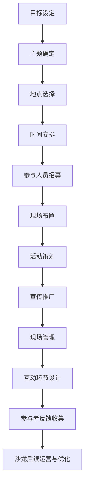

                 

# 如何打造个人知识付费线下沙龙

## 关键词

- 知识付费
- 线下沙龙
- 活动策划
- 宣传推广
- 互动环节
- 品牌建设

## 摘要

本文旨在探讨如何打造个人知识付费线下沙龙。通过详细的分析和实例，本文将介绍沙龙策划基础、沙龙主题与内容设计、沙龙场地与设备安排、沙龙执行与运营以及知识付费沙龙案例研究等方面，旨在为读者提供一套系统化、可操作的策划与执行策略。无论您是沙龙组织者还是参与者，本文都希望能为您带来有价值的参考和启示。

---

## 第一部分：沙龙策划基础

### 第1章：沙龙策划概述

#### 1.1 沙龙的定义与类型

沙龙，源自法语，原意为“客厅聚会”。在现代，沙龙通常指的是一种以知识分享、互动讨论、主题演讲为主题的社交活动。沙龙的类型多种多样，主要包括以下几种：

- **知识分享沙龙**：以专家分享专业知识和经验为主，内容涵盖行业动态、技术趋势等。
- **互动讨论沙龙**：鼓励参与者之间的交流和互动，通过开放性问题引发深入的讨论。
- **主题演讲沙龙**：邀请行业内的知名专家或意见领袖进行主题演讲，分享独到见解和成功经验。

#### 1.2 沙龙的目的与意义

沙龙的目的和意义主要体现在以下几个方面：

- **提升知识水平**：通过专业的分享和讨论，使参与者能够及时了解行业动态和前沿技术，提升自身知识水平。
- **扩大人脉**：沙龙提供了一个交流的平台，参与者可以在活动中结识志同道合的朋友，扩展人脉圈。
- **促进个人品牌建设**：通过举办沙龙，个人可以展示专业能力和影响力，从而提升个人品牌。

#### 1.3 沙龙策划的流程

沙龙策划需要经过以下几个关键环节：

- **目标设定**：明确沙龙的主题、受众群体和预期效果，确保活动目标的清晰和可执行性。
- **主题确定**：根据目标受众的需求和兴趣，选择具有吸引力的主题。
- **地点选择**：选择合适的场地，确保场地的容纳能力和设施满足活动需求。
- **时间安排**：合理安排活动时间，确保参与者能够积极参与。
- **参与人员招募**：通过多种渠道招募参与者，确保沙龙的人气和活跃度。
- **现场布置**：根据活动主题和场地特点，进行合理的现场布置。
- **活动策划**：制定详细的活动流程，包括内容安排、互动环节、讲师安排等。

### 第2章：沙龙主题与内容设计

#### 2.1 主题确定策略

沙龙主题的确定是策划过程中的关键环节，需要考虑以下因素：

- **趋势分析**：分析当前行业的热点话题和发展趋势，选择具有前瞻性的主题。
- **受众需求**：了解目标受众的需求和兴趣，选择他们关注和感兴趣的主题。
- **个人专长**：根据自身的专业领域和专长，选择能够展现个人优势的主题。

#### 2.2 内容策划

沙龙内容的设计需要充分考虑参与者的需求和学习效果，具体包括以下几个方面：

- **知识分享**：通过讲解式内容，系统地传授专业知识和经验，帮助参与者提升技能。
- **互动讨论**：设计开放性问题，鼓励参与者之间的互动和讨论，激发思维的碰撞。
- **主题演讲**：邀请行业内的专家或意见领袖，进行主题演讲，分享他们的见解和成功经验。

#### 2.3 讲师选择与培养

讲师是沙龙的核心资源，选择合适的讲师对沙龙的成功至关重要。以下是讲师选择和培养的几个要点：

- **优秀讲师标准**：讲师应具备深厚的专业知识、丰富的实践经验、良好的沟通能力和演讲技巧。
- **讲师招募**：通过社交媒体、专业论坛、行业活动等渠道，招募具备上述条件的讲师。
- **讲师培训**：为讲师提供培训，提升他们的演讲技巧、内容组织和互动能力。

### 第3章：沙龙场地与设备安排

#### 3.1 场地选择

选择合适的场地是沙龙策划的重要环节，需要考虑以下几个因素：

- **容量**：根据参与人数预估，选择容纳能力合适的场地。
- **布局**：根据活动内容和参与者的需求，设计合理的座位布局，确保参与者的舒适度。
- **设施**：确保场地具备必要的设施，如音响设备、投影仪、Wi-Fi等。

#### 3.2 设备准备

为确保沙龙的顺利进行，需要准备以下设备：

- **音响设备**：高质量的音响设备，保证演讲和互动环节的声音效果。
- **视频设备**：投影仪或大屏幕，用于展示PPT和视频资料。
- **网络设备**：稳定的Wi-Fi网络，确保参与者能够实时参与互动和交流。
- **其他设备**：如白板、记号笔、椅子等，满足活动的需求。

#### 3.3 场地布置

场地布置需要考虑以下几个方面：

- **布局设计**：根据活动内容和参与者的需求，设计合理的座位布局，确保参与者的舒适度。
- **灯光布置**：合理布置灯光，营造舒适的氛围，同时确保演讲者的视线不受干扰。
- **空间利用**：充分利用场地空间，合理设置签到台、展示区、休息区等功能区域。

---

以上是沙龙策划基础部分的内容，接下来我们将深入探讨沙龙的执行与运营，以及如何通过案例研究来总结经验。敬请期待。

---

## 第二部分：沙龙执行与运营

### 第4章：沙龙宣传与推广

#### 4.1 宣传策略

沙龙的宣传策略是确保活动成功的关键环节，以下是一些有效的宣传策略：

- **社交媒体**：利用微博、微信公众号、抖音等社交媒体平台，发布沙龙的相关信息，吸引潜在参与者的关注。
- **电子邮件**：向目标受众发送电子邮件，详细介绍沙龙的主题、时间、地点和讲师等信息，增加参与者的参与意愿。
- **合作伙伴推广**：与相关机构、行业协会、媒体等建立合作关系，共同推广沙龙活动。

#### 4.2 推广渠道

沙龙的推广渠道主要包括线上渠道和线下渠道：

- **线上渠道**：包括官方网站、微信公众号、微信群、专业论坛等，通过这些渠道发布沙龙的相关信息，吸引参与者。
- **线下渠道**：包括海报、名片、合作伙伴等，通过在公共场所、合作伙伴的办公地点等地方张贴海报、分发名片，提高沙龙的知名度。

#### 4.3 参与者招募

参与者招募是沙龙成功的关键，以下是一些参与者招募的方法：

- **报名方式**：通过线上和线下渠道发布报名信息，设置简单的报名流程，方便参与者报名。
- **报名审核**：对报名参与者进行审核，确保参与者的质量和活动氛围。
- **活动预热**：在活动前通过社交媒体、电子邮件等方式进行预热，提高参与者的参与度和活动期待值。

### 第5章：沙龙现场管理与互动

#### 5.1 现场管理

沙龙现场管理是确保活动顺利进行的重要环节，以下是一些现场管理的要点：

- **参与者签到**：在活动开始前，设置签到台，让参与者签到，确保活动秩序。
- **活动流程控制**：按照活动策划的流程，合理安排各个环节，确保活动顺利进行。
- **紧急情况应对**：提前准备应急预案，确保在遇到紧急情况时能够及时处理。

#### 5.2 互动环节设计

互动环节的设计是提升沙龙效果的重要手段，以下是一些互动环节的设计方法：

- **问答环节**：在演讲结束后，设置问答环节，鼓励参与者提问，讲师进行解答，增加参与者的参与感。
- **圆桌讨论**：邀请几位行业专家或资深人士，围绕某个主题进行讨论，激发思想的碰撞。
- **互动游戏**：设计一些简单的互动游戏，如抽奖、问答等，增加活动的趣味性和参与度。

#### 5.3 参与者反馈收集

参与者反馈是评估沙龙效果和改进活动的重要依据，以下是一些参与者反馈收集的方法：

- **调查问卷**：在活动结束后，通过在线调查问卷或纸质问卷，收集参与者的反馈意见。
- **口头反馈**：在活动现场，通过口头询问或现场访谈，了解参与者的意见和建议。
- **后续跟进**：在活动结束后，通过电话或电子邮件，与参与者进行后续沟通，了解他们的体验和反馈。

### 第6章：沙龙后续运营与优化

#### 6.1 参与者关系维护

参与者关系维护是沙龙长期发展的基础，以下是一些参与者关系维护的方法：

- **社群运营**：建立沙龙的微信群、QQ群等社群，定期组织线上活动，增强参与者的归属感。
- **后续活动通知**：及时向参与者发布后续活动的信息，吸引他们继续参与。
- **个人品牌推广**：通过沙龙活动，帮助参与者提升个人品牌，增强他们的专业影响力。

#### 6.2 数据分析与优化

数据分析是沙龙优化的重要手段，以下是一些数据分析的方法：

- **参与者数据分析**：通过分析参与者的背景、需求、反馈等信息，了解他们的需求和满意度。
- **活动效果评估**：通过分析参与者的反馈和活动数据，评估活动的效果，找出优化的方向。
- **活动内容与形式优化**：根据数据分析的结果，对活动的内容和形式进行调整，提升活动效果。

#### 6.3 沙龙品牌建设

沙龙品牌建设是沙龙长期发展的关键，以下是一些沙龙品牌建设的方法：

- **品牌定位**：明确沙龙的品牌定位，确定沙龙的核心价值和独特卖点。
- **品牌宣传**：通过多种渠道进行品牌宣传，提高沙龙的知名度。
- **品牌形象维护**：通过良好的活动质量和参与者体验，维护沙龙的品牌形象。

---

通过以上章节的探讨，我们详细了解了沙龙的策划、执行和运营方法。接下来，我们将通过具体的案例研究，进一步总结和提炼经验，为沙龙的成功提供更有力的支持。敬请期待。

---

## 第三部分：知识付费沙龙案例研究

### 第7章：知识付费沙龙案例介绍

在本章节中，我们将介绍三个不同类型的知识付费沙龙案例，分别是个人成长沙龙、行业沙龙和教育培训沙龙，通过分析这些案例的背景、内容和效果，提炼出成功的关键因素和遇到的问题及解决方法。

#### 7.1 案例一：个人成长沙龙

**活动背景**：
个人成长沙龙是由一位资深职业规划师举办的，旨在帮助职场人士提升职业素养和个人能力。

**活动内容**：
活动内容包括职业规划讲解、职业素养提升技巧、成功人士经验分享等。通过专家的讲解和互动环节，参与者可以了解如何制定个人职业规划，提升自我管理能力，以及如何在职场中获得成功。

**活动效果**：
活动得到了参与者的高度评价，多数人表示通过活动收获了实用的职业规划知识和技巧，提高了职业素养。活动结束后，参与者之间建立了紧密的联系，形成了一个学习交流的社群。

**成功要素**：
- **明确的目标**：活动目标清晰，旨在提升参与者的职业素养和个人能力。
- **专业的讲师**：邀请具备丰富经验和专业知识的讲师，提升了活动质量。
- **互动环节**：设计有趣的互动环节，增加了参与者的参与感和学习效果。

**遇到的问题与解决方法**：
- **问题**：初期参与人数较少，活动氛围不够活跃。
- **解决方法**：通过增加宣传力度，扩大活动影响力，并在社群中积极互动，提升参与者的积极性。

#### 7.2 案例二：行业沙龙

**活动背景**：
行业沙龙是由一位资深技术专家举办的，旨在分享最新的行业动态和技术趋势。

**活动内容**：
活动内容包括行业趋势分析、技术讲解、案例分享、圆桌讨论等。通过专家的深入讲解和案例分享，参与者可以了解行业的发展方向和前沿技术，为自己的职业发展提供参考。

**活动效果**：
活动吸引了大量行业内的专业人士参与，现场讨论热烈，参与者对活动内容表示满意，认为活动内容具有很高的实用性和前瞻性。

**成功要素**：
- **丰富的内容**：活动内容丰富，涵盖了行业趋势、技术讲解和案例分析，满足了不同层次参与者的需求。
- **优质的讲师**：讲师具备丰富的行业经验和专业知识，提升了活动的专业度。
- **互动环节**：设计互动环节，鼓励参与者提问和讨论，增加了活动的互动性和参与感。

**遇到的问题与解决方法**：
- **问题**：活动时间安排不合理，部分参与者因时间冲突无法全程参与。
- **解决方法**：调整活动时间，确保参与者能够合理安排时间，并提前通知参与者活动日程，以便他们做出相应的安排。

#### 7.3 案例三：教育培训沙龙

**活动背景**：
教育培训沙龙是由一位教育行业专家举办的，旨在帮助教育从业者提升教学技能和职业素养。

**活动内容**：
活动内容包括教学技巧分享、教育案例分析、教育政策解读、互动讨论等。通过专家的讲解和互动环节，参与者可以了解最新的教育理念、教学方法和政策，提升自己的教学能力。

**活动效果**：
活动得到了教育从业者的高度评价，许多参与者表示活动内容具有很强的针对性和实用性，对自己的教学工作有很大帮助。

**成功要素**：
- **针对性的内容**：活动内容针对教育从业者的实际需求，满足了他们的学习需求。
- **专业的讲师**：讲师具备丰富的教学经验和专业知识，提升了活动质量。
- **互动环节**：设计互动环节，鼓励参与者提问和讨论，增加了活动的互动性和参与感。

**遇到的问题与解决方法**：
- **问题**：部分参与者对活动内容不太了解，参与度不高。
- **解决方法**：通过增加活动预热，提前发布活动预告和详细信息，让参与者提前了解活动内容，提高他们的参与度。

---

以上三个案例展示了不同类型的知识付费沙龙如何策划和执行，以及成功的关键因素和遇到的问题及解决方法。通过这些案例的研究，我们可以总结出一系列实用的策划和运营经验，为未来的沙龙活动提供参考和指导。

### 第8章：案例分析与总结

通过对上述三个案例的分析，我们可以提炼出一些关键的成功要素和运营策略，以下是对这些要素的总结：

#### 成功要素

1. **明确的目标**：无论是个人成长、行业沙龙还是教育培训沙龙，明确的活动目标是确保沙龙成功的关键。只有明确了目标，才能在策划和执行过程中有的放矢。

2. **专业的讲师**：讲师的专业度和知名度是沙龙成功的重要保障。选择具备丰富经验和专业知识的讲师，可以提升沙龙的质量和吸引力。

3. **丰富的内容**：活动内容要丰富且具有针对性，满足不同层次参与者的需求。通过多样化的内容设计，提高参与者的学习效果和满意度。

4. **互动环节**：设计互动环节，增加参与者的参与感和学习效果。互动环节可以是问答、圆桌讨论、互动游戏等，通过这些形式，激发参与者的思维，提升活动的效果。

5. **有效的宣传和推广**：通过多种渠道进行宣传和推广，提高沙龙的知名度和参与度。社交媒体、电子邮件、合作伙伴等都是有效的推广渠道。

6. **良好的现场管理**：确保活动现场的秩序和顺利进行。现场管理包括签到、流程控制、紧急情况应对等，这些都是确保沙龙成功的重要因素。

#### 运营策略

1. **提前策划和准备**：在活动前，要提前进行详细的策划和准备，包括主题确定、讲师选择、内容设计、场地安排等。确保每个环节都经过深思熟虑，减少活动中的不确定性。

2. **互动和反馈**：在活动中，要注重与参与者的互动和反馈。通过互动环节和问卷调查，了解参与者的需求和满意度，及时调整活动内容和服务。

3. **后续跟进**：活动结束后，要积极进行后续跟进，包括收集参与者反馈、发送感谢信、发布活动回顾等。通过这些措施，维护与参与者的关系，提高沙龙的品牌影响力。

4. **持续优化**：根据每次活动的反馈和效果，不断优化沙龙的内容和形式。通过持续改进，提升沙龙的质量和参与者的满意度。

通过以上分析和总结，我们可以看到，成功打造个人知识付费线下沙龙需要明确的目标、专业的讲师、丰富的内容、互动环节、有效的宣传和推广、良好的现场管理以及后续跟进和持续优化。这些成功要素和运营策略为沙龙的策划和执行提供了有力的指导，帮助沙龙实现长期的发展和成功。

---

在本章节中，我们通过对实际案例的深入分析和总结，为知识付费沙龙的策划和执行提供了实用的经验和策略。希望这些经验能对您的沙龙活动提供有益的启示和帮助。

---

## 附录

### 附录 A：常用工具与资源

在沙龙策划和执行过程中，使用一些工具和资源可以大大提高效率和质量。以下是一些常用的工具和资源：

- **宣传工具**：微信、微博、抖音、电子邮件等。
- **活动策划工具**：金数据、问卷星、百度脑图等。
- **数据分析工具**：Excel、Python等。

### 附录 B：知识付费沙龙活动策划模板

为了帮助读者更好地策划知识付费沙龙活动，以下是知识付费沙龙活动策划的模板，包括活动策划流程图、活动内容模板和参与者招募模板。

#### 活动策划流程图

#### 活动内容模板

1. **开场致辞**
2. **主题演讲**
3. **互动环节**
   - **问答环节**
   - **圆桌讨论**
   - **互动游戏**
4. **茶歇时间**
5. **案例分析**
6. **总结发言**

#### 参与者招募模板

1. **报名渠道**：官方网站、微信公众号、微信群等。
2. **报名流程**：填写报名表、提交报名信息、审核通过、发送报名确认邮件。
3. **报名条件**：符合活动主题、有一定专业知识背景、积极参与互动。

---

通过以上附录，我们希望能够为您的知识付费沙龙活动策划提供一些实用的工具和模板，帮助您更高效地开展沙龙活动。

---

## 作者信息

作者：AI天才研究院/AI Genius Institute & 禅与计算机程序设计艺术 /Zen And The Art of Computer Programming

在本文中，我们详细探讨了如何打造个人知识付费线下沙龙。从沙龙策划基础到沙龙执行与运营，再到知识付费沙龙案例研究，我们通过一步一步的分析推理，提供了系统化、可操作的策划与执行策略。希望本文能为您的沙龙活动提供有益的参考和启示。如果您有任何问题或建议，欢迎随时与我们交流。

---

感谢您的阅读，祝您在知识付费沙龙的策划与执行中取得成功！如果您觉得本文对您有帮助，请不要忘记点赞和分享。我们期待与您在未来的沙龙活动中相见！再次感谢您的支持！作者：AI天才研究院/AI Genius Institute & 禅与计算机程序设计艺术 /Zen And The Art of Computer Programming。

