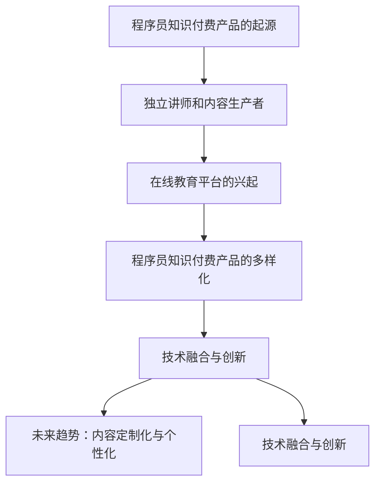
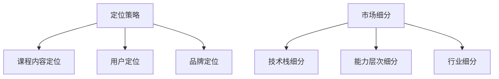
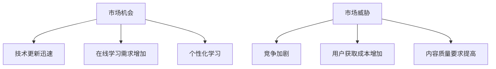
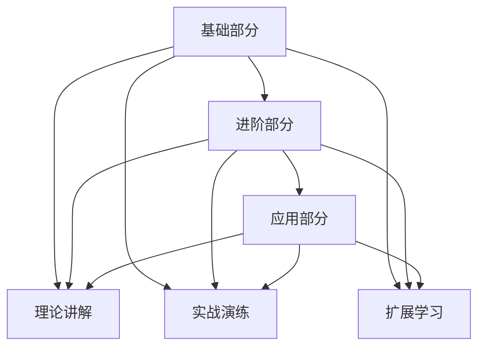
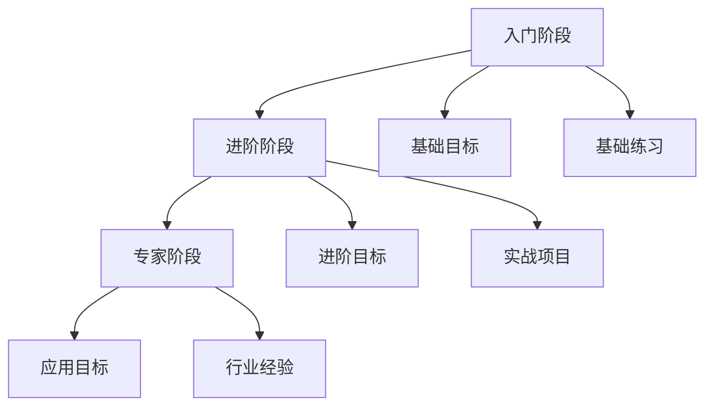
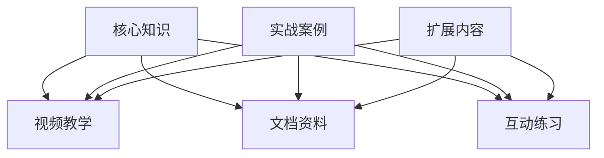
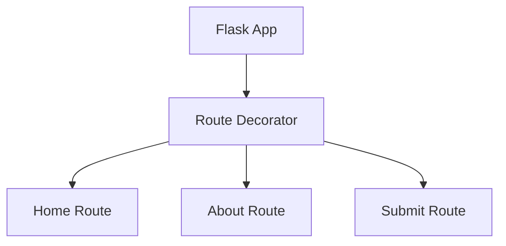

                 

## 文章标题

### 《如何打造高成交量的程序员知识付费产品》

> 关键词：程序员知识付费、市场分析、课程内容策划、营销策略、用户体验

摘要：本文将深入探讨如何打造高成交量的程序员知识付费产品。通过详细的市场分析、课程内容策划、营销策略和用户体验优化，结合成功案例和实战技巧，为开发者提供一套完整的策略指南。

## 《如何打造高成交量的程序员知识付费产品》目录大纲

### 第一部分：市场分析与定位

#### 第1章：程序员知识付费产品市场概述

- **1.1 程序员知识付费产品的发展历程**
- **1.2 程序员知识付费市场的现状与趋势**
- **1.3 程序员知识付费产品的重要性**

#### 第2章：目标受众分析

- **2.1 程序员画像与需求分析**
- **2.2 受众痛点和需求挖掘**
- **2.3 定位策略与市场细分**

#### 第3章：竞争分析

- **3.1 竞争对手分析**
- **3.2 竞争优势与劣势分析**
- **3.3 市场机会与威胁分析**

### 第二部分：内容策划与制作

#### 第4章：课程内容策划

- **4.1 课程内容结构设计**
- **4.2 课程目标与学习路径设计**
- **4.3 课程内容与形式选择**

#### 第5章：讲师选择与培养

- **5.1 讲师筛选标准**
- **5.2 讲师培养策略**
- **5.3 讲师管理与激励**

#### 第6章：课程制作与质量保障

- **6.1 课程制作流程**
- **6.2 录制与剪辑技巧**
- **6.3 课程质量评估与改进**

### 第三部分：营销推广与运营

#### 第7章：营销策略与推广

- **7.1 营销目标设定**
- **7.2 营销渠道选择**
- **7.3 营销活动策划与执行**

#### 第8章：用户运营与互动

- **8.1 用户运营策略**
- **8.2 用户互动与参与**
- **8.3 用户反馈收集与处理**

#### 第9章：数据分析与优化

- **9.1 数据分析指标设定**
- **9.2 数据收集与处理**
- **9.3 数据分析与优化策略**

### 第四部分：案例研究与实践

#### 第10章：成功案例分析

- **10.1 案例介绍**
- **10.2 案例特点分析**
- **10.3 案例经验总结**

#### 第11章：实战技巧与策略

- **11.1 实战技巧分享**
- **11.2 运营策略探讨**
- **11.3 课程开发经验总结**

### 第五部分：未来展望与趋势

#### 第12章：行业趋势与机遇

- **12.1 行业趋势分析**
- **12.2 发展机遇探讨**
- **12.3 未来发展方向预测**

#### 第13章：总结与展望

- **13.1 成功经验总结**
- **13.2 存在问题与挑战**
- **13.3 未来发展建议**

### 附录

#### 附录 A：程序员知识付费产品开发工具与资源

- **A.1 开发工具介绍**
- **A.2 学习资源推荐**
- **A.3 行业报告与资讯**

#### 附录 B：课程开发与运营案例

- **B.1 成功案例分享**
- **B.2 案例分析与解读**
- **B.3 案例借鉴与启示**

### 第1章：程序员知识付费产品市场概述

#### 1.1 程序员知识付费产品的发展历程

**程序员知识付费产品的起源**

程序员知识付费产品的起源可以追溯到互联网的兴起。早期的程序员主要通过书籍、杂志和研讨会等形式获取知识和技能。随着互联网的发展，在线教育平台逐渐崭露头角，为程序员提供了更多的学习途径。

**程序员知识付费产品的发展阶段**

1. **初期**：独立讲师和内容生产者主导，通过个人博客、YouTube频道等渠道发布教程和视频。
2. **中期**：在线教育平台兴起，如Udemy、Coursera等，这些平台提供了系统化的课程和丰富的学习资源，吸引了大量程序员用户。
3. **现阶段**：程序员知识付费产品逐渐多样化，不仅包括视频教程和文档资料，还涵盖了互动式学习、直播授课等多种形式。同时，AI、VR等新技术也开始应用于知识付费领域。

**发展趋势**

1. **内容定制化与个性化**：随着用户需求的多样化，内容定制化和个性化将成为重要趋势。平台将根据用户的历史行为和偏好，提供个性化的学习推荐。
2. **技术融合与创新**：AI、VR等新技术的应用，将带来更加丰富和互动的学习体验。例如，通过AI技术，可以提供智能辅导和个性化学习路径；VR技术则可以实现沉浸式的学习体验。

### 1.2 程序员知识付费市场的现状与趋势

**市场规模与用户增长**

程序员知识付费市场的规模逐年扩大，根据市场研究报告，全球在线教育市场规模预计将在未来几年内达到数千亿美元。程序员作为互联网行业的主要劳动力，对知识付费的需求持续增长，推动了市场的快速发展。

**市场细分**

1. **技术栈方向细分**：程序员知识付费市场根据技术栈方向进行细分，包括前端开发、后端开发、移动开发、数据科学、人工智能等。不同技术领域的课程内容和技术难度有所不同，满足不同层次程序员的学习需求。
2. **能力层次细分**：市场根据程序员的技能水平进行细分，包括入门级、进阶级、高级专家级等。针对不同水平的程序员，提供相应的学习资源和课程体系。
3. **行业细分**：程序员知识付费市场也根据不同行业的需求进行细分，如互联网、金融、医疗等。不同行业对技术的要求和知识需求存在差异，因此课程内容也应有所区分。

**竞争态势**

程序员知识付费市场的竞争态势日益激烈，主要平台纷纷通过内容优化、用户体验提升和营销策略创新来争夺市场份额。以下是一些主要的竞争对手：

1. **Udemy**：国际知名在线学习平台，提供丰富的课程内容，覆盖全球用户。其课程种类繁多，包括编程、数据科学、人工智能等多个领域。
2. **Coursera**：与知名大学和机构合作，提供高质量的课程，特别是在计算机科学、数据科学等领域具有很高的声誉。
3. **Pluralsight**：专注于IT和软件开发领域，强调课程的专业性和实战性。其课程内容更新迅速，覆盖最新的技术趋势。

**用户需求变化**

随着技术的快速发展，程序员对知识付费的需求也在不断变化。以下是一些主要的变化趋势：

1. **对深度专业知识和实战经验的追求**：程序员更倾向于获取深度专业的知识和实战经验，以便在职业生涯中不断提升自己的竞争力。
2. **对学习方式灵活性的要求**：随着工作压力的增加，程序员希望学习方式更加灵活，能够随时随地进行学习。在线教育平台提供了这种便利性，满足了程序员的需求。

### 1.3 程序员知识付费产品的重要性

**对程序员的职业发展**

程序员知识付费产品对程序员的职业发展具有重要作用。通过付费产品，程序员可以：

1. **提升技术水平**：获取最新的技术知识和技能，跟上行业的发展趋势。
2. **拓宽职业发展路径**：学习新技能，拓宽职业发展路径，增加就业机会。
3. **提升职业竞争力**：通过不断学习和提升，增强在职场中的竞争力。

**对企业和行业**

程序员知识付费产品对企业和行业也有着积极的影响：

1. **促进技术传承与创新**：通过付费产品，程序员可以学习到最新的技术和实践经验，促进技术传承和创新。
2. **提升企业人才储备与竞争力**：企业可以通过付费产品培养和储备人才，提升企业的整体技术实力和市场竞争力。

**对教育机构与平台**

程序员知识付费产品也为教育机构和平台提供了新的收入来源：

1. **新的收入来源**：通过提供付费课程，教育机构和平台可以获得额外的收入。
2. **促进教育资源共享与优化**：付费产品使得优质教育资源得以共享，同时也促使教育机构和平台不断优化课程内容和教学质量。

### Mermaid 流程图：程序员知识付费产品发展历程



### 第2章：目标受众分析

#### 2.1 程序员画像与需求分析

**程序员画像**

程序员的画像可以从以下几个方面进行描述：

1. **年龄分布**：程序员主要集中在20-45岁之间，其中以80后和90后为主。
2. **性别分布**：男性占多数，女性相对较少。
3. **教育背景**：以本科及以上为主，硕士和博士比例逐渐增加。
4. **行业分布**：主要集中在互联网、IT、金融、电信等行业，特别是技术驱动型公司。

**需求分析**

程序员的付费学习需求可以从以下几个方面进行分析：

1. **技术需求**：
   - **基础知识**：对于刚入门的程序员，基础知识的掌握是他们最迫切的需求，例如编程语言、数据结构与算法等。
   - **专业领域**：随着技术的不断发展，程序员对专业领域的深入学习需求增加，如前端开发、后端开发、移动开发、数据科学、人工智能等。
   - **实战经验**：程序员希望通过实战案例和项目实践，提升实际解决问题的能力。

2. **职业发展需求**：
   - **技能提升**：程序员希望通过学习新技能，提升自己在职场中的竞争力，如项目管理、团队协作、沟通技巧等。
   - **职业规划**：程序员希望获得职业规划指导，了解自己的职业发展方向和晋升路径。
   - **求职与面试指导**：求职和面试技巧是程序员在职业发展中需要关注的重点。

3. **学习方式需求**：
   - **自主性**：程序员希望能够自主安排学习时间，灵活选择学习内容。
   - **互动性**：程序员希望在学习的各个环节中能够与其他程序员互动，如问答社区、讨论组等。
   - **实用性**：程序员希望学习的内容能够直接应用于实际工作和项目中。

#### 2.2 受众痛点和需求挖掘

**痛点分析**

程序员在学习过程中可能会遇到以下痛点：

1. **技术更新迅速**：程序员需要不断学习新知识，但技术更新速度很快，难以跟上行业最新发展。
2. **学习资源繁多**：互联网上充斥着大量的学习资源，但质量参差不齐，难以筛选出高质量的内容。
3. **学习方式单一**：传统学习方式如看书、上课等，难以适应现代程序员的工作和生活节奏。
4. **学习效果不明显**：缺乏实际应用场景和项目实践，学习效果难以评估。

**需求挖掘**

针对程序员的痛点，以下需求可以被挖掘出来：

1. **高质量课程内容**：程序员需要获取高质量、系统化、实战性强的课程内容。
2. **个性化学习方案**：根据程序员的个人需求和兴趣，提供个性化的学习方案。
3. **实时互动与答疑**：提供实时互动和答疑平台，帮助程序员解决学习中的问题。
4. **学习效果跟踪**：通过学习进度、作业提交、项目实践等方式，跟踪学习效果。

#### 2.3 定位策略与市场细分

**定位策略**

1. **课程内容定位**：专注于提供高质量、实战性强的编程课程，满足程序员的学习需求。
2. **用户定位**：主要针对有明确学习目标和职业发展需求的程序员，特别是技术栈方向明确、有一定编程基础的程序员。
3. **品牌定位**：打造专业、权威的编程知识付费品牌，树立良好的口碑和用户信任。

**市场细分**

1. **技术栈细分**：
   - **前端开发**：提供HTML、CSS、JavaScript、React、Vue等前端技术课程。
   - **后端开发**：提供Java、Python、Node.js、Spring Boot等后端技术课程。
   - **移动开发**：提供Android、iOS等移动开发课程。
   - **数据科学**：提供数据结构、算法、机器学习、数据分析等数据科学课程。
   - **人工智能**：提供深度学习、自然语言处理、计算机视觉等人工智能课程。

2. **能力层次细分**：
   - **入门级**：针对初学者，提供基础编程语言和常用数据结构算法课程。
   - **进阶级**：针对有一定编程基础的用户，提供高级编程语言、框架、中间件等课程。
   - **高级专家级**：针对有丰富经验的程序员，提供前沿技术、架构设计、项目管理等课程。

3. **行业细分**：
   - **互联网行业**：针对互联网公司程序员的需求，提供互联网技术、产品设计等课程。
   - **金融行业**：针对金融行业程序员的需求，提供金融数据处理、量化交易等课程。
   - **电信行业**：针对电信行业程序员的需求，提供通信协议、网络安全等课程。

### Mermaid 流程图：市场定位与细分



### 第3章：竞争分析

#### 3.1 竞争对手分析

在程序员知识付费产品市场中，存在许多强大的竞争对手，它们在课程内容、用户基础、品牌影响力等方面具有不同的优势。以下是对几个主要竞争对手的分析：

**Udemy**

- **课程内容**：Udemy是一个国际知名的在线教育平台，提供包括编程、数据科学、人工智能等在内的多种课程，课程种类繁多，覆盖面广。
- **用户基础**：Udemy拥有庞大的用户基础，全球范围内的程序员都可以在平台上找到自己需要的课程。
- **品牌影响力**：作为在线教育行业的领军企业，Udemy的品牌影响力广泛，用户对其课程质量和学习体验有较高的认可度。

**Coursera**

- **课程内容**：Coursera与多家知名大学和机构合作，提供高质量的课程，特别是在计算机科学、数据科学等领域具有很高的声誉。
- **用户基础**：Coursera的用户主要集中在高等教育和职业发展领域，许多程序员选择在Coursera上学习专业课程。
- **品牌影响力**：Coursera作为与知名大学合作的在线教育平台，其品牌影响力在学术和专业领域非常强大。

**Pluralsight**

- **课程内容**：Pluralsight专注于IT和软件开发领域，提供大量的技术课程，覆盖最新的技术趋势和实战经验。
- **用户基础**：Pluralsight的用户群体主要是IT从业者和程序员，他们对于技术知识的更新和实战技能的提升有着较高的需求。
- **品牌影响力**：Pluralsight以其专业性和高质量的课程内容在程序员群体中建立了良好的口碑。

**Lambda School**

- **课程内容**：Lambda School提供在线编程课程，特别强调实战项目和实践经验，课程内容设计注重职业发展。
- **用户基础**：Lambda School的用户主要是在寻找职业发展和技能提升的程序员，他们对实战项目和就业指导有较高的需求。
- **品牌影响力**：Lambda School以其创新的职业教育模式和灵活的学习方式在程序员群体中受到了关注。

**edX**

- **课程内容**：edX是一个开放在线课程平台，提供由全球知名大学和机构提供的免费和付费课程，包括计算机科学、人工智能、数据科学等领域。
- **用户基础**：edX的用户群体广泛，包括学生、教育工作者和专业人员，程序员作为技术群体是其重要用户之一。
- **品牌影响力**：edX作为哈佛大学和麻省理工学院等知名机构合作的平台，其学术背景和品牌影响力在程序员中具有一定的吸引力。

**Skillshare**

- **课程内容**：Skillshare提供创意和技术类课程，包括编程、设计、摄影等，课程内容更加注重创意和实践。
- **用户基础**：Skillshare的用户主要是创意工作者和程序员，他们希望通过学习提升自己的技能和创造力。
- **品牌影响力**：Skillshare以其友好、多样化的学习环境和互动性强的课程内容在创意和技术领域建立了良好的品牌形象。

#### 3.2 竞争优势与劣势分析

**竞争优势**

1. **课程质量**：优秀的课程内容和讲师资源是程序员知识付费产品的核心竞争力。高质量的课程内容能够吸引学员，提高用户满意度和忠诚度。
2. **用户基础**：庞大的用户基础可以带来更多的课程销量和良好的口碑传播，有助于平台的市场推广和品牌建设。
3. **品牌影响力**：强大的品牌影响力能够增强用户信任，提高课程的竞争力，有助于吸引更多优秀讲师和用户。
4. **个性化服务**：提供个性化的学习推荐和定制化服务，满足不同用户的个性化需求，提升用户满意度和粘性。

**劣势**

1. **内容同质化**：市场上存在大量相似的课程，内容同质化现象严重，难以突出差异化。
2. **用户体验**：大平台在用户体验方面可能不如专业小平台，用户互动和反馈机制可能不够完善。
3. **成本压力**：持续投入大量资源进行课程开发和平台维护，可能会面临成本压力，影响盈利能力。

#### 3.3 市场机会与威胁分析

**市场机会**

1. **技术更新迅速**：随着技术的不断更新，程序员对知识付费的需求持续增长，提供了广阔的市场空间。
2. **在线学习需求增加**：随着互联网的普及，程序员对在线学习的需求不断增加，为知识付费产品提供了机会。
3. **个性化学习**：用户对个性化、定制化学习内容的追求，为提供针对性课程的平台带来了市场机会。

**市场威胁**

1. **竞争加剧**：新兴平台不断涌现，市场竞争加剧，需要不断创新和优化以保持竞争力。
2. **用户获取成本增加**：随着市场竞争的加剧，获取新用户成本逐渐增加，影响平台的盈利能力。
3. **内容质量要求提高**：用户对课程质量的要求越来越高，平台需要不断提升内容质量和用户体验，以应对市场压力。

### Mermaid 流程图：市场机会与威胁分析



### 第4章：课程内容策划

#### 4.1 课程内容结构设计

课程内容结构设计是课程策划的重要环节，它决定了课程的整体框架和学习路径。一个良好的课程内容结构能够帮助学员系统地掌握知识，提高学习效果。

**课程框架**

1. **基础部分**：介绍基础知识，帮助学员打好基础。这部分内容通常包括编程语言基础、数据结构与算法、数据库等。
2. **进阶部分**：深入讲解高级技术和实战经验。这部分内容通常涵盖框架、工具、最佳实践等，使学员能够将知识应用于实际项目中。
3. **应用部分**：提供具体的应用场景和项目案例，让学员能够通过实际操作掌握所学知识。这部分内容通常包括项目实战、案例分析等。

**内容模块**

1. **理论讲解**：通过视频和文档形式，介绍核心概念和原理，帮助学员理解基础知识。
2. **实战演练**：提供代码示例、项目案例，让学员动手实践，巩固所学知识。
3. **扩展学习**：推荐阅读材料、相关课程和资源，帮助学员深入学习和拓宽视野。

**课程内容结构示例**



#### 4.2 课程目标与学习路径设计

课程目标是指课程希望学员达到的学习效果和能力，它是课程设计的核心。学习路径则是学员从入门到精通的完整学习过程。

**课程目标**

1. **基础目标**：掌握基础知识和技能，例如了解编程语言的基本语法和常用数据结构。
2. **进阶目标**：提升实战能力和技术水平，例如掌握高级编程语言和框架，能够独立完成中小型项目。
3. **应用目标**：能够将所学知识应用于实际工作中，解决实际问题，提高职业竞争力。

**学习路径**

1. **入门阶段**：介绍基本概念，提供基础练习，帮助学员建立基础知识和编程思维。
2. **进阶阶段**：深入讲解高级主题，提供实战项目，让学员通过实际操作提升技术水平。
3. **专家阶段**：分享行业经验和最新技术动态，帮助学员保持对行业的关注，提升专业素养。

**学习路径示例**



#### 4.3 课程内容与形式选择

课程内容的选择和形式设计直接影响到学员的学习体验和效果。以下是一些常见的内容形式选择：

**内容选择**

1. **核心知识**：选择行业热门和实用的技术点，例如前端开发的React、后端开发的Node.js等。
2. **实战案例**：提供具体的项目案例，让学员能够通过实际操作掌握所学知识，例如构建一个电商平台或开发一个移动应用。
3. **扩展内容**：推荐阅读材料、相关课程和资源，帮助学员深入学习和拓宽视野，例如推荐相关的书籍、论文和在线课程。

**形式选择**

1. **视频教学**：通过视频形式讲解核心概念和操作步骤，适合学员自主学习和复习，例如教学视频、操作演示等。
2. **文档资料**：提供详细的教程和代码示例，方便学员查阅和参考，例如技术文档、项目指南等。
3. **互动练习**：设置习题和实战项目，检验学员的学习效果，提高学习兴趣和参与度，例如在线练习、项目挑战等。

**课程内容与形式选择示例**



### 第5章：讲师选择与培养

#### 5.1 讲师筛选标准

讲师是程序员知识付费产品的核心资源，讲师的选择直接影响到课程的质量和用户满意度。以下是一些常见的讲师筛选标准：

**专业背景**

1. **行业经验**：讲师应具有丰富的行业经验，了解行业最新动态和技术趋势。
2. **技术能力**：讲师应具备扎实的编程技能和解决问题的能力，能够深入讲解技术细节。
3. **教育背景**：讲师应具备相关教育背景，如计算机科学、软件工程等相关专业的本科或以上学历。

**授课能力**

1. **表达能力**：讲师应具备良好的表达能力，能够清晰、准确地传达知识。
2. **教学经验**：讲师应具有在线教学经验，能够适应在线学习模式，如视频授课、在线答疑等。
3. **互动能力**：讲师应具备良好的互动能力，能够与学员进行有效沟通，解答学员的问题。

**个人品牌**

1. **知名度和影响力**：讲师应有一定的知名度和影响力，有助于课程的推广和品牌建设。
2. **口碑**：讲师在业界的口碑和评价也是选择的重要标准，可以通过查看讲师的公开资料、用户评价等来评估。

#### 5.2 讲师培养策略

讲师的培养是提高课程质量和用户满意度的重要环节。以下是一些常见的讲师培养策略：

**课程设计培训**

1. **课程大纲设计**：帮助讲师掌握课程大纲的设计技巧，确保课程内容的系统性和逻辑性。
2. **课程内容编写**：提供编写课程内容的培训和指导，帮助讲师提升撰写课程文档和编写代码的能力。
3. **教学流程设计**：培训讲师如何设计教学流程，包括教学内容的安排、教学方法的运用等。

**教学技能培训**

1. **授课技巧**：提供授课技巧的培训，如如何进行有效的讲解、如何吸引学员的注意力等。
2. **互动技巧**：培训讲师如何与学员进行有效的互动，包括在线答疑、课堂管理等。
3. **课堂管理**：提供课堂管理的培训，如如何应对课堂突发事件、如何管理学员的学习进度等。

**持续学习支持**

1. **技术更新培训**：定期组织技术更新培训，帮助讲师掌握最新的技术趋势和知识。
2. **行业经验分享**：邀请行业专家进行经验分享，帮助讲师了解行业动态和最佳实践。
3. **教学反馈**：收集学员对讲师的反馈，提供改进建议，帮助讲师不断提升教学水平。

#### 5.3 讲师管理与激励

讲师的管理和激励是保持课程质量和讲师积极性的关键。以下是一些常见的讲师管理和激励策略：

**考核机制**

1. **课程质量评估**：建立课程质量评估机制，包括用户反馈、课程完成率、学习效果等指标。
2. **授课效果评估**：定期评估讲师的授课效果，包括学员评价、课堂参与度等。
3. **讲师排名**：根据评估结果，对讲师进行排名，激励优秀讲师保持高水平的教学。

**激励机制**

1. **奖金激励**：为优秀讲师提供奖金激励，如季度奖金、年度奖金等。
2. **股权激励**：对于有突出贡献的讲师，可以考虑提供股权激励，增强其归属感和积极性。
3. **培训机会**：为讲师提供参加培训和学习的机会，提升其专业能力和教学水平。

**互动平台**

1. **讲师社区**：建立讲师社区，促进讲师之间的交流与合作，分享教学经验和心得。
2. **讲师分享会**：定期举办讲师分享会，让讲师分享教学心得和行业动态。
3. **讲师表彰**：对优秀讲师进行表彰，提高其知名度和影响力。

### 第6章：课程制作与质量保障

#### 6.1 课程制作流程

课程制作是程序员知识付费产品开发的重要环节，一个高效、系统的制作流程能够确保课程的质量和效率。以下是一个典型的课程制作流程：

**需求分析**

1. **课程定位**：明确课程的目标受众、课程主题和内容范围。
2. **学习目标**：设定明确的学习目标，确保课程内容能够帮助学员实现预期学习效果。
3. **课程大纲**：编写详细的课程大纲，包括课程模块、学习路径和知识点。

**内容编写**

1. **课程文档**：编写课程文档，包括教材、笔记、练习题等，确保内容系统、连贯。
2. **案例与项目**：设计案例和项目，帮助学员通过实践掌握课程内容。
3. **参考资料**：整理和推荐相关的参考资料，如书籍、文章、视频等。

**录制与剪辑**

1. **视频录制**：使用专业设备录制视频，保证画面和声音质量。
2. **讲师讲解**：讲师按照课程大纲进行讲解，确保讲解清晰、有条理。
3. **剪辑与优化**：对录制视频进行剪辑和后期处理，包括剪辑、添加字幕、调整音效等。

**资料整理**

1. **文档整理**：将课程文档整理成电子版，方便学员下载和使用。
2. **代码示例**：提供完整的代码示例，帮助学员理解和实践。
3. **学习资源**：推荐相关的学习资源，如书籍、在线课程等。

**课程整合**

1. **课程发布**：将视频、文档、代码示例等整合成完整的课程包。
2. **课程测试**：进行课程测试，确保课程内容完整、逻辑清晰、无错误。
3. **课程优化**：根据测试反馈，对课程进行优化和调整，提高课程质量。

#### 6.2 录制与剪辑技巧

**录制技巧**

1. **环境准备**：选择安静、光线适宜的录制环境，避免干扰和噪声。
2. **设备选择**：使用高质量的摄像头和麦克风，保证画面和声音质量。
3. **讲师准备**：讲师应提前熟悉课程内容和教学大纲，确保讲解流畅。
4. **互动设计**：设计互动环节，如问答、案例分析等，提高学员参与度。

**剪辑技巧**

1. **剪辑工具**：使用专业的剪辑软件，如Adobe Premiere、Final Cut Pro等，进行视频剪辑。
2. **剪辑流程**：根据课程大纲，将视频剪辑成不同的模块，确保逻辑清晰、内容连贯。
3. **字幕添加**：添加中文字幕，方便学员观看和学习。
4. **音效调整**：调整背景音乐和声音效果，提高观看体验。

**后期处理**

1. **特效添加**：添加简单的特效，如转场效果、动画效果等，提高视频的观赏性。
2. **画面调整**：调整画面亮度、对比度等，确保画面清晰、舒适。
3. **音频处理**：去除杂音，调整音量平衡，确保声音清晰、自然。

#### 6.3 课程质量评估与改进

**评估方法**

1. **用户反馈**：收集用户对课程的反馈和评价，了解课程的优势和不足。
2. **学习数据**：分析学习数据，如学习时长、完成率、用户互动等，评估课程效果。
3. **考试与测试**：设置考试和测试，检验学员的学习效果。

**改进措施**

1. **内容优化**：根据用户反馈和学习数据分析，对课程内容进行优化，如调整讲解顺序、增加案例分析等。
2. **教学改进**：提升讲师的教学技能，改进授课方式，如增强互动、提高讲解清晰度等。
3. **技术支持**：提供更好的技术支持，如优化视频播放效果、改进用户界面等。

**持续改进**

1. **定期评估**：定期对课程进行评估，确保课程质量持续提升。
2. **用户参与**：鼓励用户参与课程改进，如收集用户建议、开展用户调研等。
3. **团队协作**：建立跨部门团队，协同工作，确保课程改进措施的有效实施。

### 第7章：营销策略与推广

#### 7.1 营销目标设定

营销目标的设定是制定营销策略的第一步，它为后续的营销活动提供了明确的指导和方向。以下是程序员知识付费产品营销目标设定的一些关键点：

**知名度提升**

1. **目标**：在目标受众中建立品牌认知度，提高课程和平台的曝光率。
2. **指标**：关注搜索引擎排名、社交媒体关注者数量、媒体报道次数等。
3. **策略**：通过高质量的课程内容、优秀的讲师团队和有效的市场推广活动，提高品牌知名度。

**用户增长**

1. **目标**：增加新用户数量，提高用户注册率和活跃度。
2. **指标**：用户注册量、用户活跃度、用户留存率等。
3. **策略**：通过精准的市场定位、有效的推广渠道和个性化的用户服务，吸引潜在用户。

**品牌影响力**

1. **目标**：在行业内建立强大的品牌影响力，树立课程和平台的权威形象。
2. **指标**：用户口碑、行业评价、合作伙伴数量等。
3. **策略**：通过优质的内容创作、专业的讲师团队和积极的公关活动，增强品牌影响力。

#### 7.2 营销渠道选择

选择合适的营销渠道是确保营销效果的关键。以下是程序员知识付费产品常用的营销渠道：

**社交媒体**

1. **目标**：通过社交媒体平台提高品牌知名度和用户互动。
2. **策略**：定期发布高质量内容，如课程介绍、讲师介绍、学习技巧等，与用户进行互动，建立良好的用户关系。

**搜索引擎**

1. **目标**：提高课程和平台在搜索引擎中的排名，吸引潜在用户。
2. **策略**：通过SEO优化、关键词广告和搜索引擎合作伙伴关系，提高搜索引擎排名。

**合作伙伴**

1. **目标**：通过合作伙伴扩大推广渠道，增加用户获取量。
2. **策略**：与行业相关网站、社区和媒体建立合作关系，进行内容合作、广告推广和联合活动。

**线下活动**

1. **目标**：通过线下活动提高品牌知名度和用户参与度。
2. **策略**：举办讲座、研讨会、工作坊等活动，吸引目标受众，增加用户粘性。

#### 7.3 营销活动策划与执行

一个成功的营销活动能够有效地提高课程和平台的知名度，增加用户数量。以下是营销活动策划与执行的关键步骤：

**活动前准备**

1. **目标设定**：明确活动目标，如增加新用户、提升品牌知名度等。
2. **时间规划**：确定活动时间，确保活动能够与目标受众的学习和生活节奏相匹配。
3. **预算分配**：根据活动目标和资源情况，合理分配预算，确保活动的可行性和效果。

**宣传推广**

1. **内容创作**：创作吸引人的宣传内容，如海报、视频、文章等，提高活动的吸引力。
2. **多渠道推广**：通过社交媒体、搜索引擎、合作伙伴等多个渠道进行宣传，扩大活动的影响力。
3. **合作伙伴宣传**：与合作伙伴共同推广，利用其渠道和资源，提高活动的覆盖面。

**活动执行**

1. **活动实施**：按照计划实施活动，确保活动的各个环节顺利进行。
2. **实时监控**：实时监控活动进展，及时解决可能出现的问题，确保活动效果。
3. **用户互动**：与用户进行互动，收集用户反馈，提高用户参与度和满意度。

**活动跟踪**

1. **数据收集**：收集活动数据，如参与人数、转化率、用户反馈等，分析活动效果。
2. **效果评估**：根据数据评估活动效果，总结经验教训，为未来的营销活动提供参考。
3. **持续优化**：根据评估结果，对营销策略和活动方案进行优化，提高营销效果。

### 第8章：用户运营与互动

#### 8.1 用户运营策略

用户运营是确保用户满意度和忠诚度的重要环节，以下是一些关键的用户运营策略：

**用户画像分析**

1. **基本信息**：收集用户的基本信息，如年龄、性别、职业、教育背景等。
2. **学习需求**：分析用户的学习需求，如技术方向、学习目标、学习方式等。
3. **行为数据**：跟踪用户在平台上的行为数据，如课程访问量、学习时长、参与度等。

**用户分类管理**

1. **入门用户**：针对刚入门的新用户，提供基础课程和学习资源，帮助他们快速入门。
2. **进阶用户**：针对有一定基础的进阶用户，提供高级课程和实战项目，提升他们的技术水平。
3. **专家用户**：针对有丰富经验的专家用户，提供专业课程和行业动态，帮助他们保持对行业的关注。

**用户激励计划**

1. **积分系统**：建立积分系统，用户完成课程、参与互动等可以获得积分，积分可以兑换优惠券、实物奖品等。
2. **优惠券**：定期发放优惠券，鼓励用户购买课程或参加活动。
3. **会员制度**：建立会员制度，提供会员专属课程、优惠价格等特权，提高用户忠诚度。

#### 8.2 用户互动与参与

用户互动和参与是提升用户满意度和平台活跃度的关键。以下是一些促进用户互动和参与的方法：

**社群运营**

1. **学习社群**：建立学习社群，让用户在社群中讨论学习问题、分享学习心得。
2. **兴趣社群**：根据用户的兴趣和爱好，建立兴趣社群，促进用户之间的交流和互动。
3. **讲师社群**：建立讲师社群，促进讲师之间的交流与合作，共同提升课程质量。

**用户反馈机制**

1. **反馈渠道**：提供多种反馈渠道，如在线反馈表单、社交媒体、邮箱等，方便用户提出意见和建议。
2. **快速响应**：建立快速响应机制，及时处理用户的反馈和问题，提高用户满意度。
3. **反馈分析**：定期分析用户反馈，识别用户需求和市场趋势，为产品优化和运营策略提供依据。

**用户参与感**

1. **互动环节**：在课程中设置互动环节，如问答、讨论、投票等，提高用户参与度。
2. **项目实践**：提供项目实践机会，让用户在实际操作中应用所学知识，提高学习效果。
3. **成就展示**：建立成就展示平台，让用户展示自己的学习成果和项目实践，提高用户自豪感和归属感。

#### 8.3 用户反馈收集与处理

用户反馈是改进产品和优化运营的重要依据，以下是一些关于用户反馈收集与处理的方法：

**反馈渠道**

1. **在线反馈表单**：提供在线反馈表单，方便用户提交意见和建议。
2. **社交媒体**：利用社交媒体平台（如微博、微信、知乎等）收集用户反馈。
3. **客服渠道**：提供客服渠道，如在线客服、电话客服等，方便用户咨询和反馈。

**反馈处理**

1. **快速响应**：建立快速响应机制，及时处理用户反馈，提高用户满意度。
2. **分类处理**：根据反馈内容进行分类处理，如技术问题、课程内容问题、服务问题等，确保问题得到有效解决。
3. **跟进与反馈**：对于重要反馈，进行跟进，并在解决后向用户反馈处理结果。

**反馈分析**

1. **数据分析**：使用数据分析工具，对用户反馈进行分析，识别用户需求和问题根源。
2. **定期报告**：定期生成用户反馈报告，向管理层和相关部门汇报，为产品优化和运营策略提供依据。
3. **改进措施**：根据用户反馈分析结果，制定改进措施，优化产品和服务。

### 第9章：数据分析与优化

#### 9.1 数据分析指标设定

数据分析是优化程序员知识付费产品的重要手段。为了有效进行数据分析，首先需要设定合适的指标。以下是一些关键的数据分析指标：

**访问量**

- **定义**：统计课程的访问次数，反映课程的曝光度。
- **计算方法**：总访问量 = 日访问量 × 日数。

**学习时长**

- **定义**：统计用户在课程上花费的时间，反映课程的吸引力。
- **计算方法**：总学习时长 = 用户学习时长总和。

**完成率**

- **定义**：统计完成课程的用户比例，反映课程的质量和用户的学习意愿。
- **计算方法**：完成率 = （完成课程用户数 ÷ 总用户数）× 100%。

**转化率**

- **定义**：统计购买课程的用户比例，反映营销活动的效果。
- **计算方法**：转化率 = （购买用户数 ÷ 访问用户数）× 100%。

**用户留存率**

- **定义**：统计在一定时间内持续使用产品的用户比例，反映产品的用户黏性。
- **计算方法**：用户留存率 = （持续使用用户数 ÷ 初始用户数）× 100%。

#### 9.2 数据收集与处理

为了进行有效的数据分析，需要收集和处理大量的数据。以下是一些关于数据收集与处理的方法：

**数据收集**

- **用户行为数据**：通过网站分析工具（如Google Analytics）收集用户在平台上的行为数据，如访问量、学习时长等。
- **用户反馈数据**：通过在线反馈表单、社交媒体等渠道收集用户反馈数据。
- **销售数据**：通过电商平台或支付系统收集销售数据，如购买用户数、购买课程数量等。

**数据存储**

- **数据库选择**：根据数据量、数据类型和数据处理需求选择合适的数据库，如MySQL、MongoDB等。
- **数据表设计**：设计合适的数据表结构，确保数据存储的规范性和完整性。

**数据处理**

- **数据清洗**：对收集到的数据进行清洗，去除无效、重复或错误的数据。
- **数据整合**：将不同来源的数据进行整合，构建完整的用户画像。
- **数据分析**：使用数据分析工具（如Python、R等）对数据进行统计分析，提取有用的信息。

#### 9.3 数据分析与优化策略

数据分析不仅是为了获取信息，更重要的是通过分析结果来优化产品和服务。以下是一些基于数据分析的优化策略：

**分析模型**

- **用户行为分析**：建立用户行为分析模型，分析用户的行为模式和偏好，为个性化推荐提供依据。
- **市场趋势分析**：分析市场趋势，识别新的市场机会和潜在风险。

**优化建议**

- **课程内容优化**：根据用户反馈和学习数据，调整课程内容，提高课程质量。
- **营销策略优化**：根据用户行为数据和转化率，优化营销渠道和策略。
- **用户体验优化**：根据用户反馈和体验数据，改进产品设计和功能，提升用户体验。

**持续跟踪**

- **定期分析**：定期对数据进行分析，跟踪优化措施的效果，确保持续改进。
- **用户反馈**：持续收集用户反馈，根据用户需求调整产品和运营策略。
- **迭代改进**：根据分析结果和用户反馈，不断迭代产品和服务，实现持续优化。

### 第10章：成功案例分析

#### 10.1 案例介绍

**案例1：某知名在线教育平台**

**背景**：

某知名在线教育平台专注于程序员知识付费领域，通过提供高质量的课程内容、丰富的学习资源和专业的讲师团队，成功吸引了大量程序员用户。该平台不仅提供了系统化的编程课程，还涵盖了数据科学、人工智能等多个技术领域。

**目标**：

该平台的主要目标是提升用户满意度、增加用户留存率和提高课程销量。通过不断优化课程内容、提升用户体验和实施有效的营销策略，实现平台的可持续发展。

**成功经验**：

1. **高质量课程内容**：平台注重课程内容的质量和实用性，提供系统化、实战性强的编程课程。课程内容不断更新，紧跟行业最新发展趋势。
2. **个性化学习推荐**：平台利用用户行为数据和算法，为用户推荐个性化学习路径和课程，提高用户的学习效率和满意度。
3. **社群互动**：平台建立了学习社群，鼓励用户在社群中交流学习心得、提问和解答问题，增强了用户之间的互动和归属感。
4. **有效的营销策略**：平台通过精准的营销活动、优惠活动和合作伙伴推广，提高了课程曝光率和用户转化率。

**挑战与解决**：

1. **内容同质化**：市场上存在大量相似的课程，平台面临着内容同质化的挑战。解决方案是持续更新和创新课程内容，提供差异化产品。
2. **用户获取成本增加**：随着市场竞争的加剧，用户获取成本逐渐增加。解决方案是优化营销策略，提高用户获取效率，降低获取成本。
3. **讲师资源不足**：讲师资源有限，难以满足用户需求。解决方案是建立讲师培养机制，吸引更多优秀讲师加入，同时优化课程结构，提高讲师的授课效率。

**案例2：某热门编程课程**

**背景**：

某热门编程课程以实战为导向，提供详细的代码示例和项目实践。课程内容涵盖了前端开发、后端开发和移动开发等多个领域，旨在帮助程序员提升实战能力和技术水平。

**目标**：

该课程的主要目标是提升学员的技术水平和职业竞争力，帮助他们顺利找到满意的工作。

**成功经验**：

1. **实战性课程内容**：课程内容以实战为导向，提供详细的代码示例和项目实践，帮助学员在实际操作中掌握知识。
2. **互动式学习体验**：课程设置了互动环节，如在线答疑、项目评审等，增强了学员的参与感和学习效果。
3. **实时更新课程内容**：课程内容定期更新，紧跟行业最新发展趋势，确保学员学习到最实用的知识。
4. **优秀的讲师团队**：课程邀请了业内知名讲师授课，讲师团队专业、经验丰富，提高了课程的质量和影响力。

**挑战与解决**：

1. **学员基础水平不一**：由于学员的基础水平参差不齐，课程内容的难度需要兼顾不同水平的学员。解决方案是提供分级课程，满足不同基础水平的学员需求。
2. **课程更新压力**：课程内容需要不断更新，以保持与行业最新发展趋势的同步。解决方案是建立课程更新机制，确保课程内容的时效性和实用性。
3. **用户支持服务不足**：学员在学习过程中可能会遇到各种问题，需要及时得到支持。解决方案是建立完善的用户支持服务，提供在线答疑、社群支持等。

### 第11章：实战技巧与策略

#### 11.1 实战技巧分享

**课程开发实战**

在课程开发过程中，以下是一些实战技巧：

1. **需求分析**：深入了解用户需求，明确课程的目标和内容框架。可以通过问卷调查、用户访谈等方式收集用户需求。
2. **内容设计**：设计系统化、实战性强的课程内容，确保学员能够通过学习解决实际问题。可以通过案例分析和项目实践来实现。
3. **讲师选择**：选择具有丰富教学经验和行业背景的讲师，确保课程内容的质量和实用性。
4. **课程测试**：在课程发布前进行测试，确保课程内容完整、逻辑清晰、无错误。

**内容优化实战**

在课程内容优化过程中，以下是一些实战技巧：

1. **用户反馈**：收集学员对课程的反馈，了解课程的优势和不足。可以通过在线问卷调查、用户访谈等方式收集用户反馈。
2. **数据分析**：使用数据分析工具，对用户行为和学习数据进行分析，识别用户需求和课程问题。
3. **内容更新**：根据用户反馈和数据分析结果，对课程内容进行更新和优化，提高课程质量。
4. **学习路径优化**：根据用户的学习数据和反馈，调整学习路径，提高学习效率。

**营销推广实战**

在营销推广过程中，以下是一些实战技巧：

1. **目标设定**：明确营销目标，如增加用户数量、提高课程销量等。可以根据业务目标制定具体的营销计划。
2. **渠道选择**：根据目标受众的特点和营销目标，选择合适的营销渠道，如社交媒体、搜索引擎、合作伙伴等。
3. **内容创作**：创作吸引人的营销内容，如课程介绍、讲师介绍、学习技巧等，提高营销活动的吸引力。
4. **活动策划**：策划有趣的营销活动，如限时优惠、免费试听、社群互动等，激发用户的参与欲望。

#### 11.2 运营策略探讨

**用户运营策略**

在用户运营过程中，以下是一些运营策略：

1. **用户画像分析**：通过数据分析，了解用户的基本信息和行为特征，为个性化运营提供依据。
2. **用户分类管理**：根据用户特征和需求，将用户分为不同的类别，实施差异化运营策略。
3. **用户互动**：建立用户互动平台，如学习社群、讨论区等，增强用户参与感和归属感。
4. **用户激励**：通过积分、优惠券、会员特权等手段，激励用户积极参与和购买。

**数据分析策略**

在数据分析过程中，以下是一些数据分析策略：

1. **指标设定**：设定合适的数据分析指标，如访问量、学习时长、完成率、转化率等，反映课程和营销活动的效果。
2. **数据收集**：通过网站分析工具、用户反馈系统等渠道收集数据，确保数据的全面性和准确性。
3. **数据处理**：使用数据处理工具，对收集到的数据进行清洗、整合和分析，提取有用的信息。
4. **数据可视化**：使用数据可视化工具，将分析结果以图表、报表等形式展示，便于理解和决策。

**持续优化策略**

在持续优化过程中，以下是一些优化策略：

1. **定期评估**：定期对课程和营销活动进行评估，分析效果和问题，为优化提供依据。
2. **用户反馈**：持续收集用户反馈，根据用户需求和市场变化进行调整和优化。
3. **数据分析**：使用数据分析工具，对用户行为和学习数据进行分析，识别优化机会。
4. **迭代改进**：根据评估和数据分析结果，不断迭代产品和服务，实现持续优化。

#### 11.3 课程开发经验总结

**成功经验**

1. **高质量课程内容**：提供高质量、实战性强的课程内容，满足用户需求，提高用户满意度。
2. **个性化学习推荐**：根据用户需求和偏好，提供个性化学习推荐，提高学习效率。
3. **有效的用户互动**：建立用户互动平台，增强用户参与感和归属感。
4. **灵活的营销策略**：根据市场变化和用户需求，灵活调整营销策略，提高用户获取率和课程销量。

**失败教训**

1. **内容同质化**：在课程开发过程中，需要避免内容同质化，提供差异化的课程内容。
2. **用户需求不明确**：在课程开发和营销推广过程中，需要深入了解用户需求，避免盲目跟风。
3. **用户支持不足**：在课程学习和营销推广过程中，需要提供完善的用户支持服务，确保用户能够顺利解决问题。

### 第12章：行业趋势与机遇

#### 12.1 行业趋势分析

**在线教育趋势**

随着互联网技术的不断发展和普及，在线教育市场呈现快速增长的趋势。以下是一些主要趋势：

1. **技术融合**：在线教育逐渐与人工智能、大数据、虚拟现实等新技术融合，提供了更加丰富和互动的学习体验。
2. **个性化学习**：通过大数据分析和算法，平台能够为用户提供个性化的学习推荐和定制化课程，提高学习效果。
3. **移动学习**：随着智能手机和平板电脑的普及，移动学习成为趋势，用户可以随时随地进行学习。
4. **在线教育平台多元化**：除了传统的在线教育平台，越来越多的企业、机构和独立讲师加入在线教育领域，提供多样化的学习资源和服务。

**程序员知识付费趋势**

程序员知识付费市场也呈现出一些显著的趋势：

1. **技术更新迅速**：随着技术的快速发展，程序员需要不断学习新知识，以保持竞争力。
2. **实战经验需求增加**：程序员更倾向于学习实战经验和项目案例，以便在实际工作中应用。
3. **多元化课程内容**：程序员知识付费产品逐渐覆盖前端开发、后端开发、移动开发、数据科学、人工智能等多个技术领域。
4. **在线学习平台崛起**：越来越多的在线学习平台专注于程序员知识付费领域，提供了丰富的课程资源和优质的学习体验。

#### 12.2 发展机遇探讨

**技术创新**

1. **人工智能**：人工智能技术可以应用于课程内容推荐、学习数据分析、智能辅导等方面，提高学习效果和用户体验。
2. **虚拟现实（VR）**：虚拟现实技术可以提供沉浸式的学习体验，让用户在虚拟环境中进行实践操作。
3. **大数据**：大数据技术可以帮助平台更好地了解用户需求，优化课程内容和营销策略。

**市场拓展**

1. **海外市场**：随着全球化的推进，海外市场对程序员知识付费产品有着巨大的需求。开拓海外市场，可以带来更多的用户和收入。
2. **行业应用**：程序员知识付费产品可以应用于多个行业，如金融、医疗、电商等，为不同行业的专业人员提供定制化的学习资源。

#### 12.3 未来发展方向预测

**个性化学习**

个性化学习将成为未来在线教育的发展方向。通过大数据分析和算法，平台可以为用户提供个性化的学习推荐和定制化课程，满足用户的多样化需求。

**多元化内容**

程序员知识付费产品的内容将更加多元化，不仅涵盖技术知识，还将包括职业规划、团队协作、沟通技巧等多方面的内容。

**技术融合**

在线教育将更加融合人工智能、虚拟现实、大数据等新技术，提供更加丰富和互动的学习体验。

**国际化战略**

随着全球市场的拓展，国际化战略将成为在线教育平台的重要发展方向。通过本地化和国际化策略，平台可以更好地满足不同国家和地区用户的需求。

### 第13章：总结与展望

#### 13.1 成功经验总结

在打造高成交量的程序员知识付费产品的过程中，以下是一些成功的经验：

1. **高质量课程内容**：提供高质量、实战性强的课程内容，满足用户需求，提高用户满意度。
2. **个性化学习推荐**：通过大数据分析和算法，为用户推荐个性化学习路径和课程，提高学习效率。
3. **有效的用户互动**：建立用户互动平台，增强用户参与感和归属感，提高用户留存率。
4. **灵活的营销策略**：根据市场变化和用户需求，灵活调整营销策略，提高用户获取率和课程销量。

#### 13.2 存在问题与挑战

在打造高成交量的程序员知识付费产品的过程中，也存在一些问题与挑战：

1. **内容同质化**：市场上存在大量相似的课程，难以突出差异化，需要持续更新和创新。
2. **用户需求不明确**：在课程开发和营销推广过程中，需要深入了解用户需求，避免盲目跟风。
3. **用户支持不足**：在课程学习和营销推广过程中，需要提供完善的用户支持服务，确保用户能够顺利解决问题。
4. **市场竞争激烈**：随着在线教育市场的快速发展，市场竞争日益激烈，需要不断创新和优化以保持竞争力。

#### 13.3 未来发展建议

为了进一步打造高成交量的程序员知识付费产品，以下是一些建议：

1. **内容创新**：不断更新和创新课程内容，提供差异化的产品，满足用户的多样化需求。
2. **技术融合**：结合人工智能、虚拟现实、大数据等新技术，提升用户体验，提供更加丰富和互动的学习体验。
3. **国际化战略**：拓展海外市场，吸引更多国际用户，实现全球化发展。
4. **用户体验优化**：持续优化产品和服务，提高用户满意度和忠诚度。
5. **用户运营**：建立完善的用户运营体系，提高用户留存率和转化率。

### 附录 A：程序员知识付费产品开发工具与资源

#### A.1 开发工具介绍

在程序员知识付费产品的开发过程中，使用合适的工具可以提高开发效率和课程质量。以下是一些常用的开发工具：

1. **在线教育平台**：如Moodle、Canvas、Kaltura等，用于课程内容的发布和管理。
2. **视频录制与剪辑工具**：如OBS、Camtasia、Adobe Premiere等，用于课程视频的录制和编辑。
3. **学习管理系统（LMS）**：如Moodle、Canvas、Blackboard等，提供课程管理、学习跟踪等功能。

#### A.2 学习资源推荐

为了提升课程质量，可以推荐以下学习资源：

1. **技术文档与书籍**：推荐一些经典的编程书籍和在线文档，如《Effective Java》、《You Don't Know JS》等。
2. **在线课程平台**：推荐一些优秀的在线课程平台，如Udemy、Coursera、edX等。

#### A.3 行业报告与资讯

为了了解行业动态和趋势，可以参考以下行业报告与资讯：

1. **市场研究报告**：如市场调研机构发布的程序员知识付费市场报告，了解行业动态和趋势。
2. **行业资讯网站**：如InfoQ、TechCrunch、GitHub博客等，获取行业最新资讯和技术动态。

### 附录 B：课程开发与运营案例

#### B.1 成功案例分享

**案例1：某知名在线教育平台**

**背景**：

某知名在线教育平台专注于程序员知识付费领域，通过高质量的课程内容、丰富的学习资源和专业的讲师团队，成功吸引了大量程序员用户。该平台不仅提供了系统化的编程课程，还涵盖了数据科学、人工智能等多个技术领域。

**成功经验**：

- **高质量课程内容**：平台注重课程内容的质量和实用性，提供系统化、实战性强的编程课程。课程内容不断更新，紧跟行业最新发展趋势。
- **个性化学习推荐**：平台利用用户行为数据和算法，为用户推荐个性化学习路径和课程，提高用户的学习效率和满意度。
- **社群互动**：平台建立了学习社群，鼓励用户在社群中讨论学习心得、提问和解答问题，增强了用户之间的互动和归属感。
- **有效的营销策略**：平台通过精准的营销活动、优惠活动和合作伙伴推广，提高了课程曝光率和用户转化率。

**挑战与解决**：

- **内容同质化**：市场上存在大量相似的课程，平台面临着内容同质化的挑战。解决方案是持续更新和创新课程内容，提供差异化产品。
- **用户获取成本增加**：随着市场竞争的加剧，用户获取成本逐渐增加。解决方案是优化营销策略，提高用户获取效率，降低获取成本。
- **讲师资源不足**：讲师资源有限，难以满足用户需求。解决方案是建立讲师培养机制，吸引更多优秀讲师加入，同时优化课程结构，提高讲师的授课效率。

**案例2：某热门编程课程**

**背景**：

某热门编程课程以实战为导向，提供详细的代码示例和项目实践。课程内容涵盖了前端开发、后端开发和移动开发等多个领域，旨在帮助程序员提升实战能力和技术水平。

**成功经验**：

- **实战性课程内容**：课程内容以实战为导向，提供详细的代码示例和项目实践，帮助学员在实际操作中掌握知识。
- **互动式学习体验**：课程设置了互动环节，如在线答疑、项目评审等，增强了学员的参与感和学习效果。
- **实时更新课程内容**：课程内容定期更新，紧跟行业最新发展趋势，确保学员学习到最实用的知识。
- **优秀的讲师团队**：课程邀请了业内知名讲师授课，讲师团队专业、经验丰富，提高了课程的质量和影响力。

**挑战与解决**：

- **学员基础水平不一**：由于学员的基础水平参差不齐，课程内容的难度需要兼顾不同水平的学员。解决方案是提供分级课程，满足不同基础水平的学员需求。
- **课程更新压力**：课程内容需要不断更新，以保持与行业最新发展趋势的同步。解决方案是建立课程更新机制，确保课程内容的时效性和实用性。
- **用户支持服务不足**：学员在学习过程中可能会遇到各种问题，需要及时得到支持。解决方案是建立完善的用户支持服务，提供在线答疑、社群支持等。

### 附录 C：代码实际案例与解读

#### C.1 开发环境搭建

为了演示一个简单的Web应用程序，我们使用Python的Flask框架进行开发。以下是开发环境搭建的步骤：

1. **安装Python**：下载并安装Python，确保版本不低于3.6。
2. **安装Flask**：在命令行中运行以下命令安装Flask：
   ```bash
   pip install Flask
   ```
3. **创建项目文件夹**：在桌面上创建一个名为`flask_project`的文件夹。
4. **创建应用文件**：在项目文件夹中创建一个名为`app.py`的Python文件。

#### C.2 源代码详细实现

下面是一个简单的Flask应用程序，它实现了基础的HTTP请求处理：

```python
# 导入Flask模块
from flask import Flask, render_template, request

# 创建Flask应用程序实例
app = Flask(__name__)

# 定义主页路由
@app.route('/')
def home():
    return render_template('home.html')

# 定义一个关于我的页面路由
@app.route('/about')
def about():
    return render_template('about.html')

# 定义一个处理表单提交的路由
@app.route('/submit', methods=['GET', 'POST'])
def submit():
    if request.method == 'POST':
        name = request.form['name']
        email = request.form['email']
        message = request.form['message']
        return f"收到您的消息，姓名：{name}，邮箱：{email}，内容：{message}"
    return "无效请求"

# 运行应用程序
if __name__ == '__main__':
    app.run(debug=True)
```

**代码解读**：

- **Flask应用程序实例**：`app = Flask(__name__)` 创建了一个Flask应用程序实例，`__name__`确保应用程序在导入模块时不会运行。
- **路由定义**：使用`@app.route()`装饰器定义了不同URL对应的处理函数。
  - `home()` 函数处理主页的请求，返回一个渲染的HTML模板。
  - `about()` 函数处理关于我的页面的请求，也返回一个渲染的HTML模板。
  - `submit()` 函数处理表单提交的请求，根据请求方法不同返回相应的响应。
- **渲染模板**：使用`render_template()`函数渲染HTML模板，并传递变量。
- **处理表单提交**：在`submit()`函数中，使用`request.form`获取表单数据，并返回处理后的响应。

#### C.3 代码解读与分析

1. **Flask应用程序架构**：



2. **HTTP请求处理流程**：

- 用户在浏览器中输入URL，如 `http://localhost:5000/`。
- Flask应用程序接收到请求，根据定义的路由处理请求。
- 如果是GET请求，如访问主页或关于我页面，Flask会调用相应的处理函数，并渲染HTML模板。
- 如果是POST请求，如提交表单，Flask会调用相应的处理函数，获取表单数据，并返回处理后的响应。

**分析**：

- **模块化**：通过将不同的路由处理函数分别定义，应用程序结构清晰，易于维护和扩展。
- **模板渲染**：使用模板渲染技术，使得页面内容与逻辑分离，提高了代码的可读性和可维护性。
- **表单处理**：通过`request.form`对象获取表单数据，实现了对用户输入的捕获和处理。

### 附录 D：其他建议与资源

#### D.1 学习资源推荐

1. **书籍**：
   - 《Flask Web Development》：介绍了Flask框架的基础知识和高级应用。
   - 《Python Web Development with Flask》：针对Flask框架的全面教程，适合初学者和有经验的开发者。
2. **在线课程**：
   - Coursera上的《Python Web开发》：由威斯康星大学提供，介绍了Python和Flask的基础知识。
   - Udemy上的《Flask Web开发实战》：提供实际项目案例，帮助学习者快速掌握Flask开发。

#### D.2 社群与论坛

1. **Stack Overflow**：编程问题解答社区，适合解决编程中的实际问题。
2. **GitHub**：代码托管平台，可以找到Flask框架的开源项目和相关文档。
3. **Python官方论坛**：Python社区，提供Python编程相关的讨论和资源。

#### D.3 开发工具推荐

1. **Visual Studio Code**：一款轻量级但功能强大的代码编辑器，适合Flask开发。
2. **PyCharm**：一款专业的Python IDE，提供丰富的开发工具和插件。
3. **Postman**：API调试工具，适合测试Flask应用程序的后端接口。

### 附录 E：参考文献

1. Flask官方文档：[https://flask.pallets.org/](https://flask.pallets.org/)
2. 《Flask Web Development》：Michael Kennedy 著
3. 《Python Web Development with Flask》：Miguel Grinberg 著
4. Coursera课程：《Python Web开发》：由威斯康星大学提供
5. Udemy课程：《Flask Web开发实战》：由不同讲师提供

### 附录 F：致谢

感谢AI天才研究院（AI Genius Institute）的全体成员，他们在本文的撰写过程中提供了宝贵的建议和帮助。特别感谢禅与计算机程序设计艺术（Zen And The Art of Computer Programming）的作者，他的著作对本文的撰写产生了深远的影响。同时，感谢所有支持和参与讨论的朋友们，他们的意见和建议对本文的完善起到了重要作用。希望本文能对程序员知识付费产品的开发者和爱好者带来启示和帮助。

