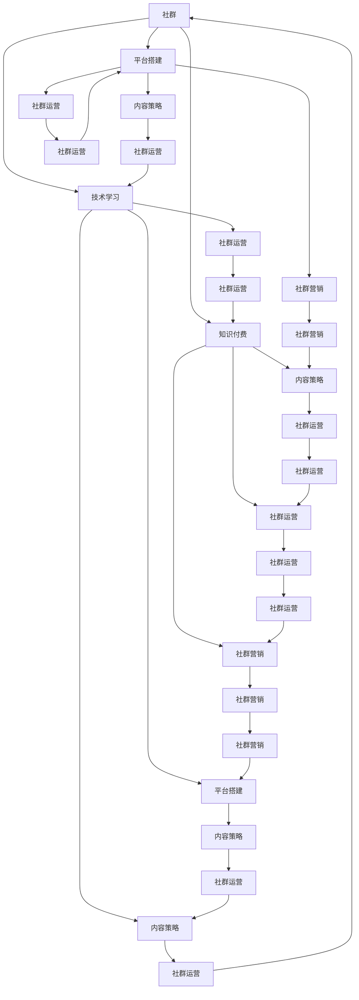

                 

### 文章标题

#### 《如何打造高效的程序员知识付费社群》

在数字化时代，知识付费社群作为一种新型的知识共享与学习平台，正日益受到程序员的关注和青睐。面对快速迭代的技术领域，程序员们不仅需要持续学习最新的技术，还渴望通过社群获取更多实践经验和专业见解。本文旨在通过逻辑清晰、结构紧凑的分析推理，探讨如何打造一个高效、活跃且具有长期发展潜力的程序员知识付费社群。

关键词：程序员、知识付费社群、技术学习、平台搭建、内容策略、社群运营、社群营销

摘要：本文首先对程序员知识付费社群进行了概述，详细分析了社群的定位、核心价值和当前的发展现状。接着，通过成员需求分析、成员类型与互动模式研究，为社群的构建提供了坚实基础。本文重点探讨了社群平台的选择与搭建，内容策略的制定，知识付费模式的探索，社群运营策略，以及社群拓展与升级的方法。通过实际案例分析，总结了成功与失败的经验教训，并推荐了一系列社群运营工具，以期为读者提供一份全面且实用的指南。

---

### 核心概念与联系

在探讨如何打造高效的程序员知识付费社群之前，我们需要明确几个核心概念，并理解它们之间的联系。

首先，**社群**（Community）指的是一种基于共同兴趣、目标或价值观而形成的社会网络。在程序员知识付费社群中，成员的共同兴趣是编程技术和知识共享。

其次，**知识付费**（Knowledge付费）是指用户为了获取特定的知识或服务而支付的费用。在程序员社群中，付费形式可能包括课程订阅、内容解锁、专家咨询等。

**技术学习**（Technical Learning）是指通过学习和实践掌握新的编程技能和知识。在社群中，技术学习是成员参与的主要驱动力。

**平台搭建**（Platform Building）是指创建和维护一个可以支持社群活动和技术交流的在线平台。

**内容策略**（Content Strategy）是制定和执行内容计划，确保社群能够提供有价值的内容。

**社群运营**（Community Management）是指通过一系列管理活动，维持社群的活跃度和成员满意度。

**社群营销**（Community Marketing）是利用社群进行市场推广，吸引新成员，并增强社群的品牌影响力。

这些核心概念相互联系，构成了一个完整的社群生态系统。理解这些概念及其相互作用，对于打造一个高效的程序员知识付费社群至关重要。

#### **Mermaid流程图：程序员知识付费社群核心概念关联图**

通过这个流程图，我们可以清晰地看到各个核心概念之间的联系，这为我们后续的深入探讨提供了结构化的思路。

### 第一部分：构建基础

#### 第1章：社群概述

在构建一个高效的程序员知识付费社群之前，了解社群的定义、特点以及其与程序员职业发展的关系至关重要。一个成功的社群不仅仅是线上的论坛或聊天室，而是一个集学习、交流、互助和成长于一体的生态系统。

**社群的定义**：社群是指一群有共同兴趣、目标或价值观的人组成的社交网络。在这个网络中，成员之间通过分享经验、知识和资源，相互支持、学习与成长。

**社群的特点**：

1. **共同兴趣**：社群成员通常对某个领域或技术有浓厚的兴趣，这使得他们愿意投入时间和精力参与社群活动。
2. **互助合作**：社群成员之间互帮互助，共同解决问题，提升个人技能。
3. **知识共享**：成员通过分享经验、资源、研究成果，促进知识的传播和迭代。
4. **持续互动**：社群成员保持高频率的互动，维持社群的活跃度和粘性。

**社群在程序员职业发展中的作用**：

1. **学习资源**：程序员可以通过社群获取最新的技术动态、行业资讯和优质的学习资源。
2. **技能提升**：通过参与社群的讨论和项目实践，程序员可以快速提升自己的技术水平。
3. **人脉拓展**：社群提供了一个结识同行、拓展人脉的平台，有助于职业发展和职业转型。
4. **职业机会**：社群中的成员可能会分享工作机会和项目合作，为程序员提供更多的职业机会。

在了解了社群的定义、特点及其作用后，我们可以更好地定位程序员知识付费社群。这个社群的目标不仅仅是提供技术知识，更是通过付费机制筛选出真正有需求、愿意投入时间和精力的成员，从而提高社群的整体质量和互动效率。

**程序员知识付费社群的定位**：

1. **高质量内容**：社群以高质量的技术文章、讲座视频、实战教程等为主，确保成员能够获得有价值的内容。
2. **付费筛选**：通过收取一定的费用，筛选出有真实学习需求和支付能力的成员，提升社群的总体素质。
3. **互动机制**：社群设计多种互动机制，如在线讨论、代码审查、项目协作等，增强成员之间的互动和互助。
4. **长期发展**：社群注重长期发展，不断积累知识和资源，为成员提供持续的学习和成长机会。

**社群的核心价值**：

1. **知识获取**：成员可以通过付费获取独家、优质的学习资源和内容。
2. **技能提升**：社群提供的实战项目和案例分析帮助成员快速提升技能。
3. **经验分享**：成员可以分享自己的工作经验和心得，获得同行反馈和建议。
4. **社交网络**：社群提供了丰富的社交机会，帮助成员拓展人脉，提高职业竞争力。

**社群的发展现状**：

1. **普及度提高**：随着知识付费理念的普及，越来越多的程序员选择加入付费社群进行学习。
2. **多样性增加**：不同领域和技术的社群不断涌现，满足程序员多元化的学习需求。
3. **运营模式多样化**：社群运营模式从传统的论坛和聊天室，逐渐发展到更复杂、功能更丰富的在线平台。
4. **商业模式探索**：社群运营者不断探索新的商业模式，如会员制、课程订阅、专家咨询等，以实现可持续发展。

综上所述，构建一个高效的程序员知识付费社群需要明确社群的定位和核心价值，同时了解社群的发展现状。在下一章中，我们将进一步分析社群成员的需求、类型和互动模式，为社群的构建提供更坚实的基础。

#### 第1章：社群概述

##### 1.1 程序员知识付费社群的定位

程序员知识付费社群的定位在于为程序员提供一种高效、系统、持续的学习和交流平台。这个定位可以从以下几个方面进行具体阐述：

1. **目标受众**：社群的主要目标受众是程序员，尤其是那些对技术有强烈兴趣、追求职业发展和技术提升的专业人士。通过精准定位，确保社群成员具有共同的兴趣和需求。

2. **内容特色**：社群提供的内容特色在于高质量、专业性和时效性。内容涵盖最新的技术趋势、深度技术文章、实战项目案例、专家讲座等，确保成员能够获取到有价值的知识资源。

3. **互动机制**：社群注重成员之间的互动，通过在线讨论、代码审查、项目协作等方式，促进成员之间的交流和合作，形成良好的学习氛围。

4. **付费筛选**：社群采用付费机制，筛选出有真实学习需求和支付能力的成员，提升社群的整体素质。这种筛选机制不仅能够提高社群的门槛，还能确保成员更专注于学习和交流。

5. **长期发展**：社群致力于长期发展，通过积累知识和资源，为成员提供持续的学习和成长机会。社群的运营者需要不断优化内容和服务，以满足成员的持续需求。

##### 1.2 社群的核心价值

程序员知识付费社群的核心价值主要体现在以下几个方面：

1. **知识获取**：社群为成员提供了丰富的学习资源，包括技术文章、视频教程、实战项目等。这些资源帮助成员快速掌握最新的技术动态和实战技能。

2. **技能提升**：社群提供的实战项目和案例分析，帮助成员将理论知识应用到实际项目中，提高解决实际问题的能力。通过项目协作和代码审查，成员还可以获得同行反馈和建议，进一步提升技能。

3. **经验分享**：社群鼓励成员分享自己的工作经验和心得，通过互相学习和交流，成员可以获取更多的行业洞察和实战经验。

4. **社交网络**：社群为成员提供了一个结识同行、拓展人脉的平台。成员可以通过社群活动、在线讨论等方式，结识志同道合的朋友，扩大自己的职业圈子。

5. **职业发展**：社群中的优质资源和人脉，为成员的职业发展提供了有力支持。成员可以通过社群获取更多的工作机会和项目合作，提升自己的职业竞争力。

##### 1.3 社群的发展现状

目前，程序员知识付费社群的发展呈现出以下几个特点：

1. **普及度提高**：随着知识付费理念的普及，越来越多的程序员开始加入付费社群进行学习。社群的普及度显著提高，成为程序员获取知识和技能的重要渠道。

2. **多样性增加**：不同领域和技术的社群不断涌现，满足程序员多元化的学习需求。从前端开发、后端开发，到人工智能、大数据等领域，社群涵盖了广泛的编程技术。

3. **运营模式多样化**：社群运营模式从传统的论坛和聊天室，逐渐发展到更复杂、功能更丰富的在线平台。例如，一些社群采用了课程订阅、专家咨询、项目合作等模式，为成员提供更丰富的服务。

4. **商业模式探索**：社群运营者不断探索新的商业模式，如会员制、课程订阅、专家咨询等，以实现可持续发展。这些探索为社群的长期发展提供了新的思路和方向。

总的来说，程序员知识付费社群作为一种新型的学习平台，正在迅速发展。了解社群的定位和核心价值，以及社群的发展现状，对于构建一个高效、活跃且具有长期发展潜力的社群至关重要。

#### 第2章：社群成员分析

##### 2.1 成员需求分析

为了打造一个高效的程序员知识付费社群，深入分析成员的需求至关重要。这些需求不仅决定了社群的内容和服务方向，还直接影响成员的满意度和社群的活跃度。以下是社群成员的主要需求分析：

1. **技术学习需求**：程序员最基本的需求是技术学习。他们希望通过社群获取最新的技术资讯、实战经验和深度技术文章。具体需求包括：

   - **技术趋势**：了解最新的技术趋势和行业发展方向，以便及时调整学习计划和职业规划。
   - **实战案例**：通过实战案例学习，将理论知识应用到实际项目中，提升解决实际问题的能力。
   - **代码示例**：需要大量的代码示例和教程，帮助他们在实际编码过程中遇到问题时能够快速找到解决方案。

2. **职业发展需求**：程序员在职业发展过程中，不仅需要提升技术能力，还需要拓展人脉、获取工作机会和职业指导。具体需求包括：

   - **人脉拓展**：通过社群活动、在线讨论等方式，结识同行和行业专家，扩大职业圈子。
   - **职业机会**：社群中的资源能够帮助成员获取更多的工作机会和项目合作，提升职业竞争力。
   - **职业指导**：需要行业专家提供的职业规划和职业发展建议，帮助他们在职业道路上做出明智的选择。

3. **经验分享与交流**：程序员希望通过社群分享自己的经验和心得，获取同行的反馈和建议。具体需求包括：

   - **经验分享**：分享自己在工作和学习中的经验，帮助他人避免重复错误，快速提升技能。
   - **问题求助**：在遇到技术难题或职业困惑时，希望得到社群成员的帮助和指导。
   - **行业洞察**：分享行业动态和最新成果，获取同行的见解和观点，提升自身的行业洞察力。

4. **学习资源**：程序员需要丰富的学习资源来支持他们的技术学习和职业发展。具体需求包括：

   - **在线教程**：提供高质量、系统的在线教程，帮助成员从入门到高级的全方位学习。
   - **课程订阅**：提供多样化的课程订阅服务，满足不同阶段成员的学习需求。
   - **工具与插件**：推荐和分享实用的工具和插件，提高工作效率和学习效率。

5. **社交与互动**：程序员希望通过社群与同行建立社交联系，增强归属感和认同感。具体需求包括：

   - **社群活动**：组织线上线下活动，如技术讲座、代码马拉松、研讨会等，促进成员之间的交流和互动。
   - **论坛与聊天**：提供论坛和聊天功能，方便成员随时随地进行讨论和交流。
   - **社区氛围**：营造一个友好、包容、积极向上的社群氛围，让成员感到舒适和愉快。

通过对成员需求的分析，我们可以更清晰地了解他们的痛点和需求，从而为社群的构建和运营提供有力支持。在接下来的章节中，我们将进一步探讨社群成员的类型与特点，为社群的构建提供更多细节和深度。

##### 2.2 成员类型与特点

在程序员知识付费社群中，成员可以根据不同的特征和需求划分为多个类型。了解这些类型的成员及其特点，有助于社群运营者制定更有针对性的内容和服务策略，提高社群的整体质量和活跃度。以下是社群中的几种主要成员类型及其特点：

1. **新手程序员**：

   - **特点**：新手程序员通常是刚刚踏入编程领域的新手，他们对于编程技能有强烈的渴望，但往往缺乏实际经验。他们对于基础知识和入门教程有较高的需求。
   - **需求**：新手程序员需要系统的入门教程、基础语法讲解、常见问题解答等，以便快速掌握编程的基本概念和技能。
   - **互动方式**：新手程序员倾向于参与基础知识的讨论和互动，通过提问和解答问题，学习他人的经验和技巧。

2. **中级程序员**：

   - **特点**：中级程序员已经具备一定的编程技能，能够独立完成项目，但仍然需要不断学习和提升。他们通常对中级难度以上的技术话题感兴趣，渴望通过实战项目提高解决复杂问题的能力。
   - **需求**：中级程序员需要更深入的技术文章、实战项目案例、技术讨论等，帮助他们理解和掌握更复杂的技术和概念。
   - **互动方式**：中级程序员喜欢参与技术讨论和代码审查，通过分享自己的经验和见解，与同行交流，共同进步。

3. **高级程序员**：

   - **特点**：高级程序员具有丰富的编程经验和深厚的专业素养，他们擅长解决复杂的技术难题，并在某个特定领域有所专长。他们通常对前沿技术和学术研究感兴趣。
   - **需求**：高级程序员需要最新的技术动态、深度技术文章、学术研究论文等，以便保持自己在技术前沿的地位。他们还希望参与高端的技术讨论和项目合作，扩展自己的知识面和人脉。
   - **互动方式**：高级程序员喜欢参与高层次的技术讨论，通过分享自己的研究成果和实战经验，为社群贡献价值。

4. **技术爱好者**：

   - **特点**：技术爱好者通常对编程和技术有浓厚的兴趣，但可能没有从事编程工作。他们追求技术的纯粹性和创新性，喜欢探索新技术和新方法。
   - **需求**：技术爱好者需要前沿的技术资讯、创新性的教程和实践案例，以激发他们的学习热情和创造力。
   - **互动方式**：技术爱好者喜欢参与技术分享、创意讨论和项目合作，通过实践和交流，不断提升自己的技术水平。

5. **行业专家**：

   - **特点**：行业专家通常是某个技术领域的权威人士，他们在行业内具有很高的影响力。他们不仅拥有丰富的技术经验，还具备深厚的理论知识和行业洞察力。
   - **需求**：行业专家需要专业的讨论平台，以便与同行分享研究成果和行业见解，同时获取最新的技术资讯和学术动态。
   - **互动方式**：行业专家倾向于参与高端的技术讨论和项目合作，通过指导和支持新手和中级程序员，发挥自己的行业影响力。

6. **创业者和企业家**：

   - **特点**：创业者和企业家通常具有编程背景，他们不仅关注技术，还关注商业和市场。他们在技术社群中寻找合作伙伴、项目机会和投资建议。
   - **需求**：创业者和企业家需要技术指导、项目合作机会、市场分析报告等，以支持他们的创业活动。
   - **互动方式**：创业者和企业家喜欢参与项目讨论、投资咨询和行业峰会等活动，通过资源互换和合作，实现共赢。

通过分析这些成员类型及其特点，社群运营者可以更好地理解他们的需求，制定更有针对性的内容和服务策略，提高社群的吸引力和粘性。在下一章中，我们将探讨如何根据成员的互动模式，设计有效的社群互动机制，进一步提升社群的活跃度和成员满意度。

##### 2.3 成员互动模式

在程序员知识付费社群中，成员之间的互动模式是维持社群活力和吸引力的关键。有效的互动模式不仅能提高成员的参与度和满意度，还能促进知识的传播和技能的提升。以下是几种常见的成员互动模式及其特点：

1. **在线讨论**：

   - **特点**：在线讨论是社群中最常见的互动模式，成员可以在论坛、聊天室或专门的讨论板块分享观点、讨论技术问题，进行深度交流。
   - **优势**：在线讨论具有灵活性和实时性，成员可以随时参与，不受地域和时间的限制。同时，讨论内容可以保存，便于成员随时查阅和回顾。
   - **应用**：适用于新手到高级程序员，以及技术爱好者和行业专家。在线讨论可以围绕技术难题、项目分享、行业动态等多种主题进行。

2. **代码审查**：

   - **特点**：代码审查是一种通过集体智慧和经验，帮助成员提高代码质量和解决问题的能力。成员可以提交自己的代码，接受其他成员的审查和建议。
   - **优势**：代码审查能够帮助成员发现代码中的潜在问题和优化空间，提高编程技能。同时，它还能促进成员之间的合作和交流。
   - **应用**：适用于中级和高级程序员，以及有实际项目需求的成员。代码审查可以在项目开发的不同阶段进行，如需求分析、编码和测试阶段。

3. **项目协作**：

   - **特点**：项目协作是一种通过共同开发项目，实现技术提升和团队合作。成员可以组成团队，共同完成一个或多个项目，从中获得实战经验。
   - **优势**：项目协作能够帮助成员将理论知识应用到实际项目中，提高解决实际问题的能力。同时，它还能培养团队协作精神和项目管理能力。
   - **应用**：适用于所有层次的程序员，特别是对有志于项目开发和团队合作的成员。项目协作可以是公开的，也可以是私有的，根据项目的性质和成员的意愿来安排。

4. **专家讲座**：

   - **特点**：专家讲座是一种由行业专家或技术领袖分享专业知识和经验的形式。通过在线直播或录播的形式，专家可以向社群成员传授最新的技术动态和实战技巧。
   - **优势**：专家讲座能够快速传递高质量的知识和经验，提升成员的技术水平。同时，它还能增强社群的权威性和吸引力。
   - **应用**：适用于所有层次的程序员，特别是那些渴望获取最新技术和行业洞见的成员。专家讲座可以定期举办，形成固定栏目。

5. **社交活动**：

   - **特点**：社交活动是一种通过线下或线上方式，促进成员之间交流和互动的形式。活动可以是技术沙龙、代码马拉松、行业峰会等。
   - **优势**：社交活动能够增强成员之间的联系，培养社群的归属感和认同感。同时，它还能为成员提供更多的社交机会和职业机会。
   - **应用**：适用于所有层次的程序员，特别是那些渴望拓展人脉和寻找合作机会的成员。社交活动可以定期举办，也可以根据社群需求临时组织。

6. **问答互动**：

   - **特点**：问答互动是一种通过问答形式，帮助成员解决技术问题或职业困惑。成员可以提出问题，其他成员或专家进行回答和讨论。
   - **优势**：问答互动能够快速解决成员遇到的问题，提高社群的服务质量和成员满意度。同时，它还能促进知识的传播和积累。
   - **应用**：适用于所有层次的程序员，特别是新手和有特定技术需求的中级程序员。问答互动可以是实时问答，也可以是定期举办的问答活动。

通过设计和实施这些互动模式，社群运营者可以有效地促进成员之间的互动，提升社群的活跃度和成员满意度。同时，这些互动模式也为成员提供了多样化的学习和交流机会，有助于他们的技能提升和职业发展。

### 第3章：社群平台选择与搭建

#### 3.1 常见社群平台介绍

在构建程序员知识付费社群时，选择一个合适的平台至关重要。以下是几种常见社群平台的介绍，包括其特点、优势以及适用场景：

1. **Facebook Groups**：

   - **特点**：Facebook Groups 是一个基于社交媒体的社群平台，成员可以方便地发布帖子、分享链接、参与讨论和互动。
   - **优势**：用户基数庞大，易于建立社交网络，支持多种媒体格式，如图片、视频和链接。
   - **适用场景**：适用于小型社群或地域性较强的社群，适合社交互动和轻度内容分享。

2. **Discord**：

   - **特点**：Discord 是一个专为游戏玩家设计的社群平台，但逐渐也被程序员社群采用。它提供语音聊天、视频会议和文本聊天功能，支持插件和自定义频道。
   - **优势**：强大的音频和视频通信功能，适合实时讨论和协作，界面简洁直观，易于使用。
   - **适用场景**：适用于需要高频实时互动和协作的社群，如编程学习小组和项目开发团队。

3. **Reddit**：

   - **特点**：Reddit 是一个基于社区的讨论平台，成员可以提交帖子、评论和投票，形成丰富的讨论话题。
   - **优势**：用户生成内容丰富，支持多种主题和子版块，适合长尾内容的积累和分享。
   - **适用场景**：适用于内容多样化、社区驱动的社群，如技术新闻、项目分享和专业讨论。

4. **Slack**：

   - **特点**：Slack 是一个企业协作工具，提供即时通讯、文件共享和集成第三方服务的功能。
   - **优势**：功能丰富，支持多种插件和集成服务，提供高效的团队沟通和协作平台。
   - **适用场景**：适用于企业级社群、大型团队协作和项目管理的社群。

5. **Telegram**：

   - **特点**：Telegram 是一个加密的即时通讯平台，提供私密聊天、群聊、频道和文件分享功能。
   - **优势**：高度安全、隐私保护，支持大容量文件传输，用户活跃度高。
   - **适用场景**：适用于需要高度隐私保护和高效沟通的社群，如专业讨论组和高端付费社群。

6. **GitHub**：

   - **特点**：GitHub 是一个代码托管和协作平台，支持版本控制、代码审查和项目协作。
   - **优势**：强大的代码管理功能，适合开源项目和代码共享，拥有庞大的开发者社区。
   - **适用场景**：适用于技术导向的社群，特别是那些需要代码协作和项目管理的社群。

7. **Mattermost**：

   - **特点**：Mattermost 是一个开源的团队沟通和协作平台，提供类似于Slack的功能，但更加注重安全和定制化。
   - **优势**：开源代码，可以自行部署和定制，支持多平台和集成服务，适合企业内部使用。
   - **适用场景**：适用于需要高度定制化和数据安全的社群，如企业内部技术团队和高端付费社群。

#### 3.2 平台选择标准

在选择社群平台时，应考虑以下标准，以确保平台能够满足社群的需求和目标：

1. **功能与性能**：平台需要具备强大的功能，如即时通讯、文件共享、项目协作和代码审查等。同时，平台应具备良好的性能，支持高并发用户同时在线互动。

2. **用户基数与活跃度**：选择一个用户基数大且活跃度高的平台，可以迅速聚集社群成员，提高社群的吸引力和影响力。

3. **安全性与隐私保护**：特别是在处理敏感数据和成员个人信息时，平台需要提供严格的安全措施和隐私保护机制。

4. **定制化与扩展性**：平台应具备一定的定制化能力，允许社群运营者根据自身需求进行功能扩展和界面定制。

5. **成本与预算**：平台的费用和预算是选择平台时的重要考虑因素，需要根据社群的预算和预期收益进行合理评估。

6. **用户界面与用户体验**：平台应具备简洁、直观的用户界面，提供良好的用户体验，降低成员的学习和使用成本。

7. **技术支持与维护**：平台需要提供良好的技术支持和维护服务，确保社群的长期稳定运行。

#### 3.3 社群搭建流程

构建一个高效的程序员知识付费社群需要系统的规划和实施，以下是社群搭建的基本流程：

1. **需求分析与定位**：

   - 确定社群的目标和定位，明确社群的核心价值和特色。
   - 分析社群成员的需求，制定社群的内容和服务策略。

2. **平台选择与配置**：

   - 根据社群的需求和目标，选择合适的平台。
   - 对所选平台进行配置，安装必要的插件和模块，以满足社群的功能需求。

3. **内容准备与发布**：

   - 准备高质量的学习资源和内容，包括技术文章、视频教程、实战案例等。
   - 制定内容发布计划，确保内容的时效性和多样性。

4. **用户导入与注册**：

   - 设计注册和邀请机制，吸引潜在成员加入社群。
   - 对新成员进行引导，确保他们了解社群的规则和互动方式。

5. **社群运营与活动策划**：

   - 制定社群运营计划，包括日常管理、活动策划和内容更新等。
   - 组织线上线下活动，提高社群的互动性和活跃度。

6. **反馈收集与优化**：

   - 定期收集成员的反馈，了解他们的需求和意见。
   - 根据反馈进行优化和改进，不断提升社群的质量和用户体验。

7. **持续发展**：

   - 持续关注技术趋势和行业发展，更新内容和运营策略。
   - 寻求外部合作，扩大社群的影响力和资源。

通过以上步骤，社群运营者可以逐步构建和优化一个高效的程序员知识付费社群，为成员提供有价值的学习资源和交流平台，实现社群的可持续发展。

### 第二部分：内容规划与管理

#### 第4章：内容策略制定

在构建程序员知识付费社群的过程中，内容策略的制定是关键的一环。一个良好的内容策略不仅能够吸引和留住成员，还能提升社群的整体价值和吸引力。以下是内容策略的几个核心方面：

##### 4.1 内容主题选择

内容主题的选择决定了社群的定位和方向，是吸引成员的重要手段。在选择内容主题时，应遵循以下几个原则：

1. **针对目标受众**：社群的目标受众是程序员，因此内容主题应围绕程序员的需求和兴趣展开。例如，编程语言、框架、工具、最佳实践、行业动态等。

2. **热点话题**：紧跟行业热点和前沿技术，及时发布相关内容，满足成员对于最新技术和趋势的需求。例如，人工智能、大数据、区块链、云原生技术等。

3. **实用性**：选择具有实际操作价值的主题，帮助成员解决实际问题，提升他们的技术水平。例如，实战项目案例、技术教程、代码示例等。

4. **多样性**：内容主题应具有多样性，以满足不同层次和类型的成员的需求。可以包括基础教程、高级技术文章、专家讲座、项目分享等。

5. **周期性**：制定周期性内容计划，如每周发布技术文章、每月举办一次线上讲座等，确保内容持续更新和输出。

##### 4.2 内容形式多样化

单一的内容形式往往难以满足不同成员的需求，因此内容形式的多样化至关重要。以下是一些常见的内容形式：

1. **文章**：技术文章是社群中的核心内容形式，可以详细介绍技术概念、解决方案、实战案例等。文章应注重内容的深度和实用性。

2. **视频**：视频内容形式直观、生动，能够更好地传递复杂的技术概念和操作步骤。视频可以包括教程视频、专家讲座、技术讨论等。

3. **音频**：音频内容适合在通勤、运动等场景中收听，可以包括技术播客、访谈节目、答疑解惑等。

4. **互动**：通过互动形式，如问答、讨论区、直播等，增强成员的参与感和互动性。互动内容可以围绕热门话题、项目问题、技术挑战等展开。

5. **案例**：实战案例和项目分享能够帮助成员将理论知识应用到实际项目中，提高解决实际问题的能力。案例可以包括成功案例、失败案例和经验教训。

6. **活动**：组织线上线下活动，如技术沙龙、代码马拉松、行业峰会等，增强成员的互动和归属感。活动内容可以包括技术展示、经验分享、项目合作等。

##### 4.3 内容更新频率与节奏

内容更新的频率和节奏直接影响社群的活跃度和成员的满意度。以下是一些关于内容更新频率与节奏的建议：

1. **定期更新**：制定固定的内容更新计划，如每周发布一篇技术文章、每月举办一次线上讲座等。定期更新能够提高社群的预期和稳定性，增强成员的参与感。

2. **实时更新**：对于热点话题和紧急事件，应进行实时更新，确保内容时效性。例如，在某个技术发布日或行业动态更新时，及时发布相关内容。

3. **质量优先**：在内容更新中，应注重内容的质量，避免为了更新而更新。高质量的内容能够吸引和留住成员，提高社群的整体价值。

4. **合理分配**：根据不同的内容形式和主题，合理分配更新频率。例如，技术文章可以每周更新，视频和音频内容可以每月更新，活动内容可以每季度更新。

5. **反馈调整**：根据成员的反馈和社群的运营情况，及时调整内容更新的节奏和形式。反馈是内容策略调整的重要依据，有助于提升社群的满意度。

通过制定合理的内容策略，社群运营者可以确保社群的内容丰富、多样且持续更新，为成员提供高质量的学习资源和交流平台。在下一章中，我们将进一步探讨知识付费模式的设计和运营策略。

### 第5章：知识付费模式探索

#### 5.1 付费模式设计

在构建程序员知识付费社群时，付费模式的设计至关重要。一个合理的付费模式不仅能够确保社群的可持续运营，还能提升成员的参与度和满意度。以下是几种常见的知识付费模式及其设计要点：

1. **会员制**：

   - **特点**：会员制是一种基于订阅的付费模式，成员支付一定费用成为社群的会员，享受社群提供的一系列特权和服务。
   - **设计要点**：会员制的成功取决于会员权益的设计。权益可以包括：优先参与项目协作、专属技术讲座、独享内容资源、会员专属活动等。同时，应制定合理的会员分级制度，如普通会员、高级会员、专家会员等，提供不同层次的权益。

2. **课程订阅**：

   - **特点**：课程订阅制是一种按需购买的学习资源模式，成员根据自身需求选择订阅课程，支付相应费用。
   - **设计要点**：课程订阅制的关键在于课程内容的丰富度和质量。应提供多样化的课程，满足不同层次成员的学习需求。课程内容可以包括基础教程、实战项目、高级技术讲座等。同时，应设置合理的订阅期限和价格策略，如按月、按季度或按年度订阅。

3. **内容付费**：

   - **特点**：内容付费制是一种按内容付费的模式，成员为了获取特定内容或资源，支付相应费用。
   - **设计要点**：内容付费制的核心在于内容的价值和稀缺性。应提供独家、高质量的内容，如专家讲座、深度技术分析、实战案例等。同时，应设置合理的价格策略，确保内容的价值与价格匹配。

4. **专家咨询**：

   - **特点**：专家咨询是一种付费咨询服务模式，成员支付费用后，可以享受专家一对一的技术指导和咨询服务。
   - **设计要点**：专家咨询的成功取决于专家的水平和服务质量。应邀请行业内的专家和资深程序员提供咨询服务，确保服务质量和专业度。同时，应设置合理的咨询服务价格，并根据咨询问题的重要性和复杂度进行定价。

5. **项目合作**：

   - **特点**：项目合作是一种通过实际项目合作实现付费的模式，成员参与项目开发，通过项目的收益获得报酬。
   - **设计要点**：项目合作的关键在于项目的可行性和收益分配。应提供具有实际价值的项目，确保项目能够顺利完成并产生收益。同时，应制定合理的收益分配方案，确保成员的权益和项目的可持续发展。

6. **活动参与费**：

   - **特点**：活动参与费是一种针对社群活动的付费模式，成员支付费用后可以参与特定活动，如技术沙龙、代码马拉松等。
   - **设计要点**：活动参与费的设计应考虑活动的类型和规模。活动可以包括线上和线下形式，如技术讲座、研讨会、代码比赛等。同时，应提供丰富的互动环节和奖品激励，提高成员的参与积极性。

通过合理设计付费模式，社群运营者可以确保社群的可持续运营，同时满足成员的不同需求，提高社群的整体价值和吸引力。在下一节中，我们将进一步探讨成员权益的设计和收益模式的分析。

#### 5.2 成员权益设计

在程序员知识付费社群中，成员权益的设计直接关系到社群的吸引力和成员的满意度。合理的权益设计不仅能够提升成员的参与度，还能增强社群的凝聚力和忠诚度。以下是几种常见的成员权益设计及其具体内容：

1. **学习资源**：

   - **权益内容**：提供高质量的学习资源，如技术文章、视频教程、实战项目、代码示例等。这些资源应覆盖从基础知识到高级技术的全方位内容，满足不同层次成员的学习需求。
   - **使用权限**：普通成员可能只能访问部分资源，而高级会员则可以享受更多的资源权限，如独享的高质量教程和实战案例。

2. **专家指导**：

   - **权益内容**：邀请行业专家和资深程序员提供一对一的技术指导和咨询服务。成员可以就自己在学习和工作中遇到的问题，向专家寻求帮助和指导。
   - **使用频率**：高级会员可以享受更频繁的专家指导，而普通会员则可能有限制。

3. **项目协作**：

   - **权益内容**：提供项目协作机会，成员可以参与社群内部或社群外的项目开发。通过实际项目合作，成员可以积累实战经验，提升技术水平。
   - **参与条件**：高级会员通常享有优先参与项目的权利，而普通会员则需要通过一定的条件和考核才能参与。

4. **专属活动**：

   - **权益内容**：组织专属的线上线下活动，如技术沙龙、研讨会、代码马拉松、专家讲座等。这些活动不仅可以提高成员的技术水平，还能增强社群的互动和凝聚力。
   - **参与资格**：高级会员通常可以免费或优先参与这些活动，而普通会员可能需要支付费用或通过申请才能参与。

5. **荣誉与认证**：

   - **权益内容**：为在社群中表现突出的成员提供荣誉和认证，如优秀贡献者认证、技术达人认证等。这些荣誉和认证不仅能够提升成员的成就感，还能增强他们的职业竞争力。
   - **授予标准**：荣誉和认证的授予应基于成员在社群中的活跃度、贡献度和技术能力。制定明确的评估标准和流程，确保公平、公正地授予荣誉和认证。

6. **社交机会**：

   - **权益内容**：提供丰富的社交机会，如线上社交聚会、行业峰会、技术交流活动等。通过这些社交机会，成员可以结识志同道合的朋友，拓展人脉资源。
   - **组织形式**：社交活动可以定期举办，也可以根据社群需求临时组织。形式可以包括线上聊天、线下见面会、聚会等。

通过设计多样化的成员权益，社群运营者可以更好地满足成员的需求，提高社群的吸引力和忠诚度。同时，合理的权益设计也有助于提升社群的整体质量和氛围。在下一节中，我们将探讨社群的收益模式分析，以帮助社群实现可持续发展。

#### 5.3 收益模式分析

在程序员知识付费社群的运营过程中，收益模式的设计是确保社群可持续发展的关键。合理的收益模式不仅能够为社群带来经济收益，还能增强社群的吸引力和影响力。以下是几种常见的收益模式及其分析：

1. **会员费**：

   - **模式分析**：会员费是最常见的收益模式之一，通过收取一定金额的会员费，成员可以获得社群提供的一系列特权和服务。会员费可以根据会员等级的不同设置不同的价格，如普通会员、高级会员、专家会员等。
   - **优势**：会员费模式能够为社群提供稳定的收入来源，同时筛选出有真实学习需求和支付能力的成员，提高社群的整体素质。会员费模式适用于大多数社群，特别是那些提供丰富内容和服务的社群。
   - **挑战**：会员费模式需要合理定价，过高可能导致流失，而定价过低可能影响社群的收益。同时，需要不断优化会员权益，以保持成员的满意度和忠诚度。

2. **课程销售**：

   - **模式分析**：通过销售课程，社群可以将自身的学习资源转化为收益。课程可以包括基础教程、实战项目、高级技术讲座等。课程销售可以采用按需购买、订阅制等多种形式。
   - **优势**：课程销售能够为社群带来多元化的收入来源，同时丰富社群的内容和服务。课程销售适用于那些拥有高质量学习资源的社群，特别是那些能够提供独家、实用课程的社群。
   - **挑战**：课程销售需要高质量的内容支持，否则难以吸引和留住学员。此外，课程定价和销售策略的制定也需要精细考虑，以确保收益的最大化。

3. **咨询服务**：

   - **模式分析**：社群可以提供专家咨询服务，成员支付费用后，可以享受专家一对一的技术指导和咨询服务。咨询服务可以包括技术问题解答、项目咨询、职业规划等。
   - **优势**：咨询服务能够为社群带来额外的收入，同时提升社群的权威性和专业性。咨询服务适用于那些拥有资深专家和丰富经验的社群，特别是那些需要专业指导的成员。
   - **挑战**：咨询服务需要确保专家的专业度和服务质量，否则会影响社群的声誉和收益。此外，服务定价和需求预测也需要进行精细管理。

4. **广告和赞助**：

   - **模式分析**：社群可以通过广告和赞助获得收益。广告可以包括平台广告、内容推广等，赞助可以来自企业或品牌，用于支持社群的活动和项目。
   - **优势**：广告和赞助能够为社群带来额外的收入，同时增强社群的品牌影响力和市场地位。广告和赞助适用于大多数社群，特别是那些有较高流量和影响力的社群。
   - **挑战**：广告和赞助需要平衡社群的独立性和商业性，避免过度商业化影响社群的运营和用户体验。此外，广告和赞助的引入和管理也需要精细规划。

5. **项目合作**：

   - **模式分析**：社群可以与企业或团队进行项目合作，通过实际项目开发和运营获得收益。项目合作可以包括软件开发、技术咨询、系统集成等。
   - **优势**：项目合作能够为社群带来实际的经济收益，同时提升社群的实践能力和影响力。项目合作适用于那些有实际项目需求和技术实力的社群。
   - **挑战**：项目合作需要确保项目的可行性和收益分配，避免因项目失败或收益分配不公导致社群的损失和矛盾。

通过合理设计和管理多种收益模式，社群运营者可以确保社群的可持续发展，同时满足成员的不同需求。不同的收益模式具有不同的优势和挑战，社群运营者应根据自身情况选择合适的收益模式，并不断优化和调整，以实现最佳收益效果。在下一节中，我们将进一步探讨社群运营策略的制定与实施。

### 第6章：社群运营策略

#### 6.1 活动策划与执行

社群活动的策划与执行是提升社群活跃度和成员满意度的重要手段。以下是一些关键步骤和注意事项：

1. **活动目标**：

   - **明确主题**：确定活动的主题，例如技术讲座、代码马拉松、专家访谈、行业峰会等。
   - **设定目标**：明确活动的具体目标，如提高成员的技术水平、促进知识共享、增强社群凝聚力等。

2. **活动内容**：

   - **内容准备**：根据活动主题准备相关内容，包括讲座材料、教程文档、实战案例等。
   - **邀请嘉宾**：如果活动需要专家或行业领袖参与，提前邀请并确认嘉宾，确保活动顺利进行。

3. **宣传推广**：

   - **渠道选择**：选择适合的推广渠道，如社群公告、邮件通知、社交媒体等。
   - **内容创作**：制作吸引人的宣传文案和海报，提高活动的曝光率和吸引力。

4. **活动执行**：

   - **组织筹备**：提前筹备活动所需物资，如场地、设备、礼品等。
   - **现场管理**：确保活动现场的秩序和氛围，提供良好的用户体验。

5. **互动环节**：

   - **问答环节**：设置问答环节，鼓励成员提问，增强互动性。
   - **现场投票**：使用互动工具进行现场投票，增加活动的趣味性和参与感。

6. **后续跟进**：

   - **活动总结**：活动结束后，进行总结和反馈，了解成员的体验和意见。
   - **内容整理**：将活动内容整理成文字或视频，分享给未参与活动的成员。

#### 6.2 成员互动与激励机制

有效的成员互动和激励机制是提升社群活跃度和成员忠诚度的重要手段。以下是一些具体的策略：

1. **互动机制**：

   - **线上讨论区**：建立活跃的线上讨论区，鼓励成员分享经验、提问和解答问题。
   - **实时聊天工具**：使用实时聊天工具，如Telegram、Slack等，提供即时的技术支持和交流平台。
   - **社群活动**：定期组织线上线下活动，如技术沙龙、代码马拉松、专家讲座等，增强成员之间的互动。

2. **激励机制**：

   - **积分制度**：设置积分制度，成员参与活动、发表帖子、解答问题等都可以获得积分，积分可以兑换奖品或特权。
   - **荣誉体系**：建立荣誉体系，为在社群中表现突出的成员颁发荣誉证书或勋章，提升成员的成就感和归属感。
   - **奖励制度**：对积极参与社群活动的成员提供奖励，如免费课程、专家咨询、活动门票等。

3. **个性化奖励**：

   - **定制奖励**：根据成员的兴趣和需求，提供个性化的奖励，如技术书籍、专业工具等。
   - **定制活动**：为特殊成员或团体举办定制化的活动，如小型技术沙龙、专家一对一咨询等。

通过建立有效的互动机制和激励机制，社群运营者可以激发成员的参与热情，提升社群的活跃度和成员满意度，实现社群的长期可持续发展。

#### 6.3 数据分析与优化

数据分析是社群运营中不可或缺的一环，通过对数据的深入分析，社群运营者可以了解成员的行为模式、需求变化和社群的运营效果，从而做出精准的运营决策和优化策略。

1. **关键数据指标**：

   - **活跃度指标**：包括每日活跃用户数、每月发帖数量、在线时长等，反映社群的活跃程度。
   - **参与度指标**：包括成员的参与次数、参与率、互动率等，衡量成员的参与热情和积极性。
   - **满意度指标**：通过调查问卷、反馈评分等方式收集成员的满意度数据，了解社群的运营质量。
   - **转化率指标**：包括付费转化率、课程订阅率、项目参与率等，衡量社群的商业价值。

2. **数据分析方法**：

   - **数据分析工具**：使用专业的数据分析工具，如Google Analytics、Tableau、Power BI等，对社群的各项数据进行收集、整理和分析。
   - **数据可视化**：通过数据可视化技术，将复杂的数据转化为直观的图表和报表，便于理解和分析。
   - **趋势分析**：分析数据的变化趋势，识别成员行为和需求的变化规律，为运营决策提供依据。

3. **优化策略**：

   - **内容优化**：根据数据反馈，优化内容质量和发布节奏，提高成员的满意度和参与度。
   - **互动机制优化**：根据互动数据的分析结果，调整互动机制，增强社群的活跃度和互动性。
   - **激励机制优化**：根据参与度和满意度数据，调整激励机制，提高成员的积极性和忠诚度。
   - **运营策略优化**：结合数据分析结果，不断调整和优化运营策略，提高社群的整体运营效果。

通过持续的数据分析和优化，社群运营者可以不断提高社群的质量和吸引力，实现社群的可持续发展。

### 第三部分：社群拓展与升级

#### 第7章：社群营销策略

在程序员知识付费社群的发展过程中，有效的营销策略至关重要。通过科学的营销手段，社群不仅可以吸引更多的成员，还能提升品牌影响力和市场竞争力。以下是社群营销策略的几个关键方面：

##### 7.1 营销目标与定位

制定明确的营销目标是社群营销成功的前提。营销目标应具体、可行，并与社群的核心价值和定位相一致。以下是几个典型的营销目标：

1. **增加成员数量**：通过一系列营销活动，吸引更多的程序员加入社群，扩大社群的规模。
2. **提升活跃度**：通过互动活动和内容推广，提高社群成员的活跃度和参与率，增强社群的凝聚力。
3. **增强品牌影响力**：通过营销活动，提升社群在程序员群体中的知名度和认可度，树立良好的品牌形象。
4. **增加付费用户**：通过营销手段，引导潜在用户进行付费，提升社群的收入和商业价值。

在制定营销目标时，需要考虑以下因素：

- **社群定位**：根据社群的定位和特色，确定营销的目标和方向。
- **市场需求**：分析目标市场的需求和趋势，制定符合市场需求的营销策略。
- **资源限制**：考虑社群可用的资源，包括资金、人力、时间等，制定可行的营销计划。

##### 7.2 营销渠道选择

选择合适的营销渠道是实现营销目标的关键。以下是几种常见的营销渠道及其适用场景：

1. **社交媒体**：

   - **平台**：如Facebook、Twitter、LinkedIn、Instagram等。
   - **优势**：用户基数大，传播速度快，适合进行品牌宣传和用户互动。
   - **适用场景**：适用于提高社群的曝光度和吸引新成员。

2. **专业社区和论坛**：

   - **平台**：如GitHub、Stack Overflow、Reddit等。
   - **优势**：聚集了大量程序员用户，专业性高，适合技术讨论和内容推广。
   - **适用场景**：适用于提高社群的专业形象和技术吸引力。

3. **电子邮件营销**：

   - **工具**：如Mailchimp、SendinBlue等。
   - **优势**：可以直接触达目标用户，适合进行用户维护和营销推广。
   - **适用场景**：适用于活动通知、内容更新、用户回访等。

4. **内容营销**：

   - **形式**：如博客文章、视频教程、电子书等。
   - **优势**：可以提供有价值的内容，提高社群的吸引力和信任度。
   - **适用场景**：适用于内容推广、用户教育和品牌宣传。

5. **搜索引擎优化（SEO）**：

   - **方法**：通过优化网站内容和结构，提高搜索引擎排名。
   - **优势**：长期有效的营销手段，可以持续吸引潜在用户。
   - **适用场景**：适用于网站建设和内容推广。

6. **线上广告**：

   - **平台**：如Google Ads、Facebook Ads、Bing Ads等。
   - **优势**：可以精准定位目标用户，提高广告效果。
   - **适用场景**：适用于快速提升社群曝光度和用户增长。

在选择营销渠道时，应考虑以下因素：

- **目标用户特征**：根据目标用户的特征和行为，选择适合的营销渠道。
- **渠道效果**：分析不同渠道的营销效果，选择效果最好的渠道进行重点投入。
- **成本预算**：根据社群的预算，合理分配营销预算，确保投入产出比最大化。

##### 7.3 营销活动策划

成功的营销活动能够显著提升社群的影响力和用户参与度。以下是一些关键步骤和策略：

1. **活动主题**：

   - **明确主题**：根据社群的定位和目标，确定营销活动的主题，如技术竞赛、专家讲座、行业沙龙等。
   - **吸引眼球**：主题应具有吸引力和独特性，能够引起目标用户的兴趣。

2. **活动内容**：

   - **丰富内容**：设计多样化的活动内容，包括技术分享、项目展示、互动问答等。
   - **高质量**：确保活动内容的高质量，提供有价值的技术和信息。

3. **活动推广**：

   - **预热**：在活动前进行预热，通过社交媒体、电子邮件等方式通知潜在用户。
   - **推广渠道**：利用多种营销渠道进行推广，提高活动的影响力。

4. **活动执行**：

   - **现场组织**：确保活动现场的有序进行，提供良好的用户体验。
   - **实时互动**：鼓励成员参与互动，增强活动的氛围。

5. **活动总结**：

   - **反馈收集**：活动结束后，收集用户的反馈，了解活动的效果和不足。
   - **数据分析**：对活动数据进行分析，总结经验教训，为未来的活动提供参考。

6. **后续跟进**：

   - **内容分享**：将活动内容整理成文字或视频，分享给未能参与的用户。
   - **会员维护**：通过活动后跟进，维护与会员的关系，提升会员的忠诚度。

通过科学规划和精心执行营销活动，社群可以显著提升品牌知名度和用户参与度，实现营销目标。在下一章中，我们将探讨社群的升级与迭代策略，以帮助社群实现长期发展。

#### 第8章：社群升级与迭代

##### 8.1 社群规模扩张

社群规模的扩张是社群发展的重要目标之一。通过有效的方法和策略，社群可以吸引更多的成员，扩大其影响力。以下是几种常见的社群规模扩张策略：

1. **内容质量提升**：

   - **高质量内容**：提供高质量的内容是吸引和留住成员的关键。确保内容具有独特性、专业性和实用性，满足成员的学习和需求。
   - **多样化内容**：内容形式应多样化，包括技术文章、视频教程、实战案例、行业动态等，满足不同成员的需求。

2. **品牌宣传与推广**：

   - **线上宣传**：利用社交媒体、专业社区、博客等平台进行宣传，提高社群的曝光度。
   - **线下活动**：组织线下活动，如技术沙龙、行业峰会等，吸引更多程序员参与。

3. **合作伙伴关系**：

   - **企业合作**：与相关企业建立合作关系，通过企业推荐和资源共享，吸引更多成员加入。
   - **专家合作**：邀请行业专家和知名程序员参与社群活动，提升社群的专业形象和吸引力。

4. **会员激励**：

   - **会员权益**：提供丰富的会员权益，如独家内容、专家指导、活动优惠等，激励成员积极参与社群。
   - **会员推荐**：设置会员推荐机制，鼓励现有成员推荐新成员加入，扩大社群规模。

5. **口碑传播**：

   - **用户评价**：鼓励成员分享社群体验和成果，通过口碑传播吸引新成员。
   - **成功案例**：展示社群的成功案例和优秀成员，增强社群的吸引力和信任度。

通过这些策略，社群可以有效地扩大规模，吸引更多程序员加入，为社群的长期发展奠定基础。

##### 8.2 社群品牌建设

社群品牌建设是提升社群影响力和市场竞争力的重要手段。以下是几种有效的社群品牌建设策略：

1. **品牌定位**：

   - **明确定位**：根据社群的特点和目标用户，明确社群的品牌定位，如技术学习平台、专业交流社区等。
   - **差异化**：确保品牌定位具有独特性和差异化，使其在众多社群中脱颖而出。

2. **品牌视觉**：

   - **品牌标识**：设计独特、简洁、易识别的品牌标识（Logo），形成社群的品牌形象。
   - **视觉风格**：统一社群的视觉风格，包括配色、字体、图标等，提升品牌的一致性和专业性。

3. **内容策略**：

   - **高质量内容**：提供高质量的内容是品牌建设的基础。确保内容具有独特性、专业性和实用性，提升社群的权威性和信任度。
   - **内容输出**：制定内容输出计划，定期发布高质量内容，增强社群的品牌影响力。

4. **用户体验**：

   - **优化服务**：提供优质的用户体验，包括快速响应成员问题、及时解决技术难题等，提升社群的满意度和忠诚度。
   - **互动氛围**：营造友好、包容、积极的社群氛围，增强成员的归属感和认同感。

5. **宣传推广**：

   - **社交媒体**：利用社交媒体平台进行宣传，提高社群的曝光度和知名度。
   - **合作伙伴**：与行业内的合作伙伴进行合作，通过资源互换和联合推广，扩大社群的品牌影响力。

6. **用户反馈**：

   - **收集反馈**：定期收集成员的反馈，了解社群的优点和不足，不断优化和改进。
   - **用户评价**：鼓励成员分享社群体验和成果，通过用户评价提升社群的信誉和口碑。

通过这些策略，社群可以逐步建立和提升其品牌影响力，在目标市场中树立良好的品牌形象。

##### 8.3 社群持续优化

社群的持续优化是确保其长期发展的重要保障。以下是一些关键措施和方法：

1. **数据分析**：

   - **指标监控**：定期监控社群的各项关键指标，如成员活跃度、参与率、满意度等，了解社群的运营状况。
   - **数据驱动**：根据数据分析结果，识别社群的优化方向，制定具体的优化措施。

2. **内容更新**：

   - **定期更新**：制定内容更新计划，确保社群的内容持续更新和丰富，保持成员的兴趣和参与度。
   - **多样化内容**：提供多样化的内容形式，如技术文章、视频教程、实战案例、行业动态等，满足不同成员的需求。

3. **互动机制**：

   - **优化互动**：根据成员的反馈和互动数据，优化社群的互动机制，提高成员的参与度和互动性。
   - **引入新互动形式**：尝试引入新的互动形式，如在线讨论、代码审查、项目协作等，增强社群的互动性。

4. **会员权益**：

   - **完善权益**：根据成员的需求和反馈，不断完善会员权益，提高会员的满意度和忠诚度。
   - **个性化权益**：提供个性化的会员权益，根据成员的兴趣和需求，提供定制化的服务。

5. **用户体验**：

   - **优化服务**：提升社群的服务质量，包括快速响应成员问题、提供技术支持等，提升用户体验。
   - **改善社区氛围**：营造友好、包容、积极的社群氛围，增强成员的归属感和认同感。

6. **技术创新**：

   - **技术应用**：引入先进的技术，如人工智能、大数据分析等，提升社群的运营效率和用户体验。
   - **技术更新**：定期更新社群的技术平台和工具，确保社群的技术先进性和稳定性。

通过持续优化，社群可以不断提升其运营质量和用户体验，实现长期可持续发展。

### 第9章：案例分析

在探讨如何打造高效的程序员知识付费社群时，实际案例的研究和分析能够为我们提供宝贵的经验和教训。以下将介绍几个成功和失败的案例分析，并通过这些案例总结出成功与失败的原因及经验教训。

#### 9.1 成功案例分享

**案例1：GitHub Community**

**背景**：GitHub是全球最大的代码托管平台，其社区功能非常强大，吸引了大量程序员参与。

**成功原因**：

1. **高质量内容**：GitHub社区提供了大量的开源项目和代码示例，这些内容具有高专业性和实用性，满足了程序员的学习和开发需求。

2. **互动机制**：GitHub社区鼓励成员进行代码审查和项目协作，通过Pull Request和Issue功能，成员可以互相学习和交流。

3. **品牌影响力**：GitHub作为技术领域的知名品牌，其社区自然具备很高的吸引力和权威性。

4. **用户体验**：GitHub的界面简洁直观，功能强大，支持多种编程语言和工具，用户体验非常好。

**经验教训**：

- **高质量内容是关键**：提供高质量的内容是吸引和留住成员的基础。
- **互动机制要人性化**：设计良好的互动机制，如代码审查和项目协作，能够增强社群的活力和凝聚力。
- **品牌影响力不可忽视**：一个有影响力的品牌可以显著提升社群的吸引力和信誉。

**案例2：InfoQ**

**背景**：InfoQ是一个专注于软件开发和架构领域的知识分享平台。

**成功原因**：

1. **多元化内容**：InfoQ提供多种形式的内容，包括技术文章、视频、播客等，满足不同成员的需求。

2. **专家资源**：InfoQ邀请业界知名专家和学者进行讲座和分享，提升了社群的专业水平和吸引力。

3. **品牌定位**：InfoQ明确其品牌定位，专注于软件开发和架构领域，形成了独特的品牌形象。

4. **用户反馈**：InfoQ注重用户反馈，定期收集用户意见并进行改进，提升了用户体验。

**经验教训**：

- **多元化内容策略**：提供多样化的内容形式，满足不同层次和类型成员的需求。
- **专家资源是优势**：邀请业界专家进行分享，可以显著提升社群的专业性和吸引力。
- **用户反馈至关重要**：积极收集用户反馈，并根据反馈进行改进，是提升用户体验和社群质量的关键。

#### 9.2 失败案例解析

**案例1：某小型编程社群**

**背景**：该社群由几位编程爱好者发起，旨在为程序员提供一个技术交流的平台。

**失败原因**：

1. **内容质量不高**：社群提供的内容质量参差不齐，缺乏系统性和深度，无法满足程序员的学习需求。

2. **互动机制不足**：社群的互动机制不够完善，成员之间的互动较少，社群氛围不够活跃。

3. **品牌影响力有限**：社群的品牌知名度不高，缺乏吸引力和权威性，难以吸引高质量成员。

4. **用户反馈不重视**：社群运营者对用户反馈不够重视，缺乏有效的用户调研和改进措施。

**经验教训**：

- **内容质量是基础**：提供高质量的内容是吸引和留住成员的关键，内容应具有系统性和深度。
- **互动机制要健全**：设计完善的互动机制，如代码审查、项目协作、问答互动等，增强社群的活力和凝聚力。
- **品牌影响力需提升**：通过品牌建设和宣传推广，提升社群的知名度和影响力。
- **用户反馈不可忽视**：积极收集用户反馈，并根据反馈进行改进，是提升社群质量和用户体验的关键。

**案例2：某技术论坛**

**背景**：该技术论坛由一家互联网公司运营，旨在为程序员提供一个技术讨论和交流的平台。

**失败原因**：

1. **商业化过度**：论坛过度依赖广告和赞助，商业化气息浓厚，影响用户体验。

2. **内容更新不及时**：论坛内容更新缓慢，缺乏时效性，难以满足程序员的需求。

3. **用户服务不足**：论坛对用户的反馈和服务不够重视，用户满意度较低。

4. **管理不善**：论坛的管理混乱，缺乏有效的社区管理和内容审核机制，导致社区氛围恶化。

**经验教训**：

- **避免过度商业化**：保持社区的商业性与用户体验之间的平衡，避免商业化过度影响用户体验。
- **内容更新要及时**：定期更新内容，确保内容具有时效性和相关性。
- **用户服务要到位**：重视用户反馈和服务，提供优质的用户体验。
- **管理要规范**：建立完善的社区管理和内容审核机制，确保社区氛围良好。

#### 9.3 经验与教训总结

通过对成功和失败案例的分析，我们可以总结出以下经验和教训：

1. **高质量内容是基础**：提供高质量、系统性和深度的内容是吸引和留住成员的关键。
2. **互动机制要健全**：设计完善的互动机制，增强社群的活力和凝聚力。
3. **品牌影响力需提升**：通过品牌建设和宣传推广，提升社群的知名度和影响力。
4. **用户反馈不可忽视**：积极收集用户反馈，并根据反馈进行改进，提升社群质量和用户体验。
5. **平衡商业化与用户体验**：保持社区的商业性与用户体验之间的平衡，避免商业化过度影响用户体验。
6. **内容更新要及时**：定期更新内容，确保内容具有时效性和相关性。
7. **用户服务要到位**：重视用户反馈和服务，提供优质的用户体验。

通过借鉴这些经验和教训，社群运营者可以更好地构建和管理高效的程序员知识付费社群。

### 附录

#### 附录A：社群运营工具推荐

在构建和运营程序员知识付费社群时，选择合适的工具对于提升社群的运营效率和质量至关重要。以下是一些推荐的社群运营工具，涵盖了社群管理、数据分析和其他辅助功能：

**A.1 常用社群管理工具**

1. **Discord**：

   - **特点**：提供即时通讯、语音聊天、视频会议和自定义频道等功能，适合实时互动和协作。
   - **适用场景**：适用于编程学习小组、项目开发和团队协作。

2. **Slack**：

   - **特点**：强大的团队协作工具，支持实时聊天、文件共享、集成第三方服务等功能。
   - **适用场景**：适用于企业级社群、大型团队协作和项目管理。

3. **Telegram**：

   - **特点**：提供私密聊天、群聊、频道和文件分享功能，高度安全和隐私保护。
   - **适用场景**：适用于需要高度隐私保护和高效沟通的社群，如专业讨论组和高端付费社群。

4. **Mattermost**：

   - **特点**：开源的团队沟通和协作平台，支持多平台和集成服务，注重安全和定制化。
   - **适用场景**：适用于需要高度定制化和数据安全的社群，如企业内部技术团队和高端付费社群。

**A.2 数据分析工具**

1. **Google Analytics**：

   - **特点**：提供强大的网站分析功能，包括用户行为分析、流量来源分析等。
   - **适用场景**：适用于网站流量分析、用户行为研究等。

2. **Tableau**：

   - **特点**：数据可视化工具，能够将复杂的数据转化为直观的图表和报表。
   - **适用场景**：适用于数据可视化、业务决策支持等。

3. **Power BI**：

   - **特点**：提供全面的数据分析和商业智能功能，支持多种数据源和可视化工具。
   - **适用场景**：适用于企业级数据分析、报告生成等。

4. **Mixpanel**：

   - **特点**：专注于用户行为分析，提供用户活跃度、留存率等关键指标。
   - **适用场景**：适用于用户行为分析、产品迭代优化等。

**A.3 其他辅助工具推荐**

1. **Trello**：

   - **特点**：轻量级的任务管理工具，支持项目管理、团队协作和任务跟踪。
   - **适用场景**：适用于项目管理、团队协作和任务管理。

2. **Asana**：

   - **特点**：全面的项目管理工具，支持任务分配、进度跟踪和团队协作。
   - **适用场景**：适用于企业级项目管理、团队协作等。

3. **Zoom**：

   - **特点**：提供视频会议、在线协作和远程工作解决方案。
   - **适用场景**：适用于在线会议、远程工作、在线培训等。

通过合理选择和使用这些工具，社群运营者可以显著提升社群的运营效率和质量，实现社群的长期可持续发展。

