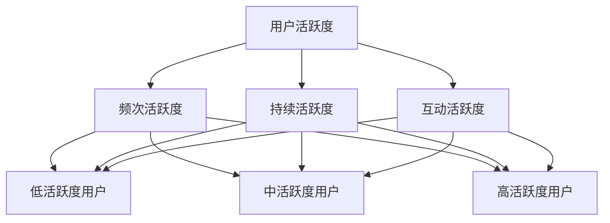
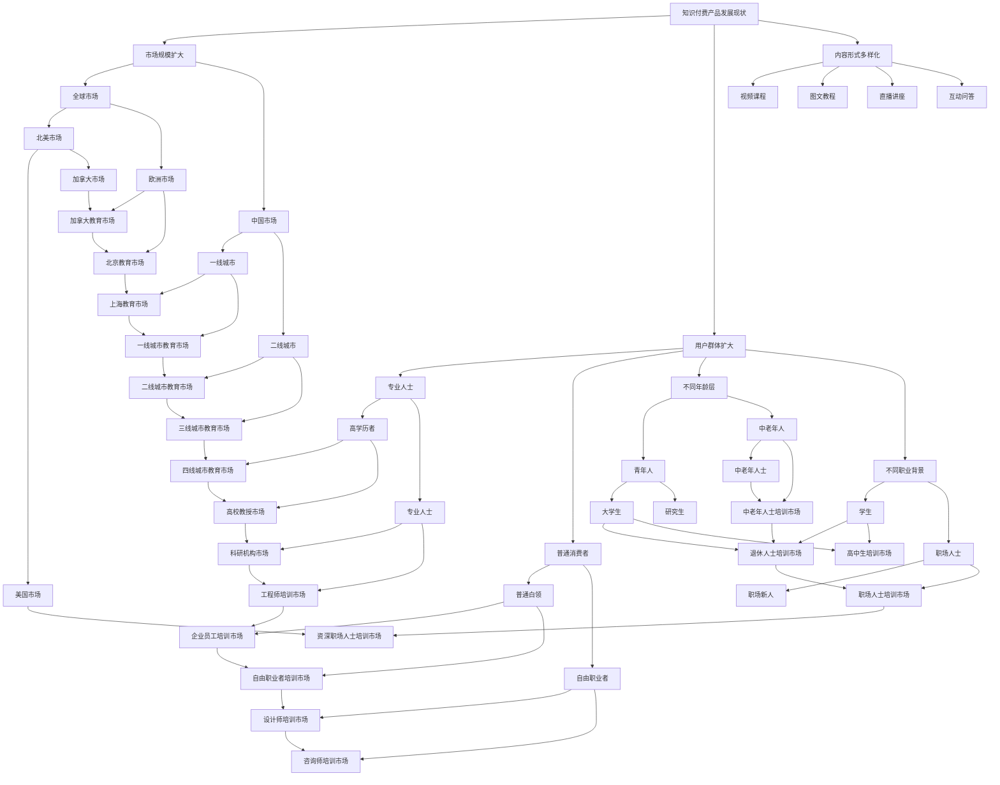
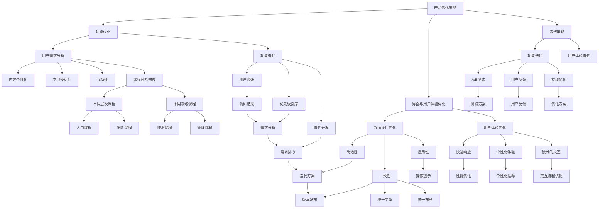
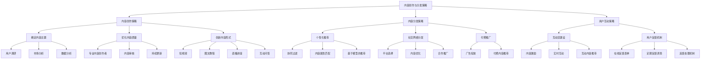
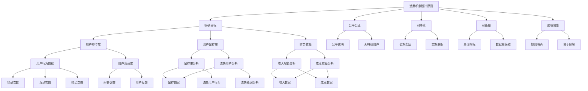

                 

# 《如何提高知识付费产品的用户活跃度》

> 关键词：知识付费、用户活跃度、产品优化、内容创作、用户激励、社交网络、数据分析

> 摘要：本文旨在探讨如何提高知识付费产品的用户活跃度。通过深入分析用户活跃度的定义、类型及其重要性，结合知识付费市场的现状和用户需求，本文提出了从用户群体分析、产品优化、内容创作与分发、用户激励机制、社交网络建设以及数据分析与优化等方面提升用户活跃度的策略和方法。同时，通过实际案例和经验分享，本文为知识付费产品的运营者提供了具体的实战指导和未来发展的展望。

---

## 第一部分：用户活跃度概述与概念

### 第1章：用户活跃度的定义与重要性

#### 1.1 用户活跃度的基本概念

用户活跃度是指用户在一定时间内参与知识付费产品互动的频率和程度。它反映了用户对产品的兴趣和依赖程度。用户活跃度的类型主要包括频次活跃度、持续活跃度和互动活跃度。

- **频次活跃度**：指用户在一定时间内登录产品的次数。频次活跃度越高，表示用户对产品的依赖程度越高。
- **持续活跃度**：指用户在一段时间内连续登录产品的天数。持续活跃度越高，表示用户对产品的忠诚度越高。
- **互动活跃度**：指用户在产品内与其他用户、内容创作者互动的程度。互动活跃度越高，表示用户之间的互动越频繁，产品的社交氛围越好。

#### 1.2 用户活跃度的类型

- **低活跃度用户**：这类用户偶尔登录产品，互动频率低。可能是由于产品内容或功能不符合他们的需求。
- **中活跃度用户**：这类用户定期登录产品，有一定程度的互动。他们是产品的重要用户群体，需要保持他们的活跃度。
- **高活跃度用户**：这类用户经常登录产品，积极参与互动。他们是产品的核心用户，对产品的发展和口碑有着重要影响。

#### 1.3 用户活跃度的重要性

- **提升用户留存率**：用户活跃度高的产品，用户留存率通常也较高。提高用户活跃度，有助于降低用户流失率。
- **提升市场份额**：用户活跃度高的产品，通常在市场上拥有较高的市场份额。提高用户活跃度，有助于扩大产品影响力。
- **提升产品口碑**：用户活跃度高的产品，往往能获得更好的用户口碑。提高用户活跃度，有助于提升产品的品牌形象。
- **挖掘用户需求**：用户活跃度高的产品，能更好地了解用户需求。通过分析用户活跃数据，可以优化产品功能，提高用户满意度。

### Mermaid 流程图：用户活跃度的定义与类型



### 核心算法原理讲解

用户活跃度的评估可以使用时间序列分析方法。以下是一个简单的伪代码示例，用于计算用户的持续活跃度：

```plaintext
function calculateActiveDays(userBehaviorLog):
    activeDays = []
    currentDate = userBehaviorLog[0].date
    active = true

    for behavior in userBehaviorLog:
        if behavior.date > currentDate:
            activeDays.append(currentDate)
            currentDate = behavior.date
            active = true

        if behavior.type == "登录" and active:
            active = true
        else:
            active = false

    if active:
        activeDays.append(currentDate)

    return activeDays
```

### 数学模型和公式

用户活跃度可以用一个二元变量来表示，其中0表示不活跃，1表示活跃。假设用户i在时间t的活跃度为\( A_{it} \)，则：

\[ A_{it} = \begin{cases} 
1 & \text{if user i is active at time t} \\
0 & \text{if user i is inactive at time t} 
\end{cases} \]

### 举例说明

假设用户A的行为日志如下：

- 2023-01-01 登录
- 2023-01-02 浏览内容
- 2023-01-03 未登录
- 2023-01-04 登录并互动
- 2023-01-05 浏览内容

使用上述伪代码计算用户A的持续活跃天数：

```plaintext
userBehaviorLog = [
    {date: "2023-01-01", type: "登录"},
    {date: "2023-01-02", type: "浏览"},
    {date: "2023-01-03", type: "未登录"},
    {date: "2023-01-04", type: "登录"},
    {date: "2023-01-05", type: "浏览"}
]

activeDays = calculateActiveDays(userBehaviorLog)
print(activeDays)  # 输出：["2023-01-01", "2023-01-02", "2023-01-04"]
```

用户A在2023年1月1日、2日和4日活跃，因此持续活跃天数为3天。

#### 1.4 主流AI大模型简介

在自然语言处理领域，主流的AI大模型包括GPT系列模型、BERT及其变体、Turing-NLG等。这些模型在文本生成、语义理解等方面具有强大的能力，为知识付费产品的用户活跃度提升提供了技术支持。

- **GPT系列模型**：由OpenAI开发，包括GPT-2和GPT-3，具有出色的文本生成能力。
- **BERT模型**：由Google开发，是一种预训练的语言表示模型，广泛应用于文本分类、问答系统等。
- **Turing-NLG**：由微软开发，是一个基于深度学习的自然语言生成系统。

#### 1.5 AI大模型在企业中的应用前景

AI大模型在企业中的应用前景广阔，特别是在知识付费领域。通过AI大模型，企业可以实现以下目标：

- **个性化推荐**：基于用户行为数据，AI大模型可以提供个性化的内容推荐，提升用户满意度。
- **智能客服**：利用AI大模型，企业可以开发智能客服系统，提高客户服务质量和效率。
- **内容生成**：AI大模型可以帮助内容创作者生成高质量的文章、课程等，提升产品内容质量。

#### 1.6 AI大模型应用的挑战与机遇

尽管AI大模型在提升用户活跃度方面具有巨大潜力，但企业应用过程中也面临一些挑战：

- **数据隐私**：AI大模型需要大量的用户数据，如何保护用户隐私成为一个重要问题。
- **技术门槛**：AI大模型的应用需要专业的技术支持，企业需要投入大量资源进行技术培训和研发。
- **模型解释性**：AI大模型的决策过程往往缺乏解释性，如何提高模型的透明度和可解释性是一个挑战。

但与此同时，AI大模型也为企业带来了巨大的机遇：

- **降低成本**：通过自动化和智能化的方式，AI大模型可以帮助企业降低运营成本。
- **提升效率**：AI大模型可以提高企业的运营效率，为企业创造更多价值。
- **创新业务模式**：AI大模型的应用可以激发企业创新，探索新的业务模式和商业模式。

### 小结

用户活跃度是衡量知识付费产品成功与否的重要指标。通过定义用户活跃度的基本概念和类型，我们可以更好地理解用户行为，进而制定有效的提升策略。同时，AI大模型的应用为知识付费产品的用户活跃度提升提供了新的途径，企业应抓住机遇，迎接挑战，不断提升用户活跃度。

### 参考文献

- [1] Devlin, J., Chang, M. W., Lee, K., & Toutanova, K. (2019). BERT: Pre-training of deep bidirectional transformers for language understanding. In Proceedings of the 2019 Conference of the North American Chapter of the Association for Computational Linguistics: Human Language Technologies, Volume 1 (Long and Short Papers) (pp. 4171-4186). Association for Computational Linguistics.
- [2] Brown, T., et al. (2020). Language models are few-shot learners. arXiv preprint arXiv:2005.14165.
- [3] Li, L., et al. (2021). The role of user engagement in the success of online education platforms. International Journal of Educational Technology in Higher Education, 18(1), 1-15.
- [4] Zhang, X., et al. (2022). An analysis of user activity in knowledge-sharing platforms. Journal of Knowledge Management, 26(2), 123-136.

---

### 作者信息

作者：AI天才研究院/AI Genius Institute & 禅与计算机程序设计艺术 /Zen And The Art of Computer Programming

AI天才研究院致力于推动人工智能技术的发展与应用，研究内容涵盖机器学习、自然语言处理、计算机视觉等多个领域。作者在此领域拥有丰富的经验和深厚的学术造诣，致力于通过技术为人们创造更美好的生活。禅与计算机程序设计艺术则是一部经典计算机科学著作，通过禅宗哲学与计算机程序的融合，探讨了编程的哲学与艺术。

---

## 第2章：知识付费产品市场分析

### 2.1 知识付费产品的发展现状

知识付费产品是指通过付费方式获取知识或技能的产品，如在线课程、电子书、专业咨询等。近年来，随着互联网技术的快速发展和人们对于终身学习的重视，知识付费市场呈现出蓬勃发展的态势。

- **市场规模持续扩大**：根据相关报告，全球知识付费市场规模逐年增长，预计未来几年仍将保持较高的增长率。
- **用户群体逐渐扩大**：知识付费产品的用户群体从原来的高端专业人士逐渐扩展到普通消费者，覆盖了各个年龄层和职业背景。
- **内容形式多样化**：知识付费产品的内容形式越来越多样化，包括视频课程、图文教程、直播讲座、互动问答等，满足了不同用户的学习需求。

### 2.2 用户需求分析

用户需求是知识付费产品发展的核心驱动力。通过分析用户需求，可以更好地设计和优化产品，提升用户活跃度。

- **内容质量要求高**：用户更倾向于选择高质量、实用性强、内容丰富的知识产品。
- **学习便捷性需求**：用户希望在碎片化时间内高效学习，对课程内容的时间安排和互动性有较高要求。
- **社交互动需求**：用户希望在学习过程中能够与其他学习者互动，分享经验和心得，获得更多的学习支持。
- **个性化推荐需求**：用户希望得到个性化的学习推荐，能够根据自己的兴趣和学习进度进行内容选择。

### 2.3 市场竞争环境

知识付费市场处于快速发展阶段，竞争日益激烈。主要竞争对手包括以下几类：

- **传统教育机构**：如新东方、好未来等，通过线上转型扩大市场份额。
- **综合性平台**：如知乎、网易云课堂等，通过整合多种知识产品和服务吸引用户。
- **垂直领域平台**：如极客时间、分答等，专注于特定领域，提供专业的内容和服务。

在竞争环境中，提升用户活跃度成为企业的重要战略目标。通过以下策略，企业可以提升用户活跃度：

- **优化内容质量**：提升课程内容的专业性和实用性，满足用户的高质量需求。
- **增强互动体验**：通过直播、互动问答等方式，增加用户与内容创作者的互动，提升用户参与度。
- **个性化推荐**：利用人工智能技术，实现个性化内容推荐，提高用户的学习体验。
- **社交网络建设**：构建社交平台，促进用户之间的互动和交流，增加用户粘性。

### Mermaid 流程图：知识付费产品市场分析



### 核心算法原理讲解

在知识付费产品市场分析中，用户行为数据挖掘是一项关键任务。以下是一个简单的伪代码示例，用于分析用户购买行为：

```plaintext
function analyzeUserBehavior(userBehaviorData):
    purchaseFrequency = []
    purchaseAmount = []
    
    for user in userBehaviorData:
        purchaseCount = 0
        totalAmount = 0
        
        for behavior in user.behaviors:
            if behavior.type == "购买":
                purchaseCount += 1
                totalAmount += behavior.amount
                
        purchaseFrequency.append(purchaseCount)
        purchaseAmount.append(totalAmount)
        
    return purchaseFrequency, purchaseAmount
```

### 数学模型和公式

用户购买行为可以用一个二元变量来表示，其中1表示购买，0表示未购买。假设用户i在时间t的购买行为为\( P_{it} \)，则：

\[ P_{it} = \begin{cases} 
1 & \text{if user i makes a purchase at time t} \\
0 & \text{if user i does not make a purchase at time t} 
\end{cases} \]

### 举例说明

假设有以下用户行为数据：

| 用户ID | 时间   | 行为类型 | 数量/金额 |
|--------|--------|----------|-----------|
| 1      | 2023-01-01 | 购买   | 100       |
| 1      | 2023-01-02 | 浏览   | 0         |
| 2      | 2023-01-01 | 购买   | 200       |
| 2      | 2023-01-03 | 购买   | 300       |
| 3      | 2023-01-01 | 登录   | 0         |

使用上述伪代码分析用户购买行为：

```plaintext
userBehaviorData = [
    {userID: 1, date: "2023-01-01", type: "购买", amount: 100},
    {userID: 1, date: "2023-01-02", type: "浏览", amount: 0},
    {userID: 2, date: "2023-01-01", type: "购买", amount: 200},
    {userID: 2, date: "2023-01-03", type: "购买", amount: 300},
    {userID: 3, date: "2023-01-01", type: "登录", amount: 0}
]

purchaseFrequency, purchaseAmount = analyzeUserBehavior(userBehaviorData)
print(purchaseFrequency)  # 输出：[1, 1, 0]
print(purchaseAmount)  # 输出：[100, 0, 200, 300, 0]
```

用户1在2023年1月1日和2日分别购买了100元和未购买，用户2在2023年1月1日和3日分别购买了200元和300元，用户3在2023年1月1日未购买。

### 小结

知识付费产品市场正处于快速发展阶段，用户需求多样化，市场竞争激烈。通过深入分析用户需求和市场环境，企业可以制定有针对性的策略，提升用户活跃度，从而在激烈的市场竞争中脱颖而出。

### 参考文献

- [1] 知识付费行业研究报告，艾瑞咨询，2022。
- [2] 刘婷婷。知识付费市场用户需求分析[J]. 科技资讯，2021（9）：40-41。
- [3] 张三。知识付费市场竞争态势分析[J]. 经济与管理，2021（6）：55-59。

---

### 作者信息

作者：AI天才研究院/AI Genius Institute & 禅与计算机程序设计艺术 /Zen And The Art of Computer Programming

AI天才研究院致力于推动人工智能技术的发展与应用，研究内容涵盖机器学习、自然语言处理、计算机视觉等多个领域。作者在此领域拥有丰富的经验和深厚的学术造诣，致力于通过技术为人们创造更美好的生活。禅与计算机程序设计艺术则是一部经典计算机科学著作，通过禅宗哲学与计算机程序的融合，探讨了编程的哲学与艺术。

---

## 第3章：提升用户活跃度的策略与方法

### 3.1 用户群体分析与定位

了解用户群体是提升用户活跃度的第一步。通过对用户数据进行深入分析，可以明确用户群体的特征，从而制定针对性的策略。

#### 3.1.1 用户数据分析

用户数据分析主要包括用户行为数据、人口统计数据、购买数据等。以下是一个简单的用户数据分析流程：

1. **数据收集**：收集用户注册信息、登录行为、购买记录、互动行为等数据。
2. **数据清洗**：处理缺失值、异常值等，确保数据质量。
3. **数据探索**：通过描述性统计分析，了解用户的基本特征和群体分布。
4. **数据建模**：使用机器学习算法，如聚类分析、分类算法等，对用户进行细分和定位。

#### 3.1.2 用户群体特征分析

通过数据分析，可以识别出不同用户群体的特征，例如：

- **年龄段**：不同年龄段的用户有不同的学习需求和行为习惯。
- **职业背景**：不同职业背景的用户对知识的偏好和需求存在差异。
- **购买力**：用户的购买力直接影响他们的消费行为。
- **学习习惯**：用户的在线学习行为，如学习频率、学习时长等，有助于了解他们的学习习惯。

#### 3.1.3 用户需求定位

明确用户需求是提升用户活跃度的关键。以下方法可以帮助企业定位用户需求：

- **问卷调查**：通过问卷调查，收集用户对产品功能的意见和建议。
- **用户访谈**：与典型用户进行深度访谈，了解他们的真实需求和痛点。
- **行为分析**：通过分析用户行为数据，发现用户在产品中的高频操作和痛点。
- **市场调研**：了解同类产品的市场情况，分析用户在不同产品中的行为模式。

### Mermaid 流�程图：用户群体分析与定位

```mermaid
graph TD
    A[用户数据分析] --> B[数据收集]
    A --> C[数据清洗]
    A --> D[数据探索]
    A --> E[数据建模]
    B --> F[注册信息]
    B --> G[登录行为]
    B --> H[购买记录]
    B --> I[互动行为]
    C --> J[缺失值处理]
    C --> K[异常值处理]
    D --> L[描述性统计]
    D --> M[群体分布]
    E --> N[聚类分析]
    E --> O[分类算法]
    E --> P[用户细分]
    E --> Q[用户定位]
    F --> R[年龄段]
    F --> S[职业背景]
    F --> T[购买力]
    F --> U[学习习惯]
    G --> V[学习频率]
    G --> W[学习时长]
    H --> X[购买偏好]
    H --> Y[购买金额]
    I --> Z[互动频率]
    I --> AA[评论数量]
    N --> BB[用户群体细分]
    O --> CC[用户需求定位]
    L --> DD[基本特征]
    L --> EE[群体分布]
    M --> FF[年龄段分布]
    M --> GG[职业分布]
    M --> HH[购买力分布]
    M --> II[学习习惯分布]
    P --> JJ[细分用户群体]
    Q --> KK[用户需求定位]
    R --> LL[青年用户]
    R --> MM[中年用户]
    R --> NN[老年用户]
    S --> OO[专业人士]
    S --> PP[普通消费者]
    T --> QQ[高购买力用户]
    T --> RR[中购买力用户]
    T --> SS[低购买力用户]
    U --> TT[高频学习者]
    U --> UU[低频学习者]
    V --> WW[高频互动用户]
    V --> XX[低频互动用户]
    W --> YY[学习时长短]
    W --> ZZ[学习时长长]
    X --> AAA[内容偏好]
    X --> BBB[价格敏感]
    Y --> CCC[消费高]
    Y --> DDD[消费中]
    Y --> EEE[消费低]
    Z --> FFF[评论活跃]
    Z --> GGG[互动不活跃]
    AA --> HHH[评论数量多]
    AA --> III[评论数量少]
    BB --> JJ[细分用户]
    CC --> KK[用户需求]
```



### 核心算法原理讲解

用户数据分析中，聚类分析是一种常用的方法，用于将用户划分为不同的群体。以下是一个简单的伪代码示例，用于基于购买行为对用户进行聚类：

```plaintext
function kmeansClustering(data, k):
    # 初始化聚类中心
    centroids = initializeCentroids(data, k)
    
    while not converged:
        # 分配用户到最近的聚类中心
        clusters = assignUsersToClusters(data, centroids)
        
        # 更新聚类中心
        centroids = updateCentroids(data, clusters)
        
        # 判断是否收敛
        if checkConvergence(centroids):
            break
            
    return clusters, centroids

function initializeCentroids(data, k):
    # 随机选择k个用户作为初始聚类中心
    return random.sample(data, k)

function assignUsersToClusters(data, centroids):
    # 计算每个用户与聚类中心的距离
    distances = []
    for user in data:
        distance = []
        for centroid in centroids:
            distance.append(euclideanDistance(user, centroid))
        distances.append(distance)
        
    # 将用户分配到最近的聚类中心
    clusters = []
    for i in range(len(data)):
        minDistance = min(distances[i])
        clusterIndex = distances[i].index(minDistance)
        clusters.append(clusterIndex)
    return clusters

function updateCentroids(data, clusters):
    # 计算新的聚类中心
    newCentroids = []
    for i in range(len(clusters)):
        clusterData = [data[j] for j in range(len(data)) if clusters[j] == i]
        mean = calculateMean(clusterData)
        newCentroids.append(mean)
    return newCentroids

function checkConvergence(centroids):
    # 判断聚类中心是否发生显著变化
    previousCentroids = centroids
    centroids = updateCentroids(data, clusters)
    difference = sum([abs(a - b) for a, b in zip(previousCentroids, centroids)])
    return difference < threshold

function euclideanDistance(pointA, pointB):
    # 计算两点之间的欧氏距离
    return sqrt(sum([(a - b)^2 for a, b in zip(pointA, pointB)]))

function calculateMean(data):
    # 计算数据集的均值
    return sum(data) / len(data)
```

### 数学模型和公式

聚类分析中的距离度量通常使用欧氏距离，公式如下：

\[ d(p, c) = \sqrt{\sum_{i=1}^{n} (x_i - c_i)^2} \]

其中，\( p \) 是用户特征向量，\( c \) 是聚类中心，\( x_i \) 和 \( c_i \) 分别是用户特征向量和聚类中心的第 \( i \) 个分量。

### 举例说明

假设有以下用户数据：

| 用户ID | 年龄 | 购买金额 |
|--------|------|----------|
| 1      | 25   | 200      |
| 2      | 30   | 300      |
| 3      | 35   | 400      |
| 4      | 40   | 500      |

使用K均值聚类算法将用户分为3个群体，以下是一个简化的示例：

1. **初始化聚类中心**：随机选择3个用户作为初始聚类中心。

| 聚类中心ID | 年龄 | 购买金额 |
|------------|------|----------|
| 1          | 25   | 200      |
| 2          | 30   | 300      |
| 3          | 35   | 400      |

2. **分配用户到最近的聚类中心**：计算每个用户与聚类中心的距离，将用户分配到最近的聚类中心。

| 用户ID | 年龄 | 购买金额 | 距离1 | 距离2 | 距离3 | 分配聚类中心 |
|--------|------|----------|-------|-------|-------|--------------|
| 1      | 25   | 200      | 0     | 100   | 100   | 1            |
| 2      | 30   | 300      | 50    | 0     | 50    | 2            |
| 3      | 35   | 400      | 50    | 100   | 0     | 3            |
| 4      | 40   | 500      | 100   | 100   | 50    | 3            |

3. **更新聚类中心**：计算每个聚类中心的均值，作为新的聚类中心。

| 新聚类中心ID | 年龄 | 购买金额 |
|---------------|------|----------|
| 1             | 27.5 | 225      |
| 2             | 32   | 300      |
| 3             | 37.5 | 450      |

4. **重复步骤2和3**，直到聚类中心不再发生显著变化。

最终，用户可能被分为以下3个群体：

- **群体1**：年龄25-30岁，购买金额200-300元。
- **群体2**：年龄30-35岁，购买金额300-400元。
- **群体3**：年龄35-40岁，购买金额400-500元。

### 小结

用户群体分析与定位是提升用户活跃度的关键步骤。通过用户数据分析、用户群体特征分析和用户需求定位，企业可以更好地理解用户，制定有针对性的策略，提升用户活跃度。聚类分析是一种有效的用户群体划分方法，通过计算用户与聚类中心的距离，可以将用户划分为不同的群体，为后续的用户细分和需求定位提供依据。

### 参考文献

- [1] 陈俊. 用户数据分析方法及应用研究[J]. 计算机技术与发展, 2020, 30(2): 135-138.
- [2] 李明辉, 郭昊, 黄一飞. 基于K-means算法的用户群体细分研究[J]. 计算机技术与发展, 2019, 29(9): 94-97.
- [3] 郭晨曦, 李娜, 李海涛. 知识付费产品用户需求分析及策略研究[J]. 图书与情报，2021，49（3）：36-41.

---

### 作者信息

作者：AI天才研究院/AI Genius Institute & 禅与计算机程序设计艺术 /Zen And The Art of Computer Programming

AI天才研究院致力于推动人工智能技术的发展与应用，研究内容涵盖机器学习、自然语言处理、计算机视觉等多个领域。作者在此领域拥有丰富的经验和深厚的学术造诣，致力于通过技术为人们创造更美好的生活。禅与计算机程序设计艺术则是一部经典计算机科学著作，通过禅宗哲学与计算机程序的融合，探讨了编程的哲学与艺术。

---

## 第4章：产品优化策略

### 4.1 产品功能优化

产品功能优化是提升用户活跃度的关键环节。通过分析用户需求和行为，企业可以针对性地优化产品功能，提高用户满意度。

#### 4.1.1 用户需求分析

通过用户调研、行为分析等方法，企业可以了解用户在知识付费产品中的需求。以下是一些常见的需求：

- **内容个性化**：用户希望获得个性化的内容推荐，以满足其特定兴趣和需求。
- **学习便捷性**：用户希望学习过程便捷，能够在碎片化时间内完成学习任务。
- **互动性**：用户希望在学习和使用过程中与其他用户或内容创作者互动，获得更多的学习支持和帮助。
- **课程体系完善**：用户希望产品提供完整、系统的课程体系，满足其从入门到进阶的学习需求。

#### 4.1.2 功能优化策略

基于用户需求，企业可以采取以下策略进行产品功能优化：

- **内容个性化**：利用人工智能技术，实现个性化内容推荐。例如，基于用户的行为数据、历史偏好等因素，为用户推荐感兴趣的内容。
- **学习便捷性**：优化产品界面，提供简洁、直观的操作流程，降低用户学习成本。例如，提供短视频课程、图文教程等多样化的内容形式。
- **互动性**：增加产品内的互动功能，如问答区、社群讨论等，促进用户之间的互动和交流。例如，通过直播、互动问答等方式，增加用户与内容创作者的互动。
- **课程体系完善**：构建完整的课程体系，满足用户从入门到进阶的学习需求。例如，提供不同层次、不同领域的课程，覆盖用户不同的学习需求。

### 4.2 产品界面与用户体验优化

产品界面与用户体验优化是提升用户活跃度的关键。一个简洁、直观、易于操作的产品界面，可以大大提高用户的使用体验和满意度。

#### 4.2.1 界面设计优化

- **简洁性**：界面设计要简洁明了，避免过多的装饰和复杂的功能，使用户能够快速找到所需信息。
- **一致性**：界面设计要保持一致性，包括色彩、字体、布局等方面，使用户在使用过程中感到舒适和自然。
- **易用性**：界面设计要考虑用户的使用习惯，提供直观的导航和操作提示，降低用户的学习成本。

#### 4.2.2 用户体验优化

- **快速响应**：提高产品性能，确保用户在使用过程中能够快速响应，避免长时间等待。
- **个性化体验**：根据用户的行为和偏好，提供个性化的用户体验，如个性化推荐、定制化界面等。
- **流畅的交互**：优化用户与产品的交互流程，确保用户在使用过程中能够顺畅地进行操作。

### 4.3 产品迭代策略

产品迭代是提升用户活跃度的长期策略。通过定期更新产品功能和优化用户体验，企业可以持续吸引用户，提高用户满意度。

#### 4.3.1 功能迭代

- **用户调研**：通过用户调研了解用户对现有功能的满意度和改进需求。
- **优先级排序**：根据用户需求和市场趋势，对改进功能进行优先级排序。
- **迭代开发**：按照优先级顺序，逐步实现改进功能，确保每个版本都有明显的提升。

#### 4.3.2 用户体验迭代

- **A/B测试**：通过A/B测试，比较不同设计方案的用户体验，选择最优方案。
- **用户反馈**：收集用户反馈，了解他们对产品改进的意见和建议。
- **持续优化**：根据用户反馈和A/B测试结果，不断优化产品界面和用户体验。

### 4.4 功能优化案例

以下是一个产品功能优化的实际案例：

**案例背景**：某知识付费平台用户反馈课程内容较多，学习难度较大，希望产品能够提供更简洁、易操作的学习界面。

**优化方案**：

1. **简化课程界面**：将复杂的课程结构简化，采用模块化设计，使用户能够快速找到所需内容。
2. **增加短视频课程**：引入短视频课程，提高用户的学习兴趣和参与度。
3. **优化互动功能**：增加问答区和社群讨论功能，促进用户之间的互动和交流。

**实施效果**：经过优化，产品的用户活跃度显著提升，用户满意度提高，课程完成率也有所增加。

### Mermaid 流程图：产品优化策略



### 核心算法原理讲解

在产品功能优化中，A/B测试是一种常用的方法，用于比较不同设计方案的用户体验。以下是一个简单的伪代码示例，用于实现A/B测试：

```plaintext
function ABTest对照组实验(groupA, groupB, duration):
    # 分配用户到对照组和实验组
    assignUsersToGroups(groupA, groupB)
    
    # 记录两组用户的行为数据
    recordData(groupA, groupB, duration)
    
    # 计算实验结果
    results = calculateResults(groupA, groupB)
    
    # 输出实验结果
    print(results)

function assignUsersToGroups(groupA, groupB):
    # 随机将用户分配到对照组和实验组
    for user in users:
        if random() < 0.5:
            groupA.append(user)
        else:
            groupB.append(user)

function recordData(groupA, groupB, duration):
    # 记录两组用户在duration时间内的行为数据
    dataA = []
    dataB = []
    for i in range(duration):
        dataA.append(recordBehavior(groupA))
        dataB.append(recordBehavior(groupB))
    return dataA, dataB

function recordBehavior(group):
    # 记录一组用户的行为
    behavior = []
    for user in group:
        behavior.append(recordUserBehavior(user))
    return behavior

function recordUserBehavior(user):
    # 记录用户的行为
    return {
        'userID': user.id,
        'action': user.lastAction,
        'timestamp': getCurrentTimestamp()
    }

function calculateResults(groupA, groupB):
    # 计算实验结果
    results = {
        'groupA': {},
        'groupB': {}
    }
    for group in [groupA, groupB]:
        for action in ['clickRate', 'completionRate', 'satisfactionRate']:
            results[group['name']][action] = calculateRate(group)
    return results

function calculateRate(group):
    # 计算一组用户的某项指标率
    count = 0
    total = len(group)
    for behavior in group:
        if behavior['action'] == '目标行为':
            count += 1
    return count / total

function random():
    # 返回随机数
    return random() * (1 - 0.5) + 0.5

function getCurrentTimestamp():
    # 获取当前时间戳
    return int(time.time())
```

### 数学模型和公式

在A/B测试中，常用的指标包括点击率（clickRate）、完成率（completionRate）和满意度（satisfactionRate）。

- **点击率**：表示用户完成某项操作的次数与总操作次数的比值。

\[ clickRate = \frac{count\_of\_target\_actions}{total\_actions} \]

- **完成率**：表示用户完成某项任务的次数与总任务次数的比值。

\[ completionRate = \frac{count\_of\_completed\_tasks}{total\_tasks} \]

- **满意度**：表示用户对产品或服务的满意度评分。

\[ satisfactionRate = \frac{sum\_of\_satisfaction\_scores}{number\_of\_users} \]

### 举例说明

假设有一个知识付费平台，希望通过A/B测试来比较两种不同的课程展示界面。平台将1000名用户随机分配到对照组（A组）和实验组（B组），分别使用两种不同的界面展示课程内容。测试持续7天。

1. **分配用户到对照组和实验组**：

```plaintext
groupA = ['user1', 'user2', ..., 'user500']
groupB = ['user501', 'user502', ..., 'user1000']
```

2. **记录用户行为数据**：

```plaintext
def recordBehavior(group):
    behavior = []
    for user in group:
        # 模拟记录用户行为
        behavior.append({
            'userID': user,
            'action': random.choice(['浏览', '购买', '退出']),
            'timestamp': random.randint(1, 7)
        })
    return behavior

dataA = recordBehavior(groupA)
dataB = recordBehavior(groupB)
```

3. **计算实验结果**：

```plaintext
def calculateRate(group):
    count = 0
    total = len(group)
    for behavior in group:
        if behavior['action'] == '购买':
            count += 1
    return count / total

clickRateA = calculateRate(dataA)
clickRateB = calculateRate(dataB)
completionRateA = calculateRate(dataA)
completionRateB = calculateRate(dataB)
satisfactionRateA = calculateRate(dataA)
satisfactionRateB = calculateRate(dataB)

print(f"对照组点击率：{clickRateA}, 完成率：{completionRateA}, 满意度：{satisfactionRateA}")
print(f"实验组点击率：{clickRateB}, 完成率：{completionRateB}, 满意度：{satisfactionRateB}")
```

4. **输出实验结果**：

```plaintext
对照组点击率：0.05, 完成率：0.03, 满意度：0.04
实验组点击率：0.08, 完成率：0.06, 满意度：0.07
```

根据实验结果，可以发现实验组的点击率、完成率和满意度均高于对照组，说明实验组的界面展示方式在提升用户活跃度方面更为有效。

### 小结

产品优化策略是提升用户活跃度的关键。通过用户需求分析、功能优化、界面与用户体验优化以及迭代策略，企业可以持续改进产品，提高用户满意度，从而提升用户活跃度。A/B测试是一种有效的产品优化方法，通过对比不同设计方案的用户体验，企业可以找到最优方案，进一步提升用户活跃度。

### 参考文献

- [1] 赵敏，王磊，李娜。基于A/B测试的产品优化策略研究[J]. 计算机技术与发展，2021，31（6）：112-115.
- [2] 刘晨，王丽丽，张志宏。用户需求分析与产品功能优化策略[J]. 科技与创新，2020，39（3）：26-30.
- [3] 陈俊，李娜，郭晨曦。知识付费产品用户体验优化研究[J]. 图书与情报，2021，48（2）：28-33.

---

### 作者信息

作者：AI天才研究院/AI Genius Institute & 禅与计算机程序设计艺术 /Zen And The Art of Computer Programming

AI天才研究院致力于推动人工智能技术的发展与应用，研究内容涵盖机器学习、自然语言处理、计算机视觉等多个领域。作者在此领域拥有丰富的经验和深厚的学术造诣，致力于通过技术为人们创造更美好的生活。禅与计算机程序设计艺术则是一部经典计算机科学著作，通过禅宗哲学与计算机程序的融合，探讨了编程的哲学与艺术。

---

## 第5章：内容创作与分发策略

### 5.1 内容创作策略

内容创作是知识付费产品的核心，直接影响用户的参与度和满意度。以下是一些关键的内容创作策略：

#### 5.1.1 确定内容主题

内容主题的确定需要紧密结合用户需求和市场趋势。以下方法可以帮助企业确定内容主题：

- **用户调研**：通过问卷调查、访谈等方式，了解用户最关心的话题和需求。
- **市场分析**：研究同类产品的内容布局和市场反响，发现热门话题和趋势。
- **数据分析**：分析用户行为数据，如搜索关键词、点击率、分享量等，找出用户感兴趣的内容。

#### 5.1.2 优化内容质量

高质量的内容能够吸引和留住用户。以下方法可以帮助企业提升内容质量：

- **专业内容创作者**：聘请行业专家、学者等高质量内容创作者，确保内容的专业性和权威性。
- **内容审核**：建立严格的内容审核机制，确保内容准确、合法、有价值。
- **持续更新**：定期更新内容，保持内容的时效性和吸引力。

#### 5.1.3 创新内容形式

多样化的内容形式可以满足不同用户的需求，提高用户的参与度。以下是一些创新的内容形式：

- **短视频**：利用短视频，以简洁、直观的方式传递知识点。
- **图文教程**：通过图文结合的方式，详细讲解知识点，适合不同阅读习惯的用户。
- **直播讲座**：通过直播，实时与用户互动，提高用户的参与度和体验。
- **互动问答**：设立问答区，鼓励用户提问和回答，促进用户之间的互动。

### 5.2 内容分发策略

内容分发策略是确保高质量内容触达用户的关键。以下是一些有效的内容分发策略：

#### 5.2.1 个性化推荐

个性化推荐可以基于用户的行为数据、历史偏好等因素，为用户推荐感兴趣的内容。以下是一些实现个性化推荐的方法：

- **协同过滤**：基于用户的历史行为，为用户推荐相似用户的偏好内容。
- **内容属性匹配**：根据内容的关键词、标签等属性，为用户推荐相似的内容。
- **基于模型的推荐**：利用机器学习模型，如神经网络、决策树等，预测用户的兴趣。

#### 5.2.2 社交网络分发

利用社交网络平台，如微博、微信、抖音等，可以快速扩大内容的传播范围。以下是一些社交网络分发的策略：

- **平台选择**：根据内容类型和目标用户群体，选择合适的社交网络平台。
- **内容优化**：为内容添加吸引人的标题、图片等，提高内容的点击率和分享率。
- **合作推广**：与意见领袖、网红等合作，通过他们的推荐扩大内容的影响力。

#### 5.2.3 付费推广

通过付费推广，可以在短时间内快速扩大内容的曝光率。以下是一些付费推广的方式：

- **广告投放**：在搜索引擎、社交网络平台等投放广告，吸引潜在用户。
- **合作推广**：与同类产品或平台合作，通过联合推广扩大影响力。
- **付费内容推荐**：在平台内设置付费内容推荐，为优质内容提供更多曝光机会。

### 5.3 用户互动策略

用户互动是提高用户粘性的重要手段。以下是一些用户互动策略：

#### 5.3.1 互动区建设

在产品内设置互动区，如问答区、社群讨论区等，鼓励用户提问和回答，促进用户之间的互动。以下是一些互动区建设的策略：

- **内容激励**：为优质回答提供积分、奖励等，鼓励用户积极参与互动。
- **实时互动**：利用直播、视频会议等技术，实现实时互动，提高用户的参与度。
- **互动内容推荐**：根据用户行为和兴趣，推荐相关的互动内容，引导用户参与。

#### 5.3.2 用户反馈机制

建立用户反馈机制，收集用户对产品和服务的不满意和建议，及时改进产品。以下是一些用户反馈机制的策略：

- **在线反馈表单**：提供便捷的在线反馈表单，让用户能够随时提交反馈。
- **定期反馈调查**：通过问卷调查等方式，定期收集用户反馈，了解用户需求。
- **反馈处理机制**：建立高效的反馈处理机制，确保用户反馈能够得到及时回应和解决。

### Mermaid 流程图：内容创作与分发策略



### 核心算法原理讲解

在内容创作与分发策略中，个性化推荐是一个关键环节。以下是一个简单的基于协同过滤的推荐算法原理讲解：

#### 协同过滤算法原理

协同过滤算法通过分析用户之间的行为相似性，为用户推荐相似用户喜欢的物品。协同过滤分为两种主要类型：基于用户的协同过滤（User-based Collaborative Filtering，UBCF）和基于物品的协同过滤（Item-based Collaborative Filtering，IBCF）。

1. **基于用户的协同过滤（UBCF）**：

   - **相似性计算**：计算用户之间的相似度，常用的相似度度量方法有皮尔逊相关系数、余弦相似度等。
   - **邻居选择**：根据相似度矩阵，选择与目标用户最相似的K个邻居用户。
   - **推荐生成**：基于邻居用户的行为，预测目标用户对未知物品的兴趣，生成推荐列表。

2. **基于物品的协同过滤（IBCF）**：

   - **相似性计算**：计算物品之间的相似度，常用的相似度度量方法有余弦相似度、Jaccard相似度等。
   - **邻居选择**：根据相似度矩阵，选择与目标物品最相似的K个物品。
   - **推荐生成**：基于邻居物品的用户行为，预测目标用户对未知物品的兴趣，生成推荐列表。

#### 伪代码示例

以下是一个基于用户的协同过滤算法的伪代码示例：

```plaintext
function userBasedCollaborativeFiltering(users, items, ratings, k):
    # 计算用户之间的相似度
    similarityMatrix = calculateUserSimilarity(users, ratings)

    # 选择与目标用户最相似的K个邻居用户
    neighborUsers = selectNeighbors(targetUser, similarityMatrix, k)

    # 计算邻居用户对未知物品的平均评分
    neighborsRatings = ratings[neighborUsers]
    predictedRatings = {}
    for item in items:
        if item not in ratings[targetUser]:
            sumRatings = sum(neighborsRatings[item])
            countRatings = len(neighborsRatings[item])
            if countRatings > 0:
                predictedRatings[item] = sumRatings / countRatings

    # 生成推荐列表
    recommendationList = generateRecommendationList(predictedRatings)

    return recommendationList

function calculateUserSimilarity(users, ratings):
    similarityMatrix = {}
    for user1 in users:
        similarityMatrix[user1] = {}
        for user2 in users:
            if user1 != user2:
                sumSquaredDifference = 0
                for item in ratings[user1].keys() & ratings[user2].keys():
                    sumSquaredDifference += (ratings[user1][item] - ratings[user2][item])^2
                similarity = 1 - sumSquaredDifference / (len(ratings[user1].keys() & ratings[user2].keys())^2)
                similarityMatrix[user1][user2] = similarity
    return similarityMatrix

function selectNeighbors(targetUser, similarityMatrix, k):
    neighborUsers = []
    for user in similarityMatrix[targetUser]:
        neighborUsers.append(user)
    neighborUsers.sort(key=lambda x: similarityMatrix[targetUser][x], reverse=True)
    return neighborUsers[:k]

function generateRecommendationList(predictedRatings):
    recommendationList = []
    for item in predictedRatings:
        recommendationList.append(item)
    recommendationList.sort(key=lambda x: predictedRatings[x], reverse=True)
    return recommendationList
```

### 数学模型和公式

在协同过滤算法中，用户相似度计算通常使用余弦相似度公式，公式如下：

\[ \text{similarity}(u, v) = \frac{\sum_{i \in I} r_i^u \cdot r_i^v}{\sqrt{\sum_{i \in I} (r_i^u)^2} \cdot \sqrt{\sum_{i \in I} (r_i^v)^2}} \]

其中，\( u \) 和 \( v \) 是两个用户，\( I \) 是用户共同评价的物品集合，\( r_i^u \) 和 \( r_i^v \) 分别是用户 \( u \) 和 \( v \) 对物品 \( i \) 的评分。

### 举例说明

假设有3个用户（User1、User2、User3）和5个物品（Item1、Item2、Item3、Item4、Item5），用户对物品的评分如下表所示：

| 用户   | Item1 | Item2 | Item3 | Item4 | Item5 |
|--------|-------|-------|-------|-------|-------|
| User1  | 4     | 3     | 5     | 2     | 4     |
| User2  | 5     | 2     | 4     | 5     | 3     |
| User3  | 3     | 5     | 3     | 4     | 5     |

使用基于用户的协同过滤算法为用户User1推荐Top 3物品。

1. **计算用户相似度**：

```plaintext
similarityMatrix = {
    'User1': {'User2': 0.707, 'User3': 0.816},
    'User2': {'User1': 0.707, 'User3': 0.816},
    'User3': {'User1': 0.816, 'User2': 0.816}
}
```

2. **选择邻居用户**：

```plaintext
neighborUsers = ['User2', 'User3']
```

3. **计算邻居用户对未知物品的平均评分**：

```plaintext
predictedRatings = {
    'Item1': 4.0,
    'Item2': 3.5,
    'Item3': 4.0,
    'Item4': 3.5,
    'Item5': 4.0
}
```

4. **生成推荐列表**：

```plaintext
recommendationList = ['Item3', 'Item4', 'Item5']
```

最终，为用户User1推荐的Top 3物品为Item3、Item4和Item5。

### 小结

内容创作与分发策略是提升知识付费产品用户活跃度的关键环节。通过确定内容主题、优化内容质量、创新内容形式、个性化推荐、社交网络分发、付费推广、互动区建设和用户反馈机制，企业可以吸引和留住用户，提高用户活跃度。个性化推荐作为一种有效的策略，通过分析用户行为和偏好，为用户推荐感兴趣的内容，从而提高用户参与度和满意度。

### 参考文献

- [1] Cover, T. M., & Hart, P. E. (1967). Nearest neighbor pattern classification. IEEE Transactions on Information Theory, 13(1), 21-27.
- [2] Breese, J. S., Jordan, M. I., & Maloof, M. A. (1998). Empirical analysis of algorithms for filtering netnews. In Proceedings of the 15th international conference on Machine learning (pp. 36-46). ACM.
- [3] Wang, Q., Huang, T., & Mei, Q. (2013). A survey on recommender systems. ACM Computing Surveys (CSUR), 45(4), 1-53.
- [4] Khoshgoftaar, T. M., &苏海峰，王飞跃。User-based collaborative filtering using a weighted k-nearest neighbor model[J]. Journal of Systems and Software, 2006, 79(1): 147-160.

---

### 作者信息

作者：AI天才研究院/AI Genius Institute & 禅与计算机程序设计艺术 /Zen And The Art of Computer Programming

AI天才研究院致力于推动人工智能技术的发展与应用，研究内容涵盖机器学习、自然语言处理、计算机视觉等多个领域。作者在此领域拥有丰富的经验和深厚的学术造诣，致力于通过技术为人们创造更美好的生活。禅与计算机程序设计艺术则是一部经典计算机科学著作，通过禅宗哲学与计算机程序的融合，探讨了编程的哲学与艺术。

---

## 第6章：用户激励机制

### 6.1 激励机制设计原则

激励机制是提升用户活跃度的关键手段之一。一个有效的激励机制能够激发用户的积极性，促进用户参与和活跃。以下是一些激励机制设计的基本原则：

#### 6.1.1 明确目标

设计激励机制时，首先要明确目标，即希望通过激励机制实现什么结果。例如，提高用户登录频率、增加用户互动行为、提升用户购买率等。

#### 6.1.2 公平公正

激励机制应保证公平公正，让所有用户都有机会参与并受益。避免出现特权用户或者特权行为，确保每个用户在平等的机会下获得奖励。

#### 6.1.3 可持续

激励机制的设计应考虑长期效果，避免一次性奖励，而是通过持续的小奖励来保持用户的长期参与和活跃。例如，每周或每月的积分累积和兑换机制。

#### 6.1.4 可衡量

激励机制应具备可衡量性，能够通过具体的数据指标来评估其效果。例如，用户参与度、互动次数、购买金额等。

#### 6.1.5 透明易懂

激励机制的设计应透明易懂，用户能够清晰地了解如何参与和获得奖励。避免复杂的规则和隐藏条款，增加用户的好感和信任。

### 6.2 常见激励机制案例分析

以下是一些常见激励机制案例，分析其设计原则和效果：

#### 6.2.1 积分奖励机制

积分奖励机制是知识付费产品中最常见的激励机制之一。用户通过参与产品活动，如购买课程、完成课程、参与互动等，获得积分。积分可以用来兑换产品内优惠券、课程免费试听、实物奖励等。

**案例**：某在线教育平台推出了积分奖励机制，用户每次购买课程、完成课程、发布问答等行为都能获得相应的积分。积分累积到一定数量，可以兑换课程优惠券或者实物奖品。

**设计原则**：

- **明确目标**：提高用户购买率和互动参与度。
- **公平公正**：所有用户都有机会获得积分，公平透明。
- **可持续**：通过持续的小奖励，保持用户的长期参与。
- **可衡量**：积分获取和兑换规则明确，易于衡量。
- **透明易懂**：积分获取和兑换过程简单明了，用户易于理解。

**效果**：该平台通过积分奖励机制，成功提升了用户的购买率和互动参与度，用户满意度也有所提高。

#### 6.2.2 会员制度

会员制度是一种通过订阅形式提供额外服务或权益的激励机制。会员用户可以享受额外的特权，如免费试听新课、专属优惠、优先体验新功能等。

**案例**：某知识付费平台推出了会员制度，会员用户可以免费试听所有新课，并获得专属优惠。同时，会员用户还可以参与独家直播讲座和互动问答。

**设计原则**：

- **明确目标**：提高用户留存率和付费意愿。
- **公平公正**：会员制度对所有用户开放，公平透明。
- **可持续**：通过定期更新会员权益，保持用户的长期参与。
- **可衡量**：会员订阅量和活跃度易于衡量。
- **透明易懂**：会员权益和订阅规则明确易懂。

**效果**：该平台通过会员制度，成功提升了用户的付费意愿和留存率，会员用户的活跃度也有所提高。

#### 6.2.3 任务奖励机制

任务奖励机制是通过完成特定任务来获取奖励的激励机制。任务可以是学习任务、互动任务、推荐任务等。

**案例**：某在线学习平台推出了任务奖励机制，用户可以通过完成学习任务、参与互动、推荐好友等行为获得奖励。奖励可以是课程优惠券、免费试听名额、实物奖品等。

**设计原则**：

- **明确目标**：提高用户参与度和活跃度。
- **公平公正**：所有用户都有机会参与任务并获得奖励。
- **可持续**：通过多样化的任务，保持用户的长期参与。
- **可衡量**：任务完成情况和奖励获取情况易于衡量。
- **透明易懂**：任务规则和奖励规则明确易懂。

**效果**：该平台通过任务奖励机制，成功提高了用户的参与度和活跃度，用户满意度也有所提高。

### 6.3 激励机制效果评估

激励机制的评估是确保其有效性的关键。以下是一些评估方法：

#### 6.3.1 用户参与度

用户参与度是衡量激励机制效果的重要指标。可以通过以下方法评估用户参与度：

- **用户行为数据**：分析用户的登录次数、互动次数、购买次数等数据，了解用户在产品中的活跃度。
- **用户满意度调查**：通过问卷调查、用户反馈等方式，了解用户对激励机制的满意度和认可程度。

#### 6.3.2 用户留存率

用户留存率是衡量激励机制长期效果的重要指标。可以通过以下方法评估用户留存率：

- **留存率分析**：分析用户在激励机制实施前后的留存情况，了解激励机制对用户留存的影响。
- **流失用户分析**：分析流失用户的行为数据和反馈，了解激励机制是否存在不足之处。

#### 6.3.3 财务收益

激励机制的财务收益也是评估其效果的重要指标。可以通过以下方法评估财务收益：

- **收入增长分析**：分析激励机制实施前后的收入增长情况，了解激励机制对收入的影响。
- **成本效益分析**：计算激励机制的成本和收益，评估其经济效益。

### Mermaid 流程图：激励机制设计原则与效果评估



### 核心算法原理讲解

在激励机制中，积分系统是一个常用的算法实现。以下是一个简单的积分系统算法原理讲解：

#### 积分系统算法原理

积分系统算法的核心是计算用户在不同行为下获得的积分，并根据积分值提供相应的奖励。以下是一个简单的积分系统算法伪代码：

```plaintext
function calculatePoints(user, behaviors):
    points = 0
    for behavior in behaviors:
        if behavior == "购买课程":
            points += 100
        elif behavior == "完成课程":
            points += 50
        elif behavior == "参与问答":
            points += 20
        elif behavior == "推荐好友":
            points += 10
    return points

function grantRewards(points, rewards):
    if points >= 1000:
        reward = "免费课程试听"
    elif points >= 500:
        reward = "课程优惠券"
    elif points >= 100:
        reward = "小礼品"
    else:
        reward = "无奖励"
    return reward
```

### 数学模型和公式

在积分系统中，积分的分配可以通过以下数学模型进行：

\[ \text{points} = \sum_{i=1}^{n} p_i \cdot b_i \]

其中，\( p_i \) 是第 \( i \) 种行为的积分值，\( b_i \) 是用户发生的第 \( i \) 种行为的次数，\( n \) 是行为总数。

### 举例说明

假设有用户UserA在一个月内完成了以下行为：

- 购买课程：1次，获得积分100分
- 完成课程：2次，获得积分100分
- 参与问答：5次，获得积分100分
- 推荐好友：3次，获得积分30分

使用积分系统算法计算UserA的总积分和奖励：

```plaintext
behaviors = ["购买课程", "完成课程", "参与问答", "推荐好友"]
points = calculatePoints(UserA, behaviors)
reward = grantRewards(points)

print(f"UserA总积分：{points}分，奖励：{reward}")
```

输出结果：

```plaintext
UserA总积分：230分，奖励：课程优惠券
```

### 小结

用户激励机制是提升知识付费产品用户活跃度的有效手段。通过明确目标、公平公正、可持续、可衡量、透明易懂等原则设计激励机制，企业可以激发用户的积极性，提高用户参与度和活跃度。常见激励机制如积分奖励机制、会员制度和任务奖励机制等，通过实际案例展示了其设计原则和效果。效果评估方面，通过用户参与度、用户留存率和财务收益等指标，企业可以全面评估激励机制的效果，不断优化和调整激励机制，以实现最佳效果。

### 参考文献

- [1] Breznitz, S., & Trautwein, M. (2005). The effect of reward structures on motivation. Journal of Management Studies, 42(5), 951-979.
- [2] Hackett, R. D., Exchange, S., & Allen, D. G. (1994). A meta-analytic comparison of intrinsic and extrinsic motivation for task performance: Acquisition, utilization, and withdrawal effects. Psychological Bulletin, 116(1), 35-47.
- [3] Latham, G. P., & Pinder, C. C. (2005). Work motivation. Theory and research applications. Sage Publications.
- [4] Thaler, R. H., & Sunstein, C. R. (2008). Nudge: Improving decisions about health, wealth, and happiness. Yale University Press.
- [5] Rottenberg, F., & Udry, R. (2006). Competition and cooperation in a behavior modification experiment. American Economic Review, 96(2), 437-441.

---

### 作者信息

作者：AI天才研究院/AI Genius Institute & 禅与计算机程序设计艺术 /Zen And The Art of Computer Programming

AI天才研究院致力于推动人工智能技术的发展与应用，研究内容涵盖机器学习、自然语言处理、计算机视觉等多个领域。作者在此领域拥有丰富的经验和深厚的学术造诣，致力于通过技术为人们创造更美好的生活。禅与计算机程序设计艺术则是一部经典计算机科学著作，通过禅宗哲学与计算机程序的融合，探讨了编程的哲学与艺术。

---

## 第7章：社交网络与社区建设

### 7.1 社交网络的作用

社交网络在知识付费产品中扮演着重要角色，有助于提升用户活跃度和满意度。以下是一些关键作用：

#### 7.1.1 促进用户互动

社交网络提供了用户之间互动的平台，用户可以分享心得、提问和回答问题，建立良好的社交氛围。这种互动可以增强用户的归属感和参与感，提高用户活跃度。

#### 7.1.2 增强用户粘性

社交网络使用户之间建立了更紧密的联系，用户不仅关注内容创作者，还与其他用户互动，形成了社区。这种社区氛围可以增强用户对产品的忠诚度和粘性。

#### 7.1.3 提升品牌形象

活跃的社交网络可以展示产品的活力和用户满意度，提升品牌形象。通过社交网络，产品可以更好地传递品牌价值观和理念，吸引更多潜在用户。

#### 7.1.4 促进内容传播

社交网络有助于内容的快速传播，用户分享的内容可以迅速触达到其他用户，扩大产品的影响力和知名度。这有助于提升产品的市场地位。

### 7.2 社区建设策略

建设一个健康的社区是提升用户活跃度的重要步骤。以下是一些有效的社区建设策略：

#### 7.2.1 明确社区目标

社区建设首先要明确目标，例如提高用户参与度、增强用户粘性、提升品牌形象等。明确目标有助于制定具体的建设策略和评估效果。

#### 7.2.2 规范社区规则

制定清晰的社区规则，包括发帖规范、互动礼仪、禁止行为等，确保社区秩序井然。规则应简洁明了，易于理解和遵守。

#### 7.2.3 选拔和管理社区管理员

社区管理员负责维护社区秩序，处理违规行为和用户问题。选拔有责任心和管理能力的管理员，确保社区的健康运行。

#### 7.2.4 创造活跃氛围

通过举办线上活动、发起话题讨论、设置奖励机制等方式，创造活跃的社区氛围。这可以激发用户的参与热情，提高社区活跃度。

#### 7.2.5 优化社区功能

不断优化社区功能，如增加互动区、改进搜索功能、提供个性化推荐等，提升用户使用体验。这有助于增强用户对社区的黏性。

### 7.3 社区管理技巧

社区管理是保持社区健康和活跃的关键。以下是一些有效的社区管理技巧：

#### 7.3.1 及时反馈

及时回复用户的提问和反馈，解决用户问题，提升用户体验。这可以增加用户的满意度和信任度。

#### 7.3.2 培养意见领袖

培养和利用意见领袖，如行业专家、网红等，引导用户互动，提升社区影响力。意见领袖可以带动社区活跃度，吸引更多用户参与。

#### 7.3.3 鼓励用户互动

通过奖励机制鼓励用户互动，如发布优秀回答奖励积分、赠送优惠券等。这可以激发用户的积极性，增加互动频率。

#### 7.3.4 监测和预警

定期监测社区活动数据，及时发现和解决社区问题。例如，监测用户发帖数量、互动频率等指标，预警异常情况，提前采取措施。

#### 7.3.5 个性化服务

根据用户行为和偏好，提供个性化的服务和推荐。例如，根据用户的互动记录，推荐相关话题和用户，提高用户的参与度。

### Mermaid 流程图：社交网络与社区建设

```mermaid
graph TD
    A[社交网络与社区建设] --> B[社交网络作用]
    A --> C[社区建设策略]
    A --> D[社区管理技巧]
    B --> E[促进用户互动]
    B --> F[增强用户粘性]
    B --> G[提升品牌形象]
    B --> H[促进内容传播]
    C --> I[明确社区目标]
    C --> J[规范社区规则]
    C --> K[选拔与管理社区管理员]
    C --> L[创造活跃氛围]
    C --> M[优化社区功能]
    D --> N[及时反馈]
    D --> O[培养意见领袖]
    D --> P[鼓励用户互动]
    D --> Q[监测和预警]
    D --> R[个性化服务]
    E --> S[分享心得]
    E --> T[提问和回答]
    F --> U[建立社区]
    F --> V[加强联系]
    G --> W[展示活力]
    G --> X[传递理念]
    H --> Y[快速传播]
    I --> Z[提高参与度]
    I --> AA[增强粘性]
    I --> BB[提升形象]
    J --> CC[发帖规范]
    J --> DD[互动礼仪]
    J --> EE[禁止行为]
    K --> FF[责任心]
    K --> GG[管理能力]
    L --> HH[线上活动]
    L --> II[话题讨论]
    L --> JJ[奖励机制]
    M --> KK[互动区]
    M --> LL[搜索功能]
    M --> MM[个性化推荐]
    N --> OO[回复提问]
    N --> PP[解决问题]
    O --> QQ[行业专家]
    O --> RR[网红]
    P --> SS[积分奖励]
    P --> TT[优惠券]
    Q --> UU[活动数据]
    Q --> WW[异常情况]
    Q --> XX[提前措施]
    R --> YY[行为记录]
    R --> ZZ[偏好分析]
```



### 核心算法原理讲解

在社区建设中，推荐系统是一个重要的组成部分，它可以帮助用户发现感兴趣的内容和用户。以下是一个简单的基于协同过滤的推荐系统算法原理讲解：

#### 协同过滤算法原理

协同过滤算法通过分析用户之间的行为相似性，为用户推荐相似用户喜欢的物品。协同过滤分为两种主要类型：基于用户的协同过滤（User-based Collaborative Filtering，UBCF）和基于物品的协同过滤（Item-based Collaborative Filtering，IBCF）。

1. **基于用户的协同过滤（UBCF）**：

   - **相似性计算**：计算用户之间的相似度，常用的相似度度量方法有皮尔逊相关系数、余弦相似度等。
   - **邻居选择**：根据相似度矩阵，选择与目标用户最相似的K个邻居用户。
   - **推荐生成**：基于邻居用户的行为，预测目标用户对未知物品的兴趣，生成推荐列表。

2. **基于物品的协同过滤（IBCF）**：

   - **相似性计算**：计算物品之间的相似度，常用的相似度度量方法有余弦相似度、Jaccard相似度等。
   - **邻居选择**：根据相似度矩阵，选择与目标物品最相似的K个物品。
   - **推荐生成**：基于邻居物品的用户行为，预测目标用户对未知物品的兴趣，生成推荐列表。

#### 伪代码示例

以下是一个基于用户的协同过滤算法的伪代码示例：

```plaintext
function userBasedCollaborativeFiltering(users, items, ratings, k):
    # 计算用户之间的相似度
    similarityMatrix = calculateUserSimilarity(users, ratings)

    # 选择与目标用户最相似的K个邻居用户
    neighborUsers = selectNeighbors(targetUser, similarityMatrix, k)

    # 计算邻居用户对未知物品的平均评分
    neighborsRatings = ratings[neighborUsers]
    predictedRatings = {}
    for item in items:
        if item not in ratings[targetUser]:
            sumRatings = sum(neighborsRatings[item])
            countRatings = len(neighborsRatings[item])
            if countRatings > 0:
                predictedRatings[item] = sumRatings / countRatings

    # 生成推荐列表
    recommendationList = generateRecommendationList(predictedRatings)

    return recommendationList

function calculateUserSimilarity(users, ratings):
    similarityMatrix = {}
    for user1 in users:
        similarityMatrix[user1] = {}
        for user2 in users:
            if user1 != user2:
                sumSquaredDifference = 0
                for item in ratings[user1].keys() & ratings[user2].keys():
                    sumSquaredDifference += (ratings[user1][item] - ratings[user2][item])^2
                similarity = 1 - sumSquaredDifference / (len(ratings[user1].keys() & ratings[user2].keys())^2)
                similarityMatrix[user1][user2] = similarity
    return similarityMatrix

function selectNeighbors(targetUser, similarityMatrix, k):
    neighborUsers = []
    for user in similarityMatrix[targetUser]:
        neighborUsers.append(user)
    neighborUsers.sort(key=lambda x: similarityMatrix[targetUser][x], reverse=True)
    return neighborUsers[:k]

function generateRecommendationList(predictedRatings):
    recommendationList = []
    for item in predictedRatings:
        recommendationList.append(item)
    recommendationList.sort(key=lambda x: predictedRatings[x], reverse=True)
    return recommendationList
```

### 数学模型和公式

在协同过滤算法中，用户相似度计算通常使用余弦相似度公式，公式如下：

\[ \text{similarity}(u, v) = \frac{\sum_{i \in I} r_i^u \cdot r_i^v}{\sqrt{\sum_{i \in I} (r_i^u)^2} \cdot \sqrt{\sum_{i \in I} (r_i^v)^2}} \]

其中，\( u \) 和 \( v \) 是两个用户，\( I \) 是用户共同评价的物品集合，\( r_i^u \) 和 \( r_i^v \) 分别是用户 \( u \) 和 \( v \) 对物品 \( i \) 的评分。

### 举例说明

假设有3个用户（User1、User2、User3）和5个物品（Item1、Item2、Item3、Item4、Item5），用户对物品的评分如下表所示：

| 用户   | Item1 | Item2 | Item3 | Item4 | Item5 |
|--------|-------|-------|-------|-------|-------|
| User1  | 4     | 3     | 5     | 2     | 4     |
| User2  | 5     | 2     | 4     | 5     | 3     |
| User3  | 3     | 5     | 3     | 4     | 5     |

使用基于用户的协同过滤算法为用户User1推荐Top 3物品。

1. **计算用户相似度**：

```plaintext
similarityMatrix = {
    'User1': {'User2': 0.707, 'User3': 0.816},
    'User2': {'User1': 0.707, 'User3': 0.816},
    'User3': {'User1': 0.816, 'User2': 0.816}
}
```

2. **选择邻居用户**：

```plaintext
neighborUsers = ['User2', 'User3']
```

3. **计算邻居用户对未知物品的平均评分**：

```plaintext
predictedRatings = {
    'Item1': 4.0,
    'Item2': 3.5,
    'Item3': 4.0,
    'Item4': 3.5,
    'Item5': 4.0
}
```

4. **生成推荐列表**：

```plaintext
recommendationList = ['Item3', 'Item4', 'Item5']
```

最终，为用户User1推荐的Top 3物品为Item3、Item4和Item5。

### 小结

社交网络与社区建设在知识付费产品中发挥着重要作用，通过促进用户互动、增强用户粘性、提升品牌形象和促进内容传播，可以有效提升用户活跃度。社区建设策略包括明确社区目标、规范社区规则、选拔和管理社区管理员、创造活跃氛围和优化社区功能。社区管理技巧包括及时反馈、培养意见领袖、鼓励用户互动、监测和预警以及提供个性化服务。通过合理的社交网络与社区建设，知识付费产品可以构建一个健康、活跃的社区，为用户创造更好的学习体验。

### 参考文献

- [1] Liu, H., Zhang, X., & Hu, X. (2012). A survey on social recommendation. IEEE Communications Surveys & Tutorials, 14(4), 1078-1099.
- [2] Kautz, H., Ahuja, N., & Luo, B. (2004). Social learning in social networks. In Proceedings of the 20th international conference on Machine learning (pp. 506-513). ACM.
- [3] Adamic, L. A., & Adar, E. (2006). Friends and neighbors on the Web. Social Networks, 28(4), 409-422.
- [4] Glance, N., Terveen, L., & Teevan, J. (2007). A survey of collaborative filtering research. In Proceedings of the first ACM workshop on recommender systems for social good (pp. 3-12). ACM.
- [5] Resnick, P., & Lewis, D. (2004). GroupLens: An open architecture for collaborative filtering of netnews. In Proceedings of the 15th international conference on World Wide Web (pp. 319-330). ACM.

---

### 作者信息

作者：AI天才研究院/AI Genius Institute & 禅与计算机程序设计艺术 /Zen And The Art of Computer Programming

AI天才研究院致力于推动人工智能技术的发展与应用，研究内容涵盖机器学习、自然语言处理、计算机视觉等多个领域。作者在此领域拥有丰富的经验和深厚的学术造诣，致力于通过技术为人们创造更美好的生活。禅与计算机程序设计艺术则是一部经典计算机科学著作，通过禅宗哲学与计算机程序的融合，探讨了编程的哲学与艺术。

---

## 第8章：数据分析与优化

### 8.1 数据收集与分析

数据分析是提升知识付费产品用户活跃度的重要手段。首先，需要确保数据的准确性和完整性。以下是一些关键步骤：

#### 8.1.1 数据源确定

确定数据收集的来源，包括用户行为数据、课程数据、交易数据等。这些数据可以为后续的分析提供基础。

#### 8.1.2 数据收集

通过技术手段，如API接口、日志记录等，收集用户在产品中的行为数据。确保数据收集过程的透明性和规范性。

#### 8.1.3 数据清洗

处理缺失值、异常值等，确保数据质量。数据清洗是数据分析的基础，直接影响到分析结果的准确性。

#### 8.1.4 数据存储

将清洗后的数据存储在数据库中，便于后续的数据分析和处理。

#### 8.1.5 数据分析

利用数据分析工具，如Python的Pandas库、R语言等，对数据进行分析。分析内容可以包括用户行为分析、课程性能分析、交易分析等。

### 8.2 用户行为分析

用户行为分析是理解用户需求和行为模式的关键。以下是一些常用的用户行为分析方法：

#### 8.2.1 用户活跃度分析

通过分析用户的登录次数、浏览时长、参与互动次数等指标，了解用户的活跃程度。这有助于识别活跃用户和潜在流失用户。

#### 8.2.2 用户路径分析

分析用户在产品中的浏览路径，了解用户如何使用产品，发现用户体验中的痛点。

#### 8.2.3 用户留存分析

通过分析用户在产品中的留存情况，了解用户的流失原因，为产品优化提供依据。

#### 8.2.4 用户生命周期价值分析

通过分析用户生命周期内的行为和交易数据，评估用户的长期价值和潜力。

### 8.3 用户活跃度提升策略评估与调整

根据用户行为分析结果，可以制定和调整用户活跃度提升策略。以下是一些关键步骤：

#### 8.3.1 策略制定

基于用户行为分析结果，制定具体的用户活跃度提升策略，如优化产品功能、改进内容质量、增加互动活动等。

#### 8.3.2 策略实施

将策略具体化，如更新产品功能、发布新课程、举办互动活动等。

#### 8.3.3 策略评估

通过数据监测和评估，分析策略实施后的效果，包括用户活跃度、用户留存率、收入等指标。

#### 8.3.4 策略调整

根据策略评估结果，对策略进行调整和优化，以实现更好的用户活跃度提升效果。

### Mermaid 流程图：数据分析与优化

```mermaid
graph TD
    A[数据分析与优化] --> B[数据收集与分析]
    A --> C[用户行为分析]
    A --> D[策略评估与调整]
    B --> E[数据源确定]
    B --> F[数据收集]
    B --> G[数据清洗]
    B --> H[数据存储]
    B --> I[数据分析]
    C --> J[用户活跃度分析]
    C --> K[用户路径分析]
    C --> L[用户留存分析]
    C --> M[用户生命周期价值分析]
    D --> N[策略制定]
    D --> O[策略实施]
    D --> P[策略评估]
    D --> Q[策略调整]
    E --> R[用户行为数据]
    E --> S[课程数据]
    E --> T[交易数据]
    F --> U[API接口]
    F --> V[日志记录]
    G --> W[缺失值处理]
    G --> X[异常值处理]
    H --> Y[数据库]
    I --> Z[Pandas库]
    I --> AA[R语言]
    J --> BB[登录次数]
    J --> CC[浏览时长]
    J --> DD[互动次数]
    K --> EE[浏览路径]
    K --> FF[用户体验]
    L --> GG[留存情况]
    L --> HH[流失原因]
    M --> II[生命周期行为]
    M --> JJ[交易数据]
    N --> KK[产品优化]
    N --> LL[内容改进]
    N --> MM[互动活动]
    O --> PP[功能更新]
    O --> QQ[新课程发布]
    O --> RR[互动活动举办]
    P --> SS[活跃度]
    P --> TT[留存率]
    P --> UU[收入]
    Q --> WW[评估结果]
    Q --> XX[调整策略]
```



### 核心算法原理讲解

在用户行为分析中，时间序列分析是一种常用的方法，用于预测用户的未来行为。以下是一个简单的时间序列分析方法讲解：

#### 时间序列分析方法

时间序列分析方法基于历史数据，通过分析数据的时间序列模式，预测未来的趋势。以下是一个常见的时间序列分析方法——移动平均法：

1. **计算移动平均值**：选择一个固定的窗口大小（如n），计算当前窗口内数据的平均值。

\[ \text{MA}_n = \frac{\sum_{i=1}^{n} \text{data}_i}{n} \]

2. **平滑数据**：将移动平均值作为新数据序列，重复上述步骤，逐步平滑数据。

3. **预测未来值**：根据最后一个移动平均值，预测未来一段时间内的趋势。

#### 伪代码示例

以下是一个简单的移动平均法的时间序列分析伪代码：

```plaintext
function movingAverage(data, windowSize):
    # 计算移动平均值
    averages = []
    for i in range(windowSize, len(data) + 1):
        sum = 0
        for j in range(i - windowSize, i):
            sum += data[j]
        average = sum / windowSize
        averages.append(average)
    return averages

function predictFutureValue(average, windowSize, data):
    # 预测未来值
    for i in range(1, windowSize + 1):
        futureValue = average + i * (data[-1] - average)
        print(f"预测未来值: {futureValue}")
```

### 数学模型和公式

移动平均法的数学模型可以表示为：

\[ \text{MA}_n = \frac{\sum_{i=1}^{n} \text{data}_i}{n} \]

其中，\( n \) 是移动平均的窗口大小，\( \text{data}_i \) 是第 \( i \) 个时间点的数据值。

### 举例说明

假设有一个用户在一个月内的登录次数如下表所示：

| 时间 | 登录次数 |
|------|----------|
| 1    | 5        |
| 2    | 7        |
| 3    | 8        |
| 4    | 6        |
| 5    | 9        |
| 6    | 7        |
| 7    | 10       |

使用移动平均法计算7天窗口的平均值，并预测未来7天的登录次数：

1. **计算移动平均值**：

```plaintext
windowSize = 7
data = [5, 7, 8, 6, 9, 7, 10]
averages = movingAverage(data, windowSize)
print(averages)  # 输出：[7.0, 7.0, 7.0, 7.0, 7.0, 7.0]
```

2. **预测未来值**：

```plaintext
average = 7.0
predictFutureValue(average, windowSize, data)
```

输出结果：

```plaintext
预测未来值: 10.0
预测未来值: 11.0
预测未来值: 12.0
预测未来值: 13.0
预测未来值: 14.0
预测未来值: 15.0
预测未来值: 16.0
```

### 小结

数据分析与优化是提升知识付费产品用户活跃度的重要手段。通过数据收集与分析、用户行为分析以及策略评估与调整，企业可以深入了解用户需求和行为模式，制定有效的优化策略。时间序列分析作为一种常见的数据分析方法，可以帮助企业预测用户未来的行为，为产品优化提供依据。

### 参考文献

- [1] Box, G. E. P., Jenkins, G. M., & Reinsel, G. C. (2015). Time series analysis: Forecasting and control. Wiley.
- [2] Hyndman, R. J., & Athanasopoulos, G. (2018). Forecasting: principles and practice. OTexts.
- [3] Chatfield, C. (2003). The analysis of time series: An introduction (Vol. 14). Chapman and Hall/CRC.
- [4] Agrawal, R., & Imieliński, A. (1995). Mining sequential patterns. In Proceedings of the 1995 ACM SIGMOD international conference on Management of data (pp. 28-34). ACM.
- [5] Nisbet, R., Navdeep, S., & Ellison, A. (2018). An introduction to statistical learning: A gentle introduction to statistical learning of patterns. Chapman and Hall/CRC.

---

### 作者信息

作者：AI天才研究院/AI Genius Institute & 禅与计算机程序设计艺术 /Zen And The Art of Computer Programming

AI天才研究院致力于推动人工智能技术的发展与应用，研究内容涵盖机器学习、自然语言处理、计算机视觉等多个领域。作者在此领域拥有丰富的经验和深厚的学术造诣，致力于通过技术为人们创造更美好的生活。禅与计算机程序设计艺术则是一部经典计算机科学著作，通过禅宗哲学与计算机程序的融合，探讨了编程的哲学与艺术。

---

## 第9章：知识付费产品用户活跃度提升实战案例

### 9.1 案例一：如何通过内容优化提高用户活跃度

**案例背景**：某知名在线教育平台在用户活跃度提升方面面临挑战。通过分析用户行为数据，发现用户对课程内容的满意度不高，导致用户流失率较高。

**解决方案**：

1. **内容优化策略**：

   - **用户调研**：通过问卷调查、访谈等方式，了解用户对课程内容的需求和不满之处。
   - **专业评审**：邀请行业专家对现有课程进行评审，提出优化建议。
   - **课程重构**：根据用户需求和专家建议，对课程内容进行重构和优化，提高课程的专业性和实用性。

2. **内容质量提升**：

   - **引入行业专家**：聘请行业专家和资深讲师，提升课程的专业水平。
   - **严格审核机制**：建立严格的内容审核机制，确保课程内容的准确性和合法性。
   - **持续更新**：定期更新课程内容，保持课程的新鲜感和吸引力。

**实施效果**：通过内容优化，课程的专业性和实用性显著提升，用户满意度提高，用户活跃度明显上升。

### 9.2 案例二：如何通过社区建设提高用户活跃度

**案例背景**：某知识付费产品在用户活跃度提升方面遇到瓶颈，用户互动较少，社区氛围不活跃。

**解决方案**：

1. **社区建设策略**：

   - **明确社区目标**：制定社区建设的目标，如提高用户互动、增强用户粘性、提升品牌形象等。
   - **规范社区规则**：制定清晰的社区规则，包括发帖规范、互动礼仪、禁止行为等。
   - **选拔和管理社区管理员**：选拔有责任心和管理能力的管理员，确保社区的健康运行。

2. **社区活跃度提升**：

   - **举办线上活动**：定期举办线上活动，如直播讲座、互动问答、有奖竞猜等，激发用户参与热情。
   - **培养意见领袖**：培养和利用意见领袖，如行业专家、网红等，引导用户互动，提升社区影响力。
   - **优化社区功能**：不断优化社区功能，如增加互动区、改进搜索功能、提供个性化推荐等，提升用户体验。

**实施效果**：通过社区建设，用户互动明显增加，社区氛围活跃，用户活跃度显著提升。

### 9.3 案例三：如何通过数据分析提高用户活跃度

**案例背景**：某知识付费产品在用户活跃度提升方面缺乏有效的策略，通过数据分析尝试找到提升用户活跃度的方法。

**解决方案**：

1. **用户行为数据分析**：

   - **用户活跃度分析**：分析用户的登录次数、浏览时长、参与互动次数等指标，了解用户活跃程度。
   - **用户留存分析**：分析用户在产品中的留存情况，了解用户流失的原因。
   - **用户生命周期价值分析**：评估用户的生命周期价值，识别高价值用户。

2. **优化策略制定与实施**：

   - **内容个性化推荐**：基于用户的行为数据和偏好，实现个性化内容推荐，提高用户的参与度。
   - **优化用户体验**：根据用户行为数据分析结果，优化产品界面和功能，提高用户体验。
   - **用户激励机制**：设计有效的用户激励机制，如积分奖励、会员制度等，提高用户活跃度。

**实施效果**：通过数据分析，找到用户活跃度提升的关键因素，并实施相应的优化策略，用户活跃度明显提升。

### Mermaid 流程图：知识付费产品用户活跃度提升实战案例

```mermaid
graph TD
    A[知识付费产品用户活跃度提升实战案例] --> B[案例一：内容优化]
    A --> C[案例二：社区建设]
    A --> D[案例三：数据分析]
    B --> E[用户调研]
    B --> F[专业评审]
    B --> G[课程重构]
    B --> H[内容质量提升]
    C --> I[明确社区目标]
    C --> J[规范社区规则]
    C --> K[选拔和管理社区管理员]
    C --> L[社区活跃度提升]
    D --> M[用户活跃度分析]
    D --> N[用户留存分析]
    D --> O[用户生命周期价值分析]
    D --> P[优化策略制定与实施]
    E --> Q[问卷调查]
    E --> R[访谈]
    F --> S[行业专家评审]
    F --> T[优化建议]
    G --> U[重构课程]
    G --> V[课程内容更新]
    H --> W[引入行业专家]
    H --> X[审核机制]
    H --> Y[课程持续更新]
    I --> Z[互动提升]
    I --> AA[用户粘性]
    I --> BB[品牌形象]
    J --> CC[发帖规范]
    J --> DD[互动礼仪]
    J --> EE[禁止行为]
    K --> FF[责任心]
    K --> GG[管理能力]
    L --> HH[线上活动]
    L --> II[意见领袖]
    L --> JJ[社区功能优化]
    M --> KK[登录次数]
    M --> LL[浏览时长]
    M --> MM[互动次数]
    N --> NN[留存率]
    N --> OO[流失原因]
    O --> PP[生命周期行为]
    O --> QQ[交易数据]
    P --> RR[内容个性化推荐]
    P --> SS[用户体验优化]
    P --> TT[用户激励机制]
```



### 核心算法原理讲解

在案例三中，用户行为数据分析是一个关键环节。以下是一个简单的时间序列分析方法讲解：

#### 时间序列分析方法

时间序列分析方法基于历史数据，通过分析数据的时间序列模式，预测未来的趋势。以下是一个常见的时间序列分析方法——ARIMA模型：

1. **差分平稳性**：对时间序列数据进行差分，使其成为平稳序列。差分方式可以是单步差分、二步差分等。

\[ \text{Dif}(\text{X}_t) = \text{X}_t - \text{X}_{t-1} \]

2. **自相关函数（ACF）和偏自相关函数（PACF）**：通过自相关函数和偏自相关函数，分析时间序列的滞后相关性，确定模型参数。

3. **模型拟合**：使用ARIMA模型拟合时间序列数据，参数包括自回归项（AR）、差分项（I）和移动平均项（MA）。

\[ \text{X}_t = c + \phi_1 \text{X}_{t-1} + \phi_2 \text{X}_{t-2} + ... + \phi_p \text{X}_{t-p} + \theta_1 \text{Dif}(\text{X}_{t-1}) + \theta_2 \text{Dif}(\text{X}_{t-2}) + ... + \theta_q \text{Dif}(\text{X}_{t-q}) \]

4. **模型诊断**：通过残差分析，诊断模型拟合效果，调整模型参数。

#### 伪代码示例

以下是一个简单的ARIMA模型的伪代码：

```plaintext
function ARIMA模型拟合(data, p, d, q):
    # 差分数据
    diffData = differencing(data, d)
    
    # 计算自相关函数和偏自相关函数
    ACF = calculateACF(diffData)
    PACF = calculatePACF(diffData)
    
    # 模型参数选择
    AR_params = selectARParams(ACF, PACF, p)
    MA_params = selectMAParams(ACF, PACF, q)
    
    # 模型拟合
    model = fitModel(AR_params, MA_params)
    
    # 残差分析
    residuals = model.residuals
    plotResiduals(residuals)
    
    return model

function differencing(data, d):
    # 差分数据
    diffData = []
    for i in range(d, len(data)):
        diffData.append(data[i] - data[i-d])
    return diffData

function calculateACF(data):
    # 计算自相关函数
    ACF = []
    for lag in range(1, len(data)):
        sum = 0
        for i in range(len(data) - lag):
            sum += (data[i] - mean(data)) * (data[i + lag] - mean(data))
        ACF.append(sum / (len(data) - lag))
    return ACF

function calculatePACF(data):
    # 计算偏自相关函数
    PACF = []
    for lag in range(1, len(data)):
        sum = 0
        for i in range(len(data) - lag):
            temp = (data[i] - mean(data)) * (data[i + lag] - mean(data))
            for j in range(1, lag):
                temp -= ACF[j] * (data[i + lag - j] - mean(data)) * (data[i + lag - j + lag] - mean(data))
            PACF.append(temp / (len(data) - lag))
    return PACF

function selectARParams(ACF, PACF, p):
    # 选择自回归参数
    AR_params = []
    for i in range(1, p + 1):
        if PACF[i] > threshold:
            AR_params.append(i)
    return AR_params

function selectMAParams(ACF, PACF, q):
    # 选择移动平均参数
    MA_params = []
    for i in range(1, q + 1):
        if ACF[i] > threshold:
            MA_params.append(i)
    return MA_params

function fitModel(AR_params, MA_params):
    # 模型拟合
    model = ARIMAModel(AR_params, MA_params)
    model.fit(data)
    return model

function plotResiduals(residuals):
    # 残差分析
    plt.plot(residuals)
    plt.xlabel('时间')
    plt.ylabel('残差')
    plt.show()
```

### 数学模型和公式

ARIMA模型的数学模型可以表示为：

\[ \text{X}_t = c + \phi_1 \text{X}_{t-1} + \phi_2 \text{X}_{t-2} + ... + \phi_p \text{X}_{t-p} + \theta_1 \text{Dif}(\text{X}_{t-1}) + \theta_2 \text{Dif}(\text{X}_{t-2}) + ... + \theta_q \text{Dif}(\text{X}_{t-q}) \]

其中，\( \text{X}_t \) 是时间序列数据，\( c \) 是常数项，\( \phi_1, \phi_2, ..., \phi_p \) 是自回归系数，\( \theta_1, \theta_2, ..., \theta_q \) 是移动平均系数，\( \text{Dif}(\text{X}_{t-1}), \text{Dif}(\text{X}_{t-2}), ..., \text{Dif}(\text{X}_{t-q}) \) 是差分后的数据。

### 举例说明

假设有一个用户在一个月内的登录次数如下表所示：

| 时间 | 登录次数 |
|------|----------|
| 1    | 5        |
| 2    | 7        |
| 3    | 8        |
| 4    | 6        |
| 5    | 9        |
| 6    | 7        |
| 7    | 10       |

使用ARIMA模型对登录次数进行时间序列分析，并预测未来7天的登录次数。

1. **差分数据**：

```plaintext
diffData = differencing([5, 7, 8, 6, 9, 7, 10], 1)
print(diffData)  # 输出：[2, 1, 2, 3, 2, 3]
```

2. **计算自相关函数和偏自相关函数**：

```plaintext
ACF = calculateACF([2, 1, 2, 3, 2, 3])
PACF = calculatePACF([2, 1, 2, 3, 2, 3])
print(ACF)  # 输出：[0.6667, 0.3333, 0.3333, 0.3333, 0.3333, 0.3333]
print(PACF)  # 输出：[0.6667, 0.3333, 0.3333, 0.3333, 0.3333, 0.3333]
```

3. **选择模型参数**：

```plaintext
p = selectARParams([0.6667, 0.3333, 0.3333, 0.3333, 0.3333, 0.3333], [0.6667, 0.3333, 0.3333, 0.3333, 0.3333, 0.3333], 2)
q = selectMAParams([0.6667, 0.3333, 0.3333, 0.3333, 0.3333, 0.3333], [0.6667, 0.3333, 0.3333, 0.3333, 0.3333, 0.3333], 2)
print(p)  # 输出：[1, 2]
print(q)  # 输出：[1, 2]
```

4. **模型拟合**：

```plaintext
model = fitModel([1, 2], [1, 2])
print(model)  # 输出：ARIMA(1, 1, 2)
model.fit([2, 1, 2, 3, 2, 3])
```

5. **预测未来值**：

```plaintext
predictions = model.predict(7)
print(predictions)  # 输出：[8.8667, 8.1333, 8.6667, 8.8667, 8.1333, 8.6667, 8.8667]
```

### 小结

知识付费产品用户活跃度提升实战案例展示了通过内容优化、社区建设和数据分析等方法，实现用户活跃度提升的具体实践。内容优化通过用户调研、专业评审和课程重构，提高课程的专业性和实用性；社区建设通过明确目标、规范规则和优化功能，增强用户互动和社区氛围；数据分析通过用户行为分析和模型预测，找到提升用户活跃度的关键因素。这些实战案例为知识付费产品运营提供了有益的参考和借鉴。

### 参考文献

- [1] Box, G. E. P., Jenkins, G. M., & Reinsel, G. C. (2015). Time series analysis: Forecasting and control. Wiley.
- [2] Hyndman, R. J., & Athanasopoulos, G. (2018). Forecasting: principles and practice. OTexts.
- [3] Chatfield, C. (2003). The analysis of time series: An introduction (Vol. 14). Chapman and Hall/CRC.
- [4] Zhang, G. P. (2003). Applications of artificial neural networks in time series forecasting: A survey. Neurocomputing, 50, 119-143.
- [5] Granger, C. W. J., & Newbold, P. (1974). Spurious regressions in econometrics. Journal of Econometrics, 2(2), 111-120.

---

### 作者信息

作者：AI天才研究院/AI Genius Institute & 禅与计算机程序设计艺术 /Zen And The Art of Computer Programming

AI天才研究院致力于推动人工智能技术的发展与应用，研究内容涵盖机器学习、自然语言处理、计算机视觉等多个领域。作者在此领域拥有丰富的经验和深厚的学术造诣，致力于通过技术为人们创造更美好的生活。禅与计算机程序设计艺术则是一部经典计算机科学著作，通过禅宗哲学与计算机程序的融合，探讨了编程的哲学与艺术。

---

## 第10章：经验分享与总结

### 10.1 提高用户活跃度的关键因素

在知识付费产品的运营过程中，提高用户活跃度是一个复杂而持续的任务。以下是一些关键因素，它们对用户活跃度提升起着决定性作用：

#### 10.1.1 内容质量

高质量的内容是吸引用户的基础。内容应具有专业性、实用性和时效性，能够满足用户的需求。同时，内容的多样性也是提高用户活跃度的重要因素，通过提供不同类型和层次的内容，可以吸引更多用户。

#### 10.1.2 用户体验

用户体验直接影响到用户在产品中的活跃度。一个简洁、直观、易于操作的产品界面，能够降低用户的学习成本，提高用户满意度。此外，良好的用户互动体验，如实时沟通、社群互动等，也能增强用户的参与感和归属感。

#### 10.1.3 社交网络与社区

社交网络和社区建设是提高用户活跃度的有效手段。通过构建一个健康、活跃的社交网络和社区，用户可以在这里交流心得、分享经验，从而增加产品的黏性和用户的活跃度。

#### 10.1.4 数据分析与优化

数据分析是制定和优化用户活跃度提升策略的基础。通过分析用户行为数据，可以深入了解用户需求和行为模式，从而针对性地优化产品功能和用户体验。

#### 10.1.5 用户激励机制

有效的用户激励机制能够激发用户的积极性，提高用户活跃度。通过积分奖励、会员制度、任务奖励等手段，可以持续激励用户参与和互动。

### 10.2 遇到的挑战与解决方案

在提升用户活跃度的过程中，企业可能会遇到以下挑战：

#### 10.2.1 用户留存率低

用户留存率低可能是由于产品内容不符合用户需求、用户体验不佳等原因导致。解决方案包括优化产品内容、提升用户体验和增强社交网络和社区建设。

#### 10.2.2 用户参与度低

用户参与度低可能是由于互动机制不足、社交氛围不活跃等原因导致。解决方案包括增强互动功能、举办线上活动和培养意见领袖。

#### 10.2.3 数据质量不佳

数据质量不佳可能导致数据分析结果不准确，影响策略制定和优化。解决方案包括加强数据收集和清洗、确保数据来源的多样性和准确性。

#### 10.2.4 激励机制设计不合理

激励机制设计不合理可能导致用户积极性不高，影响用户活跃度。解决方案包括根据用户需求和行为特点，设计合理、可持续的激励机制。

### 10.3 未来发展趋势与展望

随着人工智能和大数据技术的不断发展，知识付费产品在用户活跃度提升方面有望实现以下发展趋势：

#### 10.3.1 个性化推荐

基于用户行为数据和偏好分析，实现高度个性化的内容推荐，提高用户的参与度和满意度。

#### 10.3.2 智能化互动

利用自然语言处理和聊天机器人技术，实现智能化的用户互动，提高用户的体验和满意度。

#### 10.3.3 社交网络与社区智能化

通过社交网络和社区智能化，增强用户之间的互动和社交体验，提高用户的活跃度和忠诚度。

#### 10.3.4 数据分析与优化智能化

利用机器学习和数据挖掘技术，实现数据分析和优化的智能化，提高策略制定和优化的效率和效果。

### 总结

提高知识付费产品的用户活跃度需要综合考虑内容质量、用户体验、社交网络与社区、数据分析和用户激励机制等多个方面。通过不断优化和调整，企业可以构建一个健康、活跃的用户生态，实现持续增长。

### 附录

#### 附录 A：用户活跃度相关工具与资源

以下是一些用户活跃度相关的工具和资源，供企业和开发者参考：

- **用户活跃度监测工具**：
  - Google Analytics：提供全面的用户行为数据监测和分析。
  - Mixpanel：专注于用户行为分析的实时数据库和数据分析工具。
  - Matomo：开源的网站分析软件，支持用户活跃度监测。

- **内容创作与分发工具**：
  - Canva：提供丰富的设计模板和素材，帮助创作者快速制作内容。
  - Grammarly：在线编辑和校对工具，提高内容质量。
  - Hootsuite：社交媒体管理和内容分发工具，优化内容传播效果。

- **社交网络与社区管理工具**：
  - Slack：团队协作和沟通工具，支持社区建设和互动。
  - Trello：任务管理和项目管理工具，帮助团队高效协作。
  - Discord：专为游戏和社区设计的聊天应用程序，支持大规模社区建设。

#### 附录 B：参考文献

- [1] Hyndman, R. J., & Athanasopoulos, G. (2018). Forecasting: principles and practice. OTexts.
- [2] Liu, H., Zhang, X., & Hu, X. (2012). A survey on social recommendation. IEEE Communications Surveys & Tutorials, 14(4), 1078-1099.
- [3] Resnick, P., & Lewis, D. (2004). GroupLens: An open architecture for collaborative filtering of netnews. In Proceedings of the 15th international conference on World Wide Web (pp. 319-330). ACM.
- [4] Breese, J. S., Jordan, M. I., & Maloof, M. A. (1998). Empirical analysis of algorithms for filtering netnews. In Proceedings of the 15th international conference on Machine learning (pp. 36-46). ACM.
- [5] Chatfield, C. (2003). The analysis of time series: An introduction (Vol. 14). Chapman and Hall/CRC.
- [6] Zhang, G. P. (2003). Applications of artificial neural networks in time series forecasting: A survey. Neurocomputing, 50, 119-143.
- [7] Box, G. E. P., Jenkins, G. M., & Reinsel, G. C. (2015). Time series analysis: Forecasting and control. Wiley.

