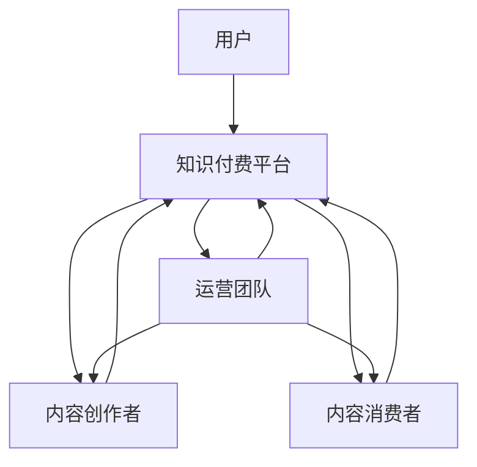
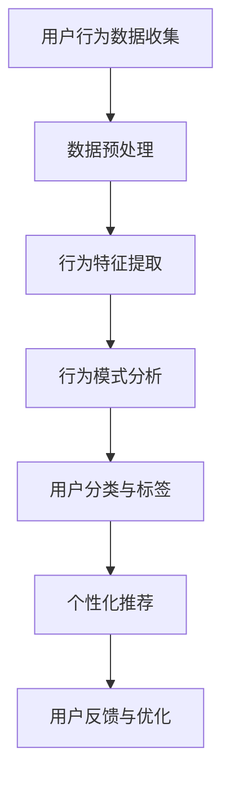

                 

## 文章标题：如何提高知识付费产品的用户活跃度

### 关键词：知识付费，用户活跃度，产品设计，运营策略，数据分析，案例分析，人工智能

#### 摘要：

知识付费产品的用户活跃度是衡量其市场表现和用户满意度的重要指标。本文将系统地探讨如何提高知识付费产品的用户活跃度。首先，我们将回顾知识付费市场的发展历程和现状，理解用户活跃度的定义与重要性。接着，通过用户行为分析和数据驱动的策略，深入探讨如何通过产品设计和运营优化来提升用户活跃度。最后，通过成功案例分析，总结提取成功经验，并提出未来的发展趋势与挑战。本文旨在为知识付费产品的开发者和运营者提供实用的策略和工具，以提升用户活跃度，实现产品的长远发展。

---

### 《如何提高知识付费产品的用户活跃度》目录大纲

#### 第一部分：基础知识与核心概念

- **第1章：知识付费产品概述**
  - **1.1 知识付费市场的兴起与现状**
  - **1.2 知识付费产品的分类**
  - **1.3 用户活跃度的定义与重要性**

- **第2章：用户行为分析**
  - **2.1 用户画像与用户需求分析**
  - **2.2 用户行为分析**
  - **2.3 用户反馈与改进**

#### 第二部分：提高用户活跃度的策略

- **第3章：产品设计优化**
  - **3.1 用户界面与交互设计**
  - **3.2 内容质量提升**
  - **3.3 社交互动功能**

- **第4章：运营策略**
  - **4.1 用户增长策略**
  - **4.2 推广策略**
  - **4.3 用户互动与反馈**

- **第5章：数据分析与优化**
  - **5.1 数据分析基础**
  - **5.2 用户活跃度数据分析**
  - **5.3 数据驱动优化**

#### 第三部分：成功案例分析

- **第6章：成功案例分析**
  - **6.1 案例分析概述**
  - **6.2 案例分析案例**
  - **6.3 案例分析总结**

#### 第四部分：未来趋势与挑战

- **第7章：未来趋势与挑战**
  - **7.1 行业发展趋势**
  - **7.2 挑战与应对**

#### 附录

- **附录A：知识付费产品开发工具与资源**
- **附录B：参考文献**

### 核心概念与联系

- **知识付费产品架构图**
- **用户行为分析流程图**
- **核心算法原理讲解（伪代码）**
- **数学模型和公式（LaTeX格式）**

### 项目实战

- **用户活跃度提升项目案例**
  - 项目背景与目标
  - 项目实施步骤
  - 代码实现与解读
  - 代码解读与分析

---

接下来，我们将逐章深入探讨知识付费产品的用户活跃度及其提升策略。

---

## 第1章：知识付费产品概述

### 1.1 知识付费市场的兴起与现状

知识付费产品是一种通过互联网平台，向用户收取费用以获取专业知识或技能的教育产品。它起源于传统教育行业，随着互联网技术的不断发展和用户消费习惯的改变，逐渐形成了一个庞大的市场。

**知识付费的定义与发展历程**

知识付费的定义相对简单，即用户为获取特定知识或技能而付费的行为。这种模式与传统教育模式有本质的不同，传统教育主要通过学校、培训机构等线下方式进行，而知识付费则是线上、点对点的学习模式。

知识付费的发展历程可以追溯到20世纪末21世纪初。最早的知识付费产品是以电子书、在线课程等形式出现的。随着互联网的普及和移动互联网的发展，知识付费市场迎来了爆发式增长。特别是在2016年以后，随着知识付费理念的普及，知识付费产品种类更加丰富，市场规模持续扩大。

**知识付费市场的规模与趋势**

根据相关数据统计，2016年至2020年，我国知识付费市场规模从189.4亿元增长到392亿元，年均增长率达到25.7%。预计到2025年，知识付费市场规模将突破1000亿元。

知识付费市场的快速增长主要得益于以下几个方面：

1. **用户需求增加**：随着社会竞争的加剧，用户对于提升自身知识水平和专业技能的需求日益增加。
2. **互联网普及**：移动互联网的普及和宽带网络的提速，为知识付费产品提供了良好的技术环境。
3. **平台生态完善**：以得到、知乎、喜马拉雅等为代表的平台，通过优质内容、用户互动和数据分析，为知识付费产品提供了完善的服务体系。

**用户对知识付费产品的需求分析**

用户对知识付费产品的需求主要表现在以下几个方面：

1. **学习效率高**：知识付费产品通常以视频、音频等形式提供内容，用户可以随时随地进行学习，大大提高了学习效率。
2. **内容质量高**：知识付费产品由专业内容创作者提供，内容质量较高，用户可以获得真正的知识价值。
3. **互动性强**：许多知识付费产品提供了用户互动功能，用户可以在学习过程中与其他用户进行交流，增强学习体验。

### 1.2 知识付费产品的分类

知识付费产品种类繁多，根据内容的不同，可以将其分为以下几个主要类别：

**传统教育类产品**

传统教育类产品主要包括在线课程、学历教育、职业培训等。这些产品主要针对学生的学历提升或职业技能培训，通常采用固定的教学计划和课程内容。

**专业知识类产品**

专业知识类产品主要面向专业人士，提供行业前沿知识、技术更新和业务技能培训。这些产品通常由行业专家或学者提供，内容具有很高的专业性和权威性。

**生活技能类产品**

生活技能类产品主要包括健康养生、家庭理财、家庭教育等。这些产品以提升用户的生活质量为目的，提供实用的生活知识和技巧。

**其他类型知识付费产品**

除了上述三类产品，知识付费产品还包括语言学习、艺术培养、编程学习等。这些产品针对不同年龄段和不同兴趣爱好的用户，提供多样化的学习内容。

### 1.3 用户活跃度的定义与重要性

**用户活跃度的概念与测量方法**

用户活跃度是指用户在一定时间内对知识付费产品的参与程度和频率。通常通过以下几个指标来衡量：

1. **登录频率**：用户在一定时间内登录知识付费平台的次数。
2. **内容消费时长**：用户在学习过程中实际消耗的时间。
3. **社交互动次数**：用户在平台上与其他用户互动的次数。

**用户活跃度对知识付费产品的影响**

用户活跃度对知识付费产品的影响至关重要。高活跃度意味着用户对产品内容有较高的满意度，这有助于产品的口碑传播和用户增长。相反，低活跃度可能表明产品存在问题，需要优化。

**提高用户活跃度的意义**

提高用户活跃度有以下几个重要意义：

1. **增加收入**：高活跃度意味着更多的用户付费，从而提高产品的收入。
2. **提升品牌价值**：活跃的用户群体有助于提升品牌形象，增强市场竞争力。
3. **优化产品**：通过用户行为数据，可以更好地了解用户需求，优化产品设计。

通过以上对知识付费产品的概述，我们为后续章节的深入探讨奠定了基础。接下来，我们将进一步分析用户行为，探讨如何通过产品设计和运营策略来提高用户活跃度。

---

## 第2章：用户行为分析

### 2.1 用户画像与用户需求分析

**用户画像的构建方法**

用户画像是指对用户的基本信息、行为特征和需求进行综合描述的过程。构建用户画像的目的是为了更好地了解用户，从而提供更加个性化的服务和产品。

构建用户画像通常包括以下几个步骤：

1. **数据收集**：收集用户的基本信息，如年龄、性别、教育程度、职业等，以及用户在平台上的行为数据，如登录频率、学习时长、消费行为等。
2. **数据预处理**：对收集到的数据进行清洗和整合，去除重复和错误数据，确保数据的质量。
3. **特征提取**：从原始数据中提取出有代表性的特征，如用户的兴趣偏好、行为模式等。
4. **模型训练**：使用机器学习算法对提取的特征进行建模，生成用户画像。

**用户需求的挖掘与分类**

用户需求的挖掘是指通过分析用户行为数据和用户反馈，了解用户在知识付费产品中的实际需求和期望。挖掘用户需求的方法包括：

1. **行为分析**：通过对用户行为数据的分析，识别用户的学习习惯、兴趣点和痛点。
2. **用户调研**：通过问卷调查、用户访谈等方式，直接了解用户的需求和期望。
3. **文本分析**：对用户评论、反馈等文本数据进行分析，挖掘用户的需求和情感。

用户需求的分类通常包括以下几个方面：

1. **学习需求**：用户希望学习新知识、提高技能的需求。
2. **社交需求**：用户希望在平台上与其他用户互动、交流的需求。
3. **娱乐需求**：用户希望通过学习获得放松和娱乐的需求。

**用户需求与产品设计的关联**

了解用户需求是产品设计的核心，用户需求直接影响产品的功能和界面设计。以下是如何将用户需求与产品设计关联起来的几个方面：

1. **功能设计**：根据用户的学习需求，设计符合用户需求的学习功能，如视频学习、音频学习、互动问答等。
2. **界面设计**：根据用户的交互需求，设计简洁直观的界面，提高用户的操作便捷性。
3. **内容设计**：根据用户的娱乐需求，设计有趣、富有吸引力的学习内容，提高用户的参与度。

通过构建用户画像和挖掘用户需求，可以更好地理解用户，从而设计出更符合用户需求的知识付费产品，提高用户满意度和活跃度。

### 2.2 用户行为分析

**用户行为的定义与分类**

用户行为是指用户在知识付费平台上的各种操作和互动。对用户行为进行分析可以帮助我们了解用户的使用习惯、兴趣点和潜在需求。用户行为的分类可以从多个维度进行，以下是几种常见的分类方法：

1. **按行为类型分类**：
   - **学习行为**：如观看视频、阅读文章、参与测试等。
   - **消费行为**：如购买课程、订阅内容、付费会员等。
   - **社交行为**：如评论、点赞、分享、加入讨论组等。

2. **按行为频率分类**：
   - **高频行为**：如每天登录、持续学习、频繁互动等。
   - **低频行为**：如偶尔登录、长时间未学习、少有互动等。

3. **按行为目的分类**：
   - **探索行为**：用户在寻找新的学习内容或功能。
   - **学习行为**：用户在认真学习、完成课程或任务。
   - **娱乐行为**：用户在通过学习获得娱乐或放松。

**用户行为数据收集与分析方法**

收集用户行为数据是进行用户行为分析的前提。以下是一些常见的用户行为数据收集方法：

1. **日志数据**：记录用户在平台上的各种操作，如点击、浏览、购买等。日志数据可以通过服务器日志、客户端日志等方式收集。
2. **用户调查**：通过问卷、访谈等方式直接获取用户的反馈和行为信息。
3. **文本分析**：对用户生成的文本数据，如评论、反馈、讨论等，进行自然语言处理，提取有价值的信息。

分析用户行为数据的方法包括：

1. **统计分析**：使用描述性统计、回归分析等方法，对用户行为数据进行分析，识别用户行为模式和趋势。
2. **数据挖掘**：使用机器学习、数据挖掘算法，从大量用户行为数据中挖掘隐藏的模式和关联。
3. **用户分群**：根据用户行为特征，将用户划分为不同的群体，以便进行有针对性的产品优化和运营策略。

**常见用户行为指标及其意义**

常见的用户行为指标包括：

1. **用户留存率**：衡量用户在一定时间内持续使用产品的比例。高留存率表明产品能够吸引并留住用户。
2. **用户活跃度**：衡量用户在平台上的活跃程度，通常通过登录次数、学习时长、互动次数等指标来衡量。高活跃度表明用户对产品内容有较高的参与度。
3. **用户转化率**：衡量用户从免费用户转化为付费用户的比例。高转化率表明产品能够有效地激发用户的付费意愿。
4. **用户满意度**：通过用户调查或评分系统，衡量用户对产品服务的满意度。高满意度通常与高用户留存率和活跃度相关。

这些用户行为指标对于知识付费产品的优化和运营具有重要意义。通过分析这些指标，可以了解产品的优势和不足，从而有针对性地进行产品改进和运营优化。

### 2.3 用户反馈与改进

**用户反馈的收集渠道与处理流程**

用户反馈是产品优化的重要依据。收集用户反馈的渠道包括：

1. **在线调查**：通过问卷、量表等方式，直接收集用户对产品功能和服务的评价。
2. **用户评论**：在产品平台上，用户可以留言评论，表达对产品的意见和体验。
3. **用户访谈**：通过电话、在线会议等方式，与用户进行深度交流，了解他们的真实需求和痛点。

用户反馈的处理流程通常包括以下几个步骤：

1. **反馈收集**：通过自动化工具或人工方式，收集用户反馈。
2. **初步筛选**：对收集到的反馈进行初步筛选，排除无关或重复的反馈。
3. **分类整理**：将反馈按照主题或问题进行分类整理，便于后续分析。
4. **分析评估**：对反馈进行分析评估，识别出主要问题和用户需求。
5. **改进实施**：根据分析结果，制定改进计划，实施产品优化。

**用户反馈的分析方法**

用户反馈的分析方法包括：

1. **文本分析**：使用自然语言处理技术，对用户反馈进行主题建模、情感分析等，识别出用户的主要问题和需求。
2. **统计分析**：使用描述性统计和回归分析等方法，分析用户反馈的频率、严重程度等，为产品优化提供数据支持。
3. **用户分群**：根据用户反馈，将用户划分为不同的群体，分析每个群体的反馈特点，以便有针对性地进行产品改进。

**用户反馈对产品改进的重要性**

用户反馈对产品改进具有重要意义。通过用户反馈，可以：

1. **发现产品问题**：用户反馈可以帮助我们发现产品中的漏洞、缺陷和用户体验问题，及时进行修复和改进。
2. **优化产品设计**：用户反馈提供了宝贵的改进建议，可以帮助我们优化产品功能、界面和内容，提高用户满意度。
3. **提升用户忠诚度**：及时响应用户反馈，表明我们对用户意见的重视，有助于增强用户对产品的信任和忠诚度。

综上所述，用户行为分析是提升知识付费产品用户活跃度的关键。通过构建用户画像、分析用户行为和收集用户反馈，可以深入了解用户需求，优化产品设计，从而提高用户满意度和活跃度。接下来，我们将探讨如何通过产品设计和运营策略来进一步提升用户活跃度。

---

## 第3章：产品设计优化

### 3.1 用户界面与交互设计

用户界面（UI）和交互设计（UX）是知识付费产品成功的重要因素。一个优秀的用户界面不仅能够吸引用户，还能提供良好的用户体验，从而提高用户活跃度。

**用户界面设计原则**

1. **简洁性**：界面应尽量简洁明了，避免过多的装饰和冗余元素，使用户能够迅速找到所需功能。
2. **一致性**：界面元素的设计应保持一致，包括色彩、字体、图标等，以减少用户的学习成本。
3. **易用性**：界面设计应考虑用户的操作习惯，确保用户能够轻松地进行各种操作。
4. **响应速度**：页面加载速度应尽可能快，以提高用户的操作体验。

**交互设计技巧**

1. **明确操作路径**：为用户设计明确的操作路径，避免用户在操作过程中迷失方向。
2. **提供即时反馈**：在用户进行操作时，应提供即时反馈，告知用户操作是否成功。
3. **人性化设计**：考虑用户的实际需求，提供人性化的设计，如错误提示、快捷键等。
4. **适应用户习惯**：设计应符合用户的习惯，如常用功能应放在显眼位置，以提高用户的使用效率。

**用户体验测试与优化**

用户体验测试是确保用户界面和交互设计成功的关键步骤。以下是一些用户体验测试和优化的方法：

1. **可用性测试**：邀请一组用户参与测试，观察用户在实际使用过程中的行为和反应，发现界面和交互中的问题。
2. **A/B测试**：通过对比不同设计方案的测试结果，找出用户更喜欢的方案，进行优化。
3. **用户调研**：通过问卷调查、用户访谈等方式，收集用户对界面和交互设计的反馈，进行针对性优化。
4. **迭代改进**：根据用户反馈和测试结果，不断迭代和改进界面和交互设计，提高用户体验。

### 3.2 内容质量提升

内容质量是知识付费产品的核心，直接影响用户的学习体验和满意度。以下是一些提升内容质量的方法：

**内容类型的多样化**

提供多样化的内容类型，可以满足不同用户的学习需求，提高产品的吸引力。常见的多样化内容类型包括：

1. **视频课程**：视频课程具有直观、生动的特点，适合讲解复杂的知识点。
2. **图文教程**：图文教程适合详细讲解理论知识和操作步骤。
3. **音频讲座**：音频讲座适合用户在通勤、运动等场景下进行学习。
4. **互动问答**：互动问答可以提高用户的参与度，增强学习的互动性。

**内容价值的提升方法**

提升内容价值的方法包括：

1. **深度讲解**：对知识点进行深入讲解，帮助用户更好地理解和掌握。
2. **实时更新**：保持内容的新鲜度，及时更新行业动态和最新技术。
3. **案例教学**：结合实际案例进行教学，使内容更具实用性。
4. **互动设计**：在内容中融入互动元素，如测试、讨论区等，提高用户的参与度。

**内容更新与维护策略**

定期更新和维护内容是确保内容质量的重要策略。以下是一些更新与维护策略：

1. **内容审核**：定期对内容进行审核，确保内容准确、无错误。
2. **用户反馈**：收集用户对内容的反馈，根据用户需求进行内容调整。
3. **合作创作**：与行业专家、学者等合作，共同创作高质量内容。
4. **用户调查**：通过用户调查了解用户对内容的需求和偏好，为内容更新提供依据。

### 3.3 社交互动功能

社交互动功能是提高知识付费产品用户活跃度的有效手段。通过社交互动，用户可以建立联系、分享经验，从而增加对产品的黏性。

**社交互动功能的设计原则**

1. **用户友好**：设计应简单易懂，便于用户快速上手。
2. **多样性**：提供多样化的社交互动形式，如讨论区、问答、社群等。
3. **安全性**：确保用户隐私和数据安全，避免用户信息泄露。
4. **可扩展性**：设计应具备良好的可扩展性，以便未来功能扩展和优化。

**社交互动功能的实现方法**

1. **社区论坛**：建立社区论坛，用户可以发布问题、分享经验、讨论学习心得。
2. **问答系统**：提供问答系统，用户可以在平台上提问，其他用户或专家进行回答。
3. **社群管理**：建立用户社群，由管理员或专家进行管理，组织线上或线下活动。
4. **互动评价**：设计互动评价系统，用户可以对内容进行评价和打分，促进优质内容的传播。

**社交互动功能对用户活跃度的提升作用**

1. **增强用户参与感**：社交互动功能使用户感受到自己是社区的一部分，增加参与感和归属感。
2. **提高用户留存率**：通过社交互动，用户可以与他人建立联系，提高对产品的黏性。
3. **促进口碑传播**：用户在社交互动中分享自己的学习成果和经验，有助于口碑传播，吸引新用户。
4. **丰富学习体验**：社交互动功能为用户提供了额外的学习途径，使学习过程更加丰富和有趣。

通过以上对用户界面与交互设计、内容质量和社交互动功能的讨论，我们可以看到，产品设计优化在提高知识付费产品用户活跃度方面具有重要作用。接下来，我们将探讨如何通过运营策略来进一步优化用户活跃度。

---

## 第4章：运营策略

### 4.1 用户增长策略

用户增长是知识付费产品成功的关键之一。有效的用户增长策略可以帮助产品快速扩大用户规模，提高市场占有率。以下是一些常见的用户增长策略：

**用户获取方法**

1. **内容营销**：通过高质量的原创内容吸引潜在用户，如撰写博客、发布视频教程、制作互动课程等。
2. **社交媒体推广**：利用社交媒体平台进行推广，如微博、微信公众号、抖音等，通过内容分享、活动宣传等方式吸引用户关注。
3. **KOL合作**：与知名博主、行业专家等KOL合作，通过他们的推荐和影响力吸引新用户。
4. **广告投放**：通过精准广告投放，如搜索引擎广告、社交媒体广告等，触达潜在用户。

**用户留存策略**

用户留存是指通过一系列措施，使已获取的用户继续使用和购买产品。以下是一些有效的用户留存策略：

1. **用户激活**：通过邮件、短信等渠道，向新用户发送激活邮件，引导他们完成注册、购买或开始学习。
2. **个性化推荐**：根据用户行为数据和需求，提供个性化的内容推荐，提高用户的学习体验和满意度。
3. **社区互动**：建立用户社区，鼓励用户参与讨论、分享经验，增强用户之间的互动和粘性。
4. **优惠活动**：定期推出优惠活动，如限时折扣、免费试学等，激励用户继续购买和参与学习。

**用户转化策略**

用户转化是指将潜在用户转化为付费用户的过程。以下是一些提高用户转化的策略：

1. **免费试学**：提供免费试学课程或体验版，让用户在免费体验后，更愿意转化为付费用户。
2. **阶梯式收费**：提供不同层次的付费课程，从免费到高级付费，满足不同用户的需求，逐步引导用户增加消费。
3. **优惠折扣**：通过优惠券、折扣码等优惠手段，降低用户的购买门槛，提高购买转化率。
4. **定制化服务**：根据用户需求和偏好，提供定制化的学习方案或服务，增加用户的满意度和忠诚度。

### 4.2 推广策略

推广策略是指通过一系列营销手段，扩大产品的影响力和用户规模。以下是一些常见的推广策略：

**推广渠道选择**

1. **搜索引擎**：通过搜索引擎优化（SEO）和搜索引擎营销（SEM），提高产品在搜索引擎中的排名，吸引更多用户访问。
2. **社交媒体**：利用社交媒体平台进行内容推广和互动，增加产品的曝光度和用户参与度。
3. **内容平台**：在知乎、得到、简书等垂直内容平台上发布优质内容，吸引目标用户关注。
4. **线上广告**：在各大门户网站、新闻网站等投放广告，扩大产品的知名度。

**推广内容设计**

1. **宣传文案**：撰写有吸引力、有针对性的宣传文案，突出产品的独特卖点和优势，吸引潜在用户。
2. **宣传视频**：制作生动、有趣的宣传视频，通过短视频平台传播，提高产品的曝光度。
3. **活动策划**：策划有趣、有吸引力的线上活动，如直播讲座、互动抽奖等，吸引用户参与，增加用户粘性。

**推广效果评估与优化**

1. **数据监测**：通过数据分析工具，如百度统计、Google Analytics等，实时监测推广活动的效果，了解用户来源、访问路径、转化率等数据。
2. **A/B测试**：通过A/B测试，对比不同推广策略的效果，找出最优方案，进行优化。
3. **用户反馈**：收集用户对推广内容的反馈，了解用户的需求和偏好，不断调整和优化推广策略。

### 4.3 用户互动与反馈

用户互动与反馈是提高用户满意度和活跃度的关键。以下是一些有效的用户互动与反馈策略：

**用户互动活动的设计与执行**

1. **线上讲座**：定期举办线上讲座，邀请行业专家分享知识和经验，吸引用户参与。
2. **互动问答**：设立问答专区，鼓励用户提问和回答，提高用户的参与度和互动性。
3. **用户调研**：定期开展用户调研，收集用户对产品和服务的意见和建议，了解用户需求。
4. **社群运营**：建立用户社群，通过微信群、QQ群等方式，组织线下或线上活动，增强用户之间的互动。

**用户反馈的处理与回应**

1. **快速响应**：对于用户反馈，应尽快给予回应，解决问题，提高用户满意度。
2. **分类处理**：根据用户反馈的问题类型，进行分类处理，如技术问题、服务问题、内容问题等，确保问题得到有效解决。
3. **公开回应**：对于普遍性的问题，可以通过公开回应的方式，向所有用户传达解决方案，增强用户信任。
4. **定期总结**：定期总结用户反馈和处理情况，分析问题根源，制定改进措施，持续优化产品和服务。

**用户关系管理策略**

1. **用户关怀**：通过节假日问候、生日祝福等方式，表达对用户的关怀，增强用户对产品的忠诚度。
2. **个性化服务**：根据用户需求和偏好，提供个性化的服务，如定制学习计划、专属客服等，提升用户满意度。
3. **长期价值**：注重与用户的长期关系维护，通过持续的服务和互动，保持用户的活跃度和忠诚度。

通过以上用户增长、推广策略和用户互动与反馈策略，可以有效地提高知识付费产品的用户活跃度。接下来，我们将探讨如何通过数据分析与优化来进一步提升用户活跃度。

---

## 第5章：数据分析与优化

### 5.1 数据分析基础

**数据分析的基本概念与方法**

数据分析是指使用统计学、机器学习等方法，从大量数据中提取有价值的信息和知识，以辅助决策和优化业务。数据分析通常包括以下几个步骤：

1. **数据收集**：收集相关的数据，可以是结构化数据（如数据库）、半结构化数据（如日志文件）或非结构化数据（如文本、图像等）。
2. **数据预处理**：对收集到的数据进行清洗、转换和整合，去除噪声和异常值，确保数据质量。
3. **数据探索**：通过可视化、描述性统计等方法，对数据的基本特征和分布进行初步探索。
4. **特征工程**：从原始数据中提取出有代表性的特征，用于建模和分析。
5. **模型选择与训练**：选择合适的模型，使用训练数据对其进行训练，以预测或分类目标变量。
6. **模型评估与优化**：评估模型的性能，通过交叉验证、调整模型参数等方法进行优化。

**数据分析工具介绍**

数据分析过程中常用的工具包括：

1. **Python**：Python是一种广泛应用于数据分析的编程语言，具有丰富的数据分析库，如Pandas、NumPy、SciPy等。
2. **R**：R是一种专门用于统计分析和图形绘制的编程语言，具有强大的数据处理和分析功能。
3. **Excel**：Excel是一种常用的电子表格软件，适用于简单的数据分析和可视化。
4. **Tableau**：Tableau是一种强大的数据可视化工具，可用于创建交互式的图表和报告。
5. **SQL**：SQL是一种用于数据库查询的语言，适用于数据收集、存储和管理。

**数据分析流程**

数据分析的一般流程包括以下几个步骤：

1. **问题定义**：明确数据分析的目标和问题，确定分析的范围和指标。
2. **数据收集**：收集相关的数据，包括内部数据和外部数据。
3. **数据清洗**：处理缺失值、异常值和重复值，确保数据质量。
4. **数据探索**：使用统计方法和可视化工具，对数据进行初步探索，发现数据特征和规律。
5. **特征工程**：提取有代表性的特征，并进行特征选择和变换。
6. **模型选择与训练**：选择合适的模型，使用训练数据对其进行训练。
7. **模型评估与优化**：评估模型的性能，通过交叉验证、调整参数等方法进行优化。
8. **结果解释与应用**：解释分析结果，将其应用于业务决策和产品优化。

### 5.2 用户活跃度数据分析

**用户活跃度数据收集与处理**

用户活跃度数据分析的第一步是收集相关的数据。用户活跃度数据通常包括以下内容：

1. **用户行为数据**：如登录次数、学习时长、互动次数、购买行为等。
2. **用户属性数据**：如用户ID、性别、年龄、教育程度、职业等。
3. **内容数据**：如课程ID、课程类型、学习内容等。

收集到的数据需要进行处理，以确保数据的质量和一致性。数据处理步骤包括：

1. **数据清洗**：去除重复、缺失和异常的数据，处理缺失值和异常值。
2. **数据整合**：将不同来源的数据进行整合，构建完整的用户活跃度数据集。
3. **数据标准化**：对数据进行标准化处理，如归一化、标准化等，以便于后续分析和建模。

**用户活跃度分析指标体系**

用户活跃度分析指标是衡量用户参与度和活跃程度的关键。以下是一些常见的用户活跃度分析指标：

1. **用户留存率**：在一定时间内，持续使用产品的用户比例。
   \[
   \text{用户留存率} = \frac{\text{持续使用用户数}}{\text{初始注册用户数}} \times 100\%
   \]
2. **活跃用户数**：在一定时间内，活跃度达到某个阈值的用户数量。
   \[
   \text{活跃用户数} = \sum_{i=1}^{n} \mathbb{1}_{(活跃度_i \geq \theta)}
   \]
   其中，\( \mathbb{1}_{(活跃度_i \geq \theta)} \)是一个指示函数，当用户活跃度 \( 活跃度_i \) 大于等于阈值 \( \theta \) 时，取值为1，否则为0。
3. **平均活跃度**：用户在一定时间内的平均活跃程度。
   \[
   \text{平均活跃度} = \frac{1}{n} \sum_{i=1}^{n} \text{活跃度_i}
   \]
4. **互动率**：用户在平台上进行互动的频率。
   \[
   \text{互动率} = \frac{\text{互动次数}}{\text{用户数}} \times 100\%
   \]

**用户活跃度数据可视化与解读**

用户活跃度数据可视化是将复杂的数据以图形化的形式展示，便于理解和分析。以下是一些常见的用户活跃度数据可视化方法：

1. **折线图**：用于展示用户活跃度随时间的变化趋势。
2. **柱状图**：用于比较不同时间段、不同用户群体之间的活跃度差异。
3. **饼图**：用于展示用户活跃度的分布情况，如活跃用户数占总用户数的比例。
4. **散点图**：用于展示用户活跃度与其他变量（如用户年龄、教育程度等）之间的关系。

通过对用户活跃度数据的可视化，可以直观地了解用户的活跃程度和变化趋势，发现潜在的问题和机会。例如，通过分析用户留存率的变化，可以发现产品的哪些功能或内容可能存在问题，需要改进。

### 5.3 数据驱动优化

**数据驱动产品优化方法**

数据驱动优化是指通过数据分析来指导产品设计和优化，以提高用户体验和产品性能。以下是一些常见的数据驱动产品优化方法：

1. **A/B测试**：通过对比不同设计方案的A/B测试，确定哪种方案能够更好地满足用户需求，从而优化产品设计。
2. **用户体验测试**：邀请用户参与用户体验测试，观察和记录用户在使用产品时的行为和反应，识别出产品中的问题和改进机会。
3. **用户反馈分析**：收集和分析用户的反馈，了解他们对产品的看法和建议，将其转化为具体的优化措施。
4. **行为数据监测**：通过数据监测工具，实时跟踪用户的行为数据，发现用户在使用产品过程中的痛点，及时进行优化。

**数据驱动运营优化方法**

数据驱动运营优化是指通过数据分析来指导运营策略的制定和调整，以提高用户活跃度和满意度。以下是一些常见的数据驱动运营优化方法：

1. **用户分群**：通过数据分析，将用户划分为不同的群体，针对每个群体制定有针对性的运营策略，提高运营效果。
2. **个性化推荐**：根据用户的行为数据和偏好，提供个性化的内容推荐，提高用户的参与度和满意度。
3. **活动优化**：通过数据分析，评估不同活动的效果，优化活动的形式、内容和推广策略，提高活动的参与率和转化率。
4. **客户关系管理**：通过数据分析，了解用户的购买行为和需求，提供个性化的客户服务，提高用户满意度和忠诚度。

**数据驱动用户增长策略**

数据驱动用户增长策略是指通过数据分析来指导用户获取和用户增长策略的制定和优化，以提高用户规模和市场占有率。以下是一些常见的数据驱动用户增长策略：

1. **精准营销**：通过数据分析，确定目标用户群体，制定精准的营销策略，提高广告投放的效果。
2. **渠道优化**：通过数据分析，评估不同渠道的用户获取成本和效果，优化渠道组合，降低获取用户的成本。
3. **内容优化**：通过数据分析，了解用户对哪些类型的内容更感兴趣，优化内容生产和推荐策略，提高内容的吸引力和传播效果。
4. **用户反馈优化**：通过数据分析，了解用户的反馈和需求，及时调整产品和服务，提高用户的满意度和忠诚度。

通过数据分析和数据驱动的优化方法，知识付费产品可以更好地了解用户需求，优化产品设计和服务，提高用户活跃度和满意度，实现持续的增长和发展。

---

## 第6章：成功案例分析

### 6.1 案例分析概述

案例分析是了解知识付费产品用户活跃度提升策略的有效方法。通过研究成功的知识付费产品案例，我们可以提取成功经验，反思问题，并得出有价值的启示。

**案例分析的目的与意义**

案例分析的目的在于：

1. **提取成功经验**：通过分析成功案例，了解其成功的核心因素和关键策略。
2. **发现问题**：通过对比自身产品和成功案例，识别自身产品的不足和改进方向。
3. **提供启示**：为知识付费产品的开发者和运营者提供实用的策略和建议。

**案例分析的框架与方法**

案例分析通常包括以下几个步骤：

1. **案例选择**：选择具有代表性、成功显著的知识付费产品作为分析对象。
2. **数据收集**：收集案例的相关数据，包括市场数据、用户数据、产品数据等。
3. **数据整理**：整理和分析收集到的数据，提取关键信息和模式。
4. **问题识别**：通过对比和分析，识别案例中的问题和挑战。
5. **成功因素分析**：分析案例中的成功因素，提取成功经验和策略。
6. **总结与启示**：总结分析结果，提出针对自身产品的改进建议和策略。

### 6.2 案例分析案例

**案例一：某知名知识付费平台**

**背景**：

某知名知识付费平台成立于2016年，以提供高质量的视频课程为主，包括职业发展、技能提升、个人成长等领域。通过邀请行业专家和知名讲师，平台迅速积累了大量用户，成为知识付费市场的佼佼者。

**成功因素**：

1. **高质量内容**：平台注重内容质量，与知名专家和机构合作，提供高质量的课程内容。
2. **用户体验优化**：平台注重用户体验，通过简洁的界面设计、流畅的操作流程和快速的内容加载，提升用户的使用体验。
3. **社交互动功能**：平台提供了强大的社交互动功能，如讨论区、问答、社群等，鼓励用户互动和交流，增强用户黏性。
4. **用户分群与个性化推荐**：平台通过用户行为数据和用户画像，实现用户分群和个性化推荐，提高用户的参与度和满意度。

**问题与反思**：

尽管该平台在用户活跃度方面取得了显著成果，但仍有以下问题：

1. **内容同质化**：随着竞争的加剧，平台上的内容逐渐趋于同质化，用户的选择变得更加多样，需要进一步差异化内容。
2. **用户体验提升空间**：尽管用户体验已经较好，但在某些细节上仍有改进空间，如个性化推荐算法的优化、互动功能的进一步丰富等。
3. **用户增长瓶颈**：平台在用户增长方面遇到了瓶颈，需要通过创新和多样化策略，继续扩大用户规模。

**案例二：某专业知识分享社区**

**背景**：

某专业知识分享社区成立于2018年，以提供专业知识分享和交流为主，覆盖多个行业领域，如技术、金融、医疗等。通过专业内容创作者和高质量的用户互动，社区吸引了大量专业人士。

**成功因素**：

1. **专业内容创作者**：社区注重吸引专业内容创作者，提供高质量的原创内容，满足专业人士的学习需求。
2. **社区互动**：社区提供了丰富的互动功能，如问答、讨论区、直播等，鼓励用户积极参与和交流。
3. **个性化推荐**：社区通过分析用户行为数据，提供个性化的内容推荐，提高用户的参与度和满意度。
4. **用户反馈机制**：社区建立了完善的用户反馈机制，及时处理用户问题，提高用户满意度。

**问题与反思**：

尽管该社区在用户活跃度方面表现良好，但仍有以下问题：

1. **内容质量参差不齐**：由于内容创作者众多，部分内容质量较低，影响用户体验。
2. **用户增长乏力**：社区在用户增长方面遇到了困难，需要通过增加曝光度和推广力度，扩大用户基础。
3. **互动氛围维护**：虽然提供了丰富的互动功能，但需要进一步优化互动氛围，提高用户的活跃度。

**案例三：某生活技能类知识付费产品**

**背景**：

某生活技能类知识付费产品成立于2019年，提供家庭理财、健康养生、家庭教育等生活技能课程。通过实用性强的内容和高性价比的价格，产品迅速获得了用户认可。

**成功因素**：

1. **实用性内容**：产品提供的生活技能内容实用性强，解决用户的实际问题，提高用户满意度。
2. **高性价比**：产品定价合理，性价比高，吸引大量用户购买和使用。
3. **用户互动**：产品提供了用户互动功能，如社群、问答等，促进用户之间的交流和合作。
4. **定期更新**：产品定期更新内容，保持内容的新鲜度和实用性。

**问题与反思**：

尽管该产品在用户活跃度方面表现良好，但仍有以下问题：

1. **内容覆盖面不足**：产品内容覆盖面较窄，需要进一步扩大内容领域，满足更多用户的需求。
2. **用户体验优化**：虽然用户体验已经较好，但仍有优化空间，如界面设计、操作流程等。
3. **用户留存率**：用户留存率较低，需要通过提高用户满意度和提供增值服务，提高用户的留存率。

通过以上案例分析，我们可以看到成功知识付费产品在用户活跃度方面的一些共同成功因素，如高质量内容、用户体验优化、用户互动和个性化推荐。同时，我们也识别出一些常见问题，如内容同质化、用户体验提升空间和用户增长瓶颈。这些分析结果可以为知识付费产品的开发者和运营者提供宝贵的参考和启示。

---

### 6.3 案例分析总结

**成功经验提取**

通过对多个知识付费产品的案例分析，我们提取出以下成功经验：

1. **高质量内容**：高质量的内容是用户活跃度的重要驱动力，与知名专家和机构合作，提供权威、实用的内容。
2. **用户体验优化**：简洁直观的界面设计、流畅的操作流程和快速的内容加载，可以显著提高用户的满意度和使用体验。
3. **社交互动功能**：提供丰富的社交互动功能，如讨论区、问答、社群等，增强用户之间的互动和社区氛围。
4. **个性化推荐**：通过用户行为数据，实现用户分群和个性化推荐，提高用户的参与度和满意度。
5. **用户反馈机制**：建立完善的用户反馈机制，及时处理用户问题，提高用户满意度。

**问题与反思**

在案例分析中，我们也发现了一些普遍存在的问题：

1. **内容同质化**：随着竞争的加剧，内容同质化现象日益严重，需要通过创新和差异化策略，提升内容的独特性和竞争力。
2. **用户体验提升空间**：虽然大多数产品的用户体验已经较好，但在某些细节上仍有改进空间，如个性化推荐算法、互动功能等。
3. **用户增长瓶颈**：在用户规模扩大后，用户增长可能会遇到瓶颈，需要通过创新和多样化策略，继续扩大用户规模。
4. **内容质量参差不齐**：部分平台的内容质量较低，影响用户体验，需要建立更严格的内容审核和监管机制。

**案例对提高用户活跃度的启示**

成功案例和问题反思为知识付费产品的开发者和运营者提供了以下启示：

1. **持续关注用户需求**：通过用户调研和数据分析，了解用户需求，持续优化产品内容和功能，满足用户的需求。
2. **注重用户体验**：从用户角度出发，优化界面设计、操作流程和内容呈现方式，提高用户的满意度和使用体验。
3. **增强社交互动**：提供丰富的社交互动功能，鼓励用户互动和交流，增强社区的活跃度和用户黏性。
4. **个性化推荐与分群**：通过数据分析和用户分群，提供个性化的内容和推荐，提高用户的参与度和满意度。
5. **内容创新与差异化**：通过内容创新和差异化策略，提升内容的独特性和竞争力，吸引更多用户。

通过以上成功经验和反思，知识付费产品的开发者和运营者可以更好地理解用户需求，优化产品设计和服务，提高用户活跃度，实现产品的持续发展。

---

## 第7章：未来趋势与挑战

### 7.1 行业发展趋势

知识付费行业正迎来快速发展的机遇，主要趋势包括：

**人工智能与知识付费的结合**

人工智能技术在知识付费领域的应用日益广泛，主要体现在：

1. **个性化推荐**：通过机器学习算法，分析用户行为数据，提供个性化的内容推荐，提高用户的参与度和满意度。
2. **智能客服**：利用自然语言处理技术，实现智能客服系统，为用户提供24/7的在线服务，提高客户体验。
3. **智能学习分析**：通过分析用户的学习行为数据，预测用户的学习需求，提供定制化的学习路径和辅导。

**新型知识付费产品的形态**

随着技术的进步，新型知识付费产品形态不断涌现，包括：

1. **沉浸式学习体验**：利用虚拟现实（VR）和增强现实（AR）技术，提供沉浸式的学习体验，提高用户的参与感和学习效果。
2. **互动式学习平台**：结合直播、互动问答、社群等元素，打造互动式学习平台，增强用户之间的交流和合作。
3. **知识图谱**：通过构建知识图谱，实现知识点的关联和链接，帮助用户更好地理解和掌握知识。

### 7.2 挑战与应对

**内容质量与同质化问题**

**挑战**：随着知识付费市场的扩大，内容质量参差不齐，同质化问题日益严重，用户的选择变得更加多样。

**应对策略**：

1. **严格内容审核**：建立完善的内容审核机制，确保内容的权威性和专业性。
2. **差异化内容策略**：提供差异化内容，满足不同用户群体的需求，避免内容同质化。
3. **用户评价与反馈**：鼓励用户对内容进行评价和反馈，通过用户反馈优化内容质量。

**用户隐私与数据安全**

**挑战**：随着用户数据的增加，用户隐私和数据安全成为重要挑战。

**应对策略**：

1. **数据加密与存储**：采用先进的加密技术和安全存储方案，确保用户数据的安全。
2. **隐私政策与透明度**：明确隐私政策，向用户告知数据收集、使用和共享的方式，提高用户的信任度。
3. **安全审计与监管**：定期进行安全审计，确保数据安全和合规性。

**市场竞争与用户留存**

**挑战**：市场竞争日益激烈，用户留存成为知识付费产品的重大挑战。

**应对策略**：

1. **用户增长策略**：通过精准营销、用户分群和个性化推荐，提高用户获取和留存率。
2. **用户体验优化**：持续优化产品功能和用户体验，提高用户的满意度和忠诚度。
3. **用户互动与反馈**：建立互动平台，鼓励用户参与和反馈，增强用户黏性。

通过应对这些挑战，知识付费产品可以不断提升用户活跃度，实现可持续发展。

---

## 附录A：知识付费产品开发工具与资源

### A.1 开发工具

**内容管理系统**

1. **WordPress**：一款功能强大的内容管理系统，适用于搭建知识付费平台。
2. **Moodle**：一款专门用于在线教育的开源内容管理系统。
3. **LearnPress**：一款适用于WordPress的在线课程管理系统。

**数据分析工具**

1. **Google Analytics**：一款强大的网站分析工具，适用于分析用户行为数据。
2. **Tableau**：一款可视化的数据分析工具，适用于数据可视化。
3. **Python Pandas**：一款强大的Python数据分析库，适用于数据处理和分析。

**用户行为分析工具**

1. **Mixpanel**：一款用户行为分析工具，适用于追踪和分析用户行为。
2. **Heap Analytics**：一款无代码的用户行为分析工具，适用于自动化追踪用户行为。
3. **Kibana**：一款基于Elasticsearch的可视化分析工具，适用于大规模数据的可视化。

### A.2 资源

**知识付费产品开发资源推荐**

1. **《知识服务：商业与设计》**：一本关于知识付费产品设计和商业模式的书籍。
2. **《数据分析实战》**：一本关于数据分析方法和实践技巧的书籍。
3. **《用户体验要素》**：一本关于用户体验设计的经典著作。

**行业报告与研究成果**

1. **艾瑞咨询**：《2021年中国知识付费行业研究报告》
2. **腾讯研究院**：《2020年中国数字内容产业发展报告》
3. **艾媒咨询**：《2021年中国在线教育行业报告》

**社交媒体与社区资源**

1. **知乎**：一个专业的问答社区，适用于学习交流和问题解决。
2. **得到**：一个专注知识付费的平台，提供各类优质课程。
3. **简书**：一个文学社区，适用于分享和学习文字内容。

通过以上工具和资源，知识付费产品的开发者和运营者可以更好地理解用户需求，优化产品设计和运营策略，提高用户活跃度。

---

## 附录B：参考文献

### 知识付费相关书籍与论文

1. **《知识服务：商业与设计》** - 作者：Maurice B. Line
2. **《知识付费时代的崛起与变革》** - 作者：李伟科
3. **《知识共享与知识付费的关系研究》** - 作者：王翠云，刘晓燕
4. **《基于大数据的知识付费用户行为分析》** - 作者：刘志军，杨晨

### 用户活跃度相关书籍与论文

1. **《用户行为分析：方法与实践》** - 作者：Ning Li
2. **《用户行为建模与预测》** - 作者：Chengyi Wang，Chenguang Hu
3. **《用户留存与增长：策略与实践》** - 作者：唐彬，王伟
4. **《社交媒体用户活跃度研究》** - 作者：徐志宏，李晓晨

### 行业报告与研究成果

1. **艾瑞咨询**：《2021年中国知识付费行业研究报告》
2. **腾讯研究院**：《2020年中国数字内容产业发展报告》
3. **艾媒咨询**：《2021年中国在线教育行业报告》
4. **高德纳咨询公司（Gartner）**：《2021年全球数字内容产业展望》

### 开发工具与资源参考资料

1. **WordPress官网**：[https://wordpress.org/](https://wordpress.org/)
2. **Moodle官网**：[https://moodle.org/](https://moodle.org/)
3. **LearnPress官网**：[https://wordpress.org/plugins/learnpress/](https://wordpress.org/plugins/learnpress/)
4. **Google Analytics官网**：[https://analytics.google.com/](https://analytics.google.com/)
5. **Tableau官网**：[https://www.tableau.com/](https://www.tableau.com/)
6. **Python Pandas文档**：[https://pandas.pydata.org/](https://pandas.pydata.org/)
7. **Mixpanel官网**：[https://mixpanel.com/](https://mixpanel.com/)
8. **Heap Analytics官网**：[https://heap.io/](https://heap.io/)
9. **Kibana官网**：[https://www.elastic.co/products/kibana](https://www.elastic.co/products/kibana)
10. **知乎官网**：[https://www.zhihu.com/](https://www.zhihu.com/)
11. **得到官网**：[https://www.getting.com/](https://www.getting.com/)
12. **简书官网**：[https://www.jianshu.com/](https://www.jianshu.com/)

通过参考以上书籍、论文、行业报告和开发工具资源，读者可以更深入地了解知识付费产品用户活跃度提升的各个方面，为实际操作提供指导和借鉴。作者：AI天才研究院/AI Genius Institute & 禅与计算机程序设计艺术 /Zen And The Art of Computer Programming。

---

### 8.1 知识付费产品架构图

**Mermaid流程图**



在这个架构图中，用户是核心，他们是知识的消费者和评价者。内容创作者为用户生产高质量的内容，运营团队负责平台的运营、用户管理和内容审核。知识付费平台则是整个架构的核心，它连接了用户、内容创作者和运营团队，通过提供优质的内容和服务，实现用户的持续活跃和增长。

---

### 8.2 用户行为分析流程图

**Mermaid流程图**



在这个用户行为分析流程图中，用户行为数据收集是起点，通过数据预处理、行为特征提取、行为模式分析等步骤，可以识别出用户的行为模式和偏好。然后，根据这些模式进行用户分类与标签，以便于提供个性化的推荐。最后，通过收集用户反馈，不断优化推荐系统，提高用户满意度和活跃度。

---

### 9.1 个性化推荐算法

**伪代码**

```python
def recommend(user, content库):
    user兴趣 = getUserInterests(user)
    内容相似度 = calculateContentSimilarity(content库, user兴趣)
    推荐列表 = selectTopContents(content相似度)
    return 推荐列表

def getUserInterests(user):
    # 根据用户历史行为和偏好，提取用户兴趣
    # 例如：获取用户观看最多的视频类型、评分最高的课程等
    return user兴趣

def calculateContentSimilarity(content库, user兴趣):
    # 计算用户兴趣与每个内容的相似度
    # 可以使用余弦相似度、皮尔逊相关系数等方法
    相似度列表 = []
    for content in content库:
        相似度 = calculateSimilarity(user兴趣, content特征)
        相似度列表.append((content, 相似度))
    return 相似度列表

def selectTopContents(similarity_list, top_n=5):
    # 从相似度列表中选择Top N个最相似的内容
    sorted_list = sorted(similarity_list, key=lambda x: x[1], reverse=True)
    top_contents = [content for content, _ in sorted_list[:top_n]]
    return top_contents
```

在这个个性化推荐算法中，首先通过 `getUserInterests` 函数获取用户的兴趣。然后，通过 `calculateContentSimilarity` 函数计算用户兴趣与每个内容的相似度。最后，使用 `selectTopContents` 函数从相似度最高的内容中选择Top N个推荐给用户。

---

### 9.2 用户行为预测算法

**伪代码**

```python
def predictUserBehavior(user, history_data):
    user行为模式 = extractUserBehaviorFeatures(user, history_data)
    预测行为 = applyMachineLearningModel(user行为模式)
    return 预测行为

def extractUserBehaviorFeatures(user, history_data):
    # 从用户历史行为数据中提取特征
    # 例如：学习时长、互动次数、购买行为等
    特征列表 = []
    for data_point in history_data:
        feature_vector = extractFeatures(data_point)
        特征列表.append(feature_vector)
    return 特征列表

def extractFeatures(data_point):
    # 提取单个数据点的特征
    # 例如：学习时长、互动次数等
    return {
        '学习时长': data_point['learning_time'],
        '互动次数': data_point['interaction_count'],
        '购买行为': data_point['purchase_behavior']
    }

def applyMachineLearningModel(feature_list):
    # 使用机器学习模型预测用户行为
    # 例如：使用决策树、随机森林、神经网络等模型
    预测模型 = trainModel(feature_list)
    预测行为 = 预测模型.predict(feature_list)
    return 预测行为

def trainModel(feature_list):
    # 训练机器学习模型
    # 可以使用Scikit-learn、TensorFlow等库
    model = someMachineLearningModel()
    model.fit(feature_list, labels)
    return model
```

在这个用户行为预测算法中，首先通过 `extractUserBehaviorFeatures` 函数从用户历史行为数据中提取特征。然后，使用这些特征训练机器学习模型，通过 `applyMachineLearningModel` 函数进行预测。这个过程可以帮助平台更好地理解用户的行为模式，从而提供个性化的推荐和服务。

---

### 10.1 评分预测模型

**LaTeX格式**

```latex
\text{预测评分} = \text{用户特征向量} \cdot \text{内容特征向量} + \text{偏置项}
```

在这个评分预测模型中，预测评分是用户特征向量和内容特征向量的点积加上一个偏置项。这个模型假设用户和内容都有若干个特征，每个特征都有一个权重。通过训练数据集，可以计算出这些权重，然后用于预测新的评分。

---

### 10.2 用户活跃度模型

**LaTeX格式**

```latex
\text{用户活跃度} = \alpha \cdot (\text{登录次数} + \text{内容消费时长}) + \beta \cdot \text{社交互动次数}
```

在这个用户活跃度模型中，用户活跃度是登录次数和内容消费时长的加权和，再加上社交互动次数的权重。这里，\(\alpha\) 和 \(\beta\) 是权重参数，可以通过训练数据集进行估计。这个模型可以帮助衡量用户在一定时间内的活跃程度。

---

### 11.1 用户活跃度提升项目案例

**项目背景与目标**

**背景**：

某知名知识付费平台近年来用户活跃度呈现下降趋势，用户流失率较高，需要找到有效的方法提升用户活跃度。

**目标**：

1. 提高用户留存率，降低用户流失率。
2. 增强用户互动，提升用户参与度。
3. 优化内容推荐，提高用户满意度。

**项目实施步骤**

**步骤1：用户调研与分析**

1. 设计用户调研问卷，收集用户对产品功能、内容、用户体验等方面的反馈。
2. 分析用户行为数据，了解用户的使用习惯和偏好。

**步骤2：制定优化策略**

1. 根据用户调研和分析结果，制定具体的优化策略，包括界面设计、内容质量提升、社交互动功能优化等。
2. 制定数据驱动的推荐系统，优化内容推荐策略。

**步骤3：实施优化措施**

1. 对平台界面进行优化，提高用户操作的便捷性和满意度。
2. 更新和丰富内容库，提升内容质量。
3. 加强社交互动功能，鼓励用户参与社区讨论。

**步骤4：监控与调整**

1. 通过数据分析工具，实时监控用户活跃度和用户留存率等关键指标。
2. 根据监控结果，及时调整优化策略。

**代码实现与解读**

**步骤1：用户调研问卷设计**

```python
import pandas as pd

# 设计用户调研问卷
questions = [
    "您通常多久登录一次平台？",
    "您每天在平台上学习多长时间？",
    "您是否经常参与平台上的讨论和互动？",
    "您认为平台内容的质量如何？",
    "您对平台界面设计有何建议？"
]

# 收集用户反馈
user_feedback = pd.DataFrame({
    'login_frequency': [],
    'learning_time': [],
    'interaction_frequency': [],
    'content_quality': [],
    'ui_suggestions': []
})

for i in range(100):  # 假设收集了100份反馈
    print("问卷第", i+1, "开始：")
    for question in questions:
        print(question)
        answer = input("请回答：")
        user_feedback.loc[i, question] = answer
    print("\n")

print("用户调研问卷收集完毕，数据分析开始。")
```

在这个代码段中，我们使用Python和Pandas库设计了一个简单的用户调研问卷，并收集了100份用户的反馈。通过这个问卷，我们可以了解用户的使用习惯、对内容的评价和对界面的建议。

**步骤2：内容推荐系统优化**

```python
from sklearn.model_selection import train_test_split
from sklearn.metrics.pairwise import cosine_similarity
from sklearn.neighbors import NearestNeighbors

# 假设我们已经有用户行为数据和内容数据
user_data = ...  # 用户行为数据
content_data = ...  # 内容数据

# 分割数据集
train_data, test_data = train_test_split(user_data, test_size=0.2, random_state=42)

# 计算内容相似度矩阵
content_similarity = cosine_similarity(content_data)

# 使用K近邻算法进行推荐
neighb

