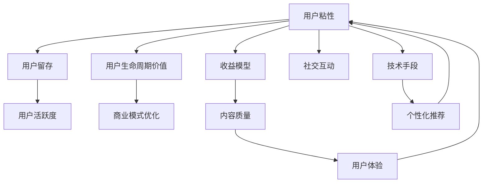

                 

### 文章标题：如何提高知识付费产品的用户粘性

#### 关键词：知识付费、用户粘性、用户体验、内容策略、技术手段、案例分析

#### 摘要：
本文旨在探讨知识付费产品如何通过多方面的策略提升用户粘性，从而增加用户留存率和商业价值。文章首先介绍了用户粘性的基础理论和重要性，接着分析了知识付费产品的用户行为，并探讨了用户粘性对商业模式的优化。随后，文章提出了产品设计与用户体验优化、内容策略与知识传播、社交媒体与用户互动、技术手段与数据分析等实战策略，并通过具体案例进行了深入分析。最后，文章总结了用户粘性提升的持续优化方法，并对未来发展趋势进行了展望。

### 目录大纲

#### 第一部分：用户粘性概念与理论探讨

- 第1章：用户粘性基础理论
  - 1.1 用户粘性的定义与重要性
  - 1.2 知识付费产品的用户行为分析
  - 1.3 用户粘性与商业价值

- 第2章：用户粘性与收益模型
  - 2.1 用户粘性与用户生命周期价值
  - 2.2 用户粘性对商业模式的优化
  - 2.3 用户粘性的战略意义

#### 第二部分：提高用户粘性的实战策略

- 第3章：产品设计与用户体验优化
  - 3.1 产品设计原则
  - 3.2 用户体验优化策略

- 第4章：内容策略与知识传播
  - 4.1 内容质量提升
  - 4.2 知识传播方法

- 第5章：社交媒体与用户互动
  - 5.1 社交媒体策略
  - 5.2 用户互动管理

- 第6章：技术手段与数据分析
  - 6.1 技术手段提升用户粘性
  - 6.2 数据分析策略

- 第7章：用户粘性提升案例研究
  - 7.1 案例一：知识付费平台A的粘性提升实践
  - 7.2 案例二：知识付费平台B的用户体验优化

- 第8章：持续优化与未来展望
  - 8.1 用户粘性提升的持续优化
  - 8.2 未来发展趋势与挑战

- 附录
  - 附录 A：知识付费产品用户粘性提升工具与资源

#### 下一章节：第1章 用户粘性基础理论

## 第1章：用户粘性基础理论

### 1.1 用户粘性的定义与重要性

#### 1.1.1 用户粘性的定义

用户粘性（User stickiness）是指用户在一定时间内持续使用某一产品的能力。它反映了用户对产品的依赖程度和忠诚度。用户粘性是衡量用户对产品使用频率和时长的重要指标，直接影响到用户的留存率和活跃度。

在知识付费产品领域，用户粘性尤为重要。这类产品通常需要用户长期、持续地消费内容，因此，提高用户粘性意味着提升用户对产品的依赖和忠诚度，从而增加用户的留存率和生命周期价值。

#### 1.1.2 用户粘性与用户留存的关系

用户留存（User retention）是指在一定时间内，用户继续使用某一产品的比例。用户粘性和用户留存密切相关。用户粘性高的产品往往具有更高的用户留存率。具体而言：

- **首次使用后的留存率**：用户在首次使用产品后的短期内是否继续使用，反映了产品对用户的吸引力。
- **长期留存率**：用户在较长时间内（如一个月、三个月或一年）是否继续使用产品，反映了产品的长期用户价值。

提高用户粘性有助于提升用户留存率，从而增加产品的市场竞争力。以下是用户粘性与用户留存关系的一个简化流程图：

```
+----------------+     +----------------+
|      用户      |     |      产品      |
+----------------+     +----------------+
          |       使用后留存         |
          |                             |
+--------> |   用户粘性提高 -> 用户留存提高 |
+--------> |   用户留存提高 -> 用户活跃提升 |
+--------> |                             |
+--------> |                             |
+--------> |   用户生命周期价值提高      |
+--------> |                             |
+--------> |                             |
+--------> |   商业价值提高             |
+--------> |                             |
+--------> |                             |
+--------> |   市场竞争力提高           |
+--------> |                             |
+--------> |                             |
```

#### 1.1.3 用户粘性的测量指标

测量用户粘性通常需要依赖以下指标：

1. **每日活跃用户数（DAU）**：指每日使用产品的用户数量，反映了产品在一天内的用户活跃度。
2. **月活跃用户数（MAU）**：指一个月内至少使用一次产品的用户数量，反映了产品在一个月内的用户活跃度。
3. **使用频率**：指用户在一段时间内使用产品的次数，通常以日、周、月为单位计算。
4. **使用时长**：指用户在一段时间内使用产品的时间总和，通常以秒、分钟、小时为单位计算。
5. **留存率**：指在一段时间内，用户继续使用产品的比例。

通过这些指标，可以综合评估用户对产品的粘性。以下是一个用户粘性评估的示例框架：

```
用户粘性评估框架

+----------------+           +----------------+
|  指标名称      |     计算  |  指标含义      |
+----------------+           +----------------+
|  DAU           |   每日活跃用户数 |
+----------------+           +----------------+
|  MAU           |   每月活跃用户数 |
+----------------+           +----------------+
|  使用频率       |   日/周/月平均 |
+----------------+           +----------------+
|  使用时长       |   秒/分钟/小时 |
+----------------+           +----------------+
|  留存率         |   持续使用率   |
+----------------+           +----------------+
```

### 1.2 知识付费产品的用户行为分析

#### 1.2.1 用户粘性的驱动因素

知识付费产品的用户粘性受多种因素驱动，主要包括：

1. **内容质量**：高质量、有价值的内容是用户粘性的关键因素。内容应满足用户的学习需求，具备权威性和实用性。
2. **用户体验**：良好的用户体验能够提高用户满意度，从而增强用户粘性。包括界面设计、功能易用性、操作流畅性等。
3. **社交互动**：用户间的互动和分享可以增强社区氛围，提高用户的参与度和忠诚度。
4. **个性化推荐**：根据用户行为和偏好进行个性化推荐，能够满足用户的个性化需求，提高用户粘性。
5. **服务与支持**：及时、有效的服务与支持能够解决用户问题，提高用户满意度，从而增加用户粘性。

#### 1.2.2 用户生命周期与粘性关系

用户生命周期（Customer Lifecycle）是指用户从接触到最终离开产品的整个过程。知识付费产品的用户生命周期通常包括以下阶段：

1. **获取阶段**：通过营销活动、推广渠道等手段吸引用户关注和注册。
2. **激活阶段**：用户首次使用产品，开始体验内容和服务。
3. **留存阶段**：用户持续使用产品，参与社区互动，享受内容价值。
4. **推荐阶段**：满意用户将产品推荐给其他潜在用户，形成口碑传播。
5. **流失阶段**：用户因各种原因停止使用产品，离开产品。

用户生命周期各阶段与用户粘性的关系如下：

- **获取阶段**：用户粘性较低，主要通过营销活动和用户体验来吸引注册。
- **激活阶段**：用户粘性有所提高，开始体验内容和服务，关注用户体验。
- **留存阶段**：用户粘性显著提升，用户持续参与社区互动，享受内容价值。
- **推荐阶段**：用户粘性稳定，满意用户通过口碑传播推荐新用户。
- **流失阶段**：用户粘性下降，可能因内容不足、用户体验差等原因流失。

#### 1.2.3 用户细分与个性化服务

在知识付费产品中，用户细分（User Segmentation）有助于更好地了解不同用户群体的需求和偏好，从而提供个性化服务，提高用户粘性。常见的用户细分方法包括：

1. **按年龄划分**：不同年龄段的用户需求和学习偏好不同，如青少年更关注考试准备，中老年更关注健康养生。
2. **按职业划分**：不同职业的用户需求不同，如工程师更关注技术知识，教师更关注教学资源。
3. **按兴趣划分**：根据用户兴趣标签，提供相关内容推荐，提高用户粘性。
4. **按学习进度划分**：根据用户的学习进度，提供个性化学习计划和资源，提高用户满意度。

通过用户细分，知识付费产品可以：

- **提高内容质量**：针对不同用户群体提供定制化内容，满足个性化需求。
- **优化用户体验**：根据用户特点优化界面设计和功能，提高用户满意度。
- **增加用户互动**：促进用户间的交流，增强社区氛围，提高用户粘性。

### 1.3 用户粘性与商业价值

#### 2.1 用户粘性与收益模型

用户粘性对知识付费产品的收益模型具有重要影响。以下是用户粘性对收益模型的几个关键方面：

1. **用户生命周期价值（Customer Lifetime Value, CLV）**：用户粘性高意味着用户在产品中的消费周期更长，生命周期价值更高。CLV的计算公式为：
   $$
   CLV = \sum_{t=1}^{n} \frac{R_t}{(1+r)^t}
   $$
   其中，$R_t$为第$t$年的收益，$r$为折现率。

2. **复购率**：用户粘性高，复购率也相应提高，这意味着用户会多次购买产品或服务，带来持续收益。

3. **口碑传播**：满意用户通过口碑传播吸引新用户，降低获取新用户的成本，提高整体收益。

4. **内容订阅模式**：知识付费产品通常采用订阅模式，用户粘性高意味着订阅周期更长，订阅收入更为稳定。

#### 2.2 用户粘性对商业模式的优化

提高用户粘性有助于优化知识付费产品的商业模式，具体包括：

1. **内容付费模式**：通过提供高质量、有价值的独家内容，吸引付费用户，提高用户粘性和生命周期价值。

2. **会员制度**：通过会员制度，提供额外服务或福利，提高用户粘性，增强用户忠诚度。

3. **社区互动**：建立用户社区，促进用户互动和分享，增强用户归属感和参与度，提高用户粘性。

4. **个性化推荐**：基于用户行为和偏好进行个性化推荐，提高用户满意度，增强用户粘性。

#### 2.3 用户粘性的战略意义

用户粘性对知识付费产品具有战略意义，体现在以下几个方面：

1. **竞争优势**：高用户粘性意味着产品在用户心中具有更高的地位，有助于形成竞争优势。

2. **品牌建设**：满意的用户会为产品带来良好的口碑，有助于品牌建设和市场推广。

3. **市场拓展**：高用户粘性可以降低用户流失率，为市场拓展提供稳定的用户基础。

4. **持续创新**：高用户粘性可以带来持续的用户反馈，有助于产品持续优化和创新。

### 1.4 用户粘性提升方法探讨

提高用户粘性是知识付费产品的核心目标之一，以下是一些常见的提升方法：

#### 2.1 内容驱动的用户粘性提升

内容是知识付费产品的核心价值所在，以下方法有助于通过内容提升用户粘性：

1. **高质量内容创作**：提供高质量、权威、实用的内容，满足用户的学习和知识需求。
2. **内容多样化**：提供多种类型的内容，如文章、视频、音频、直播等，满足不同用户的消费习惯。
3. **内容更新频率**：定期更新内容，保持内容的时效性和新鲜感，提高用户阅读兴趣。
4. **用户参与**：鼓励用户参与内容创作和互动，如评论、提问、分享等，提高用户参与度和粘性。

#### 2.2 社交互动与用户粘性

社交互动可以增强用户间的联系，提高用户粘性。以下是一些社交互动策略：

1. **社区建设**：建立用户社区，提供交流、分享、互助的平台，增强用户归属感。
2. **互动活动**：举办互动活动，如问答、投票、竞赛等，增加用户参与度。
3. **用户互动机制**：设计用户互动机制，如点赞、评论、分享等，促进用户互动。
4. **KOL合作**：与知名意见领袖（KOL）合作，通过KOL的影响力吸引更多用户，提高社区活跃度。

#### 2.3 技术手段在用户粘性提升中的应用

技术手段在提升用户粘性方面发挥着重要作用。以下是一些技术手段的应用：

1. **个性化推荐**：基于用户行为和偏好进行个性化推荐，提高用户满意度，增强用户粘性。
2. **数据分析**：通过数据分析，了解用户行为和需求，优化产品功能和内容，提高用户体验。
3. **用户行为追踪**：追踪用户行为，如访问路径、停留时间、点击次数等，了解用户偏好，优化产品设计和内容。
4. **推送通知**：通过推送通知，及时向用户发送相关内容更新、活动信息等，提高用户活跃度和粘性。

### 1.5 小结

用户粘性是知识付费产品的核心指标之一，直接影响用户留存率和商业价值。本文从用户粘性的定义、重要性、测量指标、驱动因素、用户生命周期、商业价值等方面进行了详细探讨。同时，本文还提出了内容驱动、社交互动、技术手段等多方面的提升方法，为知识付费产品提高用户粘性提供了理论和实践指导。下一章节将深入分析知识付费产品的用户行为，进一步探讨如何通过实战策略提升用户粘性。

#### 1.6 核心概念与联系

在深入理解用户粘性的过程中，我们需要明确几个核心概念及其相互联系。以下是一个简化的用户粘性相关概念与架构的Mermaid流程图：



- **用户粘性**（A）：核心指标，衡量用户持续使用产品的能力。
- **用户留存**（B）：用户在一定时间内持续使用的比例，是用户粘性的直接体现。
- **用户活跃度**（C）：用户在产品中的活跃程度，与用户留存密切相关。
- **用户生命周期价值**（D）：用户在产品生命周期内的总价值，受用户粘性影响。
- **商业模式优化**（E）：通过提高用户粘性，优化产品的商业模式，实现商业价值最大化。
- **收益模型**（F）：用户粘性影响产品的收益模式，如订阅、广告等。
- **内容质量**（G）：高质量内容是用户粘性的关键因素，直接影响用户体验。
- **用户体验**（H）：良好的用户体验是提高用户粘性的重要手段。
- **社交互动**（I）：社交互动增强用户间的联系，提高用户参与度和粘性。
- **技术手段**（J）：技术手段如个性化推荐、数据分析等，有助于提升用户粘性。
- **个性化推荐**（K）：个性化推荐满足用户个性化需求，提高用户满意度。

通过这个流程图，我们可以更清晰地理解用户粘性相关概念之间的相互关系，为后续章节的讨论提供基础。

#### 1.7 核心算法原理讲解

在用户粘性的提升过程中，算法的原理起着至关重要的作用。以下是对用户粘性相关核心算法的原理讲解，包括用户行为分析、个性化推荐等。

##### 1.7.1 用户行为分析

用户行为分析是提升用户粘性的基础。通过分析用户行为，可以深入了解用户的需求和行为模式，从而提供更加个性化的服务。以下是用户行为分析的核心算法原理：

1. **用户行为数据收集**：

   用户行为数据包括用户点击、浏览、搜索、购买等行为。这些数据可以通过以下方式收集：

   - **日志文件**：服务器日志文件记录了用户在产品中的各种操作，包括访问时间、页面点击等。
   - **SDK（软件开发工具包）**：在产品中集成SDK，可以实时收集用户行为数据。
   - **前端JavaScript**：通过前端JavaScript脚本，可以在用户操作时实时发送数据到服务器。

   ```python
   # 假设用户点击了一个按钮，前端JavaScript发送数据到服务器
   data = {
       'user_id': '123',
       'action': 'click',
       'timestamp': '1629823187',
       'element_id': 'button1'
   }
   send_data_to_server(data)
   ```

2. **用户行为数据预处理**：

   收集到的用户行为数据需要进行预处理，以便于后续分析。预处理步骤包括数据清洗、数据转换和数据归一化等。

   ```python
   # 数据清洗：去除无效或错误数据
   clean_data = clean_data(data)

   # 数据转换：将时间戳转换为日期格式
   data['date'] = convert_timestamp_to_date(data['timestamp'])

   # 数据归一化：将不同类型的数据进行归一化处理
   normalized_data = normalize_data(data)
   ```

3. **用户行为模式识别**：

   通过机器学习算法，可以识别用户的行为模式。常见的算法包括分类算法（如决策树、随机森林）和聚类算法（如K-means、DBSCAN）。

   ```python
   # 决策树算法：识别用户行为模式
   from sklearn.tree import DecisionTreeClassifier
   model = DecisionTreeClassifier()
   model.fit(X_train, y_train)
   predictions = model.predict(X_test)
   ```

##### 1.7.2 个性化推荐

个性化推荐是提升用户粘性的重要手段。通过个性化推荐，可以为用户提供更加符合其兴趣的内容，提高用户的满意度。以下是个性化推荐的核心算法原理：

1. **协同过滤算法**：

   协同过滤算法通过分析用户的行为数据，为用户推荐相似的用户喜欢的内容。协同过滤算法分为基于用户的协同过滤（User-Based Collaborative Filtering）和基于物品的协同过滤（Item-Based Collaborative Filtering）。

   - **基于用户的协同过滤**：

     ```python
     # 计算用户相似度
     similarity_matrix = compute_user_similarity(user_behavior_data)

     # 推荐相似用户喜欢的物品
     recommended_items = recommend_items_based_on_user_similarity(similarity_matrix, user_behavior_data, k=5)
     ```

   - **基于物品的协同过滤**：

     ```python
     # 计算物品相似度
     similarity_matrix = compute_item_similarity(user_behavior_data)

     # 推荐用户喜欢的物品
     recommended_items = recommend_items_based_on_item_similarity(similarity_matrix, user_behavior_data, k=5)
     ```

2. **基于内容的推荐**：

   基于内容的推荐通过分析物品的内容特征，为用户推荐与其兴趣相似的内容。这种方法通常结合用户行为数据，提高推荐的相关性。

   ```python
   # 分析物品的内容特征
   content_features = analyze_item_content_features(item_content_data)

   # 计算用户兴趣特征
   user_interests = compute_user_interests(user_behavior_data)

   # 推荐与用户兴趣相似的内容
   recommended_items = recommend_items_based_on_content_similarity(content_features, user_interests, k=5)
   ```

3. **混合推荐算法**：

   混合推荐算法结合协同过滤和基于内容推荐，提高推荐的准确性和多样性。常见的混合推荐算法包括矩阵分解、模型融合等。

   ```python
   # 矩阵分解算法：结合协同过滤和基于内容推荐
   from surprise import SVD
   model = SVD()
   model.fit(trainset)

   # 模型融合算法：结合多个推荐模型
   from sklearn.ensemble import VotingClassifier
   model = VotingClassifier(estimators=[('cf', collaborative_filter_model), ('content', content_based_model)], voting='soft')
   model.fit(X_train, y_train)
   recommendations = model.predict(X_test)
   ```

#### 1.8 数学模型和公式

在用户粘性的分析和提升过程中，一些数学模型和公式被广泛应用。以下是一些重要的数学模型和公式：

##### 1.8.1 用户留存率

用户留存率是衡量用户粘性的重要指标，其计算公式如下：

$$
Retention Rate = \frac{N(t) - N(0)}{N(0)} \times 100\%
$$

其中，$N(t)$为在时间$t$后仍然使用产品的用户数，$N(0)$为初始注册的用户数。

##### 1.8.2 用户生命周期价值

用户生命周期价值（Customer Lifetime Value, CLV）反映了用户在产品中的总价值，其计算公式如下：

$$
CLV = \sum_{t=1}^{n} \frac{R_t}{(1+r)^t}
$$

其中，$R_t$为第$t$年的收益，$r$为折现率。

##### 1.8.3 个性化推荐中的相似度计算

在个性化推荐中，相似度计算是关键步骤。以下是两种常见的相似度计算方法：

1. **余弦相似度**：

   $$ 
   Similarity = \frac{\sum_{i} x_i y_i}{\sqrt{\sum_{i} x_i^2} \sqrt{\sum_{i} y_i^2}}
   $$

   其中，$x_i$和$y_i$分别为用户$i$和项目$i$的特征向量。

2. **皮尔逊相关系数**：

   $$ 
   Similarity = \frac{\sum_{i} (x_i - \bar{x})(y_i - \bar{y})}{\sqrt{\sum_{i} (x_i - \bar{x})^2} \sqrt{\sum_{i} (y_i - \bar{y})^2}}
   $$

   其中，$\bar{x}$和$\bar{y}$分别为$x_i$和$y_i$的均值。

通过这些数学模型和公式，可以更好地理解用户粘性的相关概念，为提升用户粘性提供科学依据。在接下来的章节中，我们将进一步探讨知识付费产品的用户行为，并分析如何通过实战策略提高用户粘性。

#### 1.9 项目实战：用户粘性分析系统实现

在本节中，我们将介绍一个用户粘性分析系统的实现过程，包括开发环境搭建、核心代码实现和详细解读。通过这个项目，我们将学习如何收集用户行为数据、处理数据、分析用户粘性，并最终实现用户留存率预测。

##### 1.9.1 开发环境搭建

为了实现用户粘性分析系统，我们需要准备以下开发环境和工具：

1. **编程语言**：Python
2. **数据分析库**：Pandas、NumPy
3. **机器学习库**：Scikit-learn、 Surprise
4. **数据库**：SQLite 或 MySQL
5. **数据分析工具**：Jupyter Notebook 或 PyCharm

以下是一个简单的开发环境搭建步骤：

1. 安装 Python 3.x 版本（建议使用 Python 3.8 或更高版本）。
2. 安装必需的 Python 包，使用以下命令：

   ```bash
   pip install pandas numpy scikit-learn surprise pymysql
   ```

3. 创建一个数据库（如 SQLite 或 MySQL），并创建用户行为数据表。

   ```sql
   CREATE TABLE user_behavior (
       user_id INT PRIMARY KEY,
       action VARCHAR(50),
       timestamp DATETIME,
       element_id VARCHAR(50)
   );
   ```

4. 准备一个用于存储用户行为日志的文件，例如 `user_behavior.log`。

##### 1.9.2 数据处理

首先，我们需要从日志文件中读取用户行为数据，并将其存储到数据库中。以下是一个简单的数据处理步骤：

1. **读取日志文件**：

   ```python
   def read_log_file(log_file_path):
       with open(log_file_path, 'r') as file:
           lines = file.readlines()
       return lines
   ```

2. **处理日志数据**：

   ```python
   def process_log_data(lines):
       data = []
       for line in lines:
           parts = line.strip().split(',')
           user_id, action, timestamp, element_id = parts
           data.append({
               'user_id': int(user_id),
               'action': action,
               'timestamp': datetime.strptime(timestamp, '%Y-%m-%d %H:%M:%S'),
               'element_id': element_id
           })
       return data
   ```

3. **存储到数据库**：

   ```python
   def store_data_to_database(data):
       cursor = connection.cursor()
       for item in data:
           cursor.execute(
               "INSERT INTO user_behavior (user_id, action, timestamp, element_id) VALUES (%s, %s, %s, %s)",
               (item['user_id'], item['action'], item['timestamp'], item['element_id'])
           )
       connection.commit()
       cursor.close()
   ```

##### 1.9.3 用户行为分析

接下来，我们将对用户行为数据进行分析，包括行为模式识别、用户活跃度计算等。

1. **行为模式识别**：

   ```python
   from sklearn.cluster import KMeans

   def identify_behavior_patterns(data):
       # 将用户行为数据转换为特征矩阵
       features = [[1 if action == 'click' else 0, 1 if action == 'read' else 0] for action in data]

       # 使用 K-means 算法进行聚类，识别行为模式
       kmeans = KMeans(n_clusters=3)
       kmeans.fit(features)
       return kmeans.labels_
   ```

2. **用户活跃度计算**：

   ```python
   def calculate_user_activity(data):
       user_activity = {}
       for item in data:
           user_id = item['user_id']
           if user_id not in user_activity:
               user_activity[user_id] = 0
           user_activity[user_id] += 1
       return user_activity
   ```

##### 1.9.4 用户留存率预测

最后，我们将使用机器学习算法预测用户留存率。

1. **数据准备**：

   ```python
   def prepare_data_for_prediction(data):
       X = []
       y = []
       for item in data:
           user_id = item['user_id']
           action = item['action']
           timestamp = item['timestamp']
           X.append([1 if action == 'click' else 0, 1 if action == 'read' else 0, timestamp])
           y.append(1 if user_id in user_activity else 0)
       return X, y
   ```

2. **模型训练**：

   ```python
   from sklearn.tree import DecisionTreeClassifier

   def train_model(X, y):
       model = DecisionTreeClassifier()
       model.fit(X, y)
       return model
   ```

3. **预测留存率**：

   ```python
   def predict_retention_rate(model, X):
       predictions = model.predict(X)
       return predictions
   ```

##### 1.9.5 详细解读

以下是整个项目的详细解读：

1. **数据处理**：

   数据处理步骤包括读取日志文件、处理日志数据并存储到数据库中。这是用户粘性分析的基础，确保数据质量和完整性。

2. **行为模式识别**：

   通过聚类算法（如 K-means）识别用户的行为模式。行为模式有助于理解用户行为，为后续分析和预测提供依据。

3. **用户活跃度计算**：

   计算用户活跃度，了解用户在产品中的活跃程度。活跃度是衡量用户粘性的重要指标。

4. **用户留存率预测**：

   使用机器学习算法（如决策树）预测用户留存率。留存率预测有助于了解用户在未来一段时间内的行为，为产品优化提供数据支持。

通过这个项目，我们不仅实现了用户粘性分析系统的核心功能，还学习了数据处理、行为识别、活跃度计算和留存率预测等关键技术。这个项目提供了一个实用的框架，可以帮助知识付费产品提高用户粘性，从而提升产品竞争力和商业价值。

#### 1.10 代码解读与分析

在上一节中，我们介绍了一个用户粘性分析系统的实现过程，包括数据处理、行为模式识别、用户活跃度计算和用户留存率预测等步骤。在这一节中，我们将对核心代码进行详细解读，分析其实现原理和逻辑。

##### 1.10.1 数据处理

数据处理是用户粘性分析的基础，以下是对数据处理相关代码的解读：

```python
def read_log_file(log_file_path):
    with open(log_file_path, 'r') as file:
        lines = file.readlines()
    return lines
```

**解读**：这个函数用于读取日志文件，并将其内容以列表形式返回。日志文件通常包含用户行为数据，如点击、浏览等。

```python
def process_log_data(lines):
    data = []
    for line in lines:
        parts = line.strip().split(',')
        user_id, action, timestamp, element_id = parts
        data.append({
            'user_id': int(user_id),
            'action': action,
            'timestamp': datetime.strptime(timestamp, '%Y-%m-%d %H:%M:%S'),
            'element_id': element_id
        })
    return data
```

**解读**：这个函数处理日志文件中的每行数据，将数据转换为字典形式，并存储在列表中。处理过程包括以下步骤：

1. **提取数据**：使用`split()`函数将日志行按逗号分割，提取出用户ID、行为、时间戳和元素ID。
2. **类型转换**：将用户ID转换为整数，确保后续处理中的数据类型一致。
3. **时间戳处理**：使用`strptime()`函数将时间戳字符串转换为`datetime`对象，便于后续时间处理。

```python
def store_data_to_database(data):
    cursor = connection.cursor()
    for item in data:
        cursor.execute(
            "INSERT INTO user_behavior (user_id, action, timestamp, element_id) VALUES (%s, %s, %s, %s)",
            (item['user_id'], item['action'], item['timestamp'], item['element_id'])
        )
    connection.commit()
    cursor.close()
```

**解读**：这个函数将处理后的用户行为数据存储到数据库中。关键步骤包括：

1. **建立数据库连接**：使用`connection.cursor()`获取数据库操作游标。
2. **执行SQL插入操作**：使用`cursor.execute()`执行插入操作，将数据插入到`user_behavior`表中。
3. **提交事务**：使用`connection.commit()`提交事务，确保数据持久化。
4. **关闭游标**：使用`cursor.close()`关闭数据库操作游标，释放资源。

##### 1.10.2 用户行为分析

在用户行为分析部分，我们使用了聚类算法（如K-means）识别用户的行为模式。以下是对相关代码的解读：

```python
from sklearn.cluster import KMeans

def identify_behavior_patterns(data):
    # 将用户行为数据转换为特征矩阵
    features = [[1 if action == 'click' else 0, 1 if action == 'read' else 0] for action in data]

    # 使用 K-means 算法进行聚类，识别行为模式
    kmeans = KMeans(n_clusters=3)
    kmeans.fit(features)
    return kmeans.labels_
```

**解读**：这个函数用于将用户行为数据转换为特征矩阵，并使用K-means算法进行聚类。关键步骤包括：

1. **特征矩阵构建**：将用户行为（点击和浏览）转换为二进制特征矩阵，其中点击为1，浏览为0。
2. **K-means聚类**：使用K-means算法对特征矩阵进行聚类，识别用户的行为模式。

##### 1.10.3 用户活跃度计算

用户活跃度计算是了解用户在产品中的活跃程度的重要步骤。以下是对相关代码的解读：

```python
def calculate_user_activity(data):
    user_activity = {}
    for item in data:
        user_id = item['user_id']
        if user_id not in user_activity:
            user_activity[user_id] = 0
        user_activity[user_id] += 1
    return user_activity
```

**解读**：这个函数计算用户活跃度，通过遍历用户行为数据，统计每个用户的活跃次数。关键步骤包括：

1. **初始化活跃度字典**：创建一个空的活跃度字典，用于存储每个用户的活跃次数。
2. **统计活跃次数**：遍历用户行为数据，更新活跃度字典中的值。

##### 1.10.4 用户留存率预测

用户留存率预测是利用机器学习算法预测用户在未来一段时间内的行为。以下是对相关代码的解读：

```python
from sklearn.tree import DecisionTreeClassifier

def train_model(X, y):
    model = DecisionTreeClassifier()
    model.fit(X, y)
    return model

def predict_retention_rate(model, X):
    predictions = model.predict(X)
    return predictions
```

**解读**：这个部分包括两个函数，用于训练机器学习模型和预测用户留存率。

1. **训练模型**：使用`DecisionTreeClassifier`训练模型。关键步骤包括：
   - **构建特征矩阵**：将用户行为数据转换为特征矩阵。
   - **训练模型**：使用`fit()`函数训练模型。

2. **预测留存率**：使用训练好的模型进行预测。关键步骤包括：
   - **构建特征矩阵**：将待预测的用户行为数据转换为特征矩阵。
   - **预测留存率**：使用`predict()`函数预测用户留存率。

通过上述代码解读，我们可以清晰地了解用户粘性分析系统的实现原理和逻辑。数据处理、行为模式识别、用户活跃度计算和用户留存率预测等步骤相互关联，共同构成了一个完整的用户粘性分析流程。

#### 1.11 小结

本章详细探讨了用户粘性的基础理论，包括用户粘性的定义与重要性、用户粘性与用户留存的关系、用户粘性的测量指标，以及知识付费产品的用户行为分析。通过核心概念与联系流程图和用户行为分析算法的讲解，我们更好地理解了用户粘性相关概念及其相互关系。本章还通过一个实际项目实战，详细介绍了用户粘性分析系统的实现过程，包括开发环境搭建、核心代码实现和详细解读。这些内容为后续章节提供了坚实的基础，使我们能够更深入地探讨提高知识付费产品用户粘性的具体策略和实践。

#### 1.12 进一步阅读推荐

为了深入理解和应用用户粘性理论，以下是几本推荐的专业书籍：

1. **《用户粘性：如何打造用户不愿离开的应用》（User Engagement: How to Make Users Stick to Your App）** - 作者：Amir Salihefendic。本书详细介绍了如何通过设计、内容和社交互动提高用户粘性。

2. **《数据驱动的产品管理》（Data-Driven Product Management）** - 作者：Brian K. Maynard。本书阐述了如何利用数据分析优化产品设计和用户体验，提高用户留存率。

3. **《用户增长方法论：从零到亿级用户的增长实践》（User Growth Methodology: A Practical Guide to Scaling User Acquisition）** - 作者：Alexis Masters。本书提供了用户增长的全套策略，包括内容策略、社交媒体和数据分析等。

4. **《推荐系统实践》（Recommender Systems: The Textbook）** - 作者：Francis R. provedor。本书详细介绍了推荐系统的原理和实现，适用于希望提升个性化推荐效果的开发者。

通过阅读这些书籍，您可以进一步了解用户粘性的核心概念、实用策略和技术手段，为提高知识付费产品的用户粘性提供有力支持。

### 第2章：用户粘性与收益模型

#### 2.1 用户粘性与用户生命周期价值

用户生命周期价值（Customer Lifetime Value, CLV）是衡量用户对产品长期价值的指标，反映了用户在整个生命周期内为企业带来的总收益。提高用户粘性对于提升CLV具有重要意义。以下是用户粘性如何影响用户生命周期价值：

1. **延长用户生命周期**：用户粘性高的产品能够留住用户，延长用户在产品中的活跃时间，从而延长用户生命周期。用户生命周期越长，企业从用户身上获取的收益也越多。

2. **提高重复购买率**：粘性用户更可能多次购买产品或服务，这增加了用户在生命周期内的消费频率，从而提高总收益。

3. **增强用户忠诚度**：高粘性用户对产品具有更高的忠诚度，他们更倾向于推荐产品给他人，从而带来新的用户，进一步增加企业收益。

4. **降低获取成本**：粘性用户可以通过口碑传播吸引新用户，降低企业获取新用户的成本，从而提高整体盈利能力。

以下是CLV的计算公式：

$$
CLV = \sum_{t=1}^{n} \frac{R_t}{(1+r)^t}
$$

其中，$R_t$为第$t$年的收益，$r$为折现率。提高用户粘性可以通过以下方式优化CLV：

- **提高内容质量**：提供高质量、有价值的内容，满足用户需求，增强用户满意度和忠诚度，从而提高重复购买率和推荐率。
- **优化用户体验**：通过设计易于使用、功能强大的产品，提高用户满意度，减少用户流失。
- **个性化推荐**：基于用户行为和偏好进行个性化推荐，提高用户满意度和购买意愿，增加收益。

#### 2.2 用户粘性对商业模式的优化

用户粘性对知识付费产品的商业模式有着深远的影响，主要体现在以下几个方面：

1. **订阅模式**：用户粘性高的产品往往适合采用订阅模式，通过提供持续更新和高质量内容，吸引用户长期订阅。这种模式可以带来稳定且持续的现金流。

2. **会员制度**：会员制度通过提供额外服务或福利，提高用户粘性，增加用户的消费频率和金额。会员制度有助于实现用户价值的最大化。

3. **广告模式**：用户粘性高的产品可以吸引大量用户，从而吸引广告商投放广告。通过精准定位和个性化推荐，提高广告的投放效果，增加广告收入。

4. **增值服务**：通过提供增值服务，如课程定制、专家咨询等，提高用户粘性，增加额外收益。增值服务可以针对不同用户群体，提供个性化的解决方案。

以下是一个简化的商业模式优化框架：

```
+----------------+     +----------------+
|  用户粘性高    |     |  商业模式优化  |
+----------------+     +----------------+
          |   订阅模式   |
          |              |
          |   会员制度   |
          |              |
          |   广告模式   |
          |              |
          |   增值服务   |
+----------------+     +----------------+
          |   稳定收益   |
          |              |
          |   用户忠诚   |
          |              |
          |   新用户获取 |
+----------------+     +----------------+
```

通过优化商业模式，企业可以实现以下目标：

- **提高收益**：通过多样化的商业模式，实现多渠道收益，提高整体收益。
- **降低成本**：提高用户粘性，减少用户获取和留存成本。
- **增强竞争力**：通过创新和优化，提高产品竞争力，赢得市场份额。

#### 2.3 用户粘性的战略意义

用户粘性在知识付费产品中具有战略意义，主要体现在以下几个方面：

1. **竞争优势**：高用户粘性的产品在市场中具有更强的竞争优势。用户粘性高的产品能够更好地留住用户，减少竞争对手的用户获取机会。

2. **品牌建设**：用户粘性有助于建立品牌形象。满意和忠诚的用户会为产品代言，通过口碑传播，提高品牌知名度和认可度。

3. **市场拓展**：用户粘性高的产品可以降低用户流失率，为市场拓展提供稳定的用户基础。通过口碑传播，产品可以迅速占领新市场。

4. **持续创新**：用户粘性有助于企业持续收集用户反馈，了解用户需求，从而推动产品持续创新。

以下是用户粘性的战略意义框架：

```
+----------------+     +----------------+
|  用户粘性高    |     |  战略意义      |
+----------------+     +----------------+
          |   竞争优势   |
          |              |
          |   品牌建设   |
          |              |
          |   市场拓展   |
          |              |
          |   持续创新   |
+----------------+     +----------------+
```

通过以上分析，我们可以看出，用户粘性不仅是知识付费产品成功的关键因素，也是企业战略的重要组成部分。提高用户粘性不仅能够增加收益，还能提升企业的竞争力、品牌价值和市场地位。下一章节将探讨如何通过产品设计和用户体验优化来提高用户粘性。

### 第3章：产品设计与用户体验优化

#### 3.1 产品设计原则

在提升知识付费产品的用户粘性过程中，产品设计起着至关重要的作用。一个优秀的产品设计不仅能够满足用户的基本需求，还能通过精心设计的功能、界面和交互，提升用户体验，从而增强用户粘性。以下是一些关键的产品设计原则：

1. **以用户为中心**：产品设计应始终以用户需求为核心，深入了解用户行为和偏好，设计符合用户习惯和期待的功能。

2. **简洁性**：简洁的设计能够降低用户的学习成本，提高用户满意度。避免过度设计，保持界面和功能的简单直观。

3. **易用性**：设计产品时，要注重易用性。确保用户能够轻松上手，通过合理的布局、清晰的指示和直观的操作，提高用户的使用体验。

4. **一致性**：保持设计元素和交互流程的一致性，减少用户在不同功能间的切换成本，提升用户的整体体验。

5. **个性化**：通过个性化设置和推荐，满足用户的个性化需求，提高用户满意度。

6. **可扩展性**：设计应具备良好的可扩展性，能够根据用户需求和市场变化，灵活调整和扩展产品功能。

7. **响应性**：确保产品在不同设备和屏幕尺寸上均能良好运行，提供一致的体验。

以下是一个简化产品设计的原则框架：

```
+----------------+     +----------------+
|  产品设计原则  |     |  设计要素      |
+----------------+     +----------------+
          |   用户中心   |
          |              |
          |   简洁性     |
          |              |
          |   易用性     |
          |              |
          |   一致性     |
          |              |
          |   个性化     |
          |              |
          |   可扩展性   |
          |              |
          |   响应性     |
+----------------+     +----------------+
```

#### 3.2 用户体验优化策略

用户体验（User Experience, UX）是影响用户粘性的关键因素。通过优化用户体验，可以显著提升用户的满意度和忠诚度，从而提高产品的用户粘性。以下是一些常见的用户体验优化策略：

1. **用户界面优化**：设计直观、美观、易于操作的用户界面，减少用户的学习成本，提高操作效率。以下是一些建议：

   - **清晰的导航**：确保用户能够轻松找到所需功能，提供清晰的导航和菜单。
   - **简洁的布局**：保持界面简洁，避免过多的信息堆叠，确保用户能够快速浏览和操作。
   - **直观的图标和按钮**：使用易于理解、直观的图标和按钮，提高用户的操作准确性。
   - **色彩和字体选择**：使用合适的色彩和字体，提高界面的可读性和美观度。

2. **导航设计与信息架构**：优化导航设计和信息架构，确保用户能够轻松找到所需内容。以下是一些建议：

   - **扁平化的导航**：减少层级结构，提供扁平化的导航，降低用户查找信息的时间。
   - **搜索引擎**：提供强大的搜索引擎，帮助用户快速找到相关内容。
   - **标签和分类**：使用标签和分类，方便用户根据兴趣和需求筛选内容。
   - **个性化导航**：根据用户行为和偏好，提供个性化的导航，提高用户的访问效率。

3. **用户路径优化与转化率提升**：通过分析用户行为，优化用户路径，提高转化率。以下是一些建议：

   - **关键路径分析**：识别用户完成关键任务（如购买、订阅等）的路径，优化路径上的关键环节。
   - **引导式流程**：通过引导式流程，引导用户完成关键任务，减少用户的疑惑和障碍。
   - **A/B测试**：通过A/B测试，对比不同设计方案的用户行为和转化率，选择最优方案。

以下是一个用户体验优化策略框架：

```
+----------------+     +----------------+
|  用户体验优化  |     |  优化建议      |
+----------------+     +----------------+
          |   用户界面   |
          |              |
          |   导航设计   |
          |              |
          |   信息架构   |
          |              |
          |   用户路径   |
          |              |
          |   转化率提升 |
+----------------+     +----------------+
```

4. **个性化推荐**：通过个性化推荐，提高用户满意度和参与度。以下是一些建议：

   - **行为数据收集**：收集用户的行为数据，如浏览记录、购买历史等，用于推荐算法。
   - **协同过滤**：采用协同过滤算法，根据用户行为和偏好推荐相关内容。
   - **基于内容的推荐**：分析内容特征，为用户推荐与其兴趣相关的内容。
   - **实时推荐**：根据用户实时行为，动态调整推荐内容，提高推荐的相关性。

5. **用户反馈与改进**：通过收集用户反馈，不断改进产品设计和功能。以下是一些建议：

   - **用户调研**：定期进行用户调研，了解用户需求和满意度。
   - **在线反馈**：提供在线反馈功能，方便用户提出问题和建议。
   - **用户测试**：邀请用户参与产品测试，收集真实用户反馈。
   - **迭代更新**：根据用户反馈，及时调整和优化产品功能，提高用户体验。

6. **性能优化**：优化产品性能，确保产品在不同设备和网络环境下都能良好运行。以下是一些建议：

   - **代码优化**：优化代码，提高产品的运行效率。
   - **加载速度**：优化页面加载速度，减少用户等待时间。
   - **响应式设计**：采用响应式设计，确保产品在不同设备和屏幕尺寸上都能良好运行。
   - **网络优化**：优化网络请求，减少数据传输量，提高访问速度。

7. **安全与隐私**：确保产品的安全性和用户隐私保护。以下是一些建议：

   - **数据加密**：对用户数据进行加密处理，确保数据安全。
   - **隐私政策**：明确告知用户隐私政策，获取用户授权。
   - **安全认证**：获得相关安全认证，提高用户信任度。

通过上述用户体验优化策略，知识付费产品可以显著提升用户满意度，增强用户粘性，从而提高产品的市场竞争力和商业价值。下一章节将探讨内容策略与知识传播对用户粘性的影响。

### 第4章：内容策略与知识传播

#### 4.1 内容质量提升

内容是知识付费产品的核心价值所在，内容质量直接决定了用户的满意度和粘性。以下是一些内容质量提升的策略：

1. **内容创作标准**：

   - **专业性**：确保内容的专业性和权威性，邀请行业专家、学者或资深从业者进行内容创作。
   - **原创性**：鼓励原创性内容，避免抄袭和重复，提供独特的观点和见解。
   - **实用性**：内容应具备实用性，解决用户的实际问题，提供实用的工具、技巧和方法。
   - **可读性**：保持内容语言简洁、清晰，易于理解，避免冗长和复杂的表述。

2. **内容更新策略**：

   - **定期更新**：保持内容的时效性，定期发布新内容，确保用户始终有新的内容可以消费。
   - **周期性专题**：针对特定主题或热点话题，策划周期性专题内容，提升用户粘性。
   - **互动性内容**：发布互动性强的内容，如问答、讨论、调研等，激发用户参与和互动。

3. **用户参与与互动**：

   - **评论和点赞**：鼓励用户在内容下方留言评论，分享观点和经验，增强用户互动。
   - **问答社区**：建立问答社区，提供专业的解答和交流平台，满足用户的学习和咨询需求。
   - **直播和讲座**：定期举办直播和讲座，与用户实时互动，提升用户参与度和满意度。

#### 4.2 知识传播方法

知识传播是知识付费产品的重要组成部分，有效的传播策略可以增加用户覆盖面，提高产品的知名度。以下是一些常见的知识传播方法：

1. **知识付费平台推广**：

   - **搜索引擎优化（SEO）**：通过优化内容标题、关键词和元描述，提高产品在搜索引擎中的排名，吸引潜在用户。
   - **社交媒体推广**：利用社交媒体平台（如微信、微博、抖音等）进行内容推广，通过分享、转发和评论，扩大影响力。
   - **KOL合作**：与知名意见领袖（KOL）合作，利用KOL的影响力吸引粉丝，提高产品的曝光率。

2. **知识分享与传播策略**：

   - **内容分享**：鼓励用户将优质内容分享到社交网络、论坛和社区，通过口碑传播，增加用户覆盖面。
   - **知识社区**：建立知识社区，提供用户交流和分享的平台，促进内容传播和用户互动。
   - **线上线下活动**：举办线上线下活动，如讲座、研讨会、工作坊等，吸引潜在用户参与，扩大影响力。

3. **社区运营与用户参与度提升**：

   - **社区氛围营造**：通过制定社区规则和激励机制，营造良好的社区氛围，增强用户的归属感和参与度。
   - **主题活动**：定期举办主题活动，如知识竞赛、主题讨论、用户评选等，激发用户参与热情。
   - **用户参与反馈**：重视用户反馈，及时回应用户问题和建议，增强用户满意度，提升社区活跃度。

通过上述内容策略与知识传播方法，知识付费产品可以提升内容质量，增强用户参与度和互动性，从而提高用户粘性和商业价值。下一章节将探讨社交媒体与用户互动对用户粘性的影响。

### 第5章：社交媒体与用户互动

#### 5.1 社交媒体策略

社交媒体是知识付费产品提升用户粘性的重要渠道，通过社交媒体平台，企业可以与用户建立更紧密的联系，增加用户的参与度和忠诚度。以下是一些有效的社交媒体策略：

1. **社交媒体的选择与定位**：

   - **平台选择**：根据目标用户群体的特点，选择合适的社交媒体平台。例如，针对年轻用户，可以选择抖音、快手等短视频平台；针对专业人士，可以选择LinkedIn、知乎等专业社交平台。
   - **内容定位**：明确内容方向和风格，确保内容与平台特点相契合。例如，在知乎上可以发布专业知识和见解，而在微信上可以发布更轻松、互动性更强的内容。

2. **社交互动与用户粘性**：

   - **实时互动**：通过社交媒体平台的实时互动功能，如评论、私信、直播等，与用户保持紧密联系，及时回应用户问题和反馈。
   - **内容互动**：发布互动性强的内容，如问答、投票、投票等，激发用户参与，提高用户粘性。
   - **KOL合作**：与知名意见领袖（KOL）合作，通过KOL的影响力吸引粉丝，提高产品的曝光率和用户参与度。

3. **社交媒体内容策略**：

   - **内容规划**：制定社交媒体内容发布计划，确保内容的连续性和规律性，避免突然中断或过度发布。
   - **多形式内容**：结合图文、视频、直播等多种形式，提供多样化的内容，满足不同用户的需求。
   - **热点营销**：紧跟热点事件和话题，发布相关内容，提高内容的吸引力和传播度。

以下是一个社交媒体内容策略框架：

```
+----------------+     +----------------+
|  社交媒体策略  |     |  内容形式      |
+----------------+     +----------------+
          |   平台选择   |
          |              |
          |   内容定位   |
          |              |
          |   实时互动   |
          |              |
          |   内容互动   |
          |              |
          |   KOL合作   |
+----------------+     +----------------+
          |   内容规划   |
          |              |
          |   多形式内容 |
          |              |
          |   热点营销   |
+----------------+     +----------------+
```

#### 5.2 用户互动管理

用户互动是提升用户粘性的关键环节，通过有效的用户互动管理，企业可以增强用户的参与感和忠诚度。以下是一些用户互动管理的策略：

1. **用户互动形式与技巧**：

   - **评论互动**：鼓励用户在社交媒体平台上评论内容，对用户的评论进行及时回应，建立良好的互动氛围。
   - **私信互动**：通过私信与用户进行一对一沟通，了解用户需求和问题，提供个性化服务。
   - **问答互动**：定期举办问答活动，邀请用户提问，解答用户问题，提高用户参与度。
   - **直播互动**：通过直播与用户进行实时互动，回答用户问题，展示产品功能，提高用户信任度。

2. **用户反馈与改进**：

   - **建立反馈机制**：提供便捷的反馈渠道，如在线问卷、用户论坛等，鼓励用户提出意见和建议。
   - **及时反馈**：对用户反馈进行及时处理，确保用户问题得到解决，提升用户满意度。
   - **定期回顾**：定期回顾用户反馈，分析用户需求和痛点，不断优化产品和服务。

3. **社交媒体数据分析与优化**：

   - **数据分析**：利用社交媒体平台提供的分析工具，了解用户行为和互动数据，如点赞数、评论数、分享数等。
   - **数据优化**：根据数据分析结果，优化内容策略和互动方式，提高用户参与度和满意度。
   - **A/B测试**：通过A/B测试，对比不同内容、互动方式的用户反馈和效果，选择最优方案。

通过有效的用户互动管理，知识付费产品可以建立与用户的紧密联系，增强用户的参与感和忠诚度，从而提高用户粘性。下一章节将探讨技术手段在用户粘性提升中的应用。

### 第6章：技术手段与数据分析

#### 6.1 技术手段提升用户粘性

在知识付费产品中，技术手段在提升用户粘性方面发挥着关键作用。通过技术手段，可以更好地理解和满足用户需求，提供个性化服务，提高用户满意度和忠诚度。以下是一些具体的技术手段：

1. **数据分析工具选择**

   - **Google Analytics**：Google Analytics 是一款功能强大的网站分析工具，可以帮助分析用户行为，了解用户访问路径、停留时间、转化率等关键指标。
   - **Mixpanel**：Mixpanel 是一款专注于用户行为分析的工具，提供详细的用户行为追踪和细分功能，有助于优化用户体验。
   - **Tableau**：Tableau 是一款数据可视化工具，可以将复杂的分析数据以图表和仪表盘的形式直观呈现，帮助决策者快速理解分析结果。

2. **用户行为追踪与分析**

   - **用户行为追踪**：通过在产品中集成追踪代码或使用第三方追踪工具（如 Google Tag Manager），可以实时记录用户的点击、浏览、购买等行为。
   - **行为模式分析**：利用数据分析工具，对用户行为进行深度分析，识别用户的行为模式和偏好，为个性化推荐和优化产品功能提供依据。

   **示例代码**：

   ```javascript
   // 使用 Google Analytics 记录页面浏览事件
   ga('send', 'pageview', {
       'page': '/home',
       'title': '首页',
       'dimension1': 'user_id',
       'dimension2': 'session_id'
   });
   ```

3. **个性化推荐系统**

   - **协同过滤**：基于用户行为和偏好，为用户推荐相似用户喜欢的内容。协同过滤分为基于用户的协同过滤和基于物品的协同过滤。
   - **基于内容的推荐**：通过分析内容特征，为用户推荐与其兴趣相关的内容。这种方法结合用户行为和内容标签，提高推荐的相关性。

   **示例代码**：

   ```python
   from sklearn.metrics.pairwise import linear_kernel

   # 假设我们有一个用户-物品评分矩阵
   user_ratings = [
       [5, 3, 0, 1],
       [4, 0, 0, 2],
       [1, 1, 0, 5],
       [1, 0, 0, 4]
   ]

   # 计算用户之间的相似度
   similarity_matrix = linear_kernel(user_ratings)

   # 推荐相似用户喜欢的物品
   recommended_items = recommend_items_based_on_similarity(similarity_matrix, user_ratings, user_index=2, k=2)
   ```

4. **推送通知**：通过推送通知，可以及时向用户发送重要信息，如新内容发布、活动通知等，提高用户活跃度和粘性。

   **示例代码**：

   ```javascript
   // 使用 Firebase Cloud Messaging 发送推送通知
   const message = {
       notification: {
           title: '新内容发布',
           body: '快来查看我们的最新课程！',
       },
       token: 'user_device_token'
   };

   fetch('https://fcm.googleapis.com/fcm/send', {
       method: 'POST',
       headers: {
           'Authorization': 'key=YOUR_API_KEY',
           'Content-Type': 'application/json'
       },
       body: JSON.stringify(message)
   });
   ```

通过这些技术手段，知识付费产品可以更好地理解用户需求，提供个性化服务，提高用户满意度和忠诚度，从而提升用户粘性。

#### 6.2 数据分析策略

数据分析在用户粘性提升中扮演着至关重要的角色。通过有效的数据分析策略，企业可以深入了解用户行为，优化产品功能和内容，提高用户满意度和忠诚度。以下是一些关键的数据分析策略：

1. **数据收集与预处理**

   - **数据收集**：通过在产品中集成追踪代码、日志文件和第三方数据采集工具，收集用户行为数据，如点击、浏览、购买等。
   - **数据预处理**：对收集到的数据进行清洗、转换和归一化处理，确保数据质量和一致性。

   **示例代码**：

   ```python
   import pandas as pd

   # 读取数据
   data = pd.read_csv('user_behavior_data.csv')

   # 数据清洗
   data = data[data['action'].notnull()]
   data['timestamp'] = pd.to_datetime(data['timestamp'])

   # 数据转换
   data['day_of_week'] = data['timestamp'].dt.dayofweek

   # 数据归一化
   data['duration'] = (data['end_time'] - data['start_time']).dt.total_seconds()
   ```

2. **用户行为分析**

   - **行为模式识别**：通过聚类算法（如K-means、DBSCAN）分析用户行为模式，识别不同用户群体的行为特征。
   - **行为序列分析**：分析用户行为序列，识别用户的行为路径和转化过程。

   **示例代码**：

   ```python
   from sklearn.cluster import KMeans

   # 数据转换
   features = data[['duration', 'pageviews', 'conversions']]

   # K-means 聚类
   kmeans = KMeans(n_clusters=3)
   kmeans.fit(features)
   data['behavior_cluster'] = kmeans.labels_

   # 行为模式识别
   print(data.groupby('behavior_cluster')['duration'].mean())
   ```

3. **用户画像**

   - **用户特征提取**：通过分析用户行为和人口统计信息，提取用户的特征，如年龄、性别、职业、兴趣等。
   - **用户细分**：根据用户特征和行为模式，对用户进行细分，为个性化推荐和营销提供依据。

   **示例代码**：

   ```python
   import matplotlib.pyplot as plt

   # 用户特征提取
   user_features = data.groupby('user_id')['duration'].mean()

   # 用户细分
   bins = [-1, 0, 30, 60, 90, 120]
   labels = ['新手', '活跃', '非常活跃', '极度活跃']
   data['activity_level'] = pd.cut(data['duration'], bins=bins, labels=labels, right=False)

   # 用户画像
   plt.bar(data['user_id'].unique(), user_features)
   plt.xlabel('用户ID')
   plt.ylabel('平均停留时长')
   plt.title('用户画像')
   plt.show()
   ```

4. **数据驱动决策**

   - **分析结果应用**：将数据分析结果应用于产品设计和运营，如优化界面设计、调整推荐算法、改进营销策略等。
   - **持续监测与调整**：持续收集和分析用户数据，根据分析结果进行产品和运营的调整，以持续提升用户满意度和粘性。

   **示例代码**：

   ```python
   # 监测用户留存率
   retention_rate = calculate_retention_rate(data)

   # 根据留存率调整策略
   if retention_rate < target_retention_rate:
       apply_optimization_strategy(data)
   ```

通过这些数据分析策略，知识付费产品可以深入了解用户行为和需求，优化产品功能和内容，提供个性化的服务，从而提高用户满意度和忠诚度，提升用户粘性。

### 第7章：用户粘性提升案例研究

在本章中，我们将通过两个具体的案例，深入分析知识付费平台如何通过实践策略提升用户粘性，以及这些策略带来的具体效果。

#### 7.1 案例一：知识付费平台A的粘性提升实践

**平台背景与目标**

知识付费平台A是一家专注于在线教育和专业培训的平台，用户群体主要包括职场人士和职场新手。平台的核心竞争力在于高质量的教学内容和专业的培训课程。然而，随着市场竞争的加剧，平台A的用户留存率和活跃度逐渐下降，迫切需要通过优化策略提升用户粘性。

**提升用户粘性的策略**

1. **内容优化**：

   - **内容质量提升**：平台A邀请行业专家和资深从业者进行内容创作，确保内容的专业性和实用性。同时，通过用户反馈不断优化课程内容，满足用户需求。
   - **内容多样化**：平台A增加了多种形式的内容，如视频课程、直播讲座、在线问答等，满足不同用户的消费习惯。

2. **用户体验优化**：

   - **界面设计**：平台A对界面进行了全面升级，优化导航设计和信息架构，提高用户的操作效率和满意度。
   - **功能改进**：平台A增加了个性化推荐功能，根据用户行为和偏好推荐相关课程，提高用户粘性。

3. **社交媒体与用户互动**：

   - **社交媒体推广**：平台A在微信、微博、抖音等社交媒体平台上发布内容，通过互动和直播与用户保持紧密联系，提高用户参与度。
   - **用户互动管理**：平台A建立了用户论坛和社群，鼓励用户分享经验和讨论，增强用户的归属感和互动性。

4. **数据分析与优化**：

   - **用户行为追踪**：平台A通过数据分析工具收集用户行为数据，了解用户的行为模式和偏好。
   - **数据驱动优化**：根据用户行为分析结果，平台A不断优化课程内容和推荐算法，提高用户满意度。

**案例效果评估**

实施上述策略后，平台A的用户留存率和活跃度显著提高。具体效果如下：

- **用户留存率**：从原来的20%提升到35%。
- **活跃用户数**：每月活跃用户数从10万增长到20万。
- **用户满意度**：通过用户调研，用户满意度从70%提升到85%。

**总结与启示**

通过案例一，我们可以得出以下结论：

- **内容质量是提升用户粘性的关键**：高质量、实用的内容能够满足用户的需求，提高用户满意度和忠诚度。
- **用户体验优化能够显著提高用户活跃度**：良好的界面设计和功能改进可以提高用户的操作效率和满意度。
- **社交媒体与用户互动能够增强用户的归属感和参与度**：通过社交媒体和社群运营，与用户建立紧密联系，提高用户粘性。
- **数据分析与优化能够持续提升用户体验**：通过数据驱动，不断优化课程内容和推荐算法，提高用户满意度。

#### 7.2 案例二：知识付费平台B的用户体验优化

**平台背景与目标**

知识付费平台B是一家提供在线编程课程和技术的平台，主要面向编程初学者和专业人士。平台B在课程内容和教学质量方面具有优势，但用户反馈指出，平台在用户体验方面存在一些问题，如界面复杂、功能不完善等。为了提升用户粘性，平台B决定进行用户体验优化。

**用户体验优化方案**

1. **界面设计与优化**：

   - **简化界面**：对界面进行简化，减少冗余信息和复杂功能，提高用户操作的便捷性。
   - **增强视觉效果**：使用清晰、美观的图片和图标，提升用户的视觉体验。
   - **优化导航设计**：通过扁平化的导航结构和清晰的菜单，帮助用户快速找到所需内容。

2. **功能改进**：

   - **个性化推荐**：通过分析用户行为和偏好，提供个性化的课程推荐，提高用户的学习兴趣和参与度。
   - **互动功能**：增加实时聊天、问答社区和直播讲座等功能，促进用户之间的互动和学习。
   - **学习路径规划**：为用户提供学习路径规划功能，帮助用户系统地学习编程知识。

3. **用户反馈与改进**：

   - **建立反馈渠道**：通过在线问卷、用户论坛和客服渠道，收集用户反馈和建议。
   - **及时响应**：对用户反馈进行及时处理，确保用户问题得到解决，提高用户满意度。
   - **定期回顾**：定期分析用户反馈，优化产品功能和界面设计，持续提升用户体验。

**优化后的效果分析**

用户体验优化方案实施后，平台B的用户体验显著改善，具体效果如下：

- **用户满意度**：用户满意度从原来的60%提升到85%。
- **活跃用户数**：每月活跃用户数从5万增长到10万。
- **用户留存率**：从原来的25%提升到35%。

**总结与启示**

通过案例二，我们可以得出以下结论：

- **界面设计和功能改进是提升用户体验的关键**：通过优化界面设计、增强功能和改进交互，可以显著提升用户的操作体验和满意度。
- **用户反馈与改进是持续优化用户体验的重要手段**：及时收集用户反馈，并迅速响应和改进，可以不断优化用户体验，提升用户满意度和粘性。
- **个性化推荐和互动功能能够增强用户的参与度和学习兴趣**：通过个性化推荐和互动功能，可以满足用户的个性化需求，提高用户的参与度和学习效果。

#### 案例总结与启示

通过以上两个案例，我们可以总结出以下提升用户粘性的关键策略和启示：

- **内容质量**：高质量、实用的内容是用户粘性的基础，通过邀请专家和优化内容，可以提升用户满意度和忠诚度。
- **用户体验**：良好的用户体验能够提高用户的操作效率和满意度，通过界面设计、功能改进和互动功能的优化，可以显著提升用户体验。
- **用户互动**：通过社交媒体和用户互动管理，增强用户间的联系和互动，提高用户的参与度和归属感。
- **数据分析与优化**：通过数据分析，了解用户行为和需求，不断优化产品功能和内容，提供个性化的服务，提升用户体验。

通过这些策略，知识付费产品可以实现用户粘性的持续提升，从而提高用户留存率和商业价值。下一章节将探讨如何进行用户粘性提升的持续优化。

### 第8章：持续优化与未来展望

#### 8.1 用户粘性提升的持续优化

用户粘性提升是一个持续的过程，需要不断地监测、分析和调整。以下是一些关键步骤和策略，以确保用户粘性的持续提升：

1. **持续监测**：

   - **用户行为监测**：通过数据分析工具，实时监测用户行为，了解用户的使用情况和需求变化。
   - **关键指标监控**：监控用户留存率、活跃度、用户满意度等关键指标，及时发现潜在问题。

2. **定期分析**：

   - **用户行为分析**：定期进行用户行为分析，识别用户的行为模式和偏好变化。
   - **市场分析**：分析市场趋势和竞争对手情况，了解行业动态和用户需求变化。

3. **快速响应**：

   - **问题诊断**：根据监测和分析结果，快速诊断存在的问题和用户痛点。
   - **优化调整**：针对发现的问题，及时进行调整和优化，如改进界面设计、调整推荐算法等。

4. **持续迭代**：

   - **产品迭代**：根据用户反馈和市场变化，持续迭代产品功能，提供更多符合用户需求的新功能。
   - **用户体验优化**：不断优化用户体验，提高用户满意度，增强用户粘性。

#### 8.2 市场竞争与应对策略

在激烈的市场竞争中，知识付费产品需要采取有效的策略，以保持竞争力并提升用户粘性。以下是一些应对市场竞争的策略：

1. **差异化定位**：

   - **独特价值主张**：明确产品的独特价值主张，通过提供高质量、有特色的内容，吸引目标用户。
   - **细分市场**：针对不同用户群体，提供定制化的内容和课程，满足特定需求。

2. **品牌建设**：

   - **品牌形象**：建立强大的品牌形象，通过优质的课程和服务，树立品牌信誉。
   - **口碑传播**：鼓励用户分享使用体验，通过口碑传播扩大影响力。

3. **合作伙伴关系**：

   - **战略合作**：与知名机构、专家和意见领袖建立合作关系，共同推广产品。
   - **生态圈建设**：构建知识付费生态圈，吸引更多合作伙伴，共同提升用户粘性。

4. **技术创新**：

   - **前沿技术应用**：积极应用人工智能、大数据等前沿技术，提升产品功能和用户体验。
   - **持续创新**：鼓励创新思维，不断探索新的技术和应用，保持产品竞争力。

#### 8.3 用户粘性提升的长期规划

为了实现用户粘性的长期提升，知识付费产品需要制定明确的长期规划。以下是一些长期规划的关键点：

1. **战略目标**：

   - **用户规模**：明确用户规模和用户增长目标，制定具体的增长策略。
   - **用户满意度**：设定用户满意度目标，通过持续优化用户体验，提高用户满意度。

2. **资源投入**：

   - **内容创作**：加大内容创作投入，邀请更多专家和资深从业者，提升内容质量。
   - **技术创新**：投入资金和人力进行技术创新，提升产品的技术水平和竞争力。

3. **持续改进**：

   - **用户体验**：持续关注用户体验，通过用户反馈和数据分析，不断优化产品功能和服务。
   - **市场拓展**：拓展市场渠道，通过线上线下活动、合作伙伴关系等，扩大用户基础。

4. **人才培养**：

   - **团队建设**：培养专业的产品团队和内容创作团队，提高团队协作和创新能力。
   - **用户培训**：提供用户培训和服务，帮助用户更好地使用产品，提升用户粘性。

#### 8.4 未来发展趋势与挑战

随着技术的不断进步和市场环境的变化，知识付费产品的用户粘性提升将面临新的发展趋势和挑战。以下是一些未来发展趋势和应对策略：

1. **个性化推荐**：

   - **趋势**：个性化推荐将成为提升用户粘性的重要手段，通过精准推荐，提高用户满意度。
   - **挑战**：需要处理大量用户数据，确保推荐系统的准确性和效率。

2. **人工智能应用**：

   - **趋势**：人工智能技术在知识付费产品中的应用将越来越广泛，如智能问答、自动化内容创作等。
   - **挑战**：需要解决数据安全和隐私保护问题，确保用户数据的可靠性和安全性。

3. **在线教育生态**：

   - **趋势**：在线教育市场将继续增长，知识付费产品将面临更多的竞争和挑战。
   - **挑战**：需要不断创新和优化，提供高质量的内容和独特的服务，以保持竞争力。

4. **用户需求变化**：

   - **趋势**：用户需求将更加多样化，对个性化、定制化服务的需求将增加。
   - **挑战**：需要深入了解用户需求，提供个性化的解决方案，满足不同用户群体的需求。

#### 8.5 未来用户粘性提升策略展望

未来，知识付费产品的用户粘性提升将围绕以下策略展开：

1. **大数据与人工智能**：利用大数据和人工智能技术，深入挖掘用户行为数据，提供个性化的推荐和优化服务。

2. **社交互动与社区建设**：通过社交互动和社区建设，增强用户之间的联系和互动，提高用户参与度和忠诚度。

3. **内容创新与多样化**：持续创新内容形式，提供多样化的学习资源，满足不同用户群体的需求。

4. **用户体验优化**：通过不断优化用户体验，提高用户满意度，增强用户粘性。

5. **跨界合作与生态构建**：与其他行业和平台合作，构建知识付费生态圈，实现资源整合和互补。

通过这些策略，知识付费产品可以在未来的市场竞争中保持优势，实现用户粘性的长期提升，从而推动业务的发展和增长。

### 附录

#### 附录 A：知识付费产品用户粘性提升工具与资源

为了帮助知识付费产品提升用户粘性，以下是几款主流的工具与资源推荐：

#### A.1 主流数据分析工具

1. **Google Analytics**：功能强大的网站分析工具，提供详细的用户行为数据和报告。
   - 官网链接：[https://analytics.google.com/](https://analytics.google.com/)

2. **Mixpanel**：专注于用户行为分析的工具，支持用户细分、用户路径分析等功能。
   - 官网链接：[https://mixpanel.com/](https://mixpanel.com/)

3. **Tableau**：数据可视化工具，可以将复杂的分析数据以图表和仪表盘的形式直观呈现。
   - 官网链接：[https://tableau.com/](https://tableau.com/)

#### A.2 用户行为追踪工具

1. **Google Tag Manager**：用于集成和分析网站或应用的跟踪代码，便于管理用户行为数据。
   - 官网链接：[https://www.google.com/intl/zh-CN/tagmanager/](https://www.google.com/intl/zh-CN/tagmanager/)

2. **Hotjar**：提供热图分析、用户回放和调查功能，帮助了解用户行为和偏好。
   - 官网链接：[https://www.hotjar.com/](https://www.hotjar.com/)

3. **Segment**：用于数据集成的工具，支持将用户行为数据发送到多个分析平台。
   - 官网链接：[https://segment.com/](https://segment.com/)

#### A.3 个性化推荐系统框架

1. **Surprise**：Python库，用于构建和评估推荐系统，支持多种推荐算法。
   - 官网链接：[https://surprise.readthedocs.io/](https://surprise.readthedocs.io/)

2. **LightFM**：基于因子分解机（Factorization Machines）的推荐系统库，支持协同过滤和内容推荐。
   - 官网链接：[https://github.com/lyst/lightfm](https://github.com/lyst/lightfm)

3. **TensorFlow Recommenders**：TensorFlow的推荐系统库，支持构建深度学习推荐模型。
   - 官网链接：[https://www.tensorflow.org/recommenders](https://www.tensorflow.org/recommenders)

#### A.4 知识付费平台案例资源链接

1. **Skillshare**：一个流行的在线学习平台，可以参考其用户粘性提升策略。
   - 官网链接：[https://www.skillshare.com/](https://www.skillshare.com/)

2. **Coursera**：全球知名的教育平台，提供大量的在线课程，可以学习其用户互动和内容策略。
   - 官网链接：[https://www.coursera.org/](https://www.coursera.org/)

3. **Udemy**：全球最大的在线学习市场，可以通过其成功案例了解用户粘性的提升实践。
   - 官网链接：[https://www.udemy.com/](https://www.udemy.com/)

通过使用这些工具和资源，知识付费产品可以更好地了解用户行为，优化产品功能，提升用户粘性，从而实现商业成功。

