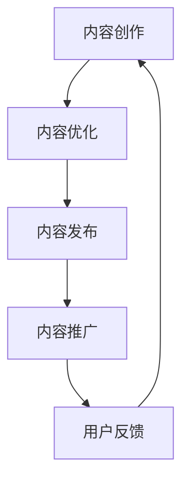

                 

### 《如何进行有效的内容分发》

#### 关键词：
内容分发、SEO、社交媒体、电子邮件营销、数据分析

#### 摘要：
随着互联网的快速发展，内容分发已经成为企业和个人在数字化时代中获取关注和流量的重要手段。本文将深入探讨如何进行有效的内容分发，包括内容分发的核心概念、渠道分析、内容创作与优化、分发策略与实践、数据分析与优化，以及未来趋势与挑战。通过本文，读者将能够了解并掌握内容分发的基本原则和方法，为自己的数字营销活动提供有力的支持。

### 《如何进行有效的内容分发》目录大纲

#### 第一部分：内容分发的概述与基础

## 第1章：内容分发的核心概念与重要性

### 1.1 什么是内容分发

### 1.2 内容分发的目标与关键因素

### 1.3 内容分发的商业模式与挑战

## 第2章：内容分发渠道分析

### 2.1 网络媒体渠道

### 2.2 社交媒体平台

### 2.3 电子邮件营销

### 2.4 搜索引擎优化与广告

#### 第二部分：内容创建与优化

## 第3章：内容创作策略

### 3.1 确定内容目标与受众

### 3.2 内容类型与格式选择

### 3.3 创意与标题设计

## 第4章：内容优化与SEO

### 4.1 关键词研究

### 4.2 标题与摘要优化

### 4.3 丰富 snippet 与元标记

## 第5章：内容质量提升

### 5.1 内容的独特性与价值

### 5.2 内容的准确性与专业性

### 5.3 内容的更新与维护

#### 第三部分：内容分发策略与实践

## 第6章：内容分发计划与执行

### 6.1 制定内容分发策略

### 6.2 制定发布日程

### 6.3 内容推广与互动

## 第7章：内容数据分析与优化

### 7.1 数据指标监控

### 7.2 数据分析与优化

### 7.3 跨渠道内容分发效果评估

## 第8章：案例分析：成功的内容分发策略

### 8.1 案例一：品牌内容营销的胜利

### 8.2 案例二：利用社交媒体推广内容

### 8.3 案例三：通过SEO提升内容可见性

#### 第四部分：内容分发的未来趋势与挑战

## 第9章：内容分发的未来趋势

### 9.1 AI与内容分发

### 9.2 个性化内容分发

### 9.3 新兴技术对内容分发的影响

## 第10章：内容分发的挑战与应对

### 10.1 知识产权与版权问题

### 10.2 内容创作的道德与社会责任

### 10.3 应对内容分发的法规与政策

#### 附录

## 附录A：内容分发工具与资源指南

### A.1 常用内容分发平台介绍

### A.2 内容创作与优化工具

### A.3 数据分析工具介绍

---

### 第一部分：内容分发的概述与基础

#### 第1章：内容分发的核心概念与重要性

#### 1.1 什么是内容分发

内容分发是指将创作出来的内容通过各种渠道和方法传递给目标受众的过程。它不仅仅是简单的发布，而是一个系统性的活动，包括内容的创作、优化、发布、推广和反馈等多个环节。

**核心概念与联系**

让我们通过一个Mermaid流程图来了解内容分发的基本流程与环节：



在这个流程图中，我们可以看到内容分发是一个闭环的过程，每个环节都是相互关联和影响的。

**核心算法原理讲解**

在内容分发的过程中，并没有特定的核心算法。但是，有一些基本的原理和步骤可以帮助我们更有效地进行内容分发。

- **目标明确**：在开始内容创作之前，需要明确内容的目标和受众。这有助于确保我们的内容能够满足受众的需求，从而提高内容的吸引力和影响力。

- **优化内容**：在发布内容之前，需要进行内容优化，包括SEO优化、格式优化和内容优化等，以提高内容的可见性和用户体验。

- **选择合适渠道**：选择合适的内容分发渠道是成功的关键。不同的渠道适合不同的内容类型和目标受众，需要根据实际情况进行选择。

- **持续推广**：发布内容后，需要通过多种方式进行推广，包括社交媒体、电子邮件营销、广告投放等，以增加内容的曝光率和受众范围。

- **反馈与调整**：内容发布后，需要密切关注用户反馈，根据反馈进行调整和优化，以持续提升内容的质量和影响力。

**数学模型和数学公式 & 详细讲解 & 举例说明**

在这个环节中，我们可以使用一些简单的数学模型和公式来衡量内容分发的效果。

- **阅读量**：阅读量是衡量内容分发效果的一个重要指标。我们可以使用以下公式来计算阅读量：

  $$ \text{阅读量} = \text{浏览量} \times \text{阅读率} $$

  其中，浏览量是内容在各个渠道上的总浏览次数，阅读率是用户实际阅读内容的比例。

- **转化率**：转化率是衡量内容对目标受众的影响力的重要指标。我们可以使用以下公式来计算转化率：

  $$ \text{转化率} = \frac{\text{目标完成量}}{\text{总曝光量}} \times 100\% $$

  其中，目标完成量是指用户完成预期目标（如注册、购买等）的数量，总曝光量是指内容在各个渠道上的总曝光次数。

**项目实战**

假设我们要对一个科技博客进行内容分发，目标是将文章的阅读量提高30%。我们可以按照以下步骤进行：

1. **内容创作**：确定文章的主题和目标受众，确保内容有价值、有深度。

2. **内容优化**：对文章进行SEO优化，包括关键词研究、标题和摘要优化等。

3. **内容发布**：选择合适的发布渠道，如社交媒体、博客平台等。

4. **内容推广**：通过社交媒体、电子邮件营销等方式进行推广。

5. **数据监控**：定期监控文章的阅读量、转化率等数据，根据数据进行分析和调整。

通过以上步骤，我们可以逐步提高文章的阅读量，实现内容分发的目标。

#### 1.2 内容分发的目标与关键因素

内容分发的目标是吸引目标受众，提升品牌知名度，增加用户参与度和转化率。为了实现这些目标，我们需要关注以下几个关键因素：

**目标明确**

明确内容分发的目标是非常重要的。不同的目标需要不同的策略和渠道。例如，如果目标是增加品牌知名度，我们可以选择社交媒体和广告投放；如果目标是增加用户参与度，我们可以选择互动性强的内容类型，如视频、直播等。

**受众分析**

了解目标受众的需求和喜好是内容分发成功的关键。通过市场调研、用户画像分析等方式，我们可以深入了解受众的特点，从而创作出更符合他们需求的内容。

**内容质量**

内容质量是内容分发成功的关键因素之一。高质量的内容能够吸引用户，提高用户参与度和转化率。在创作内容时，我们需要确保内容有独特的价值、准确的资讯和专业的视角。

**渠道选择**

选择合适的内容分发渠道对于实现内容分发目标至关重要。不同的渠道适合不同的内容类型和目标受众。例如，社交媒体适合发布短视频和图片，博客平台适合发布长文和深度分析。

**互动与反馈**

与用户进行互动和收集反馈是内容分发的重要环节。通过互动，我们可以了解用户的反馈和需求，从而调整内容策略，提升用户体验。

**数据监控**

数据监控是内容分发的重要手段。通过监控关键数据，如阅读量、转化率、用户停留时间等，我们可以了解内容的表现，从而进行优化和调整。

#### 1.3 内容分发的商业模式与挑战

内容分发在不同商业模式中扮演着不同角色，同时也面临各种挑战。

**广告驱动模式**

广告驱动模式是最常见的商业模式之一。内容创作者通过发布高质量的内容吸引广告商，从而实现盈利。这种模式的挑战在于如何确保内容质量与广告质量相匹配，以及如何平衡用户体验与广告收入。

**订阅模式**

订阅模式要求内容创作者持续提供高质量的内容，以吸引和留住订阅用户。这种模式的挑战在于如何保持内容的持续性和吸引力，以及如何管理订阅用户群。

**内容付费模式**

内容付费模式要求内容创作者提供独特、有价值的内容，以吸引付费用户。这种模式的挑战在于如何创造付费用户愿意支付的内容，以及如何防止内容盗版。

**免费增值模式**

免费增值模式将部分内容免费提供给用户，通过增值服务实现盈利。这种模式的挑战在于如何设计合适的增值服务，以及如何平衡用户体验与盈利。

**挑战与应对策略**

- **知识产权与版权问题**：内容创作者需要确保自己的内容不侵犯他人的知识产权，同时也需要保护自己的内容不受盗版和抄袭。

- **内容质量与数量平衡**：内容创作者需要在保持内容质量的同时，确保内容的数量和更新频率。

- **数据隐私与安全**：内容分发平台需要确保用户的隐私和数据安全，避免数据泄露和滥用。

- **市场竞争与流量获取**：内容创作者需要面对激烈的市场竞争，寻找有效的策略来获取流量和用户。

#### 第2章：内容分发渠道分析

内容分发渠道是连接创作者与受众的重要桥梁。选择合适的分发渠道能够提高内容的曝光率和影响力，从而实现更好的传播效果。本章节将介绍几种常见的分发渠道，包括网络媒体渠道、社交媒体平台、电子邮件营销和搜索引擎优化与广告。

#### 2.1 网络媒体渠道

网络媒体渠道是指通过网站、博客、新闻平台等网络平台进行内容分发。这些渠道具有广泛的受众基础和强大的传播能力，适合发布各类内容，如文章、图片、视频等。

**特点与优势**

- **广泛受众**：网络媒体渠道覆盖面广，可以吸引来自不同地区、不同年龄段的受众。
- **灵活多样**：网络媒体渠道支持多种内容形式，创作者可以根据需求选择合适的内容类型。
- **高效传播**：网络媒体渠道具有快速传播的特性，有助于提高内容的曝光率和影响力。

**适用场景**

- **品牌宣传**：通过建立企业网站或品牌博客，发布品牌故事、产品介绍等，提高品牌知名度和美誉度。
- **行业报道**：通过新闻平台发布行业动态、深度分析等，展示行业专业性和权威性。
- **内容营销**：通过博客发布原创文章、教程等，提供有价值的信息，吸引目标受众。

**案例分析**

以《纽约时报》为例，该报纸通过其官方网站发布各类新闻、深度报道和专栏文章，吸引了全球数百万用户。通过不断的创新和优化，它成为了一个全球知名的新闻品牌。

#### 2.2 社交媒体平台

社交媒体平台是指如微信、微博、Facebook、Twitter等社交媒体应用，这些平台已经成为内容分发的重要渠道。社交媒体具有用户基数大、互动性强、传播速度快等特点，适合进行品牌宣传、用户互动和内容推广。

**特点与优势**

- **用户基数大**：社交媒体平台拥有庞大的用户群体，创作者可以通过这些平台接触到大量潜在受众。
- **互动性强**：社交媒体平台支持用户评论、点赞、分享等互动功能，有助于提高用户参与度和互动性。
- **传播速度快**：社交媒体平台的信息传播速度快，内容可以在短时间内迅速扩散。

**适用场景**

- **品牌宣传**：通过发布品牌动态、活动信息等，提高品牌知名度和用户关注度。
- **用户互动**：通过回复评论、举办线上活动等方式，与用户进行互动，增强用户黏性。
- **内容推广**：通过发布原创内容、转载优质内容等，提高内容的曝光率和影响力。

**案例分析**

以微信为例，作为中国最大的社交媒体平台，微信通过公众号、小程序等功能，为创作者提供了丰富的内容分发渠道。很多企业通过微信成功地进行品牌宣传和用户互动，如杜蕾斯、可口可乐等。

#### 2.3 电子邮件营销

电子邮件营销是一种通过电子邮件发送营销信息的方式，是内容分发的重要渠道之一。电子邮件营销具有精准度高、成本低、易于管理等特点，适合进行用户维护和营销推广。

**特点与优势**

- **精准度高**：通过用户订阅和分类管理，可以精准地发送内容给目标受众。
- **成本低**：电子邮件营销的成本相对较低，适合中小型企业进行营销活动。
- **易于管理**：通过邮件营销工具，可以方便地管理用户订阅、发送邮件和数据分析。

**适用场景**

- **用户维护**：通过定期发送产品更新、活动通知等，维护用户关系，提高用户忠诚度。
- **营销推广**：通过发送促销信息、优惠券等，吸引用户购买，提升销售额。
- **内容推广**：通过发送原创文章、教程等，提高内容的曝光率和影响力。

**案例分析**

以Mailchimp为例，这是一个全球知名的邮件营销平台，为创作者提供了丰富的邮件模板、自动化营销工具和数据报告等功能。很多企业通过Mailchimp成功地进行电子邮件营销，如Adobe、Airbnb等。

#### 2.4 搜索引擎优化与广告

搜索引擎优化（SEO）和搜索引擎广告（SEA）是两种常见的搜索引擎营销方式，是提高内容可见性的重要渠道。

**搜索引擎优化（SEO）**

搜索引擎优化是指通过优化网站内容和结构，提高网站在搜索引擎中的排名，从而增加访问量和流量。

**特点与优势**

- **长期效果**：SEO需要一定时间才能见效，但一旦优化成功，可以带来持续稳定的流量。
- **低成本**：与搜索引擎广告相比，SEO成本较低，适合长期营销策略。

**适用场景**

- **品牌建设**：通过优化网站内容和结构，提高品牌知名度和权威性。
- **内容推广**：通过优化文章标题、关键词等，提高内容在搜索引擎中的排名，吸引更多用户访问。

**案例分析**

以谷歌为例，谷歌搜索引擎优化是很多企业进行品牌推广和内容分发的首选方式。通过优化网站内容和结构，谷歌成功地提高了其在全球市场的竞争力。

**搜索引擎广告（SEA）**

搜索引擎广告是指通过购买搜索引擎广告位，向搜索用户展示广告内容，从而增加访问量和流量。

**特点与优势**

- **快速见效**：搜索引擎广告可以迅速带来流量，适合短期营销活动。
- **精准定位**：可以根据关键词、地理位置、用户行为等精准定位目标用户。

**适用场景**

- **紧急营销**：在特定时期或活动期间，通过搜索引擎广告快速提升品牌曝光度。
- **产品推广**：通过购买相关关键词的广告位，吸引潜在用户访问网站，提升产品销量。

**案例分析**

以百度为例，百度搜索引擎广告是中国最受欢迎的搜索引擎营销方式之一。通过购买关键词广告，很多企业成功地在百度平台上提升了品牌知名度和产品销量。

#### 第3章：内容创作策略

内容创作是内容分发的基础，一个成功的创作策略能够帮助创作者吸引目标受众，提升内容的吸引力和影响力。本章将介绍内容创作策略，包括确定内容目标与受众、内容类型与格式选择、创意与标题设计。

#### 3.1 确定内容目标与受众

确定内容目标与受众是内容创作的重要环节。只有明确了目标和受众，创作者才能创作出符合受众需求的内容，从而提高内容的吸引力和影响力。

**步骤**

1. **明确内容目标**：在创作内容之前，首先要明确内容的目标。内容目标可以分为品牌宣传、用户教育、产品推广、用户互动等。明确内容目标有助于确定内容的创作方向和策略。

2. **分析目标受众**：了解目标受众的需求、喜好和行为习惯是创作优质内容的关键。通过市场调研、用户画像分析等方式，可以深入了解目标受众的特点，从而创作出更符合他们需求的内容。

3. **确定受众定位**：在明确目标受众的基础上，需要进一步确定受众的定位。受众定位可以帮助创作者集中资源，创作更精准的内容，从而提高内容的吸引力和影响力。

**案例分析**

以一家科技公司为例，其内容目标主要是品牌宣传和产品推广。通过市场调研，他们了解到目标受众主要是年龄在25-40岁之间的科技爱好者。因此，他们决定创作以科技资讯、行业分析、产品评测等为主的内容，以满足目标受众的需求。

#### 3.2 内容类型与格式选择

内容类型和格式选择直接影响内容的吸引力和传播效果。不同的内容类型和格式适用于不同的目标受众和场景，创作者需要根据实际情况进行选择。

**常见内容类型**

1. **文章**：文章是最常见的内容类型，适用于传递深度信息和观点。文章可以是原创文章、转载文章、评论等。

2. **图片**：图片具有直观、生动的特点，适用于传递情感和信息。图片可以是漫画、插画、海报等。

3. **视频**：视频具有强烈的视觉冲击力和互动性，适用于传递动态信息和情感。视频可以是宣传片、教学视频、直播等。

4. **音频**：音频适用于传递语音信息，如播客、音乐等。

5. **图表和数据**：图表和数据适用于传递复杂信息和数据，如统计图表、数据分析等。

**常见内容格式**

1. **文本**：文本是最基本的内容格式，适用于传递文字信息。文本可以是文章、报告、邮件等。

2. **图片**：图片是最直观的内容格式，适用于传递视觉信息。图片可以是照片、插画、图表等。

3. **视频**：视频是最动态的内容格式，适用于传递动态信息。视频可以是宣传片、教学视频、直播等。

4. **音频**：音频是最直观的内容格式，适用于传递语音信息。音频可以是播客、音乐等。

5. **图表**：图表是最直观的内容格式，适用于传递复杂信息和数据。图表可以是统计图表、流程图等。

**案例分析**

以一家教育机构为例，他们决定创作一系列关于编程的学习视频。通过分析目标受众，他们了解到目标受众主要是初学者，因此选择创作以教学视频为主的内容，并采用视频格式进行传播。

#### 3.3 创意与标题设计

创意和标题设计是内容创作的重要组成部分，一个吸引人的标题和独特的创意能够提高内容的吸引力和传播效果。

**创意设计**

1. **贴近受众需求**：创意应该贴近目标受众的需求和兴趣，从而吸引他们的注意力。

2. **独特性**：创意应该具有独特性，避免与他人雷同，从而提高内容的吸引力。

3. **相关性**：创意应该与内容主题高度相关，确保内容的一致性和连贯性。

**标题设计**

1. **吸引读者**：标题应该能够吸引读者的注意力，使他们产生阅读的兴趣。

2. **明确主题**：标题应该明确表达内容主题，让读者一目了然。

3. **关键词优化**：标题应该包含关键词，以提高内容的搜索引擎排名。

**案例分析**

以一篇关于健康饮食的文章为例，其目标受众主要是关注健康的人群。创意设计可以是“如何科学饮食，让你健康又美丽？”；标题设计可以是“健康饮食，美丽从这里开始”。

#### 第4章：内容优化与SEO

内容优化和搜索引擎优化（SEO）是提高内容可见性和吸引目标受众的重要手段。通过优化标题、摘要和元标记，我们可以提高内容的搜索引擎排名，从而增加访问量和影响力。

#### 4.1 关键词研究

关键词研究是SEO的第一步，也是至关重要的一步。通过关键词研究，我们可以找到与内容主题相关的搜索量大、竞争度适中的关键词，从而优化内容标题和元标记。

**步骤**

1. **确定关键词**：首先，我们需要确定与内容主题相关的关键词。可以通过市场调研、用户反馈和竞争对手分析等方式获取关键词。

2. **分析关键词**：对确定的关键词进行分析，包括搜索量、竞争度、相关性等。可以使用各种工具，如Google Keyword Planner、Ahrefs等。

3. **选择关键词**：根据关键词分析结果，选择搜索量适中、竞争度适中的关键词作为优化目标。

**案例分析**

以一篇关于健身的文章为例，我们确定了以下关键词：“健身”、“健身教程”、“健身方法”。通过分析，我们发现“健身方法”搜索量较高，竞争度适中，因此将其作为优化关键词。

#### 4.2 标题与摘要优化

标题和摘要是用户在搜索结果中首先看到的信息，优化标题和摘要对于提高内容可见性至关重要。

**标题优化**

1. **包含关键词**：标题应该包含关键词，以提高搜索引擎排名。

2. **简明扼要**：标题应该简明扼要，能够准确传达内容主题。

3. **吸引读者**：标题应该能够吸引读者的注意力，使他们产生阅读的兴趣。

**摘要优化**

1. **概述内容**：摘要应该简要概述内容主题和核心观点。

2. **包含关键词**：摘要应该包含关键词，以提高搜索引擎排名。

3. **鼓励点击**：摘要应该能够激发用户点击阅读的兴趣。

**案例分析**

以一篇关于健身的文章为例，标题优化可以是“健身方法：让你健康又美丽！”，摘要优化可以是“本文介绍了几种实用的健身方法，帮助你健康又美丽！”

#### 4.3 丰富 snippet 与元标记

snippet 是搜索结果中显示的摘要信息，包括标题、摘要和图片等。通过优化 snippet 和元标记，我们可以提高内容在搜索结果中的吸引力，从而增加点击率。

**步骤**

1. **优化标题**：确保标题简洁明了，包含关键词，能够准确传达内容主题。

2. **优化摘要**：摘要应该概述内容主题和核心观点，包含关键词，鼓励用户点击阅读。

3. **添加图片**：添加相关图片，可以吸引更多用户点击。

4. **使用元标记**：使用适当的元标记，如`<title>`,`<meta name="description">`,``等，可以更好地优化内容。

**案例分析**

以一篇关于健身的文章为例，其 snippet 和元标记优化可以是：

```markdown
### 健身方法：让你健康又美丽！


本文介绍了几种实用的健身方法，帮助你健康又美丽！

<title>健身方法：让你健康又美丽！</title>
<meta name="description" content="本文介绍了几种实用的健身方法，帮助你健康又美丽！">
```

#### 第5章：内容质量提升

内容质量是决定内容传播效果的关键因素。一个高质量的内容能够吸引用户，提高用户参与度和转化率。本章将介绍如何提升内容质量，包括内容的独特性与价值、准确性与专业性、更新与维护。

#### 5.1 内容的独特性与价值

内容独特性与价值是内容质量的核心。一个有独特性和价值的内容能够吸引用户，提高内容的吸引力。

**独特性**

1. **原创性**：确保内容原创，避免抄袭和剽窃。原创内容能够提高内容的独特性和权威性。

2. **创新性**：在内容创作中，尝试新的角度和思路，提供独到的见解和观点。

3. **个性化**：根据目标受众的需求和兴趣，创作个性化内容，使其更贴近用户。

**价值**

1. **实用性**：内容应该具有实用性，能够为用户提供实际帮助。

2. **权威性**：引用权威来源和专家观点，提高内容的可信度和权威性。

3. **教育性**：提供有价值的信息，帮助用户学习和成长。

**案例分析**

以一篇关于健康饮食的文章为例，确保内容独特性和价值，可以采取以下措施：

- **原创性**：避免抄袭和剽窃，确保内容原创。
- **创新性**：从健康饮食的新角度进行探讨，如“如何通过饮食改善睡眠质量”。
- **个性化**：根据目标受众的需求，如“年轻人如何健康饮食”。
- **实用性**：提供实用的饮食建议和食谱。
- **权威性**：引用权威来源，如医学专家的观点。

#### 5.2 内容的准确性与专业性

内容的准确性和专业性是衡量内容质量的重要指标。一个准确、专业的

