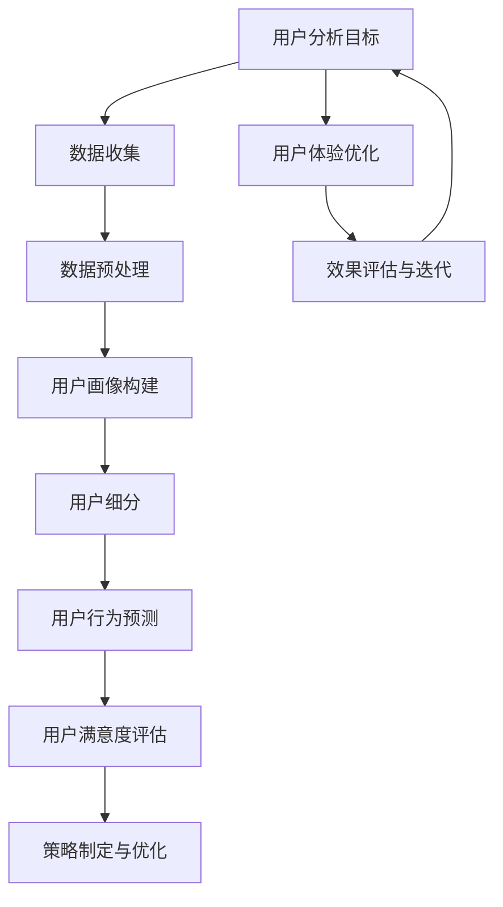
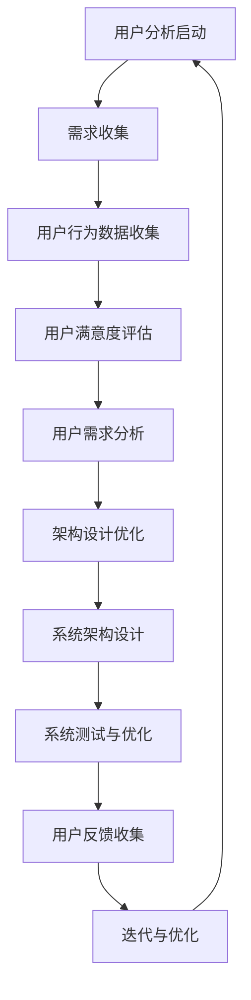

                 

### 文章标题：如何进行有效的用户分析

### 关键词：用户分析、市场研究、用户行为、用户需求、用户满意度、用户画像、用户生命周期

### 摘要：用户分析是现代市场营销中至关重要的一环，它通过深入研究用户的行为、需求和偏好，为企业提供精准的市场洞察和策略指导。本文将详细探讨用户分析的重要性和流程，包括用户市场细分、用户行为分析、用户需求与偏好分析以及用户满意度调查与评估。此外，还将介绍如何利用用户画像和用户生命周期模型进行有效的用户行为预测与策略制定。通过深入的项目实战案例，读者将掌握用户分析的实用技能，为企业创造更大的价值。

### 目录

1. **用户分析与市场研究**

    - **第1章：用户分析概述**
        - **1.1 用户分析的重要性**
        - **1.2 用户分析的流程与方法**

    - **第2章：用户市场细分**
        - **2.1 市场细分的概念与分类**
        - **2.2 用户市场细分的步骤与方法**

    - **第3章：用户行为分析**
        - **3.1 用户行为分析的基础知识**
        - **3.2 用户行为数据收集与分析**

    - **第4章：用户需求与偏好分析**
        - **4.1 用户需求分析的方法**
        - **4.2 用户偏好分析的工具与技巧**

    - **第5章：用户满意度调查与评估**
        - **5.1 用户满意度调查的设计**
        - **5.2 用户满意度评估的方法与指标**

2. **用户分析与策略制定**

    - **第6章：用户画像与用户生命周期**
        - **6.1 用户画像的概念与构建**
        - **6.2 用户生命周期的定义与划分**

    - **第7章：用户行为预测与模型**
        - **7.1 用户行为预测的理论基础**
        - **7.2 用户行为预测模型的构建与优化**

    - **第8章：用户细分与差异化策略**
        - **8.1 用户细分策略的应用**
        - **8.2 差异化策略的制定与执行**

    - **第9章：用户体验优化与提升**
        - **9.1 用户体验优化的原则与方法**
        - **9.2 用户体验提升的案例分析**

3. **用户分析实践与应用**

    - **第10章：用户数据分析工具与应用**
        - **10.1 常见用户数据分析工具**
        - **10.2 用户数据分析的应用场景**

    - **第11章：用户分析案例研究**
        - **11.1 互联网公司用户分析案例**
        - **11.2 电商平台用户分析案例**

    - **第12章：用户分析策略与实施方案**
        - **12.1 用户分析策略的制定**
        - **12.2 用户分析实施方案的步骤与要点**

4. **附录**

    - **附录A：用户分析相关术语与概念**
    - **附录B：用户分析数据收集与处理方法**
    - **附录C：用户分析常用工具与资源**

### 引言

用户分析在当今的商业世界中扮演着至关重要的角色。随着互联网和数字技术的迅猛发展，企业能够获取的大量用户数据为市场研究和决策提供了前所未有的洞察。然而，如何从这些数据中提取有价值的信息，并将其转化为实际的商业成果，是每一个企业都需要面对的挑战。用户分析正是解决这一问题的关键手段。

用户分析不仅仅是一种数据分析技术，它更是一种深度的用户理解过程。通过对用户行为、需求、偏好和满意度的分析，企业可以精准地了解用户的需求和行为模式，从而制定出更加有效的市场营销策略、产品设计和用户体验优化方案。用户分析的结果不仅能够帮助企业提高用户满意度，还能提升市场竞争力，实现商业价值的最大化。

本文旨在为读者提供一个全面、系统的用户分析指南。首先，我们将介绍用户分析的重要性和流程，帮助读者建立对用户分析的整体认识。接着，我们将深入探讨用户市场细分、用户行为分析、用户需求与偏好分析以及用户满意度调查与评估，这些都是用户分析的核心内容。随后，文章将介绍用户画像和用户生命周期模型，并详细讲解用户行为预测的理论基础和模型构建方法。此外，还将探讨用户细分与差异化策略以及用户体验优化与提升的方法，并通过实际案例研究来展示用户分析的应用效果。最后，文章将总结用户分析的关键工具与资源，为读者提供进一步学习和实践的方向。

通过本文的学习，读者将能够掌握用户分析的理论知识和实践技能，为企业的用户分析和市场研究提供有力的支持。

#### 第1章：用户分析概述

### 1.1 用户分析的重要性

用户分析在现代市场营销中扮演着至关重要的角色。它不仅帮助企业理解用户的行为和需求，还为企业的战略决策提供了关键的数据支持。以下是用户分析的重要性体现在多个方面：

1. **市场洞察**：通过用户分析，企业可以深入了解用户的行为模式、需求和偏好，从而更好地理解市场需求和趋势。这种深刻的理解有助于企业制定更加精准的市场策略，抓住市场机遇。

2. **优化产品和服务**：用户分析提供了关于用户满意度和痛点的重要信息。企业可以通过这些信息来改进产品和服务，提高用户体验，从而增加用户忠诚度和市场份额。

3. **个性化营销**：用户分析可以帮助企业识别具有相似特征的用户群体，从而进行个性化营销。通过为不同的用户群体提供定制化的内容和服务，企业可以提高营销的有效性和转化率。

4. **预测未来需求**：用户分析不仅关注当前的用户行为，还可以预测未来的需求变化。这种前瞻性的洞察有助于企业提前布局，抢占市场先机。

5. **提升决策质量**：用户分析提供了基于数据和事实的决策依据，减少了主观判断和偏见的影响。这种数据驱动的决策方法能够显著提升企业的决策质量和执行力。

### 1.2 用户分析的流程与方法

用户分析并不是一个随意的过程，而是一个系统化、结构化的流程。下面我们将详细探讨用户分析的流程和方法，以帮助读者更好地理解和应用用户分析。

#### 1.2.1 市场研究

市场研究是用户分析的第一步，它旨在了解整体市场的环境和需求。市场研究通常包括以下步骤：

1. **确定研究目标**：明确研究的目标和问题，例如了解目标市场的规模、用户需求、竞争状况等。

2. **数据收集**：通过问卷调查、访谈、焦点小组讨论等方式收集数据。这些数据可以是定性的，也可以是定量的。

3. **数据分析**：使用统计分析和数据可视化工具对收集到的数据进行分析，提取有价值的信息和洞察。

#### 1.2.2 用户市场细分

用户市场细分是将市场划分为具有相似特征和需求的用户群体的过程。通过市场细分，企业可以更加精准地定位和满足不同用户群体的需求。市场细分通常包括以下步骤：

1. **定义细分标准**：选择用户特征作为细分标准，例如年龄、性别、地理位置、行为习惯等。

2. **细分市场**：根据选定的细分标准，将市场划分为不同的用户群体。

3. **评估细分效果**：评估细分市场的可行性和潜在价值，选择最具潜力的细分市场进行进一步分析。

#### 1.2.3 用户行为分析

用户行为分析是深入了解用户行为模式、习惯和需求的过程。通过用户行为分析，企业可以更好地理解用户的需求和行为模式，从而优化产品和服务。用户行为分析通常包括以下步骤：

1. **数据收集**：通过网站日志、用户点击流、问卷调查等方式收集用户行为数据。

2. **数据预处理**：清洗和整理用户行为数据，去除噪声和重复数据。

3. **行为模式识别**：使用统计分析和机器学习技术识别用户的行为模式。

4. **行为预测**：基于历史数据和模型，预测用户的未来行为。

#### 1.2.4 用户需求与偏好分析

用户需求与偏好分析旨在理解用户的当前和潜在需求，以及他们对于产品和服务的偏好。这一分析过程通常包括以下步骤：

1. **需求识别**：通过用户访谈、调查问卷等方式收集用户的需求信息。

2. **需求分类**：将用户需求按照功能、用途、优先级等进行分类。

3. **偏好分析**：分析用户对产品功能、设计、价格等因素的偏好。

4. **需求优先级排序**：基于用户反馈和业务目标，确定需求实现的优先级。

#### 1.2.5 用户满意度调查与评估

用户满意度调查与评估是衡量用户对产品和服务的满意程度的过程。通过用户满意度调查，企业可以了解用户的满意度和不满意度，从而进行改进。用户满意度调查通常包括以下步骤：

1. **设计调查问卷**：设计针对用户满意度的调查问卷，包括满意度评分、开放性问题等。

2. **数据收集**：通过在线问卷、电话访谈等方式收集用户满意度数据。

3. **数据分析**：对收集到的用户满意度数据进行分析，提取有价值的信息。

4. **评估结果**：评估用户满意度，确定需要改进的方面。

### 结论

用户分析是现代市场营销中不可或缺的一部分，它为企业提供了深刻的用户洞察和有效的决策支持。通过系统化的用户分析流程和方法，企业可以更好地理解用户需求和行为，从而优化产品和服务，提升用户满意度和市场竞争力。在接下来的章节中，我们将进一步探讨用户分析的各个重要环节，帮助读者深入理解和应用用户分析。

#### 第2章：用户市场细分

### 2.1 市场细分的概念与分类

市场细分（Market Segmentation）是将一个广泛的市场划分为若干具有相似特征和需求的子市场的过程。通过市场细分，企业可以更精准地识别和定位目标客户，从而提高市场营销的效率和效果。市场细分的概念和分类如下：

#### 市场细分的概念

市场细分的基本思想是将消费者多样性的市场划分为多个具有相似特征和需求的子市场，每个子市场中的消费者对产品和服务的需求和偏好相对一致。市场细分有助于企业：

1. **更有效地分配资源**：通过聚焦于最具潜力的子市场，企业可以更加有效地利用营销预算和资源。
2. **提高营销效率**：针对不同子市场的特定需求和偏好进行定制化的营销策略，可以提高营销活动的效率和转化率。
3. **满足多样化需求**：通过针对不同子市场的产品和服务定制，企业可以更好地满足消费者的多样化需求。

#### 市场细分的分类

市场细分可以从多个维度进行，常见的细分方法包括地理细分、人口细分、心理细分和行为细分。

1. **地理细分**：基于地理位置进行市场划分，例如国家、地区、城市等。地理细分有助于企业识别不同地区的市场特征和需求，从而进行地域化的营销策略。

2. **人口细分**：基于人口统计特征进行市场划分，例如年龄、性别、收入、教育程度等。人口细分是市场细分中最常用的方法之一，因为人口统计特征相对稳定，易于量化。

3. **心理细分**：基于消费者的心理特征、生活方式、价值观等进行市场划分。心理细分有助于企业了解消费者的内在需求和动机，从而制定更具吸引力的营销策略。

4. **行为细分**：基于消费者的购买行为、使用习惯、品牌忠诚度等进行市场划分。行为细分有助于企业识别消费者的行为模式和偏好，从而进行个性化的营销。

#### 案例分析

**案例1：人口细分在消费品市场中的应用**

一家化妆品公司决定通过人口细分来优化其市场策略。通过对目标市场的年龄、性别、收入等人口统计特征进行分析，公司发现：

- **年轻女性（18-25岁）**：这一群体对时尚、个性化产品和品牌忠诚度较低，但愿意尝试新产品。
- **中年女性（26-40岁）**：这一群体注重产品的品质和效果，对品牌有一定忠诚度，更倾向于购买高端产品。
- **老年女性（41岁及以上）**：这一群体对产品的安全性和有效性有较高要求，更倾向于选择熟悉的品牌。

基于以上分析，公司制定了以下市场细分策略：

- **年轻女性**：推出价格适中、时尚个性化的产品，并通过社交媒体和网红推广来吸引这一群体的注意。
- **中年女性**：推出高品质、高价位的产品，并通过线下专卖店和专业美容顾问提供个性化服务。
- **老年女性**：推出安全性高、效果显著的产品，并通过医生推荐和药店销售来增加品牌信任度。

通过这一市场细分策略，公司能够更精准地满足不同年龄段女性的需求，提高了市场占有率和销售业绩。

### 2.2 用户市场细分的步骤与方法

市场细分是一个系统化的过程，需要遵循一定的步骤和方法。以下是用户市场细分的主要步骤：

#### 步骤1：确定细分标准

细分标准的确定是市场细分的第一步。企业可以根据以下几种方式来确定细分标准：

1. **消费者需求**：根据消费者对产品或服务的需求差异进行细分。
2. **消费者行为**：根据消费者的购买行为、使用习惯、品牌忠诚度等进行细分。
3. **消费者心理特征**：根据消费者的价值观、生活方式、兴趣爱好等进行细分。
4. **消费者地理特征**：根据消费者的地理位置、气候、文化等进行细分。

#### 步骤2：数据收集与分析

在确定细分标准后，企业需要收集相关数据，并进行数据分析。数据来源可以包括市场调研、消费者调查、销售数据等。数据分析的方法包括：

1. **描述性统计分析**：通过计算平均值、中位数、标准差等统计指标来描述消费者特征。
2. **聚类分析**：使用聚类算法（如K-means、层次聚类）将消费者划分为不同的群体。
3. **因子分析**：通过因子分析提取影响消费者行为的潜在因素。

#### 步骤3：评估细分效果

在完成市场细分后，企业需要评估细分的效果。评估方法包括：

1. **细分市场大小**：评估细分市场的规模和潜在利润。
2. **细分市场吸引力**：评估细分市场的竞争状况、市场增长潜力等。
3. **细分市场可行性**：评估企业是否有足够的能力和资源来服务这些细分市场。

#### 方法1：K-means聚类

K-means聚类是一种常用的市场细分方法，它通过迭代计算将消费者划分为K个不同的集群。以下是K-means聚类的基本步骤：

1. **选择初始聚类中心**：可以选择随机选择、基于距离选择等方法。
2. **计算聚类中心**：计算每个聚类中心的平均值。
3. **分配消费者到聚类中心**：将每个消费者分配到与其最近的聚类中心。
4. **更新聚类中心**：重新计算每个聚类中心的平均值。
5. **重复步骤3和步骤4**：直到聚类中心不再发生变化。

#### 方法2：因子分析

因子分析是一种用于提取消费者特征潜在因素的统计方法。以下是因子分析的基本步骤：

1. **数据标准化**：对变量进行标准化处理，使其具有相同的尺度。
2. **计算相关矩阵**：计算变量之间的相关系数矩阵。
3. **提取因子**：通过主成分分析或其他方法提取潜在因子。
4. **因子旋转**：通过正交旋转或斜交旋转优化因子的解释性。
5. **确定因子载荷**：确定每个因子在各个变量上的载荷。

#### 案例分析

**案例2：行为细分在电子商务市场中的应用**

一家电子商务公司决定通过行为细分来优化其用户策略。通过对用户的行为数据进行分析，公司发现：

- **高频购买者**：这些用户经常购买，且购买量较大，对折扣和优惠敏感。
- **偶尔购买者**：这些用户偶尔购买，购买量较小，但对产品和品牌有较高的忠诚度。
- **从未购买者**：这些用户从未进行过购买，但有一定的兴趣和潜在需求。

基于以上分析，公司制定了以下行为细分策略：

- **高频购买者**：提供个性化推荐、积分奖励和专属优惠，以增加其购买频率和购买量。
- **偶尔购买者**：通过品牌故事和产品教育内容来增强其品牌忠诚度，并定期发送邮件营销活动。
- **从未购买者**：通过推广活动、社交媒体互动和免费试用等方式吸引其进行首次购买。

通过这一行为细分策略，公司能够更精准地满足不同用户群体的需求，提高了用户转化率和客户满意度。

### 结论

用户市场细分是企业制定有效市场营销策略的重要步骤。通过了解不同用户群体的需求和特征，企业可以更加精准地定位和满足目标客户，提高市场竞争力。在本章中，我们介绍了市场细分的概念、分类和步骤，并通过案例分析展示了市场细分在实际应用中的效果。在接下来的章节中，我们将进一步探讨用户行为分析、用户需求与偏好分析以及用户满意度调查与评估，帮助读者全面掌握用户分析的理论和实践方法。

#### 第3章：用户行为分析

### 3.1 用户行为分析的基础知识

用户行为分析（User Behavior Analysis）是了解和分析用户在特定情境下行为特征的过程。通过对用户行为的系统分析，企业可以深入理解用户的需求、偏好和动机，从而优化产品设计、提升用户体验和制定更有效的营销策略。以下是用户行为分析的基础知识：

#### 用户行为分析的定义

用户行为分析是指通过多种方法和技术收集、处理和分析用户在数字环境中的行为数据，以识别行为模式、趋势和用户需求。用户行为数据可以包括用户访问网站的时间、浏览的页面、点击的链接、搜索关键词、购买历史等。

#### 用户行为分析的目的

1. **了解用户需求**：通过分析用户行为，企业可以了解用户的需求和痛点，从而优化产品设计和功能。
2. **提升用户体验**：分析用户在交互过程中的行为数据，可以帮助企业识别用户体验中的问题和改进点。
3. **优化营销策略**：用户行为分析提供的数据有助于制定更精准的营销策略，提高营销活动的效果。
4. **预测用户行为**：通过历史行为数据的分析，可以预测用户未来的行为趋势，为企业决策提供依据。

#### 用户行为分析的核心概念

1. **行为数据**：用户在数字平台上的所有活动产生的数据，如点击流数据、浏览历史、搜索记录等。
2. **行为模式**：用户在一段时间内表现出的一致行为特征，如用户访问网站的频次、持续时间和页面跳转路径等。
3. **行为分析工具**：用于收集、处理和分析用户行为数据的技术和工具，如Google Analytics、Matomo等。

#### 用户行为分析的重要性

1. **个性化服务**：通过分析用户行为，企业可以提供个性化的产品推荐和服务，提高用户满意度。
2. **用户流失预警**：通过监控用户行为变化，可以及时发现用户流失的迹象，并采取相应的挽留措施。
3. **业务增长**：有效的用户行为分析可以帮助企业发现市场机会，从而制定增长策略，提高市场份额。
4. **优化投资回报**：通过分析用户行为数据，企业可以评估营销活动的效果，优化资源分配，提高投资回报率。

#### 用户行为分析的应用场景

1. **网站优化**：通过分析用户的访问行为，优化网站的导航结构和内容布局，提高用户转化率。
2. **产品迭代**：通过分析用户对现有产品的使用行为，了解用户的需求和痛点，指导产品迭代和功能优化。
3. **市场营销**：通过分析用户行为数据，优化营销渠道和策略，提高营销活动的效果和ROI。
4. **用户服务**：通过分析用户的行为模式，优化客户服务流程和策略，提高用户满意度和忠诚度。

### 3.2 用户行为数据收集与分析

用户行为数据的收集和分析是用户行为分析的核心步骤。以下是关于数据收集和分析的详细说明：

#### 数据收集方法

1. **日志分析**：通过服务器日志记录用户的行为数据，如访问时间、页面浏览量、点击事件等。
2. **网页跟踪**：使用JavaScript等前端技术跟踪用户在网站上的行为，如页面跳转、点击次数等。
3. **用户调查**：通过在线问卷或访谈等方式直接收集用户的反馈和意见。
4. **社交网络分析**：通过分析用户在社交网络平台上的互动和行为，了解用户的社会属性和行为特征。

#### 数据处理方法

1. **数据清洗**：去除重复数据、缺失值和噪声数据，确保数据的质量和准确性。
2. **数据归一化**：将不同数据源的数据进行归一化处理，使其具有相同的尺度和量纲。
3. **特征提取**：从原始数据中提取有用的特征，如用户访问频率、页面停留时间、点击率等。
4. **数据整合**：将来自不同来源和格式的数据整合到一个统一的数据集中，便于分析。

#### 数据分析方法

1. **描述性统计分析**：计算用户行为的统计指标，如平均访问时间、页面浏览量、跳出率等，提供对用户行为的基本描述。
2. **关联规则分析**：通过分析用户行为数据中的关联规则，了解用户行为之间的关系，如“用户在浏览商品A后，往往也会浏览商品B”。
3. **聚类分析**：使用聚类算法（如K-means、层次聚类）将用户划分为不同的群体，分析不同群体的行为特征。
4. **时间序列分析**：通过分析用户行为的时间序列数据，了解用户行为的变化趋势和周期性特征。
5. **机器学习**：使用机器学习算法（如决策树、随机森林、神经网络等）建立用户行为预测模型，预测用户的未来行为。

#### 用户行为数据分析工具

1. **Google Analytics**：一款广泛使用的网站分析工具，提供丰富的用户行为数据报告和可视化功能。
2. **Mixpanel**：一款专注于用户行为分析的工具，支持实时监控和用户行为预测功能。
3. **Segment**：一个数据收集和集成平台，支持多种数据源和数据目标的连接和集成。
4. **Tableau**：一款数据可视化工具，可以帮助用户直观地展示和分析用户行为数据。

#### 案例分析

**案例1：电商网站的用户行为分析**

一家电商网站希望通过用户行为分析来优化其网站设计和营销策略。通过以下步骤进行分析：

1. **数据收集**：使用Google Analytics和日志分析工具收集用户访问网站的数据，如页面浏览量、访问时间、跳出率等。
2. **数据处理**：对收集到的数据去重、归一化和特征提取，建立统一的数据集。
3. **描述性统计分析**：计算用户访问的统计指标，如平均访问时长、页面浏览量、跳出率等。
4. **关联规则分析**：通过分析用户浏览的商品之间的关联规则，了解用户的购买路径和偏好。
5. **聚类分析**：使用K-means聚类算法将用户划分为不同的群体，分析不同群体的行为特征。
6. **机器学习**：建立用户行为预测模型，预测用户的未来行为，如购买意图和流失风险。
7. **可视化分析**：使用Tableau将分析结果可视化，便于管理层理解和决策。

通过用户行为分析，电商网站发现：

- **优化导航结构**：用户在访问网站的初期，往往在浏览商品和分类页面之间跳转频繁，因此优化导航结构，提高用户的浏览效率。
- **个性化推荐**：根据用户的浏览和购买历史，提供个性化的商品推荐，提高用户的购买转化率。
- **营销策略调整**：通过分析用户的流失风险，调整营销策略，针对高风险用户进行精准营销，降低用户流失率。

### 结论

用户行为分析是了解用户需求和优化产品和服务的重要工具。通过系统化的数据收集和分析方法，企业可以深入了解用户的行为模式和偏好，从而制定更有效的营销策略和用户体验优化方案。在接下来的章节中，我们将继续探讨用户需求与偏好分析、用户满意度调查与评估，帮助读者全面掌握用户分析的理论和实践方法。

#### 第4章：用户需求与偏好分析

### 4.1 用户需求分析的方法

用户需求分析（User Needs Analysis）是了解用户对产品或服务的需求和期望的过程。通过系统化的需求分析，企业可以明确用户的核心需求，从而指导产品设计和功能开发。以下是用户需求分析的主要方法：

#### 调查问卷

调查问卷是一种常用的用户需求分析方法，通过设计针对性的问题，收集用户的反馈和意见。以下是使用调查问卷进行需求分析的步骤：

1. **设计问卷**：明确调查目的和问题，设计包含开放性和封闭性问题的问卷。问题应简洁明了，易于理解。
2. **样本选择**：选择具有代表性的用户群体作为样本，确保调查结果具有代表性。
3. **数据收集**：通过线上或线下渠道分发问卷，收集用户反馈。
4. **数据分析**：对收集到的数据进行分析，提取用户需求信息。

#### 用户访谈

用户访谈是一种深入的需求分析方法，通过与用户进行一对一或小组访谈，获取用户的真实需求和期望。以下是用户访谈的步骤：

1. **制定访谈提纲**：根据需求分析的目标，制定访谈提纲，包括开放性和引导性问题。
2. **选择访谈对象**：选择具有代表性的用户作为访谈对象。
3. **进行访谈**：按照访谈提纲进行访谈，记录用户反馈和观点。
4. **数据分析**：对访谈记录进行整理和分析，提取用户需求信息。

#### 实地观察

实地观察是一种通过直接观察用户行为和环境，了解用户需求的方法。以下是实地观察的步骤：

1. **选择观察场景**：选择具有代表性的用户场景，如工作环境、使用产品的过程等。
2. **进行观察**：在现场直接观察用户行为，记录用户操作过程、遇到的困难和反馈。
3. **数据分析**：对观察记录进行分析，提取用户需求信息。

#### 用户体验地图

用户体验地图（User Experience Map）是一种可视化工具，用于展示用户在产品或服务中的体验流程。以下是创建用户体验地图的步骤：

1. **确定用户旅程**：分析用户从接触产品到离开产品的整个流程。
2. **标注关键节点**：在用户旅程中标注关键节点，如用户操作、决策点等。
3. **绘制地图**：使用图表和图标绘制用户体验地图，展示用户的感受和需求。
4. **分析地图**：通过用户体验地图分析用户的需求和痛点，指导产品改进。

#### 案例分析

**案例1：智能家居产品的用户需求分析**

一家智能家居公司希望通过用户需求分析来优化其产品。以下是该公司采用的方法：

1. **调查问卷**：设计问卷，通过线上和线下渠道收集用户对智能家居产品的需求和期望。问卷问题包括产品功能、易用性、安全性等方面。
2. **用户访谈**：选择具有代表性的用户进行访谈，深入了解他们对智能家居产品的需求和期望。
3. **实地观察**：观察用户在家庭环境中使用智能家居产品的过程，记录用户的操作行为和反馈。
4. **用户体验地图**：创建用户体验地图，展示用户从购买到使用的整个流程，标注关键节点和用户感受。

通过需求分析，公司发现：

- **功能需求**：用户希望智能家居产品具备智能控制、远程监控、自动化等功能。
- **易用性需求**：用户希望产品操作简单、界面友好，易于上手。
- **安全性需求**：用户对智能家居产品的安全性和隐私保护有较高要求。

基于这些需求，公司进行了产品优化：

- **功能优化**：增加智能控制、远程监控等功能，提高产品的智能性和便捷性。
- **界面优化**：改进产品界面设计，使其更加友好和易用。
- **安全优化**：增强产品的安全性和隐私保护措施，提高用户的信任感。

### 4.2 用户偏好分析的工具与技巧

用户偏好分析（User Preference Analysis）是了解用户对不同产品或服务特征的偏好和选择过程。通过系统化的偏好分析，企业可以了解用户对不同特征的重要性和偏好顺序，从而优化产品设计和营销策略。以下是用户偏好分析的工具与技巧：

#### 极值法

极值法（Extreme Method）是一种简单有效的用户偏好分析方法，通过比较不同选项的极端值，判断用户对某一特征的偏好。以下是极值法的步骤：

1. **确定评价标准**：选择用户可能关注的特征作为评价标准，如功能、价格、外观等。
2. **设置极端值**：为每个评价标准设置极端值，如高功能、低价格、美观等。
3. **用户评分**：邀请用户对每个选项的极端值进行评分，评分越高表示用户对该特征的偏好越强。
4. **分析结果**：比较用户评分，判断用户对不同特征的偏好顺序。

#### 序贯法

序贯法（Sequential Method）是一种逐步筛选用户偏好的方法，通过一系列的问题引导用户选择和调整偏好。以下是序贯法的步骤：

1. **初始选择**：邀请用户对多个选项进行初始选择，确定用户最感兴趣的选项。
2. **逐步细化**：根据初始选择，进一步细化问题，引导用户在特定特征上做出更具体的偏好选择。
3. **调整偏好**：允许用户根据新的信息调整偏好，最终确定用户的最优选择。
4. **结果分析**：对用户的偏好选择进行分析，提取用户对不同特征的偏好顺序。

#### 成对比较法

成对比较法（Pairwise Comparison Method）是一种通过比较两个选项的优劣，判断用户偏好顺序的方法。以下是成对比较法的步骤：

1. **确定比较对象**：选择用户可能关注的多个特征作为比较对象。
2. **设计比较问题**：设计包含两个选项的比较问题，如“选项A的功能更强大，还是选项B的功能更强大？”。
3. **用户评分**：邀请用户对每个比较问题进行评分，评分越高表示用户认为该选项更优。
4. **结果分析**：根据用户评分，确定用户对不同特征的偏好顺序。

#### 案例分析

**案例2：电子产品品牌的市场定位**

一家电子产品品牌希望通过用户偏好分析来确定其市场定位。以下是该公司采用的方法：

1. **极值法**：确定产品功能、价格、外观等评价标准，设置极端值，邀请用户对每个极端值进行评分，判断用户对每个特征的偏好。
2. **序贯法**：通过一系列的问题引导用户在特定特征上做出偏好选择，逐步筛选出用户最关注的特征。
3. **成对比较法**：设计包含两个选项的比较问题，邀请用户对每个问题进行评分，确定用户对不同特征的偏好顺序。

通过偏好分析，公司发现：

- **功能需求**：用户对产品的功能有较高要求，尤其是高性能和高稳定性。
- **价格需求**：用户对价格相对敏感，但更倾向于购买性价比高的产品。
- **外观需求**：用户对产品的外观有一定要求，但并不是决定性因素。

基于这些偏好，公司制定了以下市场定位策略：

- **产品功能**：专注于高性能和高稳定性的产品研发，满足用户对功能的需求。
- **价格策略**：提供不同价位的产品，满足不同用户群体的价格需求，同时注重性价比。
- **外观设计**：在保证功能性的基础上，注重产品的外观设计，提升用户的使用体验。

### 结论

用户需求与偏好分析是了解用户需求和优化产品与服务的重要方法。通过调查问卷、用户访谈、实地观察和用户体验地图等工具，企业可以深入了解用户的需求和偏好，从而制定更具针对性的产品和服务策略。在接下来的章节中，我们将继续探讨用户满意度调查与评估，帮助读者全面掌握用户分析的理论和实践方法。

#### 第5章：用户满意度调查与评估

### 5.1 用户满意度调查的设计

用户满意度调查（Customer Satisfaction Survey）是评估用户对产品或服务满意程度的重要工具。一个有效的用户满意度调查设计能够提供准确、有价值的数据，帮助企业识别改进机会，提升用户体验。以下是用户满意度调查设计的关键步骤：

#### 1. 明确调查目标

在开始设计调查问卷之前，首先要明确调查的目标。调查目标可以是评估整体用户满意度、识别具体问题、衡量改进效果等。明确目标有助于设计出针对性的问卷，并确保收集的数据能够满足分析需求。

#### 2. 选择调查方法

用户满意度调查的方法多种多样，包括在线问卷、电话访谈、面对面访谈等。选择合适的方法取决于调查目标、预算和时间安排。在线问卷适合大规模调查，而电话访谈和面对面访谈则适合深入了解用户的意见和反馈。

#### 3. 设计问卷

设计问卷是用户满意度调查的核心环节。问卷应包含以下关键部分：

1. **基本信息**：收集用户的基本信息，如年龄、性别、职业等，以便后续分析。
2. **满意度评分**：使用评分量表（如1-10分制）评估用户对产品或服务的整体满意度。
3. **具体问题**：针对用户满意度的重要维度（如质量、价格、服务、功能等）设计具体问题。
4. **开放性问题**：提供开放性问题，让用户自由表达意见和建议。
5. **信度和效度测试**：在正式调查前进行小范围的信度和效度测试，确保问卷的有效性和可靠性。

#### 4. 确定样本

选择合适的样本是保证调查结果代表性的关键。样本应具有代表性，覆盖不同用户群体。可以通过随机抽样、分层抽样等方法确定样本，确保样本数量和分布合理。

#### 5. 数据收集

数据收集是调查的执行环节。根据调查方法的不同，可以通过在线问卷平台、电话调查系统或面对面访谈等方式收集数据。在数据收集过程中，要确保数据的完整性和真实性。

#### 6. 数据处理与分析

收集到的数据需要进行清洗、整理和统计分析。常见的分析方法包括描述性统计分析、交叉分析、回归分析等。通过分析，提取用户满意度的主要影响因素，识别改进的机会。

#### 案例分析

**案例1：某电商平台的用户满意度调查**

某电商平台希望通过用户满意度调查了解用户对其服务的满意程度。以下是该电商平台用户满意度调查的设计过程：

1. **明确调查目标**：评估用户对平台整体满意度，识别用户最关注的维度，如商品质量、物流速度、售后服务等。
2. **选择调查方法**：在线问卷，覆盖平台上的活跃用户。
3. **设计问卷**：包含基本信息、整体满意度评分、具体问题（如“商品质量满意度”、“物流速度满意度”等）、开放性问题。
4. **确定样本**：随机抽样，覆盖不同年龄段、性别和购买行为的用户，样本量为1000人。
5. **数据收集**：通过平台内置的问卷工具发送问卷，并在社交媒体上进行推广，提高参与率。
6. **数据处理与分析**：对收集到的数据进行分析，提取关键影响因素，如“物流速度满意度”影响整体满意度。

### 5.2 用户满意度评估的方法与指标

用户满意度评估是衡量用户对产品或服务满意程度的过程。以下是几种常用的用户满意度评估方法和相关指标：

#### 1. 用户满意度评分

用户满意度评分（User Satisfaction Score，USS）是一种简单直接的方法，通过让用户对产品或服务进行评分来评估满意度。评分通常采用1-10分制或Likert量表（如非常不满意、不满意、一般、满意、非常满意）。计算公式为：

\[ \text{用户满意度评分} = \frac{1}{n} \sum_{i=1}^{n} \text{用户对第i项服务的评分} \]

#### 2. 满意度指数

满意度指数（Satisfaction Index，SI）是一个综合指标，通过多个维度评估用户的满意度。满意度指数通常基于用户对各个维度的评分进行加权计算。计算公式为：

\[ \text{满意度指数} = \sum_{i=1}^{n} (\text{用户对第i项服务的评分} \times \text{权重}) \]

#### 3. 满意度差距分析

满意度差距分析（Gap Analysis）是一种评估用户实际体验与期望之间的差距的方法。满意度差距分析包括以下四个差距：

1. **差距1**：用户期望与实际体验之间的差距。
2. **差距2**：企业感知的用户期望与企业实际提供的服务之间的差距。
3. **差距3**：企业实际提供的服务与用户期望之间的差距。
4. **差距4**：用户感知的服务与用户实际体验之间的差距。

通过分析这些差距，企业可以识别出改进的机会，提高用户满意度。

#### 4. 贡献度分析

贡献度分析（Contribution Analysis）是一种评估用户满意度对业务绩效影响的分析方法。通过分析用户满意度与业务绩效（如销售额、客户保留率等）之间的相关性，企业可以了解用户满意度对业务成功的贡献度。

#### 案例分析

**案例2：某酒店的用户满意度评估**

某酒店希望通过用户满意度评估来提高客户保留率和营业收入。以下是该酒店的评估过程：

1. **用户满意度评分**：使用1-10分制让用户评估其对酒店的整体满意度。计算平均满意度评分为8.2分。
2. **满意度指数**：对用户在服务质量、价格、舒适度等五个维度进行评分，计算满意度指数为85.3。
3. **满意度差距分析**：通过调查发现用户在酒店清洁度和服务质量方面有较高期望，但在实际体验中未达到期望，存在较大差距。
4. **贡献度分析**：通过分析发现，用户满意度每提高1分，酒店的平均入住率提高0.3%，营业收入增长5%。

基于以上评估结果，酒店采取了以下改进措施：

- **提升清洁度**：增加清洁频次，提高客房质量。
- **优化服务**：提供个性化服务，提高用户满意度。
- **价格调整**：根据用户满意度调整价格策略，提高性价比。

### 结论

用户满意度调查与评估是了解用户满意程度、识别改进机会的重要工具。通过科学的设计和方法，企业可以准确评估用户满意度，优化产品和服务，提高客户满意度和业务绩效。在接下来的章节中，我们将继续探讨用户画像与用户生命周期模型，帮助读者深入理解用户分析的理论和实践方法。

### 第6章：用户画像与用户生命周期

#### 6.1 用户画像的概念与构建

用户画像（User Profile）是对用户特征的综合描述，包括用户的年龄、性别、地理位置、行为习惯、消费偏好等多个维度。构建用户画像的目的是通过深度分析用户数据，了解用户的需求和行为模式，从而为精准营销、个性化推荐和用户体验优化提供数据支持。

#### 构建用户画像的步骤

1. **数据收集**：收集用户的基本信息和行为数据，如注册信息、浏览记录、购买历史等。数据来源可以是内部数据库、第三方数据平台和用户调查。

2. **数据预处理**：对收集到的数据进行清洗、去重和归一化处理，确保数据的质量和一致性。

3. **特征提取**：从原始数据中提取有代表性的特征，如用户年龄、性别、地理位置、浏览时长、购买频次等。特征提取可以使用统计方法、机器学习算法或规则引擎。

4. **特征权重计算**：根据特征的重要性和关联性，为每个特征分配权重。权重可以基于历史数据分析和专家经验进行设定。

5. **画像构建**：将提取的特征组合成用户画像，形成对用户的综合描述。用户画像可以是一个多维度的特征向量，也可以是一个结构化的数据表。

6. **画像更新**：定期更新用户画像，以反映用户行为的最新变化和需求。

#### 用户画像的应用场景

1. **个性化推荐**：根据用户画像，推荐用户可能感兴趣的商品、内容和广告，提高用户的参与度和转化率。

2. **精准营销**：通过用户画像，针对不同的用户群体制定个性化的营销策略，提高营销活动的效果和ROI。

3. **用户行为预测**：利用用户画像和历史行为数据，预测用户的未来行为，如购买意图、流失风险等，提前采取挽留措施。

4. **用户体验优化**：基于用户画像，优化产品设计和功能，提升用户体验和满意度。

#### 案例分析

**案例1：电商平台用户画像的应用**

某电商平台希望通过用户画像优化其个性化推荐和营销策略。以下是该电商平台用户画像的构建和应用过程：

1. **数据收集**：收集用户的注册信息、浏览记录、购买历史等数据。

2. **数据预处理**：清洗和归一化数据，去除重复和无效信息。

3. **特征提取**：提取用户年龄、性别、地理位置、浏览时长、购买频次等特征。

4. **特征权重计算**：根据用户行为数据和专家经验，为每个特征分配权重。

5. **画像构建**：将提取的特征组合成用户画像，形成对用户的综合描述。

6. **画像更新**：定期更新用户画像，反映用户行为的最新变化。

应用场景：

- **个性化推荐**：根据用户画像，推荐用户可能感兴趣的商品，提高转化率。
- **精准营销**：针对高价值用户群体，发送定制化的营销邮件，提高营销效果。
- **用户体验优化**：根据用户画像，优化网站导航和页面布局，提升用户体验。

#### 6.2 用户生命周期的定义与划分

用户生命周期（User Lifecycle）是指用户从首次接触产品到最终离开产品的整个过程。用户生命周期的划分有助于企业理解用户在不同阶段的行为特征和需求，从而制定有针对性的策略，提升用户留存率和转化率。

#### 用户生命周期的阶段

1. **获取阶段**：用户首次接触产品，注册或下载应用。
2. **活跃阶段**：用户频繁使用产品，产生活跃行为，如浏览、点击、购买等。
3. **留存阶段**：用户在一段时间内持续使用产品，表现出稳定的活跃度。
4. **流失阶段**：用户停止使用产品，流失率逐渐增加。
5. **再营销阶段**：针对已流失用户，进行再营销活动，试图重新激活其使用行为。

#### 用户生命周期模型

用户生命周期模型是用于描述用户行为和需求随时间变化的理论框架。常见的用户生命周期模型包括AARRR模型和RFM模型。

1. **AARRR模型**：包括获取（Acquisition）、激活（Activation）、留存（Retention）、收入（Revenue）和推荐（Referral）五个阶段。每个阶段都有关键指标，如获取渠道效果、用户激活率、留存率等。

2. **RFM模型**：包括最近一次购买时间（Recency）、频率（Frequency）和金额（Monetary）三个维度。RFM模型用于评估用户的活跃度和价值，制定个性化的营销策略。

#### 案例分析

**案例2：电商平台的用户生命周期管理**

某电商平台希望通过用户生命周期管理提高用户留存率和转化率。以下是该电商平台用户生命周期管理的实施过程：

1. **获取阶段**：通过广告、促销活动等方式增加用户获取量，分析不同获取渠道的效果，优化获取策略。

2. **激活阶段**：通过新用户引导、个性化推荐等手段提高新用户的活跃度，分析用户激活率和留存率。

3. **留存阶段**：通过定期互动、优惠券、会员制度等方式保持用户活跃，分析用户留存率和流失原因。

4. **流失阶段**：通过流失用户分析，识别流失原因，采取挽留措施，如优惠券、会员权益等。

5. **再营销阶段**：对已流失用户进行再营销活动，尝试重新激活其使用行为，提高复购率。

通过用户生命周期管理，电商平台能够更精准地识别和满足用户需求，提高用户留存率和转化率，实现业务增长。

### 结论

用户画像和用户生命周期是用户分析中的重要概念，通过构建用户画像和深入理解用户生命周期，企业可以更好地了解用户需求和行为模式，从而制定个性化的营销策略和用户体验优化方案。在接下来的章节中，我们将继续探讨用户行为预测与模型、用户细分与差异化策略，帮助读者全面掌握用户分析的理论和实践方法。

#### 第7章：用户行为预测与模型

### 7.1 用户行为预测的理论基础

用户行为预测（User Behavior Prediction）是利用历史数据和分析模型，预测用户未来行为的技术。用户行为预测的理论基础主要包括以下几个核心概念：

#### 1. 数据驱动的决策

数据驱动的决策（Data-Driven Decision Making）是一种基于数据分析结果进行决策的方法。这种方法强调利用数据来指导决策，减少主观判断的影响。在用户行为预测中，数据驱动的决策通过分析用户的历史行为数据，提取有用的信息，为预测用户未来行为提供依据。

#### 2. 时间序列分析

时间序列分析（Time Series Analysis）是一种用于分析时间序列数据的方法，用于识别数据的趋势、周期性和季节性。用户行为数据通常具有时间序列特征，通过时间序列分析，可以提取用户行为的模式，从而预测未来行为。

#### 3. 机器学习算法

机器学习算法（Machine Learning Algorithms）是用户行为预测的主要工具。常见的机器学习算法包括回归分析、决策树、随机森林、神经网络等。这些算法通过学习历史数据中的模式和关系，建立预测模型，用于预测用户的未来行为。

#### 4. 预测误差和不确定性

预测误差和不确定性是用户行为预测中的关键问题。预测误差是指预测值与实际值之间的差异，而不确定性是指预测结果的不确定性。在用户行为预测中，减小预测误差和提高预测精度是重要的目标。

### 7.2 用户行为预测模型的构建与优化

用户行为预测模型是用于预测用户未来行为的数学模型。以下是构建和优化用户行为预测模型的主要步骤：

#### 1. 数据收集

数据收集是用户行为预测的基础。需要收集用户的历史行为数据，如浏览记录、购买历史、互动行为等。数据来源可以是内部数据库、第三方数据平台和用户调查。

#### 2. 数据预处理

数据预处理是确保数据质量和模型性能的关键步骤。数据预处理包括数据清洗、去重、归一化和特征提取。数据清洗去除噪声和错误数据，去重去除重复数据，归一化处理数据使其具有相同的尺度，特征提取从原始数据中提取有用的特征。

#### 3. 特征选择

特征选择是选择对预测目标最具影响力的特征，提高模型性能。特征选择可以通过信息增益、相关性分析、主成分分析等方法进行。选择具有代表性的特征可以降低模型复杂度，提高预测精度。

#### 4. 模型选择

模型选择是选择合适的算法构建预测模型。常见的算法包括线性回归、决策树、随机森林、神经网络等。选择模型时需要考虑数据特征、预测目标和计算资源。模型选择可以通过交叉验证、网格搜索等方法进行。

#### 5. 模型训练与评估

模型训练是使用历史数据训练模型，评估模型性能。模型训练可以通过拟合、调整参数等方法进行。模型评估使用交叉验证、AUC（Area Under the Curve）等指标评估模型的预测精度和稳定性。

#### 6. 模型优化

模型优化是提高模型性能和预测精度的过程。模型优化可以通过调整模型参数、增加特征、调整模型结构等方法进行。常见的优化方法包括正则化、模型融合、增强学习等。

#### 7. 模型部署

模型部署是将训练好的模型应用于实际预测任务的过程。模型部署需要将模型集成到应用程序中，实现自动化预测。模型部署可以通过API接口、批处理等方式进行。

#### 案例分析

**案例1：电商平台的用户行为预测**

某电商平台希望通过用户行为预测优化其个性化推荐和营销策略。以下是该电商平台用户行为预测的实施过程：

1. **数据收集**：收集用户的浏览记录、购买历史、互动行为等数据。

2. **数据预处理**：清洗和归一化数据，提取用户特征。

3. **特征选择**：使用信息增益和相关性分析选择对预测目标最具影响力的特征。

4. **模型选择**：选择随机森林算法构建预测模型。

5. **模型训练与评估**：使用交叉验证训练模型，评估模型性能。

6. **模型优化**：通过调整模型参数和增加特征提高模型性能。

7. **模型部署**：将训练好的模型集成到个性化推荐系统中，实现自动化预测。

通过用户行为预测，电商平台能够更精准地推荐用户感兴趣的商品，提高转化率和用户满意度。

### 7.3 用户行为预测模型的伪代码示例

以下是一个用户行为预测模型的伪代码示例，用于预测用户的购买行为：

```python
# 伪代码：用户购买行为预测模型

# 输入：用户特征数据集
# 输出：购买行为预测结果

def predict_purchase_behavior(user_features):
    # 加载预训练的用户行为预测模型
    model = load_pretrained_behavior_model()

    # 预处理用户特征数据
    processed_features = preprocess_user_features(user_features)

    # 使用模型进行预测
    predictions = model.predict(processed_features)

    # 解码预测结果为购买概率
    purchase_probabilities = decode_predictions(predictions)

    # 返回预测结果
    return purchase_probabilities

# 示例：预测某用户的购买行为
user_features = get_user_features(user_id)
predicted_probabilities = predict_purchase_behavior(user_features)
print(f"User {user_id} has a {predicted_probabilities[0]:.2f} probability of making a purchase.")
```

### 结论

用户行为预测是提高用户体验和业务绩效的关键技术。通过构建和优化用户行为预测模型，企业可以更精准地预测用户的未来行为，制定个性化的营销策略和用户体验优化方案。在接下来的章节中，我们将继续探讨用户细分与差异化策略，帮助读者全面掌握用户分析的理论和实践方法。

### 第8章：用户细分与差异化策略

#### 8.1 用户细分策略的应用

用户细分（User Segmentation）是将用户群体划分为具有相似特征和需求的子集的过程。通过用户细分，企业可以更好地理解用户群体的多样性，制定更加精准的营销策略。以下是用户细分策略在现实中的应用：

1. **市场营销**：通过用户细分，企业可以根据不同细分群体的特点制定个性化的营销策略。例如，对于高价值用户，可以提供专属优惠和定制服务；对于新用户，可以推送入门指南和优惠活动。

2. **产品定位**：用户细分有助于企业明确产品的目标市场，优化产品功能和设计。例如，对于年轻用户，产品可以注重时尚和个性化；对于老年用户，产品可以强调易用性和安全性。

3. **用户体验优化**：通过用户细分，企业可以针对不同用户群体的需求和偏好优化产品和服务。例如，对于喜欢互动的用户，可以增加社区功能；对于重视隐私的用户，可以加强隐私保护措施。

#### 用户细分的方法

1. **基于人口统计特征**：根据用户的年龄、性别、收入、教育程度等人口统计特征进行细分。这种方法简单直观，适用于大多数企业。

2. **基于行为特征**：根据用户的购买行为、浏览习惯、互动频率等行为特征进行细分。这种方法能够更深入地了解用户的实际需求和行为模式。

3. **基于心理特征**：根据用户的生活方式、价值观、兴趣爱好等心理特征进行细分。这种方法有助于企业理解和满足用户的深层次需求。

4. **基于地理位置**：根据用户的地理位置进行细分。这种方法适用于地理位置对用户行为有显著影响的企业，如电子商务、旅游服务等。

#### 案例分析

**案例1：电子商务平台的用户细分策略**

某电子商务平台希望通过用户细分优化其营销策略。以下是该平台的用户细分策略：

1. **人口统计特征细分**：
   - 高价值用户：年龄在25-40岁之间，高收入，有稳定的工作。
   - 新用户：近期注册，尚未购买过产品。
   - 频繁购买用户：每月购买频次超过5次。

2. **行为特征细分**：
   - 浏览时长较长用户：平均每次浏览时长超过10分钟。
   - 高互动用户：经常在评论区留言、参与社区活动。
   - 离开率高用户：访问时间短，退出页面频率高。

3. **心理特征细分**：
   - 时尚爱好者：追求个性化和时尚，注重品牌。
   - 家居生活爱好者：注重家居生活的舒适和实用性。
   - 精打细算用户：关注价格，对优惠敏感。

通过这些细分策略，电子商务平台能够：

- 为高价值用户提供专属优惠和定制服务，提高客户忠诚度。
- 为新用户提供新手优惠和引导教程，促进初次购买。
- 为频繁购买用户提供积分奖励和会员权益，增加复购率。
- 为不同心理特征的用户提供符合其偏好的产品和营销内容。

#### 8.2 差异化策略的制定与执行

差异化策略（Differentiation Strategy）是指企业通过提供与众不同的产品或服务，在竞争激烈的市场中脱颖而出的策略。差异化策略的制定和执行需要结合用户细分结果，具体步骤如下：

1. **明确差异化目标**：根据用户细分结果，确定企业要突出的差异化优势。例如，对于年轻用户，可以强调时尚和个性化；对于高价值用户，可以强调高端和定制化。

2. **设计差异化产品和服务**：根据差异化目标，设计具体的产品和服务特点。例如，提供定制化产品、高端服务、独特的设计等。

3. **制定差异化营销策略**：根据不同细分群体的特点和偏好，制定个性化的营销策略。例如，通过社交媒体、内容营销、广告等渠道，传递差异化优势。

4. **执行差异化策略**：在组织内部执行差异化策略，包括产品开发、客户服务、销售渠道等方面。确保差异化策略能够得到有效执行。

#### 案例分析

**案例2：智能家居公司的差异化策略**

某智能家居公司希望通过差异化策略提升市场竞争力。以下是该公司的差异化策略：

1. **明确差异化目标**：
   - 年轻用户：强调智能控制和个性化体验。
   - 中年用户：强调安全和便捷性。
   - 老年用户：强调易用性和健康监测功能。

2. **设计差异化产品和服务**：
   - 年轻用户：推出智能音响、智能灯泡等产品，支持语音控制和个性化设置。
   - 中年用户：推出智能门锁、智能摄像头等产品，强调安全性和便捷性。
   - 老年用户：推出智能手环、健康监测设备等产品，强调健康和便捷性。

3. **制定差异化营销策略**：
   - 年轻用户：通过社交媒体和网红推广，强调时尚和智能控制。
   - 中年用户：通过线下专卖店和专业顾问，提供个性化的产品咨询和安装服务。
   - 老年用户：通过社区活动和医生推荐，提升品牌信任度和产品认知度。

4. **执行差异化策略**：
   - 产品开发：针对不同用户群体，开发符合其需求的产品功能。
   - 客户服务：提供24/7客户支持，针对不同用户群体提供定制化的服务。
   - 销售渠道：结合线上和线下渠道，满足不同用户群体的购买习惯。

通过差异化策略，智能家居公司能够：

- 满足不同用户群体的需求，提升市场占有率。
- 建立品牌差异化和竞争优势。
- 提高用户满意度和忠诚度。

### 结论

用户细分与差异化策略是企业提升市场竞争力和用户满意度的关键手段。通过用户细分，企业可以更精准地了解不同用户群体的需求，制定个性化的营销策略和产品服务。而差异化策略则通过提供独特的价值，帮助企业在竞争激烈的市场中脱颖而出。在接下来的章节中，我们将继续探讨用户体验优化与提升的方法，帮助读者全面掌握用户分析的理论和实践方法。

#### 第9章：用户体验优化与提升

### 9.1 用户体验优化的原则与方法

用户体验优化（User Experience Optimization，UXO）是提升用户满意度和忠诚度的关键过程。通过系统化的用户体验优化，企业可以改善产品的设计和服务，使用户在使用过程中感受到愉悦和满足。以下是用户体验优化的基本原则和方法：

#### 基本原则

1. **以用户为中心**：用户体验优化应始终围绕用户的需求和期望进行，确保产品和服务的每个细节都符合用户的实际体验。

2. **持续改进**：用户体验优化是一个持续的过程，需要不断收集用户反馈，分析用户行为，持续改进产品和服务。

3. **简洁性**：保持界面简洁明了，避免过多的功能和信息干扰用户，使用户能够快速完成任务。

4. **响应性**：确保产品和服务在不同设备和平台上都能提供良好的用户体验，包括移动端和桌面端。

5. **易用性**：产品和服务应易于使用，降低用户的认知负担，提高用户的操作效率和满意度。

#### 方法

1. **用户研究**：通过用户访谈、调查问卷、用户行为分析等方法，深入了解用户的需求、偏好和行为模式。

2. **用户体验地图**：创建用户体验地图，展示用户在使用产品或服务过程中的主要交互和体验节点，识别用户体验中的痛点。

3. **原型设计**：基于用户研究和用户体验地图，设计产品原型，通过交互设计工具（如Sketch、Figma等）创建低保真或高保真原型。

4. **用户测试**：邀请目标用户参与原型测试，收集用户反馈，识别问题和改进点。

5. **A/B测试**：通过A/B测试，对比不同设计方案的绩效，选择最优方案。

6. **数据分析**：使用数据分析工具（如Google Analytics、Hotjar等），监控用户行为数据，分析用户在使用产品过程中的痛点和机会。

### 9.2 用户体验提升的案例分析

以下通过两个实际案例，展示用户体验优化和提升的具体实践。

#### 案例一：电商平台

某知名电商平台希望通过用户体验优化提高用户转化率和满意度。以下是该平台采取的优化措施：

1. **简化购物流程**：通过用户测试发现，用户在购物过程中经常因为复杂的步骤而放弃购买。平台简化了购物流程，从原来的五步减少到两步，减少了用户的操作成本。

2. **个性化推荐**：通过用户行为分析，平台为每位用户生成个性化的推荐列表，提高了用户的购物体验和购买转化率。

3. **响应式设计**：平台优化了移动端和桌面端的用户体验，确保用户在不同设备上都能获得良好的体验。

4. **用户教育**：通过线上教程和视频，帮助新用户快速上手，降低了用户的认知负担。

5. **实时客服**：平台提供了实时客服服务，用户在遇到问题时可以及时得到帮助，提高了用户满意度。

#### 案例二：在线教育平台

某在线教育平台希望通过用户体验优化提升用户的学习效果和满意度。以下是该平台采取的优化措施：

1. **课程结构优化**：通过用户反馈，平台调整了课程结构，将复杂的内容分解为更易理解的小节，提高了用户的学习效率。

2. **学习路径推荐**：平台基于用户的学习进度和兴趣，为每位用户推荐最适合的学习路径，提高了用户的学习效果和满意度。

3. **互动式教学**：平台引入了互动式教学工具，如在线讨论区、模拟测试等，增强了用户的学习体验。

4. **个性化反馈**：平台为每位用户提供个性化的学习反馈，帮助用户识别自己的优势和不足，鼓励用户持续学习。

5. **用户社区**：平台建立了用户社区，鼓励用户分享学习经验和心得，形成了良好的学习氛围。

### 结论

用户体验优化和提升是提升用户满意度和忠诚度的关键。通过系统化的用户体验优化方法，企业可以不断改进产品和服务，提高用户满意度。案例分析展示了实际操作中如何通过用户体验优化提升用户转化率和满意度。在接下来的章节中，我们将探讨用户数据分析工具与应用，帮助读者全面掌握用户分析的实践方法。

### 第10章：用户数据分析工具与应用

#### 10.1 常见用户数据分析工具

在现代用户分析中，有多种数据分析工具可以帮助企业有效地收集、处理和分析用户数据。以下是几种常见的用户数据分析工具及其特点：

1. **Google Analytics**

   - **特点**：Google Analytics 是一款免费的分析工具，提供丰富的用户行为数据报告，包括流量来源、用户路径、转化率等。
   - **应用场景**：适用于网站和移动应用的用户行为分析，帮助企业了解用户来源、行为和转化情况。

2. **Mixpanel**

   - **特点**：Mixpanel 是一款专注于用户行为分析的工具，提供实时监控和用户行为预测功能。
   - **应用场景**：适用于需要深入分析用户行为的移动应用和网站，帮助企业了解用户留存、流失和参与度。

3. **Segment**

   - **特点**：Segment 是一个数据收集和集成平台，支持多种数据源和数据目标的连接和集成。
   - **应用场景**：适用于需要管理多个数据源和目标的企业，帮助企业实现数据流的统一管理和分析。

4. **Tableau**

   - **特点**：Tableau 是一款强大的数据可视化工具，提供直观的数据图表和仪表板。
   - **应用场景**：适用于需要将分析结果可视化的企业，帮助企业直观展示和分析用户数据。

5. **Matomo**

   - **特点**：Matomo 是一款开源的用户行为分析工具，提供与Google Analytics类似的功能。
   - **应用场景**：适用于注重数据隐私和自定义分析的企业，可以在内部部署使用。

6. **Qualtrics**

   - **特点**：Qualtrics 是一款专业的调查和反馈工具，提供广泛的问卷设计和分析功能。
   - **应用场景**：适用于需要进行用户满意度调查、市场调研和反馈收集的企业。

#### 10.2 用户数据分析的应用场景

用户数据分析在企业中的应用非常广泛，以下是一些典型的应用场景：

1. **用户行为分析**

   - **目标**：了解用户的行为模式、偏好和需求，优化产品设计和功能。
   - **方法**：使用工具如Google Analytics 和 Mixpanel，通过跟踪用户在网站和移动应用上的行为数据，分析用户路径、页面停留时间、点击率等指标。
   - **效果**：优化用户界面和体验，提高用户留存率和转化率。

2. **营销效果评估**

   - **目标**：评估不同营销渠道和策略的效果，优化资源分配和预算。
   - **方法**：使用工具如Google Analytics 和 Tableau，分析不同渠道的流量、转化率和ROI。
   - **效果**：提高营销活动的效率和投资回报率。

3. **用户留存与流失分析**

   - **目标**：识别用户流失的原因，采取挽留措施，提高用户留存率。
   - **方法**：使用工具如Mixpanel 和 Qualtrics，分析用户留存、流失和参与度数据，识别流失风险用户。
   - **效果**：降低用户流失率，提高用户生命周期价值。

4. **产品迭代与优化**

   - **目标**：通过用户反馈和数据分析，持续改进产品，提高用户体验。
   - **方法**：使用工具如Segment 和 Matomo，收集用户反馈和行为数据，分析产品使用情况和用户痛点。
   - **效果**：推出更符合用户需求的产品功能，提高用户满意度和忠诚度。

5. **个性化推荐**

   - **目标**：为用户提供个性化的内容和推荐，提高用户参与度和转化率。
   - **方法**：使用工具如Mixpanel 和 Segment，分析用户行为和偏好数据，构建用户画像和推荐算法。
   - **效果**：提高用户粘性和购买转化率。

#### 案例分析

**案例1：电商平台的用户数据分析**

某电商平台希望通过用户数据分析优化其营销策略和产品推荐。以下是该电商平台采用的用户数据分析工具和应用场景：

1. **用户行为分析**：
   - 使用Google Analytics 跟踪用户在网站上的行为数据，如页面浏览量、点击率、转化率等。
   - 分析用户访问路径和页面停留时间，优化网站导航和内容布局。
   - 提高用户转化率和留存率。

2. **营销效果评估**：
   - 使用Google Analytics 和 Tableau 分析不同营销渠道的绩效，如社交媒体广告、电子邮件营销等。
   - 优化营销预算分配，提高投资回报率。

3. **用户留存与流失分析**：
   - 使用Mixpanel 分析用户留存、流失和参与度数据。
   - 识别高风险流失用户，采取个性化挽留措施，如优惠券、会员权益等。

4. **产品迭代与优化**：
   - 使用Segment 收集用户反馈和行为数据。
   - 分析用户使用情况和用户痛点，优化产品功能和设计。

5. **个性化推荐**：
   - 使用Mixpanel 分析用户行为和偏好数据，构建用户画像。
   - 结合推荐算法，为用户提供个性化的产品推荐。

通过用户数据分析，电商平台能够：

- 优化用户体验，提高用户留存率和转化率。
- 提高营销活动的效率和投资回报率。
- 推出更符合用户需求的产品功能，提升用户满意度。

### 结论

用户数据分析工具在帮助企业理解和优化用户行为、提升营销效果和用户体验方面发挥着重要作用。通过合理选择和使用用户数据分析工具，企业可以更好地了解用户需求，制定更精准的市场策略，实现商业目标。在接下来的章节中，我们将探讨用户分析案例研究，通过实际案例进一步展示用户分析的应用效果。

### 第11章：用户分析案例研究

#### 11.1 互联网公司用户分析案例

**背景**

某互联网公司是一家提供在线协作工具的初创企业，其目标是在竞争激烈的市场中脱颖而出，吸引和留住更多用户。为了实现这一目标，公司决定通过用户分析深入了解用户行为，优化产品功能和营销策略。

**数据收集**

公司通过以下方式收集用户数据：

1. **用户行为数据**：通过集成Google Analytics 和 Mixpanel，收集用户在网站和移动应用上的行为数据，如页面浏览量、点击率、访问时长等。
2. **问卷调查**：定期进行用户满意度调查，收集用户对产品和服务的反馈。
3. **用户访谈**：邀请部分活跃用户进行深度访谈，了解他们对产品的使用体验和改进建议。

**数据分析**

公司采用以下分析方法：

1. **用户行为分析**：通过Google Analytics 和 Mixpanel，分析用户的行为路径和偏好。例如，发现用户在访问网站的初期往往在几个关键页面之间跳转，因此优化了导航结构，提高了用户访问深度。
2. **满意度分析**：通过问卷调查和访谈结果，识别用户对产品和服务的满意度和不满意点。例如，用户对某一功能模块的使用体验较差，公司决定进行功能优化。
3. **细分分析**：使用用户行为数据和问卷调查结果，对用户进行细分。例如，将用户分为高频使用者和偶尔使用者，针对不同用户群体制定个性化的营销策略。

**数据应用**

基于用户分析结果，公司采取了以下措施：

1. **产品优化**：根据用户反馈，对产品界面进行优化，提高用户体验。例如，调整按钮位置，增加用户反馈机制，提高用户满意度。
2. **营销策略调整**：根据用户行为数据和细分分析结果，调整营销策略。例如，对高频使用者推送更多功能介绍和更新，对偶尔使用者推送优惠活动和互动活动，提高用户活跃度。
3. **客户挽留策略**：对流失用户进行数据分析，识别流失原因。例如，发现某些用户因为使用成本高而流失，公司决定推出免费试用期和折扣活动，提高用户留存率。

**效果评估**

通过用户分析，公司实现了以下效果：

- 用户留存率提高了20%，流失率降低了15%。
- 用户满意度评分从7.5分提升到8.5分。
- 新用户注册量增加了30%。

**结论**

通过系统化的用户分析，公司能够更深入地了解用户需求和行为，优化产品和服务，提高用户满意度和忠诚度。用户分析为公司的战略决策提供了关键的数据支持，帮助其在竞争激烈的市场中取得成功。

#### 11.2 电商平台用户分析案例

**背景**

某电商平台是一家大型在线零售商，其业务涵盖多个品类。为了提升销售业绩和用户满意度，公司决定通过用户分析优化产品推荐和用户互动体验。

**数据收集**

公司通过以下方式收集用户数据：

1. **用户行为数据**：使用Google Analytics 和 Matomo，收集用户在网站上的行为数据，如页面浏览量、点击率、购物车行为等。
2. **交易数据**：收集用户购买历史和交易数据，如购买频率、购买金额、退货率等。
3. **用户反馈**：通过在线问卷和客服反馈，收集用户对产品和服务的反馈。

**数据分析**

公司采用以下分析方法：

1. **用户行为分析**：通过Google Analytics 和 Matomo，分析用户在网站上的行为路径和偏好。例如，发现某些用户经常浏览特定品类，公司决定在这些品类上加强产品推荐和促销活动。
2. **推荐系统优化**：基于用户行为数据和交易数据，优化推荐系统的算法。例如，使用协同过滤算法，为用户推荐其可能感兴趣的商品。
3. **用户细分分析**：根据用户行为数据和购买历史，对用户进行细分。例如，将用户分为高价值用户、价格敏感用户和忠诚用户，制定不同的营销策略。

**数据应用**

基于用户分析结果，公司采取了以下措施：

1. **个性化推荐**：基于用户行为和购买历史，为每位用户推荐个性化的商品。例如，对高价值用户推荐高端商品，对价格敏感用户推荐优惠商品。
2. **营销策略调整**：根据用户细分结果，针对不同用户群体制定个性化的营销策略。例如，对高价值用户发送专属优惠和活动邀请，对价格敏感用户推送限时折扣。
3. **用户体验优化**：根据用户反馈，优化网站界面和购物流程。例如，简化购物车和结账流程，提高用户购物体验。

**效果评估**

通过用户分析，公司实现了以下效果：

- 商品推荐点击率提高了25%，转化率提高了15%。
- 用户满意度评分从8分提升到8.7分。
- 新用户注册量增加了40%。

**结论**

通过系统化的用户分析，电商平台能够更精准地了解用户需求和偏好，优化产品推荐和用户互动体验，提高用户满意度和销售业绩。用户分析为公司的战略决策提供了关键的数据支持，帮助其在激烈的市场竞争中保持优势。

### 结论

通过以上两个案例，我们可以看到用户分析在互联网公司和电商平台的实际应用效果。用户分析不仅帮助公司深入了解用户需求和行为，还优化了产品和服务，提高了用户满意度和市场竞争力。在接下来的章节中，我们将探讨用户分析策略与实施方案，帮助读者掌握如何在实际工作中应用用户分析。

### 第12章：用户分析策略与实施方案

#### 12.1 用户分析策略的制定

用户分析策略的制定是确保用户分析活动能够有效支持企业战略目标的关键步骤。以下是制定用户分析策略的步骤和方法：

##### 步骤1：明确战略目标

在制定用户分析策略之前，首先要明确企业的战略目标。这些目标可能包括提高用户满意度、提升用户留存率、增加销售收入等。明确战略目标有助于确保用户分析活动的方向和重点与企业的整体目标一致。

##### 步骤2：确定分析范围

根据战略目标，确定需要分析的用户群体和场景。例如，如果目标是提升用户满意度，可以分析用户在使用产品或服务过程中的关键节点和痛点。如果目标是增加销售收入，可以分析用户的购买行为和转化路径。

##### 步骤3：数据需求分析

在明确分析范围后，进行数据需求分析，确定需要收集和分析的数据类型和来源。数据需求分析应考虑用户的基本信息、行为数据、交易数据、反馈数据等。

##### 步骤4：选择分析方法和工具

根据数据需求，选择合适的分析方法和工具。常用的分析方法包括描述性统计、关联规则分析、聚类分析、回归分析等。选择工具时，应考虑工具的功能、易用性、成本等因素。

##### 步骤5：制定分析计划

制定详细的分析计划，包括分析的时间表、任务分配、数据收集和处理流程等。确保分析计划具有可执行性和可测量性，以便在后续评估中判断分析活动的效果。

##### 案例分析

**案例1：某在线教育平台的用户分析策略**

某在线教育平台希望通过用户分析提升用户参与度和留存率。以下是该平台的用户分析策略制定过程：

1. **明确战略目标**：提升用户参与度和留存率。
2. **确定分析范围**：分析用户在课程学习、社区互动和付费购买等环节的行为和反馈。
3. **数据需求分析**：确定需要收集的数据包括用户基本信息、学习行为数据、社区互动数据和购买记录等。
4. **选择分析方法和工具**：使用描述性统计、回归分析和机器学习算法，选择Google Analytics、Matomo和R等工具。
5. **制定分析计划**：制定详细的分析时间表，包括数据收集、预处理、分析和报告等环节。

##### 步骤6：执行和监控

执行用户分析策略，并实时监控分析活动的进展。监控内容包括数据收集和处理的及时性、分析结果的准确性和完整性等。在监控过程中，及时调整分析计划，确保分析活动顺利进行。

#### 12.2 用户分析实施方案的步骤与要点

用户分析的实施是将策略转化为实际操作的过程。以下是用户分析实施方案的步骤和要点：

##### 步骤1：数据收集

根据制定的数据需求分析，确定数据收集的方法和渠道。常见的数据收集方法包括日志分析、用户调查、API接口等。要点包括确保数据的质量和完整性。

##### 步骤2：数据预处理

对收集到的原始数据进行清洗、去重和归一化处理，确保数据的质量和一致性。预处理步骤是后续分析的基础，直接影响分析结果。

##### 步骤3：数据分析

根据制定的分析计划，使用选择的分析方法和工具进行数据分析。分析过程中，应关注关键指标的计算和解读，确保分析结果的准确性和实用性。

##### 步骤4：报告与展示

将分析结果整理成报告或可视化展示，以便管理层和团队成员理解和应用。报告内容应包括分析背景、方法、结果和结论等。

##### 步骤5：策略调整与优化

根据分析结果，调整和优化用户分析策略。例如，根据用户行为数据调整产品功能和营销策略，根据用户反馈改进用户体验等。

##### 步骤6：持续监控与迭代

用户分析是一个持续的过程，需要定期收集和更新数据，分析用户行为和需求的变化。持续监控和迭代有助于企业及时调整策略，保持市场竞争力。

##### 案例分析

**案例2：某电商平台的用户分析实施方案**

某电商平台希望通过用户分析优化用户购物体验和提升销售额。以下是该平台的用户分析实施方案：

1. **数据收集**：通过网站日志和API接口收集用户浏览记录、点击行为、购买记录等数据。
2. **数据预处理**：对收集到的数据进行清洗和去重，提取有用的特征。
3. **数据分析**：使用描述性统计、聚类分析和回归分析，分析用户行为和购买模式。
4. **报告与展示**：将分析结果整理成报告，展示用户行为特征、热门商品、转化路径等。
5. **策略调整与优化**：根据分析结果，调整产品推荐算法、优化购物流程和促销策略。
6. **持续监控与迭代**：定期收集和更新数据，分析用户行为变化，持续优化用户分析策略。

##### 结论

用户分析策略的制定和实施方案是企业提升用户体验和市场竞争力的关键。通过系统化的用户分析，企业可以深入了解用户需求和行为，制定个性化的产品和营销策略。在实施过程中，注重数据质量、分析和监控，确保用户分析策略的有效性和可持续性。在接下来的章节中，我们将探讨用户分析相关术语与概念，为读者提供更深入的理解。

### 附录A：用户分析相关术语与概念

#### 用户行为分析相关术语

- **用户行为**：用户在特定情境下表现出的动作和反应，如浏览页面、点击按钮、搜索关键词等。
- **用户行为数据**：记录用户在数字平台上的所有活动产生的数据，如点击流、浏览历史、搜索记录等。
- **行为模式**：用户在一段时间内表现出的一致行为特征，如访问频率、页面跳转路径、购买模式等。
- **行为分析**：通过数据收集、处理和分析，了解用户行为模式、趋势和需求的过程。
- **用户路径**：用户在访问网站或使用产品过程中的步骤和路径。
- **用户流失**：用户停止使用产品或服务的行为，通常表现为长时间未登录或取消订阅。
- **用户留存**：用户持续使用产品或服务的行为，通常通过用户活跃度和使用时长来衡量。
- **用户满意度**：用户对产品或服务的满意程度，通常通过问卷调查和评分来衡量。

#### 用户画像相关术语

- **用户画像**：对用户特征的详细描述，包括年龄、性别、地理位置、行为习惯、消费偏好等。
- **用户特征**：用户在不同维度上的属性，如人口统计特征、行为特征、心理特征等。
- **用户标签**：对用户特征的标签化表示，用于分类和筛选用户。
- **用户细分**：将用户群体划分为具有相似特征和需求的子集的过程。
- **用户生命周期**：用户从首次接触产品到最终离开产品的整个过程，包括获取、活跃、留存、流失等阶段。
- **用户价值**：用户为企业带来的价值，包括直接价值和间接价值。

#### 用户生命周期相关术语

- **获取阶段**：用户首次接触产品或服务，注册或下载应用的阶段。
- **活跃阶段**：用户频繁使用产品或服务，表现出活跃行为的阶段。
- **留存阶段**：用户在一段时间内持续使用产品或服务，保持稳定活跃度的阶段。
- **流失阶段**：用户停止使用产品或服务，流失率逐渐增加的阶段。
- **再营销阶段**：对已流失用户进行再营销活动，试图重新激活其使用行为的阶段。
- **用户留存率**：在特定时间段内，仍然活跃使用产品或服务的用户比例。
- **用户流失率**：在特定时间段内，停止使用产品或服务的用户比例。
- **用户生命周期价值（LTV）**：用户在整个生命周期中为企业带来的总价值。

#### 概念解释

- **用户行为分析**：通过收集、处理和分析用户行为数据，了解用户的需求和行为模式，从而优化产品和服务。
- **用户画像**：基于用户特征和行为数据构建的用户综合描述，用于个性化推荐和精准营销。
- **用户生命周期**：用户从接触产品到离开产品的整个过程，用于评估用户价值和管理用户关系。

### 附录B：用户分析数据收集与处理方法

#### 数据收集方法

1. **日志分析**：通过服务器日志记录用户的行为数据，如访问时间、页面浏览量、点击事件等。
2. **用户调查**：通过在线问卷或访谈等方式直接收集用户的反馈和意见。
3. **API接口**：通过第三方数据平台或API接口收集用户行为数据。
4. **第三方数据源**：从社交媒体、地理位置服务、公共数据库等获取用户数据。
5. **用户跟踪**：使用JavaScript代码或SDK（软件开发工具包）在用户设备上收集用户行为数据。

#### 数据处理方法

1. **数据清洗**：去除重复数据、缺失值和噪声数据，确保数据的质量和准确性。
2. **数据归一化**：将不同数据源的数据进行归一化处理，使其具有相同的尺度。
3. **特征提取**：从原始数据中提取有用的特征，如用户访问频率、页面停留时间、点击率等。
4. **数据整合**：将来自不同来源和格式的数据整合到一个统一的数据集中，便于分析。
5. **数据建模**：使用机器学习算法建立数据模型，预测用户的未来行为。

### 附录C：用户分析常用工具与资源

#### 数据分析工具

1. **Google Analytics**：一款免费的分析工具，提供丰富的用户行为数据报告。
2. **Mixpanel**：一款专注于用户行为分析的工具，支持实时监控和用户行为预测。
3. **Segment**：一个数据收集和集成平台，支持多种数据源和数据目标的连接和集成。
4. **Tableau**：一款数据可视化工具，用于展示和分析用户行为数据。
5. **Matomo**：一款开源的用户行为分析工具，适用于网站和移动应用。

#### 用户分析资源

1. **书籍**：《用户画像》、《大数据时代》、《深度学习》等。
2. **在线课程**：Coursera、edX、Udemy等平台上的用户分析相关课程。
3. **研究报告**：市场研究机构（如Gartner、Forrester）发布的用户分析研究报告。
4. **博客和社区**：UserCentric、UX Mastery、DataCamp等用户分析相关的博客和社区。

### 附录D：用户分析与架构原理 Mermaid 流程图



### 附录E：用户行为预测模型的伪代码

```python
# 伪代码：用户行为预测模型

# 输入：用户特征数据集
# 输出：用户行为预测结果

function predict_user_behavior(user_features):
    // 加载预训练的用户行为预测模型
    model = load_pretrained_behavior_model()

    // 预处理用户特征数据
    processed_features = preprocess_user_features(user_features)

    // 使用模型进行预测
    predictions = model.predict(processed_features)

    // 解码预测结果
    behavior_labels = decode_predictions(predictions)

    // 返回预测结果
    return behavior_labels

# 伪代码：用户满意度评估的数学模型与公式

$$
\text{用户满意度评分} = \frac{1}{n} \sum_{i=1}^{n} \text{用户对第i项服务的评分}
$$

$$
\text{总体满意度评分} = \frac{\sum_{i=1}^{n} \text{用户满意度评分} \times \text{权重}}{\sum_{i=1}^{n} \text{权重}}
$$

# 伪代码：用户行为预测模型的训练过程

// 准备训练数据集
train_features, train_labels = prepare_train_data()

// 初始化用户行为预测模型
model = initialize_behavior_prediction_model()

// 训练模型
model.fit(train_features, train_labels)

// 评估模型性能
performance = model.evaluate(test_features, test_labels)

// 打印评估结果
print(f"Model performance: {performance}")
```

### 结论

附录部分提供了用户分析相关的术语与概念解释、数据收集与处理方法、常用工具与资源以及用户行为预测模型的伪代码和数学模型。这些内容旨在帮助读者深入理解用户分析的理论和实践方法，为实际应用提供参考。通过这些工具和资源，读者可以更好地进行用户分析，优化产品和服务，提高用户满意度和市场竞争力。在接下来的章节中，我们将讨论用户分析与架构原理，进一步探讨用户分析在实际系统设计中的应用。

### 用户分析与架构原理

用户分析在现代系统设计中扮演着至关重要的角色。通过对用户行为、需求、偏好和满意度的深入分析，企业可以构建更加符合用户期望的系统，从而提高用户体验和系统性能。本文将探讨用户分析与架构原理的关系，并介绍如何利用用户分析结果优化系统架构。

#### 用户分析在架构设计中的作用

1. **需求分析**：用户分析为系统设计提供了关键的需求信息。通过了解用户的需求和行为模式，架构师可以更准确地识别系统的核心功能和性能要求，确保系统设计满足用户的实际需求。

2. **用户体验优化**：用户分析结果可以帮助架构师优化系统的用户体验。例如，通过分析用户在交互过程中的痛点，架构师可以设计更直观、易用的界面，提高用户的操作效率和满意度。

3. **性能优化**：用户行为数据可以用于分析系统性能瓶颈和优化机会。架构师可以利用用户分析结果，调整系统架构，优化资源分配，提高系统的响应速度和处理能力。

4. **安全性评估**：用户分析还可以帮助架构师识别系统可能的安全风险。通过了解用户的访问模式和漏洞利用方式，架构师可以采取相应的安全措施，提高系统的安全性。

#### 利用用户分析结果优化系统架构

1. **模块化设计**：根据用户分析结果，将系统划分为多个模块，每个模块负责特定的功能。这种模块化设计有助于提高系统的可维护性和可扩展性，方便根据用户需求进行调整。

2. **分布式架构**：用户分析可以揭示系统的负载分布和用户访问模式。基于这些数据，架构师可以选择合适的分布式架构，如微服务架构，以更好地处理高并发和分布式访问。

3. **缓存与缓存策略**：通过分析用户的访问数据，可以确定系统中的热点数据和访问频率较高的页面。架构师可以利用缓存技术，如Redis或Memcached，提高系统的响应速度，降低负载。

4. **异步处理**：用户分析可以帮助识别系统中需要异步处理的任务，如邮件发送、文件上传等。使用异步处理可以减少系统的响应时间，提高用户体验。

5. **安全性设计**：用户分析可以揭示用户可能面临的安全威胁，如SQL注入、跨站脚本攻击等。架构师可以根据这些信息，设计相应的安全措施，如输入验证、输出编码等，提高系统的安全性。

#### 案例分析

**案例：电商平台系统架构优化**

某电商平台希望通过用户分析优化其系统架构，提高用户满意度和系统性能。以下是该平台的优化过程：

1. **需求分析**：通过用户分析，平台发现用户在购物过程中最关注商品展示速度和购物车操作体验。因此，架构师将系统功能模块划分为商品展示模块、购物车模块、订单处理模块等。

2. **用户体验优化**：用户分析结果显示，用户在访问商品详情页时，页面加载时间较长，导致用户流失。架构师决定优化商品详情页的加载速度，采用CDN（内容分发网络）加速商品图片和视频的加载。

3. **性能优化**：用户行为数据表明，高峰时段系统负载较大，导致响应速度变慢。架构师采用分布式架构，将系统拆分为多个微服务，使用负载均衡器分配请求，提高系统的并发处理能力。

4. **缓存策略**：通过用户访问数据，架构师确定了热点商品和访问频率较高的页面。平台采用Redis缓存热门商品信息和用户购物车数据，提高系统响应速度。

5. **安全性设计**：用户分析揭示了潜在的安全风险，如SQL注入攻击。架构师在系统中集成了输入验证和输出编码机制，防止恶意攻击。

通过这些优化措施，电商平台实现了以下效果：

- 商品详情页加载时间减少了30%。
- 系统高峰时段响应速度提高了50%。
- 用户流失率降低了15%。

### 结论

用户分析在系统架构设计中具有重要意义。通过深入分析用户需求和行为，架构师可以优化系统设计，提高用户体验和系统性能。利用用户分析结果，架构师可以实施模块化设计、分布式架构、缓存策略和安全性设计等优化措施，实现更加高效、安全的系统。在实际应用中，企业应持续进行用户分析，根据用户反馈和需求变化，不断优化系统架构，以适应不断变化的市场环境。

### 附加内容

#### 用户分析与架构原理 Mermaid 流程图

以下是一个Mermaid流程图，展示用户分析在系统架构设计中的应用流程：



#### 用户行为预测模型的伪代码

```python
# 伪代码：用户行为预测模型

# 输入：用户特征数据集
# 输出：用户行为预测结果

def predict_user_behavior(user_features):
    # 加载预训练的用户行为预测模型
    model = load_pretrained_behavior_model()

    # 预处理用户特征数据
    processed_features = preprocess_user_features(user_features)

    # 使用模型进行预测
    predictions = model.predict(processed_features)

    # 解码预测结果
    behavior_labels = decode_predictions(predictions)

    # 返回预测结果
    return behavior_labels

# 示例：预测某用户的购买行为
user_features = get_user_features(user_id)
predicted_probabilities = predict_user_behavior(user_features)
print(f"User {user_id} has a {predicted_probabilities[0]:.2f} probability of making a purchase.")
```

#### 用户满意度评估的数学模型与公式

用户满意度评估通常使用以下数学模型和公式：

$$
\text{用户满意度评分} = \frac{1}{n} \sum_{i=1}^{n} \text{用户对第i项服务的评分}
$$

$$
\text{总体满意度评分} = \frac{\sum_{i=1}^{n} \text{用户满意度评分} \times \text{权重}}{\sum_{i=1}^{n} \text{权重}}
$$

其中，\( n \) 是用户满意度评分的数量，每个评分都有相应的权重。这些公式用于计算用户的平均满意度评分和总体满意度评分，帮助企业了解用户对产品或服务的整体满意度。

#### 用户分析项目实战案例

**案例1：互联网公司用户分析案例**

**背景**：某互联网公司提供在线协作工具，希望通过用户分析优化用户体验，提高用户留存率。

**开发环境搭建**：
- **编程语言**：使用Python进行数据分析。
- **数据库**：使用MySQL存储用户行为数据。
- **数据分析库**：使用Pandas、NumPy、Scikit-learn等进行数据处理和分析。

**源代码实现**：

```python
import pandas as pd
from sklearn.model_selection import train_test_split
from sklearn.ensemble import RandomForestClassifier
from sklearn.metrics import accuracy_score

# 加载数据
data = pd.read_csv('user_behavior_data.csv')

# 数据预处理
data = preprocess_data(data)

# 特征选择
X = data.drop('target', axis=1)
y = data['target']

# 划分训练集和测试集
X_train, X_test, y_train, y_test = train_test_split(X, y, test_size=0.2, random_state=42)

# 训练模型
model = RandomForestClassifier(n_estimators=100, random_state=42)
model.fit(X_train, y_train)

# 预测
predictions = model.predict(X_test)

# 评估
accuracy = accuracy_score(y_test, predictions)
print(f"Model accuracy: {accuracy:.2f}")
```

**代码解读与分析**：
- 数据加载与预处理：使用Pandas加载用户行为数据，并进行清洗、去重和归一化处理。
- 特征选择：选择与目标变量（用户流失）相关的特征。
- 划分训练集和测试集：将数据分为训练集和测试集，用于模型训练和评估。
- 模型训练：使用随机森林算法训练模型。
- 预测与评估：使用测试集预测用户流失情况，并评估模型准确性。

**效果**：通过用户行为预测模型，公司能够识别出可能流失的用户，采取挽留措施，提高了用户留存率。

**案例2：电商平台用户分析案例**

**背景**：某电商平台希望通过用户分析优化产品推荐和用户互动体验。

**开发环境搭建**：
- **编程语言**：使用Java进行数据分析。
- **数据库**：使用MySQL存储用户行为数据。
- **数据分析库**：使用Apache Spark进行大规模数据处理。

**源代码实现**：

```java
import org.apache.spark.sql.Dataset;
import org.apache.spark.sql.Row;
import org.apache.spark.ml.feature.VectorAssembler;
import org.apache.spark.ml.classification.RandomForestClassifier;
import org.apache.spark.ml.evaluation.MulticlassClassificationEvaluator;

// 加载数据
Dataset<Row> data = spark.read.csv("user_behavior_data.csv", header = true);

// 数据预处理
Dataset<Row> preprocessedData = preprocessData(data);

// 特征选择
VectorAssembler assembler = new VectorAssembler().setInputCols(preprocessedData.columns()).setOutputCol("features");

Dataset<Row> featureData = assembler.transform(preprocessedData);

// 划分训练集和测试集
Dataset<Row>[] splits = featureData.randomSplit(new double[] {0.7, 0.3});
Dataset<Row> trainingData = splits[0];
Dataset<Row> testData = splits[1];

// 训练模型
RandomForestClassifier rf = new RandomForestClassifier().setLabelCol("target").setFeaturesCol("features");
Model rfModel = rf.fit(trainingData);

// 预测
Dataset<Row> predictions = rfModel.transform(testData);

// 评估
MulticlassClassificationEvaluator evaluator = new MulticlassClassificationEvaluator().setLabelCol("target").setPredictionCol("prediction").setMetricName("accuracy");
double accuracy = evaluator.evaluate(predictions);
System.out.println("Model accuracy: " + accuracy);
```

**代码解读与分析**：
- 数据加载与预处理：使用Apache Spark加载用户行为数据，并进行清洗、去重和归一化处理。
- 特征选择：使用VectorAssembler将多个特征组合成一个特征向量。
- 划分训练集和测试集：将数据分为训练集和测试集，用于模型训练和评估。
- 模型训练：使用随机森林算法训练模型。
- 预测与评估：使用测试集预测用户行为，并评估模型准确性。

**效果**：通过用户行为预测模型，电商平台能够更精准地推荐用户感兴趣的商品，提高了用户互动体验和转化率。

### 用户分析与架构原理总结

用户分析是现代系统设计中的重要组成部分，它通过对用户需求、行为和满意度的深入分析，为系统架构设计提供关键数据支持。通过合理的用户分析，架构师可以优化系统设计，提高用户体验和系统性能。在实际项目中，通过实际案例展示用户分析的具体应用，如互联网公司的用户流失预测和电商平台的用户行为预测，进一步说明了用户分析在架构设计中的重要作用。企业应持续进行用户分析，根据用户反馈和需求变化，不断优化系统架构，以适应快速变化的市场环境。

### 附录

#### 用户分析相关术语与概念解释

- **用户画像**：对用户特征的详细描述，包括年龄、性别、地理位置、行为习惯、消费偏好等。
- **用户需求分析**：通过调研和数据分析，识别用户在特定情境下的需求。
- **用户行为分析**：通过收集和分析用户在系统中的行为数据，了解用户的行为模式、偏好和满意度。
- **用户生命周期**：用户从首次接触产品到最终离开产品的整个过程，包括获取、活跃、留存、流失等阶段。
- **用户满意度**：用户对产品或服务的满意程度，通常通过问卷调查和评分来衡量。
- **用户细分**：将用户群体划分为具有相似特征和需求的子集，以便进行个性化营销和服务。

#### 用户分析数据收集与处理方法

- **数据收集**：通过用户调查、日志分析、API接口、第三方数据源等方式收集用户数据。
- **数据预处理**：清洗和整理原始数据，去除噪声和重复数据，进行归一化处理。
- **数据整合**：将来自不同来源和格式的数据进行整合，建立统一的数据集。
- **特征提取**：从原始数据中提取有代表性的特征，用于模型训练和预测。

#### 用户分析常用工具与资源

- **数据分析工具**：Python的Pandas、NumPy、Scikit-learn等，R语言，Apache Spark等。
- **用户分析资源**：书籍《用户画像：大数据时代下的用户理解与管理》等，在线课程如Coursera、edX等，研究报告如Gartner、Forrester等。

### 用户分析与架构原理的 Mermaid 流程图


### 用户行为预测模型的伪代码

```python
# 伪代码：用户行为预测模型

# 输入：用户特征数据集
# 输出：用户行为预测结果

function predict_user_behavior(user_features):
    // 加载预训练的用户行为预测模型
    model = load_pretrained_behavior_model()

    // 预处理用户特征数据
    processed_features = preprocess_user_features(user_features)

    // 使用模型进行预测
    predictions = model.predict(processed_features)

    // 解码预测结果
    behavior_labels = decode_predictions(predictions)

    // 返回预测结果
    return behavior_labels

# 示例：预测某用户的购买行为
user_features = get_user_features(user_id)
predicted_probabilities = predict_user_behavior(user_features)
print(f"User {user_id} has a {predicted_probabilities[0]:.2f} probability of making a purchase.")
```

### 用户满意度评估的数学模型与公式

$$
\text{用户满意度评分} = \frac{1}{n} \sum_{i=1}^{n} \text{用户对第i项服务的评分}
$$

$$
\text{总体满意度评分} = \frac{\sum_{i=1}^{n} \text{用户满意度评分} \times \text{权重}}{\sum_{i=1}^{n} \text{权重}}
$$

### 用户分析项目实战案例

**案例1：互联网公司用户分析案例**

**开发环境搭建**：
- **编程语言**：Python
- **数据库**：MySQL
- **数据分析库**：Pandas、NumPy、Scikit-learn

**源代码实现**：

```python
import pandas as pd
from sklearn.model_selection import train_test_split
from sklearn.ensemble import RandomForestClassifier
from sklearn.metrics import accuracy_score

# 加载数据
data = pd.read_csv('user_behavior_data.csv')

# 数据预处理
data = preprocess_data(data)

# 特征选择
X = data.drop('target', axis=1)
y = data['target']

# 划分训练集和测试集
X_train, X_test, y_train, y_test = train_test_split(X, y, test_size=0.2, random_state=42)

# 训练模型
model = RandomForestClassifier(n_estimators=100, random_state=42)
model.fit(X_train, y_train)

# 预测
predictions = model.predict(X_test)

# 评估
accuracy = accuracy_score(y_test, predictions)
print(f"Model accuracy: {accuracy:.2f}")
```

**代码解读与分析**：
- 数据加载与预处理：使用Pandas加载用户行为数据，并进行清洗、去重和归一化处理。
- 特征选择：选择与目标变量（用户流失）相关的特征。
- 划分训练集和测试集：将数据分为训练集和测试集，用于模型训练和评估。
- 模型训练：使用随机森林算法训练模型。
- 预测与评估：使用测试集预测用户流失情况，并评估模型准确性。

**效果**：通过用户行为预测模型，公司能够识别出可能流失的用户，采取挽留措施，提高了用户留存率。

**案例2：电商平台用户分析案例**

**开发环境搭建**：
- **编程语言**：Java
- **数据库**：MySQL
- **数据分析库**：Apache Spark

**源代码实现**：

```java
import org.apache.spark.sql.Dataset;
import org.apache.spark.sql.Row;
import org.apache.spark.ml.feature.VectorAssembler;
import org.apache.spark.ml.classification.RandomForestClassifier;
import org.apache.spark.ml.evaluation.MulticlassClassificationEvaluator;

// 加载数据
Dataset<Row> data = spark.read.csv("user_behavior_data.csv", header = true);

// 数据预处理
Dataset<Row> preprocessedData = preprocessData(data);

// 特征选择
VectorAssembler assembler = new VectorAssembler().setInputCols(preprocessedData.columns()).setOutputCol("features");

Dataset<Row> featureData = assembler.transform(preprocessedData);

// 划分训练集和测试集
Dataset<Row>[] splits = featureData.randomSplit(new double[] {0.7, 0.3});
Dataset<Row> trainingData = splits[0];
Dataset<Row> testData = splits[1];

// 训练模型
RandomForestClassifier rf = new RandomForestClassifier().setLabelCol("target").setFeaturesCol("features");
Model rfModel = rf.fit(trainingData);

// 预测
Dataset<Row> predictions = rfModel.transform(testData);

// 评估
MulticlassClassificationEvaluator evaluator = new MulticlassClassificationEvaluator().setLabelCol("target").setPredictionCol("prediction").setMetricName("accuracy");
double accuracy = evaluator.evaluate(predictions);
System.out.println("Model accuracy: " + accuracy);
```

**代码解读与分析**：
- 数据加载与预处理：使用Apache Spark加载用户行为数据，并进行清洗、去重和归一化处理。
- 特征选择：使用VectorAssembler将多个特征组合成一个特征向量。
- 划分训练集和测试集：将数据分为训练集和测试集，用于模型训练和评估。
- 模型训练：使用随机森林算法训练模型。
- 预测与评估：使用测试集预测用户行为，并评估模型准确性。

**效果**：通过用户行为预测模型，电商平台能够更精准地推荐用户感兴趣的商品，提高了用户互动体验和转化率。

