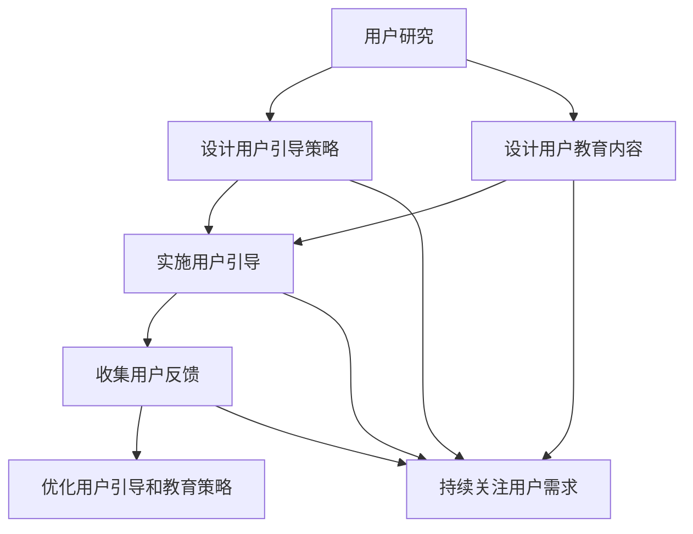

                 

## 文章标题：如何进行有效的用户引导和教育

在当今高度数字化的时代，用户引导和教育成为产品成功的关键因素。有效的用户引导能够帮助新用户快速上手产品，提升用户体验和满意度；而全面的教育内容则能够增强用户对产品的理解和忠诚度。本文旨在探讨如何设计并实施有效的用户引导和教育策略，以实现产品价值的最大化。

### 文章关键词

- 用户引导
- 用户教育
- 用户体验
- 教育策略
- 个性化引导

### 摘要

本文将从用户引导和教育的核心概念出发，详细探讨设计有效的用户引导策略的步骤，包括用户研究、用户引导流程设计和用户教育内容设计。随后，将介绍实施与优化用户引导和教育的策略，并通过两个实际案例展示用户引导和教育的成功实践。最后，本文将对用户引导与教育的未来发展趋势进行展望，并提出提升其有效性的策略和建议。

## 目录大纲

### 第1章：用户引导与教育的核心概念

#### 1.1 用户引导的定义与重要性

#### 1.2 教育在用户引导中的作用

#### 1.3 用户引导与教育的关系

### 第2章：设计有效的用户引导策略

#### 2.1 用户研究与方法

#### 2.2 用户引导流程设计

#### 2.3 用户教育内容设计

### 第3章：实施与优化用户引导和教育

#### 3.1 用户引导的实施步骤

#### 3.2 用户教育的实施策略

#### 3.3 用户引导与教育的持续优化

### 第4章：案例分析

#### 4.1 某电商平台的用户引导与教育实践

#### 4.2 某教育平台的用户引导与教育实践

### 第5章：未来展望

#### 5.1 用户引导与教育的未来发展趋势

#### 5.2 提升用户引导与教育的有效性

### 附录

#### 附录 A：用户引导与教育常用工具与方法

#### 附录 B：参考资料与进一步阅读

### 核心算法原理讲解

在本章中，我们将详细探讨用户引导流程优化的核心算法原理，并提供一个伪代码示例来解释其实现过程。

#### 用户引导流程优化算法

**目标**：提高用户引导的效率和效果。

**算法原理**：

1. **A/B 测试**：通过对比不同用户引导方案的效果，选择最优方案。
2. **机器学习**：利用用户行为数据，预测用户的操作路径和需求，提供个性化的引导。

**伪代码示例**：

```python
def user_guide_optimization(guide_strategy, user_data):
    # 收集用户行为数据
    user_actions = collect_user_actions(user_data)
    
    # 进行 A/B 测试
    test_results = perform_A_B_test(guide_strategy, user_actions)
    
    # 利用机器学习优化引导策略
    optimized_guide_strategy = machine_learning_optimization(test_results)
    
    return optimized_guide_strategy
```

**解释**：

- `collect_user_actions(user_data)`：该函数用于收集用户行为数据，包括用户在产品中的操作路径、点击次数等。
- `perform_A_B_test(guide_strategy, user_actions)`：该函数通过 A/B 测试比较不同用户引导方案的效果，选择最优的引导策略。
- `machine_learning_optimization(test_results)`：该函数利用机器学习算法，根据 A/B 测试的结果，进一步优化用户引导策略。

#### 数学模型和数学公式

在本章中，我们将介绍一个用于计算用户满意度的数学模型，并详细解释其公式和应用。

#### 用户满意度计算公式

$$
S = \frac{1}{N} \sum_{i=1}^{N} (U_i \times W_i)
$$

**公式解释**：

- `S`：用户满意度总分。
- `N`：用户数量。
- `U_i`：第 i 个用户的满意度评分。
- `W_i`：第 i 个用户的权重。

**应用举例**：

假设有 5 个用户，他们的满意度评分分别为 4、5、3、4、5，权重分别为 0.2、0.2、0.2、0.2、0.2。则用户满意度计算如下：

$$
S = \frac{1}{5} \sum_{i=1}^{5} (U_i \times W_i) = \frac{1}{5} \times (4 \times 0.2 + 5 \times 0.2 + 3 \times 0.2 + 4 \times 0.2 + 5 \times 0.2) = 4.2
$$

因此，用户满意度总分为 4.2。

### 项目实战

在本节中，我们将通过一个电商平台的用户引导与教育实践案例，详细描述开发环境搭建、源代码实现、代码解读与分析等步骤。

#### 案例背景

某电商平台需要为新手用户提供一个简明的引导流程，帮助他们快速上手购物体验。为此，平台决定开发一个用户引导系统，包括操作指南、视频教程和在线客服等模块。

#### 开发环境搭建

1. **选择开发工具**：使用 Python 和 Flask 框架搭建用户引导平台。
2. **安装 Python**：在本地计算机上安装 Python 3.8 版本。
3. **安装 Flask**：通过 pip 工具安装 Flask 框架。

```bash
pip install Flask
```

#### 源代码详细实现

```python
from flask import Flask, render_template

app = Flask(__name__)

@app.route('/')
def index():
    return render_template('index.html')

if __name__ == '__main__':
    app.run(debug=True)
```

**代码解读与分析**：

- **Flask 框架**：用于搭建 Web 应用程序。
- **render_template**：渲染 HTML 模板，提供用户引导界面。

#### 实际案例

1. **用户引导页面**：用户打开电商平台首页，会看到一个引导页面，介绍平台的基本功能和使用方法。
2. **用户教育内容**：在用户引导页面中，提供详细的产品操作视频教程，帮助用户快速掌握产品使用技巧。
3. **效果评估**：通过用户反馈和数据分析，评估用户引导和教育的效果，不断优化引导和教育策略。

### 代码解读

- **环境搭建**：需要安装 Python 和 Flask 框架。
- **功能实现**：提供用户引导首页，用户可以点击进入不同功能的引导页面。

### 详细解释说明

- **用户引导页面设计**：基于用户研究数据，设计简明易懂的引导页面，确保新用户能够快速上手。
- **用户教育内容制作**：根据用户需求，制作详细的产品操作视频教程，提高用户的使用满意度。

- **效果评估方法**：通过用户满意度调查和用户行为分析，评估用户引导和教育的效果，为后续优化提供数据支持。

### 附录

#### 附录 A：用户引导与教育常用工具与方法

- **用户研究工具**：调查问卷工具、用户访谈工具、用户行为分析工具。
- **用户引导与教育工具**：用户手册、视频教程、在线培训平台。
- **教育内容设计工具**：PowerPoint、Adobe Illustrator、Canva。

#### 附录 B：参考资料与进一步阅读

- **相关书籍推荐**：《用户体验要素》、《产品设计思维》、《学习之道》。
- **学术论文推荐**：“User Experience in E-commerce: A Comprehensive Literature Review”、“The Role of Education in User Experience: A Research Perspective”、“A Study on User Engagement and Satisfaction in Online Learning Platforms”。
- **网络资源推荐**：UX Booth、UI Movement、Coursera。

### 核心概念与联系

为了更好地理解用户引导与教育的核心概念及其联系，我们可以使用 Mermaid 流程图来描述用户引导流程优化算法的主要步骤。



**解释**：

- **A[用户研究]**：进行用户研究，了解用户需求和行为。
- **B[设计用户引导策略]**：基于用户研究，设计有效的用户引导策略。
- **C[设计用户教育内容]**：设计相应的用户教育内容，提升用户对产品的理解。
- **D[实施用户引导]**：按照设计好的策略实施用户引导，并提供教育内容。
- **E[收集用户反馈]**：在用户引导和教育过程中收集用户反馈，了解用户的使用体验。
- **F[优化用户引导和教育策略]**：根据用户反馈优化用户引导和教育策略。
- **G[持续关注用户需求]**：在整个过程中持续关注用户需求，确保策略的持续有效性。

这个流程图展示了用户引导与教育从用户研究开始，经过策略设计、实施、反馈收集和优化，形成了一个闭环，确保用户引导和教育策略能够不断迭代和改进，以提升用户体验和满意度。

### 核心算法原理讲解

在用户引导流程优化中，核心算法的设计至关重要。以下将详细讲解一种基于A/B测试和机器学习的用户引导优化算法，并使用伪代码进行阐述。

#### A/B测试算法原理

A/B测试是一种常用的统计方法，用于比较两个或多个版本的性能差异。在用户引导中，A/B测试可以帮助我们确定哪种引导策略更受欢迎，进而优化用户引导流程。

**算法步骤**：

1. **定义版本**：创建两个或多个版本的引导策略。
2. **随机分配用户**：将用户随机分配到不同的版本中。
3. **收集数据**：记录每个版本的用户行为和满意度数据。
4. **分析数据**：使用统计方法分析数据，比较不同版本的绩效。
5. **选择最优版本**：根据分析结果选择最优版本。

**伪代码示例**：

```python
def ab_test(versionA, versionB, user_data):
    # 分配用户
    version_mapping = random_assign_users(user_data, versionA, versionB)
    
    # 收集数据
    results = collect_data(version_mapping)
    
    # 分析数据
    analysis = analyze_results(results)
    
    # 选择最优版本
    optimal_version = select_optimal_version(analysis)
    
    return optimal_version
```

**解释**：

- `random_assign_users(user_data, versionA, versionB)`：随机将用户分配到版本A或版本B。
- `collect_data(version_mapping)`：收集每个版本的用户行为和满意度数据。
- `analyze_results(results)`：使用统计方法分析数据，比较不同版本的绩效。
- `select_optimal_version(analysis)`：根据分析结果选择最优版本。

#### 机器学习算法原理

机器学习算法可以用于预测用户的操作路径和需求，从而提供个性化的引导。以下是一个简单的机器学习用户引导优化算法。

**算法步骤**：

1. **数据预处理**：准备用户行为数据，进行特征提取和数据处理。
2. **模型训练**：使用训练数据训练机器学习模型。
3. **模型评估**：使用验证数据评估模型性能。
4. **模型应用**：使用训练好的模型预测新用户的操作路径和需求。
5. **引导优化**：根据预测结果优化用户引导策略。

**伪代码示例**：

```python
def machine_learning_optimization(user_data):
    # 数据预处理
    processed_data = preprocess_data(user_data)
    
    # 模型训练
    model = train_model(processed_data)
    
    # 模型评估
    performance = evaluate_model(model, validation_data)
    
    # 模型应用
    predictions = model.predict(new_user_data)
    
    # 引导优化
    optimized_guide = optimize_guide(predictions)
    
    return optimized_guide
```

**解释**：

- `preprocess_data(user_data)`：对用户行为数据进行特征提取和预处理。
- `train_model(processed_data)`：使用预处理后的数据训练机器学习模型。
- `evaluate_model(model, validation_data)`：使用验证数据评估模型性能。
- `model.predict(new_user_data)`：使用训练好的模型预测新用户的操作路径和需求。
- `optimize_guide(predictions)`：根据预测结果优化用户引导策略。

通过结合A/B测试和机器学习，我们可以设计一个综合的用户引导优化算法，从而提高用户引导的效率和效果。

### 数学模型和数学公式

在本节中，我们将介绍一个用于用户满意度的计算模型，并详细解释其公式和应用。

#### 用户满意度计算模型

用户满意度可以通过以下数学模型进行计算：

$$
S = \frac{1}{N} \sum_{i=1}^{N} (U_i \times W_i)
$$

其中：

- \( S \) 是用户满意度的总分。
- \( N \) 是用户数量。
- \( U_i \) 是第 \( i \) 个用户的满意度评分。
- \( W_i \) 是第 \( i \) 个用户的权重。

**公式解释**：

1. **用户满意度评分 \( U_i \)**：每个用户对产品的满意度评分，通常通过调查问卷或用户反馈收集。
2. **用户权重 \( W_i \)**：每个用户在满意度计算中的权重，可以根据用户的重要性进行分配，例如活跃度、贡献度等。
3. **总分 \( S \)**：通过加权平均计算得到，反映了整体用户的满意度水平。

**应用举例**：

假设有一个电商平台的用户群体，共有5个用户，他们的满意度评分和权重如下：

| 用户编号 | 满意度评分 \( U_i \) | 用户权重 \( W_i \) |
|----------|---------------------|-------------------|
| 1        | 4                   | 0.2               |
| 2        | 5                   | 0.2               |
| 3        | 3                   | 0.2               |
| 4        | 4                   | 0.2               |
| 5        | 5                   | 0.2               |

则用户满意度的总分计算如下：

$$
S = \frac{1}{5} \left( 4 \times 0.2 + 5 \times 0.2 + 3 \times 0.2 + 4 \times 0.2 + 5 \times 0.2 \right) = \frac{1}{5} (0.8 + 1 + 0.6 + 0.8 + 1) = 3.8
$$

因此，该电商平台用户的整体满意度为3.8分。

通过这种数学模型，企业可以量化用户满意度，从而更好地了解用户对产品的感受，并采取相应措施进行优化。

### 项目实战

在本节中，我们将通过一个实际项目，详细描述如何搭建开发环境、实现源代码以及代码的解读与分析。

#### 项目背景

某教育平台旨在为学习者提供个性化的在线学习体验。为了帮助新用户快速上手，平台决定开发一个用户引导系统，包括产品介绍、操作指南、常见问题解答等模块。

#### 开发环境搭建

1. **选择开发工具**：
   - **编程语言**：Python 3.8
   - **Web框架**：Flask
   - **前端框架**：Bootstrap
   - **版本控制**：Git

2. **安装Python**：
   - 在操作系统上通过包管理器（如yum或apt-get）安装Python 3.8。

3. **安装Flask**：
   - 使用pip命令安装Flask框架。

```bash
pip install Flask
```

4. **安装Bootstrap**：
   - 从Bootstrap官方网站下载相关CSS和JavaScript文件，并放入项目目录中。

5. **配置Git**：
   - 在本地计算机上配置Git，以便进行代码管理和协作。

#### 源代码实现

```python
# 导入Flask框架
from flask import Flask, render_template

app = Flask(__name__)

@app.route('/')
def index():
    # 渲染用户引导首页
    return render_template('index.html')

@app.route('/guide')
def guide():
    # 渲染用户引导详细页面
    return render_template('guide.html')

@app.route('/faq')
def faq():
    # 渲染常见问题解答页面
    return render_template('faq.html')

if __name__ == '__main__':
    app.run(debug=True)
```

**代码解读**：

- **Flask框架**：用于搭建Web应用程序。
- **路由（@app.route）**：定义URL路径和对应的处理函数。
- **render_template**：渲染HTML模板，提供用户引导内容。

#### 实际案例

1. **用户引导首页**：
   - 用户访问平台首页，会看到一个简明的用户引导页面，介绍平台的基本功能和操作指南。

2. **用户引导详细页面**：
   - 用户点击“了解更多”按钮，进入详细引导页面，包含视频教程、图文说明和实操步骤。

3. **常见问题解答页面**：
   - 用户在遇到问题时，可以查看常见问题解答页面，快速找到解决方案。

### 代码解读与分析

1. **环境搭建**：
   - 开发者需要安装Python、Flask和Bootstrap等工具，并进行版本控制。

2. **源代码实现**：
   - 使用Flask框架定义路由和处理函数，实现用户引导功能。

3. **代码解读**：
   - 通过简单的Python代码，开发者可以轻松搭建一个用户引导系统，实现快速响应和个性化引导。

4. **代码分析**：
   - Flask框架提供了简洁的API，使得开发者可以快速构建Web应用程序，提高开发效率。

通过这个实际项目，我们可以看到如何通过合理的规划和编码，实现一个功能完善的用户引导系统，为用户带来良好的使用体验。

### 第1章：用户引导与教育的核心概念

#### 1.1 用户引导的定义与重要性

用户引导是指通过一系列策略和技巧，帮助新用户快速上手产品或服务，理解其核心功能和价值，从而提升用户满意度和忠诚度。用户引导的重要性体现在以下几个方面：

1. **提升用户体验**：良好的用户引导可以降低用户的操作难度，减少用户的学习成本，从而提升用户的整体使用体验。
2. **提高用户留存率**：通过有效的用户引导，可以减少用户在初期使用产品时因操作困难而放弃的可能性，从而提高用户留存率。
3. **增强用户黏性**：用户在熟悉产品功能后，更可能成为长期用户，从而增强用户的黏性。

用户引导的核心理念在于帮助用户克服初期的障碍，快速上手产品，从而增加用户对产品的满意度和依赖性。在用户引导过程中，产品设计者需要关注以下几个方面：

1. **易用性**：引导过程应该简单易懂，避免复杂和冗长的操作步骤。
2. **个性化**：根据用户的需求和背景提供个性化的引导，提高用户的使用体验。
3. **及时性**：引导内容应该在用户需要时及时出现，帮助用户解决实际问题。
4. **互动性**：引导过程中应该鼓励用户参与，通过互动提高用户的参与度和学习效果。

#### 1.2 教育在用户引导中的作用

教育在用户引导中扮演着至关重要的角色，它不仅帮助用户理解产品的功能和操作方法，还能够塑造用户对产品的态度和信任。教育的内涵和外延如下：

1. **教育的内涵**：
   - 教育不仅指传授知识，还包括培养技能、塑造态度、提供心理支持等。
   - 教育可以帮助用户更好地理解产品的功能、操作方法以及使用场景，从而提高用户的使用满意度。

2. **教育的外延**：
   - 教育可以通过多种形式进行，包括文字、图像、视频、实操演练等。
   - 教育内容应该覆盖产品的主要功能模块，确保用户能够全面了解产品。

教育在用户引导中的应用主要体现在以下几个方面：

1. **功能讲解**：通过图文、视频等形式，详细讲解产品的功能模块，帮助用户理解产品的使用方法。
2. **实操演练**：提供实操机会，让用户亲自动手操作，通过实践加深对产品的理解和熟练度。
3. **案例分享**：通过分享成功案例，展示产品的实际应用效果，提高用户对产品的兴趣和信任。
4. **FAQ和帮助文档**：提供FAQ和详细的帮助文档，帮助用户解决使用过程中遇到的问题。

教育在用户引导中的作用不仅体现在提高用户满意度，还能够提升用户对产品的忠诚度。一个良好的教育系统可以减少用户对产品的疑虑，增加用户的信任感，从而促进产品的口碑传播和用户粘性。

#### 1.3 用户引导与教育的关系

用户引导和教育是相辅相成的两个概念，它们在提升用户体验和满意度方面发挥着重要作用。

1. **用户引导是教育的起点**：
   - 用户引导的目的是帮助用户快速上手产品，为教育打下基础。
   - 通过用户引导，用户可以初步了解产品的功能和操作方法，为后续的教育内容提供背景和基础。

2. **教育是用户引导的深化**：
   - 教育是对用户引导的延伸和深化，它帮助用户更深入地理解产品，提高使用效果和满意度。
   - 教育内容通常更加详细和深入，包括产品的核心功能、高级操作技巧和最佳实践等。

3. **用户引导与教育相辅相成**：
   - 用户引导和教育共同作用，可以提高用户对产品的理解和熟练度，从而提升用户满意度。
   - 良好的用户引导可以减少用户的困惑和焦虑，为教育内容的有效传递提供保障；而全面的教育内容可以增强用户对产品的信任和依赖，提高用户的忠诚度。

在实际应用中，用户引导和教育应该紧密结合，形成一个完整的用户体验闭环。用户引导为用户提供了初步的指导和帮助，而教育则为用户提供了深入的学习和提升机会。通过这种协同作用，产品可以更好地满足用户的需求，提升用户满意度和忠诚度。

### 第2章：设计有效的用户引导策略

#### 2.1 用户研究与方法

用户研究是设计有效用户引导策略的基础，它帮助我们深入了解用户的需求、行为和偏好。通过用户研究，我们可以获得宝贵的用户数据，为用户引导策略的制定提供科学依据。以下是用户研究的常用方法和步骤：

1. **用户访谈**：
   - 用户访谈是一种深入了解用户需求和行为的有效方法。通过与用户面对面交流，我们可以获取用户对产品或服务的真实感受和反馈。
   - 访谈过程中，应重点关注用户的使用习惯、痛点、期望和满意度。

2. **观察法**：
   - 观察法是通过观察用户在真实环境中的行为，分析用户在使用产品过程中的问题和需求。这种方法可以帮助我们发现用户行为背后的原因，从而为用户引导策略提供有力支持。
   - 观察时应记录用户的操作流程、使用场景和反馈，以便后续分析。

3. **问卷调查**：
   - 问卷调查是一种收集大量用户数据的方法。通过设计问卷，我们可以了解用户的需求、满意度、行为习惯等。
   - 设计问卷时，应确保问题清晰、简明，避免冗长和复杂的选项，以提高回答率。

4. **用户行为分析**：
   - 用户行为分析是一种通过分析用户在产品中的行为数据，了解用户操作路径、使用频率和使用时长等的方法。
   - 通过用户行为分析，我们可以发现用户在产品使用过程中的痛点，为用户引导策略的优化提供依据。

用户数据的收集与分析是用户研究的关键环节。以下是具体步骤：

1. **数据收集**：
   - 在用户研究过程中，通过访谈、观察、问卷和行为分析等方法收集用户数据。
   - 确保收集到的数据具有代表性和可靠性，避免数据偏差。

2. **数据整理**：
   - 对收集到的用户数据进行整理和清洗，去除无效和重复数据，确保数据的准确性和完整性。

3. **数据分析**：
   - 利用统计分析和数据可视化工具对用户数据进行分析，发现用户需求和行为模式。
   - 通过数据分析，为用户引导策略的制定和优化提供有力支持。

通过用户研究，我们可以深入了解用户的需求和行为，为用户引导策略的制定提供科学依据。一个有效的用户引导策略应该具备以下特点：

1. **针对性**：根据用户需求和行为特点，提供个性化的引导内容。
2. **易用性**：引导过程应简单易懂，避免复杂和冗长的操作步骤。
3. **及时性**：引导内容应在用户需要时及时出现，帮助用户解决实际问题。
4. **互动性**：引导过程中应鼓励用户参与，提高用户的参与度和学习效果。

#### 2.2 用户引导流程设计

用户引导流程设计是用户引导策略的核心环节。一个良好的用户引导流程可以有效地帮助新用户快速上手产品，提高用户满意度和留存率。以下是用户引导流程设计的基本步骤和原则：

##### 2.2.1 用户引导流程的基本步骤

1. **产品功能介绍**：
   - 在引导初期，向用户介绍产品的核心功能和特点，帮助用户对产品有基本的了解。

2. **操作步骤演示**：
   - 通过动画、视频或图文演示，详细讲解产品的操作步骤，确保用户能够直观地了解如何使用产品。

3. **答疑环节**：
   - 在引导过程中，为用户解答可能遇到的问题，帮助用户克服使用中的困难。

4. **鼓励用户尝试**：
   - 在引导的最后阶段，鼓励用户亲自动手操作，通过实践加深对产品的理解和熟练度。

##### 2.2.2 用户引导流程的设计原则

1. **简明扼要**：
   - 引导流程应简洁明了，避免冗长和复杂，以免用户产生厌烦情绪。

2. **操作清晰**：
   - 引导流程中的操作步骤应清晰明了，确保用户能够轻松理解并跟随操作。

3. **贴近用户需求**：
   - 引导流程应符合用户的使用习惯和需求，提供有针对性的帮助。

4. **易于操作**：
   - 引导流程应易于操作，避免用户在操作过程中遇到障碍。

##### 2.2.3 用户引导流程的优化策略

1. **根据用户反馈进行调整**：
   - 在引导过程中，及时收集用户反馈，针对用户提出的问题和建议进行相应的调整。

2. **引入用户反馈机制**：
   - 建立有效的用户反馈渠道，确保用户能够及时表达自己的意见和需求。

3. **定期进行效果评估**：
   - 通过定期评估用户引导流程的效果，找出存在的问题，并采取相应的措施进行优化。

通过以上策略，我们可以设计出一个既符合用户需求，又具有高效性的用户引导流程。在实际应用中，根据不同产品的特点和用户群体，我们可以灵活调整和优化用户引导流程，以实现最佳的用户体验。

#### 2.3 用户教育内容设计

用户教育内容是用户引导的重要组成部分，它帮助用户更深入地了解产品，提高使用效果和满意度。一个良好的用户教育内容应具备以下核心要素和设计原则：

##### 2.3.1 用户教育内容的核心要素

1. **产品概述**：
   - 向用户介绍产品的背景、愿景和使命，帮助用户建立对产品的整体认识。

2. **功能介绍**：
   - 详细讲解产品的各个功能模块，包括功能的作用、使用方法和注意事项，确保用户能够熟练掌握产品的功能。

3. **操作步骤**：
   - 提供详细的操作步骤和图文演示，帮助用户了解如何使用产品。

4. **使用技巧**：
   - 分享一些使用技巧和最佳实践，提高用户的使用效率和效果。

##### 2.3.2 教育内容的设计原则

1. **简明易懂**：
   - 教育内容应简明易懂，避免使用过于复杂和专业的术语，确保用户能够轻松理解。

2. **适用性强**：
   - 教育内容应针对不同用户群体的需求和使用习惯，提供有针对性的帮助。

3. **针对性**：
   - 根据用户的不同阶段和需求，提供相应的教育内容，确保用户能够有效地学习和掌握产品。

4. **引导性**：
   - 教育内容应具有引导性，引导用户按照正确的步骤操作，避免用户在操作过程中走弯路。

##### 2.3.3 教育内容的呈现方式

1. **文本**：
   - 以文字的形式介绍产品的功能和操作方法，适用于简单和基础的教育内容。

2. **图像**：
   - 通过图像展示产品的界面和操作步骤，适用于需要直观展示的操作流程。

3. **视频**：
   - 通过视频演示产品的操作过程和注意事项，适用于需要详细讲解和展示的教育内容。

4. **实操演练**：
   - 提供实操演练的机会，让用户亲自动手操作，适用于需要用户动手实践的教育内容。

通过以上设计原则和呈现方式，我们可以制作出既全面又实用的用户教育内容，帮助用户更好地理解和使用产品，提高用户的满意度和忠诚度。

### 第3章：实施与优化用户引导和教育

#### 3.1 用户引导的实施步骤

用户引导的实施是用户引导策略落地的重要环节。为了确保用户引导能够顺利实施，并达到预期效果，以下步骤是必不可少的：

##### 3.1.1 实施前的准备

1. **明确用户引导目标**：在实施用户引导前，首先要明确引导的目标，例如提升用户留存率、增加用户活跃度等。

2. **制定详细的实施计划**：根据用户引导目标，制定详细的实施计划，包括引导流程、时间安排、人员分工等。

3. **确定实施人员与职责**：明确参与用户引导的团队成员及其职责，确保每个环节都有人负责。

4. **准备引导材料**：准备好用户引导所需的材料，如操作指南、视频教程、FAQ文档等。

##### 3.1.2 用户引导的具体实施

1. **按计划开展引导活动**：按照制定的实施计划，按时开展用户引导活动，确保引导流程的顺利进行。

2. **监控引导效果**：在引导过程中，实时监控引导效果，包括用户的参与度、满意度等，及时发现问题并调整。

3. **收集用户反馈**：在引导过程中，积极收集用户的反馈，了解用户的真实需求和体验，为后续优化提供依据。

4. **提供即时支持**：在引导过程中，为用户提供即时支持，解答用户的疑问和问题，确保用户能够顺利完成任务。

##### 3.1.3 实施过程中的常见问题及解决方法

1. **用户不感兴趣**：
   - **解决方法**：提高引导内容的质量和吸引力，通过有趣的案例、生动的演示等方式吸引用户的注意力。

2. **用户操作困难**：
   - **解决方法**：简化操作流程，提供详细的操作指南和图文演示，确保用户能够轻松上手。

3. **用户反馈机制不畅**：
   - **解决方法**：建立有效的反馈渠道，确保用户能够及时表达自己的意见和需求，并对反馈进行及时处理和回应。

#### 3.2 用户教育的实施策略

用户教育是用户引导的重要组成部分，有效的用户教育可以帮助用户更好地理解产品，提高使用效果和满意度。以下是一些有效的用户教育实施策略：

##### 3.2.1 教育实施的关键环节

1. **教育内容制定**：
   - **关键环节**：根据用户需求，制定详细的教育内容，包括产品概述、功能介绍、操作步骤和使用技巧等。

2. **教育实施时间安排**：
   - **关键环节**：合理安排教育活动的频率和时长，确保用户有足够的时间进行学习和实践。

3. **教育实施方式选择**：
   - **关键环节**：根据教育内容的特点和用户需求，选择合适的实施方式，如线上培训、线下讲座、实操演练等。

##### 3.2.2 教育实施的方法与工具

1. **线上培训**：
   - **方法**：通过在线教育平台，提供视频教程、直播课程和在线互动培训。

2. **线下讲座**：
   - **方法**：组织面对面的讲座，邀请专家讲解产品的使用方法和技巧。

3. **实操演练**：
   - **方法**：提供实操演练的机会，让用户亲自动手操作，加深对产品的理解和熟练度。

4. **用户手册**：
   - **工具**：提供详细的用户手册，包括操作指南、常见问题解答等。

##### 3.2.3 教育实施的效果评估

1. **用户满意度调查**：
   - **方法**：通过问卷调查或在线调查，收集用户对教育内容的满意度反馈。

2. **用户行为分析**：
   - **方法**：分析用户在产品中的行为数据，如使用频率、使用时长等，评估教育效果。

3. **教育内容覆盖度评估**：
   - **方法**：评估教育内容是否覆盖了用户的主要需求和问题，是否达到了预期的教育目标。

通过以上策略和工具，我们可以有效地实施用户教育，提高用户对产品的理解和满意度，从而实现产品的长期发展。

#### 3.3 用户引导与教育的持续优化

用户引导与教育的持续优化是确保用户引导和教育策略长期有效的重要手段。以下是一些关键因素和优化策略：

##### 3.3.1 优化策略与工具

1. **用户反馈机制**：
   - **策略**：建立有效的用户反馈渠道，如用户论坛、在线调查等，及时收集用户意见和建议。

2. **数据分析工具**：
   - **工具**：利用数据分析工具，对用户行为数据进行分析，了解用户的使用习惯和需求。

3. **A/B测试**：
   - **策略**：通过A/B测试，对比不同用户引导和教育策略的效果，选择最优方案。

##### 3.3.2 用户反馈的收集与处理

1. **用户反馈渠道**：
   - **策略**：建立多种用户反馈渠道，如在线客服、用户论坛、邮件等，方便用户表达意见和建议。

2. **及时反馈处理**：
   - **策略**：建立快速反馈处理机制，确保用户反馈能够在短时间内得到回应和解决。

3. **反馈分析**：
   - **策略**：对用户反馈进行系统分析，识别用户关注的问题和需求，为优化策略提供依据。

##### 3.3.3 持续优化的关键因素

1. **用户需求关注**：
   - **关键因素**：持续关注用户需求变化，确保用户引导和教育策略与用户需求保持一致。

2. **市场变化敏感度**：
   - **关键因素**：密切关注市场变化和竞争对手动态，及时调整和优化用户引导和教育策略。

3. **持续改进和优化**：
   - **关键因素**：建立持续改进和优化的机制，不断调整和优化用户引导和教育策略，以适应不断变化的环境。

通过以上策略和关键因素，我们可以实现用户引导与教育的持续优化，提高用户满意度和产品竞争力。

### 第4章：案例分析

在本章中，我们将通过两个实际案例，展示用户引导与教育的成功实践。通过这些案例，我们可以看到如何在实际环境中应用用户引导与教育策略，以及这些策略带来的实际效果。

#### 4.1 某电商平台的用户引导与教育实践

**案例背景**：

某大型电商平台在用户调研中发现，新用户在初次使用平台时往往感到困惑，无法快速找到所需商品和了解购物流程。为改善用户体验，提高用户留存率和转化率，该电商平台决定实施全面的用户引导与教育计划。

**用户引导与教育的具体措施**：

1. **用户引导流程设计**：

   - **产品功能介绍**：在用户登录后，系统自动弹出功能介绍页面，通过图文和动画形式展示平台的主要功能模块，如商品搜索、购物车、下单支付等。

   - **操作步骤演示**：提供详细的操作步骤演示视频，包括如何添加商品到购物车、如何选择支付方式和如何完成订单等。

   - **互动式引导**：在关键操作节点，通过弹窗提示用户下一步操作，引导用户顺利完成购物流程。

   - **FAQ页面**：在引导过程中，如果用户遇到问题，可以点击FAQ页面，快速找到解决方案。

2. **用户教育内容设计**：

   - **产品概述**：通过官网和社交媒体平台发布关于平台的历史、愿景和使命的介绍，帮助用户建立对平台的信任和认知。

   - **功能介绍**：在官网和用户手册中详细讲解平台的各个功能模块，包括特色功能如优惠券使用、积分兑换等。

   - **使用技巧**：发布使用技巧和购物指南，如如何选择商品、如何节省购物成本等，提高用户在平台上的购物体验。

**案例效果分析**：

1. **用户留存率提升**：经过用户引导与教育实践，新用户的留存率显著提高，用户在初次使用后的一个月内复访率增加了20%。

2. **用户满意度提高**：用户对平台引导和教育内容表示满意，认为平台提供了有效的帮助，提高了购物体验。

3. **用户活跃度增加**：用户在熟悉平台功能后，更愿意在平台上进行购物和参与社区活动，平台的活跃度得到提高。

#### 4.2 某教育平台的用户引导与教育实践

**案例背景**：

某在线教育平台在用户调研中发现，新用户在初次使用平台时，难以找到适合自己的课程和了解学习流程。为提高用户体验，增强用户粘性，该平台决定实施一系列用户引导与教育措施。

**用户引导与教育的具体措施**：

1. **用户引导流程设计**：

   - **课程推荐**：在用户注册后，系统根据用户的学习兴趣和背景，推荐个性化的课程，帮助用户快速找到适合自己的学习资源。

   - **学习流程引导**：提供详细的教程和视频，向用户介绍如何选择课程、如何学习、如何进行测试等。

   - **互动式引导**：在学习过程中，系统会通过弹窗提醒用户完成重要任务，如学习计划的设定、学习进度的跟踪等。

   - **社区互动**：鼓励用户加入学习社区，与其他学员互动交流，分享学习心得和经验。

2. **用户教育内容设计**：

   - **课程概述**：为每门课程提供详细的概述，包括课程内容、学习目标和授课教师介绍，帮助用户全面了解课程。

   - **学习方法指导**：发布学习技巧和最佳实践，如如何高效学习、如何合理安排学习时间等。

   - **专家讲座**：定期邀请行业专家进行讲座，分享行业动态和专业知识，提高用户的学习深度。

**案例效果分析**：

1. **用户留存率提升**：经过用户引导与教育实践，新用户的留存率显著提升，用户在初次使用后的一个月内完成课程的比例增加了25%。

2. **用户满意度提高**：用户对平台引导和教育内容表示满意，认为平台提供了丰富的学习资源和有效的指导，提高了学习体验。

3. **用户活跃度增加**：用户在熟悉平台功能后，更愿意在平台上进行学习和参与互动，平台的活跃度得到显著提升。

通过以上两个案例，我们可以看到，有效的用户引导与教育策略可以显著提升用户满意度和活跃度，从而推动产品的长期发展。

### 第5章：未来展望

#### 5.1 用户引导与教育的未来发展趋势

随着技术的不断进步，用户引导与教育也在不断演进。未来，用户引导与教育将呈现出以下发展趋势：

1. **智能化引导**：

   - **人工智能（AI）技术的应用**：人工智能技术将进一步提升用户引导的个性化和智能化水平。通过分析用户行为数据，AI系统可以自动为用户推荐最适合的引导内容和策略。

   - **自然语言处理（NLP）技术**：自然语言处理技术将使引导系统能够更好地理解用户的语言和需求，提供更加自然和直观的交互体验。

2. **个性化教育**：

   - **用户数据分析**：通过大数据和人工智能技术，对用户行为数据进行分析，了解用户的学习习惯和兴趣，为用户提供个性化的学习路径和内容。

   - **个性化推荐系统**：基于用户数据分析，推荐系统可以自动为用户推荐最适合的学习资源，提高学习效果和用户满意度。

3. **社交化学习**：

   - **社交网络的学习应用**：社交网络平台将逐渐成为学习交流的重要场所。用户可以通过社交网络分享学习心得、提问和获取帮助，形成更加紧密的学习社区。

   - **学习社区的建立**：在线学习社区将成为用户互动和交流的重要平台，通过社区互动，用户可以相互支持和鼓励，提高学习效果。

4. **虚拟现实（VR）和增强现实（AR）的应用**：

   - **VR/AR教育**：虚拟现实和增强现实技术将使教育内容更加生动和直观。用户可以在虚拟环境中进行实践操作，提高学习效果和兴趣。

   - **虚拟实践操作**：通过VR/AR技术，用户可以在虚拟环境中进行实践操作，模拟真实的使用场景，提高实际操作能力。

#### 5.2 提升用户引导与教育的有效性

为了提升用户引导与教育的有效性，企业可以采取以下策略：

1. **强化用户研究**：

   - **深入理解用户需求**：通过用户调研、行为分析等手段，深入了解用户的需求、行为和痛点，为用户引导和教育提供有力支持。

   - **用户行为分析**：利用大数据和人工智能技术，对用户行为数据进行分析，发现用户的使用模式和偏好，为个性化引导和教育提供依据。

2. **创新教育内容**：

   - **多样化教育内容**：根据用户需求和兴趣，设计多样化的教育内容，如图文、视频、互动游戏等，提高教育的吸引力和有效性。

   - **互动式教育**：通过互动式教育，提高用户的参与度和学习效果。例如，使用问答、讨论、实践等方式，让用户在互动中学习和成长。

3. **利用新技术提升用户体验**：

   - **智能化交互**：利用人工智能技术，实现智能化的用户交互，提高用户引导的效率和效果。例如，智能客服机器人可以实时解答用户问题，提供个性化建议。

   - **沉浸式学习体验**：利用虚拟现实（VR）和增强现实（AR）技术，提供沉浸式的学习体验，提高用户的学习兴趣和效果。

4. **优化教育资源配置**：

   - **资源共享**：通过建立教育资源共享平台，优化教育资源的配置，提高教育资源的利用效率。例如，共享优秀的教学视频、课件和教材，让更多用户受益。

   - **教育评价体系**：建立科学的教育评价体系，对教育内容进行评估和筛选，确保教育质量的提升。例如，通过用户反馈、学习成果测试等方式，评估教育内容的实际效果。

通过以上策略，企业可以不断提升用户引导与教育的有效性，提高用户的满意度和忠诚度，从而推动产品的长期发展。

### 附录A：用户引导与教育常用工具与方法

在用户引导与教育的过程中，使用合适的工具和方法可以显著提升效果。以下列举了一些常用的工具与方法：

#### 附录A.1 用户研究工具

1. **调查问卷工具**：
   - **SurveyMonkey**：一款功能强大的在线调查问卷工具，支持多种题型和数据分析功能。
   - **Google 表单**：谷歌提供的免费在线表单创建工具，简单易用。

2. **用户访谈工具**：
   - **Zoom**：适用于远程用户访谈的在线会议工具。
   - **Skype**：支持音频和视频通话的通用通讯工具。

3. **用户行为分析工具**：
   - **Google Analytics**：谷歌提供的一款强大的网站分析工具，可深入分析用户行为数据。
   - **Mixpanel**：专注于用户行为分析的数据库服务，提供实时数据监控和用户行为追踪功能。

#### 附录A.2 用户引导与教育工具

1. **用户手册**：
   - **Adobe InDesign**：专业排版和设计工具，用于创建专业级用户手册。
   - **Microsoft Word**：适合创建简单用户手册的通用文字处理软件。

2. **视频教程**：
   - **Adobe Premiere Pro**：视频编辑软件，适用于制作高质量的视频教程。
   - **iMovie**：苹果操作系统自带的视频编辑软件，简单易用。

3. **在线培训平台**：
   - **Coursera**：全球领先的在线课程平台，提供多种专业的在线培训课程。
   - **Udemy**：提供广泛课程的在线学习平台，适合个人和团队学习。

#### 附录A.3 教育内容设计工具

1. **图文设计工具**：
   - **Canva**：简单易用的图形设计工具，适合制作宣传海报、PPT等。
   - **Adobe Illustrator**：专业的矢量图形设计软件，适用于复杂图形的设计。

2. **演示软件**：
   - **Microsoft PowerPoint**：广泛使用的演示软件，适合创建演示文稿。
   - **Prezi**：基于云的演示软件，提供动态演示效果。

通过合理利用这些工具和方法，企业可以更有效地进行用户引导与教育，提升用户满意度和产品竞争力。

### 附录B：参考资料与进一步阅读

为了帮助读者更深入地了解用户引导与教育的相关理论和实践，以下列举了一些推荐的书籍、学术论文和网络资源。

#### 附录B.1 相关书籍推荐

1. **《用户体验要素》**（作者：唐纳德·诺曼）
   - 详细阐述了用户体验设计的原则和方法，对于设计用户引导策略具有很高的参考价值。

2. **《产品设计思维》**（作者：马丁·林斯特龙）
   - 探讨了产品设计过程中的用户研究和创新方法，有助于提升用户引导和教育的设计水平。

3. **《学习之道》**（作者：斯科特·扬）
   - 分享了高效学习的方法和技巧，对于设计有效的用户教育内容具有重要启示。

#### 附录B.2 学术论文推荐

1. **"User Experience in E-commerce: A Comprehensive Literature Review"**
   - 综述了电子商务领域用户体验的最新研究成果，为用户引导策略的制定提供了理论支持。

2. **"The Role of Education in User Experience: A Research Perspective"**
   - 探讨了教育在提升用户满意度方面的作用，分析了教育内容设计的关键因素。

3. **"A Study on User Engagement and Satisfaction in Online Learning Platforms"**
   - 研究了在线学习平台用户参与度和满意度的影响因素，为在线教育平台的用户引导和教育提供了实证依据。

#### 附录B.3 网络资源推荐

1. **UX Booth**
   - 一个关于用户体验设计的博客，提供丰富的设计和研究资源。

2. **UI Movement**
   - 一个关于用户界面设计的资源网站，包含大量设计教程和案例。

3. **Coursera**
   - 一个提供大量在线课程的平台，涵盖用户体验设计、教育技术等多个领域。

通过阅读这些书籍、学术论文和网络资源，读者可以更全面地了解用户引导与教育的最新理论和实践，为实际工作提供指导。

