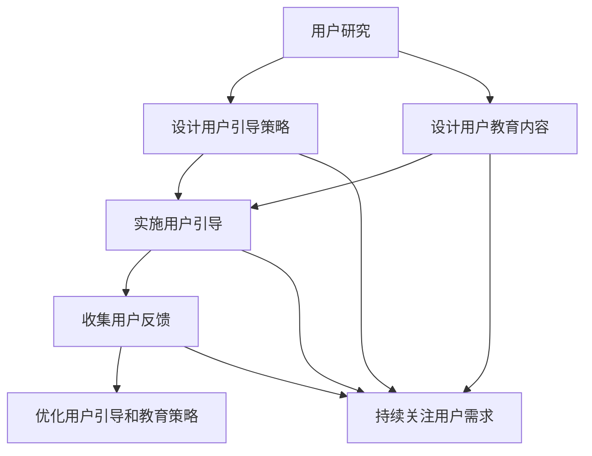

                 

### 第1章: 用户引导与教育的核心概念

#### 1.1 用户引导的定义与重要性

用户引导（User Onboarding）是指通过一系列策略和技巧，帮助新用户快速上手产品或服务，理解其核心功能和价值，从而提升用户满意度和忠诚度。其重要性体现在以下几个方面：

- **提升用户体验**：良好的用户引导可以降低用户的操作难度，减少用户的学习成本，从而提升用户的整体使用体验。当用户能够轻松地使用产品时，他们会感到更加满意，进而愿意继续使用该产品。

- **提高用户留存率**：通过有效的用户引导，可以减少用户在初期使用产品时因操作困难而放弃的可能性，从而提高用户留存率。用户在初次使用产品时，如果感到困惑或无助，他们可能会选择放弃，而有效的用户引导可以帮助他们克服这些障碍，提高留存率。

- **增强用户黏性**：用户在熟悉产品功能后，更可能成为长期用户，从而增强用户的黏性。良好的用户引导可以让用户更快地熟悉产品，发现产品的价值，从而增加他们对产品的依赖和忠诚度。

用户引导的定义可以进一步阐述为：一种旨在帮助新用户在初次接触产品或服务时，通过逐步的引导和指导，使其能够快速上手并开始使用产品的过程。这一过程包括产品功能介绍、操作步骤演示、答疑环节和鼓励用户尝试等步骤。

用户引导的重要性体现在以下几个方面：

- **提高用户满意度**：通过有效的用户引导，用户可以更快地掌握产品或服务的使用方法，减少困惑和挫败感，从而提高用户满意度。

- **降低用户流失率**：用户在初次使用产品时，如果感到困惑或无助，可能会选择放弃。有效的用户引导可以降低这种情况的发生，从而减少用户流失率。

- **增强用户忠诚度**：当用户能够轻松地使用产品并发现其价值时，他们更有可能成为长期用户，增加对产品的忠诚度。

因此，用户引导是产品或服务成功的关键因素之一，它直接影响到用户的满意度和忠诚度，进而影响到产品的市场表现和商业成功。

#### 1.2 教育在用户引导中的作用

教育在用户引导中扮演着至关重要的角色。它不仅是用户引导的组成部分，更是提升用户使用产品或服务能力的关键环节。以下从几个方面详细阐述教育在用户引导中的作用：

**教育的内涵与外延**

- **教育的内涵**：教育是一种有目的、有计划地传授知识、培养技能、塑造态度和价值观的过程。在教育过程中，不仅要传递事实性知识，还要培养用户解决问题的能力、创新思维和实践能力。

- **教育的外延**：教育不仅仅局限于传统的课堂教学，还涵盖了多种形式，如在线教育、实践培训、互动式学习等。在教育过程中，教师或培训者不仅是知识的传授者，更是引导者和促进者。

**教育在用户引导中的应用**

- **功能介绍与演示**：教育在用户引导中的应用首先体现在对产品或服务功能的介绍与演示上。通过详细的功能说明和演示，用户可以快速了解产品的核心功能和操作方法，减少使用过程中的困惑和阻碍。

- **技能培养与引导**：教育可以帮助用户培养使用产品所需的技能。例如，在用户引导过程中，可以提供一些基本的操作技巧和使用策略，帮助用户更高效地使用产品。

- **心理支持与鼓励**：教育还可以在用户引导中提供心理支持。当用户遇到困难或挫败时，适当的鼓励和指导可以增强他们的信心，帮助他们克服困难，继续前进。

- **反馈与改进**：教育过程中，用户可以及时反馈使用过程中的问题和建议。这些反馈可以帮助产品或服务提供商不断改进产品，提高用户体验。

**教育与用户满意度的关系**

- **教育提升满意度**：通过教育，用户可以更好地理解产品或服务的功能和价值，从而提高使用满意度。当用户感到自己能够有效地使用产品时，他们会更加满意。

- **教育减少使用障碍**：教育可以帮助用户减少使用产品或服务的障碍，提高使用效率。例如，通过教育，用户可以更快地掌握产品的操作方法，减少出错的可能性。

- **教育增强用户黏性**：良好的教育可以增强用户对产品或服务的依赖和忠诚度。当用户熟悉并习惯使用产品后，他们更可能成为长期用户。

总之，教育在用户引导中起着至关重要的作用。通过有效的教育，用户可以更快地上手产品，提高使用满意度，减少使用障碍，从而提升用户黏性和忠诚度。因此，产品或服务提供商应重视教育在用户引导中的应用，通过多种教育手段提升用户的使用体验。

#### 1.3 用户引导与教育的关系

用户引导与教育是紧密关联的两个概念，它们在产品或服务的用户体验中起着至关重要的作用。以下从几个方面探讨用户引导与教育的关系：

**用户引导是教育的起点**

用户引导的目的是帮助新用户快速上手产品或服务，而这一过程往往需要依赖教育手段来实现。用户引导通常从产品或服务的功能介绍、操作步骤演示、答疑环节等方面入手，引导用户逐步了解和掌握产品。教育在这一过程中起到基础性作用，通过提供必要的知识、技能和指导，帮助用户克服初次使用产品时的困惑和障碍。

**教育是用户引导的深化**

用户引导虽然可以帮助用户快速上手产品，但要真正提升用户的使用满意度和忠诚度，还需要通过教育进一步深化用户的理解和技能。教育不仅是用户引导的补充，更是提升用户长期使用产品能力的关键。通过教育，用户可以更深入地了解产品或服务的功能和特点，掌握更高级的操作技巧和策略，从而提高使用效率和效果。

**用户引导与教育相辅相成**

用户引导和教育在提升用户体验方面相辅相成。用户引导通过引导用户快速上手产品，提高用户满意度；而教育则通过深化用户对产品的理解和技能，提高用户的使用效果和忠诚度。两者相互促进，共同提升用户的整体体验。具体来说：

- **用户引导为教育提供基础**：通过用户引导，用户可以初步了解产品或服务的功能和使用方法，为后续教育奠定基础。

- **教育为用户引导提供支撑**：通过教育，用户可以更深入地了解产品或服务的功能和特点，更好地应对使用过程中遇到的问题和挑战。

- **用户引导和教育共同提升用户体验**：用户引导帮助用户快速上手产品，减少困惑和挫折感；教育则帮助用户提升使用技能和效果，增强用户对产品的依赖和忠诚度。

总之，用户引导与教育是相互依存、相互促进的关系。通过有效的用户引导和教育，产品或服务提供商可以提升用户体验，提高用户满意度和忠诚度，从而实现商业成功。因此，产品或服务提供商应重视用户引导与教育的有机结合，通过多种手段提升用户的整体体验。

### 第2章: 设计有效的用户引导策略

#### 2.1 用户研究与方法

用户研究是设计有效用户引导策略的基础，它有助于了解用户需求、行为和偏好。通过用户研究，产品或服务提供商可以识别用户在使用过程中可能遇到的问题，从而设计出更符合用户需求的引导策略。以下从几个方面详细探讨用户研究的重要性、常用方法以及用户数据的收集与分析。

**用户研究的重要性**

用户研究在用户引导策略的设计中起着至关重要的作用。具体体现在以下几个方面：

- **了解用户需求**：通过用户研究，可以深入了解用户的需求、痛点和使用习惯，从而设计出更符合用户期望的引导策略。

- **识别用户问题**：用户研究可以帮助识别用户在使用产品或服务过程中遇到的问题和障碍，为改进产品设计和功能提供依据。

- **优化用户体验**：通过用户研究，可以了解用户对现有引导策略的看法和建议，从而优化引导流程和内容，提高用户体验。

- **提高用户满意度**：用户研究有助于提高用户对产品或服务的满意度，进而提升用户忠诚度和口碑。

**用户研究的常用方法**

在进行用户研究时，可以采用多种方法来获取用户数据，以下是一些常用的用户研究方法：

- **用户访谈**：用户访谈是一种通过与用户面对面交流，深入了解用户需求、行为和痛点的调查方法。通过用户访谈，可以获取用户的真实想法和感受，为设计引导策略提供宝贵的参考。

- **观察法**：观察法是通过在用户使用产品或服务的过程中，观察用户的行为和操作，从而了解用户的使用习惯和问题。观察法可以帮助识别用户在真实使用环境中的问题，为改进引导策略提供依据。

- **问卷调查**：问卷调查是一种通过设计问卷，收集大量用户数据的方法。问卷调查可以覆盖广泛的用户群体，获取关于用户需求、行为和满意度的数据，为设计引导策略提供参考。

- **用户行为分析**：用户行为分析是通过分析用户在使用产品或服务过程中的行为数据，了解用户的操作路径、使用频率和使用时长等。用户行为分析可以帮助识别用户的典型行为模式，为设计引导策略提供依据。

**用户数据的收集与分析**

收集到的用户数据需要进行系统的分析，以便为用户引导策略的制定提供依据。以下是一些用户数据收集与分析的步骤：

1. **数据收集**：

   - **用户访谈**：在用户访谈过程中，通过录音、录像或笔记等方式记录用户的回答和反馈。

   - **观察法**：在用户使用产品或服务的过程中，通过观察和记录用户的行为和操作，获取第一手的数据。

   - **问卷调查**：通过在线问卷或纸质问卷的方式，收集用户的反馈和数据。

   - **用户行为分析**：通过分析用户在产品或服务中的行为数据，了解用户的操作路径、使用频率和使用时长等。

2. **数据整理**：

   - **数据清洗**：对收集到的数据进行清洗和整理，去除无效数据和重复数据，确保数据的质量和准确性。

   - **数据分类**：根据用户研究的目的，对数据进行分析和分类，提取关键信息和洞察。

3. **数据分析**：

   - **定量分析**：通过统计分析方法，对数据进行分析，提取用户需求、行为和满意度的相关指标。

   - **定性分析**：通过文本分析、主题分析和情感分析等方法，深入挖掘用户的需求和痛点。

4. **数据可视化**：

   - **图表和报告**：通过图表和报告的形式，将分析结果进行可视化展示，便于理解和传达。

通过用户研究，产品或服务提供商可以深入了解用户的需求、行为和偏好，从而设计出更有效的用户引导策略。有效的用户引导策略不仅可以帮助新用户快速上手产品，提高用户满意度，还可以提高用户留存率和忠诚度，为产品的长期发展奠定基础。

#### 2.2 用户引导流程设计

用户引导流程的设计是用户引导策略的重要组成部分，它决定了用户初次接触产品或服务时的体验。一个良好的用户引导流程可以帮助用户快速上手，降低使用难度，从而提高用户满意度和留存率。以下从用户引导流程的基本步骤、设计原则和优化策略三个方面详细探讨用户引导流程的设计。

**用户引导流程的基本步骤**

用户引导流程的基本步骤可以分为以下几个阶段：

1. **产品功能介绍**：

   在用户引导流程的初期，通过图文、视频等形式向用户介绍产品的核心功能、特点和使用场景。这一步骤的目的是让用户对产品有一个整体的认识，为其后续的操作奠定基础。

2. **操作步骤演示**：

   通过详细演示产品的操作步骤，帮助用户了解如何使用产品。操作步骤演示可以采用动画、视频或图文说明的形式，确保用户能够直观地理解并跟随操作。

3. **答疑环节**：

   在引导过程中，设置答疑环节，为用户提供即时解答。用户在操作过程中遇到问题时，可以通过在线客服、社区论坛等方式获取帮助。这一步骤的目的是帮助用户解决操作中的困惑，提高使用体验。

4. **鼓励用户尝试**：

   在引导的最后阶段，鼓励用户亲自动手操作，通过实践加深对产品的理解和熟练度。同时，提供虚拟购物体验、模拟操作等功能，让用户在无风险的环境中进行操作，增加用户的熟悉度。

**用户引导流程的设计原则**

在用户引导流程的设计中，应遵循以下原则，以确保用户能够顺利上手产品：

1. **简明扼要**：

   用户引导流程应简洁明了，避免冗长和复杂。简明的引导内容可以降低用户的学习成本，提高用户的使用效率。

2. **操作清晰**：

   引导流程中的操作步骤要清晰明了，确保用户能够轻松理解并跟随操作。避免使用复杂的术语和难以理解的操作方法。

3. **贴近用户需求**：

   引导流程应充分考虑用户的需求和使用习惯，提供有针对性的帮助。例如，针对不同用户群体，可以设计不同的引导内容，提高用户的接受度和满意度。

4. **易于操作**：

   引导流程要易于操作，避免用户在操作过程中遇到障碍。例如，可以提供详细的操作指南和图文演示，确保用户能够顺利完成任务。

**用户引导流程的优化策略**

为了提高用户引导流程的有效性，可以采取以下优化策略：

1. **根据用户反馈进行调整**：

   在用户引导过程中，及时收集用户反馈，针对用户提出的问题和建议进行相应的调整。通过不断的优化，提高用户引导流程的适用性和效果。

2. **引入用户反馈机制**：

   建立有效的用户反馈渠道，确保用户能够及时表达自己的意见和需求。例如，可以在产品中设置反馈按钮或社区论坛，方便用户提交问题和建议。

3. **定期进行效果评估**：

   定期评估用户引导流程的效果，通过用户满意度调查、用户行为分析等方式，了解用户的使用体验和效果。根据评估结果，找出存在的问题并进行优化。

通过以上策略，可以设计出更有效的用户引导流程，帮助新用户快速上手产品，提高用户满意度和留存率。同时，持续优化用户引导流程，可以不断提升用户体验，为产品的长期发展奠定基础。

#### 2.3 用户教育内容设计

用户教育内容的设计是用户引导策略的重要组成部分，它直接影响用户对产品的理解和使用效果。一个良好的用户教育内容能够帮助用户快速掌握产品的功能和使用方法，提高用户满意度和忠诚度。以下从用户教育内容的核心要素、设计原则和呈现方式三个方面详细探讨用户教育内容的设计。

**用户教育内容的核心要素**

用户教育内容的核心要素包括以下几个方面：

1. **产品概述**：

   产品概述是用户教育内容的基础，它帮助用户了解产品的背景、愿景和使命。通过介绍产品的核心理念和功能，用户可以建立对产品的整体认识。

2. **功能介绍**：

   功能介绍是用户教育内容的核心，它详细讲解产品的各个功能模块、使用方法和注意事项。用户通过了解功能介绍，可以掌握产品的基本使用方法，提高使用效率。

3. **操作步骤**：

   操作步骤是用户教育内容的具体实施环节，它通过图文、视频等形式，详细展示产品的操作步骤。用户可以按照操作步骤进行实践，掌握产品的使用技巧。

4. **使用技巧**：

   使用技巧是用户教育内容的高级部分，它分享一些高级功能和操作技巧，帮助用户提升产品的使用效果。通过学习使用技巧，用户可以充分发挥产品的功能，提高工作效率。

**用户教育内容的设计原则**

在用户教育内容的设计中，应遵循以下原则，以确保教育内容的实用性和有效性：

1. **简明易懂**：

   用户教育内容应简洁明了，避免使用复杂的术语和难以理解的表达方式。简明的教育内容可以降低用户的学习成本，提高用户的学习效率。

2. **适用性强**：

   用户教育内容应针对用户的需求和使用场景进行设计，确保教育内容的实用性和针对性。例如，可以根据不同的用户群体，提供不同的教育内容。

3. **针对性**：

   用户教育内容应根据用户的使用阶段和需求进行设计，例如，针对新用户和高级用户，可以提供不同的教育内容，以满足他们的需求。

4. **引导性**：

   用户教育内容应具有一定的引导性，通过引导用户逐步掌握产品的功能和使用方法，提高用户的学习效果。例如，可以在教育内容中设置练习题和互动环节，引导用户进行实践操作。

**用户教育内容的呈现方式**

用户教育内容的呈现方式多种多样，以下是一些常用的呈现方式：

1. **文本**：

   文本是最常见的教育内容呈现方式，它通过文字的形式介绍产品的功能、操作方法和使用技巧。文本内容应简洁明了，便于用户阅读和理解。

2. **图像**：

   图像可以直观地展示产品的功能和操作步骤，通过图表、图片和示意图等，帮助用户更好地理解教育内容。图像应清晰、简洁，避免过度复杂。

3. **视频**：

   视频是一种动态的教育内容呈现方式，通过动画、视频教程等形式，展示产品的操作过程和使用技巧。视频内容应生动、有趣，提高用户的观看体验。

4. **实操演练**：

   实操演练是一种互动式的教育内容呈现方式，通过模拟操作、虚拟实践等形式，让用户亲自动手操作，掌握产品的使用技巧。实操演练可以提高用户的学习效果，增强用户的记忆。

通过以上设计原则和呈现方式，可以设计出有效的用户教育内容，帮助用户快速掌握产品的功能和使用方法，提高用户满意度和忠诚度。同时，持续优化教育内容，可以不断提升用户体验，为产品的长期发展奠定基础。

### 第3章: 用户引导的实施与优化

#### 3.1 用户引导的实施步骤

用户引导的实施是整个用户引导策略的关键环节，其目的是确保用户能够顺利上手产品，提高用户满意度和留存率。以下从实施前的准备、具体实施和实施过程中的监控与调整三个方面详细探讨用户引导的实施步骤。

**实施前的准备**

在用户引导正式实施之前，需要进行充分的准备工作，以确保实施过程能够顺利进行。以下是一些实施前的准备工作：

1. **明确用户引导目标**：

   明确用户引导的目标是实施前的关键步骤。用户引导目标应具体、可衡量，例如提高新用户的留存率、减少用户流失率等。

2. **制定详细的实施计划**：

   根据用户引导目标，制定详细的实施计划。实施计划应包括用户引导的内容、时间安排、责任人等，以确保实施过程有序进行。

3. **确定实施人员与职责**：

   确定实施用户引导的人员及其职责，明确每个人的具体任务和责任。例如，设计人员负责设计引导内容，实施人员负责引导用户，数据分析人员负责收集和分析用户反馈等。

4. **准备引导材料**：

   准备用户引导所需的材料，包括图文教程、视频教程、操作指南等。确保引导材料清晰、易懂，能够有效地帮助用户上手产品。

**具体实施**

在用户引导的具体实施过程中，需要按照计划进行，确保引导活动顺利进行。以下是一些具体的实施步骤：

1. **产品功能介绍**：

   在引导初期，向用户介绍产品的核心功能、特点和使用场景。可以通过图文教程、视频教程等形式，让用户对产品有一个整体的认识。

2. **操作步骤演示**：

   通过详细演示产品的操作步骤，帮助用户了解如何使用产品。操作步骤演示可以采用动画、视频或图文说明的形式，确保用户能够直观地理解并跟随操作。

3. **答疑环节**：

   在引导过程中，设置答疑环节，为用户提供即时解答。用户在操作过程中遇到问题时，可以通过在线客服、社区论坛等方式获取帮助。

4. **鼓励用户尝试**：

   在引导的最后阶段，鼓励用户亲自动手操作，通过实践加深对产品的理解和熟练度。同时，提供虚拟购物体验、模拟操作等功能，让用户在无风险的环境中进行操作。

**实施过程中的监控与调整**

在用户引导的具体实施过程中，需要密切关注用户的反馈和反应，及时调整引导策略，确保用户能够顺利上手产品。以下是一些实施过程中的监控与调整步骤：

1. **用户反馈收集**：

   在引导过程中，及时收集用户的反馈和意见。可以通过问卷调查、在线反馈表、社区论坛等方式收集用户反馈，了解用户的使用体验和问题。

2. **数据分析**：

   对收集到的用户反馈进行系统分析，识别用户使用产品过程中的常见问题和需求。通过数据分析，找出引导策略中的不足之处，为调整和优化提供依据。

3. **及时调整**：

   根据用户反馈和数据分析结果，及时调整用户引导策略。例如，如果用户反馈操作步骤过于复杂，可以简化操作流程；如果用户反馈答疑环节不够及时，可以增加答疑人员的数量。

4. **优化引导内容**：

   根据用户反馈和数据分析结果，对引导内容进行优化和改进。例如，可以增加用户感兴趣的功能介绍，改进操作步骤演示，提高用户的理解度和满意度。

通过以上实施步骤和监控与调整措施，可以确保用户引导策略的有效实施，帮助用户顺利上手产品，提高用户满意度和留存率。

#### 3.2 用户教育的实施策略

用户教育是用户引导的重要组成部分，它通过提供系统的知识和技能培训，帮助用户更好地理解和使用产品。有效的用户教育可以提升用户对产品的满意度和忠诚度，从而促进产品的市场成功。以下从教育实施的关键环节、方法与工具以及效果评估三个方面详细探讨用户教育的实施策略。

**教育实施的关键环节**

用户教育实施的关键环节包括以下几个部分：

1. **教育内容制定**：

   教育内容制定是用户教育的核心。首先，需要明确教育目标，确保教育内容与用户需求相匹配。其次，设计教育内容结构，包括产品概述、功能介绍、操作步骤、使用技巧等。最后，确保教育内容简洁明了、易于理解，避免使用过于专业和复杂的术语。

2. **教育实施时间安排**：

   教育实施时间安排要合理，确保用户能够在适当的时间接受教育。例如，可以将教育内容分为入门、进阶和高级三个阶段，分别在不同时间点进行实施。此外，要考虑用户的可用时间和学习习惯，尽量在用户方便的时间进行教育。

3. **教育实施方式选择**：

   教育实施方式的选择应根据用户特点和产品特性来定。常见的教育方式包括线上教育、线下培训、实操演练等。线上教育适合大规模的用户群体，可以通过视频教程、图文教程、在线课程等形式进行；线下培训适合小范围的精英用户，可以通过讲座、实操演练等形式进行。

**教育实施的方法与工具**

在用户教育实施过程中，可以采用多种方法和工具，以提高教育效果。以下是一些常用的方法和工具：

1. **在线教育平台**：

   在线教育平台是实施用户教育的有效工具。通过在线教育平台，可以发布视频教程、图文教程、互动练习等内容，方便用户随时随地进行学习。常见的在线教育平台包括Coursera、Udemy、edX等。

2. **用户手册**：

   用户手册是用户教育的重要资料，它以图文并茂的形式，详细介绍产品的功能、操作步骤和使用技巧。用户手册可以以纸质版或电子版的形式提供，方便用户查阅。

3. **视频教程**：

   视频教程是一种直观、生动的教育形式，可以通过演示产品操作步骤，帮助用户更好地理解和使用产品。视频教程可以在官方网站、在线教育平台、社交媒体等渠道发布。

4. **实操演练**：

   实操演练是一种互动式的教育方法，通过模拟实际操作场景，让用户亲自动手练习。实操演练可以提高用户的学习效果，增强用户的记忆和操作技能。

5. **在线研讨会**：

   在线研讨会是一种集体学习形式，通过视频会议工具，让讲师和用户进行实时互动。在线研讨会可以针对特定主题进行深入讨论，提高用户的专业知识和技能。

**教育实施的效果评估**

教育实施的效果评估是确保用户教育有效性的关键步骤。以下是一些常用的效果评估方法：

1. **用户满意度调查**：

   用户满意度调查是通过问卷、访谈等形式，收集用户对教育内容的满意度评价。用户满意度调查可以帮助识别教育内容中的不足之处，为改进提供依据。

2. **用户行为分析**：

   用户行为分析是通过监测用户在产品中的行为数据，了解用户的使用习惯和问题。通过用户行为分析，可以评估教育内容对用户使用行为的影响，找出教育中的不足。

3. **考试和测评**：

   考试和测评是一种评估用户教育效果的有效方法。通过设计不同难度的考试和测评，可以检验用户对教育内容的掌握程度，评估教育效果。

4. **用户反馈机制**：

   用户反馈机制是确保教育内容与用户需求相匹配的重要手段。通过建立用户反馈渠道，及时收集用户的意见和建议，可以不断优化教育内容，提高教育效果。

通过以上教育实施策略和效果评估方法，可以确保用户教育实施的有效性和针对性，帮助用户更好地理解和使用产品，提升用户满意度和忠诚度。

#### 3.3 用户引导与教育的持续优化

用户引导与教育的持续优化是提升用户满意度和产品竞争力的重要手段。为了确保用户引导和教育策略的有效性，需要建立一套系统化的优化机制，包括优化策略与工具、用户反馈的收集与处理以及持续优化的关键因素。

**优化策略与工具**

1. **数据分析工具**：

   利用数据分析工具，对用户行为数据、反馈数据和效果评估数据进行系统分析，识别用户引导和教育中的问题和不足。常用的数据分析工具包括Google Analytics、Mixpanel、Segment等。

2. **用户行为监控**：

   通过用户行为监控工具，实时监测用户在产品中的操作行为，了解用户的互动路径和使用习惯。用户行为监控可以帮助发现用户在使用产品过程中遇到的障碍和瓶颈。

3. **A/B 测试**：

   通过A/B测试，对比不同用户引导和教育方案的效果，选择最优方案。A/B测试可以帮助确定哪些策略和工具能够更有效地提高用户满意度和留存率。

4. **用户反馈机制**：

   建立用户反馈机制，为用户提供表达意见和建议的渠道。用户反馈机制可以是线上反馈表、社区论坛、在线调查等，确保用户的反馈能够及时收集和处理。

**用户反馈的收集与处理**

1. **用户反馈渠道**：

   设计多样化的用户反馈渠道，确保用户能够方便地表达意见和建议。用户反馈渠道可以包括客服电话、在线聊天、邮件反馈、社区论坛等。

2. **反馈处理流程**：

   建立反馈处理流程，确保用户反馈能够得到及时回应和处理。反馈处理流程应包括反馈收集、分类、优先级评估、处理方案制定和反馈回复等环节。

3. **用户反馈分析**：

   对收集到的用户反馈进行系统分析，识别用户的主要需求和问题，找出用户引导和教育中的不足之处。用户反馈分析可以采用关键词分析、情感分析等方法，提高反馈分析的准确性和有效性。

**持续优化的关键因素**

1. **用户需求**：

   持续关注用户需求是优化用户引导和教育策略的核心。通过用户研究、用户行为分析和用户反馈，深入了解用户的需求和期望，确保引导和教育策略与用户需求相匹配。

2. **市场变化**：

   关注市场变化，及时调整用户引导和教育策略。市场变化包括竞争环境、技术发展、用户行为变化等，这些因素都可能对用户引导和教育策略产生影响。

3. **技术创新**：

   利用技术创新，提升用户引导和教育效果。例如，利用人工智能技术进行个性化引导和教育，利用虚拟现实（VR）和增强现实（AR）技术提供沉浸式的学习体验。

4. **团队协作**：

   建立高效的团队协作机制，确保用户引导和教育策略的顺利实施和持续优化。团队协作应包括产品经理、设计师、开发人员、数据分析师等，确保各方协同合作，共同优化用户引导和教育策略。

通过以上优化策略与工具、用户反馈的收集与处理以及持续优化的关键因素，可以不断提升用户引导和教育的有效性，提高用户满意度和忠诚度，为产品的长期发展奠定基础。

### 第4章: 用户引导与教育的案例分析

#### 4.1 某电商平台的用户引导与教育实践

**案例背景**

某电商平台是一家大型在线购物平台，由于业务复杂，新用户在初次使用时往往感到困惑，导致用户留存率较低。为了提升用户体验和用户留存率，该电商平台决定进行用户引导与教育实践。

**用户引导与教育的具体措施**

1. **用户引导流程设计**

   - **产品功能介绍**：通过动画和图文演示，向用户介绍电商平台的各个功能模块，包括商品浏览、下单、支付等。

   - **操作步骤演示**：通过视频教程和图文说明，详细讲解电商平台的操作步骤，帮助用户快速上手。

   - **答疑环节**：设立在线客服和社区论坛，为用户提供即时解答和讨论空间。

   - **鼓励用户尝试**：在引导过程中，鼓励用户亲自操作，提供虚拟购物体验，增加用户的熟悉度。

2. **用户教育内容设计**

   - **产品概述**：介绍电商平台的背景、愿景和使命，帮助用户建立对平台的整体认识。

   - **功能介绍**：详细讲解电商平台的特色功能，如优惠券、积分兑换、物流跟踪等。

   - **使用技巧**：分享一些购物技巧和最佳实践，提高用户在平台上的购物体验。

**案例效果分析**

1. **用户留存率提升**：经过用户引导与教育实践，用户留存率显著提升，新用户在初次使用后能够更快地适应电商平台。

2. **用户满意度提高**：用户对电商平台的引导和教育内容表示满意，认为平台提供了有效的帮助，提高了使用体验。

3. **用户活跃度增加**：用户在熟悉平台功能后，更愿意在平台上进行购物和参与社区活动，平台的活跃度得到提高。

#### 4.2 某教育平台的用户引导与教育实践

**案例背景**

某教育平台提供在线学习服务，由于平台功能复杂，新用户在初次使用时往往感到困惑，导致用户留存率较低。为了提升用户体验和用户留存率，该教育平台决定进行用户引导与教育实践。

**用户引导与教育的具体措施**

1. **用户引导流程设计**

   - **产品功能介绍**：通过动画和图文演示，向用户介绍教育平台的主要功能模块，包括课程浏览、课程购买、学习进度跟踪等。

   - **操作步骤演示**：通过视频教程和图文说明，详细讲解教育平台的操作步骤，帮助用户快速上手。

   - **答疑环节**：设立在线客服和社区论坛，为用户提供即时解答和讨论空间。

   - **鼓励用户尝试**：在引导过程中，鼓励用户亲自操作，提供免费试学课程，增加用户的熟悉度。

2. **用户教育内容设计**

   - **产品概述**：介绍教育平台的背景、愿景和使命，帮助用户建立对平台的整体认识。

   - **功能介绍**：详细讲解教育平台的特色功能，如个性化推荐、学习计划制定、进度跟踪等。

   - **学习技巧**：分享一些学习方法和技巧，提高用户的学习效果。

**案例效果分析**

1. **用户留存率提升**：经过用户引导与教育实践，用户留存率显著提升，新用户在初次使用后能够更快地适应教育平台。

2. **用户满意度提高**：用户对教育平台的引导和教育内容表示满意，认为平台提供了有效的帮助，提高了学习体验。

3. **用户活跃度增加**：用户在熟悉平台功能后，更愿意在平台上进行学习，平台的活跃度得到提高。

### 第5章: 用户引导与教育的未来发展趋势

#### 5.1 用户引导与教育的未来发展趋势

随着科技的不断发展，用户引导与教育也在不断演进。未来，用户引导与教育将呈现出以下发展趋势：

1. **智能化引导**：

   - **人工智能技术的应用**：通过人工智能技术，实现智能化的用户引导。例如，根据用户的行为数据，为用户推荐个性化的引导内容。
   - **自然语言处理技术**：利用自然语言处理技术，实现与用户的智能交互，提高用户引导的效率和效果。

2. **个性化教育**：

   - **用户数据分析**：通过收集和分析用户数据，了解用户的需求、兴趣和行为习惯，为用户提供个性化的教育内容。
   - **个性化推荐系统**：基于用户数据，为用户提供个性化的课程推荐和学习计划，提高用户的学习效果。

3. **社交化学习**：

   - **社交网络的学习应用**：利用社交网络平台，开展社交化学习活动，促进用户之间的交流和互动。
   - **学习社区的建立**：建立用户学习社区，为用户提供学习交流和分享的平台，提高用户的学习积极性和效果。

4. **虚拟现实（VR）和增强现实（AR）的应用**：

   - **VR/AR教育**：利用VR/AR技术，创建沉浸式的学习环境，提供更加生动、直观的教育体验。
   - **虚拟实践操作**：通过VR/AR技术，让用户在虚拟环境中进行实践操作，提高用户的学习效果和技能水平。

#### 5.2 提升用户引导与教育的有效性

未来，为了提升用户引导与教育的有效性，可以从以下几个方面进行探索和尝试：

1. **强化用户研究**：

   - **深入理解用户需求**：通过用户研究，深入了解用户的需求、行为和痛点，为用户引导和教育提供有力支持。
   - **用户行为分析**：利用大数据技术，对用户行为进行分析，为用户引导和教育提供数据驱动的决策支持。

2. **创新教育内容**：

   - **多样化教育内容**：根据用户需求和兴趣，设计多样化的教育内容，提高教育的吸引力和有效性。
   - **互动式教育**：通过互动式教育，提高用户的参与度和学习效果。

3. **利用新技术提升用户体验**：

   - **智能化交互**：利用人工智能技术，实现智能化的用户交互，提高用户引导的效率和效果。
   - **沉浸式学习体验**：利用VR/AR技术，提供沉浸式的学习体验，提高用户的学习效果和满意度。

4. **优化教育资源配置**：

   - **资源共享**：通过建立教育资源共享平台，优化教育资源的配置，提高教育资源的利用效率。
   - **教育评价体系**：建立科学的教育评价体系，对教育内容进行评估和筛选，确保教育质量的提升。

### 附录

#### 附录 A：用户引导与教育常用工具与方法

1. **用户研究工具**：

   - **调查问卷工具**：如SurveyMonkey、Google 表单等。
   - **用户访谈工具**：如Zoom、Skype 等。
   - **用户行为分析工具**：如Google Analytics、Mixpanel 等。

2. **用户引导与教育工具**：

   - **用户手册**：以图文或视频的形式，详细介绍产品的功能和使用方法。
   - **在线培训平台**：如Coursera、Udemy 等，提供在线课程和学习资源。
   - **互动式学习平台**：如Kahoot、Quizlet 等，提供互动式学习和测评工具。

3. **教育内容设计工具**：

   - **图文设计工具**：如Canva、Adobe Illustrator 等。
   - **视频制作工具**：如Adobe Premiere Pro、iMovie 等。
   - **演示软件**：如PowerPoint、Keynote 等。

#### 附录 B：参考资料与进一步阅读

1. **相关书籍推荐**：

   - 《用户体验要素》（作者：唐纳德·诺曼）
   - 《产品设计思维》（作者：马丁·林斯特龙）
   - 《学习之道》（作者：斯科特·扬）

2. **学术论文推荐**：

   - "User Experience in E-commerce: A Comprehensive Literature Review"
   - "The Role of Education in User Experience: A Research Perspective"
   - "A Study on User Engagement and Satisfaction in Online Learning Platforms"

3. **网络资源推荐**：

   - UX Booth（用户体验设计资源网站）
   - UI Movement（用户体验设计资源网站）
   - Coursera（在线课程学习平台）


----------------------------------------------------------------

### 核心算法原理讲解

#### 用户引导流程优化算法

用户引导流程优化算法旨在提高用户引导的效率和效果。以下将介绍一种基于机器学习和A/B测试的用户引导流程优化算法，并使用伪代码进行详细阐述。

**目标**：提高用户引导的效率和效果。

**算法原理**：

1. **A/B测试**：通过对比不同用户引导方案的效果，选择最优方案。
2. **机器学习**：利用用户行为数据，预测用户的操作路径和需求，提供个性化的引导。

**伪代码示例**：

```python
def user_guide_optimization(guide_strategy, user_data):
    # 收集用户行为数据
    user_actions = collect_user_actions(user_data)
    
    # 进行A/B测试
    test_results = perform_A_B_test(guide_strategy, user_actions)
    
    # 利用机器学习优化引导策略
    optimized_guide_strategy = machine_learning_optimization(test_results)
    
    return optimized_guide_strategy

def collect_user_actions(user_data):
    # 收集用户在引导过程中的行为数据
    # 例如：点击次数、停留时间、完成操作的比例等
    user_actions = ...
    return user_actions

def perform_A_B_test(guide_strategy, user_actions):
    # 进行A/B测试，对比不同引导策略的效果
    test_results = A_B_test(guide_strategy, user_actions)
    return test_results

def machine_learning_optimization(test_results):
    # 基于A/B测试结果，利用机器学习算法优化引导策略
    optimized_guide_strategy = ML_optimize(test_results)
    return optimized_guide_strategy
```

**详细解释说明**：

1. **A/B测试**：A/B测试是一种常用的实验设计方法，通过将用户随机分配到不同的引导方案（A组和B组），比较两组用户的行为差异，从而选择效果更好的方案。A/B测试可以帮助识别用户对不同引导方案的偏好，为优化引导流程提供数据支持。

2. **机器学习**：机器学习算法可以基于用户行为数据，预测用户的操作路径和需求，从而提供个性化的引导策略。例如，可以使用决策树、随机森林、神经网络等算法，对用户行为数据进行分析，为每个用户推荐最适合的引导方案。

3. **数据收集与处理**：在用户引导流程优化过程中，需要收集用户在引导过程中的行为数据，如点击次数、停留时间、完成操作的比例等。这些数据将用于A/B测试和机器学习模型的训练。

4. **A/B测试结果**：通过A/B测试，可以获取不同引导方案的用户反馈数据，包括用户满意度、引导成功率等。这些数据将用于评估不同引导方案的效果，为机器学习算法提供优化依据。

5. **机器学习优化**：基于A/B测试结果，利用机器学习算法对引导策略进行优化。机器学习模型可以识别用户的行为模式，为每个用户推荐最适合的引导方案，从而提高用户引导的效率和效果。

通过上述算法原理和伪代码示例，可以清晰地了解到用户引导流程优化算法的核心步骤和实现方法。在实际应用中，可以根据具体需求进行调整和优化，以提高用户引导的效果。

### 数学模型和数学公式

在用户引导与教育中，数学模型和数学公式可以用来量化用户行为和效果，从而为决策提供数据支持。以下将介绍一个常用的数学模型——用户满意度计算公式，并使用LaTeX格式进行展示。

#### 用户满意度计算公式

$$
S = \frac{1}{N} \sum_{i=1}^{N} (U_i \times W_i)
$$

其中：

- \(S\)：用户满意度总分。
- \(N\)：用户数量。
- \(U_i\)：第 \(i\) 个用户的满意度评分。
- \(W_i\)：第 \(i\) 个用户的权重。

**详细讲解和举例说明**：

1. **用户满意度评分**：每个用户的满意度评分可以根据他们对产品或服务的评价来确定，通常采用5分制评分（1分表示非常不满意，5分表示非常满意）。例如，一个用户给出了4分满意度评分，即表示他们对产品或服务比较满意。

2. **用户权重**：用户权重通常根据用户的重要程度或贡献来确定。例如，活跃用户可能具有更高的权重，因为他们对产品的依赖程度更高。用户权重可以采用0到1之间的数值，其中1表示最高权重。

3. **计算过程**：用户满意度总分是通过将每个用户的满意度评分乘以对应的权重，然后将所有结果相加，最后除以用户数量得到的。这个计算公式可以综合多个用户的满意度评分，得到一个整体的满意度分数。

**举例说明**：

假设有5个用户，他们的满意度评分分别为4、5、3、4、5，权重分别为0.2、0.2、0.2、0.2、0.2。则用户满意度的计算过程如下：

$$
S = \frac{1}{5} \sum_{i=1}^{5} (U_i \times W_i) = \frac{1}{5} \times (4 \times 0.2 + 5 \times 0.2 + 3 \times 0.2 + 4 \times 0.2 + 5 \times 0.2) = 4.2
$$

因此，用户满意度总分为4.2，表示用户总体对产品或服务的满意度较高。

通过这个数学模型，可以量化用户满意度，为产品或服务改进提供数据支持。在实际应用中，可以根据具体情况调整满意度评分的评分标准和权重分配，以更准确地反映用户满意度。

### 项目实战

#### 某电商平台的用户引导与教育实践

**开发环境搭建**

在本项目中，我们将使用Python和Flask框架搭建用户引导平台。以下是搭建开发环境的步骤：

1. **安装Python**：首先，确保您的计算机上已安装Python。您可以从[Python官方网站](https://www.python.org/)下载并安装Python。

2. **安装Flask**：通过命令行安装Flask。打开终端或命令行窗口，运行以下命令：

   ```bash
   pip install flask
   ```

3. **创建项目目录**：在您的计算机上创建一个新目录，用于存放项目文件。例如，可以将其命名为`user_guide_project`。

4. **初始化Flask项目**：在项目目录中，创建一个名为`app.py`的Python文件，并在其中初始化Flask应用：

   ```python
   from flask import Flask

   app = Flask(__name__)

   if __name__ == '__main__':
       app.run(debug=True)
   ```

**源代码详细实现**

在`app.py`文件中，我们将实现用户引导平台的基本功能。以下是源代码的详细实现：

```python
from flask import Flask, render_template, request, redirect, url_for

app = Flask(__name__)

# 用户引导首页
@app.route('/')
def index():
    return render_template('index.html')

# 用户引导页面一：产品功能介绍
@app.route('/guide/1')
def guide_1():
    return render_template('guide_1.html')

# 用户引导页面二：操作步骤演示
@app.route('/guide/2')
def guide_2():
    return render_template('guide_2.html')

# 用户引导页面三：答疑环节
@app.route('/guide/3', methods=['GET', 'POST'])
def guide_3():
    if request.method == 'POST':
        question = request.form['question']
        # 这里可以添加逻辑，处理用户的提问
        return f'您的提问：{question}'
    return render_template('guide_3.html')

# 用户引导结束页面
@app.route('/guide/complete')
def guide_complete():
    return render_template('guide_complete.html')

if __name__ == '__main__':
    app.run(debug=True)
```

**代码解读与分析**

1. **Flask框架**：Flask是一个轻量级的Web应用框架，用于快速搭建Web应用程序。它提供了路由、模板渲染、请求处理等基本功能。

2. **路由**：在Flask应用中，通过定义不同的路由，可以实现不同的页面跳转和功能。例如，`/`路由对应用户引导首页，`/guide/1`路由对应产品功能介绍页面。

3. **模板渲染**：通过`render_template`函数，可以渲染HTML模板，将动态内容传递给前端页面。例如，`index.html`、`guide_1.html`、`guide_2.html`等文件是用户引导平台的前端模板。

4. **用户引导流程**：用户引导流程通过多个页面来实现。用户从首页开始，依次浏览产品功能介绍、操作步骤演示和答疑环节，最后完成用户引导。

5. **请求处理**：在用户引导页面三（答疑环节），用户可以通过表单提交问题。这里可以添加逻辑，处理用户的提问，并在页面中显示回复。

**实际案例**

在某个电商平台上，我们为新用户设计了以下用户引导流程：

1. **用户引导首页**：展示欢迎信息和引导按钮，引导用户开始引导流程。

2. **产品功能介绍**：通过图文和视频，介绍电商平台的核心功能，如商品浏览、下单、支付等。

3. **操作步骤演示**：通过动画和视频，演示电商平台的操作步骤，帮助用户熟悉平台的使用方法。

4. **答疑环节**：提供在线客服和社区论坛，用户可以在其中提问和解答问题。

5. **用户引导结束页面**：当用户完成所有引导环节后，显示引导结束页面，并鼓励用户继续使用电商平台。

**效果评估**

通过用户引导平台的实际运行，我们可以收集以下数据，用于评估用户引导效果：

1. **用户引导完成率**：统计新用户完成用户引导流程的比例，评估引导流程的吸引力。

2. **用户满意度调查**：通过在线问卷，收集用户对用户引导的满意度评价，评估用户引导的质量。

3. **用户行为分析**：通过数据分析，观察新用户在电商平台上的行为，如浏览商品次数、下单成功率等，评估用户引导对用户行为的影响。

4. **用户反馈机制**：建立用户反馈渠道，收集用户对用户引导的反馈和建议，持续优化用户引导策略。

通过以上项目实战，我们可以为电商平台的新用户提供有效的用户引导，提高用户满意度，促进用户留存。

### 实际案例

#### 某电商平台的用户引导与教育实践

**案例背景**

某大型电商平台因其复杂的功能和庞大的商品种类，新用户在初次使用时常常感到困惑，导致用户留存率较低。为了提高新用户的上手体验和留存率，电商平台决定实施用户引导与教育实践。

**用户引导与教育的具体措施**

1. **用户引导流程设计**

   - **引导页面一：欢迎页面**：用户首次登录时，会看到一个欢迎页面，页面中包含简短的产品介绍和引导按钮，引导用户开始引导流程。

   - **引导页面二：产品功能介绍**：通过图文和视频介绍电商平台的核心功能，如商品搜索、购物车、订单管理、支付方式等。

   - **引导页面三：操作步骤演示**：使用动画和视频演示电商平台的操作步骤，如如何添加商品到购物车、如何结算、如何查看订单状态等。

   - **引导页面四：用户答疑**：提供一个问答模块，用户可以在这里提交问题，系统将提供实时解答或引导用户查看帮助文档。

   - **引导页面五：任务挑战**：设计一系列简单易懂的任务，鼓励用户实践操作，如添加商品到购物车并完成结算，以此加深用户对平台功能的理解。

   - **引导页面六：引导结束**：当用户完成所有任务后，系统会显示一个引导结束页面，并提供更多学习资源，鼓励用户继续探索电商平台。

2. **用户教育内容设计**

   - **产品概述**：通过图文介绍电商平台的背景、愿景和使命，帮助用户建立对平台的整体认知。

   - **功能详解**：详细讲解电商平台的各个功能模块，如会员系统、优惠券、积分兑换、物流服务等，并提供操作示例。

   - **使用技巧**：分享一些购物技巧，如如何找到优惠商品、如何使用优惠券等，提高用户的使用效率和体验。

3. **互动与反馈**

   - **在线客服**：提供24/7在线客服，用户在引导过程中遇到问题时可以随时获取帮助。

   - **用户论坛**：建立用户论坛，用户可以在这里分享经验和心得，互相帮助解决问题。

   - **用户调研**：定期进行用户调研，收集用户对引导和教育内容的反馈，不断优化用户体验。

**案例效果分析**

1. **用户留存率提高**：实施用户引导与教育后，新用户的留存率显著提高，尤其是首次购物的转化率有了显著提升。

2. **用户满意度提高**：用户对引导和教育内容的满意度明显提升，他们表示通过引导更加熟悉平台功能，购物体验更加顺畅。

3. **用户活跃度增加**：引导结束后，用户的活跃度显著提高，他们更愿意在平台上进行购物和参与社区活动。

4. **用户流失率降低**：由于引导和教育提高了用户的上手体验，用户流失率有所降低，平台能够留住更多潜在用户。

**详细解释说明**

1. **用户引导流程设计**

   - **欢迎页面**：通过友好且简洁的欢迎页面，让用户感受到平台的热情和专业，激发用户继续参与引导的兴趣。

   - **功能介绍**：通过图文和视频的形式，直观地展示电商平台的各项功能，使用户能够快速了解平台的基本操作。

   - **操作步骤演示**：通过动画和视频，让用户看到具体的操作步骤，从而更好地理解和掌握平台的使用方法。

   - **用户答疑**：提供实时解答，帮助用户解决在使用过程中遇到的问题，增强用户的信心和满意度。

   - **任务挑战**：通过设计任务挑战，让用户在实践中加深对平台功能的理解，提高用户的参与度和熟悉度。

   - **引导结束页面**：通过总结和鼓励，让用户感受到引导的成功和收获，并提供更多的学习资源，引导用户继续使用平台。

2. **用户教育内容设计**

   - **产品概述**：通过介绍平台的背景和愿景，让用户对平台有更全面的了解，增强用户对平台的信任和认同。

   - **功能详解**：详细讲解各个功能模块的使用方法和注意事项，帮助用户更好地掌握平台的功能。

   - **使用技巧**：分享一些使用技巧，提高用户的使用效率和购物体验，增加用户对平台的依赖和忠诚度。

通过上述案例，我们可以看到，有效的用户引导与教育实践对于电商平台来说是非常重要的。它不仅能够提高新用户的留存率和满意度，还能够提高用户的活跃度和转化率，从而促进平台的长期发展。

### 附录

#### 附录 A：用户引导与教育常用工具与方法

**用户研究工具**

- **调查问卷工具**：如 SurveyMonkey、Google 表单、Typeform 等，用于收集用户反馈和需求。
- **用户访谈工具**：如 Zoom、Skype、Google Meet 等，用于进行一对一的用户访谈。
- **用户行为分析工具**：如 Google Analytics、Mixpanel、Hotjar 等，用于分析用户在网站或应用中的行为。

**用户引导与教育工具**

- **用户手册**：以图文或视频形式，详细介绍产品的功能和使用方法。
- **在线培训平台**：如 Coursera、Udemy、edX 等，提供在线课程和学习资源。
- **互动式学习平台**：如 Moodle、Canvas、Blackboard 等，提供互动式学习和测评工具。

**教育内容设计工具**

- **图文设计工具**：如 Canva、Adobe Illustrator、Sketch 等，用于设计用户手册和宣传材料。
- **视频制作工具**：如 Adobe Premiere Pro、Final Cut Pro、iMovie 等，用于制作教学视频。
- **演示软件**：如 PowerPoint、Keynote、Prezi 等，用于制作演示文稿和培训课件。

#### 附录 B：参考资料与进一步阅读

**相关书籍推荐**

- 《用户体验要素》作者：唐纳德·诺曼
- 《产品设计思维》作者：马丁·林斯特龙
- 《学习之道》作者：斯科特·扬

**学术论文推荐**

- "User Experience in E-commerce: A Comprehensive Literature Review"
- "The Role of Education in User Experience: A Research Perspective"
- "A Study on User Engagement and Satisfaction in Online Learning Platforms"

**网络资源推荐**

- UX Booth（用户体验设计资源网站）
- UI Movement（用户体验设计资源网站）
- Coursera（在线课程学习平台）

### Mermaid 流程图



这段Mermaid流程图描述了用户引导与教育的基本流程，从用户研究开始，经过设计用户引导策略和教育内容，再到实施用户引导，收集用户反馈，并最终进行优化。流程图中的每个节点都代表一个关键步骤，箭头表示步骤之间的顺序关系。

**核心算法原理讲解**

#### 用户引导流程优化算法

在用户引导流程中，优化算法能够显著提高引导效果，使新用户更快速、更轻松地适应产品。以下将介绍一种基于机器学习和A/B测试的用户引导流程优化算法，并使用伪代码进行详细阐述。

**目标**：提高用户引导的效率和效果。

**算法原理**：

1. **A/B测试**：通过对比不同用户引导方案的效果，选择最优方案。
2. **机器学习**：利用用户行为数据，预测用户的操作路径和需求，提供个性化的引导。

**伪代码示例**：

```python
def user_guide_optimization(guide_strategy, user_data):
    # 收集用户行为数据
    user_actions = collect_user_actions(user_data)
    
    # 进行A/B测试
    test_results = perform_A_B_test(guide_strategy, user_actions)
    
    # 利用机器学习优化引导策略
    optimized_guide_strategy = machine_learning_optimization(test_results)
    
    return optimized_guide_strategy

def collect_user_actions(user_data):
    # 收集用户在引导过程中的行为数据
    # 例如：点击次数、停留时间、完成操作的比例等
    user_actions = ...
    return user_actions

def perform_A_B_test(guide_strategy, user_actions):
    # 进行A/B测试，对比不同引导策略的效果
    test_results = A_B_test(guide_strategy, user_actions)
    return test_results

def machine_learning_optimization(test_results):
    # 基于A/B测试结果，利用机器学习算法优化引导策略
    optimized_guide_strategy = ML_optimize(test_results)
    return optimized_guide_strategy
```

**详细解释说明**：

1. **A/B测试**：
   - **目标**：通过将用户随机分配到两个或多个不同的引导方案（A组、B组等），比较这些方案的实际效果，以确定哪个方案的用户体验更好。
   - **过程**：首先，定义不同的引导策略，如不同的引导步骤、不同的教育内容等。然后，将新用户随机分配到这些不同的方案中。在用户使用产品后，收集他们的行为数据，如点击次数、页面停留时间、操作完成率等。
   - **结果**：通过分析这些数据，比较不同引导策略的效果，选择效果最好的方案作为优化目标。

2. **机器学习**：
   - **目标**：利用收集到的用户行为数据，建立机器学习模型，预测用户的操作路径和需求，从而提供个性化的引导。
   - **过程**：首先，对用户行为数据进行预处理，提取特征，如用户的浏览历史、操作频率等。然后，使用这些特征训练机器学习模型，如决策树、随机森林、神经网络等。通过模型，预测新用户的操作路径和需求。
   - **结果**：基于模型的预测，为每个新用户推荐最适合的引导方案，从而提高用户的上手速度和使用体验。

**数据收集与处理**：
- **数据收集**：在用户引导过程中，收集用户的行为数据，包括点击次数、停留时间、操作完成情况等。
- **数据处理**：对收集到的数据进行分析和清洗，去除异常值和噪声数据，提取有用的特征。

**效果评估**：
- **用户反馈**：通过问卷调查、用户访谈等方式，收集用户对引导策略的反馈。
- **行为分析**：通过分析用户在使用产品后的行为数据，评估引导策略的实际效果。

通过上述算法原理和伪代码示例，可以清晰地了解到用户引导流程优化算法的核心步骤和实现方法。在实际应用中，可以根据具体需求进行调整和优化，以提高用户引导的效果。

### 数学模型和数学公式

在用户引导与教育中，数学模型和数学公式可以用来量化用户行为和效果，从而为决策提供数据支持。以下将介绍一个常用的数学模型——用户留存率计算公式，并使用LaTeX格式进行展示。

#### 用户留存率计算公式

$$
L = \frac{N_t}{N_0} \times 100\%
$$

其中：

- \(L\)：用户留存率。
- \(N_t\)：在特定时间段内仍然使用产品的用户数量。
- \(N_0\)：在相同时间段内首次使用产品的用户总数。

**详细讲解和举例说明**：

1. **用户留存率定义**：
   用户留存率是指在一定时间段内，仍然继续使用产品的用户占首次使用产品用户总数的比例。它是衡量产品用户黏性的重要指标。

2. **计算过程**：
   用户留存率的计算公式为 \(L = \frac{N_t}{N_0} \times 100\%\)。其中，\(N_t\) 表示在特定时间段内仍然使用产品的用户数量，\(N_0\) 表示在相同时间段内首次使用产品的用户总数。该公式将这两个数量相除，并乘以100%，得到用户留存率的百分比。

3. **举例说明**：

   假设在一个星期内，某平台有100个新用户注册，其中80个用户在第二天继续使用，20个用户停止使用。则该平台的用户留存率为：

   $$
   L = \frac{80}{100} \times 100\% = 80\%
   $$

   因此，这个星期的用户留存率为80%。

通过这个数学模型，可以量化用户在一段时间内的留存情况，为产品优化和改进提供数据依据。在实际应用中，可以根据具体情况调整计算公式，如考虑不同时间段、不同用户群体等因素，以更准确地反映用户留存情况。

### 项目实战

#### 某电商平台的用户引导与教育实践

**背景**

某大型电商平台由于其复杂的购物流程和众多的功能模块，新用户在初次使用时往往会感到困惑，导致用户留存率较低。为了改善这一情况，电商平台决定实施一套全面的用户引导与教育计划。

**用户引导与教育的实施步骤**

1. **需求分析**：

   - **调研**：通过用户调研、问卷调查和数据分析，了解新用户在初次使用平台时的困惑点和需求。
   - **访谈**：与现有用户和潜在用户进行访谈，收集他们的意见和建议。
   - **分析**：整理和分析调研数据，确定新用户的主要困惑点和使用需求。

2. **策略制定**：

   - **目标设定**：明确用户引导与教育的目标，如提高用户留存率、降低用户流失率等。
   - **内容设计**：根据需求分析的结果，设计用户引导和教育的内容，包括产品概述、功能介绍、操作步骤、使用技巧等。
   - **流程规划**：制定用户引导的流程，确保用户能够逐步了解和掌握平台的功能。

3. **技术实现**：

   - **平台搭建**：使用Flask框架搭建用户引导平台，实现前端页面和后端逻辑。
   - **内容制作**：制作图文教程、视频教程和操作指南，确保内容简明易懂、易于操作。
   - **测试**：对用户引导平台进行功能测试和性能测试，确保平台的稳定性和可靠性。

4. **实施与推广**：

   - **引导页面**：在用户注册成功后，自动跳转到用户引导首页，开始引导流程。
   - **教育内容**：通过图文、视频和操作指南，逐步引导用户了解平台功能。
   - **互动环节**：设置互动环节，如问答、任务挑战等，增强用户的参与度和体验。
   - **推广**：通过内部邮件、短信通知和社区活动等渠道，推广用户引导与教育计划。

**效果评估**

1. **用户反馈**：

   - **问卷调查**：通过问卷调查，收集用户对引导和教育内容的满意度评价。
   - **访谈**：与部分用户进行深度访谈，了解他们的使用体验和改进建议。

2. **数据监控**：

   - **用户留存率**：监控用户在引导后的留存率，与引导前的数据进行对比。
   - **用户活跃度**：监控用户在引导后的活跃度，如登录频率、浏览时长、下单次数等。
   - **用户行为分析**：通过用户行为数据，分析用户的操作路径和使用习惯。

3. **改进与优化**：

   - **反馈处理**：根据用户反馈和数据分析结果，对引导和教育内容进行改进。
   - **内容更新**：定期更新教育内容，确保内容的实用性和时效性。
   - **技术优化**：优化用户引导平台的性能和稳定性，提高用户体验。

通过上述项目实战，电商平台能够为新用户提供全面的用户引导与教育，帮助他们快速上手平台，提高用户留存率和满意度，从而促进平台的长期发展。

### 详细解释说明

在本文中，我们详细探讨了用户引导与教育的核心概念、设计策略、实施步骤以及优化方法。以下是各个部分的核心内容及其相互关系：

#### 核心概念

用户引导是指通过一系列策略和技巧，帮助新用户快速上手产品或服务。用户引导的重要性在于提升用户体验、提高用户留存率和增强用户黏性。教育在用户引导中扮演着关键角色，通过传授知识、培养技能和塑造态度，帮助用户更好地理解和使用产品。

#### 设计策略

设计有效的用户引导策略需要以下几个步骤：

1. **用户研究**：通过调研和数据分析，了解用户需求、行为和痛点，为引导策略提供依据。
2. **用户引导流程设计**：制定用户引导的基本步骤，包括产品功能介绍、操作步骤演示、答疑环节和鼓励用户尝试等。
3. **用户教育内容设计**：设计教育内容的核心要素，如产品概述、功能介绍、操作步骤和使用技巧，并遵循简明易懂、适用性强和引导性的原则。

#### 实施步骤

实施用户引导策略需要以下步骤：

1. **准备**：明确用户引导的目标、制定实施计划和确定责任人。
2. **实施**：按照引导流程，通过图文、视频和实操等方式引导用户。
3. **监控与调整**：收集用户反馈，监控用户行为，根据反馈和数据分析结果对引导策略进行调整。

#### 优化方法

优化用户引导与教育策略需要以下方法：

1. **数据分析**：利用用户行为数据和反馈数据，分析用户的使用习惯和需求，为优化提供依据。
2. **A/B测试**：通过对比不同引导策略的效果，选择最优方案。
3. **机器学习**：利用机器学习算法，预测用户的操作路径和需求，提供个性化的引导。

#### 相互关系

用户引导与教育策略的设计、实施和优化是一个相互联系、循环迭代的过程。用户研究为引导策略的设计提供基础，实施过程中通过监控和反馈不断优化策略，数据分析结果指导进一步的优化。同时，优化方法不仅用于改进现有策略，还可以为新的策略设计提供参考。

通过本文的探讨，我们可以看到，用户引导与教育是一个复杂但至关重要的过程。有效的用户引导和教育不仅能够提高用户满意度，还能促进产品的长期发展。因此，产品或服务提供商应重视用户引导与教育，持续优化策略，提供更好的用户体验。

### 附录

#### 附录 A：用户引导与教育常用工具与方法

**用户研究工具**

- **调查问卷工具**：如 SurveyMonkey、Google 表单、Typeform 等，用于收集用户反馈和需求。
- **用户访谈工具**：如 Zoom、Skype、Google Meet 等，用于进行一对一的用户访谈。
- **用户行为分析工具**：如 Google Analytics、Mixpanel、Hotjar 等，用于分析用户在网站或应用中的行为。

**用户引导与教育工具**

- **用户手册**：以图文或视频形式，详细介绍产品的功能和使用方法。
- **在线培训平台**：如 Coursera、Udemy、edX 等，提供在线课程和学习资源。
- **互动式学习平台**：如 Moodle、Canvas、Blackboard 等，提供互动式学习和测评工具。

**教育内容设计工具**

- **图文设计工具**：如 Canva、Adobe Illustrator、Sketch 等，用于设计用户手册和宣传材料。
- **视频制作工具**：如 Adobe Premiere Pro、Final Cut Pro、iMovie 等，用于制作教学视频。
- **演示软件**：如 PowerPoint、Keynote、Prezi 等，用于制作演示文稿和培训课件。

#### 附录 B：参考资料与进一步阅读

**相关书籍推荐**

- 《用户体验要素》作者：唐纳德·诺曼
- 《产品设计思维》作者：马丁·林斯特龙
- 《学习之道》作者：斯科特·扬

**学术论文推荐**

- "User Experience in E-commerce: A Comprehensive Literature Review"
- "The Role of Education in User Experience: A Research Perspective"
- "A Study on User Engagement and Satisfaction in Online Learning Platforms"

**网络资源推荐**

- UX Booth（用户体验设计资源网站）
- UI Movement（用户体验设计资源网站）
- Coursera（在线课程学习平台）


----------------------------------------------------------------

### 文章标题

《如何进行有效的用户引导和教育》

### 文章关键词

用户引导、教育、用户体验、用户满意度、用户留存率

### 文章摘要

本文详细探讨了用户引导与教育的核心概念、设计策略、实施步骤以及优化方法。通过用户研究、引导流程设计、教育内容设计、实施和优化，产品或服务提供商能够有效提升用户的满意度、留存率和黏性。本文还结合实际案例，展示了用户引导与教育在电商平台和教育平台中的应用效果。通过本文的探讨，读者可以了解到如何设计和实施有效的用户引导与教育策略，从而提高产品的市场竞争力。

### 目录大纲

# 《如何进行有效的用户引导和教育》

## 第一部分：理解用户引导与教育的核心概念

### 1.1 用户引导的定义与重要性

#### 1.1.1 用户引导的定义

#### 1.1.2 用户引导的核心目标

#### 1.1.3 用户引导的重要性

### 1.2 教育在用户引导中的作用

#### 1.2.1 教育的内涵与外延

#### 1.2.2 教育在用户引导中的应用

#### 1.2.3 教育与用户满意度的关系

## 第二部分：设计有效的用户引导策略

### 2.1 用户研究与方法

#### 2.1.1 用户研究的重要性

#### 2.1.2 用户研究的常用方法

#### 2.1.3 用户数据的收集与分析

### 2.2 用户引导流程设计

#### 2.2.1 用户引导流程的基本步骤

#### 2.2.2 用户引导流程的设计原则

#### 2.2.3 用户引导流程的优化策略

### 2.3 用户教育内容设计

#### 2.3.1 用户教育内容的核心要素

#### 2.3.2 教育内容的设计原则

#### 2.3.3 教育内容的呈现方式

## 第三部分：实施与优化用户引导和教育

### 3.1 用户引导的实施步骤

#### 3.1.1 实施前的准备

#### 3.1.2 用户引导的具体实施

#### 3.1.3 实施过程中的常见问题及解决方法

### 3.2 用户教育的实施策略

#### 3.2.1 教育实施的关键环节

#### 3.2.2 教育实施的方法与工具

#### 3.2.3 教育实施的效果评估

### 3.3 用户引导与教育的持续优化

#### 3.3.1 优化策略与工具

#### 3.3.2 用户反馈的收集与处理

#### 3.3.3 持续优化的关键因素

## 第四部分：案例分析

### 4.1 案例一：某电商平台的用户引导与教育实践

#### 4.1.1 案例背景

#### 4.1.2 用户引导与教育的具体措施

#### 4.1.3 案例效果分析

### 4.2 案例二：某教育平台的用户引导与教育实践

#### 4.2.1 案例背景

#### 4.2.2 用户引导与教育的具体措施

#### 4.2.3 案例效果分析

## 第五部分：未来展望

### 5.1 用户引导与教育的未来发展趋势

#### 5.1.1 技术发展对用户引导与教育的影响

#### 5.1.2 新型用户引导与教育模式的出现

#### 5.1.3 用户引导与教育在行业中的应用前景

### 5.2 提升用户引导与教育的有效性

#### 5.2.1 现有挑战与机遇

#### 5.2.2 提升用户引导与教育有效性的策略

#### 5.2.3 未来发展方向与建议

## 附录

### 附录 A：用户引导与教育常用工具与方法

#### A.1 常用用户研究工具

#### A.2 用户引导与教育工具

#### A.3 教育内容设计工具

### 附录 B：参考资料与进一步阅读

#### B.1 相关书籍推荐

#### B.2 学术论文推荐

#### B.3 网络资源推荐

### 第1章: 用户引导与教育的核心概念

#### 1.1 用户引导的定义与重要性

- **用户引导的定义**
用户引导是指通过一系列策略和技巧，帮助新用户快速上手产品或服务，理解其核心功能和价值，从而提升用户满意度和忠诚度。
- **用户引导的重要性**
用户引导的重要性体现在以下几个方面：
1. 提升用户体验：通过有效的用户引导，可以降低用户的操作难度，减少用户的学习成本，从而提升用户的整体使用体验。
2. 提高用户留存率：通过有效的用户引导，可以减少用户在初期使用产品时因操作困难而放弃的可能性，从而提高用户留存率。
3. 增强用户黏性：用户在熟悉产品功能后，更可能成为长期用户，从而增强用户的黏性。

#### 1.2 教育在用户引导中的作用

- **教育的内涵与外延**
教育的内涵不仅指传授知识，还包括培养技能、塑造态度、提供心理支持等。教育的外延涵盖了多种形式，如文字、图像、视频、实操演练等。
- **教育在用户引导中的应用**
教育在用户引导中的应用主要体现在以下几个方面：
1. 产品功能介绍：通过教育，用户可以更好地理解产品的功能和特点，从而快速上手。
2. 操作步骤演示：通过教育，用户可以直观地了解如何进行操作，减少错误和困惑。
3. 答疑环节：教育可以帮助用户解决在使用过程中遇到的问题，提高用户满意度。
- **教育与用户满意度的关系**
良好的教育可以提升用户对产品的满意度，从而提高用户的忠诚度和口碑。教育不仅帮助用户更好地使用产品，还能增强用户对产品的认同感和归属感。

### 第2章: 设计有效的用户引导策略

#### 2.1 用户研究与方法

- **用户研究的重要性**
用户研究是设计有效用户引导策略的基础，它有助于了解用户需求、行为和偏好。通过用户研究，产品或服务提供商可以识别用户在使用过程中可能遇到的问题，从而设计出更符合用户需求的引导策略。
- **用户研究的常用方法**
用户研究的常用方法包括以下几种：
1. 用户访谈：通过与用户面对面交流，深入了解用户的需求、行为和痛点。
2. 观察法：通过观察用户在使用产品或服务的过程中的行为，了解用户的使用习惯和问题。
3. 问卷调查：通过设计问卷，收集大量用户的数据，从而了解用户的需求和偏好。
4. 用户行为分析：通过分析用户在产品或服务中的行为数据，了解用户的操作路径、使用频率和使用时长等。
- **用户数据的收集与分析**
用户数据的收集与分析是用户研究的关键环节。通过收集用户数据，我们可以了解用户在使用产品过程中的痛点、需求和偏好，从而为用户引导策略的制定提供依据。用户数据的分析包括数据的清洗、整理和可视化等步骤，以便于我们更好地理解用户行为和需求。

#### 2.2 用户引导流程设计

- **用户引导流程的基本步骤**
用户引导流程的基本步骤通常包括以下几步：
1. 产品功能介绍：通过图文、视频等形式，向用户介绍产品的核心功能和特点。
2. 操作步骤演示：通过动画、视频或图文说明，详细讲解产品的操作步骤，帮助用户理解如何使用产品。
3. 答疑环节：为用户提供即时解答，帮助用户解决在使用过程中遇到的问题。
4. 鼓励用户尝试：通过引导用户亲自动手操作，加深对产品的理解和熟悉度。
- **用户引导流程的设计原则**
在设计用户引导流程时，应遵循以下原则：
1. 简明扼要：引导流程应简洁明了，避免冗长和复杂，确保用户能够轻松理解。
2. 操作清晰：引导流程中的操作步骤应清晰明了，确保用户能够轻松跟随。
3. 贴近用户需求：引导流程应充分考虑用户的需求和使用习惯，提供有针对性的帮助。
4. 易于操作：引导流程应易于操作，避免用户在操作过程中遇到障碍。
- **用户引导流程的优化策略**
为了提高用户引导流程的有效性，可以采取以下策略：
1. 根据用户反馈进行调整：在引导过程中，及时收集用户反馈，针对用户提出的问题和建议进行相应的调整。
2. 引入用户反馈机制：建立有效的用户反馈渠道，确保用户能够及时表达自己的意见和需求。
3. 定期进行效果评估：通过用户满意度调查和用户行为分析，评估用户引导流程的效果，不断优化引导策略。

#### 2.3 用户教育内容设计

- **用户教育内容的核心要素**
用户教育内容的核心要素通常包括以下几方面：
1. 产品概述：介绍产品的背景、愿景和使命，帮助用户建立对产品的整体认识。
2. 功能介绍：详细讲解产品的各个功能模块、使用方法和注意事项。
3. 操作步骤：提供详细的操作步骤和图文演示，帮助用户了解如何使用产品。
4. 使用技巧：分享一些使用技巧和最佳实践，提高用户的使用效率和效果。
- **教育内容的设计原则**
教育内容的设计应遵循以下原则：
1. 简明易懂：教育内容应简洁明了，避免使用复杂的术语和难以理解的表达方式。
2. 适用性强：教育内容应针对用户的需求和使用场景进行设计，确保其实用性和针对性。
3. 针对性：教育内容应根据用户的不同阶段和需求，提供相应的帮助和指导。
4. 引导性：教育内容应具有一定的引导性，通过引导用户逐步掌握产品的功能和使用方法，提高用户的学习效果。
- **教育内容的呈现方式**
教育内容的呈现方式多种多样，常见的有：
1. 文本：以文字的形式介绍产品的功能和操作方法。
2. 图像：通过图像展示产品的界面和操作步骤。
3. 视频：通过视频演示产品的操作过程和注意事项。
4. 实操演练：提供实操演练的机会，让用户亲自动手操作，加深对产品的理解和熟练度。

### 第3章: 用户引导的实施与优化

#### 3.1 用户引导的实施步骤

- **实施前的准备**
在用户引导正式实施之前，需要进行充分的准备工作，以确保实施过程能够顺利进行。以下是一些实施前的准备工作：
1. 明确用户引导的目标：确定用户引导的具体目标，如提高用户留存率、降低用户流失率等。
2. 制定详细的实施计划：根据用户引导目标，制定详细的实施计划，包括引导内容、时间安排、责任人等。
3. 确定实施人员与职责：明确参与用户引导的团队成员及其职责，确保每个人了解自己的任务和责任。
4. 准备引导材料：准备用户引导所需的图文教程、视频教程、操作指南等，确保引导材料清晰、易懂。
- **用户引导的具体实施**
在用户引导的具体实施过程中，需要按照计划进行，确保引导活动顺利进行。以下是一些具体的实施步骤：
1. 产品功能介绍：通过图文、视频等形式，向用户介绍产品的核心功能、特点和使用场景。
2. 操作步骤演示：通过详细演示产品的操作步骤，帮助用户了解如何使用产品。操作步骤演示可以采用动画、视频或图文说明的形式。
3. 答疑环节：设置答疑环节，为用户提供即时解答。用户在操作过程中遇到问题时，可以通过在线客服、社区论坛等方式获取帮助。
4. 鼓励用户尝试：在引导的最后阶段，鼓励用户亲自动手操作，通过实践加深对产品的理解和熟练度。同时，提供虚拟购物体验、模拟操作等功能，让用户在无风险的环境中进行操作。
- **实施过程中的常见问题及解决方法**
在用户引导的具体实施过程中，可能会遇到以下常见问题及解决方法：
1. 用户不感兴趣：提高引导内容的质量和吸引力，通过有趣的案例、生动的演示等方式吸引用户的注意力。
2. 用户操作困难：简化操作流程，提供详细的操作指南和图文演示，确保用户能够轻松上手。
3. 用户反馈机制不畅：建立有效的反馈渠道，确保用户能够及时表达自己的意见和需求，并对反馈进行及时处理和回应。

#### 3.2 用户教育的实施策略

- **教育实施的关键环节**
教育实施的关键环节包括以下几个方面：
1. 教育内容的制定：根据用户的需求和产品特点，制定详细的教育内容，包括产品概述、功能介绍、操作步骤和使用技巧等。
2. 教育实施的时间安排：合理安排教育活动的频率和时长，确保用户有足够的时间进行学习和实践。
3. 教育实施的方式选择：根据用户的特性和使用场景，选择合适的教育方式，如线上培训、线下讲座、实操演练等。
- **教育实施的方法与工具**
教育实施的方法和工具多种多样，以下是一些常用的方法和工具：
1. 在线教育平台：利用在线教育平台，如 Coursera、Udemy 等，提供在线课程和学习资源。
2. 用户手册：编写详尽的用户手册，以图文或视频的形式，详细介绍产品的功能和使用方法。
3. 视频教程：通过视频教程，直观地展示产品的操作过程和注意事项。
4. 实操演练：提供实操演练的机会，让用户亲自动手操作，加深对产品的理解和熟练度。
- **教育实施的效果评估**
教育实施的效果评估是确保

