                 

# 文章标题

## 如何进行自我成长：如何实现个人价值和自我实现？

在信息技术飞速发展的今天，自我成长、个人价值的实现和自我实现已经成为人们关注的焦点。这一主题不仅对个人的职业发展有着深远的影响，同时也对社会进步有着重要的推动作用。本文将围绕《如何进行自我成长：如何实现个人价值和自我实现？》这一核心问题，进行深入探讨。

> **关键词：** 自我成长、个人价值、自我实现、心理成长、职业发展、人工智能。

> **摘要：** 本文旨在通过逐步分析自我成长的概念、自我认知与探索、实现个人价值的途径、自我实现的定义与意义、实现自我实现的方法以及持续成长与自我实现的关系，为读者提供一套系统的自我成长策略，帮助个人在职业生涯中实现自我价值和自我实现。

## 目录

### 第一部分：自我成长的基础

#### 第1章：理解自我成长的概念

1.1 自我成长的定义

1.2 自我成长的重要性

1.3 自我成长的障碍与挑战

#### 第2章：自我认知与探索

2.1 自我认知的重要性

2.2 自我探索的方法

2.3 自我认知与自我成长的联系

### 第二部分：实现个人价值

#### 第3章：价值观与人生目标

3.1 价值观的建立

3.2 人生目标的设定

3.3 价值观与人生目标的关系

#### 第4章：个人价值的实现

4.1 个人价值的定义

4.2 实现个人价值的途径

4.3 个人价值实现的障碍与克服

### 第三部分：自我实现

#### 第5章：自我实现的定义与意义

5.1 自我实现的定义

5.2 自我实现的意义

5.3 自我实现的障碍与挑战

#### 第6章：实现自我实现的方法

6.1 自我实现的核心要素

6.2 实现自我实现的步骤

6.3 自我实现的实践案例

#### 第7章：持续成长与自我实现

7.1 持续成长的重要性

7.2 持续成长的方法

7.3 自我实现与持续成长的关系

### 第四部分：附录

#### 附录1：自我成长相关的心理学术语解释

#### 附录2：自我成长与心理健康的联系

#### 附录3：推荐阅读书目与资源链接

### 结尾

#### 第8章：结语

8.1 自我成长对个人和社会的影响

8.2 鼓励与总结

8.3 未来展望

## 第一部分：自我成长的基础

### 第1章：理解自我成长的概念

自我成长是一个多维度的过程，涉及认知、情感、行为和社会能力的提升。它不仅仅是指个人的技能或知识的增长，更是一种对自身潜能的发掘和提升。在这个章节中，我们将探讨自我成长的定义、重要性以及面临的障碍与挑战。

#### 1.1 自我成长的定义

自我成长可以理解为一个动态的过程，涉及个体对自身认知、情感和行为模式的持续调整和优化。它不仅包括知识的获取和技能的提升，还涉及到情感的成熟和自我认知的深化。自我成长的核心在于自我反思和自我提升，它是一种追求个人潜能最大化的过程。

Mermaid 流程图：

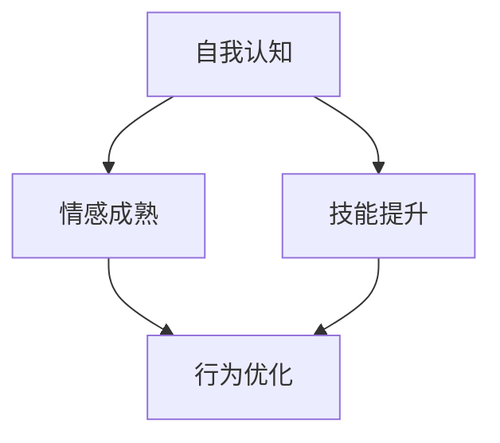

#### 1.2 自我成长的重要性

自我成长对个人和社会都有着深远的影响。对于个人而言，自我成长有助于提升自信心、增强适应能力和实现个人价值。同时，自我成长也是职业生涯成功的关键因素之一。对于社会而言，个体自我成长的实现有助于社会的进步和发展。

伪代码：

```python
def self_growth():
    # 提升自信心
    confidence += 1
    
    # 增强适应能力
    adaptability += 1
    
    # 实现个人价值
    personal_value += 1
    
    # 社会进步与发展
    societal_progress += 1
```

#### 1.3 自我成长的障碍与挑战

自我成长过程中，个体可能会面临各种障碍和挑战。这些障碍可能来自于外部环境，如社会压力、工作压力等，也可能来自于内部因素，如自我怀疑、恐惧失败等。要实现自我成长，首先需要认识到这些障碍并找到克服的方法。

Mermaid 流程图：

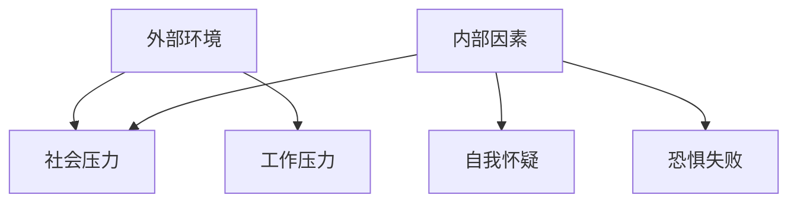

### 第2章：自我认知与探索

自我认知是自我成长的基础。它是了解自身特点、优势与劣势的过程，有助于个体明确自身的发展方向和目标。在这一章节中，我们将探讨自我认知的重要性、方法以及与自我成长的关系。

#### 2.1 自我认知的重要性

自我认知对于个人成长具有重要意义。它有助于个体明确自身的发展方向，设定合理的目标，同时也能够提高个体的自我调节能力和问题解决能力。

数学模型：

$$
自我认知度 = f(知识积累, 经验积累, 反思能力)
$$

其中，知识积累和经验积累是自我认知的基础，反思能力是自我认知的核心。

#### 2.2 自我探索的方法

自我探索是自我认知的重要手段。个体可以通过以下几种方法进行自我探索：

1. **自我反思**：定期对自己的行为、思想和情绪进行反思，了解自己的行为模式和心理特点。
2. **日记记录**：通过写日记来记录自己的日常行为和内心感受，有助于加深自我认知。
3. **心理咨询**：通过专业的心理咨询师进行深度交流，了解自己的内在需求和潜在问题。
4. **阅读学习**：通过阅读心理学、哲学等相关书籍，提升自己的理论知识和自我认知水平。

#### 2.3 自我认知与自我成长的联系

自我认知是自我成长的前提和基础。只有通过深入的自我认知，个体才能明确自己的发展方向和目标，从而更好地实现自我成长。同时，自我成长的过程也会进一步加深自我认知，形成良性循环。

Mermaid 流程图：

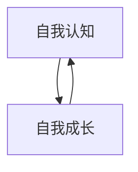

## 第二部分：实现个人价值

### 第3章：价值观与人生目标

实现个人价值首先需要明确个人的价值观和人生目标。价值观是指导个体行为的准则，而人生目标是实现个人价值的方向和动力。在这一章节中，我们将探讨价值观的建立、人生目标的设定以及价值观与人生目标的关系。

#### 3.1 价值观的建立

价值观的建立是个人成长的重要一环。它涉及到对自身、他人和社会的认知和评价。个体可以通过以下几种方式建立自己的价值观：

1. **自我反思**：通过反思自己的行为和经历，了解自己的价值观。
2. **学习借鉴**：通过阅读书籍、观看电影、与他人交流等方式，借鉴他人的价值观。
3. **实践检验**：通过实际行动检验自己的价值观，不断调整和优化。

伪代码：

```python
def establish_values():
    # 自我反思
    reflection += 1
    
    # 学习借鉴
    learning += 1
    
    # 实践检验
    practice += 1
    
    # 价值观建立
    values_established = reflection + learning + practice
```

#### 3.2 人生目标的设定

人生目标是实现个人价值的方向和动力。设定合理的人生目标需要考虑以下几个方面：

1. **个人兴趣**：根据个人的兴趣和爱好设定目标，使其具有持续性和动力。
2. **能力评估**：评估自己的能力和潜力，确保目标具有可实现性。
3. **外部环境**：考虑外部环境因素，如社会需求、行业趋势等，确保目标的现实性。
4. **长期规划**：将人生目标分解为短期、中期和长期目标，逐步实现。

Mermaid 流程图：

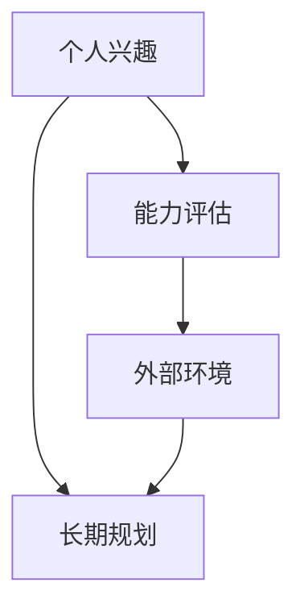

#### 3.3 价值观与人生目标的关系

价值观和人生目标之间存在密切的关系。价值观是人生目标的指导原则，而人生目标是价值观的具体体现。只有明确个人的价值观，才能设定合理的人生目标，从而实现个人价值。同时，人生目标的实现也会进一步丰富和优化个人的价值观。

Mermaid 流程图：

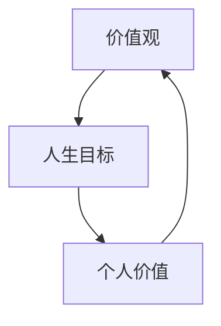

### 第4章：个人价值的实现

个人价值的实现是自我成长的重要目标。它涉及到个人在职业、社会和生活中所创造的价值和贡献。在这一章节中，我们将探讨个人价值的定义、实现途径以及实现过程中可能遇到的障碍和克服方法。

#### 4.1 个人价值的定义

个人价值是指个人在职业、社会和生活中所创造的价值和贡献。它不仅包括物质财富的创造，还涉及到精神层面的成就和社会地位的提升。个人价值的实现需要具备以下几个要素：

1. **专业知识**：掌握一定的专业知识和技能，能够在职业领域中发挥重要作用。
2. **创新能力**：具备创新思维和解决问题的能力，能够推动事业的发展和进步。
3. **人际关系**：建立良好的人际关系，有助于个人在社会中发挥更大的影响力。
4. **社会责任**：承担社会责任，积极参与社会公益活动，为社会做出贡献。

Mermaid 流程图：

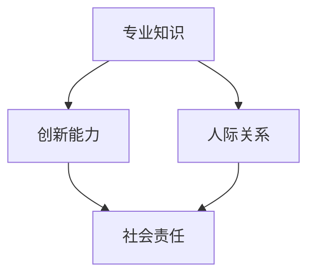

#### 4.2 实现个人价值的途径

实现个人价值可以通过以下几种途径：

1. **职业发展**：通过提升专业技能和创新能力，在职业领域中实现个人价值。
2. **创业创新**：通过创业实践，实现创新成果和商业价值。
3. **社会服务**：通过参与社会公益活动，提升个人社会价值和影响力。
4. **终身学习**：通过不断学习和自我提升，保持个人竞争力的领先地位。

Mermaid 流程图：

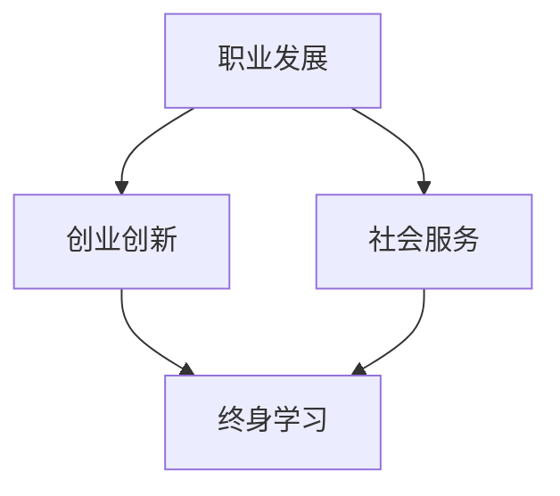

#### 4.3 个人价值实现的障碍与克服

在实现个人价值的过程中，个体可能会遇到各种障碍。这些障碍可能来自于外部环境，如竞争压力、社会偏见等，也可能来自于内部因素，如自我怀疑、拖延症等。要克服这些障碍，需要采取以下方法：

1. **明确目标**：设定清晰的目标，明确实现个人价值的方向和动力。
2. **持续学习**：通过不断学习和提升自身能力，克服技能和知识的不足。
3. **积极心态**：保持积极的心态，面对困难和挑战时不放弃，勇于尝试。
4. **寻求支持**：建立良好的人际关系，寻求他人的支持和帮助。

Mermaid 流程图：

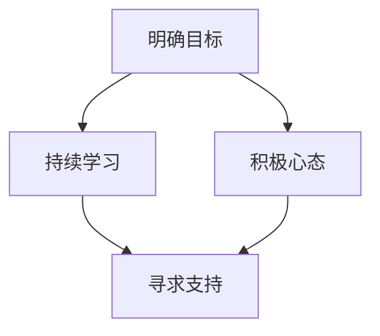

## 第三部分：自我实现

### 第5章：自我实现的定义与意义

自我实现是个人成长的高级阶段，它不仅涉及到个人价值的实现，更是一种对自身潜能的深度发掘和实现。在这一章节中，我们将探讨自我实现的定义、意义以及面临的障碍和挑战。

#### 5.1 自我实现的定义

自我实现是指个体在实现个人价值的过程中，达到自我潜能的最大发挥和自我价值的实现。它涉及到个体在职业、社会和个人层面上的全面发展，是一种对自身潜能的深度挖掘和实现。

数学模型：

$$
自我实现度 = f(个人价值实现度, 自我潜能挖掘度)
$$

其中，个人价值实现度和自我潜能挖掘度是自我实现的核心要素。

#### 5.2 自我实现的意义

自我实现对个人和社会都具有重要意义。对于个人而言，自我实现是实现人生价值的重要途径，它能够提升个体的幸福感、满足感和成就感。对于社会而言，自我实现的实现有助于社会的进步和发展，推动社会创新和进步。

伪代码：

```python
def self_realization():
    # 提升幸福感
    happiness += 1
    
    # 提升满足感
    satisfaction += 1
    
    # 提升成就感
    achievement += 1
    
    # 社会进步和发展
    societal_progress += 1
```

#### 5.3 自我实现的障碍与挑战

在追求自我实现的过程中，个体可能会面临各种障碍和挑战。这些障碍可能来自于外部环境，如社会压力、竞争压力等，也可能来自于内部因素，如自我怀疑、恐惧失败等。要实现自我实现，首先需要认识到这些障碍并找到克服的方法。

Mermaid 流程图：

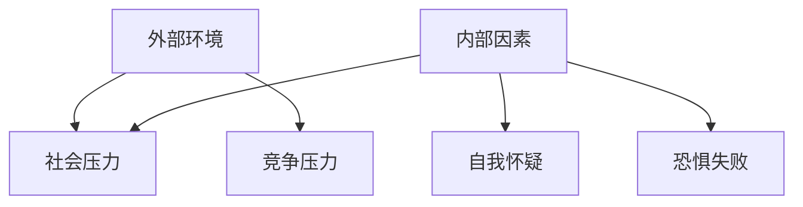

### 第6章：实现自我实现的方法

实现自我实现是一个复杂的过程，需要个体具备明确的目标、持续的努力和正确的方法。在这一章节中，我们将探讨实现自我实现的核心要素、步骤以及实践案例。

#### 6.1 自我实现的核心要素

实现自我实现的核心要素包括：

1. **目标明确**：设定明确的目标，明确自我实现的路径和方向。
2. **持续努力**：通过持续的努力和奋斗，不断接近自我实现的目标。
3. **自我认知**：深入了解自己的潜能和优势，找到适合自己的发展方向。
4. **心理调适**：保持积极的心态，面对困难和挑战时不放弃，勇于尝试。

Mermaid 流程图：

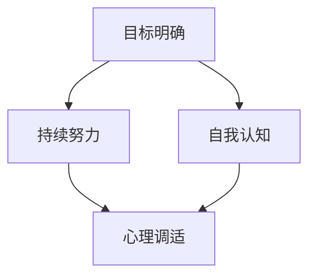

#### 6.2 实现自我实现的步骤

实现自我实现可以分为以下几个步骤：

1. **自我反思**：通过自我反思，了解自己的优势和不足，明确自我实现的目标。
2. **目标设定**：设定明确的目标，分解为短期、中期和长期目标，逐步实现。
3. **制定计划**：制定详细的行动计划，明确实现目标的步骤和方法。
4. **执行与调整**：按照计划执行，并根据实际情况进行及时调整。
5. **持续反思**：在实现过程中不断反思和总结，优化自我实现的方法。

Mermaid 流程图：

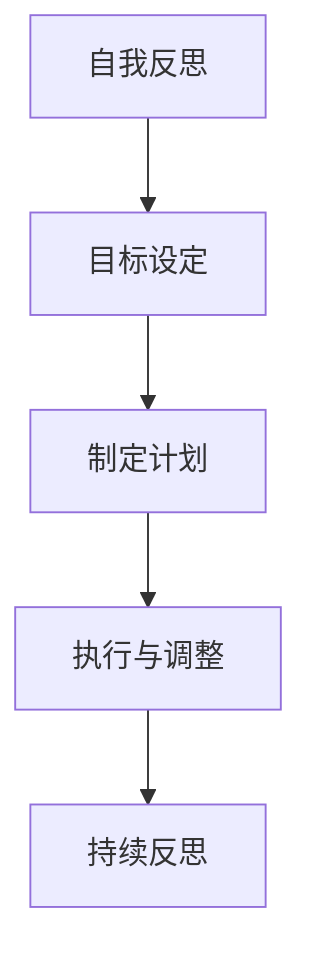

#### 6.3 自我实现的实践案例

以下是一个自我实现的实践案例：

**案例：** 小明是一名计算机程序员，他希望通过自己的努力实现自我价值。他首先进行了自我反思，发现自己在编程方面有一定的天赋和兴趣。于是，他设定了成为一名优秀的软件开发工程师的目标。为了实现这一目标，他制定了详细的计划：

1. **学习编程语言**：通过学习Python和Java等编程语言，提升自己的编程能力。
2. **参加项目实践**：参与开源项目和公司项目，积累实际工作经验。
3. **提升软技能**：学习沟通技巧、团队协作和项目管理等，提升自己的软技能。
4. **持续学习**：通过阅读技术书籍、参加在线课程和参加技术研讨会，保持对技术的热情和追求。

通过多年的努力，小明成功地实现了一名优秀的软件开发工程师的目标，他在职业生涯中取得了显著的成就，同时也实现了自我价值。

### 第7章：持续成长与自我实现

持续成长是实现自我实现的关键。只有通过不断学习和提升，个体才能在竞争激烈的社会中立于不败之地。在这一章节中，我们将探讨持续成长的重要性、方法以及与自我实现的关系。

#### 7.1 持续成长的重要性

持续成长对于个人的职业发展和自我实现具有重要意义。它不仅能够提升个人的竞争力，还能够拓宽个人的视野和认知水平。在快速变化的社会环境中，持续成长是适应变化、实现自我价值的必备条件。

伪代码：

```python
def continuous_growth():
    # 提升竞争力
    competitiveness += 1
    
    # 拓宽视野
    horizon += 1
    
    # 实现自我价值
    self_value += 1
```

#### 7.2 持续成长的方法

持续成长的方法包括以下几个方面：

1. **终身学习**：通过不断学习，提升自身的知识和技能水平。
2. **自我反思**：通过自我反思，了解自己的优势和不足，找到提升的方向。
3. **实践锻炼**：通过实际工作和项目实践，提升自己的能力和经验。
4. **社交交流**：通过与他人的交流，获取新的知识和观点，拓宽自己的视野。

Mermaid 流程图：

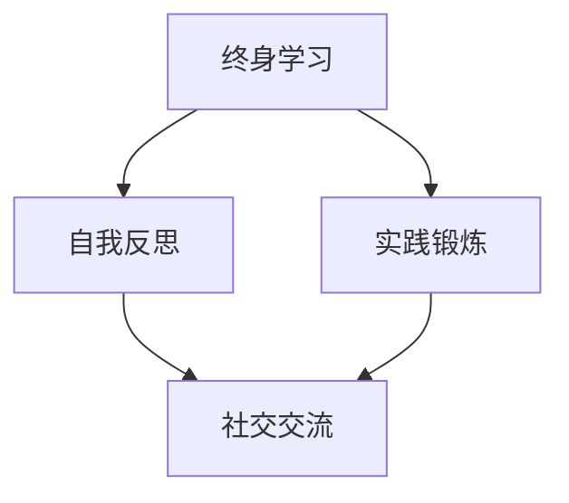

#### 7.3 自我实现与持续成长的关系

自我实现与持续成长密切相关。只有通过持续成长，个体才能实现自我价值，达到自我实现的目标。持续成长不仅能够提升个人的能力和竞争力，还能够为自我实现提供坚实的基础。同时，自我实现的实现也会进一步激发个体的持续成长动力。

Mermaid 流程图：

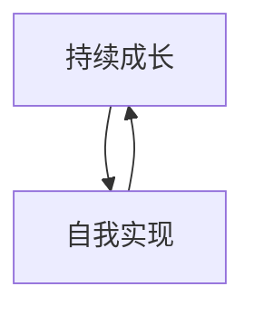

## 第四部分：附录

### 附录1：自我成长相关的心理学术语解释

在自我成长的过程中，了解一些心理学术语有助于个体更好地理解自我成长的过程。以下是几个常见的心理学术语及其解释：

1. **自我效能感**：指个体对自己完成特定任务的信心和能力。自我效能感高的人更有可能实现自我成长。
2. **自我概念**：指个体对自己的总体看法和评价。自我概念影响个体的行为和决策，对自我成长具有重要作用。
3. **自我调节**：指个体对自己情绪和行为的管理能力。自我调节能力强的人能够更好地应对挑战，实现自我成长。
4. **自我效能感**：指个体对自己完成特定任务的信心和能力。自我效能感高的人更有可能实现自我成长。

### 附录2：自我成长与心理健康的联系

自我成长与心理健康密切相关。自我成长的过程有助于提升个体的心理健康水平，同时，心理健康也是自我成长的重要保障。以下是一些具体的联系：

1. **自我效能感提升**：自我成长过程中，个体通过不断克服挑战，提升自我效能感，从而增强心理健康。
2. **自我概念优化**：自我成长有助于个体建立积极的自我概念，减少负面情绪和心理压力。
3. **自我调节能力**：自我成长过程中，个体学会自我调节，提高心理健康水平。
4. **情绪管理**：自我成长有助于个体学会有效管理情绪，减少焦虑和抑郁等心理问题。

### 附录3：推荐阅读书目与资源链接

为了更好地理解和实践自我成长，以下是一些建议的阅读书目和资源链接：

1. **《自控力》**：凯利·麦格尼格尔著，探讨如何通过自我控制实现自我成长。
2. **《斯坦福大学人生规划课》**：杰里·约瑟夫·布洛特纳著，提供人生规划的建议和技巧。
3. **《智慧书》**：查尔斯·达尔文著，探讨人类行为和心理的奥秘。
4. **在线课程**：如Coursera、edX等平台上的自我成长和心理课程。

## 结尾

### 第8章：结语

自我成长、个人价值的实现和自我实现是一个漫长而充满挑战的过程。通过本文的探讨，我们认识到自我成长的重要性、实现个人价值的途径、自我实现的定义与意义以及持续成长与自我实现的关系。在这一过程中，个体需要明确自己的目标，持续学习和反思，克服各种障碍，不断实现自我价值和自我实现。

### 8.1 自我成长对个人和社会的影响

自我成长对个人和社会都有着深远的影响。对于个人而言，自我成长有助于提升自信心、增强适应能力和实现个人价值。对于社会而言，个体自我成长的实现有助于社会的进步和发展，推动社会创新和进步。

### 8.2 鼓励与总结

自我成长是一个漫长而充满挑战的过程，需要个体的持续努力和坚持。在此，我们鼓励每个人勇敢面对挑战，不断追求自我成长，实现个人价值和自我实现。只有通过自我成长，个体才能在竞争激烈的社会中立于不败之地，为社会做出更大的贡献。

### 8.3 未来展望

随着人工智能和技术的不断发展，自我成长将变得更加重要。未来的社会将更加注重个体的自我实现和创新能力。因此，自我成长将成为每个人必须具备的能力。我们期待每个人都能在自我成长的道路上不断前行，实现自己的梦想和价值。

### 作者

**作者：AI天才研究院/AI Genius Institute & 禅与计算机程序设计艺术 /Zen And The Art of Computer Programming**

