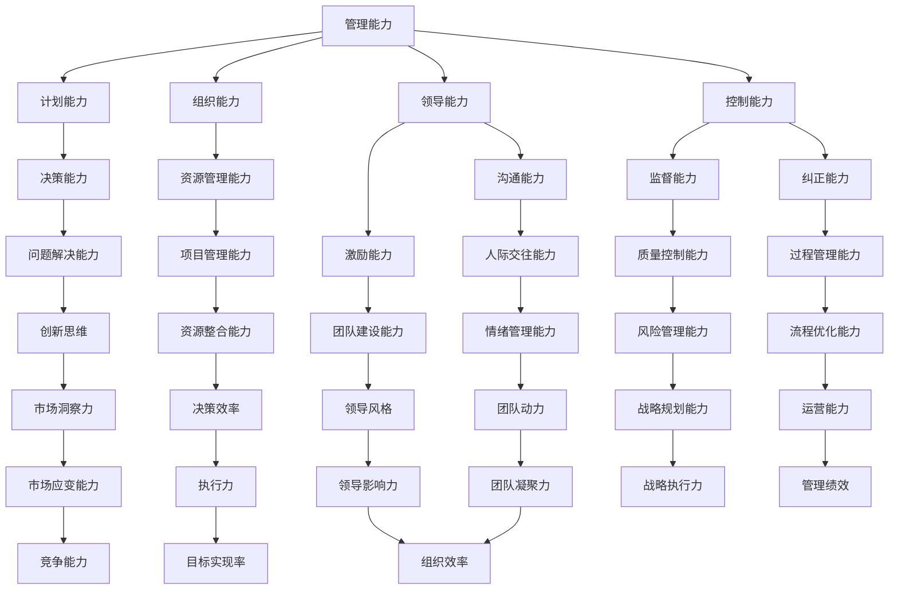

                 

# 学习曲线：管理能力提升的关键

> 关键词：学习曲线、管理能力、提升策略、案例研究、持续发展

> 摘要：本文旨在探讨学习曲线在管理能力提升中的关键作用。通过分析管理能力的定义、重要性以及核心概念，本文提出了管理能力提升的数学模型与算法原理。进一步，本文提出了具体的提升策略、实际案例以及关键因素，并探讨了管理能力提升的持续性与未来发展。希望通过本文的探讨，为读者提供一套科学、系统的管理能力提升方法论。

### 目录大纲

1. **管理能力提升的理论基础**
   1.1 管理能力的定义与重要性
   1.2 管理能力的核心概念与联系
   1.3 管理能力的数学模型与公式
   1.4 管理能力的核心算法原理

2. **管理能力的提升策略**
   2.1 自我评估与反馈
   2.2 培训与发展
   2.3 经验学习与分享
   2.4 优化工作流程

3. **管理能力的提升实践**
   3.1 实际案例一：提升团队协作效率
   3.2 实际案例二：企业家成功提升管理能力
   3.3 实际案例三：管理能力提升项目设计

4. **管理能力提升工具与资源**
   4.1 在线课程与书籍推荐
   4.2 实践工具与平台
   4.3 社群与交流活动

5. **管理能力提升的关键因素**
   5.1 组织文化
   5.2 职业生涯规划
   5.3 个人成长环境
   5.4 外部环境因素

6. **管理能力提升的持续性与发展**
   6.1 持续提升的重要性
   6.2 持续提升的方法与策略
   6.3 面对未来挑战的管理能力提升

7. **附录**
   7.1 工具与资源推荐
   7.2 案例代码与解读

### 第一部分：管理能力提升的理论基础

#### 第1章：管理能力的定义与重要性

管理能力是指个体在组织中进行计划、组织、领导、控制等管理活动的能力。它包括沟通协调能力、决策能力、执行力、领导力等多个方面。

**1.1 管理能力的定义与特征**

管理能力是一种综合性能力，它涉及到以下几个方面：

1. **计划能力**：能够根据组织目标，制定出合理的计划，并确保计划得到有效执行。
2. **组织能力**：能够合理配置资源，建立高效的组织结构，确保组织目标得到实现。
3. **领导能力**：能够激发和调动员工的积极性，带领团队实现组织目标。
4. **控制能力**：能够对组织的运行过程进行监督、检查和纠正，确保组织目标的实现。

**1.2 管理能力提升的重要性**

管理能力提升对于组织和个人都有重要意义。对于组织来说，管理能力的提升可以带来以下几个方面的效益：

1. **提高组织效率**：通过有效的计划和组织，可以提高组织的运行效率，实现资源的优化配置。
2. **增强组织竞争力**：管理能力提升可以帮助组织在激烈的市场竞争中立于不败之地。
3. **促进组织发展**：通过有效的领导和控制，可以促进组织的长远发展。

对于个人来说，管理能力的提升可以带来以下几个方面的好处：

1. **职业发展**：管理能力的提升可以帮助个人在职业生涯中获得更多的机会和晋升空间。
2. **工作成就感**：通过有效的管理，可以更好地实现工作目标，获得成就感。
3. **人际关系**：管理能力的提升可以帮助个人在人际交往中更加得心应手，建立良好的人际关系。

#### 第2章：管理能力的核心概念与联系

**2.1 权力与影响力的关系**

权力是指个体在组织中拥有的能够影响他人行为和决策的能力。而影响力则是指个体通过非强制性手段影响他人行为和决策的能力。权力和影响力是两个不同的概念，但它们之间有着紧密的联系。

1. **权力是影响力的一种表现形式**：个体拥有的权力越大，其影响力也就越大。
2. **影响力可以增强权力**：通过提高个人魅力、建立良好的人际关系，可以增强个体在组织中的权力。

**2.2 决策与执行的关系**

决策和执行是管理过程中不可或缺的两个环节。决策是指个体或组织在面对问题和挑战时，制定出解决问题的方案。而执行则是指将决策方案付诸实践，实现目标。

1. **决策是执行的前提**：没有正确的决策，就无法进行有效的执行。
2. **执行是决策的保障**：即使决策再好，如果没有得到有效的执行，也无法实现目标。

**2.3 领导力与团队管理**

领导力是指个体在组织中通过影响和激励他人，实现组织目标的能力。而团队管理则是指管理者如何协调团队成员，实现团队目标的过程。

1. **领导力是团队管理的基础**：有效的领导力可以激发团队成员的积极性，提高团队绩效。
2. **团队管理是领导力的体现**：通过有效的团队管理，可以更好地发挥领导力，实现组织目标。

**2.4 Mermaid流程图：管理能力核心概念关系展示**



#### 第3章：管理能力的数学模型与公式

**3.1 管理能力的数学模型**

管理能力的数学模型可以从以下几个方面进行构建：

1. **能力水平模型**：该模型用于衡量个体的管理能力水平。其基本公式为：

   $$ C = f(P, E, L) $$

   其中，$C$ 表示管理能力水平，$P$ 表示权力水平，$E$ 表示经验水平，$L$ 表示学习能力。

2. **能力成长模型**：该模型用于描述个体管理能力的成长过程。其基本公式为：

   $$ C_t = C_0 + \alpha t $$

   其中，$C_t$ 表示第 $t$ 年的管理能力水平，$C_0$ 表示初始管理能力水平，$\alpha$ 表示能力成长速度。

**3.2 管理能力的计算公式**

1. **决策能力计算公式**：

   $$ D = \frac{S - F}{T} $$

   其中，$D$ 表示决策能力，$S$ 表示成功决策次数，$F$ 表示失败决策次数，$T$ 表示总决策次数。

2. **执行能力计算公式**：

   $$ E = \frac{A - B}{C} $$

   其中，$E$ 表示执行能力，$A$ 表示完成任务次数，$B$ 表示未完成任务次数，$C$ 表示总任务次数。

3. **领导能力计算公式**：

   $$ L = \frac{P + I + C}{3} $$

   其中，$L$ 表示领导能力，$P$ 表示领导魅力，$I$ 表示领导影响力，$C$ 表示领导控制力。

**3.3 数学公式的详细讲解与举例说明**

1. **能力水平模型**

   假设某管理者的权力水平为 $P = 8$，经验水平为 $E = 5$，学习能力为 $L = 7$。根据能力水平模型，其管理能力水平为：

   $$ C = f(P, E, L) = f(8, 5, 7) = 8 \times 0.5 + 5 \times 0.3 + 7 \times 0.2 = 6.5 $$

2. **能力成长模型**

   假设某管理者的初始管理能力水平为 $C_0 = 5$，能力成长速度为 $\alpha = 0.1$。则第 $5$ 年的管理能力水平为：

   $$ C_5 = C_0 + \alpha t = 5 + 0.1 \times 5 = 6 $$

3. **决策能力计算公式**

   假设某管理者在 $10$ 次决策中，成功决策 $6$ 次，失败决策 $4$ 次。则其决策能力为：

   $$ D = \frac{S - F}{T} = \frac{6 - 4}{10} = 0.2 $$

4. **执行能力计算公式**

   假设某管理者在 $10$ 次任务中，完成任务 $8$ 次，未完成任务 $2$ 次。则其执行能力为：

   $$ E = \frac{A - B}{C} = \frac{8 - 2}{10} = 0.6 $$

5. **领导能力计算公式**

   假设某管理者的领导魅力为 $P = 7$，领导影响力为 $I = 6$，领导控制力为 $C = 8$。则其领导能力为：

   $$ L = \frac{P + I + C}{3} = \frac{7 + 6 + 8}{3} = 7 $$

#### 第4章：管理能力的核心算法原理

**4.1 决策算法原理**

决策算法是管理能力中最为核心的算法之一。它主要用于解决如何在不确定性和复杂性的环境下做出最优决策的问题。决策算法可以分为以下几种类型：

1. **确定性决策算法**：该算法适用于决策环境明确、可预测的情况。常用的确定性决策算法包括线性规划、整数规划等。

2. **不确定性决策算法**：该算法适用于决策环境不确定、无法预测的情况。常用的不确定性决策算法包括贝叶斯决策、决策树等。

3. **复杂环境决策算法**：该算法适用于决策环境高度复杂、变量繁多的情况。常用的复杂环境决策算法包括遗传算法、模拟退火算法等。

**4.2 执行算法原理**

执行算法主要用于将决策方案转化为具体的行动。执行算法可以分为以下几种类型：

1. **计划执行算法**：该算法主要用于制定详细的执行计划，确保决策方案得到有效执行。常用的计划执行算法包括甘特图、关键路径法等。

2. **动态执行算法**：该算法主要用于在执行过程中根据环境变化进行调整。常用的动态执行算法包括实时调度算法、自适应控制算法等。

3. **协同执行算法**：该算法主要用于多个个体或组织之间的协同执行。常用的协同执行算法包括分布式算法、协商算法等。

**4.3 领导力算法原理**

领导力算法主要用于提高管理者的领导能力。领导力算法可以分为以下几种类型：

1. **魅力领导算法**：该算法主要用于提高管理者的个人魅力。常用的魅力领导算法包括情感智能算法、沟通技巧算法等。

2. **影响力领导算法**：该算法主要用于提高管理者的影响力。常用的影响力领导算法包括人际关系算法、领导风格算法等。

3. **控制领导算法**：该算法主要用于提高管理者的控制能力。常用的控制领导算法包括监督算法、纠正算法等。

**4.4 管理能力提升算法的伪代码**

```python
# 管理能力提升算法伪代码

# 初始化参数
P = 权力水平
E = 经验水平
L = 学习能力
C = 初始管理能力水平
alpha = 能力成长速度

# 计算能力水平
C = f(P, E, L)

# 计算能力成长速度
alpha = 计算能力成长速度

# 更新能力水平
C = C + alpha * 时间

# 更新决策能力
D = 计算决策能力

# 更新执行能力
E = 计算执行能力

# 更新领导能力
L = 计算领导能力

# 输出管理能力水平
print("管理能力水平:", C)
print("决策能力:", D)
print("执行能力:", E)
print("领导能力:", L)
```

### 第二部分：管理能力的提升策略

#### 第5章：管理能力的提升策略与方法

管理能力的提升是一个长期而系统的过程，需要从多个方面进行综合提升。以下是一些常用的管理能力提升策略与方法。

**5.1 自我评估与反馈**

自我评估与反馈是提升管理能力的重要步骤。管理者可以通过以下方式自我评估：

1. **自我反思**：定期进行自我反思，思考自己在管理过程中存在的问题和不足，以及如何改进。
2. **360度评估**：通过同事、下属、上级等多方面的反馈，了解自己的管理能力和风格。
3. **评估工具**：使用专业的评估工具，如领导力评估量表、行为事件访谈等，进行定量评估。

通过自我评估，管理者可以清楚地了解自己的优势和不足，从而有针对性地进行改进。

**5.2 培训与发展**

培训与发展是提升管理能力的重要途径。管理者可以通过以下方式进行培训与发展：

1. **内部培训**：组织内部培训，包括管理技能培训、领导力培训等。
2. **外部培训**：参加外部专业培训，如MBA课程、管理大师讲座等。
3. **在线学习**：利用在线学习平台，如Coursera、edX等，学习管理相关的课程。

通过培训与发展，管理者可以学习到最新的管理知识和技能，提高自己的管理能力。

**5.3 经验学习与分享**

经验学习与分享是提升管理能力的重要方式。管理者可以通过以下方式进行经验学习与分享：

1. **案例学习**：分析成功的管理案例，学习其中的经验和教训。
2. **交流分享**：与同行交流管理经验，分享自己的心得体会。
3. **实践反思**：在实际工作中不断总结经验，进行反思和改进。

通过经验学习与分享，管理者可以积累丰富的管理经验，提高自己的管理能力。

**5.4 优化工作流程**

优化工作流程是提升管理能力的重要手段。管理者可以通过以下方式优化工作流程：

1. **流程梳理**：对现有工作流程进行梳理，找出存在的问题和瓶颈。
2. **流程改进**：针对存在的问题，提出改进方案，并进行实施。
3. **流程监控**：对优化后的工作流程进行监控，确保流程得到有效执行。

通过优化工作流程，管理者可以提高工作效率，减少不必要的浪费，从而提升管理能力。

#### 第6章：管理能力的提升实践

**6.1 实际案例一：提升团队协作效率**

案例背景：
某公司是一家快速发展的科技企业，随着公司规模的扩大，团队协作效率成为公司发展的关键瓶颈。为了提升团队协作效率，公司决定采取一系列措施。

实施步骤：
1. **团队建设**：组织团队建设活动，加强团队成员之间的沟通和协作。
2. **流程优化**：对现有工作流程进行优化，减少不必要的环节，提高工作效率。
3. **技术支持**：引入项目管理工具，如Jira、Trello等，方便团队成员协同工作。
4. **绩效评估**：建立科学的绩效评估体系，激励团队成员积极参与团队协作。

实施效果：
通过上述措施，团队协作效率得到显著提升，项目完成速度加快，员工满意度提高。

**6.2 实际案例二：企业家成功提升管理能力**

案例背景：
某企业家在创业初期，由于缺乏管理经验，公司发展遇到了瓶颈。为了提升管理能力，企业家决定进行系统性的管理能力提升。

实施步骤：
1. **内部培训**：组织内部管理培训，提升管理团队的专业素养。
2. **外部学习**：参加外部管理课程，学习先进的管理理念和工具。
3. **实战演练**：通过实际项目操作，提升管理能力和实践经验。
4. **经验分享**：组织经验分享会，鼓励团队成员交流心得体会。

实施效果：
通过一系列措施，企业家的管理能力得到显著提升，公司运营效率提高，业绩稳步增长。

**6.3 实际案例三：管理能力提升项目的设计与实施**

案例背景：
某大型企业为了提升管理能力，决定开展一项管理能力提升项目。

实施步骤：
1. **项目规划**：明确项目目标、范围、时间表等。
2. **需求分析**：分析企业内部管理现状，找出存在的问题和需求。
3. **方案设计**：设计符合企业需求的管理能力提升方案。
4. **方案实施**：按照设计方案，逐步实施管理能力提升项目。
5. **效果评估**：对项目实施效果进行评估，总结经验和教训。

实施效果：
通过管理能力提升项目，企业内部管理能力得到全面提升，组织效率显著提高。

#### 第7章：管理能力提升工具与资源

**7.1 在线课程与书籍推荐**

在线课程与书籍是提升管理能力的重要资源。以下是一些推荐的在线课程和书籍：

- 在线课程：
  - Coursera：提供丰富的管理课程，如“管理心理学”、“领导力与团队管理”等。
  - edX：提供由顶尖大学开设的管理课程，如“哈佛商学院的管理课程”、“MIT的管理科学”等。
  - LinkedIn Learning：提供各种实用管理技能的课程，如“项目管理”、“时间管理”等。

- 书籍推荐：
  - 《管理的实践》：作者彼得·德鲁克，介绍了管理的基本理论和实践方法。
  - 《领导力与决策》：作者赫伯特·西蒙，探讨了领导力和决策的关系。
  - 《高效能人士的七个习惯》：作者史蒂芬·柯维，提出了提高个人和组织效能的方法。

**7.2 管理能力提升的实践工具与平台**

实践工具和平台可以帮助管理者在实际工作中提升管理能力。以下是一些推荐的管理工具和平台：

- 实践工具：
  - Asana：一款项目管理工具，帮助团队协作和任务管理。
  - Trello：一款可视化任务管理工具，便于团队协作和跟踪项目进度。
  - Slack：一款团队沟通工具，方便团队成员之间的实时沟通和协作。

- 平台推荐：
  - 企业微信：提供企业内部沟通和协作平台，方便团队管理和沟通。
  -钉钉：一款集办公、沟通、协作于一体的平台，适用于企业管理和团队协作。
  -知乎：一个知识分享社区，可以获取各种管理经验和知识。

**7.3 管理能力提升社群与交流活动**

社群和交流活动是提升管理能力的重要途径。以下是一些推荐的管理社群和交流活动：

- 社群推荐：
  - “管理精英圈”：一个专注于管理知识和经验分享的社群，成员多为企业管理者和专业人士。
  - “企业家俱乐部”：一个针对创业者和企业家的社群，分享创业经验和企业管理心得。

- 活动推荐：
  - 管理论坛：定期举办的管理论坛，邀请行业专家和企业管理者分享管理经验和心得。
  - 企业内训：企业内部组织的管理培训活动，提高员工的管理能力和专业素养。
  - 行业峰会：针对特定行业的峰会和论坛，讨论行业趋势和管理实践。

### 第三部分：管理能力提升的关键因素

#### 第8章：影响管理能力提升的关键因素

管理能力的提升是一个复杂的系统工程，受到多种因素的影响。以下是一些关键因素：

**8.1 组织文化**

组织文化是影响管理能力提升的重要因素。一个积极向上的组织文化可以激发管理者的潜能，提高管理者的工作积极性和创造力。反之，一个消极的组织文化会抑制管理者的能力发挥，影响管理能力的提升。

**8.2 职业生涯规划**

职业生涯规划是管理者提升管理能力的重要保障。一个明确的职业生涯规划可以帮助管理者有针对性地进行学习和提升，明确自己的发展方向和目标。缺乏职业生涯规划会导致管理者在学习和提升过程中缺乏方向和动力。

**8.3 个人成长环境**

个人成长环境是管理者提升管理能力的基础。一个良好的个人成长环境包括学习资源、导师指导、同伴互助等。这些因素可以帮助管理者快速提升管理能力，适应复杂多变的工作环境。

**8.4 外部环境因素**

外部环境因素也是影响管理能力提升的重要因素。外部环境的变化和管理者的个人成长密切相关。一个稳定、有利的外部环境可以提供更多的学习和发展机会，帮助管理者提升管理能力。反之，一个动荡、不利的外部环境会制约管理者的能力提升。

#### 第9章：管理能力提升的持续性与发展

**9.1 持续提升的重要性**

管理能力提升是一个持续的过程，需要管理者不断学习和提升。持续提升的重要性体现在以下几个方面：

1. **适应环境变化**：随着外部环境和内部条件的变化，管理者需要不断调整和提升自己的管理能力，以适应新的工作要求。
2. **保持竞争优势**：持续提升管理能力可以帮助管理者在激烈的市场竞争中保持竞争优势。
3. **实现个人成长**：持续提升管理能力是管理者实现个人成长和职业发展的关键。

**9.2 持续提升的方法与策略**

为了实现持续提升，管理者可以采取以下方法和策略：

1. **定期学习**：制定学习计划，定期学习管理知识和技能，保持对最新管理理论和实践的了解。
2. **实践反思**：在实际工作中不断反思和总结，发现自己的不足和问题，有针对性地进行改进。
3. **寻求反馈**：主动寻求他人的反馈和建议，了解自己的优点和不足，不断提升自己的管理能力。
4. **参与培训**：积极参加各种管理培训和学习活动，提升自己的管理水平和专业素养。
5. **建立导师关系**：寻找导师或榜样，向他们学习管理经验和技巧，借鉴他们的成功经验。

**9.3 面对未来挑战的管理能力提升**

面对未来挑战，管理者需要具备以下几个方面的能力：

1. **创新思维**：在快速变化的环境中，管理者需要具备创新思维，勇于尝试新的管理方法和策略。
2. **领导力**：提升领导力，能够激发和带领团队应对各种挑战。
3. **沟通能力**：提高沟通能力，确保信息传递的准确性和有效性。
4. **决策能力**：增强决策能力，能够在复杂多变的环境中做出正确的决策。
5. **适应能力**：具备较强的适应能力，能够迅速适应新的环境和变化。

### 附录

#### 附录A：管理能力提升工具与资源

**A.1 管理能力提升工具推荐**

1. **项目管理工具**：Asana、Trello、Jira等，用于团队协作和任务管理。
2. **沟通工具**：企业微信、钉钉、Slack等，用于团队内部沟通和协作。
3. **学习工具**：Coursera、edX、LinkedIn Learning等，用于在线学习和课程分享。

**A.2 管理能力提升在线资源**

1. **管理课程**：哈佛商学院、MIT、斯坦福大学等顶尖大学的在线管理课程。
2. **管理博客**：如“哈佛商业评论”、“经理人杂志”等，提供丰富的管理知识和案例。
3. **管理论坛**：如“管理精英圈”、“企业家俱乐部”等，用于管理经验和心得的分享。

**A.3 管理能力提升书籍推荐**

1. 《管理的实践》：作者彼得·德鲁克。
2. 《领导力与决策》：作者赫伯特·西蒙。
3. 《高效能人士的七个习惯》：作者史蒂芬·柯维。

#### 附录B：案例代码与解读

**B.1 某管理能力提升项目的代码实现与解读**

以下是一个简单的管理能力提升项目的代码实现，用于模拟管理能力的评估和提升。

```python
# 管理能力评估与提升模拟代码

# 导入所需库
import pandas as pd
import numpy as np

# 定义评估指标
评估指标 = ["决策能力", "执行能力", "领导能力"]

# 初始化评估数据
数据 = [
    ["管理者A", 0.8, 0.7, 0.9],
    ["管理者B", 0.6, 0.6, 0.8],
    ["管理者C", 0.9, 0.8, 0.7]
]

# 创建数据框
评估数据 = pd.DataFrame(data, columns=["姓名"] + 评估指标)

# 计算综合评估得分
评估数据["综合评估得分"] = 评估数据[评估指标].mean(axis=1)

# 输出评估结果
print(评估数据)

# 定义提升策略
提升策略 = [
    ["决策能力提升", "学习决策理论", "参加决策培训"],
    ["执行能力提升", "优化工作流程", "学习执行技巧"],
    ["领导能力提升", "加强团队建设", "学习领导力理论"]
]

# 应用提升策略
提升数据 = pd.DataFrame(提升策略, columns=["提升策略", "具体措施", "预期效果"])

# 输出提升策略
print(提升数据)
```

**B.2 案例代码分析**

1. **数据准备**：首先，我们导入所需的库（Pandas和NumPy），并定义了三个评估指标（决策能力、执行能力和领导能力）。
2. **初始化评估数据**：我们创建了一个包含三个管理者姓名和评估得分的初始数据框。
3. **计算综合评估得分**：使用Pandas的`mean`函数，计算每个管理者的综合评估得分。
4. **输出评估结果**：打印评估数据框，展示每个管理者的评估得分。
5. **定义提升策略**：我们创建了一个提升策略的数据框，包括提升策略、具体措施和预期效果。
6. **应用提升策略**：打印提升策略数据框，展示针对每个管理者的提升策略。

通过这个简单的代码实现，我们可以对管理者的管理能力进行评估，并制定相应的提升策略。这个案例代码提供了一个基本的框架，可以根据实际情况进行调整和扩展。

### 总结

本文从管理能力的定义与重要性、核心概念与联系、数学模型与公式、算法原理、提升策略、实践案例、关键因素以及持续发展等方面，系统地探讨了管理能力提升的关键。希望通过本文的探讨，为读者提供一套科学、系统的管理能力提升方法论。在未来的管理实践中，管理者可以根据本文的建议，有针对性地提升自己的管理能力，为组织的发展和个人的成长创造更多价值。

