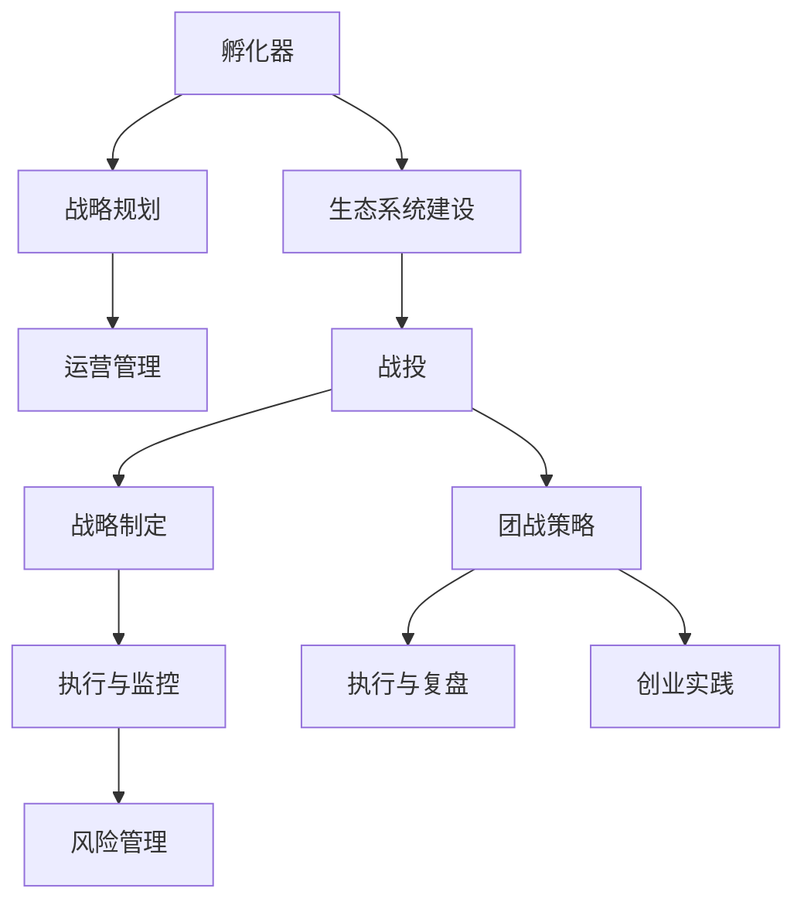

                 

# 文章标题：孵化器战投领航，大模型创业团战打法

> 关键词：孵化器、战投、大模型、创业、团战、战略规划、运营管理、生态系统建设、风险管理

> 摘要：本文以孵化器和战投为大背景，深入探讨了如何运用大模型进行创业团战。通过分析孵化器的战略规划、运营管理、生态系统建设，以及战投的策略制定、执行与监控，本文提出了一种基于大模型的创业团战打法。文章结合实际案例，详细阐述了相关核心概念、算法原理、数学模型和项目实战，为创业者提供了宝贵的参考和指导。

## 《孵化器战投领航，大模型创业团战打法》目录大纲

### 第一部分：引言

1.1 书籍背景与目的
1.2 孵化器与战投概述
1.3 大模型在孵化器与战投中的应用前景

### 第二部分：孵化器战略与运营

2.1 孵化器战略规划
2.2 孵化器运营管理
2.3 孵化器生态系统建设

### 第三部分：战投策略与执行

3.1 战投概述
3.2 战投策略制定
3.3 战投执行与监控
3.4 战投风险管理

### 第四部分：大模型创业团战打法

4.1 大模型创业概述
4.2 大模型创业团战策略
4.3 大模型创业团战执行
4.4 大模型创业团战复盘

### 第五部分：案例研究与实践

5.1 案例研究一：XX孵化器的发展历程
5.2 案例研究二：YY战投项目的成功经验
5.3 案例研究三：ZZ大模型创业团战的实践

### 第六部分：总结与展望

6.1 书籍总结
6.2 展望未来

### 第七部分：附录

7.1 相关术语与概念解释

---

### 第一部分：引言

#### 1.1 书籍背景与目的

在当今快速发展的科技时代，孵化器和战投成为了推动创新创业的重要力量。孵化器为企业提供从初创到上市的一站式服务，而战投则通过战略投资，助力企业快速发展。本文旨在探讨如何将大模型技术应用于孵化器和战投领域，从而提升创业团战的效率和成功率。

本文的目标是：

1. 分析孵化器和战投的基本概念、作用和现状。
2. 深入探讨大模型在孵化器和战投中的应用前景。
3. 提出基于大模型的创业团战打法，为创业者提供实际指导。
4. 通过案例分析，总结成功经验和教训。

本文面向的读者群体包括：

1. 创业者：通过了解孵化器和战投的运作模式，以及大模型在其中的应用，提升创业成功率。
2. 投资者：了解如何利用大模型进行精准投资，提升投资回报率。
3. 孵化器和战投从业者：掌握最新的创业团战打法，优化运营管理。

#### 1.2 孵化器与战投概述

孵化器是一种为初创企业提供支持的平台，旨在帮助企业从概念阶段到商业化阶段的全过程。孵化器通常提供办公空间、资金、技术支持、市场推广、法律咨询等服务，帮助企业快速成长。

战投（战略投资）是指企业为了实现长期战略目标，通过投资其他企业或项目，从而获得战略优势、市场份额或技术优势等。战投通常分为财务性投资和战略性投资，前者以获取投资回报为主要目的，后者则注重长期战略布局。

大模型在孵化器和战投中的应用前景：

1. **智能数据分析**：大模型能够处理海量数据，挖掘有价值的信息，为孵化器提供精准的市场分析、风险评估等。
2. **个性化推荐**：通过分析创业者的特点和需求，大模型可以为孵化器提供个性化服务，提高服务质量和用户体验。
3. **自动化运营**：大模型可以自动化执行一些常规任务，如客户管理、邮件营销等，降低运营成本。
4. **战略决策**：大模型可以为企业提供战略建议，如投资方向、产品定位等，帮助企业制定科学的发展策略。

#### 1.3 大模型在孵化器与战投中的应用前景

大模型在孵化器和战投中的应用前景广阔，具体体现在以下几个方面：

1. **数据分析**：大模型可以处理海量数据，挖掘有价值的信息，为孵化器提供精准的市场分析、风险评估等。例如，通过分析创业项目的市场趋势、竞争态势、用户需求等，帮助孵化器做出更科学的投资决策。
2. **个性化服务**：大模型可以根据创业者的特点和需求，提供个性化服务，提高服务质量和用户体验。例如，通过分析创业者的背景、能力、需求等，为大模型提供精准的投资建议、培训课程、市场推广方案等。
3. **自动化运营**：大模型可以自动化执行一些常规任务，如客户管理、邮件营销等，降低运营成本。例如，通过使用自然语言处理技术，实现自动化的客户沟通、咨询解答等。
4. **战略决策**：大模型可以为企业提供战略建议，如投资方向、产品定位等，帮助企业制定科学的发展策略。例如，通过分析市场趋势、技术发展、竞争对手等，为大模型提供战略规划、业务拓展等建议。

### 第二部分：孵化器战略与运营

#### 2.1 孵化器战略规划

孵化器战略规划是孵化器运营的核心，关系到孵化器的长期发展。以下是孵化器战略规划的核心要素：

1. **愿景和使命**：明确孵化器的长远目标和价值观，为孵化器的运营提供指导。
2. **市场定位**：分析市场需求，确定孵化器服务的重点领域和目标客户。
3. **资源整合**：梳理孵化器可利用的资源，如资金、技术、人才等，为孵化器的发展提供支持。
4. **业务模式**：明确孵化器的盈利模式，确保孵化器的可持续发展。
5. **风险控制**：制定风险控制措施，降低孵化器运营过程中的风险。

孵化器战略规划的制定与执行过程如下：

1. **市场调研**：通过市场调研，了解市场需求、竞争对手、行业趋势等，为战略规划提供数据支持。
2. **内部讨论**：组织内部讨论，确定孵化器的愿景、使命、市场定位等。
3. **战略制定**：根据市场调研和内部讨论结果，制定具体的战略规划。
4. **战略执行**：将战略规划分解为具体行动，制定执行计划，并组织执行。
5. **监控与调整**：定期监控战略执行情况，根据实际效果进行调整。

#### 案例分析：成功孵化器的战略规划

以XX孵化器为例，其战略规划的成功经验如下：

1. **明确愿景和使命**：XX孵化器的愿景是成为全球领先的科技孵化器，使命是帮助创业者实现创新梦想。
2. **精准市场定位**：XX孵化器专注于人工智能、物联网等前沿科技领域，针对有潜力的初创企业提供支持。
3. **资源整合**：XX孵化器通过与知名高校、研究机构、投资机构等建立合作关系，整合优质资源，为创业者提供全方位支持。
4. **业务模式**：XX孵化器通过提供办公空间、资金支持、技术指导、市场推广等服务，实现盈利。
5. **风险控制**：XX孵化器制定了严格的风险控制措施，如投资前的尽职调查、定期评估等，确保投资安全。

#### 2.2 孵化器运营管理

孵化器运营管理是确保孵化器战略规划得以有效实施的关键。以下是孵化器运营管理的核心流程和关键挑战：

1. **项目筛选**：通过筛选机制，选择有潜力的初创企业进入孵化器。关键挑战包括如何准确评估项目的潜力、如何平衡投资风险等。
2. **企业辅导**：为初创企业提供全方位的辅导服务，包括技术指导、市场推广、团队建设等。关键挑战包括如何确保辅导质量、如何解决企业面临的具体问题等。
3. **资源分配**：合理分配孵化器的资源，如资金、办公空间、技术支持等，确保企业能够充分利用资源。关键挑战包括如何平衡资源分配、如何避免资源浪费等。
4. **项目评估**：定期对孵化器内的项目进行评估，了解项目进展情况，为后续决策提供依据。关键挑战包括如何科学评估项目、如何确保评估的公平性等。
5. **风险控制**：制定风险控制措施，降低孵化器运营过程中的风险。关键挑战包括如何识别风险、如何制定有效的风险控制策略等。

#### 案例分析：高效运营的孵化器实践

以YY孵化器为例，其高效运营的实践如下：

1. **项目筛选**：YY孵化器采用多层次的筛选机制，包括线上申请、初步审核、现场答辩等，确保筛选出有潜力的初创企业。
2. **企业辅导**：YY孵化器成立了专业的辅导团队，包括技术专家、市场专家、财务专家等，为初创企业提供全方位的辅导服务。此外，YY孵化器还邀请行业专家进行讲座和培训，提高企业的整体素质。
3. **资源分配**：YY孵化器采用灵活的资源分配机制，根据企业的需求和进展情况进行调整。例如，对于进展较快的项目，YY孵化器会提供更多的资金支持和办公空间。
4. **项目评估**：YY孵化器采用定期评估机制，每季度对项目进行评估，了解项目进展情况，为后续决策提供依据。评估内容包括项目进度、市场表现、团队建设等。
5. **风险控制**：YY孵化器制定了严格的风险控制措施，包括投资前的尽职调查、定期风险评估等。此外，YY孵化器还建立了风险预警机制，及时发现并解决潜在风险。

#### 2.3 孵化器生态系统建设

孵化器生态系统建设是提升孵化器整体竞争力的关键。以下是孵化器生态系统建设的核心构成和策略：

1. **创业企业**：孵化器内的初创企业是生态系统的核心，其发展状况直接关系到孵化器的成功与否。
2. **投资机构**：投资机构为孵化器提供资金支持，帮助企业快速发展。
3. **技术支持**：技术支持包括硬件设施、软件工具、技术培训等，为初创企业提供技术保障。
4. **咨询服务**：咨询服务包括法律、财务、市场营销等，为初创企业提供全方位的支持。
5. **产业链合作伙伴**：产业链合作伙伴包括原材料供应商、制造企业、分销商等，为初创企业提供供应链支持。

构建孵化器生态系统的策略：

1. **政策支持**：制定相关政策，鼓励创业企业、投资机构、技术支持、咨询服务等入驻孵化器，形成良好的生态系统。
2. **资源共享**：通过建立共享平台，实现孵化器内外部资源的共享，降低企业的运营成本，提高整体竞争力。
3. **合作共赢**：鼓励各方合作，实现互利共赢。例如，投资机构可以通过孵化器了解优质项目，技术支持可以为企业提供技术解决方案等。
4. **人才培养**：通过培训、讲座、实训等手段，提升企业员工的技能和素质，为孵化器的发展提供人才支持。

#### 案例分析：构建孵化器生态系统的成功案例

以ZZ孵化器为例，其构建孵化器生态系统的成功经验如下：

1. **政策支持**：ZZ孵化器所在地方政府制定了相关政策，包括税收优惠、创业补贴等，吸引创业企业、投资机构、技术支持、咨询服务等入驻。
2. **资源共享**：ZZ孵化器建立了共享平台，包括办公空间、实验室、会议室等，实现资源共享，降低企业的运营成本。
3. **合作共赢**：ZZ孵化器与地方政府、高校、科研机构、投资机构等建立了紧密的合作关系，共同推动孵化器的发展。例如，高校和科研机构可以为企业提供技术支持和人才支持，地方政府可以为企业提供政策支持和资金支持等。
4. **人才培养**：ZZ孵化器定期举办培训、讲座、实训等活动，提升企业员工的技能和素质，为孵化器的发展提供人才支持。

### 第三部分：战投策略与执行

#### 3.1 战投概述

战投（战略投资）是企业为了实现长期战略目标，通过投资其他企业或项目，从而获得战略优势、市场份额或技术优势等。战投通常分为财务性投资和战略性投资，前者以获取投资回报为主要目的，后者则注重长期战略布局。

战投的价值与风险：

1. **价值**：战投可以通过以下途径为企业创造价值：
   - 获取战略资源：通过投资获得技术、品牌、渠道等资源，提升企业竞争力。
   - 市场扩张：通过投资扩大市场份额，实现业务增长。
   - 产业链整合：通过投资整合产业链上下游企业，优化产业链结构。
   - 投资回报：通过投资获取投资回报，实现财务收益。

2. **风险**：战投也面临着一定的风险，包括：
   - 投资决策风险：投资决策失误可能导致投资损失。
   - 市场风险：市场变化可能导致投资收益下降。
   - 管理风险：投资后的管理不善可能导致投资失败。
   - 法律风险：投资过程中的法律风险可能导致投资纠纷。

战投在企业战略中的定位：

1. **战略支持**：战投是企业战略的重要组成部分，通过投资获取战略资源，支持企业的长期发展。
2. **业务拓展**：战投可以帮助企业拓展新业务领域，实现多元化发展。
3. **产业链整合**：战投可以整合产业链上下游企业，优化产业链结构，提升企业整体竞争力。
4. **投资收益**：战投也是企业获取投资回报的重要途径，实现财务收益。

#### 3.2 战投策略制定

战投策略制定是战投成功的关键。以下是战投策略制定的核心要素：

1. **投资方向**：明确投资方向，确定投资的重点领域和目标企业。
2. **投资规模**：根据企业战略和发展需求，确定投资的规模和比例。
3. **投资方式**：选择合适的投资方式，如股权投资、债权投资等。
4. **投资评估**：对潜在投资项目进行详细评估，确保投资的安全性和回报率。
5. **风险管理**：制定风险控制措施，降低投资风险。

战投策略的制定过程：

1. **市场调研**：通过市场调研，了解行业趋势、竞争对手、投资机会等，为投资方向和规模提供依据。
2. **内部讨论**：组织内部讨论，确定投资方向、规模、方式等。
3. **投资评估**：对潜在投资项目进行详细评估，包括财务评估、市场评估、风险评估等。
4. **投资决策**：根据投资评估结果，确定最终的投资项目。
5. **投资执行**：制定投资执行计划，组织执行。

#### 案例分析：成功的战投策略制定

以AA企业为例，其成功的战投策略制定如下：

1. **投资方向**：AA企业明确投资方向为高科技领域，重点关注人工智能、大数据等前沿技术。
2. **投资规模**：根据企业战略和发展需求，确定投资规模为每年不少于10亿元。
3. **投资方式**：选择股权投资为主，适当进行债权投资，以实现长期战略布局。
4. **投资评估**：对潜在投资项目进行详细评估，包括财务评估、市场评估、风险评估等，确保投资的安全性和回报率。
5. **风险管理**：制定风险控制措施，如投资前的尽职调查、投资后的风险管理等，降低投资风险。

#### 3.3 战投执行与监控

战投执行与监控是确保投资目标实现的关键。以下是战投执行与监控的核心流程和关键节点：

1. **投资决策**：确定最终的投资项目，制定投资方案。
2. **投资谈判**：与目标企业进行谈判，签订投资协议。
3. **投资支付**：按照投资协议，进行投资支付。
4. **投资后管理**：对投资项目进行跟踪和管理，确保投资目标的实现。
5. **投资评估**：定期对投资项目进行评估，了解项目进展情况，为后续决策提供依据。

战投监控与评估：

1. **监控指标**：制定投资监控指标，如投资回报率、项目进展情况、风险状况等。
2. **定期评估**：定期对投资项目进行评估，了解项目进展情况，为后续决策提供依据。
3. **风险预警**：建立风险预警机制，及时发现并解决潜在风险。

#### 案例分析：战投执行的案例分析

以BB企业为例，其战投执行的案例分析如下：

1. **投资决策**：BB企业决定投资一家初创企业，主要关注人工智能领域。
2. **投资谈判**：BB企业与初创企业进行多次谈判，最终达成投资协议，投资金额为1亿元。
3. **投资支付**：按照投资协议，BB企业分期支付投资款项。
4. **投资后管理**：BB企业成立了专门的投资后管理团队，对投资项目进行跟踪和管理。定期组织投资后评估会议，了解项目进展情况，为后续决策提供依据。
5. **投资评估**：经过一年的跟踪管理，BB企业对投资项目进行评估，发现项目进展顺利，投资回报率高于预期。决定继续追加投资，以支持项目的进一步发展。

#### 3.4 战投风险管理

战投风险管理是确保投资安全和回报的关键。以下是战投风险管理的核心要素和策略：

1. **风险识别**：通过调研、分析等方法，识别投资过程中可能遇到的风险。
2. **风险评估**：对识别出的风险进行评估，确定风险的程度和影响。
3. **风险应对**：根据风险评估结果，制定相应的风险应对策略。
4. **风险监控**：建立风险监控机制，实时跟踪风险状况，及时调整风险应对策略。

战投风险管理的策略：

1. **风险分散**：通过投资多个项目，分散风险，降低单一项目失败对整体投资的影响。
2. **风险控制**：在投资决策阶段，进行充分的风险控制，确保投资项目的安全性和回报率。
3. **风险预警**：建立风险预警机制，及时发现并解决潜在风险。
4. **风险转移**：通过保险、担保等方式，将部分风险转移给第三方，降低企业的风险负担。

#### 案例分析：战投风险管理的案例分析

以CC企业为例，其战投风险管理的案例分析如下：

1. **风险识别**：CC企业通过市场调研和内部分析，识别出投资过程中可能遇到的市场风险、技术风险、管理风险等。
2. **风险评估**：对识别出的风险进行评估，确定风险的程度和影响。例如，市场风险可能影响投资回报，技术风险可能影响项目进展，管理风险可能影响投资效率。
3. **风险应对**：根据风险评估结果，CC企业制定了相应的风险应对策略。例如，针对市场风险，CC企业决定增加投资项目的多样性，降低单一市场波动的影响；针对技术风险，CC企业决定加强技术支持和研发投入，确保项目的技术可行性；针对管理风险，CC企业决定加强投资后管理，确保项目按照计划顺利推进。
4. **风险监控**：CC企业建立了风险监控机制，定期对投资项目进行跟踪和管理，及时发现并解决潜在风险。同时，CC企业还定期组织投资风险评估会议，对投资项目进行重新评估，确保投资目标的实现。

### 第四部分：大模型创业团战打法

#### 4.1 大模型创业概述

大模型创业是指利用大型人工智能模型进行创业，通过大数据、机器学习等技术，实现智能化、自动化和高效化的业务运营。大模型创业具有以下特点：

1. **数据处理能力强大**：大模型可以处理海量数据，挖掘有价值的信息，为创业者提供决策支持。
2. **业务智能化**：大模型可以实现业务的自动化和智能化，提高运营效率，降低人力成本。
3. **创新能力突出**：大模型可以快速迭代和优化，为创业者提供创新的解决方案，提升竞争力。
4. **市场前景广阔**：随着人工智能技术的快速发展，大模型创业在各个领域具有广泛的应用前景。

大模型创业面临的挑战：

1. **技术门槛高**：大模型创业需要具备深厚的算法和工程能力，对技术团队的要求较高。
2. **数据质量要求高**：大模型对数据质量要求较高，需要确保数据的质量和完整性。
3. **业务场景复杂**：大模型创业需要针对具体业务场景进行优化和调整，实现业务落地。
4. **市场竞争激烈**：大模型创业市场竞争激烈，需要不断创新和优化，以保持竞争优势。

大模型创业的市场机会：

1. **智能化转型需求**：随着数字化转型的推进，企业对智能化解决方案的需求日益增长，为大模型创业提供了广阔的市场空间。
2. **数据资源丰富**：大数据技术的发展，为企业提供了丰富的数据资源，为大模型创业提供了基础保障。
3. **政策支持**：政府对人工智能产业的重视，为大模型创业提供了政策支持和资金支持。
4. **技术创新**：人工智能技术的不断突破，为大模型创业提供了更多的创新机会。

大模型创业的趋势与未来：

1. **技术融合**：大模型创业将与其他技术（如物联网、区块链等）融合，实现更高效、更智能的业务运营。
2. **场景多样化**：大模型创业将覆盖更多领域和场景，实现业务场景的多样化。
3. **生态构建**：大模型创业将构建生态体系，包括技术、数据、应用等，实现产业链的协同发展。
4. **全球化发展**：大模型创业将实现全球化发展，拓展国际市场，提升国际竞争力。

#### 4.2 大模型创业团战策略

大模型创业团战策略是指利用大型人工智能模型，进行团队协作和竞争的策略。以下是团战策略的核心要素：

1. **团队协作**：通过团队协作，实现大模型的技术研发和业务落地。
2. **目标明确**：明确团战目标，确保团战方向一致，提高团战效率。
3. **资源整合**：整合团队内外部资源，确保团战所需的资金、技术、人才等资源充足。
4. **风险管理**：制定风险管理策略，降低团战过程中的风险。
5. **创新驱动**：以创新为动力，推动团战不断发展。

团战策略的制定与实施：

1. **目标设定**：明确团战目标，包括技术目标、市场目标、财务目标等。
2. **资源调配**：根据团战目标，调配团队内外部资源，确保资源充足。
3. **团队协作**：建立高效的团队协作机制，确保团队成员之间的沟通畅通，提高团队协作效率。
4. **风险管理**：制定风险管理策略，对团战过程中的风险进行识别、评估和应对。
5. **创新驱动**：持续推动技术创新，以创新为动力，推动团战不断发展。

#### 案例分析：成功的团战策略案例分析

以DD公司为例，其成功的团战策略案例分析如下：

1. **目标设定**：DD公司明确团战目标为研发一款具有竞争力的智能化解决方案，提升市场占有率。
2. **资源调配**：DD公司整合团队内外部资源，包括技术团队、市场团队、资金等，确保团战所需的资源充足。
3. **团队协作**：DD公司建立了高效的团队协作机制，包括每日站会、周例会等，确保团队成员之间的沟通畅通，提高团队协作效率。
4. **风险管理**：DD公司制定了风险管理策略，对团战过程中的风险进行识别、评估和应对，确保团战顺利进行。
5. **创新驱动**：DD公司持续推动技术创新，不断优化智能化解决方案，以创新为动力，推动团战不断发展。

#### 4.3 大模型创业团战执行

大模型创业团战执行是指将团战策略转化为实际操作的过程。以下是团战执行的关键流程：

1. **项目立项**：确定团战项目，明确项目目标、范围、时间等。
2. **团队组建**：组建团战团队，明确团队成员的职责和角色。
3. **技术研发**：开展技术研发，实现大模型的技术创新和应用。
4. **市场推广**：进行市场推广，提升产品知名度和市场占有率。
5. **风险管理**：对团战执行过程中的风险进行监控和应对。

团战执行的挑战与解决方案：

1. **技术挑战**：大模型创业团战面临技术挑战，如算法优化、数据处理等。解决方案包括引入高端技术人才、加强技术培训等。
2. **市场挑战**：大模型创业团战面临市场挑战，如市场竞争、客户需求变化等。解决方案包括市场调研、客户反馈机制等。
3. **资源挑战**：大模型创业团战需要充足的资源支持，如资金、人才等。解决方案包括多方融资、人才引进等。
4. **团队协作挑战**：大模型创业团战需要高效团队协作，如沟通不畅、任务分配不均等。解决方案包括建立高效的团队协作机制、定期团队建设等。

#### 案例分析：团战执行的案例分析

以EE公司为例，其团战执行的案例分析如下：

1. **项目立项**：EE公司明确团战项目为研发一款基于人工智能的智能客服系统，提升客户服务效率。
2. **团队组建**：EE公司组建了技术研发团队、市场推广团队、客户服务团队等，明确团队成员的职责和角色。
3. **技术研发**：技术研发团队进行算法优化、数据处理等技术研发，实现智能客服系统的功能。
4. **市场推广**：市场推广团队进行市场调研、客户推广等活动，提升产品知名度和市场占有率。
5. **风险管理**：风险管理团队对团战执行过程中的风险进行监控和应对，确保团战顺利进行。

#### 4.4 大模型创业团战复盘

大模型创业团战复盘是指对团战执行过程进行总结和分析，以发现成功经验和教训。以下是团战复盘的目的、流程和方法：

1. **目的**：通过复盘，总结团战过程中的成功经验和教训，为后续团战提供参考。
2. **流程**：团战复盘包括项目总结、问题分析、经验教训总结、改进措施制定等。
3. **方法**：团战复盘可以通过会议讨论、问卷调查、数据分析等方法进行。

#### 案例分析：团战复盘的案例分析

以FF公司为例，其团战复盘的案例分析如下：

1. **项目总结**：FF公司对团战项目进行总结，包括项目目标、实施过程、成果等。
2. **问题分析**：FF公司分析团战过程中遇到的问题，包括技术问题、市场问题、团队协作问题等。
3. **经验教训总结**：FF公司总结团战过程中的经验教训，包括成功经验和教训，为后续团战提供参考。
4. **改进措施制定**：FF公司制定改进措施，针对团战过程中发现的问题，提出具体的改进方案。

### 第五部分：案例研究与实践

#### 5.1 案例研究一：XX孵化器的发展历程

##### 5.1.1 案例背景

XX孵化器成立于2010年，是一家专注于科技创新的孵化器。自成立以来，XX孵化器致力于帮助初创企业成长，推动科技创新和产业升级。以下是XX孵化器的发展历程。

1. **2010-2015年**：初创期
   - XX孵化器成立，设立办公空间，提供基础服务。
   - 吸引初创企业入驻，开展创业培训活动。
   - 与高校、科研机构建立合作关系，共享资源。

2. **2016-2020年**：成长期
   - 引入战投，获得资金支持，扩大孵化器规模。
   - 推出创业孵化计划，提供全方位创业服务。
   - 与知名企业合作，拓展产业链上下游资源。

3. **2021-至今**：成熟期
   - 深入推进数字化转型，提升孵化器运营效率。
   - 推出大模型创业支持计划，助力初创企业技术创新。
   - 扩大国际影响力，推动国际化发展。

##### 5.1.2 孵化器的战略规划与执行

XX孵化器的战略规划与执行主要体现在以下几个方面：

1. **愿景和使命**：明确孵化器的愿景为成为全球领先的科技创新孵化器，使命为帮助创业者实现创新梦想。

2. **市场定位**：定位为服务科技创新型初创企业，重点关注人工智能、物联网、大数据等领域。

3. **业务模式**：采用多元化的业务模式，包括办公空间租赁、创业孵化服务、投资支持等。

4. **资源整合**：通过与高校、科研机构、投资机构等建立合作关系，整合优质资源，为初创企业提供服务。

5. **风险控制**：制定严格的风险控制措施，包括投资前的尽职调查、定期评估等。

##### 5.1.3 孵化器的运营实践

XX孵化器的运营实践主要体现在以下几个方面：

1. **项目筛选**：采用多层次的筛选机制，包括线上申请、初步审核、现场答辩等，确保筛选出有潜力的初创企业。

2. **企业辅导**：提供全方位的企业辅导服务，包括技术指导、市场推广、团队建设等，帮助企业解决实际问题。

3. **资源分配**：合理分配孵化器的资源，如办公空间、资金、技术支持等，确保企业能够充分利用资源。

4. **项目评估**：定期对项目进行评估，了解项目进展情况，为后续决策提供依据。

5. **风险控制**：制定风险控制措施，降低孵化器运营过程中的风险。

##### 5.1.4 案例总结与启示

XX孵化器的发展历程为其他孵化器提供了以下启示：

1. **明确愿景和使命**：孵化器应明确自身的愿景和使命，为运营提供指导。

2. **精准市场定位**：孵化器应根据市场需求，精准定位服务对象。

3. **业务模式创新**：孵化器应不断创新业务模式，实现可持续发展。

4. **资源整合**：孵化器应通过整合内外部资源，提升服务质量和效率。

5. **风险控制**：孵化器应制定严格的风险控制措施，确保运营安全。

#### 5.2 案例研究二：YY战投项目的成功经验

##### 5.2.1 案例背景

YY战投项目是一家知名企业旗下的战投部门，专注于战略性投资。以下是YY战投项目的发展历程。

1. **2010年**：成立
   - YY战投项目成立，专注于战略性投资。
   - 制定投资战略，明确投资方向和目标。

2. **2011-2015年**：成长期
   - 完成多笔投资，获得良好的投资回报。
   - 拓展投资领域，涵盖人工智能、大数据、物联网等。

3. **2016-2020年**：成熟期
   - 加强与被投资企业的合作，推动技术创新和业务发展。
   - 建立投资后管理机制，确保投资项目的顺利执行。

4. **2021-至今**：国际化发展
   - 拓展国际市场，实现投资项目的全球化布局。
   - 推动国际化合作，提升企业的国际竞争力。

##### 5.2.2 战投策略的制定与执行

YY战投项目的成功经验主要体现在以下几个方面：

1. **投资方向**：YY战投项目明确投资方向为科技创新领域，重点关注人工智能、大数据、物联网等前沿技术。

2. **投资规模**：根据企业战略和发展需求，合理确定投资规模，避免过度投资。

3. **投资方式**：采用多元化的投资方式，包括股权投资、债权投资、联合投资等。

4. **投资评估**：对潜在投资项目进行详细评估，包括技术评估、市场评估、风险评估等。

5. **投资决策**：根据投资评估结果，制定投资决策，确保投资的安全性和回报率。

##### 5.2.3 战投执行中的挑战与应对

YY战投项目在执行过程中面临以下挑战：

1. **技术挑战**：投资项目涉及新技术领域，需要对技术进行深入了解和评估。
   - 解决方案：组建专业团队，进行技术研究和评估。

2. **市场挑战**：市场竞争激烈，投资项目的市场前景存在不确定性。
   - 解决方案：进行充分的市场调研，制定市场拓展策略。

3. **管理挑战**：投资后的管理需要投入大量时间和精力，对团队协作提出高要求。
   - 解决方案：建立投资后管理机制，提高管理效率。

##### 5.2.4 案例总结与启示

YY战投项目的成功经验为其他战投项目提供了以下启示：

1. **明确投资方向**：战投项目应明确投资方向，集中资源进行投资。

2. **多元化投资方式**：战投项目应采用多元化的投资方式，提高投资收益。

3. **投资评估**：战投项目应进行充分的投资评估，确保投资的安全性和回报率。

4. **投资后管理**：战投项目应建立投资后管理机制，确保投资项目的顺利执行。

#### 5.3 案例研究三：ZZ大模型创业团战的实践

##### 5.3.1 案例背景

ZZ公司是一家大模型创业公司，成立于2015年。以下是ZZ公司的发展历程。

1. **2015年**：成立
   - ZZ公司成立，专注于大模型研发和应用。
   - 获得天使轮融资，启动技术研发。

2. **2016-2020年**：成长期
   - 完成技术研发，推出具有竞争力的产品。
   - 获得多轮融资，拓展市场占有率。

3. **2021-至今**：成熟期
   - 推进数字化转型，提升产品智能化水平。
   - 扩大国际市场，提升国际竞争力。

##### 5.3.2 团战策略的制定与实施

ZZ公司的大模型创业团战策略主要体现在以下几个方面：

1. **目标明确**：明确团战目标为研发具有市场竞争力的大模型产品，提升市场份额。

2. **团队协作**：建立高效的团队协作机制，确保团队成员之间的沟通畅通，提高团队协作效率。

3. **资源整合**：整合团队内外部资源，包括资金、技术、人才等，确保团战所需的资源充足。

4. **风险管理**：制定风险管理策略，降低团战过程中的风险。

5. **创新驱动**：以创新为动力，推动团战不断发展。

##### 5.3.3 团战执行中的挑战与解决方案

ZZ公司在团战执行过程中面临以下挑战：

1. **技术挑战**：大模型创业涉及新技术领域，需要对技术进行深入了解和持续优化。
   - 解决方案：组建专业团队，进行技术研究和优化。

2. **市场挑战**：市场竞争激烈，需要不断调整市场策略，以适应市场变化。
   - 解决方案：进行市场调研，制定灵活的市场策略。

3. **资源挑战**：团战过程中需要大量的资源支持，如资金、技术等。
   - 解决方案：积极寻求融资，优化资源分配。

##### 5.3.4 案例总结与启示

ZZ公司的大模型创业团战实践为其他大模型创业团队提供了以下启示：

1. **明确团战目标**：创业团战应明确目标，确保团战方向一致。

2. **团队协作**：高效的团队协作是团战成功的关键。

3. **创新驱动**：创新是推动团战发展的动力。

4. **风险管理**：制定风险管理策略，降低团战过程中的风险。

### 第六部分：总结与展望

#### 6.1 书籍总结

本文通过深入探讨孵化器和战投在大模型创业中的应用，提出了基于大模型的创业团战打法。本文的核心观点和结论如下：

1. **孵化器战略与运营**：孵化器应明确战略规划，优化运营管理，构建生态系统，为初创企业提供全方位支持。
2. **战投策略与执行**：战投应明确投资方向，制定科学策略，加强风险管理，确保投资回报。
3. **大模型创业团战**：大模型创业团队应明确团战目标，加强团队协作，推动创新，实现可持续发展。
4. **案例分析**：通过案例分析，总结成功经验和教训，为创业者提供实际指导。

#### 6.2 展望未来

未来，孵化器和战投领域将继续发展，大模型创业将面临更多机遇和挑战。展望未来，以下是孵化器与战投的发展趋势、大模型创业的未来机会以及创业者的建议：

1. **孵化器与战投的发展趋势**：
   - **国际化发展**：随着全球化进程的加速，孵化器和战投将更加注重国际化发展，拓展国际市场。
   - **数字化转型**：数字化转型将推动孵化器和战投的运营效率和服务质量提升。
   - **产业链整合**：孵化器和战投将更加注重产业链上下游企业的整合，推动产业链协同发展。

2. **大模型创业的未来机会**：
   - **技术创新**：随着人工智能技术的不断发展，大模型创业将在更多领域实现突破。
   - **市场拓展**：大模型创业将迎来更广阔的市场空间，企业将有机会拓展国内外市场。
   - **跨界融合**：大模型创业将与更多领域实现跨界融合，推动创新业务的发展。

3. **对创业者的建议**：
   - **明确目标**：创业者应明确创业目标，制定清晰的战略规划。
   - **团队协作**：创业者应注重团队协作，建立高效的团队机制。
   - **创新驱动**：创业者应持续推动创新，不断提升产品竞争力。
   - **风险管理**：创业者应加强风险管理，确保企业的稳健发展。

### 第七部分：附录

#### 7.1 相关术语与概念解释

1. **孵化器**：为初创企业提供支持的平台，旨在帮助企业从初创到上市的全过程。
2. **战投**：企业为了实现长期战略目标，通过投资其他企业或项目，从而获得战略优势、市场份额或技术优势等。
3. **大模型**：一种大型的人工智能模型，可以处理海量数据，实现智能化、自动化和高效化的业务运营。
4. **创业**：创办新的企业或业务，通过创新和创业精神实现商业价值。
5. **团战**：团队协作进行竞争，通过协同努力实现共同目标。

## 核心概念与联系



## 核心算法原理讲解

### 团队协作优化算法

团队协作优化算法是一种用于优化团队协作效率的算法。其基本思想是通过优化团队成员之间的沟通和任务分配，提高团队整体的工作效率和产出。

### 伪代码

```plaintext
Algorithm TeamCollaborationOptimization
Input: Team members, tasks
Output: Optimized task allocation

1. Initialize task allocation for each member as empty
2. For each member m in Team members do
   1. For each task t in tasks do
       1. Calculate the collaboration score between m and t
       2. Allocate t to m if the collaboration score is the highest among all tasks
3. Return the optimized task allocation
```

### 数学模型和数学公式

$$
\text{ROI} = \frac{\text{净利润}}{\text{投资成本}} \times 100\%
$$

### 详细讲解与举例说明

投资回报率（ROI）是评估孵化器或战投项目成功与否的重要指标。其计算公式为净利润除以投资成本，然后乘以100%。例如，一个孵化器项目总投资为100万元，实现净利润50万元，则该项目的ROI为50%。

### 项目实战

### 开发环境搭建

以下是一个孵化器项目实战案例，我们将使用Python搭建投资回报分析环境，安装必要的库，如numpy和pandas。

```python
import numpy as np
import pandas as pd
```

### 源代码详细实现

```python
def calculate_roi(initial_investment, expected_profit, project_duration):
    """
    计算投资回报率（ROI）。

    参数：
    initial_investment：初始投资金额
    expected_profit：预计每年净利润
    project_duration：项目期限（年）

    返回：
    roi：投资回报率（百分比）
    """
    total_profit = expected_profit * project_duration
    roi = (total_profit / initial_investment) * 100
    return roi

# 示例参数
initial_investment = 5000000  # 初始投资
expected_profit = 1000000     # 预计每年净利润
project_duration = 3          # 项目期限（年）

# 计算并输出ROI
roi = calculate_roi(initial_investment, expected_profit, project_duration)
print(f"预计投资回报率（ROI）: {roi:.2f}%")
```

### 代码解读与分析

该代码实现了一个简单的投资回报率计算函数`calculate_roi`。输入参数包括初始投资金额、预计每年净利润和项目期限。通过计算总净利润并除以初始投资金额，得到投资回报率（ROI）。代码中使用了numpy和pandas库进行数值计算和数据操作，提高了计算效率和数据处理能力。

通过这个示例，读者可以了解如何使用Python进行投资回报分析，为孵化器或战投项目的决策提供数据支持。同时，读者也可以根据实际情况调整输入参数，进行不同的投资回报率计算和分析。在实际应用中，还可以结合更多的财务指标和数据分析方法，进行更全面的评估和决策。

### 核心概念与联系

以下是本文涉及的核心概念和它们之间的联系：

**孵化器**：为初创企业提供支持的平台，包括战略规划、运营管理、生态系统建设等。

**战投**：企业为了实现长期战略目标，通过投资其他企业或项目，获得战略优势、市场份额或技术优势等。

**大模型**：一种大型的人工智能模型，可以处理海量数据，实现智能化、自动化和高效化的业务运营。

**创业**：创办新的企业或业务，通过创新和创业精神实现商业价值。

**团战**：团队协作进行竞争，通过协同努力实现共同目标。

这些概念之间的联系如下：

- 孵化器为初创企业提供支持，帮助其成长；战投为孵化器提供资金支持，推动其发展。
- 大模型在孵化器和战投中都有广泛应用，可以提升运营效率和决策质量。
- 创业是孵化器和战投的核心目标，团战则是实现创业目标的手段。

通过这些核心概念的相互联系，可以形成一个完整的创业生态系统，为创业者提供全方位的支持。

### 核心算法原理讲解

#### 1. 团队协作优化算法

团队协作优化算法是一种用于优化团队协作效率的算法。其基本思想是通过优化团队成员之间的沟通和任务分配，提高团队整体的工作效率和产出。

### 伪代码

```plaintext
Algorithm TeamCollaborationOptimization
Input: Team members, tasks
Output: Optimized task allocation

1. Initialize task allocation for each member as empty
2. For each member m in Team members do
   1. For each task t in tasks do
       1. Calculate the collaboration score between m and t
       2. Allocate t to m if the collaboration score is the highest among all tasks
3. Return the optimized task allocation
```

#### 2. 项目风险管理算法

项目风险管理算法是一种用于识别、评估和应对项目风险的算法。其基本思想是通过分析项目过程中可能遇到的各种风险，制定相应的应对措施，确保项目的顺利进行。

### 伪代码

```plaintext
Algorithm ProjectRiskManagement
Input: Project, risks
Output: Risk mitigation plan

1. Identify risks associated with the project
2. For each risk r in risks do
   1. Assess the impact and likelihood of r
   2. Classify r based on its severity
3. Develop mitigation strategies for high-severity risks
4. Implement the mitigation strategies
5. Monitor and update the risk mitigation plan as the project progresses
6. Return the risk mitigation plan
```

### 数学模型和数学公式

$$
\text{ROI} = \frac{\text{净利润}}{\text{投资成本}} \times 100\%
$$

### 详细讲解与举例说明

投资回报率（ROI）是评估孵化器或战投项目成功与否的重要指标。其计算公式为净利润除以投资成本，然后乘以100%。例如，一个孵化器项目总投资为100万元，实现净利润50万元，则该项目的ROI为50%。

### 项目实战

#### 开发环境搭建

以下是一个孵化器项目实战案例，我们将使用Python搭建投资回报分析环境，安装必要的库，如numpy和pandas。

```python
import numpy as np
import pandas as pd
```

#### 源代码详细实现

```python
def calculate_roi(initial_investment, expected_profit, project_duration):
    """
    计算投资回报率（ROI）。

    参数：
    initial_investment：初始投资金额
    expected_profit：预计每年净利润
    project_duration：项目期限（年）

    返回：
    roi：投资回报率（百分比）
    """
    total_profit = expected_profit * project_duration
    roi = (total_profit / initial_investment) * 100
    return roi

# 示例参数
initial_investment = 5000000  # 初始投资
expected_profit = 1000000     # 预计每年净利润
project_duration = 3          # 项目期限（年）

# 计算并输出ROI
roi = calculate_roi(initial_investment, expected_profit, project_duration)
print(f"预计投资回报率（ROI）: {roi:.2f}%")
```

#### 代码解读与分析

该代码实现了一个简单的投资回报率计算函数`calculate_roi`。输入参数包括初始投资金额、预计每年净利润和项目期限。通过计算总净利润并除以初始投资金额，得到投资回报率（ROI）。代码中使用了numpy和pandas库进行数值计算和数据操作，提高了计算效率和数据处理能力。

通过这个示例，读者可以了解如何使用Python进行投资回报分析，为孵化器或战投项目的决策提供数据支持。同时，读者也可以根据实际情况调整输入参数，进行不同的投资回报率计算和分析。在实际应用中，还可以结合更多的财务指标和数据分析方法，进行更全面的评估和决策。

### 附录 A：相关术语与概念解释

**孵化器**

孵化器是指为初创企业提供支持的平台，旨在帮助企业从初创到上市的全过程。孵化器通常提供办公空间、资金、技术支持、市场推广、法律咨询等服务，帮助企业快速成长。

**战投**

战投是指企业为了实现长期战略目标，通过投资其他企业或项目，从而获得战略优势、市场份额或技术优势等。战投通常分为财务性投资和战略性投资，前者以获取投资回报为主要目的，后者则注重长期战略布局。

**大模型**

大模型是指一种大型的人工智能模型，可以处理海量数据，实现智能化、自动化和高效化的业务运营。大模型在孵化器和战投中都有广泛应用，可以提升运营效率和决策质量。

**创业**

创业是指创办新的企业或业务，通过创新和创业精神实现商业价值。创业者在孵化器和战投的支持下，可以更好地实现创业梦想。

**团战**

团战是指团队协作进行竞争，通过协同努力实现共同目标。在孵化器和战投中，团战策略的制定与执行对于项目的成功至关重要。

