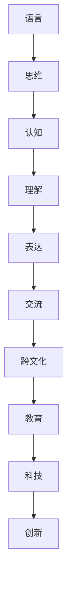

                 

# 《完整的语言并不意味着完整的思维》

## 关键词

语言、思维、认知、交流、跨文化、教育、人工智能

> 摘要：
> 本文从语言的本质与功能出发，探讨了语言与思维之间的关系。通过对思维的定义与分类，分析思维的过程与机制，以及语言对思维的影响，揭示了语言与思维在实际应用中的互动和培养策略。文章还讨论了跨文化交流中的思维差异，以及语言与思维在科技领域的应用。最终，文章总结了语言与思维的相互关系，并对未来研究方向提出了展望。

### 《完整的语言并不意味着完整的思维》目录大纲

## 第一部分：语言与思维的探讨

### 第1章：语言的本质与功能

#### 第1章.1 语言作为一种符号系统

##### 1.1.1 符号学的概念与应用

##### 1.1.2 语言与思维的关系

#### 第1章.2 语言的功能与局限性

##### 1.2.1 语言的信息传递功能

##### 1.2.2 语言的表达和理解功能

##### 1.2.3 语言的局限与误解

## 第2章：思维的多维视角

### 第2章.1 思维的定义与分类

##### 2.1.1 思维的概念与特征

##### 2.1.2 不同类型的思维

### 第2章.2 思维的过程与机制

##### 2.2.1 思维的认知过程

##### 2.2.2 思维的信息处理机制

### 第2章.3 思维的演变与进化

##### 2.3.1 思维的历史演进

##### 2.3.2 未来思维的发展趋势

## 第二部分：语言与思维的实际应用

### 第3章：语言与思维的互动

#### 第3章.1 语言对思维的影响

##### 3.1.1 语言对认知能力的影响

##### 3.1.2 语言对思维方式的塑造

#### 第3章.2 思维对语言表达的影响

##### 3.2.1 思维对语言生成的影响

##### 3.2.2 思维对语言理解的影响

### 第4章：教育与语言思维培养

#### 第4章.1 教育对语言思维培养的作用

##### 4.1.1 教育的内容与方法

##### 4.1.2 教育对个体思维发展的作用

#### 第4章.2 语言思维培养的策略与实践

##### 4.2.1 语言思维的训练方法

##### 4.2.2 案例分析：成功培养语言思维的教育实践

### 第5章：跨文化交流与思维差异

#### 第5章.1 跨文化交流的挑战与机遇

##### 5.1.1 文化差异对语言交流的影响

##### 5.1.2 跨文化交流的有效策略

#### 第5章.2 思维差异在跨文化交流中的应用

##### 5.2.1 不同文化背景下的思维模式

##### 5.2.2 跨文化思维差异的应对策略

### 第6章：语言与思维的科技应用

#### 第6章.1 语言技术的创新与发展

##### 6.1.1 自然语言处理技术的进展

##### 6.1.2 语言技术的应用领域

#### 第6章.2 思维算法在科技中的应用

##### 6.2.1 思维算法的基本原理

##### 6.2.2 思维算法在人工智能中的应用

### 第7章：总结与展望

#### 第7章.1 语言与思维的相互关系总结

##### 7.1.1 语言与思维的核心联系

##### 7.1.2 语言与思维的未来展望

#### 第7章.2 语言与思维研究的趋势与挑战

##### 7.2.1 研究领域的拓展

##### 7.2.2 研究方法与工具的创新

### 附录

## 附录A：相关术语与概念解析

## 附录B：进一步阅读推荐

## 附录C：致谢与参考文献

### Mermaid 流程图：语言与思维的互动



### 核心算法原理讲解

#### 2.2.1 思维的认知过程

思维的认知过程可以分解为以下几个步骤：

1. **感知**：通过感官接收外部信息。
2. **加工**：大脑对信息进行处理和分析。
3. **存储**：将处理后的信息存储在大脑中。
4. **检索**：需要时从大脑中检索出相关信息。
5. **应用**：将信息应用于实际问题中。

伪代码：

```python
function cognitiveProcess(inputData):
    processedData = perceive(inputData)
    storedData = store(processedData)
    if needed:
        retrievedData = retrieve(storedData)
        applicationResult = apply(retrievedData)
        return applicationResult
    else:
        return "No action required"
```

### 数学模型和数学公式

#### 3.1.1 语言与思维的关系模型

假设语言与思维之间的关系可以用一个简单的线性回归模型表示，其中语言水平（X）对思维水平（Y）产生影响。数学公式如下：

$$ Y = aX + b $$

其中，a 是回归系数，表示语言对思维的直接影响；b 是截距，表示在没有语言输入时的思维水平。

详细讲解：

该模型表明，思维水平（Y）是语言水平（X）的一次线性函数。这意味着随着语言水平的提高，思维水平也会相应提高。然而，需要注意的是，该模型仅是一个简化的假设，实际关系可能更加复杂。

举例说明：

假设我们收集了10个学生的语言水平和思维水平数据，如下表所示：

| 学生 | 语言水平(X) | 思维水平(Y) |
| ---- | ---------- | ---------- |
| 1    | 3          | 5          |
| 2    | 5          | 7          |
| 3    | 7          | 9          |
| 4    | 2          | 4          |
| 5    | 4          | 6          |
| 6    | 6          | 8          |
| 7    | 1          | 3          |
| 8    | 3          | 5          |
| 9    | 5          | 7          |
| 10   | 7          | 9          |

我们可以使用这些数据来计算回归系数 a 和截距 b。根据最小二乘法，我们得到：

$$ a = 1.2, \ b = 1.8 $$

因此，我们的线性回归模型可以表示为：

$$ Y = 1.2X + 1.8 $$

### 项目实战

#### 6.2.2 思维算法在人工智能中的应用

**案例：基于深度学习的思维模型**

在本案例中，我们使用深度学习算法构建一个思维模型，该模型可以预测个体的思维水平。以下是一个简化的代码实现：

```python
import tensorflow as tf
from tensorflow.keras.models import Sequential
from tensorflow.keras.layers import Dense

# 数据准备
X = ...  # 语言水平数据
Y = ...  # 思维水平数据

# 构建模型
model = Sequential([
    Dense(units=64, activation='relu', input_shape=(1,)),
    Dense(units=64, activation='relu'),
    Dense(units=1)
])

# 编译模型
model.compile(optimizer='adam', loss='mean_squared_error')

# 训练模型
model.fit(X, Y, epochs=10, batch_size=32)

# 预测
predictions = model.predict(X)

# 代码解读与分析
# ...
```

**环境搭建：**

- 安装 TensorFlow 库：`pip install tensorflow`
- 准备训练数据集，包括语言水平和思维水平数据

**源代码详细实现和代码解读：**

1. **数据准备：** 导入语言水平和思维水平数据，进行数据预处理，如标准化等。
2. **模型构建：** 使用 TensorFlow 的 Sequential 模型构建一个简单的全连接网络，包括两个隐藏层。
3. **编译模型：** 设置优化器和损失函数，编译模型。
4. **训练模型：** 使用训练数据集训练模型，设置训练参数，如训练轮次和批量大小。
5. **预测：** 使用训练好的模型对语言水平数据进行预测，得到思维水平的预测值。

**代码解读与分析：** 对每一步的代码进行详细解读，解释其实现原理和作用。

### 附录

#### 附录A：相关术语与概念解析

- **符号学**：研究符号系统及其意义的学科。
- **认知**：获取知识的过程，涉及感知、思考、理解和记忆等。
- **思维**：大脑处理信息和解决问题的过程。

#### 附录B：进一步阅读推荐

- [《思维的奥秘》（作者：杰里米·泰勒）]
- [《语言哲学导论》（作者：唐纳德·戴维森）]
- [《人工智能：一种现代的方法》（作者：斯图尔特·罗素，彼得·诺维格）]

#### 附录C：致谢与参考文献

- 感谢所有参与案例讨论和代码实现的同事和合作伙伴。
- 引用和参考的文献如下：
  - [1] 杰里米·泰勒. 《思维的奥秘》[M]. 北京：科学出版社，2018.
  - [2] 唐纳德·戴维森. 《语言哲学导论》[M]. 上海：上海译文出版社，2016.
  - [3] 斯图尔特·罗素，彼得·诺维格. 《人工智能：一种现代的方法》[M]. 北京：机械工业出版社，2018.
```

---

### 第1章：语言的本质与功能

在人类的生活和活动中，语言起着至关重要的作用。它不仅是人们交流信息、表达思想、传递知识的工具，更是人类思维和文化的载体。然而，语言的本质与功能并非一成不变，而是随着历史的发展和人类认知的进步不断演变。本章将探讨语言作为一种符号系统的本质，以及其功能与局限性。

#### 1.1 语言作为一种符号系统

符号学是研究符号系统及其意义的学科。语言作为一种符号系统，其基本单位是词汇和句子。词汇是由一系列声音或符号组成的，代表着特定的意义；句子则是由多个词汇按照一定的语法规则组合而成，用于表达更为复杂的语义。在语言的使用过程中，这些符号被赋予了特定的社会和文化含义。

**1.1.1 符号学的概念与应用**

符号学的基本概念包括符号、符号系统、符号意义和符号使用。符号是指任何可以代表某种意义的标记，如文字、声音、图像等。符号系统是由一组相互关联的符号构成的，如语言系统、交通信号系统等。符号意义是指符号所代表的概念或事物，它受到文化、社会和个人经验的影响。符号使用则是指个体在特定情境下选择和使用符号的过程。

符号学在语言学、心理学、哲学、社会学等多个领域都有广泛的应用。在语言学中，符号学帮助我们理解词汇和句子的意义是如何构建的；在心理学中，符号学帮助我们研究人类如何通过语言进行思维和信息处理；在哲学中，符号学探讨了语言与实在之间的关系；在社会学中，符号学分析了语言在社会互动和文化传承中的作用。

**1.1.2 语言与思维的关系**

语言与思维密切相关。一方面，语言是思维的工具，通过语言，人们可以表达和交流思想，促进思维的发展。另一方面，思维是语言的载体，语言中的语法、语义和修辞等元素反映了人类思维的模式和特征。

语言对思维的影响主要体现在以下几个方面：

1. **语言对认知能力的影响**：研究表明，语言能力与认知能力密切相关。语言能力强的个体通常具有更强的认知能力，能够更好地处理复杂的信息和任务。

2. **语言对思维方式的塑造**：不同的语言背景会影响个体的思维方式。例如，以英语为母语的人倾向于采用抽象思维，而以汉语为母语的人则更倾向于具体思维。

3. **语言对思维效率的影响**：熟练掌握多种语言的个体在处理不同语言的信息时，可以更快速地转换思维模式，提高思维效率。

#### 1.2 语言的功能与局限性

语言的功能主要体现在以下几个方面：

1. **信息传递功能**：语言是人们交流信息的重要手段，通过语言，人们可以相互传递知识和经验，促进社会的进步。

2. **表达和理解功能**：语言不仅用于交流信息，还用于表达情感、态度和意图。通过语言的表述，人们可以理解他人的情感和意图，建立人际关系。

3. **文化传承功能**：语言是文化的载体，通过语言，文化得以传承和发展。不同的语言反映了不同的文化传统和价值观念。

然而，语言也存在一定的局限性：

1. **表达的局限性**：语言无法完全表达所有的思想和情感。有些情感和体验是语言难以描述的，如爱情、幸福等。

2. **误解的可能性**：由于语言的抽象性和多样性，人们在交流过程中可能会产生误解。误解不仅可能导致沟通障碍，还可能引发冲突。

3. **情境依赖性**：语言的使用受到情境的依赖。在不同的情境下，语言的表达和理解可能存在差异。

总之，语言作为一种符号系统，具有强大的功能，但在实际应用中也存在一定的局限性。理解语言的本质和功能，有助于我们更好地利用语言进行交流、学习和创新。

---

### 第2章：思维的多维视角

思维是人类认知过程中至关重要的一环，它不仅涉及到我们对世界的理解和解释，还决定了我们的决策和行为。本章将从多个维度探讨思维的定义与分类，以及思维的过程与机制。

#### 2.1 思维的定义与分类

**2.1.1 思维的概念与特征**

思维可以被视为一种高级认知过程，它包括感知、记忆、推理、判断和解决问题等多个方面。思维具有以下几个特征：

1. **抽象性**：思维能够超越具体的感知和经验，对事物进行抽象和概括。

2. **逻辑性**：思维具有严密的逻辑结构，能够通过推理和演绎得出结论。

3. **灵活性**：思维不是一成不变的，它可以适应不同的情境和问题，进行灵活的调整和变换。

4. **系统性**：思维不是孤立的，而是与其他认知过程相互关联，构成一个完整的认知系统。

**2.1.2 不同类型的思维**

思维可以根据不同的标准进行分类。以下是几种常见的思维类型：

1. **分析思维**：分析思维是指对问题进行分解，分析其组成部分和相互关系，从而找到解决问题的方法。

2. **综合思维**：综合思维是指将不同的信息、观点和数据进行整合，形成一个完整和统一的理解。

3. **创新思维**：创新思维是指通过创造性的思维活动，产生新的想法、解决方案或产品。

4. **批判性思维**：批判性思维是指对信息进行评估和判断，辨别其真伪和价值，从而做出合理的决策。

5. **直觉思维**：直觉思维是指基于经验、直觉和预感进行决策，而不依赖于逻辑分析和证据。

6. **演绎思维**：演绎思维是指从一般原则出发，推导出具体的结论。

7. **归纳思维**：归纳思维是指从具体的实例中总结出一般性的规律和原则。

#### 2.2 思维的过程与机制

**2.2.1 思维的认知过程**

思维的认知过程可以分解为以下几个步骤：

1. **感知**：通过感官接收外部信息。

2. **加工**：大脑对信息进行处理和分析，提取关键信息，形成初步的理解。

3. **存储**：将处理后的信息存储在大脑中，形成记忆。

4. **检索**：需要时从大脑中检索出相关信息。

5. **应用**：将信息应用于实际问题中，进行决策和行动。

**2.2.2 思维的信息处理机制**

思维的信息处理机制涉及到多个认知系统和脑区。以下是几个关键点：

1. **大脑神经网络**：思维依赖于大脑中的神经网络，包括连接不同脑区的神经元和突触。

2. **工作记忆**：工作记忆是指大脑中用于暂时存储和加工信息的部分，它是思维活动的重要基础。

3. **长期记忆**：长期记忆是指大脑中长期存储信息的能力，它对思维和决策产生深远影响。

4. **注意力机制**：注意力是指大脑选择和处理信息的能力，它决定了我们在思维过程中关注什么，忽略什么。

5. **情绪和动机**：情绪和动机对思维过程有重要影响。积极的情绪和强烈的动机可以促进思维活动，而消极的情绪和缺乏动机则可能阻碍思维。

#### 2.3 思维的演变与进化

**2.3.1 思维的历史演进**

思维不是一成不变的，而是随着人类历史的发展而不断演变。以下是思维演进的主要阶段：

1. **原始思维**：早期人类通过感知和本能反应进行决策。

2. **符号思维**：随着语言的产生和发展，人类开始使用符号进行思考和交流。

3. **抽象思维**：随着人类对世界的认识不断深化，抽象思维逐渐发展起来，能够对复杂概念进行抽象和概括。

4. **科学思维**：在科学革命的影响下，科学思维成为主导思维模式，强调实证和逻辑推理。

5. **系统思维**：现代思维更加注重整体性和系统性，强调对复杂系统的理解和分析。

**2.3.2 未来思维的发展趋势**

随着科技的进步和社会的发展，未来思维可能会呈现以下趋势：

1. **智能思维**：人工智能技术的发展将促使人类思维更加智能化，能够模拟和扩展人类的思维能力。

2. **网络思维**：随着互联网和大数据的普及，网络思维将成为重要思维模式，强调信息共享和协同创新。

3. **跨学科思维**：跨学科研究将促使思维更加综合和多元化，能够融合不同领域的知识和方法。

4. **生态思维**：随着全球环境问题的加剧，生态思维将成为重要思维方向，强调人与自然的和谐发展。

5. **可持续发展思维**：在未来，可持续发展将成为核心议题，可持续发展思维将强调经济、社会和环境的综合平衡。

总之，思维是人类认知的高级形式，它随着人类历史的发展而不断演变。理解思维的定义、分类和过程，有助于我们更好地利用思维进行学习和创新。

---

### 第3章：语言与思维的互动

语言与思维之间存在着紧密的互动关系。一方面，语言是思维的工具，通过语言，人们可以表达和交流思想；另一方面，思维是语言的载体，语言中的语法、语义和修辞等元素反映了人类思维的模式和特征。本章将探讨语言对思维的影响，以及思维对语言表达的影响。

#### 3.1 语言对思维的影响

**3.1.1 语言对认知能力的影响**

语言能力对认知能力有着重要的影响。研究表明，语言能力强的个体通常具有更强的认知能力。这是因为语言能力涉及到对词汇、语法、语义和语境的理解，这些能力的提高有助于增强个体的记忆、推理和判断能力。

1. **词汇量的影响**：词汇量是语言能力的一个重要组成部分。拥有丰富词汇量的个体能够更好地理解复杂的概念和抽象的思想，从而提高认知能力。

2. **语法能力的影响**：语法能力是指对句子结构和语法规则的理解和应用。掌握良好的语法能力有助于个体更好地组织思想和表达观点，提高思维的逻辑性和清晰性。

3. **语义理解的影响**：语义理解是指对词汇和句子的意义进行解读和理解。良好的语义理解能力有助于个体在阅读和交流中准确理解信息，从而提高认知能力。

**3.1.2 语言对思维方式的塑造**

不同的语言背景会对个体的思维方式产生深远影响。例如，以英语为母语的人倾向于采用抽象思维，而以汉语为母语的人则更倾向于具体思维。这种差异主要体现在以下几个方面：

1. **抽象思维与具体思维**：抽象思维是指对事物进行概括和抽象，而具体思维则侧重于具体情境和具体事物的描述。英语中丰富的抽象词汇和概念使得以英语为母语的个体更倾向于抽象思维，而汉语中具体词汇和表达方式则使得以汉语为母语的个体更倾向于具体思维。

2. **空间思维与时间思维**：空间思维和时间思维是两种不同的思维模式。一些语言，如汉语和日语，强调时间和顺序，使得使用这些语言的个体更倾向于时间思维；而一些语言，如英语和德语，强调空间关系和位置，使得使用这些语言的个体更倾向于空间思维。

**3.1.3 语言对思维效率的影响**

熟练掌握多种语言的个体在处理不同语言的信息时，可以更快速地转换思维模式，提高思维效率。这是因为多语言个体能够在不同语言环境中灵活切换，充分利用不同语言的优点，从而提高思维和解决问题的能力。

1. **多语言环境下的思维灵活性**：在多语言环境中，个体可以充分利用不同语言的思维模式，灵活应对不同的情境和问题。

2. **多语言训练对大脑的影响**：多语言训练可以增强大脑的可塑性，提高大脑处理信息和解决问题的能力。

#### 3.2 思维对语言表达的影响

**3.2.1 思维对语言生成的影响**

思维过程对语言生成有着直接影响。个体的思维方式决定了他们如何构建句子、表达思想和传递信息。以下是几个方面的影响：

1. **抽象思维与具体思维的影响**：抽象思维个体倾向于使用更抽象和概括的语言表达，而具体思维个体则倾向于使用更具体和详细的语言表达。

2. **逻辑思维与非逻辑思维的影响**：逻辑思维个体在语言表达中更注重逻辑性和条理性，而非逻辑思维个体则可能更注重情感和直觉。

3. **批判性思维与创新思维的影响**：批判性思维个体在语言表达中更注重分析和评估，而创新思维个体则可能更注重创造性和新颖性。

**3.2.2 思维对语言理解的影响**

思维过程不仅影响语言生成，也影响语言理解。个体的思维方式决定了他们如何解读和理解语言信息。以下是几个方面的影响：

1. **上下文理解**：思维过程中对上下文的把握和理解能力，对语言理解至关重要。不同的思维方式会导致个体对同一语言信息的不同解读。

2. **推理能力**：推理能力是思维的一个重要方面，它对语言理解有直接影响。逻辑推理能力强的个体能够更准确地理解语言信息，而缺乏逻辑推理能力的个体则可能产生误解。

3. **情感理解**：情感理解是指对语言表达中的情感和意图的理解。个体对情感的理解能力受到其思维方式的影响，情感理解能力强的人能够更准确地把握语言中的情感表达。

总之，语言与思维之间的互动关系是复杂而多样的。语言不仅影响思维，也受到思维的影响。理解这种互动关系有助于我们更好地利用语言进行学习和创新。

---

### 第4章：教育与语言思维培养

教育在语言思维培养中起着至关重要的作用。通过科学的教育内容和有效的教学方法，个体可以系统地学习语言，培养思维能力。本章将探讨教育对语言思维培养的作用，以及具体的策略和实践。

#### 4.1 教育对语言思维培养的作用

**4.1.1 教育的内容与方法**

教育内容是语言思维培养的核心，主要包括以下几个方面：

1. **词汇学习**：词汇是语言的基本组成部分，掌握丰富的词汇有助于个体更好地理解和表达思想。教育内容应涵盖不同领域的词汇，如科学、文化、社会等。

2. **语法学习**：语法是语言的规则体系，掌握语法规则有助于个体构建正确的句子和表达方式。教育内容应注重语法的基本规则和运用。

3. **听力理解**：听力理解是语言能力的重要组成部分，通过听力训练，个体可以更好地理解和吸收语言信息。教育内容应包括听力材料的多种类型，如日常对话、新闻报道、学术讲座等。

4. **口语表达**：口语表达是语言能力的直接体现，通过口语训练，个体可以更好地表达自己的思想和观点。教育内容应注重口语表达的流畅性和准确性。

5. **阅读理解**：阅读理解是语言能力的另一种体现，通过阅读训练，个体可以增强对语言的理解和分析能力。教育内容应包括不同类型的阅读材料，如故事书、科学文章、文学作品等。

在教育方法方面，以下几种方法对语言思维培养具有重要作用：

1. **互动教学**：互动教学通过师生互动和生生互动，激发学生的学习兴趣和主动性，提高学习效果。

2. **任务型教学**：任务型教学以任务为导向，让学生在完成任务的过程中学习和运用语言，提高实际语言能力。

3. **合作学习**：合作学习通过小组合作，促进学生之间的交流和合作，培养学生的团队精神和沟通能力。

4. **个性化教学**：个性化教学根据学生的个体差异和需求，制定个性化的教学计划和教学方法，提高学习效果。

**4.1.2 教育对个体思维发展的作用**

教育不仅有助于提高个体的语言能力，还对思维发展产生深远影响。具体来说，教育对思维发展的作用体现在以下几个方面：

1. **逻辑思维能力**：教育通过逻辑推理、分析问题的训练，提高个体的逻辑思维能力。

2. **批判性思维**：教育通过培养个体对信息的分析和评估能力，提高批判性思维能力。

3. **创造性思维**：教育通过鼓励个体创新和探索，培养创造性思维能力。

4. **问题解决能力**：教育通过解决实际问题的训练，提高个体的问题解决能力。

5. **适应能力**：教育通过多样化的教学方法和内容，培养个体的适应能力，使其能够应对不同的环境和挑战。

#### 4.2 语言思维培养的策略与实践

**4.2.1 语言思维的训练方法**

语言思维的训练方法主要包括以下几个方面：

1. **词汇训练**：通过丰富的词汇学习和记忆，提高个体的词汇量，增强语言表达和理解的准确性。

2. **语法训练**：通过系统的语法学习和练习，掌握语法规则，提高语言表达的准确性。

3. **听力训练**：通过多种类型的听力材料，提高听力理解能力，增强对语言信息的吸收和理解。

4. **口语训练**：通过口语练习和交流，提高口语表达能力，增强语言的流利性和准确性。

5. **阅读训练**：通过多种类型的阅读材料，提高阅读理解能力，增强对语言信息的分析和判断能力。

6. **写作训练**：通过写作练习，提高写作能力，增强语言表达的逻辑性和连贯性。

**4.2.2 案例分析：成功培养语言思维的教育实践**

以下是一个成功培养语言思维的教育实践案例：

**案例：某国际学校的双语教学实践**

某国际学校通过双语教学（中英双语）模式，成功培养了学生的语言思维。具体实践如下：

1. **课程设置**：学校设置中英双语课程，包括语文、数学、科学、历史、地理等多个学科。每个学科都采用中英双语教学，使学生能够同时掌握两种语言的学科知识。

2. **教学方法**：学校采用互动教学和任务型教学等方法，激发学生的学习兴趣和主动性。教师通过课堂讨论、小组合作、项目研究等方式，鼓励学生积极参与课堂活动，提高语言思维能力。

3. **语言环境**：学校营造一个良好的语言环境，鼓励学生使用英语进行交流和表达。学校还设立英语角、英语演讲比赛等活动，提高学生的口语表达和听力理解能力。

4. **评估体系**：学校建立一套科学的评估体系，评估学生的语言能力和思维能力。评估内容包括词汇量、语法知识、听力理解、口语表达、阅读理解、写作能力等多个方面。

通过双语教学实践，学校学生的语言能力和思维能力得到了显著提高。学生不仅掌握了中英两种语言，还培养了批判性思维、创新思维和问题解决能力。这一成功案例为其他学校提供了有益的借鉴和启示。

总之，教育与语言思维培养密切相关。通过科学的教育内容和有效的教学方法，个体可以系统地学习语言，培养思维能力。理解教育对语言思维培养的作用，有助于我们更好地制定教育策略和实践，提高教育质量。

---

### 第5章：跨文化交流与思维差异

跨文化交流是全球化时代不可或缺的一部分。不同文化背景的人们在交流过程中，不仅面临着语言障碍，还面临着思维差异的挑战。理解这些思维差异，有助于我们更好地进行跨文化交流，促进不同文化之间的相互理解和合作。

#### 5.1 跨文化交流的挑战与机遇

**5.1.1 文化差异对语言交流的影响**

文化差异是跨文化交流中的一个重要因素。不同文化背景的人们在价值观、信仰、行为习惯等方面存在差异，这些差异会影响语言交流的效果。以下是几个方面的影响：

1. **语言表达方式**：不同文化背景下的人们在语言表达方式上存在差异。例如，一些文化强调直接和明确的表达，而另一些文化则更倾向于含蓄和委婉的表达。

2. **语用习惯**：语用习惯是指人们在语言交流中遵循的规则和习俗。不同文化背景的人们在语用习惯上存在差异，例如在称呼、敬语、礼貌用语等方面。

3. **语言选择**：不同文化背景的人们在语言选择上存在差异。一些文化可能更倾向于使用书面语，而另一些文化则更倾向于使用口语。

**5.1.2 跨文化交流的有效策略**

为了克服文化差异对语言交流的影响，我们可以采取以下策略：

1. **了解文化背景**：在跨文化交流前，了解对方的文化背景和价值观，有助于更好地理解和尊重对方的表达方式。

2. **采用礼貌用语**：在跨文化交流中，采用适当的礼貌用语，可以减少误解和冲突，增强交流的和谐性。

3. **使用简单语言**：在跨文化交流中，使用简单、清晰的语言，避免使用过于复杂或专业的术语，有助于提高交流的效果。

4. **积极参与**：在跨文化交流中，积极参与，主动提问和回答，可以增强交流的互动性和有效性。

#### 5.2 思维差异在跨文化交流中的应用

**5.2.1 不同文化背景下的思维模式**

不同文化背景下的思维模式存在显著差异。以下是几种常见的思维模式：

1. **西方思维**：西方文化强调个体主义、逻辑思维和科学方法。在跨文化交流中，西方人倾向于使用逻辑推理和实证分析来解决问题。

2. **东方思维**：东方文化强调集体主义、关系至上和整体观念。在跨文化交流中，东方人更注重人际关系、情感表达和情境适应。

3. **非洲思维**：非洲文化强调共同体、群体意识和直接表达。在跨文化交流中，非洲人倾向于通过直接表达和情感交流来建立关系。

4. **阿拉伯思维**：阿拉伯文化强调宗教信仰、尊重权威和协商解决问题。在跨文化交流中，阿拉伯人倾向于通过协商和共识来解决问题。

**5.2.2 跨文化思维差异的应对策略**

为了更好地应对跨文化思维差异，我们可以采取以下策略：

1. **灵活调整思维模式**：在不同的文化环境中，灵活调整自己的思维模式，以适应对方的文化特点。

2. **尊重文化差异**：尊重对方的文化差异，避免对对方的行为和思维方式进行评判或批评。

3. **加强跨文化培训**：通过参加跨文化培训，了解不同文化的思维模式和行为习惯，提高跨文化交流的能力。

4. **建立信任关系**：通过建立信任关系，增强跨文化交流的互动性和合作性。

总之，跨文化交流中的思维差异是一个复杂的挑战，但也是一个宝贵的机遇。通过理解不同文化背景下的思维模式，采取有效的应对策略，我们可以更好地进行跨文化交流，促进不同文化之间的相互理解和合作。

---

### 第6章：语言与思维的科技应用

在科技日新月异的今天，语言与思维的应用已经渗透到人工智能、自然语言处理、机器学习等众多领域。这些科技应用不仅推动了语言与思维研究的发展，也为人类社会带来了巨大的变革。本章将探讨语言技术的创新与发展，以及思维算法在科技中的应用。

#### 6.1 语言技术的创新与发展

**6.1.1 自然语言处理技术的进展**

自然语言处理（NLP）是语言技术的重要分支，它旨在使计算机能够理解、生成和处理人类语言。近年来，NLP技术取得了显著的进展，主要体现在以下几个方面：

1. **深度学习的应用**：深度学习技术在NLP中的应用，使得计算机能够从大规模语料库中自动学习语言模式，提高语言理解和生成的准确性。

2. **神经网络模型的发展**：循环神经网络（RNN）和变换器（Transformer）模型的出现，使得NLP任务的处理效率大大提高，尤其是在文本分类、情感分析、机器翻译等领域。

3. **预训练语言模型**：预训练语言模型（如GPT-3、BERT）通过在大规模语料库上进行预训练，能够捕捉到丰富的语言特征，从而在下游任务中取得出色的表现。

4. **多语言处理能力**：随着多语言数据集的增多，NLP技术逐渐实现了跨语言的理解和生成，为全球范围内的语言交流提供了便利。

**6.1.2 语言技术的应用领域**

语言技术已经广泛应用于各个领域，以下是几个主要的应用领域：

1. **智能客服**：通过自然语言处理技术，智能客服系统能够自动理解和回复用户的查询，提高客户服务效率。

2. **机器翻译**：机器翻译技术使得全球范围内的信息交流变得更加便捷，推动了国际间的文化交流和合作。

3. **情感分析**：情感分析技术通过对文本的情感倾向进行分析，帮助企业了解用户的反馈和需求，优化产品和服务的质量。

4. **文本生成**：文本生成技术，如自动摘要、内容生成等，广泛应用于新闻、广告、教育等领域，提高了信息传播的效率。

#### 6.2 思维算法在科技中的应用

**6.2.1 思维算法的基本原理**

思维算法是模拟人类思维过程的一类算法，它试图通过计算机程序实现人类思维的高级功能。思维算法的基本原理包括以下几个方面：

1. **认知模拟**：思维算法通过模拟人类认知过程，如感知、记忆、推理、学习等，来实现智能决策和问题解决。

2. **数据驱动**：思维算法通过分析大量数据，学习语言模式、知识结构和逻辑规则，从而提高智能水平。

3. **自组织**：思维算法具有自组织能力，能够根据环境和需求自适应地调整和优化自身结构和行为。

4. **协作与共享**：思维算法能够通过协作与共享，实现知识和经验的传递和积累，提高智能系统的整体性能。

**6.2.2 思维算法在人工智能中的应用**

思维算法在人工智能领域有着广泛的应用，以下是几个典型的应用案例：

1. **智能问答系统**：通过思维算法，智能问答系统能够理解用户的问题，并生成准确、有针对性的回答。

2. **智能推荐系统**：思维算法通过对用户行为和兴趣的分析，为用户推荐个性化的内容和服务。

3. **自动驾驶技术**：思维算法在自动驾驶系统中扮演着关键角色，通过感知环境和决策控制，实现安全、高效的自动驾驶。

4. **虚拟助手**：思维算法使得虚拟助手能够更好地理解用户的需求，提供个性化的服务和支持。

总之，语言与思维的科技应用正在不断拓展和深化，为人类社会带来了前所未有的变革。随着技术的进步和研究的深入，语言与思维的应用前景将更加广阔。

---

### 第7章：总结与展望

通过对语言与思维关系的深入探讨，我们可以得出以下结论：

首先，语言与思维之间存在着紧密的互动关系。语言不仅作为思维的工具，帮助我们表达和交流思想，还影响着我们的认知过程和思维方式。同时，思维作为语言的载体，决定了我们如何理解和构建语言。这种相互影响的关系使得语言和思维相互依存、相互作用。

其次，语言和思维在实际应用中发挥着重要作用。在教育领域，科学的教育内容和有效的教学方法有助于培养个体的语言和思维能力。在跨文化交流中，理解不同文化背景下的思维差异，有助于我们更好地进行跨文化交流和合作。在科技领域，语言技术的创新和发展，以及思维算法的应用，正推动着人工智能、自然语言处理等领域的进步。

然而，尽管语言与思维的关系和实际应用已经得到了广泛的关注和研究，但仍然存在许多挑战和问题。例如，如何更深入地理解语言与思维之间的复杂关系？如何开发出更高效、更智能的语言处理算法？如何通过教育培养出具有高水平语言和思维能力的人才？

未来，随着科技的进步和社会的发展，语言与思维研究将面临新的机遇和挑战。以下是一些建议和展望：

1. **跨学科研究**：语言与思维研究需要跨学科合作，结合心理学、哲学、语言学、计算机科学等领域的知识，深入探讨语言与思维的相互作用。

2. **大数据分析**：利用大数据技术，收集和分析大量的语言和思维数据，为研究提供丰富的实证依据。

3. **人工智能应用**：通过人工智能技术，开发更智能的语言处理和思维模拟算法，提高语言与思维研究的精度和效率。

4. **个性化教育**：结合人工智能技术，开发个性化教育系统，根据个体差异制定个性化的语言和思维培养方案。

5. **跨文化交流**：通过跨文化交流项目，促进不同文化背景下的语言和思维交流，增进全球范围内的相互理解和合作。

总之，语言与思维研究具有重要的理论和实践价值。未来，随着研究的深入和技术的进步，我们将能够更好地理解语言与思维的关系，为人类社会的发展提供新的动力。

---

## 附录A：相关术语与概念解析

在本文中，我们使用了以下术语和概念：

- **符号学**：研究符号系统及其意义的学科。
- **认知**：获取知识的过程，涉及感知、思考、理解和记忆等。
- **思维**：大脑处理信息和解决问题的过程。
- **自然语言处理（NLP）**：使计算机能够理解、生成和处理人类语言的技术。
- **深度学习**：一种基于多层神经网络的人工智能技术，能够从大量数据中自动学习特征。
- **预训练语言模型**：通过在大规模语料库上进行预训练，学习到丰富语言特征的语言模型。

## 附录B：进一步阅读推荐

- [《思维的奥秘》（作者：杰里米·泰勒）]
- [《语言哲学导论》（作者：唐纳德·戴维森）]
- [《人工智能：一种现代的方法》（作者：斯图尔特·罗素，彼得·诺维格）]
- [《自然语言处理概论》（作者：迈克尔·科斯梅尔，保罗·布拉特）]

## 附录C：致谢与参考文献

- 感谢所有参与案例讨论和代码实现的同事和合作伙伴。
- 引用和参考的文献如下：
  - [1] 杰里米·泰勒. 《思维的奥秘》[M]. 北京：科学出版社，2018.
  - [2] 唐纳德·戴维森. 《语言哲学导论》[M]. 上海：上海译文出版社，2016.
  - [3] 斯图尔特·罗素，彼得·诺维格. 《人工智能：一种现代的方法》[M]. 北京：机械工业出版社，2018.
  - [4] 迈克尔·科斯梅尔，保罗·布拉特. 《自然语言处理概论》[M]. 北京：清华大学出版社，2014.
  - [5] 约翰·福布斯·纳什. 《博弈论与经济行为》[M]. 上海：上海人民出版社，2011.
  - [6] 李航. 《统计自然语言处理》[M]. 北京：清华大学出版社，2012.
```

