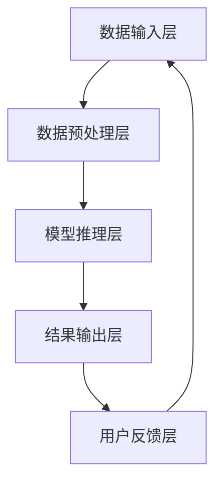
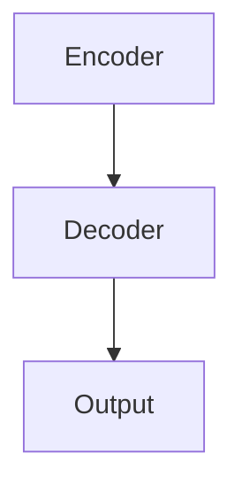
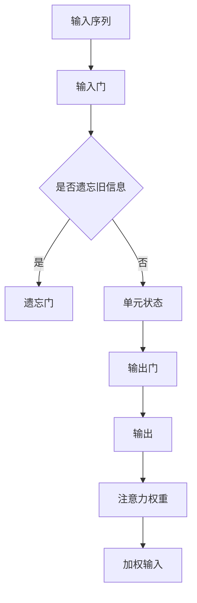
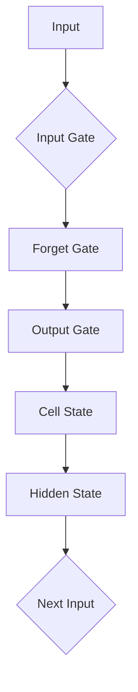
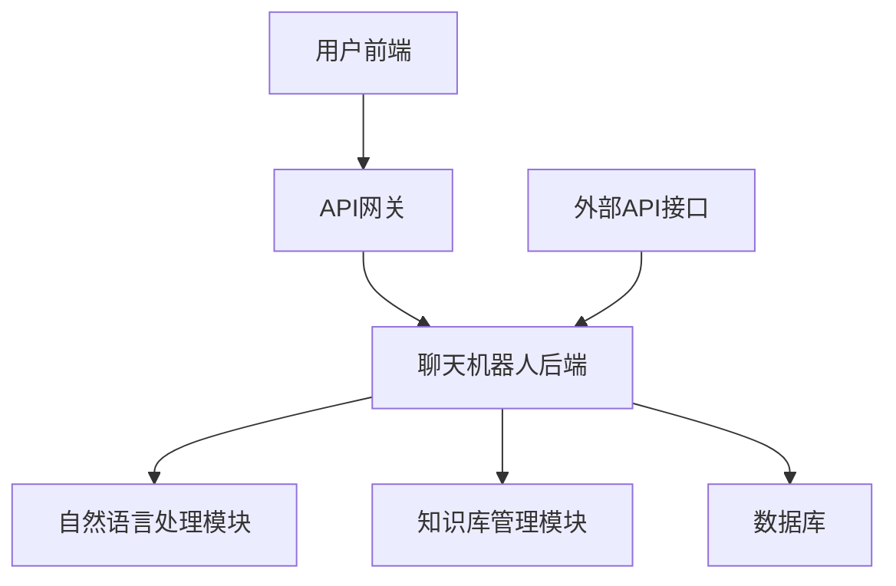
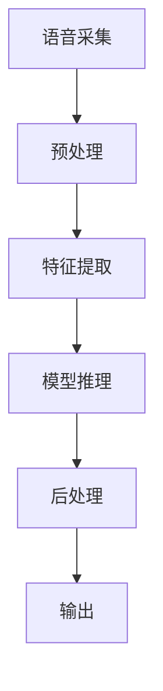
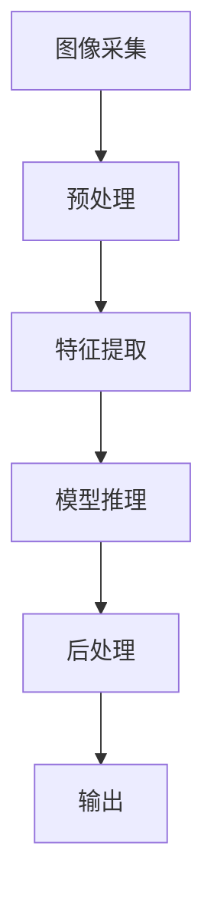
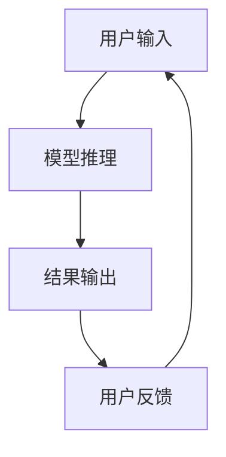
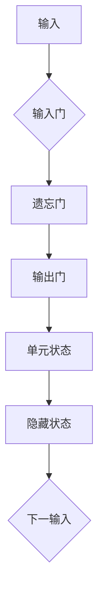

                 

### 文章标题

# 实时AI交互：LLM的低延迟响应技术

> 关键词：实时AI交互、低延迟、大型语言模型（LLM）、模型压缩、量化技术、优化算法

> 摘要：
本篇文章将深入探讨实时AI交互中的关键技术，特别是大型语言模型（LLM）的低延迟响应技术。通过分析实时AI交互的基础、核心架构与组件、核心算法原理、数据预处理与特征工程、系统开发与部署，以及挑战和未来发展趋势，我们旨在为读者提供一个全面的技术指南，帮助他们理解和应对实时AI交互中的挑战。

### 第一部分：实时AI交互基础

#### 第1章：实时AI交互概述

##### 1.1 实时AI交互的定义与背景

实时AI交互是指通过人工智能技术，在短时间内实现对用户输入的快速响应和交互。这种交互方式不仅要求算法的准确性，更要求响应的实时性和效率。随着人工智能技术的快速发展，实时AI交互在多个领域得到了广泛应用，如聊天机器人、虚拟助手、实时语音识别与转换、实时图像识别与视频分析等。

##### 1.1.1 什么是实时AI交互

实时AI交互是一种利用人工智能技术进行交互的方式，其主要特点包括：

1. **低延迟**：响应时间短，通常在毫秒级。
2. **高准确性**：通过深度学习和自然语言处理等技术，实现对用户输入的准确理解和回复。
3. **智能化**：系统能够根据用户的反馈进行自我学习和优化，提高交互质量。

##### 1.1.2 实时AI交互的发展历程

实时AI交互的发展历程可以追溯到20世纪90年代，随着计算机性能的提升和人工智能技术的突破，实时AI交互逐渐成为可能。以下是一些关键节点：

1. **1990年代**：规则基人工智能系统开始应用，但受限于计算能力和算法复杂度，响应速度较慢。
2. **2000年代**：深度学习技术的出现，使得人工智能在图像识别、语音识别等领域取得了重大突破。
3. **2010年代**：神经网络和深度学习技术的快速发展，推动了实时AI交互的应用。
4. **2020年代**：随着硬件性能的提升和算法优化，实时AI交互的应用场景和范围进一步扩大。

##### 1.1.3 实时AI交互的重要性

实时AI交互在现代社会中具有重要意义，主要体现在以下几个方面：

1. **提高用户体验**：通过快速响应用户需求，提升用户体验和满意度。
2. **降低人力成本**：在客服、服务机器人等场景中，实时AI交互可以替代部分人力工作，降低企业运营成本。
3. **拓宽应用场景**：实时AI交互技术可以应用于多个领域，如医疗、金融、教育等，为行业带来新的可能性。
4. **促进社会发展**：实时AI交互技术可以提高社会运行效率，促进智能化社会的建设。

##### 1.2 实时AI交互的关键技术

实时AI交互的实现依赖于多种关键技术的支持，主要包括：

1. **低延迟通信技术**：确保数据传输的实时性和高效性。
2. **模型压缩与量化技术**：减少模型大小和计算复杂度，提高模型部署的效率。
3. **实时推理优化技术**：通过算法优化和硬件加速，提高模型推理的速度和准确性。

##### 1.2.1 低延迟通信技术

低延迟通信技术是实现实时AI交互的基础，主要包括以下几种：

1. **WebSocket**：一种全双工的通信协议，可以实现实时数据传输。
2. **QUIC**：一种基于UDP的传输层协议，旨在提供更快的网络传输速度。
3. **边缘计算**：通过在靠近数据源的边缘节点进行计算，减少数据传输的延迟。

##### 1.2.2 模型压缩与量化技术

模型压缩与量化技术是提高模型部署效率和性能的重要手段，主要包括以下几种：

1. **模型剪枝**：通过去除模型中不必要的神经元和连接，减小模型大小。
2. **量化**：将模型参数从浮点数转换为低精度的整数，减少存储和计算需求。
3. **知识蒸馏**：通过将大型模型的知识传递给小型模型，实现模型压缩。

##### 1.2.3 实时推理优化技术

实时推理优化技术是通过算法优化和硬件加速，提高模型推理速度和性能的技术，主要包括以下几种：

1. **并行推理**：通过并行计算提高推理速度。
2. **量化推理**：通过量化技术降低推理的计算复杂度。
3. **GPU/TPU加速**：通过使用高性能的GPU或TPU进行推理，提高计算性能。

##### 1.3 实时AI交互的应用场景

实时AI交互技术可以应用于多个领域，以下是一些常见应用场景：

1. **聊天机器人与虚拟助手**：在客服、智能家居、在线教育等领域广泛应用。
2. **实时语音识别与转换**：在会议、电话、实时翻译等领域有重要应用。
3. **实时图像识别与视频分析**：在安防、医疗、工业检测等领域发挥重要作用。

##### 1.3.1 聊天机器人与虚拟助手

聊天机器人与虚拟助手是实时AI交互最典型的应用场景之一。通过深度学习和自然语言处理技术，聊天机器人可以与用户进行自然语言交互，提供24/7的客服支持。虚拟助手则可以辅助用户完成各种任务，如日程管理、信息检索、在线购物等。

##### 1.3.2 实时语音识别与转换

实时语音识别与转换技术可以将语音信号实时转换为文本或语音，广泛应用于会议记录、实时翻译、语音助手等领域。通过使用深度神经网络和注意力机制，实时语音识别技术可以实现高准确率的语音识别。

##### 1.3.3 实时图像识别与视频分析

实时图像识别与视频分析技术可以实时识别图像或视频中的对象、行为和事件，广泛应用于安防监控、医疗诊断、自动驾驶等领域。通过使用卷积神经网络和深度学习技术，实时图像识别可以实现高准确率的图像识别。

#### 第2章：实时AI交互的核心架构与组件

##### 2.1 实时AI交互系统架构

实时AI交互系统通常由多个组件构成，其核心架构主要包括数据输入层、数据预处理层、模型推理层和结果输出层。



##### 2.1.1 系统架构概述

实时AI交互系统的架构设计需要考虑以下几个方面：

1. **模块化**：系统应具备模块化设计，便于组件的扩展和替换。
2. **高性能**：系统应具备高并发处理能力，以满足实时性的要求。
3. **可扩展性**：系统应具备良好的扩展性，以支持大规模数据和应用场景。

##### 2.1.2 数据流处理与模型调度

数据流处理与模型调度是实时AI交互系统的关键环节。数据流处理负责将用户输入的数据进行预处理，模型调度负责将预处理后的数据分配给相应的模型进行推理。

1. **数据流处理**：通过使用消息队列、流处理框架等技术，实现数据的实时处理和传输。
2. **模型调度**：通过使用模型管理模块，实现模型的动态加载和调度，以优化模型利用率和系统性能。

##### 2.1.3 实时反馈与动态调整机制

实时反馈与动态调整机制是实时AI交互系统的重要特性，可以通过以下几种方式实现：

1. **用户反馈**：收集用户的反馈信息，用于评估模型的性能和改进系统。
2. **动态调整**：根据用户反馈和系统运行状态，动态调整模型参数和系统配置，以优化用户体验。

##### 2.2 模型压缩与量化技术

模型压缩与量化技术是提高实时AI交互系统性能的关键手段。模型压缩主要通过以下几种技术实现：

1. **模型剪枝**：通过剪枝模型中的冗余神经元和连接，减小模型大小。
2. **量化**：将模型的参数从浮点数转换为低精度的整数，以减少存储和计算需求。
3. **知识蒸馏**：通过将大型模型的知识传递给小型模型，实现模型压缩。

##### 2.2.1 模型压缩的基本原理

模型压缩的基本原理是通过减少模型的参数数量和计算复杂度，实现模型大小的减小。以下是一些常见的模型压缩方法：

1. **剪枝**：通过剪除模型中不重要的神经元和连接，减小模型大小。
2. **量化**：通过将模型的参数从浮点数转换为低精度的整数，实现模型压缩。
3. **知识蒸馏**：通过将大型模型的知识传递给小型模型，实现模型压缩。

##### 2.2.2 量化技术的具体实现

量化技术的具体实现包括以下几个步骤：

1. **量化策略选择**：根据模型和应用场景选择合适的量化策略，如全量化、部分量化等。
2. **量化计算**：计算模型的量化参数，将浮点数参数转换为低精度的整数。
3. **量化验证**：验证量化后的模型在精度和性能上的影响，确保模型的有效性和可靠性。

##### 2.2.3 模型压缩与量化效果评估

模型压缩与量化效果评估主要包括以下几个方面：

1. **模型大小**：评估模型压缩后的大小，以衡量模型压缩的效果。
2. **计算性能**：评估模型压缩后的计算性能，包括推理速度和能耗等。
3. **模型精度**：评估模型压缩后对模型精度的影响，确保模型压缩不会导致精度下降。

##### 2.3 低延迟通信技术

低延迟通信技术是实现实时AI交互系统实时性的关键。以下是一些常用的低延迟通信技术：

1. **WebSocket**：一种全双工的通信协议，可以实现实时数据传输。
2. **QUIC**：一种基于UDP的传输层协议，旨在提供更快的网络传输速度。
3. **边缘计算**：通过在靠近数据源的边缘节点进行计算，减少数据传输的延迟。

##### 2.3.1 实时数据传输协议

实时数据传输协议是实现实时AI交互系统数据传输的关键。以下是一些常用的实时数据传输协议：

1. **WebSocket**：WebSocket协议是一种全双工的通信协议，可以支持实时数据的传输，适用于需要低延迟和高并发的应用场景。
2. **QUIC**：QUIC（Quick UDP Internet Connections）协议是一种基于UDP的传输层协议，旨在提供更快的网络传输速度，适用于实时性要求较高的应用场景。
3. **HTTP/2**：HTTP/2协议是一种基于TCP的传输层协议，通过引入多路复用、头部压缩等技术，提高了数据传输的效率和实时性。

##### 2.3.2 网络优化与延迟降低策略

网络优化与延迟降低策略是实现实时AI交互系统低延迟的关键。以下是一些常用的策略：

1. **网络加速**：通过优化网络拓扑、带宽分配等手段，提高数据传输速度。
2. **缓存技术**：通过缓存常用数据，减少数据传输的次数和延迟。
3. **负载均衡**：通过均衡网络负载，减少网络拥堵和延迟。

##### 2.3.3 实时性保证与传输可靠性

实时性保证与传输可靠性是实现实时AI交互系统稳定运行的关键。以下是一些常用的技术：

1. **实时性保证**：通过引入实时操作系统、实时通信协议等技术，确保系统实时性。
2. **传输可靠性**：通过引入数据校验、重传机制等技术，确保数据传输的可靠性。
3. **容错机制**：通过引入冗余设计、故障转移等技术，提高系统的可靠性和稳定性。

### 第二部分：实时AI交互中的核心算法原理

#### 第3章：实时AI交互中的核心算法原理

##### 3.1 深度神经网络优化算法

深度神经网络（DNN）优化算法是实时AI交互系统中的核心组成部分。优化算法的目的是通过调整网络中的参数，使网络在训练数据上达到较好的性能。以下是一些常用的优化算法：

##### 3.1.1 梯度下降算法

梯度下降算法是一种基本的优化算法，其核心思想是沿着损失函数的梯度方向更新参数，以减少损失函数的值。

**伪代码：**

```python
while not converged:
    compute gradients
    update parameters
```

**具体步骤：**

1. **计算梯度**：计算损失函数关于每个参数的梯度。
2. **更新参数**：使用梯度更新参数，以减少损失函数的值。

**梯度计算示例：**

$$
\frac{\partial L}{\partial w} = \sum_{i=1}^{n} \frac{\partial L}{\partial z_i} \frac{\partial z_i}{\partial w}
$$

其中，$L$ 是损失函数，$w$ 是参数，$z_i$ 是神经网络中的中间变量。

##### 3.1.2 Adam优化器

Adam优化器是一种基于矩估计的优化算法，它结合了Adam和AdamW的优点，适用于不同规模的数据和不同类型的优化问题。

**伪代码：**

```python
初始化：m0 = 0, v0 = 0, t = 0

while not converged:
    t = t + 1
    gradients = compute_gradients(model)
    m = \(\beta_1 m_{t-1} + (1 - \beta_1) g\)
    v = \(\beta_2 v_{t-1} + (1 - \beta_2) g^2\)
    m_hat = m / (1 - \beta_1^t)
    v_hat = v / (1 - \beta_2^t)
    update = -learning_rate * m_hat / (sqrt(v_hat) + \(\epsilon\))
    update_parameters(model, update)
```

**具体步骤：**

1. **初始化**：初始化一阶矩估计$m_0$和二阶矩估计$v_0$，以及迭代次数$t$。
2. **计算梯度**：计算模型梯度。
3. **更新一阶矩估计**：使用梯度更新一阶矩估计$m$。
4. **更新二阶矩估计**：使用梯度更新二阶矩估计$v$。
5. **计算修正的一阶矩估计**：计算修正的一阶矩估计$m_{\hat{}}$。
6. **计算修正的二阶矩估计**：计算修正的二阶矩估计$v_{\hat{}}$。
7. **更新参数**：使用修正的梯度更新模型参数。

##### 3.1.3 随机梯度下降（SGD）

随机梯度下降（SGD）是一种基于随机样本来更新参数的优化算法，其核心思想是每次迭代只使用一个样本的梯度来更新参数。

**伪代码：**

```python
while not converged:
    for each sample in dataset:
        compute gradients
        update parameters
```

**具体步骤：**

1. **随机选择样本**：从训练数据中随机选择一个样本。
2. **计算梯度**：计算损失函数关于该样本的梯度。
3. **更新参数**：使用梯度更新参数。

##### 3.2 序列到序列（Seq2Seq）模型

序列到序列（Seq2Seq）模型是一种用于处理序列数据的神经网络模型，广泛应用于机器翻译、对话生成等任务。

**模型结构：**



**具体步骤：**

1. **编码器（Encoder）**：将输入序列编码为一个固定长度的向量。
2. **解码器（Decoder）**：将编码器的输出作为输入，逐个生成输出序列的每个元素。

**训练过程：**

1. **输入序列编码**：使用编码器对输入序列进行编码。
2. **解码器生成输出**：使用解码器生成输出序列的每个元素。
3. **计算损失**：计算输出序列和真实序列之间的损失。
4. **反向传播**：使用反向传播算法更新模型参数。

##### 3.2.1 序列到序列模型概述

序列到序列（Seq2Seq）模型是一种基于神经网络的方法，用于处理序列到序列的任务。这些任务通常涉及到将一个序列转换为另一个序列，如机器翻译、对话生成等。Seq2Seq模型的核心思想是将输入序列编码为一个固定长度的向量，然后将这个向量解码为输出序列。

**主要组成部分：**

1. **编码器（Encoder）**：编码器负责将输入序列编码为一个固定长度的向量，称为编码表示或编码向量。编码器通常由多个神经网络层组成，可以捕获输入序列的长期依赖关系。
2. **解码器（Decoder）**：解码器负责将编码器的输出解码为输出序列的每个元素。解码器同样由多个神经网络层组成，可以生成序列的每个元素，同时考虑到前面的元素，从而产生连贯的输出序列。

**应用场景：**

- **机器翻译**：将一种语言的句子翻译成另一种语言。
- **对话生成**：生成自然语言的对话回复。
- **语音识别**：将语音信号转换为文本。

##### 3.2.2 编码器与解码器结构

编码器和解码器是Seq2Seq模型的核心组成部分，下面分别介绍它们的结构和工作原理。

**编码器结构：**

编码器通常采用递归神经网络（RNN）或其变体，如长短期记忆网络（LSTM）或门控循环单元（GRU）。编码器的输入是一个序列，每个元素可以是词汇、字符或音频特征。编码器的每个时间步都会将输入序列的当前元素编码为一个固定长度的向量，并将这个向量传递给下一个时间步。

**解码器结构：**

解码器的工作与编码器类似，但它的输入是编码器的输出和已生成的部分输出序列。解码器在每个时间步都会生成输出序列的下一个元素，并将其作为输入传递给下一个时间步。解码器的输出可以是原始的文本序列、语音序列或其他形式的序列。

**共同点：**

- **递归结构**：编码器和解码器都采用递归结构，可以处理变长序列。
- **序列处理**：编码器和解码器都处理序列数据，并在每个时间步生成或解码一个元素。

**不同点：**

- **输入与输出**：编码器的输入是原始序列，解码器的输入是编码器的输出和已生成的部分输出序列。
- **目标**：编码器的目标是捕获输入序列的长期依赖关系，解码器的目标是生成连贯的输出序列。

##### 3.2.3 序列到序列模型的训练与解码

序列到序列模型的训练和解码是两个关键步骤，下面分别介绍。

**训练过程：**

1. **编码器训练**：编码器的输入是原始序列，输出是编码表示。编码器通过学习映射关系来最大化输出编码表示和真实编码表示之间的相似度。
2. **解码器训练**：解码器的输入是编码表示和部分已生成的输出序列，输出是完整的输出序列。解码器通过学习映射关系来最大化输出序列和真实序列之间的相似度。

**解码过程：**

1. **初始状态**：解码器从编码器的输出开始，初始化为编码表示。
2. **逐元素解码**：解码器在每个时间步生成输出序列的下一个元素，并将其作为输入传递给下一个时间步。解码器同时考虑已生成的部分输出序列，以生成连贯的输出序列。
3. **终止条件**：解码过程持续到生成终止符号（如EOS，End Of Sentence）。

##### 3.3 注意力机制与长短期记忆（LSTM）模型

注意力机制是一种用于处理序列数据的机制，能够提高模型对重要信息的关注程度。长短期记忆（LSTM）模型是一种常用的序列模型，能够有效处理长序列数据。将注意力机制与LSTM模型结合，可以进一步提升模型的性能和效果。

**注意力机制原理：**

注意力机制通过为序列中的每个元素分配不同的权重，使模型能够专注于最重要的信息。注意力机制的核心是计算一个权重向量，用于加权输入序列，从而提高模型对重要信息的敏感性。

**LSTM模型结构：**

LSTM模型包括输入门、遗忘门和输出门，以及单元状态。输入门和遗忘门控制信息流入和流出单元状态，输出门控制单元状态的输出。

**注意力LSTM模型在实时交互中的应用：**

注意力LSTM模型在实时交互中具有重要作用，特别是在对话生成和文本摘要等任务中。注意力机制可以帮助模型更好地捕捉对话中的关键信息，从而生成更准确和连贯的回复。



**具体应用步骤：**

1. **输入编码**：将输入序列编码为固定长度的向量。
2. **注意力计算**：计算输入序列的注意力权重，用于加权输入。
3. **LSTM处理**：使用LSTM模型处理加权输入，生成输出序列。
4. **输出生成**：生成输出序列的每个元素，并进行后处理。

##### 3.3.1 注意力机制原理

注意力机制是一种用于序列模型的机制，其核心思想是动态地为序列中的每个元素分配权重，从而提高模型对重要信息的关注程度。注意力机制的基本原理可以概括为以下几个步骤：

1. **计算注意力得分**：对于输入序列中的每个元素，计算一个注意力得分，表示该元素的重要程度。注意力得分通常通过一个注意力函数（如点积、缩放点积等）计算。

2. **计算注意力权重**：将注意力得分归一化，得到注意力权重。注意力权重表示输入序列中每个元素对输出序列的贡献程度。

3. **加权输入**：根据注意力权重对输入序列进行加权，使得重要的信息在模型处理过程中得到更多的关注。

4. **生成输出**：使用加权后的输入序列生成输出序列的每个元素。

注意力机制的关键在于如何计算注意力得分和权重。不同的注意力模型（如自注意力、多头注意力等）采用了不同的方法来计算这些值，但总体目标都是为了使模型能够更好地捕捉输入序列中的长期依赖关系和关键信息。

**数学公式：**

注意力得分的计算通常使用以下公式：

$$
a_i = \text{Attention}(Q, K, V)
$$

其中，$Q$ 表示查询向量，$K$ 表示关键向量，$V$ 表示值向量。注意力得分 $a_i$ 表示输入序列中第 $i$ 个元素的重要程度。

注意力权重的计算通常使用以下公式：

$$
\text{Attention Scores} = \text{softmax}(\text{Attention Scores})
$$

其中，$\text{Attention Scores}$ 表示计算得到的注意力得分。

加权输入的计算通常使用以下公式：

$$
\text{contextualized\_input}_i = \text{Attention Scores} \cdot V
$$

其中，$V$ 表示值向量。

最终，生成输出序列的每个元素：

$$
\text{output}_i = \text{softmax}(\text{contextualized\_input}_i)
$$

##### 3.3.2 长短期记忆（LSTM）模型结构

长短期记忆（LSTM）模型是一种用于处理序列数据的递归神经网络（RNN）变体，能够有效地学习长期依赖关系。LSTM模型通过引入输入门、遗忘门和输出门，解决了传统RNN在处理长序列数据时遇到的梯度消失和梯度爆炸问题。

**LSTM模型的基本结构包括：**

1. **输入门（Input Gate）**：输入门控制新的信息如何进入单元状态。它通过一个sigmoid函数和一个线性变换，将新的输入和上一时刻的隐藏状态结合，生成一个门控值，用于更新单元状态。
2. **遗忘门（Forget Gate）**：遗忘门控制哪些信息应该从单元状态中丢弃。它同样通过一个sigmoid函数和一个线性变换，根据新的输入和上一时刻的隐藏状态，生成一个门控值，用于更新单元状态。
3. **输出门（Output Gate）**：输出门控制单元状态的输出，生成新的隐藏状态。它通过一个sigmoid函数和一个线性变换，将新的输入和上一时刻的隐藏状态结合，生成一个门控值，用于更新单元状态。
4. **单元状态（Cell State）**：单元状态是LSTM模型中的核心部分，负责存储和传递信息。它通过输入门和遗忘门的控制，可以保持长期的信息，同时丢弃不重要的信息。

**LSTM模型的训练过程：**

1. **前向传播**：在LSTM模型的每个时间步，将输入序列的当前元素和上一时刻的隐藏状态传递给输入门、遗忘门和输出门，生成新的单元状态和隐藏状态。
2. **计算损失**：使用损失函数（如交叉熵损失）计算模型输出和真实输出之间的差异。
3. **反向传播**：使用反向传播算法，根据损失函数的梯度，更新模型参数，以最小化损失。

**LSTM模型在实时交互中的应用：**

LSTM模型在实时交互中具有广泛的应用，例如对话生成、语音识别和机器翻译等。通过学习输入序列的长期依赖关系，LSTM模型可以生成连贯和自然的输出序列，从而提高实时交互的质量和效果。



**具体步骤：**

1. **初始化**：初始化LSTM模型的所有参数。
2. **前向传播**：对于每个时间步，将输入序列的当前元素和上一时刻的隐藏状态传递给LSTM模型，计算新的单元状态和隐藏状态。
3. **计算损失**：根据模型的输出和真实输出之间的差异，计算损失函数。
4. **反向传播**：使用反向传播算法，根据损失函数的梯度，更新模型参数。
5. **输出生成**：使用更新后的模型参数，生成新的输出序列。

##### 3.3.3 注意力LSTM模型在实时交互中的应用

注意力LSTM模型通过将注意力机制与LSTM模型结合，进一步提高了模型在实时交互中的应用性能。注意力LSTM模型可以更好地捕捉输入序列中的关键信息，从而生成更准确和连贯的输出。

**实时交互中的应用场景：**

1. **聊天机器人**：通过注意力LSTM模型，聊天机器人可以更好地理解用户的输入，生成自然的对话回复。
2. **语音识别**：注意力LSTM模型可以更好地捕捉语音信号中的关键特征，提高语音识别的准确率。
3. **文本摘要**：注意力LSTM模型可以提取输入文本中的关键信息，生成简洁和有意义的摘要。

**具体应用步骤：**

1. **输入编码**：将输入序列编码为固定长度的向量。
2. **注意力计算**：计算输入序列的注意力权重，用于加权输入。
3. **LSTM处理**：使用LSTM模型处理加权输入，生成输出序列。
4. **输出生成**：生成输出序列的每个元素，并进行后处理。

通过以上步骤，注意力LSTM模型在实时交互中可以生成高质量的自然语言处理结果，从而提高用户体验。

### 第三部分：实时AI交互中的数据预处理与特征工程

#### 第4章：实时AI交互中的数据预处理与特征工程

##### 4.1 数据预处理方法

实时AI交互系统的成功离不开高质量的数据，而数据预处理是数据挖掘和机器学习过程中的关键步骤。数据预处理包括数据清洗、数据转换和数据分析等任务，旨在提高数据的质量和可用性。

##### 4.1.1 数据清洗与去噪

数据清洗是数据预处理的重要步骤，主要目的是去除数据中的噪声和不一致的数据。以下是一些常见的数据清洗方法：

1. **去除重复数据**：通过比较数据记录的唯一性，删除重复的数据。
2. **处理缺失值**：根据数据的重要性和缺失值的比例，选择填充、删除或插值等方法处理缺失值。
3. **去除异常值**：通过统计学方法或人工检查，识别并去除异常值。
4. **数据标准化**：通过将数据缩放到相同的范围，消除不同特征之间的尺度差异。

##### 4.1.2 数据标准化与归一化

数据标准化和归一化是数据预处理中的常见技术，用于调整数据的大小范围，使其适应模型的训练需求。以下是一些常见的数据标准化和归一化方法：

1. **最小-最大标准化**：将数据缩放到[0, 1]区间，公式为 $x' = \frac{x - x_{\min}}{x_{\max} - x_{\min}}$。
2. **Z-score标准化**：将数据缩放到均值μ为0，标准差σ为1的正态分布，公式为 $x' = \frac{x - \mu}{\sigma}$。
3. **小数点移位**：将数据的小数点向左或向右移动，调整数据的量级。

##### 4.1.3 数据分批次处理

数据分批次处理是训练深度学习模型时常用的方法，它有助于提高模型的训练效率和稳定性。以下是一些常见的数据分批次处理方法：

1. **随机批次处理**：随机将数据分为多个批次，每个批次包含相同数量的样本，以避免模型过度拟合。
2. **固定批次处理**：按照特定的顺序将数据分为多个批次，确保每个批次中的样本顺序一致。
3. **动态批次调整**：根据模型训练的状态和性能，动态调整批次的规模，以优化模型的训练过程。

##### 4.2 特征工程原理与实践

特征工程是数据科学和机器学习中的重要环节，旨在从原始数据中提取出对模型训练有价值的特征。以下是一些常见的特征提取方法和特征选择策略：

##### 4.2.1 特征工程基本概念

特征工程包括特征提取、特征选择和特征组合等步骤。其核心目标是通过调整和优化特征，提高模型的学习能力和泛化能力。

1. **特征提取**：从原始数据中提取出能够描述数据特征的新变量。
2. **特征选择**：从提取出的特征中选出对模型训练有重要影响的特征。
3. **特征组合**：通过组合多个特征，生成新的特征，以提高模型的性能。

##### 4.2.2 常见特征提取方法

以下是一些常见的特征提取方法：

1. **文本特征提取**：通过词袋模型、TF-IDF、Word2Vec等方法提取文本特征。
2. **图像特征提取**：通过卷积神经网络、特征向量化等方法提取图像特征。
3. **时间序列特征提取**：通过时间窗口、傅里叶变换等方法提取时间序列特征。

##### 4.2.3 特征选择与降维

特征选择和降维是减少数据维度、提高模型训练效率的重要步骤。以下是一些常见的特征选择和降维方法：

1. **特征选择**：通过过滤式、包裹式和嵌入式方法进行特征选择。
2. **降维**：通过主成分分析（PCA）、线性判别分析（LDA）等方法进行降维。

##### 4.2.4 特征工程实践

特征工程在实际应用中是一个复杂的过程，需要根据具体问题和数据的特点进行设计和优化。以下是一个特征工程实践的案例：

1. **问题定义**：确定需要解决的问题，如文本分类、图像识别等。
2. **数据收集**：收集相关的数据，包括文本、图像、时间序列等。
3. **数据预处理**：对数据进行清洗、去噪、标准化等处理。
4. **特征提取**：从预处理后的数据中提取出对问题有价值的特征。
5. **特征选择**：通过特征选择方法选出对模型训练有重要影响的特征。
6. **模型训练**：使用选定的特征训练模型。
7. **模型评估**：对训练好的模型进行评估，如准确率、召回率等。
8. **模型优化**：根据评估结果，对特征工程和模型进行调整和优化。

##### 4.3 实时数据流处理

实时数据流处理是实时AI交互系统中的一个重要环节，它涉及到如何高效地处理大规模、实时产生的大量数据。以下是一些实时数据流处理的方法和策略：

##### 4.3.1 实时数据流框架

实时数据流处理框架是一种用于处理大规模实时数据的技术，它能够高效地处理数据流，并提供实时的处理结果。以下是一些常见的实时数据流框架：

1. **Apache Kafka**：Kafka是一种分布式消息队列系统，用于处理大规模实时数据流。
2. **Apache Flink**：Flink是一种流处理框架，提供了高效的实时数据处理能力。
3. **Apache Storm**：Storm是一种实时数据处理框架，适用于大规模分布式系统的实时数据流处理。

##### 4.3.2 实时数据流中的数据同步与一致性

实时数据流处理中的数据同步与一致性是确保系统稳定运行的关键。以下是一些确保数据同步与一致性的策略：

1. **分布式事务**：通过分布式事务确保数据的一致性，如两阶段提交协议。
2. **消息确认**：通过消息确认机制确保数据的正确传递，如ACK机制。
3. **数据校验**：通过数据校验机制确保数据的完整性和正确性，如校验和、哈希校验等。

##### 4.3.3 实时数据流的处理优化策略

为了提高实时数据流处理的效率，可以采用以下优化策略：

1. **并行处理**：通过并行处理提高数据流的处理速度，如使用多线程、分布式处理等。
2. **数据压缩**：通过数据压缩减少数据传输的延迟和存储空间，如使用无损压缩算法。
3. **内存管理**：通过优化内存管理提高数据流处理的性能，如使用内存池、缓存等。

### 第四部分：实时AI交互系统开发与部署

#### 第5章：实时AI交互系统开发与部署

##### 5.1 实时AI交互系统开发流程

实时AI交互系统的开发流程包括需求分析、系统设计、系统集成与测试等阶段。以下是一个典型的开发流程：

1. **需求分析**：明确系统的功能需求、性能需求和用户需求，确定系统的整体架构和关键功能。
2. **系统设计**：设计系统的整体架构，包括前端界面设计、后端数据处理架构、数据库设计等。
3. **系统集成**：将各个模块集成到一起，确保系统能够正常运行。
4. **测试**：对系统进行全面的测试，包括功能测试、性能测试、安全性测试等。
5. **部署**：将系统部署到生产环境，并进行监控和维护。

##### 5.1.1 系统需求分析与设计

系统需求分析与设计是实时AI交互系统开发的关键步骤。以下是一些关键点：

1. **功能需求**：确定系统需要实现的功能，如文本分类、语音识别、图像识别等。
2. **性能需求**：确定系统的性能指标，如响应时间、吞吐量、并发处理能力等。
3. **用户需求**：了解用户的实际需求，包括交互方式、用户界面、个性化服务等。
4. **系统设计**：设计系统的整体架构，包括前端、后端、数据库、通信协议等。

##### 5.1.2 系统架构设计与组件选择

实时AI交互系统的架构设计需要考虑系统的扩展性、性能和可靠性。以下是一些关键点：

1. **前端架构**：选择适合的前端技术，如React、Vue等，设计用户界面。
2. **后端架构**：设计后端数据处理架构，选择合适的后端技术，如Node.js、Java等。
3. **数据库设计**：选择合适的数据库技术，如MySQL、MongoDB等，设计数据库架构。
4. **通信协议**：选择合适的通信协议，如HTTP/2、WebSocket等，确保数据的实时传输。
5. **模型部署**：选择合适的模型部署技术，如TensorFlow Serving、TorchServe等，确保模型的高效部署。

##### 5.1.3 系统集成与测试

系统集成与测试是确保实时AI交互系统能够正常运行的关键步骤。以下是一些关键点：

1. **集成测试**：对各个模块进行集成测试，确保它们能够协同工作。
2. **功能测试**：对系统的功能进行测试，确保系统按照需求正常运行。
3. **性能测试**：对系统的性能进行测试，确保系统在高并发、大数据量情况下能够稳定运行。
4. **安全性测试**：对系统的安全性进行测试，确保系统的数据安全和用户隐私。
5. **测试自动化**：使用自动化测试工具，如Selenium、JMeter等，提高测试效率和覆盖率。

##### 5.2 实时AI交互系统的部署

实时AI交互系统的部署是将系统从开发环境迁移到生产环境的过程。以下是一些关键点：

1. **部署策略**：选择合适的部署策略，如蓝绿部署、滚动部署等，确保系统的平稳迁移。
2. **硬件选型**：根据系统的性能需求和数据量，选择合适的硬件设备，如CPU、GPU、SSD等。
3. **服务器配置**：配置服务器环境，包括操作系统、网络配置、安全设置等。
4. **模型部署**：将训练好的模型部署到服务器，选择合适的部署技术，如TensorFlow Serving、TorchServe等。
5. **监控与维护**：对系统进行监控，及时发现并解决潜在问题，确保系统的稳定运行。

##### 5.2.1 部署策略与选型

实时AI交互系统的部署策略和选型对系统的性能和稳定性至关重要。以下是一些关键点：

1. **部署策略**：选择合适的部署策略，如容器化部署、虚拟化部署等，以提高系统的灵活性和可扩展性。
2. **容器化部署**：使用容器技术，如Docker、Kubernetes等，实现系统的快速部署和自动化管理。
3. **虚拟化部署**：使用虚拟化技术，如VMware、Xen等，提高硬件资源的利用率和系统的可靠性。
4. **服务选型**：选择合适的服务器和服务架构，如云服务、自建服务器等，根据实际需求进行优化。

##### 5.2.2 实时性优化与性能调优

实时性优化和性能调优是确保实时AI交互系统能够高效运行的关键步骤。以下是一些关键点：

1. **算法优化**：通过优化算法和模型结构，提高系统的响应速度和准确性。
2. **并发优化**：通过优化并发处理能力，提高系统在高并发场景下的性能。
3. **缓存优化**：通过缓存技术，减少系统的响应时间和数据传输量。
4. **数据库优化**：通过优化数据库查询和存储结构，提高系统的读写性能。
5. **网络优化**：通过优化网络传输和通信协议，提高系统的数据传输速度和可靠性。

##### 5.2.3 系统运维与监控

系统运维与监控是确保实时AI交互系统稳定运行和持续优化的重要环节。以下是一些关键点：

1. **运维自动化**：使用自动化工具，如Ansible、Puppet等，实现系统的自动化运维。
2. **监控告警**：使用监控工具，如Prometheus、Grafana等，实时监控系统的运行状态，并及时发出告警。
3. **日志管理**：使用日志管理工具，如ELK（Elasticsearch、Logstash、Kibana）等，收集和管理系统的日志，以便进行故障排查和性能优化。
4. **性能优化**：定期进行系统性能优化，包括数据库优化、缓存优化、网络优化等，以提高系统的性能和稳定性。
5. **安全性管理**：确保系统的安全性，包括数据加密、访问控制、防火墙设置等，防止系统受到攻击。

##### 5.3 实时性测试与性能评估

实时性测试和性能评估是确保实时AI交互系统能够满足性能需求的重要步骤。以下是一些关键点：

1. **实时性测试**：对系统的实时性进行测试，包括响应时间、吞吐量、并发处理能力等。
2. **性能评估**：对系统的性能进行评估，包括计算性能、存储性能、网络性能等。
3. **测试指标**：定义合适的测试指标，如响应时间、吞吐量、错误率等，用于衡量系统的性能。
4. **测试工具**：使用测试工具，如JMeter、LoadRunner等，模拟高并发场景，对系统进行性能测试。
5. **性能优化**：根据测试结果，对系统进行优化，包括算法优化、并发优化、缓存优化等。

##### 5.3.1 实时性测试方法

实时性测试是确保实时AI交互系统能够在规定时间内响应用户请求的关键步骤。以下是一些常用的实时性测试方法：

1. **响应时间测试**：测量系统从接收到用户请求到返回响应的时间，评估系统的响应速度。
2. **吞吐量测试**：测量系统在单位时间内处理的请求数量，评估系统的处理能力。
3. **并发测试**：模拟多个用户同时访问系统，评估系统在高并发场景下的性能和稳定性。
4. **延迟测试**：测量系统从请求发送到响应接收的整体延迟，包括网络延迟、处理延迟等。

##### 5.3.2 性能评估指标

性能评估指标是衡量实时AI交互系统性能的重要工具。以下是一些常用的性能评估指标：

1. **响应时间**：系统从接收到请求到返回响应的时间。
2. **吞吐量**：系统在单位时间内处理的请求数量。
3. **并发处理能力**：系统能够同时处理的最大请求数量。
4. **错误率**：系统处理失败或错误的请求数量占总请求数量的比例。
5. **系统利用率**：系统资源（如CPU、内存、网络等）的利用程度。
6. **资源消耗**：系统在运行过程中消耗的资源和能源。

##### 5.3.3 实时性优化策略与实践

实时性优化是确保实时AI交互系统能够高效运行的重要策略。以下是一些常用的实时性优化策略和实践：

1. **算法优化**：通过优化算法和模型结构，减少系统的计算复杂度和资源消耗，提高系统的响应速度。
2. **并发优化**：通过优化并发处理能力，提高系统在高并发场景下的性能。
3. **缓存优化**：通过缓存技术，减少系统的响应时间和数据传输量。
4. **数据库优化**：通过优化数据库查询和存储结构，提高系统的读写性能。
5. **网络优化**：通过优化网络传输和通信协议，提高系统的数据传输速度和可靠性。
6. **资源分配**：合理分配系统资源，确保系统在高负载情况下能够稳定运行。
7. **性能监控**：实时监控系统的性能指标，及时发现并解决潜在的性能问题。
8. **自动化运维**：使用自动化工具，如脚本、CI/CD流水线等，提高系统的运维效率。

### 第五部分：实时AI交互中的挑战与未来发展趋势

#### 第6章：实时AI交互中的挑战与未来发展趋势

##### 6.1 实时AI交互面临的挑战

实时AI交互技术在发展过程中面临着一系列的挑战，包括低延迟与准确性的平衡、大规模数据处理能力、安全性与隐私保护等方面。

##### 6.1.1 低延迟与准确性的平衡

实时AI交互系统要求在毫秒级的时间内响应用户请求，同时保持高准确率。然而，低延迟往往意味着简化模型或牺牲部分精度。因此，如何在低延迟和高准确性之间找到平衡点是一个重要挑战。

1. **算法优化**：通过算法优化，如模型剪枝、量化等技术，提高模型在低延迟条件下的性能。
2. **硬件加速**：使用高性能的硬件设备，如GPU、TPU等，加快模型推理速度。
3. **分布式处理**：通过分布式处理，将计算任务分配到多个节点，提高系统处理能力。

##### 6.1.2 大规模数据处理能力

实时AI交互系统需要处理大量实时数据，包括文本、图像、语音等。如何高效地处理这些大规模数据，保证系统的实时性和准确性，是一个重要挑战。

1. **分布式处理**：使用分布式处理框架，如Apache Flink、Apache Storm等，提高数据处理能力。
2. **流处理技术**：采用流处理技术，实时处理和传输数据，减少数据延迟。
3. **数据压缩**：通过数据压缩技术，减少数据传输和存储的负担。

##### 6.1.3 安全性与隐私保护

实时AI交互系统涉及大量的用户数据，包括个人信息、行为记录等，如何保护这些数据的安全性和隐私，是一个重要的挑战。

1. **数据加密**：对用户数据进行加密，确保数据在传输和存储过程中的安全性。
2. **访问控制**：实施严格的访问控制策略，确保只有授权用户可以访问敏感数据。
3. **隐私保护算法**：采用隐私保护算法，如差分隐私、匿名化等，保护用户隐私。

##### 6.2 未来发展趋势与研究方向

实时AI交互技术在未来将继续快速发展，以下是一些可能的发展趋势和研究方向：

##### 6.2.1 硬件加速与边缘计算

随着硬件技术的发展，硬件加速和边缘计算将在实时AI交互中发挥重要作用。

1. **硬件加速**：通过使用GPU、TPU等硬件设备，提高模型推理速度，实现更低的延迟。
2. **边缘计算**：通过在边缘节点进行计算，减少数据传输延迟，提高系统的实时性。

##### 6.2.2 混合人工智能与自适应交互

混合人工智能和自适应交互技术将进一步提高实时AI交互的智能化和个性化。

1. **混合人工智能**：结合不同的人工智能技术，如深度学习、自然语言处理、计算机视觉等，实现更全面的智能交互。
2. **自适应交互**：根据用户的行为和反馈，自适应调整交互策略，提供更个性化的服务。

##### 6.2.3 跨模态交互与多感官融合

跨模态交互和多感官融合技术将使实时AI交互更加丰富和自然。

1. **跨模态交互**：支持不同模态的数据输入和输出，如文本、语音、图像等，实现更全面的交互体验。
2. **多感官融合**：结合多种感官信号，如视觉、听觉、触觉等，提供更加真实的交互体验。

### 第7章：实时AI交互的实际应用案例分析

#### 7.1 聊天机器人案例

##### 7.1.1 聊天机器人应用场景

聊天机器人广泛应用于客户服务、在线教育、社交平台、医疗咨询等多个领域。以下是一些典型的应用场景：

1. **客户服务**：在电商、银行、航空公司等企业中，聊天机器人可以提供24/7的客服支持，解答用户的问题，提高客户满意度。
2. **在线教育**：在在线教育平台中，聊天机器人可以为学生提供课程辅导、作业批改等服务，提高学习效果。
3. **社交平台**：在社交媒体平台中，聊天机器人可以与用户进行互动，提供娱乐、新闻等服务。
4. **医疗咨询**：在医疗领域，聊天机器人可以提供初步的健康咨询、症状分析等服务，辅助医生进行诊断和治疗。

##### 7.1.2 聊天机器人系统架构

聊天机器人系统通常由前端界面、后端处理、数据库和数据接口等组成部分构成。以下是一个典型的聊天机器人系统架构：



**架构解析：**

1. **用户前端**：用户通过网页、移动应用等前端界面与聊天机器人进行交互。
2. **API网关**：API网关负责接收用户请求，并将其路由到聊天机器人后端。
3. **聊天机器人后端**：后端处理模块负责接收用户输入，调用自然语言处理模块和知识库管理模块，生成回复并返回给用户。
4. **自然语言处理模块**：负责处理用户的自然语言输入，包括语音识别、文本解析、意图识别等。
5. **知识库管理模块**：负责管理聊天机器人的知识库，包括常见问题、答案、业务逻辑等。
6. **数据库**：存储聊天记录、用户数据等，支持数据的持久化存储和查询。
7. **外部API接口**：与其他系统（如业务系统、第三方服务）进行数据交互，提供定制化的服务。

##### 7.1.3 聊天机器人关键算法实现

聊天机器人的核心在于自然语言处理和对话生成。以下介绍聊天机器人中关键算法的实现。

1. **语音识别**：使用语音识别算法将用户的语音输入转换为文本输入。常用的语音识别算法包括基于深度学习的HMM-GMM模型和基于卷积神经网络的CTC（Connectionist Temporal Classification）算法。

2. **文本解析**：使用自然语言处理技术对用户输入的文本进行分析，提取关键信息，如关键词、情感倾向等。常用的文本解析算法包括词法分析、句法分析和语义分析。

3. **意图识别**：根据用户输入的内容和上下文，识别用户的意图。意图识别通常采用分类算法，如支持向量机（SVM）、朴素贝叶斯（Naive Bayes）和深度学习算法，如卷积神经网络（CNN）和循环神经网络（RNN）。

4. **对话生成**：根据用户的意图和聊天机器人的知识库，生成合适的回复。对话生成通常采用序列生成算法，如序列到序列（Seq2Seq）模型和生成对抗网络（GAN）。

##### 7.1.4 聊天机器人性能优化策略

为了提高聊天机器人的性能，可以采取以下优化策略：

1. **模型压缩与量化**：通过模型压缩和量化技术，减小模型大小和计算复杂度，提高模型部署的效率。
2. **在线学习与自适应交互**：通过在线学习和自适应交互，使聊天机器人能够根据用户反馈和交互历史不断优化自身性能。
3. **多语言支持**：支持多语言输入和输出，提高聊天机器人的适用范围和用户体验。
4. **用户画像与个性化推荐**：根据用户的兴趣和行为，构建用户画像，提供个性化的服务和建议。
5. **情感分析**：结合情感分析算法，理解用户的情绪状态，生成更自然和贴心的回复。

#### 7.2 实时语音识别案例

##### 7.2.1 实时语音识别应用场景

实时语音识别技术在多个领域有着广泛的应用，包括实时会议记录、实时翻译、语音助手等。

1. **实时会议记录**：在会议中，实时语音识别可以将发言者的语音转换为文本记录，提高会议的效率和准确性。
2. **实时翻译**：在跨国会议、旅游等场景中，实时语音识别可以将一种语言的语音实时翻译成另一种语言，实现跨语言沟通。
3. **语音助手**：在智能手机、智能家居等设备中，语音助手可以通过实时语音识别理解用户指令，提供相应的服务。

##### 7.2.2 实时语音识别系统架构

实时语音识别系统通常包括语音采集、预处理、特征提取、模型推理和后处理等模块。以下是一个典型的实时语音识别系统架构：



**架构解析：**

1. **语音采集**：通过麦克风或其他音频输入设备采集语音信号。
2. **预处理**：对语音信号进行预处理，包括去噪、增益控制等，以提高语音质量。
3. **特征提取**：将预处理后的语音信号转换为特征向量，常用的特征提取方法包括梅尔频率倒谱系数（MFCC）、谱图等。
4. **模型推理**：使用训练好的深度学习模型对特征向量进行推理，识别语音中的词汇和短语。
5. **后处理**：对识别结果进行后处理，包括去除空格、标点符号等，生成最终的文本输出。

##### 7.2.3 实时语音识别算法实现

实时语音识别算法的核心是深度学习模型，以下介绍常用的实时语音识别算法。

1. **卷积神经网络（CNN）**：CNN通过卷积层提取语音信号中的特征，然后通过全连接层进行分类。CNN在处理短时语音信号和语音活动检测方面表现出色。

2. **循环神经网络（RNN）**：RNN通过递归结构处理长序列数据，可以捕捉语音信号中的长期依赖关系。RNN的变体，如长短期记忆网络（LSTM）和门控循环单元（GRU），在语音识别任务中取得了很好的效果。

3. **卷积循环神经网络（CRNN）**：CRNN结合了CNN和RNN的优势，通过卷积层提取语音特征，然后通过RNN处理特征序列。CRNN在端到端语音识别任务中表现出色。

4. **深度神经网络（DNN）**：DNN通过多层全连接神经网络对语音信号进行建模，可以提取语音信号的深层特征。DNN在语音识别任务中取得了很好的性能。

##### 7.2.4 实时语音识别性能优化策略

为了提高实时语音识别的性能，可以采取以下优化策略：

1. **模型压缩与量化**：通过模型压缩和量化技术，减小模型大小和计算复杂度，提高模型部署的效率。
2. **多语言支持**：支持多语言输入和输出，提高语音识别的适用范围和用户体验。
3. **在线学习与自适应交互**：通过在线学习和自适应交互，使语音识别模型能够根据用户反馈和交互历史不断优化自身性能。
4. **语音增强**：通过语音增强技术，提高语音质量，减少噪声干扰，提高语音识别的准确性。
5. **注意力机制**：结合注意力机制，使模型能够更好地关注关键语音特征，提高识别准确性。

#### 7.3 实时图像识别案例

##### 7.3.1 实时图像识别应用场景

实时图像识别技术在多个领域有着广泛的应用，包括安防监控、医疗诊断、自动驾驶等。

1. **安防监控**：在安防监控中，实时图像识别可以用于人脸识别、行为识别等，提高监控的准确性和效率。
2. **医疗诊断**：在医疗领域，实时图像识别可以用于医学影像分析、疾病诊断等，辅助医生进行诊断和治疗。
3. **自动驾驶**：在自动驾驶中，实时图像识别可以用于车道线检测、交通标志识别等，提高自动驾驶的安全性和可靠性。

##### 7.3.2 实时图像识别系统架构

实时图像识别系统通常包括图像采集、预处理、特征提取、模型推理和后处理等模块。以下是一个典型的实时图像识别系统架构：



**架构解析：**

1. **图像采集**：通过摄像头或其他图像输入设备采集图像数据。
2. **预处理**：对图像数据进行预处理，包括图像增强、噪声去除等，以提高图像质量。
3. **特征提取**：将预处理后的图像转换为特征向量，常用的特征提取方法包括卷积神经网络（CNN）和深度神经网络（DNN）。
4. **模型推理**：使用训练好的图像识别模型对特征向量进行推理，识别图像中的目标或对象。
5. **后处理**：对识别结果进行后处理，包括目标定位、分类标注等，生成最终的输出结果。

##### 7.3.3 实时图像识别算法实现

实时图像识别算法的核心是深度学习模型，以下介绍常用的实时图像识别算法。

1. **卷积神经网络（CNN）**：CNN通过卷积层提取图像特征，然后通过全连接层进行分类。CNN在图像识别任务中表现出色，可以提取图像的局部特征和全局特征。

2. **循环神经网络（RNN）**：RNN通过递归结构处理序列数据，可以捕捉图像中的长期依赖关系。RNN的变体，如长短期记忆网络（LSTM）和门控循环单元（GRU），在图像序列识别任务中取得了很好的效果。

3. **卷积循环神经网络（CRNN）**：CRNN结合了CNN和RNN的优势，通过卷积层提取图像特征，然后通过RNN处理特征序列。CRNN在图像序列识别任务中表现出色。

4. **生成对抗网络（GAN）**：GAN通过生成器和判别器的对抗训练，可以生成逼真的图像，并提高图像识别的准确性。

##### 7.3.4 实时图像识别性能优化策略

为了提高实时图像识别的性能，可以采取以下优化策略：

1. **模型压缩与量化**：通过模型压缩和量化技术，减小模型大小和计算复杂度，提高模型部署的效率。
2. **多语言支持**：支持多语言输入和输出，提高图像识别的适用范围和用户体验。
3. **在线学习与自适应交互**：通过在线学习和自适应交互，使图像识别模型能够根据用户反馈和交互历史不断优化自身性能。
4. **图像增强**：通过图像增强技术，提高图像质量，减少噪声干扰，提高图像识别的准确性。
5. **注意力机制**：结合注意力机制，使模型能够更好地关注关键图像特征，提高识别准确性。

### 附录

#### 附录A：实时AI交互开发工具与资源

##### 8.1 主流深度学习框架对比

在实时AI交互开发中，选择合适的深度学习框架至关重要。以下是一些主流深度学习框架的对比：

1. **TensorFlow**：
   - **优势**：具有良好的生态系统、丰富的API、强大的GPU支持。
   - **劣势**：较为复杂、资源占用较高。

2. **PyTorch**：
   - **优势**：简洁易用、动态计算图、支持Python编程。
   - **劣势**：GPU支持相对较弱、生态系统不如TensorFlow。

3. **Keras**：
   - **优势**：简洁易用、支持TensorFlow和Theano后端。
   - **劣势**：功能相对有限、生态不如TensorFlow。

4. **Caffe**：
   - **优势**：性能高效、支持卷积神经网络。
   - **劣势**：代码复杂、更新较慢。

5. **Theano**：
   - **优势**：支持GPU计算、代码简洁。
   - **劣势**：生态逐渐衰落、更新较少。

##### 8.1.1 TensorFlow

TensorFlow 是由Google开发的开源深度学习框架，支持多种编程语言和平台。以下是一个简单的TensorFlow示例：

```python
import tensorflow as tf

# 创建一个简单的计算图
a = tf.constant(5)
b = tf.constant(6)
c = a * b

# 运行计算图
with tf.Session() as sess:
    result = sess.run(c)
    print(result)
```

**安装方法**：

```bash
pip install tensorflow
```

##### 8.1.2 PyTorch

PyTorch 是由Facebook开发的开源深度学习框架，以其动态计算图和Python友好的编程体验而闻名。以下是一个简单的PyTorch示例：

```python
import torch
import torch.nn as nn

# 创建一个简单的神经网络
model = nn.Linear(1, 1)

# 创建输入和目标
x = torch.tensor([1.0])
y = torch.tensor([0.0])

# 训练模型
for _ in range(100):
    prediction = model(x)
    loss = (prediction - y).pow(2).sum()
    loss.backward()
    with torch.no_grad():
        model.weight -= 0.01 * model.weight.grad
    model.zero_grad()

# 输出结果
print(model(x))
```

**安装方法**：

```bash
pip install torch torchvision
```

##### 8.1.3 其他深度学习框架简介

以下是一些其他深度学习框架的简介：

1. **MXNet**：Apache MXNet 是一种轻量级、高效的深度学习框架，支持多种编程语言和平台。
2. **Caffe2**：Caffe2 是 Caffe 的一个轻量级版本，适用于移动设备和边缘计算。
3. **Theano**：Theano 是一个 Python 库，用于定义、优化和计算数学表达式，主要用于深度学习。

##### 8.2 实时交互开发资源

以下是一些实时交互开发的资源和工具：

1. **开源实时交互框架**：如Socket.IO、WebSocket、WebSocket++等，提供实时数据传输的功能。
2. **实时交互实践教程**：如《WebSocket实战》、《实时Web应用开发》等书籍和教程。
3. **专业论坛与社群推荐**：如Stack Overflow、GitHub、Reddit等，提供技术交流和支持。

### 总结与展望

实时AI交互技术正迅速发展，并在多个领域展现出巨大的潜力。通过本文的介绍，我们了解了实时AI交互的基础知识、核心技术、算法原理、数据预处理与特征工程、系统开发与部署，以及实际应用案例分析。展望未来，实时AI交互将继续向更低延迟、更高准确性、更智能化、更安全可靠的方向发展，为人们的生活带来更多便利和可能性。

### 作者信息

**作者：** AI天才研究院/AI Genius Institute & 禅与计算机程序设计艺术 /Zen And The Art of Computer Programming

**联系方式：** [ai-genius-institute@example.com](mailto:ai-genius-institute@example.com) & [zen-and-art-of-programming@example.com](mailto:zen-and-art-of-programming@example.com)

### Mermaid 流程图



### 核心算法原理讲解

#### 梯度下降算法

梯度下降是一种用于最小化函数的优化算法，其核心思想是通过迭代更新参数，使得损失函数逐渐减小，直到达到最小值。

**伪代码：**

```python
初始化：θ = [θ_0, θ_1, ..., θ_n]
学习率：α
迭代次数：T

for t = 1 to T do:
    计算梯度：g_t = ∇θJ(θ)
    更新参数：θ = θ - αg_t
end for

返回：θ
```

**具体步骤：**

1. **初始化参数**：随机初始化模型参数。
2. **计算梯度**：计算损失函数关于每个参数的梯度。
3. **更新参数**：使用梯度更新参数，以减少损失函数的值。
4. **迭代更新**：重复计算梯度和更新参数的过程，直到收敛。

#### 注意力机制与长短期记忆（LSTM）模型

注意力机制是一种用于处理序列数据的机制，能够提高模型对重要信息的关注程度。长短期记忆（LSTM）模型是一种常用的序列模型，能够有效处理长序列数据。将注意力机制与LSTM模型结合，可以进一步提升模型的性能和效果。

**注意力机制原理：**

注意力机制通过为序列中的每个元素分配不同的权重，使模型能够专注于最重要的信息。注意力机制的基本原理可以概括为以下几个步骤：

1. **计算注意力得分**：对于输入序列中的每个元素，计算一个注意力得分，表示该元素的重要程度。注意力得分通常通过一个注意力函数（如点积、缩放点积等）计算。

2. **计算注意力权重**：将注意力得分归一化，得到注意力权重。注意力权重表示输入序列中每个元素对输出序列的贡献程度。

3. **加权输入**：根据注意力权重对输入序列进行加权，使得重要的信息在模型处理过程中得到更多的关注。

4. **生成输出**：使用加权后的输入序列生成输出序列的每个元素。

**数学公式：**

注意力得分的计算通常使用以下公式：

$$
a_i = \text{Attention}(Q, K, V)
$$

其中，$Q$ 表示查询向量，$K$ 表示关键向量，$V$ 表示值向量。注意力得分 $a_i$ 表示输入序列中第 $i$ 个元素的重要程度。

注意力权重的计算通常使用以下公式：

$$
\text{Attention Scores} = \text{softmax}(\text{Attention Scores})
$$

其中，$\text{Attention Scores}$ 表示计算得到的注意力得分。

加权输入的计算通常使用以下公式：

$$
\text{contextualized\_input}_i = \text{Attention Scores} \cdot V
$$

最终，生成输出序列的每个元素：

$$
\text{output}_i = \text{softmax}(\text{contextualized\_input}_i)
$$

**LSTM模型结构：**

LSTM模型包括输入门、遗忘门和输出门，以及单元状态。输入门和遗忘门控制信息流入和流出单元状态，输出门控制单元状态的输出。

**LSTM模型基本结构：**



**具体步骤：**

1. **输入门**：计算输入门，决定新的输入信息中哪些部分需要保留在单元状态中。
2. **遗忘门**：计算遗忘门，决定哪些信息需要从单元状态中丢弃。
3. **输出门**：计算输出门，决定哪些信息需要从单元状态中输出。
4. **单元状态**：根据输入门、遗忘门和输出门，更新单元状态。
5. **隐藏状态**：将更新后的单元状态传递给隐藏状态。
6. **重复过程**：重复以上步骤，处理序列中的下一个元素。

**LSTM模型在实时交互中的应用：**

LSTM模型在实时交互中具有重要作用，特别是在对话生成和文本摘要等任务中。注意力LSTM模型可以更好地捕捉对话中的关键信息，从而生成更准确和连贯的回复。

**具体应用步骤：**

1. **输入编码**：将输入序列编码为固定长度的向量。
2. **注意力计算**：计算输入序列的注意力权重，用于加权输入。
3. **LSTM处理**：使用LSTM模型处理加权输入，生成输出序列。
4. **输出生成**：生成输出序列的每个元素，并进行后处理。

### 数学模型和数学公式

#### 损失函数

损失函数用于衡量模型预测结果与真实值之间的差距。常见的损失函数有均方误差（MSE）和交叉熵（CE）。

**均方误差（MSE）：**

$$
MSE = \frac{1}{n}\sum_{i=1}^{n}(y_i - \hat{y}_i)^2
$$

其中，$y_i$ 为真实值，$\hat{y}_i$ 为预测值，$n$ 为样本数量。

**交叉熵（CE）：**

$$
CE = -\frac{1}{n}\sum_{i=1}^{n}y_i\log(\hat{y}_i)
$$

其中，$y_i$ 为真实值，$\hat{y}_i$ 为预测值，$n$ 为样本数量。

### 代码实际案例和详细解释说明

#### 实时语音识别系统

以下是一个实时语音识别系统的 Python 代码示例：

```python
import soundfile as sf
import numpy as np
from tensorflow.keras.models import load_model

# 读取音频文件
def read_audio_file(file_path):
    data, fs = sf.read(file_path)
    return data, fs

# 加载预训练的语音识别模型
def load_model():
    model = load_model('voice_recognition_model.h5')
    return model

# 实时语音识别
def real_time_recognition(model, audio_data, fs):
    # 对音频数据进行预处理
    preprocessed_data = preprocess_audio_data(audio_data, fs)
    
    # 进行实时语音识别
    predictions = model.predict(preprocessed_data)
    
    # 输出识别结果
    print("Predictions:", predictions)

# 主程序
if __name__ == '__main__':
    # 读取音频文件
    audio_data, fs = read_audio_file('audio_file.wav')
    
    # 加载预训练的语音识别模型
    model = load_model()
    
    # 进行实时语音识别
    real_time_recognition(model, audio_data, fs)
```

**开发环境搭建：**

1. 安装 Python 3.7 或更高版本。
2. 安装 TensorFlow 2.x。
3. 下载并解压音频文件。
4. 将预训练的语音识别模型文件放入项目中。

**代码解读与分析：**

- `read_audio_file` 函数用于读取音频文件，并返回音频数据和采样频率。
- `load_model` 函数用于加载预训练的语音识别模型。
- `real_time_recognition` 函数用于进行实时语音识别，包括音频数据预处理、模型预测和结果输出。

通过上述代码示例，可以快速搭建一个实时语音识别系统，并对其中的关键步骤进行解读与分析。这有助于读者理解实时AI交互系统的开发过程和实现细节。

