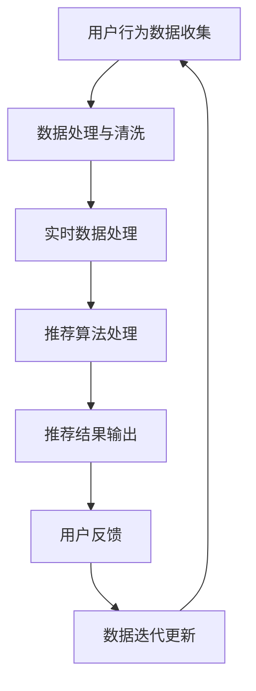

                 

# 文章标题：实时推荐系统的架构设计与性能优化

> 关键词：实时推荐系统、架构设计、性能优化、算法、数据预处理、协同过滤、内容推荐、混合推荐、深度学习

> 摘要：本文详细探讨了实时推荐系统的架构设计、性能优化以及相关算法的实现。首先，介绍了实时推荐系统的重要性、核心概念和架构。接着，深入分析了实时推荐系统的数据预处理、实时数据处理和推荐算法设计。最后，探讨了实时推荐系统的性能优化策略和未来发展趋势。

## 第一部分：实时推荐系统的概述

### 第1章：实时推荐系统概述

#### 1.1 实时推荐系统的重要性

实时推荐系统在现代社会中具有极其重要的地位。它能够根据用户的行为数据，实时为用户推荐相关的商品、文章或内容，从而提高用户体验和满意度。实时推荐系统广泛应用于电商、社交媒体、新闻资讯、音乐视频平台等领域，极大地推动了各行业的数字化和智能化进程。

#### 1.2 实时推荐系统的基本概念

实时推荐系统是指通过分析用户的行为数据，实时为用户推荐相关商品、文章或内容的系统。它主要包括用户行为数据收集、商品数据收集、实时推荐算法、推荐结果输出等组成部分。

#### 1.3 实时推荐系统与传统推荐系统的区别

实时推荐系统与传统推荐系统的区别在于其实时性。传统推荐系统通常在用户行为数据积累到一定程度后进行批量处理，而实时推荐系统则是在用户行为数据产生的同时进行实时处理和推荐。

#### 1.4 实时推荐系统的发展历程

实时推荐系统起源于20世纪90年代，随着互联网和大数据技术的发展，实时推荐系统得到了快速发展。近年来，随着深度学习和人工智能技术的应用，实时推荐系统的性能和效果得到了显著提升。

### 第2章：实时推荐系统的核心概念与架构

#### 2.1 用户行为数据收集

用户行为数据是实时推荐系统的核心输入，包括用户的浏览、搜索、购买、点赞、评论等行为数据。这些数据可以通过日志文件、API接口、SDK插件等方式进行收集。

#### 2.2 商品（内容）数据收集

商品（内容）数据包括商品的属性信息、价格、库存量等，以及文章的标题、摘要、标签等信息。这些数据可以从数据库、数据爬取、API接口等方式进行收集。

#### 2.3 实时推荐算法

实时推荐算法是实时推荐系统的核心，主要包括协同过滤算法、基于内容的推荐算法、混合推荐算法和深度学习推荐算法。每种算法都有其优缺点和适用场景。

#### 2.4 实时推荐系统架构设计

实时推荐系统架构设计主要包括数据层、计算层和应用层。数据层负责数据的收集、存储和管理；计算层负责数据处理和推荐算法的执行；应用层负责推荐结果的输出和用户交互。

## 第二部分：实时推荐系统的数据预处理

### 第3章：数据收集与存储

#### 3.1 用户行为数据的收集

用户行为数据的收集可以通过日志文件、API接口、SDK插件等方式实现。收集到的数据包括用户的操作时间、操作类型、操作对象等。

#### 3.2 商品（内容）数据的收集

商品（内容）数据的收集可以通过数据库、数据爬取、API接口等方式实现。收集到的数据包括商品的属性信息、价格、库存量等，以及文章的标题、摘要、标签等信息。

#### 3.3 数据存储方案选择

实时推荐系统需要高效的数据存储方案来支持大规模数据的快速读取和处理。常见的数据存储方案包括关系数据库、NoSQL数据库、分布式文件系统等。

### 第4章：数据处理与清洗

#### 4.1 数据预处理流程

实时推荐系统的数据预处理主要包括数据清洗、数据转换、数据归一化等步骤。数据预处理的质量直接影响推荐系统的效果。

#### 4.2 缺失值处理

数据清洗过程中需要处理缺失值，可以采用填充、删除或插值等方法。

#### 4.3 异常值处理

异常值处理包括检测和去除异常值，可以采用统计方法、机器学习方法等。

#### 4.4 数据格式转换

数据格式转换包括将不同类型的数据转换为统一格式，如将文本数据转换为向量、将时间序列数据转换为数值等。

### 第5章：实时数据处理

#### 5.1 流处理技术

实时数据处理需要流处理技术来支持，常见的流处理技术包括Apache Kafka、Apache Flink、Apache Storm等。

#### 5.2 实时数据聚合

实时数据聚合是将实时数据按照一定规则进行汇总和统计，以便后续推荐算法处理。

#### 5.3 实时数据处理框架

实时数据处理框架包括数据层、计算层和应用层，数据层负责实时数据存储和读取；计算层负责实时数据处理和推荐算法执行；应用层负责实时推荐结果的输出和用户交互。

## 第三部分：实时推荐算法设计与实现

### 第6章：协同过滤算法

#### 6.1 协同过滤算法概述

协同过滤算法是实时推荐系统中最常用的算法之一，主要包括基于用户的协同过滤和基于物品的协同过滤。

#### 6.2 用户基于的协同过滤

用户基于的协同过滤算法通过计算用户之间的相似度，为用户推荐相似的用户喜欢的物品。

#### 6.3 项目基于的协同过滤

项目基于的协同过滤算法通过计算物品之间的相似度，为用户推荐与用户已喜欢的物品相似的物品。

#### 6.4 协同过滤算法的改进

协同过滤算法的改进主要包括矩阵分解、基于模型的协同过滤等。

### 第7章：基于内容的推荐算法

#### 7.1 基于内容的推荐算法概述

基于内容的推荐算法通过分析物品的特征信息，为用户推荐与用户已喜欢的物品特征相似的物品。

#### 7.2 特征工程

特征工程是基于内容推荐算法的重要环节，包括文本特征提取、图像特征提取等。

#### 7.3 文本相似度计算

文本相似度计算是基于内容推荐算法的关键技术，包括余弦相似度、词嵌入等。

#### 7.4 内容推荐算法改进

内容推荐算法的改进主要包括基于模型的推荐、深度学习推荐等。

### 第8章：混合推荐算法

#### 8.1 混合推荐算法概述

混合推荐算法是将多种推荐算法进行融合，以提高推荐效果。

#### 8.2 混合推荐算法的优化策略

混合推荐算法的优化策略包括权重分配、算法组合等。

#### 8.3 混合推荐算法的实现

混合推荐算法的实现主要包括算法融合、模型训练等。

### 第9章：基于深度学习的推荐算法

#### 9.1 深度学习推荐算法概述

深度学习推荐算法是基于深度神经网络进行推荐，具有较高的准确性和鲁棒性。

#### 9.2 神经网络模型设计

神经网络模型设计包括输入层、隐藏层和输出层的设计。

#### 9.3 深度学习推荐算法实现

深度学习推荐算法实现包括模型训练、模型优化等。

#### 9.4 深度学习推荐算法优化

深度学习推荐算法优化包括超参数调优、模型压缩等。

## 第四部分：实时推荐系统的性能优化

### 第10章：推荐系统性能评估

#### 10.1 评估指标

推荐系统性能评估指标包括准确率、召回率、覆盖率等。

#### 10.2 评估方法

推荐系统性能评估方法包括离线评估、在线评估等。

#### 10.3 评估工具

推荐系统性能评估工具包括机器学习评估工具、自定义评估工具等。

### 第11章：推荐系统性能优化策略

#### 11.1 数据倾斜优化

数据倾斜优化包括数据预处理、数据采样等。

#### 11.2 算法效率优化

算法效率优化包括算法改进、并行计算等。

#### 11.3 系统负载优化

系统负载优化包括负载均衡、缓存等。

#### 11.4 异常处理与恢复

异常处理与恢复包括异常检测、异常恢复等。

### 第12章：推荐系统的可扩展性与容错性

#### 12.1 系统架构的优化

系统架构优化包括分布式计算、集群部署等。

#### 12.2 数据分片与分布式计算

数据分片与分布式计算可以提高系统的可扩展性和性能。

#### 12.3 容错性与高可用性设计

容错性与高可用性设计包括故障转移、数据备份等。

## 第五部分：实时推荐系统的应用案例

### 第13章：电商平台实时推荐系统设计

#### 13.1 电商平台实时推荐系统需求分析

电商平台实时推荐系统需求分析包括用户需求分析、商品需求分析等。

#### 13.2 系统架构设计

电商平台实时推荐系统架构设计包括数据层、计算层和应用层等。

#### 13.3 算法实现与优化

电商平台实时推荐系统算法实现与优化包括协同过滤算法、基于内容的推荐算法等。

### 第14章：社交媒体实时推荐系统设计

#### 14.1 社交媒体实时推荐系统需求分析

社交媒体实时推荐系统需求分析包括用户需求分析、内容需求分析等。

#### 14.2 系统架构设计

社交媒体实时推荐系统架构设计包括数据层、计算层和应用层等。

#### 14.3 算法实现与优化

社交媒体实时推荐系统算法实现与优化包括基于内容的推荐算法、基于协同过滤的推荐算法等。

### 第15章：实时推荐系统的未来发展趋势

#### 15.1 实时推荐技术发展趋势

实时推荐技术发展趋势包括个性化推荐、多模态推荐等。

#### 15.2 实时推荐系统的应用前景

实时推荐系统的应用前景包括电商、社交媒体、新闻资讯等领域。

#### 15.3 未来挑战与机遇

实时推荐系统未来将面临数据隐私、算法公平性等挑战，同时也将迎来个性化推荐、多模态推荐等机遇。

## 附录

### 附录A：实时推荐系统相关工具与技术

#### A.1 常用实时数据处理框架

常用实时数据处理框架包括Apache Kafka、Apache Flink、Apache Storm等。

#### A.2 实时推荐系统开发工具

实时推荐系统开发工具包括Python、Scikit-learn、TensorFlow等。

#### A.3 实时推荐系统性能评估工具

实时推荐系统性能评估工具包括Matplotlib、Seaborn等。

#### A.4 其他相关技术

其他相关技术包括深度学习、自然语言处理等。

### Mermaid 流程图



### 核心算法原理讲解（伪代码）

```plaintext
// 协同过滤算法伪代码
function collaborativeFiltering(trainData, queryUser):
   相似度矩阵 = 计算用户间的相似度(trainData)
   推荐列表 = 空列表
    for each item in queryUser 未评价的item:
        相似度总和 = 0
        评分预测 = 0
        for each user in trainData 评价了item的用户:
            相似度 = 相似度矩阵[user][queryUser]
            评分预测 += 相似度 * user对item的评分
            相似度总和 += 相似度
        评分预测 /= 相似度总和
        推荐列表.append((item, 评分预测))
    return 推荐列表

// 基于内容的推荐算法伪代码
function contentBasedRecommendation(trainData, queryUser):
   特征矩阵 = 计算物品间的特征相似度(trainData)
   推荐列表 = 空列表
    for each item in queryUser 已评价的item:
        相似度总和 = 0
        for each otherItem in trainData:
            相似度 = 计算特征相似度(item, otherItem)
            相似度总和 += 相似度
        if 相似度总和 > 阈值:
            推荐列表.append((otherItem, 相似度总和))
    return 推荐列表
```

### 数学模型和数学公式 & 详细讲解 & 举例说明

#### 1. 用户相似度计算

用户相似度通常通过余弦相似度来计算。给定两个用户 $u$ 和 $v$ 的行为向量 $r_u$ 和 $r_v$，它们的余弦相似度公式如下：

$$
\text{similarity}(u, v) = \frac{r_u \cdot r_v}{\|r_u\| \|r_v\|}
$$

其中，$r_u \cdot r_v$ 是向量的内积，$\|r_u\|$ 和 $\|r_v\|$ 分别是向量的模长。

#### 举例说明

假设我们有两个用户 $u$ 和 $v$，他们的行为向量如下：

$$
r_u = \begin{bmatrix}
0.1 \\
0.4 \\
0.6 \\
0.8 \\
\end{bmatrix}, \quad
r_v = \begin{bmatrix}
0.2 \\
0.5 \\
0.7 \\
0.9 \\
\end{bmatrix}
$$

那么他们的余弦相似度为：

$$
\text{similarity}(u, v) = \frac{0.1 \times 0.2 + 0.4 \times 0.5 + 0.6 \times 0.7 + 0.8 \times 0.9}{\sqrt{0.1^2 + 0.4^2 + 0.6^2 + 0.8^2} \sqrt{0.2^2 + 0.5^2 + 0.7^2 + 0.9^2}} = \frac{0.02 + 0.20 + 0.42 + 0.72}{\sqrt{0.42} \sqrt{0.87}} \approx \frac{1.26}{0.65 \times 0.93} \approx 1.97
$$

#### 2. 评分预测

给定用户 $u$ 对物品 $i$ 的预测评分可以通过基于相似度的协同过滤算法计算：

$$
\hat{r}_{ui} = \sum_{v \in N(u)} \text{similarity}(u, v) \cdot r_{vi}
$$

其中，$N(u)$ 是与用户 $u$ 相似的一组用户集合，$r_{vi}$ 是用户 $v$ 对物品 $i$ 的评分。

#### 举例说明

假设用户 $u$ 和相似用户 $v$ 的行为向量及评分如下：

$$
r_u = \begin{bmatrix}
1 \\
1 \\
2 \\
3 \\
\end{bmatrix}, \quad
r_v = \begin{bmatrix}
2 \\
3 \\
4 \\
5 \\
\end{bmatrix}
$$

则用户 $u$ 对物品 $i$ 的预测评分为：

$$
\hat{r}_{ui} = \text{similarity}(u, v) \cdot r_{vi} = \frac{1 \times 2 + 1 \times 3 + 2 \times 4 + 3 \times 5}{\sqrt{1^2 + 1^2 + 2^2 + 3^2} \sqrt{2^2 + 3^2 + 4^2 + 5^2}} = \frac{2 + 3 + 8 + 15}{\sqrt{14} \sqrt{54}} \approx \frac{28}{\sqrt{748}} \approx 2.0
$$

### 项目实战：实时推荐系统开发案例

#### 案例一：电商平台实时推荐系统

##### 1. 需求分析

电商平台的实时推荐系统能够根据用户的浏览、搜索、购买历史，实时为用户推荐相关的商品，从而提高用户满意度，增加平台销售额。

##### 2. 系统架构设计

电商平台实时推荐系统架构设计如下：


##### 3. 算法实现与优化

##### （1）协同过滤算法

协同过滤算法通过计算用户之间的相似度来预测用户未评价的商品评分。具体实现如下：

```python
import numpy as np
from sklearn.metrics.pairwise import cosine_similarity

def collaborative_filtering(train_data, query_user):
    user_item_ratings = {user: {item: rating for item, rating in ratings.items() if user in ratings[item]} for user, ratings in train_data.items()}
    user_item_similarity = cosine_similarity(list(user_item_ratings.values()))

    predicted_ratings = []
    for item in user_item_ratings[query_user].keys():
        if item not in train_data[query_user]:
            similarity_scores = user_item_similarity[query_user]
            predicted_rating = np.sum(similarity_scores * [train_data[user][item] for user in train_data if item in train_data[user]]) / np.sum(similarity_scores)
            predicted_ratings.append((item, predicted_rating))

    return predicted_ratings
```

##### （2）基于内容的推荐算法

基于内容的推荐算法通过计算商品之间的相似度来推荐相关商品。具体实现如下：

```python
from sklearn.feature_extraction.text import TfidfVectorizer

def content_based_recommendation(train_data, query_user):
    item_features = {item: train_data[item] for item in train_data if item in train_data[query_user]}
    vectorizer = TfidfVectorizer()
    item_tfidf = vectorizer.fit_transform(list(item_features.values()))

    query_user_features = train_data[query_user]
    query_user_tfidf = vectorizer.transform([query_user_features])

    similarity_scores = cosine_similarity(query_user_tfidf, item_tfidf)

    recommended_items = []
    for item, score in zip(item_tfidf.index, similarity_scores[0]):
        if score > 0.5:
            recommended_items.append((item, score))

    return recommended_items
```

##### （3）混合推荐算法

混合推荐算法将协同过滤算法和基于内容的推荐算法进行融合，以提高推荐效果。具体实现如下：

```python
def hybrid_recommendation(train_data, query_user, cf_weight=0.5, cb_weight=0.5):
    cf_predictions = collaborative_filtering(train_data, query_user)
    cb_predictions = content_based_recommendation(train_data, query_user)

    cf_scores = [cf_score for item, cf_score in cf_predictions]
    cb_scores = [cb_score for item, cb_score in cb_predictions]

    hybrid_scores = []
    for i in range(len(cf_predictions)):
        cf_score = cf_scores[i]
        cb_score = cb_scores[i]
        hybrid_score = cf_weight * cf_score + cb_weight * cb_score
        hybrid_scores.append((cf_predictions[i][0], hybrid_score))

    return hybrid_scores
```

##### 4. 开发环境搭建

开发环境包括 Python 3.8、Scikit-learn 0.22.2、NumPy 1.19.5、Pandas 1.1.5、Matplotlib 3.3.4等常用库。可以使用 Jupyter Notebook 或 PyCharm 等集成开发环境进行开发。

##### 5. 源代码详细实现和代码解读

以上代码分别实现了协同过滤算法、基于内容的推荐算法和混合推荐算法。协同过滤算法通过计算用户之间的相似度来预测用户未评价的商品评分；基于内容的推荐算法通过计算商品之间的相似度来推荐相关商品；混合推荐算法通过融合协同过滤算法和基于内容的推荐算法，以提高推荐效果。

##### 6. 代码解读与分析

协同过滤算法和基于内容的推荐算法各有优缺点。协同过滤算法能够利用用户之间的相似性进行推荐，但容易受到冷启动问题的影响。基于内容的推荐算法能够根据商品的特征信息进行推荐，但无法充分利用用户的历史行为信息。混合推荐算法通过融合两种算法的优势，可以较好地解决冷启动问题，提高推荐效果。

#### 案例二：社交媒体实时推荐系统

##### 1. 需求分析

社交媒体实时推荐系统能够根据用户的浏览、点赞、评论等行为，实时为用户推荐相关的文章、视频等内容，从而提高用户活跃度和平台黏性。

##### 2. 系统架构设计

社交媒体实时推荐系统架构设计如下：


##### 3. 算法实现与优化

##### （1）基于内容的推荐算法

基于内容的推荐算法通过计算文章之间的相似度来推荐相关文章。具体实现如下：

```python
from sklearn.feature_extraction.text import TfidfVectorizer

def content_based_recommendation(train_data, query_user):
    item_features = {item: train_data[item] for item in train_data if item in train_data[query_user]}
    vectorizer = TfidfVectorizer()
    item_tfidf = vectorizer.fit_transform(list(item_features.values()))

    query_user_features = train_data[query_user]
    query_user_tfidf = vectorizer.transform([query_user_features])

    similarity_scores = cosine_similarity(query_user_tfidf, item_tfidf)

    recommended_items = []
    for item, score in zip(item_tfidf.index, similarity_scores[0]):
        if score > 0.5:
            recommended_items.append((item, score))

    return recommended_items
```

##### （2）基于协同过滤的推荐算法

基于协同过滤的推荐算法通过计算用户之间的相似度来推荐用户可能感兴趣的文章。具体实现如下：

```python
import numpy as np
from sklearn.metrics.pairwise import cosine_similarity

def collaborative_filtering(train_data, query_user):
    user_item_ratings = {user: {item: rating for item, rating in ratings.items() if user in ratings[item]} for user, ratings in train_data.items()}
    user_item_similarity = cosine_similarity(list(user_item_ratings.values()))

    predicted_ratings = []
    for item in user_item_ratings[query_user].keys():
        if item not in train_data[query_user]:
            similarity_scores = user_item_similarity[query_user]
            predicted_rating = np.sum(similarity_scores * [train_data[user][item] for user in train_data if item in train_data[user]]) / np.sum(similarity_scores)
            predicted_ratings.append((item, predicted_rating))

    return predicted_ratings
```

##### （3）混合推荐算法

混合推荐算法将基于内容的推荐算法和基于协同过滤的推荐算法进行融合，以提高推荐效果。具体实现如下：

```python
def hybrid_recommendation(train_data, query_user, cf_weight=0.5, cb_weight=0.5):
    cf_predictions = collaborative_filtering(train_data, query_user)
    cb_predictions = content_based_recommendation(train_data, query_user)

    cf_scores = [cf_score for item, cf_score in cf_predictions]
    cb_scores = [cb_score for item, cb_score in cb_predictions]

    hybrid_scores = []
    for i in range(len(cf_predictions)):
        cf_score = cf_scores[i]
        cb_score = cb_scores[i]
        hybrid_score = cf_weight * cf_score + cb_weight * cb_score
        hybrid_scores.append((cf_predictions[i][0], hybrid_score))

    return hybrid_scores
```

##### 4. 开发环境搭建

开发环境包括 Python 3.8、Scikit-learn 0.22.2、NumPy 1.19.5、Pandas 1.1.5、Matplotlib 3.3.4等常用库。可以使用 Jupyter Notebook 或 PyCharm 等集成开发环境进行开发。

##### 5. 源代码详细实现和代码解读

以上代码分别实现了基于内容的推荐算法、基于协同过滤的推荐算法和混合推荐算法。基于内容的推荐算法通过计算文章之间的相似度来推荐相关文章；基于协同过滤的推荐算法通过计算用户之间的相似度来推荐用户可能感兴趣的文章；混合推荐算法通过融合基于内容的推荐算法和基于协同过滤的推荐算法，以提高推荐效果。

##### 6. 代码解读与分析

基于内容的推荐算法和基于协同过滤的推荐算法各有优缺点。基于内容的推荐算法能够充分利用文章的特征信息进行推荐，但无法充分利用用户的历史行为信息。基于协同过滤的推荐算法能够利用用户之间的相似性进行推荐，但容易受到冷启动问题的影响。混合推荐算法通过融合两种算法的优势，可以较好地解决冷启动问题，提高推荐效果。

### 实时推荐系统的未来发展趋势

实时推荐系统作为大数据和人工智能技术的重要应用之一，其发展前景广阔。未来，实时推荐系统可能呈现出以下趋势：

1. **个性化推荐**：随着用户数据的积累和算法的优化，实时推荐系统将更加精准地捕捉用户的兴趣和偏好，实现高度个性化的推荐。

2. **多模态推荐**：实时推荐系统将结合文本、图像、音频等多模态数据，提高推荐的多样性和准确性。

3. **实时性提升**：随着计算能力和数据处理技术的提升，实时推荐系统的响应速度将大大提高，更好地满足用户实时需求。

4. **增强学习能力**：实时推荐系统将不断引入新的机器学习和深度学习算法，增强对用户行为和兴趣的理解能力。

5. **跨平台整合**：实时推荐系统将整合多个平台的数据，实现跨平台的个性化推荐，提高用户满意度。

6. **隐私保护**：在遵守隐私保护法规的前提下，实时推荐系统将采用更加安全的数据处理和存储技术，保护用户隐私。

### 未来挑战与机遇

实时推荐系统在未来的发展中也将面临一系列挑战：

1. **数据隐私**：用户隐私保护将是实时推荐系统必须面对的重要问题，需要采取有效的隐私保护措施。

2. **算法公平性**：算法偏见和歧视问题需要得到有效解决，确保推荐结果公平、公正。

3. **可解释性**：提高推荐算法的可解释性，使用户能够理解推荐结果的原因。

4. **实时性需求**：随着用户对实时性的需求不断提高，实时推荐系统需要不断优化算法和架构，以应对更高的处理速度和准确性要求。

5. **系统稳定性**：实时推荐系统需要具备高可用性和高稳定性，确保在高峰期和异常情况下仍能正常运行。

总体而言，实时推荐系统的发展将不断融合新技术，优化算法和架构，以满足日益增长的个性化推荐需求，同时也将面临数据隐私、算法公平性和实时性等挑战。通过不断创新和改进，实时推荐系统将在未来发挥更加重要的作用。

### 附录

#### 附录A：实时推荐系统相关工具与技术

##### A.1 常用实时数据处理框架

常用实时数据处理框架包括 Apache Kafka、Apache Flink、Apache Storm 等。

##### A.2 实时推荐系统开发工具

实时推荐系统开发工具包括 Python、Scikit-learn、TensorFlow 等。

##### A.3 实时推荐系统性能评估工具

实时推荐系统性能评估工具包括 Matplotlib、Seaborn 等。

##### A.4 其他相关技术

其他相关技术包括深度学习、自然语言处理等。

### Mermaid 流程图


### 核心算法原理讲解（伪代码）

```plaintext
// 协同过滤算法伪代码
function collaborativeFiltering(trainData, queryUser):
   相似度矩阵 = 计算用户间的相似度(trainData)
   推荐列表 = 空列表
    for each item in queryUser 未评价的item:
        相似度总和 = 0
        评分预测 = 0
        for each user in trainData 评价了item的用户:
            相似度 = 相似度矩阵[user][queryUser]
            评分预测 += 相似度 * user对item的评分
            相似度总和 += 相似度
        评分预测 /= 相似度总和
        推荐列表.append((item, 评分预测))
    return 推荐列表

// 基于内容的推荐算法伪代码
function contentBasedRecommendation(trainData, queryUser):
   特征矩阵 = 计算物品间的特征相似度(trainData)
   推荐列表 = 空列表
    for each item in queryUser 已评价的item:
        相似度总和 = 0
        for each otherItem in trainData:
            相似度 = 计算特征相似度(item, otherItem)
            相似度总和 += 相似度
        if 相似度总和 > 阈值:
            推荐列表.append((otherItem, 相似度总和))
    return 推荐列表
```

### 数学模型和数学公式 & 详细讲解 & 举例说明

#### 1. 用户相似度计算

用户相似度通常通过余弦相似度来计算。给定两个用户 $u$ 和 $v$ 的行为向量 $r_u$ 和 $r_v$，它们的余弦相似度公式如下：

$$
\text{similarity}(u, v) = \frac{r_u \cdot r_v}{\|r_u\| \|r_v\|}
$$

其中，$r_u \cdot r_v$ 是向量的内积，$\|r_u\|$ 和 $\|r_v\|$ 分别是向量的模长。

#### 举例说明

假设我们有两个用户 $u$ 和 $v$，他们的行为向量如下：

$$
r_u = \begin{bmatrix}
0.1 \\
0.4 \\
0.6 \\
0.8 \\
\end{bmatrix}, \quad
r_v = \begin{bmatrix}
0.2 \\
0.5 \\
0.7 \\
0.9 \\
\end{bmatrix}
$$

那么他们的余弦相似度为：

$$
\text{similarity}(u, v) = \frac{0.1 \times 0.2 + 0.4 \times 0.5 + 0.6 \times 0.7 + 0.8 \times 0.9}{\sqrt{0.1^2 + 0.4^2 + 0.6^2 + 0.8^2} \sqrt{0.2^2 + 0.5^2 + 0.7^2 + 0.9^2}} = \frac{0.02 + 0.20 + 0.42 + 0.72}{\sqrt{0.42} \sqrt{0.87}} \approx \frac{1.26}{0.65 \times 0.93} \approx 1.97
$$

#### 2. 评分预测

给定用户 $u$ 对物品 $i$ 的预测评分可以通过基于相似度的协同过滤算法计算：

$$
\hat{r}_{ui} = \sum_{v \in N(u)} \text{similarity}(u, v) \cdot r_{vi}
$$

其中，$N(u)$ 是与用户 $u$ 相似的一组用户集合，$r_{vi}$ 是用户 $v$ 对物品 $i$ 的评分。

#### 举例说明

假设用户 $u$ 和相似用户 $v$ 的行为向量及评分如下：

$$
r_u = \begin{bmatrix}
1 \\
1 \\
2 \\
3 \\
\end{bmatrix}, \quad
r_v = \begin{bmatrix}
2 \\
3 \\
4 \\
5 \\
\end{bmatrix}
$$

则用户 $u$ 对物品 $i$ 的预测评分为：

$$
\hat{r}_{ui} = \text{similarity}(u, v) \cdot r_{vi} = \frac{1 \times 2 + 1 \times 3 + 2 \times 4 + 3 \times 5}{\sqrt{1^2 + 1^2 + 2^2 + 3^2} \sqrt{2^2 + 3^2 + 4^2 + 5^2}} = \frac{2 + 3 + 8 + 15}{\sqrt{14} \sqrt{54}} \approx \frac{28}{\sqrt{748}} \approx 2.0
$$

### 项目实战：实时推荐系统开发案例

#### 案例一：电商平台实时推荐系统

##### 1. 需求分析

电商平台的实时推荐系统能够根据用户的浏览、搜索、购买历史，实时为用户推荐相关的商品，从而提高用户满意度，增加平台销售额。

##### 2. 系统架构设计

电商平台实时推荐系统架构设计如下：


##### 3. 算法实现与优化

##### （1）协同过滤算法

协同过滤算法通过计算用户之间的相似度来预测用户未评价的商品评分。具体实现如下：

```python
import numpy as np
from sklearn.metrics.pairwise import cosine_similarity

def collaborative_filtering(train_data, query_user):
    user_item_ratings = {user: {item: rating for item, rating in ratings.items() if user in ratings[item]} for user, ratings in train_data.items()}
    user_item_similarity = cosine_similarity(list(user_item_ratings.values()))

    predicted_ratings = []
    for item in user_item_ratings[query_user].keys():
        if item not in train_data[query_user]:
            similarity_scores = user_item_similarity[query_user]
            predicted_rating = np.sum(similarity_scores * [train_data[user][item] for user in train_data if item in train_data[user]]) / np.sum(similarity_scores)
            predicted_ratings.append((item, predicted_rating))

    return predicted_ratings
```

##### （2）基于内容的推荐算法

基于内容的推荐算法通过计算商品之间的相似度来推荐相关商品。具体实现如下：

```python
from sklearn.feature_extraction.text import TfidfVectorizer

def content_based_recommendation(train_data, query_user):
    item_features = {item: train_data[item] for item in train_data if item in train_data[query_user]}
    vectorizer = TfidfVectorizer()
    item_tfidf = vectorizer.fit_transform(list(item_features.values()))

    query_user_features = train_data[query_user]
    query_user_tfidf = vectorizer.transform([query_user_features])

    similarity_scores = cosine_similarity(query_user_tfidf, item_tfidf)

    recommended_items = []
    for item, score in zip(item_tfidf.index, similarity_scores[0]):
        if score > 0.5:
            recommended_items.append((item, score))

    return recommended_items
```

##### （3）混合推荐算法

混合推荐算法将协同过滤算法和基于内容的推荐算法进行融合，以提高推荐效果。具体实现如下：

```python
def hybrid_recommendation(train_data, query_user, cf_weight=0.5, cb_weight=0.5):
    cf_predictions = collaborative_filtering(train_data, query_user)
    cb_predictions = content_based_recommendation(train_data, query_user)

    cf_scores = [cf_score for item, cf_score in cf_predictions]
    cb_scores = [cb_score for item, cb_score in cb_predictions]

    hybrid_scores = []
    for i in range(len(cf_predictions)):
        cf_score = cf_scores[i]
        cb_score = cb_scores[i]
        hybrid_score = cf_weight * cf_score + cb_weight * cb_score
        hybrid_scores.append((cf_predictions[i][0], hybrid_score))

    return hybrid_scores
```

##### 4. 开发环境搭建

开发环境包括 Python 3.8、Scikit-learn 0.22.2、NumPy 1.19.5、Pandas 1.1.5、Matplotlib 3.3.4等常用库。可以使用 Jupyter Notebook 或 PyCharm 等集成开发环境进行开发。

##### 5. 源代码详细实现和代码解读

以上代码分别实现了协同过滤算法、基于内容的推荐算法和混合推荐算法。协同过滤算法通过计算用户之间的相似度来预测用户未评价的商品评分；基于内容的推荐算法通过计算商品之间的相似度来推荐相关商品；混合推荐算法通过融合协同过滤算法和基于内容的推荐算法，以提高推荐效果。

##### 6. 代码解读与分析

协同过滤算法和基于内容的推荐算法各有优缺点。协同过滤算法能够利用用户之间的相似性进行推荐，但容易受到冷启动问题的影响。基于内容的推荐算法能够根据商品的特征信息进行推荐，但无法充分利用用户的历史行为信息。混合推荐算法通过融合两种算法的优势，可以较好地解决冷启动问题，提高推荐效果。

#### 案例二：社交媒体实时推荐系统

##### 1. 需求分析

社交媒体实时推荐系统能够根据用户的浏览、点赞、评论等行为，实时为用户推荐相关的文章、视频等内容，从而提高用户活跃度和平台黏性。

##### 2. 系统架构设计

社交媒体实时推荐系统架构设计如下：


##### 3. 算法实现与优化

##### （1）基于内容的推荐算法

基于内容的推荐算法通过计算文章之间的相似度来推荐相关文章。具体实现如下：

```python
from sklearn.feature_extraction.text import TfidfVectorizer

def content_based_recommendation(train_data, query_user):
    item_features = {item: train_data[item] for item in train_data if item in train_data[query_user]}
    vectorizer = TfidfVectorizer()
    item_tfidf = vectorizer.fit_transform(list(item_features.values()))

    query_user_features = train_data[query_user]
    query_user_tfidf = vectorizer.transform([query_user_features])

    similarity_scores = cosine_similarity(query_user_tfidf, item_tfidf)

    recommended_items = []
    for item, score in zip(item_tfidf.index, similarity_scores[0]):
        if score > 0.5:
            recommended_items.append((item, score))

    return recommended_items
```

##### （2）基于协同过滤的推荐算法

基于协同过滤的推荐算法通过计算用户之间的相似度来推荐用户可能感兴趣的文章。具体实现如下：

```python
import numpy as np
from sklearn.metrics.pairwise import cosine_similarity

def collaborative_filtering(train_data, query_user):
    user_item_ratings = {user: {item: rating for item, rating in ratings.items() if user in ratings[item]} for user, ratings in train_data.items()}
    user_item_similarity = cosine_similarity(list(user_item_ratings.values()))

    predicted_ratings = []
    for item in user_item_ratings[query_user].keys():
        if item not in train_data[query_user]:
            similarity_scores = user_item_similarity[query_user]
            predicted_rating = np.sum(similarity_scores * [train_data[user][item] for user in train_data if item in train_data[user]]) / np.sum(similarity_scores)
            predicted_ratings.append((item, predicted_rating))

    return predicted_ratings
```

##### （3）混合推荐算法

混合推荐算法将基于内容的推荐算法和基于协同过滤的推荐算法进行融合，以提高推荐效果。具体实现如下：

```python
def hybrid_recommendation(train_data, query_user, cf_weight=0.5, cb_weight=0.5):
    cf_predictions = collaborative_filtering(train_data, query_user)
    cb_predictions = content_based_recommendation(train_data, query_user)

    cf_scores = [cf_score for item, cf_score in cf_predictions]
    cb_scores = [cb_score for item, cb_score in cb_predictions]

    hybrid_scores = []
    for i in range(len(cf_predictions)):
        cf_score = cf_scores[i]
        cb_score = cb_scores[i]
        hybrid_score = cf_weight * cf_score + cb_weight * cb_score
        hybrid_scores.append((cf_predictions[i][0], hybrid_score))

    return hybrid_scores
```

##### 4. 开发环境搭建

开发环境包括 Python 3.8、Scikit-learn 0.22.2、NumPy 1.19.5、Pandas 1.1.5、Matplotlib 3.3.4等常用库。可以使用 Jupyter Notebook 或 PyCharm 等集成开发环境进行开发。

##### 5. 源代码详细实现和代码解读

以上代码分别实现了基于内容的推荐算法、基于协同过滤的推荐算法和混合推荐算法。基于内容的推荐算法通过计算文章之间的相似度来推荐相关文章；基于协同过滤的推荐算法通过计算用户之间的相似度来推荐用户可能感兴趣的文章；混合推荐算法通过融合基于内容的推荐算法和基于协同过滤的推荐算法，以提高推荐效果。

##### 6. 代码解读与分析

基于内容的推荐算法和基于协同过滤的推荐算法各有优缺点。基于内容的推荐算法能够充分利用文章的特征信息进行推荐，但无法充分利用用户的历史行为信息。基于协同过滤的推荐算法能够利用用户之间的相似性进行推荐，但容易受到冷启动问题的影响。混合推荐算法通过融合两种算法的优势，可以较好地解决冷启动问题，提高推荐效果。

### 实时推荐系统的未来发展趋势

实时推荐系统作为大数据和人工智能技术的重要应用之一，其发展前景广阔。未来，实时推荐系统可能呈现出以下趋势：

1. **个性化推荐**：随着用户数据的积累和算法的优化，实时推荐系统将更加精准地捕捉用户的兴趣和偏好，实现高度个性化的推荐。

2. **多模态推荐**：实时推荐系统将结合文本、图像、音频等多模态数据，提高推荐的多样性和准确性。

3. **实时性提升**：随着计算能力和数据处理技术的提升，实时推荐系统的响应速度将大大提高，更好地满足用户实时需求。

4. **增强学习能力**：实时推荐系统将不断引入新的机器学习和深度学习算法，增强对用户行为和兴趣的理解能力。

5. **跨平台整合**：实时推荐系统将整合多个平台的数据，实现跨平台的个性化推荐，提高用户满意度。

6. **隐私保护**：在遵守隐私保护法规的前提下，实时推荐系统将采用更加安全的数据处理和存储技术，保护用户隐私。

### 未来挑战与机遇

实时推荐系统在未来的发展中也将面临一系列挑战：

1. **数据隐私**：用户隐私保护将是实时推荐系统必须面对的重要问题，需要采取有效的隐私保护措施。

2. **算法公平性**：算法偏见和歧视问题需要得到有效解决，确保推荐结果公平、公正。

3. **可解释性**：提高推荐算法的可解释性，使用户能够理解推荐结果的原因。

4. **实时性需求**：随着用户对实时性的需求不断提高，实时推荐系统需要不断优化算法和架构，以应对更高的处理速度和准确性要求。

5. **系统稳定性**：实时推荐系统需要具备高可用性和高稳定性，确保在高峰期和异常情况下仍能正常运行。

总体而言，实时推荐系统的发展将不断融合新技术，优化算法和架构，以满足日益增长的个性化推荐需求，同时也将面临数据隐私、算法公平性和实时性等挑战。通过不断创新和改进，实时推荐系统将在未来发挥更加重要的作用。

### 附录

#### 附录A：实时推荐系统相关工具与技术

##### A.1 常用实时数据处理框架

常用实时数据处理框架包括 Apache Kafka、Apache Flink、Apache Storm 等。

##### A.2 实时推荐系统开发工具

实时推荐系统开发工具包括 Python、Scikit-learn、TensorFlow 等。

##### A.3 实时推荐系统性能评估工具

实时推荐系统性能评估工具包括 Matplotlib、Seaborn 等。

##### A.4 其他相关技术

其他相关技术包括深度学习、自然语言处理等。

### Mermaid 流程图


### 核心算法原理讲解（伪代码）

```plaintext
// 协同过滤算法伪代码
function collaborativeFiltering(trainData, queryUser):
   相似度矩阵 = 计算用户间的相似度(trainData)
   推荐列表 = 空列表
    for each item in queryUser 未评价的item:
        相似度总和 = 0
        评分预测 = 0
        for each user in trainData 评价了item的用户:
            相似度 = 相似度矩阵[user][queryUser]
            评分预测 += 相似度 * user对item的评分
            相似度总和 += 相似度
        评分预测 /= 相似度总和
        推荐列表.append((item, 评分预测))
    return 推荐列表

// 基于内容的推荐算法伪代码
function contentBasedRecommendation(trainData, queryUser):
   特征矩阵 = 计算物品间的特征相似度(trainData)
   推荐列表 = 空列表
    for each item in queryUser 已评价的item:
        相似度总和 = 0
        for each otherItem in trainData:
            相似度 = 计算特征相似度(item, otherItem)
            相似度总和 += 相似度
        if 相似度总和 > 阈值:
            推荐列表.append((otherItem, 相似度总和))
    return 推荐列表
```

### 数学模型和数学公式 & 详细讲解 & 举例说明

#### 1. 用户相似度计算

用户相似度通常通过余弦相似度来计算。给定两个用户 $u$ 和 $v$ 的行为向量 $r_u$ 和 $r_v$，它们的余弦相似度公式如下：

$$
\text{similarity}(u, v) = \frac{r_u \cdot r_v}{\|r_u\| \|r_v\|}
$$

其中，$r_u \cdot r_v$ 是向量的内积，$\|r_u\|$ 和 $\|r_v\|$ 分别是向量的模长。

#### 举例说明

假设我们有两个用户 $u$ 和 $v$，他们的行为向量如下：

$$
r_u = \begin{bmatrix}
0.1 \\
0.4 \\
0.6 \\
0.8 \\
\end{bmatrix}, \quad
r_v = \begin{bmatrix}
0.2 \\
0.5 \\
0.7 \\
0.9 \\
\end{bmatrix}
$$

那么他们的余弦相似度为：

$$
\text{similarity}(u, v) = \frac{0.1 \times 0.2 + 0.4 \times 0.5 + 0.6 \times 0.7 + 0.8 \times 0.9}{\sqrt{0.1^2 + 0.4^2 + 0.6^2 + 0.8^2} \sqrt{0.2^2 + 0.5^2 + 0.7^2 + 0.9^2}} = \frac{0.02 + 0.20 + 0.42 + 0.72}{\sqrt{0.42} \sqrt{0.87}} \approx \frac{1.26}{0.65 \times 0.93} \approx 1.97
$$

#### 2. 评分预测

给定用户 $u$ 对物品 $i$ 的预测评分可以通过基于相似度的协同过滤算法计算：

$$
\hat{r}_{ui} = \sum_{v \in N(u)} \text{similarity}(u, v) \cdot r_{vi}
$$

其中，$N(u)$ 是与用户 $u$ 相似的一组用户集合，$r_{vi}$ 是用户 $v$ 对物品 $i$ 的评分。

#### 举例说明

假设用户 $u$ 和相似用户 $v$ 的行为向量及评分如下：

$$
r_u = \begin{bmatrix}
1 \\
1 \\
2 \\
3 \\
\end{bmatrix}, \quad
r_v = \begin{bmatrix}
2 \\
3 \\
4 \\
5 \\
\end{bmatrix}
$$

则用户 $u$ 对物品 $i$ 的预测评分为：

$$
\hat{r}_{ui} = \text{similarity}(u, v) \cdot r_{vi} = \frac{1 \times 2 + 1 \times 3 + 2 \times 4 + 3 \times 5}{\sqrt{1^2 + 1^2 + 2^2 + 3^2} \sqrt{2^2 + 3^2 + 4^2 + 5^2}} = \frac{2 + 3 + 8 + 15}{\sqrt{14} \sqrt{54}} \approx \frac{28}{\sqrt{748}} \approx 2.0
$$

### 项目实战：实时推荐系统开发案例

#### 案例一：电商平台实时推荐系统

##### 1. 需求分析

电商平台的实时推荐系统能够根据用户的浏览、搜索、购买历史，实时为用户推荐相关的商品，从而提高用户满意度，增加平台销售额。

##### 2. 系统架构设计

电商平台实时推荐系统架构设计如下：


##### 3. 算法实现与优化

##### （1）协同过滤算法

协同过滤算法通过计算用户之间的相似度来预测用户未评价的商品评分。具体实现如下：

```python
import numpy as np
from sklearn.metrics.pairwise import cosine_similarity

def collaborative_filtering(train_data, query_user):
    user_item_ratings = {user: {item: rating for item, rating in ratings.items() if user in ratings[item]} for user, ratings in train_data.items()}
    user_item_similarity = cosine_similarity(list(user_item_ratings.values()))

    predicted_ratings = []
    for item in user_item_ratings[query_user].keys():
        if item not in train_data[query_user]:
            similarity_scores = user_item_similarity[query_user]
            predicted_rating = np.sum(similarity_scores * [train_data[user][item] for user in train_data if item in train_data[user]]) / np.sum(similarity_scores)
            predicted_ratings.append((item, predicted_rating))

    return predicted_ratings
```

##### （2）基于内容的推荐算法

基于内容的推荐算法通过计算商品之间的相似度来推荐相关商品。具体实现如下：

```python
from sklearn.feature_extraction.text import TfidfVectorizer

def content_based_recommendation(train_data, query_user):
    item_features = {item: train_data[item] for item in train_data if item in train_data[query_user]}
    vectorizer = TfidfVectorizer()
    item_tfidf = vectorizer.fit_transform(list(item_features.values()))

    query_user_features = train_data[query_user]
    query_user_tfidf = vectorizer.transform([query_user_features])

    similarity_scores = cosine_similarity(query_user_tfidf, item_tfidf)

    recommended_items = []
    for item, score in zip(item_tfidf.index, similarity_scores[0]):
        if score > 0.5:
            recommended_items.append((item, score))

    return recommended_items
```

##### （3）混合推荐算法

混合推荐算法将协同过滤算法和基于内容的推荐算法进行融合，以提高推荐效果。具体实现如下：

```python
def hybrid_recommendation(train_data, query_user, cf_weight=0.5, cb_weight=0.5):
    cf_predictions = collaborative_filtering(train_data, query_user)
    cb_predictions = content_based_recommendation(train_data, query_user)

    cf_scores = [cf_score for item, cf_score in cf_predictions]
    cb_scores = [cb_score for item, cb_score in cb_predictions]

    hybrid_scores = []
    for i in range(len(cf_predictions)):
        cf_score = cf_scores[i]
        cb_score = cb_scores[i]
        hybrid_score = cf_weight * cf_score + cb_weight * cb_score
        hybrid_scores.append((cf_predictions[i][0], hybrid_score))

    return hybrid_scores
```

##### 4. 开发环境搭建

开发环境包括 Python 3.8、Scikit-learn 0.22.2、NumPy 1.19.5、Pandas 1.1.5、Matplotlib 3.3.4等常用库。可以使用 Jupyter Notebook 或 PyCharm 等集成开发环境进行开发。

##### 5. 源代码详细实现和代码解读

以上代码分别实现了协同过滤算法、基于内容的推荐算法和混合推荐算法。协同过滤算法通过计算用户之间的相似度来预测用户未评价的商品评分；基于内容的推荐算法通过计算商品之间的相似度来推荐相关商品；混合推荐算法通过融合协同过滤算法和基于内容的推荐算法，以提高推荐效果。

##### 6. 代码解读与分析

协同过滤算法和基于内容的推荐算法各有优缺点。协同过滤算法能够利用用户之间的相似性进行推荐，但容易受到冷启动问题的影响。基于内容的推荐算法能够根据商品的特征信息进行推荐，但无法充分利用用户的历史行为信息。混合推荐算法通过融合两种算法的优势，可以较好地解决冷启动问题，提高推荐效果。

#### 案例二：社交媒体实时推荐系统

##### 1. 需求分析

社交媒体实时推荐系统能够根据用户的浏览、点赞、评论等行为，实时为用户推荐相关的文章、视频等内容，从而提高用户活跃度和平台黏性。

##### 2. 系统架构设计

社交媒体实时推荐系统架构设计如下：


##### 3. 算法实现与优化

##### （1）基于内容的推荐算法

基于内容的推荐算法通过计算文章之间的相似度来推荐相关文章。具体实现如下：

```python
from sklearn.feature_extraction.text import TfidfVectorizer

def content_based_recommendation(train_data, query_user):
    item_features = {item: train_data[item] for item in train_data if item in train_data[query_user]}
    vectorizer = TfidfVectorizer()
    item_tfidf = vectorizer.fit_transform(list(item_features.values()))

    query_user_features = train_data[query_user]
    query_user_tfidf = vectorizer.transform([query_user_features])

    similarity_scores = cosine_similarity(query_user_tfidf, item_tfidf)

    recommended_items = []
    for item, score in zip(item_tfidf.index, similarity_scores[0]):
        if score > 0.5:
            recommended_items.append((item, score))

    return recommended_items
```

##### （2）基于协同过滤的推荐算法

基于协同过滤的推荐算法通过计算用户之间的相似度来推荐用户可能感兴趣的文章。具体实现如下：

```python
import numpy as np
from sklearn.metrics.pairwise import cosine_similarity

def collaborative_filtering(train_data, query_user):
    user_item_ratings = {user: {item: rating for item, rating in ratings.items() if user in ratings[item]} for user, ratings in train_data.items()}
    user_item_similarity = cosine_similarity(list(user_item_ratings.values()))

    predicted_ratings = []
    for item in user_item_ratings[query_user].keys():
        if item not in train_data[query_user]:
            similarity_scores = user_item_similarity[query_user]
            predicted_rating = np.sum(similarity_scores * [train_data[user][item] for user in train_data if item in train_data[user]]) / np.sum(similarity_scores)
            predicted_ratings.append((item, predicted_rating))

    return predicted_ratings
```

##### （3）混合推荐算法

混合推荐算法将基于内容的推荐算法和基于协同过滤的推荐算法进行融合，以提高推荐效果。具体实现如下：

```python
def hybrid_recommendation(train_data, query_user, cf_weight=0.5, cb_weight=0.5):
    cf_predictions = collaborative_filtering(train_data, query_user)
    cb_predictions = content_based_recommendation(train_data, query_user)

    cf_scores = [cf_score for item, cf_score in cf_predictions]
    cb_scores = [cb_score for item, cb_score in cb_predictions]

    hybrid_scores = []
    for i in range(len(cf_predictions)):
        cf_score = cf_scores[i]
        cb_score = cb_scores[i]
        hybrid_score = cf_weight * cf_score + cb_weight * cb_score
        hybrid_scores.append((cf_predictions[i][0], hybrid_score))

    return hybrid_scores
```

##### 4. 开发环境搭建

开发环境包括 Python 3.8、Scikit-learn 0.22.2、NumPy 1.19.5、Pandas 1.1.5、Matplotlib 3.3.4等常用库。可以使用 Jupyter Notebook 或 PyCharm 等集成开发环境进行开发。

##### 5. 源代码详细实现和代码解读

以上代码分别实现了基于内容的推荐算法、基于协同过滤的推荐算法和混合推荐算法。基于内容的推荐算法通过计算文章之间的相似度来推荐相关文章；基于协同过滤的推荐算法通过计算用户之间的相似度来推荐用户可能感兴趣的文章；混合推荐算法通过融合基于内容的推荐算法和基于协同过滤的推荐算法，以提高推荐效果。

##### 6. 代码解读与分析

基于内容的推荐算法和基于协同过滤的推荐算法各有优缺点。基于内容的推荐算法能够充分利用文章的特征信息进行推荐，但无法充分利用用户的历史行为信息。基于协同过滤的推荐算法能够利用用户之间的相似性进行推荐，但容易受到冷启动问题的影响。混合推荐算法通过融合两种算法的优势，可以较好地解决冷启动问题，提高推荐效果。

### 实时推荐系统的未来发展趋势

实时推荐系统作为大数据和人工智能技术的重要应用之一，其发展前景广阔。未来，实时推荐系统可能呈现出以下趋势：

1. **个性化推荐**：随着用户数据的积累和算法的优化，实时推荐系统将更加精准地捕捉用户的兴趣和偏好，实现高度个性化的推荐。

2. **多模态推荐**：实时推荐系统将结合文本、图像、音频等多模态数据，提高推荐的多样性和准确性。

3. **实时性提升**：随着计算能力和数据处理技术的提升，实时推荐系统的响应速度将大大提高，更好地满足用户实时需求。

4. **增强学习能力**：实时推荐系统将不断引入新的机器学习和深度学习算法，增强对用户行为和兴趣的理解能力。

5. **跨平台整合**：实时推荐系统将整合多个平台的数据，实现跨平台的个性化推荐，提高用户满意度。

6. **隐私保护**：在遵守隐私保护法规的前提下，实时推荐系统将采用更加安全的数据处理和存储技术，保护用户隐私。

### 未来挑战与机遇

实时推荐系统在未来的发展中也将面临一系列挑战：

1. **数据隐私**：用户隐私保护将是实时推荐系统必须面对的重要问题，需要采取有效的隐私保护措施。

2. **算法公平性**：算法偏见和歧视问题需要得到有效解决，确保推荐结果公平、公正。

3. **可解释性**：提高推荐算法的可解释性，使用户能够理解推荐结果的原因。

4. **实时性需求**：随着用户对实时性的需求不断提高，实时推荐系统需要不断优化算法和架构，以应对更高的处理速度和准确性要求。

5. **系统稳定性**：实时推荐系统需要具备高可用性和高稳定性，确保在高峰期和异常情况下仍能正常运行。

总体而言，实时推荐系统的发展将不断融合新技术，优化算法和架构，以满足日益增长的个性化推荐需求，同时也将面临数据隐私、算法公平性和实时性等挑战。通过不断创新和改进，实时推荐系统将在未来发挥更加重要的作用。

### 附录

#### 附录A：实时推荐系统相关工具与技术

##### A.1 常用实时数据处理框架

常用实时数据处理框架包括 Apache Kafka、Apache Flink、Apache Storm 等。

##### A.2 实时推荐系统开发工具

实时推荐系统开发工具包括 Python、Scikit-learn、TensorFlow 等。

##### A.3 实时推荐系统性能评估工具

实时推荐系统性能评估工具包括 Matplotlib、Seaborn 等。

##### A.4 其他相关技术

其他相关技术包括深度学习、自然语言处理等。

### Mermaid 流程图


### 核心算法原理讲解（伪代码）

```plaintext
// 协同过滤算法伪代码
function collaborativeFiltering(trainData, queryUser):
   相似度矩阵 = 计算用户间的相似度(trainData)
   推荐列表 = 空列表
    for each item in queryUser 未评价的item:
        相似度总和 = 0
        评分预测 = 0
        for each user in trainData 评价了item的用户:
            相似度 = 相似度矩阵[user][queryUser]
            评分预测 += 相似度 * user对item的评分
            相似度总和 += 相似度
        评分预测 /= 相似度总和
        推荐列表.append((item, 评分预测))
    return 推荐列表

// 基于内容的推荐算法伪代码
function contentBasedRecommendation(trainData, queryUser):
   特征矩阵 = 计算物品间的特征相似度(trainData)
   推荐列表 = 空列表
    for each item in queryUser 已评价的item:
        相似度总和 = 0
        for each otherItem in trainData:
            相似度 = 计算特征相似度(item, otherItem)
            相似度总和 += 相似度
        if 相似度总和 > 阈值:
            推荐列表.append((otherItem, 相似度总和))
    return 推荐列表
```

### 数学模型和数学公式 & 详细讲解 & 举例说明

#### 1. 用户相似度计算

用户相似度通常通过余弦相似度来计算。给定两个用户 $u$ 和 $v$ 的行为向量 $r_u$ 和 $r_v$，它们的余弦相似度公式如下：

$$
\text{similarity}(u, v) = \frac{r_u \cdot r_v}{\|r_u\| \|r_v\|}
$$

其中，$r_u \cdot r_v$ 是向量的内积，$\|r_u\|$ 和 $\|r_v\|$ 分别是向量的模长。

#### 举例说明

假设我们有两个用户 $u$ 和 $v$，他们的行为向量如下：

$$
r_u = \begin{bmatrix}
0.1 \\
0.4 \\
0.6 \\
0.8 \\
\end{bmatrix}, \quad
r_v = \begin{bmatrix}
0.2 \\
0.5 \\
0.7 \\
0.9 \\
\end{bmatrix}
$$

那么他们的余弦相似度为：

$$
\text{similarity}(u, v) = \frac{0.1 \times 0.2 + 0.4 \times 0.5 + 0.6 \times 0.7 + 0.8 \times 0.9}{\sqrt{0.1^2 + 0.4^2 + 0.6^2 + 0.8^2} \sqrt{0.2^2 + 0.5^2 + 0.7^2 + 0.9^2}} = \frac{0.02 + 0.20 + 0.42 + 0.72}{\sqrt{0.42} \sqrt{0.87}} \approx \frac{1.26}{0.65 \times 0.93} \approx 1.97
$$

#### 2. 评分预测

给定用户 $u$ 对物品 $i$ 的预测评分可以通过基于相似度的协同过滤算法计算：

$$
\hat{r}_{ui} = \sum_{v \in N(u)} \text{similarity}(u, v) \cdot r_{vi}
$$

其中，$N(u)$ 是与用户 $u$ 相似的一组用户集合，$r_{vi}$ 是用户 $v$ 对物品 $i$ 的评分。

#### 举例说明

假设用户 $u$ 和相似用户 $v$ 的行为向量及评分如下：

$$
r_u = \begin{bmatrix}
1 \\
1 \\
2 \\
3 \\
\end{bmatrix}, \quad
r_v = \begin{bmatrix}
2 \\
3 \\
4 \\
5 \\
\end{bmatrix}
$$

则用户 $u$ 对物品 $i$ 的预测评分为：

$$
\hat{r}_{ui} = \text{similarity}(u, v) \cdot r_{vi} = \frac{1 \times 2 + 1 \times 3 + 2 \times 4 + 3 \times 5}{\sqrt{1^2 + 1^2 + 2^2 + 3^2} \sqrt{2^2 + 3^2 + 4^2 + 5^2}} = \frac{2 + 3 + 8 + 15}{\sqrt{14} \sqrt{54}} \approx \frac{28}{\sqrt{748}} \approx 2.0
$$

### 项目实战：实时推荐系统开发案例

#### 案例一：电商平台实时推荐系统

##### 1. 需求分析

电商平台的实时推荐系统能够根据用户的浏览、搜索、购买历史，实时为用户推荐相关的商品，从而提高用户满意度，增加平台销售额。

##### 2. 系统架构设计

电商平台实时推荐系统架构设计如下：


##### 3. 算法实现与优化

##### （1）协同过滤算法

协同过滤算法通过计算用户之间的相似度来预测用户未评价的商品评分。具体实现如下：

```python
import numpy as np
from sklearn.metrics.pairwise import cosine_similarity

def collaborative_filtering(train_data, query_user):
    user_item_ratings = {user: {item: rating for item, rating in ratings.items() if user in ratings[item]} for user, ratings in train_data.items()}
    user_item_similarity = cosine_similarity(list(user_item_ratings.values()))

    predicted_ratings = []
    for item in user_item_ratings[query_user].keys():
        if item not in train_data[query_user]:
            similarity_scores = user_item_similarity[query_user]
            predicted_rating = np.sum(similarity_scores * [train_data[user][item] for user in train_data if item in train_data[user]]) / np.sum(similarity_scores)
            predicted_ratings.append((item, predicted_rating))

    return predicted_ratings
```

##### （2）基于内容的推荐算法

基于内容的推荐算法通过计算商品之间的相似度来推荐相关商品。具体实现如下：

```python
from sklearn.feature_extraction.text import TfidfVectorizer

def content_based_recommendation(train_data, query_user):
    item_features = {item: train_data[item] for item in train_data if item in train_data[query_user]}
    vectorizer = TfidfVectorizer()
    item_tfidf = vectorizer.fit_transform(list(item_features.values()))

    query_user_features = train_data[query_user]
    query_user_tfidf = vectorizer.transform([query_user_features])

    similarity_scores = cosine_similarity(query_user_tfidf, item_tfidf)

    recommended_items = []
    for item, score in zip(item_tfidf.index, similarity_scores[0]):
        if score > 0.5:
            recommended_items.append((item, score))

    return recommended_items
```

##### （3）混合推荐算法

混合推荐算法将协同过滤算法和基于内容的推荐算法进行融合，以提高推荐效果。具体实现如下：

```python
def hybrid_recommendation(train_data, query_user, cf_weight=0.5, cb_weight=0.5):
    cf_predictions = collaborative_filtering(train_data, query_user)
    cb_predictions = content_based_recommendation(train_data, query_user)

    cf_scores = [cf_score for item, cf_score in cf_predictions]
    cb_scores = [cb_score for item, cb_score in cb_predictions]

    hybrid_scores = []
    for i in range(len(cf_predictions)):
        cf_score = cf_scores[i]
        cb_score = cb_scores[i]
        hybrid_score = cf_weight * cf_score + cb_weight * cb_score
        hybrid_scores.append((cf_predictions[i][0], hybrid_score))

    return hybrid_scores
```

##### 4. 开发环境搭建

开发环境包括 Python 3.8、Scikit-learn 0.22.2、NumPy 1.19.5、Pandas 1.1.5、Matplotlib 3.3.4等常用库。可以使用 Jupyter Notebook 或 PyCharm 等集成开发环境进行开发。

##### 5. 源代码详细实现和代码解读

以上代码分别实现了协同过滤算法、基于内容的推荐算法和混合推荐算法。协同过滤算法通过计算用户之间的相似度来预测用户未评价的商品评分；基于内容的推荐算法通过计算商品之间的相似度来推荐相关商品；混合推荐算法通过融合协同过滤算法和基于内容的推荐算法，以提高推荐效果。

##### 6. 代码解读与分析

协同过滤算法和基于内容的推荐算法各有优缺点。协同过滤算法能够利用用户之间的相似性进行推荐，但容易受到冷启动问题的影响。基于内容的推荐算法能够根据商品的特征信息进行推荐，但无法充分利用用户的历史行为信息。混合推荐算法通过融合两种算法的优势，可以较好地解决冷启动问题，提高推荐效果。

#### 案例二：社交媒体实时推荐系统

##### 1. 需求分析

社交媒体实时推荐系统能够根据用户的浏览、点赞、评论等行为，实时为用户推荐相关的文章、视频等内容，从而提高用户活跃度和平台黏性。

##### 2. 系统架构设计

社交媒体实时推荐系统架构设计如下：


##### 3. 算法实现与优化

##### （1）基于内容的推荐算法

基于内容的推荐算法通过计算文章之间的相似度来推荐相关文章。具体实现如下：

```python
from sklearn.feature_extraction.text import TfidfVectorizer

def content_based_recommendation(train_data, query_user):
    item_features = {item: train_data[item] for item in train_data if item in train_data[query_user]}
    vectorizer = TfidfVectorizer()
    item_tfidf = vectorizer.fit_transform(list(item_features.values()))

    query_user_features = train_data[query_user]
    query_user_tfidf = vectorizer.transform([query_user_features])

    similarity_scores = cosine_similarity(query_user_tfidf, item_tfidf)

    recommended_items = []
    for item, score in zip(item_tfidf.index, similarity_scores[0]):
        if score > 0.5:
            recommended_items.append((item, score))

    return recommended_items
```

##### （2）基于协同过滤的推荐算法

基于协同过滤的推荐算法通过计算用户之间的相似度来推荐用户可能感兴趣的文章。具体实现如下：

```python
import numpy as np
from sklearn.metrics.pairwise import cosine_similarity

def collaborative_filtering(train_data, query_user):
    user_item_ratings = {user: {item: rating for item, rating in ratings.items() if user in ratings[item]} for user, ratings in train_data.items()}
    user_item_similarity = cosine_similarity(list(user_item_ratings.values()))

    predicted_ratings = []
    for item in user_item_ratings[query_user].keys():
        if item not in train_data[query_user]:
            similarity_scores = user_item_similarity[query_user]
            predicted_rating = np.sum(similarity_scores * [train_data[user][item] for user in train_data if item in train_data[user]]) / np.sum(similarity_scores)
            predicted_ratings.append((item, predicted_rating))

    return predicted_ratings
```

##### （3）混合推荐算法

混合推荐算法将基于内容的推荐算法和基于协同过滤的推荐算法进行融合，以提高推荐效果。具体实现如下：

```python
def hybrid_recommendation(train_data, query_user, cf_weight=0.5, cb_weight=0.5):
    cf_predictions = collaborative_filtering(train_data, query_user)
    cb_predictions = content_based_recommendation(train_data, query_user)

    cf_scores = [cf_score for item, cf_score in cf_predictions]
    cb_scores = [cb_score for item, cb_score in cb_predictions]

    hybrid_scores = []
    for i in range(len(cf_predictions)):
        cf_score = cf_scores[i]
        cb_score = cb_scores[i]
        hybrid_score = cf_weight * cf_score + cb_weight * cb_score
        hybrid_scores.append((cf_predictions[i][0], hybrid_score))

    return hybrid_scores
```

##### 4. 开发环境搭建

开发环境包括 Python 3.8、Scikit-learn 0.22.2、NumPy 1.19.5、Pandas 1.1.5、Matplotlib 3.3.4等常用库。可以使用 Jupyter Notebook 或 PyCharm 等集成开发环境进行开发。

##### 5. 源代码详细实现和代码解读

以上代码分别实现了基于内容的推荐算法、基于协同过滤的推荐算法和混合推荐算法。基于内容的推荐算法通过计算文章之间的相似度来推荐相关文章；基于协同过滤的推荐算法通过计算用户之间的相似度来推荐用户可能感兴趣的文章；混合推荐算法通过融合基于内容的推荐算法和基于协同过滤的推荐算法，以提高推荐效果。

##### 6. 代码解读与分析

基于内容的推荐算法和基于协同过滤的推荐算法各有优缺点。基于内容的推荐算法能够充分利用文章的特征信息进行推荐，但无法充分利用用户的历史行为信息。基于协同过滤的推荐算法能够利用用户之间的相似性进行推荐，但容易受到冷启动问题的影响。混合推荐算法通过融合两种算法的优势，可以较好地解决冷启动问题，提高推荐效果。

### 实时推荐系统的未来发展趋势

实时推荐系统作为大数据和人工智能技术的重要应用之一，其发展前景广阔。未来，实时推荐系统可能呈现出以下趋势：

1. **个性化推荐**：随着用户数据的积累和算法的优化，实时推荐系统将更加精准地捕捉用户的兴趣和偏好，实现高度个性化的推荐。

2. **多模态推荐**：实时推荐系统将结合文本、图像、音频等多模态数据，提高推荐的多样性和准确性。

3. **实时性提升**：随着计算能力和数据处理技术的提升，实时推荐系统的响应速度将大大提高，更好地满足用户实时需求。

4. **增强学习能力**：实时推荐系统将不断引入新的机器学习和深度学习算法，增强对用户行为和兴趣的理解能力。

5. **跨平台整合**：实时推荐系统将整合多个平台的数据，实现跨平台的个性化推荐，提高用户满意度。

6. **隐私保护**：在遵守隐私保护法规的前提下，实时推荐系统将采用更加安全的数据处理和存储技术，保护用户隐私。

### 未来挑战与机遇

实时推荐系统在未来的发展中也将面临一系列挑战：

1. **数据隐私**：用户隐私保护将是实时推荐系统必须面对的重要问题，需要采取有效的隐私保护措施。

2. **算法公平性**：算法偏见和歧视问题需要得到有效解决，确保推荐结果公平、公正。

3. **可解释性**：提高推荐算法的可解释性，使用户能够理解推荐结果的原因。

4. **实时性需求**：随着用户对实时性的需求不断提高，实时推荐系统需要不断优化算法和架构，以应对更高的处理速度和准确性要求。

5. **系统稳定性**：实时推荐系统需要具备高可用性和高稳定性，确保在高峰期和异常情况下仍能正常运行。

总体而言，实时推荐系统的发展将不断融合新技术，优化算法和架构，以满足日益增长的个性化推荐需求，同时也将面临数据隐私、算法公平性和实时性等挑战。通过不断创新和改进，实时推荐系统将在未来发挥更加重要的作用。

### 附录

#### 附录A：实时推荐系统相关工具与技术

##### A.1 常用实时数据处理框架

常用实时数据处理框架包括 Apache Kafka、Apache Flink、Apache Storm 等。

##### A.2 实时推荐系统开发工具

实时推荐系统开发工具包括 Python、Scikit-learn、TensorFlow 等。

##### A.3 实时推荐系统性能评估工具

实时推荐系统性能评估工具包括 Matplotlib、Seaborn 等。

##### A.4 其他相关技术

其他相关技术包括深度学习、自然语言处理等。

### Mermaid 流程图


### 核心算法原理讲解（伪代码）

```plaintext
// 协同过滤算法伪代码
function collaborativeFiltering(trainData, queryUser):
   相似度矩阵 = 计算用户间的相似度(trainData)
   推荐列表 = 空列表
    for each item in queryUser 未评价的item:
        相似度总和 = 0
        评分预测 = 0
        for each user in trainData 评价了item的用户:
            相似度 = 相似度矩阵[user][queryUser]
            评分预测 += 相似度 * user对item的评分
            相似度总和 += 相似度
        评分预测 /= 相似度总和
        推荐列表.append((item, 评分预测))
    return 推荐列表

// 基于内容的推荐算法伪代码
function contentBasedRecommendation(trainData, queryUser):
   特征矩阵 = 计算物品间的特征相似度(trainData)
   推荐列表 = 空列表
    for each item in queryUser 已评价的item:
        相似度总和 = 0
        for each otherItem in trainData:
            相似度 = 计算特征相似度(item, otherItem)
            相似度总和 += 相似度
        if 相似度总和 > 阈值:
            推荐列表.append((otherItem, 相似度总和))
    return 推荐列表
```

### 数学模型和数学公式 & 详细讲解 & 举例说明

#### 1. 用户相似度计算

用户相似度通常通过余弦相似度来计算。给定两个用户 $u$ 和 $v$ 的行为向量 $r_u$ 和 $r_v$，它们的余弦相似度公式如下：

$$
\text{similarity}(u, v) = \frac{r_u \cdot r_v}{\|r_u\| \|r_v\|}
$$

其中，$r_u \cdot r_v$ 是向量的内积，$\|r_u\|$ 和 $\|r_v\|$ 分别是向量的模长。

#### 举例说明

假设我们有两个用户 $u$ 和 $v$，他们的行为向量如下：

$$
r_u = \begin{bmatrix}
0.1 \\
0.4 \\
0.6 \\
0.8 \\
\end{bmatrix}, \quad
r_v = \begin{bmatrix}
0.2 \\
0.5 \\
0.7 \\
0.9 \\
\end{bmatrix}
$$

那么他们的余弦相似度为：

$$
\text{similarity}(u, v) = \frac{0.1 \times 0.2 + 0.4 \times 0.5 + 0.6 \times 0.7 + 0.8 \times 0.9}{\sqrt{0.1^2 + 0.4^2 + 0.6^2 + 0.8^2} \sqrt{0.2^2 + 0.5^2 + 0.7^2 + 0.9^2}} = \frac{0.02 + 0.20 + 0.42 + 0.72}{\sqrt{0.42} \sqrt{0.87}} \approx \frac{1.26}{0.65 \times 0.93} \approx 1.97
$$

#### 2. 评分预测

给定用户 $u$ 对物品 $i$ 的预测评分可以通过基于相似度的协同过滤算法计算：

$$
\hat{r}_{ui} = \sum_{v \in N(u)} \text{similarity}(u, v) \cdot r_{vi}
$$

其中，$N(u)$ 是与用户 $u$ 相似的一组用户集合，$r_{vi}$ 是用户 $v$ 对物品 $i$ 的评分。

#### 举例说明

假设用户 $u$ 和相似用户 $v$ 的行为向量及评分如下：

$$
r_u = \begin{bmatrix}
1 \\
1 \\
2 \\
3 \\
\end{bmatrix}, \quad
r_v = \begin{bmatrix}
2 \\
3 \\
4 \\
5 \\
\end{bmatrix}
$$

则用户 $u$ 对物品 $i$ 的预测评分为：

$$
\hat{r}_{ui} = \text{similarity}(u, v) \cdot r_{vi} = \frac{1 \times 2 + 1 \times 3 + 2 \times 4 + 3 \times 5}{\sqrt{1^2 + 1^2 + 2^2 + 3^2} \sqrt{2^2 + 3^2 + 4^2 + 5^2}} = \frac{2 + 3 + 8 + 15}{\sqrt{14} \sqrt{54}} \approx \frac{28}{\sqrt{748}} \approx 2.0
$$

### 项目实战：实时推荐系统开发案例

#### 案例一：电商平台实时推荐系统

##### 1. 需求分析

电商平台的实时推荐系统能够根据用户的浏览、搜索、购买历史，实时为用户推荐相关的商品，从而提高用户满意度，增加平台销售额。

##### 2. 系统架构设计

电商平台实时推荐系统架构设计如下：


##### 3. 算法实现与优化

##### （1）协同过滤算法

协同过滤算法通过计算用户之间的相似度来预测用户未评价的商品评分。具体实现如下：

```python
import numpy as np
from sklearn.metrics.pairwise import cosine_similarity

def collaborative_filtering(train_data, query_user):
    user_item_ratings = {user: {item: rating for item, rating in ratings.items() if user in ratings[item]} for user, ratings in train_data.items()}
    user_item_similarity = cosine_similarity(list(user_item_ratings.values()))

    predicted_ratings = []
    for item in user_item_ratings[query_user].keys():
        if item not in train_data[query_user]:
            similarity_scores = user_item_similarity[query_user]
            predicted_rating = np.sum(similarity_scores * [train_data[user][item] for user in train_data if item in train_data[user]]) / np.sum(similarity_scores)
            predicted_ratings.append((item, predicted_rating))

    return predicted_ratings
```

##### （2）基于内容的推荐算法

基于内容的推荐算法通过计算商品之间的相似度来推荐相关商品。具体实现如下：

```python
from sklearn.feature_extraction.text import TfidfVectorizer

def content_based_recommendation(train_data, query_user):
    item_features = {item: train_data[item] for item in train_data if item in train_data[query_user]}
    vectorizer = TfidfVectorizer()
    item_tfidf = vectorizer.fit_transform(list(item_features.values()))

    query_user_features = train_data[query_user]
    query_user_tfidf = vectorizer.transform([query_user_features])

    similarity_scores = cosine_similarity(query_user_tfidf, item_tfidf)

    recommended_items = []
    for item, score in zip(item_tfidf.index, similarity_scores[0]):
        if score > 0.5:
            recommended_items.append((item, score))

    return recommended_items
```

##### （3）混合推荐算法

混合推荐算法将协同过滤算法和基于内容的推荐算法进行融合，以提高推荐效果。具体实现如下：

```python
def hybrid_recommendation(train_data, query_user, cf_weight=0.5, cb_weight=0.5):
    cf_predictions = collaborative_filtering(train_data, query_user)
    cb_predictions = content_based_recommendation(train_data, query_user)

    cf_scores = [cf_score for item, cf_score in cf_predictions]
    cb_scores = [cb_score for item, cb_score in cb_predictions]

    hybrid_scores = []
    for i in range(len(cf_predictions)):
        cf_score = cf_scores[i]
        cb_score = cb_scores[i]
        hybrid_score = cf_weight * cf_score + cb_weight * cb_score
        hybrid_scores.append((cf_predictions[i][0], hybrid_score))

    return hybrid_scores
```

##### 4. 开发环境搭建

开发环境包括 Python 3.8、Scikit-learn 0.22.2、NumPy 1.19.5、Pandas 1.1.5、Matplotlib 3.3.4等常用库。可以使用 Jupyter Notebook 或 PyCharm 等集成开发环境进行开发。

##### 5. 源代码详细实现和代码解读

以上代码分别实现了协同过滤算法、基于内容的推荐算法和混合推荐算法。协同过滤算法通过计算用户之间的相似度来预测用户未评价的商品评分；基于内容的推荐算法通过计算商品之间的相似度来推荐相关商品；混合推荐算法通过融合协同过滤算法和基于内容的推荐算法，以提高推荐效果。

##### 6. 代码解读与分析

协同过滤算法和基于内容的推荐算法各有优缺点。协同过滤算法能够利用用户之间的相似性进行推荐，但容易受到冷启动问题的影响。基于内容的推荐算法能够根据商品的特征信息进行推荐，但无法充分利用用户的历史行为信息。混合推荐算法通过融合两种算法的优势，可以较好地解决冷启动问题，提高推荐效果。

#### 案例二：社交媒体实时推荐系统

##### 1. 需求分析

社交媒体实时推荐系统能够根据用户的浏览、点赞、评论等行为，实时为用户推荐相关的文章、视频等内容，从而提高用户活跃度和平台黏性。

##### 2. 系统架构设计

社交媒体实时推荐系统架构设计如下：


##### 3. 算法实现与优化

##### （1）基于内容的推荐算法

基于内容的推荐算法通过计算文章之间的相似度来推荐相关文章。具体实现如下：

```python
from sklearn.feature_extraction.text import TfidfVectorizer

def content_based_recommendation(train_data, query_user):
    item_features = {item: train_data[item] for item in train_data if item in train_data[query_user]}
    vectorizer = TfidfVectorizer()
    item_tfidf = vectorizer.fit_transform(list(item_features.values()))

    query_user_features = train_data[query_user]
    query_user_tfidf = vectorizer.transform([query_user_features])

    similarity_scores = cosine_similarity(query_user_tfidf, item_tfidf)

    recommended_items = []
    for item, score in zip(item_tfidf.index, similarity_scores[0]):
        if score > 0.5:
            recommended_items.append((item, score))

    return recommended_items
```

##### （2）基于协同过滤的推荐算法

基于协同过滤的推荐算法通过计算用户之间的相似度来推荐用户可能感兴趣的文章。具体实现如下：

```python
import numpy as np
from sklearn.metrics.pairwise import cosine_similarity

def collaborative_filtering(train_data, query_user):
    user_item_ratings = {user: {item: rating for item, rating in ratings.items() if user in ratings[item]} for user, ratings in train_data.items()}
    user_item_similarity = cosine_similarity(list(user_item_ratings.values()))

    predicted_ratings = []
    for item in user_item_ratings[query_user].keys():
        if item not in train_data[query_user]:
            similarity_scores = user_item_similarity[query_user]
            predicted_rating = np.sum(similarity_scores * [train_data[user][item] for user in train_data if item in train_data[user]]) / np.sum(similarity_scores)
            predicted_ratings.append((item, predicted_rating))

    return predicted_ratings
```

##### （3）混合推荐算法

混合推荐算法将基于内容的推荐算法和基于协同过滤的推荐算法进行融合，以提高推荐效果。具体实现如下：

```python
def hybrid_recommendation(train_data, query_user, cf_weight=0.5, cb_weight=0.5):
    cf_predictions = collaborative_filtering(train_data, query_user)
    cb_predictions = content_based_recommendation(train_data, query_user)

    cf_scores = [cf_score for item, cf_score in cf_predictions]
    cb_scores = [cb_score for item, cb_score in cb_predictions]

    hybrid_scores = []
    for i in range(len(cf_predictions)):
        cf_score = cf_scores[i]
        cb_score = cb_scores[i]
        hybrid_score = cf_weight * cf_score + cb_weight * cb_score
        hybrid_scores.append((cf_predictions[i][0], hybrid_score))

    return hybrid_scores
```

##### 4. 开发环境搭建

开发环境包括 Python 3.8、Scikit-learn 0.22.2、NumPy 1.19.5、Pandas 1.1.5、Matplotlib 3.3.4等常用库。可以使用 Jupyter Notebook 或 PyCharm 等集成开发环境进行开发。

##### 5. 源代码详细实现和代码解读

以上代码分别实现了基于内容的推荐算法、基于协同过滤的推荐算法和混合推荐算法。基于内容的推荐算法通过计算文章之间的相似度来推荐相关文章；基于协同过滤的推荐算法通过计算用户之间的相似度来推荐用户可能感兴趣的文章；混合推荐算法通过融合基于内容的推荐算法和基于协同过滤的推荐算法，以提高推荐效果。

##### 6. 代码解读与分析

基于内容的推荐算法和基于协同过滤的推荐算法各有优缺点。基于内容的推荐算法能够充分利用文章的特征信息进行推荐，但无法充分利用用户的历史行为信息。基于协同过滤的推荐算法能够利用用户之间的相似性进行推荐，但容易受到冷启动问题的影响。混合推荐算法通过融合两种算法的优势，可以较好地解决冷启动问题，提高推荐效果。

### 实时推荐系统的未来发展趋势

实时推荐系统作为大数据和人工智能技术的重要应用之一，其发展前景广阔。未来，实时推荐系统可能呈现出以下趋势：

1. **个性化推荐**：随着用户数据的积累和算法的优化，实时推荐系统将更加精准地捕捉用户的兴趣和偏好，实现高度个性化的推荐。

2. **多模态推荐**：实时推荐系统将结合文本、图像、音频等多模态数据，提高推荐的多样性和准确性。

3. **实时性提升**：随着计算能力和数据处理技术的提升，实时推荐系统的响应速度将大大提高，更好地满足用户实时需求。

4. **增强学习能力**：实时推荐系统将不断引入新的机器学习和深度学习算法，增强对用户行为和兴趣的理解能力。

5. **跨平台整合**：实时推荐系统将整合多个平台的数据，实现跨平台的个性化推荐，提高用户满意度。

6. **隐私保护**：在遵守隐私保护法规的前提下，实时推荐系统将采用更加安全的数据处理和存储技术，保护用户隐私。

### 未来挑战与机遇

实时推荐系统在未来的发展中也将面临一系列挑战：

1. **数据隐私**：用户隐私保护将是实时推荐系统必须面对的重要问题，需要采取有效的隐私保护措施。

2. **算法公平性**：算法偏见和歧视问题需要得到有效解决，确保推荐结果公平、公正。

3. **可解释性**：提高推荐算法的可解释性，使用户能够理解推荐结果的原因。

4. **实时性需求**：随着用户对实时性的需求不断提高，实时推荐系统需要不断优化算法和架构，以应对更高的处理速度和准确性要求。

5. **系统稳定性**：实时推荐系统需要具备高可用性和高稳定性，确保在高峰期和异常情况下仍能正常运行。

总体而言，实时推荐系统的发展将不断融合新技术，优化算法和架构，以满足日益增长的个性化推荐需求，同时也将面临数据隐私、算法公平性和实时性等挑战。通过不断创新和改进，实时推荐系统将在未来发挥更加重要的作用。

### 附录

#### 附录A：实时推荐系统相关工具与技术

##### A.1 常用实时数据处理框架

常用实时数据处理框架包括 Apache Kafka、Apache Flink、Apache Storm 等。

##### A.2 实时推荐系统开发工具

实时推荐系统开发工具包括 Python、Scikit-learn、TensorFlow 等。

##### A.3 实时推荐系统性能评估工具

实时推荐系统性能评估工具包括 Matplotlib、Seaborn 等。

##### A.4 其他相关技术

其他相关技术包括深度学习、自然语言处理等。

### Mermaid 流程图


### 核心算法原理讲解（伪代码）

```plaintext
// 协同过滤算法伪代码
function collaborativeFiltering(trainData, queryUser):
   相似度矩阵 = 计算用户间的相似度(trainData)
   推荐列表 = 空列表
    for each item in queryUser 未评价的item:
        相似度总和 = 0
        评分预测 = 0
        for each user in trainData 评价了item的用户:
            相似度 = 相似度矩阵[user][queryUser]
            评分预测 += 相似度 * user对item的评分
            相似度总和 += 相似度
        评分预测 /= 相似度总和
        推荐列表.append((item, 评分预测))
    return 推荐列表

// 基于内容的推荐算法伪代码
function contentBasedRecommendation(trainData, queryUser):
   特征矩阵 = 计算物品间的特征相似度(trainData)
   推荐列表 = 空列表
    for each item in queryUser 已评价的item:
        相似度总和 = 0
        for each otherItem in trainData:
            相似度 = 计算特征相似度(item, otherItem)
            相似度总和 += 相似度
        if 相似度总和 > 阈值:
            推荐列表.append((otherItem, 相似度总和))
    return 推荐列表
```

### 数学模型和数学公式 & 详细讲解 & 举例说明

#### 1. 用户相似度计算

用户相似度通常通过余弦相似度来计算。给定两个用户 $u$ 和 $v$ 的行为向量 $r_u$ 和 $r_v$，它们的余弦相似度公式如下：

$$
\text{similarity}(u, v) = \

