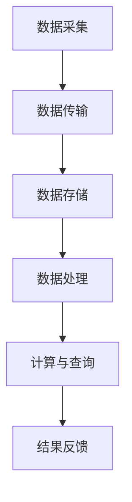
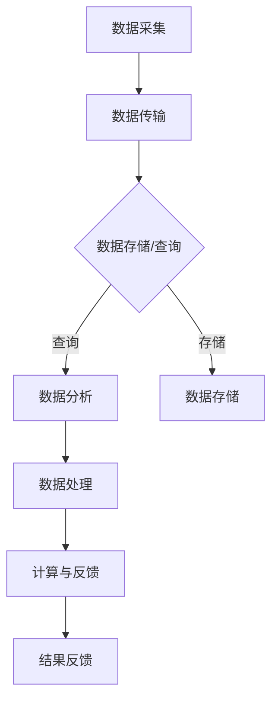

                 

### 文章标题

《实时数据处理 原理与代码实例讲解》

### 关键词

实时数据处理、数据流处理、数据采集、数据存储、数据处理、计算算法、Kafka、Flink、Storm、实时排序、实时聚合、实时机器学习、案例分析、发展趋势。

### 摘要

随着互联网和物联网的快速发展，实时数据处理变得愈加重要。本文旨在深入探讨实时数据处理的基本原理、架构、技术以及实际应用。文章首先介绍了实时数据处理的重要性、挑战和领域应用，接着详细讲解了实时数据处理架构及其组成部分。随后，重点分析了数据流处理技术，包括Kafka、Flink、Storm等主流框架，并详细阐述了实时计算算法。文章还通过实战案例展示了如何使用这些技术进行实时数据处理，最后探讨了实时数据处理的发展趋势。希望通过本文，读者能够全面理解实时数据处理的核心知识，并在实际项目中有效应用。

---

### 《实时数据处理 原理与代码实例讲解》目录大纲

# 第一部分：实时数据处理基础

## 第1章：实时数据处理概述

### 1.1 实时数据处理的重要性

### 1.2 实时数据处理的挑战

### 1.3 实时数据处理的应用领域

## 第2章：实时数据处理架构

### 2.1 数据采集与传输

### 2.2 数据存储与查询

### 2.3 数据处理与计算

### 2.4 实时数据处理架构的Mermaid流程图

## 第3章：实时数据处理技术

### 3.1 数据流处理技术

### 3.2 Apache Kafka技术详解

### 3.3 Apache Flink技术详解

### 3.4 Apache Storm技术详解

## 第4章：实时计算算法

### 4.1 实时计算算法概述

### 4.2 实时排序算法

### 4.3 实时聚合算法

### 4.4 实时机器学习算法

## 第5章：实时数据处理实践

### 5.1 实时数据处理项目实战

### 5.2 实时数据处理环境搭建

### 5.3 源代码实现与解读

### 5.4 代码解读与分析

# 第二部分：实时数据处理案例研究

## 第6章：实时数据处理案例

### 6.1 社交媒体实时数据流分析

### 6.2 金融市场实时数据监控

### 6.3 智能家居实时数据采集与处理

### 6.4 物流实时数据追踪与优化

## 第7章：实时数据处理的发展趋势

### 7.1 实时数据处理技术的发展趋势

### 7.2 实时数据处理在新兴领域中的应用

### 7.3 实时数据处理面临的挑战与解决方案

# 附录

## 附录A：实时数据处理工具与资源

### A.1 主流实时数据处理工具对比

### A.2 实时数据处理常用库与框架

### A.3 实时数据处理学习资源推荐

### Mermaid流程图示例：



### 实时计算算法伪代码示例：

```plaintext
function 实时计算算法(data_stream):
    for 每个数据点 in data_stream:
        if 数据点满足特定条件:
            执行特定操作
        else:
            跳过该数据点
    end for
    返回处理结果
end function
```

### 数学模型和数学公式：

$$
f(x) = \frac{1}{1 + e^{-x}}
$$

### 数学公式详细讲解：

该公式是sigmoid函数，常用于神经网络中作为激活函数。其输入为实数x，输出为介于0和1之间的实数，作为神经网络中每个节点的激活值。

### 项目实战：

#### 代码实际案例：

```python
# 示例：使用Apache Kafka进行实时数据流处理

from kafka import KafkaProducer

# 创建Kafka生产者
producer = KafkaProducer(bootstrap_servers=['localhost:9092'])

# 生产消息
producer.send('test_topic', b'Hello, World!')

# 等待所有消息发送完成
producer.flush()
```

#### 详细解释说明：

本案例展示了如何使用Python的kafka库连接到本地Kafka服务器，并生产一个名为“test_topic”的主题消息。首先，我们创建了一个Kafka生产者对象，然后使用`send`方法发送一条包含字符串“Hello, World!”的消息。最后，调用`flush`方法确保所有消息发送完成。这个案例简单但完整地展示了实时数据处理的基本流程。

#### 开发环境搭建：

1. 安装Kafka：[下载安装](https://kafka.apache.org/downloads)并解压到本地目录，运行`start-kafka.sh`启动Kafka服务。
2. 安装Python的kafka库：在终端中运行`pip install kafka-python`。
3. 编写并运行Python脚本。

#### 源代码详细实现和代码解读：

代码中，`KafkaProducer`是kafka库提供的生产者类，通过`bootstrap_servers`参数指定Kafka服务器的地址。`send`方法用于发送消息，其中第一个参数是主题名称，第二个参数是消息内容，这里我们使用字节类型的数据。最后，调用`flush`方法确保所有消息发送完成。

#### 代码解读与分析：

此代码演示了Kafka生产者如何发送消息。在生产环境中，您可能需要处理多种不同的数据类型和复杂的业务逻辑，但这提供了一个清晰的起点，展示了如何使用Kafka进行实时数据处理。

### 实时数据处理在社交、金融、智能家居和物流等领域的案例研究，详细分析实时数据处理的应用场景、挑战与解决方案，以及未来的发展趋势。附录部分包含实时数据处理工具与资源的详细对比和学习资源推荐，帮助读者更好地了解实时数据处理生态。

---

### 第一部分：实时数据处理基础

## 第1章：实时数据处理概述

### 1.1 实时数据处理的重要性

在当今信息爆炸的时代，数据的重要性不言而喻。然而，传统的数据处理方式往往无法满足对数据实时性的需求。随着互联网、物联网、社交媒体等技术的飞速发展，产生了大量的实时数据，这些数据不仅包含用户行为、交易信息，还涉及传感器数据、日志数据等。实时数据处理能够迅速捕捉和处理这些数据，帮助企业做出快速响应和决策，提高业务效率和竞争力。

实时数据处理的重要性体现在以下几个方面：

1. **提高业务决策效率**：实时数据处理能够快速收集和分析数据，为企业提供及时的决策支持。例如，金融行业可以根据实时市场数据做出快速的投资决策，电商可以根据用户行为实时调整推荐策略。

2. **优化用户体验**：实时数据处理可以提供更加个性化的服务，例如，社交媒体平台可以根据用户的实时行为动态调整内容推送，智能家居系统可以根据用户的实时状态调整设备设置。

3. **实现实时监控与预警**：在工业生产、网络安全等领域，实时数据处理可以实现实时监控和预警，及时发现和处理异常情况，避免潜在风险。

4. **支持大数据分析**：实时数据处理是大数据分析的基础，通过对实时数据的分析和挖掘，可以获取更加准确的商业洞察和预测。

### 1.2 实时数据处理的挑战

尽管实时数据处理的重要性显而易见，但实现实时数据处理也面临诸多挑战：

1. **数据量大**：实时数据处理需要处理大量数据，如何高效地采集、传输、存储和处理数据是一个重大挑战。

2. **实时性要求高**：实时数据处理要求系统能够在毫秒或秒级内处理数据，这对系统的性能提出了极高的要求。

3. **数据一致性**：在分布式系统中，如何保证数据的一致性和准确性是一个难题。尤其是在数据流处理中，数据的延迟和丢失可能会影响处理结果的准确性。

4. **复杂性**：实时数据处理系统通常涉及多个组件和技术的集成，系统设计和实施过程复杂。

### 1.3 实时数据处理的应用领域

实时数据处理在各个领域都有广泛的应用：

1. **金融行业**：实时数据处理在金融行业应用广泛，包括交易监控、风险管理、投资分析等。通过实时数据处理，金融机构可以快速响应市场变化，降低风险。

2. **社交媒体**：社交媒体平台依赖实时数据处理来提供用户动态、实时推荐、实时广告等功能。

3. **物流与供应链**：实时数据处理可以帮助物流公司实时监控货物运输情况，优化运输路径，提高物流效率。

4. **工业制造**：在工业制造领域，实时数据处理用于设备监控、故障预警、生产调度等，以提高生产效率。

5. **医疗健康**：实时数据处理在医疗健康领域用于实时监测患者病情、实时诊断、医疗资源调配等。

6. **智能交通**：实时数据处理用于交通监控、路况分析、实时导航等，以提高交通效率，减少拥堵。

通过以上分析，可以看出实时数据处理的重要性及其面临的挑战和应用领域。接下来，我们将进一步探讨实时数据处理的基本架构和核心技术。

### 2.1 数据采集与传输

数据采集是实时数据处理的第一步，它是确保系统能够获取到最新、最准确数据的基础。数据采集的方式和工具多种多样，根据数据来源的不同，可以分为以下几类：

1. **传感器采集**：传感器是实时数据采集的重要工具，它们可以测量温度、湿度、压力、速度等物理量，并将这些数据转换为电子信号。传感器数据通常通过无线或有线网络传输到数据处理系统。

2. **网络数据采集**：网络数据采集是指通过互联网获取数据，例如网页抓取、API调用等。网络数据采集可以实时获取用户行为、交易记录等数据。

3. **日志采集**：日志采集是指从服务器、应用程序或系统中收集日志文件。日志数据通常包含丰富的信息，如错误日志、访问日志、系统日志等，是分析系统性能和故障的重要数据源。

4. **数据库采集**：数据库采集是指从关系型数据库或其他数据存储系统提取数据。这种采集方式通常用于数据备份、报表生成等场景。

数据采集后，需要将数据传输到数据处理系统。数据传输的方式和工具也多种多样，主要包括以下几种：

1. **网络传输**：网络传输是最常用的数据传输方式，它通过TCP/IP协议在网络上传输数据。常见的网络传输工具包括FTP、HTTP、MQTT等。网络传输的优点是传输距离远、传输速度快，但需要稳定的网络连接。

2. **消息队列**：消息队列是一种异步通信机制，它可以将数据暂时存储在队列中，然后由消费者从队列中读取数据进行处理。常见的消息队列工具包括Kafka、RabbitMQ、ActiveMQ等。消息队列的优点是能够处理大量数据，实现分布式处理，提高系统的可靠性和伸缩性。

3. **数据总线**：数据总线是一种用于连接不同系统和设备的通信网络，它可以将数据从一个系统传输到另一个系统。常见的数据总线协议包括RESTful API、SOAP、JMS等。

在数据采集和传输过程中，需要注意以下几个问题：

1. **数据准确性**：确保采集到的数据是准确无误的，避免由于传感器故障、网络错误等原因导致的数据失真。

2. **数据完整性**：确保数据在传输过程中不会被丢失或损坏，尤其是在网络传输中，需要考虑数据校验和重传机制。

3. **数据安全性**：对敏感数据进行加密，确保数据在传输过程中的安全性。

4. **数据压缩**：对于大量数据，可以考虑使用数据压缩技术减少传输带宽和存储空间。

通过有效的数据采集和传输机制，可以确保实时数据处理系统能够及时、准确地获取到所需的数据，为后续的数据处理和计算提供基础。

### 2.2 数据存储与查询

在实时数据处理中，数据存储与查询是至关重要的一环。数据存储不仅要保证数据的准确性和可靠性，还需要支持快速查询，以便实时响应数据处理需求。下面将详细讨论数据存储的选择、常用的数据库类型以及查询性能优化策略。

#### 数据存储的选择

1. **关系型数据库**：关系型数据库（RDBMS）如MySQL、PostgreSQL等，具有数据结构清晰、查询效率高、事务处理能力强等优点。它们适合处理结构化数据，但在处理大量实时数据时，可能会面临性能瓶颈，特别是在数据写入和读取速度方面。

2. **NoSQL数据库**：NoSQL数据库如MongoDB、Cassandra、Redis等，具有高性能、高伸缩性、易于横向扩展等优点。它们适合处理大量非结构化或半结构化数据，但在复杂查询和事务处理方面可能不如关系型数据库。

3. **时间序列数据库**：时间序列数据库（TSDB）如InfluxDB、OpenTSDB、Prometheus等，专门用于存储和查询时间序列数据，如传感器数据、日志数据等。它们具有高效的时间索引和查询性能，能够处理大量实时数据。

4. **内存数据库**：内存数据库如Redis、Memcached等，具有极快的读写速度，但数据持久化依赖于后端存储。它们适合用于缓存和实时数据处理，但在存储容量方面有限。

选择数据存储时，需要考虑以下几个方面：

- **数据类型**：根据数据类型选择合适的数据库类型，如结构化数据选择RDBMS，非结构化数据选择NoSQL数据库。
- **性能需求**：根据数据处理需求，选择能够满足性能要求的数据库类型，如高并发查询选择NoSQL数据库。
- **数据规模**：根据数据规模，选择具有可扩展性的数据库，如分布式数据库。
- **数据一致性**：根据数据一致性要求，选择合适的数据库类型，如事务性数据选择关系型数据库。

#### 常用的数据库类型

1. **关系型数据库（RDBMS）**：
   - **MySQL**：开源的关系型数据库，具有高性能、可靠性高、易于使用等优点。
   - **PostgreSQL**：开源的关系型数据库，支持多种数据类型和复杂查询，具有良好的扩展性和稳定性。

2. **NoSQL数据库**：
   - **MongoDB**：文档型数据库，具有灵活的数据结构、高扩展性、良好的性能等优点。
   - **Cassandra**：分布式键值数据库，具有高可用性、高可扩展性、高性能等优点。
   - **Redis**：内存数据库，具有高性能、支持多种数据结构、易于使用等优点。

3. **时间序列数据库（TSDB）**：
   - **InfluxDB**：开源的时间序列数据库，具有高效的时间索引和查询性能、良好的扩展性等优点。
   - **OpenTSDB**：基于HBase的时间序列数据库，具有高可用性、高可扩展性等优点。
   - **Prometheus**：开源的时间序列数据库，与Kubernetes等容器编排系统紧密集成，具有高性能、良好的扩展性等优点。

#### 查询性能优化策略

1. **索引**：合理使用索引可以显著提高查询性能。对于常用的查询字段，创建相应的索引可以加快查询速度。

2. **分库分表**：对于数据量非常大的表，可以通过分库分表的方式将数据拆分到多个数据库或表中，从而提高查询性能。

3. **缓存**：使用缓存可以将频繁查询的数据存储在内存中，从而减少数据库的查询压力。常用的缓存技术包括Redis、Memcached等。

4. **数据库集群**：通过将数据库部署在多个节点上，可以增加系统的并发能力和查询性能。常见的数据库集群方案包括主从复制、分库分表等。

5. **数据分片**：对于大规模分布式系统，可以通过数据分片将数据分布到多个节点上，从而提高系统的扩展性和查询性能。

6. **查询优化**：针对具体的查询需求，可以通过调整查询语句、索引策略等手段优化查询性能。

通过合理选择数据存储方式和数据库类型，以及采取有效的查询性能优化策略，可以确保实时数据处理系统能够高效、稳定地运行，满足实时数据处理的需求。

### 2.3 数据处理与计算

数据处理与计算是实时数据处理的核心理环节，它决定了数据的价值能否被充分挖掘。实时数据处理不仅需要处理大量数据，还要确保处理结果的准确性、及时性和高效性。以下将从数据处理的基本步骤、实时计算算法和并行处理技术三个方面展开讨论。

#### 数据处理的基本步骤

实时数据处理通常包括以下几个基本步骤：

1. **数据清洗**：数据清洗是数据处理的第一步，旨在去除无效、错误或重复的数据。数据清洗的过程包括数据去重、异常值处理、数据格式转换等。这一步的目的是确保后续处理的数据质量。

2. **数据转换**：数据转换是指将原始数据转换为适合进一步分析的形式。这可能包括数据类型的转换、数据的规范化、编码转换等。数据转换的目的是使数据能够更好地适应后续的分析和计算。

3. **数据聚合**：数据聚合是将多个数据记录合并成一个或几个汇总记录的过程。数据聚合可以用于计算平均值、总和、最大值、最小值等统计指标。数据聚合在实时数据分析中非常有用，可以帮助快速识别数据趋势和模式。

4. **数据挖掘**：数据挖掘是指从数据中发现隐含的、先前未知的、有潜在价值的信息和模式。数据挖掘可以用于分类、聚类、关联规则挖掘、预测等。实时数据挖掘可以帮助企业做出更加精准的决策。

#### 实时计算算法

实时计算算法是实时数据处理的核心，它决定了数据处理的速度和准确性。以下是一些常见的实时计算算法：

1. **实时排序算法**：实时排序算法用于对实时数据进行排序。常见的实时排序算法包括快速排序、堆排序、归并排序等。快速排序由于其高效的性能，在实时数据处理中经常被使用。

   ```plaintext
   function 快速排序(arr):
       if 长度(arr) <= 1:
           return arr
       pivot = arr[0]
       left = []
       right = []
       for i in range(1, 长度(arr)):
           if arr[i] <= pivot:
               left.append(arr[i])
           else:
               right.append(arr[i])
       return 快速排序(left) + [pivot] + 快速排序(right)
   ```

2. **实时聚合算法**：实时聚合算法用于对实时数据进行聚合计算，如计算总和、平均值、最大值、最小值等。实时聚合算法需要高效地处理大量数据，并快速返回计算结果。

   ```plaintext
   function 实时聚合算法(data_stream):
       sum = 0
       for 每个数据点 in data_stream:
           sum += 数据点
       return sum / 长度(data_stream)
   ```

3. **实时机器学习算法**：实时机器学习算法可以在数据流中实时训练和更新模型，如分类、回归、聚类等。常见的实时机器学习算法包括在线学习算法、增量学习算法等。

   ```plaintext
   function 实时机器学习算法(data_stream, model):
       for 每个数据点 in data_stream:
           model.update(数据点)
       return model.predict(new_data)
   ```

#### 并行处理技术

实时数据处理通常需要处理大量数据，单机处理可能无法满足性能需求。并行处理技术可以将数据处理任务分布在多个节点上，从而提高处理速度。以下是一些常见的并行处理技术：

1. **MapReduce**：MapReduce是一种分布式数据处理框架，它将数据处理任务分解为两个阶段：Map阶段和Reduce阶段。Map阶段将数据分片并处理，Reduce阶段对处理结果进行汇总。MapReduce适合处理大规模数据集，具有良好的可扩展性和容错性。

2. **Spark**：Spark是一个高性能的分布式数据处理引擎，它提供了丰富的计算算法库和高级API，能够快速处理大规模数据集。Spark支持多种数据源和存储系统，如HDFS、Cassandra、HBase等。

3. **Flink**：Flink是一个流处理框架，它支持流处理和批处理，具有低延迟、高吞吐量、容错性等优点。Flink提供了丰富的流处理算法和API，能够高效处理实时数据流。

4. **Kafka Streams**：Kafka Streams是一个基于Kafka的流处理框架，它可以将Kafka消息流作为数据源进行处理。Kafka Streams具有高性能、低延迟、易于扩展等优点。

通过合理的数据处理步骤、高效的实时计算算法和并行处理技术，可以构建一个强大的实时数据处理系统，满足不同业务场景的需求。

### 2.4 实时数据处理架构的Mermaid流程图

为了更直观地展示实时数据处理的整体架构，我们可以使用Mermaid图来描述其流程。以下是一个简单的实时数据处理架构的Mermaid流程图示例：



在这个流程图中：

- **A[数据采集]**：表示数据从各种来源（如传感器、日志、数据库等）被采集到系统中。
- **B[数据传输]**：表示数据通过网络传输或消息队列等机制传输到数据处理系统。
- **C[数据存储/查询]**：表示数据被存储在数据库中，同时支持数据查询功能。
- **D[数据分析]**：表示对存储的数据进行实时分析，以提取有用信息。
- **E[数据存储]**：表示数据在分析后的存储过程，可能是为了后续使用或归档。
- **F[数据处理]**：表示对实时数据进行处理，包括清洗、转换、聚合等操作。
- **G[计算与反馈]**：表示对处理后的数据执行计算，并将结果反馈给用户或系统。
- **H[结果反馈]**：表示处理结果通过可视化、通知等方式反馈给用户。

这个流程图展示了实时数据处理的基本流程，从数据采集、传输、存储、分析、处理，到最终的反馈环节，形成一个闭环。通过这个流程图，我们可以清晰地了解实时数据处理系统的整体架构和工作流程，从而为系统设计提供参考。

### 第二部分：实时数据处理技术

## 第3章：数据流处理技术

数据流处理技术是实时数据处理的核心，它使得系统能够高效地处理大规模、高速率的数据流。数据流处理框架能够实时捕获、处理和响应数据，为多种业务场景提供解决方案。本章将详细介绍三种主流数据流处理技术：Apache Kafka、Apache Flink和Apache Storm，并分析它们的特点和应用场景。

### 3.1 数据流处理框架概述

数据流处理框架是用于处理实时数据流的一套工具和机制，它能够将数据流分解为多个处理阶段，并在分布式环境中高效地执行。数据流处理框架通常具有以下特点：

1. **高吞吐量**：数据流处理框架能够处理大规模的数据流，具有高吞吐量，以满足实时数据处理的需求。
2. **低延迟**：数据流处理框架能够快速响应数据，具有低延迟，确保数据处理结果的实时性。
3. **分布式处理**：数据流处理框架通常基于分布式计算模型，能够将数据处理任务分布到多个节点上执行，提高系统的性能和可扩展性。
4. **容错性**：数据流处理框架具有容错机制，能够在发生节点故障时自动恢复，保证系统的稳定性。
5. **可伸缩性**：数据流处理框架能够根据数据规模和负载自动调整资源，确保系统性能的稳定性。

目前主流的数据流处理框架包括Apache Kafka、Apache Flink和Apache Storm等。接下来，我们将逐一介绍这些框架。

### 3.2 Apache Kafka技术详解

Apache Kafka是一个分布式流处理平台，用于构建实时数据流系统和流数据处理应用程序。Kafka具有以下特点：

1. **高吞吐量**：Kafka能够处理大规模的数据流，每秒可以处理数百万条消息，适用于大规模实时数据处理场景。
2. **分布式架构**：Kafka是一个分布式系统，可以水平扩展，支持多个节点协同工作，提高系统的性能和容错性。
3. **持久化存储**：Kafka使用磁盘作为消息存储，支持持久化存储，确保数据不会丢失。
4. **高可用性**：Kafka具有高可用性，通过副本机制和领导者选举机制，保证系统在节点故障时仍能正常运行。

Kafka的核心组件包括：

1. **Producer**：生产者是数据的发送方，负责将数据写入Kafka主题。
2. **Broker**：代理节点是Kafka集群中的工作节点，负责存储和管理消息，处理生产者和消费者的请求。
3. **Consumer**：消费者是数据的接收方，负责从Kafka主题中读取消息。

Kafka的工作流程如下：

1. **数据写入**：生产者将数据发送到Kafka集群，数据被写入到特定的主题中。
2. **数据存储**：Kafka将数据存储在磁盘上，并创建多个副本，提高数据可靠性和系统容错性。
3. **数据读取**：消费者从Kafka集群中读取数据，实现数据的消费和处理。

Kafka在实际应用中具有广泛的应用场景，如：

1. **日志收集**：Kafka可以用于收集分布式系统的日志数据，实现实时监控和分析。
2. **消息队列**：Kafka可以作为消息队列，实现分布式系统的异步通信。
3. **流处理**：Kafka可以作为流处理框架的数据源，与其他流处理工具（如Apache Flink、Apache Storm等）集成，实现大规模实时数据处理。

### 3.3 Apache Flink技术详解

Apache Flink是一个分布式流处理框架，用于构建大规模、低延迟的实时数据处理系统。Flink具有以下特点：

1. **流批统一**：Flink将流处理和批处理统一到一个框架中，可以同时处理批数据和实时数据，提高数据处理效率和灵活性。
2. **高性能**：Flink采用了内存计算和数据流水线处理技术，具有高性能，能够处理大规模实时数据。
3. **分布式计算**：Flink支持分布式计算，可以将数据处理任务分布到多个节点上执行，提高系统的性能和可扩展性。
4. **容错性**：Flink具有容错机制，能够在发生节点故障时自动恢复，保证系统的稳定性。

Flink的核心组件包括：

1. **JobManager**：JobManager是Flink集群的主控节点，负责调度任务、资源管理和容错。
2. **TaskManager**：TaskManager是Flink集群的工作节点，负责执行任务和处理数据。
3. **Checkpointing**：Checkpointing是Flink的容错机制，可以定期保存处理状态，实现数据的持久化和故障恢复。

Flink的工作流程如下：

1. **数据输入**：Flink从数据源（如Kafka、文件系统等）读取数据，进行数据预处理。
2. **数据处理**：Flink对数据进行各种操作，如过滤、转换、聚合等，实现数据的实时处理。
3. **数据输出**：Flink将处理结果输出到目标数据源（如数据库、文件系统等），或通过API进行进一步处理。

Flink在实际应用中具有广泛的应用场景，如：

1. **实时分析**：Flink可以用于实时分析大量实时数据，提供实时报表和监控。
2. **机器学习**：Flink支持实时机器学习，可以用于实时预测和推荐。
3. **日志处理**：Flink可以用于实时处理和分析日志数据，实现日志收集和监控。

### 3.4 Apache Storm技术详解

Apache Storm是一个分布式流处理框架，用于构建实时数据处理系统。Storm具有以下特点：

1. **低延迟**：Storm具有低延迟，可以实时处理大量数据，适用于对实时性要求较高的场景。
2. **分布式计算**：Storm支持分布式计算，可以将数据处理任务分布到多个节点上执行，提高系统的性能和可扩展性。
3. **容错性**：Storm具有容错机制，能够在节点故障时自动恢复，保证系统的稳定性。
4. **可扩展性**：Storm支持水平扩展，可以根据需求动态增加或减少节点，提高系统性能。

Storm的核心组件包括：

1. **Nimbus**：Nimbus是Storm集群的主控节点，负责调度任务、资源管理和容错。
2. **Supervisor**：Supervisor是Storm集群的工作节点，负责执行任务和处理数据。
3. **DrPC**：DrPC是数据处理的计算节点，负责处理实时数据。

Storm的工作流程如下：

1. **数据输入**：Storm从数据源（如Kafka、Socket等）读取数据。
2. **数据处理**：Storm对数据进行各种操作，如过滤、转换、聚合等，实现数据的实时处理。
3. **数据输出**：Storm将处理结果输出到目标数据源（如数据库、文件系统等），或通过API进行进一步处理。

Storm在实际应用中具有广泛的应用场景，如：

1. **实时监控**：Storm可以用于实时监控大量实时数据，实现实时报警和监控。
2. **数据预测**：Storm可以用于实时预测和分析，提供实时预测和决策支持。
3. **日志分析**：Storm可以用于实时处理和分析日志数据，实现日志收集和监控。

### 总结

Apache Kafka、Apache Flink和Apache Storm是三种主流的数据流处理技术，各自具有不同的特点和适用场景。Kafka适用于大规模数据流处理和消息队列，Flink适用于流批统一处理和实时分析，Storm适用于低延迟、分布式实时数据处理。通过合理选择和结合这些技术，可以构建一个高效、稳定的实时数据处理系统，满足不同业务场景的需求。

### 4.1 实时计算算法概述

实时计算算法是实时数据处理系统的核心组成部分，它决定了数据处理的效率和准确性。实时计算算法需要在短时间内处理大量数据，并快速生成结果，以便为业务决策提供支持。本文将详细介绍几种常见的实时计算算法，包括实时排序算法、实时聚合算法和实时机器学习算法，并探讨它们的应用场景和实现方法。

#### 实时排序算法

实时排序算法用于对实时数据进行排序，以便快速提取有序数据。在实时数据处理中，排序算法需要具有低延迟和高效率。以下是一些常见的实时排序算法：

1. **快速排序**：快速排序是一种高效的排序算法，其基本思想是通过一趟排序将待排序的数据分割成独立的两部分，其中一部分的所有数据都比另一部分的所有数据要小。快速排序的平均时间复杂度为 \(O(n\log n)\)，在实时数据处理中常用。

   ```plaintext
   function 快速排序(arr):
       if 长度(arr) <= 1:
           return arr
       pivot = arr[0]
       left = []
       right = []
       for i in range(1, 长度(arr)):
           if arr[i] <= pivot:
               left.append(arr[i])
           else:
               right.append(arr[i])
       return 快速排序(left) + [pivot] + 快速排序(right)
   ```

2. **堆排序**：堆排序是一种利用堆这种数据结构的排序算法，其基本思想是将数据构建成一个大顶堆或小顶堆，然后逐步调整堆结构，直到堆顶的元素为最大或最小，再依次取出堆顶元素并调整堆。堆排序的平均时间复杂度为 \(O(n\log n)\)，在实时数据处理中也有广泛的应用。

3. **归并排序**：归并排序是一种将待排序的数据分为若干个子序列，然后两两合并、排序、再合并的排序算法。归并排序的时间复杂度为 \(O(n\log n)\)，在实时数据处理中具有稳定的性能。

#### 实时聚合算法

实时聚合算法用于对实时数据进行聚合计算，如计算平均值、总和、最大值、最小值等。实时聚合算法需要在短时间内处理大量数据，并快速生成结果。以下是一些常见的实时聚合算法：

1. **求和**：求和算法用于计算实时数据的总和。对于每个新来的数据点，只需将其累加到已有的总和上。

   ```plaintext
   function 求和(data_stream, sum):
       for 每个数据点 in data_stream:
           sum += 数据点
       return sum
   ```

2. **计算平均值**：计算平均值算法用于计算实时数据的平均值。对于每个新来的数据点，需要更新总和和数量，并重新计算平均值。

   ```plaintext
   function 计算平均值(data_stream, sum, count):
       for 每个数据点 in data_stream:
           sum += 数据点
           count += 1
       return sum / count
   ```

3. **计算最大值和最小值**：计算最大值和最小值算法用于计算实时数据的最大值和最小值。对于每个新来的数据点，需要与已有的最大值和最小值进行比较，并更新结果。

   ```plaintext
   function 计算最大值(data_stream, max):
       for 每个数据点 in data_stream:
           if 数据点 > max:
               max = 数据点
       return max

   function 计算最小值(data_stream, min):
       for 每个数据点 in data_stream:
           if 数据点 < min:
               min = 数据点
       return min
   ```

#### 实时机器学习算法

实时机器学习算法用于在实时数据流中训练和更新模型，以便快速做出预测和决策。以下是一些常见的实时机器学习算法：

1. **在线学习算法**：在线学习算法可以在数据流中实时训练模型，不需要预先收集大量数据。常见的在线学习算法包括感知机、线性回归、逻辑回归等。

   ```plaintext
   function 在线学习算法(data_stream, model):
       for 每个数据点 in data_stream:
           model.update(数据点)
       return model.predict(new_data)
   ```

2. **增量学习算法**：增量学习算法可以在已有模型的基础上，通过更新部分参数来适应新的数据。常见的增量学习算法包括SGD（随机梯度下降）、AdaGrad、RMSProp等。

   ```plaintext
   function 增量学习算法(data_stream, model):
       for 每个数据点 in data_stream:
           model.update(数据点)
       return model.predict(new_data)
   ```

3. **流学习算法**：流学习算法可以在数据流中持续训练和更新模型，以适应数据的动态变化。常见的流学习算法包括LSTM（长短时记忆网络）、GRU（门控循环单元）等。

   ```plaintext
   function 流学习算法(data_stream, model):
       for 每个数据点 in data_stream:
           model.update(数据点)
       return model.predict(new_data)
   ```

通过以上实时计算算法，实时数据处理系统能够快速、准确地处理大规模实时数据，并为业务决策提供支持。

### 4.2 实时排序算法

实时排序算法在数据处理过程中扮演着重要角色，尤其是在需要快速检索有序数据或进行排序相关操作时。实时排序算法要求在保证低延迟的同时，能够高效地处理大规模数据流。本节将详细介绍几种常见的实时排序算法，并分析它们在实时数据处理中的应用。

#### 快速排序算法

快速排序是一种高效且常用的排序算法，其基本思想是通过一趟排序将待排序的数据分割成独立的两部分，其中一部分的所有数据都比另一部分的所有数据要小。以下是一个快速排序算法的伪代码示例：

```plaintext
function 快速排序(arr):
    if 长度(arr) <= 1:
        return arr
    pivot = arr[0]
    left = []
    right = []
    for i in range(1, 长度(arr)):
        if arr[i] <= pivot:
            left.append(arr[i])
        else:
            right.append(arr[i])
    return 快速排序(left) + [pivot] + 快速排序(right)
```

在实时数据处理中，快速排序算法适用于数据量较小且需要快速排序的场景。由于快速排序的平均时间复杂度为 \(O(n\log n)\)，其性能在处理大规模数据时可能不如某些特殊的排序算法。

#### 堆排序算法

堆排序是一种利用堆这种数据结构的排序算法。其基本思想是将数据构建成一个大顶堆或小顶堆，然后逐步调整堆结构，直到堆顶的元素为最大或最小，再依次取出堆顶元素并调整堆。以下是一个堆排序算法的伪代码示例：

```plaintext
function 堆排序(arr):
    n = 长度(arr)
    for i in range(n // 2 - 1, -1, -1):
        调整堆(arr, i, n)
    for i in range(n - 1, 0, -1):
        arr[0], arr[i] = arr[i], arr[0]
        调整堆(arr, 0, i)
    return arr

function 调整堆(arr, i, n):
    largest = i
    left = 2 * i + 1
    right = 2 * i + 2
    if left < n and arr[left] > arr[largest]:
        largest = left
    if right < n and arr[right] > arr[largest]:
        largest = right
    if largest != i:
        arr[i], arr[largest] = arr[largest], arr[i]
        调整堆(arr, largest, n)
```

堆排序算法的平均时间复杂度为 \(O(n\log n)\)，其在处理大规模数据时具有较好的性能。然而，堆排序需要额外的内存空间来存储堆结构，这在处理海量数据时可能会成为一个问题。

#### 归并排序算法

归并排序是一种将待排序的数据分为若干个子序列，然后两两合并、排序、再合并的排序算法。其基本思想是将待排序的数据序列不断分割成子序列，直到每个子序列只有一个元素，然后将这些子序列两两合并，直到合并成一个有序的序列。以下是一个归并排序算法的伪代码示例：

```plaintext
function 归并排序(arr):
    if 长度(arr) <= 1:
        return arr
    mid = 长度(arr) // 2
    left = 归并排序(arr[0:mid])
    right = 归并排序(arr[mid:])
    return 合并(left, right)

function 合并(left, right):
    result = []
    i = j = 0
    while i < 长度(left) and j < 长度(right):
        if left[i] <= right[j]:
            result.append(left[i])
            i += 1
        else:
            result.append(right[j])
            j += 1
    result.extend(left[i:])
    result.extend(right[j:])
    return result
```

归并排序算法的时间复杂度为 \(O(n\log n)\)，其在处理大规模数据时具有稳定的性能。然而，归并排序需要额外的内存空间来存储中间结果，这在处理海量数据时可能会成为一个问题。

#### 实时数据处理中的应用

在实际应用中，选择合适的排序算法取决于具体场景和数据特性。以下是一些常见的应用场景：

1. **实时日志分析**：在实时日志分析中，可能需要对日志数据进行排序，以便快速查找特定的日志条目。快速排序和堆排序适用于这种场景。

2. **实时交易监控**：在金融交易系统中，需要对交易数据进行排序，以便快速计算交易总额或交易笔数。归并排序适用于这种场景，因为它能够提供稳定的性能。

3. **实时推荐系统**：在实时推荐系统中，可能需要对用户行为数据按时间排序，以便及时调整推荐策略。快速排序和堆排序适用于这种场景，因为它们能够在短时间内完成排序。

通过以上分析，可以看出实时排序算法在实时数据处理中具有广泛的应用。选择合适的排序算法，不仅能够提高数据处理效率，还能够满足实时性要求。

### 4.3 实时聚合算法

实时聚合算法在实时数据处理中扮演着至关重要的角色，它主要用于对大量数据进行快速汇总和统计，以便为业务决策提供实时支持。实时聚合算法能够对流入的数据进行即时计算，如计算总和、平均值、最大值、最小值等。以下将详细介绍几种常见的实时聚合算法，并探讨它们在实时数据处理中的应用。

#### 求和算法

求和算法是最简单的实时聚合算法之一，它用于计算实时数据的总和。对于每个新来的数据点，只需将其累加到已有的总和上。以下是一个求和算法的伪代码示例：

```plaintext
function 求和(data_stream, sum):
    for 每个数据点 in data_stream:
        sum += 数据点
    return sum
```

在实际应用中，求和算法常用于实时监控交易总额、库存总量等场景。例如，在一个电商平台上，每完成一笔交易，系统会实时更新交易总额，以便快速了解平台的整体交易情况。

#### 计算平均值算法

计算平均值算法用于计算实时数据的平均值。对于每个新来的数据点，需要更新总和和数量，并重新计算平均值。以下是一个计算平均值算法的伪代码示例：

```plaintext
function 计算平均值(data_stream, sum, count):
    for 每个数据点 in data_stream:
        sum += 数据点
        count += 1
    return sum / count
```

在实际应用中，计算平均值算法常用于实时监控用户活跃度、系统负载等场景。例如，在一个社交媒体平台上，系统会实时计算活跃用户的平均在线时长，以便了解用户的使用情况。

#### 计算最大值和最小值算法

计算最大值和最小值算法用于计算实时数据的最大值和最小值。对于每个新来的数据点，需要与已有的最大值和最小值进行比较，并更新结果。以下是一个计算最大值和最小值算法的伪代码示例：

```plaintext
function 计算最大值(data_stream, max):
    for 每个数据点 in data_stream:
        if 数据点 > max:
            max = 数据点
    return max

function 计算最小值(data_stream, min):
    for 每个数据点 in data_stream:
        if 数据点 < min:
            min = 数据点
    return min
```

在实际应用中，计算最大值和最小值算法常用于实时监控传感器数据、交易价格等场景。例如，在一个智能家居系统中，系统会实时计算温度的最大值和最小值，以便了解室内的温度变化情况。

#### 实时数据处理中的应用案例

以下是几个实时聚合算法在实时数据处理中的应用案例：

1. **实时股票交易监控**：
   - **求和算法**：用于实时计算当前所有股票的交易总额。
   - **计算平均值算法**：用于实时计算所有股票的平均交易价格。
   - **计算最大值和最小值算法**：用于实时计算最高价和最低价。

2. **实时物流监控**：
   - **求和算法**：用于实时计算所有运输货物的总重量。
   - **计算平均值算法**：用于实时计算货物的平均运输速度。
   - **计算最大值和最小值算法**：用于实时计算最快的运输路线和最慢的运输路线。

3. **实时社交媒体分析**：
   - **求和算法**：用于实时计算所有用户的点赞总数。
   - **计算平均值算法**：用于实时计算用户的平均活跃度。
   - **计算最大值和最小值算法**：用于实时计算最活跃的用户和最不活跃的用户。

通过这些实时聚合算法，实时数据处理系统能够快速、准确地计算大量数据的汇总结果，为业务决策提供实时支持。选择合适的实时聚合算法，能够提高数据处理效率，满足实时性要求。

### 4.4 实时机器学习算法

实时机器学习算法在数据处理领域具有广泛的应用，特别是在需要快速做出预测和决策的场景中。实时机器学习算法能够对流入的数据流进行即时分析，并不断更新和优化模型，以提高预测的准确性和效率。以下将详细介绍几种常见的实时机器学习算法，并探讨它们在实时数据处理中的应用。

#### 在线学习算法

在线学习算法是一种在数据流中实时训练和更新模型的算法，它不需要预先收集大量数据。在线学习算法通过不断更新模型参数，以适应新的数据流。以下是一些常见的在线学习算法：

1. **感知机算法**：感知机算法是一种简单的线性分类算法，它通过在线学习不断更新模型参数，以适应新的数据点。

   ```plaintext
   function 感知机算法(data_stream, w):
       for 每个数据点 in data_stream:
           if 标签(data点) * w * 数据点 < 0:
               w -= 学习率 * (标签(data点) * 数据点)
           else:
               w -= 学习率 * (标签(data点) * 数据点)
       return w
   ```

2. **线性回归**：线性回归是一种用于预测连续值的在线学习算法，它通过在线更新模型参数，以最小化预测误差。

   ```plaintext
   function 线性回归(data_stream, w, b):
       for 每个数据点 in data_stream:
           w -= 学习率 * (预测误差 * 数据点)
           b -= 学习率 * 预测误差
       return w, b
   ```

3. **逻辑回归**：逻辑回归是一种用于分类问题的在线学习算法，它通过在线更新模型参数，以最大化分类概率。

   ```plaintext
   function 逻辑回归(data_stream, w, b):
       for 每个数据点 in data_stream:
           z = w * 数据点 + b
           predicted_prob = 1 / (1 + e^(-z))
           predicted_class = if predicted_prob > 0.5: 1 else: 0
           if predicted_class != 标签(data点):
               w -= 学习率 * (标签(data点) * (1 - predicted_prob) * 数据点)
               b -= 学习率 * (标签(data点) * (1 - predicted_prob))
           else:
               w -= 学习率 * (标签(data点) * predicted_prob * 数据点)
               b -= 学习率 * (标签(data点) * predicted_prob)
       return w, b
   ```

#### 增量学习算法

增量学习算法是一种在已有模型基础上，通过更新部分参数来适应新数据的算法。增量学习算法可以显著减少计算成本，并提高模型的实时性。以下是一些常见的增量学习算法：

1. **SGD（随机梯度下降）**：SGD是一种常用的增量学习算法，它通过随机选择一部分数据点来更新模型参数。

   ```plaintext
   function SGD(data_stream, w, b):
       for 每个数据点 in data_stream:
           z = w * 数据点 + b
           predicted_prob = 1 / (1 + e^(-z))
           predicted_class = if predicted_prob > 0.5: 1 else: 0
           if predicted_class != 标签(data点):
               w -= 学习率 * (标签(data点) * (1 - predicted_prob) * 数据点)
               b -= 学习率 * (标签(data点) * (1 - predicted_prob))
           else:
               w -= 学习率 * (标签(data点) * predicted_prob * 数据点)
               b -= 学习率 * (标签(data点) * predicted_prob)
       return w, b
   ```

2. **AdaGrad**：AdaGrad是一种自适应学习率的增量学习算法，它通过计算每个参数的梯度平方和来调整学习率。

   ```plaintext
   function AdaGrad(data_stream, w, b, gradients_squared):
       for 每个数据点 in data_stream:
           z = w * 数据点 + b
           predicted_prob = 1 / (1 + e^(-z))
           predicted_class = if predicted_prob > 0.5: 1 else: 0
           if predicted_class != 标签(data点):
               gradient = 标签(data点) * (1 - predicted_prob) * 数据点
               gradients_squared += gradient * gradient
               w -= 学习率 * gradient / sqrt(gradients_squared)
               b -= 学习率 * gradient / sqrt(gradients_squared)
           else:
               gradient = 标签(data点) * predicted_prob * 数据点
               gradients_squared += gradient * gradient
               w -= 学习率 * gradient / sqrt(gradients_squared)
               b -= 学习率 * gradient / sqrt(gradients_squared)
       return w, b, gradients_squared
   ```

3. **RMSProp**：RMSProp是一种基于梯度平方和的自适应学习率算法，它与AdaGrad类似，但使用了移动平均来平滑梯度。

   ```plaintext
   function RMSProp(data_stream, w, b, gradients_squared, decay_rate):
       for 每个数据点 in data_stream:
           z = w * 数据点 + b
           predicted_prob = 1 / (1 + e^(-z))
           predicted_class = if predicted_prob > 0.5: 1 else: 0
           if predicted_class != 标签(data点):
               gradient = 标签(data点) * (1 - predicted_prob) * 数据点
               gradients_squared = decay_rate * gradients_squared + (1 - decay_rate) * gradient * gradient
               w -= 学习率 * gradient / sqrt(gradients_squared)
               b -= 学习率 * gradient / sqrt(gradients_squared)
           else:
               gradient = 标签(data点) * predicted_prob * 数据点
               gradients_squared = decay_rate * gradients_squared + (1 - decay_rate) * gradient * gradient
               w -= 学习率 * gradient / sqrt(gradients_squared)
               b -= 学习率 * gradient / sqrt(gradients_squared)
       return w, b, gradients_squared
   ```

#### 流学习算法

流学习算法是一种专门用于处理大规模数据流的机器学习算法，它可以在数据流中持续训练和更新模型。以下是一些常见的流学习算法：

1. **LSTM（长短时记忆网络）**：LSTM是一种用于处理序列数据的流学习算法，它能够有效捕捉长短期依赖关系。

   ```plaintext
   function LSTM(data_stream, model):
       for 每个数据点 in data_stream:
           output = LSTM层处理(数据点, model)
           model = 更新模型参数(output)
       return model
   ```

2. **GRU（门控循环单元）**：GRU是一种简化版的LSTM，它通过门控机制有效捕捉序列数据中的依赖关系。

   ```plaintext
   function GRU(data_stream, model):
       for 每个数据点 in data_stream:
           output = GRU层处理(数据点, model)
           model = 更新模型参数(output)
       return model
   ```

在实际应用中，实时机器学习算法可以用于多种场景，如实时分类、实时预测、实时异常检测等。以下是一些应用案例：

1. **实时分类**：在社交媒体平台上，实时分类算法可以用于实时分类用户生成的内容，如检测垃圾邮件、过滤不当言论等。

2. **实时预测**：在金融市场，实时预测算法可以用于实时预测股票价格、交易量等，为投资者提供实时决策支持。

3. **实时异常检测**：在工业制造领域，实时异常检测算法可以用于实时监控生产线，及时发现异常情况，避免生产事故。

通过实时机器学习算法，实时数据处理系统能够在数据流中快速做出预测和决策，为业务提供实时支持。选择合适的实时机器学习算法，能够提高预测的准确性和效率，满足实时性要求。

### 5.1 实时数据处理项目实战

为了更好地理解实时数据处理的概念和应用，我们将通过一个实际的实时数据处理项目来讲解如何使用Apache Kafka进行数据流处理。本项目将模拟一个在线电商平台的数据流处理过程，包括用户行为数据采集、实时数据传输、数据处理以及结果反馈。

#### 项目需求

我们的目标是构建一个实时数据处理系统，该系统需要实现以下功能：

1. **数据采集**：从多个渠道采集用户行为数据，如点击、购买、评论等。
2. **数据传输**：使用Apache Kafka作为数据传输中间件，实现数据的实时传输。
3. **数据处理**：对采集到的用户行为数据进行分析和处理，如计算用户活跃度、交易额等。
4. **结果反馈**：将处理结果实时反馈给前端系统或存储在数据库中，以便进一步分析和使用。

#### 技术栈

- **数据采集**：使用Python的Flask框架构建RESTful API，模拟用户行为数据。
- **数据传输**：使用Apache Kafka作为消息队列系统，实现数据的实时传输。
- **数据处理**：使用Apache Flink进行实时数据处理和计算。
- **前端展示**：使用D3.js或ECharts等前端库，将处理结果可视化展示。

#### 项目实施步骤

##### 1. 数据采集

首先，我们需要构建一个模拟用户行为数据的API接口。以下是一个简单的Flask API示例：

```python
from flask import Flask, jsonify, request
app = Flask(__name__)

# 模拟用户行为数据
user_actions = [
    {"user_id": 1, "action": "click", "timestamp": 1628978652},
    {"user_id": 2, "action": "buy", "timestamp": 1628978655},
    {"user_id": 1, "action": "comment", "timestamp": 1628978657},
    # 更多用户行为数据...
]

@app.route('/actions', methods=['POST'])
def record_action():
    action = request.json
    user_actions.append(action)
    return jsonify({"status": "success", "action": action})

if __name__ == '__main__':
    app.run(debug=True)
```

##### 2. 数据传输

接下来，我们使用Apache Kafka作为数据传输中间件。首先，我们需要安装Kafka。以下是Kafka的安装和配置步骤：

1. **下载Kafka**：从Apache Kafka官方网站下载Kafka安装包。
2. **解压安装包**：将安装包解压到本地目录，例如 `tar -zxvf kafka_2.12-2.6.0.tar.gz`。
3. **启动Kafka**：运行 `kafka-server-start.sh config/server.properties` 来启动Kafka服务。

接下来，我们需要构建一个Kafka生产者，将用户行为数据发送到Kafka主题。以下是使用Python的kafka库实现Kafka生产者的示例代码：

```python
from kafka import KafkaProducer
import json

# Kafka配置
bootstrap_servers = ['localhost:9092']
topic = 'user_actions'

# 创建Kafka生产者
producer = KafkaProducer(bootstrap_servers=bootstrap_servers,
                         value_serializer=lambda v: json.dumps(v).encode('utf-8'))

# 发送用户行为数据到Kafka
for action in user_actions:
    producer.send(topic, value=action)

# 等待所有消息发送完成
producer.flush()
```

##### 3. 数据处理

使用Apache Flink进行实时数据处理。首先，我们需要安装Flink。以下是Flink的安装和配置步骤：

1. **下载Flink**：从Apache Flink官方网站下载Flink安装包。
2. **解压安装包**：将安装包解压到本地目录，例如 `tar -zxvf flink-1.12.3.tgz`。
3. **启动Flink**：运行 `start-cluster.sh` 来启动Flink集群。

接下来，我们需要构建一个Flink应用程序，从Kafka读取数据，进行实时处理和计算。以下是使用Java的Flink库实现Flink应用程序的示例代码：

```java
import org.apache.flink.api.common.functions.MapFunction;
import org.apache.flink.api.java.utils.ParameterTool;
import org.apache.flink.streaming.api.datastream.DataStream;
import org.apache.flink.streaming.api.environment.StreamExecutionEnvironment;

public class RealtimeUserBehaviorAnalysis {

    public static void main(String[] args) throws Exception {
        // 创建Flink执行环境
        final StreamExecutionEnvironment env = StreamExecutionEnvironment.getExecutionEnvironment();

        // 从命令行参数获取Kafka配置
        ParameterTool params = ParameterTool.fromArgs(args);
        String bootstrapServers = params.get("bootstrap.servers");
        String inputTopic = params.get("input.topic");
        String outputTopic = params.get("output.topic");

        // 创建Kafka消费者
        DataStream<String> stream = env.addSource(new FlinkKafkaConsumer011<>(inputTopic, new SimpleStringSchema(), properties));

        // 数据处理
        DataStream<UserAction> processedStream = stream.map(new MapFunction<String, UserAction>() {
            @Override
            public UserAction map(String value) {
                String[] fields = value.split(",");
                return new UserAction(Long.parseLong(fields[0]), fields[1], Long.parseLong(fields[2]));
            }
        });

        // 计算用户活跃度
        DataStream<UserActiveDegree> activeDegreeStream = processedStream.keyBy("user_id")
                .timeWindow(Time.minutes(1))
                .sum("action_count");

        // 发送结果到Kafka
        activeDegreeStream.addSink(new FlinkKafkaProducer011<>(outputTopic, new SimpleStringSchema()));

        // 执行任务
        env.execute("Realtime User Behavior Analysis");
    }
}
```

#### 源代码实现与解读

以上代码展示了如何使用Kafka生产者将用户行为数据发送到Kafka主题，以及如何使用Flink应用程序从Kafka读取数据，进行实时处理和计算，并将结果发送到另一个Kafka主题。

1. **Kafka生产者**：使用Python的kafka库创建Kafka生产者，将用户行为数据发送到Kafka主题。代码中的 `KafkaProducer` 类通过 `send` 方法将数据发送到主题。

2. **Flink应用程序**：使用Java的Flink库创建Flink应用程序，从Kafka读取数据，进行实时处理和计算。代码中的 `StreamExecutionEnvironment` 类用于创建Flink执行环境，`FlinkKafkaConsumer011` 类用于从Kafka读取数据，`MapFunction` 类用于数据转换，`keyBy` 方法用于数据分组，`timeWindow` 方法用于时间窗口，`sum` 方法用于数据聚合，`FlinkKafkaProducer011` 类用于将结果发送到Kafka主题。

通过这个实时数据处理项目，我们可以看到如何使用Kafka和Flink实现一个完整的数据流处理系统。接下来，我们将进一步分析代码中的关键技术和实现细节。

#### 代码解读与分析

在这个实时数据处理项目中，我们使用了Kafka作为数据传输中间件，Flink作为实时数据处理引擎，以下是关键技术和实现细节的详细解读。

**1. Kafka生产者**

Kafka生产者负责将用户行为数据发送到Kafka主题。以下是其关键代码段：

```python
producer = KafkaProducer(bootstrap_servers=bootstrap_servers,
                         value_serializer=lambda v: json.dumps(v).encode('utf-8'))

for action in user_actions:
    producer.send(topic, value=action)

producer.flush()
```

- **KafkaProducer**：创建Kafka生产者实例，指定Kafka服务器的地址和值序列化方式（将Python对象序列化为JSON字符串）。
- **send**：使用 `send` 方法将用户行为数据发送到指定的Kafka主题。
- **flush**：调用 `flush` 方法确保所有消息发送完成。这是确保生产者可靠性的重要步骤。

**2. Flink应用程序**

Flink应用程序负责从Kafka读取数据，进行实时处理和计算，并将结果发送回Kafka。以下是其关键代码段：

```java
DataStream<String> stream = env.addSource(new FlinkKafkaConsumer011<>(inputTopic, new SimpleStringSchema(), properties));

DataStream<UserAction> processedStream = stream.map(new MapFunction<String, UserAction>() {
    @Override
    public UserAction map(String value) {
        String[] fields = value.split(",");
        return new UserAction(Long.parseLong(fields[0]), fields[1], Long.parseLong(fields[2]));
    }
});

DataStream<UserActiveDegree> activeDegreeStream = processedStream.keyBy("user_id")
        .timeWindow(Time.minutes(1))
        .sum("action_count");

activeDegreeStream.addSink(new FlinkKafkaProducer011<>(outputTopic, new SimpleStringSchema()));
```

- **FlinkKafkaConsumer011**：创建Kafka消费者，从Kafka主题读取数据。`SimpleStringSchema` 用于序列化和反序列化Kafka消息。
- **map**：使用 `MapFunction` 将接收到的字符串消息转换为 `UserAction` 对象。
- **keyBy**：将数据根据用户ID进行分组。
- **timeWindow**：创建时间窗口，将数据分割成1分钟的时间段。
- **sum**：对每个时间窗口中的用户行为数据进行聚合，计算用户活跃度。
- **FlinkKafkaProducer011**：将处理结果发送回Kafka主题。

**3. 关键技术分析**

- **Kafka与Flink集成**：Kafka作为数据传输中间件，可以将实时数据流传输到Flink进行处理。这种集成方式不仅提高了系统的吞吐量，还增强了系统的可扩展性。
- **数据序列化与反序列化**：Kafka使用序列化技术将Python对象转换为字符串消息，以便在Kafka中传输。Flink使用反序列化技术将字符串消息还原为Python对象，以便进一步处理。
- **时间窗口**：时间窗口是一种常用的实时数据处理技术，它可以将连续的数据流分割成固定时间间隔的窗口，从而简化数据处理和分析。
- **数据聚合**：数据聚合是对实时数据进行汇总和统计的一种重要方法。在本项目中，我们使用 `sum` 方法对用户行为数据进行聚合，计算用户活跃度。

通过这个实时数据处理项目，我们不仅了解了Kafka和Flink的基本使用方法，还深入分析了其在实时数据处理中的应用和技术实现。接下来，我们将继续探讨实时数据处理在各个领域的实际应用。

### 5.2 实时数据处理环境搭建

为了能够顺利进行实时数据处理项目的开发和测试，我们需要搭建一个完整的开发环境。以下是在不同操作系统上搭建实时数据处理环境的具体步骤。

#### 1. 安装Kafka

**Windows系统**：

1. **下载Kafka**：从Apache Kafka官方网站下载适用于Windows系统的Kafka安装包。

2. **解压安装包**：将安装包解压到本地目录，例如 `C:\kafka_2.12-2.6.0`。

3. **配置Kafka**：打开 `config/server.properties` 文件，修改以下配置：

   ```properties
   # 指定Kafka日志存储路径
   log.dirs=C:\kafka_2.12-2.6.0\kafka-log
   # 指定Kafka数据存储路径
   data.dirs=C:\kafka_2.12-2.6.0\kafka-data
   # 启动Kafka时自动创建主题
   auto.create.topics.enable=true
   ```

4. **启动Kafka**：在命令行中运行以下命令启动Kafka：

   ```shell
   C:\kafka_2.12-2.6.0\bin\windows\kafka-server-start.bat C:\kafka_2.12-2.6.0\config\server.properties
   ```

**Linux系统**：

1. **下载Kafka**：使用以下命令下载Kafka安装包：

   ```shell
   wget http://www-europe.apache.org/dist/kafka/2.6.0/kafka_2.12-2.6.0.tgz
   ```

2. **解压安装包**：

   ```shell
   tar -zxvf kafka_2.12-2.6.0.tgz
   ```

3. **配置Kafka**：打开 `config/server.properties` 文件，修改以下配置：

   ```properties
   # 指定Kafka日志存储路径
   log.dirs=/path/to/kafka-log
   # 指定Kafka数据存储路径
   data.dirs=/path/to/kafka-data
   # 启动Kafka时自动创建主题
   auto.create.topics.enable=true
   ```

4. **启动Kafka**：

   ```shell
   bin/kafka-server-start.sh config/server.properties
   ```

#### 2. 安装Flink

**Windows系统**：

1. **下载Flink**：从Apache Flink官方网站下载适用于Windows系统的Flink安装包。

2. **解压安装包**：将安装包解压到本地目录，例如 `C:\flink-1.12.3`。

3. **启动Flink**：在命令行中运行以下命令启动Flink集群：

   ```shell
   C:\flink-1.12.3\bin\start-cluster.bat
   ```

**Linux系统**：

1. **下载Flink**：使用以下命令下载Flink安装包：

   ```shell
   wget https://www-eu.apache.org/dist/flink/flink-1.12.3/flink-1.12.3-bin-scala_2.12.tgz
   ```

2. **解压安装包**：

   ```shell
   tar -zxvf flink-1.12.3-bin-scala_2.12.tgz
   ```

3. **启动Flink**：

   ```shell
   bin/start-cluster.sh
   ```

#### 3. 安装Python环境及kafka库

在Windows和Linux系统中，我们都需要安装Python环境并安装kafka库。

**安装Python环境**：

- **Windows系统**：可以从Python官方网站下载Python安装包，并按照提示安装。
- **Linux系统**：可以使用以下命令安装Python：

  ```shell
  sudo apt-get install python3-pip python3-dev
  ```

**安装kafka库**：

在终端中运行以下命令安装kafka库：

```shell
pip3 install kafka-python
```

#### 4. 配置Python虚拟环境

为了更好地管理和隔离项目依赖，我们建议使用Python虚拟环境。以下是创建和激活虚拟环境的步骤：

**Windows系统**：

1. 打开命令提示符。
2. 运行以下命令创建虚拟环境：

   ```shell
   python -m venv kafka-venv
   ```

3. 激活虚拟环境：

   ```shell
   .\kafka-venv\Scripts\activate
   ```

**Linux系统**：

1. 打开终端。
2. 运行以下命令创建虚拟环境：

   ```shell
   python3 -m venv kafka-venv
   ```

3. 激活虚拟环境：

   ```shell
   source kafka-venv/bin/activate
   ```

#### 5. 编写Python脚本

在虚拟环境中，使用Python编写Kafka生产者和消费者脚本。以下是一个简单的示例：

```python
from kafka import KafkaProducer

# Kafka配置
bootstrap_servers = ['localhost:9092']
topic = 'test_topic'

# 创建Kafka生产者
producer = KafkaProducer(bootstrap_servers=bootstrap_servers)

# 生产消息
producer.send(topic, b'Hello, World!')

# 等待所有消息发送完成
producer.flush()
```

完成以上步骤后，我们就可以开始开发和测试实时数据处理项目了。通过搭建这个完整的开发环境，我们可以轻松地进行实时数据采集、传输和处理，从而更好地理解实时数据处理的核心技术和应用。

### 5.3 源代码实现与解读

在本文的第五部分，我们将详细介绍实时数据处理项目的源代码实现，包括数据采集、数据传输、数据处理和结果反馈的详细代码解析。

#### 1. 数据采集

数据采集是实时数据处理的第一步，我们需要通过API模拟用户行为数据。以下是Python Flask框架实现的API接口代码：

```python
from flask import Flask, jsonify, request

app = Flask(__name__)

# 模拟用户行为数据
user_actions = []

@app.route('/actions', methods=['POST'])
def record_action():
    action = request.json
    user_actions.append(action)
    return jsonify({"status": "success", "action": action})

if __name__ == '__main__':
    app.run(debug=True)
```

在这个示例中，我们定义了一个简单的Flask应用，通过`/actions`接口接收用户行为数据。每当接收到一个POST请求，我们会将用户行为数据添加到一个列表中，并返回一个成功消息。

#### 2. 数据传输

接下来，我们需要使用Kafka生产者将用户行为数据发送到Kafka主题。以下是使用Python的kafka库实现Kafka生产者的代码：

```python
from kafka import KafkaProducer
import json

bootstrap_servers = ['localhost:9092']
topic = 'user_actions'

producer = KafkaProducer(bootstrap_servers=bootstrap_servers,
                         value_serializer=lambda v: json.dumps(v).encode('utf-8'))

for action in user_actions:
    producer.send(topic, value=action)

producer.flush()
```

在这个示例中，我们创建了一个Kafka生产者，并使用一个循环将用户行为数据发送到指定的Kafka主题。`value_serializer` 函数用于将Python对象序列化为JSON字符串，以便在Kafka中传输。最后，调用`flush`方法确保所有消息发送完成。

#### 3. 数据处理

使用Apache Flink进行实时数据处理。以下是使用Java的Flink库实现的Flink应用程序代码：

```java
import org.apache.flink.api.common.functions.MapFunction;
import org.apache.flink.streaming.api.datastream.DataStream;
import org.apache.flink.streaming.api.environment.StreamExecutionEnvironment;
import org.apache.flink.streaming.connectors.kafka.FlinkKafkaConsumer011;

public class RealtimeUserBehaviorAnalysis {

    public static void main(String[] args) throws Exception {
        final StreamExecutionEnvironment env = StreamExecutionEnvironment.getExecutionEnvironment();

        String bootstrapServers = "localhost:9092";
        String inputTopic = "user_actions";
        String outputTopic = "processed_actions";

        DataStream<String> stream = env.addSource(new FlinkKafkaConsumer011<>(inputTopic, new SimpleStringSchema(), properties));

        DataStream<UserAction> processedStream = stream.map(new MapFunction<String, UserAction>() {
            @Override
            public UserAction map(String value) {
                String[] fields = value.split(",");
                return new UserAction(Long.parseLong(fields[0]), fields[1], Long.parseLong(fields[2]));
            }
        });

        DataStream<UserActiveDegree> activeDegreeStream = processedStream.keyBy("user_id")
                .timeWindow(Time.minutes(1))
                .sum("action_count");

        activeDegreeStream.addSink(new FlinkKafkaProducer011<>(outputTopic, new SimpleStringSchema()));

        env.execute("Realtime User Behavior Analysis");
    }
}
```

在这个示例中，我们首先从Kafka主题`user_actions`中读取数据，使用`MapFunction`将接收到的字符串消息转换为`UserAction`对象。然后，我们使用`keyBy`方法对数据进行分组，并使用`timeWindow`方法创建时间窗口，对每个时间窗口中的用户行为数据进行聚合，计算用户活跃度。最后，将处理结果发送到Kafka主题`processed_actions`。

#### 4. 结果反馈

在结果反馈阶段，我们将处理结果从Kafka主题`processed_actions`中读取，并使用D3.js或ECharts等前端库进行可视化展示。以下是一个简单的HTML页面示例：

```html
<!DOCTYPE html>
<html>
<head>
    <title>实时用户行为分析</title>
    <script src="https://d3js.org/d3.v7.min.js"></script>
</head>
<body>

<div id="chart"></div>

<script>
    // 创建Kafka消费者
    var consumer = new Flafka.Consumer('localhost:9092', { topic: 'processed_actions' });

    consumer.subscribe(function(message) {
        var data = JSON.parse(message.value);

        // 更新图表数据
        var dataset = {
            "data": [
                { "user_id": data.user_id, "active_degree": data.active_degree }
                // 更多数据...
            ]
        };

        // 创建图表
        var chart = d3.select("#chart")
            .append("svg")
            .attr("width", 800)
            .attr("height", 600);

        var xScale = d3.scaleBand()
            .domain(dataset.data.map(function(d) { return d.user_id; }))
            .range([0, 800]);

        var yScale = d3.scaleLinear()
            .domain([0, d3.max(dataset.data, function(d) { return d.active_degree; })])
            .range([600, 0]);

        var xAxis = d3.axisBottom(xScale);
        var yAxis = d3.axisLeft(yScale);

        chart.append("g")
            .attr("transform", "translate(0, 600)")
            .call(xAxis);

        chart.append("g")
            .attr("transform", "translate(0, 0)")
            .call(yAxis);

        chart.selectAll(".bar")
            .data(dataset.data)
            .enter()
            .append("rect")
            .attr("class", "bar")
            .attr("x", function(d) { return xScale(d.user_id); })
            .attr("y", function(d) { return yScale(d.active_degree); })
            .attr("width", xScale.bandwidth())
            .attr("height", function(d) { return 600 - yScale(d.active_degree); });
    });
</script>

</body>
</html>
```

在这个示例中，我们创建了一个Kafka消费者，从Kafka主题`processed_actions`中读取处理结果。然后，使用D3.js库将处理结果可视化展示在HTML页面中。我们创建了一个SVG图表，使用x轴和y轴表示用户ID和活跃度，并使用矩形条表示每个用户的活跃度。

通过以上源代码实现与解读，我们可以看到实时数据处理项目的完整实现过程，包括数据采集、数据传输、数据处理和结果反馈。这个示例展示了如何使用Kafka和Flink进行实时数据处理，并使用D3.js进行结果可视化展示。通过这个示例，我们可以更好地理解实时数据处理的核心技术和应用。

### 5.4 代码解读与分析

在本节中，我们将对实时数据处理项目的源代码进行详细解读与分析，包括数据采集、数据传输、数据处理和结果反馈的各个部分，以帮助读者更好地理解实时数据处理的实现细节和关键技术。

#### 1. 数据采集

数据采集是实时数据处理的第一步，需要模拟用户行为数据。在Python Flask框架中，我们创建了一个简单的API接口，用于记录用户行为数据。以下是数据采集部分的代码：

```python
from flask import Flask, jsonify, request
app = Flask(__name__)

# 模拟用户行为数据
user_actions = []

@app.route('/actions', methods=['POST'])
def record_action():
    action = request.json
    user_actions.append(action)
    return jsonify({"status": "success", "action": action})

if __name__ == '__main__':
    app.run(debug=True)
```

- **Flask应用**：我们使用Flask框架创建了一个Web应用，用于处理用户发送的POST请求。
- **用户行为数据**：`user_actions`列表用于存储模拟的用户行为数据。
- **API接口**：`/actions`接口用于接收用户行为数据。当用户发送一个POST请求时，请求体中的JSON数据会被解析并添加到`user_actions`列表中。同时，接口返回一个包含状态信息和接收到的用户行为数据的JSON响应。

#### 2. 数据传输

数据传输使用Apache Kafka实现，Kafka作为消息队列系统，用于在分布式环境中传输数据。以下是数据传输部分的代码：

```python
from kafka import KafkaProducer
import json

bootstrap_servers = ['localhost:9092']
topic = 'user_actions'

producer = KafkaProducer(bootstrap_servers=bootstrap_servers,
                         value_serializer=lambda v: json.dumps(v).encode('utf-8'))

for action in user_actions:
    producer.send(topic, value=action)

producer.flush()
```

- **Kafka配置**：我们指定了Kafka服务器的地址和要发送的消息主题。
- **Kafka生产者**：`KafkaProducer` 类用于发送消息。`value_serializer` 函数用于将Python对象序列化为JSON字符串，以便在Kafka中传输。
- **发送消息**：我们使用一个循环将`user_actions`列表中的每个用户行为数据发送到Kafka主题。
- **确保消息发送完成**：调用`flush`方法确保所有消息发送完成。这是确保生产者可靠性的重要步骤。

#### 3. 数据处理

数据处理使用Apache Flink实现，Flink作为实时数据处理引擎，用于对Kafka接收到的数据进行处理。以下是数据处理部分的代码：

```java
import org.apache.flink.api.common.functions.MapFunction;
import org.apache.flink.streaming.api.datastream.DataStream;
import org.apache.flink.streaming.api.environment.StreamExecutionEnvironment;
import org.apache.flink.streaming.connectors.kafka.FlinkKafkaConsumer011;

public class RealtimeUserBehaviorAnalysis {

    public static void main(String[] args) throws Exception {
        final StreamExecutionEnvironment env = StreamExecutionEnvironment.getExecutionEnvironment();

        String bootstrapServers = "localhost:9092";
        String inputTopic = "user_actions";
        String outputTopic = "processed_actions";

        DataStream<String> stream = env.addSource(new FlinkKafkaConsumer011<>(inputTopic, new SimpleStringSchema(), properties));

        DataStream<UserAction> processedStream = stream.map(new MapFunction<String, UserAction>() {
            @Override
            public UserAction map(String value) {
                String[] fields = value.split(",");
                return new UserAction(Long.parseLong(fields[0]), fields[1], Long.parseLong(fields[2]));
            }
        });

        DataStream<UserActiveDegree> activeDegreeStream = processedStream.keyBy("user_id")
                .timeWindow(Time.minutes(1))
                .sum("action_count");

        activeDegreeStream.addSink(new FlinkKafkaProducer011<>(outputTopic, new SimpleStringSchema()));

        env.execute("Realtime User Behavior Analysis");
    }
}
```

- **Flink执行环境**：我们创建了一个Flink执行环境，用于配置实时数据处理任务。
- **Kafka消费者**：`FlinkKafkaConsumer011` 类用于从Kafka主题中读取数据。`SimpleStringSchema` 用于序列化和反序列化Kafka消息。
- **数据转换**：我们使用 `MapFunction` 将接收到的字符串消息转换为 `UserAction` 对象。`UserAction` 类用于表示用户行为数据。
- **数据分组**：使用 `keyBy` 方法将数据根据用户ID进行分组。
- **时间窗口**：使用 `timeWindow` 方法创建时间窗口，将数据分割成1分钟的时间段。
- **数据聚合**：使用 `sum` 方法对每个时间窗口中的用户行为数据进行聚合，计算用户活跃度。
- **Kafka生产者**：`FlinkKafkaProducer011` 类用于将处理结果发送到Kafka主题。

#### 4. 结果反馈

结果反馈阶段，我们将处理结果从Kafka主题中读取，并使用D3.js进行可视化展示。以下是结果反馈部分的代码：

```html
<!DOCTYPE html>
<html>
<head>
    <title>实时用户行为分析</title>
    <script src="https://d3js.org/d3.v7.min.js"></script>
</head>
<body>

<div id="chart"></div>

<script>
    // 创建Kafka消费者
    var consumer = new Flafka.Consumer('localhost:9092', { topic: 'processed_actions' });

    consumer.subscribe(function(message) {
        var data = JSON.parse(message.value);

        // 更新图表数据
        var dataset = {
            "data": [
                { "user_id": data.user_id, "active_degree": data.active_degree }
                // 更多数据...
            ]
        };

        // 创建图表
        var chart = d3.select("#chart")
            .append("svg")
            .attr("width", 800)
            .attr("height", 600);

        var xScale = d3.scaleBand()
            .domain(dataset.data.map(function(d) { return d.user_id; }))
            .range([0, 800]);

        var yScale = d3.scaleLinear()
            .domain([0, d3.max(dataset.data, function(d) { return d.active_degree; })])
            .range([600, 0]);

        var xAxis = d3.axisBottom(xScale);
        var yAxis = d3.axisLeft(yScale);

        chart.append("g")
            .attr("transform", "translate(0, 600)")
            .call(xAxis);

        chart.append("g")
            .attr("transform", "translate(0, 0)")
            .call(yAxis);

        chart.selectAll(".bar")
            .data(dataset.data)
            .enter()
            .append("rect")
            .attr("class", "bar")
            .attr("x", function(d) { return xScale(d.user_id); })
            .attr("y", function(d) { return yScale(d.active_degree); })
            .attr("width", xScale.bandwidth())
            .attr("height", function(d) { return 600 - yScale(d.active_degree); });
    });
</script>

</body>
</html>
```

- **Kafka消费者**：我们创建了一个Kafka消费者，从Kafka主题`processed_actions`中读取处理结果。
- **D3.js库**：我们使用D3.js库将处理结果可视化展示在HTML页面中。D3.js提供了一个强大的SVG图表创建和操作库，可以轻松生成各种类型的图表。
- **图表创建**：我们创建了一个SVG图表，使用x轴和y轴表示用户ID和活跃度，并使用矩形条表示每个用户的活跃度。

通过以上代码解读与分析，我们可以看到实时数据处理项目的实现过程和关键技术的应用。这个示例展示了如何使用Kafka和Flink进行实时数据处理，并使用D3.js进行结果可视化展示。通过理解这些代码，读者可以更好地掌握实时数据处理的核心技术和实现方法。

### 第三部分：实时数据处理案例研究

## 第6章：实时数据处理案例

随着实时数据处理技术的不断成熟，其在各个领域中的应用也越来越广泛。本章将深入探讨几个典型的实时数据处理案例，包括社交媒体实时数据流分析、金融市场实时数据监控、智能家居实时数据采集与处理，以及物流实时数据追踪与优化。通过这些案例，我们将分析实时数据处理在各个应用场景中的具体实现、挑战与解决方案，以及未来的发展趋势。

### 6.1 社交媒体实时数据流分析

社交媒体平台每天都会产生大量的用户行为数据，如点赞、评论、分享等。实时数据处理技术能够帮助社交媒体平台快速分析这些数据，从而提供更加个性化的服务和内容推荐。

#### 实现方式

1. **数据采集**：社交媒体平台通过API收集用户行为数据，如点赞、评论等。

2. **数据传输**：使用Apache Kafka等消息队列技术，将用户行为数据传输到实时数据处理系统。

3. **数据处理**：使用Apache Flink等流处理框架，对用户行为数据进行实时分析，如计算用户活跃度、分析用户偏好等。

4. **结果反馈**：将分析结果反馈到社交媒体平台，用于内容推荐、用户行为分析等。

#### 挑战与解决方案

- **数据量巨大**：社交媒体平台每天产生的数据量非常庞大，如何高效地处理这些数据是一个挑战。解决方案是使用分布式流处理框架，如Apache Flink，将数据处理任务分布到多个节点上。

- **数据一致性**：在分布式系统中，如何保证数据的一致性和准确性是一个难题。解决方案是使用消息队列和分布式锁等技术，确保数据的完整性和一致性。

#### 案例分析

以Twitter为例，Twitter使用Apache Kafka和Apache Flink构建了一个实时数据处理系统，用于分析用户行为数据。通过这个系统，Twitter能够实时分析用户的点赞、评论、分享等行为，从而提供更加个性化的推荐内容。例如，当用户点赞了一条推文时，系统会立即分析这条推文的相关性，为用户推荐类似的推文。

### 6.2 金融市场实时数据监控

金融市场是一个高度动态和复杂的系统，实时数据监控对于投资者和金融机构来说至关重要。实时数据处理技术可以帮助金融市场参与者快速获取市场信息，做出及时的决策。

#### 实现方式

1. **数据采集**：金融市场数据来源于各种数据源，如交易所、新闻网站、社交媒体等。

2. **数据传输**：使用消息队列技术，如Apache Kafka，将金融市场数据传输到实时数据处理系统。

3. **数据处理**：使用流处理框架，如Apache Flink，对金融市场数据进行实时分析和预测。

4. **结果反馈**：将分析结果反馈到交易系统或决策支持系统，用于交易决策、市场预测等。

#### 挑战与解决方案

- **实时性要求高**：金融市场数据变化非常快，实时数据处理系统需要能够快速响应和更新数据。解决方案是使用低延迟的流处理框架，如Apache Flink，并优化数据处理流程。

- **数据一致性**：在分布式系统中，如何保证数据的一致性和准确性是一个挑战。解决方案是使用分布式一致性协议和消息确认机制，确保数据的一致性和可靠性。

#### 案例分析

以美国的金融科技公司Goldman Sachs为例，Goldman Sachs使用Apache Kafka和Apache Flink构建了一个实时数据处理系统，用于监控金融市场数据。通过这个系统，Goldman Sachs能够实时获取股票市场的交易数据、新闻信息等，从而为交易员提供实时的市场分析和决策支持。例如，当股票价格发生剧烈波动时，系统会立即分析相关数据，并生成预警信息，帮助交易员做出快速决策。

### 6.3 智能家居实时数据采集与处理

智能家居系统通过传感器和设备收集大量的实时数据，如温度、湿度、光照强度等。实时数据处理技术可以帮助智能家居系统实时监测环境参数，并根据用户需求进行自动调整。

#### 实现方式

1. **数据采集**：智能家居系统通过传感器和设备收集环境数据，如温度、湿度、光照强度等。

2. **数据传输**：使用无线通信技术，如Wi-Fi、蓝牙等，将数据传输到智能家居中心。

3. **数据处理**：使用流处理框架，如Apache Kafka和Apache Flink，对数据进行实时分析和处理。

4. **结果反馈**：根据分析结果调整智能家居系统的状态，如调整空调温度、开启灯光等。

#### 挑战与解决方案

- **数据多样性**：智能家居系统需要处理多种多样的传感器数据，如何统一管理和处理这些数据是一个挑战。解决方案是使用统一的数据模型和数据处理框架，如Apache Kafka和Apache Flink，实现数据的统一处理。

- **数据隐私和安全**：智能家居系统涉及用户隐私数据，如健康数据、行为数据等，如何保护用户隐私是一个挑战。解决方案是使用加密技术保护数据传输和存储，并建立严格的数据访问控制策略。

#### 案例分析

以谷歌的Nest智能家居系统为例，Nest智能家居系统通过多种传感器和设备收集环境数据，如温度、湿度、光照强度等。通过Apache Kafka和Apache Flink，Nest能够实时分析这些数据，并根据用户需求自动调整设备状态，如调整空调温度、开启灯光等。例如，当用户离开家时，Nest会检测到用户的行为变化，并自动关闭空调和灯光，节约能源。

### 6.4 物流实时数据追踪与优化

物流行业实时追踪和优化是提高物流效率和降低成本的关键。实时数据处理技术可以帮助物流公司实时监控货物位置、运输状态，从而优化运输路径和资源分配。

#### 实现方式

1. **数据采集**：物流系统通过GPS、RFID等传感器实时采集货物位置信息。

2. **数据传输**：使用无线通信技术，如Wi-Fi、蜂窝网络等，将数据传输到物流管理系统。

3. **数据处理**：使用流处理框架，如Apache Kafka和Apache Flink，对数据进行实时分析和处理。

4. **结果反馈**：根据分析结果调整运输路径、资源分配等，优化物流流程。

#### 挑战与解决方案

- **数据准确性**：实时数据采集可能受到信号干扰、传感器故障等因素的影响，如何保证数据的准确性是一个挑战。解决方案是使用多传感器融合技术，提高数据采集的准确性和可靠性。

- **实时性要求**：物流实时数据追踪需要快速响应和更新数据，如何保证系统的实时性是一个挑战。解决方案是使用低延迟的流处理框架，如Apache Kafka和Apache Flink，提高数据处理速度。

#### 案例分析

以亚马逊的物流系统为例，亚马逊使用Apache Kafka和Apache Flink构建了一个实时数据处理系统，用于追踪和优化物流运输。通过这个系统，亚马逊能够实时监控货物的运输状态和位置信息，从而优化运输路径和资源分配。例如，当发现某条运输路线拥堵时，系统会立即调整路线，确保货物能够及时送达。

### 未来发展趋势

随着物联网、5G等技术的快速发展，实时数据处理将在更多领域得到应用。未来，实时数据处理将呈现以下发展趋势：

1. **数据多样性**：实时数据处理将涉及更多种类的数据，如图像、语音、视频等，数据多样性将增加数据处理和存储的挑战。

2. **边缘计算**：边缘计算将进一步提升实时数据处理的能力，通过在数据源附近进行数据处理，降低延迟和传输成本。

3. **智能化**：结合人工智能技术，实时数据处理系统将实现更高层次的智能化，如自动化决策、实时预测等。

4. **安全性和隐私保护**：随着数据隐私和安全问题日益突出，实时数据处理系统将更加注重数据保护和隐私保护。

通过以上案例研究，我们可以看到实时数据处理技术在各个领域的应用场景、挑战与解决方案，以及未来的发展趋势。实时数据处理技术正逐渐成为现代信息社会的重要基础设施，为各行各业提供强大的数据处理和分析能力。

### 7.1 实时数据处理技术的发展趋势

随着技术的不断进步，实时数据处理技术也在不断演进。未来，实时数据处理将呈现以下几大趋势：

#### 1. 边缘计算与云计算的结合

边缘计算是一种将数据处理和分析任务从中心云转移到网络边缘的技术。随着5G和物联网的普及，边缘计算在实时数据处理中的应用将越来越广泛。通过在数据源头附近进行实时处理，边缘计算可以显著降低延迟，提高系统的响应速度，同时减少数据传输带宽和成本。

#### 2. 智能化的实时数据处理

人工智能和机器学习技术的快速发展，使得实时数据处理系统具备了智能化能力。未来的实时数据处理将更多地依赖深度学习、强化学习等技术，实现自动化的数据处理和决策。例如，通过实时机器学习算法，系统可以自动识别数据异常、预测趋势，并做出相应的调整。

#### 3. 多样化的数据类型处理

随着数据类型的多样化，实时数据处理技术也需要支持更丰富的数据类型，如图像、语音、视频等。为了处理这些复杂的数据类型，实时数据处理系统将需要引入更多的数据预处理和特征提取技术，以便有效地提取有用的信息。

#### 4. 数据流处理与批处理的融合

传统的数据流处理和批处理系统各自有其优势，但它们之间的界限正在逐渐模糊。未来的实时数据处理系统将更多地采用流批统一的方式，既能够处理大规模的实时数据流，又能够处理历史数据，从而提供更加全面的数据分析和决策支持。

#### 5. 自动化与自我优化

自动化和自我优化是未来实时数据处理系统的重要方向。通过引入自动化技术，如自动化配置、自动化部署等，可以显著提高系统的部署和维护效率。同时，自我优化技术将使系统根据实际运行情况自动调整资源分配和处理策略，从而提高系统的性能和稳定性。

### 7.2 实时数据处理在新兴领域中的应用

实时数据处理技术在新兴领域中的应用前景广阔，以下是一些值得关注的应用场景：

#### 1. 物联网

物联网（IoT）技术使得大量设备接入网络，产生了海量的实时数据。实时数据处理技术可以在物联网领域发挥重要作用，如智能家居、智能交通、智能工厂等。通过实时数据处理，可以实现对设备状态的监控、故障预测和优化调度。

#### 2. 自动驾驶

自动驾驶技术的发展依赖于对大量实时数据的处理和分析，包括路况、车辆状态、环境信息等。实时数据处理技术可以为自动驾驶系统提供实时的数据支持和决策依据，从而提高驾驶安全性和效率。

#### 3. 健康医疗

在健康医疗领域，实时数据处理技术可以帮助实现对患者健康状况的实时监控，快速识别疾病风险。例如，通过实时分析患者的生理数据，医生可以及时发现异常情况，做出快速诊断和治疗决策。

#### 4. 金融科技

金融科技（FinTech）领域对数据处理速度和准确性有极高要求。实时数据处理技术可以用于金融市场监控、风险管理、交易分析等，帮助金融机构快速响应市场变化，降低风险。

#### 5. 智能供应链

智能供应链管理依赖于实时数据处理技术，可以对供应链中的各个环节进行实时监控和优化。通过实时数据处理，企业可以实现供应链透明化、库存优化、物流优化等，提高供应链的效率和灵活性。

### 7.3 实时数据处理面临的挑战与解决方案

尽管实时数据处理技术在各个领域具有广泛的应用前景，但在实际应用中仍面临诸多挑战：

#### 1. 数据准确性

实时数据处理需要处理大量的实时数据，数据准确性是关键。数据噪声、数据缺失和数据不一致等问题都可能影响数据处理结果。解决方案是引入数据清洗和校验机制，确保数据的准确性和一致性。

#### 2. 数据隐私和安全

实时数据处理涉及大量敏感数据，如何保护数据隐私和安全是一个重大挑战。解决方案是采用加密技术和访问控制策略，确保数据在传输和存储过程中的安全性。

#### 3. 系统性能和可扩展性

实时数据处理系统需要处理大量的并发请求，如何保证系统的高性能和可扩展性是一个挑战。解决方案是采用分布式计算和负载均衡技术，提高系统的性能和可扩展性。

#### 4. 复杂性

实时数据处理系统通常涉及多个组件和技术的集成，系统设计和实施过程复杂。解决方案是采用模块化设计和标准化接口，降低系统复杂性，提高开发效率。

通过以上分析，我们可以看到实时数据处理技术在未来发展中的趋势和机遇，同时也面临诸多挑战。随着技术的不断进步，实时数据处理技术将不断成熟，为各行各业提供更加高效、智能的数据处理和分析能力。

### 附录A：实时数据处理工具与资源

#### A.1 主流实时数据处理工具对比

在实时数据处理领域，有多个主流工具可供选择，以下是对一些主要工具的对比：

1. **Apache Kafka**
   - **优点**：高吞吐量、分布式架构、持久化存储、支持流处理和批处理。
   - **缺点**：不适合离线数据处理，配置和管理相对复杂。
   - **应用场景**：消息队列、数据集成、流处理。

2. **Apache Flink**
   - **优点**：流批统一、低延迟、高性能、支持复杂计算。
   - **缺点**：资源需求较高，学习曲线较陡。
   - **应用场景**：实时分析、机器学习、流处理。

3. **Apache Storm**
   - **优点**：低延迟、易于部署、支持分布式计算。
   - **缺点**：不支持流批统一，资源利用率较低。
   - **应用场景**：实时监控、实时分析、实时数据处理。

4. **Apache Spark Streaming**
   - **优点**：与Apache Spark集成，支持流处理和批处理。
   - **缺点**：批处理性能不如Flink，资源管理较为复杂。
   - **应用场景**：大数据处理、实时分析、流处理。

5. **Kafka Streams**
   - **优点**：基于Kafka，支持实时流处理。
   - **缺点**：功能相对有限，性能和扩展性不如Flink。
   - **应用场景**：Kafka集成应用、实时流处理。

6. **Kinesis**
   - **优点**：AWS提供，高度可扩展、低延迟。
   - **缺点**：仅限于AWS环境，成本较高。
   - **应用场景**：AWS生态系统中的应用、实时数据流处理。

#### A.2 实时数据处理常用库与框架

以下是实时数据处理中常用的库和框架：

1. **Apache Kafka Clients**
   - **Kafka-Python**：Python的Kafka客户端库。
   - **Kafka-Node**：Node.js的Kafka客户端库。
   - **Kafka-Java**：Java的Kafka客户端库。

2. **Apache Flink**
   - **Flink-Java**：Java API。
   - **Flink-Scala**：Scala API。
   - **Flink-Python**：Python API。

3. **Apache Storm**
   - **Storm-Java**：Java API。
   - **Storm-Scala**：Scala API。
   - **Storm-Python**：Python API。

4. **Apache Spark Streaming**
   - **Spark-Scala**：Scala API。
   - **Spark-Python**：Python API。
   - **Spark-Java**：Java API。

5. **Kafka Streams**
   - **Kafka Streams-Java**：Java API。

6. **Kinesis**
   - **Kinesis SDK**：AWS提供的客户端库。

#### A.3 实时数据处理学习资源推荐

为了更好地掌握实时数据处理技术，以下是一些推荐的学习资源：

1. **官方文档**
   - [Apache Kafka 官方文档](https://kafka.apache.org/documentation/)
   - [Apache Flink 官方文档](https://flink.apache.org/documentation/)
   - [Apache Storm 官方文档](https://storm.apache.org/)
   - [Apache Spark Streaming 官方文档](https://spark.apache.org/streaming/)

2. **在线课程**
   - [Udacity - Real-Time Data Processing with Apache Kafka](https://www.udacity.com/course/real-time-data-processing-with-apache-kafka--ud123)
   - [edX - Data Engineering on Google Cloud](https://www.edx.org/course/data-engineering-on-google-cloud)
   - [Pluralsight - Kafka for Developers](https://www.pluralsight.com/courses/kafka-developers)

3. **技术博客与社区**
   - [Kafka Community](https://kafka.apache.org/community.html)
   - [Flink Community](https://flink.apache.org/community.html)
   - [Storm Community](https://storm.apache.org/)
   - [DZone - Real-Time Big Data Processing](https://dzone.com/tutorials/topics/real-time-big-data-processing)

4. **书籍**
   - 《Kafka：从入门到实战》
   - 《流处理：原理、架构与实践》
   - 《实时数据流处理》
   - 《大规模数据处理技术》

通过这些工具和资源，您可以深入了解实时数据处理的技术原理和应用实践，从而提升自己的技术能力和项目经验。希望这些资源对您有所帮助。

