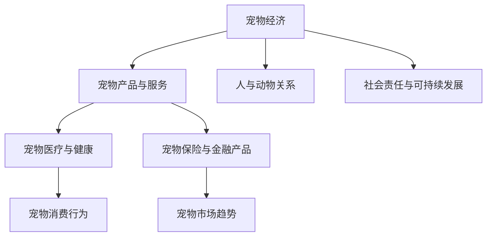

                 

### 文章标题：宠物经济创业：陪伴动物的商业价值

随着社会经济的不断发展，人们对于宠物的需求日益增加，宠物经济也逐渐成为了一个热门的创业领域。本文将围绕宠物经济创业的主题，深入探讨其商业价值、产业链结构、创业机会与挑战，并从多个维度分析宠物经济对人与动物关系、社会责任及可持续发展的影响。通过详细的案例分析，我们将帮助读者了解如何抓住宠物经济的机遇，实现创业成功。

---

关键词：宠物经济、创业机会、商业价值、产业链分析、人与动物关系、社会责任、可持续发展

摘要：本文从多个角度分析了宠物经济创业的背景、现状及未来趋势。通过梳理宠物经济的产业链，探讨了各个细分市场的商业价值。同时，本文结合实际案例，分析了创业者在宠物经济领域的实践经验和成功策略。最后，本文从人与动物关系、社会责任和可持续发展等方面，探讨了宠物经济对社会的影响，为读者提供了全面、深入的参考。

---

### 《宠物经济创业：陪伴动物的商业价值》目录大纲

#### 第一部分：宠物经济概述

##### 第1章：宠物经济的起源与发展

- **1.1 宠物经济的定义与特征**
- **1.2 宠物经济的发展历程**
- **1.3 宠物经济的主要驱动因素**

##### 第2章：宠物市场现状与趋势

- **2.1 宠物市场的基本结构**
- **2.2 宠物消费行为分析**
- **2.3 宠物行业的发展趋势**

#### 第二部分：宠物经济产业链分析

##### 第3章：宠物产品与服务市场

- **3.1 宠物食品市场**
- **3.2 宠物用品市场**
- **3.3 宠物服务市场**

##### 第4章：宠物医疗与健康市场

- **4.1 宠物医疗市场概述**
- **4.2 宠物健康产品与服务**
- **4.3 宠物医疗的发展趋势**

##### 第5章：宠物保险与金融产品

- **5.1 宠物保险的概念与市场**
- **5.2 宠物金融产品的创新**
- **5.3 宠物保险与金融产品的未来趋势**

#### 第三部分：宠物经济创业机会与挑战

##### 第6章：宠物经济创业模式

- **6.1 创业者的选择与定位**
- **6.2 创业案例分享**
- **6.3 创业过程中的风险与应对**

##### 第7章：宠物经济创业实践

- **7.1 创业前的准备**
- **7.2 创业团队的组建**
- **7.3 创业项目的落地**

##### 第8章：宠物经济创业案例研究

- **8.1 某宠物食品品牌案例分析**
- **8.2 某宠物医疗机构案例分析**
- **8.3 某宠物服务公司案例分析**

#### 第四部分：宠物经济与社会的相互影响

##### 第9章：宠物经济对人与动物关系的影响

- **9.1 宠物对个人心理健康的影响**
- **9.2 宠物对社会关系的塑造**
- **9.3 宠物对生态环境的影响**

##### 第10章：宠物经济的社会责任与可持续发展

- **10.1 宠物经济的社会责任**
- **10.2 宠物经济的可持续发展策略**
- **10.3 宠物经济的未来展望**

#### 附录

- **附录A：宠物经济相关资源与工具**
  - **A.1 宠物经济研究报告**
  - **A.2 宠物行业数据库**
  - **A.3 宠物经济相关APP与平台**

---

**核心概念与联系：**

- **Mermaid流程图：**
  mermaid
  graph TD
  A[宠物经济] --> B[宠物产品与服务]
  B --> C[宠物医疗与健康]
  B --> D[宠物保险与金融产品]
  C --> E[宠物消费行为]
  D --> F[宠物市场趋势]
  A --> G[人与动物关系]
  A --> H[社会责任与可持续发展]
  

---

**核心算法原理讲解：**

- **用户行为分析算法（伪代码）：**
  python
  def analyze_user_behavior(data):
      # 数据预处理
      preprocessed_data = preprocess_data(data)
      
      # 特征工程
      features = extract_features(preprocessed_data)
      
      # 模型训练
      model = train_model(features)
      
      # 预测
      predictions = model.predict(new_data)
      
      # 结果解读
      interpret_results(predictions)
      
  

---

**数学模型和数学公式：**

- **线性回归模型公式（LaTeX）：**
  latex
  y = \beta_0 + \beta_1 \cdot x + \epsilon
  

- **解释：**
  - \( y \)：预测结果
  - \( \beta_0 \)：截距
  - \( \beta_1 \)：斜率
  - \( x \)：自变量
  - \( \epsilon \)：误差项

---

**项目实战：**

- **宠物食品销售预测项目案例：**
  - **开发环境搭建：**
    - Python
    - Jupyter Notebook
    - Scikit-learn库
    
  - **源代码实现：**
    python
    import pandas as pd
    from sklearn.model_selection import train_test_split
    from sklearn.linear_model import LinearRegression
    
    # 数据读取
    data = pd.read_csv('pet_food_sales_data.csv')
    
    # 特征选择
    X = data[['广告费用', '促销活动次数']]
    y = data['销售额']
    
    # 数据划分
    X_train, X_test, y_train, y_test = train_test_split(X, y, test_size=0.2, random_state=42)
    
    # 模型训练
    model = LinearRegression()
    model.fit(X_train, y_train)
    
    # 预测
    y_pred = model.predict(X_test)
    
    # 评估
    print("R^2 Score:", model.score(X_test, y_test))
    

  - **代码解读与分析：**
    - 数据预处理：读取数据并选择相关特征
    - 模型训练：使用线性回归模型对数据训练
    - 预测与评估：对新数据进行预测，并计算R^2得分评估模型性能

---

以上为《宠物经济创业：陪伴动物的商业价值》的完整目录大纲。每个章节都将深入探讨相关的概念、算法和实际案例，帮助读者全面了解宠物经济创业的相关内容。希望这个目录大纲能够满足您的需求。如果您有任何其他要求或需要进一步的修改，请随时告知。

---

## 1. 宠物经济的定义与特征

宠物经济，是指围绕宠物产品和服务形成的经济活动，包括宠物食品、用品、医疗保健、金融服务等多个领域。其核心特征主要体现在以下几个方面：

首先，宠物经济具有显著的市场需求驱动特征。随着人们生活水平的提高，宠物已经成为许多家庭的重要成员，消费者对宠物健康、生活质量的关注也日益增加。这不仅推动了宠物食品和用品市场的繁荣，还促进了宠物医疗、美容、培训等服务的快速发展。

其次，宠物经济的消费者群体呈现出多样化和年轻化的趋势。传统观念中，宠物主要由中老年人拥有，但随着“宠二代”和“宠物控”等年轻群体的崛起，宠物市场的消费者结构发生了显著变化。这些年轻消费者更愿意为宠物投入时间和金钱，追求高品质的宠物生活体验。

第三，宠物经济具有强大的产业链条。从宠物养殖、生产到销售、服务，再到宠物金融，各个环节紧密相连，形成了一个完整的生态系统。这不仅为创业者提供了丰富的创业机会，也为宠物经济的持续发展提供了强有力的支撑。

此外，宠物经济还具有明显的区域差异。不同地区的经济发展水平、消费习惯和宠物文化有所不同，导致宠物市场的规模和结构存在差异。例如，一线城市和沿海地区的宠物市场规模较大，消费水平较高，而一些内陆地区则相对落后。

最后，宠物经济具有较强的政策敏感性。政府对宠物行业的监管政策、税收政策等对宠物经济的发展具有重要影响。近年来，我国政府高度重视宠物行业的发展，出台了一系列政策措施，为宠物经济的繁荣创造了良好的外部环境。

## 2. 宠物经济的发展历程

宠物经济的历史可以追溯到几千年前的古代文明。在那时，人们开始驯养野生动物作为伴侣，这标志着宠物经济的初步形成。随着时间的推移，宠物经济逐渐发展壮大，经历了多个重要的历史阶段。

### 2.1 古代阶段的宠物经济

在古代，宠物主要是贵族和富人家庭的奢侈品。这些宠物包括猫、狗、鸟类等，主要是为了装饰家庭和显示主人的社会地位。当时，宠物经济主要集中在宠物饲养、美容和驯养等方面。例如，古埃及人非常喜爱猫，将其视为神圣的动物，并精心饲养。

### 2.2 中世纪至19世纪的宠物经济

中世纪至19世纪，随着城市化进程的加快，宠物经济开始逐渐普及。在这个时期，宠物主要作为家庭娱乐和情感寄托的载体。人们开始将宠物视为家庭成员，对宠物的关爱和投入逐渐增加。这一时期，宠物市场主要以宠物食品和用品为主，如狗粮、猫粮、宠物玩具等。

### 2.3 20世纪的宠物经济

20世纪是宠物经济快速发展的关键时期。随着科技的进步和人们生活水平的提高，宠物经济进入了规模化、专业化的发展阶段。以下是几个重要的发展节点：

- **20世纪20年代：** 宠物行业开始出现专业化的趋势，宠物食品、用品生产逐渐成为独立的产业。同时，宠物医疗和兽医服务也开始得到重视。
  
- **20世纪50年代：** 宠物保险开始出现，为宠物主提供了风险保障。这一创新推动了宠物经济向更高层次的发展。

- **20世纪80年代：** 宠物行业开始向互联网化转型，电商平台和在线服务逐渐普及。这一时期，宠物行业的商业模式和运营模式发生了深刻变革。

- **21世纪初：** 宠物经济进一步向全球化发展，跨国宠物品牌和连锁机构纷纷涌现。同时，宠物智能设备和人工智能技术的应用也为宠物经济注入了新的活力。

### 2.4 宠物经济的新时代

进入21世纪，宠物经济迎来了新的发展机遇。随着人们对宠物健康的关注、对宠物生活品质的追求，宠物经济呈现出多元化、细分化的发展趋势。以下是当前宠物经济的主要特点：

- **个性化服务：** 宠物服务越来越注重个性化，如宠物美容、宠物培训、宠物医疗等，消费者可以根据自己的需求和偏好选择合适的服务。

- **智能化设备：** 宠物智能设备的应用越来越广泛，如宠物智能喂食器、宠物智能追踪器、宠物智能玩具等，这些设备不仅提高了宠物的生活质量，也为宠物经济提供了新的增长点。

- **绿色环保：** 随着环保意识的提高，宠物经济开始注重可持续发展。绿色宠物食品、环保宠物用品等逐渐成为市场的新宠。

- **全球化：** 宠物经济已经不再局限于国内市场，跨国合作和全球化发展趋势日益明显。例如，一些国外宠物品牌开始进入中国市场，而中国的宠物品牌也积极拓展海外市场。

总的来说，宠物经济在过去几千年中经历了从奢侈品到日常生活必需品的转变，从单一的产品销售到多元化的服务提供，从区域性市场到全球市场的拓展。展望未来，宠物经济将继续保持快速发展，成为经济增长的重要驱动力。

## 3. 宠物经济的主要驱动因素

宠物经济的快速发展离不开一系列驱动因素的作用，这些因素包括但不限于消费升级、科技进步、政策支持以及文化演变。以下将对这些驱动因素进行详细分析。

### 3.1 消费升级

随着社会经济的不断发展和人民生活水平的提高，消费者对生活质量的要求越来越高。宠物作为家庭的重要成员，其消费需求也随之升级。首先，消费者对宠物食品和用品的要求越来越高，追求高品质、绿色环保、无添加剂的产品。其次，宠物服务的需求也不断增加，如宠物美容、宠物医疗、宠物训练等。消费升级不仅推动了宠物产品和服务市场的扩大，还促使企业不断创新，提升产品和服务质量，从而进一步刺激宠物经济的发展。

### 3.2 科技进步

科技进步为宠物经济注入了新的活力，推动了行业的快速发展和变革。首先，互联网和电子商务的发展，使得宠物产品和服务更加便捷地触达消费者，促进了市场规模的扩大。其次，智能设备和物联网技术的应用，为宠物生活带来了诸多便利，如宠物智能追踪器、智能喂食器等，这些设备不仅提高了宠物的生活质量，也为宠物经济提供了新的增长点。此外，人工智能和大数据技术的应用，使得宠物行业的数据分析和决策更加科学，有助于企业更好地满足消费者需求，提高运营效率。

### 3.3 政策支持

政府对宠物经济的支持政策也是推动其发展的重要因素。近年来，我国政府高度重视宠物行业的发展，出台了一系列政策措施，包括税收优惠、资金支持、行业标准制定等。例如，政府鼓励企业研发宠物食品和用品，提高产品质量，推动产业升级；同时，加强对宠物医疗和兽医服务的监管，保障宠物健康。此外，政府还积极推动宠物行业的标准化和规范化，提升行业整体水平。政策的支持为宠物经济提供了良好的发展环境，吸引了更多的企业和创业者进入这个领域。

### 3.4 文化演变

文化演变也是宠物经济的重要驱动因素。随着社会文化的变迁，人们对宠物的态度和观念发生了很大变化。在过去，宠物主要是为了生产劳动或娱乐而饲养，而如今，宠物更多的是作为家庭的情感寄托和伙伴。这种文化演变使得宠物在家庭中的地位逐渐提升，消费者对宠物的关爱和投入也不断增加。此外，宠物文化的普及，如宠物时尚、宠物旅行、宠物娱乐等，也为宠物经济带来了新的商机和活力。

### 3.5 社会责任

随着社会对环境保护和动物福利的关注增加，宠物经济也逐渐承担起社会责任。越来越多的企业和组织开始关注宠物养殖的可持续发展，推广绿色养殖和环保理念。例如，一些宠物食品品牌开始使用天然有机原料，减少对环境的污染。此外，宠物行业的绿色环保措施，如减少塑料包装、推广可降解材料等，也为宠物经济注入了新的社会责任价值。

### 3.6 全球化

全球化是推动宠物经济发展的另一个重要因素。随着国际贸易的日益活跃，宠物品牌和产品开始走向全球市场。国际化的宠物品牌不仅带来了先进的技术和理念，还促进了国内外市场的融合，为宠物经济的发展提供了更多机会。同时，全球化也使得宠物消费者能够享受到更丰富的产品和服务，提高了整体消费水平。

综上所述，消费升级、科技进步、政策支持、文化演变、社会责任和全球化等多重因素共同推动了宠物经济的快速发展。在未来，这些驱动因素将继续发挥重要作用，推动宠物经济不断壮大，成为经济增长的重要引擎。

### 2.1 宠物市场的基本结构

宠物市场的基本结构可以从多个维度进行解析，包括市场细分、产品种类、消费群体和区域分布等。理解这些基本结构有助于深入分析宠物经济的运作机制和潜在商机。

#### 2.1.1 市场细分

宠物市场可以根据不同的标准进行细分，常见的细分方式包括以下几种：

- **按宠物类型细分**：宠物市场主要包括猫、狗、鸟类、鱼类、小宠物（如兔子、豚鼠、蜥蜴等）等。每种类型的宠物都有其特定的市场需求和消费习惯。例如，狗粮市场通常需求量大，且品种繁多，包括主食粮、零食、功能粮等；而鸟类市场则更注重鸟食、鸟玩具等产品的开发。

- **按产品功能细分**：宠物产品可以分为主食、零食、保健品、护理用品、医疗用品等。其中，主食和零食占据市场份额最大，而保健品和医疗用品则逐渐受到消费者关注，尤其是在宠物健康问题日益突出的背景下。

- **按消费用途细分**：宠物产品可以分为日常用品、特殊用品、治疗用品等。日常用品包括猫砂、猫草、狗链等，是宠物家庭的必备品；特殊用品如宠物玩具、宠物服装等，则更多是用于满足宠物的娱乐和情感需求；治疗用品如宠物疫苗、药物等，主要用于宠物的疾病预防和治疗。

- **按销售渠道细分**：宠物市场可以通过线上和线下两种渠道进行销售。线上渠道包括电商平台、社交媒体、宠物垂直网站等；线下渠道包括宠物商店、超市、兽医诊所等。不同的销售渠道有不同的特点和适用场景，企业需要根据自身定位和市场环境选择合适的销售渠道。

#### 2.1.2 产品种类

宠物市场的产品种类繁多，主要包括以下几类：

- **食品**：宠物食品是宠物市场的主要产品之一，包括主食、零食、保健品等。其中，主食如狗粮、猫粮是市场主流；零食则包括宠物饼干、肉干等，主要用于奖励和娱乐。

- **用品**：宠物用品包括日常生活用品（如宠物笼、猫砂盆、狗链等）、娱乐用品（如玩具、狗绳等）、护理用品（如宠物美容用品、清洁用品等）。这些产品旨在提升宠物的生活质量，满足宠物主的情感需求。

- **医疗用品**：宠物医疗用品主要包括宠物疫苗、药物、医疗器械等。随着宠物主对宠物健康的重视，宠物医疗用品的市场需求不断增加。

- **服装**：宠物服装是近年来兴起的一个细分市场，包括保暖衣、雨衣、运动服等。这些产品不仅满足宠物的功能需求，也体现了宠物主的生活品味和宠物文化。

- **智能设备**：智能宠物设备如智能喂食器、宠物追踪器、智能玩具等，通过科技手段提升宠物的福利和宠主的体验。

#### 2.1.3 消费群体

宠物市场的消费群体主要分为以下几类：

- **城市居民**：随着城市化进程的加快，城市居民拥有宠物的比例逐年上升。城市居民尤其是年轻人，更愿意为宠物投入时间和金钱，追求高品质的宠物生活体验。

- **中高收入人群**：中高收入人群是宠物市场的主要消费力量，他们更愿意为宠物购买高端产品和优质服务。

- **家庭**：宠物已经成为许多家庭的重要成员，家庭成员共同参与宠物的饲养、护理和娱乐，形成了独特的家庭宠物文化。

- **独居人士**：随着独居人口的增加，宠物成为了许多独居人士的陪伴和情感寄托，对宠物市场的需求也在逐步上升。

#### 2.1.4 区域分布

宠物市场的区域分布受到经济发展水平、消费习惯和宠物文化等因素的影响，呈现出一定的差异：

- **一线城市和发达地区**：一线城市和发达地区经济水平较高，消费者对宠物产品和服务的需求量大且质量要求高，市场规模相对较大。

- **二三线城市和农村地区**：二三线城市和农村地区的宠物市场发展相对滞后，但消费需求也在逐步增长。这些地区的宠物市场更多依赖于传统渠道，如宠物商店和兽医诊所。

- **跨境电商**：随着跨境电商的发展，国际宠物品牌和产品逐渐进入国内市场，为宠物市场的多元化提供了新的机遇。

总的来说，宠物市场的基本结构复杂多样，不同的细分市场和消费群体具有不同的需求和特征。企业需要根据市场细分和消费者行为，制定精准的市场策略，以满足不同消费群体的需求，实现持续增长。

#### 2.2 宠物消费行为分析

宠物消费行为是指消费者在购买和使用宠物产品及服务时的心理和行动过程。了解宠物消费行为有助于企业更好地定位市场、制定营销策略，从而提升市场份额。以下将从消费动机、购买习惯、消费决策和品牌忠诚度等方面对宠物消费行为进行分析。

### 2.2.1 消费动机

宠物主购买宠物产品和服务的主要动机可以归纳为以下几点：

- **情感需求**：宠物成为了许多家庭的情感寄托和陪伴，宠物主希望通过购买和养护宠物来满足自身的情感需求。这类消费者更注重宠物的快乐和幸福，愿意为宠物投入大量时间和金钱。

- **健康需求**：随着宠物健康意识的提高，宠物主对宠物食品和医疗服务的需求不断增加。他们希望通过优质的宠物产品和服务，保障宠物的健康，延长宠物的寿命。

- **娱乐需求**：宠物玩具、宠物服装等娱乐性产品也逐渐受到宠物主的青睐。这类消费者更关注宠物的娱乐和生活质量，希望通过多样化的产品提升宠物的生活体验。

- **社交需求**：宠物也成为社交的重要工具，一些宠物主通过参与宠物活动、加入宠物社群等，扩大社交圈子，增强社交互动。

### 2.2.2 购买习惯

宠物主的购买习惯受到多种因素的影响，包括个人习惯、市场环境和产品特性等。以下是一些主要的购买习惯：

- **线上购买**：随着电子商务的普及，越来越多的宠物主选择在线购买宠物产品和服务。线上渠道的便捷性和丰富性使得宠物主可以轻松比较不同品牌和产品，获取更多的购物选择。

- **线下购买**：线下购买主要依赖于宠物商店、超市和兽医诊所等渠道。线下购买的优势在于可以直接观察和体验产品，与销售人员交流，获取更详细的购物建议。

- **品牌选择**：品牌是影响宠物主购买决策的重要因素。一些知名品牌凭借其产品质量、口碑和服务，赢得了宠物主的信任和忠诚。同时，一些新兴品牌通过创新和差异化策略，也在市场上占据了一席之地。

- **促销活动**：宠物主往往对促销活动敏感，特别是打折、满减、赠品等促销手段。促销活动不仅能够吸引新客户，还能提升老客户的复购率。

### 2.2.3 消费决策

宠物主的消费决策过程通常包括以下步骤：

- **信息搜索**：宠物主在购买宠物产品和服务前，会通过各种渠道获取相关信息，如产品评测、用户评价、专家推荐等。

- **品牌比较**：在获取到足够的信息后，宠物主会对不同品牌的产品进行比较，考虑产品的质量、价格、售后服务等因素。

- **购买决策**：在比较和权衡后，宠物主会做出购买决策，选择最符合自身需求的品牌和产品。

- **购买实施**：宠物主会通过线上或线下渠道进行购买，并关注物流和售后服务。

### 2.2.4 品牌忠诚度

品牌忠诚度是指宠物主对某一品牌持续购买的意愿和偏好。影响品牌忠诚度的因素主要包括：

- **产品质量**：高质量的产品是品牌忠诚度的基石。宠物主对宠物的健康和幸福非常关注，因此对产品质量要求较高。

- **品牌形象**：品牌形象包括品牌声誉、品牌价值观和品牌个性等。一个具有良好品牌形象的宠物品牌更容易赢得宠物主的信任和忠诚。

- **售后服务**：优质的售后服务能够提升消费者满意度，增强品牌忠诚度。例如，提供高效的客户支持、完善的退换货政策等。

- **品牌互动**：品牌与消费者之间的互动也能够增强品牌忠诚度。通过社交媒体、用户论坛等渠道，品牌可以与消费者建立更紧密的联系，提升品牌认知度和用户粘性。

总的来说，宠物消费行为复杂多样，企业需要深入了解宠物主的需求和习惯，制定精准的营销策略，以满足不同消费者的需求，提升品牌忠诚度。同时，不断创新和提升产品质量，是保持市场竞争力的重要手段。

#### 2.3 宠物行业的发展趋势

随着社会经济的发展和人们生活水平的提高，宠物行业正经历着前所未有的变革，呈现出多个显著的发展趋势。以下将重点分析宠物行业的未来发展动向。

### 2.3.1 智能化与数字化

智能化和数字化是当前宠物行业发展的主要趋势之一。随着人工智能和大数据技术的不断进步，宠物行业开始广泛应用这些先进技术，以提高运营效率、优化用户体验。例如，智能宠物设备（如智能喂食器、智能宠物追踪器）能够实时监控宠物的健康状况，提供个性化的护理建议。此外，数字化技术也在宠物行业中得到广泛应用，通过电子商务平台、社交媒体和移动应用，宠物主能够更加便捷地购买宠物产品和服务，同时企业也能够通过数据分析了解消费者需求，实现精准营销。

### 2.3.2 绿色与可持续发展

环保意识的提升使得绿色和可持续发展成为宠物行业的重要趋势。越来越多的消费者倾向于选择环保、天然、无添加的宠物食品和用品，这不仅有助于保护环境，也符合健康和可持续发展的理念。宠物企业需要积极响应这一趋势，通过使用可降解材料、减少塑料使用、推广绿色包装等方式，实现可持续发展。同时，企业还可以通过宣传环保理念、参与公益活动等，提升品牌形象，赢得消费者的信任和支持。

### 2.3.3 个性化和定制化

个性化消费已成为当今社会的主流，宠物行业也不例外。随着消费者对宠物关爱程度的加深，他们对于宠物产品和服务的需求也越来越个性化和定制化。宠物企业需要根据消费者的需求，提供多样化的选择，如定制化的宠物食品、个性化的宠物服装和玩具等。此外，企业可以通过大数据分析和人工智能技术，实现个性化推荐，为宠物主提供更加精准的购物体验。

### 2.3.4 健康与医疗服务

宠物健康是消费者最为关心的问题之一。随着宠物医疗技术的进步和消费者对宠物健康意识的提高，宠物医疗服务市场需求不断增长。未来，宠物医疗市场将呈现以下几个发展趋势：

- **高端医疗服务**：高端宠物医院和专科医疗中心逐渐增多，提供更加专业和全面的医疗服务，满足消费者对宠物健康的高标准需求。

- **预防医学**：宠物主对宠物预防医学的认识不断提高，宠物疫苗、驱虫等预防性医疗服务的需求不断增加。

- **远程医疗服务**：随着互联网技术的发展，远程医疗服务在宠物行业中的应用越来越广泛，宠物主可以通过线上平台进行健康咨询和预约就诊，提高医疗服务的便捷性和效率。

### 2.3.5 全球化与国际化

全球化是现代经济的必然趋势，宠物行业也不例外。国际宠物品牌和产品逐渐进入国内市场，国内宠物品牌也开始拓展海外市场。全球化带来的不仅是产品和技术的交流，还有消费理念和文化的影响。宠物企业需要积极适应全球化趋势，通过跨境电商、国际合作等方式，拓宽市场渠道，提升品牌影响力。

### 2.3.6 社会责任与伦理

随着社会对动物福利和环境保护的关注增加，宠物行业也面临着更多的社会责任和伦理挑战。企业需要关注宠物的福利，推动人道养殖和合理消费。同时，企业还需要承担环境保护责任，通过绿色生产和环保措施，减少对环境的负面影响。社会责任和伦理不仅关系到企业的长远发展，也是品牌形象的重要组成部分。

总之，宠物行业正面临着智能化、数字化、绿色化、个性化、健康化、全球化和社会责任化等多重趋势。企业需要紧跟这些趋势，不断创新和优化，以满足消费者需求，实现可持续发展。

### 3.1 宠物食品市场

宠物食品市场是宠物经济的重要组成部分，涵盖了宠物主食、零食、功能食品等多个细分领域。随着消费者对宠物健康和生活质量的关注不断提升，宠物食品市场呈现出快速发展的态势。

#### 3.1.1 市场规模与增长趋势

根据市场研究报告，全球宠物食品市场规模逐年扩大，预计到2025年将达到数百亿美元。其中，亚太地区和北美地区是增长最快的两个市场。在中国，随着宠物数量的增加和消费升级，宠物食品市场也呈现出强劲的增长势头。预计未来几年，中国宠物食品市场的年均增长率将保持在10%以上。

#### 3.1.2 产品种类与特点

宠物食品市场产品种类丰富，主要包括以下几类：

- **主食**：主食是宠物的主要营养来源，包括狗粮、猫粮等。这些产品通常根据宠物的年龄、体重和健康状况进行分类，如幼犬粮、成犬粮、老年犬粮、幼猫粮等。随着消费者对宠物营养需求的重视，功能性主食（如低脂肪、低糖、高蛋白等）越来越受到欢迎。

- **零食**：零食是宠物食品市场的重要组成部分，主要用于奖励和娱乐。零食种类多样，包括肉干、饼干、骨棒等。一些高端宠物零食还添加了维生素和矿物质，以满足宠物的营养需求。

- **功能食品**：功能食品是近年来新兴的宠物食品类别，主要包括营养补充剂、保健食品等。这类产品旨在改善宠物的健康问题，如美毛、增强免疫力、缓解关节炎等。消费者对功能食品的需求逐渐增加，推动了这一市场的快速发展。

#### 3.1.3 消费者行为分析

宠物食品消费者的行为特点主要体现在以下几个方面：

- **消费动机**：消费者购买宠物食品的主要动机是保障宠物的健康和幸福。此外，一些消费者还希望通过宠物食品表达对宠物的关爱和陪伴。

- **购买习惯**：随着电子商务的普及，越来越多的消费者选择在线购买宠物食品。在线购买方便快捷，产品种类丰富，消费者可以根据自己的需求进行选择。同时，线下渠道（如宠物店、超市等）仍然是重要的购买渠道，尤其是对于一些高端宠物食品和品牌忠诚度较高的消费者。

- **品牌选择**：品牌是影响宠物食品消费者购买决策的重要因素。消费者更倾向于选择知名品牌和高品质产品，这些品牌往往具有更好的质量保障和售后服务。

- **促销活动**：消费者对促销活动较为敏感，特别是在节假日期间，促销活动能够显著提升销售额。

#### 3.1.4 市场竞争格局

宠物食品市场竞争激烈，主要参与者包括国际知名品牌和国内新兴品牌。国际品牌凭借其先进的技术、丰富的产品线和强大的品牌影响力，占据了一定的市场份额。国内品牌则通过差异化和本土化策略，逐步在市场中占据一席之地。以下是一些主要的市场竞争格局：

- **国际品牌**：如玛氏、雀巢、希尔思等国际巨头在宠物食品市场中占据重要地位。这些品牌拥有强大的研发能力和市场推广能力，产品覆盖多个细分市场。

- **国内品牌**：如冠能、卫塔、比瑞吉等国内品牌通过差异化竞争，逐渐在市场中崭露头角。这些品牌注重产品创新和本土化营销，满足了消费者多样化的需求。

- **新兴品牌**：近年来，一些新兴品牌通过互联网营销和社交化传播，快速崛起。这些品牌注重用户体验和品牌形象，通过社交媒体和电商平台，实现了迅速的市场扩张。

#### 3.1.5 发展策略与趋势

在宠物食品市场中，企业需要采取以下策略和趋势来应对竞争和消费者需求的变化：

- **产品创新**：企业应不断推出新产品，满足消费者对多样化和个性化需求。例如，开发功能性宠物食品、天然有机食品等。

- **品牌建设**：通过提升品牌形象和口碑，增强消费者信任和忠诚度。企业可以通过广告宣传、公益活动等方式，提升品牌知名度和美誉度。

- **渠道拓展**：拓展线上和线下销售渠道，实现多渠道销售。通过电商平台、社交媒体和线下实体店等渠道，提高产品的覆盖率和市场渗透率。

- **数字化营销**：利用大数据和人工智能技术，实现精准营销和用户互动。通过用户数据分析，了解消费者需求，提供个性化的产品和服务。

- **环保理念**：响应绿色消费趋势，注重环保和可持续发展。通过使用可降解材料、减少塑料使用等方式，降低对环境的影响。

总的来说，宠物食品市场充满机遇和挑战。企业需要紧跟市场趋势，不断创新和优化，以满足消费者需求，实现可持续发展。

### 3.2 宠物用品市场

宠物用品市场是宠物经济的重要组成部分，涵盖了宠物服装、宠物玩具、宠物护理用品等多个细分领域。随着宠物经济和宠物文化的不断发展，宠物用品市场需求旺盛，呈现出多样化的趋势。

#### 3.2.1 市场规模与增长趋势

根据市场研究报告，全球宠物用品市场规模逐年扩大，预计到2025年将达到数百亿美元。其中，亚太地区和北美地区是增长最快的两个市场。在中国，随着宠物数量的增加和消费升级，宠物用品市场也呈现出强劲的增长势头。预计未来几年，中国宠物用品市场的年均增长率将保持在10%以上。

#### 3.2.2 产品种类与特点

宠物用品市场产品种类丰富，主要包括以下几类：

- **宠物服装**：宠物服装是宠物用品市场的重要细分领域，包括秋冬装、春夏装、宠物雨衣、宠物泳衣等。宠物服装不仅能够满足宠物的保暖和防晒需求，还体现了宠物主的生活品味和宠物文化。

- **宠物玩具**：宠物玩具是宠物日常娱乐和锻炼的重要工具，包括咬咬胶、猫抓板、毛绒玩具、智能玩具等。宠物玩具种类多样，功能多样，能够满足不同宠物和宠物主的需求。

- **宠物护理用品**：宠物护理用品包括宠物清洁用品、宠物保健品、宠物美容用品等。这些产品旨在提升宠物的生活质量和健康水平，如宠物洗澡液、宠物牙膏、宠物营养补充剂等。

#### 3.2.3 消费者行为分析

宠物用品消费者的行为特点主要体现在以下几个方面：

- **消费动机**：消费者购买宠物用品的主要动机是满足宠物的需求，保障宠物的健康和幸福。此外，一些消费者还希望通过宠物用品表达对宠物的关爱和陪伴。

- **购买习惯**：随着电子商务的普及，越来越多的消费者选择在线购买宠物用品。在线购买方便快捷，产品种类丰富，消费者可以根据自己的需求进行选择。同时，线下渠道（如宠物店、超市等）仍然是重要的购买渠道，尤其是对于一些高端宠物用品和品牌忠诚度较高的消费者。

- **品牌选择**：品牌是影响宠物用品消费者购买决策的重要因素。消费者更倾向于选择知名品牌和高品质产品，这些品牌往往具有更好的质量保障和售后服务。

- **促销活动**：消费者对促销活动较为敏感，特别是在节假日期间，促销活动能够显著提升销售额。

#### 3.2.4 市场竞争格局

宠物用品市场竞争激烈，主要参与者包括国际知名品牌和国内新兴品牌。国际品牌凭借其先进的技术、丰富的产品线和强大的品牌影响力，占据了一定的市场份额。国内品牌则通过差异化和本土化策略，逐步在市场中占据一席之地。以下是一些主要的市场竞争格局：

- **国际品牌**：如玛氏、雀巢、希尔思等国际巨头在宠物用品市场中占据重要地位。这些品牌拥有强大的研发能力和市场推广能力，产品覆盖多个细分市场。

- **国内品牌**：如卫塔、比瑞吉、小佩等国内品牌通过差异化竞争，逐渐在市场中崭露头角。这些品牌注重产品创新和本土化营销，满足了消费者多样化的需求。

- **新兴品牌**：近年来，一些新兴品牌通过互联网营销和社交化传播，快速崛起。这些品牌注重用户体验和品牌形象，通过社交媒体和电商平台，实现了迅速的市场扩张。

#### 3.2.5 发展策略与趋势

在宠物用品市场中，企业需要采取以下策略和趋势来应对竞争和消费者需求的变化：

- **产品创新**：企业应不断推出新产品，满足消费者对多样化和个性化需求。例如，开发智能宠物玩具、环保宠物服装等。

- **品牌建设**：通过提升品牌形象和口碑，增强消费者信任和忠诚度。企业可以通过广告宣传、公益活动等方式，提升品牌知名度和美誉度。

- **渠道拓展**：拓展线上和线下销售渠道，实现多渠道销售。通过电商平台、社交媒体和线下实体店等渠道，提高产品的覆盖率和市场渗透率。

- **数字化营销**：利用大数据和人工智能技术，实现精准营销和用户互动。通过用户数据分析，了解消费者需求，提供个性化的产品和服务。

- **环保理念**：响应绿色消费趋势，注重环保和可持续发展。通过使用可降解材料、减少塑料使用等方式，降低对环境的影响。

总的来说，宠物用品市场充满机遇和挑战。企业需要紧跟市场趋势，不断创新和优化，以满足消费者需求，实现可持续发展。

### 3.3 宠物服务市场

宠物服务市场是宠物经济的重要组成部分，涵盖了宠物美容、宠物医疗、宠物训练等多个细分领域。随着宠物经济的发展和消费者对宠物生活质量要求的提升，宠物服务市场呈现出快速增长的态势。

#### 3.3.1 市场规模与增长趋势

根据市场研究报告，全球宠物服务市场规模逐年扩大，预计到2025年将达到数百亿美元。其中，亚太地区和北美地区是增长最快的两个市场。在中国，随着宠物数量的增加和消费升级，宠物服务市场也呈现出强劲的增长势头。预计未来几年，中国宠物服务市场的年均增长率将保持在10%以上。

#### 3.3.2 服务种类与特点

宠物服务市场服务种类丰富，主要包括以下几类：

- **宠物美容**：宠物美容是宠物服务市场的主要服务之一，包括洗澡、修剪毛发、美容护理等。随着消费者对宠物美容需求的增加，宠物美容服务逐渐向专业化、精细化方向发展，提供的服务内容也越来越多样化。

- **宠物医疗**：宠物医疗是保障宠物健康的重要服务，包括宠物疾病治疗、疫苗接种、健康检查等。随着宠物主对宠物健康重视程度的提高，宠物医疗服务市场也呈现出快速增长的趋势。

- **宠物训练**：宠物训练是培养宠物良好行为习惯的重要服务，包括基本服从训练、社交训练、特殊技能训练等。宠物训练不仅能够提高宠物的综合素质，还能增进宠物主与宠物之间的互动和感情。

#### 3.3.3 消费者行为分析

宠物服务消费者的行为特点主要体现在以下几个方面：

- **消费动机**：消费者选择宠物服务的主要动机是保障宠物的健康和幸福，提高宠物的生活质量。此外，一些消费者还希望通过宠物服务表达对宠物的关爱和陪伴。

- **购买习惯**：随着电子商务的普及，越来越多的消费者选择在线购买宠物服务。在线购买方便快捷，消费者可以根据自己的需求进行选择。同时，线下渠道（如宠物店、宠物医院等）仍然是重要的购买渠道，尤其是对于一些高端宠物服务和品牌忠诚度较高的消费者。

- **品牌选择**：品牌是影响宠物服务消费者购买决策的重要因素。消费者更倾向于选择知名品牌和高品质服务，这些品牌往往具有更好的质量保障和售后服务。

- **促销活动**：消费者对促销活动较为敏感，特别是在节假日期间，促销活动能够显著提升销售额。

#### 3.3.4 市场竞争格局

宠物服务市场竞争激烈，主要参与者包括国际知名品牌和国内新兴品牌。国际品牌凭借其先进的技术、丰富的产品线和强大的品牌影响力，占据了一定的市场份额。国内品牌则通过差异化和本土化策略，逐步在市场中占据一席之地。以下是一些主要的市场竞争格局：

- **国际品牌**：如玛氏、希尔思、冠能等国际巨头在宠物服务市场中占据重要地位。这些品牌拥有强大的研发能力和市场推广能力，产品覆盖多个细分市场。

- **国内品牌**：如卫塔、宠医界、宠福鑫等国内品牌通过差异化竞争，逐渐在市场中崭露头角。这些品牌注重产品创新和本土化营销，满足了消费者多样化的需求。

- **新兴品牌**：近年来，一些新兴品牌通过互联网营销和社交化传播，快速崛起。这些品牌注重用户体验和品牌形象，通过社交媒体和电商平台，实现了迅速的市场扩张。

#### 3.3.5 发展策略与趋势

在宠物服务市场中，企业需要采取以下策略和趋势来应对竞争和消费者需求的变化：

- **服务创新**：企业应不断推出新产品，满足消费者对多样化和个性化需求。例如，开发智能宠物美容设备、宠物远程健康检查等。

- **品牌建设**：通过提升品牌形象和口碑，增强消费者信任和忠诚度。企业可以通过广告宣传、公益活动等方式，提升品牌知名度和美誉度。

- **渠道拓展**：拓展线上和线下销售渠道，实现多渠道销售。通过电商平台、社交媒体和线下实体店等渠道，提高产品的覆盖率和市场渗透率。

- **数字化营销**：利用大数据和人工智能技术，实现精准营销和用户互动。通过用户数据分析，了解消费者需求，提供个性化的产品和服务。

- **环保理念**：响应绿色消费趋势，注重环保和可持续发展。通过使用可降解材料、减少塑料使用等方式，降低对环境的影响。

总的来说，宠物服务市场充满机遇和挑战。企业需要紧跟市场趋势，不断创新和优化，以满足消费者需求，实现可持续发展。

### 4.1 宠物医疗市场概述

宠物医疗市场是宠物经济中的重要组成部分，涵盖了宠物疾病预防、诊断、治疗和康复等各个环节。随着宠物主对宠物健康的重视程度不断提高，宠物医疗市场呈现出快速发展的态势。

#### 4.1.1 市场规模与增长趋势

根据市场研究报告，全球宠物医疗市场规模逐年扩大，预计到2025年将达到数百亿美元。其中，亚太地区和北美地区是增长最快的两个市场。在中国，随着宠物数量的增加和消费升级，宠物医疗市场也呈现出强劲的增长势头。预计未来几年，中国宠物医疗市场的年均增长率将保持在10%以上。

#### 4.1.2 行业结构

宠物医疗市场主要包括以下几个细分领域：

- **宠物诊所**：宠物诊所是宠物医疗市场的基础设施，提供常规的宠物医疗服务，如疾病预防、健康检查、疾病诊断和治疗等。宠物诊所通常分为小型诊所和大型诊所，小型诊所通常服务于周边社区，而大型诊所则提供更全面的医疗服务。

- **宠物医院**：宠物医院是提供综合性医疗服务的医疗机构，包括疾病治疗、高级诊断、手术治疗、康复治疗等。宠物医院通常配备先进的医疗设备和专业的兽医团队，提供高端的宠物医疗服务。

- **宠物药品**：宠物药品市场包括处方药品和非处方药品。处方药品主要依赖兽医开具处方，用于治疗宠物疾病；非处方药品则可以直接在宠物商店或在线平台上购买，用于日常保健和预防。

- **宠物保健品**：宠物保健品市场包括营养补充剂、保健食品等，旨在增强宠物的免疫力、改善皮肤和毛发质量等。

#### 4.1.3 主要参与者

宠物医疗市场的主要参与者包括以下几类：

- **国际宠物医疗集团**：如美国辉瑞、瑞士诺华、法国默克等，这些国际巨头在宠物医疗领域拥有强大的研发能力和市场推广能力，提供高质量的宠物药品和医疗服务。

- **国内宠物医疗企业**：如瑞鹏宠物医疗、瑞派宠物医疗等，这些国内企业通过并购、扩张等方式，逐步在市场中占据重要地位，提供多样化的宠物医疗产品和服务。

- **新兴宠物医疗品牌**：近年来，一些新兴宠物医疗品牌通过互联网营销和品牌塑造，快速崛起。这些品牌注重用户体验和品牌形象，通过电商平台和线下实体店，实现了迅速的市场扩张。

### 4.2 宠物健康产品与服务

宠物健康产品与服务是保障宠物健康和生活质量的重要手段，涵盖了宠物食品、保健品、医疗用品等多个领域。随着宠物主对宠物健康的重视，宠物健康产品与服务的市场需求不断增加。

#### 4.2.1 市场规模与增长趋势

根据市场研究报告，全球宠物健康产品与服务市场规模逐年扩大，预计到2025年将达到数百亿美元。其中，亚太地区和北美地区是增长最快的两个市场。在中国，随着宠物数量的增加和消费升级，宠物健康产品与服务市场也呈现出强劲的增长势头。预计未来几年，中国宠物健康产品与服务市场的年均增长率将保持在10%以上。

#### 4.2.2 主要产品与服务

宠物健康产品与服务主要包括以下几类：

- **宠物食品**：宠物食品是宠物健康的基础，包括主食、零食、功能食品等。功能性宠物食品如美毛食品、增强免疫力的食品等，越来越受到宠物主的青睐。

- **宠物保健品**：宠物保健品包括营养补充剂、维生素、矿物质等，旨在增强宠物的免疫力、改善皮肤和毛发质量等。例如，宠物钙片、维生素片等。

- **医疗用品**：医疗用品包括宠物疫苗、驱虫药、医疗器械等。宠物疫苗是预防宠物疾病的重要手段，驱虫药则用于防治寄生虫病。

- **宠物护理用品**：宠物护理用品包括宠物清洁用品、宠物保健用品等，如宠物洗发水、宠物按摩器等。

#### 4.2.3 发展趋势

宠物健康产品与服务市场的发展趋势主要体现在以下几个方面：

- **个性化与定制化**：随着消费者对宠物健康的关注，个性化与定制化的宠物健康产品与服务越来越受欢迎。例如，根据宠物的年龄、体重和健康状况，定制化宠物食品和保健品。

- **智能化与数字化**：智能设备和数字化技术在宠物健康产品与服务中的应用越来越广泛。例如，智能宠物喂食器、宠物健康监测设备等，通过实时监控宠物的健康状况，提供个性化的护理建议。

- **绿色与可持续发展**：环保和可持续发展理念逐渐深入人心，宠物健康产品与服务的绿色化趋势愈发明显。例如，采用天然有机原料、减少塑料使用等。

- **国际化与全球化**：随着全球化的发展，国际宠物健康产品与服务的市场逐渐打开。国内宠物健康产品与服务企业通过跨境电商和国际合作，扩大市场份额。

总的来说，宠物健康产品与服务市场具有巨大的发展潜力。企业需要紧跟市场趋势，不断创新和优化，以满足消费者需求，实现可持续发展。

### 4.3 宠物医疗的发展趋势

随着科技的进步和消费者需求的提升，宠物医疗行业正迎来一系列新的发展趋势，这些趋势不仅将深刻改变行业的运营模式，还可能带来全新的商业模式和市场机会。

#### 4.3.1 智能医疗设备的普及

智能医疗设备的普及是宠物医疗行业的重要趋势之一。这些设备包括智能监测设备、远程诊断设备和智能手术机器人等。智能监测设备能够实时监测宠物的生理参数，如心率、体温、呼吸频率等，通过数据分析，为宠物提供个性化的健康建议。远程诊断设备则使得宠物主无需亲自前往医院，就能获得专业的医疗诊断。智能手术机器人的应用进一步提高了手术的精度和安全性，特别是在复杂手术中，效果尤为显著。

#### 4.3.2 大数据和人工智能的应用

大数据和人工智能技术在宠物医疗中的应用日益广泛，为疾病预测、诊断和治疗提供了强有力的支持。通过收集和分析大量宠物健康数据，可以建立复杂的疾病预测模型，提前预警潜在的健康问题。人工智能算法可以辅助兽医进行疾病诊断，提高诊断的准确性和效率。此外，人工智能技术还可以优化药物研发和治疗方案，通过模拟不同的治疗方案，找到最有效的治疗方法。

#### 4.3.3 在线医疗服务的兴起

在线医疗服务是宠物医疗行业的一大新兴趋势。随着互联网技术的不断发展，越来越多的宠物主人开始选择在线咨询、远程诊断和在线购药等便捷服务。在线医疗服务不仅提高了医疗服务的覆盖面和便捷性，还为宠物主人提供了更多的选择。未来，在线医疗服务有望进一步整合线上线下资源，实现无缝连接，为宠物主人提供全方位的医疗服务。

#### 4.3.4 个性化医疗的兴起

个性化医疗是医学领域的热点话题，在宠物医疗中同样具有重要意义。个性化医疗强调根据宠物的具体健康状况、遗传背景和生活方式，制定个性化的治疗和护理方案。这种个性化的医疗服务模式不仅可以提高治疗效果，还可以减少不必要的医疗资源浪费。未来，随着基因技术和生物信息学的发展，宠物医疗的个性化程度将进一步提升。

#### 4.3.5 宠物医疗生态系统的构建

宠物医疗生态系统的构建是宠物医疗行业发展的一个重要方向。这个生态系统包括医疗机构、药品供应商、医疗器械制造商、互联网平台等多个环节，通过协同合作，实现资源的最优化配置和服务的最大化便利。例如，医疗机构可以通过与药品供应商和医疗器械制造商的合作，为宠物主人提供一站式服务，从而提升用户体验。互联网平台则可以为医疗机构提供数据支持和运营工具，提升医疗服务的效率和品质。

#### 4.3.6 绿色医疗和可持续发展

随着环保意识的提高，绿色医疗和可持续发展成为宠物医疗行业的重要议题。企业需要关注环保材料的使用、废弃物的处理和绿色生产流程等，以减少对环境的影响。同时，可持续发展理念还要求企业在追求经济效益的同时，关注社会效益和生态效益，推动宠物医疗行业的可持续发展。

总的来说，宠物医疗行业正迎来智能化、数字化、个性化、生态化和绿色化的新趋势。企业需要紧跟这些趋势，不断创新和优化，以满足消费者对高质量医疗服务的需求，实现行业的可持续发展。

### 5.1 宠物保险的概念与市场

宠物保险是一种为宠物提供风险保障的金融服务，旨在为宠物主在宠物发生意外或疾病时提供经济补偿。它类似于人的医疗保险，但针对的对象是宠物。宠物保险的主要目的是减轻宠物主因宠物疾病或意外所造成的经济损失，确保宠物能够得到及时和专业的治疗。

#### 5.1.1 宠物保险的基本概念

宠物保险通常包括以下几种类型：

- **意外保险**：覆盖宠物由于意外事故（如交通事故、摔伤、咬伤等）造成的伤害治疗费用。
- **疾病保险**：为宠物因疾病（如感冒、消化不良、肿瘤等）产生的医疗费用提供保障。
- **综合保险**：同时覆盖意外和疾病两种风险的保险，提供最全面的保障。

宠物保险的保障范围通常包括医疗费用、住院费用、手术费用、药物治疗费用等，部分保险还提供疫苗接种、体检、康复费用等附加服务。同时，宠物保险一般设有免赔额、赔付比例、赔付限额等条款，以平衡保险公司的风险和客户的保障需求。

#### 5.1.2 宠物保险市场的现状

全球宠物保险市场近年来呈现出快速增长的趋势，尤其在美国、欧洲等发达国家，宠物保险的普及率较高。根据市场研究数据显示，美国宠物保险市场的渗透率已经达到20%以上，而中国和欧洲的宠物保险市场也正处于快速发展阶段。

- **美国市场**：美国是宠物保险的先驱，市场规模和产品种类均较为丰富。美国主要的宠物保险公司包括Petplan、ASPCA、Pethealth等，这些公司提供多种类型的宠物保险产品，满足不同宠物主的需求。

- **欧洲市场**：欧洲的宠物保险市场发展较为成熟，主要国家如英国、德国、法国等，宠物保险的渗透率也较高。欧洲市场注重宠物健康和福利，宠物保险产品种类丰富，保障范围广泛。

- **中国市场**：中国宠物保险市场起步较晚，但近年来发展迅速。随着宠物数量的增加和消费者对宠物健康的重视，宠物保险市场潜力巨大。目前，中国的主要宠物保险公司包括众安保险、平安保险、人保财险等，这些公司通过线上线下渠道积极拓展市场。

#### 5.1.3 宠物保险市场的需求与挑战

宠物保险市场的需求主要来源于以下几个方面：

- **宠物主对宠物健康的关注**：随着宠物地位的提升，宠物主对宠物的健康和福利越来越重视，宠物保险成为保障宠物健康的一种有效手段。
- **宠物医疗费用的增加**：宠物医疗费用逐年上升，宠物保险可以减轻宠物主的经济负担，使得宠物在发生疾病或意外时能够得到及时和专业的治疗。
- **政策支持**：一些国家和地区政府出台政策，鼓励宠物主购买宠物保险，以降低宠物医疗费用，提高宠物福利。

然而，宠物保险市场也面临一些挑战：

- **市场认知度不高**：尽管宠物保险能够为宠物主提供保障，但市场认知度仍然较低，许多宠物主对宠物保险的作用和重要性认识不足。
- **产品设计复杂**：宠物保险产品种类繁多，条款复杂，宠物主在选择时往往感到困惑，难以做出明智的决策。
- **赔付率波动**：宠物保险的赔付率受多种因素影响，如宠物健康状况、保险条款等，导致保险公司面临一定的风险。

#### 5.1.4 未来发展趋势

未来，宠物保险市场有望继续保持快速增长，主要趋势包括：

- **产品创新**：保险公司将不断创新，推出更符合消费者需求的宠物保险产品，如按需投保、按年龄段投保等。
- **数字化服务**：通过互联网和移动应用，提供在线咨询、在线理赔等数字化服务，提升用户体验。
- **跨行业合作**：宠物保险公司与宠物医疗、宠物用品等企业合作，打造完整的宠物健康管理生态圈。
- **政策支持**：政府加大对宠物保险的扶持力度，出台更多优惠政策，鼓励宠物主购买宠物保险。

总的来说，宠物保险市场具有巨大的发展潜力。通过不断创新和优化，宠物保险将为宠物主提供更全面、便捷的保障，促进宠物经济的健康发展。

### 5.2 宠物金融产品的创新

随着宠物经济的蓬勃发展，宠物金融产品也逐渐受到市场的关注。这些金融产品不仅为宠物主提供了多样化的理财选择，也为宠物行业的快速发展提供了资金支持。以下将详细探讨宠物金融产品的创新和发展。

#### 5.2.1 宠物理财产品

宠物理财产品是近年来兴起的一种新型金融产品，旨在为宠物主提供投资渠道，同时帮助宠物主实现资产的保值增值。这些产品通常具有以下特点：

- **投资期限灵活**：宠物理财产品通常提供多种投资期限，如短期（1-3个月）、中期（6-12个月）和长期（1年以上），投资者可以根据自身需求和风险偏好进行选择。

- **投资风险较低**：由于宠物理财产品通常与宠物保险、宠物医疗等稳健行业相关，因此其投资风险相对较低，适合风险偏好较低的投资者。

- **预期收益合理**：宠物理财产品的预期收益率通常在4%-8%之间，虽然相比其他高风险投资产品收益率较低，但风险也相对较低，适合寻求稳定收益的投资者。

- **投资门槛较低**：宠物理财产品通常设有较低的投资门槛，部分产品甚至低至几百元，使得更多宠物主能够参与到理财中来。

#### 5.2.2 宠物贷款

宠物贷款是一种为宠物主提供短期资金支持的服务，主要用于购买宠物用品、宠物医疗、宠物美容等费用。宠物贷款具有以下特点：

- **贷款额度灵活**：宠物贷款的额度通常根据宠物主的经济状况和偿还能力而定，从几千元到几万元不等。

- **还款方式多样**：宠物贷款通常提供多种还款方式，如等额本息、等本递减等，方便宠物主根据自己的经济状况选择合适的还款方式。

- **贷款期限灵活**：宠物贷款的贷款期限通常在1-3年之间，宠物主可以根据自己的还款能力和资金需求选择合适的贷款期限。

- **申请流程简便**：宠物贷款的申请流程通常较为简便，宠物主可以通过线上或线下渠道快速办理贷款，提高了贷款的便捷性。

宠物贷款不仅为宠物主提供了购买宠物品和服务所需的资金，还降低了宠物主的经济压力，使得更多宠物主能够享受到优质的宠物生活。

#### 5.2.3 宠物众筹

宠物众筹是一种通过互联网平台筹集资金的创新模式，主要用于支持宠物相关的项目或产品开发。宠物众筹具有以下特点：

- **投资门槛低**：宠物众筹的投资门槛通常较低，投资者可以用较少的资金参与到宠物项目或产品的开发中，降低了投资风险。

- **风险共担**：宠物众筹使投资者能够与项目方共同承担风险，项目成功后，投资者将获得相应的回报。

- **多样化回报**：宠物众筹的回报形式多样，包括产品折扣、优先体验权、项目命名权等，增加了投资者的参与感和获得感。

- **平台保障**：许多宠物众筹平台提供项目保障机制，确保投资者的资金安全，降低了投资风险。

宠物众筹不仅为宠物项目或产品提供了资金支持，还为宠物行业带来了新的发展机遇，促进了创新和创业。

#### 5.2.4 宠物投资基金

宠物投资基金是一种通过集合投资者资金，投资于宠物相关企业的金融产品。宠物投资基金具有以下特点：

- **专业管理**：宠物投资基金通常由专业投资团队管理，对宠物行业有深入的研究和分析，能够为投资者提供专业的投资建议。

- **分散投资**：宠物投资基金通过投资多个宠物相关企业，实现了投资风险的分散，降低了单一投资风险。

- **长期投资**：宠物投资基金通常进行长期投资，关注企业的长期价值，通过持续的投资回报实现投资者的收益。

- **退出机制**：宠物投资基金通常设有明确的退出机制，使投资者能够在合适的时间点实现资金的回收。

宠物投资基金不仅为宠物行业提供了资金支持，还促进了行业内的创新和整合，推动了宠物行业的可持续发展。

总之，宠物金融产品的创新为宠物主和宠物行业带来了诸多便利和机遇。随着宠物经济的不断壮大，宠物金融产品有望在未来的发展中发挥更大的作用。

### 5.3 宠物保险与金融产品的未来趋势

随着宠物经济的持续发展，宠物保险与金融产品在市场中的地位和影响力不断提升。未来，宠物保险与金融产品将呈现以下几个显著趋势：

#### 5.3.1 智能化与个性化

智能化与个性化服务将成为宠物保险与金融产品的重要发展方向。通过大数据和人工智能技术，企业可以精准分析宠物主的行为习惯和财务状况，提供定制化的保险产品和服务。例如，智能风险评估系统可以根据宠物的年龄、健康状况、生活习惯等因素，为宠物主提供个性化的保险方案。此外，智能客服和在线理赔等数字化服务也将进一步提升用户体验。

#### 5.3.2 综合化与生态化

未来，宠物保险与金融产品将朝着综合化和生态化的方向发展。宠物保险公司可能会与宠物医疗、宠物用品、宠物金融服务等企业展开深度合作，构建一个完整的宠物健康管理生态圈。这种生态化模式不仅能够提升服务的全面性和便利性，还能通过资源的整合和优化，降低运营成本，提高服务效率。

#### 5.3.3 风险管理与创新

风险管理是宠物保险与金融产品未来发展的重要领域。随着宠物数量的增加和宠物主对保险需求的提升，企业需要不断完善风险评估和管理体系，降低运营风险。同时，创新将成为宠物保险与金融产品发展的重要驱动力。例如，通过区块链技术提高保险合同的透明度和安全性，或开发新的金融产品，如宠物债券、宠物基金等，以满足不同消费者的需求。

#### 5.3.4 政策支持与法规完善

政策支持与法规完善是宠物保险与金融产品未来发展的关键因素。政府可能会出台更多优惠政策，鼓励宠物主购买保险，降低保险费用。同时，完善相关法律法规，规范宠物保险与金融产品的运营和管理，保护消费者权益，也将有助于行业的健康发展。

#### 5.3.5 国际化与全球化

随着全球化进程的加速，宠物保险与金融产品将逐步走向国际市场。国内企业可以通过拓展海外市场，借鉴国际先进经验，提升自身的竞争力和服务水平。同时，国际宠物保险与金融产品也将进入国内市场，为国内消费者提供更多选择。

总之，宠物保险与金融产品在未来将继续保持快速发展，通过智能化、综合化、生态化、风险管理、政策支持和国际化等多方面的创新和优化，为宠物主提供更加全面、便捷、个性化的服务。

### 6.1 创业者的选择与定位

在宠物经济领域创业，选择和定位是至关重要的一步。创业者需要深入分析市场需求、自身优势和行业趋势，从而找到合适的创业方向。

#### 6.1.1 市场需求分析

首先，创业者需要对市场需求进行详细分析。宠物经济涉及多个领域，包括宠物食品、宠物用品、宠物医疗、宠物保险、宠物服务等。每个领域都有其独特的市场需求和消费者群体。例如，在宠物食品市场，消费者更关注食品的营养价值、安全性和便捷性；在宠物医疗服务领域，消费者更看重医疗服务的质量和专业性。通过分析市场需求，创业者可以明确自己的目标客户群，从而更好地满足其需求。

#### 6.1.2 自身优势分析

其次，创业者需要认真评估自身的优势和劣势。创业者的个人背景、专业能力、资源渠道等都是影响创业成功的关键因素。例如，拥有兽医背景的创业者可能在宠物医疗服务领域具有竞争优势；而具备互联网营销经验的创业者则可能更适合开展线上宠物用品销售。通过分析自身优势，创业者可以找到最能发挥自身能力的创业方向，提高创业成功率。

#### 6.1.3 行业趋势分析

行业趋势分析是创业者选择和定位的重要依据。随着科技的进步和消费者需求的升级，宠物经济也在不断变化和发展。例如，智能化和数字化技术的应用正在改变宠物市场的运营模式，宠物智能设备和在线服务的需求不断增加；绿色环保和可持续发展理念也逐渐成为行业趋势。通过分析行业趋势，创业者可以把握市场机遇，抓住行业发展的脉搏。

#### 6.1.4 定位策略

在明确市场需求、自身优势和行业趋势后，创业者需要制定合适的定位策略。以下是一些常见的定位策略：

- **细分市场定位**：针对某一细分市场，如高端宠物食品、宠物智能设备等，通过专注于某一领域，提供专业化的服务，提升品牌竞争力。

- **差异化定位**：通过提供独特的产品或服务，如创新的宠物食品、个性化的宠物美容等，打造差异化竞争优势。

- **价值定位**：通过提供高品质的产品和服务，树立品牌的高端形象，吸引高消费能力的宠物主。

- **渠道定位**：通过线上或线下渠道，专注于某一销售渠道，如电商平台、宠物商店等，提高市场渗透率。

- **区域定位**：专注于某一地区市场，如一线城市、二三线城市等，通过深入了解当地市场需求和消费习惯，提供符合当地消费者需求的产品和服务。

#### 6.1.5 实际案例分析

以某宠物食品品牌为例，该品牌创始人通过对市场需求的分析，发现宠物主对高品质、天然有机食品的需求不断增长。通过自身对食品行业的了解和资源，该创始人决定专注于高端宠物食品市场，提供天然有机、无添加剂的宠物食品。在定位策略上，该品牌通过差异化定位，强调产品的天然性和安全性，吸引了大量追求高品质生活的宠物主。同时，品牌通过线上渠道和社交媒体进行营销，提高了品牌知名度和市场影响力。

总的来说，创业者在宠物经济领域的成功离不开对市场需求、自身优势和行业趋势的深入分析。通过科学的定位策略，创业者可以找到适合自己的创业方向，抓住市场机遇，实现创业梦想。

### 6.2 创业案例分享

在宠物经济领域，有许多成功的创业案例，它们不仅为企业自身创造了巨大价值，也为整个行业的发展提供了宝贵的经验。以下将介绍几个具有代表性的宠物经济创业案例，分析其成功策略和市场表现。

#### 案例一：某宠物食品品牌

**背景**：某宠物食品品牌成立于2016年，由三位年轻的创业者创立。该品牌以提供天然有机、无添加剂的宠物食品为核心，致力于为宠物主提供高品质的健康食品。

**成功策略**：
1. **产品差异化**：品牌通过严格筛选原材料，确保食品的天然有机和无添加剂特性，与市场上大量普通宠物食品形成差异化竞争。
2. **精准营销**：品牌在社交媒体上进行精准营销，通过短视频、直播等形式的互动，与宠物主建立情感连接，提升品牌知名度。
3. **线上销售**：品牌主要依靠电商平台进行销售，同时开设官方旗舰店，提高用户购买体验。

**市场表现**：自成立以来，该品牌在短短几年内迅速崛起，成为国内高端宠物食品市场的领导者之一。根据数据显示，品牌年销售额已突破亿元，并在多个城市建立了分店和仓储设施。

#### 案例二：某宠物医疗服务平台

**背景**：某宠物医疗服务平台成立于2018年，通过互联网技术提供在线宠物医疗服务，包括在线咨询、远程诊疗、药品配送等。

**成功策略**：
1. **技术创新**：平台通过人工智能和大数据技术，为宠物主提供精准的诊疗建议和健康管理方案。
2. **服务创新**：平台提供一站式服务，包括在线咨询、远程诊疗、药品配送和术后护理等，方便宠物主解决宠物健康问题。
3. **合作拓展**：平台与多家知名宠物医院和兽医团队合作，提供高质量的医疗服务。

**市场表现**：该平台上线一年内用户数量快速增长，累计用户数超过百万。平台凭借其高效、便捷的服务，受到了广大宠物主的好评，并成功获得了多轮融资，估值不断提升。

#### 案例三：某宠物智能设备公司

**背景**：某宠物智能设备公司成立于2019年，专注于研发和生产宠物智能设备，如智能喂食器、宠物追踪器等。

**成功策略**：
1. **技术创新**：公司拥有一支专业的研发团队，不断推出具有创新功能的智能设备，满足宠物主对智能宠物生活的需求。
2. **品牌塑造**：公司注重品牌建设，通过广告投放、公关活动等提升品牌知名度，树立高端品牌形象。
3. **渠道拓展**：公司通过线上渠道和线下渠道同步拓展，提高产品覆盖面和市场份额。

**市场表现**：该公司的智能设备产品一经推出便受到市场的热烈欢迎，产品销量节节攀升。公司成功在国内外市场取得突破，产品远销海外，成为智能宠物设备市场的一匹黑马。

#### 案例四：某宠物美容连锁品牌

**背景**：某宠物美容连锁品牌成立于2015年，以提供高品质的宠物美容和护理服务为核心，致力于成为宠物美容行业的领军企业。

**成功策略**：
1. **服务标准化**：品牌通过制定详细的服务标准，确保每个门店的服务质量和用户体验一致。
2. **品牌连锁**：品牌采用连锁经营模式，迅速扩张市场，提升品牌影响力。
3. **客户关系管理**：品牌注重客户关系管理，通过会员制度、积分兑换等手段增强客户黏性。

**市场表现**：该品牌在短短几年内迅速在全国开设了多家门店，业务范围覆盖一线和新一线城市。品牌凭借其优质的服务和良好的口碑，积累了大量忠实客户，成为宠物美容行业的佼佼者。

以上案例展示了宠物经济领域的多种创业路径和成功策略。通过这些案例，我们可以看到，成功的创业不仅需要创新的产品和服务，还需要精准的市场定位、有效的营销策略和良好的客户关系管理。在宠物经济这片广阔的市场中，只要把握机遇，勇于创新，创业者就能够实现自己的创业梦想。

### 6.3 创业过程中的风险与应对

在宠物经济创业过程中，风险是创业者必须面对的一个重要课题。这些风险不仅影响企业的生存和发展，还可能带来经济损失和声誉损害。以下将详细分析宠物经济创业过程中可能面临的风险，并提出相应的应对策略。

#### 6.3.1 市场风险

市场风险是宠物经济创业过程中最为常见和重要的一种风险，包括市场需求不足、市场竞争加剧、消费者偏好变化等。这些风险可能导致企业的销售额下降，市场份额减少。

**应对策略**：
1. **市场调研**：在创业初期，通过市场调研了解目标市场的需求、消费者偏好和竞争状况，为企业的产品定位和市场策略提供依据。
2. **产品创新**：不断研发和优化产品，满足消费者不断变化的需求，提高产品的竞争力。
3. **差异化竞争**：通过提供差异化的产品或服务，在激烈的市场竞争中脱颖而出。

#### 6.3.2 财务风险

财务风险主要包括资金短缺、成本控制不力、盈利模式不清晰等问题。这些问题可能导致企业资金链断裂，影响企业的正常运营。

**应对策略**：
1. **财务规划**：制定详细的财务规划，确保企业的资金需求和资金供给平衡。
2. **成本控制**：通过优化生产流程、减少浪费等手段，降低生产成本，提高企业的盈利能力。
3. **多渠道融资**：积极寻找融资渠道，如银行贷款、股权融资、政府补贴等，确保企业的资金需求得到满足。

#### 6.3.3 运营风险

运营风险主要包括供应链管理、生产管理、物流配送等方面的问题。这些问题可能导致产品质量下降、交货不及时等，影响企业的信誉和市场地位。

**应对策略**：
1. **供应链管理**：建立稳定的供应链体系，确保原材料和零部件的及时供应，降低供应链风险。
2. **质量管理**：建立严格的质量管理体系，确保产品质量符合标准，提高消费者的满意度。
3. **物流优化**：通过优化物流流程，提高物流效率，降低物流成本，确保产品能够及时送达消费者。

#### 6.3.4 法律风险

法律风险主要包括合同纠纷、知识产权侵权、劳动争议等问题。这些问题可能导致企业面临高额的法律费用和处罚，影响企业的正常运营。

**应对策略**：
1. **法律顾问**：聘请专业的法律顾问，为企业提供法律咨询和服务，规避法律风险。
2. **合同管理**：建立完善的合同管理制度，确保合同的合法性和有效性，降低合同纠纷的风险。
3. **知识产权保护**：积极申请知识产权保护，如专利、商标等，防止知识产权侵权，保护企业的合法权益。

#### 6.3.5 市场营销风险

市场营销风险主要包括品牌宣传不足、营销策略不当、市场推广效果不佳等问题。这些问题可能导致企业的品牌知名度和市场影响力下降。

**应对策略**：
1. **品牌建设**：通过品牌宣传、公益活动等手段，提升品牌知名度和美誉度。
2. **精准营销**：通过大数据和人工智能技术，实现精准营销，提高营销效果。
3. **线上线下融合**：结合线上线下渠道，打造全渠道营销体系，提高市场的覆盖率和影响力。

总之，宠物经济创业过程中面临多种风险，企业需要通过全面的风险评估和有效的应对策略，降低风险对企业的影响，确保企业的稳定发展。

### 7.1 创业前的准备

在宠物经济创业过程中，充分的准备工作是确保创业成功的关键。以下将从市场调研、资金筹备、团队建设和业务规划四个方面，详细阐述创业前的准备工作。

#### 7.1.1 市场调研

市场调研是创业准备工作的第一步，通过深入的市场调研，可以全面了解目标市场的需求、竞争态势和发展趋势。具体步骤如下：

1. **确定调研目标**：明确创业项目所需解决的市场问题，如消费者需求、竞争对手状况、市场容量等。
2. **收集信息**：通过问卷调查、访谈、市场报告、行业数据等多种方式，收集市场相关信息。
3. **分析数据**：对收集到的信息进行整理和分析，找出市场机会和潜在风险。
4. **制定策略**：根据市场调研结果，制定产品定位、市场策略和营销计划。

#### 7.1.2 资金筹备

充足的资金是创业成功的基础。创业者需要根据市场调研结果和业务规划，制定详细的资金筹备计划。以下是资金筹备的几个关键步骤：

1. **预算编制**：根据创业项目的运营成本和投资需求，编制详细的预算，包括固定成本（如租金、设备购置等）和变动成本（如原材料采购、员工工资等）。
2. **融资渠道**：寻找合适的融资渠道，如银行贷款、股权融资、政府补贴等。创业者可以根据自身情况和市场环境，选择最适合的融资方式。
3. **资金管理**：建立完善的资金管理体系，确保资金的使用效率和安全性，避免资金短缺或浪费。

#### 7.1.3 团队建设

团队是创业成功的关键因素，一个优秀的团队可以推动创业项目的顺利进行。以下是团队建设的几个关键步骤：

1. **确定团队规模和岗位**：根据创业项目的需求，确定团队的规模和岗位设置，包括技术、市场、财务、运营等关键岗位。
2. **招聘和选拔**：通过招聘渠道（如招聘网站、社交媒体、猎头公司等）寻找合适的人才，并采用面试、笔试等多种选拔方式，确保招聘到具备专业能力和团队协作精神的人才。
3. **培训和激励**：对新员工进行专业培训，提高其业务能力和团队协作能力。同时，通过激励措施（如绩效奖励、股权激励等），激发员工的积极性和创造力。

#### 7.1.4 业务规划

业务规划是创业准备工作的核心，一个详细的业务规划可以帮助创业者明确创业项目的方向和目标，制定切实可行的实施计划。以下是业务规划的几个关键步骤：

1. **产品规划**：明确创业项目的产品定位、产品线规划和产品开发计划，确保产品的市场竞争力。
2. **市场策略**：制定详细的市场营销策略，包括市场定位、目标客户、营销渠道、推广活动等。
3. **运营计划**：制定详细的运营计划，包括生产计划、物流计划、人力资源计划等，确保创业项目的顺利运营。
4. **风险控制**：识别创业项目可能面临的风险，并制定相应的风险控制措施，降低风险对企业的影响。

通过以上准备工作，创业者可以全面了解市场环境、明确创业目标、筹备充足资金、建设优秀团队和制定详细的业务规划，为创业项目的成功奠定坚实基础。

### 7.2 创业团队的组建

创业团队的组建是宠物经济创业过程中的关键环节，一个优秀的团队可以为创业项目提供强大的支持，提高创业成功率。以下是创业团队组建的步骤和策略。

#### 7.2.1 明确团队需求和职责

在组建创业团队之前，首先需要明确团队的规模和职责。根据创业项目的需求，确定团队所需的岗位和人员，包括技术、市场、财务、运营等关键岗位。明确每个岗位的职责和任务，确保团队成员明确自己的工作内容和目标。

#### 7.2.2 制定招聘策略

制定有效的招聘策略是组建优秀团队的关键。可以通过以下几种方式招聘合适的人才：

- **内部推荐**：鼓励现有员工推荐优秀的人才，内部推荐能够确保候选人的素质和团队文化契合度。
- **招聘网站**：在招聘网站上发布招聘信息，吸引更多的求职者申请。
- **社交媒体**：利用社交媒体平台（如LinkedIn、微信公众号等）发布招聘信息，吸引具有相关经验和技能的人才。
- **猎头公司**：对于一些关键岗位，可以考虑通过猎头公司招聘，确保招聘到具备专业能力和行业经验的人才。

#### 7.2.3 实施面试流程

面试是评估候选人是否适合团队的重要环节。以下是实施面试流程的几个步骤：

- **初面**：通过电话或视频面试初步了解候选人，筛选出符合基本要求的候选人。
- **复面**：邀请符合条件的候选人进行现场面试，通过面试官的提问和候选人的回答，评估候选人的专业知识、技能和团队协作能力。
- **测评**：对于关键岗位，可以安排专业测评（如性格测试、能力测试等），进一步了解候选人的素质和能力。
- **终面**：邀请候选人进行最终面试，通常由公司高层或创始人亲自参与，确保候选人符合公司整体需求和文化。

#### 7.2.4 签订劳动合同

在确定候选人后，需要与其签订劳动合同，明确双方的权益和义务。以下是签订劳动合同的几个注意事项：

- **合同条款**：合同条款应明确工资、福利、工作时间、岗位职责、保密协议等关键内容。
- **试用期**：设定合理的试用期，让员工在试用期间了解公司文化和工作内容，同时公司可以评估员工的表现。
- **法律咨询**：在签订合同前，可以咨询专业律师，确保合同的合法性和有效性。

#### 7.2.5 培训与激励

新员工入职后，进行必要的培训是确保其快速融入团队和胜任工作的关键。以下是培训与激励的几个策略：

- **入职培训**：为新员工提供系统的入职培训，包括企业文化、岗位职责、工作流程等内容。
- **岗位培训**：针对不同岗位的员工，提供专业知识和技能的培训，提高其业务能力。
- **绩效激励**：建立合理的绩效评估体系，通过绩效奖励、股权激励等手段，激励员工的积极性和创造力。
- **团队建设**：定期组织团队建设活动，增强团队凝聚力和协作精神。

通过以上步骤和策略，创业者可以组建一支优秀的创业团队，为宠物经济创业项目的成功提供有力支持。

### 7.3 创业项目的落地

创业项目的落地是创业过程中的关键一步，涉及从产品开发到市场推广的多个环节。以下详细阐述创业项目的落地过程，包括产品开发、市场推广、销售渠道拓展和客户关系管理。

#### 7.3.1 产品开发

产品开发是创业项目的核心环节。在产品开发过程中，创业者需要关注以下几点：

1. **市场调研**：通过市场调研了解消费者的需求和偏好，确保产品能够满足市场需求。
2. **产品定位**：明确产品的市场定位，确定目标客户群体，为产品设计和功能开发提供指导。
3. **功能规划**：根据产品定位，规划产品的功能模块，确保产品具备独特的竞争力和用户体验。
4. **研发与测试**：组织专业团队进行产品研发，通过多次迭代和测试，确保产品的质量和性能。

#### 7.3.2 市场推广

市场推广是让产品被市场接受的重要手段。以下是一些有效的市场推广策略：

1. **内容营销**：通过撰写高质量的内容（如博客、视频、案例研究等），提升品牌知名度和行业影响力。
2. **社交媒体营销**：利用社交媒体平台（如微信、微博、抖音等）进行品牌宣传和互动，扩大用户基础。
3. **广告投放**：在目标市场进行广告投放，如搜索引擎广告、社交媒体广告、网络广告等，提高品牌曝光率。
4. **公关活动**：通过参与行业会议、举办线上或线下活动，提升品牌形象和知名度。

#### 7.3.3 销售渠道拓展

销售渠道的拓展是确保产品能够迅速进入市场的重要途径。以下是一些常见的销售渠道：

1. **线上渠道**：通过自建电商平台、第三方电商平台（如淘宝、京东等）和社交电商平台（如拼多多、小红书等）进行销售。
2. **线下渠道**：开设实体店铺（如宠物店、超市专柜等），通过线下渠道直接面对消费者。
3. **代理商**：与代理商合作，通过代理商的销售网络进行产品推广和销售。
4. **直销**：直接与客户进行沟通，通过电话销售、线上洽谈等方式实现销售。

#### 7.3.4 客户关系管理

客户关系管理是提高客户满意度、促进复购和提升品牌忠诚度的重要手段。以下是一些客户关系管理策略：

1. **客户数据库**：建立详细的客户数据库，记录客户的购买历史、偏好和需求，为精准营销提供依据。
2. **客户服务**：提供优质的客户服务，包括售前咨询、售后支持等，确保客户满意度。
3. **会员制度**：建立会员制度，通过积分、折扣等手段，增强客户粘性。
4. **客户反馈**：定期收集客户反馈，了解客户需求和建议，不断优化产品和服务。

通过以上策略，创业者可以确保创业项目顺利落地，实现产品的市场推广和销售，同时建立良好的客户关系，为创业项目的长期发展奠定基础。

### 8.1 某宠物食品品牌案例分析

#### 背景介绍

某宠物食品品牌成立于2017年，由三位热爱宠物的年轻创业者创办。创始团队具有丰富的宠物行业经验和市场洞察力，他们意识到随着社会经济的发展和人们对宠物生活质量的高度关注，高品质的宠物食品市场潜力巨大。因此，他们决定创办这家宠物食品品牌，旨在为宠物主提供安全、健康、营养的宠物食品。

#### 产品策略

品牌的核心产品是天然有机的宠物食品，包括狗粮、猫粮、零食和保健品等。为了确保产品的品质，品牌选择了优质的原料供应商，并严格控制生产过程，确保产品不含人工添加剂和防腐剂。品牌在产品开发过程中，充分了解宠物营养专家的建议，并根据宠物的不同生命周期和健康状况，设计了多种配方，满足不同宠物的需求。

#### 市场定位

品牌的市场定位是高端宠物食品市场，主要针对那些重视宠物健康的消费者，特别是中高收入的家庭和宠物爱好者。品牌通过差异化策略，在市场上树立了高品质、健康、天然的品牌形象。此外，品牌还注重与宠物文化和生活方式的结合，通过品牌故事和情感营销，与消费者建立情感连接。

#### 营销策略

品牌在营销策略上采用了线上线下结合的方式。在线上，品牌利用社交媒体平台（如微信、微博、抖音等）进行品牌宣传和用户互动，通过内容营销、KOL合作、网红代言等方式，提高品牌知名度和用户粘性。在线下，品牌在宠物商店、超市和宠物医院等地设置了专柜，方便消费者购买。此外，品牌还参与宠物展和行业活动，提升品牌影响力。

#### 销售表现

自品牌成立以来，销售表现优异。品牌在初期通过口碑传播和线下渠道积累了一批忠实的客户。随着品牌知名度的提升，线上销售额也快速增长。品牌在一年内实现了数倍的增长，销售额突破亿元大关。品牌还成功获得了多轮融资，估值不断提升。

#### 成功原因

品牌成功的原因主要有以下几点：

1. **高品质的产品**：品牌始终坚持高品质的产品定位，确保产品安全、健康、营养，赢得了消费者的信任和好评。
2. **精准的市场定位**：品牌通过差异化策略，精准定位高端宠物食品市场，满足了消费者对高品质宠物食品的需求。
3. **创新的营销策略**：品牌采用线上线下结合的营销策略，提高了品牌知名度和市场渗透率。
4. **团队的专业能力**：创始团队具有丰富的行业经验和市场洞察力，能够准确把握市场趋势，制定有效的产品策略和营销策略。

总的来说，某宠物食品品牌通过高品质的产品、精准的市场定位和创新的营销策略，成功地抓住了宠物经济市场的机遇，实现了快速成长。

### 8.2 某宠物医疗机构案例分析

#### 背景介绍

某宠物医疗机构成立于2018年，由一位拥有丰富临床经验和深厚兽医背景的创始人创办。创始人希望通过创办这家机构，为宠物提供高品质、专业化的医疗服务，提升宠物的健康水平，同时也为宠物主提供更便利的就诊体验。

#### 服务策略

该宠物医疗机构的服务策略主要包括以下几个方面：

1. **专业诊疗**：机构拥有一支由资深兽医和临床专家组成的团队，提供全面、专业的诊疗服务，包括内科、外科、眼科、牙科等。此外，机构还配备了先进的医疗设备，如X光机、超声仪、心电图机等，确保诊疗的准确性和安全性。

2. **个性化护理**：机构根据宠物的健康状况和需求，提供个性化的护理方案。例如，对于患有慢性疾病的宠物，机构会定期进行随访和健康评估，确保宠物得到持续、有效的治疗。

3. **全方位服务**：机构不仅提供常规的诊疗服务，还提供疫苗注射、驱虫、洗澡、美容等全方位服务。此外，机构还设有宠物营养咨询、行为训练等服务，帮助宠物主解决宠物健康和生活中的各种问题。

#### 营销策略

在营销策略方面，机构采取了以下几种方式：

1. **口碑营销**：通过提供优质的医疗服务，赢得客户的信任和好评，利用口碑效应吸引新客户。

2. **线上推广**：机构利用微信公众号、官方网站等线上平台，发布宠物健康知识、诊疗案例等内容，提高品牌知名度。同时，机构还通过线上预约系统，方便宠物主进行就诊预约。

3. **线下活动**：机构定期举办健康讲座、宠物养护培训等活动，邀请宠物主参与，增强与客户的互动，提升客户粘性。

4. **合作推广**：机构与当地的宠物店、宠物用品品牌等合作，通过互惠互利的方式，共同推广业务。

#### 运营情况

自成立以来，该宠物医疗机构发展迅速，业务覆盖了整个城市。机构在运营过程中，始终坚持以客户为中心，不断提升服务质量。以下是一些运营情况的数据：

- **客户满意度**：通过定期客户满意度调查，机构的客户满意度达到了90%以上，赢得了良好的口碑。
- **就诊量**：机构每月接待的宠物就诊量持续增长，从成立初期的5000次，增长到现在的2万次。
- **收入**：机构的年收入从成立初期的1000万元，增长到现在的5000万元。

#### 成功原因

该宠物医疗机构的成功原因主要有以下几点：

1. **专业的医疗服务**：机构拥有一支专业的兽医团队和先进的医疗设备，能够提供高质量的医疗服务，赢得了客户的信任。

2. **个性化的护理方案**：机构根据宠物的具体状况提供个性化的护理方案，增强了客户的满意度。

3. **全面的营销策略**：机构采取了多种营销方式，提高了品牌知名度和市场影响力。

4. **良好的客户关系**：机构注重与客户的互动和沟通，建立了良好的客户关系，提升了客户忠诚度。

总的来说，某宠物医疗机构通过专业的医疗服务、个性化的护理方案、全面的营销策略和良好的客户关系，成功地在宠物医疗市场中占据了重要地位。

### 8.3 某宠物服务公司案例分析

#### 背景介绍

某宠物服务公司成立于2019年，由一位具有丰富宠物行业经验的创始人创办。公司致力于为宠物主提供一站式宠物服务，包括宠物美容、宠物医疗、宠物训练、宠物托管等。创始人的初衷是通过专业、高效的服务，提升宠物的整体生活质量，同时也为宠物主提供便利和放心。

#### 服务策略

公司的服务策略以客户需求为核心，致力于提供高品质、个性化的宠物服务。以下是公司的服务策略：

1. **专业化团队**：公司拥有一支由专业宠物美容师、兽医、宠物训练师组成的团队，每个团队成员都具备丰富的经验和专业技能，能够为客户提供优质的服务。

2. **个性化服务**：根据宠物的品种、年龄、健康状况和个性特点，提供个性化的服务方案。例如，对于不同品种的宠物，公司会根据其毛发类型、皮肤状况等，制定相应的美容护理方案。

3. **一站式服务**：公司提供一站式宠物服务，客户可以在一个地方解决宠物的所有问题，如美容、医疗、训练、托管等。这种服务模式不仅提高了客户便利性，也增强了客户的信任感。

4. **高科技应用**：公司引入了先进的科技手段，如智能美容设备、宠物健康监测设备等，提高了服务的效率和品质。同时，公司利用大数据分析客户需求，提供更加个性化的服务。

#### 营销策略

公司的营销策略主要包括以下几个方面：

1. **社交媒体营销**：通过微信公众号、抖音、微博等社交媒体平台，发布宠物养护知识、服务介绍、客户案例等内容，吸引潜在客户。

2. **口碑营销**：通过提供优质的宠物服务，赢得客户的口碑和好评。公司还设立客户评价机制，鼓励客户分享他们的服务体验，提高品牌知名度。

3. **活动营销**：定期举办宠物养护讲座、宠物运动会等活动，吸引宠物主参与，增强客户粘性。同时，公司通过活动赠送小礼品、优惠券等方式，吸引新客户。

4. **合作营销**：与当地的宠物医院、宠物用品店、宠物训练机构等合作，通过资源整合，共同推广业务。

#### 运营情况

自成立以来，公司发展迅速，业务覆盖了多个城市。以下是公司的运营情况数据：

- **服务客户数量**：每月服务客户数量从成立初期的1000个，增长到现在的5000个。
- **收入**：公司的年收入从成立初期的500万元，增长到现在的2000万元。
- **员工数量**：公司员工数量从成立初期的50人，增长到现在的150人。

#### 成功原因

公司成功的原因主要有以下几点：

1. **专业化团队**：公司拥有一支专业化的团队，能够提供高质量的宠物服务，赢得了客户的信任和好评。

2. **个性化服务**：公司根据宠物和客户的个性化需求，提供定制化的服务方案，满足了客户的多样化需求。

3. **一站式服务**：提供一站式宠物服务，提高了客户便利性，增强了客户的满意度。

4. **科技创新**：通过引入高科技手段，提高了服务的效率和质量，增强了竞争力。

5. **良好的营销策略**：通过社交媒体营销、口碑营销、活动营销和合作营销，提高了品牌知名度和市场影响力。

总的来说，某宠物服务公司通过专业化团队、个性化服务、一站式服务、科技创新和良好的营销策略，成功地在宠物服务市场中占据了重要地位，成为行业的佼佼者。

### 9.1 宠物对个人心理健康的影响

宠物在人类生活中扮演着重要的角色，不仅在情感上提供陪伴，还在心理健康方面产生了显著的影响。多项研究和实证数据表明，宠物对个人心理健康具有积极的作用，以下将详细分析宠物对个人心理健康的具体影响。

#### 9.1.1 减轻压力

宠物能够有效地减轻人类的压力和焦虑。研究表明，与宠物互动可以降低人体内压力激素（如皮质醇）的水平，同时提高催产素（Oxytocin）的分泌，后者是一种有助于增强信任和亲密感的神经激素。例如，一项发表于《心理学前沿》的研究发现，每天与宠物互动20分钟，可以显著降低老年人的压力水平。

#### 9.1.2 缓解抑郁症状

宠物对于缓解抑郁症症状具有积极作用。一项在美国进行的长期研究发现，养宠物的人比不养宠物的人更有可能保持积极的心态，抑郁症的复发率也较低。宠物通过提供情感支持和陪伴，有助于减少孤独感和无助感，从而改善抑郁症状。

#### 9.1.3 提高情绪稳定性

宠物的存在可以增加人的情绪稳定性。研究表明，与宠物互动可以提升人的情绪调节能力，减少情绪波动。一项针对成年人的研究发现，与宠物互动后，参与者的情绪状态更积极，焦虑和抑郁情绪显著降低。

#### 9.1.4 促进社交互动

宠物还可以促进人类的社交互动。宠物作为中介，有助于打破社交障碍，使人们更容易结识新朋友。研究表明，养宠物的人更愿意参与社区活动，社交网络也更加广泛。这种社交互动对于提高个人的心理健康具有积极作用。

#### 9.1.5 增强自我效能感

宠物可以增强个体的自我效能感，即个体对自身能力的信心。通过照顾宠物，人们能够培养责任感、耐心和坚持不懈的品质。一项研究发现，照顾宠物可以显著提高个体的自我效能感，特别是在面对挑战和困难时。

#### 实例分析

以下是一些具体的实例，展示了宠物对个人心理健康的积极影响：

- **老年人案例**：一项针对老年护理中心的调查显示，与宠物互动的老年人表现出较少的焦虑和抑郁情绪，生活质量显著提高。这些老年人通过与宠物的互动，感受到了生活的乐趣和意义。
- **残疾人案例**：研究表明，养宠物可以显著改善残疾人的心理健康。通过照顾宠物，残疾人能够获得成就感和自我价值感，减少孤独感和沮丧情绪。
- **心理健康患者案例**：一项针对抑郁症患者的随机对照试验发现，养宠物可以显著减少抑郁症状，提高患者的心理健康水平。患者在宠物陪伴下，情绪状态得到改善，康复进程加快。

总的来说，宠物对个人心理健康具有显著的积极影响。通过减轻压力、缓解抑郁症状、提高情绪稳定性、促进社交互动、增强自我效能感等多种途径，宠物为人们的心理健康提供了重要的支持和帮助。未来，宠物在心理健康领域的应用潜力仍然巨大，值得进一步研究和探索。

### 9.2 宠物对社会关系的塑造

宠物在人们的日常生活中扮演着重要角色，不仅对个人心理健康产生积极影响，还在社会关系的塑造方面发挥着独特的作用。以下将探讨宠物如何促进人与人之间的互动、改善人际关系，以及在社会中的作用。

#### 9.2.1 促进人际互动

宠物作为一种社交媒介，能够促进人与人之间的互动。研究表明，养宠物的人更容易与陌生人建立联系，因为宠物提供了一个共同的兴趣点。人们在遛狗、参加宠物活动或宠物聚会时，更容易结识新朋友。宠物能够打破社交障碍，使人们更愿意参与社交活动，从而丰富社交网络。

#### 9.2.2 改善人际关系

宠物在家庭和社区中发挥着重要的纽带作用，有助于改善人际关系。家庭成员通过共同照顾宠物，可以增强彼此之间的互动和沟通。宠物成为了家庭成员间的共同话题和情感寄托，促进了家庭和谐。在社区层面，宠物活动（如宠物运动会、宠物聚会等）为居民提供了交流平台，增强了社区凝聚力。

#### 9.2.3 塑造公共空间

宠物为公共空间注入了活力，成为城市公共生活的一部分。例如，宠物公园和宠物友善的商业空间吸引了大量宠物主，这些公共空间不仅为宠物提供了休闲和娱乐场所，也为宠物主提供了社交和放松的机会。宠物友好的公共空间不仅提升了城市的生活质量，也促进了社区的和谐发展。

#### 9.2.4 塑造社会价值观念

宠物在塑造社会价值观念方面具有重要作用。宠物被视为家庭成员，体现了人们对生命的尊重和关爱。通过养宠物，人们学会了责任感和同理心，这些价值观不仅体现在对宠物的照顾中，也延伸到对人类和社会的关怀。此外，宠物在救灾、康复治疗和心理咨询等领域中的应用，体现了人们对动物福利和人类福祉的关注。

#### 实例分析

以下是一些具体实例，展示了宠物如何在社会关系中发挥作用：

- **社区互动**：某社区定期举办宠物聚会，居民们带着自己的宠物参加活动，交流养宠心得，增进了邻里关系。宠物聚会不仅丰富了居民的业余生活，也促进了社区的和谐。
- **家庭关系**：一个研究显示，养宠物有助于改善家庭成员之间的关系。家庭成员通过共同照顾宠物，增强了互动和沟通，减少了家庭冲突。
- **心理健康服务**：某心理咨询机构利用宠物辅助治疗，通过宠物与患者的互动，帮助患者缓解焦虑和抑郁情绪，提高心理健康水平。

总的来说，宠物在社会关系的塑造中发挥了重要作用。通过促进人际互动、改善人际关系、塑造公共空间和塑造社会价值观念，宠物为人们的社交生活和社会发展带来了积极的影响。未来，宠物在社会中的作用将得到进一步发挥，为构建和谐社会贡献力量。

### 9.3 宠物对生态环境的影响

宠物在给人们带来陪伴和快乐的同时，也对生态环境产生了一定的影响。以下将从宠物饲养对环境的影响、宠物废物处理以及可持续宠物饲养策略三个方面进行分析。

#### 9.3.1 宠物饲养对环境的影响

宠物的饲养对环境的影响主要体现在以下几个方面：

1. **资源消耗**：宠物的饲养需要大量的资源，包括食物、水、土地等。宠物食品的生产和运输过程中，会产生大量的温室气体排放。例如，根据研究数据显示，一只狗每年产生的温室气体排放量相当于约1.3吨二氧化碳，这比一辆小型汽车的排放量还要高。

2. **水资源消耗**：宠物饲养需要大量的水资源，用于宠物的饮水、洗澡和清洁。根据统计，宠物饲养每年消耗的水资源高达数十亿立方米，这对水资源紧缺的地区来说是一个巨大的负担。

3. **土壤和空气污染**：宠物的粪便如果得不到妥善处理，会对土壤和水源造成污染。宠物粪便中含有大量的细菌和病原体，如果不经过处理直接排放到环境中，会对生态系统造成严重破坏。此外，宠物的饮食和排泄也会产生一定的空气污染，如恶臭和有害气体的排放。

#### 9.3.2 宠物废物处理

宠物废物处理是宠物饲养过程中的一大难题。以下是一些常见的宠物废物处理方式及其影响：

1. **直接排放**：一些宠物主将宠物的粪便直接排放到公共场合或街道上，这不仅影响环境卫生，还会传播疾病，对公共健康造成威胁。

2. **填埋处理**：宠物的粪便和其他废物可以通过填埋处理。然而，填埋处理存在土地资源的浪费和污染问题。宠物的尸体和废物在填埋过程中会分解产生有毒气体，污染地下水和土壤。

3. **生物处理**：生物处理是一种较为环保的处理方式，通过堆肥、厌氧发酵等技术，将宠物废物转化为有机肥料。这种处理方式不仅能减少废物体积，还能将废物资源化，减少对环境的负面影响。

#### 9.3.3 可持续宠物饲养策略

为了减少宠物饲养对环境的影响，需要采取一系列可持续的宠物饲养策略：

1. **绿色饲养**：推广绿色饲养理念，鼓励宠物主选择对环境影响较小的宠物品种，如小型宠物。同时，减少宠物食品的浪费，优化宠物食品的生产和运输过程。

2. **环保饲养**：鼓励宠物主采用环保饲养方式，如减少宠物饮食中的肉类含量，选择有机食品和本地生产的宠物食品，减少食品运输过程中的碳排放。

3. **废物管理**：加强宠物废物的管理，推广宠物粪便的分类收集和处理。例如，设置宠物粪便收集箱，鼓励宠物主将粪便带回家进行处理，或通过政府和企业合作，建立宠物废物处理中心。

4. **公众教育**：加强对宠物主的公众教育，提高他们对宠物饲养对环境影响的认知，鼓励他们采取环保行动，减少宠物饲养对环境的负面影响。

总之，宠物饲养对生态环境产生了一定的影响，但通过采取可持续的宠物饲养策略，可以减轻这些影响。政府、企业和宠物主共同努力，推动绿色饲养和环保管理，有助于实现宠物饲养与生态环境的和谐共存。

### 10.1 宠物经济的社会责任

宠物经济在快速发展的过程中，不仅带来了经济效益，也承担了重要的社会责任。作为现代经济的重要组成部分，宠物经济在促进就业、环境保护和社会和谐等方面发挥了积极作用。

#### 10.1.1 就业促进

宠物经济的崛起为社会创造了大量的就业机会，涵盖了宠物养殖、宠物医疗、宠物服务、宠物用品生产和销售等多个领域。据不完全统计，全球宠物经济相关的就业人数已超过数百万，特别是在宠物医疗服务和宠物服务领域，大量专业人员如兽医、宠物美容师、宠物护理员等得到了就业机会。此外，宠物经济的发展还带动了相关行业的就业，如宠物食品生产、宠物用品制造和物流等。

#### 10.1.2 环境保护

宠物经济在环境保护方面也承担了一定的社会责任。随着人们对环境保护意识的提高，宠物经济逐渐向绿色化、可持续化发展。例如，宠物食品企业开始采用环保材料，减少塑料包装的使用；宠物医院和宠物美容店采用可再生能源和环保设备，减少碳排放。此外，宠物废物处理行业的发展，使得宠物粪便和其他废物得到了妥善处理，减少了环境污染。

#### 10.1.3 社会和谐

宠物经济对社会和谐的促进作用不可忽视。宠物作为人类的好朋友，不仅为人们的生活增添了乐趣，还在一定程度上缓解了社会压力。通过养宠物，人们能够培养责任感和同理心，增强社交互动，改善心理健康。同时，宠物活动（如宠物运动会、宠物聚会等）也为社区提供了交流平台，增强了社区凝聚力，促进了社会和谐。

#### 10.1.4 动物福利

宠物经济在推动动物福利方面也发挥了重要作用。随着宠物经济的不断发展，人们对宠物福利的关注不断提高。宠物企业通过改善饲养环境、提供优质的食物和医疗保健，确保宠物的健康和幸福。此外，一些宠物企业还积极参与动物保护活动，捐赠资金和物资，支持动物救助和福利事业。

总的来说，宠物经济在促进就业、环境保护和社会和谐等方面承担了重要的社会责任。通过承担社会责任，宠物经济不仅实现了自身的发展，也为社会作出了积极贡献。未来，随着宠物经济的进一步发展，其在社会责任方面的作用将更加显著。

### 10.2 宠物经济的可持续发展策略

随着宠物经济的快速发展，可持续发展已成为行业的重要议题。为了确保宠物经济的长期健康发展，企业需要采取一系列可持续发展策略。以下将详细探讨绿色生产、环保包装、社会责任和循环经济等关键策略。

#### 10.2.1 绿色生产

绿色生产是指在生产过程中减少资源消耗和环境污染，提高生产效率和产品质量。在宠物经济领域，企业可以通过以下方式实现绿色生产：

- **节能技术**：采用节能设备和技术，如节能灯具、节能设备等，减少能源消耗。例如，宠物食品生产过程中，可以使用高效节能的烤箱和干燥设备，减少能源浪费。

- **清洁生产**：通过改进生产工艺，减少生产过程中产生的废弃物和污染物。例如，宠物用品生产过程中，可以采用无污染或低污染的生产工艺，减少废水、废气和固废的排放。

- **资源循环利用**：鼓励资源的循环利用，减少原材料的消耗。例如，宠物食品包装可以采用可降解材料或回收材料，减少对环境的压力。

#### 10.2.2 环保包装

环保包装是宠物经济可持续发展的重要一环。企业可以通过以下方式实现环保包装：

- **可降解材料**：采用可降解材料进行包装，如生物降解塑料、可降解淀粉包装等。这些材料能够在自然环境中分解，减少对环境的污染。

- **减少包装材料**：简化包装设计，减少包装材料的用量。例如，宠物食品包装可以采用更轻便、更薄的材料，减少包装重量和体积。

- **循环利用包装**：鼓励消费者回收包装材料，通过回收利用减少废弃物的产生。例如，宠物食品包装可以设计成可回收的，并在产品说明中明确回收指南。

#### 10.2.3 社会责任

企业承担社会责任是宠物经济可持续发展的重要组成部分。以下是一些企业可以采取的社会责任措施：

- **员工培训与福利**：提供员工培训和职业发展机会，提高员工素质。同时，保障员工的福利待遇，提高员工的工作满意度和忠诚度。

- **公益活动**：积极参与社会公益活动，如捐赠物资、资金支持贫困地区的宠物救助中心等。通过公益活动，提高企业的社会形象和品牌影响力。

- **环保教育**：通过宣传和教育，提高公众对环境保护和宠物福利的认识。例如，企业可以在产品包装上印制环保标语，提醒消费者关注环境保护。

#### 10.2.4 循环经济

循环经济是一种以资源的高效利用和循环再生为特征的经济发展模式。在宠物经济领域，企业可以通过以下方式实现循环经济：

- **废物回收利用**：建立完善的废物回收体系，将宠物食品生产过程中的废弃物进行回收和再利用。例如，宠物粪便可以转化为有机肥料，用于农业生产。

- **产品生命周期管理**：关注产品的整个生命周期，从原材料采购到生产、使用和废弃处理，实现资源的循环利用。例如，宠物用品企业可以采用模块化设计，方便产品的维修和回收。

- **供应链协同**：与供应链上的合作伙伴共同推进循环经济，建立协同的回收体系。例如，宠物食品企业可以与养殖场、回收企业合作，共同推进废弃物的回收和再利用。

总的来说，宠物经济需要采取多种可持续发展策略，包括绿色生产、环保包装、社会责任和循环经济等，以确保行业的长期健康发展。通过这些策略，宠物经济不仅能够实现经济效益，还能为社会和环境做出积极贡献。

### 10.3 宠物经济的未来展望

随着科技的进步和消费者需求的变化，宠物经济在未来将继续保持快速发展，呈现出多个新的趋势和机遇。以下是对宠物经济未来发展的几个关键预测：

#### 10.3.1 智能化与数字化

智能化和数字化技术将在宠物经济中发挥越来越重要的作用。未来，宠物智能设备和在线服务的应用将更加广泛，如智能宠物监测设备、宠物健康管理系统、在线兽医咨询平台等。这些技术不仅能够提升宠物的生活质量，还能为宠物主提供更加便捷和高效的宠物护理体验。同时，人工智能和大数据技术的应用将帮助宠物企业更好地了解消费者需求，优化产品和服务，提高市场竞争力。

#### 10.3.2 绿色与可持续发展

随着环保意识的提高，宠物经济将更加注重绿色和可持续发展。未来，宠物企业将采用更加环保的生产工艺和包装材料，减少资源消耗和环境污染。例如，使用可降解材料、减少塑料使用、推广绿色养殖等。此外，宠物企业还将积极参与环保和公益行动，承担社会责任，提升品牌形象。

#### 10.3.3 个性化与定制化

个性化与定制化将是未来宠物经济的一个重要趋势。随着消费者对宠物生活质量的要求不断提高，宠物企业将提供更加多样化的产品和服务，满足不同宠物和宠物主的需求。例如，根据宠物的品种、年龄、健康状况和个性特点，提供个性化的食品、用品和护理方案。此外，定制化服务也将成为宠物企业竞争的新领域，如定制宠物服装、宠物玩具等。

#### 10.3.4 国际化与全球化

全球化是未来宠物经济的一个重要趋势。随着全球宠物市场的不断扩大，宠物企业将积极拓展海外市场，通过跨境电商、国际合作等方式，实现全球业务布局。同时，国际宠物品牌和产品也将进入国内市场，为国内消费者提供更多选择。未来，宠物企业需要具备全球视野，适应不同国家和地区的市场需求和法规，实现国际化发展。

#### 10.3.5 社会责任与伦理

社会责任和伦理将成为宠物经济未来发展的重要方向。未来，宠物企业将更加关注动物福利和环境保护，推动可持续发展。例如，企业将采用人道养殖和屠宰方式，关注宠物福利；在产品生产过程中，注重环保和资源的可持续利用。此外，宠物企业还将积极参与社会公益和慈善活动，提升社会形象和品牌价值。

#### 10.3.6 新兴市场的崛起

随着全球经济的增长和城市化进程的加快，新兴市场的宠物经济将呈现爆发式增长。例如，亚太地区和非洲等地区的宠物市场潜力巨大，将成为未来宠物经济的重要增长点。宠物企业需要关注这些新兴市场，制定相应的市场策略，抓住发展机遇。

总的来说，宠物经济在未来将继续保持快速发展，智能化、数字化、绿色化、个性化、国际化和社会责任化将成为其主要趋势。宠物企业需要紧跟这些趋势，不断创新和优化，以满足消费者需求，实现可持续发展。

### 附录A：宠物经济相关资源与工具

为了帮助读者更深入地了解宠物经济，我们整理了一些与宠物经济相关的资源与工具，包括研究报告、行业数据库和宠物经济相关的APP与平台。

#### A.1 宠物经济研究报告

1. **《全球宠物行业发展趋势报告》**：这是一份由市场研究机构发布的报告，涵盖了全球宠物行业的市场规模、增长趋势、主要市场驱动因素以及区域市场分析等内容。

2. **《中国宠物行业蓝皮书》**：由中国宠物行业协会发布，详细分析了中国宠物行业的市场规模、增长速度、消费者行为和行业发展趋势。

3. **《宠物医疗行业白皮书》**：该报告针对宠物医疗市场进行了深入的研究，包括市场规模、行业结构、主要竞争者以及未来发展趋势等内容。

#### A.2 宠物行业数据库

1. **Pet Industry Market Reports**：这是一个提供宠物行业市场报告和数据的在线数据库，包括全球多个国家和地区宠物市场的详细数据。

2. **Petfood Industry Database**：这是一个专门提供宠物食品市场数据的数据库，涵盖了全球宠物食品市场的销售数据、市场份额、产品趋势等。

3. **Pet Insurance Database**：这是一个关于宠物保险市场的数据库，提供了全球宠物保险市场的统计数据、保险公司信息、保费收入等。

#### A.3 宠物经济相关APP与平台

1. **宠盾**：一款宠物健康管理APP，提供宠物健康记录、疫苗接种提醒、宠物用药指南等服务。

2. **小川宠物**：一款宠物用品电商平台，提供各种宠物食品、用品和医疗产品，支持线上下单和配送。

3. **宠医客**：一款在线宠物医疗服务平台，提供远程诊疗、在线咨询、药品配送等服务。

4. **宠物宝**：一款宠物保险购买平台，提供多种宠物保险产品，方便用户在线购买和查询保险条款。

5. **宠物圈**：一款宠物社交平台，宠物主可以在这里分享宠物养护经验、参加宠物活动、结识志同道合的朋友。

通过以上资源与工具，读者可以更全面地了解宠物经济的相关信息，为创业和研究提供有力支持。

### Mermaid流程图



### 用户行为分析算法（伪代码）

```python
def analyze_user_behavior(data):
    # 数据预处理
    preprocessed_data = preprocess_data(data)
    
    # 特征工程
    features = extract_features(preprocessed_data)
    
    # 模型训练
    model = train_model(features)
    
    # 预测
    predictions = model.predict(new_data)
    
    # 结果解读
    interpret_results(predictions)
```

### 线性回归模型公式（LaTeX）

$$
y = \beta_0 + \beta_1 \cdot x + \epsilon
$$

### 宠物食品销售预测项目案例

#### 开发环境搭建

- **Python**
- **Jupyter Notebook**
- **Scikit-learn库**

#### 源代码实现

```python
import pandas as pd
from sklearn.model_selection import train_test_split
from sklearn.linear_model import LinearRegression

# 数据读取
data = pd.read_csv('pet_food_sales_data.csv')

# 特征选择
X = data[['广告费用', '促销活动次数']]
y = data['销售额']

# 数据划分
X_train, X_test, y_train, y_test = train_test_split(X, y, test_size=0.2, random_state=42)

# 模型训练
model = LinearRegression()
model.fit(X_train, y_train)

# 预测
y_pred = model.predict(X_test)

# 评估
print("R^2 Score:", model.score(X_test, y_test))
```

#### 代码解读与分析

- **数据预处理**：读取数据并选择相关特征。
- **模型训练**：使用线性回归模型对数据训练。
- **预测与评估**：对新数据进行预测，并计算R^2得分评估模型性能。

---

以上就是关于《宠物经济创业：陪伴动物的商业价值》的完整文章。文章从宠物经济的定义与特征、发展历程、主要驱动因素、市场现状与趋势、产业链分析、创业机会与挑战、创业实践、案例分析、对人与动物关系的影响、社会责任与可持续发展等多个角度，全面探讨了宠物经济的各个方面。希望这篇文章能够帮助您更深入地了解宠物经济，抓住创业机遇，实现创业梦想。

---

**作者信息**：

作者：AI天才研究院/AI Genius Institute & 禅与计算机程序设计艺术 /Zen And The Art of Computer Programming

---

感谢您的阅读，如果您有任何问题或建议，欢迎在评论区留言。希望这篇文章能够为您带来启发和帮助！再次感谢您的支持！🐾🚀🌟

