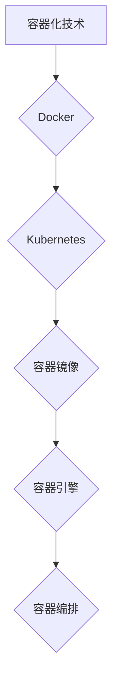

                 

# 容器化技术：Docker和Kubernetes实践

## 关键词
- 容器化技术
- Docker
- Kubernetes
- 容器镜像
- 容器编排
- 云原生架构

## 摘要
本文将深入探讨容器化技术的核心概念、架构以及实现。首先，我们介绍了容器化技术的起源与发展，解释了容器化技术的优势及其在软件开发中的应用。接着，我们详细讲解了Docker和Kubernetes的基础知识，包括其核心概念、架构以及安装配置过程。随后，我们分别对Docker和Kubernetes的技术细节进行了深入分析，包括镜像与容器管理、编排与资源管理、高级特性和集群管理。此外，我们还通过实际项目展示了如何使用Docker和Kubernetes进行容器化应用部署。最后，我们总结了容器化技术的最佳实践，并提供了常用的工具与资源。

## 第一部分：容器化技术概述

### 第1章：容器化技术简介

#### 1.1 容器化技术的起源与发展

容器化技术的起源可以追溯到操作系统层面的虚拟化技术，如Chroot和Linux容器（LXC）。然而，容器化技术作为现代软件开发的重要概念，实际上是在2013年Docker的诞生之后才开始迅速发展的。

**容器化技术的定义：**
容器化技术是一种将应用程序及其依赖环境打包在一起，形成一个独立的、可移植的容器单元的技术。容器通过共享宿主机的操作系统内核，避免了虚拟机所需的额外操作系统开销，从而实现轻量级、高效的隔离和部署。

**容器化技术的优势：**
1. **高效性：** 容器的启动速度快，且资源消耗低。
2. **可移植性：** 容器可以在任何支持容器引擎的操作系统上运行，无需关心底层硬件和环境差异。
3. **一致性：** 容器化确保了开发、测试和生产环境的一致性，减少了环境偏差导致的问题。
4. **可扩展性：** 容器编排工具如Kubernetes，支持自动化部署、扩展和管理容器集群。

**容器化技术的历史演进：**
1. **初始阶段（2000s）：** Chroot、LXC等技术的出现，提供了基础隔离能力。
2. **早期发展阶段（2010s）：** Docker的诞生，标志着容器化技术的商业化和普及化。
3. **成熟阶段（2020s至今）：** Kubernetes等编排工具的兴起，推动了容器化技术的进一步发展。

#### 1.2 容器技术的核心概念

**容器 vs 虚拟机：**
容器与虚拟机的主要区别在于资源隔离方式。虚拟机通过虚拟化硬件提供完全隔离的环境，而容器则通过共享宿主机的操作系统内核实现隔离。

**镜像（Image）：**
容器镜像是一个静态的文件系统，包含运行应用程序所需的所有文件和依赖。镜像通常基于基础镜像构建，可以分层构建以提高效率和可维护性。

**容器（Container）：**
容器是基于镜像的动态运行实例。容器包含应用程序的运行环境，可以启动、停止、重启和迁移。

**容器编排（Orchestration）：**
容器编排是指管理和维护容器集群的过程，包括部署、扩展、监控和故障恢复。Kubernetes是当前最流行的容器编排工具。

#### 1.3 容器技术的主要实现

**Docker：**
Docker是一个开源的容器引擎，用于构建、运行和管理容器。Docker提供了强大的镜像构建和容器运行功能，通过Dockerfile定义镜像的构建过程，通过docker命令进行容器的管理。

**Kubernetes：**
Kubernetes是一个开源的容器编排平台，用于自动化容器的部署、扩展和管理。Kubernetes通过一组资源和对象（如Pod、Service、Deployment等）来管理容器集群，提供了高度的可扩展性和灵活性。

### 第2章：Docker技术详解

#### 2.1 Docker镜像

**镜像的分层机制：**
Docker镜像采用了分层存储的机制，每一层都包含镜像的一部分，这些层可以共享和复用，从而减少了镜像的体积和构建时间。

**镜像的制作与分发：**
制作Docker镜像通常通过编写Dockerfile来完成。Dockerfile定义了镜像的构建步骤，包括基础镜像的选择、依赖安装、文件复制等。制作完成后，可以通过docker build命令构建镜像。镜像的分发可以通过Docker Hub等镜像仓库进行。

#### 2.2 Docker容器

**容器的运行机制：**
Docker容器基于宿主机的操作系统内核运行，通过cgroup和namespace实现资源隔离。容器启动时会加载镜像的文件系统，执行启动命令，并映射端口以对外提供服务。

**容器的管理和监控：**
Docker提供了丰富的命令用于容器的管理，包括启动、停止、重启、查看状态等。容器监控可以通过Docker的自带工具或第三方工具（如Prometheus、Grafana）实现。

#### 2.3 Docker Compose

**Compose文件的基本结构：**
Docker Compose是一个用于定义和运行多容器应用的工具。一个典型的Docker Compose文件（docker-compose.yml）包含了服务定义、网络配置、卷配置等。

**服务定义与部署：**
在Docker Compose中，服务是一组关联的容器。定义服务时，需要指定容器的镜像、端口映射、环境变量等。通过docker-compose up命令，可以部署整个应用。

**网络配置与容器间通信：**
Docker Compose支持自定义网络，允许容器之间通过服务名称进行通信。通过配置网络的子网和访问控制，可以更好地管理容器间的通信。

#### 2.4 Docker Swarm

**Docker Swarm的基本概念：**
Docker Swarm是一个内置的容器编排工具，用于将多个Docker引擎组合成一个集群。Swarm模式下的Docker引擎可以管理容器、服务、网络和卷等资源。

**Docker Swarm的架构与功能：**
Docker Swarm集群由manager节点和工作节点组成。manager节点负责集群的管理和调度，而工作节点负责运行容器。Docker Swarm提供了与Kubernetes类似的API和命令，使容器编排变得更加简单。

## 第二部分：Kubernetes实践

### 第3章：Kubernetes基础

#### 3.1 Kubernetes简介

**Kubernetes的核心概念：**
Kubernetes（简称K8s）是一个开源的容器编排平台，用于自动化部署、扩展和管理容器化应用。Kubernetes的核心概念包括节点（Node）、集群（Cluster）、命名空间（Namespace）等。

**Kubernetes的工作原理：**
Kubernetes通过一组控制平面组件（如api-server、controller-manager、scheduler）和节点组件（如kubelet、kube-proxy）协同工作，管理容器集群。Kubernetes通过API接口接收用户指令，并根据配置自动调度和部署容器。

#### 3.2 Kubernetes架构

**Kubernetes的集群架构：**
Kubernetes集群由一个主节点（Master）和多个工作节点（Worker）组成。主节点负责集群的管理和控制，包括API服务器、调度器、控制器等。工作节点负责运行容器和执行任务。

**节点与容器：**
每个节点都运行一个kubelet进程，负责与主节点通信并管理容器。容器在节点上启动并运行，通过kubelet监控和管理。

#### 3.3 Kubernetes组件

**etcd：数据存储：**
etcd是一个分布式键值存储系统，用于存储Kubernetes集群的配置信息和状态数据。etcd保证了配置数据的持久化和一致性。

**api-server：API接口：**
api-server是Kubernetes集群的核心组件，提供RESTful API接口，接收用户指令并处理集群的配置和管理操作。

**controller-manager：控制器管理：**
controller-manager是Kubernetes集群的管理组件，负责监控集群状态并根据配置自动修复任何问题。常见的控制器包括部署控制器、服务控制器、网络控制器等。

**scheduler：调度器：**
scheduler是Kubernetes集群的调度组件，负责根据资源需求和策略将容器调度到合适的节点上。scheduler根据节点的资源状态和策略选择最佳的节点来运行容器。

## 第4章：Kubernetes资源管理

#### 4.1 Kubernetes资源对象

**Pod：**
Pod是Kubernetes中的最小部署单元，包含一个或多个容器。Pod负责容器的生命周期管理，如启动、停止和重启。

**Service：**
Service是Kubernetes中的服务抽象，用于将多个Pod连接成一个服务。Service通过虚拟IP（VIP）或DNS名称暴露容器服务，提供稳定的网络访问。

**Deployment：**
Deployment是Kubernetes中用于管理Pod的一种资源对象，负责创建和管理Pod副本。Deployment支持滚动更新和回滚功能，确保应用稳定升级。

**StatefulSet：**
StatefulSet是Kubernetes中用于管理有状态应用的一种资源对象，确保Pod的有序创建和唯一性。StatefulSet支持稳定的服务发现和持久化存储。

**ConfigMap：**
ConfigMap是Kubernetes中用于存储和管理配置数据的资源对象。ConfigMap可以将配置数据与应用解耦，提高应用的灵活性和可维护性。

**Secret：**
Secret是Kubernetes中用于存储和管理敏感数据的资源对象，如密码、密钥等。Secret确保了敏感数据的安全存储和访问。

#### 4.2 Kubernetes资源管理

**资源对象的生命周期：**
资源对象在Kubernetes中具有生命周期，包括创建、更新和删除。Kubernetes控制器负责监控和管理资源对象的生命周期，确保资源的正常运行。

**资源对象的配置与管理：**
资源对象的配置通过YAML文件定义，并通过kubectl命令进行管理。Kubernetes API服务器存储和管理资源对象的配置信息，提供统一的接口和操作方式。

#### 4.3 Kubernetes资源监控与日志

**监控工具（如Prometheus、Grafana）：**
Prometheus是一个开源的监控解决方案，用于收集和存储容器集群的指标数据。Grafana是一个开源的数据可视化工具，用于展示和监控Kubernetes集群的指标。

**日志收集（如Fluentd、Elasticsearch、Kibana）：**
Fluentd是一个开源的数据收集器，用于收集容器日志并将其发送到Elasticsearch。Elasticsearch是一个开源的搜索引擎，用于存储和查询容器日志。Kibana是一个开源的数据可视化工具，用于展示和查询Elasticsearch中的日志数据。

## 第5章：Kubernetes高级特性

#### 5.1 Kubernetes存储

**容器存储接口（CSI）：**
容器存储接口（Container Storage Interface，简称CSI）是一种标准化的存储接口，用于在Kubernetes集群中集成外部存储系统。CSI提供了统一的存储接口，使存储系统可以轻松集成到Kubernetes集群中。

**常见存储解决方案（如NFS、GlusterFS）：**
NFS（Network File System）是一种网络文件系统协议，用于在不同主机之间共享文件。GlusterFS是一个开源的分布式文件系统，支持数据分布和容错。

#### 5.2 Kubernetes网络

**Service网络：**
Kubernetes中的Service提供了一种网络抽象，用于将多个Pod连接成一个服务。Service通过虚拟IP（VIP）或DNS名称暴露容器服务，提供稳定的网络访问。

**Ingress网络：**
Ingress是Kubernetes中用于管理外部访问的一种资源对象。Ingress定义了HTTP请求的路由规则，将外部流量转发到后端的Service。

**CNI插件：**
CNI（Container Network Interface）插件是Kubernetes用于容器网络配置的接口。CNI插件可以自定义网络策略，实现复杂的网络拓扑和隔离。

#### 5.3 Kubernetes安全

**Role-Based Access Control（RBAC）：**
RBAC（Role-Based Access Control）是一种基于角色的访问控制机制。Kubernetes使用RBAC对用户和操作进行权限控制，确保集群的安全性和稳定性。

**NetworkPolicy：**
NetworkPolicy是Kubernetes中用于定义网络访问控制策略的资源对象。NetworkPolicy可以限制Pod之间的流量，提高集群的安全性。

#### 5.4 Kubernetes自动化运维

**Helm：包管理工具：**
Helm是一个Kubernetes的包管理工具，用于管理Kubernetes中的应用部署。Helm提供了模板化部署和版本控制功能，简化了Kubernetes的部署和管理过程。

**Kubernetes Operator：**
Kubernetes Operator是一种声明式的方法，用于构建、部署和管理Kubernetes应用。Operator通过监控和管理应用的状态，实现了自动化运维和自我修复功能。

## 第6章：Kubernetes集群管理

#### 6.1 Kubernetes集群安装与配置

**安装前的准备工作：**
在安装Kubernetes集群之前，需要进行一些准备工作，包括安装Docker、配置主机名和IP地址、关闭防火墙等。

**Kubernetes集群的安装与配置：**
Kubernetes集群的安装可以通过kubeadm工具进行。kubeadm提供了简单的命令行接口，用于初始化主节点和加入工作节点。

#### 6.2 Kubernetes集群运维

**集群监控与维护：**
Kubernetes集群的监控可以通过Prometheus、Grafana等工具实现。监控指标包括资源使用率、容器状态、服务健康状态等。

**集群升级与扩容：**
Kubernetes集群的升级和扩容是常见的运维操作。升级可以通过kubeadm的命令行工具进行，扩容可以通过增加节点或调整Pod副本数实现。

#### 6.3 Kubernetes集群管理工具

**kubectl：命令行工具：**
kubectl是Kubernetes的命令行工具，用于与Kubernetes集群进行交互。kubectl提供了丰富的命令，用于管理资源、执行操作等。

**Helm：包管理工具：**
Helm是Kubernetes的包管理工具，用于管理Kubernetes中的应用部署。Helm提供了模板化部署和版本控制功能，简化了Kubernetes的部署和管理过程。

**KubeSphere：一站式云原生平台：**
KubeSphere是一个开源的一站式云原生平台，提供了Kubernetes集群的管理、监控、日志收集等功能。KubeSphere提供了用户友好的界面和丰富的功能，简化了Kubernetes的运维和管理。

## 第7章：容器化技术实战

#### 7.1 容器化应用部署

**容器化应用的开发与部署：**
容器化应用的开发涉及到编写Dockerfile、构建镜像等步骤。在部署时，可以使用Docker Compose或Kubernetes进行容器化应用的部署和管理。

**应用健康检查与自动重启：**
在容器化应用中，可以通过定义健康检查策略和自动重启策略，确保应用的稳定运行。Kubernetes提供了健康检查和自动重启功能，可以配置自动恢复策略。

#### 7.2 Kubernetes集群自动化运维

**CI/CD流水线搭建：**
CI/CD（Continuous Integration/Continuous Deployment）流水线用于自动化应用部署和交付。在Kubernetes集群中，可以使用Helm等工具搭建CI/CD流水线，实现自动化部署和版本控制。

**自动化运维脚本编写：**
自动化运维脚本可以帮助管理员自动化执行一些常见的运维任务，如节点监控、资源扩容、升级等。编写自动化运维脚本可以简化运维流程，提高运维效率。

#### 7.3 容器化技术最佳实践

**容器镜像优化：**
容器镜像优化可以减少镜像体积，提高镜像构建和部署速度。可以通过精简基础镜像、删除无用文件、使用多阶段构建等方法进行镜像优化。

**容器资源优化：**
容器资源优化可以确保容器得到合适的资源分配，提高容器性能和稳定性。可以通过调整容器资源限制和请求、使用资源隔离策略等方法进行资源优化。

**容器安全策略制定：**
容器安全策略制定可以确保容器化应用的安全性。可以通过实施RBAC策略、使用安全容器特性、定期更新容器镜像和组件等方法制定容器安全策略。

### 附录：常用容器化工具与资源

**Docker常用命令：**
- `docker build`：构建镜像
- `docker run`：运行容器
- `docker ps`：查看容器状态
- `docker images`：查看镜像列表

**Kubernetes常用命令：**
- `kubectl create deployment`：创建部署
- `kubectl get pods`：查看容器状态
- `kubectl expose deployment`：暴露服务
- `kubectl describe pod`：查看容器详情

**Kubernetes官方文档：** [https://kubernetes.io/docs/](https://kubernetes.io/docs/)

**容器化技术社区资源：**
- Docker社区：[https://www.docker.com/community](https://www.docker.com/community)
- Kubernetes社区：[https://kubernetes.io/docs/home/](https://kubernetes.io/docs/home/)
- CNCF：[https://www.cncf.io/](https://www.cncf.io/)

### 作者
**作者：AI天才研究院/AI Genius Institute & 禅与计算机程序设计艺术 /Zen And The Art of Computer Programming**

## 容器化技术的核心概念与架构

### 2.1 容器化技术的基础概念

容器化技术是一种将应用程序及其所有依赖项打包到一个独立的、可移植的单元（容器）中的方法。这种技术使得应用程序可以在不同的环境中运行，而无需担心底层操作系统的差异。

**容器与虚拟机的区别：**

- **资源隔离：** 虚拟机通过模拟硬件层提供完全隔离的环境，而容器则通过共享宿主机的操作系统内核实现轻量级隔离。
- **启动速度：** 容器的启动速度远快于虚拟机，因为它们不需要启动额外的操作系统。
- **性能开销：** 容器没有虚拟机所需的额外操作系统开销，因此性能开销更低。

**核心概念：**

- **容器镜像（Container Image）：** 容器镜像是一个只读的模板，包含运行应用程序所需的所有文件和依赖。
- **容器引擎（Container Engine）：** Docker是最流行的容器引擎，用于构建、运行和管理容器。
- **容器编排（Container Orchestration）：** Kubernetes是最流行的容器编排工具，用于自动化容器的部署、伸缩和管理。

### 2.2 容器化技术的架构

**Docker架构：**


- **Docker Engine：** Docker的核心组件，负责容器镜像的构建、容器运行和管理。
- **Dockerfile：** 用于定义镜像构建过程的脚本文件。
- **Docker Hub：** Docker的官方镜像仓库，用于存储和分发容器镜像。

**Kubernetes架构：**


- **Kubernetes Master：** 负责集群的控制和管理，包括API服务器、调度器、控制器管理器等。
- **Kubernetes Node：** 节点上的组件包括kubelet、kube-proxy等，负责容器的运行和管理。
- **Pod：** Kubernetes中的最小部署单元，包含一个或多个容器。
- **Service：** 负责将容器暴露给外部网络。

### Mermaid 流程图



### 核心算法原理讲解

容器化技术的核心在于容器镜像的构建和管理。以下使用伪代码对Docker镜像的构建过程进行详细阐述：

```python
# 伪代码：Docker镜像构建过程

# 步骤1：准备基础镜像
FROM base_image

# 步骤2：设置环境变量
ENV VAR1=value1
ENV VAR2=value2

# 步骤3：安装依赖库
RUN apt-get update && apt-get install -y package1 package2

# 步骤4：复制应用文件
COPY application /app

# 步骤5：设置启动命令
CMD ["start-application.sh"]
```

### 数学模型和数学公式讲解

在容器化技术中，资源管理和调度是一个关键问题。Kubernetes 使用一个简单的线性函数来计算资源需求的优先级：

$$
P = w_1 \cdot r_1 + w_2 \cdot r_2 + ... + w_n \cdot r_n
$$

其中，$P$ 是优先级，$w_i$ 是权重，$r_i$ 是资源需求。

### 项目实战

#### 容器化一个简单的Web应用

**开发环境搭建：**

- 安装Docker：在Ubuntu上使用以下命令安装Docker：
  
  ```bash
  sudo apt-get update
  sudo apt-get install docker.io
  sudo systemctl start docker
  sudo systemctl enable docker
  ```

- 编写Dockerfile：
  ```Dockerfile
  # 使用官方Python镜像作为基础镜像
  FROM python:3.9-slim

  # 设置工作目录
  WORKDIR /app

  # 复制应用源代码到容器内
  COPY . .

  # 安装依赖
  RUN pip install -r requirements.txt

  # 暴露应用端口
  EXPOSE 8080

  # 运行应用
  CMD ["python", "app.py"]
  ```

- 构建镜像：
  ```bash
  docker build -t my-web-app .
  ```

- 运行容器：
  ```bash
  docker run -d -p 8080:8080 my-web-app
  ```

#### Kubernetes集群部署

**安装Kubernetes：**

- 安装kubeadm、kubelet和kubectl：
  ```bash
  curl -s https://packages.cloud.google.com/apt/doc/apt-key.gpg | sudo apt-key add
  echo "deb https://apt.kubernetes.io/ kubernetes-xenial main" | sudo tee -a /etc/apt/sources.list
  sudo apt-get update
  sudo apt-get install -y kubelet kubeadm kubectl
  sudo apt-mark hold kubelet kubeadm kubectl
  ```

- 初始化集群：
  ```bash
  sudo kubeadm init --pod-network-cidr=10.244.0.0/16
  ```

- 配置kubectl工具：
  ```bash
  mkdir -p $HOME/.kube
  sudo cp -i /etc/kubernetes/admin.conf $HOME/.kube/config
  sudo chown $(id -u):$(id -g) $HOME/.kube/config
  ```

**部署Nginx应用：**

- 创建deployment.yaml：
  ```yaml
  apiVersion: apps/v1
  kind: Deployment
  metadata:
    name: nginx-deployment
  spec:
    replicas: 3
    selector:
      matchLabels:
        app: nginx
    template:
      metadata:
        labels:
          app: nginx
      spec:
        containers:
        - name: nginx
          image: nginx:latest
          ports:
          - containerPort: 80
  ```

- 部署应用：
  ```bash
  kubectl apply -f deployment.yaml
  ```

- 查看应用状态：
  ```bash
  kubectl get pods
  ```

### 代码解读与分析

在上述示例中，我们首先使用Docker构建了一个简单的Web应用容器镜像，然后通过Kubernetes部署了该镜像，创建了一个具有3个副本的Nginx应用部署。

- **Dockerfile**：用于定义镜像构建的过程，包括基础镜像的选择、工作目录的设置、依赖的安装、应用文件的复制以及容器的启动命令。
- **deployment.yaml**：用于定义Kubernetes部署，包括应用的名称、副本数量、选择器的配置以及容器的详细配置。

通过这种方式，我们可以轻松地将任何应用容器化并在Kubernetes集群中部署，从而实现自动化部署和管理。

### 容器化技术最佳实践

- **容器镜像优化：** 使用多阶段构建减少镜像体积，删除不必要的文件和依赖，使用缓存策略优化构建速度。
- **容器资源优化：** 根据应用需求合理配置容器资源，避免资源浪费，使用资源限制和请求确保容器性能。
- **容器安全策略制定：** 实施RBAC策略限制访问权限，使用安全容器特性（如AppArmor、SELinux）提高容器安全性，定期更新容器镜像和组件。

### 附录：常用容器化工具与资源

- **Docker常用命令：**
  - `docker build`：构建镜像
  - `docker run`：运行容器
  - `docker ps`：查看容器状态
  - `docker images`：查看镜像列表

- **Kubernetes常用命令：**
  - `kubectl create deployment`：创建部署
  - `kubectl get pods`：查看容器状态
  - `kubectl expose deployment`：暴露服务
  - `kubectl describe pod`：查看容器详情

- **Kubernetes官方文档：** [https://kubernetes.io/docs/](https://kubernetes.io/docs/)

- **容器化技术社区资源：**
  - Docker社区：[https://www.docker.com/community](https://www.docker.com/community)
  - Kubernetes社区：[https://kubernetes.io/docs/home/](https://kubernetes.io/docs/home/)
  - CNCF：[https://www.cncf.io/](https://www.cncf.io/)

