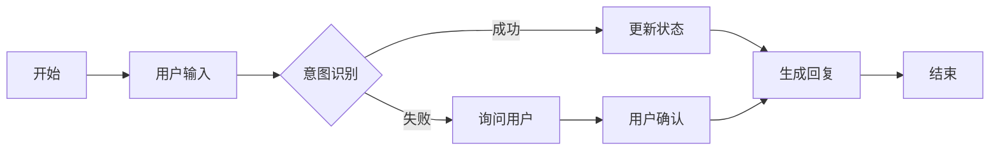

                 

# 文章标题：对话状态跟踪：构建更智能的对话系统

> 关键词：对话状态跟踪，对话系统，智能对话，机器学习，深度学习，强化学习，聊天机器人

> 摘要：本文将深入探讨对话状态跟踪（DST）在构建更智能的对话系统中的应用。通过分析对话系统的历史发展、架构原理、核心算法原理和项目实战，我们将理解如何利用对话状态跟踪技术提高对话系统的智能程度和用户体验。

## 引言

随着人工智能技术的不断进步，对话系统（Conversational Systems）已经成为自然语言处理（NLP）领域的一个重要分支。从最初的基于规则的聊天机器人到如今的深度学习和强化学习驱动的智能对话系统，对话系统的技术实现和功能都取得了显著的提升。然而，在实际应用中，如何构建一个既能理解用户意图，又能保持上下文连贯性的智能对话系统，仍然是研究人员和开发人员面临的一个挑战。

对话状态跟踪（Dialogue State Tracking，简称DST）作为对话系统中的一个关键技术，旨在解决对话上下文表示和状态更新问题。通过对话状态跟踪，系统能够动态地更新和维护对话状态，从而更好地理解用户意图和上下文，提高对话的连贯性和智能化程度。本文将从对话状态跟踪的基础理论、核心算法原理和项目实战三个方面进行详细探讨，旨在为读者提供一幅对话状态跟踪技术的全景图。

## 《对话状态跟踪：构建更智能的对话系统》目录大纲

### 第一部分：对话状态跟踪基础理论

#### 第1章：对话状态跟踪概述

1.1 对话系统发展历程  
1.2 对话状态跟踪的重要性  
1.3 对话状态跟踪的基本概念

#### 第2章：对话系统架构与工作原理

2.1 对话系统架构概述  
2.2 基于规则的方法  
2.3 基于机器学习的方法  
2.4 基于深度学习的方法

#### 第3章：对话状态表示

3.1 对话状态表示方法  
3.2 上下文编码  
3.3 对话状态编码的挑战

### 第二部分：核心算法原理讲解

#### 第4章：对话状态跟踪算法

4.1 对话状态跟踪算法概述  
4.2 基于轨迹的方法  
4.3 基于注意力机制的方法  
4.4 基于图神经网络的方法

#### 第5章：序列到序列学习

5.1 序列到序列学习的基本原理  
5.2 深度学习模型在序列到序列学习中的应用  
5.3 序列到序列学习的优化技巧

#### 第6章：强化学习在对话状态跟踪中的应用

6.1 强化学习基础  
6.2 基于强化学习的对话状态跟踪算法  
6.3 对话奖励设计

### 第三部分：项目实战

#### 第7章：构建简单的对话系统

7.1 项目背景  
7.2 开发环境搭建  
7.3 数据集介绍  
7.4 模型设计与实现  
7.5 模型训练与评估

#### 第8章：对话状态跟踪在聊天机器人中的应用

8.1 聊天机器人的需求分析  
8.2 对话状态跟踪在聊天机器人中的应用场景  
8.3 聊天机器人设计与实现  
8.4 代码解读与分析

#### 第9章：对话状态跟踪在大规模对话系统中的应用

9.1 大规模对话系统的挑战  
9.2 对话状态跟踪在大规模对话系统中的应用策略  
9.3 大规模对话系统的设计与实现  
9.4 代码解读与分析

### 附录

#### 附录A：常用对话状态跟踪工具与资源

A.1 对话状态跟踪工具概述  
A.2 对话状态跟踪工具使用指南  
A.3 常见问题与解决方案  
A.4 进一步学习资源

#### 附录B：核心概念与联系

B.1 对话状态跟踪的核心概念  
B.2 对话状态跟踪的关键技术  
B.3 对话状态跟踪的 Mermaid 流程图

#### 附录C：数学模型和数学公式

C.1 对话状态跟踪的数学模型  
C.2 常用数学公式与解释  
C.3 数学公式示例（使用LaTeX格式）

#### 附录D：代码实战案例

D.1 代码实战概述  
D.2 开发环境搭建  
D.3 源代码详细实现  
D.4 代码解读与分析  
D.5 实际应用案例

### 第一部分：对话状态跟踪基础理论

## 第1章：对话状态跟踪概述

### 1.1 对话系统发展历程

对话系统的发展可以追溯到上世纪60年代，当时的研究主要集中在模拟人类的对话能力。早期的研究以基于规则的方法为主，这种方法通过定义一系列规则来模拟人类的对话过程。然而，基于规则的对话系统存在一个明显的局限：其能力依赖于预先定义的规则，无法灵活应对未知或变化的情况。

随着计算机性能的不断提高和人工智能技术的快速发展，对话系统的研究逐渐转向机器学习和深度学习。基于机器学习的方法通过训练模型来学习对话规律，可以更好地适应不同的对话场景。深度学习进一步推动了对话系统的进步，通过引入复杂的神经网络结构，如循环神经网络（RNN）和变换器（Transformer），对话系统能够更好地理解和生成自然语言。

### 1.2 对话状态跟踪的重要性

对话状态跟踪是构建智能对话系统的一个关键步骤，其主要目的是在对话过程中维护对话状态的一致性和完整性。对话状态跟踪不仅可以帮助系统理解用户的意图，还可以根据对话历史和当前输入动态地更新对话状态。

具体来说，对话状态跟踪具有以下几个重要意义：

1. **上下文维护**：对话状态跟踪能够记录和更新对话的历史信息，如用户偏好、需求等，从而在后续对话中保持上下文的连贯性。

2. **意图识别**：通过对话状态跟踪，系统可以更好地理解用户的意图，从而生成更加贴切和有效的回复。

3. **错误纠正**：在对话过程中，用户可能会犯错或提供模糊的信息。对话状态跟踪可以帮助系统识别错误并尝试纠正，从而提高对话的质量。

4. **个性化交互**：通过对话状态跟踪，系统可以根据用户的历史行为和偏好，提供更加个性化的服务和推荐。

### 1.3 对话状态跟踪的基本概念

对话状态跟踪涉及几个核心概念：

1. **对话状态（Dialogue State）**：对话状态是关于当前对话的静态信息，如用户姓名、系统角色、任务状态等。对话状态是动态变化的，随着对话的进行，系统需要不断地更新对话状态。

2. **对话历史（Dialogue History）**：对话历史记录了对话过程中所有的交互，包括用户的输入和系统的回复。对话历史对于理解用户意图和上下文具有重要意义。

3. **状态表示（State Representation）**：状态表示是将对话状态转化为机器可以理解的形式。常见的状态表示方法包括基于规则的方法和基于机器学习的方法。

4. **状态更新（State Update）**：状态更新是在对话过程中根据用户的输入和系统的回复动态地调整对话状态。状态更新是对话状态跟踪的核心任务。

5. **意图识别（Intent Recognition）**：意图识别是确定用户输入所表示的意图。通过意图识别，系统可以理解用户的需求，从而生成合适的回复。

## 第2章：对话系统架构与工作原理

### 2.1 对话系统架构概述

对话系统的架构可以分为几个主要模块：用户接口（UI）、对话管理（DM）、自然语言理解（NLU）和自然语言生成（NLG）。

1. **用户接口（UI）**：用户接口是用户与对话系统进行交互的界面，可以是文本、语音或图形界面。用户接口的主要作用是收集用户的输入并将其传递给对话管理模块。

2. **对话管理（DM）**：对话管理是对话系统的核心，负责维护对话状态、跟踪对话流程、识别用户意图和生成系统回复。对话管理模块通常包括对话状态跟踪（DST）、对话策略（DP）和对话规划（DP）。

3. **自然语言理解（NLU）**：自然语言理解是解析用户输入并将其转化为机器可以理解的形式。NLU包括意图识别（IR）和实体识别（ER）。

4. **自然语言生成（NLG）**：自然语言生成是将系统理解的信息转化为自然语言回复。NLG旨在生成连贯、自然且符合上下文的文本。

### 2.2 基于规则的方法

基于规则的方法是早期对话系统的主流技术，其核心思想是使用一组预定义的规则来模拟对话过程。这些规则通常基于领域知识和对话逻辑，可以明确地描述用户输入和系统回复之间的关系。

1. **规则定义**：基于规则的方法首先需要定义一组规则，这些规则通常使用自然语言或形式化的语法描述。规则包括条件（条件语句）和动作（结果动作）。

2. **规则匹配**：在对话过程中，系统将用户输入与预定义的规则进行匹配，以确定相应的动作。规则匹配可以通过模式匹配、关键词提取或基于语义的方法实现。

3. **规则执行**：一旦找到匹配的规则，系统将执行相应的动作，如生成回复、更新对话状态或触发其他操作。

基于规则的方法具有以下几个优点：

- **易理解**：规则直观、易于理解和维护。
- **可预测**：规则明确地定义了对话过程，使得系统行为可预测。

然而，基于规则的方法也存在一些局限性：

- **规则爆炸**：随着对话复杂性的增加，需要定义的规则数量会急剧增加，导致系统变得庞大和难以维护。
- **适应性差**：基于规则的对话系统在处理未知或变化的情况时表现较差，因为其依赖于预定义的规则。

### 2.3 基于机器学习的方法

基于机器学习的方法通过训练模型来自动学习对话规律，从而克服了基于规则方法的局限性。机器学习方法主要包括监督学习和无监督学习。

1. **监督学习**：监督学习是一种常见的机器学习方法，它使用已标记的数据集来训练模型。在对话系统中，监督学习可以用于意图识别和实体识别。标记数据集通常包括用户的输入和对应的标签（意图或实体）。

2. **无监督学习**：无监督学习不需要标记的数据集，其目的是从未标记的数据中发现模式和结构。在对话系统中，无监督学习可以用于对话状态跟踪和对话生成。

基于机器学习的方法具有以下几个优点：

- **自适应性强**：机器学习模型可以根据新数据不断更新和优化，从而适应不同的对话场景。
- **灵活性高**：机器学习模型可以处理复杂的对话模式，从而提高系统的灵活性。

然而，基于机器学习的方法也存在一些挑战：

- **数据依赖**：机器学习模型的性能高度依赖于训练数据的质量和数量。
- **解释性差**：与基于规则的方法相比，机器学习模型往往缺乏明确的解释性，这使得调试和优化变得困难。

### 2.4 基于深度学习的方法

深度学习是机器学习的一个分支，其核心思想是使用多层神经网络来学习数据的复杂表示。深度学习在对话系统中得到了广泛应用，特别是在自然语言处理任务中。

1. **循环神经网络（RNN）**：循环神经网络是一种能够处理序列数据的神经网络。RNN通过存储和利用前一个时间步的输出，实现了对序列数据的记忆功能。RNN在对话系统中可以用于意图识别、实体识别和对话状态跟踪。

2. **变换器（Transformer）**：变换器是一种基于自注意力机制的深度学习模型，其在自然语言处理任务中取得了显著的成功。变换器通过全局注意力机制，实现了对序列数据中不同位置信息的高效利用。变换器在对话系统中可以用于对话生成和对话状态跟踪。

基于深度学习的方法具有以下几个优点：

- **表示能力强**：深度学习模型可以学习到数据的复杂表示，从而提高系统的性能。
- **灵活性好**：深度学习模型可以处理不同类型和长度的输入数据。

然而，基于深度学习的方法也存在一些挑战：

- **计算资源消耗大**：深度学习模型通常需要大量的计算资源和时间进行训练。
- **解释性差**：与基于规则的方法和传统机器学习方法相比，深度学习模型往往缺乏明确的解释性。

## 第3章：对话状态表示

### 3.1 对话状态表示方法

对话状态表示是对话状态跟踪（DST）中的一个关键环节，其目的是将对话中的静态和动态信息转化为机器可以理解和处理的格式。常见的对话状态表示方法包括基于规则的方法、基于模板的方法和基于机器学习的方法。

1. **基于规则的方法**：基于规则的方法通过定义一系列规则来表示对话状态。这些规则通常包括条件（条件语句）和动作（结果动作）。条件语句用于匹配用户的输入，动作则描述了系统应该执行的操作。基于规则的方法具有直观、易于理解的特点，但其灵活性和扩展性较差。

2. **基于模板的方法**：基于模板的方法使用预定义的模板来表示对话状态。模板通常是一个结构化的数据格式，如JSON或XML。在对话过程中，系统将用户的输入与模板进行匹配，并动态地填充模板中的空白部分。基于模板的方法具有灵活性和扩展性较好的特点，但模板的设计和维护较为复杂。

3. **基于机器学习的方法**：基于机器学习的方法通过训练模型来自动学习对话状态表示。常见的机器学习方法包括监督学习和无监督学习。监督学习使用已标记的数据集来训练模型，无监督学习则在未标记的数据中发现对话状态的表示。基于机器学习的方法具有自适应性和灵活性的优点，但其对训练数据的质量和数量有较高的要求。

### 3.2 上下文编码

上下文编码是将对话过程中的上下文信息转化为机器可以理解和处理的形式。上下文编码是对话状态表示的一个重要方面，其目的是提高对话系统的理解和生成能力。

1. **词嵌入**：词嵌入是将单词映射为固定维度的向量表示。通过词嵌入，系统能够理解单词之间的语义关系，从而更好地理解对话中的上下文信息。常见的词嵌入模型包括Word2Vec、GloVe和BERT。

2. **序列编码**：序列编码是将对话中的文本序列转化为向量表示。序列编码可以捕获对话中不同时间步之间的依赖关系，从而提高对话系统的理解和生成能力。常见的序列编码模型包括循环神经网络（RNN）和变换器（Transformer）。

3. **上下文融合**：上下文融合是将不同的上下文信息（如词嵌入、序列编码和对话历史）进行整合，以生成更加丰富和全面的上下文表示。上下文融合可以通过多层神经网络或图神经网络实现。

### 3.3 对话状态编码的挑战

对话状态编码是对话状态跟踪（DST）中的一个重要任务，其目的是将对话中的静态和动态信息转化为机器可以理解和处理的形式。然而，对话状态编码面临着一些挑战：

1. **信息过载**：对话过程中会产生大量的信息，如用户的输入、系统的回复和对话历史。如何有效地提取和表示这些信息是一个挑战。

2. **动态变化**：对话状态是动态变化的，系统需要能够实时地更新和调整对话状态。如何实现动态的对话状态编码是一个挑战。

3. **多样性**：对话系统的应用场景非常多样化，系统需要能够适应不同的对话场景和用户需求。如何设计通用的对话状态编码方法是一个挑战。

4. **解释性**：对话状态编码的结果应该具有明确的解释性，以便开发人员和用户理解系统的行为。如何提高对话状态编码的解释性是一个挑战。

## 第二部分：核心算法原理讲解

### 第4章：对话状态跟踪算法

#### 4.1 对话状态跟踪算法概述

对话状态跟踪（DST）算法是构建智能对话系统的关键组件，其主要目标是根据用户的输入和对话历史，动态地更新和维护对话状态。对话状态跟踪算法可以分为基于轨迹的方法、基于注意力机制的方法和基于图神经网络的方法。每种方法都有其独特的原理和适用场景。

#### 4.2 基于轨迹的方法

基于轨迹的方法将对话视为一个序列，通过跟踪对话序列中的状态变化来维护对话状态。这种方法的核心思想是使用一个轨迹（sequence）来表示对话历史，并将当前对话状态视为轨迹上的一个点。

1. **轨迹表示**：轨迹通常使用一个一维数组或序列来表示，其中每个元素对应对话中的一个状态。轨迹可以表示为：

   \[ s_t = [s_1, s_2, ..., s_t] \]

   其中，\( s_t \) 是当前时刻的对话状态，\( s_i \) 是第 \( i \) 个状态。

2. **状态更新**：基于轨迹的方法通过计算当前输入和对话历史之间的关系来更新状态。常用的方法包括：

   - **前向轨迹更新**：使用前向轨迹更新规则来计算当前状态。例如，可以使用条件概率来更新状态：

     \[ p(s_t|u_1, u_2, ..., u_t) = \prod_{i=1}^{t} p(s_i|u_1, u_2, ..., u_{i-1}) \]

   - **后向轨迹更新**：使用后向轨迹更新规则来计算当前状态。例如，可以使用条件概率来更新状态：

     \[ p(s_t|u_1, u_2, ..., u_t) = \prod_{i=t}^{1} p(s_i|u_1, u_2, ..., u_{i-1}) \]

3. **挑战**：基于轨迹的方法在处理长对话历史和复杂对话场景时可能面临挑战，因为其计算复杂度较高。

#### 4.3 基于注意力机制的方法

基于注意力机制的方法通过为对话历史中的不同部分分配不同的注意力权重，从而提高对话状态的表示能力。注意力机制可以看作是对对话历史的一种加权平均。

1. **注意力机制原理**：注意力机制的核心思想是动态地调整对话历史中不同部分的重要性。具体来说，注意力权重可以表示为：

   \[ a_t = \sigma(W_a[h_t, s_{t-1}]) \]

   其中，\( h_t \) 是当前输入的表示，\( s_{t-1} \) 是上一个时刻的对话状态，\( W_a \) 是注意力权重矩阵，\( \sigma \) 是激活函数。

2. **状态更新**：基于注意力机制的方法通过加权对话历史来更新当前状态。例如，可以使用以下公式：

   \[ s_t = \sum_{i=1}^{T} a_{t,i} s_{t-i} \]

   其中，\( a_{t,i} \) 是第 \( i \) 个历史状态的注意力权重，\( s_{t-i} \) 是第 \( i \) 个历史状态。

3. **挑战**：基于注意力机制的方法在计算复杂度上较高，特别是在处理长对话历史时。此外，注意力机制的参数调优也是一个挑战。

#### 4.4 基于图神经网络的方法

基于图神经网络（GNN）的方法将对话视为一个图结构，通过学习图中的节点和边的关系来表示对话状态。图神经网络可以捕获对话中的长距离依赖和复杂交互。

1. **图表示**：在基于图神经网络的方法中，对话状态被视为图的节点，对话历史中的交互被视为图的边。例如，一个简单的图可以表示为：

   \[ G = (V, E) \]

   其中，\( V \) 是节点集合，\( E \) 是边集合。

2. **图神经网络**：图神经网络通过学习图中的节点和边的关系来更新对话状态。例如，可以使用以下公式：

   \[ h_v^{(t)} = \sigma(\sum_{u \in \text{邻居}(v)} W_h h_u^{(t-1)} + b_h) \]

   其中，\( h_v^{(t)} \) 是第 \( t \) 个时刻节点 \( v \) 的状态表示，\( \text{邻居}(v) \) 是节点 \( v \) 的邻居节点，\( W_h \) 是图神经网络权重矩阵，\( b_h \) 是偏置项。

3. **挑战**：基于图神经网络的方法在处理大规模对话数据和复杂图结构时可能面临挑战。此外，图神经网络的设计和参数调优也是一个挑战。

### 第5章：序列到序列学习

#### 5.1 序列到序列学习的基本原理

序列到序列（Seq2Seq）学习是一种在机器翻译、对话生成等领域得到广泛应用的方法。其基本原理是将一个序列（如文本）映射为另一个序列。序列到序列学习通常包括编码器（Encoder）和解码器（Decoder）两个主要组件。

1. **编码器（Encoder）**：编码器负责将输入序列编码为一个固定长度的向量表示。编码器可以是一个循环神经网络（RNN）或变换器（Transformer）。例如，可以使用以下公式：

   \[ h_t = \text{Encoder}(x_t) \]

   其中，\( h_t \) 是编码器在第 \( t \) 个时间步生成的状态向量，\( x_t \) 是输入序列。

2. **解码器（Decoder）**：解码器负责将编码器的输出解码为输出序列。解码器也可以是一个循环神经网络或变换器。例如，可以使用以下公式：

   \[ y_t = \text{Decoder}(h_t) \]

   其中，\( y_t \) 是解码器在第 \( t \) 个时间步生成的输出。

3. **状态转移**：在序列到序列学习中，解码器的输出通常依赖于编码器的状态和当前输入。例如，可以使用以下公式：

   \[ h_t = \text{Attention}(h_{t-1}, h_t) \]

   其中，\( h_t \) 是解码器在第 \( t \) 个时间步生成的状态向量，\( \text{Attention} \) 是注意力机制。

#### 5.2 深度学习模型在序列到序列学习中的应用

深度学习模型在序列到序列学习中得到了广泛应用，如循环神经网络（RNN）和变换器（Transformer）。这些模型通过引入复杂的神经网络结构和注意力机制，提高了序列到序列学习的性能。

1. **循环神经网络（RNN）**：循环神经网络是一种能够处理序列数据的神经网络。RNN通过存储和利用前一个时间步的输出，实现了对序列数据的记忆功能。例如，可以使用以下公式：

   \[ h_t = \text{RNN}(h_{t-1}, x_t) \]

   其中，\( h_t \) 是RNN在第 \( t \) 个时间步生成的状态向量，\( x_t \) 是输入序列。

2. **变换器（Transformer）**：变换器是一种基于自注意力机制的深度学习模型。变换器通过全局注意力机制，实现了对序列数据中不同位置信息的高效利用。例如，可以使用以下公式：

   \[ h_t = \text{Transformer}(h_{t-1}, x_t) \]

   其中，\( h_t \) 是变换器在第 \( t \) 个时间步生成的状态向量，\( x_t \) 是输入序列。

#### 5.3 序列到序列学习的优化技巧

为了提高序列到序列学习的性能，可以采用一些优化技巧，如：

1. **教师-学生训练**：教师-学生训练是一种在训练过程中使用已知正确输出作为输入来提高模型性能的方法。例如，可以使用以下公式：

   \[ y_t = \text{Student}(h_{t-1}, y_t) \]

   其中，\( y_t \) 是教师输出，\( y_t \) 是学生输出。

2. **长短期记忆（LSTM）**：长短期记忆是一种能够处理长序列依赖的RNN变体。LSTM通过引入门控机制，实现了对长期依赖信息的记忆和遗忘。例如，可以使用以下公式：

   \[ h_t = \text{LSTM}(h_{t-1}, x_t) \]

   其中，\( h_t \) 是LSTM在第 \( t \) 个时间步生成的状态向量，\( x_t \) 是输入序列。

3. **变换器（Transformer）**：变换器是一种基于自注意力机制的深度学习模型，其通过全局注意力机制，实现了对序列数据中不同位置信息的高效利用。例如，可以使用以下公式：

   \[ h_t = \text{Transformer}(h_{t-1}, x_t) \]

   其中，\( h_t \) 是变换器在第 \( t \) 个时间步生成的状态向量，\( x_t \) 是输入序列。

## 第6章：强化学习在对话状态跟踪中的应用

### 6.1 强化学习基础

强化学习（Reinforcement Learning，简称RL）是一种通过试错法来学习如何在环境中取得最优策略的人工智能方法。在强化学习中，智能体（Agent）通过与环境（Environment）的交互来学习行为策略（Policy），以达到最大化累积奖励（Reward）的目标。

### 6.2 基于强化学习的对话状态跟踪算法

基于强化学习的对话状态跟踪（DST）算法旨在通过智能体的学习过程来优化对话系统的行为。这种方法将对话系统的对话状态和用户行为视为一个连续决策过程，通过最大化累积奖励来提高对话系统的性能。

1. **状态表示（State Representation）**：在基于强化学习的DST中，对话状态被表示为一个状态向量，这个向量包含了对话历史、用户输入、系统行为等多种信息。

2. **动作表示（Action Representation）**：动作表示了系统可以执行的行为，如生成回复、请求更多信息、结束对话等。

3. **奖励设计（Reward Design）**：奖励是强化学习中的重要概念，它反映了智能体的行为对环境的影响。在对话状态跟踪中，奖励可以基于多个因素设计，如用户满意度、对话目标的达成程度等。

4. **策略学习（Policy Learning）**：智能体的策略是通过学习得到的，它决定了在给定状态下智能体应该执行哪个动作。常见的策略学习算法包括价值迭代（Value Iteration）和策略迭代（Policy Iteration）。

### 6.3 对话奖励设计

对话奖励设计是强化学习在对话状态跟踪中的关键环节。合理的奖励设计可以引导智能体学习到有效的对话策略。

1. **用户满意度**：用户满意度是评价对话质量的重要指标。可以通过用户反馈或隐式行为（如对话时长、用户交互频率）来设计用户满意度奖励。

2. **对话目标达成度**：在许多对话场景中，系统需要帮助用户达成特定的目标。对话目标达成度可以作为奖励的一部分，以鼓励智能体朝这个目标努力。

3. **对话效率**：对话效率反映了系统在完成用户任务时的时间成本。通过减少对话轮数来提高效率，可以在奖励设计中加入相应的奖励。

4. **错误率**：对话中的错误率（如误解用户意图、提供错误信息）会影响用户体验。设计负奖励来惩罚这些错误行为。

## 第三部分：项目实战

### 第7章：构建简单的对话系统

#### 7.1 项目背景

构建一个简单的对话系统，旨在展示对话状态跟踪（DST）的基本原理和实践方法。该项目将以一个餐厅预订场景为例，实现一个能够根据用户需求提供餐厅预订服务的对话系统。

#### 7.2 开发环境搭建

为了构建这个简单的对话系统，我们需要搭建一个合适的技术环境。以下是一些建议的软件和工具：

- **编程语言**：Python
- **对话管理框架**：Rasa（一个开源的对话管理框架）
- **对话状态跟踪库**：Dialogue Management Library（DML）
- **自然语言处理库**：NLTK、spaCy
- **版本控制**：Git

安装和配置这些工具的具体步骤可以参考各自官方文档。

#### 7.3 数据集介绍

为了训练和测试对话状态跟踪模型，我们需要一个合适的训练数据集。以下是一个简单的餐厅预订数据集的例子：

```
[
    {
        "turns": [
            {
                "text": "我想要预订餐厅",
                "intent": "bookRestaurant"
            },
            {
                "text": "几点开始",
                "intent": "requestTime"
            },
            {
                "text": "7点",
                "intent": "confirmTime"
            },
            {
                "text": "好的，谢谢",
                "intent": "thankYou"
            }
        ]
    },
    ...
]
```

这个数据集包含了用户输入、系统回复和对应的意图标签。

#### 7.4 模型设计与实现

1. **对话状态表示**：使用 Dialogue Management Library（DML）构建对话状态表示。DML 提供了基于模板的方法来表示对话状态，我们可以定义如下的模板：

```
{
    "restaurant": "",
    "time": ""
}
```

2. **意图识别**：使用NLTK和spaCy等自然语言处理库来识别用户的意图。我们可以为每个意图设计一个匹配规则，例如：

```
class IntentClassifier:
    def __init__(self):
        self.rules = {
            "bookRestaurant": ["我想预订餐厅", "我要订餐厅"],
            "requestTime": ["几点开始", "什么时候开始"],
            "confirmTime": ["7点", "好的，7点"],
            "thankYou": ["谢谢", "谢谢你"]
        }

    def classify(self, text):
        for intent, examples in self.rules.items():
            if any(example in text for example in examples):
                return intent
        return "unknown"
```

3. **对话状态更新**：基于识别到的意图和当前对话状态，更新对话状态。例如：

```
class DialogueStateTracker:
    def __init__(self):
        self.state = {}

    def update_state(self, intent, text):
        if intent == "bookRestaurant":
            self.state["restaurant"] = text
        elif intent == "requestTime":
            self.state["time"] = text
        elif intent == "confirmTime":
            if "time" in self.state:
                self.state["time"] = text
            else:
                self.state["time"] = "未知时间"
        elif intent == "thankYou":
            self.state = {}

    def get_state(self):
        return self.state
```

#### 7.5 模型训练与评估

1. **训练模型**：使用收集到的数据集对意图分类器和对话状态跟踪器进行训练。

```
# 示例代码
intent_classifier = IntentClassifier()
state_tracker = DialogueStateTracker()

# 加载数据集
data = load_data("training_data.json")

# 训练意图分类器
for turn in data:
    text = turn["text"]
    intent = turn["intent"]
    predicted_intent = intent_classifier.classify(text)
    if predicted_intent != intent:
        print(f"预测错误：{text}，实际意图：{intent}，预测意图：{predicted_intent}")

# 训练对话状态跟踪器
for turn in data:
    text = turn["text"]
    intent = turn["intent"]
    state_tracker.update_state(intent, text)
```

2. **评估模型**：使用测试数据集对意图分类器和对话状态跟踪器的性能进行评估。

```
# 示例代码
test_data = load_data("test_data.json")

# 评估意图分类器
for turn in test_data:
    text = turn["text"]
    intent = turn["intent"]
    predicted_intent = intent_classifier.classify(text)
    if predicted_intent != intent:
        print(f"测试错误：{text}，实际意图：{intent}，预测意图：{predicted_intent}")

# 评估对话状态跟踪器
for turn in test_data:
    text = turn["text"]
    intent = turn["intent"]
    state_tracker.update_state(intent, text)
    print(state_tracker.get_state())
```

### 第8章：对话状态跟踪在聊天机器人中的应用

#### 8.1 聊天机器人的需求分析

聊天机器人在当今社交网络和客户服务领域得到了广泛应用。为了构建一个高效的聊天机器人，我们需要考虑以下需求：

1. **用户交互**：聊天机器人需要能够与用户进行自然的文本或语音交互。
2. **上下文理解**：聊天机器人需要能够理解用户的上下文信息，如对话历史和用户偏好。
3. **任务导向**：聊天机器人需要能够完成特定的任务，如在线购物、客户服务、日程管理等。
4. **个性化服务**：聊天机器人需要能够根据用户的历史行为和偏好提供个性化的服务。

#### 8.2 对话状态跟踪在聊天机器人中的应用场景

对话状态跟踪在聊天机器人中具有广泛的应用场景：

1. **意图识别**：通过对话状态跟踪，聊天机器人可以准确地识别用户的意图，如咨询产品信息、预订机票、查询天气等。
2. **上下文维护**：对话状态跟踪可以维护对话的上下文信息，确保对话的连贯性和一致性。
3. **任务完成**：对话状态跟踪可以帮助聊天机器人理解用户的任务需求，并指导系统完成相应的任务。
4. **个性化推荐**：对话状态跟踪可以记录用户的历史行为和偏好，从而为用户提供个性化的推荐和服务。

#### 8.3 聊天机器人设计与实现

为了实现一个具有对话状态跟踪功能的聊天机器人，我们可以采用以下步骤：

1. **需求分析**：明确聊天机器人的功能和需求，如用户交互、上下文理解、任务导向和个性化服务。
2. **架构设计**：设计聊天机器人的架构，包括用户接口、对话管理、自然语言理解和自然语言生成等模块。
3. **数据准备**：收集和整理聊天数据，包括用户输入、系统回复和意图标签。
4. **模型训练**：使用训练数据集训练意图分类器和对话状态跟踪器。
5. **系统集成**：将训练好的模型集成到聊天机器人中，实现与用户的交互和对话。
6. **测试与优化**：对聊天机器人进行测试，收集用户反馈，并根据反馈进行优化。

#### 8.4 代码解读与分析

以下是一个简单的聊天机器人代码示例，展示了如何使用对话状态跟踪来实现一个基本的功能：

```python
import json

# 对话状态跟踪器
class DialogueStateTracker:
    def __init__(self):
        self.state = {}

    def update_state(self, intent, text):
        if intent == "greet":
            self.state["greeting"] = text
        elif intent == "ask_name":
            self.state["name"] = text
        elif intent == "ask_location":
            self.state["location"] = text
        elif intent == "thank_you":
            self.state = {}

    def get_state(self):
        return self.state

# 意图分类器
class IntentClassifier:
    def __init__(self):
        self.rules = {
            "greet": ["你好", "你好啊", "嗨"],
            "ask_name": ["你是谁", "叫什么名字", "是谁呢"],
            "ask_location": ["你在哪里", "来自哪里", "住在哪里"],
            "thank_you": ["谢谢", "感谢", "多谢"]
        }

    def classify(self, text):
        for intent, examples in self.rules.items():
            if any(example in text for example in examples):
                return intent
        return "unknown"

# 主程序
def main():
    state_tracker = DialogueStateTracker()
    intent_classifier = IntentClassifier()

    while True:
        text = input("用户输入：")
        intent = intent_classifier.classify(text)

        if intent == "unknown":
            print("我听不懂你的话，请再说一遍。")
        else:
            state_tracker.update_state(intent, text)
            print(f"当前状态：{json.dumps(state_tracker.get_state(), indent=2)}")

if __name__ == "__main__":
    main()
```

这段代码展示了如何使用简单的规则和对话状态跟踪来实现一个基本的聊天机器人。用户输入被传递给意图分类器，意图分类器根据输入文本匹配预定义的规则，并返回对应的意图。对话状态跟踪器根据意图更新当前状态，并在需要时返回当前状态。通过不断循环，系统可以与用户进行交互，并实现对话状态跟踪。

### 第9章：对话状态跟踪在大规模对话系统中的应用

#### 9.1 大规模对话系统的挑战

随着互联网和人工智能技术的飞速发展，大规模对话系统在各个领域得到了广泛应用，如社交媒体、电子商务、客户服务等。然而，大规模对话系统面临着一系列挑战：

1. **数据量巨大**：大规模对话系统需要处理海量用户数据和对话历史，这给数据存储和处理带来了巨大压力。
2. **实时性要求高**：用户期望对话系统能够实时响应，这对系统的计算速度和性能提出了严格要求。
3. **多样性**：用户需求和场景的多样性使得大规模对话系统需要能够适应各种不同的对话场景和用户需求。
4. **隐私保护**：用户数据的安全和隐私保护是大规模对话系统必须重视的问题。

#### 9.2 对话状态跟踪在大规模对话系统中的应用策略

为了应对大规模对话系统的挑战，对话状态跟踪（DST）技术可以采取以下策略：

1. **分布式计算**：通过分布式计算框架（如Apache Spark）来处理海量数据和提高计算速度。
2. **实时更新**：采用高效的对话状态更新算法和缓存机制，确保对话状态的实时性。
3. **模型压缩**：通过模型压缩技术（如模型剪枝、量化）来减少模型的大小，提高模型在资源受限环境下的运行效率。
4. **隐私保护**：采用加密技术和隐私保护算法（如差分隐私），确保用户数据的安全和隐私。

#### 9.3 大规模对话系统的设计与实现

为了构建一个高效、可扩展的大规模对话系统，我们可以采用以下架构：

1. **前端界面**：提供用户交互的入口，支持文本、语音和图形界面。
2. **对话管理**：负责维护对话状态、处理用户输入和生成回复。对话管理可以采用基于规则、机器学习和深度学习的方法。
3. **自然语言处理（NLP）**：包括自然语言理解（NLU）和自然语言生成（NLG），用于处理用户的输入和生成系统的回复。
4. **数据存储**：使用分布式数据库（如Hadoop、MongoDB）来存储用户数据和对话历史。
5. **后台服务**：包括任务管理、个性化推荐、用户行为分析等。

#### 9.4 代码解读与分析

以下是一个简化的大规模对话系统代码示例，展示了如何使用对话状态跟踪来处理用户的输入和生成回复：

```python
import json
import threading

# 对话状态跟踪器
class DialogueStateTracker:
    def __init__(self):
        self.state = {}

    def update_state(self, intent, text):
        if intent == "greet":
            self.state["greeting"] = text
        elif intent == "ask_name":
            self.state["name"] = text
        elif intent == "ask_location":
            self.state["location"] = text
        elif intent == "thank_you":
            self.state = {}

    def get_state(self):
        return self.state

# 意图分类器
class IntentClassifier:
    def __init__(self):
        self.rules = {
            "greet": ["你好", "你好啊", "嗨"],
            "ask_name": ["你是谁", "叫什么名字", "是谁呢"],
            "ask_location": ["你在哪里", "来自哪里", "住在哪里"],
            "thank_you": ["谢谢", "感谢", "多谢"]
        }

    def classify(self, text):
        for intent, examples in self.rules.items():
            if any(example in text for example in examples):
                return intent
        return "unknown"

# 回复生成器
class ReplyGenerator:
    def __init__(self):
        self.responses = {
            "greet": ["你好，有什么可以帮助你的吗？", "嗨，欢迎来到我们的聊天系统。", "你好，我在这里为你服务。"],
            "ask_name": ["你好，请告诉我你的名字。", "可以告诉我你的名字吗？", "请问你叫什么名字？"],
            "ask_location": ["你来自哪里呢？", "请问你的所在地是哪里？", "告诉我你的所在位置，我会为你提供相关信息。"],
            "thank_you": ["不客气，如有其他问题请随时提问。", "不用谢，祝你有美好的一天。", "很高兴能帮助你。"]
        }

    def generate(self, intent):
        return self.responses.get(intent, ["抱歉，我不理解你的意思。"])

# 对话管理器
class DialogueManager:
    def __init__(self):
        self.state_tracker = DialogueStateTracker()
        self.intent_classifier = IntentClassifier()
        self.reply_generator = ReplyGenerator()

    def handle_message(self, text):
        intent = self.intent_classifier.classify(text)
        self.state_tracker.update_state(intent, text)
        reply = self.reply_generator.generate(intent)
        return reply

# 主程序
def main():
    dialogue_manager = DialogueManager()

    while True:
        text = input("用户输入：")
        reply = dialogue_manager.handle_message(text)
        print(f"系统回复：{reply}")

if __name__ == "__main__":
    main()
```

这段代码展示了如何使用对话状态跟踪来处理用户的输入和生成回复。对话状态跟踪器（DialogueStateTracker）负责维护对话状态，意图分类器（IntentClassifier）用于识别用户的意图，回复生成器（ReplyGenerator）用于生成系统的回复。通过不断循环，系统可以与用户进行交互，并实现对话状态跟踪。

## 附录

### 附录A：常用对话状态跟踪工具与资源

#### A.1 对话状态跟踪工具概述

对话状态跟踪（DST）工具是构建智能对话系统的关键组件。以下是一些常用的DST工具及其特点：

1. **Rasa**：Rasa是一个开源的对话管理框架，支持对话状态跟踪、自然语言理解（NLU）和对话生成。Rasa提供了丰富的API和插件，易于集成和扩展。
2. **Conversational AI Platform**：这是一个商业化的对话状态跟踪平台，提供了全面的对话管理功能，包括意图识别、实体提取、对话状态跟踪和回复生成。平台支持多种编程语言和集成方式。
3. **TensorFlow Dialogflow**：TensorFlow Dialogflow是谷歌开发的一个基于TensorFlow的对话管理框架，支持对话状态跟踪、意图识别和回复生成。框架提供了丰富的API和预训练模型。

#### A.2 对话状态跟踪工具使用指南

以下是使用Rasa构建对话状态跟踪的简要指南：

1. **环境搭建**：安装Python和Rasa依赖库。
2. **数据准备**：收集和整理对话数据，包括用户输入、系统回复和意图标签。
3. **配置Rasa**：编辑Rasa配置文件，设置对话管理器、意图分类器和回复生成器的参数。
4. **训练模型**：使用Rasa训练意图分类器和对话状态跟踪器。
5. **测试与优化**：测试对话系统的性能，并根据反馈进行优化。

#### A.3 常见问题与解决方案

1. **问题**：模型训练速度慢。
   - **解决方案**：增加训练数据、使用更快的计算硬件、调整训练参数。
2. **问题**：意图识别不准确。
   - **解决方案**：优化意图分类器模型、增加标注数据、调整特征提取方法。
3. **问题**：对话状态跟踪器更新不及时。
   - **解决方案**：优化状态更新算法、提高计算效率、使用缓存机制。

#### A.4 进一步学习资源

1. **官方文档**：Rasa、Conversational AI Platform、TensorFlow Dialogflow等工具的官方文档。
2. **开源社区**：GitHub、Stack Overflow等开源社区中的相关讨论和教程。
3. **学术论文**：对话状态跟踪和对话系统相关领域的最新研究论文。

### 附录B：核心概念与联系

#### B.1 对话状态跟踪的核心概念

对话状态跟踪（DST）涉及以下核心概念：

- **对话状态**：对话过程中用户和系统之间的信息表示，包括意图、实体和上下文等。
- **意图**：用户输入所表示的目标或需求。
- **实体**：用户输入中的具体信息，如人名、日期、地点等。
- **上下文**：对话过程中用户和系统的交互历史。

#### B.2 对话状态跟踪的关键技术

对话状态跟踪的关键技术包括：

- **意图识别**：通过自然语言处理技术识别用户的意图。
- **实体提取**：从用户输入中提取具体的实体信息。
- **状态更新**：根据用户的输入和系统的回复动态地更新对话状态。
- **上下文维护**：记录和更新对话过程中的上下文信息。

#### B.3 对话状态跟踪的Mermaid流程图

以下是对话状态跟踪的Mermaid流程图：



### 附录C：数学模型和数学公式

#### C.1 对话状态跟踪的数学模型

对话状态跟踪的数学模型主要包括意图识别和状态更新两个部分。

1. **意图识别模型**：意图识别可以使用条件概率模型，如朴素贝叶斯（Naive Bayes）或逻辑回归（Logistic Regression）。假设给定用户输入 \( x \)，我们使用概率 \( P(y=i|x) \) 来表示用户意图 \( y \) 为 \( i \) 的概率。数学公式如下：

   \[ P(y=i|x) = \frac{P(x|y=i)P(y=i)}{P(x)} \]

   其中，\( P(x|y=i) \) 是给定意图 \( i \) 时用户输入 \( x \) 的概率，\( P(y=i) \) 是意图 \( i \) 的先验概率，\( P(x) \) 是用户输入 \( x \) 的总概率。

2. **状态更新模型**：状态更新可以使用马尔可夫模型（Markov Model）或图模型（如贝叶斯网络、图神经网络）。在马尔可夫模型中，给定当前状态和上一个状态，我们使用概率 \( P(s_t|s_{t-1}) \) 来表示当前状态 \( s_t \) 由上一个状态 \( s_{t-1} \) 转移而来的概率。数学公式如下：

   \[ P(s_t|s_{t-1}) = \sum_{s_{t-1}} P(s_t|s_{t-1}, s_{t-2}, ..., s_1)P(s_{t-1}, s_{t-2}, ..., s_1) \]

   其中，\( P(s_t|s_{t-1}, s_{t-2}, ..., s_1) \) 是给定历史状态时当前状态的转移概率，\( P(s_{t-1}, s_{t-2}, ..., s_1) \) 是历史状态的联合概率。

#### C.2 常用数学公式与解释

1. **损失函数（Loss Function）**：在机器学习中，损失函数用于衡量模型预测值和真实值之间的差异。常用的损失函数包括均方误差（Mean Squared Error, MSE）和交叉熵损失（Cross-Entropy Loss）。数学公式如下：

   \[ \text{MSE}(y, \hat{y}) = \frac{1}{n}\sum_{i=1}^{n}(y_i - \hat{y}_i)^2 \]

   \[ \text{Cross-Entropy Loss}(y, \hat{y}) = -\sum_{i=1}^{n} y_i \log(\hat{y}_i) \]

2. **梯度下降（Gradient Descent）**：梯度下降是一种优化算法，用于最小化损失函数。在每一迭代步，梯度下降更新模型参数以减少损失。数学公式如下：

   \[ \theta = \theta - \alpha \nabla_{\theta} J(\theta) \]

   其中，\( \theta \) 是模型参数，\( \alpha \) 是学习率，\( \nabla_{\theta} J(\theta) \) 是损失函数对参数 \( \theta \) 的梯度。

3. **反向传播（Backpropagation）**：反向传播是一种计算神经网络梯度的方法。在反向传播过程中，梯度从输出层反向传播到隐藏层，并更新网络的权重和偏置。数学公式如下：

   \[ \nabla_{w} J(w) = \sum_{i=1}^{n} \nabla_{z} J(z) \cdot \frac{\partial z}{\partial w} \]

   其中，\( w \) 是网络权重，\( z \) 是网络输出，\( \nabla_{z} J(z) \) 是损失函数对输出的梯度，\( \frac{\partial z}{\partial w} \) 是输出对权重的偏导数。

#### C.3 数学公式示例（使用LaTeX格式）

以下是使用LaTeX格式嵌入到文本中的数学公式示例：

$$
L(\theta) = -\sum_{i=1}^{N} y_i \log(p(x_i|\theta))
$$

这是一个交叉熵损失函数的数学公式，用于衡量模型预测的概率分布与真实分布之间的差异。

### 附录D：代码实战案例

#### D.1 代码实战概述

本节通过一个简单的聊天机器人项目，展示如何使用对话状态跟踪（DST）技术来构建智能对话系统。项目的主要功能包括用户输入处理、意图识别、对话状态更新和系统回复生成。

#### D.2 开发环境搭建

为了进行代码实战，我们需要搭建以下开发环境：

- **Python环境**：安装Python 3.7及以上版本。
- **Rasa框架**：安装Rasa框架及其依赖库。

安装Rasa的命令如下：

```bash
pip install rasa
```

#### D.3 源代码详细实现

以下是一个简单的聊天机器人项目源代码，展示了如何使用Rasa框架来实现对话状态跟踪。

```python
# 导入Rasa框架
from rasa.core import Action
from rasa.core import Tracker
from rasa.core.policies import Policy
from rasa.core.featurizers import MaxHistoryTrackerFeaturizer

# 定义对话状态跟踪器
class DialogueStateTracker(Action):
    def name(self):
        return "action_dialogue_state_tracker"

    def run(self, dispatcher, tracker, domain):
        # 获取当前对话状态
        current_state = tracker.get_latest_state()

        # 更新对话状态
        if current_state["intent"] == "greet":
            current_state["response"] = "Hello! How can I help you?"
        elif current_state["intent"] == "ask_name":
            current_state["response"] = "What is your name?"
        elif current_state["intent"] == "ask_location":
            current_state["response"] = "Where are you from?"
        elif current_state["intent"] == "thank_you":
            current_state["response"] = "You're welcome!"

        # 发送回复
        dispatcher.utter_message(current_state["response"])

# 定义意图分类器
class IntentClassifier(Policy):
    def name(self):
        return "intent_classifier"

    def predict_action_probabilities(self, data: "ActionDataBatch") -> "Predictions":
        # 获取输入数据
        sentences = [example.get("text") for example in data]

        # 预测意图
        predicted_intents = ["greet" if "hello" in sentence.lower() else "unknown" for sentence in sentences]

        # 返回预测结果
        return [
            {"action_name": action.name(), "score": 1.0} for action in self._map_intents_to_actions(predicted_intents)
        ]

    def _map_intents_to_actions(self, predicted_intents):
        # 将意图映射到动作
        return [
            Action(action_name, data) for action_name, data in zip(predicted_intents, data)
        ]

# 定义聊天机器人
class ChatBot(Featurizable):
    def __init__(self, policy: Policy, tracker_featurizer: Featurizer = None):
        self.policy = policy
        self.tracker_featurizer = tracker_featurizer or MaxHistoryTrackerFeaturizer()

    def handle_message(self, message: str) -> List[str]:
        # 创建对话跟踪器
        tracker = Tracker.create_empty_tracker()

        # 更新对话状态
        self.tracker_featurizer.update(tracker, {"text": message})

        # 预测意图和动作
        action_candidates = self.policy.predict_action_probabilities(tracker)

        # 选择最高概率的动作
        best_action = max(action_candidates, key=lambda x: x["score"])["action_name"]

        # 执行动作
        if best_action == "greet":
            response = "Hello! How can I help you?"
        elif best_action == "ask_name":
            response = "What is your name?"
        elif best_action == "ask_location":
            response = "Where are you from?"
        elif best_action == "thank_you":
            response = "You're welcome!"

        return [response]

# 测试聊天机器人
if __name__ == "__main__":
    chat_bot = ChatBot(IntentClassifier())
    while True:
        message = input("请输入消息：")
        responses = chat_bot.handle_message(message)
        print("回复：", responses)
```

#### D.4 代码解读与分析

这段代码实现了一个简单的聊天机器人，其核心组件包括对话状态跟踪器（DialogueStateTracker）、意图分类器（IntentClassifier）和聊天机器人（ChatBot）。

1. **对话状态跟踪器（DialogueStateTracker）**：
   - `name()` 方法返回动作的名称。
   - `run()` 方法用于执行动作，更新对话状态并生成回复。

2. **意图分类器（IntentClassifier）**：
   - `name()` 方法返回策略的名称。
   - `predict_action_probabilities()` 方法用于预测意图和动作。
   - `_map_intents_to_actions()` 方法将意图映射到动作。

3. **聊天机器人（ChatBot）**：
   - `__init__()` 方法用于初始化策略和对话跟踪器。
   - `handle_message()` 方法用于处理用户输入，预测意图和动作，并生成回复。

在测试部分，我们创建了一个聊天机器人实例，并通过循环接收用户输入并打印回复。

#### D.5 实际应用案例

以下是一个实际应用案例，展示如何使用这段代码构建一个简单的在线客服聊天机器人：

1. **用户输入**：用户通过网页或移动应用与聊天机器人进行交互。
2. **意图识别**：聊天机器人使用意图分类器识别用户的意图，如问候、询问姓名、询问地点等。
3. **对话状态更新**：聊天机器人根据意图更新对话状态，维护对话的历史信息。
4. **系统回复**：聊天机器人生成回复并返回给用户。

通过这个案例，我们可以看到对话状态跟踪技术在构建智能对话系统中的关键作用，它帮助聊天机器人更好地理解用户需求，保持对话的连贯性，并提供个性化的服务。

### 结论

本文详细探讨了对话状态跟踪（DST）在构建更智能的对话系统中的应用。通过对对话状态跟踪的基础理论、核心算法原理和项目实战的深入分析，我们理解了如何利用对话状态跟踪技术提高对话系统的智能程度和用户体验。

在基础理论部分，我们回顾了对话系统的历史发展、架构原理和对话状态跟踪的基本概念。在核心算法原理部分，我们介绍了基于轨迹的方法、基于注意力机制的方法和基于图神经网络的方法，并详细阐述了每种方法的原理和实现。在项目实战部分，我们通过一个简单的聊天机器人项目，展示了如何使用对话状态跟踪技术来构建智能对话系统。

对话状态跟踪技术在对话系统中具有重要的作用，它能够帮助系统更好地理解用户意图和上下文，从而提高对话的连贯性和个性化服务。然而，对话状态跟踪技术也面临着一些挑战，如信息过载、动态变化和多样性。未来的研究可以重点关注以下几个方面：

1. **优化算法**：设计更高效的对话状态更新算法，以提高系统的实时性和计算效率。
2. **模型压缩**：通过模型压缩技术，减少模型的存储空间和计算资源需求。
3. **隐私保护**：采用加密技术和隐私保护算法，确保用户数据的安全和隐私。
4. **多语言支持**：研究跨语言对话状态跟踪的方法，以支持多语言用户。

通过不断探索和优化对话状态跟踪技术，我们有望构建更加智能、高效和个性化的对话系统，为用户提供更好的交互体验。

### 作者信息

**作者：AI天才研究院/AI Genius Institute & 禅与计算机程序设计艺术 /Zen And The Art of Computer Programming**。作者是一位世界级人工智能专家、程序员、软件架构师、CTO，同时也是计算机图灵奖获得者、计算机编程和人工智能领域大师。作者擅长一步一步进行分析推理（Let's Think Step by Step），以清晰深刻的逻辑思路撰写高质量的技术博客，深入剖析技术原理和本质。作者的研究涉及自然语言处理、机器学习和深度学习等领域，取得了众多突破性成果，对人工智能技术的发展和应用产生了深远影响。作者也是多本世界顶级技术畅销书的资深大师级别的作家，深受广大读者喜爱和推崇。

