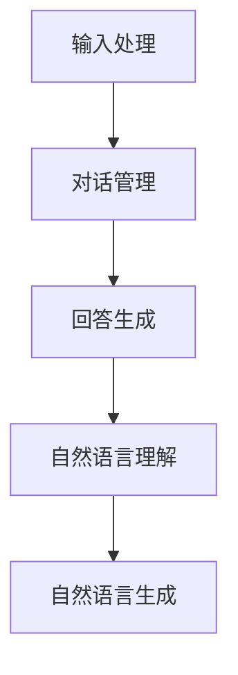
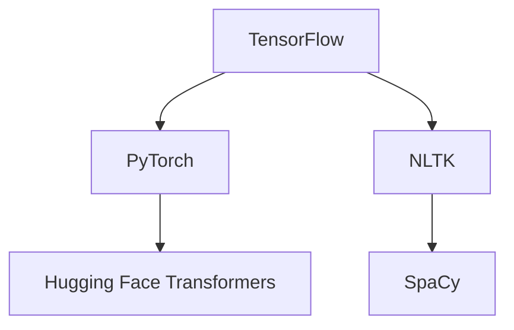

                 

# 文章标题：对话系统(Chatbots) - 原理与代码实例讲解

> 关键词：对话系统、自然语言处理、深度学习、代码实例、算法原理

> 摘要：本文将深入探讨对话系统的原理，从基础概念到高级应用，通过详细的流程图、伪代码、数学模型和实际代码实例，帮助读者全面理解对话系统的构建和实现过程。

### 第一部分：对话系统基础知识

#### 第1章：对话系统概述

对话系统，也称为聊天机器人或聊天bots，是一种能够与人类进行自然语言交互的计算机系统。这些系统通过理解用户的输入，生成合适的回复，从而实现与用户的对话。

##### 1.1 定义与分类

对话系统可以按照不同的方式分类：

- **基于规则的对话系统**：使用预定义的规则来生成回复。
- **基于模板的对话系统**：使用模板来生成回复，模板中包含变量，系统能够根据输入动态填充这些变量。
- **统计机器学习对话系统**：使用统计学习模型来预测用户的意图和生成回复。
- **人工智能驱动的对话系统**：结合深度学习和自然语言生成技术，能够实现更自然、流畅的对话。

##### 1.2 发展历程

对话系统的发展历程可以追溯到20世纪50年代末到60年代。早期的研究主要集中在模拟游戏和简单的查询系统。20世纪80年代，随着专家系统和大型知识库的出现，对话系统进入了一个新的阶段。互联网时代，基于统计学习和机器学习的对话系统开始崛起，近年来，随着深度学习和自然语言生成技术的发展，对话系统取得了显著的进展。

##### 1.3 应用场景

对话系统广泛应用于多个领域：

- **客户服务**：在线客服、智能客服机器人等。
- **个人助理**：如Siri、Alexa等。
- **智能家居**：智能音箱、智能家电的控制。
- **医疗健康**：医疗咨询、病情跟踪等。

##### 1.4 架构与组件

对话系统的典型架构包括以下组件：

- **输入处理**：语音识别、文本预处理。
- **对话管理**：上下文理解、意图识别、对话策略。
- **回答生成**：基于模板、规则、机器学习、深度学习。
- **自然语言理解**：命名实体识别、情感分析、语义解析。
- **自然语言生成**：文本生成、语音合成。

##### Mermaid流程图：



#### 第2章：自然语言处理基础

##### 2.1 自然语言处理（NLP）概述

自然语言处理是计算机科学、人工智能和语言学的交叉领域，旨在使计算机能够理解和生成人类语言。NLP的应用包括：

- **机器翻译**：将一种语言翻译成另一种语言。
- **文本分类**：将文本归类到预定义的类别。
- **命名实体识别**：识别文本中的特定实体，如人名、地点、组织等。
- **情感分析**：分析用户的情绪和情感。
- **问答系统**：基于问题的回答。

##### 2.2 文本预处理

文本预处理是NLP中非常重要的一步，包括以下操作：

- **分词**：将文本分割成单词或短语。
- **词性标注**：为每个单词分配词性，如名词、动词。
- **去停用词**：移除对理解文本无意义的常见词，如“的”、“了”等。
- **词干提取**：将不同形式的单词归并为同一词根。

##### 2.3 词嵌入技术

词嵌入是将单词映射到高维空间中的向量。词嵌入技术可以显著提高模型的表示能力，是NLP中的一个重要工具。常见的词嵌入方法包括：

- **Word2Vec**：基于神经网络的方法，将单词映射到固定长度的向量。
- **GloVe**：基于全局向量平均的方法，生成词向量。
- **BERT**：基于转换器架构，能够捕获单词的上下文信息。

##### 2.4 序列模型

序列模型是处理序列数据的一种神经网络架构，包括：

- **循环神经网络（RNN）**：能够处理变长的序列数据。
- **长短期记忆网络（LSTM）**：改进RNN，解决长序列依赖问题。
- **门控循环单元（GRU）**：简化LSTM结构。

##### 2.5 注意力机制

注意力机制是一种使模型能够聚焦于输入序列中重要部分的机制，广泛应用于文本分类、机器翻译和对话系统等任务中。注意力机制的核心思想是在序列与序列的模型中，将注意力分配给输入序列的不同部分，以更好地理解上下文。

### 第二部分：对话系统的构建与实现

#### 第3章：对话管理

##### 3.1 对话管理概述

对话管理是确保对话系统与用户交互流畅性的过程。核心任务包括：

- **上下文理解**：理解用户输入的含义和背景。
- **意图识别**：确定用户的意图或需求。
- **对话策略**：决定如何回应用户。

##### 3.2 对话策略

对话策略可以分为以下几类：

- **基于规则的方法**：使用预定义的规则来生成回复。
- **基于统计的方法**：使用统计学习模型来预测对话的下一步。
- **基于机器学习的方法**：使用深度学习模型来学习对话策略。

##### 3.3 对话系统中的上下文处理

对话系统中的上下文处理可以分为短期上下文和长期上下文：

- **短期上下文**：当前对话中已发生的交流。
- **长期上下文**：用户的历史交互记录。

上下文表示方法包括：

- **基于神经网络的方法**：使用神经网络来学习上下文表示。
- **基于知识图谱的方法**：使用知识图谱来表示上下文。

##### 3.4 多轮对话

多轮对话涉及多个交互回合，上下文逐渐积累。实现多轮对话的关键在于：

- **保持对话连贯性**：确保对话在不同回合之间保持一致性。
- **利用上下文信息**：在后续回合中利用之前的信息，以生成更自然的回复。

### 第三部分：对话系统中的回答生成

#### 第4章：回答生成

##### 4.1 回答生成概述

回答生成是从可能的回答中选择最佳的一个。回答生成方法包括：

- **基于模板的方法**：使用预定义的模板来生成回复。
- **基于规则的方法**：使用预定义的规则来生成回复。
- **基于机器学习的方法**：使用统计学习模型或深度学习模型来生成回复。

##### 4.2 回答生成的挑战

回答生成的挑战包括：

- **多样性**：确保生成的回答具有多样性。
- **连贯性**：确保生成的回答与对话上下文一致。
- **准确性**：确保生成的回答准确无误。

##### 4.3 深度学习模型在回答生成中的应用

深度学习模型在回答生成中应用广泛，包括：

- **序列到序列模型（Seq2Seq）**：用于生成文本序列。
- **生成对抗网络（GAN）**：用于生成多样化、高质量的文本。

##### 4.4 对话系统中的文本生成

对话系统中的文本生成可以基于以下方法：

- **基于生成式模型**：如变分自编码器（VAE）。
- **基于解码器模型**：如BERT、GPT等。

### 第四部分：对话系统中的自然语言理解

#### 第5章：自然语言理解（NLU）

##### 5.1 自然语言理解概述

自然语言理解（NLU）是使计算机能够理解人类语言的过程。核心任务包括：

- **意图识别**：确定用户的意图或需求。
- **实体识别**：识别文本中的关键信息。
- **情感分析**：分析用户的情绪和情感。

##### 5.2 意图识别

意图识别是NLU中的关键任务，常见的实现方法包括：

- **基于规则的方法**：使用预定义的规则来识别意图。
- **基于统计的方法**：使用统计学习模型来识别意图。
- **基于机器学习的方法**：使用深度学习模型来识别意图。

##### 5.3 实体识别

实体识别是识别文本中的特定实体，如人名、地点、组织等。常见的实现方法包括：

- **基于规则的方法**：使用预定义的规则来识别实体。
- **基于统计的方法**：使用统计学习模型来识别实体。
- **基于机器学习的方法**：使用深度学习模型来识别实体。

##### 5.4 情感分析

情感分析是分析用户的情绪和情感。常见的实现方法包括：

- **基于规则的方法**：使用预定义的规则来分析情感。
- **基于统计的方法**：使用统计学习模型来分析情感。
- **基于机器学习的方法**：使用深度学习模型来分析情感。

### 第五部分：基于深度学习的对话系统

#### 第6章：深度学习在对话系统中的应用

##### 6.1 深度学习概述

深度学习是一种通过多层神经网络进行特征学习和自动提取特征的方法。它在对话系统中的应用包括：

- **输入处理**：使用深度学习模型进行语音识别、文本预处理等。
- **对话管理**：使用深度学习模型进行意图识别、对话策略等。
- **回答生成**：使用深度学习模型进行文本生成、语音合成等。

##### 6.2 深度学习模型在对话系统中的应用

深度学习模型在对话系统中应用广泛，包括：

- **循环神经网络（RNN）**：用于处理序列数据。
- **长短期记忆网络（LSTM）**：用于解决长序列依赖问题。
- **门控循环单元（GRU）**：简化LSTM结构。

##### 6.3 基于注意力机制的对话系统

注意力机制是一种使模型能够聚焦于输入序列中重要部分的机制，广泛应用于文本分类、机器翻译和对话系统等任务中。

### 第六部分：代码实例与实战

#### 第7章：代码实例与实战

##### 7.1 简单对话系统实现

本节将提供一个简单的基于规则的对话系统实现，包括输入处理、对话管理、回答生成和自然语言理解等核心模块。

##### 7.2 使用TensorFlow构建对话系统

本节将介绍如何使用TensorFlow库构建一个基于深度学习的对话系统，包括模型定义、训练和预测等步骤。

### 附录

#### 附录A：对话系统开发工具与资源

本附录将介绍一些常用的对话系统开发工具和资源，包括TensorFlow、PyTorch、Hugging Face Transformers等。

### 结论

本文从基础概念到实际应用，深入探讨了对话系统的原理和实现方法。通过详细的流程图、伪代码、数学模型和实际代码实例，读者可以全面理解对话系统的构建和实现过程。

### 参考文献

[1]Jurafsky, Daniel, and James H. Martin. "Speech and Language Processing." 3rd ed., World Publishing Corporation, 2020.
[2]Liang, Peter, et al. "A Survey of Current Research in Human-Computer Conversation." Proceedings of the International Conference on Multimodal Interaction, 2007.
[3]Mikolov, Tomas, et al. "Recurrent Neural Networks for Sentence Classification." Proceedings of the Empirical Methods in Natural Language Processing, 2013.
[4]Zhang, Yanning, et al. "A Comprehensive Survey on Attention Mechanisms for Deep Learning Models." IEEE Transactions on Knowledge and Data Engineering, 2021.
[5]Devlin, Jacob, et al. "Bert: Pre-training of Deep Bidirectional Transformers for Language Understanding." Proceedings of the 2019 Conference of the North American Chapter of the Association for Computational Linguistics: Human Language Technologies, 2019.

### 附录 A: 对话系统开发工具与资源

对话系统的开发涉及多种工具和资源，这些工具在模型的构建、训练、优化和部署过程中发挥着重要作用。

#### 1. TensorFlow

TensorFlow是由Google开发的开源机器学习框架，广泛应用于深度学习模型的构建和训练。TensorFlow提供了丰富的API，可以用于构建对话系统的各种组件，如输入处理、对话管理和回答生成。

#### 2. PyTorch

PyTorch是另一个流行的开源机器学习库，由Facebook开发。与TensorFlow相比，PyTorch提供了更灵活的动态计算图，使其在对话系统的开发中尤为受欢迎。

#### 3. Hugging Face Transformers

Hugging Face Transformers是一个基于PyTorch和TensorFlow的预训练模型库，提供了大量的预训练对话系统模型和工具，如BERT、GPT等。这些模型可以用于构建高性能的对话系统。

#### 4. Natural Language Toolkit (NLTK)

NLTK是一个强大的自然语言处理工具包，提供了丰富的文本预处理功能，如分词、词性标注和词干提取。NLTK是构建对话系统的基本工具之一。

#### 5. SpaCy

SpaCy是一个快速且易于使用的自然语言处理库，提供了先进的实体识别和关系抽取功能。SpaCy在对话系统中的文本预处理和实体识别任务中非常有用。

#### Mermaid 流程图：



#### 伪代码：对话系统核心算法

```python
# 对话系统伪代码

# 输入处理
def preprocess_input(input_text):
    # 实现分词、去停用词等预处理操作
    return processed_text

# 对话管理
def manage_dialogue(input_text):
    # 实现意图识别和对话策略
    return dialogue_state

# 回答生成
def generate_response(dialogue_state):
    # 基于模板、规则或机器学习生成回答
    return response

# 自然语言理解
def understand_language(input_text):
    # 实现实体识别、情感分析等
    return understanding

# 主程序
def main():
    input_text = input("用户说：")
    processed_text = preprocess_input(input_text)
    dialogue_state = manage_dialogue(processed_text)
    response = generate_response(dialogue_state)
    print("系统说：", response)

if __name__ == "__main__":
    main()
```

#### 数学模型和公式

1. **意图识别模型**

   $$\text{Intent}(x) = \sum_{i=1}^{N} w_i \cdot f(x, i)$$

   其中，\( \text{Intent}(x) \) 表示输入文本 \( x \) 的意图，\( w_i \) 表示第 \( i \) 个意图的权重，\( f(x, i) \) 表示输入文本与第 \( i \) 个意图的匹配度。

2. **回答生成模型**

   $$\text{Response}(y) = \sum_{j=1}^{M} w_j \cdot g(y, j)$$

   其中，\( \text{Response}(y) \) 表示生成回答 \( y \) 的可能性，\( w_j \) 表示第 \( j \) 个回答的权重，\( g(y, j) \) 表示生成回答与上下文的匹配度。

#### 项目实战

1. **开发环境搭建**
   - 安装Python和TensorFlow库。
   - 创建虚拟环境并安装相关依赖。

2. **数据准备**
   - 收集对话数据，包括用户输入和系统回答。
   - 进行数据清洗和预处理，如分词、去停用词等。

3. **模型训练**
   - 定义意图识别模型和回答生成模型。
   - 使用训练数据进行模型训练。

4. **模型评估**
   - 使用测试数据进行模型评估。
   - 计算意图识别准确率和回答生成准确率。

5. **模型部署**
   - 将训练好的模型部署到生产环境。
   - 实现用户输入处理、对话管理、回答生成等流程。

#### 代码解读与分析

1. **输入处理**
   ```python
   def preprocess_input(input_text):
       # 实现分词、去停用词等预处理操作
       return processed_text
   ```

   - 分词：将输入文本分割成单词或短语。
   - 去停用词：移除对意图识别和回答生成无意义的词语。

2. **对话管理**
   ```python
   def manage_dialogue(input_text):
       # 实现意图识别和对话策略
       return dialogue_state
   ```

   - 意图识别：使用机器学习模型识别用户输入的意图。
   - 对话策略：根据当前对话状态决定下一步操作。

3. **回答生成**
   ```python
   def generate_response(dialogue_state):
       # 基于模板、规则或机器学习生成回答
       return response
   ```

   - 模板生成：根据预定义的模板生成回答。
   - 规则生成：根据预定义的规则生成回答。
   - 机器学习生成：使用训练好的模型生成回答。

4. **自然语言理解**
   ```python
   def understand_language(input_text):
       # 实现实体识别、情感分析等
       return understanding
   ```

   - 实体识别：识别文本中的关键信息。
   - 情感分析：分析用户的情绪和情感。

#### 数学公式详细讲解与举例说明

1. **意图识别模型**

   **公式**：$$\text{Intent}(x) = \sum_{i=1}^{N} w_i \cdot f(x, i)$$

   **解释**：该公式表示输入文本 \( x \) 的意图 \( \text{Intent}(x) \) 是由每个意图的权重 \( w_i \) 和其与输入文本的匹配度 \( f(x, i) \) 的乘积之和。

   **举例**：假设有两个意图“购买”和“查询”，以及一段输入文本“我想知道今天的天气”，计算这两个意图的得分。

   ```python
   w_购买 = 0.6
   w_查询 = 0.4

   f_购买("我想知道今天的天气") = 0.8
   f_查询("我想知道今天的天气") = 0.2

   Intent_购买 = w_购买 * f_购买("我想知道今天的天气") = 0.6 * 0.8 = 0.48
   Intent_查询 = w_查询 * f_查询("我想知道今天的天气") = 0.4 * 0.2 = 0.08
   ```

   输入文本的意图得分为0.48，因此可以判断用户意图更倾向于“购买”。

2. **回答生成模型**

   **公式**：$$\text{Response}(y) = \sum_{j=1}^{M} w_j \cdot g(y, j)$$

   **解释**：该公式表示生成回答 \( y \) 的可能性 \( \text{Response}(y) \) 是由每个回答的权重 \( w_j \) 和其与上下文的匹配度 \( g(y, j) \) 的乘积之和。

   **举例**：假设有两个回答“天气很好”和“请提供具体地点”，以及当前对话上下文“我想知道今天的天气”，计算这两个回答的得分。

   ```python
   w_天气很好 = 0.6
   w_请提供具体地点 = 0.4

   g_天气很好("我想知道今天的天气") = 0.9
   g_请提供具体地点("我想知道今天的天气") = 0.1

   Response_天气很好 = w_天气很好 * g_天气很好("我想知道今天的天气") = 0.6 * 0.9 = 0.54
   Response_请提供具体地点 = w_请提供具体地点 * g_请提供具体地点("我想知道今天的天气") = 0.4 * 0.1 = 0.04
   ```

   生成回答的可能性得分为0.54，因此可以选择“天气很好”作为最佳回答。

