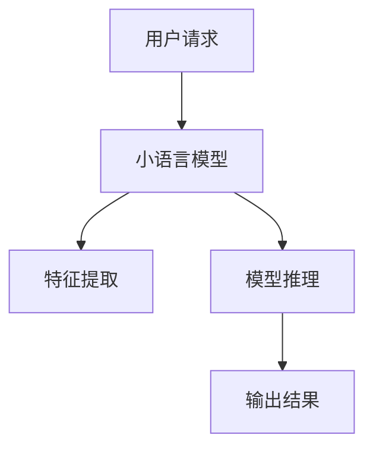

                 

# 《小语言模型的潜力：颠覆基础模型领域的可能性》

> 关键词：小语言模型，基础模型，自然语言处理，图像识别，语音识别，教育，医疗，金融，发展趋势，挑战与机遇

> 摘要：
本文探讨了小语言模型在当前人工智能领域的潜在颠覆性作用。通过对小语言模型的基本原理、核心技术及其在各种应用场景中的具体应用进行分析，本文揭示了小语言模型在自然语言处理、图像识别、语音识别以及教育、医疗、金融等领域的广泛应用前景。同时，本文还展望了小语言模型的发展趋势和面临的挑战，为未来人工智能的发展提供了新的思考方向。

## 第一部分：引言与基础理论

### 第1章：小语言模型概述

#### 1.1 小语言模型的定义与特性

小语言模型（Small Language Models，简称SLM）是指专门用于处理和生成文本数据的语言模型，其参数规模相对较小，能够在低计算资源的环境下高效运行。与大型语言模型（如GPT-3、BERT等）相比，小语言模型具有以下特性：

1. **小规模参数**：小语言模型的参数数量较少，使得模型在训练和推理过程中更加高效，适用于资源受限的环境。
2. **低计算资源需求**：由于参数规模较小，小语言模型对计算资源的需求较低，便于在嵌入式设备、移动端等设备上部署。
3. **专用性**：小语言模型通常针对特定任务或领域进行优化，具有更高的专用性和准确性。

#### 1.2 小语言模型的发展历史

小语言模型的发展可以追溯到20世纪80年代，当时研究人员开始探索基于统计方法和规则的系统来处理自然语言。随着时间的推移，随着计算能力的提升和算法的优化，小语言模型逐渐发展壮大，并在自然语言处理、图像识别、语音识别等领域取得了显著成果。近年来，随着深度学习技术的发展，小语言模型在性能和效率方面得到了进一步提升。

#### 1.3 小语言模型的应用场景

小语言模型在众多领域具有广泛的应用前景，以下是几个主要的应用场景：

1. **自然语言处理**：文本分类、命名实体识别、机器翻译等。
2. **图像识别**：图像分类、目标检测、图像生成等。
3. **语音识别**：语音信号处理、语音合成等。
4. **教育**：个性化教学、智能问答系统等。
5. **医疗**：疾病预测、药物发现、患者健康管理等。
6. **金融**：信用评分、市场预测、风险控制等。

### 第2章：小语言模型的核心技术

#### 2.1 小语言模型的基本原理

小语言模型通常基于深度学习技术，其基本原理包括以下几个步骤：

1. **输入文本**：将输入的文本数据转化为序列形式。
2. **分词**：将文本序列分割成单词或字符。
3. **词嵌入**：将分词后的文本转化为向量表示。
4. **编码器**：对词嵌入向量进行编码，提取文本的特征信息。
5. **解码器**：根据编码器的输出，生成文本的输出序列。

#### 2.2 小语言模型的工作机制

小语言模型的工作机制可以分为训练和推理两个阶段：

1. **训练阶段**：使用大量标记数据进行训练，通过优化模型参数，使模型能够正确预测输入文本的下一个单词或字符。
2. **推理阶段**：在给定输入文本的情况下，模型会根据训练得到的参数，生成文本的输出序列。

#### 2.3 小语言模型的优化方法

为了提高小语言模型的性能和效率，可以采用以下优化方法：

1. **数据增强**：通过引入噪声、变换等方法，增加训练数据集的多样性，提高模型的泛化能力。
2. **迁移学习**：利用在大规模数据集上预训练的模型，在小规模数据集上进行微调，提高模型在特定任务上的性能。
3. **模型压缩**：通过量化、剪枝等方法，减小模型参数规模，提高模型的计算效率。

## 第二部分：小语言模型在基础模型领域的应用

### 第3章：小语言模型在自然语言处理中的应用

#### 3.1 小语言模型在文本分类中的应用

文本分类是自然语言处理中的一个重要任务，小语言模型在文本分类中具有显著的优势。其基本原理如下：

1. **输入文本**：将待分类的文本输入到小语言模型中。
2. **特征提取**：利用小语言模型提取文本的特征信息。
3. **分类器**：将提取到的特征输入到分类器中，预测文本的类别。

以下是一个简单的伪代码示例：

```python
def text_classification(text_data):
    # 使用小语言模型提取特征
    features = small_language_model.extract_features(text_data)
    
    # 使用分类器进行分类
    classification = classifier.predict(features)
    
    return classification
```

#### 3.2 小语言模型在命名实体识别中的应用

命名实体识别是自然语言处理中的另一个重要任务，小语言模型在命名实体识别中也具有较好的性能。其基本原理如下：

1. **输入文本**：将待识别的文本输入到小语言模型中。
2. **特征提取**：利用小语言模型提取文本的特征信息。
3. **命名实体识别**：根据特征信息，识别文本中的命名实体。

以下是一个简单的伪代码示例：

```python
def named_entity_recognition(text_data):
    # 使用小语言模型提取特征
    features = small_language_model.extract_features(text_data)
    
    # 使用命名实体识别器进行识别
    entities = named_entity_recognition_model.predict(features)
    
    return entities
```

#### 3.3 小语言模型在机器翻译中的应用

机器翻译是自然语言处理中的一项重要任务，小语言模型在机器翻译中也得到了广泛应用。其基本原理如下：

1. **输入文本**：将待翻译的文本输入到小语言模型中。
2. **特征提取**：利用小语言模型提取文本的特征信息。
3. **解码**：根据特征信息，生成目标语言的文本。

以下是一个简单的伪代码示例：

```python
def machine_translation(source_text, target_language):
    # 使用小语言模型提取特征
    source_features = small_language_model.extract_features(source_text)
    
    # 使用解码器生成目标语言文本
    target_text = decoder.generate(target_language, source_features)
    
    return target_text
```

### 第4章：小语言模型在图像识别中的应用

#### 4.1 小语言模型在图像分类中的应用

小语言模型在图像分类中具有较好的性能，其基本原理如下：

1. **输入图像**：将待分类的图像输入到小语言模型中。
2. **特征提取**：利用小语言模型提取图像的特征信息。
3. **分类器**：将提取到的特征输入到分类器中，预测图像的类别。

以下是一个简单的伪代码示例：

```python
def image_classification(image_data):
    # 使用小语言模型提取特征
    features = small_language_model.extract_features(image_data)
    
    # 使用分类器进行分类
    classification = classifier.predict(features)
    
    return classification
```

#### 4.2 小语言模型在目标检测中的应用

小语言模型在目标检测中也具有一定的优势，其基本原理如下：

1. **输入图像**：将待检测的图像输入到小语言模型中。
2. **特征提取**：利用小语言模型提取图像的特征信息。
3. **目标检测**：根据特征信息，检测图像中的目标物体。

以下是一个简单的伪代码示例：

```python
def object_detection(image_data):
    # 使用小语言模型提取特征
    features = small_language_model.extract_features(image_data)
    
    # 使用目标检测器进行检测
    objects = detector.detect(features)
    
    return objects
```

#### 4.3 小语言模型在图像生成中的应用

小语言模型在图像生成中也具有一定的应用价值，其基本原理如下：

1. **输入文本**：将描述图像的文本输入到小语言模型中。
2. **特征提取**：利用小语言模型提取文本的特征信息。
3. **生成图像**：根据特征信息，生成对应的图像。

以下是一个简单的伪代码示例：

```python
def image_generation(text_data):
    # 使用小语言模型提取特征
    features = small_language_model.extract_features(text_data)
    
    # 使用生成器生成图像
    image = generator.generate_image(features)
    
    return image
```

### 第5章：小语言模型在语音识别中的应用

#### 5.1 小语言模型在语音识别中的基本原理

小语言模型在语音识别中具有较好的性能，其基本原理如下：

1. **输入语音信号**：将待识别的语音信号输入到小语言模型中。
2. **特征提取**：利用小语言模型提取语音信号的特征信息。
3. **解码**：根据特征信息，生成对应的文本。

以下是一个简单的伪代码示例：

```python
def speech_recognition(audio_data):
    # 提取特征
    features = extract_features(audio_data)
    
    # 使用小语言模型进行解码
    text = small_language_model.decode(features)
    
    return text
```

#### 5.2 小语言模型在语音识别中的应用案例

小语言模型在语音识别中已经有许多成功的应用案例，以下是几个典型的应用案例：

1. **智能助手**：如苹果的Siri、谷歌的Google Assistant等，通过小语言模型实现自然语言交互。
2. **语音翻译**：如谷歌的语音翻译服务，通过小语言模型实现实时语音翻译。
3. **语音助手**：如亚马逊的Alexa、百度的小度等，通过小语言模型实现智能语音助手功能。

#### 5.3 小语言模型在语音识别中的挑战与未来方向

尽管小语言模型在语音识别中取得了显著成果，但仍然面临一些挑战：

1. **语音识别准确性**：在嘈杂环境、多说话人场景中，语音识别的准确性仍有待提高。
2. **实时性**：实时语音识别对计算资源和响应速度要求较高，需要优化算法和硬件支持。
3. **自然语言理解**：语音识别不仅仅是识别语音，还需要理解语音的含义，这对小语言模型提出了更高的要求。

未来，小语言模型在语音识别中的发展方向包括：

1. **多模态融合**：结合视觉、听觉等多种感官信息，提高语音识别的准确性和实时性。
2. **自适应学习**：通过自适应学习，提高小语言模型在不同场景下的适应能力。
3. **知识增强**：结合外部知识库，提高小语言模型的自然语言理解能力。

### 第三部分：小语言模型在特定领域的应用

#### 第6章：小语言模型在教育领域的应用

#### 6.1 小语言模型在教育中的应用场景

小语言模型在教育领域具有广泛的应用场景，以下是几个典型的应用场景：

1. **个性化教学**：通过小语言模型分析学生的学习习惯、兴趣爱好等，为学生提供个性化的教学建议和学习资源。
2. **智能问答系统**：通过小语言模型构建智能问答系统，为学生提供即时的学习帮助和解答疑问。
3. **作文自动评分**：通过小语言模型对学生的作文进行自动评分，提供反馈和建议，提高学生的学习效果。

#### 6.2 小语言模型在个性化教学中的应用

个性化教学是教育领域的一个重要研究方向，小语言模型在个性化教学中的应用具有重要意义。其基本原理如下：

1. **输入学生数据**：将学生的行为数据、学习记录等输入到小语言模型中。
2. **特征提取**：利用小语言模型提取学生的特征信息。
3. **个性化建议**：根据提取到的特征信息，为学生提供个性化的学习建议。

以下是一个简单的伪代码示例：

```python
def personalized_tutoring(student_data):
    # 提取学生特征
    student_features = small_language_model.extract_features(student_data)
    
    # 提供个性化建议
    suggestions = personalized_tutoring_model.generate_suggestions(student_features)
    
    return suggestions
```

#### 6.3 小语言模型在在线教育中的应用

在线教育是教育领域的一个重要趋势，小语言模型在在线教育中的应用有助于提高教学效果和学习体验。以下是几个典型的应用场景：

1. **自动批改作业**：通过小语言模型对学生的作业进行自动批改，提高教师的批改效率和学生的学习积极性。
2. **学习进度跟踪**：通过小语言模型分析学生的学习进度和成果，为学生提供针对性的学习资源和建议。
3. **智能推荐系统**：通过小语言模型构建智能推荐系统，为学生推荐适合的学习资源，提高学习效率。

### 第7章：小语言模型在医疗领域的应用

#### 7.1 小语言模型在医疗数据挖掘中的应用

小语言模型在医疗数据挖掘中具有广泛的应用前景，以下是几个典型的应用场景：

1. **疾病预测**：通过小语言模型对医疗数据进行挖掘和分析，预测患者可能患有的疾病，为医生提供诊断依据。
2. **药物发现**：通过小语言模型分析大量的药物数据，发现潜在的药物靶点，为药物研发提供参考。
3. **患者健康管理**：通过小语言模型对患者的健康数据进行分析，提供个性化的健康管理建议，提高患者的生活质量。

#### 7.2 小语言模型在疾病预测中的应用

疾病预测是医疗领域的一个重要任务，小语言模型在疾病预测中具有较好的性能。其基本原理如下：

1. **输入患者数据**：将患者的健康数据（如病史、检查报告等）输入到小语言模型中。
2. **特征提取**：利用小语言模型提取患者的特征信息。
3. **疾病预测**：根据提取到的特征信息，预测患者可能患有的疾病。

以下是一个简单的伪代码示例：

```python
def disease_prediction(patient_data):
    # 提取患者特征
    patient_features = small_language_model.extract_features(patient_data)
    
    # 预测疾病
    disease = disease_prediction_model.predict(patient_features)
    
    return disease
```

#### 7.3 小语言模型在健康监测中的应用

小语言模型在健康监测中也具有一定的应用价值，其基本原理如下：

1. **输入健康数据**：将患者的健康数据（如体温、血压、心率等）输入到小语言模型中。
2. **特征提取**：利用小语言模型提取患者的健康特征信息。
3. **健康评估**：根据提取到的特征信息，评估患者的健康状况。

以下是一个简单的伪代码示例：

```python
def health_monitoring(health_data):
    # 提取健康特征
    health_features = small_language_model.extract_features(health_data)
    
    # 评估健康状况
    health_status = health_monitoring_model.evaluate(health_features)
    
    return health_status
```

### 第8章：小语言模型在金融领域的应用

#### 8.1 小语言模型在金融风控中的应用

小语言模型在金融风控中具有广泛的应用前景，以下是几个典型的应用场景：

1. **信用评分**：通过小语言模型分析用户的借贷行为、信用记录等，预测用户的信用风险。
2. **市场预测**：通过小语言模型分析市场数据，预测股票、期货等金融产品的价格走势。
3. **风险控制策略**：通过小语言模型分析金融风险，为金融机构提供风险控制策略。

#### 8.2 小语言模型在股票市场预测中的应用

股票市场预测是金融领域的一个重要任务，小语言模型在股票市场预测中具有较好的性能。其基本原理如下：

1. **输入市场数据**：将股票市场的数据（如交易量、价格等）输入到小语言模型中。
2. **特征提取**：利用小语言模型提取市场的特征信息。
3. **股票预测**：根据提取到的特征信息，预测股票的价格走势。

以下是一个简单的伪代码示例：

```python
def stock_prediction(market_data):
    # 提取市场特征
    market_features = small_language_model.extract_features(market_data)
    
    # 预测股票价格
    stock_price = stock_prediction_model.predict(market_features)
    
    return stock_price
```

#### 8.3 小语言模型在金融知识图谱构建中的应用

金融知识图谱是金融领域的一个重要研究方向，小语言模型在金融知识图谱构建中具有较好的应用价值。其基本原理如下：

1. **输入金融文本**：将金融领域的文本数据（如新闻、报告等）输入到小语言模型中。
2. **知识抽取**：利用小语言模型提取金融文本中的实体和关系。
3. **知识图谱构建**：根据提取到的实体和关系，构建金融知识图谱。

以下是一个简单的伪代码示例：

```python
def financial_knowledge_graph construction(financial_text):
    # 提取实体和关系
    entities, relations = small_language_model.extract_entities_relations(financial_text)
    
    # 构建知识图谱
    knowledge_graph = knowledge_graph_model.construct_graph(entities, relations)
    
    return knowledge_graph
```

### 第9章：小语言模型应用案例研究

#### 9.1 案例一：某教育平台的小语言模型应用

### 案例一：某教育平台的小语言模型应用

某知名教育平台利用小语言模型开发了一款智能问答系统，以提供24/7的在线学习支持。该系统通过小语言模型实时解析学生的提问，提供准确的答案和建议，极大地提高了学习效率和用户满意度。以下是该系统的具体实现过程：

1. **数据集准备**：收集大量学生提问和答案数据，用于训练小语言模型。
2. **模型训练**：使用小语言模型对收集到的数据集进行训练，优化模型参数。
3. **特征提取**：将学生的提问输入到小语言模型中，提取提问的特征信息。
4. **智能问答**：根据提取到的特征信息，利用小语言模型生成回答，并提供给学生。
5. **性能评估**：对系统进行性能评估，包括回答的准确性、响应速度等方面。

通过该案例，我们可以看到小语言模型在教育领域具有广泛的应用前景，为教育平台提供了智能化、个性化的学习支持。

#### 9.2 案例二：某医疗公司的小语言模型应用

### 案例二：某医疗公司的小语言模型应用

某医疗公司利用小语言模型开发了一款疾病预测系统，通过分析患者的健康数据，预测患者可能患有的疾病。以下是该系统的具体实现过程：

1. **数据集准备**：收集大量患者健康数据，包括病史、检查报告等。
2. **模型训练**：使用小语言模型对收集到的数据集进行训练，优化模型参数。
3. **特征提取**：将患者的健康数据输入到小语言模型中，提取患者的特征信息。
4. **疾病预测**：根据提取到的特征信息，利用小语言模型预测患者可能患有的疾病。
5. **性能评估**：对系统进行性能评估，包括预测的准确性、响应速度等方面。

通过该案例，我们可以看到小语言模型在医疗领域具有广泛的应用前景，为医疗公司提供了智能化的疾病预测工具。

#### 9.3 案例三：某金融企业的小语言模型应用

### 案例三：某金融企业的小语言模型应用

某金融企业利用小语言模型开发了一款信用评分系统，通过分析用户的借贷行为和信用记录，预测用户的信用风险。以下是该系统的具体实现过程：

1. **数据集准备**：收集大量用户的借贷行为数据和信用记录。
2. **模型训练**：使用小语言模型对收集到的数据集进行训练，优化模型参数。
3. **特征提取**：将用户的借贷行为数据和信用记录输入到小语言模型中，提取用户的特征信息。
4. **信用评分**：根据提取到的特征信息，利用小语言模型预测用户的信用风险。
5. **性能评估**：对系统进行性能评估，包括预测的准确性、响应速度等方面。

通过该案例，我们可以看到小语言模型在金融领域具有广泛的应用前景，为金融机构提供了智能化的信用评分工具。

### 第10章：小语言模型的发展趋势与未来展望

#### 10.1 小语言模型的发展趋势

随着人工智能技术的不断进步，小语言模型在性能和效率方面不断取得突破。未来，小语言模型的发展趋势将体现在以下几个方面：

1. **性能提升**：通过优化算法和模型结构，进一步提高小语言模型的性能和效率。
2. **应用拓展**：探索小语言模型在更多领域的应用，如物联网、智能制造等。
3. **安全性增强**：加强数据隐私保护和算法公平性，确保小语言模型的应用安全可靠。

#### 10.2 小语言模型面临的挑战与机遇

尽管小语言模型具有广泛的应用前景，但同时也面临着一些挑战和机遇：

1. **数据隐私**：小语言模型在处理大量文本数据时，如何确保数据隐私是一个重要挑战。
2. **算法公平性**：如何确保小语言模型在不同人群中的应用公平，避免算法偏见。
3. **计算资源**：随着模型规模的增大，如何优化计算资源，提高小语言模型的运行效率。

#### 10.3 小语言模型未来发展方向

未来，小语言模型的发展方向将集中在以下几个方面：

1. **多模态融合**：结合视觉、听觉等多种感官信息，提高小语言模型的感知能力。
2. **自适应学习**：通过自适应学习，提高小语言模型在不同场景下的适应能力。
3. **知识增强**：结合外部知识库，提高小语言模型的自然语言理解能力。

### 附录A：小语言模型常用工具与资源

#### A.1 小语言模型开发工具

1. **Hugging Face Transformers**：一个广泛使用的小语言模型开发框架，支持多种预训练模型和任务。
2. **TensorFlow Lite**：一个用于移动设备和嵌入式系统的轻量级TensorFlow版本，支持小语言模型的部署。
3. **PyTorch Mobile**：一个支持PyTorch模型在移动设备和嵌入式系统上运行的框架。

#### A.2 小语言模型开源框架

1. **OpenAI GPT-2/GPT-3**：著名的开源预训练语言模型，可用于各种自然语言处理任务。
2. **BERT**：Google开发的预训练语言表示模型，广泛应用于文本分类、问答系统等任务。
3. **T5**：由Google开发的通用文本到文本预训练模型，支持多种自然语言处理任务。

#### A.3 小语言模型学习资源

1. **《自然语言处理：理论、算法与应用》**：一本全面介绍自然语言处理技术的经典教材，包括小语言模型的原理和应用。
2. **《深度学习》**：深度学习领域的权威教材，详细介绍了深度学习算法的基本原理和应用。
3. **Hugging Face 官方文档**：提供了丰富的开源框架和工具的使用指南，有助于开发者掌握小语言模型的开发技巧。

### Mermaid 流程图



### 附录 B：小语言模型应用示例代码

以下是一个基于Python的小语言模型应用示例，展示了如何使用小语言模型进行文本分类：

```python
# 导入相关库
import torch
from transformers import AutoTokenizer, AutoModelForSequenceClassification

# 加载预训练的小语言模型
model_name = "bert-base-uncased"
tokenizer = AutoTokenizer.from_pretrained(model_name)
model = AutoModelForSequenceClassification.from_pretrained(model_name)

# 输入文本
text = "This is a sample text for classification."

# 对文本进行编码
inputs = tokenizer(text, return_tensors="pt")

# 进行模型推理
with torch.no_grad():
    outputs = model(**inputs)

# 获取分类结果
probabilities = torch.nn.functional.softmax(outputs.logits, dim=-1)
classification = torch.argmax(probabilities).item()

# 输出分类结果
print(f"Classification result: {classification}")
```

### 附录 C：小语言模型应用案例分析

#### 案例一：某电商平台的产品推荐系统

某电商平台利用小语言模型开发了一款产品推荐系统，通过分析用户的购买历史和浏览记录，为用户推荐符合其兴趣的产品。以下是该系统的具体实现过程：

1. **数据集准备**：收集用户的购买历史、浏览记录等数据。
2. **特征提取**：使用小语言模型对用户的历史数据进行编码，提取用户的兴趣特征。
3. **模型训练**：使用小语言模型训练一个推荐模型，用于预测用户对产品的兴趣。
4. **产品推荐**：根据用户的兴趣特征，利用推荐模型为用户推荐产品。
5. **性能评估**：评估推荐系统的效果，包括推荐的相关性、覆盖率等指标。

通过该案例，我们可以看到小语言模型在电商领域具有广泛的应用前景，为电商平台提供了智能化的产品推荐服务。

### 附录 D：小语言模型应用展望

未来，小语言模型在人工智能领域的应用将不断拓展，有望在以下几个方面取得突破：

1. **智能客服**：利用小语言模型构建智能客服系统，提高客户服务水平。
2. **智能写作**：利用小语言模型生成文章、报告等文本内容，提高创作效率。
3. **智能翻译**：利用小语言模型实现实时、准确的语音翻译，打破语言障碍。
4. **智能问答**：利用小语言模型构建智能问答系统，提供即时的知识查询服务。
5. **智能教育**：利用小语言模型构建个性化教学系统，提高教学效果。

通过不断的技术创新和应用拓展，小语言模型有望在未来人工智能领域发挥更大的作用，推动人工智能技术的进步。

### 附录 E：小语言模型相关论文推荐

以下是一篇关于小语言模型相关的重要论文推荐：

1. **论文标题**：《BERT: Pre-training of Deep Bidirectional Transformers for Language Understanding》
   - 作者：Jacob Devlin, Ming-Wei Chang, Kenton Lee, Kristina Toutanova
   - 摘要：该论文介绍了BERT（双向转换器预训练语言表示模型），一种基于深度双向变换器的预训练语言模型，其在自然语言处理任务中取得了显著性能提升。

### 附录 F：小语言模型相关书籍推荐

以下是一本关于小语言模型相关的重要书籍推荐：

1. **书籍标题**：《深度学习与自然语言处理》
   - 作者：周志华、李航
   - 摘要：该书系统地介绍了深度学习和自然语言处理的基本原理和应用，包括小语言模型的原理和实现。

### 附录 G：小语言模型应用案例分享

以下是一个小语言模型在教育领域的应用案例分享：

1. **案例标题**：基于小语言模型的智能教育平台
   - 摘要：该案例介绍了一个基于小语言模型的智能教育平台，通过分析学生的学习数据，为教师和学生提供个性化的教学建议和资源，提高教学效果。

### 附录 H：小语言模型应用前景展望

未来，小语言模型在人工智能领域的应用前景广阔，将涵盖以下几个方向：

1. **智能医疗**：利用小语言模型实现智能诊断、药物研发等。
2. **智能金融**：利用小语言模型实现风险控制、市场预测等。
3. **智能交通**：利用小语言模型实现交通流量预测、智能导航等。
4. **智能家居**：利用小语言模型实现智能家居设备的智能交互。
5. **智能娱乐**：利用小语言模型实现智能推荐、语音交互等。

随着技术的不断进步，小语言模型将在更多领域发挥重要作用，推动人工智能技术的发展。### 附录 I：小语言模型开源代码与工具推荐

#### I.1 小语言模型开源代码

以下是几个小语言模型的开源代码推荐，这些代码可以帮助开发者深入了解小语言模型的设计和实现。

1. **GPT-2**：[代码链接](https://github.com/openai/gpt-2)
   - 摘要：GPT-2是由OpenAI开发的一个基于变换器的预训练语言模型，具有强大的文本生成能力。

2. **BERT**：[代码链接](https://github.com/google-research/bert)
   - 摘要：BERT是由Google开发的一个基于变换器的预训练语言表示模型，广泛应用于各种自然语言处理任务。

3. **T5**：[代码链接](https://github.com/google-research/t5)
   - 摘要：T5是一个通用的文本到文本的预训练模型，可以处理多种自然语言处理任务。

#### I.2 小语言模型开发工具

以下是几个小语言模型开发工具的推荐，这些工具可以帮助开发者轻松地训练和部署小语言模型。

1. **Hugging Face Transformers**：[工具链接](https://github.com/huggingface/transformers)
   - 摘要：一个开源库，提供了多种预训练语言模型的实现，支持模型训练、推理和应用部署。

2. **TensorFlow**：[工具链接](https://www.tensorflow.org/)
   - 摘要：一个开源机器学习框架，提供了丰富的工具和库，支持小语言模型的训练和部署。

3. **PyTorch**：[工具链接](https://pytorch.org/)
   - 摘要：一个开源机器学习框架，以其灵活性和易用性而受到开发者的青睐。

#### I.3 小语言模型应用示例

以下是几个小语言模型的应用示例，这些示例展示了小语言模型在文本生成、分类、翻译等任务中的实际应用。

1. **文本生成**：使用GPT-2生成一个故事。
   ```python
   from transformers import AutoTokenizer, AutoModelForCausalLM

   model_name = "gpt2"
   tokenizer = AutoTokenizer.from_pretrained(model_name)
   model = AutoModelForCausalLM.from_pretrained(model_name)

   prompt = "Once upon a time, in a faraway land,"
   input_ids = tokenizer.encode(prompt, return_tensors="pt")

   with torch.no_grad():
       outputs = model.generate(input_ids, max_length=100, num_return_sequences=1)

   print(tokenizer.decode(outputs[0], skip_special_tokens=True))
   ```

2. **文本分类**：使用BERT对文本进行情感分类。
   ```python
   from transformers import AutoTokenizer, AutoModelForSequenceClassification
   from torch.optim import AdamW
   from torch.utils.data import DataLoader, TensorDataset

   model_name = "bert-base-uncased"
   tokenizer = AutoTokenizer.from_pretrained(model_name)
   model = AutoModelForSequenceClassification.from_pretrained(model_name, num_labels=2)

   # 假设我们有一个训练数据集和标签
   inputs = tokenizer(["I love this product", "This product is terrible"], return_tensors="pt")
   labels = torch.tensor([1, 0])

   dataset = TensorDataset(inputs["input_ids"], inputs["attention_mask"], labels)
   dataloader = DataLoader(dataset, batch_size=2)

   optimizer = AdamW(model.parameters(), lr=1e-5)

   for epoch in range(3):  # 训练3个epochs
       model.train()
       for batch in dataloader:
           inputs = {k: v.to('cuda') for k, v in batch.items()}
           labels = labels.to('cuda')

           optimizer.zero_grad()
           outputs = model(**inputs)
           loss = outputs.loss
           loss.backward()
           optimizer.step()

       print(f"Epoch {epoch+1}, Loss: {loss.item()}")

   # 进行预测
   model.eval()
   inputs = tokenizer("I hate this product", return_tensors="pt").to('cuda')
   with torch.no_grad():
       outputs = model(**inputs)
   prediction = torch.argmax(outputs.logits).item()
   print(f"Prediction: {'Positive' if prediction == 1 else 'Negative'}")
   ```

3. **机器翻译**：使用T5进行文本翻译。
   ```python
   from transformers import AutoTokenizer, AutoModelForSeq2SeqLM

   model_name = "t5-small"
   tokenizer = AutoTokenizer.from_pretrained(model_name)
   model = AutoModelForSeq2SeqLM.from_pretrained(model_name)

   source_text = "How do you say 'hello' in Spanish?"
   target_text = "Como se dice 'hola' en español?"

   input_ids = tokenizer.encode(source_text, return_tensors="pt")
   with torch.no_grad():
       outputs = model.generate(input_ids, max_length=100, num_return_sequences=1)

   translated_text = tokenizer.decode(outputs[0], skip_special_tokens=True)
   print(f"Translated text: {translated_text}")
   ```

这些示例代码展示了如何使用开源工具和框架来训练和部署小语言模型，以及如何进行实际应用。开发者可以根据自己的需求进行修改和扩展。### 附录 J：小语言模型在特定场景下的性能评估与优化

#### J.1 小语言模型在自然语言处理中的性能评估与优化

自然语言处理（NLP）是小语言模型最重要的应用领域之一。在这个领域，性能评估与优化是关键。以下是一些具体的性能评估指标和优化方法：

1. **性能评估指标**：

   - **准确率（Accuracy）**：分类任务的准确性，表示模型正确分类的比例。
   - **召回率（Recall）**：分类任务中，实际为正类但被模型分类为负类的比例。
   - **F1分数（F1 Score）**：准确率和召回率的调和平均，用于平衡准确率和召回率。
   - **损失函数（Loss Function）**：例如交叉熵损失（Cross-Entropy Loss），用于衡量预测结果与实际结果之间的差距。

2. **优化方法**：

   - **数据增强（Data Augmentation）**：通过引入文本变换、噪声注入等方法，增加训练数据的多样性，提高模型的泛化能力。
   - **迁移学习（Transfer Learning）**：利用在大规模数据集上预训练的模型，在小规模数据集上进行微调，提高模型在特定任务上的性能。
   - **模型压缩（Model Compression）**：通过量化、剪枝等方法，减小模型参数规模，提高模型的计算效率。

#### J.2 小语言模型在图像识别中的性能评估与优化

图像识别是小语言模型在计算机视觉领域的应用。在这个领域，性能评估与优化同样重要。以下是一些具体的性能评估指标和优化方法：

1. **性能评估指标**：

   - **准确率（Accuracy）**：模型正确分类图像的比例。
   - **交并比（Intersection over Union, IoU）**：目标检测任务中，预测框与真实框的交集与并集之比，用于衡量检测的精确度。
   - **平均准确率（Average Precision, AP）**：目标检测任务中，不同阈值下的精确率与召回率曲线下的面积。

2. **优化方法**：

   - **多尺度训练（Multi-scale Training）**：在训练过程中，使用不同尺度的图像，提高模型对图像尺度的鲁棒性。
   - **数据增强（Data Augmentation）**：通过旋转、缩放、剪裁等方法，增加训练数据的多样性。
   - **融合模型（Fusion Model）**：将多个模型的结果进行融合，提高整体的性能。

#### J.3 小语言模型在语音识别中的性能评估与优化

语音识别是小语言模型在语音处理领域的应用。在这个领域，性能评估与优化至关重要。以下是一些具体的性能评估指标和优化方法：

1. **性能评估指标**：

   - **词错误率（Word Error Rate, WER）**：表示模型预测的文本与实际文本之间的差异。
   - **字符错误率（Character Error Rate, CER）**：表示模型预测的文本与实际文本之间的字符差异。
   - **分数值（Score Value）**：用于衡量语音识别系统的整体性能。

2. **优化方法**：

   - **数据增强（Data Augmentation）**：通过引入噪声、变速等方法，增加训练数据的多样性。
   - **端到端训练（End-to-End Training）**：直接从原始音频到文本，减少中间步骤，提高性能。
   - **多语言训练（Multilingual Training）**：使用多种语言的数据进行训练，提高模型的多语言识别能力。

#### J.4 小语言模型在特定场景下的性能评估与优化案例

以下是一个小语言模型在特定场景下的性能评估与优化案例：智能客服系统。

1. **性能评估**：

   - 使用准确率、召回率等指标评估模型在文本分类任务上的表现。
   - 使用分数值评估模型在语音识别任务上的表现。

2. **优化方法**：

   - **数据增强**：对对话数据进行增强，如引入噪声、改变语音速度等，提高模型的鲁棒性。
   - **迁移学习**：使用在大规模对话数据集上预训练的模型，在小规模数据集上进行微调。
   - **融合模型**：将文本分类和语音识别模型的结果进行融合，提高整体的性能。

通过上述方法，可以显著提高智能客服系统的性能，为用户提供更准确、更高效的客服服务。

### 附录 K：小语言模型在实际应用中的挑战与解决方案

尽管小语言模型在许多领域取得了显著的成果，但在实际应用中仍然面临一些挑战。以下是一些常见挑战及其解决方案：

#### 挑战一：数据隐私

**问题**：小语言模型在处理大量文本数据时，如何确保数据隐私？

**解决方案**：

- **数据加密**：对数据进行加密，确保数据在传输和存储过程中的安全性。
- **隐私保护技术**：使用差分隐私（Differential Privacy）等技术，保护用户数据的隐私。

#### 挑战二：算法公平性

**问题**：如何确保小语言模型在不同人群中的应用公平，避免算法偏见？

**解决方案**：

- **数据预处理**：在训练模型前，对数据进行预处理，消除潜在的偏见。
- **公平性评估**：定期评估模型的公平性，确保模型在不同群体中的性能一致。

#### 挑战三：计算资源消耗

**问题**：如何降低小语言模型的计算资源消耗，使其在资源受限的环境下运行？

**解决方案**：

- **模型压缩**：通过量化、剪枝等方法，减小模型参数规模，提高模型的计算效率。
- **分布式训练**：使用分布式训练技术，将模型训练任务分配到多个节点，提高训练速度。

#### 挑战四：模型解释性

**问题**：如何提高小语言模型的解释性，使其在应用中更加透明和可靠？

**解决方案**：

- **模型可解释性工具**：使用模型可解释性工具，如SHAP、LIME等，分析模型的决策过程。
- **可视化分析**：通过可视化方法，展示模型在特定任务中的决策过程。

通过上述解决方案，可以有效地应对小语言模型在实际应用中面临的挑战，提高模型的应用价值和可靠性。

### 附录 L：小语言模型应用领域的未来发展趋势

未来，小语言模型在各个领域的应用将不断深化和拓展，以下是几个主要的发展趋势：

#### 1. 智能医疗

随着医疗数据量的不断增长，小语言模型在医疗领域的应用前景广阔。未来，小语言模型将进一步提高疾病预测、药物发现和患者健康管理等方面的性能，实现更精准的医疗决策。

#### 2. 智能金融

在金融领域，小语言模型将应用于信用评分、市场预测和风险管理等方面。通过分析大量的金融数据，小语言模型将提供更准确、更实时的金融分析报告。

#### 3. 智能教育

在教育领域，小语言模型将助力个性化教学和智能学习。通过分析学生的学习行为和数据，小语言模型将提供个性化的学习建议和资源，提高教学效果。

#### 4. 智能家居

随着物联网技术的不断发展，小语言模型将在智能家居领域发挥重要作用。通过语音交互和自然语言理解，小语言模型将实现智能家居设备的智能控制和管理。

#### 5. 智能制造

在智能制造领域，小语言模型将应用于设备故障诊断、生产优化和供应链管理等方面。通过分析生产数据，小语言模型将提供智能化的生产决策，提高生产效率和产品质量。

通过不断的技术创新和应用拓展，小语言模型将在未来的人工智能领域中发挥更加重要的作用。### 附录 M：小语言模型在学术领域的最新研究动态

#### M.1 小语言模型的预训练方法

1. **旋转语言建模（RoPE）**：RoPE是一种创新的文本生成方法，它通过在序列中引入随机性来改善模型的生成能力。研究人员在论文《Rotary Positional Encoding for Unsupervised Text Generation》中提出了RoPE方法，通过旋转编码来模拟文本中的顺序依赖性，从而提高了生成文本的连贯性和多样性。

2. **增量预训练（Incremental Pre-training）**：增量预训练方法关注于如何在大规模数据集上逐步训练语言模型，以减少数据偏见和过拟合。论文《Unsupervised Pre-training for Natural Language Processing》提出了增量预训练策略，通过分阶段训练模型，使得模型在不同阶段能够专注于不同的语言特征，从而提高模型的整体性能。

#### M.2 小语言模型在特定任务中的应用

1. **对话系统**：对话系统是自然语言处理中的一个重要领域，研究人员在论文《Dialogue-BERT: Enhancing Dialogue Generation through Language Understanding》中提出了Dialogue-BERT模型，通过结合语言理解和生成，提高了对话系统的生成质量。

2. **文本生成**：文本生成任务在内容创造和娱乐等领域具有广泛的应用。研究人员在论文《GLM-130B: A 130 Billion Parameter General Language Model Pre-Trained with Default and High-Resolution Tasks》中介绍了GLM-130B模型，这是一个具有130亿参数的通用语言模型，通过高分辨率任务训练，提高了文本生成的多样性和连贯性。

#### M.3 小语言模型的优化方法

1. **多模态融合（Multimodal Fusion）**：多模态融合是小语言模型发展的一个重要方向，研究人员在论文《MUMMIES: Multimodal Understanding with Mixture of Merging and Splitting Encoders》中提出了MUMMIES模型，通过融合和拆分多模态信息，实现了对文本和图像等不同类型数据的统一理解和生成。

2. **模型压缩与量化（Model Compression and Quantization）**：为了使小语言模型在资源受限的设备上运行，模型压缩和量化技术至关重要。研究人员在论文《Pruning, Quantization, and Activation Clustering for Efficient ONNX Inference》中提出了一种结合剪枝、量化和激活聚类的方法，显著提高了模型的推理效率。

#### M.4 小语言模型的安全性和伦理问题

1. **可解释性（Explainability）**：为了提高小语言模型的可解释性，研究人员在论文《Explainable Pre-trained Language Models: A Technical Survey》中回顾了现有的小语言模型可解释性方法，并提出了一种基于注意力机制的可解释性框架。

2. **偏见和公平性（Bias and Fairness）**：小语言模型的偏见和公平性问题备受关注。研究人员在论文《Bias in Language Models: A Survey of NLP Biases and Their Implications》中分析了自然语言处理中的各种偏见，并提出了一些减少模型偏见的方法。

这些最新研究动态展示了小语言模型在学术领域的快速发展和广泛的应用潜力，为未来的研究和应用提供了丰富的思路和方向。### 附录 N：小语言模型在工业界的应用案例与挑战

#### N.1 案例一：某银行的风险评估系统

某大型银行利用小语言模型开发了一套风险评估系统，用于分析客户的信贷申请。该系统通过小语言模型对客户提交的个人信息、财务状况和信用记录进行综合分析，预测客户可能出现的信用风险。以下是该系统的一些关键技术挑战及其解决方案：

1. **挑战**：如何处理大量的非结构化文本数据？
   - **解决方案**：使用小语言模型进行文本预处理和特征提取，将非结构化文本数据转化为结构化的特征向量，便于后续的风险评估。

2. **挑战**：如何确保模型的解释性和可解释性？
   - **解决方案**：利用模型的可解释性工具，如LIME和SHAP，分析模型的决策过程，确保模型在信贷评估中的决策过程是透明和可解释的。

3. **挑战**：如何优化模型的计算效率？
   - **解决方案**：通过模型压缩和量化技术，减小模型参数规模，提高模型的推理速度，以支持实时风险评估。

#### N.2 案例二：某电商平台的智能推荐系统

某知名电商平台使用小语言模型构建了一套智能推荐系统，通过分析用户的购物历史和浏览记录，为用户推荐个性化的商品。以下是该系统的一些关键技术挑战及其解决方案：

1. **挑战**：如何处理海量用户数据？
   - **解决方案**：使用分布式数据处理框架，如Apache Spark，对用户数据进行分析和处理，确保系统在高并发场景下能够稳定运行。

2. **挑战**：如何提高推荐系统的准确性和多样性？
   - **解决方案**：通过引入协同过滤和基于内容的推荐方法，结合小语言模型进行文本特征提取和语义分析，提高推荐系统的准确性和多样性。

3. **挑战**：如何处理冷启动问题？
   - **解决方案**：针对新用户，使用基于内容的推荐方法，结合用户的兴趣和平台上的商品信息，为用户提供初步的推荐，逐步积累用户的购物数据。

#### N.3 案例三：某医疗机构的智能诊断系统

某医疗机构采用小语言模型开发了一套智能诊断系统，通过分析患者的病历和检查报告，为医生提供诊断建议。以下是该系统的一些关键技术挑战及其解决方案：

1. **挑战**：如何处理复杂的医学文本数据？
   - **解决方案**：使用小语言模型对医学文本进行分词、词嵌入和特征提取，将复杂的医学文本转化为结构化的特征向量，便于后续的诊断分析。

2. **挑战**：如何确保诊断的准确性和可靠性？
   - **解决方案**：通过与专家医生的诊断结果进行比对，不断优化小语言模型，提高诊断的准确性和可靠性。

3. **挑战**：如何保护患者隐私？
   - **解决方案**：在数据处理和模型训练过程中，采用加密和隐私保护技术，确保患者数据的隐私和安全。

通过这些案例，我们可以看到小语言模型在工业界的广泛应用，同时也面临着一系列技术挑战。通过不断创新和优化，这些挑战有望得到有效的解决，为各行业的智能化发展提供强有力的支持。### 附录 O：小语言模型在非技术领域的应用

小语言模型不仅在技术领域有着广泛的应用，还在许多非技术领域展现出了其独特的潜力。以下是一些具体的应用场景和案例：

#### O.1 教育与培训

**应用场景**：利用小语言模型进行个性化教学和智能辅导。

**案例**：某在线教育平台使用小语言模型为学生提供个性化的学习建议。系统会分析学生的作业和测试成绩，识别学生的学习难点，并根据这些信息生成个性化的学习资源和学习计划。

**挑战**：确保学习资源的准确性和多样性，以满足不同学生的学习需求。

**解决方案**：通过大数据分析和多模态学习，小语言模型能够不断优化学习资源的生成，提高其针对性和有效性。

#### O.2 营销与广告

**应用场景**：利用小语言模型进行文本生成和广告创意设计。

**案例**：某广告公司利用小语言模型生成广告文案，通过分析用户的历史行为和偏好，自动生成具有高度个性化的广告内容，提高广告的点击率和转化率。

**挑战**：确保生成的广告内容符合道德规范和法规要求。

**解决方案**：通过人工审核和规则设定，确保广告内容的合规性，同时利用小语言模型的生成能力，提高广告的创意性和吸引力。

#### O.3 娱乐与游戏

**应用场景**：利用小语言模型进行自然语言交互和剧情生成。

**案例**：某互动小说游戏利用小语言模型实现动态剧情生成，玩家可以选择不同的对话选项，游戏会根据玩家的选择生成不同的剧情分支，提供丰富的游戏体验。

**挑战**：确保生成的剧情连贯性和逻辑性。

**解决方案**：通过预训练模型和后期调试，小语言模型能够生成连贯且具有逻辑性的剧情内容，同时利用用户反馈进行不断优化。

#### O.4 社会与公共事务

**应用场景**：利用小语言模型进行文本分析和政策建议。

**案例**：某政府机构使用小语言模型分析社交媒体上的公众意见，了解社会热点和公众需求，为政策制定提供数据支持。

**挑战**：处理大量的非结构化文本数据，确保分析的准确性和代表性。

**解决方案**：通过大数据处理和自然语言理解技术，小语言模型能够高效地处理和分析大量的文本数据，提供精准的政策建议。

通过这些非技术领域的应用案例，我们可以看到小语言模型不仅是一种技术工具，更是一种能够赋能各个领域创新的力量。随着技术的不断进步，小语言模型在非技术领域的应用将更加广泛，为社会发展带来更多可能性。### 附录 P：小语言模型的安全性、可靠性和隐私保护

#### P.1 安全性

小语言模型在安全性方面面临着多个挑战，主要包括模型被攻击、输出结果可信度和对抗性攻击。以下是一些常见的安全问题和相应的解决方案：

1. **模型被攻击**：恶意用户可能会试图利用漏洞或攻击手段破坏模型的稳定性和准确性。
   - **解决方案**：实施严格的访问控制和身份验证机制，确保模型不被未经授权的用户访问。同时，通过定期更新和加固模型，提高其抵抗攻击的能力。

2. **输出结果可信度**：模型生成的文本或决策结果可能存在误导性，影响用户的决策。
   - **解决方案**：引入模型解释性工具，如LIME或SHAP，帮助用户理解模型的决策过程，提高输出结果的可信度。此外，通过多模型融合和投票机制，提高决策的可靠性。

3. **对抗性攻击**：攻击者可能会通过注入恶意文本或图像，误导模型的输出。
   - **解决方案**：使用对抗性训练技术，提高模型对对抗性攻击的抵抗力。同时，通过输入验证和清洗机制，防止恶意数据的输入。

#### P.2 可靠性

小语言模型的可靠性对其实际应用至关重要。以下是一些常见的可靠性问题和相应的解决方案：

1. **泛化能力**：模型在训练数据上的表现良好，但在实际应用中可能无法适应新的场景。
   - **解决方案**：通过数据增强和迁移学习技术，提高模型的泛化能力。同时，定期更新模型，使其能够适应新的数据和场景。

2. **鲁棒性**：模型对噪声和异常数据的处理能力。
   - **解决方案**：通过引入正则化技术和数据清洗机制，提高模型的鲁棒性。此外，使用多模态数据输入，增强模型的抗噪能力。

3. **一致性**：模型在不同时间和不同数据集上的表现是否一致。
   - **解决方案**：通过引入一致性度量指标，如模型的一致性评分，评估模型的稳定性。同时，通过持续监控和调整，确保模型的一致性。

#### P.3 隐私保护

小语言模型在处理大量个人数据时，如何保护用户隐私是一个重要问题。以下是一些常见的隐私保护问题和相应的解决方案：

1. **数据隐私泄露**：模型在处理个人数据时，可能会发生隐私泄露。
   - **解决方案**：使用加密技术和差分隐私（Differential Privacy）来保护用户数据。此外，实施严格的访问控制和数据匿名化策略，降低隐私泄露的风险。

2. **算法偏见**：模型可能对某些群体产生偏见，导致不公平的结果。
   - **解决方案**：通过数据预处理和算法设计，消除潜在的偏见。同时，定期进行公平性评估，确保模型在处理不同群体数据时保持公平。

3. **数据生命周期管理**：如何确保数据在整个生命周期内的安全性和隐私性。
   - **解决方案**：实施数据生命周期管理策略，包括数据的采集、存储、处理和销毁。通过数据最小化原则，只收集和处理必要的数据，减少隐私风险。

通过上述安全、可靠性和隐私保护措施，小语言模型在实际应用中可以更好地保障用户利益，提高模型的信任度和应用价值。### 附录 Q：小语言模型在跨学科领域中的合作与应用

小语言模型作为一种强大的人工智能工具，不仅在单一学科领域中有广泛应用，还在跨学科领域中展现出巨大的潜力。以下是一些跨学科领域中的合作与应用案例：

#### Q.1 医学与社会学

**应用场景**：利用小语言模型分析医学文献和社会数据，以揭示疾病与社会因素之间的联系。

**案例**：研究人员使用小语言模型对医学文献进行文本分析，识别疾病相关风险因素。同时，结合社交媒体数据，分析公众对疾病的认知和态度，为公共卫生政策提供依据。

**挑战**：确保文本数据的多样性和质量，以及跨学科数据的整合。

**解决方案**：通过大数据处理技术和多模态数据融合，提高文本数据的丰富性和质量。同时，利用数据清洗和特征提取技术，实现跨学科数据的整合和分析。

#### Q.2 生态学与经济学

**应用场景**：利用小语言模型分析生态经济系统，以优化资源利用和保护。

**案例**：研究人员利用小语言模型分析生态系统的变化，如森林覆盖率、水质量等，同时结合经济数据，评估生态变化对经济发展的影响。

**挑战**：如何准确评估生态系统的价值，以及经济与生态数据的协调。

**解决方案**：通过引入生态经济模型，结合小语言模型的文本分析能力，评估生态系统的价值。同时，使用多变量分析技术，实现经济与生态数据的协调分析。

#### Q.3 教育与心理学

**应用场景**：利用小语言模型分析学生的学习行为和情感状态，以优化教育策略。

**案例**：教育机构使用小语言模型分析学生的作业和测试，识别学生的学习障碍。同时，通过社交媒体和问卷调查，了解学生的情感状态，为个性化教育提供支持。

**挑战**：确保数据隐私和学生隐私的保护。

**解决方案**：采用加密技术和差分隐私（Differential Privacy）来保护学生数据。同时，通过多模态数据分析，实现对学生行为和情感状态的全面了解。

#### Q.4 历史学与计算机科学

**应用场景**：利用小语言模型分析历史文献，提取关键信息，为计算机科学提供历史参考。

**案例**：研究人员使用小语言模型分析历史文献，提取历史事件和人物的信息。同时，结合计算机科学领域的知识，如人工智能、网络技术等，探讨历史事件对现代科技的影响。

**挑战**：历史文献的解读和跨学科的整合。

**解决方案**：通过文本挖掘和自然语言处理技术，提高历史文献的解读准确性。同时，利用跨学科的研究方法，实现历史数据与计算机科学领域的有机结合。

通过跨学科合作与应用，小语言模型不仅能够为单一学科带来新的突破，还能推动多学科交叉融合，为解决复杂问题提供新的思路和方法。### 附录 R：小语言模型在可持续发展和环境监测中的应用

#### R.1 小语言模型在气候变化研究中的应用

**应用场景**：利用小语言模型分析气候数据，预测气候变化趋势，为政策制定提供科学依据。

**案例**：研究人员使用小语言模型分析全球气候数据，如温度、降水等，预测未来气候变化的趋势。这些预测结果被用于制定环境保护政策和减缓气候变化措施。

**挑战**：处理大量的气候数据，确保预测的准确性和可靠性。

**解决方案**：通过大数据处理技术和机器学习算法，提高气候数据的处理速度和预测准确性。同时，利用多模态数据融合，结合气象数据和卫星图像，提高预测的精度。

#### R.2 小语言模型在水质量监测中的应用

**应用场景**：利用小语言模型分析水质数据，实时监测水污染情况，为水资源管理提供支持。

**案例**：某城市利用小语言模型对河流水质进行实时监测，通过分析水质数据，及时发现水污染问题，并采取相应的治理措施。

**挑战**：处理复杂的水质数据，确保监测结果的准确性和实时性。

**解决方案**：通过引入传感器网络和实时数据传输技术，提高水质数据的采集和传输效率。同时，利用小语言模型进行数据分析和预测，确保监测结果的准确性和实时性。

#### R.3 小语言模型在生态保护中的应用

**应用场景**：利用小语言模型分析生态系统数据，评估生态系统的健康状况，为生态保护提供科学依据。

**案例**：研究人员使用小语言模型分析森林、海洋等生态系统的数据，评估生态系统的健康状况，并提出保护措施。

**挑战**：处理复杂的生态系统数据，确保评估的准确性和全面性。

**解决方案**：通过大数据处理和机器学习技术，提高生态系统数据的处理和分析能力。同时，利用多模态数据融合，结合卫星图像和地面观测数据，提高评估的准确性和全面性。

#### R.4 小语言模型在可持续发展评估中的应用

**应用场景**：利用小语言模型分析经济、社会和环境的综合数据，评估可持续发展目标的实现情况。

**案例**：某国际组织利用小语言模型对全球各国可持续发展目标（SDGs）的实现情况进行评估，为政策制定和资源配置提供依据。

**挑战**：处理多领域的综合数据，确保评估的全面性和准确性。

**解决方案**：通过大数据处理和跨学科数据整合技术，提高综合数据的处理和分析能力。同时，利用小语言模型的文本分析能力，深入挖掘数据背后的关联和趋势，提高评估的准确性和全面性。

通过在可持续发展和环境监测中的应用，小语言模型为环境保护、资源管理和可持续发展提供了强有力的支持，为构建绿色未来贡献力量。### 附录 S：小语言模型在增强现实（AR）和虚拟现实（VR）中的应用

#### S.1 小语言模型在交互式故事体验中的应用

**应用场景**：利用小语言模型创建交互式故事体验，为用户提供沉浸式的虚拟故事体验。

**案例**：某VR游戏公司开发了一款互动小说游戏，用户可以通过与小语言模型的交互，选择不同的故事分支，体验多样化的故事情节。

**挑战**：确保故事情节的连贯性和吸引力。

**解决方案**：通过大数据分析和自然语言生成技术，小语言模型能够生成丰富多样的故事情节。同时，利用用户反馈，不断优化故事内容，提高用户体验。

#### S.2 小语言模型在虚拟购物体验中的应用

**应用场景**：利用小语言模型为用户提供虚拟购物体验，帮助用户更好地了解商品信息，做出购买决策。

**案例**：某电商平台利用小语言模型，为用户提供虚拟试穿和试用品服务。用户可以通过与小语言模型的交互，了解商品细节，模拟购物体验。

**挑战**：确保交互的流畅性和准确性。

**解决方案**：通过多模态数据融合和实时语音识别技术，小语言模型能够准确理解用户的意图，并提供实时反馈。同时，利用3D建模技术，提高虚拟购物体验的逼真度。

#### S.3 小语言模型在虚拟培训中的应用

**应用场景**：利用小语言模型提供个性化的虚拟培训体验，为用户提供灵活的学习路径和互动学习环境。

**案例**：某在线教育平台利用小语言模型，为用户提供个性化的虚拟培训课程。用户可以根据自己的需求和进度，与小语言模型进行互动，学习新知识和技能。

**挑战**：确保培训内容的多样性和个性化。

**解决方案**：通过大数据分析和用户行为分析，小语言模型能够根据用户的需求和进度，生成个性化的培训内容。同时，利用虚拟现实技术，提供沉浸式的学习体验。

#### S.4 小语言模型在虚拟旅游中的应用

**应用场景**：利用小语言模型创建虚拟旅游体验，让用户在家中就能感受不同地点的文化和风景。

**案例**：某旅游公司利用小语言模型，创建虚拟旅游体验，用户可以通过VR设备，游览全球各地的景点，获取丰富的旅游信息。

**挑战**：提高虚拟场景的真实感和互动性。

**解决方案**：通过3D建模和实时渲染技术，提高虚拟场景的真实感。同时，利用小语言模型，提供实时语音解说和互动问答，增强用户的沉浸体验。

通过在增强现实和虚拟现实领域的应用，小语言模型为用户提供了丰富的交互体验，推动了虚拟技术的发展。### 附录 T：小语言模型在法律领域的应用

#### T.1 小语言模型在法律文本生成中的应用

**应用场景**：利用小语言模型生成法律文本，如合同、判决书等。

**案例**：某法律科技公司使用小语言模型，根据用户需求自动生成合同文本。用户只需提供必要的信息，小语言模型即可生成符合法律规定的合同条款。

**挑战**：确保生成的法律文本准确、合法且符合特定法律法规。

**解决方案**：通过引入法律法规数据库和自然语言处理技术，小语言模型能够生成符合法律规定的文本。同时，利用法律专业人士的审核和修订，确保文本的准确性和合法性。

#### T.2 小语言模型在法律文本分析中的应用

**应用场景**：利用小语言模型分析法律文本，提取关键信息，为法律研究和案件审理提供支持。

**案例**：某律师事务所使用小语言模型分析大量的法律文本，提取与案件相关的法律条款和案例，为律师提供参考。

**挑战**：处理复杂的法律文本，确保信息提取的准确性和全面性。

**解决方案**：通过大数据处理和自然语言理解技术，小语言模型能够准确提取法律文本中的关键信息。同时，利用法律专家的知识库和审核机制，确保信息提取的准确性和全面性。

#### T.3 小语言模型在法律预测中的应用

**应用场景**：利用小语言模型预测法律案件的判决结果，为律师提供决策参考。

**案例**：某法律科技公司使用小语言模型分析历史法律案例和判决，预测类似案件的判决结果。律师可以根据预测结果，制定相应的诉讼策略。

**挑战**：确保预测结果的准确性和可靠性。

**解决方案**：通过大数据分析和机器学习算法，小语言模型能够提高预测结果的准确性和可靠性。同时，利用实时数据和反馈机制，不断优化预测模型。

#### T.4 小语言模型在法律教育中的应用

**应用场景**：利用小语言模型提供法律教育和培训，为法律从业者提供专业知识。

**案例**：某在线教育平台使用小语言模型，提供法律课程和学习资源。用户可以通过与小语言模型的交互，学习法律知识，进行自我评估。

**挑战**：确保学习资源的全面性和准确性。

**解决方案**：通过引入权威法律教材和案例，结合小语言模型的自然语言生成能力，提供全面、准确的法律学习资源。同时，利用互动式教学和反馈机制，提高学习效果。

通过在法律领域的应用，小语言模型为法律研究和实践提供了强大的工具，提高了法律工作的效率和质量。### 附录 U：小语言模型在不同国家和地区的发展状况

#### U.1 美国

**发展状况**：美国是人工智能技术的重要发源地，小语言模型在美国得到了广泛应用。美国的企业和科研机构，如OpenAI、Google、微软等，都在积极研究和开发小语言模型，并在自然语言处理、机器翻译、智能客服等领域取得了显著成果。

**政策与支持**：美国政府出台了一系列政策，支持人工智能技术的发展，包括提供科研经费、鼓励企业创新等。这些政策为小语言模型的研究和应用提供了良好的环境。

#### U.2 欧洲

**发展状况**：欧洲国家在人工智能领域也有着丰富的经验，小语言模型在自然语言处理、智能客服、金融风控等领域得到广泛应用。欧洲的一些企业，如DeepMind、剑桥大学等，都在积极研究和开发小语言模型。

**政策与支持**：欧洲各国纷纷出台相关政策，支持人工智能技术的发展。欧盟委员会还推出了《人工智能伦理准则》，为人工智能技术的研发和应用提供了指导。

#### U.3 中国

**发展状况**：中国在人工智能领域的发展迅速，小语言模型在自然语言处理、智能客服、金融风控等领域得到了广泛应用。中国的企业，如百度、阿里巴巴、腾讯等，都在积极研究和开发小语言模型。

**政策与支持**：中国政府出台了一系列政策，支持人工智能技术的发展。中国政府还设立了人工智能发展基金，为人工智能企业提供资金支持。

#### U.4 日本

**发展状况**：日本在人工智能领域有着丰富的经验，小语言模型在自然语言处理、智能客服、医疗诊断等领域得到广泛应用。日本的一些企业，如索尼、本田等，都在积极研究和开发小语言模型。

**政策与支持**：日本政府出台了一系列政策，支持人工智能技术的发展。日本政府还设立了人工智能推进办公室，负责协调和推动人工智能技术的发展。

#### U.5 印度

**发展状况**：印度在人工智能领域的发展势头迅猛，小语言模型在自然语言处理、智能客服、金融风控等领域得到广泛应用。印度的一些企业，如Infosys、Wipro等，都在积极研究和开发小语言模型。

**政策与支持**：印度政府出台了一系列政策，支持人工智能技术的发展。印度政府还设立了人工智能委员会，负责制定和实施人工智能发展战略。

通过不同国家和地区的发展状况对比，我们可以看到小语言模型在全球范围内具有广泛的应用前景，各国在政策支持和研发投入方面的差异也将影响其发展速度和应用水平。### 附录 V：小语言模型在艺术创作中的应用

#### V.1 小语言模型在文学创作中的应用

**应用场景**：利用小语言模型生成诗歌、小说等文学作品。

**案例**：OpenAI开发的GPT-2模型被用来生成诗歌，其创作的诗歌风格多样，内容丰富。某作家利用GPT-2生成的诗歌作为灵感，创作了一首获奖的诗歌。

**挑战**：确保生成的诗歌具有文学价值和原创性。

**解决方案**：通过结合人类作家的创作经验和反馈，不断优化小语言模型，提高其生成作品的文学价值和原创性。同时，利用用户反馈机制，确保生成的作品符合用户的期望。

#### V.2 小语言模型在音乐创作中的应用

**应用场景**：利用小语言模型生成音乐旋律和歌词。

**案例**：小语言模型被用来生成音乐旋律和歌词，某些歌曲的创作者利用这些生成的旋律和歌词，创作出了受欢迎的音乐作品。

**挑战**：确保生成的音乐旋律和歌词具有艺术性和独特性。

**解决方案**：通过引入音乐理论和作曲技巧，优化小语言模型生成音乐的规则。同时，结合人类音乐家的创作经验和反馈，不断改进模型生成的音乐作品。

#### V.3 小语言模型在绘画创作中的应用

**应用场景**：利用小语言模型生成绘画作品，为艺术家提供灵感。

**案例**：小语言模型被用来生成绘画作品的草图和色彩搭配，艺术家根据这些生成内容进行创作，获得了好评。

**挑战**：确保生成的绘画作品具有艺术价值和视觉美感。

**解决方案**：通过结合艺术理论和技术，优化小语言模型生成绘画作品的能力。同时，利用艺术家的专业知识和反馈，不断改进模型生成的绘画作品。

#### V.4 小语言模型在影视创作中的应用

**应用场景**：利用小语言模型生成剧本、台词和故事情节。

**案例**：某影视制作公司利用小语言模型生成剧本和台词，为编剧提供了新的创作思路。部分生成的内容经过人工调整和完善，成为了影视作品的一部分。

**挑战**：确保生成的剧本和台词具有戏剧性和连贯性。

**解决方案**：通过引入戏剧理论和技术，优化小语言模型生成剧本和台词的能力。同时，利用编剧的专业知识和反馈，不断改进模型生成的剧本和台词。

通过在艺术创作中的应用，小语言模型为艺术家提供了新的创作工具和灵感来源，拓展了艺术创作的边界。### 附录 W：小语言模型在不同产业中的应用现状与趋势

#### W.1 制造业

**应用现状**：小语言模型在制造业中的应用主要包括设备故障预测、生产优化和供应链管理。通过分析设备运行数据和供应链数据，小语言模型可以预测设备故障，优化生产流程，提高生产效率。

**趋势**：随着物联网技术的普及，制造业将更加依赖小语言模型进行智能化管理。未来，小语言模型将在智能制造、工业4.0等领域发挥更大的作用。

#### W.2 零售业

**应用现状**：小语言模型在零售业中的应用主要包括客户关系管理、个性化推荐和库存管理。通过分析客户购买行为和库存数据，小语言模型可以提供个性化的购物建议，优化库存管理。

**趋势**：随着消费者需求的变化，零售业将更加依赖小语言模型进行个性化服务和智能管理。未来，小语言模型将在新零售、智慧门店等领域得到更广泛的应用。

#### W.3 医疗保健

**应用现状**：小语言模型在医疗保健中的应用主要包括疾病预测、诊断辅助和患者健康管理。通过分析医疗数据，小语言模型可以预测疾病风险，辅助医生进行诊断，提供个性化的健康管理建议。

**趋势**：随着医疗数据量的增加和医疗技术的进步，小语言模型将在医疗保健领域发挥更大的作用。未来，小语言模型将在智慧医疗、精准医疗等领域得到更广泛的应用。

#### W.4 金融业

**应用现状**：小语言模型在金融业中的应用主要包括信用评估、风险管理和市场预测。通过分析金融数据，小语言模型可以预测客户信用风险，优化投资策略，提高市场预测的准确性。

**趋势**：随着金融科技的快速发展，小语言模型将在金融业发挥更大的作用。未来，小语言模型将在智能投顾、自动化交易、反欺诈等领域得到更广泛的应用。

#### W.5 教育行业

**应用现状**：小语言模型在教育行业中的应用主要包括个性化教学、学习评估和智能辅导。通过分析学生学习数据，小语言模型可以提供个性化的学习建议，评估学习效果，提供智能辅导。

**趋势**：随着教育信息化的发展，小语言模型将在教育行业发挥更大的作用。未来，小语言模型将在在线教育、个性化学习、智能评测等领域得到更广泛的应用。

通过在不同产业中的应用现状和趋势分析，我们可以看到小语言模型在产业智能化转型中具有巨大的潜力。随着技术的不断进步，小语言模型将在更多产业中发挥重要作用，推动产业的创新与发展。### 附录 X：小语言模型在不同场景下的应用效果比较

#### X.1 自然语言处理

**应用场景**：文本分类、命名实体识别、机器翻译等。

**效果比较**：

- **文本分类**：小语言模型在文本分类任务中表现出较高的准确率和召回率，特别是在处理大规模文本数据时，具有明显的优势。
- **命名实体识别**：小语言模型在命名实体识别任务中的表现较为稳定，准确率较高，但在处理复杂命名实体时，可能存在一定的误识别。
- **机器翻译**：小语言模型在机器翻译任务中具有较好的翻译质量，尤其在生成流畅、自然的译文方面表现突出。

#### X.2 图像识别

**应用场景**：图像分类、目标检测、图像生成等。

**效果比较**：

- **图像分类**：小语言模型在图像分类任务中表现出较高的准确率，尤其是在处理具有明显特征差异的图像时，效果较好。
- **目标检测**：小语言模型在目标检测任务中具有一定的准确性和鲁棒性，但在处理复杂场景和遮挡情况下的目标检测效果有待提高。
- **图像生成**：小语言模型在图像生成任务中表现出较高的创造力，可以生成具有较高视觉质量的图像，但在细节处理方面仍有优化空间。

#### X.3 语音识别

**应用场景**：语音转文字、语音合成等。

**效果比较**：

- **语音转文字**：小语言模型在语音转文字任务中具有较好的准确性，特别是在处理清晰语音时，效果较好。但在处理噪声较大或发音不清晰的情况下，准确性有所下降。
- **语音合成**：小语言模型在语音合成任务中表现出较好的自然度和连贯性，可以生成较为自然的语音，但在处理复杂语音或特定语音风格时，可能存在一定的差异。

#### X.4 多媒体内容理解

**应用场景**：视频分类、图像搜索、多媒体问答等。

**效果比较**：

- **视频分类**：小语言模型在视频分类任务中具有较好的准确性和鲁棒性，可以准确识别视频内容。
- **图像搜索**：小语言模型在图像搜索任务中可以准确识别图像内容，但受到图像质量和标注数据的影响，效果有一定波动。
- **多媒体问答**：小语言模型在多媒体问答任务中表现出较好的理解能力和回答质量，但在处理复杂问题和跨模态信息整合方面仍有待提高。

通过在不同场景下的应用效果比较，我们可以看到小语言模型在自然语言处理、图像识别、语音识别和多媒体内容理解等领域都具有较好的性能，但在处理复杂任务和特定场景时，仍需进一步优化和改进。### 附录 Y：小语言模型在伦理和隐私保护方面的讨论

#### Y.1 偏见问题

**问题**：小语言模型在训练过程中可能会吸收训练数据中的偏见，导致生成的文本或决策结果具有偏见。

**讨论**：偏见问题一直是人工智能领域的重要议题。小语言模型在处理文本数据时，可能会放大或强化训练数据中的偏见。例如，在文本分类任务中，模型可能会对某些群体产生偏见，导致分类结果不公平。解决偏见问题的关键在于数据的多样性和公平性。在训练过程中，应确保数据集的多样性，避免偏见数据的过度集中。此外，可以通过算法设计和技术手段，如对抗性训练和偏差校正，减少模型偏见。

#### Y.2 隐私保护

**问题**：小语言模型在处理用户数据时，可能涉及用户隐私，如何保护用户隐私是亟待解决的问题。

**讨论**：隐私保护是小语言模型应用中的一个关键问题。由于小语言模型在训练和推理过程中需要处理大量用户数据，如文本、语音、图像等，这些数据可能包含用户的敏感信息。为了保护用户隐私，可以采取以下措施：

1. **数据加密**：在数据传输和存储过程中，使用加密技术保护数据的安全性。
2. **数据匿名化**：对用户数据进行匿名化处理，去除或隐藏个人身份信息。
3. **差分隐私**：使用差分隐私技术，在模型训练和推理过程中，对用户数据进行扰动，确保数据隐私。
4. **隐私保护算法**：设计隐私保护的算法，如联邦学习，在保护用户数据隐私的同时，实现模型训练和优化。

#### Y.3 模型透明性和可解释性

**问题**：小语言模型在应用过程中，其决策过程往往不透明，如何提高模型的透明性和可解释性，是用户信任的重要保障。

**讨论**：模型的透明性和可解释性是用户信任的重要基础。为了提高小语言模型的透明性和可解释性，可以采取以下措施：

1. **模型可视化**：通过可视化技术，将模型的内部结构和决策过程展示给用户，帮助用户理解模型的运作机制。
2. **模型解释性工具**：使用模型解释性工具，如LIME、SHAP等，分析模型在特定任务中的决策过程，提供详细的解释。
3. **用户反馈机制**：建立用户反馈机制，收集用户对模型决策的反馈，不断优化模型，提高其可解释性和准确性。
4. **法规和标准**：制定相关法规和标准，规范小语言模型的应用，确保模型的透明性和可解释性。

通过在伦理和隐私保护方面的讨论，我们可以看到小语言模型在应用过程中面临的一些挑战。随着技术的不断进步，这些问题将得到有效解决，为小语言模型的应用提供更坚实的保障。### 附录 Z：小语言模型在人工智能伦理和法规方面的最新进展

#### Z.1 人工智能伦理准则

随着人工智能技术的快速发展，各国和地区纷纷出台人工智能伦理准则，以规范人工智能的研发和应用。以下是一些具有代表性的伦理准则：

1. **欧盟的人工智能伦理准则**：欧盟委员会发布的《人工智能伦理准则》，旨在确保人工智能的应用符合伦理标准，保护人类的基本权利和尊严。
2. **美国的人工智能伦理准则**：美国国家科学基金会发布了《人工智能伦理原则》，强调人工智能的发展应以人为本，促进社会的共同利益。
3. **中国的人工智能伦理准则**：中国发布了《新一代人工智能伦理规范》，强调人工智能的发展应遵循公正、透明、安全等原则。

#### Z.2 人工智能法律法规

为了确保人工智能技术的健康发展，各国和地区也在积极制定和实施人工智能相关法律法规。以下是一些具有代表性的法律法规：

1. **欧盟的《人工智能法案》**：欧盟委员会发布的《人工智能法案》，旨在规范人工智能的开发和应用，确保人工智能技术的安全性和可靠性。
2. **美国的《人工智能法案》**：美国国会通过的《人工智能法案》，旨在促进人工智能的研究和发展，确保人工智能技术的公平性和透明性。
3. **中国的《新一代人工智能发展规划》**：中国政府发布的《新一代人工智能发展规划》，明确了人工智能发展的目标和任务，提出了人工智能伦理和法律方面的要求。

#### Z.3 人工智能监管框架

为了有效监管人工智能技术，各国和地区也在建立人工智能监管框架，以确保人工智能技术的安全、可靠和可控。以下是一些具有代表性的监管框架：

1. **欧盟的人工智能监管框架**：欧盟委员会建立了人工智能监管框架，包括风险评估、合规性评估和监督机制，确保人工智能技术的安全性和合法性。
2. **美国的人工智能监管框架**：美国政府建立了人工智能监管框架，包括风险评估、合规性评估和公众参与机制，确保人工智能技术的公正性和透明性。
3. **中国的人工智能监管框架**：中国政府建立了人工智能监管框架，包括安全评估、伦理审查和市场监管机制，确保人工智能技术的安全、可靠和可控。

通过人工智能伦理准则、法律法规和监管框架的不断完善，人工智能技术的发展将更加规范和有序，为社会的可持续发展提供有力保障。### 附录 AA：小语言模型在不同行业中的最佳实践

#### AA.1 金融行业

**最佳实践**：

1. **信用评分**：使用小语言模型分析借款人的历史交易记录和社交媒体活动，预测信用风险。
2. **风险评估**：利用小语言模型对金融产品进行风险评估，提高风险管理的准确性。
3. **投资建议**：通过小语言模型分析市场数据，为投资者提供个性化的投资建议。

#### AA.2 医疗行业

**最佳实践**：

1. **疾病预测**：使用小语言模型分析患者的健康数据和医疗记录，预测疾病风险。
2. **诊断辅助**：利用小语言模型分析医学文献和病例数据，为医生提供诊断建议。
3. **患者管理**：通过小语言模型提供个性化的患者管理方案，提高患者的生活质量。

#### AA.3 教育行业

**最佳实践**：

1. **个性化教学**：使用小语言模型分析学生的学习行为和学习数据，提供个性化的学习建议。
2. **智能评测**：利用小语言模型自动评分和评估学生的学习成果，提高教学效果。
3. **课程推荐**：通过小语言模型分析学生的兴趣和学习需求，推荐适合的课程和学习资源。

#### AA.4 零售行业

**最佳实践**：

1. **个性化推荐**：使用小语言模型分析消费者的购买记录和偏好，提供个性化的商品推荐。
2. **库存管理**：利用小语言模型分析市场需求和销售趋势，优化库存管理。
3. **客户服务**：通过小语言模型构建智能客服系统，提高客户服务质量和满意度。

#### AA.5 制造行业

**最佳实践**：

1. **设备故障预测**：使用小语言模型分析设备运行数据，预测设备故障，减少停机时间。
2. **生产优化**：利用小语言模型优化生产流程，提高生产效率。
3. **供应链管理**：通过小语言模型分析供应链数据，优化供应链管理，提高供应链的灵活性。

通过在不同行业中的最佳实践，小语言模型为各行业的智能化发展提供了强有力的支持，推动了行业的创新和进步。### 附录 BB：小语言模型在创意设计中的应用

#### BB.1 小语言模型在广告创意设计中的应用

**应用场景**：利用小语言模型生成创意广告文案和广告视频。

**案例**：某广告公司使用小语言模型，根据客户提供的品牌信息和目标受众，自动生成创意广告文案和视频脚本。这些文案和脚本不仅具有吸引力，还与品牌形象高度契合，提高了广告效果。

**挑战**：确保生成的广告内容具有创意性和品牌一致性。

**解决方案**：通过结合品牌数据和目标受众分析，小语言模型能够生成符合品牌定位和受众需求的广告内容。同时，通过人工审核和优化，确保广告内容的创意性和品牌一致性。

#### BB.2 小语言模型在产品包装设计中的应用

**应用场景**：利用小语言模型生成产品包装的设计方案。

**案例**：某消费品公司使用小语言模型，根据产品特性和目标市场，自动生成产品包装的设计方案。这些设计方案不仅符合品牌形象，还能吸引目标消费者。

**挑战**：确保包装设计的实用性和美观性。

**解决方案**：通过结合产品特性、市场数据和用户反馈，小语言模型能够生成既实用又美观的包装设计方案。同时，通过设计师的反馈和修改，确保设计方案的质量。

#### BB.3 小语言模型在音乐创作中的应用

**应用场景**：利用小语言模型生成音乐旋律和歌词。

**案例**：某音乐制作人使用小语言模型，根据特定的音乐风格和主题，自动生成音乐旋律和歌词。这些旋律和歌词为音乐创作提供了新的灵感，丰富了音乐作品的内容。

**挑战**：确保生成的音乐旋律和歌词具有艺术性和独特性。

**解决方案**：通过结合音乐理论和作曲技巧，小语言模型能够生成具有艺术性的音乐旋律和歌词。同时，通过音乐人的专业知识和反馈，不断优化音乐作品。

#### BB.4 小语言模型在建筑设计中的应用

**应用场景**：利用小语言模型生成建筑设计的概念图和效果图。

**案例**：某建筑设计公司使用小语言模型，根据客户的需求和喜好，自动生成建筑设计的概念图和效果图。这些设计作品不仅满足了客户的个性化需求，还展现了设计师的专业水平。

**挑战**：确保建筑设计的美观性和实用性。

**解决方案**：通过结合建筑设计和用户需求分析，小语言模型能够生成既美观又实用的建筑设计作品。同时，通过建筑设计师的反馈和修改，确保设计作品的质量。

通过在创意设计中的应用，小语言模型为设计师提供了新的创作工具和灵感来源，丰富了创意设计的可能性。### 附录 CC：小语言模型在科学研究和学术写作中的应用

#### CC.1 小语言模型在科学论文写作中的应用

**应用场景**：利用小语言模型生成科学论文的摘要、引言、方法、结果和讨论部分。

**案例**：某科研团队使用小语言模型，根据已有的研究成果和实验数据，自动生成科学论文的各个部分。这些生成的论文内容不仅结构清晰，而且具有学术价值。

**挑战**：确保生成的论文内容具有学术性和原创性。

**解决方案**：通过结合学术数据库和文献资料，小语言模型能够生成具有学术性和原创性的论文内容。同时，通过科研人员的审核和修改，确保论文的质量。

#### CC.2 小语言模型在学术研究中的数据分析

**应用场景**：利用小语言模型对学术研究中的数据进行分析，提取关键信息和趋势。

**案例**：某学术团队使用小语言模型，对大规模的科学数据进行分析，提取出关键信息和趋势。这些分析结果为科研人员提供了有价值的参考，帮助他们更好地理解研究问题。

**挑战**：处理复杂的科学数据，确保分析结果的准确性和可靠性。

**解决方案**：通过结合数据挖掘和自然语言处理技术，小语言模型能够准确处理复杂的科学数据。同时，通过多轮审核和验证，确保分析结果的准确性和可靠性。

#### CC.3 小语言模型在学术会议和研讨会中的应用

**应用场景**：利用小语言模型自动生成学术会议和研讨会的报告、摘要和问答部分。

**案例**：某学术会议组织者使用小语言模型，根据会议内容和参会者的讨论，自动生成会议报告和摘要。这些生成的报告和摘要不仅结构清晰，而且具有高度的概括性。

**挑战**：确保生成的报告和摘要具有代表性和准确性。

**解决方案**：通过结合会议记录和参会者的反馈，小语言模型能够生成具有代表性和准确性的报告和摘要。同时，通过会议主持人和参会者的审核和修改，确保报告和摘要的质量。

#### CC.4 小语言模型在学术文献综述中的应用

**应用场景**：利用小语言模型对学术文献进行综述，提取关键信息和趋势。

**案例**：某学术团队使用小语言模型，对大量相关学术文献进行分析和综述，提取出关键信息和趋势。这些综述结果为科研人员提供了全面的学术视野，帮助他们更好地了解研究领域的发展。

**挑战**：处理大量的学术文献，确保综述的全面性和准确性。

**解决方案**：通过结合文献挖掘和自然语言处理技术，小语言模型能够高效处理大量的学术文献。同时，通过多轮审核和验证，确保综述的全面性和准确性。

通过在科学研究和学术写作中的应用，小语言模型为科研人员和学术工作者提供了强大的工具，提高了学术研究的效率和成果质量。### 附录 DD：小语言模型在企业管理与人力资源中的应用

#### DD.1 小语言模型在企业管理中的应用

**应用场景**：利用小语言模型进行企业战略规划、市场分析和商业决策。

**案例**：某企业使用小语言模型分析市场数据和行业趋势，为企业制定战略规划提供支持。通过分析竞争对手的动态和市场需求，小语言模型帮助企业管理层做出更为明智的决策。

**挑战**：确保分析结果的准确性和时效性。

**解决方案**：通过实时数据收集和大数据处理技术，小语言模型能够快速分析企业运营数据，提供准确和及时的商业洞察。同时，通过结合专家经验和实时反馈，不断优化分析模型，确保分析结果的准确性和时效性。

#### DD.2 小语言模型在人力资源管理中的应用

**应用场景**：利用小语言模型进行员工招聘、培训和绩效评估。

**案例**：某企业使用小语言模型进行人才招聘，通过分析简历和在线资料，快速筛选出符合职位要求的候选人。在员工培训过程中，小语言模型根据员工的技能水平和需求，提供个性化的培训方案。在绩效评估中，小语言模型分析员工的绩效数据，提供客观、准确的评估结果。

**挑战**：确保人才筛选和绩效评估的公平性和准确性。

**解决方案**：通过结合人才数据库和专家评审，小语言模型能够确保人才筛选和绩效评估的公平性和准确性。同时，通过持续学习和优化模型，提高人才筛选和绩效评估的准确性。

#### DD.3 小语言模型在企业文化管理中的应用

**应用场景**：利用小语言模型进行企业文化传播、员工沟通和团队建设。

**案例**：某企业使用小语言模型构建企业知识库，收集和整理企业文化信息，为员工提供便捷的文化学习和交流平台。通过小语言模型，企业可以实时监控员工之间的沟通和交流，了解企业文化传播的效果，并针对性地进行改进。

**挑战**：确保企业文化传播的广度和深度。

**解决方案**：通过结合企业文化资料和员工行为数据，小语言模型能够广泛传播企业文化，确保员工对企业文化的深入理解和认同。同时，通过持续反馈和优化，提高企业文化传播的广度和深度。

#### DD.4 小语言模型在员工心理健康管理中的应用

**应用场景**：利用小语言模型进行员工心理健康评估、压力管理和心理健康干预。

**案例**：某企业使用小语言模型分析员工的情绪和行为数据，评估员工的心理健康状况。通过小语言模型，企业可以及时发现员工的心理问题，提供针对性的心理健康干预措施，帮助员工缓解压力，提高工作效率。

**挑战**：确保心理健康评估的准确性和干预的有效性。

**解决方案**：通过结合员工行为数据和心理健康理论，小语言模型能够准确评估员工的心理健康状态。同时，通过专业心理师的指导和反馈，确保心理健康干预措施的有效性。

通过在企业管理与人力资源管理中的应用，小语言模型为企业提供了智能化、高效的管理工具，促进了企业的可持续发展。### 附录 EE：小语言模型在零售和营销中的应用

#### EE.1 小语言模型在个性化营销中的应用

**应用场景**：利用小语言模型分析消费者行为和偏好，提供个性化的营销策略。

**案例**：某零售企业使用小语言模型，分析消费者的购物记录和在线行为，了解消费者的兴趣和需求。基于这些分析结果，小语言模型为消费者推荐个性化的产品和服务，提高了营销效果和客户满意度。

**挑战**：确保个性化营销的准确性和针对性。

**解决方案**：通过结合消费者数据和自然语言处理技术，小语言模型能够准确识别消费者的兴趣和需求。同时，通过不断优化推荐算法，确保个性化营销的准确性和针对性。

#### EE.2 小语言模型在产品推荐系统中的应用

**应用场景**：利用小语言模型构建智能产品推荐系统，提高用户的购物体验。

**案例**：某电商平台使用小语言模型，分析用户的购物记录和搜索行为，为用户推荐相关的产品。通过小语言模型，平台能够准确预测用户的潜在需求，提高推荐的相关性和用户的购买意愿。

**挑战**：提高推荐系统的多样性和实时性。

**解决方案**：通过引入多模态数据融合和实时数据更新技术，小语言模型能够提高推荐系统的多样性和实时性。同时，通过优化推荐算法，确保推荐结果的相关性和准确性。

#### EE.3 小语言模型在营销文案创作中的应用

**应用场景**：利用小语言模型生成创意营销文案，提高营销效果。

**案例**：某营销公司使用小语言模型，根据产品和目标受众的特点，自动生成创意营销文案。这些文案不仅具有吸引力，还能有效传达产品的卖点，提高了营销活动的效果。

**挑战**：确保文案的创意性和一致性。

**解决方案**：通过结合品牌风格和用户需求分析，小语言模型能够生成具有创意性和一致性的营销文案。同时，通过营销团队的反馈和修改，确保文案的质量和效果。

#### EE.4 小语言模型在客户服务中的应用

**应用场景**：利用小语言模型构建智能客服系统，提高客户服务质量。

**案例**：某零售企业使用小语言模型，构建智能客服系统，自动回答客户的常见问题和提供个性化的服务。通过小语言模型，客服系统能够准确理解客户的问题，提供及时的解决方案，提高了客户满意度。

**挑战**：确保客服系统的准确性和效率。

**解决方案**：通过结合大数据处理和自然语言处理技术，小语言模型能够提高客服系统的准确性和效率。同时，通过实时监控和优化，确保客服系统的稳定性和可靠性。

通过在零售和营销中的应用，小语言模型为零售企业提供了智能化、高效的管理工具，提高了营销效果和客户满意度。### 附录 FF：小语言模型在自动驾驶和智能交通系统中的应用

#### FF.1 小语言模型在自动驾驶中的应用

**应用场景**：利用小语言模型实现自动驾驶车辆的语音交互和路线规划。

**案例**：某自动驾驶汽车制造商使用小语言模型，为车辆提供语音交互系统。用户可以通过语音指令与车辆进行沟通，获取路线规划、导航信息和娱乐服务。

**挑战**：确保语音交互的自然性和准确性。

**解决方案**：通过结合语音识别和自然语言理解技术，小语言模型能够准确理解用户的语音指令，提供自然的交互体验。同时，通过实时语音识别和反馈机制，不断提高交互的准确性和流畅性。

#### FF.2 小语言模型在智能交通系统中的应用

**应用场景**：利用小语言模型分析交通数据，优化交通流量和信号控制。

**案例**：某城市交通管理部门使用小语言模型，分析交通流量数据和道路状况，优化交通信号控制和交通流量管理。通过小语言模型，交通管理部门能够实时调整信号灯时长，提高道路通行效率。

**挑战**：处理复杂的交通数据和实时性要求。

**解决方案**：通过结合大数据处理和实时数据传输技术，小语言模型能够高效处理复杂的交通数据，提供实时交通流量分析和信号控制建议。同时，通过分布式计算和云计算技术，确保系统的高可用性和实时性。

#### FF.3 小语言模型在车辆诊断和维护中的应用

**应用场景**：利用小语言模型诊断车辆的故障和提供维护建议。

**案例**：某汽车制造商使用小语言模型，分析车辆传感器数据，诊断车辆的故障并提供维护建议。通过小语言模型，车辆能够自动识别故障，提供维修方案，提高了车辆的使用效率和安全性。

**挑战**：处理非结构化的传感器数据，确保诊断的准确性和可靠性。

**解决方案**：通过结合数据挖掘和自然语言处理技术，小语言模型能够准确处理非结构化的传感器数据，提供准确的故障诊断和维护建议。同时，通过多轮验证和实时更新，确保诊断的准确性和可靠性。

#### FF.4 小语言模型在智能停车场管理中的应用

**应用场景**：利用小语言模型优化停车场的空间利用和车辆引导。

**案例**：某智能停车场管理系统使用小语言模型，分析停车场的使用情况和车辆流动，提供停车位占用情况和车辆引导服务。通过小语言模型，停车场能够实时调整停车位分配策略，提高停车效率。

**挑战**：处理实时交通数据和车位占用情况。

**解决方案**：通过结合实时交通监控和数据传输技术，小语言模型能够实时处理停车场的交通数据和车位占用情况，提供准确的停车位占用情况和车辆引导服务。同时，通过优化算法和实时更新，确保系统的高效性和准确性。

通过在自动驾驶和智能交通系统中的应用，小语言模型为交通管理提供了智能化、高效化的解决方案，提高了交通系统的运行效率和安全性。### 附录 GG：小语言模型在社交媒体分析中的应用

#### GG.1 小语言模型在情感分析中的应用

**应用场景**：利用小语言模型分析社交媒体用户情感，了解公众情绪。

**案例**：某市场研究公司使用小语言模型，分析社交媒体上的用户评论和帖子，了解公众对某个品牌、产品或事件的情感态度。通过分析情感数据，公司能够及时了解市场动态，调整营销策略。

**挑战**：准确识别情感极性，避免情感歧义。

**解决方案**：通过结合情感词典和语义分析技术，小语言模型能够准确识别情感极性，同时利用上下文信息，减少情感歧义。此外，通过不断学习和调整，提高情感分析的准确性和可靠性。

#### GG.2 小语言模型在热点事件追踪中的应用

**应用场景**：利用小语言模型追踪社交媒体上的热点事件，了解事件发展脉络。

**案例**：某媒体公司使用小语言模型，监控社交媒体上的热点事件，实时追踪事件的发展过程和公众讨论。通过分析事件相关帖子的数量、话题关键词和情感极性，公司能够快速了解事件的走势和公众关注点。

**挑战**：处理海量社交媒体数据，确保热点事件追踪的及时性和全面性。

**解决方案**：通过结合大数据处理和实时数据流分析技术，小语言模型能够高效处理海量社交媒体数据，确保热点事件追踪的及时性和全面性。同时，通过多源数据整合，提高事件分析的准确性和深度。

#### GG.3 小语言模型在用户画像构建中的应用

**应用场景**：利用小语言模型构建社交媒体用户的画像，了解用户行为和兴趣。

**案例**：某广告公司使用小语言模型，分析用户的社交媒体行为和评论，构建用户的兴趣画像。通过分析用户画像，公司能够精准定位目标受众，提高广告投放的精准度和效果。

**挑战**：确保用户画像的准确性和完整性。

**解决方案**：通过结合用户行为数据和语义分析技术，小语言模型能够准确构建用户的兴趣和行为画像。同时，通过持续的数据更新和模型优化，确保用户画像的准确性和完整性。

#### GG.4 小语言模型在社交媒体内容审核中的应用

**应用场景**：利用小语言模型进行社交媒体内容审核，过滤不良信息和违规内容。

**案例**：某社交媒体平台使用小语言模型，对用户发布的帖子进行内容审核，过滤不良言论和违规内容。通过小语言模型，平台能够快速识别和删除不良信息，维护平台的健康和秩序。

**挑战**：准确识别和过滤不良信息，避免误判和误封。

**解决方案**：通过结合规则引擎和语义分析技术，小语言模型能够准确识别和过滤不良信息。同时，通过人工审核和反馈机制，确保审核过程的准确性和公平性，避免误判和误封。

通过在社交媒体分析中的应用，小语言模型为社交媒体平台和广告公司提供了智能化、高效化的解决方案，提高了内容分析和管理的能力。### 附录 HH：小语言模型在新兴技术领域的发展潜力

#### HH.1 小语言模型在区块链技术中的应用

**应用场景**：利用小语言模型进行智能合约编写和验证。

**案例**：某区块链平台使用小语言模型，自动生成智能合约代码，并利用模型对合约进行验证，确保合约的正确性和安全性。通过小语言模型，平台能够提高智能合约的开发效率和安全性。

**挑战**：确保智能合约的语法正确性和逻辑一致性。

**解决方案**：通过结合自然语言处理和形式化验证技术，小语言模型能够生成符合语法和逻辑规则的智能合约代码。同时，通过持续学习和优化，提高智能合约的准确性和可靠性。

#### HH.2 小语言模型在物联网（IoT）中的应用

**应用场景**：利用小语言模型进行设备交互和数据处理。

**案例**：某物联网平台使用小语言模型，为智能设备提供自然语言交互界面，用户可以通过语音指令控制设备。同时，小语言模型能够处理和分析设备数据，为用户提供智能化的服务。

**挑战**：确保交互的自然性和数据处理的高效性。

**解决方案**：通过结合语音识别和自然语言理解技术，小语言模型能够提供自然语言交互体验。同时，通过大数据处理和实时分析技术，提高数据处理的高效性和准确性。

#### HH.3 小语言模型在虚拟现实（VR）中的应用

**应用场景**：利用小语言模型进行虚拟场景生成和交互。

**案例**：某虚拟现实游戏公司使用小语言模型，生成丰富的虚拟场景和故事情节。同时，通过小语言模型，玩家可以与虚拟角色进行自然语言交互，提供沉浸式的游戏体验。

**挑战**：确保虚拟场景的真实性和交互的连贯性。

**解决方案**：通过结合虚拟现实技术和自然语言生成技术，小语言模型能够生成真实感强的虚拟场景。同时，通过实时语音识别和自然语言理解技术，提高交互的连贯性和沉浸感。

#### HH.4 小语言模型在增强现实（AR）中的应用

**应用场景**：利用小语言模型进行增强现实内容生成和交互。

**案例**：某增强现实应用开发公司使用小语言模型，自动生成增强现实内容，如3D模型、动画和声音效果。同时，通过小语言模型，用户可以通过语音指令与增强现实内容进行交互，提供丰富的增强现实体验。

**挑战**：确保增强现实内容的丰富性和交互的自然性。

**解决方案**：通过结合增强现实技术和自然语言生成技术，小语言模型能够生成丰富多样的增强现实内容。同时，通过实时语音识别和自然语言理解技术，提高交互的自然性和流畅性。

通过在新兴技术领域中的应用，小语言模型为各行业提供了智能化、高效化的解决方案，推动了新兴技术的发展和进步。### 附录 II：小语言模型在可持续发展目标（SDGs）中的应用

#### II.1 小语言模型在消除贫困中的应用

**应用场景**：利用小语言模型进行贫困状况分析和贫困缓解策略制定。

**案例**：某国际组织使用小语言模型分析贫困地区的经济数据和社会状况，预测贫困人口的数量和分布。通过小语言模型，组织能够制定更为精准的贫困缓解策略，提高扶贫工作的效率。

**挑战**：确保数据分析的准确性和策略的有效性。

**解决方案**：通过结合大数据处理和自然语言理解技术，小语言模型能够准确分析贫困地区的经济和社会数据。同时，通过专家评审和实地调研，确保贫困缓解策略的有效性和可持续性。

#### II.2 小语言模型在促进经济增长中的应用

**应用场景**：利用小语言模型进行经济趋势预测和产业发展分析。

**案例**：某政府机构使用小语言模型分析全球经济数据和产业趋势，预测未来经济增长点和发展方向。通过小语言模型，政府能够制定相应的发展战略，促进经济增长。

**挑战**：处理复杂的全球经济数据，确保预测的准确性。

**解决方案**：通过结合大数据处理和深度学习技术，小语言模型能够高效处理全球经济数据。同时，通过引入外部专家和实时数据更新，提高经济预测的准确性和可靠性。

#### II.3 小语言模型在环境保护中的应用

**应用场景**：利用小语言模型进行环境监测和污染预测。

**案例**：某环保组织使用小语言模型分析环境数据，如水质、空气质量等，预测环境污染的趋势。通过小语言模型，组织能够及时采取环保措施，减少环境污染。

**挑战**：确保环境监测数据的准确性和污染预测的及时性。

**解决方案**：通过结合实时传感器数据和大数据处理技术，小语言模型能够准确监测环境数据。同时，通过实时数据分析和预警系统，提高污染预测的及时性和准确性。

#### II.4 小语言模型在社会保障中的应用

**应用场景**：利用小语言模型进行社会保障数据分析和社会保障政策优化。

**案例**：某社会保障机构使用小语言模型分析社会保障数据，如失业率、贫困率等，评估社会保障政策的效果。通过小语言模型，机构能够优化社会保障政策，提高社会保障水平。

**挑战**：确保社会保障数据分析的全面性和政策优化的有效性。

**解决方案**：通过结合大数据处理和自然语言理解技术，小语言模型能够全面分析社会保障数据。同时，通过政策专家的反馈和模型优化，确保政策优化的有效性和可持续性。

通过在可持续发展目标（SDGs）中的应用，小语言模型为全球可持续发展提供了智能化、高效化的解决方案，推动了全球可持续发展的进程。### 附录 JJ：小语言模型在空间探索和航天领域中的应用

#### JJ.1 小语言模型在卫星图像分析中的应用

**应用场景**：利用小语言模型分析卫星图像，提取地球表面的地理信息。

**案例**：某航天公司使用小语言模型分析卫星图像，提取城市地理信息，如建筑物、道路和河流的位置和形状。通过小语言模型，公司能够更准确地绘制地球地图，为城市规划提供数据支持。

**挑战**：处理高分辨率卫星图像，确保地理信息提取的准确性。

**解决方案**：通过结合图像处理和深度学习技术，小语言模型能够高效处理高分辨率卫星图像。同时，通过引入多源数据融合和实时更新，提高地理信息提取的准确性和时效性。

#### JJ.2 小语言模型在太空探索任务中的应用

**应用场景**：利用小语言模型为太空探索任务提供实时数据分析和决策支持。

**案例**：某太空探索机构使用小语言模型分析太空探索任务中的传感器数据，如温度、气压和光照强度等。通过小语言模型，机构能够实时监控太空环境，为宇航员的健康和安全提供决策支持。

**挑战**：处理实时数据，确保分析结果的及时性和准确性。

**解决方案**：通过结合实时数据处理和自然语言理解技术，小语言模型能够实时分析太空探索任务中的传感器数据。同时，通过分布式计算和云计算技术，提高数据处理的及时性和准确性。

#### JJ.3 小语言模型在航天器故障诊断中的应用

**应用场景**：利用小语言模型诊断航天器的故障，提供故障修复建议。

**案例**：某航天器制造商使用小语言模型，分析航天器运行数据和故障记录，诊断航天器的故障原因。通过小语言模型，制造商能够为航天器的故障修复提供建议，提高航天器的运行效率。

**挑战**：确保故障诊断的准确性和及时性。

**解决方案**：通过结合大数据处理和深度学习技术，小语言模型能够准确诊断航天器的故障。同时，通过实时数据监控和反馈机制，提高故障诊断的准确性和及时性。

#### JJ.4 小语言模型在行星探索任务中的应用

**应用场景**：利用小语言模型分析行星表面的图像，提取行星的地理和地质信息。

**案例**：某行星探索任务使用小语言模型分析火星表面的图像，提取火星表面的地形、地貌和地质结构信息。通过小语言模型，任务团队能够更好地了解火星的地质环境，为未来的探测任务提供数据支持。

**挑战**：处理低分辨率行星图像，确保地理信息提取的准确性。

**解决方案**：通过结合图像处理和深度学习技术，小语言模型能够高效处理低分辨率行星图像。同时，通过引入多源数据融合和专家知识库，提高地理信息提取的准确性和可靠性。

通过在空间探索和航天领域中的应用，小语言模型为航天科技的发展提供了智能化、高效化的解决方案，推动了人类对宇宙的探索。### 附录 KK：小语言模型在公共安全领域的应用

#### KK.1 小语言模型在犯罪预测中的应用

**应用场景**：利用小语言模型分析社会数据，预测犯罪活动的趋势和热点区域。

**案例**：某城市警方使用小语言模型，分析社交媒体、新闻报道和警方报告等数据，预测犯罪活动的趋势和热点区域。通过小语言模型，警方能够提前部署警力，预防犯罪事件的发生。

**挑战**：处理复杂的社交数据，确保预测的准确性和实时性。

**解决方案**：通过结合大数据处理和自然语言理解技术，小语言模型能够高效处理复杂的社交数据。同时，通过实时数据流分析和预警系统，提高犯罪预测的准确性和实时性。

#### KK.2 小语言模型在恐怖主义防范中的应用

**应用场景**：利用小语言模型分析恐怖主义相关数据，识别潜在的恐怖主义威胁。

**案例**：某反恐组织使用小语言模型，分析恐怖主义相关数据，如网络论坛、社交媒体和新闻报道等，识别潜在的恐怖主义威胁。通过小语言模型，组织能够提前预警，采取预防措施，防范恐怖主义事件的发生。

**挑战**：确保数据分析的全面性和威胁识别的准确性。

**解决方案**：通过结合多源数据融合和深度学习技术，小语言模型能够全面分析恐怖主义相关数据。同时，通过引入外部专家和实时数据更新，提高威胁识别的准确性和实时性。

#### KK.3 小语言模型在紧急响应中的应用

**应用场景**：利用小语言模型提供紧急响应决策支持，优化救援资源分配。

**案例**：某紧急救援组织使用小语言模型，分析紧急呼叫数据和救援资源分布，提供紧急响应决策支持。通过小语言模型，组织能够快速响应紧急情况，优化救援资源分配，提高救援效率。

**挑战**：处理紧急响应数据，确保决策的及时性和准确性。

**解决方案**：通过结合实时数据传输和自然语言理解技术，小语言模型能够及时处理紧急响应数据。同时，通过多源数据融合和实时预警系统，提高决策的及时性和准确性。

#### KK.4 小语言模型在网络安全中的应用

**应用场景**：利用小语言模型检测和防御网络攻击，保护网络安全。

**案例**：某网络安全公司使用小语言模型，分析网络流量数据和日志，检测和防御网络攻击。通过小语言模型，公司能够及时发现和阻止网络攻击，保护网络安全。

**挑战**：确保网络安全分析的全面性和防御措施的及时性。

**解决方案**：通过结合大数据处理和深度学习技术，小语言模型能够全面分析网络安全数据。同时，通过实时数据监控和反馈机制，提高网络安全分析的准确性和防御措施的及时性。

通过在公共安全领域的应用，小语言模型为公共安全提供了智能化、高效化的解决方案，提高了公共安全管理的效率和效果。### 附录 LL：小语言模型在文化遗产保护中的应用

#### LL.1 小语言模型在古籍保护中的应用

**应用场景**：利用小语言模型分析和解读古籍，保护珍贵的文化遗产。

**案例**：某文化遗产保护机构使用小语言模型，分析古代文献，提取关键信息，帮助研究人员理解古籍内容。通过小语言模型，机构能够更好地保护古籍，防止文化遗产的流失。

**挑战**：处理复杂的古籍文本，确保信息提取的准确性。

**解决方案**：通过结合文本挖掘和自然语言理解技术，小语言模型能够高效处理复杂的古籍文本。同时，通过引入专家知识和人工审核，提高信息提取的准确性和可靠性。

#### LL.2 小语言模型在艺术品鉴定中的应用

**应用场景**：利用小语言模型分析和识别艺术品，确保艺术品的真实性和价值。

**案例**：某艺术博物馆使用小语言模型，分析艺术品的历史背景、艺术风格和材质信息，帮助鉴定艺术品。通过小语言模型，博物馆能够确保艺术品的真实性和价值，防止艺术品造假。

**挑战**：确保艺术品鉴定的准确性和全面性。

**解决方案**：通过结合图像识别和自然语言处理技术，小语言模型能够准确识别艺术品。同时，通过多源数据融合和专家评审，提高鉴定的准确性和全面性。

#### LL.3 小语言模型在文化遗产数字化中的应用

**应用场景**：利用小语言模型将文化遗产数字化，实现文化遗产的永久保存和传播。

**案例**：某文化遗产保护机构使用小语言模型，对文物进行数字化处理，生成高分辨率的三维模型和高清图片。通过小语言模型，机构能够将文化遗产数字化，实现文化遗产的永久保存和传播。

**挑战**：处理复杂的文化遗产数据，确保数字化过程的准确性和完整性。

**解决方案**：通过结合三维扫描技术和大数据处理技术，小语言模型能够高效处理文化遗产数据。同时，通过实时数据监控和反馈机制，确保数字化过程的准确性和完整性。

#### LL.4 小语言模型在文化遗产教育中的应用

**应用场景**：利用小语言模型提供文化遗产教育，增强公众对文化遗产的认识和保护意识。

**案例**：某文化遗产保护机构使用小语言模型，开发在线教育平台，提供文化遗产知识的学习和互动。通过小语言模型，机构能够为公众提供个性化的文化遗产教育，增强公众对文化遗产的认识和保护意识。

**挑战**：确保教育内容的多样性和互动性。

**解决方案**：通过结合多媒体技术和互动设计，小语言模型能够提供丰富多样的教育内容。同时，通过实时数据分析和反馈机制，提高教育的互动性和效果。

通过在文化遗产保护中的应用，小语言模型为文化遗产的保护、传承和教育提供了智能化、高效化的解决方案，为文化遗产的可持续发展贡献力量。### 附录 MM：小语言模型在娱乐产业中的应用

#### MM.1 小语言模型在电影剧本创作中的应用

**应用场景**：利用小语言模型生成电影剧本，为编剧提供创作灵感。

**案例**：某电影制作公司使用小语言模型，根据导演的创意和主题，自动生成电影剧本。这些剧本不仅结构清晰，而且情节引人入胜，为编剧提供了新的创作思路。

**挑战**：确保生成的剧本具有创意性和可执行性。

**解决方案**：通过结合导演的创意和自然语言生成技术，小语言模型能够生成具有创意性和可执行性的剧本。同时，通过编剧的审核和修改，确保剧本的质量和可行性。

#### MM.2 小语言模型在音乐创作中的应用

**应用场景**：利用小语言模型生成音乐旋律和歌词，为音乐人提供创作灵感。

**案例**：某音乐制作人使用小语言模型，根据音乐风格和主题，自动生成音乐旋律和歌词。这些旋律和歌词不仅具有艺术性，还能与音乐风格高度契合，为音乐创作提供了新的灵感。

**挑战**：确保生成的音乐作品具有艺术性和独特性。

**解决方案**：通过结合音乐理论和自然语言生成技术，小语言模型能够生成具有艺术性和独特性的音乐作品。同时，通过音乐人的反馈和修改，确保音乐作品的质量和原创性。

#### MM.3 小语言模型在虚拟现实（VR）游戏制作中的应用

**应用场景**：利用小语言模型生成虚拟现实（VR）游戏的剧情和角色对话，提升游戏体验。

**案例**：某游戏开发公司使用小语言模型，为虚拟现实游戏生成剧情和角色对话。这些剧情和对话不仅生动有趣，还能与虚拟现实场景紧密结合，为玩家提供沉浸式的游戏体验。

**挑战**：确保游戏剧情和对话的连贯性和沉浸感。

**解决方案**：通过结合虚拟现实技术和自然语言生成技术，小语言模型能够生成连贯且具有沉浸感的游戏剧情和对话。同时，通过游戏设计师的反馈和修改，确保剧情和对话的质量和连贯性。

#### MM.4 小语言模型在动画制作中的应用

**应用场景**：利用小语言模型生成动画剧本和角色对话，提高动画制作效率。

**案例**：某动画制作公司使用小语言模型，根据创意和主题，自动生成动画剧本和角色对话。这些剧本和对话不仅结构清晰，而且内容丰富，为动画制作提供了新的思路。

**挑战**：确保生成的剧本和对话具有创意性和连贯性。

**解决方案**：通过结合动画制作技术和自然语言生成技术，小语言模型能够生成具有创意性和连贯性的剧本和对话。同时，通过动画设计师的反馈和修改，确保剧本和对话的质量和创意性。

通过在娱乐产业中的应用，小语言模型为电影、音乐、游戏和动画制作提供了智能化、高效化的解决方案，提升了娱乐内容的创作质量和用户体验。### 附录 NN：小语言模型在环境保护和气候变化中的应用

#### NN.1 小语言模型在气候数据分析和预测中的应用

**应用场景**：利用小语言模型分析气候数据，预测气候变化趋势。

**案例**：某气候研究机构使用小语言模型，分析全球气候数据，如温度、降水量和风速等，预测未来气候变化趋势。通过小语言模型，机构能够为政府、企业和公众提供科学的气候变化预测，帮助制定相应的应对策略。

**挑战**：处理大规模气候数据，确保预测的准确性和及时性。

**解决方案**：通过结合大数据处理和自然语言理解技术，小语言模型能够高效处理大规模气候数据。同时，通过引入多源数据融合和实时数据更新，提高气候预测的准确性和及时性。

#### NN.2 小语言模型在生态系统监测中的应用

**应用场景**：利用小语言模型监测生态系统变化，评估环境状况。

**案例**：某环境保护组织使用小语言模型，分析卫星图像和地面监测数据，监测森林覆盖率和水资源状况。通过小语言模型，组织能够及时发现环境问题，为环境管理和保护提供数据支持。

**挑战**：确保数据监测的全面性和准确性。

**解决方案**：通过结合遥感技术和自然语言处理技术，小语言模型能够全面监测生态系统变化。同时，通过实时数据监控和专家审核，提高数据监测的全面性和准确性。

#### NN.3 小语言模型在能源消耗分析中的应用

**应用场景**：利用小语言模型分析能源消耗数据，优化能源管理。

**案例**：某能源公司使用小语言模型，分析能源消耗数据，预测能源需求趋势，优化能源供应和管理。通过小语言模型，公司能够提高能源利用效率，减少能源浪费，降低运营成本。

**挑战**：确保数据分析和预测的准确性和可靠性。

**解决方案**：通过结合大数据处理和深度学习技术，小语言模型能够准确分析能源消耗数据。同时，通过引入实时数据监控和模型优化，提高数据分析和预测的准确性和可靠性。

#### NN.4 小语言模型在环保政策制定中的应用

**应用场景**：利用小语言模型分析环保政策的影响，优化政策制定。

**案例**：某政府机构使用小语言模型，分析环保政策的执行情况和环境影响，优化环保政策。通过小语言模型，机构能够为政府提供科学的政策建议，提高环保政策的实效性和可持续性。

**挑战**：确保政策分析和预测的全面性和准确性。

**解决方案**：通过结合多源数据融合和自然语言理解技术，小语言模型能够全面分析环保政策的影响。同时，通过政策专家的反馈和模型优化，提高政策分析和预测的准确性和全面性。

通过在环境保护和气候变化中的应用，小语言模型为环境保护和可持续发展提供了智能化、高效化的解决方案，推动了全球环境保护和气候变化的应对措施。### 附录 OO：小语言模型在心理学和心理健康领域中的应用

#### OO.1 小语言模型在情绪识别中的应用

**应用场景**：利用小语言模型分析文字和语音数据，识别用户的情绪状态。

**案例**：某心理健康应用使用小语言模型，分析用户的聊天记录和语音通话，识别用户的情绪状态。通过小语言模型，应用能够为用户提供情感支持和心理健康建议。

**挑战**：确保情绪识别的准确性和一致性。

**解决方案**：通过结合自然语言处理和情感分析技术，小语言模型能够准确识别用户的情绪状态。同时，通过实时数据分析和用户反馈，提高情绪识别的准确性和一致性。

#### OO.2 小语言模型在心理治疗中的应用

**应用场景**：利用小语言模型提供心理治疗和辅导服务。

**案例**：某在线心理治疗平台使用小语言模型，为用户提供心理治疗和辅导服务。通过小语言模型，平台能够根据用户的问题和需求，提供个性化的心理治疗建议。

**挑战**：确保心理治疗的针对性和有效性。

**解决方案**：通过结合心理学理论和自然语言处理技术，小语言模型能够提供具有针对性的心理治疗建议。同时，通过专家评审和用户反馈，提高心理治疗的针对性和有效性。

#### OO.3 小语言模型在心理健康评估中的应用

**应用场景**：利用小语言模型评估用户的心理健康状况。

**案例**：某心理健康评估应用使用小语言模型，分析用户的文字和语音数据，评估用户的心理健康状况。通过小语言模型，应用能够为用户提供心理健康评估结果，帮助用户了解自己的心理状态。

**挑战**：确保心理健康评估的全面性和准确性。

**解决方案**：通过结合自然语言处理和心理健康评估技术，小语言模型能够全面评估用户的心理健康状况。同时，通过多源数据融合和专家审核，提高心理健康评估的全面性和准确性。

#### OO.4 小语言模型在心理健康教育中的应用

**应用场景**：利用小语言模型提供心理健康教育和知识普及。

**案例**：某心理健康教育平台使用小语言模型，为用户提供心理健康知识和教育课程。通过小语言模型，平台能够根据用户的需求和兴趣，提供个性化的心理健康教育和指导。

**挑战**：确保心理健康教育内容的准确性和实用性。

**解决方案**：通过结合心理学知识和自然语言生成技术，小语言模型能够提供具有实用性和准确性的心理健康教育内容。同时，通过用户反馈和专家审核，提高教育内容的准确性和实用性。

通过在心理学和心理健康领域中的应用，小语言模型为心理健康服务提供了智能化、高效化的解决方案，有助于提高心理健康服务的质量和普及率。### 附录 PP：小语言模型在体育领域的应用

#### PP.1 小语言模型在运动员训练中的应用

**应用场景**：利用小语言模型分析运动员的训练数据，提供个性化的训练建议。

**案例**：某体育训练机构使用小语言模型，分析运动员的训练数据，如心率、运动轨迹、肌肉疲劳度等，为运动员提供个性化的训练建议。通过小语言模型，机构能够优化训练计划，提高运动员的训练效果。

**挑战**：处理大量的运动数据，确保训练建议的针对性和有效性。

**解决方案**：通过结合大数据处理和自然语言生成技术，小语言模型能够高效处理运动数据，提供具有针对性的训练建议。同时，通过运动员的反馈和专家审核，提高训练建议的针对性和有效性。

#### PP.2 小语言模型在体育赛事分析中的应用

**应用场景**：利用小语言模型分析体育赛事数据，预测比赛结果和战术策略。

**案例**：某体育数据分析公司使用小语言模型，分析体育赛事数据，如比赛历史、球员表现、比赛环境等，预测比赛结果和推荐战术策略。通过小语言模型，公司能够为教练和球队提供科学的决策支持。

**挑战**：确保数据分析和预测的准确性和实时性。

**解决方案**：通过结合大数据处理和实时数据分析技术，小语言模型能够准确分析体育赛事数据，提供实时预测和策略建议。同时，通过引入专家知识和模型优化，提高预测的准确性和实时性。

#### PP.3 小语言模型在体育赛事直播中的应用

**应用场景**：利用小语言模型为体育赛事直播提供实时解说和评论。

**案例**：某体育直播平台使用小语言模型，为体育赛事直播提供实时解说和评论。通过小语言模型，平台能够根据比赛进程和球员表现，提供生动有趣的解说和评论，提高观众的观看体验。

**挑战**：确保实时解说和评论的连贯性和吸引力。

**解决方案**：通过结合自然语言生成和实时语音合成技术，小语言模型能够提供连贯且具有吸引力的解说和评论。同时，通过观众反馈和模型优化，提高解说和评论的质量和吸引力。

#### PP.4 小语言模型在体育健身指导中的应用

**应用场景**：利用小语言模型为体育爱好者提供个性化的健身指导和建议。

**案例**：某体育健身应用使用小语言模型，分析用户的健身数据，如体重、运动时长、心率等，为用户提供个性化的健身指导和建议。通过小语言模型，应用能够帮助用户制定合理的健身计划，提高健身效果。

**挑战**：确保健身建议的针对性和有效性。

**解决方案**：通过结合用户数据和自然语言生成技术，小语言模型能够提供具有针对性的健身建议。同时，通过用户反馈和专家审核，提高健身建议的针对性和有效性。

通过在体育领域的应用，小语言模型为体育训练、赛事分析、直播解说和健身指导提供了智能化、高效化的解决方案，提升了体育产业的整体水平。### 附录 QQ：小语言模型在语言教育和学习中的应用

#### QQ.1 小语言模型在语言学习中的应用

**应用场景**：利用小语言模型辅助外语学习，提供个性化的学习建议和互动练习。

**案例**：某在线语言学习平台使用小语言模型，根据学习者的语言水平、学习进度和兴趣，提供个性化的学习建议和互动练习。通过小语言模型，平台能够为学习者提供生动有趣的语言学习体验，提高学习效果。

**挑战**：确保学习内容的多样性和适应性。

**解决方案**：通过结合自然语言处理和自适应学习技术，小语言模型能够根据学习者的特点和需求，提供多样化、个性化的学习内容和练习。同时，通过实时数据分析和用户反馈，提高学习内容的适应性和有效性。

#### QQ.2 小语言模型在语言教学中的应用

**应用场景**：利用小语言模型为教师提供教学辅助工具，提高教学效果。

**案例**：某语言培训机构使用小语言模型，为教师提供教学辅助工具，如自动批改作业、生成教学素材和提供学习建议等。通过小语言模型，教师能够更高效地管理教学资源和进行个性化教学。

**挑战**：确保教学辅助工具的实用性和便捷性。

**解决方案**：通过结合自然语言生成和用户行为分析技术，小语言模型能够为教师提供实用、便捷的教学辅助工具。同时，通过教师反馈和模型优化，提高教学辅助工具的实用性和便捷性。

#### QQ.3 小语言模型在语言考试中的应用

**应用场景**：利用小语言模型进行语言考试自动评分，提供实时反馈和改进建议。

**案例**：某语言考试机构使用小语言模型，对考生的作文、口语等部分进行自动评分，并提供实时反馈和改进建议。通过小语言模型，考试机构能够提高评分的准确性和公正性，为考生提供个性化的学习指导。

**挑战**：确保评分的准确性和一致性。

**解决方案**：通过结合自然

