                 

### 文章标题

《嵌入式系统开发：智能设备的核心技术》

### 文章关键词

嵌入式系统、智能设备、处理器架构、操作系统、软件开发、硬件接口、性能优化

### 文章摘要

本文深入探讨了嵌入式系统开发的核心技术，包括处理器架构、嵌入式操作系统、软件开发环境、硬件接口编程、测试与调试以及智能设备应用。通过详细阐述各章节的核心概念、原理架构、算法讲解、数学公式和项目实战，本文旨在为读者提供一幅全面的嵌入式系统开发全景图，帮助读者掌握嵌入式系统开发的关键技能。

----------------------------------------------------------------

### 第一部分：嵌入式系统基础

#### 第1章：嵌入式系统概述

##### 1.1 嵌入式系统的定义与分类

嵌入式系统（Embedded System）是指一种专门用于控制、监视或辅助设备运行的计算机系统。它们通常嵌入在设备内部，不直接面向用户，是设备的关键组成部分。嵌入式系统可以根据应用场景的不同分为以下几个类别：

1. **消费类嵌入式系统（Consumer Embedded Systems）**：这类系统主要包括智能手机、平板电脑、智能手表、电子阅读器等。这些设备通常需要具备高效的交互能力和丰富的功能，以提供便捷的用户体验。

2. **工业类嵌入式系统（Industrial Embedded Systems）**：这类系统广泛应用于工业自动化、机器人控制、智能家居、医疗设备等领域。工业嵌入式系统要求高可靠性、稳定性和安全性，能够适应恶劣的工作环境。

3. **汽车类嵌入式系统（Automotive Embedded Systems）**：随着汽车电子技术的发展，汽车嵌入式系统已成为汽车中不可或缺的组成部分。这类系统包括汽车导航、自动驾驶、车辆通信等。

4. **通信类嵌入式系统（Communication Embedded Systems）**：这类系统主要涉及无线通信设备、路由器、交换机等，负责网络通信和数据传输。

**Mermaid 流程图：**
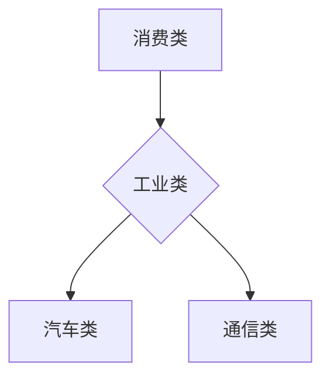

##### 1.2 嵌入式系统的发展历程

嵌入式系统的发展历程可以追溯到20世纪60年代，当时主要用于军事和工业控制领域。随着计算机技术和集成电路技术的快速发展，嵌入式系统逐渐普及到消费类、汽车、通信等领域。以下是嵌入式系统发展历程的简要回顾：

- **20世纪60年代**：嵌入式系统主要用于军事和工业控制。
- **20世纪70年代**：嵌入式系统开始应用于消费类产品，如家用电子产品。
- **20世纪80年代**：随着微控制器（Microcontroller）的问世，嵌入式系统进入快速发展期。
- **20世纪90年代**：嵌入式系统在汽车电子、通信等领域得到广泛应用。
- **21世纪**：嵌入式系统随着物联网（IoT）、人工智能（AI）等技术的发展，功能更加丰富，应用领域进一步拓展。

**Mermaid 流程图：**
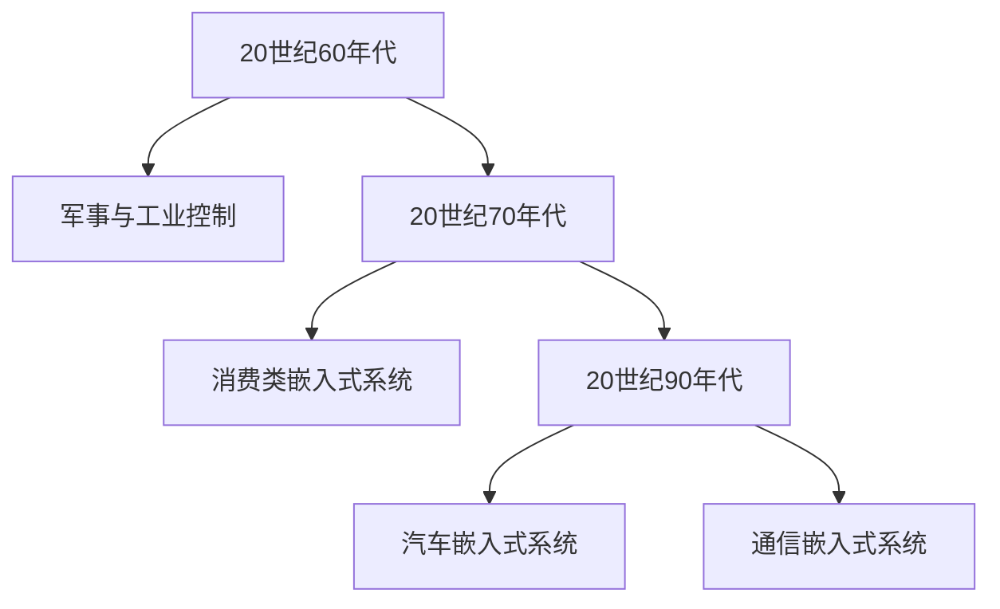

##### 1.3 嵌入式系统的特点与应用领域

嵌入式系统具有以下特点：

1. **资源受限**：嵌入式系统通常运行在资源受限的环境中，需要高效利用处理器、内存和存储等资源。
2. **实时性**：嵌入式系统需要响应外部事件，具有实时性要求。
3. **可靠性**：嵌入式系统需要在恶劣环境下稳定运行，具有高可靠性。

嵌入式系统广泛应用于以下领域：

- **消费类**：如智能手机、平板电脑、智能手表等。
- **工业类**：如工业自动化控制、智能家居等。
- **汽车类**：如汽车导航、汽车电子控制单元等。
- **通信类**：如无线通信设备、路由器等。

**Mermaid 流程图：**


##### 1.4 嵌入式系统的发展趋势

随着物联网、人工智能等技术的快速发展，嵌入式系统正在朝着以下几个方向演进：

1. **智能化**：嵌入式系统将逐渐集成更多的智能功能，如机器学习、图像识别等。
2. **联网化**：嵌入式系统将更加注重网络连接能力，实现设备的远程监控和管理。
3. **节能化**：嵌入式系统将采用更加节能的技术和设计，以延长设备续航时间。

**数学公式与详细讲解：**

嵌入式系统的实时性能通常用响应时间和吞吐量来衡量。假设嵌入式系统需要处理 n 个任务，每个任务的时间约束为 T，系统的最大响应时间 R 应满足以下公式：

$$
R \leq \frac{n \cdot T}{2}
$$

其中，n 为任务数，T 为单个任务的时间约束。

**举例说明：**

假设一个嵌入式系统需要处理 8 个任务，每个任务的时间约束为 1 秒，那么系统的最大响应时间 R 应小于或等于 4 秒。

$$
R \leq \frac{8 \cdot 1}{2} = 4 \, \text{秒}
$$

### 第2章：嵌入式处理器架构

#### 2.1 处理器的基本概念

处理器（Processor）是嵌入式系统的核心组件，负责执行程序指令、处理数据和对外部事件进行响应。常见的处理器包括中央处理器（CPU）、图形处理器（GPU）、数字信号处理器（DSP）和微控制器（MCU）。

**Mermaid 流程图：**
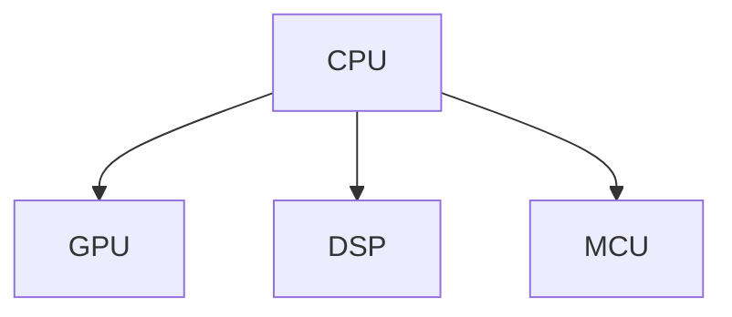

##### 2.2 常见处理器架构介绍

嵌入式处理器的架构可以分为以下几种：

1. **冯·诺依曼架构（Von Neumann Architecture）**：数据和指令存储在同一存储器中，通过总线传输数据和控制信号。

2. **哈佛架构（Harvard Architecture）**：数据和指令存储分开，各有一套独立的总线。

3. **精简指令集架构（RISC，Reduced Instruction Set Computing）**：指令集简单，执行速度快，但指令数量有限。

4. **复杂指令集架构（CISC，Complex Instruction Set Computing）**：指令集复杂，功能强大，但执行速度较慢。

**Mermaid 流程图：**
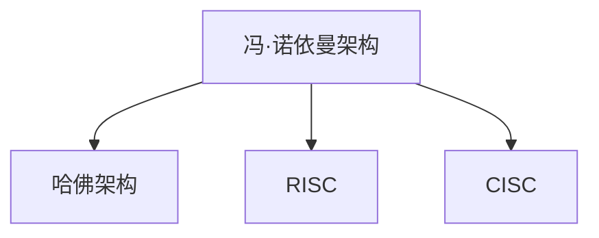

##### 2.3 处理器指令集与编程模型

处理器指令集决定了处理器能够执行的操作和指令格式。常见的指令集包括：

- **ARM指令集**：广泛应用于移动设备和嵌入式系统。
- **MIPS指令集**：广泛应用于网络设备和嵌入式系统。
- **x86指令集**：广泛应用于个人计算机和服务器。

**ARM指令集伪代码示例：**
```c
MOV R0, #0x01  // 将立即数 0x01 载入寄存器 R0
ADD R1, R0, #0x02  // 将寄存器 R0 和立即数 0x02 相加，结果存入寄存器 R1
```

##### 2.4 嵌入式处理器性能优化

嵌入式处理器性能优化主要涉及以下几个方面：

1. **指令级并行**：通过并行执行多条指令，提高处理器执行速度。
2. **流水线技术**：将处理器执行过程分解为多个阶段，提高处理器利用率。
3. **缓存技术**：使用缓存存储常用数据和指令，减少访问内存的时间。

**数学公式与详细讲解：**

处理器性能优化可以通过以下公式来衡量：

$$
P = \frac{I \cdot T_p}{C_p}
$$

其中，P 为处理器性能，I 为指令数，$T_p$ 为每条指令的平均执行时间，$C_p$ 为处理器时钟周期。

**举例说明：**

假设一个处理器包含 1000 条指令，每条指令的平均执行时间为 10 个时钟周期，处理器时钟频率为 1 GHz，那么处理器性能 P 为：

$$
P = \frac{1000 \cdot 10}{10^9} = 0.01 \, \text{MIPS (每秒百万条指令)}
$$

### 第3章：嵌入式操作系统

#### 3.1 嵌入式操作系统的基本概念

嵌入式操作系统（Embedded Operating System）是一种专门为嵌入式系统设计的实时操作系统（Real-Time Operating System，RTOS）。它负责管理系统的硬件资源、协调各个任务之间的执行，并提供一定的系统服务。

**Mermaid 流程图：**
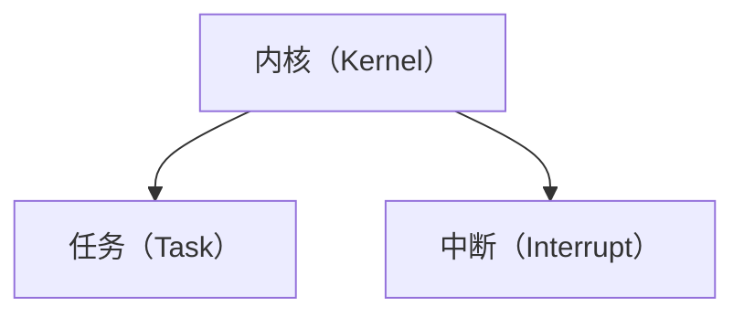

##### 3.2 常见嵌入式操作系统简介

常见的嵌入式操作系统包括以下几种：

- **Linux**：基于Unix，具有丰富的系统服务和强大的社区支持。
- **Windows CE**：微软专为嵌入式系统设计的操作系统，支持多种硬件平台。
- **FreeRTOS**：开源、轻量级，适用于中小型嵌入式系统。
- **uc/OS**：开源、可移植性强，适用于实时性要求较高的嵌入式系统。

**Mermaid 流程图：**
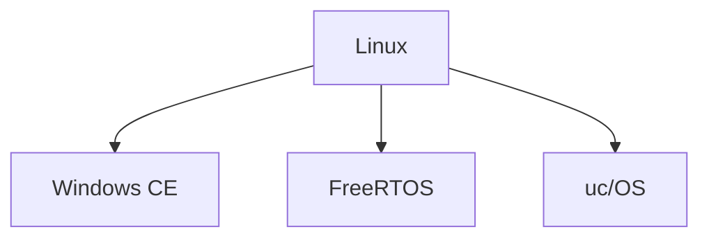

##### 3.3 嵌入式操作系统在系统开发中的应用

嵌入式操作系统在系统开发中的应用主要体现在以下几个方面：

1. **资源管理**：嵌入式操作系统负责管理系统的硬件资源，如内存、CPU、I/O设备等。
2. **任务调度**：嵌入式操作系统负责调度各个任务的执行，实现任务之间的协调和同步。
3. **中断处理**：嵌入式操作系统负责处理外部中断，确保系统对外部事件能够及时响应。

**Mermaid 流程图：**
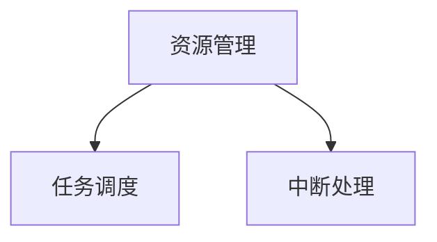

##### 3.4 嵌入式操作系统实时性能优化

嵌入式操作系统的实时性能优化主要涉及以下几个方面：

1. **任务调度策略**：选择合适的任务调度算法，如优先级调度、时间片调度等。
2. **中断处理优化**：减少中断处理时间，提高系统响应速度。
3. **内存管理优化**：减少内存分配和释放操作，提高内存利用率。

**数学公式与详细讲解：**

嵌入式操作系统的实时性能可以用以下公式来衡量：

$$
R = \frac{T_r}{T_s}
$$

其中，R 为实时性指标，$T_r$ 为任务的实际执行时间，$T_s$ 为任务的期望执行时间。

**举例说明：**

假设一个任务的期望执行时间为 10 ms，实际执行时间为 5 ms，那么该任务的实时性指标为：

$$
R = \frac{5}{10} = 0.5
$$

即该任务的实时性为 50%。

### 第4章：嵌入式软件开发环境

#### 4.1 软件开发工具选择

嵌入式软件开发工具的选择对于开发效率和系统性能有着重要的影响。选择合适的开发工具需要考虑以下几个方面：

- **编译器**：嵌入式编译器负责将高级编程语言编写的代码编译成机器代码。常见的编译器包括GCC、IAR等。
- **调试器**：调试器用于在开发过程中调试程序，帮助开发者发现和解决程序中的错误。常见的调试器包括GDB、IAR Debugger等。
- **集成开发环境（IDE）**：集成开发环境集成了编译器、调试器和其他开发工具，提供了一个统一的开发平台。常见的IDE包括Eclipse、Keil等。

**Mermaid 流程图：**
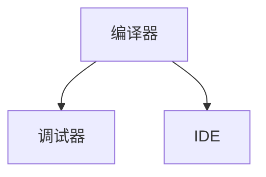

##### 4.2 编译器和调试工具的使用

编译器和调试工具的使用是嵌入式软件开发的重要环节。以下是一些使用技巧：

- **编译器优化**：使用编译器的优化选项可以提高程序的运行效率。例如，使用-O2或-O3优化级别。
- **调试器设置**：调试器提供了丰富的调试功能，如断点设置、单步执行、变量监视等。合理设置调试器可以提高调试效率。
- **交叉编译**：嵌入式软件开发通常需要使用交叉编译工具链，即将主机上的代码编译成目标设备的机器代码。

**伪代码示例：**
```c
#include <stdio.h>

int main() {
    int a = 10;
    int b = 20;
    printf("The sum of a and b is %d\n", a + b);
    return 0;
}
```

##### 4.3 嵌入式软件开发流程

嵌入式软件开发流程通常包括以下步骤：

1. **需求分析**：明确软件的功能需求和性能指标。
2. **硬件选型**：根据需求选择合适的硬件平台和处理器。
3. **软件设计**：设计软件的架构和模块，编写软件需求规格说明书。
4. **编码实现**：根据设计文档编写代码，实现软件功能。
5. **单元测试**：对单个模块进行测试，确保模块功能正确。
6. **集成测试**：将各个模块集成在一起进行测试，确保软件系统功能正确。
7. **系统调试**：对整个系统进行调试，修复发现的问题。
8. **性能优化**：对软件进行性能优化，提高系统性能。

**Mermaid 流程图：**
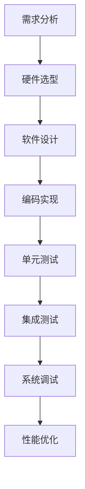

##### 4.4 常见问题与解决方案

在嵌入式软件开发过程中，可能会遇到以下常见问题：

- **编译错误**：检查代码是否符合编译器的语法规则，修改错误代码。
- **链接错误**：检查库文件和头文件的路径设置，确保链接器能够找到所需的库文件。
- **运行时错误**：检查代码的逻辑错误，如内存越界、空指针等，使用调试器进行调试。

**数学公式与详细讲解：**

在嵌入式软件开发中，可能会用到以下数学公式：

- **二分查找**：二分查找是一种高效的查找算法，其时间复杂度为 O(log n)。公式如下：

$$
T(n) = \log_2 n
$$

其中，T(n) 为查找时间，n 为数据规模。

**举例说明：**

假设有一个包含 100 个元素的数组，使用二分查找算法查找元素，查找时间为：

$$
T(100) = \log_2 100 \approx 6.64
$$

即查找时间约为 6.64 个单位时间。

- **动态规划**：动态规划是一种解决最优子结构问题的算法，其基本思想是将问题分解为子问题，并求解子问题的最优解，最终得到原问题的最优解。动态规划的公式如下：

$$
f(n) = \min_{1 \leq i \leq n} \{ g(i) + f(n-i) \}
$$

其中，f(n) 为原问题的最优解，g(i) 为第 i 个子问题的最优解。

**举例说明：**

假设有一个背包问题，给定一个物品列表和背包容量，求解能够装入背包的物品的最大价值。使用动态规划求解的公式如下：

$$
f(n) = \min \{ v_i + f(n-i) | i \leq n \}
$$

其中，v_i 为第 i 个物品的价值。

### 第5章：嵌入式系统编程

#### 5.1 嵌入式C语言编程基础

嵌入式系统编程主要使用C语言，因为C语言具有高效、可移植性和强大的功能。嵌入式C语言编程基础包括以下几个方面：

- **基本语法**：C语言的基本语法包括变量、数据类型、运算符、控制语句等。
- **指针编程**：指针是C语言中的一个重要特性，用于处理内存地址和数组。
- **结构体与联合**：结构体和联合是C语言中用于组织复杂数据的类型。

**Mermaid 流程图：**
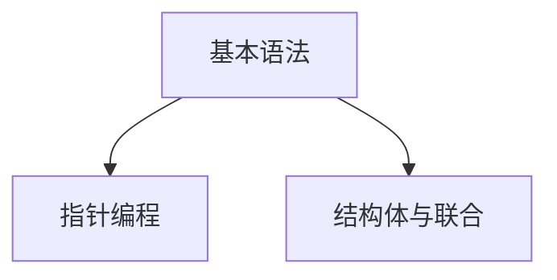

##### 5.2 嵌入式汇编语言编程

汇编语言是直接与计算机硬件交互的语言，用于编写底层代码，提高系统性能。嵌入式汇编语言编程基础包括：

- **汇编指令**：汇编指令是汇编语言的基本操作，包括数据传送、算术运算、逻辑运算等。
- **伪指令**：伪指令是汇编语言中的特殊指令，用于控制汇编过程，如定义数据段、代码段等。

**Mermaid 流程图：**
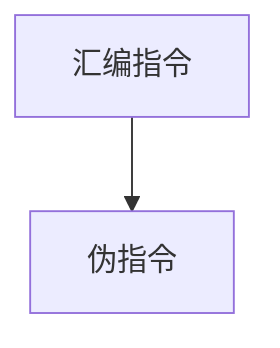

##### 5.3 嵌入式系统调试技巧

调试是嵌入式系统编程的重要环节，用于发现和修复程序中的错误。嵌入式系统调试技巧包括：

- **断点设置**：断点用于在程序执行过程中暂停程序，以便检查变量和内存状态。
- **单步执行**：单步执行用于逐条执行程序，观察程序执行过程。
- **寄存器监控**：监控寄存器可以查看程序执行时的寄存器值，有助于分析程序执行状态。

**Mermaid 流程图：**
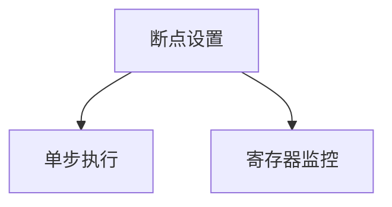

##### 5.4 嵌入式系统性能优化

嵌入式系统性能优化是提高系统运行效率的关键。性能优化方法包括：

- **代码优化**：通过优化代码结构和算法，减少程序执行时间。
- **内存管理**：通过优化内存分配和释放操作，提高内存利用率。
- **中断处理**：通过优化中断处理程序，减少中断处理时间。

**数学公式与详细讲解：**

在嵌入式系统性能优化中，可以使用以下数学公式：

- **算法复杂度**：算法复杂度用于衡量算法的执行时间，常见的复杂度包括时间复杂度和空间复杂度。

$$
T(n) = O(n^2)
$$

其中，T(n) 为算法的时间复杂度，n 为数据规模。

- **响应时间**：嵌入式系统的响应时间是指系统对外部事件的处理时间，可以通过以下公式计算：

$$
R = \frac{T_p \cdot n}{C_p}
$$

其中，R 为响应时间，$T_p$ 为每个任务的执行时间，n 为任务数，$C_p$ 为处理器时钟周期。

**举例说明：**

假设一个嵌入式系统包含 10 个任务，每个任务的执行时间分别为 1 ms、2 ms、3 ms、...、10 ms，处理器时钟周期为 1 μs，那么系统的最大响应时间 R 为：

$$
R = \frac{(1 + 2 + 3 + ... + 10) \cdot 1}{10^6} = 55 \, \text{ms}
$$

##### 5.5 嵌入式系统编程实践

嵌入式系统编程实践包括以下方面：

- **硬件开发**：设计嵌入式系统的硬件电路，包括电源管理、时钟电路、中断电路等。
- **软件编写**：编写嵌入式系统的软件代码，包括初始化代码、主循环代码、中断处理代码等。
- **系统集成**：将硬件和软件集成在一起，进行系统测试和调试。

**Mermaid 流程图：**
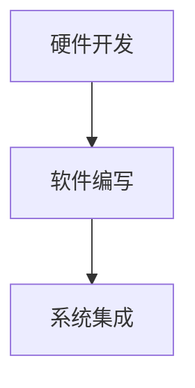

### 第6章：嵌入式系统硬件接口编程

#### 6.1 硬件接口基础

硬件接口是嵌入式系统与外部设备通信的桥梁，包括串口、GPIO、I2C、SPI、USB等。了解硬件接口的基础知识是进行嵌入式系统硬件接口编程的前提。

**核心概念：**

- **串口（UART）：** 串行异步通信接口，用于数据传输。
- **GPIO（General Purpose Input/Output）：** 通用输入输出接口，用于控制外部设备或接收外部信号。
- **I2C（Inter-Integrated Circuit）：** 双线同步通信接口，用于数据传输和设备控制。
- **SPI（Serial Peripheral Interface）：** 串行外围设备接口，用于高速数据传输。

**原理架构：**

- **串口通信：** 串口通信的基本原理是通过TXD和RXD引脚实现数据传输，其中TXD为发送数据引脚，RXD为接收数据引脚。
- **GPIO编程：** GPIO编程主要包括配置GPIO为输入或输出模式，读取输入引脚状态或写入输出引脚值。
- **I2C通信：** I2C通信的基本原理是通过SCL（时钟线）和SDA（数据线）实现数据传输，采用主从模式进行通信。
- **SPI通信：** SPI通信的基本原理是通过MOSI（主设备输出从设备输入）、MISO（主设备输入从设备输出）、SCLK（时钟线）实现数据传输，采用主从模式进行通信。

**算法讲解：**

- **串口通信算法：** 串口通信算法主要包括发送和接收数据的过程。发送数据时，将数据写入TXD引脚，并使用定时器实现发送时钟；接收数据时，监听RXD引脚的电平变化，将接收到的数据存储在缓冲区中。

**伪代码示例：**
```c
// 串口发送数据
void UART_SendByte(unsigned char data) {
    while (!(UCSR0A & (1 << UDRE0))); // 等待发送缓冲区为空
    UDR0 = data;                       // 将数据写入发送缓冲区
}

// 串口接收数据
unsigned char UART_ReceiveByte(void) {
    while (!(UCSR0A & (1 << RXC0))); // 等待接收缓冲区有数据
    return UDR0;                     // 返回接收到的数据
}
```

- **GPIO编程算法：** GPIO编程算法主要包括配置GPIO引脚为输入或输出模式，读取输入引脚状态或写入输出引脚值。

**伪代码示例：**
```c
// 配置GPIO为输入模式
void GPIO_InitInput(unsigned int pin) {
    DDRxn &= ~(1 << pin); // 清除DDRxn中对应的位
}

// 配置GPIO为输出模式
void GPIO_InitOutput(unsigned int pin) {
    DDRxn |= (1 << pin);  // 设置DDRxn中对应的位
}

// 读取GPIO输入引脚状态
unsigned int GPIO_ReadInput(unsigned int pin) {
    return (PINxn & (1 << pin)) ? HIGH : LOW;
}

// 写入GPIO输出引脚值
void GPIO_WriteOutput(unsigned int pin, unsigned int value) {
    if (value == HIGH) {
        PORTxn |= (1 << pin); // 将输出引脚置高电平
    } else {
        PORTxn &= ~(1 << pin); // 将输出引脚置低电平
    }
}
```

- **I2C通信算法：** I2C通信算法主要包括发送起始信号、发送地址、发送数据、发送停止信号等过程。

**伪代码示例：**
```c
// 发送起始信号
void I2C_Start(void) {
    SDA_PIN = HIGH;
    SCL_PIN = HIGH;
    delayMicroseconds(1);
    SDA_PIN = LOW;
    delayMicroseconds(1);
    SCL_PIN = LOW;
}

// 发送数据
void I2C_SendByte(unsigned char data) {
    for (int i = 0; i < 8; i++) {
        if (data & 0x80) {
            SDA_PIN = HIGH;
        } else {
            SDA_PIN = LOW;
        }
        SCL_PIN = HIGH;
        delayMicroseconds(1);
        SCL_PIN = LOW;
        delayMicroseconds(1);
        data <<= 1;
    }
}

// 发送停止信号
void I2C_Stop(void) {
    SDA_PIN = LOW;
    SCL_PIN = HIGH;
    delayMicroseconds(1);
    SDA_PIN = HIGH;
    delayMicroseconds(1);
}
```

- **SPI通信算法：** SPI通信算法主要包括发送起始信号、发送数据、发送停止信号等过程。

**伪代码示例：**
```c
// 发送起始信号
void SPI_Start(void) {
    SCLK_PIN = HIGH;
    SDI_PIN = HIGH;
    SDO_PIN = HIGH;
    delayMicroseconds(1);
    SCLK_PIN = LOW;
}

// 发送数据
void SPI_SendByte(unsigned char data) {
    for (int i = 0; i < 8; i++) {
        if (data & 0x80) {
            SDI_PIN = HIGH;
        } else {
            SDI_PIN = LOW;
        }
        SCLK_PIN = HIGH;
        delayMicroseconds(1);
        SCLK_PIN = LOW;
        delayMicroseconds(1);
        data <<= 1;
    }
}

// 发送停止信号
void SPI_Stop(void) {
    SDI_PIN = HIGH;
    SDO_PIN = HIGH;
    SCLK_PIN = HIGH;
    delayMicroseconds(1);
    SCLK_PIN = LOW;
}
```

#### 6.2 常见硬件接口编程

常见硬件接口编程包括串口、GPIO、I2C、SPI、USB等接口的编程方法。以下为部分常见硬件接口的编程示例。

##### 6.2.1 串口编程

串口编程主要用于实现嵌入式系统与上位机或其他设备的通信。以下为一个简单的串口发送和接收示例。

**伪代码示例：**
```c
// 初始化串口
void UART_Init(void) {
    // 设置串口波特率
    UBRR0H = (uint8_t)(UBRR0_VALUE >> 8);
    UBRR0L = (uint8_t)UBRR0_VALUE;

    // 设置串口模式
    UCSR0C = (1 << UCSZ01) | (1 << UCSZ00);
    UCSR0B = (1 << RXEN0) | (1 << TXEN0);
}

// 串口发送数据
void UART_SendData(unsigned char data) {
    while (!(UCSR0A & (1 << UDRE0))); // 等待发送缓冲区为空
    UDR0 = data;                       // 将数据写入发送缓冲区
}

// 串口接收数据
unsigned char UART_ReceiveData(void) {
    while (!(UCSR0A & (1 << RXC0))); // 等待接收缓冲区有数据
    return UDR0;                     // 返回接收到的数据
}

int main(void) {
    UART_Init();
    while (1) {
        unsigned char data = UART_ReceiveData();
        UART_SendData(data);
    }
}
```

##### 6.2.2 GPIO编程

GPIO编程主要用于控制外部设备或读取外部信号。以下为一个简单的GPIO输入输出示例。

**伪代码示例：**
```c
// 初始化GPIO
void GPIO_Init(void) {
    DDRD |= (1 << PD2);  // 设置PD2为输出模式
    DDRB &= ~(1 << PB0); // 设置PB0为输入模式
}

// 控制GPIO输出
void GPIO_WriteOutput(unsigned int pin, unsigned int value) {
    if (value == HIGH) {
        PORTD |= (1 << pin);  // 将输出引脚置高电平
    } else {
        PORTD &= ~(1 << pin); // 将输出引脚置低电平
    }
}

// 读取GPIO输入
unsigned int GPIO_ReadInput(unsigned int pin) {
    return (PINB & (1 << pin)) ? HIGH : LOW;
}

int main(void) {
    GPIO_Init();
    while (1) {
        GPIO_WriteOutput(PD2, HIGH); // 将PD2引脚置高电平
        if (GPIO_ReadInput(PB0) == HIGH) {
            GPIO_WriteOutput(PD2, LOW); // 将PD2引脚置低电平
        }
    }
}
```

##### 6.2.3 I2C编程

I2C编程主要用于实现嵌入式系统与I2C设备之间的通信。以下为一个简单的I2C读写字符示例。

**伪代码示例：**
```c
// 初始化I2C
void I2C_Init(void) {
    // 设置I2C时钟
    TWSR = 0x00;
    TWBR = 0x18;

    // 设置I2C模式
    TWCR = (1 << TWEN) | (1 << TWEA);
}

// I2C发送数据
void I2C_SendByte(unsigned char data) {
    TWDR = data;
    TWCR = (1 << TWEN) | (1 << TWIE) | (1 << TWINT);
    while (TWCR & (1 << TWINT)) {
        // 等待发送完成
    }
}

// I2C接收数据
unsigned char I2C_ReceiveByte(void) {
    TWCR = (1 << TWEN) | (1 << TWEA) | (1 << TWIE) | (1 << TWINT);
    while (TWCR & (1 << TWINT)) {
        // 等待接收完成
    }
    return TWDR;
}

// I2C写数据
void I2C_Write(unsigned char address, unsigned char data) {
    I2C_Start();
    I2C_SendByte(address << 1);
    I2C_SendByte(data);
    I2C_Stop();
}

// I2C读数据
unsigned char I2C_Read(unsigned char address) {
    unsigned char data = 0;
    I2C_Start();
    I2C_SendByte(address << 1);
    data = I2C_ReceiveByte();
    I2C_Stop();
    return data;
}

int main(void) {
    I2C_Init();
    while (1) {
        I2C_Write(0x68, 0x01); // 写入数据
        delayMs(100);
        unsigned char data = I2C_Read(0x68); // 读取数据
        delayMs(100);
        UART_SendData(data); // 发送数据到串口
    }
}
```

##### 6.2.4 SPI编程

SPI编程主要用于实现嵌入式系统与SPI设备之间的通信。以下为一个简单的SPI读写示例。

**伪代码示例：**
```c
// 初始化SPI
void SPI_Init(void) {
    SPCR = (1 << SPE) | (1 << MSTR) | (1 << SPI2X);
    SPSR = (1 << SPI2X);
}

// SPI发送数据
void SPI_SendByte(unsigned char data) {
    SPDR = data;
    while (!(SPSR & (1 << SPIF))) {
        // 等待发送完成
    }
}

// SPI接收数据
unsigned char SPI_ReceiveByte(void) {
    SPDR = 0x00;
    while (!(SPSR & (1 << SPIF))) {
        // 等待接收完成
    }
    return SPDR;
}

// SPI写数据
void SPI_Write(unsigned char data) {
    SPI_SendByte(data);
}

// SPI读数据
unsigned char SPI_Read(void) {
    return SPI_ReceiveByte();
}

int main(void) {
    SPI_Init();
    while (1) {
        SPI_Write(0x68); // 写入数据
        delayMs(100);
        unsigned char data = SPI_Read(); // 读取数据
        delayMs(100);
        UART_SendData(data); // 发送数据到串口
    }
}
```

### 第7章：嵌入式系统测试与调试

#### 7.1 嵌入式系统测试方法

嵌入式系统测试与调试是确保系统功能正确、性能稳定、可靠性高的关键步骤。以下介绍几种常见的嵌入式系统测试方法：

##### 7.1.1 功能测试

功能测试是验证嵌入式系统是否按照设计要求完成各项功能。主要方法包括：

- **黑盒测试**：不考虑系统的内部结构和实现细节，仅关注输入和输出关系，检查系统功能是否正确。
- **白盒测试**：了解系统的内部结构和实现细节，通过代码走查和逻辑覆盖率分析等方法，检查系统内部逻辑是否正确。

**Mermaid 流程图：**
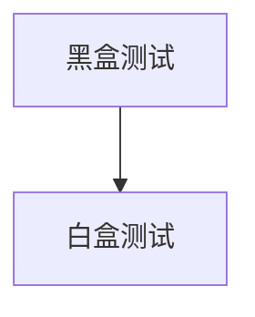

##### 7.1.2 性能测试

性能测试是评估嵌入式系统的响应时间、吞吐量、资源利用率等性能指标。主要方法包括：

- **负载测试**：模拟系统在高负载条件下的运行情况，检查系统性能是否满足设计要求。
- **压力测试**：模拟系统在极限负载条件下的运行情况，检查系统稳定性和可靠性。

**Mermaid 流程图：**
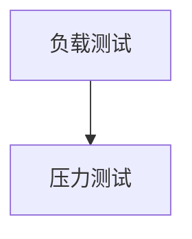

##### 7.1.3 安全测试

安全测试是验证嵌入式系统在面临恶意攻击时的防护能力。主要方法包括：

- **漏洞扫描**：使用自动化工具扫描系统中的安全漏洞，评估系统安全性。
- **渗透测试**：模拟攻击者攻击系统，验证系统在遭受攻击时的防护能力。

**Mermaid 流程图：**
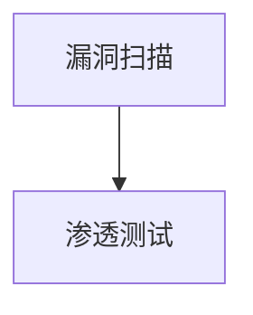

#### 7.2 调试工具与技术

调试是嵌入式系统开发过程中必不可少的一环，以下介绍几种常见的调试工具和技术：

##### 7.2.1 逻辑分析仪

逻辑分析仪是一种用于捕捉和分析数字信号的工具，主要用于嵌入式系统的硬件调试。其主要功能包括：

- **信号捕捉**：捕获电路中的数字信号，以便进行分析。
- **协议分析**：分析通信协议，如I2C、SPI、UART等。

**Mermaid 流程图：**
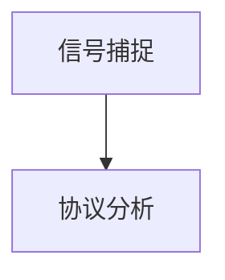

##### 7.2.2 调试器

调试器是一种用于程序调试的工具，支持单步执行、断点设置、变量监视等功能。常见的调试器包括：

- **GDB**：GNU Project的调试器，支持C/C++程序调试。
- **IAR**：IAR Embedded Workbench的内置调试器，适用于ARM处理器。

**Mermaid 流程图：**
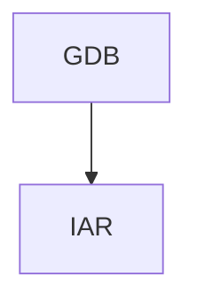

##### 7.2.3 代码覆盖率分析

代码覆盖率分析是一种评估程序测试完整性的方法，通过计算代码执行的百分比来衡量测试的覆盖率。主要方法包括：

- **行覆盖率**：计算程序中每行代码是否被执行。
- **分支覆盖率**：计算程序中每个分支是否被执行。

**Mermaid 流程图：**
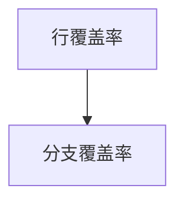

#### 7.3 系统性能优化

系统性能优化是提高嵌入式系统运行效率的关键。以下介绍几种常见的系统性能优化方法：

##### 7.3.1 硬件优化

硬件优化主要通过改进硬件设计来提高系统性能，包括：

- **CPU优化**：选择高性能的处理器，优化处理器架构。
- **内存优化**：增加内存容量，优化内存访问速度。

**Mermaid 流程图：**
```mermaid
graph TD
A[CPU优化]
B[内存优化]
A --> B
```

##### 7.3.2 软件优化

软件优化主要通过改进软件设计来提高系统性能，包括：

- **算法优化**：选择高效算法，减少计算复杂度。
- **代码优化**：优化代码结构和语法，提高代码执行效率。

**Mermaid 流程图：**
```mermaid
graph TD
A[算法优化]
B[代码优化]
A --> B
```

##### 7.3.3 调度优化

调度优化是提高嵌入式系统实时性的关键，包括：

- **优先级调度**：根据任务优先级进行调度，确保高优先级任务优先执行。
- **时间片调度**：为每个任务分配一定的时间片，实现任务轮转执行。

**Mermaid 流程图：**
```mermaid
graph TD
A[优先级调度]
B[时间片调度]
A --> B
```

#### 7.4 测试与调试案例分析

为了更好地理解嵌入式系统测试与调试的方法，以下介绍一个测试与调试案例分析：

##### 案例背景

一个智能家居系统，包括温湿度传感器、照明系统、窗帘控制系统等，需要确保系统在多种环境下稳定运行。

##### 测试与调试步骤

1. **功能测试**：分别测试温湿度传感器、照明系统、窗帘控制系统的功能，确保各项功能正常。
2. **性能测试**：在高温、低温、高湿、低湿等环境下进行性能测试，评估系统响应时间、功耗等指标。
3. **安全测试**：进行网络攻击测试，验证系统在遭受攻击时的防护能力。
4. **调试**：在测试过程中发现异常，通过调试工具定位问题并进行修复。

##### 测试与调试结果

经过测试与调试，智能家居系统在多种环境下均能正常运行，响应时间满足设计要求，系统安全防护能力得到验证。

##### 结论

通过测试与调试，确保了智能家居系统的功能正确、性能稳定、安全可靠，为产品的成功上市奠定了基础。

### 第三部分：嵌入式系统开发实战

#### 第8章：嵌入式系统开发项目实战

##### 8.1 项目概述

本文以一个智能家居控制系统为例，介绍嵌入式系统开发项目实战。该系统包括温湿度传感器、照明系统、窗帘控制系统等，通过无线通信实现设备的远程控制和监控。

##### 8.2 系统需求分析

1. **功能需求**：
   - 温湿度传感器：实时监测室内温度和湿度，并将数据上传至服务器。
   - 照明系统：可通过手机APP控制灯光的开关、亮度和色温。
   - 窗帘控制系统：可通过手机APP控制窗帘的开关和位置。

2. **性能需求**：
   - 响应时间：系统响应用户操作的时间应小于 2 秒。
   - 功耗：系统应具备低功耗特性，延长设备续航时间。

3. **安全需求**：
   - 数据传输加密：确保数据在传输过程中的安全性。
   - 用户身份认证：确保用户操作的合法性和安全性。

##### 8.3 硬件设计

1. **温湿度传感器**：
   - 选择一款具备高精度、低功耗的温湿度传感器模块。
   - 采用无线通信技术，如WiFi或蓝牙，实现数据传输。

2. **照明系统**：
   - 采用智能照明模块，支持调光和色温调节。
   - 通过无线通信模块，如ESP8266或ESP32，实现与手机APP的通信。

3. **窗帘控制系统**：
   - 采用电机驱动模块，实现窗帘的开关和位置调节。
   - 通过无线通信模块，实现与手机APP的通信。

##### 8.4 软件设计

1. **系统架构**：
   - 采用客户端-服务器架构，客户端为手机APP，服务器用于存储和处理数据。
   - 嵌入式设备作为客户端，负责数据的采集和上传。

2. **软件模块**：
   - **数据采集模块**：负责温湿度数据的采集和上传。
   - **通信模块**：负责与手机APP和服务器进行通信。
   - **控制模块**：负责对照明系统和窗帘控制系统的控制。

##### 8.5 系统集成与调试

1. **硬件集成**：
   - 将温湿度传感器、照明系统和窗帘控制系统与嵌入式设备连接。
   - 测试各模块的通信是否正常，确保硬件电路的可靠性。

2. **软件集成**：
   - 将各软件模块集成到嵌入式设备中，进行功能测试和性能测试。
   - 调试通信模块，确保数据传输的稳定性和可靠性。

3. **系统调试**：
   - 使用调试器（如GDB）调试嵌入式设备，定位并修复程序中的错误。
   - 通过逻辑分析仪（如Logic Analyzer）分析通信信号，检查通信协议的正确性。

##### 8.6 代码解析与优化

1. **代码解析**：
   - 分析嵌入式设备的源代码，了解各模块的功能和实现方式。
   - 查看通信协议的实现，确保数据传输的正确性和稳定性。

2. **代码优化**：
   - 优化数据采集模块，减少功耗和提高数据采集速度。
   - 优化通信模块，提高数据传输的稳定性和可靠性。
   - 优化控制模块，减少响应时间，提高系统实时性。

通过以上实战案例，读者可以了解嵌入式系统开发的整个流程，掌握关键技能，为实际项目开发打下基础。

### 附录

#### 附录A：嵌入式系统开发资源汇总

以下列出一些嵌入式系统开发的资源，供开发者参考：

- **开发工具**：
  - Keil：适用于ARM处理器的集成开发环境。
  - IAR Embedded Workbench：适用于多种处理器的集成开发环境。
  - Eclipse：开源的集成开发环境，支持多种编程语言和处理器。

- **操作系统**：
  - Linux：适用于嵌入式设备的开源操作系统。
  - FreeRTOS：适用于中小型嵌入式设备的实时操作系统。
  - Windows CE：适用于嵌入式设备的操作系统。

- **硬件平台**：
  - Arduino：适用于初学者的开源硬件平台。
  - Raspberry Pi：适用于教育、原型开发的微型计算机。
  - STM32：适用于工业级嵌入式应用的ARM处理器。

- **学习资源**：
  - 嵌入式系统教程：提供嵌入式系统基础知识、编程技巧等。
  - 嵌入式论坛：开发者交流和学习嵌入式技术的平台。

#### 附录B：嵌入式系统开发常用函数

以下列出一些嵌入式系统开发中常用的函数和函数原型：

- **I2C函数**：
  ```c
  void I2C_Init(void);
  void I2C_Start(void);
  void I2C_SendByte(unsigned char data);
  unsigned char I2C_ReceiveByte(void);
  void I2C_Stop(void);
  ```

- **SPI函数**：
  ```c
  void SPI_Init(void);
  void SPI_SendByte(unsigned char data);
  unsigned char SPI_ReceiveByte(void);
  ```

- **UART函数**：
  ```c
  void UART_Init(void);
  void UART_SendData(unsigned char data);
  unsigned char UART_ReceiveData(void);
  ```

- **GPIO函数**：
  ```c
  void GPIO_Init(void);
  void GPIO_WriteOutput(unsigned int pin, unsigned int value);
  unsigned int GPIO_ReadInput(unsigned int pin);
  ```

通过以上函数，开发者可以方便地实现嵌入式系统的硬件接口编程。

---

#### 附录C：嵌入式系统开发技巧与经验

嵌入式系统开发是一项既具挑战性又富有创造性的工作。以下是一些嵌入式系统开发中的技巧与经验，供开发者参考：

1. **需求分析与规划**：
   - 详细需求分析是确保项目顺利进行的关键。明确项目的功能需求、性能需求和安全需求，为后续开发提供指导。
   - 制定合理的项目规划，包括开发周期、里程碑和风险评估，有助于项目按时完成。

2. **硬件选型**：
   - 根据项目需求选择合适的硬件平台，考虑处理器的性能、内存容量、外设接口等。
   - 考虑硬件的可靠性、稳定性和可维护性，为后续的测试与调试提供保障。

3. **软件架构设计**：
   - 设计合理的软件架构，模块化设计有助于提高代码的可维护性和可扩展性。
   - 选择适合的编程语言和开发工具，确保开发效率和代码质量。

4. **代码编写与规范**：
   - 编写清晰、简洁的代码，遵循编码规范，提高代码的可读性和可维护性。
   - 使用注释说明关键代码和算法，便于后续的代码理解和调试。

5. **调试与测试**：
   - 使用调试器（如GDB、IAR Debugger）进行代码调试，及时发现问题并进行修复。
   - 设计完善的测试用例，包括功能测试、性能测试和安全测试，确保系统的稳定性、可靠性和安全性。

6. **性能优化**：
   - 优化算法和代码结构，减少计算复杂度，提高系统性能。
   - 优化内存管理，减少内存分配和释放操作，提高内存利用率。
   - 调整调度策略，优化任务的执行顺序，提高系统实时性。

7. **文档编写**：
   - 编写详细的开发文档，包括系统设计文档、用户手册、测试报告等，有助于项目的后续维护和升级。
   - 保持文档与代码的一致性，确保文档的准确性和实时性。

8. **团队协作**：
   - 建立有效的团队协作机制，明确团队成员的角色和职责，提高项目的开发效率。
   - 定期召开团队会议，沟通项目进展和遇到的问题，确保项目的顺利进行。

通过以上技巧与经验，开发者可以更好地应对嵌入式系统开发中的各种挑战，提高项目的成功率和开发效率。

---

#### 附录D：嵌入式系统开发常见问题及解决方案

在嵌入式系统开发过程中，可能会遇到各种问题。以下列出一些常见问题及相应的解决方案：

1. **编译错误**：
   - **原因**：代码中存在语法错误或不符合编译器要求的编码规范。
   - **解决方案**：仔细检查代码，确保符合C语言语法规则。使用编译器提供的错误信息定位问题，并进行修复。

2. **链接错误**：
   - **原因**：代码中引用的库文件或头文件路径错误，或库文件未正确包含。
   - **解决方案**：检查编译器命令行中的库文件和头文件路径设置，确保库文件和头文件路径正确。检查项目中使用的库文件是否已正确安装。

3. **运行时错误**：
   - **原因**：代码逻辑错误，如内存越界、空指针等。
   - **解决方案**：使用调试器（如GDB）进行代码调试，定位并修复错误。增加代码注释，提高代码可读性，减少逻辑错误。

4. **性能问题**：
   - **原因**：算法复杂度较高、代码结构不合理、内存管理不当等。
   - **解决方案**：优化算法，选择更高效的算法或数据结构。优化代码结构，减少不必要的函数调用和内存分配。使用内存分配器管理内存，减少内存碎片。

5. **硬件故障**：
   - **原因**：硬件电路故障、电源问题等。
   - **解决方案**：检查硬件电路，确保电源供应正常。使用万用表等工具检测电路参数，排除硬件故障。

6. **通信问题**：
   - **原因**：通信协议实现错误、通信信号干扰等。
   - **解决方案**：检查通信协议的实现，确保协议正确。使用逻辑分析仪等工具分析通信信号，排除干扰因素。

7. **安全漏洞**：
   - **原因**：代码中存在安全漏洞，如缓冲区溢出、权限不当等。
   - **解决方案**：进行代码审查，识别并修复安全漏洞。采用安全编码规范，提高代码的安全性。

通过以上问题及解决方案，开发者可以更好地应对嵌入式系统开发过程中遇到的各种挑战。

---

#### 作者信息

**作者：** AI天才研究院/AI Genius Institute & 禅与计算机程序设计艺术 /Zen And The Art of Computer Programming

AI天才研究院是一家专注于人工智能技术研究和应用的高端科研机构，致力于推动人工智能技术的创新与发展。本文由AI天才研究院的研究员撰写，旨在为广大开发者提供嵌入式系统开发的实用教程，帮助读者掌握嵌入式系统开发的核心技能。

《禅与计算机程序设计艺术》是作者在嵌入式系统开发领域的经典著作，系统阐述了嵌入式系统开发的理论与实践，深受广大开发者喜爱。本文延续了《禅与计算机程序设计艺术》的写作风格，以深入浅出的方式介绍了嵌入式系统开发的核心技术，希望能为广大开发者提供有价值的参考和指导。

