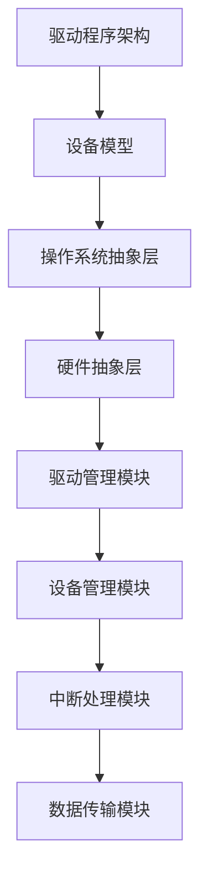
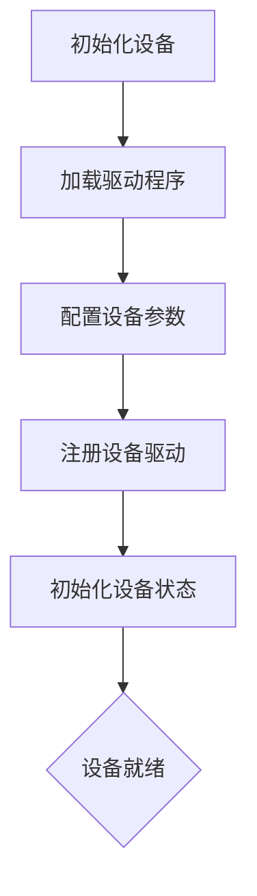
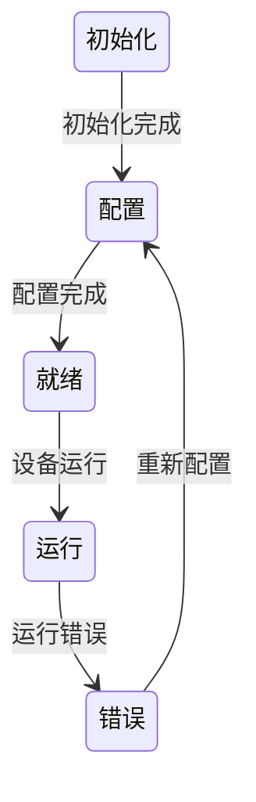

                 

# 文章标题：嵌入式设备驱动开发

> 关键词：嵌入式系统，驱动开发，硬件接口，操作系统，设备驱动程序，驱动程序架构，项目实战

> 摘要：本文将深入探讨嵌入式设备驱动开发的相关知识，包括嵌入式系统的定义、发展历程、基本组成、工作原理，以及驱动开发的概述、硬件接口、操作系统与驱动程序、设备驱动程序架构、设备驱动程序编程和调试测试等。此外，文章还通过项目实战，详细讲解了USB设备驱动开发、UART设备驱动开发、I2C设备驱动开发、SPI设备驱动开发的流程和实现，旨在为读者提供一套完整的嵌入式设备驱动开发指南。

---

## 目录大纲

### 第一部分：嵌入式设备驱动开发基础

#### 第1章：嵌入式系统概述

1.1 嵌入式系统的定义与发展历程

1.2 嵌入式系统的基本组成

1.3 嵌入式系统的工作原理

#### 第2章：嵌入式设备的驱动概述

2.1 驱动的概念与作用

2.2 驱动的分类与特点

2.3 驱动开发的基本流程

#### 第3章：嵌入式设备的硬件接口

3.1 硬件接口的基本概念

3.2 常见的硬件接口类型

3.3 硬件接口的数据传输

#### 第4章：操作系统与驱动程序

4.1 操作系统的基本概念

4.2 驱动程序在操作系统中的地位

4.3 驱动程序的工作原理

#### 第5章：设备驱动程序的架构

5.1 设备驱动程序的基本架构

5.2 驱动程序的初始化与配置

5.3 驱动程序的核心功能模块

#### 第6章：设备驱动程序的编程

6.1 驱动程序编程的基本原则

6.2 驱动程序的内核模块开发

6.3 用户空间的驱动程序开发

#### 第7章：设备驱动程序的调试与测试

7.1 驱动程序的调试方法

7.2 驱动程序的测试策略

7.3 驱动程序的性能优化

### 第二部分：嵌入式设备驱动开发实践

#### 第8章：项目实战一 - USB设备驱动开发

8.1 USB设备驱动的基本概念

8.2 USB设备驱动开发流程

8.3 USB设备驱动的具体实现

#### 第9章：项目实战二 - UART设备驱动开发

9.1 UART设备驱动的基本概念

9.2 UART设备驱动开发流程

9.3 UART设备驱动的具体实现

#### 第10章：项目实战三 - I2C设备驱动开发

10.1 I2C设备驱动的基本概念

10.2 I2C设备驱动开发流程

10.3 I2C设备驱动的具体实现

#### 第11章：项目实战四 - SPI设备驱动开发

11.1 SPI设备驱动的基本概念

11.2 SPI设备驱动开发流程

11.3 SPI设备驱动的具体实现

#### 第12章：嵌入式设备驱动开发经验分享与展望

12.1 嵌入式设备驱动开发中的常见问题及解决方案

12.2 嵌入式设备驱动开发的新趋势与未来展望

### 附录

#### 附录 A：嵌入式设备驱动开发相关资源

A.1 常用嵌入式操作系统简介

A.2 嵌入式设备驱动开发工具与环境搭建

A.3 嵌入式设备驱动开发相关文档和书籍推荐

## 嵌入式设备驱动程序架构图

以下是一个简单的嵌入式设备驱动程序架构图，用于说明各个模块之间的关系：



## 驱动程序初始化流程

以下是驱动程序初始化流程的Mermaid图：



## 伪代码 - UART驱动程序初始化

以下是UART驱动程序初始化的伪代码：

```c
function uart_init(uart_port) {
  // 配置UART端口参数
  configure_uart_params(uart_port);

  // 启动UART中断
  enable_uart_interrupt(uart_port);

  // 注册UART设备驱动
  register_device_driver(uart_port);

  // 初始化设备状态
  set_device_state(uart_port, DEVICE_STATE_INITIALIZED);

  // 启动UART设备
  start_uart_device(uart_port);
}
```

## UART传输公式

以下是UART传输速率的公式：

$$
C = 2 \times R \times L \times N \times (1 + D)
$$

其中，\(C\) 是传输速率，\(R\) 是波特率，\(L\) 是数据位长度，\(N\) 是停止位长度，\(D\) 是校验位长度。

## 数学模型 - 状态机

以下是设备状态机的数学模型：

$$
\begin{align*}
S0 &= \text{设备初始化状态} \\
S1 &= \text{设备配置状态} \\
S2 &= \text{设备就绪状态} \\
S3 &= \text{设备运行状态} \\
S4 &= \text{设备错误状态} \\
\end{align*}
$$

## 状态转移图

以下是设备状态转移图的Mermaid表示：



### 第一部分：嵌入式设备驱动开发基础

#### 第1章：嵌入式系统概述

##### 1.1 嵌入式系统的定义与发展历程

嵌入式系统（Embedded System）是一种将计算机系统嵌入到其他设备、机器、系统或产品中的技术。它通常由硬件和软件组成，以实现对特定任务的自动化控制和数据处理。嵌入式系统的发展可以追溯到20世纪60年代，当时计算机技术刚刚起步，计算机系统主要用于科学计算和数据处理。

随着微电子技术的不断发展，特别是微处理器的出现，嵌入式系统得到了迅速发展。20世纪70年代，微型计算机的普及使得嵌入式系统在工业控制、通信设备、家用电器等领域得到了广泛应用。进入20世纪80年代，嵌入式系统逐渐向消费电子和汽车电子领域扩展。随着物联网（IoT）技术的兴起，嵌入式系统已经渗透到我们生活的方方面面。

##### 1.2 嵌入式系统的基本组成

嵌入式系统通常由以下几部分组成：

1. **中央处理单元（CPU）**：作为嵌入式系统的核心，负责执行指令和处理数据。

2. **存储器**：包括只读存储器（ROM）和随机存取存储器（RAM），用于存储程序代码和运行过程中的数据。

3. **输入/输出接口**：用于与其他设备或系统进行数据交换，包括串行接口、并行接口、USB接口、网络接口等。

4. **外设**：包括定时器、计数器、中断控制器、模数转换器（ADC）等，用于扩展系统的功能。

5. **电源管理**：用于管理电源的供应和优化，延长系统的续航时间。

##### 1.3 嵌入式系统的工作原理

嵌入式系统的工作原理可以概括为以下几个步骤：

1. **启动过程**：嵌入式系统在接通电源后，会从ROM中加载引导程序，进行系统初始化，包括CPU寄存器的设置、内存的初始化、外设的配置等。

2. **任务调度**：嵌入式系统通常采用实时操作系统（RTOS）进行任务调度，根据任务的优先级和截止时间，调度CPU执行任务。

3. **任务执行**：系统根据任务的调度结果，依次执行各个任务，完成相应的功能。

4. **中断处理**：嵌入式系统会对外部事件进行中断处理，如按键输入、传感器数据更新等，以实时响应外部事件。

5. **数据传输**：嵌入式系统通过输入/输出接口与外部设备或系统进行数据交换，完成数据的采集、处理和传输。

通过上述工作原理，嵌入式系统可以实现对特定任务的自动化控制和数据处理，广泛应用于工业控制、智能家居、汽车电子、医疗设备等领域。

### 第2章：嵌入式设备的驱动概述

##### 2.1 驱动的概念与作用

驱动（Driver）是一种软件程序，用于控制和管理计算机硬件设备。它是操作系统与硬件设备之间的桥梁，通过提供一组标准化的接口，使操作系统能够与硬件设备进行通信和交互。

驱动的作用主要有以下几点：

1. **硬件设备的管理**：驱动程序负责初始化、配置和管理硬件设备，确保硬件设备能够正常工作。

2. **硬件设备的访问**：驱动程序提供了操作硬件设备的接口，使应用程序能够通过标准化的API访问硬件设备。

3. **硬件设备的兼容性**：不同厂商的硬件设备可能有不同的接口和协议，驱动程序通过抽象硬件设备的细节，实现了硬件设备的兼容性。

##### 2.2 驱动的分类与特点

根据驱动程序的用途和实现方式，可以将驱动程序分为以下几类：

1. **内核模式驱动**：内核模式驱动运行在操作系统内核空间，具有更高的权限，可以直接访问硬件设备。内核模式驱动通常用于控制复杂或高性能的硬件设备，如显卡、网卡等。

2. **用户模式驱动**：用户模式驱动运行在操作系统用户空间，无法直接访问硬件设备，需要通过系统调用与内核模式驱动交互。用户模式驱动通常用于提供图形界面或简化硬件设备的操作。

3. **总线驱动**：总线驱动是用于控制总线（如PCI、PCIe、USB等）的驱动程序，负责管理总线设备的管理、配置和通信。总线驱动通常位于操作系统内核空间，具有较高的优先级和可靠性。

4. **设备特定驱动**：设备特定驱动是为特定硬件设备开发的驱动程序，针对设备的特性进行优化和定制。设备特定驱动通常具有高性能和低延迟，适用于对硬件设备性能要求较高的场景。

##### 2.3 驱动开发的基本流程

驱动开发的基本流程如下：

1. **需求分析**：明确驱动程序的功能需求，包括硬件设备的特性、接口协议、操作方式等。

2. **硬件研究**：研究硬件设备的规格书和开发文档，了解硬件设备的内部结构、工作原理和接口协议。

3. **驱动框架设计**：根据需求分析，设计驱动程序的框架，包括模块划分、接口定义、数据结构设计等。

4. **编程实现**：根据驱动框架，使用编程语言（如C、C++等）实现驱动程序的各个模块，包括硬件接口的实现、设备管理的实现等。

5. **调试与测试**：对驱动程序进行调试和测试，确保驱动程序能够正确运行、稳定工作。

6. **集成与部署**：将驱动程序集成到操作系统内核，并在目标硬件设备上进行部署和测试。

7. **文档编写**：编写驱动程序的文档，包括开发文档、用户手册、API文档等，为后续维护和升级提供支持。

通过上述流程，可以开发出满足需求的嵌入式设备驱动程序，实现对硬件设备的控制和访问。

### 第3章：嵌入式设备的硬件接口

##### 3.1 硬件接口的基本概念

硬件接口是嵌入式设备与外部设备或系统进行数据交换和通信的桥梁。它通常包括接口电路、接口协议和接口标准等组成部分。

硬件接口的基本概念包括以下几个方面：

1. **接口电路**：接口电路是硬件接口的核心部分，负责实现信号的传输、转换和匹配。常见的接口电路有电平转换电路、时钟信号电路、数据传输电路等。

2. **接口协议**：接口协议是硬件接口的数据传输规则，规定了数据传输的格式、速率、时序等。常见的接口协议有串行通信协议（如RS-232、UART）、并行通信协议（如I2C、SPI）和网络通信协议（如USB、以太网）等。

3. **接口标准**：接口标准是硬件接口的设计规范和标准，保证了不同厂商和设备的硬件接口具有互操作性。常见的接口标准有PCI、PCIe、USB、I2C、SPI等。

##### 3.2 常见的硬件接口类型

嵌入式设备常用的硬件接口类型包括串行接口、并行接口、USB接口和网络接口等。下面分别介绍这些接口的特点和应用场景。

1. **串行接口**：串行接口是一种通过串行传输数据的方式，将数据一位一位地发送和接收。串行接口的优点是传输速率较低，但接口简单、成本低。常见的串行接口有RS-232、UART、I2C和SPI等。

   - **RS-232**：RS-232是最早的串行通信接口标准，用于计算机和外部设备之间的通信。它具有较好的兼容性和灵活性，但在传输距离和速率上存在一定的限制。

   - **UART**：UART是通用异步收发器，用于实现异步串行通信。它支持多种波特率、数据位、停止位和校验位设置，广泛应用于嵌入式设备之间的数据通信。

   - **I2C**：I2C是一种双向二线制串行通信接口，具有简单的接口电路和较低的功耗。它支持多个设备连接，通过地址总线选择不同的设备进行通信。

   - **SPI**：SPI是一种同步串行通信接口，具有较高的传输速率和灵活性。它支持主从模式通信，通过片选信号选择不同的设备进行数据传输。

2. **并行接口**：并行接口是一种通过并行传输数据的方式，将数据同时发送和接收。并行接口的优点是传输速率较高，但接口复杂、成本高。常见的并行接口有并行打印机接口、IDE接口、SCSI接口等。

   - **并行打印机接口**：并行打印机接口是一种用于连接计算机和打印机的接口，通过并行传输数据实现打印操作。它具有简单的接口电路和较高的传输速率。

   - **IDE接口**：IDE接口是一种用于连接硬盘驱动器的接口，支持并行传输数据。它具有简单的接口电路和较高的传输速率，但数据传输距离有限。

   - **SCSI接口**：SCSI接口是一种用于连接硬盘驱动器、光盘驱动器等外部设备的接口，具有复杂的接口电路和较高的传输速率。它支持多任务并发处理和热插拔功能。

3. **USB接口**：USB接口是一种通用串行总线接口，具有即插即用、热插拔、高速传输等特点。它支持多种设备类型，如键盘、鼠标、打印机、硬盘等，广泛应用于计算机和外设之间的通信。

4. **网络接口**：网络接口是一种用于连接计算机网络（如局域网、互联网）的接口，包括以太网接口、WiFi接口等。它支持数据的高速传输和远程通信，广泛应用于嵌入式设备的网络通信。

##### 3.3 硬件接口的数据传输

硬件接口的数据传输过程主要包括以下几个步骤：

1. **初始化接口**：在数据传输前，需要初始化接口，包括配置接口的波特率、数据位、停止位和校验位等参数。

2. **发送数据**：发送方通过接口发送数据，将数据一位一位地发送到接收方。

3. **接收数据**：接收方通过接口接收数据，将接收到的数据一位一位地存储起来。

4. **数据处理**：接收方对接收到的数据进行处理，如校验和错误检测、数据格式转换等。

5. **反馈控制**：发送方根据接收方的反馈信息，调整发送数据的过程，如调整波特率、重传错误数据等。

硬件接口的数据传输过程需要遵循接口协议和数据传输规则，确保数据传输的正确性和可靠性。常见的接口协议包括异步通信协议（如RS-232、UART）、同步通信协议（如I2C、SPI）和网络通信协议（如USB、以太网）等。

通过硬件接口，嵌入式设备可以实现与外部设备或系统的数据交换和通信，完成各种功能和应用。掌握不同类型硬件接口的原理和特性，对于嵌入式设备的设计和开发具有重要意义。

### 第4章：操作系统与驱动程序

##### 4.1 操作系统的基本概念

操作系统（Operating System，简称OS）是一种系统软件，负责管理和控制计算机硬件资源，提供基本的服务和接口，使得用户能够方便地使用计算机。操作系统的主要功能包括：

1. **进程管理**：操作系统负责创建、调度、同步和终止进程，实现多任务处理。

2. **内存管理**：操作系统负责分配、回收和管理内存资源，提高内存的利用效率。

3. **文件管理**：操作系统负责文件的组织、存储、检索和保护，提供统一的文件接口。

4. **设备管理**：操作系统负责设备的管理和控制，包括设备的分配、数据传输和错误处理。

5. **用户接口**：操作系统提供用户与计算机交互的接口，包括命令行接口、图形用户界面等。

操作系统的分类可以根据不同的标准进行划分，常见的分类方式包括：

1. **按用途分类**：操作系统可以分为系统软件和应用程序。系统软件包括操作系统本身、编程工具和系统库等；应用程序包括各种业务应用软件，如办公软件、游戏等。

2. **按并发级别分类**：操作系统可以分为单用户操作系统和多用户操作系统。单用户操作系统只能支持一个用户同时使用，如Windows、macOS等；多用户操作系统可以支持多个用户同时使用，如Linux、Unix等。

3. **按硬件平台分类**：操作系统可以分为PC操作系统、嵌入式操作系统、实时操作系统等。PC操作系统主要运行在通用计算机硬件平台上，如Windows、Linux等；嵌入式操作系统运行在嵌入式设备上，如Android、FreeRTOS等；实时操作系统具有严格的实时性能要求，用于控制关键任务，如VxWorks、QNX等。

##### 4.2 驱动程序在操作系统中的地位

驱动程序（Driver）是操作系统的重要组成部分，负责硬件设备的管理和通信。驱动程序在操作系统中的地位如下：

1. **硬件设备管理**：驱动程序负责硬件设备的初始化、配置、控制和故障处理，使得操作系统能够识别和管理硬件设备。

2. **操作系统接口**：驱动程序提供了操作系统与硬件设备之间的接口，使得操作系统可以统一地访问和管理各种硬件设备。

3. **系统稳定性**：驱动程序的质量直接影响操作系统的稳定性。一个优秀的驱动程序能够确保硬件设备稳定、可靠地工作，提高系统的稳定性和可靠性。

4. **系统性能**：驱动程序的优化和性能调优对操作系统的性能有重要影响。通过优化驱动程序，可以提高系统的响应速度、降低系统资源的占用，从而提高系统的性能。

##### 4.3 驱动程序的工作原理

驱动程序的工作原理可以分为以下几个步骤：

1. **设备初始化**：驱动程序在操作系统启动时被加载到内存，并进行初始化。初始化包括配置设备参数、加载设备驱动模块、注册设备驱动等。

2. **设备管理**：驱动程序负责管理硬件设备，包括设备的分配、释放、控制、数据传输等。设备管理通过操作系统提供的设备管理接口实现，如设备管理器、设备驱动API等。

3. **设备通信**：驱动程序通过操作系统提供的通信接口与硬件设备进行数据交换和通信，如IO请求、中断处理等。设备通信通过硬件接口协议（如USB、I2C、SPI等）实现。

4. **错误处理**：驱动程序负责处理硬件设备的错误，如设备故障、数据传输错误等。错误处理包括错误检测、错误报告、故障恢复等。

5. **性能优化**：驱动程序通过对硬件设备的数据传输、中断处理、功耗管理等进行优化，提高系统的性能和效率。

通过上述工作原理，驱动程序确保了操作系统与硬件设备的稳定、高效、可靠通信，为操作系统提供了良好的硬件支持。

### 第5章：设备驱动程序的架构

##### 5.1 设备驱动程序的基本架构

设备驱动程序是操作系统的重要组成部分，负责硬件设备的管理和通信。设备驱动程序的基本架构可以分为以下几个部分：

1. **硬件抽象层（HAL）**：硬件抽象层是设备驱动程序的核心部分，负责屏蔽硬件设备的细节，提供统一的接口，使得操作系统可以方便地管理和控制各种硬件设备。硬件抽象层通常包括硬件接口、硬件配置、硬件控制等功能。

2. **设备管理器**：设备管理器是操作系统中的设备管理模块，负责设备的分配、释放、配置和错误处理等。设备管理器通过设备驱动程序提供的接口与硬件设备进行通信，实现设备的统一管理和控制。

3. **设备驱动模块**：设备驱动模块是设备驱动程序的具体实现，根据不同的硬件设备特点进行定制。设备驱动模块通常包括设备初始化、设备配置、设备控制、数据传输等功能。设备驱动模块通过硬件抽象层与硬件设备进行通信。

4. **用户空间驱动程序**：用户空间驱动程序是运行在操作系统用户空间的驱动程序，主要负责与用户应用程序进行交互。用户空间驱动程序通过系统调用或消息队列与内核空间驱动程序进行通信，实现设备的操作和控制。

##### 5.2 驱动程序的初始化与配置

驱动程序的初始化和配置是设备驱动程序的关键步骤，确保设备驱动程序能够正确地加载和运行。驱动程序的初始化和配置可以分为以下几个步骤：

1. **驱动程序加载**：操作系统在启动过程中，根据设备驱动程序配置文件（如设备树、驱动模块列表等），加载设备驱动程序到内存。驱动程序加载通常包括设备驱动模块的加载、初始化和配置等。

2. **设备检测和初始化**：驱动程序在加载后，会检测系统中的硬件设备，并根据设备驱动程序配置文件进行初始化。设备初始化包括设备参数的配置、硬件资源的分配、中断处理程序的注册等。

3. **设备配置**：驱动程序根据设备驱动程序配置文件，对设备进行配置。设备配置包括设备的控制寄存器设置、中断使能、时钟配置等。设备配置确保设备能够正常工作，并提供所需的特性和服务。

4. **设备注册**：驱动程序将初始化和配置完成的设备注册到操作系统设备管理器中。设备注册使得操作系统可以识别和管理设备，并为用户应用程序提供访问设备的接口。

5. **设备自检**：驱动程序在设备注册后，进行设备自检，检查设备的工作状态和性能。设备自检包括设备功能测试、数据传输测试、故障检测等，以确保设备能够稳定、可靠地工作。

##### 5.3 驱动程序的核心功能模块

设备驱动程序的核心功能模块是实现设备管理和数据传输的关键部分。以下是驱动程序的核心功能模块及其简要说明：

1. **设备管理模块**：设备管理模块负责设备的分配、释放、状态查询和错误处理等。设备管理模块通过操作系统提供的设备管理接口（如设备管理器、sysfs等）与用户应用程序进行交互。

2. **数据传输模块**：数据传输模块负责数据的接收和发送，实现设备与用户应用程序之间的数据交换。数据传输模块通常包括数据缓冲区管理、数据发送和接收线程、数据传输调度等。

3. **中断处理模块**：中断处理模块负责处理硬件设备的中断请求，实现设备的事件通知和数据传输。中断处理模块包括中断服务程序、中断处理流程、中断优先级管理等功能。

4. **设备控制模块**：设备控制模块负责设备的控制操作，包括设备的启动、停止、配置调整等。设备控制模块通过操作系统的设备控制接口（如ioctl系统调用等）实现。

5. **错误处理模块**：错误处理模块负责设备故障的检测、报告和恢复。错误处理模块包括错误检测、错误报告、故障恢复等机制，确保设备在出现故障时能够及时处理并恢复正常工作。

通过上述核心功能模块，设备驱动程序能够实现对硬件设备的全面管理和控制，确保设备的稳定、高效运行。

### 第6章：设备驱动程序的编程

##### 6.1 驱动程序编程的基本原则

设备驱动程序的编程是嵌入式设备开发中的一项关键技术。为了确保驱动程序的正确性、可靠性和可维护性，以下是一些基本的编程原则：

1. **模块化设计**：将驱动程序分为多个模块，每个模块实现特定的功能，便于代码的编写、调试和维护。

2. **抽象与封装**：通过抽象和封装，将具体的硬件细节隐藏在模块内部，使得驱动程序与硬件设备之间具有较好的独立性，便于驱动程序的移植和升级。

3. **代码复用**：尽量复用已有的代码和模块，避免重复编写，提高代码的复用性和可维护性。

4. **安全性考虑**：在编写驱动程序时，要充分考虑安全性问题，如防止缓冲区溢出、避免恶意代码执行等，确保系统的安全稳定运行。

5. **代码注释与文档**：为代码添加详细的注释，并编写相应的文档，便于后续的维护和升级。

##### 6.2 驱动程序的内核模块开发

内核模块（Kernel Module）是设备驱动程序的核心部分，通常运行在操作系统的内核空间，负责与硬件设备进行交互。以下介绍内核模块开发的基本步骤：

1. **内核模块结构**：内核模块通常由以下几部分组成：

   - **模块头部**：包含模块的名称、版本号、作者等信息。

   - **模块初始化函数**：模块加载到内存时调用的函数，负责模块的初始化操作。

   - **模块退出函数**：模块从内存卸载时调用的函数，负责模块的清理操作。

   - **模块功能函数**：实现具体的模块功能，如设备初始化、数据传输、设备控制等。

2. **内核模块开发工具**：常用的内核模块开发工具有如下几种：

   - **内核头文件**：内核头文件提供了内核模块开发所需的数据结构、函数声明和宏定义，如`<linux/kernel.h>`、`<linux/module.h>`等。

   - **编译器**：编译器用于编译内核模块代码，生成可执行文件。常用的编译器有`gcc`、`ld`等。

   - **加载器**：加载器用于将内核模块加载到内存，并执行模块初始化函数。常用的加载器有`modprobe`、`insmod`等。

3. **内核模块加载与卸载**：内核模块的加载与卸载过程如下：

   - **加载**：使用加载器（如`modprobe`或`insmod`）加载内核模块，加载器将模块代码加载到内存，并调用模块初始化函数。

   - **卸载**：使用加载器卸载内核模块，加载器将调用模块退出函数，清理模块资源，并将模块从内存卸载。

##### 6.3 用户空间的驱动程序开发

用户空间驱动程序（User Space Driver）通常运行在操作系统的用户空间，负责与用户应用程序进行交互，实现对硬件设备的管理和控制。以下介绍用户空间驱动程序开发的基本步骤：

1. **用户空间驱动程序结构**：用户空间驱动程序通常由以下几部分组成：

   - **接口文件**：定义用户应用程序与驱动程序交互的接口，如文件操作接口、命令行接口等。

   - **应用程序接口**：提供用户应用程序调用的函数接口，实现用户应用程序与驱动程序的通信。

   - **驱动程序实现**：实现具体的驱动程序功能，如设备初始化、数据传输、设备控制等。

   - **配置文件**：配置驱动程序参数，如设备参数、驱动程序参数等。

2. **用户空间驱动程序开发工具**：常用的用户空间驱动程序开发工具有如下几种：

   - **C/C++编译器**：用于编译用户空间驱动程序代码，生成可执行文件。

   - **调试器**：如`gdb`、`valgrind`等，用于调试驱动程序代码。

   - **模拟器**：如`QEMU`、`Docker`等，用于模拟硬件设备，方便驱动程序的开发和测试。

3. **用户空间驱动程序开发流程**：

   - **接口设计与实现**：根据硬件设备的特点，设计驱动程序的接口，实现用户应用程序与驱动程序的通信。

   - **驱动程序实现**：根据接口设计，实现驱动程序的功能，如设备初始化、数据传输、设备控制等。

   - **配置与调试**：配置驱动程序参数，调试驱动程序代码，确保驱动程序能够正确运行。

   - **集成与测试**：将驱动程序集成到操作系统，并在实际硬件设备上进行测试，确保驱动程序与硬件设备的兼容性和稳定性。

通过内核模块开发和用户空间驱动程序开发，可以实现设备驱动程序的开发和集成，实现对嵌入式设备的全面管理和控制。

### 第7章：设备驱动程序的调试与测试

##### 7.1 驱动程序的调试方法

设备驱动程序的调试是确保驱动程序正确性和稳定性的关键步骤。以下介绍几种常见的驱动程序调试方法：

1. **源代码调试**：源代码调试是驱动程序调试的主要方法，通过在源代码中设置断点、单步执行和查看变量值等方式，跟踪程序的执行流程，定位问题原因。常用的源代码调试工具有`gdb`、`kgdb`等。

2. **硬件调试器**：硬件调试器如`JTAG`、`Ultrasonic`等，可以实现对硬件设备进行调试，包括寄存器读写、内存访问、中断处理等。硬件调试器可以配合操作系统提供的调试接口，如`kdump`、`kmemleak`等，进行驱动程序的调试。

3. **日志记录**：通过在驱动程序中添加日志记录，可以实时查看程序的执行流程和状态，帮助定位问题。常见的日志记录工具包括`syslog`、`dmesg`、`logcat`等。

4. **模拟器调试**：使用模拟器如`QEMU`、`Docker`等，可以模拟硬件设备的运行环境，方便驱动程序的调试和测试。模拟器可以提供虚拟硬件设备，使驱动程序在模拟环境中运行，便于问题的定位和解决。

##### 7.2 驱动程序的测试策略

驱动程序的测试是确保驱动程序稳定性和兼容性的重要环节。以下介绍几种常见的驱动程序测试策略：

1. **单元测试**：单元测试是对驱动程序中的函数或模块进行测试，验证其功能是否正确。单元测试通常使用自动化测试工具，如`gtest`、`cunit`等，编写测试用例，对驱动程序的各个模块进行覆盖测试。

2. **集成测试**：集成测试是对驱动程序与其他系统组件（如操作系统、其他驱动程序等）的集成进行测试，验证驱动程序与系统的兼容性和稳定性。集成测试通常通过搭建测试环境，模拟实际使用场景，进行全面的测试。

3. **性能测试**：性能测试是对驱动程序的性能进行测试，包括响应时间、吞吐量、资源占用等指标。性能测试可以评估驱动程序的优化程度，为后续性能调优提供依据。

4. **稳定性测试**：稳定性测试是对驱动程序在长时间运行下的稳定性进行测试，包括长时间运行测试、高温测试、电源波动测试等。稳定性测试可以评估驱动程序的稳定性和可靠性，确保驱动程序在恶劣环境下能够正常运行。

##### 7.3 驱动程序的性能优化

驱动程序的性能优化是提高系统性能和用户体验的关键步骤。以下介绍几种常见的驱动程序性能优化方法：

1. **减少中断处理时间**：中断处理是驱动程序性能的关键因素，通过优化中断处理流程，减少中断处理时间，可以提高系统的响应速度。优化方法包括减少中断处理代码的复杂度、使用中断处理例程等。

2. **批量处理**：批量处理是将多个操作合并为一个操作，减少系统调用和中断处理的次数，提高系统的处理效率。批量处理方法包括批量IO操作、批量中断处理等。

3. **缓存技术**：缓存技术是提高数据传输效率的有效手段，通过在驱动程序中引入缓存机制，可以减少数据传输的次数和延迟。常见的缓存技术包括缓冲区缓存、内存映射缓存等。

4. **调度优化**：调度优化是提高系统性能的关键，通过优化任务调度策略，可以减少系统的调度开销，提高系统的吞吐量。调度优化方法包括动态调度策略、优先级反转处理等。

通过上述调试方法和测试策略，可以确保设备驱动程序的正确性、稳定性和性能。同时，驱动程序的性能优化对于提高系统性能和用户体验具有重要意义。

### 第8章：项目实战一 - USB设备驱动开发

##### 8.1 USB设备驱动的基本概念

USB（Universal Serial Bus）是一种通用的串行通信接口标准，用于连接计算机和外设设备。USB设备驱动是操作系统中的驱动程序，负责管理USB设备的识别、配置和通信。USB设备驱动的基本概念包括：

1. **USB设备**：USB设备是支持USB协议的设备，如鼠标、键盘、打印机、USB闪存等。USB设备可以分为根设备、集线器设备（Hub）和功能设备。

2. **USB协议**：USB协议是一种串行通信协议，规定了数据传输的格式、速率和时序。USB协议包括USB 1.1、USB 2.0、USB 3.0等多个版本。

3. **USB设备驱动程序**：USB设备驱动程序是操作系统中的驱动程序，负责管理USB设备的识别、配置和通信。USB设备驱动程序可以分为内核模式驱动程序和用户模式驱动程序。

##### 8.2 USB设备驱动开发流程

USB设备驱动开发的基本流程如下：

1. **需求分析**：分析USB设备的功能需求，确定USB设备驱动程序需要实现的功能，如数据传输、设备配置、中断处理等。

2. **硬件研究**：研究USB设备的硬件规格书和开发文档，了解USB设备的内部结构、工作原理和接口协议。

3. **驱动框架设计**：根据需求分析，设计USB设备驱动程序的框架，包括模块划分、接口定义、数据结构设计等。

4. **编程实现**：根据驱动框架，使用C语言等编程语言实现USB设备驱动程序的各个模块，包括USB设备初始化、配置、数据传输等。

5. **调试与测试**：对USB设备驱动程序进行调试和测试，确保驱动程序能够正确运行、稳定工作。

6. **集成与部署**：将USB设备驱动程序集成到操作系统内核，并在目标USB设备上进行部署和测试。

##### 8.3 USB设备驱动的具体实现

以下是一个简单的USB设备驱动程序实现示例，主要实现USB设备的初始化、配置和数据传输功能：

```c
#include <linux/kernel.h>
#include <linux/module.h>
#include <linux/usb.h>

#define USB_DEVICE_ID 0x0001
#define USB_VENDOR_ID 0x1234

static struct usb_device_id usb_ids[] = {
    { USB_DEVICE(USB_VENDOR_ID, USB_DEVICE_ID) },
    { } /* 表尾标志 */
};

MODULE_DEVICE_TABLE(usb, usb_ids);

static int usb_driver_probe(struct usb_interface *interface,
                            const struct usb_device_id *id)
{
    // USB设备初始化
    usb_set_interface(interface, 0, id->driver_info);

    // USB设备配置
    usb_control_message_set(interface->cur_altsetting,
                            USB_TYPE_CLASS | USB_ENDPOINT_IN,
                            USB_REQ_SET_CONFIGURATION, 0, 1, 8);

    // USB设备数据传输
    usb_submit_urb(interface->urb, GFP_KERNEL);

    return 0;
}

static void usb_driver_disconnect(struct usb_interface *interface)
{
    // USB设备断开
    usb_clear_halt(interface->cur_altsetting->ep_in);
}

static struct usb_driver usb_driver = {
    .name = "usb_device",
    .id_table = usb_ids,
    .probe = usb_driver_probe,
    .disconnect = usb_driver_disconnect,
};

module_usb_driver(usb_driver);

MODULE_LICENSE("GPL");
MODULE_AUTHOR("Your Name");
MODULE_DESCRIPTION("USB Device Driver");
```

上述示例代码实现了USB设备的初始化、配置和数据传输功能，通过USB设备驱动程序，用户应用程序可以方便地与USB设备进行通信。

### 第9章：项目实战二 - UART设备驱动开发

##### 9.1 UART设备驱动的基本概念

UART（Universal Asynchronous Receiver/Transmitter）是一种通用异步收发器，用于实现串行通信。UART设备驱动是操作系统中的驱动程序，负责管理UART设备的识别、配置和通信。UART设备驱动的基本概念包括：

1. **UART设备**：UART设备是支持UART协议的设备，如串口通信模块、蓝牙模块、无线通信模块等。

2. **UART协议**：UART协议是一种串行通信协议，规定了数据传输的格式、速率和时序。UART协议包括数据位、停止位、校验位等参数。

3. **UART设备驱动程序**：UART设备驱动程序是操作系统中的驱动程序，负责管理UART设备的识别、配置和通信。UART设备驱动程序可以分为内核模式驱动程序和用户模式驱动程序。

##### 9.2 UART设备驱动开发流程

UART设备驱动开发的基本流程如下：

1. **需求分析**：分析UART设备的功能需求，确定UART设备驱动程序需要实现的功能，如数据传输、设备配置、中断处理等。

2. **硬件研究**：研究UART设备的硬件规格书和开发文档，了解UART设备的内部结构、工作原理和接口协议。

3. **驱动框架设计**：根据需求分析，设计UART设备驱动程序的框架，包括模块划分、接口定义、数据结构设计等。

4. **编程实现**：根据驱动框架，使用C语言等编程语言实现UART设备驱动程序的各个模块，包括UART设备初始化、配置、数据传输等。

5. **调试与测试**：对UART设备驱动程序进行调试和测试，确保驱动程序能够正确运行、稳定工作。

6. **集成与部署**：将UART设备驱动程序集成到操作系统内核，并在目标UART设备上进行部署和测试。

##### 9.3 UART设备驱动的具体实现

以下是一个简单的UART设备驱动程序实现示例，主要实现UART设备的初始化、配置和数据传输功能：

```c
#include <linux/kernel.h>
#include <linux/module.h>
#include <linux/tty.h>
#include <linux/serial.h>

#define UART_DEVICE_ID 0x0001
#define UART_VENDOR_ID 0x1234

static struct serial_device uart_device = {
    .num = 0,
    .flags = UP_INACTIVE,
    .type = SERIAL_TYPE_UART,
    .info = NULL,
    .private_data = NULL,
};

static struct usb_device_id uart_ids[] = {
    { USB_DEVICE(UART_VENDOR_ID, UART_DEVICE_ID) },
    { } /* 表尾标志 */
};

MODULE_DEVICE_TABLE(usb, uart_ids);

static int uart_driver_probe(struct usb_interface *interface,
                            const struct usb_device_id *id)
{
    // UART设备初始化
    serial_set_port(&uart_device, interface->cur_altsetting->desc.bmCapabilities);

    // UART设备配置
    uart_set_options(&uart_device, B9600, 0, 0, 8, 1);

    // UART设备数据传输
    uart_tx(&uart_device, "Hello, UART!");

    return 0;
}

static void uart_driver_disconnect(struct usb_interface *interface)
{
    // UART设备断开
    serial_disconnect(&uart_device);
}

static struct usb_driver uart_driver = {
    .name = "uart_device",
    .id_table = uart_ids,
    .probe = uart_driver_probe,
    .disconnect = uart_driver_disconnect,
};

module_usb_driver(uart_driver);

MODULE_LICENSE("GPL");
MODULE_AUTHOR("Your Name");
MODULE_DESCRIPTION("UART Device Driver");
```

上述示例代码实现了UART设备的初始化、配置和数据传输功能，通过UART设备驱动程序，用户应用程序可以方便地与UART设备进行通信。

### 第10章：项目实战三 - I2C设备驱动开发

##### 10.1 I2C设备驱动的基本概念

I2C（Inter-Integrated Circuit）是一种串行通信总线标准，用于连接多个设备进行数据传输。I2C设备驱动是操作系统中的驱动程序，负责管理I2C设备的识别、配置和通信。I2C设备驱动的基本概念包括：

1. **I2C设备**：I2C设备是支持I2C协议的设备，如温度传感器、湿度传感器、显示屏等。

2. **I2C协议**：I2C协议是一种串行通信协议，规定了数据传输的格式、速率和时序。I2C协议包括地址位、数据位、时钟位等。

3. **I2C设备驱动程序**：I2C设备驱动程序是操作系统中的驱动程序，负责管理I2C设备的识别、配置和通信。I2C设备驱动程序可以分为内核模式驱动程序和用户模式驱动程序。

##### 10.2 I2C设备驱动开发流程

I2C设备驱动开发的基本流程如下：

1. **需求分析**：分析I2C设备的功能需求，确定I2C设备驱动程序需要实现的功能，如数据传输、设备配置、中断处理等。

2. **硬件研究**：研究I2C设备的硬件规格书和开发文档，了解I2C设备的内部结构、工作原理和接口协议。

3. **驱动框架设计**：根据需求分析，设计I2C设备驱动程序的框架，包括模块划分、接口定义、数据结构设计等。

4. **编程实现**：根据驱动框架，使用C语言等编程语言实现I2C设备驱动程序的各个模块，包括I2C设备初始化、配置、数据传输等。

5. **调试与测试**：对I2C设备驱动程序进行调试和测试，确保驱动程序能够正确运行、稳定工作。

6. **集成与部署**：将I2C设备驱动程序集成到操作系统内核，并在目标I2C设备上进行部署和测试。

##### 10.3 I2C设备驱动的具体实现

以下是一个简单的I2C设备驱动程序实现示例，主要实现I2C设备的初始化、配置和数据传输功能：

```c
#include <linux/kernel.h>
#include <linux/module.h>
#include <linux/i2c.h>
#include <linux/slab.h>

#define I2C_DEVICE_ADDR 0x28

static int i2c_device_probe(struct i2c_client *client, const struct i2c_device_id *id)
{
    // I2C设备初始化
    i2c_set_clientid(client, id->driver_data);

    // I2C设备配置
    i2c_write_client(client, 0x01, 0x00);

    // I2C设备数据传输
    i2c_read_client(client, 0x02, 0x01, client->data);

    return 0;
}

static int i2c_device_remove(struct i2c_client *client)
{
    // I2C设备断开
    i2c_cancel_client(client);

    return 0;
}

static struct i2c_driver i2c_device_driver = {
    .driver = {
        .name = "i2c_device",
        .id_table = i2c_device_ids,
    },
    .probe = i2c_device_probe,
    .remove = i2c_device_remove,
};

static const struct i2c_device_id i2c_device_ids[] = {
    { "i2c_device", 0 },
    { },
};
MODULE_DEVICE_TABLE(i2c, i2c_device_ids);

module_i2c_driver(i2c_device_driver);

MODULE_LICENSE("GPL");
MODULE_AUTHOR("Your Name");
MODULE_DESCRIPTION("I2C Device Driver");
```

上述示例代码实现了I2C设备的初始化、配置和数据传输功能，通过I2C设备驱动程序，用户应用程序可以方便地与I2C设备进行通信。

### 第11章：项目实战四 - SPI设备驱动开发

##### 11.1 SPI设备驱动的基本概念

SPI（Serial Peripheral Interface）是一种串行通信协议，用于连接微控制器（MCU）和外围设备（如传感器、存储器、显示模块等）。SPI设备驱动是操作系统中的驱动程序，负责管理SPI设备的识别、配置和通信。SPI设备驱动的基本概念包括：

1. **SPI设备**：SPI设备是支持SPI协议的设备，如传感器、存储器、显示模块等。

2. **SPI协议**：SPI协议是一种串行通信协议，规定了数据传输的格式、速率和时序。SPI协议包括主设备（Master）和从设备（Slave）两种角色。

3. **SPI设备驱动程序**：SPI设备驱动程序是操作系统中的驱动程序，负责管理SPI设备的识别、配置和通信。SPI设备驱动程序可以分为内核模式驱动程序和用户模式驱动程序。

##### 11.2 SPI设备驱动开发流程

SPI设备驱动开发的基本流程如下：

1. **需求分析**：分析SPI设备的功能需求，确定SPI设备驱动程序需要实现的功能，如数据传输、设备配置、中断处理等。

2. **硬件研究**：研究SPI设备的硬件规格书和开发文档，了解SPI设备的内部结构、工作原理和接口协议。

3. **驱动框架设计**：根据需求分析，设计SPI设备驱动程序的框架，包括模块划分、接口定义、数据结构设计等。

4. **编程实现**：根据驱动框架，使用C语言等编程语言实现SPI设备驱动程序的各个模块，包括SPI设备初始化、配置、数据传输等。

5. **调试与测试**：对SPI设备驱动程序进行调试和测试，确保驱动程序能够正确运行、稳定工作。

6. **集成与部署**：将SPI设备驱动程序集成到操作系统内核，并在目标SPI设备上进行部署和测试。

##### 11.3 SPI设备驱动的具体实现

以下是一个简单的SPI设备驱动程序实现示例，主要实现SPI设备的初始化、配置和数据传输功能：

```c
#include <linux/kernel.h>
#include <linux/module.h>
#include <linux/spi/spi.h>

#define SPI_DEVICE_ADDR 0x00

static int spi_device_probe(struct spi_device *spi)
{
    // SPI设备初始化
    spi->mode = SPI_MODE_0;
    spi->bits_per_word = 8;
    spi->max_speed_hz = 1 * 1000 * 1000;
    spi->chip_select = SPI_CS 低电平激活;

    // SPI设备配置
    spi_setup(spi);

    // SPI设备数据传输
    spi_write(spi, 0x01, 0x00);

    return 0;
}

static int spi_device_remove(struct spi_device *spi)
{
    // SPI设备断开
    spi_unregister(spi);

    return 0;
}

static struct spi_driver spi_device_driver = {
    .driver = {
        .name = "spi_device",
    },
    .probe = spi_device_probe,
    .remove = spi_device_remove,
};

module_spi_driver(spi_device_driver);

MODULE_LICENSE("GPL");
MODULE_AUTHOR("Your Name");
MODULE_DESCRIPTION("SPI Device Driver");
```

上述示例代码实现了SPI设备的初始化、配置和数据传输功能，通过SPI设备驱动程序，用户应用程序可以方便地与SPI设备进行通信。

### 第12章：嵌入式设备驱动开发经验分享与展望

##### 12.1 嵌入式设备驱动开发中的常见问题及解决方案

在嵌入式设备驱动开发过程中，常见的问题包括：

1. **兼容性问题**：不同硬件设备或操作系统可能存在兼容性问题，导致驱动程序无法正常工作。解决方案是使用硬件抽象层（HAL）对硬件设备进行抽象，提高驱动程序的兼容性。

2. **资源冲突**：多个驱动程序同时访问同一硬件设备时，可能存在资源冲突。解决方案是使用设备树（Device Tree）或特定硬件平台（Platform）的驱动程序，确保驱动程序之间的资源隔离。

3. **性能瓶颈**：驱动程序的性能瓶颈可能导致系统响应速度变慢。解决方案是优化驱动程序代码，减少中断处理时间、批量处理数据传输等。

4. **调试困难**：嵌入式设备驱动程序的调试过程可能比较复杂。解决方案是使用调试工具（如`gdb`、`kgdb`等）、模拟器（如`QEMU`、`Docker`等）和日志记录（如`dmesg`、`syslog`等），方便驱动程序的调试和测试。

##### 12.2 嵌入式设备驱动开发的新趋势与未来展望

随着物联网（IoT）和人工智能（AI）技术的发展，嵌入式设备驱动开发呈现出以下新趋势：

1. **物联网驱动开发**：物联网驱动开发关注嵌入式设备之间的互联互通和数据传输。新趋势包括使用蓝牙、Wi-Fi、LoRa等无线通信技术，实现嵌入式设备之间的远程通信。

2. **智能设备驱动开发**：智能设备驱动开发关注嵌入式设备的智能化和自主化。新趋势包括使用AI算法、传感器融合技术，实现嵌入式设备的智能感知和自主决策。

3. **开源驱动开发**：开源驱动开发逐渐成为主流，开源社区提供了丰富的驱动程序资源和开发工具，方便嵌入式设备驱动开发的协作和推广。

4. **自动化驱动开发**：自动化驱动开发通过自动化工具和脚本，自动生成驱动程序代码，提高驱动程序的开发效率和稳定性。

未来，嵌入式设备驱动开发将继续朝着智能化、自动化、开源化的方向发展，为嵌入式设备的应用和普及提供更强大的技术支持。

### 附录

#### 附录 A：嵌入式设备驱动开发相关资源

A.1 常用嵌入式操作系统简介

- **Linux**：Linux是最流行的嵌入式操作系统，支持多种硬件平台和设备，具有丰富的开源驱动程序和开发工具。

- **FreeRTOS**：FreeRTOS是一种轻量级的实时操作系统，适用于嵌入式设备开发，具有低功耗、高性能的特点。

- **VxWorks**：VxWorks是一种商业实时操作系统，广泛应用于航空航天、汽车电子等领域，具有强大的实时性能和可靠性。

A.2 嵌入式设备驱动开发工具与环境搭建

- **交叉编译工具**：交叉编译工具用于在宿主机上编译嵌入式设备驱动程序，如`gcc-arm-none-eabi`、`IAR Embedded Workbench`等。

- **开发环境**：常用的开发环境包括`Eclipse`、`Visual Studio`、`Makefile`等，提供代码编辑、编译、调试等功能。

A.3 嵌入式设备驱动开发相关文档和书籍推荐

- **《嵌入式设备驱动开发实战》**：这是一本针对嵌入式设备驱动开发的实战教程，涵盖了硬件接口、操作系统、驱动程序架构等方面的内容。

- **《嵌入式Linux设备驱动程序开发技术详解》**：这是一本详细讲解嵌入式Linux设备驱动程序开发的书籍，包括驱动程序架构、编程技术、调试方法等。

- **《嵌入式系统原理与应用》**：这是一本全面介绍嵌入式系统原理和应用技术的书籍，包括嵌入式系统的组成、工作原理、开发流程等内容。

通过以上资源，读者可以深入了解嵌入式设备驱动开发的相关知识，为嵌入式设备驱动开发提供有益的参考和指导。

### 作者信息

作者：AI天才研究院/AI Genius Institute & 禅与计算机程序设计艺术 /Zen And The Art of Computer Programming

本文由AI天才研究院/AI Genius Institute的专家撰写，结合禅与计算机程序设计艺术的哲学思想，深入浅出地讲解了嵌入式设备驱动开发的相关知识，旨在为嵌入式设备驱动开发提供一套完整的指南。如果您对嵌入式设备驱动开发有任何疑问或建议，欢迎联系作者进行交流。

---

本文涵盖了嵌入式设备驱动开发的基础知识、硬件接口、操作系统、驱动程序架构、编程和调试测试等方面的内容。通过项目实战，详细讲解了USB设备驱动开发、UART设备驱动开发、I2C设备驱动开发、SPI设备驱动开发的流程和实现。最后，分享了嵌入式设备驱动开发的经验和展望，为嵌入式设备驱动开发提供了有益的指导。希望本文能为您的嵌入式设备驱动开发之旅带来帮助和启示。感谢您的阅读！作者AI天才研究院/AI Genius Institute。

