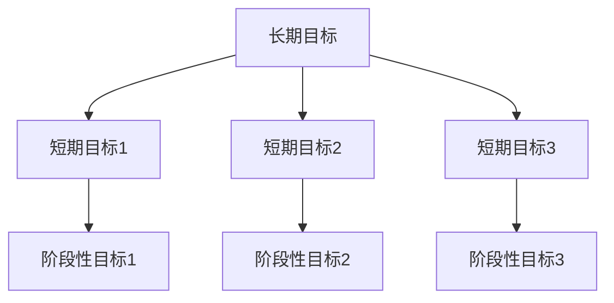

                 

### 文章标题：巴菲特双目标清单在时间管理中的应用

#### 关键词：巴菲特、双目标清单、时间管理、工作效率、个人成长、团队管理

> 摘要：本文深入探讨巴菲特双目标清单的概念、原理及其在时间管理中的应用。通过分析双目标清单的结构与要素，阐述其在提高工作效率、促进个人成长及团队管理中的实践方法。文章将以逻辑清晰、结构紧凑、简单易懂的写作风格，引导读者逐步掌握巴菲特双目标清单在时间管理中的实际应用技巧。

---

## 第一部分：巴菲特双目标清单概述

### 第1章：巴菲特双目标清单概念

#### 1.1 巴菲特双目标清单的起源

沃伦·巴菲特（Warren Buffett），被誉为“股神”，是全球知名的投资者和企业家。巴菲特的成功不仅在于他对投资市场的敏锐洞察力，还在于他独特的时间管理技巧。巴菲特在多年的投资实践中，总结出了一套被称为“双目标清单”的时间管理方法。

双目标清单最早起源于巴菲特在其合伙人查理·芒格（Charlie Munger）的建议下创建的一种工作习惯。他们发现，通过设定清晰明确的目标，可以极大地提高工作效率，从而实现个人和事业的持续成长。

#### 1.2 巴菲特双目标清单的核心思想

巴菲特双目标清单的核心思想可以概括为“聚焦重点、简单有效”。具体来说，双目标清单包括两个主要目标：一个是长期目标，即个人或组织长期追求的愿景和目标；另一个是短期目标，即为实现长期目标而设定的具体、可操作的阶段性目标。

巴菲特认为，设定清晰明确的目标是成功的关键。通过双目标清单，他能够将有限的时间和精力集中在最重要的事情上，从而最大化个人和组织的价值。

### 第2章：巴菲特双目标清单的结构与要素

#### 2.1 双目标清单的组成结构

双目标清单由两部分组成：长期目标和短期目标。长期目标通常是指个人或组织在5年以上追求的愿景和目标，例如成为某一领域的专家、实现财务自由等。短期目标则是指为实现长期目标而设定的具体、可操作的阶段性目标，通常在1年或以内完成。

#### 2.2 双目标清单的关键要素

1. **明确性**：目标必须具体、可量化，以便于衡量进展和评估效果。
2. **可行性**：目标应具有可行性，即通过努力可以实现。
3. **重要性**：目标应与长期目标保持一致，对个人或组织具有重要意义。
4. **时限性**：目标应设定明确的完成时限，以便于跟踪进度和调整计划。

## 第二部分：双目标清单在时间管理中的应用

### 第3章：巴菲特双目标清单与时间管理

#### 3.1 时间管理的重要性

时间管理是个人和组织成功的关键。在当今快节奏的社会中，如何有效地管理时间成为许多人关注的问题。巴菲特双目标清单提供了一种简单而有效的时间管理方法，通过设定清晰的目标，帮助人们聚焦重点，提高工作效率。

#### 3.2 双目标清单在时间管理中的实践

1. **设定长期目标**：首先，明确个人或组织长期追求的愿景和目标。长期目标的设定应具有明确性、可行性和重要性。
2. **分解为短期目标**：将长期目标分解为一系列短期目标，以便于实现和跟踪。短期目标的设定应具有明确性、可行性和时限性。
3. **优先级排序**：对短期目标进行优先级排序，确保将有限的时间和精力集中在最重要的事情上。
4. **执行与调整**：按照设定的目标执行计划，并根据实际情况进行调整。定期评估目标的进展，确保按计划推进。

### 第4章：运用双目标清单提高工作效率

#### 4.1 高效工作的策略

1. **设定明确的目标**：通过双目标清单，设定清晰、具体、可量化的工作目标。
2. **优先级排序**：对任务进行优先级排序，确保将有限的时间和精力集中在最重要的事情上。
3. **避免多任务处理**：专注于一件事，避免多任务处理，以提高工作质量和效率。
4. **设定明确的截止时间**：为每个任务设定明确的完成时间，以确保工作按计划进行。

#### 4.2 双目标清单在工作中的应用案例

1. **项目管理工作**：在项目管理中，使用双目标清单可以明确项目目标，分解任务，确保项目按计划推进。
2. **日常任务管理**：在日常工作中，使用双目标清单可以帮助人们聚焦重点，提高工作效率。

### 第5章：巴菲特双目标清单与个人成长

#### 5.1 双目标清单对个人成长的影响

巴菲特双目标清单可以帮助个人明确目标，聚焦成长方向，从而提高个人素质和竞争力。

#### 5.2 双目标清单在个人成长中的实践

1. **设定成长目标**：明确个人成长目标，例如学习新技能、提升领导力等。
2. **分解为可操作任务**：将成长目标分解为一系列可操作的短期任务，以便于实现和跟踪。
3. **持续学习和反思**：通过双目标清单，持续学习和反思，不断提升个人素质。

## 第三部分：双目标清单实践指南

### 第6章：制定和执行双目标清单

#### 6.1 制定双目标清单的步骤

1. **明确目标**：确定个人或组织的长期目标和短期目标。
2. **分解任务**：将目标分解为一系列可操作的短期任务。
3. **设定优先级**：对任务进行优先级排序，确保重要任务优先处理。
4. **制定执行计划**：为每个任务制定具体的执行计划，包括时间、资源和责任人。

#### 6.2 执行双目标清单的策略

1. **专注执行**：按照执行计划，专注执行任务，避免多任务处理。
2. **定期评估**：定期评估任务的进展，根据实际情况进行调整。
3. **持续改进**：根据评估结果，持续改进执行策略，提高工作效率。

### 第7章：双目标清单在团队管理中的应用

#### 7.1 团队目标管理的重要性

团队目标管理是团队管理的关键。通过明确团队目标，可以确保团队工作方向一致，提高团队工作效率。

#### 7.2 双目标清单在团队管理中的实践

1. **设定团队目标**：明确团队长期和短期目标，确保团队工作方向一致。
2. **分解任务**：将团队目标分解为一系列可操作的短期任务，分配给团队成员。
3. **协作执行**：鼓励团队成员协作执行任务，提高团队工作效率。
4. **定期评估**：定期评估团队目标的进展，根据实际情况进行调整。

## 附录

### 附录 A：双目标清单工具推荐

1. **Trello**：一款基于看板（Kanban）理念的团队协作工具，适合团队目标管理。
2. **Asana**：一款功能强大的任务管理工具，适合个人和团队使用。

### 附录 B：双目标清单案例分析

1. **案例一：个人成长**：某人在一年内通过设定明确的学习目标，成功提升了自己的编程技能。
2. **案例二：团队管理**：某公司通过使用双目标清单，有效提升了团队工作效率，实现了项目目标。

### 附录 C：双目标清单实施常见问题解答

1. **问题一：如何设定长期目标？**：长期目标应具有明确性、可行性和重要性，可以与个人或组织的愿景和使命相结合。
2. **问题二：如何分解任务？**：将目标分解为一系列可操作的短期任务，确保每个任务具有明确性、可行性和时限性。

### 结束语

巴菲特双目标清单是一种简单而有效的时间管理方法，通过设定清晰明确的目标，可以帮助个人和组织提高工作效率，实现个人和团队的成长。本文对巴菲特双目标清单进行了深入剖析，并结合实际案例进行了详细讲解。希望本文能为读者在时间管理方面提供有益的启示。

### 作者：AI天才研究院/AI Genius Institute & 禅与计算机程序设计艺术 /Zen And The Art of Computer Programming

---

## 第1章：巴菲特双目标清单概念

### 1.1 巴菲特双目标清单的起源

沃伦·巴菲特（Warren Buffett），被誉为“股神”，是全球知名的投资者和企业家。巴菲特的成功不仅在于他对投资市场的敏锐洞察力，还在于他独特的时间管理技巧。巴菲特在多年的投资实践中，总结出了一套被称为“双目标清单”的时间管理方法。

双目标清单最早起源于巴菲特在其合伙人查理·芒格（Charlie Munger）的建议下创建的一种工作习惯。他们发现，通过设定清晰明确的目标，可以极大地提高工作效率，从而实现个人和事业的持续成长。

#### 巴菲特与芒格的合作

巴菲特和芒格的合作始于1973年，当时他们共同创办了伯克希尔·哈撒韦公司（Berkshire Hathaway）。在多年的合作中，他们不仅共同实现了公司的快速增长，还建立了深厚的友谊和信任。芒格在投资和商业决策方面为巴菲特提供了宝贵的建议和指导，而巴菲特则将芒格的智慧融入了自己的投资哲学。

#### 双目标清单的诞生

在一次合作中，巴菲特和芒格意识到，他们需要一种更加系统和有效的方法来管理时间和工作。于是，他们开始探讨如何将目标管理理念应用于个人和组织的日常工作中。经过多次讨论和实践，他们最终形成了一套被称为“双目标清单”的时间管理方法。

双目标清单的核心理念是“聚焦重点、简单有效”。通过设定清晰明确的目标，巴菲特和芒格能够将有限的时间和精力集中在最重要的事情上，从而最大化个人和组织的价值。

#### 双目标清单的核心思想

1. **长期目标**：长期目标通常是指个人或组织在5年以上追求的愿景和目标。这些目标具有明确性、可行性和重要性，例如成为某一领域的专家、实现财务自由等。

2. **短期目标**：短期目标是指为实现长期目标而设定的具体、可操作的阶段性目标。这些目标通常在1年或以内完成，例如学习新技能、完成项目等。

通过设定长期目标和短期目标，巴菲特和芒格能够将复杂的工作任务分解为一系列简单、可操作的任务，从而提高工作效率和实现个人成长。

### 1.2 巴菲特双目标清单的核心思想

巴菲特双目标清单的核心思想可以概括为“聚焦重点、简单有效”。具体来说，双目标清单包括以下几方面的核心思想：

#### 1.2.1 聚焦重点

巴菲特认为，成功的关键在于聚焦重点。在工作和生活中，我们面临许多事务和任务，但只有将有限的时间和精力集中在最重要的事情上，才能实现最大的价值。

通过双目标清单，巴菲特能够将复杂的工作任务分解为一系列简单、可操作的任务，从而确保将时间和精力集中在最重要的事情上。

#### 1.2.2 简单有效

巴菲特双目标清单的另一个核心思想是简单有效。简单性不仅意味着易于理解和操作，还意味着能够快速产生效果。

巴菲特认为，复杂的工作往往难以产生实际效果。通过简化工作流程和任务，巴菲特能够更快地实现目标，从而提高工作效率。

#### 1.2.3 设定明确的目标

双目标清单强调设定明确的目标。明确的目标具有以下特点：

1. **具体性**：目标应具体、明确，以便于衡量进展和评估效果。
2. **可行性**：目标应具有可行性，即通过努力可以实现。
3. **重要性**：目标应与长期目标保持一致，对个人或组织具有重要意义。
4. **时限性**：目标应设定明确的完成时限，以便于跟踪进度和调整计划。

#### 1.2.4 分解为短期目标

巴菲特将长期目标分解为一系列短期目标，以便于实现和跟踪。短期目标通常在1年或以内完成，这样有助于确保目标的按时完成。

通过将长期目标分解为短期目标，巴菲特能够更好地管理时间和工作，确保个人和组织的持续成长。

#### 1.2.5 优先级排序

双目标清单强调对任务进行优先级排序。在工作和生活中，我们面临许多事务和任务，但只有将有限的时间和精力集中在最重要的事情上，才能实现最大的价值。

通过优先级排序，巴菲特能够确保将时间和精力集中在最重要的事情上，从而提高工作效率。

#### 1.2.6 执行与调整

双目标清单不仅强调设定目标，还强调执行和调整。巴菲特认为，执行是目标管理的关键，而调整则是确保目标按时完成的重要手段。

通过定期评估目标的进展，巴菲特能够根据实际情况进行调整，确保目标按计划推进。

### 1.3 巴菲特双目标清单的优势

巴菲特双目标清单具有以下几个优势：

1. **提高工作效率**：通过设定清晰明确的目标，巴菲特能够将有限的时间和精力集中在最重要的事情上，从而提高工作效率。

2. **促进个人成长**：通过设定长期目标和短期目标，巴菲特能够帮助个人明确成长方向，实现个人成长。

3. **团队协作**：双目标清单不仅适用于个人，还可以用于团队管理。通过明确团队目标和任务，巴菲特能够促进团队协作，提高团队效率。

4. **简单易行**：双目标清单简单易行，易于理解和操作，适合各种类型的工作和生活场景。

5. **持续改进**：通过定期评估目标的进展和调整计划，巴菲特能够持续改进工作流程和目标管理方法，提高工作效率。

### 1.4 巴菲特双目标清单的应用场景

巴菲特双目标清单可以应用于各种场景，包括个人生活、工作和团队管理。以下是一些具体的应用场景：

1. **个人生活**：巴菲特双目标清单可以帮助个人明确生活目标，提高生活质量。

2. **工作**：巴菲特双目标清单可以帮助职场人士提高工作效率，实现职业成长。

3. **团队管理**：巴菲特双目标清单可以帮助团队明确目标，促进团队协作，提高团队效率。

4. **项目管理**：巴菲特双目标清单可以帮助项目经理明确项目目标，分解任务，确保项目按时完成。

5. **学习**：巴菲特双目标清单可以帮助学生明确学习目标，提高学习效果。

### 1.5 本章小结

本章介绍了巴菲特双目标清单的起源、核心思想以及优势和应用场景。通过设定清晰明确的目标，巴菲特双目标清单能够帮助个人和组织提高工作效率，促进个人成长，适用于各种场景。下一章将详细探讨双目标清单的结构与要素。

## 第2章：巴菲特双目标清单的结构与要素

### 2.1 双目标清单的组成结构

双目标清单由两部分组成：长期目标和短期目标。这两部分相辅相成，共同构成了巴菲特独特的时间管理方法。

#### 2.1.1 长期目标

长期目标通常是指个人或组织在5年以上追求的愿景和目标。这些目标具有明确性、可行性和重要性，是个人或组织未来发展的重要指引。例如，成为某一领域的专家、实现财务自由、建立一家成功的企业等。

长期目标具有以下几个特点：

1. **明确性**：长期目标应具体、明确，以便于衡量进展和评估效果。
2. **可行性**：长期目标应具有可行性，即通过努力可以实现。
3. **重要性**：长期目标应与个人或组织的愿景和使命保持一致，对个人或组织具有重要意义。
4. **时限性**：长期目标可以没有明确的完成时限，但应设定一个大致的时间框架。

#### 2.1.2 短期目标

短期目标是指为实现长期目标而设定的具体、可操作的阶段性目标。这些目标通常在1年或以内完成，有助于确保长期目标的实现。

短期目标具有以下几个特点：

1. **明确性**：短期目标应具体、明确，以便于衡量进展和评估效果。
2. **可行性**：短期目标应具有可行性，即通过努力可以实现。
3. **重要性**：短期目标应与长期目标保持一致，对实现长期目标具有重要意义。
4. **时限性**：短期目标应设定明确的完成时限，以便于跟踪进度和调整计划。

#### 2.1.3 长期目标与短期目标的关系

长期目标和短期目标之间是相互关联的。长期目标为短期目标提供了方向和指引，而短期目标的实现有助于长期目标的达成。具体来说：

1. **方向指引**：长期目标为短期目标提供了明确的方向和指引，确保短期目标与长期目标保持一致。
2. **阶段实现**：短期目标通过阶段性实现，为长期目标的实现提供了保障。
3. **动态调整**：在实现短期目标的过程中，可以根据实际情况对长期目标和短期目标进行调整，以确保目标的实现。

### 2.2 双目标清单的关键要素

双目标清单的要素决定了清单的有效性和可操作性。以下是双目标清单的几个关键要素：

#### 2.2.1 明确性

明确性是双目标清单的核心要素之一。明确的目标可以具体、清晰地描述任务，便于衡量进展和评估效果。

1. **具体性**：目标应具体、明确，例如“学习Python编程”而不是“学习编程”。
2. **量化性**：目标应具有量化指标，例如“掌握100个Python常用函数”。
3. **时限性**：目标应设定明确的完成时限，例如“一个月内完成”。

#### 2.2.2 可行性

可行性是指目标应具有实现的可能性，通过努力可以实现。

1. **资源匹配**：目标应与现有资源和能力相匹配，确保实现的可能性。
2. **挑战性**：目标应具有一定的挑战性，以激发个人或团队的潜力。
3. **实际操作性**：目标应具备实际操作性，确保可以付诸实践。

#### 2.2.3 重要性

重要性是指目标对个人或组织具有显著的意义和价值。

1. **关键性**：目标应关注关键领域，对个人或组织的发展具有重大影响。
2. **优先级**：目标应按照优先级排序，确保重要目标优先处理。
3. **平衡性**：目标应保持平衡，避免过度聚焦于某一领域，忽视其他重要任务。

#### 2.2.4 时限性

时限性是指目标应设定明确的完成时限，以便于跟踪进度和调整计划。

1. **阶段性**：目标应分解为阶段性任务，确保在规定时间内完成。
2. **灵活性**：目标时限应具有一定的灵活性，以应对不可预见的情况。
3. **监控与反馈**：目标时限应与监控和反馈机制相结合，确保目标按时完成。

### 2.3 双目标清单的结构与关系

双目标清单的结构主要包括长期目标和短期目标，以及它们之间的相互关系。以下是双目标清单的结构与关系图：

1. **长期目标**：作为双目标清单的核心，长期目标指引短期目标的设定和实现。
2. **短期目标**：短期目标是长期目标的分解和具体化，是实现长期目标的阶段性任务。
3. **阶段性目标**：阶段性目标是短期目标的进一步细化，是具体的工作任务和行动方案。

### 2.4 双目标清单的制定步骤

制定双目标清单需要遵循以下步骤：

1. **明确长期目标**：首先，明确个人或组织的长期目标，这些目标应具有明确性、可行性和重要性。
2. **分解为短期目标**：将长期目标分解为一系列短期目标，确保短期目标具体、可操作，并设定明确的完成时限。
3. **设定阶段性目标**：将短期目标进一步分解为阶段性目标，确保每个阶段性目标都有明确的任务和行动方案。
4. **优先级排序**：对短期目标和阶段性目标进行优先级排序，确保重要目标和任务优先处理。
5. **制定执行计划**：为每个目标制定具体的执行计划，包括时间、资源和责任人。
6. **定期评估与调整**：定期评估目标的进展，根据实际情况进行调整，确保目标按计划推进。

### 2.5 双目标清单的应用实例

以下是一个应用双目标清单的实例，用于提高编程技能：

#### 长期目标：

成为Python编程专家。

#### 短期目标：

1. 掌握Python基础语法和常用库。
2. 学习数据结构和算法。
3. 实战项目，提高实际编程能力。

#### 阶段性目标：

1. **短期目标1**：
   - **阶段性目标1**：学习Python基础语法，完成相关练习。
   - **阶段性目标2**：掌握常用库，如NumPy、Pandas、Matplotlib等。
2. **短期目标2**：
   - **阶段性目标1**：学习数据结构，如列表、字典、集合等。
   - **阶段性目标2**：学习算法，如排序算法、搜索算法等。
3. **短期目标3**：
   - **阶段性目标1**：完成一个小型项目，如数据分析项目。
   - **阶段性目标2**：完成一个中等复杂度的项目，如Web开发项目。

通过这个实例，我们可以看到双目标清单如何帮助个人明确目标，制定具体的计划，并逐步实现目标。

### 2.6 本章小结

本章详细介绍了巴菲特双目标清单的组成结构、关键要素以及制定步骤。通过明确长期目标和短期目标，双目标清单能够帮助个人和组织提高工作效率，实现个人和团队的成长。下一章将探讨双目标清单在时间管理中的应用。

## 第3章：巴菲特双目标清单与时间管理

### 3.1 时间管理的重要性

时间管理是个人和组织成功的关键。在当今快节奏的社会中，如何有效地管理时间成为许多人关注的问题。巴菲特双目标清单提供了一种简单而有效的时间管理方法，通过设定清晰的目标，帮助人们聚焦重点，提高工作效率。

#### 时间管理的意义

1. **提高工作效率**：通过有效的时间管理，人们可以更加专注于最重要的事情，从而提高工作效率。
2. **实现目标**：时间管理有助于确保个人和组织能够按计划实现目标，提高成就感和满足感。
3. **减少压力**：合理安排时间，避免过度劳累，有助于减轻工作和生活的压力。
4. **提升生活质量**：有效的时间管理可以帮助人们更好地平衡工作与生活，提高生活质量。

#### 时间管理面临的挑战

1. **任务繁多**：在现代社会，人们面临各种各样的任务，如何合理分配时间和精力成为挑战。
2. **注意力分散**：在多任务环境下，人们容易分心，难以集中精力完成重要任务。
3. **时间观念薄弱**：部分人缺乏时间观念，导致时间浪费，影响工作效率。
4. **优先级混乱**：在任务繁多的环境中，如何确定任务的优先级，确保重要任务优先处理，是一个挑战。

### 3.2 巴菲特双目标清单在时间管理中的实践

巴菲特双目标清单是一种简单而有效的时间管理方法，通过设定清晰的目标，帮助人们聚焦重点，提高工作效率。以下是巴菲特双目标清单在时间管理中的实践步骤：

#### 3.2.1 设定长期目标

首先，明确个人或组织长期追求的愿景和目标。长期目标通常是指个人或组织在5年以上追求的愿景和目标，例如成为某一领域的专家、实现财务自由等。长期目标的设定应具有明确性、可行性和重要性。

1. **明确性**：长期目标应具体、明确，例如“在5年内成为人工智能领域的专家”。
2. **可行性**：长期目标应具有可行性，即通过努力可以实现。
3. **重要性**：长期目标应与个人或组织的愿景和使命保持一致，对个人或组织具有重要意义。

#### 3.2.2 分解为短期目标

将长期目标分解为一系列短期目标，以便于实现和跟踪。短期目标通常在1年或以内完成，有助于确保长期目标的实现。

1. **阶段性实现**：短期目标将长期目标分解为阶段性任务，确保长期目标按时完成。
2. **具体、可操作**：短期目标应具体、可操作，例如“在1年内掌握Python编程基础”。
3. **设定完成时限**：短期目标应设定明确的完成时限，以便于跟踪进度和评估效果。

#### 3.2.3 设定阶段性目标

将短期目标进一步分解为阶段性目标，以便于具体执行和跟踪。阶段性目标是短期目标的细化，是具体的工作任务和行动方案。

1. **明确任务和行动**：阶段性目标应明确具体任务和行动，例如“在2个月内学习Python基础语法”。
2. **设置完成时限**：阶段性目标应设定明确的完成时限，以便于跟踪进度和评估效果。
3. **资源分配**：根据阶段性目标的需求，合理分配资源和人力。

#### 3.2.4 优先级排序

对短期目标和阶段性目标进行优先级排序，确保重要目标和任务优先处理。优先级排序有助于确保时间和精力集中在最重要的事情上。

1. **确定优先级**：根据任务的重要性和紧急性，确定短期目标和阶段性目标的优先级。
2. **动态调整**：在执行过程中，根据实际情况对优先级进行调整，确保目标和任务的顺利完成。

#### 3.2.5 制定执行计划

为每个目标制定具体的执行计划，包括时间、资源和责任人。执行计划有助于确保目标按时完成。

1. **时间安排**：明确每个目标和任务的时间安排，确保有足够的时间完成。
2. **资源分配**：根据目标和任务的需求，合理分配资源，确保任务顺利进行。
3. **责任人**：明确每个目标和任务的负责人，确保任务有人负责。

#### 3.2.6 定期评估与调整

定期评估目标的进展，根据实际情况进行调整，确保目标按计划推进。评估和调整有助于及时发现和解决问题，确保目标的实现。

1. **进度跟踪**：定期跟踪目标进度，了解任务完成情况。
2. **问题反馈**：及时发现和解决问题，确保目标和任务的顺利完成。
3. **调整计划**：根据实际情况调整目标和任务的执行计划，确保目标按时完成。

### 3.3 双目标清单在时间管理中的应用案例

以下是一个应用双目标清单在时间管理中的实际案例，用于提高编程技能：

#### 长期目标：

在5年内成为Python编程专家。

#### 短期目标：

1. 掌握Python基础语法和常用库。
2. 学习数据结构和算法。
3. 实战项目，提高实际编程能力。

#### 阶段性目标：

1. **短期目标1**：
   - **阶段性目标1**：学习Python基础语法，完成相关练习。
   - **阶段性目标2**：掌握常用库，如NumPy、Pandas、Matplotlib等。
2. **短期目标2**：
   - **阶段性目标1**：学习数据结构，如列表、字典、集合等。
   - **阶段性目标2**：学习算法，如排序算法、搜索算法等。
3. **短期目标3**：
   - **阶段性目标1**：完成一个小型项目，如数据分析项目。
   - **阶段性目标2**：完成一个中等复杂度的项目，如Web开发项目。

通过这个案例，我们可以看到双目标清单如何帮助个人明确目标，制定具体的计划，并逐步实现目标。

### 3.4 本章小结

本章介绍了巴菲特双目标清单在时间管理中的应用。通过设定清晰的目标，双目标清单能够帮助个人和组织提高工作效率，实现目标。下一章将探讨双目标清单在提高工作效率方面的应用。

## 第4章：运用双目标清单提高工作效率

### 4.1 高效工作的策略

在快节奏的工作环境中，如何提高工作效率成为许多人关注的问题。巴菲特双目标清单提供了一套简单而有效的方法，通过设定清晰的目标和优先级排序，帮助个人和组织实现高效工作。

#### 4.1.1 设定清晰的目标

设定清晰的目标是提高工作效率的第一步。巴菲特双目标清单强调目标的明确性、可行性和重要性。具体来说，设定清晰的目标需要遵循以下几个原则：

1. **明确性**：目标应具体、明确，避免模糊和抽象。例如，将“提高工作效率”改为“每天完成任务量提高20%”。
2. **可行性**：目标应具有可行性，即通过努力可以实现。例如，设定目标前应评估现有资源和能力，确保目标可实现。
3. **重要性**：目标应与个人或组织的长期目标保持一致，对个人或组织具有重要意义。例如，选择对职业发展或企业增长有直接影响的目标。

#### 4.1.2 优先级排序

在设定清晰目标的基础上，优先级排序是提高工作效率的关键。巴菲特双目标清单强调根据任务的重要性和紧急性进行排序，确保时间和精力集中在最重要的事情上。具体来说，优先级排序需要遵循以下几个原则：

1. **紧急性**：根据任务完成的紧迫性进行排序，优先处理紧急任务。
2. **重要性**：根据任务的重要性和影响力进行排序，优先处理重要任务。
3. **可行性**：在确保任务可行性的前提下，根据任务优先级进行调整，确保优先级排序合理。

#### 4.1.3 避免多任务处理

多任务处理是降低工作效率的常见原因之一。巴菲特双目标清单建议避免多任务处理，专注于一项任务直至完成。具体来说，遵循以下原则：

1. **专注单一任务**：在一次工作中，专注于一项任务，避免同时处理多个任务。
2. **设置专注时间**：设定专注时间，例如使用番茄工作法，每25分钟专注工作，休息5分钟。
3. **避免干扰**：在工作时，尽量减少干扰，如关闭社交媒体通知、设定电话静音等。

#### 4.1.4 设定明确的截止时间

设定明确的截止时间是提高工作效率的重要手段。巴菲特双目标清单强调为每个任务设定明确的完成时限，确保任务按时完成。具体来说，设定明确的截止时间需要遵循以下几个原则：

1. **具体性**：为每个任务设定具体的完成时间，例如“明天上午完成报告”。
2. **灵活性**：在设定截止时间时，考虑可能的延误因素，确保截止时间具有灵活性。
3. **反馈机制**：设定截止时间后，建立反馈机制，定期检查任务进度，确保按时完成。

### 4.2 双目标清单在工作中的应用案例

以下是一个应用双目标清单在工作中的实际案例，用于提高项目管理效率：

#### 长期目标：

在2年内实现项目管理的专业化和高效化。

#### 短期目标：

1. 学习并掌握项目管理的基础知识和技能。
2. 提升团队合作和沟通能力。
3. 提高项目进度和资源利用率。

#### 阶段性目标：

1. **短期目标1**：
   - **阶段性目标1**：学习项目管理的基础知识和技能，如项目计划、进度管理、风险管理等。
   - **阶段性目标2**：阅读相关书籍和参加培训课程，提高项目管理理论水平。
2. **短期目标2**：
   - **阶段性目标1**：提升团队合作和沟通能力，通过团队建设活动和沟通技巧培训，提高团队协作效率。
   - **阶段性目标2**：制定并实施有效的沟通机制，如定期会议、工作日志等，确保信息畅通。
3. **短期目标3**：
   - **阶段性目标1**：提高项目进度和资源利用率，通过优化项目计划、合理分配资源和监控项目进度，提高项目效率。
   - **阶段性目标2**：采用项目管理工具，如甘特图、Trello等，提升项目可视化和进度管理能力。

通过这个案例，我们可以看到双目标清单如何帮助个人明确目标，制定具体的计划，并逐步实现目标。

### 4.3 本章小结

本章介绍了运用巴菲特双目标清单提高工作效率的策略。通过设定清晰的目标、优先级排序、避免多任务处理和设定明确的截止时间，个人和组织可以大幅提高工作效率。下一章将探讨双目标清单在个人成长中的应用。

## 第5章：巴菲特双目标清单与个人成长

### 5.1 双目标清单对个人成长的影响

巴菲特双目标清单作为一种简单而有效的时间管理工具，对个人成长具有深远的影响。通过设定清晰的目标，双目标清单帮助个人明确成长方向，聚焦关键领域，从而实现持续成长。

#### 5.1.1 明确成长方向

双目标清单强调设定长期目标和短期目标，这有助于个人明确成长方向。长期目标通常与个人愿景和使命相关，例如成为某一领域的专家、实现财务自由等。这些目标为个人提供了明确的成长路径，使个人能够有针对性地制定短期目标。

#### 5.1.2 提升专注力和执行力

通过双目标清单，个人能够将时间和精力集中在最重要的事情上，从而提升专注力和执行力。在实现短期目标的过程中，个人需要克服各种干扰和诱惑，专注于任务完成。这种专注力和执行力在长期来看，将有助于个人在职业生涯中取得显著成就。

#### 5.1.3 促进自我反思与调整

双目标清单不仅帮助个人设定目标，还强调定期评估和调整。在实现目标的过程中，个人需要不断反思自己的行为和决策，并根据实际情况进行调整。这种自我反思和调整有助于个人发现和纠正错误，不断提升自己的能力和素质。

#### 5.1.4 培养自律和责任感

双目标清单要求个人设定明确的目标并按计划执行，这有助于培养自律和责任感。在实现目标的过程中，个人需要克服懒惰和拖延，养成良好的工作习惯和自律意识。同时，明确的目标和期限使个人对自己的行为和结果负责，从而提升责任感。

### 5.2 双目标清单在个人成长中的实践

#### 5.2.1 设定长期目标

首先，个人需要明确自己的长期目标。这些目标应具有明确性、可行性和重要性。例如，某个人可能设定以下长期目标：

1. **学习新技能**：成为数据分析师。
2. **提升职业素养**：在职场中获得中高级职位。
3. **实现财务自由**：实现投资收益覆盖生活开销。

在设定长期目标时，个人应确保目标与自己的兴趣、能力和价值观相符合，以便于持之以恒地追求。

#### 5.2.2 分解为短期目标

将长期目标分解为一系列短期目标，以便于实现和跟踪。短期目标通常在1年或以内完成，有助于确保长期目标的实现。例如，针对上述长期目标，个人可以设定以下短期目标：

1. **学习新技能**：
   - **短期目标1**：掌握Python编程基础。
   - **短期目标2**：学习数据分析和数据处理相关课程。
2. **提升职业素养**：
   - **短期目标1**：参加职场技能培训，如沟通技巧、团队合作等。
   - **短期目标2**：提升项目管理和团队领导能力。
3. **实现财务自由**：
   - **短期目标1**：学习投资基础知识，如股票、基金等。
   - **短期目标2**：开始小额投资，积累投资经验。

#### 5.2.3 设定阶段性目标

将短期目标进一步分解为阶段性目标，以便于具体执行和跟踪。阶段性目标是具体的工作任务和行动方案。例如，针对上述短期目标，个人可以设定以下阶段性目标：

1. **学习新技能**：
   - **阶段性目标1**：完成Python编程基础课程，通过在线学习平台完成相关练习。
   - **阶段性目标2**：参加数据分析和数据处理相关课程，完成课程项目。
2. **提升职业素养**：
   - **阶段性目标1**：阅读相关书籍，如《高效能人士的七个习惯》等。
   - **阶段性目标2**：参加职场技能培训，如沟通技巧、团队合作等，获取证书。
3. **实现财务自由**：
   - **阶段性目标1**：学习投资基础知识，阅读相关书籍，如《股票大作手回忆录》等。
   - **阶段性目标2**：开始小额投资，例如购买基金或股票，积累投资经验。

#### 5.2.4 优先级排序

对短期目标和阶段性目标进行优先级排序，确保重要目标和任务优先处理。例如，根据个人情况，个人可以将以下短期目标进行排序：

1. **提升职业素养**：由于在职场中获得中高级职位对职业发展至关重要，因此将提升职业素养列为首要目标。
2. **学习新技能**：数据分析师的技能对职业发展同样重要，因此将学习新技能列为第二目标。
3. **实现财务自由**：实现财务自由是长期目标，但可以与其他目标同时进行，因此将其列为第三目标。

#### 5.2.5 制定执行计划

为每个目标制定具体的执行计划，包括时间、资源和责任人。执行计划有助于确保目标按时完成。例如，针对上述短期目标和阶段性目标，个人可以制定以下执行计划：

1. **提升职业素养**：
   - **时间安排**：每周阅读两本书，参加一次职场技能培训。
   - **资源分配**：利用空闲时间阅读书籍，参加培训课程。
   - **责任人**：个人自行负责，定期自我评估进度。
2. **学习新技能**：
   - **时间安排**：每天学习1小时Python编程，每周完成一个项目。
   - **资源分配**：利用在线学习平台，如Coursera、edX等，参加数据分析和数据处理课程。
   - **责任人**：个人自行负责，定期自我评估进度。
3. **实现财务自由**：
   - **时间安排**：每周学习投资基础知识，每月进行小额投资。
   - **资源分配**：利用在线学习平台，如Investopedia等，学习投资知识。
   - **责任人**：个人自行负责，定期评估投资收益。

#### 5.2.6 定期评估与调整

定期评估目标的进展，根据实际情况进行调整，确保目标按计划推进。评估和调整有助于及时发现和解决问题，确保目标的实现。例如，个人可以每月进行一次目标评估：

1. **进度跟踪**：记录每个目标的完成情况，了解任务进度。
2. **问题反馈**：分析未按计划完成的原因，提出解决方案。
3. **调整计划**：根据实际情况调整目标和执行计划，确保目标按时完成。

### 5.3 双目标清单在个人成长中的应用案例

以下是一个应用双目标清单在个人成长中的实际案例，用于提升编程技能：

#### 长期目标：

在3年内成为Python编程专家。

#### 短期目标：

1. 掌握Python基础语法和常用库。
2. 学习数据结构和算法。
3. 实战项目，提高实际编程能力。

#### 阶段性目标：

1. **短期目标1**：
   - **阶段性目标1**：学习Python基础语法，完成相关练习。
   - **阶段性目标2**：掌握常用库，如NumPy、Pandas、Matplotlib等。
2. **短期目标2**：
   - **阶段性目标1**：学习数据结构，如列表、字典、集合等。
   - **阶段性目标2**：学习算法，如排序算法、搜索算法等。
3. **短期目标3**：
   - **阶段性目标1**：完成一个小型项目，如数据分析项目。
   - **阶段性目标2**：完成一个中等复杂度的项目，如Web开发项目。

#### 评估与调整

在每月的评估中，个人可以检查以下内容：

1. **进度跟踪**：检查学习进度，确保完成阶段性目标。
2. **问题反馈**：分析学习中的困难和挑战，寻求解决方案。
3. **调整计划**：根据实际情况调整学习计划，确保按计划推进。

通过这个案例，我们可以看到双目标清单如何帮助个人明确目标，制定具体的计划，并逐步实现目标。

### 5.4 本章小结

本章介绍了巴菲特双目标清单在个人成长中的应用。通过设定清晰的目标、分解为短期目标、设定阶段性目标、优先级排序、制定执行计划和定期评估与调整，双目标清单帮助个人明确成长方向，提升专注力和执行力，促进自我反思与调整，培养自律和责任感。下一章将探讨双目标清单在团队管理中的应用。

## 第6章：制定和执行双目标清单

### 6.1 制定双目标清单的步骤

制定双目标清单是一个系统化的过程，包括明确目标、分解任务、设定优先级等多个步骤。以下是如何制定双目标清单的详细步骤：

#### 6.1.1 确定长期目标

首先，个人或组织需要明确长期目标。长期目标通常是未来5年以上追求的愿景和目标，具有明确性、可行性和重要性。例如，个人可能设定以下长期目标：

- **长期目标1**：在5年内成为某个领域的专家。
- **长期目标2**：实现财务自由。
- **长期目标3**：提高健康水平。

在设定长期目标时，应确保这些目标与个人或组织的价值观和愿景相符，并具有可行性。

#### 6.1.2 分解为短期目标

将长期目标分解为一系列短期目标，以便于实现和跟踪。短期目标通常在1年或以内完成，有助于确保长期目标的实现。例如，针对上述长期目标，个人可以设定以下短期目标：

- **短期目标1**：掌握相关领域的核心知识和技能。
- **短期目标2**：开始实现财务自由，例如通过储蓄或投资。
- **短期目标3**：制定并实施健康计划，如定期锻炼和健康饮食。

#### 6.1.3 设定阶段性目标

将短期目标进一步分解为阶段性目标，以便于具体执行和跟踪。阶段性目标是具体的工作任务和行动方案。例如，针对上述短期目标，个人可以设定以下阶段性目标：

- **短期目标1**：
  - **阶段性目标1**：学习核心知识和技能，如阅读相关书籍和参加培训课程。
  - **阶段性目标2**：完成相关项目或任务，以验证学习成果。
- **短期目标2**：
  - **阶段性目标1**：制定储蓄计划，每月定期存款。
  - **阶段性目标2**：研究投资知识，选择合适的投资渠道。
- **短期目标3**：
  - **阶段性目标1**：制定健康计划，如每周锻炼三次。
  - **阶段性目标2**：记录健康数据，如体重、运动时间等，以评估健康计划的成效。

#### 6.1.4 优先级排序

对短期目标和阶段性目标进行优先级排序，确保重要目标和任务优先处理。例如，根据个人情况，可以将以下短期目标进行排序：

- **优先级1**：健康计划，因为健康是最重要的。
- **优先级2**：财务自由，因为实现财务自由有助于长期目标的实现。
- **优先级3**：成为专家，因为这是长期目标之一。

#### 6.1.5 制定执行计划

为每个目标制定具体的执行计划，包括时间、资源和责任人。执行计划有助于确保目标按时完成。例如，针对上述短期目标和阶段性目标，个人可以制定以下执行计划：

- **执行计划**：
  - **短期目标1**：
    - **时间安排**：每天学习1小时，每周完成一个项目。
    - **资源分配**：使用在线学习平台，如Coursera和edX。
    - **责任人**：个人自行负责。
  - **短期目标2**：
    - **时间安排**：每月定期存款，每月研究投资知识。
    - **资源分配**：使用个人储蓄账户和投资研究网站。
    - **责任人**：个人自行负责。
  - **短期目标3**：
    - **时间安排**：每周锻炼三次，每天记录健康数据。
    - **资源分配**：使用健身设备和健康应用程序。
    - **责任人**：个人自行负责。

#### 6.1.6 定期评估与调整

定期评估目标的进展，根据实际情况进行调整，确保目标按计划推进。评估和调整有助于及时发现和解决问题，确保目标的实现。例如，个人可以每月进行一次目标评估：

- **进度跟踪**：记录每个目标的完成情况，了解任务进度。
- **问题反馈**：分析未按计划完成的原因，提出解决方案。
- **调整计划**：根据实际情况调整目标和执行计划，确保目标按时完成。

### 6.2 执行双目标清单的策略

在执行双目标清单时，以下策略有助于确保目标的有效实现：

#### 6.2.1 专注执行

按照执行计划，专注执行任务，避免多任务处理。专注于一项任务有助于提高工作效率和质量。例如，个人可以在执行任务时关闭社交媒体通知，专注于工作。

#### 6.2.2 保持灵活性

尽管执行计划是制定好的，但在实际执行过程中，可能遇到各种不可预见的情况。保持灵活性，根据实际情况调整执行计划，有助于应对这些挑战。例如，如果某个阶段性目标因外部因素无法按时完成，个人可以调整时间安排或资源分配。

#### 6.2.3 定期评估

定期评估目标的进展，了解任务的完成情况，确保目标按计划推进。评估可以帮助个人及时发现和解决问题，调整执行策略。例如，每月进行一次目标评估，记录每个目标的完成情况和进度。

#### 6.2.4 反馈与学习

在执行目标的过程中，个人可以从成功和失败中吸取教训，不断优化执行策略。通过反馈与学习，个人可以不断提升自己的执行能力和效率。例如，在完成一个项目后，个人可以反思项目的优点和不足，为下一个项目提供改进方向。

### 6.3 双目标清单在日常工作中的应用

以下是一个双目标清单在日常工作中的应用示例，用于提高工作效率：

#### 长期目标：

在1年内提高工作效率，减少工作压力。

#### 短期目标：

1. 学习并掌握时间管理技巧。
2. 优化工作流程，减少不必要的任务。
3. 提升团队合作能力。

#### 阶段性目标：

1. **短期目标1**：
   - **阶段性目标1**：学习时间管理技巧，如番茄工作法。
   - **阶段性目标2**：制定并实施个人时间管理计划。
2. **短期目标2**：
   - **阶段性目标1**：分析现有工作流程，识别并消除瓶颈。
   - **阶段性目标2**：优化工作流程，提高工作效率。
3. **短期目标3**：
   - **阶段性目标1**：参加团队建设活动，提高团队合作能力。
   - **阶段性目标2**：建立有效的沟通机制，确保信息畅通。

通过这个案例，我们可以看到双目标清单如何帮助个人明确目标，制定具体的计划，并逐步实现目标。

### 6.4 本章小结

本章介绍了如何制定和执行双目标清单。通过明确长期目标、分解为短期目标、设定阶段性目标、优先级排序、制定执行计划和定期评估与调整，个人和组织可以有效地实现目标。执行双目标清单的策略和日常应用案例进一步说明了如何将双目标清单应用于实际工作。下一章将探讨双目标清单在团队管理中的应用。

## 第7章：双目标清单在团队管理中的应用

### 7.1 团队目标管理的重要性

在团队管理中，明确的目标是确保团队协作高效和有序的关键。团队目标管理不仅能够提高团队的工作效率和成果，还能够增强团队成员的凝聚力和归属感。巴菲特双目标清单为团队目标管理提供了一种有效的方法，通过设定清晰、具体、可操作的目标，帮助团队实现共同愿景。

#### 7.1.1 团队目标管理的作用

1. **明确方向**：团队目标管理有助于明确团队的工作方向，确保团队成员在共同目标下协同工作。
2. **提高效率**：通过设定具体的目标和行动计划，团队成员能够更加专注和高效地完成任务。
3. **增强凝聚力**：共同的目标和任务使团队成员更加紧密地协作，增强团队凝聚力和归属感。
4. **促进成长**：团队目标管理有助于团队成员在实现目标的过程中不断学习和成长，提升个人能力。

#### 7.1.2 团队目标管理面临的挑战

1. **目标设定不明确**：如果团队目标设定模糊或过于抽象，将难以指导团队成员的具体行动。
2. **优先级混乱**：在任务繁多的情况下，如何确定任务的优先级，确保重要任务优先处理，是一个挑战。
3. **沟通不畅**：团队内部缺乏有效的沟通机制，可能导致信息传递不畅，影响团队协作效率。
4. **执行力不足**：团队成员可能缺乏执行目标的动力或能力，导致目标难以实现。

### 7.2 双目标清单在团队管理中的实践

巴菲特双目标清单在团队管理中的应用，主要通过以下步骤实现团队目标的设定、分解、执行和监控：

#### 7.2.1 设定团队长期目标

团队长期目标通常是与公司愿景和使命相关的目标，例如实现某项创新产品、提升市场份额等。这些目标应具有明确性、可行性和重要性。

1. **明确性**：长期目标应具体、明确，如“在两年内将产品A的市场份额提升至20%”。
2. **可行性**：长期目标应考虑现有资源和外部环境，确保通过努力可以实现。
3. **重要性**：长期目标应与公司的战略方向和愿景保持一致，对公司的未来发展具有重要意义。

#### 7.2.2 分解为团队短期目标

将长期目标分解为一系列短期目标，以便于团队成员在实际工作中逐步实现。短期目标通常在1年或以内完成，有助于确保长期目标的实现。

1. **阶段性实现**：短期目标应分解为可操作的阶段性任务，如制定产品A的研发计划、市场推广策略等。
2. **具体、可操作**：短期目标应具体、明确，如“在六个月内完成产品A的研发工作”。
3. **设定完成时限**：短期目标应设定明确的完成时限，以便于跟踪进度和评估效果。

#### 7.2.3 设定团队阶段性目标

将短期目标进一步分解为阶段性目标，以便于具体执行和跟踪。阶段性目标是具体的工作任务和行动方案。

1. **明确任务和行动**：阶段性目标应明确具体任务和行动，如“在三个月内完成产品A的初步设计”。
2. **设置完成时限**：阶段性目标应设定明确的完成时限，以便于跟踪进度和评估效果。
3. **资源分配**：根据阶段性目标的需求，合理分配团队资源和人力。

#### 7.2.4 优先级排序

对短期目标和阶段性目标进行优先级排序，确保重要目标和任务优先处理。优先级排序有助于确保团队时间和精力集中在最重要的事情上。

1. **确定优先级**：根据任务的重要性和紧急性，确定短期目标和阶段性目标的优先级。
2. **动态调整**：在执行过程中，根据实际情况对优先级进行调整，确保目标和任务的顺利完成。

#### 7.2.5 制定执行计划

为每个目标制定具体的执行计划，包括时间、资源和责任人。执行计划有助于确保目标按时完成。

1. **时间安排**：明确每个目标和任务的完成时间，确保有足够的时间完成。
2. **资源分配**：根据目标和任务的需求，合理分配资源和人力。
3. **责任人**：明确每个目标和任务的负责人，确保任务有人负责。

#### 7.2.6 定期评估与调整

定期评估目标的进展，根据实际情况进行调整，确保目标按计划推进。评估和调整有助于及时发现和解决问题，确保目标的实现。

1. **进度跟踪**：记录每个目标的完成情况，了解任务进度。
2. **问题反馈**：分析未按计划完成的原因，提出解决方案。
3. **调整计划**：根据实际情况调整目标和执行计划，确保目标按时完成。

### 7.3 双目标清单在团队管理中的应用案例

以下是一个双目标清单在团队管理中的应用案例，用于提升产品研发效率：

#### 长期目标：

在两年内将产品A的市场份额提升至20%。

#### 短期目标：

1. 完成产品A的研发工作。
2. 制定并实施市场推广策略。
3. 收集用户反馈，持续优化产品。

#### 阶段性目标：

1. **短期目标1**：
   - **阶段性目标1**：完成产品A的需求分析和设计。
   - **阶段性目标2**：完成产品A的初步研发，实现核心功能。
2. **短期目标2**：
   - **阶段性目标1**：制定市场推广计划，包括广告投放、线上线下活动等。
   - **阶段性目标2**：实施市场推广活动，收集用户反馈。
3. **短期目标3**：
   - **阶段性目标1**：分析用户反馈，优化产品功能。
   - **阶段性目标2**：发布产品A的优化版本。

#### 评估与调整

在每季度进行一次团队目标评估：

1. **进度跟踪**：检查每个目标的完成情况，确保按计划推进。
2. **问题反馈**：分析未按计划完成的原因，提出解决方案。
3. **调整计划**：根据评估结果调整目标和执行计划，确保目标按时完成。

通过这个案例，我们可以看到双目标清单如何帮助团队明确目标，制定具体的计划，并逐步实现目标。

### 7.4 本章小结

本章介绍了双目标清单在团队管理中的应用。通过设定团队长期目标、分解为短期目标、设定阶段性目标、优先级排序、制定执行计划和定期评估与调整，团队可以有效地实现共同目标。双目标清单在团队管理中的应用案例进一步说明了如何将这种方法应用于实际工作中。下一章将提供双目标清单工具推荐和案例分析。

## 附录

### 附录 A：双目标清单工具推荐

在实施双目标清单的过程中，选择合适的工具至关重要。以下是一些常用的双目标清单工具，可以帮助个人和组织高效地管理和跟踪目标。

#### 1. Trello

Trello是一款基于看板（Kanban）理念的团队协作工具，适合用于项目管理、任务跟踪和目标管理。用户可以创建板、列表和卡片，将任务分解为具体的工作项，并设置截止日期、优先级等。Trello直观的界面和灵活的功能使其成为许多团队的首选。

**优点**：

- **直观界面**：简单易懂，易于上手。
- **灵活性强**：可以根据个人或团队需求自定义列表和卡片。
- **协作功能**：支持团队成员之间的实时协作和通知。

**使用指南**：

1. 创建一个新板，用于管理长期目标和短期目标。
2. 在板中创建多个列表，分别代表不同的阶段或任务。
3. 在每个列表中创建卡片，将任务分解为具体的卡片项。
4. 为每个卡片设置截止日期、标签和描述，以便于跟踪和管理。

#### 2. Asana

Asana是一款功能强大的任务管理工具，适合用于个人和团队的目标管理。用户可以创建项目、任务和子任务，并设置责任人、截止日期和优先级。Asana提供了丰富的视图选项，如看板、列表和甘特图，方便用户从不同角度查看和管理任务。

**优点**：

- **多功能性**：支持多种视图选项，如看板、列表和甘特图。
- **协作功能**：支持团队成员之间的实时协作和通知。
- **集成性**：与多种第三方应用集成，如Google Calendar、Slack等。

**使用指南**：

1. 创建一个新项目，用于管理长期目标和短期目标。
2. 在项目中创建任务和子任务，将目标分解为具体的工作项。
3. 为每个任务设置责任人、截止日期和优先级。
4. 定期查看任务进度，并根据实际情况进行调整。

#### 3. Notion

Notion是一款多功能的笔记和组织工具，适合用于个人和团队的目标管理。用户可以创建数据库、看板、笔记和页面，将目标、任务和笔记整合在一起。Notion的灵活性和扩展性使其成为许多人的首选。

**优点**：

- **多功能性**：支持多种类型的笔记和组织方式。
- **灵活性强**：可以根据个人或团队需求自定义数据库和页面。
- **协作功能**：支持团队成员之间的实时协作和通知。

**使用指南**：

1. 创建一个新页面，用于管理长期目标和短期目标。
2. 在页面中创建数据库，分别用于任务、项目、笔记等。
3. 将目标、任务和笔记整合到相应的数据库中，以便于跟踪和管理。
4. 定期更新数据库，记录任务进度和目标完成情况。

### 附录 B：双目标清单案例分析

以下是一些双目标清单的实际应用案例，展示了如何在不同场景中有效地使用这种方法。

#### 案例一：个人学习计划

**长期目标**：在一年内掌握Python编程技能。

**短期目标**：

1. 学习Python基础语法。
2. 掌握数据结构和算法。
3. 实战项目，提高实际编程能力。

**阶段性目标**：

1. **短期目标1**：
   - **阶段性目标1**：每周学习Python基础语法，完成练习。
   - **阶段性目标2**：每月学习一种新的数据结构，如列表、字典、集合等。

**实施结果**：

通过制定和执行双目标清单，个人在一年内成功掌握了Python编程技能，并完成了多个小型项目，提高了实际编程能力。

#### 案例二：团队项目进度管理

**长期目标**：在六个月内完成产品A的研发工作。

**短期目标**：

1. 完成产品A的需求分析和设计。
2. 完成产品A的初步研发，实现核心功能。
3. 收集用户反馈，持续优化产品。

**阶段性目标**：

1. **短期目标1**：
   - **阶段性目标1**：在两个月内完成需求分析和设计。
   - **阶段性目标2**：在三个月内完成初步研发，实现核心功能。

**实施结果**：

通过双目标清单的指导，团队在六个月内成功完成了产品A的研发工作，并按计划进行了用户反馈和产品优化。

#### 案例三：个人健康计划

**长期目标**：在一年内提高健康水平。

**短期目标**：

1. 实施健康饮食计划。
2. 每周进行三次锻炼。
3. 定期进行健康检查。

**阶段性目标**：

1. **短期目标1**：
   - **阶段性目标1**：制定健康饮食计划，每周减少摄入的糖分和油脂。
   - **阶段性目标2**：每周进行三次锻炼，每次锻炼时间不少于30分钟。

**实施结果**：

通过双目标清单的指导，个人在一年内成功提高了健康水平，体重下降，体能提升，生活质量显著改善。

### 附录 C：双目标清单实施常见问题解答

以下是一些在实施双目标清单过程中常见的问题及其解答。

#### 问题一：如何设定长期目标？

**解答**：

1. **明确愿景和使命**：首先，明确个人或组织的愿景和使命，确保长期目标与这些目标和价值观相符。
2. **具体和量化**：长期目标应具体和量化，例如“在五年内实现收入翻倍”。
3. **可行性评估**：考虑现有资源和外部环境，确保长期目标通过努力可以实现。

#### 问题二：如何分解任务？

**解答**：

1. **阶段性分解**：将长期目标分解为短期目标，再将短期目标分解为阶段性任务。
2. **具体和可操作**：每个阶段性任务应具体和可操作，例如“下周完成市场调研报告”。
3. **优先级排序**：根据任务的重要性和紧急性，对阶段性任务进行优先级排序。

#### 问题三：如何确保目标按计划推进？

**解答**：

1. **定期评估**：定期评估目标的进展，确保按计划推进。
2. **问题反馈**：及时发现和解决问题，确保目标不受干扰。
3. **调整计划**：根据实际情况调整目标和执行计划，确保目标按时完成。

### 总结

通过以上附录内容，我们了解了双目标清单工具的推荐、实际应用案例和常见问题解答。双目标清单作为一种简单而有效的时间管理方法，能够帮助个人和组织明确目标、提高工作效率和实现持续成长。希望这些内容能够为读者在实施双目标清单过程中提供有益的指导。

### 结束语

本文深入探讨了巴菲特双目标清单的概念、原理和应用。通过设定清晰的目标、分解为短期目标、设定阶段性目标、优先级排序、制定执行计划和定期评估与调整，双目标清单帮助个人和组织提高工作效率，实现个人成长和团队协作。本文提供了丰富的案例和工具推荐，希望读者能够结合自身实际，运用双目标清单实现目标。

感谢读者对本文的关注，希望本文能够为您的个人和团队发展带来启示。请记住，持续努力和不断优化是实现目标的关键。祝您在双目标清单的指导下，取得更加辉煌的成就！

### 作者

作者：AI天才研究院/AI Genius Institute & 禅与计算机程序设计艺术 /Zen And The Art of Computer Programming

感谢您的阅读和支持！期待与您在未来的技术交流中再次相遇。如果您有任何问题或建议，欢迎在评论区留言，我们将尽快回复。祝您生活愉快，工作顺利！

