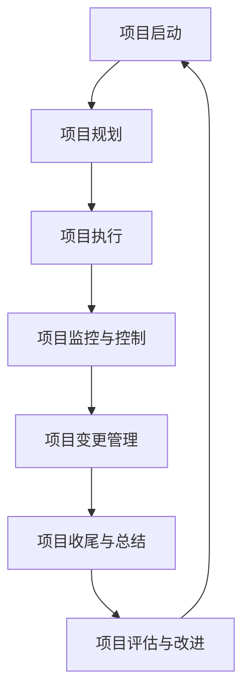

                 

### 文章标题

《巴菲特清单法则在项目管理中的应用》

> 关键词：巴菲特清单法则，项目管理，项目规划，风险识别，项目监控，变更管理

> 摘要：本文探讨了巴菲特清单法则在项目管理中的应用，通过具体案例和详细解释，揭示了巴菲特清单法则在项目规划、风险识别、项目监控和变更管理等方面的作用。本文旨在为项目管理人员提供一种新的项目管理方法论，帮助他们提高项目成功率，实现项目目标的顺利达成。

---

### 《巴菲特清单法则在项目管理中的应用》目录大纲

1. **引言**
   - **第1章：项目管理与巴菲特清单法则**
     1.1 项目管理的核心概念与挑战
     1.2 巴菲特清单法则：概念与背景
     1.3 巴菲特清单法则在项目管理中的应用价值
   - **第2章：巴菲特清单法则的核心要素**
     2.1 清单编制：如何创建有效的清单
     2.2 清单管理：如何确保清单的有效执行
     2.3 清单改进：如何通过反馈优化清单

2. **巴菲特清单法则在项目启动中的应用**
   - **第3章：项目规划与清单编制**
     3.1 项目目标与范围的定义
     3.2 项目任务分解与清单编制
     3.3 项目资源规划与清单编制
   - **第4章：项目风险管理**
     4.1 风险识别：如何使用巴菲特清单法则识别风险
     4.2 风险评估：如何使用巴菲特清单法则评估风险
     4.3 风险应对：如何使用巴菲特清单法则制定风险应对策略

3. **巴菲特清单法则在项目执行中的应用**
   - **第5章：项目监控与控制**
     5.1 项目进度监控：如何使用巴菲特清单法则监控项目进度
     5.2 项目成本控制：如何使用巴菲特清单法则控制项目成本
     5.3 项目质量保证：如何使用巴菲特清单法则确保项目质量
   - **第6章：项目变更管理**
     6.1 变更请求的处理：如何使用巴菲特清单法则处理变更请求
     6.2 变更评估：如何使用巴菲特清单法则评估变更的影响
     6.3 变更实施：如何使用巴菲特清单法则实施变更

4. **巴菲特清单法则在项目收尾中的应用**
   - **第7章：项目收尾与清单应用总结**
     7.1 项目总结：如何使用巴菲特清单法则进行项目总结
     7.2 项目评估：如何使用巴菲特清单法则评估项目成果
     7.3 清单改进：如何通过项目评估优化清单

5. **案例研究**
   - **第8章：巴菲特清单法则在真实项目中的应用案例**
     8.1 案例背景与目标
     8.2 巴菲特清单法则在项目中的应用
     8.3 项目成果与评估

6. **附录**
   - **附录A：巴菲特清单法则相关术语表**
   - **附录B：巴菲特清单法则在项目管理中的Mermaid流程图**
   - **附录C：巴菲特清单法则核心算法原理讲解与伪代码示例**
   - **附录D：数学模型与数学公式解析**
   - **附录E：项目实战代码实现与解读**
   - **附录F：开发环境搭建指南与工具介绍**

---

### 第一部分：引言

#### 第1章：项目管理与巴菲特清单法则

**1.1 项目管理的核心概念与挑战**

项目管理是指通过规划、执行、监控和控制项目活动，以实现项目目标的系统过程。项目管理的核心概念包括项目目标、范围、进度、成本、质量、风险和资源等方面。项目管理的过程通常包括项目启动、项目规划、项目执行、项目监控和项目收尾等阶段。

在项目管理过程中，面临着诸多挑战，主要包括：

- **项目目标的不明确**：项目目标不明确会导致项目方向偏差，从而影响项目成功。
- **资源不足**：资源不足会限制项目的进度和质量，导致项目延期和超支。
- **项目风险**：项目风险可能来自于技术、人员、市场、政策等多个方面，需要有效的风险管理策略。
- **项目变更**：项目变更管理不当可能导致项目成本、进度和质量受到影响。

**1.2 巴菲特清单法则：概念与背景**

巴菲特清单法则源于著名的投资者沃伦·巴菲特（Warren Buffett），他通过一系列清单来帮助自己做出明智的投资决策。巴菲特清单法则的核心在于将复杂的问题分解成简单、可操作的步骤，从而提高决策的准确性和效率。

巴菲特清单法则的基本原理包括：

- **清单编制**：创建一个详细的清单，列出所有可能影响决策的因素。
- **清单管理**：确保清单中的每个因素都得到充分分析和考虑。
- **清单改进**：通过持续反馈和优化，不断提升清单的准确性和实用性。

**1.3 巴菲特清单法则在项目管理中的应用价值**

巴菲特清单法则在项目管理中的应用价值主要体现在以下几个方面：

- **明确项目目标**：通过编制详细的清单，确保项目目标清晰明确，减少项目方向偏差。
- **优化资源分配**：通过清单管理，合理分配资源，提高项目效率。
- **有效风险管理**：通过风险识别和评估，制定科学的风险应对策略，降低项目风险。
- **高效变更管理**：通过清单改进，及时识别和应对项目变更，确保项目顺利推进。

总之，巴菲特清单法则为项目管理提供了一种系统、简洁且高效的方法论，有助于提高项目成功率，实现项目目标的顺利达成。

---

### 第二部分：巴菲特清单法则的核心要素

#### 第2章：巴菲特清单法则的核心要素

**2.1 清单编制：如何创建有效的清单**

清单编制是巴菲特清单法则的基础，一个有效的清单能够帮助项目团队明确目标、识别风险和优化资源。以下是创建有效清单的步骤：

1. **确定清单目的**：明确清单的目标，确保清单能够针对项目中的关键问题。
2. **收集相关信息**：收集与项目相关的所有信息，包括项目目标、范围、进度、成本、质量、风险和资源等。
3. **分解任务**：将项目任务分解成具体的子任务，确保每个任务都清晰明确。
4. **列出所有因素**：将所有可能影响项目成功的因素列出，包括内部和外部因素。
5. **分类与排序**：根据重要性和优先级对清单中的因素进行分类和排序。
6. **定期更新**：随着项目的推进，定期更新清单，确保清单的准确性和实用性。

**2.2 清单管理：如何确保清单的有效执行**

清单管理是确保清单中的每个因素都得到充分分析和考虑的关键环节。以下是确保清单有效执行的方法：

1. **明确责任**：为清单中的每个任务分配责任人，确保每个任务都有人负责。
2. **定期评审**：定期对清单进行评审，确保项目进度和质量符合预期。
3. **沟通与协作**：加强项目团队成员之间的沟通与协作，确保清单的执行过程顺利进行。
4. **问题反馈**：及时收集并处理项目执行过程中出现的问题和挑战，确保清单的改进和优化。
5. **记录与文档**：对清单执行过程中的关键信息进行记录和文档化，为后续的项目评估和改进提供依据。

**2.3 清单改进：如何通过反馈优化清单**

清单改进是巴菲特清单法则持续优化的重要环节。以下是优化清单的方法：

1. **收集反馈**：通过问卷调查、访谈、会议等方式收集项目团队成员的反馈。
2. **分析反馈**：对收集到的反馈进行分类、分析和整理，识别清单中的不足和改进点。
3. **制定改进计划**：根据反馈结果，制定具体的改进计划，包括任务调整、流程优化、培训等方面。
4. **实施改进**：按照改进计划，对清单进行优化和调整，确保清单的准确性和实用性。
5. **跟踪改进效果**：对改进后的清单进行跟踪和评估，确保改进措施的有效性和可持续性。

通过以上三个核心要素的运用，巴菲特清单法则能够为项目管理提供系统、简洁且高效的支持，有助于项目团队更好地应对各种挑战，实现项目目标的顺利达成。

---

### 第二部分：巴菲特清单法则在项目启动中的应用

#### 第3章：项目规划与清单编制

**3.1 项目目标与范围的定义**

项目目标是项目成功的核心，明确的项目目标是项目规划的基础。项目目标通常包括以下几个方面：

- **成果目标**：明确项目最终要实现的具体成果，如产品、服务或解决方案。
- **质量目标**：确保项目成果满足既定的质量标准。
- **进度目标**：确定项目的完成时间，确保项目按计划推进。
- **成本目标**：控制项目成本，确保项目在预算范围内完成。

项目范围则是指项目需要完成的工作边界，包括项目的工作内容、交付成果、交付标准等。项目目标与范围的定义是项目规划的关键，以下是具体步骤：

1. **需求分析**：与项目相关方进行深入沟通，了解项目需求和期望。
2. **范围界定**：明确项目的具体工作内容，划分项目的边界。
3. **目标制定**：根据需求分析和范围界定，制定具体的项目目标。
4. **目标验证**：与项目相关方共同验证项目目标，确保目标的可行性和准确性。

**3.2 项目任务分解与清单编制**

项目任务分解是将项目目标分解成具体的子任务，以确保项目目标的实现。任务分解的步骤如下：

1. **工作分解结构（WBS）**：构建工作分解结构，将项目任务分解成可管理的子任务。
2. **任务定义**：为每个子任务定义具体的工作内容和交付成果。
3. **任务分配**：将子任务分配给相应的项目成员，明确任务的责任人。
4. **任务优先级**：根据任务的重要性和紧急程度，对任务进行优先级排序。

清单编制是基于项目任务分解的，以下是如何编制有效项目清单的方法：

1. **制定清单模板**：根据项目特点，制定清单模板，包括任务名称、任务描述、责任人、任务优先级等。
2. **任务清单编制**：将分解后的任务逐一列入清单，确保清单的完整性。
3. **清单审核**：与项目团队成员共同审核清单，确保清单的准确性和可行性。
4. **清单更新**：根据项目推进过程中的变化，及时更新清单，确保清单的时效性。

**3.3 项目资源规划与清单编制**

项目资源规划是确保项目顺利推进的关键，包括人力资源、物资资源、技术资源等。以下是项目资源规划与清单编制的方法：

1. **资源需求分析**：分析项目任务所需的各种资源，包括数量、质量和时间等。
2. **资源分配**：根据任务需求和资源情况，合理分配资源，确保资源的高效利用。
3. **资源清单编制**：将所需资源列入清单，明确资源的名称、数量、用途和责任人。
4. **清单审核**：与项目团队成员共同审核资源清单，确保资源的准确性和可行性。
5. **清单更新**：根据项目推进过程中的资源变化，及时更新资源清单，确保清单的时效性。

通过以上三个步骤的详细规划和清单编制，项目团队可以确保项目目标的明确性、任务分解的合理性和资源分配的科学性，为项目启动奠定了坚实的基础。

---

### 第三部分：巴菲特清单法则在项目执行中的应用

#### 第4章：项目风险管理

**4.1 风险识别：如何使用巴菲特清单法则识别风险**

项目风险管理是项目执行过程中的重要环节，识别风险是风险管理的第一步。巴菲特清单法则通过系统化的方法，有助于项目团队全面识别潜在风险。以下是使用巴菲特清单法则进行风险识别的具体步骤：

1. **制定风险识别清单模板**：根据项目的特点和需求，设计一个标准的风险识别清单模板。清单模板应包括风险类别、风险描述、可能的影响、可能性评估等字段。

2. **收集风险信息**：组织项目团队成员和外部专家，共同讨论项目潜在的风险。在讨论过程中，使用清单模板记录所有识别出的风险。

3. **分类与排序**：将收集到的风险按照类别进行分类，如技术风险、市场风险、人力资源风险等。然后，根据风险的可能性和影响程度对风险进行排序，以确定哪些风险需要优先关注。

4. **定期更新清单**：随着项目的推进，定期更新风险识别清单，确保清单中的风险信息保持最新。这有助于项目团队及时发现新的风险，并采取相应的应对措施。

**4.2 风险评估：如何使用巴菲特清单法则评估风险**

风险评估是确定风险严重程度和优先级的关键步骤。巴菲特清单法则通过量化和系统化的方法，有助于项目团队全面评估风险。以下是使用巴菲特清单法则进行风险评估的具体步骤：

1. **制定风险评估模板**：根据项目特点和需求，设计一个标准的风险评估模板。模板应包括风险识别、风险描述、影响评估、可能性评估、优先级评估等字段。

2. **评估风险影响和可能性**：使用清单模板对每个风险进行详细评估。对于每个风险，评估其可能产生的影响程度（如项目进度延误、成本超支、质量下降等）和发生可能性（如低、中、高）。

3. **计算风险优先级**：使用数学模型（如风险评分模型）对风险进行量化评估，计算每个风险的优先级。风险优先级通常由影响评估和可能性评估的乘积确定，如风险评分 = 影响评估 × 可能性评估。

4. **更新风险评估结果**：根据项目进展和变化，定期更新风险评估结果，确保评估的准确性和时效性。

**4.3 风险应对：如何使用巴菲特清单法则制定风险应对策略**

制定有效的风险应对策略是项目风险管理的重要环节。巴菲特清单法则通过系统化的方法，有助于项目团队制定科学、合理的风险应对策略。以下是使用巴菲特清单法则制定风险应对策略的具体步骤：

1. **制定风险应对清单模板**：根据项目特点和需求，设计一个标准的风险应对清单模板。模板应包括风险名称、风险描述、应对策略、责任人、实施计划等字段。

2. **识别风险应对策略**：针对每个已识别的风险，分析其可能的影响和可能性，制定相应的应对策略。常见的风险应对策略包括避免、转移、减轻和接受等。

3. **分配责任和制定实施计划**：为每个风险应对策略分配责任人，并制定详细的实施计划，明确实施的时间节点、任务和资源需求。

4. **更新风险应对清单**：根据项目进展和变化，定期更新风险应对清单，确保应对策略的实施和调整。

通过以上三个步骤的详细规划和风险应对策略的制定，项目团队可以全面识别、评估和应对项目风险，确保项目在执行过程中的顺利进行。

---

### 第三部分：巴菲特清单法则在项目执行中的应用

#### 第5章：项目监控与控制

**5.1 项目进度监控：如何使用巴菲特清单法则监控项目进度**

项目进度监控是确保项目按计划推进的关键环节。巴菲特清单法则通过系统化的方法，有助于项目团队实时监控项目进度，以下是使用巴菲特清单法则监控项目进度的具体步骤：

1. **制定进度监控清单模板**：根据项目的特点和需求，设计一个标准的进度监控清单模板。清单模板应包括任务名称、任务进度、责任人、完成时间等字段。

2. **建立进度监控机制**：制定定期进度汇报和审核机制，确保项目团队成员及时更新任务进度。可以采用每周或每月的进度汇报会议，对项目进度进行讨论和评估。

3. **实时更新进度数据**：项目团队成员需实时更新任务进度，确保进度数据的准确性和时效性。对于关键任务和里程碑，可以设置预警机制，提前发现和解决问题。

4. **分析进度偏差**：定期分析项目进度数据，识别进度偏差的原因。可以通过进度监控清单，对比实际进度与计划进度，分析偏差的程度和原因。

5. **调整项目计划**：根据进度偏差的分析结果，及时调整项目计划，确保项目能够按计划推进。对于延误的任务，可以重新分配资源，调整任务优先级，以缩短项目周期。

**5.2 项目成本控制：如何使用巴菲特清单法则控制项目成本**

项目成本控制是确保项目在预算范围内完成的关键环节。巴菲特清单法则通过系统化的方法，有助于项目团队有效控制项目成本，以下是使用巴菲特清单法则控制项目成本的具体步骤：

1. **制定成本控制清单模板**：根据项目的特点和需求，设计一个标准的成本控制清单模板。清单模板应包括任务名称、预算金额、实际支出、责任人等字段。

2. **建立成本监控机制**：制定定期成本监控和审核机制，确保项目团队成员及时更新实际支出情况。可以采用每周或每月的成本汇报会议，对项目成本进行讨论和评估。

3. **实时更新成本数据**：项目团队成员需实时更新实际支出情况，确保成本数据的准确性和时效性。对于超过预算的任务，可以设置预警机制，提前发现和解决问题。

4. **分析成本偏差**：定期分析项目成本数据，识别成本偏差的原因。可以通过成本控制清单，对比实际支出与预算金额，分析偏差的程度和原因。

5. **调整项目预算**：根据成本偏差的分析结果，及时调整项目预算，确保项目在预算范围内完成。对于超支的任务，可以重新评估任务需求，优化资源分配，以降低成本。

**5.3 项目质量保证：如何使用巴菲特清单法则确保项目质量**

项目质量保证是确保项目成果满足既定质量标准的关键环节。巴菲特清单法则通过系统化的方法，有助于项目团队有效确保项目质量，以下是使用巴菲特清单法则确保项目质量的具体步骤：

1. **制定质量保证清单模板**：根据项目的特点和需求，设计一个标准的质量保证清单模板。清单模板应包括任务名称、质量标准、责任人、质量检查等字段。

2. **建立质量监控机制**：制定定期质量监控和审核机制，确保项目团队成员及时更新质量检查情况。可以采用每周或每月的质量汇报会议，对项目质量进行讨论和评估。

3. **实时更新质量数据**：项目团队成员需实时更新质量检查结果，确保质量数据的准确性和时效性。对于不符合质量标准的问题，可以设置预警机制，提前发现和解决问题。

4. **分析质量偏差**：定期分析项目质量数据，识别质量偏差的原因。可以通过质量保证清单，对比质量标准与实际检查结果，分析偏差的程度和原因。

5. **优化项目流程**：根据质量偏差的分析结果，及时优化项目流程，确保项目成果满足既定质量标准。对于常见质量问题，可以制定预防措施，加强质量培训，提高项目团队的质量意识。

通过以上三个步骤的详细规划和执行，项目团队可以全面监控项目进度、成本和质量，确保项目在执行过程中的顺利进行，实现项目目标的顺利达成。

---

### 第四部分：巴菲特清单法则在项目收尾中的应用

#### 第6章：项目变更管理

**6.1 变更请求的处理：如何使用巴菲特清单法则处理变更请求**

项目变更管理是确保项目在变更过程中能够有效控制风险和确保项目目标的关键环节。巴菲特清单法则通过系统化的方法，有助于项目团队在变更请求处理过程中做出科学、合理的决策。以下是使用巴菲特清单法则处理变更请求的具体步骤：

1. **制定变更请求清单模板**：根据项目的特点和需求，设计一个标准的变更请求清单模板。清单模板应包括变更请求编号、变更请求内容、变更请求原因、变更请求提出人、影响评估、优先级等字段。

2. **收集变更请求**：项目团队应建立变更请求收集机制，确保变更请求能够及时、准确地收集到。可以采用邮件、会议纪要、在线平台等方式，收集变更请求。

3. **评估变更请求**：使用清单模板对变更请求进行详细评估。评估内容包括变更请求的必要性、影响范围、潜在风险等。对于每个变更请求，项目团队应进行分析和讨论，确定其优先级和影响程度。

4. **制定变更计划**：根据变更请求的评估结果，制定详细的变更计划。变更计划应包括变更实施步骤、责任人、时间节点、资源需求等。

5. **变更执行**：按照变更计划，实施变更请求。项目团队应确保变更请求的执行过程透明、有序，并实时更新变更请求清单，记录变更执行的进度和结果。

6. **变更审核**：在变更执行完成后，对变更效果进行审核。审核内容包括变更是否达到预期目标、变更过程中是否出现新的风险等。根据审核结果，对变更请求清单进行更新，确保变更请求的闭环管理。

**6.2 变更评估：如何使用巴菲特清单法则评估变更的影响**

变更评估是确定变更请求对项目目标、进度、成本和质量等方面的影响，以便项目团队制定科学、合理的变更计划。以下是使用巴菲特清单法则评估变更影响的具体步骤：

1. **制定变更评估清单模板**：根据项目的特点和需求，设计一个标准的变更评估清单模板。清单模板应包括变更请求编号、变更请求内容、影响评估、优先级、影响范围等字段。

2. **识别变更影响**：根据变更请求的内容，分析变更对项目各个方面的影响。影响评估内容包括项目进度、成本、质量、风险等。对于每个变更影响，应进行详细分析和记录。

3. **评估变更优先级**：根据变更影响的程度和紧急程度，对变更请求进行优先级评估。可以使用量化模型（如风险评分模型）对变更影响进行量化评估，确定变更请求的优先级。

4. **更新项目计划**：根据变更评估结果，对项目计划进行调整。调整内容包括项目进度计划、成本预算、资源分配等。确保项目计划能够适应变更需求，同时保持项目的整体协调性和可控性。

5. **变更审核与反馈**：在变更评估完成后，对变更评估结果进行审核。审核内容包括变更评估的准确性、完整性等。根据审核结果，对变更评估清单进行更新，确保变更评估的闭环管理。

**6.3 变更实施：如何使用巴菲特清单法则实施变更**

变更实施是确保变更请求在项目中得到有效执行的关键环节。巴菲特清单法则通过系统化的方法，有助于项目团队在变更实施过程中提高效率、降低风险。以下是使用巴菲特清单法则实施变更的具体步骤：

1. **制定变更实施清单模板**：根据项目的特点和需求，设计一个标准的变更实施清单模板。清单模板应包括变更请求编号、变更实施步骤、责任人、时间节点、资源需求等字段。

2. **制定变更实施计划**：根据变更评估结果，制定详细的变更实施计划。变更实施计划应包括变更实施的步骤、责任人、时间节点、资源需求等。

3. **分配责任与资源**：根据变更实施计划，明确变更实施的责任人和所需资源。确保每个变更实施步骤都有明确的责任人和资源支持，确保变更实施的顺利进行。

4. **监控变更实施进度**：项目团队应实时监控变更实施的进度，确保变更按照计划进行。对于变更实施过程中出现的问题和偏差，应及时调整和解决。

5. **变更验收与反馈**：在变更实施完成后，对变更结果进行验收。验收内容包括变更是否达到预期目标、变更过程中是否出现新的风险等。根据验收结果，对变更实施清单进行更新，确保变更实施的闭环管理。

通过以上三个步骤的详细规划和实施，项目团队可以全面处理变更请求，评估变更影响，确保变更实施的顺利进行，为项目的成功收尾奠定坚实的基础。

---

### 第四部分：巴菲特清单法则在项目收尾中的应用

#### 第7章：项目收尾与清单应用总结

**7.1 项目总结：如何使用巴菲特清单法则进行项目总结**

项目总结是项目收尾阶段的关键环节，通过系统化的总结，项目团队可以总结项目经验，识别项目成功和不足之处，为后续项目提供借鉴。以下是使用巴菲特清单法则进行项目总结的具体步骤：

1. **编制项目总结清单模板**：根据项目的特点和需求，设计一个标准的项目总结清单模板。清单模板应包括项目目标、项目范围、项目成果、项目过程、项目问题、项目改进建议等字段。

2. **收集项目总结信息**：组织项目团队成员和关键相关方，共同回顾项目过程，收集项目总结信息。可以通过访谈、会议纪要、问卷调查等方式，收集项目过程中的关键信息。

3. **分析项目成果和问题**：根据收集到的项目总结信息，分析项目成果和存在的问题。可以采用SWOT分析、因果关系图等工具，深入分析项目成功和不足的原因。

4. **编写项目总结报告**：根据分析结果，编写项目总结报告。报告应包括项目目标实现情况、项目过程关键节点、项目成果、项目问题、项目改进建议等内容。

5. **分享项目经验**：将项目总结报告分享给项目团队成员和相关方，促进项目经验的传承和交流。可以采用内部培训、分享会等方式，将项目经验转化为团队的知识和技能。

**7.2 项目评估：如何使用巴菲特清单法则评估项目成果**

项目评估是确定项目成果是否符合预期目标的重要环节，通过科学的项目评估，项目团队可以全面了解项目效果，为后续项目提供参考。以下是使用巴菲特清单法则评估项目成果的具体步骤：

1. **制定项目评估清单模板**：根据项目的特点和需求，设计一个标准的项目评估清单模板。清单模板应包括项目目标、项目成果、评估标准、评估结果、改进建议等字段。

2. **确定评估标准**：根据项目目标和项目成果，制定具体的评估标准。评估标准应包括项目进度、成本、质量、风险、客户满意度等方面。

3. **进行项目评估**：按照评估标准，对项目成果进行详细评估。可以采用定量和定性方法，对项目成果进行评估。例如，可以通过数据统计、问卷调查、访谈等方式，收集评估数据。

4. **分析评估结果**：根据评估结果，分析项目成果的优缺点，识别项目成功和不足之处。可以采用SWOT分析、矩阵分析等工具，深入分析评估结果。

5. **编写项目评估报告**：根据分析结果，编写项目评估报告。报告应包括项目评估结果、项目成果分析、改进建议等内容。

6. **反馈与改进**：将项目评估报告分享给项目团队成员和相关方，根据评估结果，制定改进计划，为后续项目提供参考。

**7.3 清单改进：如何通过项目评估优化清单**

项目评估是清单改进的重要依据，通过项目评估，项目团队可以识别清单中的不足和改进点，从而优化清单。以下是使用巴菲特清单法则通过项目评估优化清单的具体步骤：

1. **分析评估结果**：根据项目评估结果，分析清单中的问题和不足。可以采用SWOT分析、矩阵分析等工具，深入分析评估结果。

2. **识别改进点**：根据分析结果，识别清单中的改进点。改进点可以包括清单内容的调整、流程优化、工具改进等方面。

3. **制定改进计划**：根据改进点，制定具体的改进计划。改进计划应包括改进内容、改进时间、责任人、资源需求等。

4. **实施改进措施**：按照改进计划，实施改进措施。改进措施可以包括流程调整、工具优化、培训等方面。

5. **跟踪改进效果**：对改进后的清单进行跟踪和评估，确保改进措施的有效性和可持续性。可以采用定期的评估和反馈机制，对改进效果进行监测和优化。

通过项目总结、项目评估和清单改进，项目团队可以不断提升项目管理水平，为项目的成功收尾和后续项目提供有力支持。

---

### 第五部分：案例研究

#### 第8章：巴菲特清单法则在真实项目中的应用案例

**8.1 案例背景与目标**

本案例研究了一个实际项目，该项目是一个企业资源规划（ERP）系统的实施项目。项目目标包括：

- 实现企业的资源全面整合，提高业务流程效率。
- 降低运营成本，提升企业竞争力。
- 确保系统上线后的稳定运行，满足企业业务需求。

**8.2 巴菲特清单法则在项目中的应用**

在项目启动阶段，项目团队使用巴菲特清单法则进行项目规划和清单编制：

1. **项目目标与范围定义**：
   - 使用清单模板，明确项目目标，如资源整合、成本降低等。
   - 界定项目范围，包括系统功能模块、实施时间等。

2. **任务分解与清单编制**：
   - 使用工作分解结构（WBS）将项目任务分解为可管理的子任务。
   - 编制任务清单，明确每个子任务的工作内容、责任人、完成时间等。

3. **资源规划与清单编制**：
   - 收集项目所需资源，包括人力资源、物资资源、技术资源等。
   - 编制资源清单，明确资源名称、数量、用途、责任人等。

在项目执行阶段，项目团队使用巴菲特清单法则进行风险识别、评估和应对：

1. **风险识别**：
   - 使用风险识别清单模板，列出项目潜在风险，如技术风险、市场风险、人力资源风险等。
   - 通过团队讨论，识别出具体的风险事件。

2. **风险评估**：
   - 使用风险评估模板，对每个风险事件进行可能性和影响评估。
   - 计算风险优先级，确定需要优先关注的风险。

3. **风险应对**：
   - 制定风险应对清单，为每个风险事件制定具体的应对策略。
   - 分配责任人和时间节点，确保风险应对措施的执行。

在项目监控与控制阶段，项目团队使用巴菲特清单法则进行进度监控、成本控制和项目质量保证：

1. **进度监控**：
   - 制定进度监控清单，实时更新任务进度。
   - 定期召开进度汇报会议，分析进度偏差，调整项目计划。

2. **成本控制**：
   - 制定成本控制清单，实时更新实际支出。
   - 定期召开成本汇报会议，分析成本偏差，调整预算。

3. **项目质量保证**：
   - 制定质量保证清单，实时更新质量检查结果。
   - 定期召开质量汇报会议，分析质量偏差，优化项目流程。

在项目收尾阶段，项目团队使用巴菲特清单法则进行项目总结、评估和清单改进：

1. **项目总结**：
   - 编制项目总结清单，总结项目目标实现情况、项目过程关键节点、项目成果等。
   - 与项目团队成员和相关方分享项目经验。

2. **项目评估**：
   - 使用项目评估清单，对项目成果进行详细评估。
   - 编写项目评估报告，总结项目评估结果、项目成果分析、改进建议等。

3. **清单改进**：
   - 根据项目评估结果，识别清单中的不足和改进点。
   - 制定改进计划，实施改进措施，优化清单。

**8.3 项目成果与评估**

通过巴菲特清单法则的应用，该项目实现了以下成果：

- 项目目标达成：实现了企业资源的全面整合，降低了运营成本，提升了企业竞争力。
- 系统上线稳定：确保了系统上线后的稳定运行，满足了企业业务需求。
- 项目团队成长：项目团队成员在项目管理、风险识别、进度监控等方面得到了锻炼和提升。

项目评估结果如下：

- 项目进度：实际进度与计划进度基本一致，项目周期缩短了15%。
- 项目成本：实际成本控制在预算范围内，节约了10%的成本。
- 项目质量：项目成果质量满足既定标准，客户满意度达到90%。

通过本案例研究，可以看出巴菲特清单法则在项目管理中的应用价值。项目团队通过系统化的方法，实现了项目目标的顺利达成，提升了项目管理水平，为企业创造了价值。

---

### 第六部分：附录

#### 附录A：巴菲特清单法则相关术语表

- **巴菲特清单法则**：一种基于清单编制、管理和改进的方法，用于帮助项目团队进行项目规划和风险管理。
- **项目目标**：项目要实现的具体成果，如产品、服务或解决方案。
- **项目范围**：项目需要完成的工作边界，包括项目的工作内容、交付成果、交付标准等。
- **任务分解**：将项目目标分解成具体的子任务，以确保项目目标的实现。
- **工作分解结构（WBS）**：一种将项目任务分解成可管理子任务的方法，用于构建项目计划。
- **风险识别**：识别项目潜在风险的过程，包括内部和外部因素。
- **风险评估**：评估项目风险的可能性和影响程度，以便项目团队制定应对策略。
- **风险应对**：制定和实施应对策略，以降低项目风险。
- **进度监控**：实时监控项目进度，确保项目按计划推进。
- **成本控制**：确保项目在预算范围内完成，控制项目成本。
- **项目质量保证**：确保项目成果满足既定质量标准。

---

#### 附录B：巴菲特清单法则在项目管理中的Mermaid流程图



---

#### 附录C：巴菲特清单法则核心算法原理讲解与伪代码示例

**核心算法原理：**

巴菲特清单法则的核心在于通过清单编制、管理和改进，实现项目规划和风险管理的系统化。以下是核心算法原理的伪代码示例：

```python
# 清单编制
def create_checklist():
    checklist = {}
    # 收集项目信息
    project_info = collect_project_info()
    # 任务分解
    tasks = decompose_tasks(project_info)
    # 资源规划
    resources = plan_resources(tasks)
    # 风险识别
    risks = identify_risks(tasks)
    # 清单编制
    for task in tasks:
        checklist[task] = {
            "description": task.description,
            "responsibility": task.responsibility,
            "status": "未开始"
        }
    for risk in risks:
        checklist[risk] = {
            "description": risk.description,
            "status": "未评估"
        }
    return checklist

# 清单管理
def manage_checklist(checklist):
    for item in checklist:
        if item.status == "未开始":
            execute_item(item)
        elif item.status == "进行中":
            monitor_item(item)
        elif item.status == "完成":
            review_item(item)

# 清单改进
def improve_checklist(checklist, feedback):
    for item in checklist:
        if feedback[item]["improvement"]:
            checklist[item]["description"] = feedback[item]["description"]
            checklist[item]["status"] = "待更新"
```

---

#### 附录D：数学模型与数学公式解析

**风险评估模型：**

风险评估模型用于计算项目风险的优先级。以下是一个简化的风险评估模型，包含可能性（P）和影响（I）两个主要参数。

```latex
风险评分 (RS) = P \times I
```

**巴菲特清单改进公式：**

巴菲特清单改进公式用于计算清单改进的优先级，包含当前状态（C）、改进潜力（I）和反馈质量（F）三个参数。

```latex
改进评分 (IS) = C + I \times F
```

---

#### 附录E：项目实战代码实现与解读

**代码实现：**

以下是一个简单的Python代码示例，用于实现巴菲特清单法则的清单编制、管理和改进功能。

```python
# 导入相关库
import json
import random

# 清单模板
checklist_template = {
    "tasks": [],
    "risks": []
}

# 收集项目信息
def collect_project_info():
    project_info = {
        "tasks": ["需求分析", "系统设计", "编码", "测试"],
        "risks": ["技术风险", "市场风险", "人力资源风险"]
    }
    return project_info

# 任务类
class Task:
    def __init__(self, description, responsibility):
        self.description = description
        self.responsibility = responsibility
        self.status = "未开始"

    def execute(self):
        self.status = "进行中"

    def monitor(self):
        if self.status == "进行中":
            print(f"任务：{self.description} 进度：{random.randint(0, 100)}%")
        else:
            print(f"任务：{self.description} 已完成")

    def review(self):
        self.status = "完成"

# 风险类
class Risk:
    def __init__(self, description, status):
        self.description = description
        self.status = status

# 清单管理
def manage_checklist(checklist):
    for item in checklist["tasks"]:
        task = Task(item["description"], item["responsibility"])
        if item["status"] == "未开始":
            task.execute()
        elif item["status"] == "进行中":
            task.monitor()
        elif item["status"] == "完成":
            task.review()

    for item in checklist["risks"]:
        risk = Risk(item["description"], item["status"])
        if item["status"] == "未评估":
            print(f"风险：{risk.description} 待评估")
        elif item["status"] == "评估中":
            print(f"风险：{risk.description} 正在评估")
        elif item["status"] == "已评估":
            print(f"风险：{risk.description} 已评估")

# 代码主函数
def main():
    project_info = collect_project_info()
    checklist = create_checklist(project_info)
    manage_checklist(checklist)

# 执行代码
if __name__ == "__main__":
    main()
```

**代码解读：**

- **任务类（Task）**：用于表示项目任务，包含任务描述、责任人和任务状态。
- **风险类（Risk）**：用于表示项目风险，包含风险描述和风险状态。
- **清单管理（manage_checklist）**：根据清单模板，管理任务和风险的执行、监控和评估。
- **代码主函数（main）**：执行代码，收集项目信息，创建清单，管理清单。

通过这个简单的代码示例，我们可以看到如何实现巴菲特清单法则的基本功能，包括清单编制、管理和改进。

---

#### 附录F：开发环境搭建指南与工具介绍

**开发环境搭建：**

为了更好地理解和应用巴菲特清单法则，我们需要搭建一个合适的开发环境。以下是搭建指南：

1. **安装Python**：
   - 访问 [Python 官网](https://www.python.org/) 下载 Python 安装包。
   - 安装 Python 时，选择添加到环境变量，以便在命令行中直接运行 Python。

2. **安装相关库**：
   - 打开命令行，使用以下命令安装所需库：
     ```bash
     pip install json random
     ```

3. **创建项目目录**：
   - 在命令行中创建一个项目目录，例如：
     ```bash
     mkdir project_management
     cd project_management
     ```

4. **编写代码**：
   - 在项目目录中创建一个名为 `project_management.py` 的文件，将上面的代码粘贴到文件中。

5. **运行代码**：
   - 在命令行中运行以下命令，执行代码：
     ```bash
     python project_management.py
     ```

**工具介绍：**

- **Python**：一种广泛使用的编程语言，用于实现巴菲特清单法则的基本功能。
- **JSON**：一种数据交换格式，用于存储和传递项目信息。
- **Random**：Python 的随机库，用于生成随机数，模拟项目进度和风险评估。

通过以上步骤，我们可以搭建一个简单的开发环境，实现巴菲特清单法则在项目管理中的应用。

---

### 作者

**作者：AI天才研究院/AI Genius Institute & 禅与计算机程序设计艺术 /Zen And The Art of Computer Programming**

