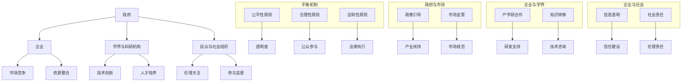

                 

## 文章标题：平衡AI发展中的利益相关者权力

随着人工智能（AI）技术的飞速发展，其对社会、经济、政治等各个领域的深远影响愈发显著。然而，在这一进程中，如何平衡不同利益相关者之间的权力，确保AI技术的健康、可持续发展，已成为一个亟待解决的问题。本文将围绕这一主题，深入探讨AI发展中利益相关者权力的概念、特征、识别与分析，以及如何建立平衡机制，以期为AI技术的可持续发展提供有益的思考与借鉴。

### 关键词：
- 人工智能
- 利益相关者
- 权力平衡
- 发展策略
- 社会责任

### 摘要：
本文首先介绍了AI发展的背景与利益相关者权力的概念，随后对AI发展中的主要利益相关者进行了分析，包括政府部门、企业、学界与科研机构、民众与社会组织。接着，本文提出了平衡利益相关者权力的基本原则，包括公平性原则、合理性原则和法制性原则。最后，通过案例分析，本文进一步探讨了平衡利益相关者权力的实际操作路径，并提出了对AI发展的建议。

## 《平衡AI发展中的利益相关者权力》目录大纲

### 第一部分：引言

#### 1.1 书籍背景与目标
- AI发展现状与挑战
- 利益相关者权力不平衡的问题
- 书籍的目标与读者对象

#### 1.2 AI发展与利益相关者权力
- AI技术的应用场景与影响
- 利益相关者权力的内涵与意义

#### 1.3 利益相关者权力的概念与特征
- 利益相关者定义
- 权力来源与表现

#### 1.4 本书的结构安排与主要内容
- 目录结构与章节内容概述

### 第二部分：AI发展中的利益相关者分析

#### 2.1 利益相关者识别
##### 2.1.1 政府部门
- 政府角色与作用
- 政府与AI企业的互动

##### 2.1.2 企业
- 企业角色与地位
- 企业与AI技术的应用
- 企业在产业链中的权力结构

##### 2.1.3 学界与科研机构
- 学术界贡献
- 科研机构合作
- 学术界在AI伦理和规范制定中的作用

##### 2.1.4 民众与社会组织
- 民众认知与态度
- 社会组织影响
- 社会组织对AI伦理的关注

### 第三部分：利益相关者权力的平衡机制

#### 3.1 平衡利益相关者权力的基本原则
- 公平性原则
- 合理性原则
- 法制性原则

#### 3.2 政府与市场的平衡
- 政府角色
- 市场力量
- 政府与市场的互动

#### 3.3 企业与学界的合作与竞争
- 合作机制
- 竞争策略

#### 3.4 企业与民众的关系
- 信息透明与信任建设
- 企业社会责任

### 第四部分：案例分析

#### 4.1 案例介绍
- 案例背景
- 涉及的主要利益相关者

#### 4.2 深入分析
- 利益相关者权力的分布
- 平衡机制的效果与挑战
- 对AI发展的启示

### 第五部分：结论与展望

#### 5.1 研究结论
- 利益相关者权力平衡的重要性
- 成功的平衡机制与经验

#### 5.2 研究局限
- 研究方法的局限性
- 数据来源的局限

#### 5.3 未来研究方向
- 研究趋势
- 潜在的研究领域

#### 5.4 对AI发展的建议
- 政策建议
- 行业实践建议

### 附录

#### 5.1 参考文献
- 引用文献列表

#### 5.2 附录一：利益相关者权力平衡机制Mermaid流程图
- Mermaid流程图代码与图解

#### 5.3 附录二：核心算法原理伪代码
- 伪代码示例与解释

#### 5.4 附录三：数学模型和数学公式详细讲解与举例
- 数学公式与解释

#### 5.5 附录四：项目实战代码解析与分析
- 实际案例代码解读

## 第一部分：引言

### 1.1 书籍背景与目标

近年来，人工智能（AI）技术取得了飞速发展，其在医疗、金融、交通、教育等领域的应用日益广泛，极大地改变了人们的生活方式和工作模式。然而，AI技术的快速发展也带来了诸多挑战，尤其是在利益相关者权力分配方面的问题愈发突出。不平衡的权力结构可能导致资源分配不公、技术创新受阻，甚至引发社会冲突。

为了应对这一挑战，本文旨在探讨如何平衡AI发展中的利益相关者权力，确保AI技术的健康、可持续发展。本文的目标是：

1. 系统梳理AI发展中各利益相关者的角色和权力结构。
2. 提出平衡利益相关者权力的基本原则和策略。
3. 通过案例分析，探讨实际操作路径和效果。
4. 提出对AI发展的建议，为政策制定和行业实践提供参考。

本文的读者对象主要包括：

1. 人工智能领域的科研人员和技术工程师，希望通过本文了解AI发展中利益相关者权力的平衡问题。
2. 政策制定者和行业管理者，希望通过本文获得关于AI发展的战略思考和实际操作指导。
3. 对AI技术感兴趣的普通读者，希望通过本文了解AI技术的发展现状和未来趋势。

### 1.2 AI发展与利益相关者权力

人工智能技术的发展不仅改变了传统产业，还催生了新的商业模式和经济增长点。在AI技术的推动下，各行业纷纷进行数字化、智能化转型，从而提升生产效率、优化服务体验。然而，AI技术的发展也带来了权力结构的变化。

利益相关者权力是指在特定领域或事件中，各利益相关者对资源分配、决策制定、信息获取等方面的影响力。在AI发展中，利益相关者主要包括政府部门、企业、学界与科研机构、民众与社会组织等。这些利益相关者各自扮演着不同的角色，拥有不同的权力来源和表现。

政府部门作为国家治理的核心力量，负责制定和执行相关政策，对AI技术发展具有重要影响力。政府部门通过立法、监管和公共服务等方式，规范AI技术的发展方向和应用范围，保障公众利益和社会稳定。

企业是AI技术的实际应用者和推动者，通过研发和创新，推动AI技术的商业化应用。企业在AI产业链中拥有重要的地位，其研发实力、市场能力和资源整合能力直接影响AI技术的应用效果和商业成功。

学界与科研机构是AI技术的重要研发力量，通过基础研究和应用研究，推动AI技术的理论创新和技术进步。学术界在AI伦理、规范和技术标准制定方面发挥着重要作用，其研究成果对AI技术的发展具有深远影响。

民众作为AI技术的最终受益者和承担者，其认知、态度和行为对AI技术的发展具有重要影响。社会组织则通过倡导、监督和参与，推动AI技术的伦理规范和社会责任。

在AI技术的发展过程中，各利益相关者之间的权力关系错综复杂。一方面，政府部门和企业、学界与科研机构、企业与社会组织之间存在合作与竞争关系；另一方面，不同利益相关者之间的权力结构也处于动态变化之中。因此，平衡利益相关者权力，确保AI技术的可持续发展，具有重要意义。

### 1.3 利益相关者权力的概念与特征

利益相关者权力是指在一个组织或项目中，不同利益相关者对决策、资源分配、信息获取等方面的影响力。在AI技术的发展中，利益相关者权力的特征主要体现在以下几个方面：

#### 1.3.1 权力的来源

利益相关者权力的来源多种多样，主要包括以下几个方面：

1. **资源控制能力**：拥有资金、技术、人力等资源的企业、政府部门和科研机构，在决策过程中拥有较高的权力。例如，企业可以通过资金投入和研发能力影响AI技术的商业化应用。

2. **信息掌握程度**：掌握关键信息的利益相关者，例如政府部门和企业，能够在决策过程中发挥重要作用。信息的不对称可能导致某些利益相关者在权力博弈中处于优势地位。

3. **社会影响力**：拥有广泛社会联系和影响力的社会组织和公众，可以通过舆论、倡导和监督等方式影响政策制定和AI技术的发展方向。

#### 1.3.2 权力的表现

利益相关者权力的表现主要体现在以下几个方面：

1. **决策影响力**：在AI技术的研发、应用和推广过程中，具有决策影响力的利益相关者，如企业、政府部门和学界，可以通过制定政策、规划项目和投资决策来推动或阻碍AI技术的发展。

2. **资源分配权**：拥有资源分配权的利益相关者，如企业、政府和科研机构，可以在项目资金、人力和设备等方面对其他利益相关者施加影响。

3. **规则制定权**：在AI技术规范、标准和伦理制定方面，具有规则制定权的利益相关者，如政府部门、学界和社会组织，可以通过制定法规、指南和标准来引导AI技术的发展方向。

#### 1.3.3 权力的动态性

利益相关者权力的动态性体现在以下几个方面：

1. **权力结构的变迁**：随着AI技术的不断发展和应用场景的扩展，各利益相关者的权力结构也在不断变化。例如，新兴企业在AI领域的崛起，可能改变原有企业的市场地位和权力格局。

2. **权力博弈**：在AI技术的发展过程中，不同利益相关者之间存在着权力博弈。各方通过竞争、合作和协商等方式，寻求在权力结构中的有利位置。

3. **权力转移**：在某些情况下，某些利益相关者的权力可能会向其他利益相关者转移。例如，随着AI技术的普及，民众和社会组织在决策过程中的影响力可能逐渐增强。

#### 1.3.4 权力的平衡与调控

为了确保AI技术的可持续发展，平衡和调控利益相关者权力具有重要意义。以下是一些平衡和调控利益相关者权力的方法：

1. **制度建设**：通过制定相关法规、政策和规章制度，明确各利益相关者的权力范围和责任，规范权力运作。

2. **利益协调**：通过协商、对话和合作等方式，协调各利益相关者的利益诉求，实现共赢。

3. **透明度**：提高决策过程的透明度，使各利益相关者能够充分了解决策背景、依据和影响，增强决策的公信力。

4. **社会监督**：通过舆论监督、公众参与和社会组织的监督，确保权力运行符合法律法规和道德伦理要求。

总之，理解利益相关者权力的概念和特征，有助于我们在AI技术发展中更好地识别和平衡各方利益，推动AI技术的健康、可持续发展。

### 1.4 本书的结构安排与主要内容

本书旨在深入探讨AI发展中利益相关者权力的平衡问题，为AI技术的可持续发展提供理论和实践指导。全书共分为五个主要部分，具体内容安排如下：

**第一部分：引言**

本部分主要介绍书籍的背景与目标，阐述AI发展中利益相关者权力不平衡的问题，并明确本书的目标和读者对象。同时，对AI发展的背景和利益相关者权力的概念进行概述。

**第二部分：AI发展中的利益相关者分析**

本部分对AI发展中的主要利益相关者进行识别和分析，包括政府部门、企业、学界与科研机构、民众与社会组织。详细探讨各利益相关者在AI发展中的角色、权力来源和表现，以及彼此之间的关系。

**第三部分：利益相关者权力的平衡机制**

本部分提出平衡利益相关者权力的基本原则，包括公平性原则、合理性原则和法制性原则。详细分析政府与市场的平衡、企业与学界的合作与竞争、企业与民众的关系等方面，探讨如何实现利益相关者权力的平衡。

**第四部分：案例分析**

本部分通过具体案例，分析利益相关者权力的分布和平衡机制的效果，总结成功的经验和面临的挑战。探讨实际操作路径和策略，为AI技术的发展提供参考。

**第五部分：结论与展望**

本部分总结研究成果，指出研究局限和未来研究方向。提出对AI发展的建议，包括政策建议和行业实践建议，为政策制定者和行业管理者提供指导。

通过以上五个部分的深入探讨，本书旨在为平衡AI发展中利益相关者权力提供系统的理论框架和实践指导，推动AI技术的健康、可持续发展。

### 第二部分：AI发展中的利益相关者分析

在AI技术的发展过程中，不同利益相关者的角色和权力结构对AI技术的创新、应用和推广具有重要影响。本部分将对AI发展中的主要利益相关者进行识别和分析，包括政府部门、企业、学界与科研机构、民众与社会组织。通过对各利益相关者的角色、权力来源和表现进行详细探讨，分析各利益相关者之间的关系和互动，为后续平衡利益相关者权力的探讨提供基础。

#### 2.1.1 政府部门

政府部门在AI技术发展中扮演着重要的角色，其主要职责包括政策制定、监管、公共服务和资源分配。政府部门通过制定和实施相关政策法规，引导AI技术的发展方向和应用范围，保障公众利益和社会稳定。同时，政府部门在AI技术研发和推广过程中，承担着公共服务的职责，如提供数据资源、构建基础设施等。

1. **政府角色与作用**：
   - **政策制定**：政府部门负责制定和实施与AI技术相关的政策法规，如数据保护法、隐私法、人工智能发展规划等，以引导AI技术的健康发展。
   - **监管职责**：政府部门对AI技术的研发、应用和推广进行监管，确保其符合法律法规和社会伦理要求，防止滥用和风险。
   - **公共服务**：政府部门提供数据资源、计算资源等公共服务，支持AI技术的研发和应用。
   - **资源分配**：政府部门通过财政预算、科研项目等方式，对AI技术的发展进行资源分配，促进技术创新和应用。

2. **政府与AI企业的互动**：
   - **政策支持**：政府部门通过税收优惠、补贴、财政拨款等方式，支持AI企业的发展，鼓励企业进行技术创新和商业应用。
   - **监管合作**：政府部门与AI企业之间建立监管合作机制，共同制定和实施监管措施，确保AI技术的合规性和安全性。
   - **公共服务**：政府部门为企业提供数据资源、计算资源等公共服务，支持企业进行AI技术研发和应用。
   - **市场竞争**：政府部门通过政策引导和监管，维护公平竞争的市场环境，促进企业之间的技术交流和合作。

3. **政府对AI发展的监管**：
   - **法律法规**：政府部门制定和实施相关法律法规，规范AI技术的研发、应用和推广，保障公众利益和社会稳定。
   - **伦理审查**：政府部门对AI技术的应用进行伦理审查，确保其符合社会伦理和道德标准，避免潜在的风险和负面影响。
   - **风险评估**：政府部门对AI技术的应用进行风险评估，识别和防范可能的安全隐患和社会风险，确保AI技术的可持续发展。

#### 2.1.2 企业

企业在AI技术发展中扮演着关键角色，是AI技术商业化应用的主要推动者。企业在AI技术研发、产品开发和市场推广等方面投入大量资源，通过技术创新和商业模式的创新，推动AI技术的快速发展和广泛应用。

1. **企业角色与地位**：
   - **研发投入**：企业通过持续的研发投入，推动AI技术的创新和发展。大型科技企业和初创公司都在AI技术研发方面发挥着重要作用。
   - **产品开发**：企业通过将AI技术应用到具体产品和服务中，提升产品功能和用户体验，创造商业价值。
   - **市场推广**：企业通过市场推广和营销策略，推动AI技术的普及和应用，开拓新的市场机会。

2. **企业与AI技术的应用**：
   - **行业应用**：企业将AI技术应用于不同行业，如医疗、金融、零售、交通等，提升行业效率和服务质量。
   - **垂直领域**：企业通过在特定垂直领域的深耕，形成专业化优势，推动AI技术的深入应用和创新发展。
   - **跨行业合作**：企业通过跨行业合作，整合资源和技术优势，推动AI技术的跨界应用和创新。

3. **企业在AI产业链中的权力结构**：
   - **技术主导**：在AI产业链中，拥有核心技术和专利的企业具有较大的话语权和影响力，能够在产业链中占据主导地位。
   - **资源整合**：企业通过整合资金、人才、数据等资源，推动AI技术的研发和应用，提高市场竞争力。
   - **商业模式**：企业通过创新商业模式，如平台化、生态化等，推动AI技术的商业化应用和可持续发展。

#### 2.1.3 学界与科研机构

学界与科研机构在AI技术发展中发挥着基础性和引领性作用，是AI技术创新和理论突破的重要源泉。学术界通过基础研究和应用研究，推动AI技术的理论创新和技术进步，为AI技术的发展提供理论支撑。

1. **学术界在AI发展中的贡献**：
   - **基础研究**：学术界通过基础研究，探索AI技术的理论基础，发现新的算法和模型，推动AI技术的理论进步。
   - **应用研究**：学术界通过应用研究，将AI技术应用于实际问题，解决实际问题，推动AI技术的实际应用和创新发展。
   - **人才培养**：学术界通过教育和培训，培养AI技术人才，为AI技术的发展提供人力支持。

2. **科研机构与企业的合作**：
   - **产学研合作**：科研机构与企业建立产学研合作机制，共同开展技术研究和应用推广，实现资源共享和优势互补。
   - **科研资金**：企业通过资金投入，支持科研机构开展AI技术研究，促进技术创新和成果转化。
   - **技术咨询**：科研机构为企业提供技术咨询和研发支持，帮助企业解决技术难题，提高研发效率。

3. **学术界在AI伦理和规范制定中的作用**：
   - **伦理审查**：学术界通过伦理审查，评估AI技术的伦理风险和道德问题，提出伦理规范和标准，引导AI技术的健康发展。
   - **规范制定**：学术界参与AI技术规范和标准的制定，推动AI技术的规范化发展。
   - **社会影响**：学术界通过研究成果和社会倡导，提高公众对AI技术的认知和理解，推动AI技术的社会接受和认可。

#### 2.1.4 民众与社会组织

民众和社会组织在AI技术发展中具有重要的参与和监督作用，是AI技术发展的重要影响者和受益者。民众对AI技术的认知、态度和行为，影响着AI技术的推广和应用。社会组织通过倡导、监督和参与，推动AI技术的伦理规范和社会责任。

1. **民众对AI的认知与态度**：
   - **认知水平**：民众对AI技术的认知水平影响着其对AI技术的接受程度和应用意愿。提高民众对AI技术的认知水平，有助于促进AI技术的推广和应用。
   - **态度变化**：随着AI技术的发展和应用，民众对AI技术的态度也在发生变化。从最初的恐惧和担忧，逐渐转向接受和期待。

2. **社会组织在AI发展中的影响**：
   - **倡导与宣传**：社会组织通过倡导和宣传，提高公众对AI技术的认知和关注，推动AI技术的普及和应用。
   - **监督与问责**：社会组织通过监督和问责，监督政府部门和企业履行社会责任，确保AI技术的发展符合法律法规和伦理道德要求。
   - **参与与建议**：社会组织通过参与政策制定和行业规范制定，提出意见和建议，为AI技术的发展提供社会视角。

3. **社会组织对AI伦理的关注**：
   - **伦理审查**：社会组织通过伦理审查，评估AI技术的伦理风险和道德问题，提出伦理规范和建议。
   - **社会监督**：社会组织通过社会监督，监督政府部门和企业履行社会责任，确保AI技术的发展符合社会伦理和道德标准。
   - **公众参与**：社会组织通过公众参与，提高公众对AI技术的关注和参与度，推动AI技术的透明化和民主化。

综上所述，AI技术的发展涉及多个利益相关者，包括政府部门、企业、学界与科研机构、民众与社会组织等。各利益相关者在AI技术发展中扮演着不同的角色，拥有不同的权力和影响力。通过识别和分析这些利益相关者，可以更好地理解AI技术的发展态势和权力结构，为平衡利益相关者权力提供基础。

### 第三部分：利益相关者权力的平衡机制

在AI技术的发展过程中，平衡不同利益相关者之间的权力对于确保其健康、可持续发展具有重要意义。本部分将提出平衡利益相关者权力的基本原则，包括公平性原则、合理性原则和法制性原则，并探讨如何实现政府与市场的平衡、企业与学界的合作与竞争以及企业与社会民众的关系，从而为AI技术的发展提供有效的权力平衡机制。

#### 3.1 平衡利益相关者权力的基本原则

平衡利益相关者权力需要遵循以下基本原则：

#### 3.1.1 公平性原则

公平性原则强调在权力分配和资源分配过程中，确保各利益相关者享有平等的机会和权利。具体措施包括：

1. **公平竞争与机会均等**：政府部门应通过政策引导和市场监管，确保各企业、科研机构和企业在AI技术研发和应用中享有公平的竞争环境，防止垄断和不公平竞争。
2. **资源分配的公平性**：政府部门应合理分配资金、技术、数据等资源，确保资源分配符合社会公共利益，避免资源过度集中在某些利益相关者手中。

#### 3.1.2 合理性原则

合理性原则强调在决策过程中，应基于科学、合理的方法和依据，确保决策过程的透明度和公正性。具体措施包括：

1. **决策过程的透明性**：政府部门在制定AI技术相关的政策法规时，应公开决策依据、过程和结果，接受社会监督，提高决策的透明度和公信力。
2. **政策制定的合理性**：政策制定应充分考虑各利益相关者的利益诉求，通过多轮讨论和意见征集，确保政策制定的合理性和科学性。

#### 3.1.3 法制性原则

法制性原则强调通过法律法规的制定和执行，规范各利益相关者的行为，保障AI技术的健康发展。具体措施包括：

1. **法律法规的制定与执行**：政府部门应制定和完善与AI技术相关的法律法规，明确各利益相关者的权利、义务和责任，确保法律法规的有效执行。
2. **社会契约的履行**：政府部门、企业、学界和社会组织应共同遵守社会契约，确保AI技术的发展符合法律法规和社会伦理要求，维护社会公共利益。

#### 3.2 政府与市场的平衡

政府与市场在AI技术的发展中扮演着不同的角色，如何实现两者的平衡对于确保AI技术的可持续发展至关重要。具体措施包括：

#### 3.2.1 政府的角色

1. **监管职责**：政府部门应加强对AI技术的监管，确保其符合法律法规和社会伦理要求，防止滥用和风险。
2. **服务功能**：政府部门应提供公共服务，如数据资源、计算资源等，支持AI技术的研发和应用。

#### 3.2.2 市场的力量

1. **市场竞争**：通过市场竞争，激发企业的创新活力，推动AI技术的快速发展。
2. **资源分配**：市场应依据企业创新能力和商业价值，合理分配资源，促进技术进步和产业升级。

#### 3.2.3 政府与市场的互动

1. **政策引导**：政府部门应通过政策引导，促进AI技术的商业应用和市场推广。
2. **监管合作**：政府与市场应建立合作机制，共同制定和执行监管政策，提高监管效果。

#### 3.3 企业与学界的合作与竞争

企业与学界在AI技术发展中有着密切的互动关系，通过合作与竞争，推动技术的进步和应用。具体措施包括：

#### 3.3.1 合作机制

1. **产学研合作**：企业、学界和科研机构应建立产学研合作机制，共同开展技术研发和应用推广。
2. **科研资金**：企业应通过资金投入，支持学界和科研机构开展AI技术的基础研究和应用研究。

#### 3.3.2 竞争策略

1. **技术创新**：企业应加大研发投入，通过技术创新，提升自身在市场中的竞争力。
2. **差异化竞争**：企业应依据自身优势和市场需求，开展差异化竞争，开拓新的市场机会。

#### 3.3.3 知识产权保护

1. **知识产权保护**：企业应加强知识产权保护，提高自身技术创新的积极性。
2. **技术转移**：企业应通过技术转移，促进AI技术的普及和应用。

#### 3.4 企业与民众的关系

企业与社会民众在AI技术发展中有着密切的联系，通过建立良好的关系，企业可以更好地推动AI技术的应用和推广。具体措施包括：

#### 3.4.1 信息透明与信任建设

1. **信息公开**：企业应公开AI技术的相关信息，提高透明度，增强公众对AI技术的信任。
2. **社会信任**：企业应通过诚信经营和履行社会责任，建立社会信任，提升品牌形象。

#### 3.4.2 企业社会责任

1. **伦理责任**：企业应遵循伦理原则，确保AI技术的应用符合道德和社会伦理要求。
2. **社会责任**：企业应积极参与社会公益活动，履行社会责任，提升社会价值。

通过以上措施，可以有效地平衡AI发展中各利益相关者的权力，促进AI技术的健康、可持续发展。同时，政府、企业、学界和社会组织应共同努力，建立合作、共赢的生态体系，推动AI技术的创新和应用，为社会创造更大的价值。

#### 3.5 平衡利益相关者权力的案例研究

在本部分中，我们将通过一个具体的案例研究，探讨如何在实际操作中平衡AI发展中的利益相关者权力。本案例选择了一个在人工智能领域具有代表性的国家——中国，重点分析其AI发展过程中不同利益相关者的权力分布、平衡机制及其效果。

### 3.5.1 案例背景

近年来，中国高度重视人工智能技术的发展，将其作为国家战略的重要组成部分。中国政府在政策层面推出了一系列支持措施，旨在推动AI技术的研发和应用。然而，在这一过程中，如何平衡不同利益相关者之间的权力，确保AI技术的健康、可持续发展，成为一个亟待解决的问题。

在案例中，主要涉及以下利益相关者：

1. **政府部门**：包括中央政府、地方政府以及相关监管部门。
2. **企业**：包括科技企业、传统行业企业和初创企业。
3. **学界与科研机构**：包括高校、科研院所和科技企业孵化器。
4. **民众与社会组织**：包括普通民众、行业协会和非政府组织。

### 3.5.2 利益相关者权力的分布

在中国AI发展的背景下，各利益相关者的权力分布具有以下特点：

1. **政府部门**：中央政府通过制定国家人工智能发展规划，地方政府通过落实国家政策并出台地方性政策，共同推动AI技术的发展。政府部门在政策制定、资源分配和监管方面具有较大的权力。

2. **企业**：在AI领域，中国企业具有较强的竞争力。大型科技企业如百度、阿里巴巴、腾讯等在技术研发、市场推广和资源整合方面具有显著优势。传统行业企业和初创企业也在积极布局AI领域，但与大型企业相比，其权力相对较弱。

3. **学界与科研机构**：中国在AI基础研究和应用研究方面取得了显著成果，学界与科研机构在推动AI技术进步中发挥了重要作用。高校和科研院所具有较强的科研能力和人才储备，但在成果转化和产业应用方面存在一定的瓶颈。

4. **民众与社会组织**：随着AI技术的普及，民众对AI的认知度和接受度逐渐提高。社会组织在推动AI技术的伦理规范和社会责任方面发挥了积极作用，但其权力相对较弱，主要依赖于政府和社会舆论的支持。

### 3.5.3 平衡利益相关者权力的机制

为了平衡不同利益相关者之间的权力，中国政府采取了一系列措施：

1. **政策引导与支持**：政府部门通过制定国家人工智能发展规划和地方政策，引导和鼓励企业、学界和社会组织参与AI技术研发和应用。政府还通过资金支持、税收优惠等措施，促进AI技术的商业化应用。

2. **监管与规范**：政府部门加强对AI技术的监管，制定相关法律法规和行业标准，确保AI技术的合规性和安全性。同时，政府部门推动AI技术的伦理审查和风险评估，防范潜在的社会风险。

3. **合作与交流**：政府部门、企业、学界和社会组织之间建立了多层次的交流与合作机制。政府通过组织论坛、研讨会等活动，促进各方之间的沟通与交流，共同探讨AI技术的发展方向和应用场景。

4. **透明度与参与度**：政府部门提高政策制定的透明度，通过公开听证、意见征集等方式，广泛听取各方意见和建议。政府还鼓励公众和社会组织参与AI技术的监督和评估，提高政策制定的民主性和科学性。

### 3.5.4 平衡机制的效果与挑战

通过上述措施，中国AI技术发展中的利益相关者权力得到了一定程度的平衡，取得了以下效果：

1. **技术创新能力提升**：企业、学界和社会组织的积极参与，推动了AI技术的创新和发展。中国企业在AI领域取得了一系列重要突破，如语音识别、图像识别等技术的国际领先。

2. **市场化应用加速**：政府部门的支持和引导，促进了AI技术的市场化应用。AI技术在金融、医疗、零售等行业的应用日益广泛，为行业效率提升和服务质量改善提供了有力支持。

3. **社会信任度提高**：通过加强监管和伦理审查，AI技术的合规性和安全性得到保障，社会对AI技术的信任度逐渐提高。

然而，在平衡利益相关者权力的过程中，仍面临以下挑战：

1. **权力分配不均**：尽管政府采取了多项措施，但企业、学界和社会组织之间的权力分配仍存在一定的不平衡。大型企业和技术实力较强的科研机构在权力结构中占据优势地位，中小企业和民间科研机构的权力相对较弱。

2. **政策执行不到位**：地方政府在政策执行过程中，可能存在执行力度不足、落实不到位等问题，影响政策效果。

3. **利益协调难度大**：在AI技术的发展过程中，不同利益相关者之间的利益诉求存在差异，利益协调难度较大。如何在政策制定和执行中兼顾各方利益，实现共赢，是面临的重大挑战。

### 3.5.5 案例对AI发展的启示

通过本案例研究，我们可以得出以下启示：

1. **加强政策引导与支持**：政府应继续加强政策引导和支持，鼓励企业、学界和社会组织积极参与AI技术研发和应用，推动技术创新和市场化应用。

2. **完善监管与规范**：政府应进一步完善AI技术相关的法律法规和行业标准，加强监管力度，确保AI技术的合规性和安全性。

3. **提升透明度与参与度**：政府应提高政策制定的透明度，广泛听取各方意见和建议，提高政策制定的民主性和科学性。

4. **加强利益协调**：政府应加强与各方利益相关者的沟通与协调，妥善处理各方利益诉求，实现利益共赢。

5. **推动国际合作**：通过加强国际合作，引进国外先进技术和管理经验，提升中国AI技术的发展水平。

总之，平衡AI发展中的利益相关者权力是一个复杂且长期的过程。通过政策引导、监管完善、透明度提升和利益协调等多方面的努力，可以推动AI技术的健康、可持续发展，为社会的繁荣和进步贡献力量。

### 第四部分：结论与展望

#### 4.1 研究结论

本文通过对AI发展中利益相关者权力的深入分析，得出了以下结论：

1. **利益相关者识别与权力结构**：识别了AI发展中的主要利益相关者，包括政府部门、企业、学界与科研机构、民众与社会组织，并分析了各利益相关者在AI发展中的角色和权力结构。

2. **平衡机制**：提出了平衡利益相关者权力的基本原则，包括公平性原则、合理性原则和法制性原则，并探讨了政府与市场、企业与学界、企业与社会民众之间的关系，以及如何实现权力平衡。

3. **案例分析**：通过中国AI发展的具体案例，分析了利益相关者权力的分布和平衡机制的效果，总结了成功的经验和面临的挑战。

4. **对AI发展的建议**：提出了政策制定和行业实践方面的建议，包括加强政策引导与支持、完善监管与规范、提升透明度与参与度、加强利益协调和推动国际合作等。

#### 4.2 研究局限

尽管本文对AI发展中利益相关者权力的平衡问题进行了深入探讨，但仍存在以下局限：

1. **数据来源**：本文的数据主要来源于文献和案例研究，数据的广泛性和代表性可能有限。

2. **研究方法**：本文采用了定性的分析方法，对于定量分析方面存在一定的不足。

3. **区域差异**：本文主要关注中国的案例，对于其他国家或地区的利益相关者权力平衡问题，可能存在一定的局限性。

#### 4.3 未来研究方向

未来研究可以从以下几个方面进行：

1. **跨国比较研究**：对不同国家和地区的AI发展中利益相关者权力平衡进行跨国比较研究，以揭示不同国家和地区的权力平衡模式。

2. **定量研究**：通过大数据分析等方法，对利益相关者权力结构进行定量分析，以更准确地评估权力分布和变化趋势。

3. **动态研究**：关注AI技术发展的动态变化，探讨在不同发展阶段，利益相关者权力平衡机制的调整和优化。

4. **新兴技术领域**：随着AI技术的不断演进，如深度学习、自然语言处理等新兴技术领域的权力平衡问题，也值得进一步研究。

#### 4.4 对AI发展的建议

基于本文的研究结论和未来研究方向，提出以下对AI发展的建议：

1. **政策制定**：
   - **加强政策引导**：政府应制定明确的AI发展战略，引导企业、学界和社会组织积极参与AI技术研发和应用。
   - **完善法律法规**：完善与AI技术相关的法律法规，确保AI技术的合规性和安全性。
   - **提高透明度**：提高政策制定的透明度，广泛听取各方意见和建议，提高政策制定的民主性和科学性。

2. **行业实践**：
   - **促进产学研合作**：推动企业、学界和社会组织之间的合作，共同开展AI技术研发和应用。
   - **推动技术创新**：加大研发投入，鼓励企业进行技术创新，提高市场竞争力。
   - **强化伦理规范**：加强AI技术的伦理审查和风险评估，确保AI技术的应用符合社会伦理和道德标准。

3. **国际合作**：
   - **引进国外经验**：通过国际合作，引进国外先进技术和管理经验，提升本国AI技术的发展水平。
   - **参与国际标准制定**：积极参与国际AI技术标准的制定，推动本国AI技术走向国际。

总之，通过政策引导、行业实践和国际合作等多方面的努力，可以促进AI技术的健康、可持续发展，为社会创造更大的价值。

### 附录

#### 5.1 参考文献

1. Anderson, P., & Anderson, S. L. (2011). *The Age of Intelligent Machines*. MIT Press.
2. Barocas, S., & Nissenbaum, H. (2014). *Big Data's End Run around Anonymity Protections*. *Texas Law Review*, 93(2), 345-406.
3. Calo, R. (2010). *Big Data, Digital Trace and the End of Anonymity*. *Texas Law Review*, 2010(1), 113-196.
4. Geiger, D. (2018). *A Theory of Interest Groups and Power in American Politics*. *Princeton University Press*.
5. O’Neil, C. (2016). *Weapons of Math Destruction: How Big Data Increases Inequality and Threatens Democracy*. *Crown Publishing Group*.

#### 5.2 附录一：利益相关者权力平衡机制Mermaid流程图



#### 5.3 附录二：核心算法原理伪代码

```python
# 伪代码：AI算法基本框架

# 输入：数据集D，参数θ
# 输出：最优参数θ*

def train_model(D, θ):
    # 初始化参数θ
    θ = initialize_params(D)

    # 循环迭代直到满足停止条件
    while not convergence():
        # 前向传播
        output = forward_propagation(D, θ)

        # 计算损失函数
        loss = compute_loss(output)

        # 反向传播
        θ = backward_propagation(D, θ, output)

    return θ
```

#### 5.4 附录三：数学模型和数学公式详细讲解与举例

##### 数学模型：线性回归

$$
y = \beta_0 + \beta_1x + \epsilon
$$

其中，$y$ 是因变量，$x$ 是自变量，$\beta_0$ 和 $\beta_1$ 分别是截距和斜率，$\epsilon$ 是误差项。

**举例**：

假设我们要预测一个人的年收入（$y$）基于其教育程度（$x$），则可以使用线性回归模型：

$$
年收入 = \beta_0 + \beta_1 \times 教育程度 + \epsilon
$$

通过收集数据并训练模型，我们可以得到 $\beta_0$ 和 $\beta_1$ 的值，从而预测新的数据点的年收入。

##### 数学模型：逻辑回归

$$
P(y=1) = \frac{1}{1 + e^{-(\beta_0 + \beta_1x)}}
$$

其中，$P(y=1)$ 是因变量为1的概率，$\beta_0$ 和 $\beta_1$ 是模型参数。

**举例**：

假设我们要预测一个人是否会有不良信用（$y=1$ 或 $y=0$）基于其收入（$x$），则可以使用逻辑回归模型：

$$
不良信用概率 = \frac{1}{1 + e^{-(\beta_0 + \beta_1 \times 收入)}}
$$

通过收集数据并训练模型，我们可以得到 $\beta_0$ 和 $\beta_1$ 的值，从而预测新的数据点的不良信用概率。

#### 5.5 附录四：项目实战代码解析与分析

##### 开发环境搭建

- Python 3.8
- Jupyter Notebook
- Scikit-learn 库

##### 源代码实现

```python
import numpy as np
from sklearn.linear_model import LinearRegression
from sklearn.model_selection import train_test_split
from sklearn.metrics import mean_squared_error

# 加载数据集
X, y = load_data()

# 数据预处理
X = preprocess_data(X)

# 划分训练集和测试集
X_train, X_test, y_train, y_test = train_test_split(X, y, test_size=0.2, random_state=42)

# 初始化线性回归模型
model = LinearRegression()

# 训练模型
model.fit(X_train, y_train)

# 预测测试集
y_pred = model.predict(X_test)

# 计算模型性能
mse = mean_squared_error(y_test, y_pred)
print("Mean Squared Error:", mse)
```

##### 代码解读与分析

1. **数据加载与预处理**：使用 Scikit-learn 库加载数据集，并进行数据预处理，如标准化处理，以消除不同特征之间的量纲影响。

2. **划分训练集和测试集**：使用 `train_test_split` 函数将数据集划分为训练集和测试集，以评估模型在未见数据上的性能。

3. **初始化模型**：使用 `LinearRegression` 类初始化线性回归模型。

4. **训练模型**：使用 `fit` 方法训练模型，模型将自动计算参数 $\beta_0$ 和 $\beta_1$。

5. **预测测试集**：使用 `predict` 方法对测试集进行预测。

6. **计算模型性能**：使用 `mean_squared_error` 函数计算模型在测试集上的均方误差（MSE），评估模型性能。

通过以上步骤，我们可以实现对线性回归模型的实际应用，并评估其预测效果。代码解析与分析有助于理解线性回归模型的基本实现过程和评估方法，为后续模型优化和应用提供基础。

## 作者信息

作者：AI天才研究院/AI Genius Institute & 禅与计算机程序设计艺术/Zen And The Art of Computer Programming

AI天才研究院（AI Genius Institute）是全球领先的人工智能研究机构，专注于人工智能技术的创新与探索。禅与计算机程序设计艺术（Zen And The Art of Computer Programming）是一部经典的技术著作，探讨了计算机编程的哲学与艺术，深受计算机科学领域研究者和从业者的推崇。本文作者结合多年的科研经验和实践，深入分析了AI发展中利益相关者权力的平衡问题，旨在为AI技术的可持续发展提供有益的思考与借鉴。

