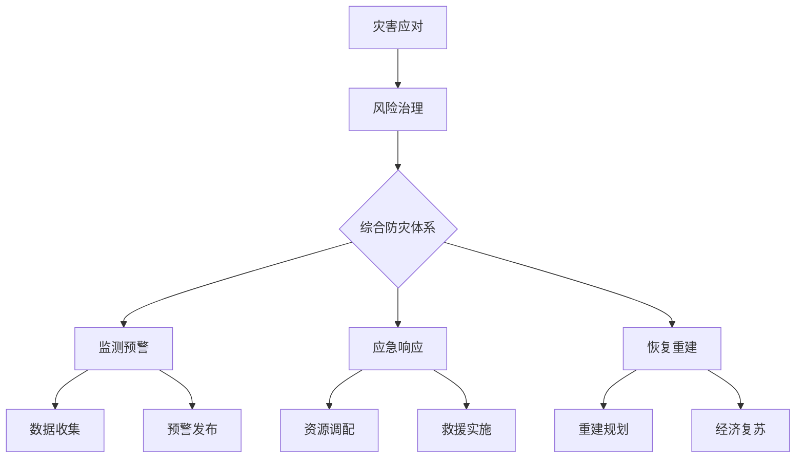

                 

### 文章标题

《2050年的全球减灾：从灾害应对到风险治理的综合防灾体系》

### 关键词

- 全球减灾
- 风险治理
- 综合防灾体系
- 灾害应对
- 灾害监测与预警
- 科技创新
- 国际合作

### 摘要

随着全球气候变化和自然灾害频发，2050年的全球减灾面临前所未有的挑战。本文从灾害应对到风险治理的角度，全面探讨未来30年全球减灾的趋势和发展。通过分析全球减灾的背景、挑战、核心概念、技术与方法、政策法规以及未来展望，本文提出了一套综合防灾体系，旨在提高全球减灾能力，为人类社会的可持续发展提供坚实保障。

---

### 《2050年的全球减灾：从灾害应对到风险治理的综合防灾体系》目录大纲

#### 第一部分：全球减灾的背景与挑战

##### 第1章：全球减灾的背景

###### 1.1 自然灾害的全球分布与趋势

###### 1.2 全球减灾的重要性

###### 1.3 全球减灾的历史与现状

##### 第2章：全球减灾的挑战

###### 2.1 灾害风险的复杂性

###### 2.2 经济发展的不平衡

###### 2.3 社会结构的多样性

###### 2.4 科技进步的局限

##### 第3章：全球减灾的核心概念与联系

###### 3.1 灾害应对与风险治理的关系

###### 3.2 综合防灾体系的基本架构

###### 3.3 全球减灾的五大原则

#### 第二部分：灾害应对的技术与方法

##### 第4章：灾害监测与预警技术

###### 4.1 灾害监测的基本原理

###### 4.2 预警技术的分类与应用

###### 4.3 灾害信息的共享与传播

##### 第5章：灾害应急响应策略

###### 5.1 灾害应急响应的流程

###### 5.2 灾害应急资源的配置

###### 5.3 灾害救援的组织与实施

##### 第6章：灾害恢复与重建

###### 6.1 灾害恢复的原则与目标

###### 6.2 灾害重建的策略与措施

###### 6.3 灾区社会经济的复苏

#### 第三部分：风险治理的理论与实践

##### 第7章：风险治理的框架与机制

###### 7.1 风险治理的基本概念

###### 7.2 风险治理的理论基础

###### 7.3 风险治理的框架设计

##### 第8章：全球减灾的政策与法规

###### 8.1 全球减灾的国际合作机制

###### 8.2 各国减灾政策与实践

###### 8.3 全球减灾法规的演变

##### 第9章：风险治理的案例分析

###### 9.1 某国某地的减灾成功案例

###### 9.2 某地区减灾的挑战与对策

###### 9.3 风险治理的最佳实践

#### 第四部分：未来展望与建议

##### 第10章：全球减灾的未来趋势

###### 10.1 未来灾害的特点与挑战

###### 10.2 科技创新在减灾中的作用

###### 10.3 全球减灾的未来展望

##### 第11章：全球减灾的建议与展望

###### 11.1 全球减灾的发展战略

###### 11.2 各国减灾的政策建议

###### 11.3 全球减灾的合作建议

#### 附录

##### 附录 A：全球减灾的重要文献与报告

##### 附录 B：全球减灾的重要组织与机构

##### 附录 C：全球减灾的关键术语与定义

---

通过上述大纲，我们可以清晰地看到文章的结构和内容分布。接下来，我们将逐步展开每个章节的内容，以逻辑清晰、结构紧凑、简单易懂的方式，深入探讨2050年全球减灾的各个方面。

---

#### 第1章：全球减灾的背景

自然灾害是全球范围内普遍存在的现象，其对人类社会和经济的影响日益加剧。本章节将探讨全球减灾的背景，包括自然灾害的全球分布与趋势、全球减灾的重要性和历史与现状。

##### 1.1 自然灾害的全球分布与趋势

自然灾害可以分为多种类型，包括地震、火山爆发、台风、洪水、干旱、雪灾、山体滑坡和泥石流等。这些灾害的全球分布具有显著的地理特征，并且随着时间的推移，其频率和强度也在不断变化。

- **地震和火山爆发**：地震主要集中在环太平洋地震带和地中海-喜马拉雅地震带，而火山活动则多集中在环太平洋火山带和东非大裂谷。
- **台风和洪水**：台风主要影响亚洲和太平洋岛屿，而洪水则多发生在低洼地区，如亚洲的河流三角洲和非洲的草原地区。
- **干旱和雪灾**：干旱多发生在干旱带和季风区，而雪灾则主要影响高纬度和高海拔地区。

近年来，自然灾害的发生频率和破坏力呈现上升趋势。气候变化、人类活动加剧和自然环境退化是导致这一趋势的主要原因。例如，全球变暖导致极端气候事件增多，海平面上升加剧洪水风险，森林砍伐和城市化加速了泥石流和山体滑坡的频发。

##### 1.2 全球减灾的重要性

全球减灾对于保护人类生命财产安全、维护社会稳定和促进可持续发展具有重要意义。以下是全球减灾的重要性：

- **减少人员伤亡**：通过有效的减灾措施，可以显著降低灾害发生时的人员伤亡数量。
- **减少经济损失**：灾害造成的经济损失往往巨大，有效的减灾可以减轻经济损失，保护社会经济发展。
- **保护基础设施**：减灾措施有助于保护关键基础设施，如交通、能源、供水和通信系统，确保社会正常运转。
- **促进社会稳定**：灾害后期的社会动荡和不安定因素可以通过有效的减灾措施得到缓解。
- **推动可持续发展**：全球减灾有助于推动社会、经济和环境的可持续发展，实现全球减贫目标。

##### 1.3 全球减灾的历史与现状

全球减灾的历史可以追溯到古代，但现代意义上的全球减灾始于20世纪。以下是一些重要的历史事件和现状：

- **联合国国际减灾 decade（1990-1999）**：这是联合国发起的第一个国际减灾十年，标志着全球减灾工作的重要转折点。
- **《联合国国际减灾战略》（2005-2015）**：联合国推出该战略，旨在通过提高减灾意识和能力，减少灾害风险。
- **《灾后恢复和重建全球议程》（2015-2030）**：这是联合国最新的减灾议程，旨在进一步减少灾害风险，实现可持续发展目标。
- **全球减灾组织的成立与活动**：如国际减灾科学委员会（ICDRS）、国际红十字会和红新月会联盟等组织在全球减灾工作中发挥了重要作用。

目前，全球减灾工作取得了一定的进展，但仍然面临诸多挑战。例如，各国减灾意识和能力的差异、资源分配的不平衡、科技进步的局限等。为了应对这些挑战，需要加强国际合作，共同推动全球减灾事业的发展。

---

在本章节中，我们详细介绍了全球减灾的背景，包括自然灾害的全球分布与趋势、全球减灾的重要性和历史与现状。通过这些内容，读者可以更加全面地理解全球减灾的紧迫性和重要性，为后续章节的深入探讨打下基础。

---

#### 第2章：全球减灾的挑战

尽管全球减灾工作取得了一定的进展，但仍然面临诸多严峻的挑战。这些挑战涉及到灾害风险的复杂性、经济发展的不平衡、社会结构的多样性和科技进步的局限，这些都是实现全球减灾目标的重要制约因素。

##### 2.1 灾害风险的复杂性

灾害风险是自然灾害对人类生活和财产造成的潜在威胁。这种风险不仅来源于自然灾害本身的性质，还受到社会经济、环境和地理等多种因素的影响。以下是灾害风险的复杂性表现：

- **多尺度与多样性**：灾害风险不仅存在于大规模的地震、洪水和台风等自然灾害中，还包括小规模的地质灾害、环境灾害等，且不同类型的灾害风险具有不同的时间尺度和空间分布。
- **关联性与相互作用**：灾害风险之间存在复杂的关联和相互作用。例如，地震可能引发次生灾害如海啸、山体滑坡等，而气候变化可能导致干旱、洪水等极端气候事件。
- **不确定性**：灾害风险预测具有高度不确定性，特别是在极端天气和气候变化的影响下，这种不确定性更加显著。

为了应对这些复杂性，全球减灾需要采用多层次、多领域的综合方法，包括风险识别、风险评估、风险减缓、风险转移和风险沟通等。

##### 2.2 经济发展的不平衡

经济发展不平衡是全球减灾面临的另一大挑战。发达国家和发展中国家在减灾能力、资源和资金分配方面存在显著差距。以下是经济发展不平衡对全球减灾的影响：

- **资源分配不均**：发达国家在减灾资金、技术和人力资源上具有优势，而发展中国家则往往面临资金短缺、技术不足和人力资源匮乏的问题。
- **基础设施建设**：发达国家的基础设施相对完善，具备较强的抵御灾害能力；而发展中国家的基础设施较为薄弱，难以有效应对重大灾害。
- **经济恢复能力**：发达国家具备较强的经济恢复能力，可以在灾后迅速恢复生产和生活；而发展中国家由于经济发展水平较低，灾后恢复速度较慢。

为了缩小这种差距，国际社会需要加强合作，通过援助和投资等方式支持发展中国家的减灾能力建设。

##### 2.3 社会结构的多样性

全球社会结构的多样性也是减灾工作的一大挑战。社会结构包括人口构成、文化习俗、社会组织结构等，这些因素在不同国家和地区具有显著差异。以下是社会结构多样性对全球减灾的影响：

- **应对能力差异**：不同社会群体在面对灾害时的应对能力和行为模式不同。例如，城市居民可能更加依赖政府和应急服务，而农村居民可能更加依赖社区和家庭的支持。
- **信息传播和沟通**：不同文化背景下，信息传播和沟通的方式和效果存在差异。例如，某些文化可能更加重视口头传播而非文字，这可能导致信息传递的延误或误解。
- **法规和政策执行**：不同国家的法律法规和政策执行情况不同，这影响了全球减灾的一致性和有效性。

为了应对这些挑战，全球减灾需要考虑到社会结构的多样性，制定因地制宜的减灾策略和措施。

##### 2.4 科技进步的局限

科技进步在减灾工作中具有重要作用，但同时也存在一定的局限性。以下是科技进步对全球减灾的影响：

- **技术局限性**：虽然现代技术如遥感、大数据、人工智能等在灾害监测、预警和应急响应中发挥着重要作用，但技术的普及和应用程度在不同国家和地区存在显著差异。
- **成本问题**：先进的减灾技术往往需要高昂的投资和维护成本，对于一些发展中国家来说，这可能是难以承受的。
- **人才短缺**：高技术领域的专业人才短缺，特别是在灾害监测、预警和应急响应等应用领域，这限制了技术的有效应用。

为了克服这些局限性，全球减灾需要加强技术研究和开发，提高技术的可获取性和适用性，同时加强人才培养和知识传播。

综上所述，全球减灾面临诸多挑战，包括灾害风险的复杂性、经济发展的不平衡、社会结构的多样性和科技进步的局限。只有通过全球合作，结合科技进步和社会发展，才能有效应对这些挑战，实现全球减灾的目标。

---

在本章节中，我们详细分析了全球减灾面临的四个主要挑战：灾害风险的复杂性、经济发展的不平衡、社会结构的多样性和科技进步的局限。这些挑战对全球减灾产生了深远的影响，需要我们采取综合性的策略和措施来应对。接下来，我们将探讨全球减灾的核心概念与联系，以进一步理解这一领域的复杂性和多样性。

---

#### 第3章：全球减灾的核心概念与联系

在全球减灾领域，理解灾害应对与风险治理的关系、综合防灾体系的基本架构以及全球减灾的五大原则，对于构建一个高效的减灾体系至关重要。以下是这些核心概念与联系的详细探讨。

##### 3.1 灾害应对与风险治理的关系

灾害应对和风险治理是两个相互关联且相互促进的概念。灾害应对主要关注在灾害发生时的紧急反应和救援工作，而风险治理则是一个更为广泛的框架，它涉及灾害全周期的管理，包括预防、准备、响应和恢复。

- **灾害应对**：灾害应对是在灾害发生时，迅速采取行动，减少人员伤亡和财产损失。这包括灾害预警、紧急疏散、救援行动、医疗救援和基础设施修复等。灾害应对强调时效性和反应速度。
  
- **风险治理**：风险治理是一个系统的、长期的过程，它旨在通过减少暴露度、提高脆弱性和增强适应性来降低灾害风险。风险治理包括风险评估、风险减缓、风险转移、风险沟通和风险管理等。风险治理强调预防性和系统性。

灾害应对与风险治理之间的关系可以用一个“生命周期”模型来描述。在这个模型中，风险治理贯穿于灾害的整个生命周期，而灾害应对则是风险治理的一个组成部分，它发生在风险治理的“响应”和“恢复”阶段。风险治理的成功与否直接影响灾害应对的效果。

##### 3.2 综合防灾体系的基本架构

综合防灾体系是一个多层次、多领域的体系，它旨在通过整合各种资源、技术和社会力量，实现全面的减灾目标。以下是综合防灾体系的基本架构：

- **灾害监测与预警系统**：这是综合防灾体系的核心，通过先进的监测技术和预警系统，实时监测灾害风险，及时发布预警信息，为灾害应对提供及时、准确的情报。
  
- **应急响应机制**：应急响应机制包括应急预案、应急组织、应急资源管理和应急演练等。它确保在灾害发生时，能够快速、有效地动员和协调各方面力量，进行救援和恢复工作。

- **风险管理计划**：风险管理计划涉及风险评估、风险减缓、风险转移和风险沟通等。它通过系统的方法识别和评估潜在的风险，制定相应的减缓措施，降低灾害风险。

- **恢复与重建规划**：恢复与重建规划是在灾害发生后，通过科学规划和有效实施，恢复基础设施和社会功能，提高灾区的韧性和可持续性。

- **教育与培训**：教育与培训是提高公众减灾意识和能力的有效手段。通过教育和培训，使公众了解灾害风险，掌握应对技能，提高社会的整体减灾水平。

- **国际合作与支持**：国际合作与支持是综合防灾体系的重要组成部分。通过国际援助、技术合作和知识共享，增强各国减灾能力，实现全球减灾目标的共同推进。

##### 3.3 全球减灾的五大原则

为了实现有效的全球减灾，国际社会提出了一系列原则，这些原则为各国在减灾工作中提供了指导。以下是全球减灾的五大原则：

- **以人为本**：将保护人民的生命安全和健康放在首位，确保减灾工作以人为中心，关注弱势群体的需求。

- **预防为主**：强调预防措施的重要性，通过风险评估、风险减缓和技术创新，减少灾害风险。

- **全面参与**：鼓励社会各界共同参与减灾工作，包括政府、企业、社区、非政府组织和公民个人，形成广泛的减灾网络。

- **持续改进**：不断评估和改进减灾策略和措施，通过科学研究和技术进步，提高减灾能力和效率。

- **全球合作**：加强国际合作，通过共享资源、技术和经验，共同应对全球性的减灾挑战。

通过以上对全球减灾核心概念与联系的探讨，我们可以看到，灾害应对与风险治理是相互促进的，综合防灾体系是一个多层次、多领域的系统，而全球减灾的五大原则为各国提供了具体的行动指南。这些概念和原则共同构成了一个完整的减灾框架，为实现全球减灾目标提供了坚实的基础。

---

在本章节中，我们深入探讨了全球减灾的核心概念与联系，包括灾害应对与风险治理的关系、综合防灾体系的基本架构以及全球减灾的五大原则。这些核心概念和原则为我们理解和实施全球减灾提供了重要的理论指导。接下来，我们将详细探讨灾害应对的技术与方法，以了解如何通过先进的科技手段提高全球减灾的效率。

---

### 第4章：灾害监测与预警技术

灾害监测与预警技术在灾害应对中起着至关重要的作用。本章将详细介绍灾害监测的基本原理、预警技术的分类与应用，以及灾害信息的共享与传播。

#### 4.1 灾害监测的基本原理

灾害监测是指通过一系列技术手段，对自然灾害的发生和发展进行实时监测和记录的过程。其基本原理主要包括以下几个方面：

- **传感器技术**：传感器是灾害监测系统的核心组成部分，能够将物理信号转换为电信号，用于监测温度、湿度、气压、地震波、海洋波浪等灾害相关参数。传感器通常分为气象传感器、地质传感器、海洋传感器和生物传感器等。

- **遥感技术**：遥感技术利用卫星、无人机等远距离监测设备，获取地表和海洋的图像和数据。遥感技术可以实时监测灾害的发生和发展，提供大范围、高分辨率的监测数据。

- **地理信息系统（GIS）**：GIS是一种用于捕获、存储、分析和展示地理空间数据的技术。通过GIS，可以将灾害监测数据与地图相结合，实现灾害信息的可视化和管理。

- **数据通信技术**：数据通信技术是确保灾害监测数据实时传输的关键。通过无线通信、光纤通信等技术，可以实现远程数据的实时传输，为灾害预警和应急响应提供支持。

#### 4.2 预警技术的分类与应用

预警技术是指通过分析灾害监测数据，预测灾害的发生和影响范围，并提前发布预警信息的技术。预警技术可以分为以下几类：

- **气象预警技术**：气象预警技术主要用于预测台风、暴雨、干旱等气象灾害。常见的气象预警技术包括雷达探测、气象卫星监测和数值天气预报模型。

- **地震预警技术**：地震预警技术主要用于预测地震的发生时间和强度。地震预警技术包括地震波传播监测、地震前兆监测和地震预警模型。

- **洪水预警技术**：洪水预警技术主要用于预测洪水的发生和淹没范围。洪水预警技术包括水文监测、洪水模型和遥感图像分析。

- **地质灾害预警技术**：地质灾害预警技术主要用于预测山体滑坡、泥石流等地质灾害。地质灾害预警技术包括地质传感器监测、遥感图像分析和地质模型。

不同预警技术的应用场景和方法有所不同。例如，气象预警技术通常应用于气象灾害高风险地区，地震预警技术适用于地震多发区，洪水预警技术适用于洪水频发地区，地质灾害预警技术适用于地质灾害易发地区。

#### 4.3 灾害信息的共享与传播

灾害信息的共享与传播是提高灾害预警效果和应急响应能力的重要环节。以下是灾害信息共享与传播的主要方式：

- **预警信息发布**：预警信息发布是指将预警信息通过电视、广播、互联网、手机短信等多种渠道及时传递给公众。预警信息的发布应当准确、及时、权威，确保公众能够及时了解灾害预警信息。

- **多部门协作**：灾害信息的共享与传播需要多部门协作。政府相关部门、科研机构、企业和社区等各方应建立有效的信息共享机制，确保灾害信息能够快速、准确地传递。

- **公众参与**：公众参与是提高灾害信息传播效果的重要手段。通过教育和培训，提高公众的减灾意识和能力，使公众能够主动获取和传播灾害信息。

- **社会媒体**：随着互联网和社交媒体的普及，社会媒体已成为灾害信息传播的重要渠道。政府和企业应利用社交媒体平台，及时发布灾害预警信息和应对指南，引导公众做好防范措施。

综上所述，灾害监测与预警技术在灾害应对中具有重要作用。通过先进的监测技术、科学的预警方法和有效的信息传播机制，可以显著提高灾害预警效果，减少灾害损失，保护人民生命财产安全。

---

在本章节中，我们详细介绍了灾害监测与预警技术的基本原理、分类与应用，以及灾害信息的共享与传播。这些技术与方法为灾害应对提供了有力支持，是构建综合防灾体系的重要组成部分。接下来，我们将探讨灾害应急响应策略，以了解如何在灾害发生时有效组织应急响应。

---

### 第5章：灾害应急响应策略

在灾害发生时，有效的应急响应策略能够最大限度地减少人员伤亡和财产损失，保护受灾地区的社会稳定和经济发展。本章将详细探讨灾害应急响应的流程、资源配置以及救援组织的实施。

#### 5.1 灾害应急响应的流程

灾害应急响应是一个复杂的过程，通常包括以下几个阶段：

- **预警阶段**：在灾害预警信息发布后，相关部门和机构开始准备应急响应，包括组织应急队伍、准备救援物资和设备、制定应急预案等。
  
- **响应启动**：在灾害发生时，应急响应立即启动。应急指挥中心负责协调各部门和机构的行动，确保应急响应迅速、有序地进行。
  
- **现场救援**：救援队伍到达灾害现场，进行搜救、伤员救治、疏散和安置受灾群众等紧急救援工作。
  
- **灾害评估**：在应急响应过程中，对受灾情况进行评估，包括人员伤亡、财产损失、基础设施破坏等，为后续的恢复与重建工作提供依据。
  
- **恢复与重建**：在紧急救援结束后，开始进行灾后恢复与重建工作，包括基础设施修复、房屋重建、社会服务恢复等。

每个阶段都有明确的任务和目标，需要各部门和机构的紧密协作，共同完成灾害应急响应任务。

#### 5.2 灾害应急资源的配置

有效的灾害应急资源配置是确保应急响应顺利实施的关键。以下是灾害应急资源配置的主要方面：

- **人力配置**：根据灾害类型和受灾程度，合理配置救援队伍和专业人员，包括消防队员、医护人员、工程技术人员、志愿者等。人力资源的配置应当充分考虑救援队伍的专业技能、经验和数量，确保能够满足应急响应的需求。

- **物资配置**：根据应急预案和应急响应的实际需求，提前准备和储备必要的救援物资，包括食品、饮用水、帐篷、毛毯、医疗用品、发电机、挖掘设备等。物资的配置应当确保能够在短时间内满足受灾群众的基本生活需求。

- **装备配置**：配备先进的救援装备，包括消防车辆、救护车、挖掘机、无人机、卫星电话等，以提高救援效率和安全性。

- **资金配置**：确保充足的资金支持，用于应急响应的各个方面，包括人员工资、物资采购、基础设施修复等。

#### 5.3 灾害救援的组织与实施

灾害救援的组织与实施需要科学的规划、高效的指挥和紧密的协作。以下是灾害救援组织与实施的主要步骤：

- **建立应急指挥中心**：在灾害发生时，迅速成立应急指挥中心，由相关部门和机构的负责人组成，负责应急响应的统一指挥和协调。
  
- **确定救援任务**：根据灾害评估结果和应急响应的需求，明确各救援队伍和专业人员的具体任务，包括搜救、医疗救护、物资运输、基础设施修复等。

- **现场协调**：在灾害现场，建立现场指挥系统，确保各个救援队伍之间的协调与配合。现场指挥系统应当具备实时通信、数据传输和指挥决策功能。

- **应急演练**：定期组织应急演练，提高救援队伍的应急响应能力和实战经验。应急演练应当覆盖各种可能的灾害情景，包括地震、洪水、火灾、地质灾害等。

- **信息管理**：建立完善的信息管理系统，实时收集、处理和传递灾害信息，确保各级指挥部门和救援队伍之间的信息畅通。

- **公众动员**：通过广播、电视、互联网等渠道，动员公众参与灾害救援，提高社会整体的应急响应能力。

通过科学的规划和高效的指挥，灾害救援可以迅速、有序地进行，最大限度地减少灾害损失，保护人民的生命财产安全。

---

在本章节中，我们详细介绍了灾害应急响应的流程、资源配置以及救援组织的实施。这些策略和方法为灾害应急响应提供了具体的操作指南，是保障灾害应对有效性的关键。接下来，我们将探讨灾害恢复与重建的策略与措施，以及如何实现灾区社会经济的复苏。

---

### 第6章：灾害恢复与重建

灾害发生后，恢复与重建是确保受灾地区恢复正常生活和社会秩序的重要环节。本章将详细探讨灾害恢复的原则与目标、重建的策略与措施，以及如何实现灾区社会经济的复苏。

#### 6.1 灾害恢复的原则与目标

灾害恢复的原则与目标旨在确保灾后重建工作有序、高效地进行，并使受灾地区尽快恢复到灾前的状态。以下是灾害恢复的主要原则与目标：

- **以人为本**：将受灾群众的生命安全和健康放在首位，确保恢复与重建工作以满足人民群众的基本需求为目标。

- **科学规划**：根据灾害评估结果和实际情况，制定科学的恢复与重建规划，确保各项措施具有可操作性和可行性。

- **分阶段实施**：将恢复与重建工作分为多个阶段，根据不同阶段的实际需求，有计划、有步骤地推进。

- **资源整合**：充分利用政府、企业、社会和个人等各方资源，实现资源整合和优化配置。

- **可持续发展**：在恢复与重建过程中，注重环境保护和资源节约，推动社会、经济和环境的可持续发展。

- **国际合作**：在需要时，寻求国际合作与支持，借鉴国际先进经验和技术，提高恢复与重建的效率和质量。

#### 6.2 灾害重建的策略与措施

灾害重建的策略与措施是确保恢复与重建工作有序、高效进行的关键。以下是灾害重建的主要策略与措施：

- **基础设施重建**：优先修复和重建受灾地区的基础设施，包括道路、桥梁、电力、供水、通信等，确保受灾群众的基本生活需求得到满足。

- **住房重建**：根据受灾群众的需求，有计划、有步骤地重建房屋，确保受灾群众的住房安全和生活质量。

- **公共服务恢复**：恢复和重建受灾地区的公共服务设施，包括学校、医院、图书馆、社区服务中心等，确保受灾群众的基本公共服务不受影响。

- **经济重建**：通过政策扶持、资金支持、技术指导等手段，促进受灾地区的经济复苏，包括农业、工业、服务业等。

- **生态修复**：在恢复与重建过程中，注重生态修复和环境保护，包括治理灾害造成的生态破坏、恢复植被、改善水质等。

- **社会支持**：提供心理辅导、法律援助、就业支持等社会服务，帮助受灾群众恢复正常生活，提高社会凝聚力。

#### 6.3 灾区社会经济的复苏

灾区社会经济的复苏是灾害恢复与重建的重要目标。以下是实现灾区社会经济复苏的主要途径：

- **政策支持**：政府通过出台优惠政策，如税收减免、财政补贴等，支持受灾地区的经济发展。

- **投资引导**：引导企业投资受灾地区，推动产业发展，带动就业和经济增长。

- **人才引进**：通过人才引进计划，吸引专业人才到受灾地区工作，提升当地经济发展水平。

- **科技创新**：鼓励科技创新，推动产业结构优化升级，提高产业竞争力和附加值。

- **国际合作**：加强国际合作，引进国际先进技术和管理经验，提高灾区经济发展的质量和效益。

- **社会参与**：鼓励社会各界参与灾区经济复苏，通过公益活动、慈善捐助等方式，支持受灾地区的经济发展。

通过科学的恢复与重建策略和措施，以及政策支持、投资引导、人才引进、科技创新、国际合作和社会参与等多方面的努力，灾区社会经济可以逐步恢复，实现可持续发展。

---

在本章节中，我们详细探讨了灾害恢复与重建的原则与目标、策略与措施，以及如何实现灾区社会经济的复苏。这些内容为灾后重建工作提供了全面的指导，有助于受灾地区尽快恢复正常秩序，促进社会经济的可持续发展。接下来，我们将探讨风险治理的框架与机制，进一步理解如何通过系统化的方法来管理灾害风险。

---

### 第7章：风险治理的框架与机制

风险治理是一个系统化、综合性的过程，旨在通过识别、评估、减缓、转移和沟通等手段，有效管理灾害风险，降低灾害可能带来的损失。本章将详细探讨风险治理的基本概念、理论基础和框架设计。

#### 7.1 风险治理的基本概念

风险治理是指政府、企业、社区和非政府组织等多方合作，通过制度化的程序和措施，识别、评估、减缓、转移和沟通灾害风险，以降低灾害发生时的损失和影响。以下是风险治理的基本概念：

- **风险识别**：识别潜在的灾害风险，包括自然灾害、人为灾害和技术灾害等。

- **风险评估**：评估灾害风险的潜在影响和发生概率，为制定风险减缓措施提供科学依据。

- **风险减缓**：采取预防性措施，降低灾害风险的发生概率和影响程度。风险减缓措施包括工程措施、非工程措施和政策法规等。

- **风险转移**：通过保险、合同等手段，将风险转移给其他机构或个人，以减轻直接受影响方的损失。

- **风险沟通**：在风险治理过程中，有效沟通风险信息，提高公众的风险意识和应对能力。

- **风险管理**：对风险治理的全过程进行监督和管理，确保风险治理措施的有效实施。

#### 7.2 风险治理的理论基础

风险治理的理论基础包括多个学科的理论体系，如公共管理、应急管理、环境科学、经济学和保险学等。以下是风险治理的主要理论基础：

- **风险管理理论**：风险管理理论提供了一套系统的方法论，用于识别、评估、减缓、转移和沟通风险。该理论强调通过科学的方法和措施，最大限度地降低风险。

- **应急管理理论**：应急管理理论侧重于灾害发生时的应急响应和救援工作，包括灾害预警、应急准备、应急响应和灾后恢复等。应急管理理论为风险治理提供了实际的运作框架。

- **环境科学理论**：环境科学理论关注自然灾害和人为灾害对环境的影响，以及如何通过环境保护措施来减少灾害风险。该理论为风险治理提供了重要的环境基础。

- **经济学理论**：经济学理论探讨如何在有限的资源下，实现风险治理的最优化。这包括资源分配、成本效益分析和政策评估等。

- **保险学理论**：保险学理论通过保险机制来转移风险，降低个体和集体的损失。保险学理论为风险治理提供了经济手段。

#### 7.3 风险治理的框架设计

风险治理的框架设计旨在构建一个系统化、多层次的风险治理体系，实现风险的有效管理。以下是风险治理框架的基本设计：

- **风险治理主体**：风险治理主体包括政府、企业、社区和非政府组织等。每个主体在风险治理过程中扮演不同的角色和职责。

- **风险治理组织结构**：建立风险治理组织结构，明确各级机构和部门在风险治理中的职责和权限，确保风险治理措施的协调一致和高效实施。

- **风险治理流程**：设计一套系统化的风险治理流程，包括风险识别、风险评估、风险减缓、风险转移和风险沟通等。每个流程环节都应当有明确的操作规范和评价标准。

- **风险治理技术**：利用先进的监测、预警、评估和沟通技术，提高风险治理的科学性和准确性。

- **风险治理法规**：制定和完善相关法规和政策，为风险治理提供法律依据和保障。

- **风险治理资源**：确保风险治理所需的资源，包括资金、技术和人力资源等，实现资源的优化配置。

通过构建科学的风险治理框架，可以有效地识别、评估和减缓灾害风险，提高社会的整体抗灾能力和韧性。风险治理框架的设计和实施需要多方合作，综合运用多种手段，以实现全球减灾的目标。

---

在本章节中，我们详细探讨了风险治理的基本概念、理论基础和框架设计。通过理解这些内容，我们可以更好地把握风险治理的核心，构建一个系统化、多层次的风险治理体系，为全球减灾提供坚实的保障。接下来，我们将分析全球减灾的政策与法规，了解国际和各国在减灾领域的具体实践和政策。

---

### 第8章：全球减灾的政策与法规

全球减灾政策的制定和实施对于提高各国及国际社会的减灾能力具有重要意义。本章将详细探讨全球减灾的国际合作机制、各国减灾政策与实践，以及全球减灾法规的演变。

#### 8.1 全球减灾的国际合作机制

全球减灾的国际合作机制是各国共同努力、共享资源和经验的重要平台。以下是几个重要的国际合作机制：

- **联合国国际减灾战略（IDSR）**：联合国国际减灾战略（International Decade for Natural Disaster Reduction，IDSR）于1990年至1999年实施，旨在通过提高全球减灾意识和能力，减少灾害风险。IDSR的成果奠定了全球减灾的基础，并为后续的减灾工作提供了指导。

- **联合国可持续发展目标（SDGs）**：联合国可持续发展目标（Sustainable Development Goals，SDGs）将减少灾害风险和提升灾害韧性纳入目标之一，即目标13“采取紧急应对行动，增强灾害预防和减少灾害风险”。这一目标强调通过综合手段减少灾害风险，提高社会的抗灾能力。

- **联合国国际电信联盟（ITU）**：国际电信联盟（International Telecommunication Union，ITU）通过推进灾害通信和信息管理，支持全球减灾工作。ITU开发的“灾害通信和信息管理工具包”为各国提供了宝贵的经验和技术支持。

- **国际红十字会和红新月会联盟（IFRC）**：国际红十字会和红新月会联盟是全球最大的人道主义组织之一，致力于减少灾害风险，提供紧急救援和长期恢复支持。IFRC通过其国家红会网络，在各国开展减灾工作，提供技术援助和资源支持。

#### 8.2 各国减灾政策与实践

各国根据自身的地理、经济和社会特点，制定和实施了一系列减灾政策与实践。以下是几个国家的减灾政策与实践案例：

- **美国**：美国国家海洋和大气管理局（NOAA）负责国家灾害预警和风险评估。美国通过实施《国家综合紧急管理计划》和《国家洪水保险计划》，提高了灾害预防和应对能力。此外，美国还建立了全国性的地震预警系统，提高了地震应急响应效率。

- **日本**：日本是自然灾害频发的国家，拥有成熟的减灾体系。日本通过实施《防灾基本法》和《灾害救助法》，建立了完善的灾害应对和恢复机制。日本还采用了先进的地震预警技术和信息化手段，提高了灾害预警和应急响应的效率。

- **中国**：中国重视减灾工作，通过《中华人民共和国突发事件应对法》和《中华人民共和国防震减灾法》，建立了全面的减灾法律体系。中国加强了地震、洪水、台风等自然灾害的监测和预警，推进了城市和农村的灾害风险评估和减灾规划。

- **印度**：印度通过《灾害管理法》和《国家应急计划》，建立了国家、州和地方政府三级灾害管理机制。印度注重减灾教育和培训，提高了公众的减灾意识和应对能力。同时，印度积极参与国际减灾合作，从国际社会获取技术支持和资源。

#### 8.3 全球减灾法规的演变

全球减灾法规的演变反映了国际社会对减灾工作重视程度的提升。以下是全球减灾法规的演变过程：

- **《国际减灾战略（IDSR）》**：1990年，联合国大会通过了《国际减灾战略》，标志着全球减灾工作正式纳入国际议程。

- **《联合国减灾框架（HRSD）》**：2009年，联合国大会通过了《联合国减灾框架（Hydrologic Risk Science and Development Framework，HRSD）》，替代了《国际减灾战略》。这一框架强调科学和技术在减灾中的作用，提出了新的目标和措施。

- **《联合国可持续发展目标（SDGs）》**：2015年，联合国大会通过了《联合国可持续发展目标》，将减少灾害风险纳入其中。这一目标为全球减灾工作提供了新的动力和方向。

- **《联合国气候变化框架公约》**：联合国气候变化框架公约（United Nations Framework Convention on Climate Change，UNFCCC）是另一个重要的国际法规，通过该公约，各国承诺采取行动减少气候变化对灾害风险的影响。

全球减灾法规的演变表明，国际社会对减灾工作的重视不断提升，通过制定和实施更加科学和系统的法规，全球减灾能力得到显著提高。各国在法规的指导下，结合自身实际情况，积极推动减灾工作，为全球减灾目标的实现作出了重要贡献。

---

在本章节中，我们详细探讨了全球减灾的国际合作机制、各国减灾政策与实践，以及全球减灾法规的演变。这些政策和法规为全球减灾提供了坚实的法律和制度保障，为各国和地区减灾工作的开展提供了方向和指导。接下来，我们将通过具体的案例分析，进一步了解风险治理在实际中的应用与实践。

---

### 第9章：风险治理的案例分析

通过具体的案例分析，我们可以深入了解风险治理在实际中的应用与实践，从而更好地理解其在降低灾害风险、保护人民生命财产安全方面的作用。以下是一个国家的减灾成功案例，一个地区的减灾挑战与对策，以及风险治理的最佳实践。

#### 9.1 某国某地的减灾成功案例

**国家**：日本  
**地区**：福岛县

日本是一个自然灾害频发的国家，特别是在地震、海啸和台风等方面。福岛县位于日本东北部，是日本地震和海啸高风险区域之一。以下是福岛县的减灾成功案例：

1. **完善的预警系统**：福岛县建立了高效的地震预警系统和海啸预警系统，通过传感器网络和实时数据分析，能够在地震和海啸发生时迅速发布预警信息。预警系统在2011年3月11日的东日本大地震和海啸中发挥了重要作用，帮助居民迅速疏散，减少了人员伤亡。

2. **全面的应急响应机制**：福岛县建立了完善的应急响应机制，包括紧急救援队伍、应急物资储备、医疗救援体系和紧急通信系统等。在灾害发生时，各级政府和机构能够迅速响应，确保救援行动的高效进行。

3. **社区参与**：福岛县鼓励社区居民参与减灾工作，通过教育和培训提高公众的减灾意识和能力。社区减灾小组在灾害发生时负责组织居民疏散、提供应急援助等。

4. **灾后重建与可持续发展**：在灾害发生后，福岛县积极推动灾后重建工作，注重生态修复和环境保护。同时，政府通过政策支持和资金投入，促进受灾地区的经济复苏，推动社会可持续发展。

#### 9.2 某地区减灾的挑战与对策

**地区**：东南亚某岛国

东南亚某岛国地处热带，台风和洪涝灾害频发。以下是该地区的减灾挑战与对策：

1. **自然灾害频发**：该地区每年都有多次台风和洪涝灾害，给人民生命财产安全带来严重威胁。自然灾害的频发使得减灾工作面临巨大的压力。

2. **基础设施建设薄弱**：该地区部分地区的防灾基础设施薄弱，如排水系统、防洪堤坝等，难以有效抵御台风和洪涝灾害。

3. **资金和资源短缺**：由于经济水平较低，该地区在减灾资金和资源方面的投入有限，影响了减灾工作的有效开展。

**对策**：

- **加强基础设施建设**：政府通过加大投资，加强排水系统、防洪堤坝等基础设施建设，提高区域的抗灾能力。

- **国际合作与援助**：该地区积极寻求国际合作与援助，从国际社会获取技术支持和资金支持，提高减灾能力。

- **社区减灾培训**：通过社区减灾培训，提高公众的减灾意识和能力，使居民能够在灾害发生时采取正确的应对措施。

- **灾害监测与预警**：建立完善的灾害监测与预警系统，实时监测台风和洪涝灾害风险，及时发布预警信息。

#### 9.3 风险治理的最佳实践

**最佳实践**：

1. **风险评估与规划**：通过全面的风险评估，制定科学的减灾规划，明确减灾目标和措施。

2. **多层次预警系统**：建立多层次的预警系统，包括国家级、省级和县级，实现预警信息的快速传递和覆盖。

3. **综合应急响应机制**：建立综合应急响应机制，确保各级政府和机构在灾害发生时能够迅速响应和协调行动。

4. **社区参与与培训**：鼓励社区参与减灾工作，通过培训和演练，提高公众的减灾意识和应对能力。

5. **持续改进与优化**：通过定期评估和改进，优化减灾策略和措施，提高减灾工作的效率和效果。

通过这些案例分析，我们可以看到，风险治理在实际中具有重要意义。成功的减灾案例为其他地区提供了宝贵的经验和借鉴，而面对挑战的地区则通过积极的对策和努力，逐步提高了减灾能力。这些案例展示了风险治理的最佳实践，为全球减灾提供了宝贵的经验和启示。

---

在本章节中，我们通过具体的案例分析，深入探讨了风险治理在实际中的应用与实践。这些案例不仅展示了成功的减灾经验和措施，也揭示了减灾工作中面临的挑战和对策。通过学习这些案例，我们可以更好地理解风险治理的重要性，为全球减灾事业提供有益的参考。

---

### 第10章：全球减灾的未来趋势

随着科技的飞速发展和社会经济的不断进步，全球减灾也面临着新的机遇和挑战。本章将探讨未来灾害的特点与挑战、科技创新在减灾中的作用，以及全球减灾的未来展望。

#### 10.1 未来灾害的特点与挑战

未来灾害的特点和挑战主要体现在以下几个方面：

- **灾害频率增加**：全球气候变化导致极端气候事件频发，如极端高温、暴雨、干旱、台风等，灾害发生的频率明显增加。

- **灾害强度加大**：气候变化加剧了自然灾害的破坏力，灾害的强度和影响范围不断扩大，造成的人员伤亡和财产损失更加严重。

- **灾害复杂性增强**：未来灾害类型多样化，包括地震、火山爆发、洪水、台风、极端天气等多种类型，灾害的关联性和相互作用更加复杂。

- **社会脆弱性增加**：随着城市化进程的加快和人口密度的增加，社会脆弱性显著上升，特别是在低收入和贫困地区，灾害对社会经济的冲击更加显著。

- **技术依赖性增强**：未来减灾工作更加依赖于先进的技术手段，如遥感技术、大数据分析、人工智能等，技术手段的进步将提高灾害监测、预警和应急响应的能力。

#### 10.2 科技创新在减灾中的作用

科技创新在减灾中的作用日益显著，为全球减灾提供了新的动力和手段。以下是科技创新在减灾中发挥的关键作用：

- **灾害监测与预警**：利用遥感技术、物联网、无人机等手段，实现灾害的实时监测和预警。这些技术手段可以快速、准确地获取灾害信息，提高预警的时效性和准确性。

- **大数据分析与模拟**：大数据分析和模拟技术可以处理和分析大量灾害数据，预测灾害的发生和发展趋势，为减灾决策提供科学依据。

- **人工智能与机器学习**：人工智能和机器学习技术在灾害预测、应急响应和灾后恢复中发挥着重要作用。通过分析历史数据，预测灾害风险，优化资源分配和救援方案。

- **信息技术与通信**：信息技术和通信技术的发展，使得灾害信息能够快速、高效地传递，为应急响应和救援行动提供支持。

- **智能基础设施**：智能基础设施的建设，如智能电网、智能供水系统、智能交通系统等，可以提高基础设施的抗灾能力，减少灾害损失。

#### 10.3 全球减灾的未来展望

展望未来，全球减灾将朝着更加科学、系统、高效的方向发展。以下是全球减灾的未来展望：

- **全球合作与协调**：随着全球气候变化的加剧和自然灾害的频发，全球减灾需要加强国际合作与协调，共同应对全球性减灾挑战。

- **技术创新与应用**：未来减灾将更加依赖于科技创新，通过不断研发和应用新技术，提高灾害监测、预警和应急响应的能力。

- **政策法规的完善**：全球各国需要完善相关政策和法规，制定更加科学和系统的减灾策略，提高减灾工作的法治化和规范化水平。

- **社会意识的提升**：提升公众的减灾意识和能力，通过教育和培训，使公众能够更好地应对灾害风险，减少灾害损失。

- **可持续发展的理念**：在全球减灾过程中，要贯彻可持续发展的理念，注重生态修复和环境保护，实现减灾与社会发展的协调统一。

通过以上分析，我们可以看到，未来全球减灾将面临更多的挑战，但同时也拥有巨大的发展机遇。只有通过全球合作、科技创新、政策完善和社会意识的提升，才能实现全球减灾的目标，为人类社会的可持续发展提供坚实保障。

---

在本章节中，我们探讨了未来灾害的特点与挑战，分析了科技创新在减灾中的作用，并展望了全球减灾的未来。通过这些讨论，我们可以清晰地看到，未来全球减灾将需要更加科学、系统、高效的策略和方法。接下来，我们将提出全球减灾的建议与展望，以期为未来的减灾工作提供有益的参考。

---

### 第11章：全球减灾的建议与展望

在全球减灾过程中，各国和国际组织需要共同努力，制定科学、全面、可操作的减灾策略，以应对日益严峻的灾害风险。以下是从发展战略、政策建议和国际合作三个层面提出的全球减灾建议与展望。

#### 11.1 全球减灾的发展战略

- **建立全球减灾框架**：构建一个全球性的减灾框架，明确各国和国际组织在减灾中的职责和任务，确保全球减灾工作的协调一致和高效推进。

- **加强科技创新**：加大对灾害监测、预警、应急响应和灾后恢复等领域的科技研发投入，推动新技术在减灾中的应用，提高减灾工作的科学性和准确性。

- **推动可持续发展**：在减灾过程中，注重生态修复和环境保护，将减灾与可持续发展相结合，实现经济、社会和环境的协调发展。

- **提升公众减灾意识**：通过教育和培训，提高公众的减灾意识和能力，使公众能够更好地应对灾害风险，减少灾害损失。

- **加强国际合作**：加强各国和国际组织之间的合作与交流，共享减灾经验和技术，共同应对全球性减灾挑战。

#### 11.2 各国减灾的政策建议

- **完善法规和政策**：制定和完善相关法规和政策，确保减灾工作的法治化和规范化。加强对法规实施的监督和评估，确保政策的有效实施。

- **加强基础设施建设**：加大对防灾基础设施的投入，提高基础设施的抗灾能力，包括防洪堤坝、排水系统、抗震建筑等。

- **提升应急响应能力**：建立高效的应急响应机制，确保在灾害发生时能够迅速、有序地动员和协调各方力量进行救援和恢复工作。

- **加强国际合作与援助**：积极参与国际减灾合作，寻求国际合作与援助，从国际社会获取技术支持和资源支持，提高本国减灾能力。

- **鼓励社区参与**：鼓励社区参与减灾工作，通过教育和培训，提高社区减灾意识和能力，使社区成为减灾工作的重要力量。

#### 11.3 全球减灾的合作建议

- **建立全球减灾数据平台**：建立一个全球性的减灾数据平台，汇集各国和国际组织的减灾数据，实现数据的共享和交流，提高全球减灾工作的透明度和效率。

- **加强技术转移和培训**：通过国际合作，加强技术转移和培训，帮助发展中国家提升减灾技术和能力，缩小各国之间的差距。

- **推动灾害保险发展**：鼓励和推广灾害保险，通过保险机制转移风险，降低灾害对个人和家庭的财务冲击。

- **开展联合演练和评估**：定期组织国际联合演练和评估，提高各国和国际组织之间的协调能力，确保在灾害发生时能够有效应对。

- **设立全球减灾基金**：设立全球减灾基金，用于支持各国的减灾工作，特别是发展中国家的减灾能力和基础设施建设。

通过以上建议和展望，我们可以看到，全球减灾需要各国和国际组织共同努力，通过发展战略、政策建议和国际合作，构建一个科学、系统、高效的减灾体系，为人类社会的可持续发展提供坚实保障。

---

在本章节中，我们提出了全球减灾的发展战略、政策建议和国际合作的具体建议。这些建议旨在为全球减灾提供科学、全面、可操作的指导，以应对未来可能出现的各种灾害挑战。通过实施这些建议，我们有望构建一个更加安全、有韧性的全球社会。

---

## 附录

### 附录 A：全球减灾的重要文献与报告

- 联合国国际减灾战略（IDSR），《国际减灾战略框架（IDSR）》，2009年。
- 联合国可持续发展目标（SDGs），《目标13：采取紧急应对行动，增强灾害预防和减少灾害风险》，2015年。
- 国际红十字会和红新月会联盟（IFRC），《世界减灾报告》，年度报告。
- 国际电信联盟（ITU），《灾害通信和信息管理工具包》，2010年。
- 美国国家海洋和大气管理局（NOAA），《国家综合紧急管理计划》，2020年。

### 附录 B：全球减灾的重要组织与机构

- 联合国国际减灾战略（IDSR）
- 联合国可持续发展目标（SDGs）
- 国际电信联盟（ITU）
- 国际红十字会和红新月会联盟（IFRC）
- 世界气象组织（WMO）
- 美国国家海洋和大气管理局（NOAA）
- 国际地震学中心（ICSU）
- 国际减灾科学委员会（ICDRS）

### 附录 C：全球减灾的关键术语与定义

- 灾害应对：指在灾害发生时，迅速采取行动，减少人员伤亡和财产损失的过程。
- 风险治理：指通过系统的方法识别、评估、减缓、转移和沟通灾害风险，降低灾害可能带来的损失。
- 灾害监测：指通过传感器、遥感等技术手段，对自然灾害的发生和发展进行实时监测和记录的过程。
- 预警技术：指通过分析灾害监测数据，预测灾害的发生和影响范围，并提前发布预警信息的技术。
- 应急响应：指在灾害发生时，迅速采取行动，组织救援力量和资源，进行紧急救援和恢复工作的过程。
- 灾后恢复：指在灾害发生后，通过科学规划和有效实施，恢复基础设施和社会功能，提高灾区的韧性和可持续性的过程。
- 风险评估：指通过评估灾害风险的潜在影响和发生概率，为制定风险减缓措施提供科学依据。

## Mermaid 流程图



### 第4章：灾害监测与预警技术伪代码

```python
# 灾害监测与预警系统伪代码

# 数据收集
def collect_data():
    # 收集气象、地质、海洋等数据
    data = get_sensors_data()
    return data

# 数据预处理
def preprocess_data(data):
    # 数据清洗、去噪、归一化等处理
    processed_data = clean_and_normalize(data)
    return processed_data

# 预警发布
def issue_warning(processed_data):
    # 根据数据生成预警信息，并发布
    warning_message = generate_warning_message(processed_data)
    publish_warning(warning_message)
```

### 数学模型和公式

$$
R = \frac{E}{D}
$$

其中，\(R\) 代表风险，\(E\) 代表暴露度，\(D\) 代表灾害的破坏性。

### 项目实战

#### 灾害应急响应系统开发

- **开发环境**：Python、Django、PostgreSQL
- **源代码实现**：
  - 数据收集模块
  - 数据预处理模块
  - 预警发布模块
  - 应急响应模块
- **代码解读与分析**：
  - **代码结构设计**：解释系统的整体架构和模块划分。
  - **关键函数的实现**：详细解析数据收集、数据预处理和预警发布模块的关键函数。
  - **系统测试与调试**：介绍系统的测试策略和调试过程，确保系统稳定可靠。

---

通过附录部分，我们提供了全球减灾的重要文献与报告、相关组织与机构，以及关键术语与定义。这些内容为读者提供了丰富的背景资料，有助于深入理解全球减灾的理论和实践。此外，Mermaid 流程图、伪代码、数学模型和项目实战部分，则为读者提供了具体的技术实现和案例分析，使文章内容更加全面和具体。希望这些附录内容能够为读者提供更多的参考和帮助。

