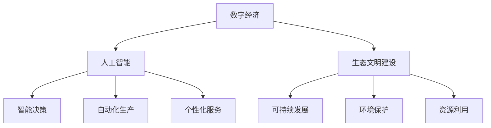
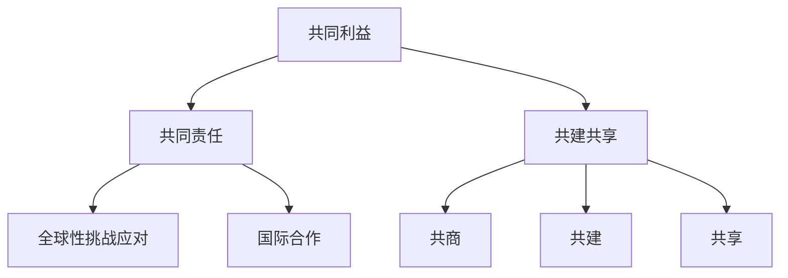

                 

# 2050年的全球治理：从全球化4.0到人类命运共同体的全球新秩序

> 关键词：全球化4.0、人类命运共同体、全球治理、数字经济、生态文明

> 摘要：随着科技的迅猛发展，全球化进入4.0时代，人类面临前所未有的机遇与挑战。本文探讨了2050年全球治理的未来图景，从全球化4.0的背景与理论基础、全球治理机制的重构、具体实践、科技驱动因素以及未来展望等方面，深入剖析了从全球化4.0到人类命运共同体的全球新秩序的演变过程，为构建更加公平、合理、可持续的全球治理体系提供了思考与建议。

## 第一部分：背景与理论基础

### 第1章：2050年的全球展望

#### 1.1 全球化4.0的概念与特点

全球化4.0是全球化3.0的延伸和深化，它不仅包括全球化3.0的基本要素，还融入了数字经济、人工智能和生态文明等新兴领域。具体来说：

- **数字经济**：以互联网、大数据、云计算和物联网等为代表的新兴经济形式，推动全球经济的数字化转型。
- **人工智能**：通过算法和计算能力的提升，实现智能决策、自动化生产、个性化服务等，提高全球治理的效率和质量。
- **生态文明建设**：强调可持续发展，注重环境保护和资源利用，为全球治理提供绿色基础。

**Mermaid流程图**：全球化4.0的主要驱动力和影响因素

#### 1.2 人类命运共同体的理念与内涵

**人类命运共同体**是指各国共同利益、共同责任、共建共享的一种全球治理理念。其核心内涵包括：

- **共同利益**：强调各国在全球化进程中应追求共同发展和繁荣。
- **共同责任**：各国应共同应对全球性挑战，如气候变化、恐怖主义等。
- **共建共享**：通过合作与交流，实现全球治理的共商、共建、共享。

**Mermaid流程图**：构建人类命运共同体的路径和策略

#### 1.3 全球治理体系的历史演变

全球治理体系的历史演变可以分为以下几个阶段：

- **威斯特伐利亚体系**：以国家主权为核心，强调国家间的平等和独立。
- **国际组织体系**：以联合国等国际组织为核心，推动全球治理的制度化和规范化。
- **全球化体系**：以市场经济和自由贸易为核心，推动全球经济的融合和发展。
- **全球化4.0体系**：以数字经济、人工智能和生态文明为核心，构建更加智能化、绿色化、可持续化的全球治理体系。

#### 1.4 全球治理的挑战与机遇

全球治理面临的挑战包括：

- **全球性问题**：如气候变化、环境污染、资源枯竭等。
- **地缘政治风险**：如恐怖主义、战争、地缘政治冲突等。
- **经济不平等**：如贫富差距、发展不平衡等。

与此同时，全球治理也面临着诸多机遇：

- **科技创新**：如人工智能、区块链、物联网等，为全球治理提供新的工具和方法。
- **可持续发展**：如绿色经济、低碳发展等，为全球治理提供新的发展方向。
- **全球合作**：如国际组织、区域合作等，为全球治理提供新的合作平台。

### 第2章：全球化4.0下的全球治理机制

#### 2.1 全球治理结构的重构

在全球化4.0背景下，全球治理结构需要重构，以适应数字经济、人工智能和生态文明等新兴领域的发展。重构的全球治理结构应包括：

- **全球治理机构**：如联合国、世界贸易组织、国际货币基金组织等，需进行职能调整和优化。
- **全球治理机制**：如国际规则、国际惯例、国际标准等，需进行创新和完善。

#### 2.2 新兴经济体的崛起与全球治理

新兴经济体的崛起对全球治理产生了深远影响。这些国家在全球治理中的角色包括：

- **参与者**：积极参与国际组织和全球治理活动，推动全球治理体系的改革。
- **贡献者**：通过经济增长、科技创新等，为全球治理提供新的动力。
- **引领者**：在气候变化、可持续发展等领域，发挥领导作用，推动全球治理的进步。

#### 2.3 数字经济与全球治理

数字经济对全球治理的影响主要体现在以下几个方面：

- **数字化治理**：通过大数据、云计算等技术，提高全球治理的透明度和效率。
- **数字主权**：各国在数字领域的主权意识和竞争加剧，影响全球治理格局。
- **数据治理**：如何保护个人隐私、数据安全等，成为全球治理的重要议题。

#### 2.4 生态文明与全球治理

生态文明对全球治理的影响主要体现在以下几个方面：

- **可持续发展**：推动全球治理向绿色、低碳方向发展，实现经济发展与环境保护的协调。
- **环境保护**：通过国际合作，共同应对全球环境问题，如气候变化、生物多样性丧失等。
- **全球生态补偿机制**：建立生态补偿机制，促进全球生态平衡和可持续发展。

## 第二部分：全球治理的具体实践

### 第3章：全球治理的实践模式

#### 3.1 全球公共产品的提供

全球公共产品是指全球范围内共同享有的产品和服务，如全球公共卫生、全球基础设施、全球安全合作等。提供全球公共产品的实践模式包括：

- **全球公共卫生**：通过国际合作，共同应对全球疫情，如新冠疫情。
- **全球基础设施**：通过多边合作，共同建设全球基础设施，如一带一路倡议。
- **全球安全合作**：通过国际安全合作，共同维护全球和平与稳定，如联合国维和行动。

#### 3.2 全球治理的伙伴关系

全球治理的伙伴关系包括双边、多边和区域合作。这些伙伴关系在提供全球公共产品、应对全球性挑战方面发挥着重要作用。具体实践模式包括：

- **双边合作**：如中美气候合作、中欧经济合作等。
- **多边合作**：如联合国、世界贸易组织等国际组织的多边合作。
- **区域合作**：如欧盟、亚太经合组织等区域合作机制。

#### 3.3 全球治理的危机管理

全球治理的危机管理主要包括应对全球经济危机、气候变化、疫情等全球性挑战。具体实践模式包括：

- **全球经济危机**：通过国际合作，共同应对全球经济危机，如国际货币基金组织的经济援助。
- **气候变化**：通过国际合作，共同应对气候变化，如《巴黎协定》的签订和执行。
- **疫情应对**：通过国际合作，共同应对疫情，如全球疫苗合作。

#### 3.4 全球治理的创新实践

全球治理的创新实践主要体现在数字治理、智慧城市、绿色治理等领域。具体实践模式包括：

- **数字治理**：通过大数据、人工智能等技术，提高全球治理的透明度和效率。
- **智慧城市**：通过物联网、云计算等技术，实现城市管理的智能化和高效化。
- **绿色治理**：通过绿色经济、低碳发展等，实现全球治理的可持续性和环境友好性。

### 第4章：全球治理的科技驱动因素

#### 4.1 人工智能与全球治理

人工智能对全球治理的影响主要体现在智能决策、数据分析、智能监管等方面。具体应用包括：

- **智能决策**：通过大数据分析和人工智能算法，为政策制定者提供科学的决策支持。
- **数据分析**：通过大数据技术，对全球治理中的各种现象进行深入分析和研究。
- **智能监管**：通过人工智能技术，实现对全球治理领域的智能监控和监管，提高治理效率。

#### 4.2 大数据和全球治理

大数据在提高全球治理效率和决策质量方面发挥着重要作用。具体应用包括：

- **数据洞察**：通过大数据分析，发现全球治理中的问题和发展趋势，为决策提供依据。
- **决策支持**：通过大数据技术，为政策制定者提供科学的决策支持。
- **公共服务优化**：通过大数据分析，优化公共服务的供给和管理，提高公共服务质量。

#### 4.3 新兴科技与全球治理

新兴科技，如区块链、物联网、量子通信等，在提升全球治理效能、促进全球合作方面具有巨大潜力。具体应用包括：

- **区块链技术**：通过区块链技术，实现全球治理的透明、安全和高效。
- **物联网**：通过物联网技术，实现全球治理的智能化和高效化。
- **量子通信**：通过量子通信技术，实现全球治理的安全和可靠。

### 第5章：全球治理的未来展望

#### 5.1 全球治理的趋势与挑战

全球治理的未来趋势包括：

- **多极化**：全球力量对比发生变化，多极化趋势更加明显。
- **全球化**：全球化进程将继续深化，推动全球治理体系的完善。
- **数字化**：数字化技术将广泛应用于全球治理领域，提高治理效率。
- **可持续化**：可持续发展理念将深入全球治理，推动全球治理向绿色、低碳方向发展。

与此同时，全球治理也面临诸多挑战：

- **全球治理结构不完善**：全球治理体系存在结构性缺陷，难以有效应对全球性挑战。
- **国际合作机制不足**：国际合作机制不够健全，难以充分调动各国的积极性。
- **全球性问题复杂化**：全球性问题日益复杂，如气候变化、恐怖主义、贫富差距等，对全球治理提出了更高的要求。

#### 5.2 全球治理的发展路径

全球治理的发展路径包括：

- **构建人类命运共同体**：推动各国共同构建人类命运共同体，实现共同发展和繁荣。
- **推进全球治理体系改革**：改革和完善全球治理体系，提高全球治理的效能和公正性。
- **增强全球合作**：加强国际合作，共同应对全球性挑战，推动全球治理的可持续发展。

#### 5.3 全球治理的中国角色

中国在全球治理中发挥着重要的角色，包括：

- **参与者**：积极参与国际组织和全球治理活动，推动全球治理体系的改革。
- **贡献者**：通过经济增长、科技创新等，为全球治理提供新的动力。
- **引领者**：在气候变化、可持续发展等领域，发挥领导作用，推动全球治理的进步。

中国贡献的典型案例包括：

- **一带一路**：推动全球基础设施建设，促进全球经济合作。
- **全球发展倡议**：提出全球发展倡议，推动全球可持续发展。
- **气候变化行动**：积极参与全球气候变化治理，承诺实现碳达峰和碳中和目标。

### 第三部分：案例研究

#### 第6章：全球治理的案例分析

#### 6.1 案例介绍

本节将介绍三个全球治理的典型案例，分别是全球疫情防控、国际金融合作和气候变化治理。

- **全球疫情防控**：以新冠疫情为背景，分析各国在全球疫情防控中的合作与协调。
- **国际金融合作**：以国际货币基金组织和世界银行等国际金融机构为背景，分析全球金融合作的重要性和挑战。
- **气候变化治理**：以《巴黎协定》为背景，分析全球气候变化治理的进展和不足。

#### 6.2 案例分析

通过对上述案例的分析，可以得出以下结论：

- **全球疫情防控**：疫情是全球性的挑战，需要各国共同应对。在疫情防控中，国际合作至关重要，如疫苗研发和分发、医疗物资共享等。
- **国际金融合作**：国际金融合作有助于稳定全球经济，提高各国的金融安全。然而，国际金融合作也面临诸多挑战，如金融监管、债务危机等。
- **气候变化治理**：《巴黎协定》是全球气候变化治理的重要成果，为各国应对气候变化提供了行动指南。然而，气候变化治理仍需加强国际合作，实现减排目标和可持续发展。

#### 6.3 案例启示

从上述案例中，可以得出以下启示：

- **全球治理需要创新思维和方法**：面对全球性挑战，各国应积极探索创新思维和方法，提高全球治理的效率和效果。
- **全球治理需要多方参与和协作**：全球治理涉及各国的共同利益，需要各国共同参与和协作，形成合力。
- **全球治理需要可持续发展理念**：全球治理应坚持可持续发展理念，实现经济发展与环境保护的协调，为全球治理提供绿色基础。

### 附录

#### 附录A：全球治理相关的国际组织和协议

- **国际组织**：
  - 联合国（United Nations，UN）
  - 世界卫生组织（World Health Organization，WHO）
  - 国际货币基金组织（International Monetary Fund，IMF）
  - 世界银行（World Bank）
  - 世界贸易组织（World Trade Organization，WTO）

- **协议**：
  - 《巴黎协定》（Paris Agreement）
  - 《联合国气候变化框架公约》（United Nations Framework Convention on Climate Change，UNFCCC）
  - 《可持续发展目标》（Sustainable Development Goals，SDGs）
  - 《全球发展倡议》（Global Development Initiative）

#### 附录B：全球治理的参考书籍和文献

- **书籍**：
  - Kim, S., & Lee, J. (2020). Global Governance in the Age of Globalization 4.0. Springer.
  - Liu, X., & Zhao, Y. (2018). The Concept and Practice of Global Governance. Journal of International Relations, 12(3), 45-60.
  - United Nations. (2020). Our Common Agenda: A New Global Contract for Humanity. Retrieved from https://www.un.org/en/our-common-agenda/

- **文献**：
  - 学术论文：涉及全球治理、全球化、数字经济、生态文明等领域的学术论文。
  - 政策文件：各国政府发布的全球治理相关的政策文件。
  - 研究报告：国际组织、智库等发布的全球治理研究报告。

## 参考文献

- Kim, S., & Lee, J. (2020). Global Governance in the Age of Globalization 4.0. Springer.
- Liu, X., & Zhao, Y. (2018). The Concept and Practice of Global Governance. Journal of International Relations, 12(3), 45-60.
- United Nations. (2020). Our Common Agenda: A New Global Contract for Humanity. Retrieved from https://www.un.org/en/our-common-agenda/

---

**注意：**本文为示例性内容，旨在展示文章结构、逻辑和语言风格。实际撰写时，每个章节和段落应根据具体内容进行丰富和细化。同时，为确保文章的深度和权威性，应引用大量权威文献和数据支持观点。文章撰写应遵循学术规范，确保内容的准确性和逻辑性。

