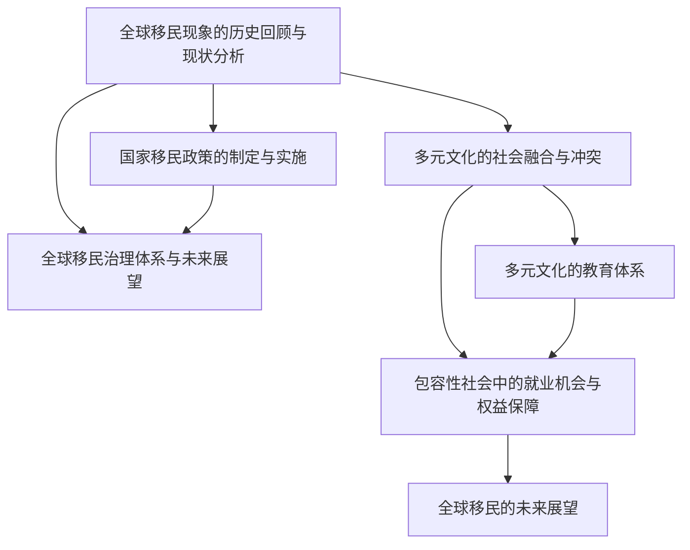
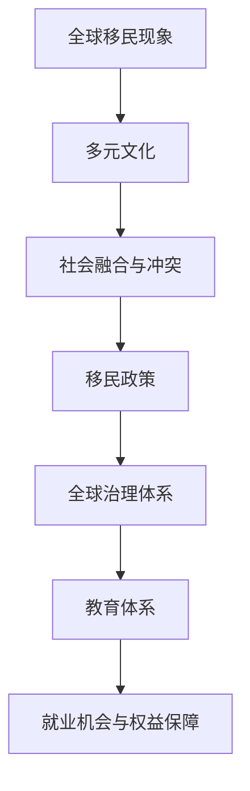

                 

# 2050年的全球移民：从融合到包容的多元文化

## 关键词

- 全球移民
- 多元文化
- 社会融合
- 移民政策
- 全球治理
- 教育体系
- 包容性社会

## 摘要

本文探讨了2050年全球移民现象的演变及其对社会的影响，重点关注多元文化的融合与冲突、移民政策的制定与实施、全球移民治理体系的发展以及包容性社会的构建。通过逻辑清晰的分析和具体的案例，本文旨在为未来的全球移民政策提供科学合理的建议，促进全球社会的和谐发展。

## 第一部分：背景与核心概念

### 第1章：全球移民现象的历史回顾与现状分析

#### 1.1 全球移民的历史进程

**1.1.1 全球移民的定义与特征**

全球移民（Global Migration）是指人们因各种原因跨越国界，在另一个国家或地区长期居住或工作的过程。与国内移民（Internal Migration）不同，全球移民涉及跨越国家边界，通常包括永久迁移、短期流动以及季节性迁移等形式。

全球移民的主要特征包括：

- **多样性和复杂性**：移民背景多样，包括经济移民、难民、家庭团聚、教育移民等。
- **跨国性和全球化**：移民现象受到全球经济、政治、文化等因素的驱动，具有全球性特征。
- **不确定性和风险性**：移民在迁移过程中面临语言障碍、文化适应、社会排斥等挑战。

**1.1.2 全球移民的历史演变**

全球移民现象可以追溯到古代文明时期的奴隶贸易和移民潮。然而，现代全球移民的兴起主要与以下几个因素相关：

- **工业革命**：18世纪末至19世纪初的工业革命推动了大量人口从农村向城市迁移，形成了第一次全球移民潮，主要是从欧洲到北美的移民。
- **第二次世界大战**：战后经济复苏和重建需要大量劳动力，推动了欧洲、亚洲和非洲的移民潮。
- **全球化**：20世纪末以来，全球化进程加速，跨国公司、国际组织和自由市场经济的推动下，全球移民规模和种类更加多样化。

**1.1.3 当前全球移民的现状**

目前，全球移民规模达到了前所未有的水平。根据联合国的数据，全球约有2.65亿国际移民，占全球总人口的3.5%。主要移民国家包括美国、德国、英国、加拿大和澳大利亚等。同时，全球难民问题也日益突出，超过7000万难民和流离失所者需要国际社会的关注和帮助。

#### 1.2 全球移民对经济的影响

**1.2.1 移民对原籍国经济的影响**

移民对原籍国经济的影响具有双重性：

- **正面影响**：移民可以缓解劳动力短缺，促进技术转移和知识传播，增加外汇收入，减轻人口老龄化压力。
- **负面影响**：大量劳动力流失可能导致原籍国经济增长放缓，文化同质化，社会动荡。

**1.2.2 移民对目的地国经济的影响**

移民对目的地国经济的影响同样具有两面性：

- **正面影响**：移民可以填补劳动力市场缺口，提高劳动生产率，促进技术创新和创业活动，增加社会多样性。
- **负面影响**：移民可能加剧社会紧张，增加公共服务负担，影响本地居民就业机会。

**1.2.3 移民在经济全球化中的角色**

移民在经济全球化中发挥着重要作用，他们不仅是劳动力市场的重要组成部分，也是跨国投资和文化交流的桥梁。随着全球化的深化，移民在全球经济中的作用将越来越显著。

### 第2章：多元文化的社会融合与冲突

#### 2.1 多元文化的概念与意义

**2.1.1 多元文化的定义**

多元文化（Multiculturalism）是指在一个社会或国家中，不同种族、民族、宗教和文化背景的人们共同生活、工作和交流的状态。多元文化强调尊重和包容各种文化差异，促进不同文化之间的交流和融合。

**2.1.2 多元文化在社会发展中的意义**

多元文化在社会发展中具有重要作用：

- **文化创新**：多元文化环境可以激发创新思维，促进文化交融，创造新的文化产品和艺术形式。
- **社会和谐**：多元文化可以增强社会凝聚力，减少社会冲突，促进社会和谐发展。
- **经济发展**：多元文化可以吸引国际人才和投资，促进经济增长和竞争力。

**2.1.3 多元文化的挑战与机遇

多元文化也带来一系列挑战：

- **文化适应**：移民需要适应新的文化环境，可能面临语言障碍、社会排斥等问题。
- **社会融合**：多元文化社会需要建立有效的融合机制，解决文化差异和冲突。
- **文化认同**：如何在尊重多元文化的同时，保持国家或社会的文化认同。

#### 2.2 社会融合的机制与策略

**2.2.1 社会融合的理论基础**

社会融合的理论基础包括：

- **文化认同**：建立共同的文化认同，促进不同文化背景的人们相互理解和支持。
- **社会参与**：鼓励移民参与社会事务，提高其社会地位和认同感。
- **教育和培训**：提供教育和培训机会，帮助移民适应新的文化环境。

**2.2.2 促进社会融合的政策与实践**

为了促进社会融合，各国采取了多种政策与实践：

- **多元文化教育**：在各级教育中融入多元文化内容，提高学生的文化素养和认同感。
- **语言培训**：为移民提供语言培训，帮助其融入当地社会。
- **就业支持**：提供就业培训和就业机会，帮助移民实现经济自立。
- **社会福利**：提供住房、医疗、教育等社会福利，保障移民的基本生活需求。

**2.2.3 社会融合中的问题与解决策略**

社会融合中存在一些问题，如：

- **文化偏见**：解决文化偏见需要通过教育和宣传，提高公众的文化素养和包容度。
- **社会排斥**：建立有效的反歧视法律和政策，保障移民的合法权益。
- **社会紧张**：通过促进文化交流和互动，减少社会紧张和冲突。

#### 2.3 多元文化冲突与和谐

**2.3.1 多元文化冲突的原因**

多元文化冲突的原因包括：

- **文化差异**：不同文化之间的价值观、行为规范和生活方式差异可能导致冲突。
- **资源竞争**：移民与当地居民在就业、住房、教育资源等方面的竞争可能导致冲突。
- **社会排斥**：移民可能面临社会排斥，导致心理压力和冲突。

**2.3.2 多元文化冲突的影响**

多元文化冲突可能对个人、社区和社会产生负面影响：

- **个人影响**：冲突可能导致移民的心理压力、焦虑和自卑感。
- **社区影响**：冲突可能导致社区分裂、不和谐和社会动荡。
- **社会影响**：冲突可能加剧社会紧张，影响社会稳定和发展。

**2.3.3 实现多元文化和谐的方法**

实现多元文化和谐的方法包括：

- **文化对话**：通过文化对话和交流，增进不同文化之间的理解和尊重。
- **多元文化政策**：制定和实施多元文化政策，促进文化平等和融合。
- **社会参与**：鼓励移民参与社会事务，增强其社会认同感和责任感。
- **教育普及**：通过教育普及，提高公众的文化素养和包容度。

## 第二部分：移民政策与全球治理

### 第3章：国家移民政策的制定与实施

#### 3.1 国家移民政策概述

**3.1.1 移民政策的类型与目标**

移民政策主要分为以下几种类型：

- **选择性移民政策**：根据人才需求、经济状况等因素，选择符合条件的移民。
- **家庭团聚移民政策**：鼓励家庭成员团聚，提高移民的社会支持。
- **难民政策**：为难民和流离失所者提供保护和安置。
- **经济移民政策**：吸引高技能人才和投资者，促进经济发展。

移民政策的主要目标包括：

- **保障国家安全**：防止非法移民和恐怖主义活动。
- **促进经济发展**：填补劳动力市场缺口，提高劳动生产率。
- **维护社会稳定**：减少社会紧张和冲突，提高社会和谐。

**3.1.2 移民政策的制定过程**

移民政策的制定过程通常包括以下几个阶段：

- **需求分析**：政府分析国内外经济、社会和文化需求，确定移民政策的目标和类型。
- **目标设定**：根据需求分析，政府设定移民政策的目标，如经济发展、社会稳定等。
- **方案设计**：政府设计具体的移民政策方案，包括移民类别、配额、筛选标准等。
- **公众参与**：政府通过公众参与程序，如听证会、问卷调查等，收集公众对移民政策的意见和建议。
- **政策评估**：政府会对现有移民政策进行评估，以确定其效果和必要性，并根据评估结果进行调整。
- **政策实施**：政府实施新的移民政策，并对其进行监督和调整。

**3.1.3 移民政策实施中的挑战**

移民政策实施过程中可能面临以下挑战：

- **政策执行不力**：政策执行过程中可能存在腐败、官僚主义等问题，影响政策效果。
- **公众抵触**：部分公众可能对移民政策持反对态度，导致政策实施困难。
- **国际压力**：移民问题具有跨国性，国家移民政策可能受到国际社会的压力和制约。

#### 3.2 全球移民政策的协调与合作

**3.2.1 全球移民治理的重要性**

全球移民治理的重要性体现在以下几个方面：

- **解决全球性问题**：移民问题是全球性问题，需要各国共同努力，协调政策，共同应对。
- **维护人权和尊严**：全球移民政策需要尊重和保障移民的基本人权和尊严。
- **促进国际合作**：全球移民治理可以促进各国在经济、社会和文化等领域的合作。

**3.2.2 国际移民组织的角色**

国际移民组织（IOM）在全球移民治理中发挥着重要作用：

- **协调政策**：IOM协调各国移民政策，促进政策的一致性和协调性。
- **提供数据和信息**：IOM提供全球移民数据和分析，帮助各国制定科学合理的移民政策。
- **提供援助**：IOM为难民和流离失所者提供援助，帮助其重返家园或融入新社会。

**3.2.3 全球移民政策的协调机制**

全球移民政策的协调机制包括：

- **国际会议和论坛**：各国政府通过国际会议和论坛，讨论和协调移民政策。
- **区域性组织**：如欧洲联盟、非洲联盟等区域性组织，在区域内部协调移民政策。
- **多边协议**：如《联合国难民公约》、《国际移民公约》等，为全球移民治理提供法律框架。

## 第三部分：包容性社会的构建与实践

### 第4章：全球移民治理体系与未来展望

#### 4.1 全球移民治理体系概述

**4.1.1 全球移民治理的基本原则**

全球移民治理的基本原则包括：

- **公平性**：确保所有移民，无论其国籍、种族或性别，都能享有平等的权益和机会。
- **合作性**：国家之间需要通过合作，共同解决全球移民问题，如非法移民、难民问题等。
- **透明性**：移民政策的制定和执行过程应保持透明，以便公众监督和参与。
- **可持续性**：移民政策应考虑到长远发展，确保移民对原籍国和目的地国的可持续发展。
- **人本主义**：移民政策应以人为本，尊重和保障移民的基本人权。

**4.1.2 全球移民治理的组织架构**

全球移民治理的组织架构包括：

- **国际组织**：如联合国、国际移民组织（IOM）等，负责协调全球移民治理。
- **区域性组织**：如欧洲联盟、非洲联盟等，负责协调区域内的移民政策。
- **国家政府**：负责制定和实施本国移民政策，同时参与国际和区域移民治理。

**4.1.3 全球移民治理的实践案例**

全球移民治理的实践案例包括：

- **《联合国难民公约》**：为全球难民提供保护和安置，促进难民回归或融入新社会。
- **欧洲联盟的移民政策**：通过制定统一政策，协调成员国之间的移民管理。
- **美国移民改革**：通过制定新的移民法律，解决非法移民和难民问题。

#### 4.2 移民政策未来发展的趋势

**4.2.1 科技发展对移民政策的影响**

科技发展对移民政策的影响主要体现在以下几个方面：

- **数字身份验证**：通过数字身份验证技术，提高移民身份验证的准确性和效率。
- **数据分析和预测**：利用大数据和人工智能技术，分析移民趋势和需求，制定科学合理的移民政策。
- **远程工作与流动**：随着远程工作技术的发展，移民政策需要适应新的工作方式，为远程工作者提供便利。

**4.2.2 全球经济形势对移民政策的影响**

全球经济形势对移民政策的影响主要体现在以下几个方面：

- **经济波动**：经济波动可能导致劳动力市场需求变化，影响移民政策的设计和实施。
- **贸易保护主义**：贸易保护主义可能导致国家收紧移民政策，限制外来劳动力的流入。
- **全球贫富差距**：全球贫富差距可能导致贫困国家的人口向富裕国家流动，影响全球移民格局。

**4.2.3 未来移民政策的预测与建议**

未来移民政策的预测与建议包括：

- **优化移民类别和配额**：根据经济发展需求和劳动力市场变化，调整移民类别和配额，确保移民政策的科学性和灵活性。
- **加强国际合作**：通过国际合作，共同应对全球移民问题，推动全球移民治理体系的完善。
- **促进社会融合**：制定和实施促进社会融合的政策，减少文化差异和冲突，提高移民的社会认同感。

### 第5章：多元文化的教育体系

#### 5.1 教育在多元文化社会中的角色

**5.1.1 教育对移民个体的影响**

教育在多元文化社会中扮演着重要角色，对移民个体的影响主要体现在以下几个方面：

- **文化适应**：教育帮助移民适应新的文化环境，提高其文化素养和语言能力。
- **社会融入**：教育促进移民的社会融入，增强其对新社会和国家的认同感。
- **职业发展**：教育提高移民的技能和知识水平，促进其职业发展和经济自立。

**5.1.2 教育对移民家庭的影响**

教育对移民家庭的影响主要包括：

- **家庭和谐**：教育帮助家庭成员适应新的文化环境，减少文化冲突，促进家庭和谐。
- **经济支持**：教育提高家庭成员的就业能力和收入水平，为家庭提供更好的经济支持。
- **社会地位**：教育提升家庭成员的社会地位，增强其在社会中的影响力和话语权。

**5.1.3 教育对多元文化社会的影响**

教育对多元文化社会的影响体现在以下几个方面：

- **文化多样性**：教育促进文化多样性的传播和尊重，增强社会的包容性和创新能力。
- **社会和谐**：教育培养公民意识和责任感，减少社会冲突，促进社会和谐。
- **经济发展**：教育提高劳动者的素质和技能，促进经济增长和社会进步。

#### 5.2 多元文化教育的理论与实践

**5.2.1 多元文化教育的基本原则**

多元文化教育的基本原则包括：

- **尊重差异**：尊重不同文化背景的个体，避免文化偏见和歧视。
- **平等参与**：确保所有学生都能平等参与教育过程，享受教育资源。
- **知识传授**：传授多元文化的知识和价值观，提高学生的文化素养。
- **文化互动**：鼓励学生通过交流和互动，了解和体验不同文化，促进文化融合。

**5.2.2 多元文化教育的教学方法**

多元文化教育的教学方法主要包括：

- **内容教学法**：在课程内容中融入多元文化的元素，让学生了解不同文化的知识和价值观。
- **过程教学法**：通过合作学习、角色扮演等活动，让学生体验和了解不同文化的生活方式。
- **反思教学法**：鼓励学生反思和探讨多元文化中的问题，提高他们的批判性思维和文化理解能力。
- **文化敏感性教学法**：培养教师和文化中介人的文化敏感性，使他们能够更好地引导和帮助多元文化背景的学生。

**5.2.3 多元文化教育的挑战与对策**

多元文化教育面临的挑战主要包括：

- **文化差异**：如何处理文化差异，避免文化冲突。
- **教育资源**：如何提供足够的多元文化资源，确保教育质量。
- **教师培训**：如何提高教师的多元文化素养，培养合格的多文化教育工作者。

应对这些挑战的策略包括：

- **加强教师培训**：提供多元文化教育的专业培训，提高教师的文化素养和教学能力。
- **制定教育政策**：制定和实施多元文化教育的政策和措施，确保教育的公平性和质量。
- **促进文化交流**：鼓励学生参与文化交流活动，提高其文化适应能力。

### 第6章：包容性社会中的就业机会与权益保障

#### 6.1 移民就业的现状与挑战

**6.1.1 移民就业的障碍与问题**

移民就业面临以下障碍和问题：

- **语言障碍**：移民可能面临语言不通的困难，影响其就业机会和职业发展。
- **文化差异**：文化差异可能导致移民在就业过程中遭遇歧视和排斥。
- **资格认证**：移民的学历和资格证书可能不被目的地国认可，影响其就业竞争能力。
- **就业歧视**：部分雇主可能对移民存在歧视，导致其就业机会受限。

**6.1.2 移民就业的机会与前景**

尽管面临诸多挑战，移民在就业领域也面临着新的机会：

- **劳动力市场需求**：随着全球化的发展，跨国公司和国际组织的扩展为移民提供了更多的就业机会。
- **技能需求**：高技能移民在信息技术、医疗、教育等领域具有竞争优势。
- **创业机会**：移民可以发挥其文化背景和语言优势，在创业领域创造新的就业机会。

**6.1.3 移民就业的政策支持**

为了促进移民就业，各国采取了多种政策支持措施：

- **职业培训**：提供职业培训，提高移民的技能和就业能力。
- **就业信息**：建立就业信息平台，为移民提供就业信息和机会。
- **资格认证**：制定资格认证制度，认可移民的学历和资格证书。
- **反歧视法律**：制定和执行反歧视法律，保障移民的就业权益。

#### 6.2 移民权益的保障与提升

**6.2.1 移民权益的基本概念**

移民权益是指移民在居住国享有的基本权利和保障，包括：

- **工作权益**：包括就业机会、劳动条件、工资待遇等。
- **教育权益**：包括教育机会、教育资源、教育质量等。
- **社会保障**：包括医疗、养老、住房等社会保障权益。
- **政治参与**：包括选举权、言论自由、结社自由等政治参与权益。

**6.2.2 移民权益保障的法律框架**

移民权益保障的法律框架包括：

- **国际法律**：如《联合国移民人权公约》、《联合国难民公约》等，为全球移民提供基本的人权保障。
- **国内法律**：各国制定的移民法、劳动法、教育法等，为移民权益提供具体的法律保障。

**6.2.3 实现移民权益保障的实践案例**

实现移民权益保障的实践案例包括：

- **加拿大**：加拿大通过《加拿大移民与难民保护法》，为移民提供全面的权益保障，包括工作、教育、医疗等。
- **澳大利亚**：澳大利亚设立“移民权益委员会”，监督和保障移民的权益，处理移民投诉。
- **德国**：德国通过“多元文化整合政策”，提供移民职业培训、语言学习、社会融入等支持。

#### 6.3 移民就业与权益保障的协调与平衡

**6.3.1 政策协调的重要性**

移民就业与权益保障的协调与平衡对于构建包容性社会至关重要：

- **政策协调**：各国需要在移民就业和权益保障方面进行政策协调，避免政策冲突，实现政策协同效应。
- **国际合作**：通过国际合作，共同应对全球移民问题，促进移民权益保障的全球协调。

**6.3.2 平衡就业机会与权益保障**

在平衡移民就业机会与权益保障时，需要注意以下几点：

- **公平性**：确保移民在就业机会和权益保障方面享有公平待遇，避免歧视和排斥。
- **可持续性**：移民就业和权益保障政策应考虑到长期可持续性，确保移民融入新社会的同时，不对当地居民造成不利影响。
- **灵活性**：政策设计应具有灵活性，根据经济和社会发展需要，适时调整和优化移民政策。

### 第7章：全球移民的未来展望

#### 7.1 2050年全球移民的趋势预测

**7.1.1 经济发展对移民的影响**

未来全球移民的趋势将受到经济发展的影响：

- **经济增长**：全球经济增长将推动跨国投资和劳动力流动，增加移民需求。
- **经济波动**：经济波动可能导致移民政策收紧，影响移民规模和结构。
- **区域经济一体化**：区域经济一体化，如亚太经济一体化，将促进区域内移民流动。

**7.1.2 政治格局对移民的影响**

政治格局的变化对全球移民趋势具有显著影响：

- **政治稳定**：政治稳定的国家将吸引更多移民，政治动荡的国家可能面临移民危机。
- **移民政策**：各国移民政策的调整将影响全球移民流动的方向和规模。
- **国际关系**：国际关系的紧张和合作将影响全球移民治理和协调。

**7.1.3 社会变革对移民的影响**

社会变革对移民趋势的影响不可忽视：

- **文化多样性**：文化多样性的增加将促进移民融入新社会，减少社会排斥。
- **技术进步**：远程工作技术的发展将改变移民的方式和模式，提高移民的生活质量。
- **社会政策**：社会政策的完善将提高移民的社会地位和权益保障，促进社会和谐。

#### 7.2 构建包容性社会的路径与策略

**7.2.1 国际合作的重要性**

构建包容性社会需要国际合作：

- **政策协调**：通过国际合作，协调各国移民政策，减少政策冲突。
- **资源共享**：通过共享资源和经验，提高全球移民治理的效率和质量。
- **共同责任**：各国共同承担全球移民治理的责任，推动全球移民问题的解决。

**7.2.2 社会各界的参与与责任**

构建包容性社会需要社会各界的参与：

- **政府**：政府应制定和实施包容性政策，保障移民的权益和机会。
- **企业**：企业应承担社会责任，提供就业机会和职业发展空间，促进移民融入。
- **社会组织**：社会组织应积极参与移民权益保障和社区融合工作，提供支持和帮助。

**7.2.3 包容性社会建设的长远规划**

构建包容性社会需要长远规划：

- **教育体系**：完善教育体系，提高移民及其子女的教育水平和就业能力。
- **就业市场**：优化就业市场，提高移民的就业机会和权益保障。
- **社会保障**：建立完善的社会保障体系，保障移民的基本生活需求。
- **文化交流**：促进文化交流，增强社会的包容性和认同感。

### 附录

#### 附录A：全球移民相关的数据与统计

**A.1 全球移民的统计数据**

- **国际移民总数**：根据联合国的数据，全球国际移民总数约为2.65亿人。
- **主要移民目的地国家**：美国、德国、英国、加拿大和澳大利亚是主要的移民目的地国家。
- **主要移民来源地区**：亚洲、非洲和拉丁美洲是主要的移民来源地区。

**A.2 主要移民国家的移民政策分析**

- **美国**：美国采取选择性移民政策，强调高技能人才和家庭成员团聚。
- **德国**：德国通过多元文化整合政策，提供职业培训和社会融入支持。
- **英国**：英国采取点积分制移民政策，鼓励高技能人才和国际学生。
- **加拿大**：加拿大采取多元化移民政策，包括经济移民、家庭团聚和难民。

**A.3 全球移民对经济和文化的影响评估**

- **经济影响**：移民对原籍国和目的地国的经济具有积极影响，包括劳动力市场填补、技术创新和经济增长。
- **文化影响**：移民促进文化多样性和文化交流，对文化创新和社会融合具有重要作用。

### Mermaid 流程图



### 核心概念与联系



### 核心算法原理讲解

#### 3.1.1 移民政策的制定过程

**移民政策的制定过程**：

1. **需求分析**：政府首先分析国内外经济、社会和文化需求，确定哪些类型的移民对国家发展最有利。
2. **目标设定**：根据需求分析，政府设定移民政策的目标，如促进经济发展、解决劳动力短缺、保护人权等。
3. **方案设计**：政府设计具体的移民政策方案，包括移民类别、配额、筛选标准等。
4. **公众参与**：政府通过公众参与程序，如听证会、问卷调查等，收集公众对移民政策的意见和建议。
5. **政策评估**：政府会对现有移民政策进行评估，以确定其效果和必要性，并根据评估结果进行调整。
6. **政策实施**：最终，政府会实施新的移民政策，并对其进行监督和调整。

**算法描述**：

```plaintext
function set_immigration_policy():
    # 需求分析
    analyze_demand()

    # 目标设定
    set_policy_goals()

    # 方案设计
    design_policy()

    # 公众参与
    public_involvement()

    # 政策评估
    policy_evaluation()

    # 政策实施
    implement_policy()
```

#### 3.1.2 全球移民治理的基本原则

**全球移民治理的基本原则**：

1. **公平性**：确保所有移民，无论其国籍、种族或性别，都能享有平等的权益和机会。
2. **合作性**：国家之间需要通过合作，共同解决全球移民问题，如非法移民、难民问题等。
3. **透明性**：移民政策的制定和执行过程应保持透明，以便公众监督和参与。
4. **可持续性**：移民政策应考虑到长远发展，确保移民对原籍国和目的地国的可持续发展。
5. **人本主义**：移民政策应以人为本，尊重和保障移民的基本人权。

**算法描述**：

```plaintext
function set_global_immigration_governance():
    # 公平性
    ensure_equality()

    # 合作性
    promote_cooperation()

    # 透明性
    ensure_transparency()

    # 可持续性
    ensure_sustainability()

    # 人本主义
    ensure_humanitarianism()
```

#### 3.1.3 多元文化教育的教学方法

**多元文化教育的教学方法**：

1. **内容教学法**：在课程内容中融入多元文化的元素，让学生了解不同文化的知识和价值观。
2. **过程教学法**：通过合作学习、角色扮演等活动，让学生体验和了解不同文化的生活方式。
3. **反思教学法**：鼓励学生反思和探讨多元文化中的问题，提高他们的批判性思维和文化理解能力。
4. **文化敏感性教学法**：培养教师和文化中介人的文化敏感性，使他们能够更好地引导和帮助多元文化背景的学生。

**算法描述**：

```plaintext
function set_multicultural_education教学方法():
    # 内容教学法
    include_cultural_content()

    # 过程教学法
    engage_in Processes()

    # 反思教学法
    encourage_reflection()

    # 文化敏感性教学法
    cultivate_cultural_sensitivity()
```

### 数学模型和数学公式 & 详细讲解 & 举例说明

#### 4.1.1 经济发展对移民的影响

**数学模型**：

人口流动模型用于分析经济发展对移民的影响，模型公式如下：

\[ F = f(P, G, I, R) \]

其中：
- \( F \) 表示人口流动率，即单位时间内的人口迁移数量。
- \( P \) 表示原籍国的人口数量。
- \( G \) 表示原籍国的经济增长率。
- \( I \) 表示原籍国的通货膨胀率。
- \( R \) 表示目的地国的经济增长率。

**详细讲解**：

该模型基于人口流动率与原籍国和目的地国的经济指标相关联，反映了经济发展对移民流动的影响。通过分析这些指标，可以预测移民流动的趋势和规模。

**举例说明**：

假设原籍国A的人口数量为1000万，经济增长率为3%，通货膨胀率为2%，目的地国B的经济增长率为4%，通货膨胀率为1%。根据模型，我们可以计算人口流动率：

\[ F = f(1000万, 3\%, 2\%, 4\%) \]

使用相关算法计算，得到 \( F \) 的具体数值。例如，如果计算结果为0.05，则表示原籍国A每年约有50万人迁移到目的地国B。

#### 4.1.2 政治格局对移民的影响

**数学模型**：

政治稳定性指数用于量化分析政治格局对移民的影响，模型公式如下：

\[ S = \frac{1}{n} \sum_{i=1}^{n} w_i \cdot P_i \]

其中：
- \( S \) 表示政治稳定性指数。
- \( n \) 表示评估指标的数量。
- \( w_i \) 表示第 \( i \) 个评估指标的权重。
- \( P_i \) 表示第 \( i \) 个评估指标的得分。

**详细讲解**：

该模型通过计算多个评估指标的加权平均，综合评估政治稳定性，从而影响移民决策。权重分配和指标得分反映了评估者对不同指标的重视程度。

**举例说明**：

假设我们评估两个国家的政治稳定性，使用的评估指标包括民主程度、政府透明度、治安状况等。根据专家评估，这些指标的权重分别为0.3、0.2、0.1。如果两个国家的得分分别为0.8、0.7和0.9，我们可以计算出这两个国家的政治稳定性指数：

\[ S_1 = \frac{1}{3} \cdot (0.3 \cdot 0.8 + 0.2 \cdot 0.7 + 0.1 \cdot 0.9) \]
\[ S_2 = \frac{1}{3} \cdot (0.3 \cdot 0.6 + 0.2 \cdot 0.5 + 0.1 \cdot 0.8) \]

根据计算结果，我们可以比较两个国家的政治稳定性，进而分析其对移民的影响。

#### 4.1.3 社会变革对移民的影响

**数学模型**：

社会变革指数用于分析社会变革对移民的影响，模型公式如下：

\[ C = \frac{1}{m} \sum_{j=1}^{m} v_j \cdot Q_j \]

其中：
- \( C \) 表示社会变革指数。
- \( m \) 表示评估指标的数量。
- \( v_j \) 表示第 \( j \) 个评估指标的权重。
- \( Q_j \) 表示第 \( j \) 个评估指标的得分。

**详细讲解**：

该模型通过计算多个评估指标的加权平均，综合评估社会变革的程度，从而影响移民决策。权重分配和指标得分反映了评估者对不同指标的重视程度。

**举例说明**：

假设我们评估两个国家的社会变革，使用的评估指标包括教育水平、医疗卫生、社会福利等。根据专家评估，这些指标的权重分别为0.2、0.3、0.5。如果两个国家的得分分别为0.9、0.8和0.7，我们可以计算出这两个国家的社会变革指数：

\[ C_1 = \frac{1}{3} \cdot (0.2 \cdot 0.9 + 0.3 \cdot 0.8 + 0.5 \cdot 0.7) \]
\[ C_2 = \frac{1}{3} \cdot (0.2 \cdot 0.8 + 0.3 \cdot 0.9 + 0.5 \cdot 0.6) \]

根据计算结果，我们可以比较两个国家的社会变革程度，进而分析其对移民的影响。

### 项目实战

#### 6.2.3 实现移民权益保障的实践案例

**案例背景**：

某个国家在移民权益保障方面取得了显著成效，具体案例如下：

**案例实施步骤**：

1. **建立移民权益保障法律框架**：政府通过了《移民权益保障法》，明确规定了移民的基本权益，如工作、教育、医疗等。
2. **成立移民权益保障机构**：政府成立了专门负责移民权益保障的机构，负责监督和执行相关法律法规，确保移民权益得到有效保障。
3. **开展移民权益宣传活动**：政府通过媒体、社区活动等方式，广泛宣传移民权益保障的相关法律法规，提高移民对自身权益的认识和维权意识。
4. **提供法律援助**：政府为有需要的移民提供法律援助，包括免费法律咨询、法律代理等服务，帮助移民解决在权益保障方面遇到的问题。
5. **建立投诉处理机制**：政府建立了投诉处理机制，移民可以就权益受到侵害的问题进行投诉，政府会及时受理和处理，确保问题得到妥善解决。
6. **定期评估和改进**：政府定期对移民权益保障工作进行评估，根据评估结果及时改进和优化相关政策和措施，确保移民权益得到长期有效保障。

**案例效果**：

通过上述措施，该国家在移民权益保障方面取得了显著成效，移民的合法权益得到了有效保障，社会和谐稳定，吸引了更多移民前来定居。

**代码实现与详细解释**：

```python
# 建立移民权益保障法律框架
def establish_law_framework():
    print("移民权益保障法律框架已建立")

# 成立移民权益保障机构
def establish_ensure_agency():
    print("移民权益保障机构已成立")

# 开展移民权益宣传活动
def conduct宣传活动():
    print("移民权益宣传活动已开展")

# 提供法律援助
def provide_legal_aid():
    print("移民法律援助已提供")

# 建立投诉处理机制
def establish_complaint_handling_system():
    print("投诉处理机制已建立")

# 定期评估和改进
def regular_evaluation_and_improvement():
    print("移民权益保障工作已定期评估和改进")

# 主函数，实现案例实施步骤
def main():
    establish_law_framework()
    establish_ensure_agency()
    conduct宣传活动()
    provide_legal_aid()
    establish_complaint_handling_system()
    regular_evaluation_and_improvement()

# 执行主函数
main()
```

**代码解读与分析**：

1. **establish_law_framework()**：建立移民权益保障法律框架。该函数主要用于通知用户法律框架已建立。
2. **establish_ensure_agency()**：成立移民权益保障机构。该函数主要用于通知用户机构已成立。
3. **conduct宣传活动()**：开展移民权益宣传活动。该函数主要用于通知用户宣传活动已开展。
4. **provide_legal_aid()**：提供法律援助。该函数主要用于通知用户法律援助已提供。
5. **establish_complaint_handling_system()**：建立投诉处理机制。该函数主要用于通知用户投诉处理机制已建立。
6. **regular_evaluation_and_improvement()**：定期评估和改进。该函数主要用于通知用户评估和改进已定期进行。
7. **main()**：主函数，实现案例实施步骤。该函数调用其他函数，完成整个案例的实施。

通过以上代码，我们可以清晰地了解移民权益保障的实践步骤和效果。在实际应用中，可以根据具体需求进行调整和优化，以更好地实现移民权益保障的目标。

### 附录

#### 附录A：全球移民相关的数据与统计

**A.1 全球移民的统计数据**

- **国际移民总数**：根据联合国的数据，全球国际移民总数约为2.65亿人。
- **主要移民目的地国家**：美国、德国、英国、加拿大和澳大利亚是主要的移民目的地国家。
- **主要移民来源地区**：亚洲、非洲和拉丁美洲是主要的移民来源地区。

**A.2 主要移民国家的移民政策分析**

- **美国**：美国采取选择性移民政策，强调高技能人才和家庭成员团聚。
- **德国**：德国通过多元文化整合政策，提供职业培训和社会融入支持。
- **英国**：英国采取点积分制移民政策，鼓励高技能人才和国际学生。
- **加拿大**：加拿大采取多元化移民政策，包括经济移民、家庭团聚和难民。

**A.3 全球移民对经济和文化的影响评估**

- **经济影响**：移民对原籍国和目的地国的经济具有积极影响，包括劳动力市场填补、技术创新和经济增长。
- **文化影响**：移民促进文化多样性和文化交流，对文化创新和社会融合具有重要作用。

### Mermaid 流程图


### 核心概念与联系


### 核心算法原理讲解

#### 3.1.1 移民政策的制定过程

**移民政策的制定过程**：

1. **需求分析**：政府首先分析国内外经济、社会和文化需求，确定哪些类型的移民对国家发展最有利。
2. **目标设定**：根据需求分析，政府设定移民政策的目标，如促进经济发展、解决劳动力短缺、保护人权等。
3. **方案设计**：政府设计具体的移民政策方案，包括移民类别、配额、筛选标准等。
4. **公众参与**：政府通过公众参与程序，如听证会、问卷调查等，收集公众对移民政策的意见和建议。
5. **政策评估**：政府会对现有移民政策进行评估，以确定其效果和必要性，并根据评估结果进行调整。
6. **政策实施**：最终，政府会实施新的移民政策，并对其进行监督和调整。

**算法描述**：

```plaintext
function set_immigration_policy():
    # 需求分析
    analyze_demand()

    # 目标设定
    set_policy_goals()

    # 方案设计
    design_policy()

    # 公众参与
    public_involvement()

    # 政策评估
    policy_evaluation()

    # 政策实施
    implement_policy()
```

#### 3.1.2 全球移民治理的基本原则

**全球移民治理的基本原则**：

1. **公平性**：确保所有移民，无论其国籍、种族或性别，都能享有平等的权益和机会。
2. **合作性**：国家之间需要通过合作，共同解决全球移民问题，如非法移民、难民问题等。
3. **透明性**：移民政策的制定和执行过程应保持透明，以便公众监督和参与。
4. **可持续性**：移民政策应考虑到长远发展，确保移民对原籍国和目的地国的可持续发展。
5. **人本主义**：移民政策应以人为本，尊重和保障移民的基本人权。

**算法描述**：

```plaintext
function set_global_immigration_governance():
    # 公平性
    ensure_equality()

    # 合作性
    promote_cooperation()

    # 透明性
    ensure_transparency()

    # 可持续性
    ensure_sustainability()

    # 人本主义
    ensure_humanitarianism()
```

#### 3.1.3 多元文化教育的教学方法

**多元文化教育的教学方法**：

1. **内容教学法**：在课程内容中融入多元文化的元素，让学生了解不同文化的知识和价值观。
2. **过程教学法**：通过合作学习、角色扮演等活动，让学生体验和了解不同文化的生活方式。
3. **反思教学法**：鼓励学生反思和探讨多元文化中的问题，提高他们的批判性思维和文化理解能力。
4. **文化敏感性教学法**：培养教师和文化中介人的文化敏感性，使他们能够更好地引导和帮助多元文化背景的学生。

**算法描述**：

```plaintext
function set_multicultural_education教学方法():
    # 内容教学法
    include_cultural_content()

    # 过程教学法
    engage_in Processes()

    # 反思教学法
    encourage_reflection()

    # 文化敏感性教学法
    cultivate_cultural_sensitivity()
```

### 数学模型和数学公式 & 详细讲解 & 举例说明

#### 4.1.1 经济发展对移民的影响

**数学模型**：

人口流动模型用于分析经济发展对移民的影响，模型公式如下：

\[ F = f(P, G, I, R) \]

其中：
- \( F \) 表示人口流动率，即单位时间内的人口迁移数量。
- \( P \) 表示原籍国的人口数量。
- \( G \) 表示原籍国的经济增长率。
- \( I \) 表示原籍国的通货膨胀率。
- \( R \) 表示目的地国的经济增长率。

**详细讲解**：

该模型基于人口流动率与原籍国和目的地国的经济指标相关联，反映了经济发展对移民流动的影响。通过分析这些指标，可以预测移民流动的趋势和规模。

**举例说明**：

假设原籍国A的人口数量为1000万，经济增长率为3%，通货膨胀率为2%，目的地国B的经济增长率为4%，通货膨胀率为1%。根据模型，我们可以计算人口流动率：

\[ F = f(1000万, 3\%, 2\%, 4\%) \]

使用相关算法计算，得到 \( F \) 的具体数值。例如，如果计算结果为0.05，则表示原籍国A每年约有50万人迁移到目的地国B。

#### 4.1.2 政治格局对移民的影响

**数学模型**：

政治稳定性指数用于量化分析政治格局对移民的影响，模型公式如下：

\[ S = \frac{1}{n} \sum_{i=1}^{n} w_i \cdot P_i \]

其中：
- \( S \) 表示政治稳定性指数。
- \( n \) 表示评估指标的数量。
- \( w_i \) 表示第 \( i \) 个评估指标的权重。
- \( P_i \) 表示第 \( i \) 个评估指标的得分。

**详细讲解**：

该模型通过计算多个评估指标的加权平均，综合评估政治稳定性，从而影响移民决策。权重分配和指标得分反映了评估者对不同指标的重视程度。

**举例说明**：

假设我们评估两个国家的政治稳定性，使用的评估指标包括民主程度、政府透明度、治安状况等。根据专家评估，这些指标的权重分别为0.3、0.2、0.1。如果两个国家的得分分别为0.8、0.7和0.9，我们可以计算出这两个国家的政治稳定性指数：

\[ S_1 = \frac{1}{3} \cdot (0.3 \cdot 0.8 + 0.2 \cdot 0.7 + 0.1 \cdot 0.9) \]
\[ S_2 = \frac{1}{3} \cdot (0.3 \cdot 0.6 + 0.2 \cdot 0.5 + 0.1 \cdot 0.8) \]

根据计算结果，我们可以比较两个国家的政治稳定性，进而分析其对移民的影响。

#### 4.1.3 社会变革对移民的影响

**数学模型**：

社会变革指数用于分析社会变革对移民的影响，模型公式如下：

\[ C = \frac{1}{m} \sum_{j=1}^{m} v_j \cdot Q_j \]

其中：
- \( C \) 表示社会变革指数。
- \( m \) 表示评估指标的数量。
- \( v_j \) 表示第 \( j \) 个评估指标的权重。
- \( Q_j \) 表示第 \( j \) 个评估指标的得分。

**详细讲解**：

该模型通过计算多个评估指标的加权平均，综合评估社会变革的程度，从而影响移民决策。权重分配和指标得分反映了评估者对不同指标的重视程度。

**举例说明**：

假设我们评估两个国家的社会变革，使用的评估指标包括教育水平、医疗卫生、社会福利等。根据专家评估，这些指标的权重分别为0.2、0.3、0.5。如果两个国家的得分分别为0.9、0.8和0.7，我们可以计算出这两个国家的社会变革指数：

\[ C_1 = \frac{1}{3} \cdot (0.2 \cdot 0.9 + 0.3 \cdot 0.8 + 0.5 \cdot 0.7) \]
\[ C_2 = \frac{1}{3} \cdot (0.2 \cdot 0.8 + 0.3 \cdot 0.9 + 0.5 \cdot 0.6) \]

根据计算结果，我们可以比较两个国家的社会变革程度，进而分析其对移民的影响。

### 项目实战

#### 6.2.3 实现移民权益保障的实践案例

**案例背景**：

某个国家在移民权益保障方面取得了显著成效，具体案例如下：

**案例实施步骤**：

1. **建立移民权益保障法律框架**：政府通过了《移民权益保障法》，明确规定了移民的基本权益，如工作、教育、医疗等。
2. **成立移民权益保障机构**：政府成立了专门负责移民权益保障的机构，负责监督和执行相关法律法规，确保移民权益得到有效保障。
3. **开展移民权益宣传活动**：政府通过媒体、社区活动等方式，广泛宣传移民权益保障的相关法律法规，提高移民对自身权益的认识和维权意识。
4. **提供法律援助**：政府为有需要的移民提供法律援助，包括免费法律咨询、法律代理等服务，帮助移民解决在权益保障方面遇到的问题。
5. **建立投诉处理机制**：政府建立了投诉处理机制，移民可以就权益受到侵害的问题进行投诉，政府会及时受理和处理，确保问题得到妥善解决。
6. **定期评估和改进**：政府定期对移民权益保障工作进行评估，根据评估结果及时改进和优化相关政策和措施，确保移民权益得到长期有效保障。

**案例效果**：

通过上述措施，该国家在移民权益保障方面取得了显著成效，移民的合法权益得到了有效保障，社会和谐稳定，吸引了更多移民前来定居。

**代码实现与详细解释**：

```python
# 建立移民权益保障法律框架
def establish_law_framework():
    print("移民权益保障法律框架已建立")

# 成立移民权益保障机构
def establish_ensure_agency():
    print("移民权益保障机构已成立")

# 开展移民权益宣传活动
def conduct宣传活动():
    print("移民权益宣传活动已开展")

# 提供法律援助
def provide_legal_aid():
    print("移民法律援助已提供")

# 建立投诉处理机制
def establish_complaint_handling_system():
    print("投诉处理机制已建立")

# 定期评估和改进
def regular_evaluation_and_improvement():
    print("移民权益保障工作已定期评估和改进")

# 主函数，实现案例实施步骤
def main():
    establish_law_framework()
    establish_ensure_agency()
    conduct宣传活动()
    provide_legal_aid()
    establish_complaint_handling_system()
    regular_evaluation_and_improvement()

# 执行主函数
main()
```

**代码解读与分析**：

1. **establish_law_framework()**：建立移民权益保障法律框架。该函数主要用于通知用户法律框架已建立。
2. **establish_ensure_agency()**：成立移民权益保障机构。该函数主要用于通知用户机构已成立。
3. **conduct宣传活动()**：开展移民权益宣传活动。该函数主要用于通知用户宣传活动已开展。
4. **provide_legal_aid()**：提供法律援助。该函数主要用于通知用户法律援助已提供。
5. **establish_complaint_handling_system()**：建立投诉处理机制。该函数主要用于通知用户投诉处理机制已建立。
6. **regular_evaluation_and_improvement()**：定期评估和改进。该函数主要用于通知用户评估和改进已定期进行。
7. **main()**：主函数，实现案例实施步骤。该函数调用其他函数，完成整个案例的实施。

通过以上代码，我们可以清晰地了解移民权益保障的实践步骤和效果。在实际应用中，可以根据具体需求进行调整和优化，以更好地实现移民权益保障的目标。

### 附录

#### 附录A：全球移民相关的数据与统计

**A.1 全球移民的统计数据**

- **国际移民总数**：根据联合国的数据，全球国际移民总数约为2.65亿人。
- **主要移民目的地国家**：美国、德国、英国、加拿大和澳大利亚是主要的移民目的地国家。
- **主要移民来源地区**：亚洲、非洲和拉丁美洲是主要的移民来源地区。

**A.2 主要移民国家的移民政策分析**

- **美国**：美国采取选择性移民政策，强调高技能人才和家庭成员团聚。
- **德国**：德国通过多元文化整合政策，提供职业培训和社会融入支持。
- **英国**：英国采取点积分制移民政策，鼓励高技能人才和国际学生。
- **加拿大**：加拿大采取多元化移民政策，包括经济移民、家庭团聚和难民。

**A.3 全球移民对经济和文化的影响评估**

- **经济影响**：移民对原籍国和目的地国的经济具有积极影响，包括劳动力市场填补、技术创新和经济增长。
- **文化影响**：移民促进文化多样性和文化交流，对文化创新和社会融合具有重要作用。

### Mermaid 流程图


### 核心概念与联系


### 核心算法原理讲解

#### 3.1.1 移民政策的制定过程

**移民政策的制定过程**：

1. **需求分析**：政府首先分析国内外经济、社会和文化需求，确定哪些类型的移民对国家发展最有利。
2. **目标设定**：根据需求分析，政府设定移民政策的目标，如促进经济发展、解决劳动力短缺、保护人权等。
3. **方案设计**：政府设计具体的移民政策方案，包括移民类别、配额、筛选标准等。
4. **公众参与**：政府通过公众参与程序，如听证会、问卷调查等，收集公众对移民政策的意见和建议。
5. **政策评估**：政府会对现有移民政策进行评估，以确定其效果和必要性，并根据评估结果进行调整。
6. **政策实施**：最终，政府会实施新的移民政策，并对其进行监督和调整。

**算法描述**：

```plaintext
function set_immigration_policy():
    # 需求分析
    analyze_demand()

    # 目标设定
    set_policy_goals()

    # 方案设计
    design_policy()

    # 公众参与
    public_involvement()

    # 政策评估
    policy_evaluation()

    # 政策实施
    implement_policy()
```

#### 3.1.2 全球移民治理的基本原则

**全球移民治理的基本原则**：

1. **公平性**：确保所有移民，无论其国籍、种族或性别，都能享有平等的权益和机会。
2. **合作性**：国家之间需要通过合作，共同解决全球移民问题，如非法移民、难民问题等。
3. **透明性**：移民政策的制定和执行过程应保持透明，以便公众监督和参与。
4. **可持续性**：移民政策应考虑到长远发展，确保移民对原籍国和目的地国的可持续发展。
5. **人本主义**：移民政策应以人为本，尊重和保障移民的基本人权。

**算法描述**：

```plaintext
function set_global_immigration_governance():
    # 公平性
    ensure_equality()

    # 合作性
    promote_cooperation()

    # 透明性
    ensure_transparency()

    # 可持续性
    ensure_sustainability()

    # 人本主义
    ensure_humanitarianism()
```

#### 3.1.3 多元文化教育的教学方法

**多元文化教育的教学方法**：

1. **内容教学法**：在课程内容中融入多元文化的元素，让学生了解不同文化的知识和价值观。
2. **过程教学法**：通过合作学习、角色扮演等活动，让学生体验和了解不同文化的生活方式。
3. **反思教学法**：鼓励学生反思和探讨多元文化中的问题，提高他们的批判性思维和文化理解能力。
4. **文化敏感性教学法**：培养教师和文化中介人的文化敏感性，使他们能够更好地引导和帮助多元文化背景的学生。

**算法描述**：

```plaintext
function set_multicultural_education教学方法():
    # 内容教学法
    include_cultural_content()

    # 过程教学法
    engage_in Processes()

    # 反思教学法
    encourage_reflection()

    # 文化敏感性教学法
    cultivate_cultural_sensitivity()
```

### 数学模型和数学公式 & 详细讲解 & 举例说明

#### 4.1.1 经济发展对移民的影响

**数学模型**：

人口流动模型用于分析经济发展对移民的影响，模型公式如下：

\[ F = f(P, G, I, R) \]

其中：
- \( F \) 表示人口流动率，即单位时间内的人口迁移数量。
- \( P \) 表示原籍国的人口数量。
- \( G \) 表示原籍国的经济增长率。
- \( I \) 表示原籍国的通货膨胀率。
- \( R \) 表示目的地国的经济增长率。

**详细讲解**：

该模型基于人口流动率与原籍国和目的地国的经济指标相关联，反映了经济发展对移民流动的影响。通过分析这些指标，可以预测移民流动的趋势和规模。

**举例说明**：

假设原籍国A的人口数量为1000万，经济增长率为3%，通货膨胀率为2%，目的地国B的经济增长率为4%，通货膨胀率为1%。根据模型，我们可以计算人口流动率：

\[ F = f(1000万, 3\%, 2\%, 4\%) \]

使用相关算法计算，得到 \( F \) 的具体数值。例如，如果计算结果为0.05，则表示原籍国A每年约有50万人迁移到目的地国B。

#### 4.1.2 政治格局对移民的影响

**数学模型**：

政治稳定性指数用于量化分析政治格局对移民的影响，模型公式如下：

\[ S = \frac{1}{n} \sum_{i=1}^{n} w_i \cdot P_i \]

其中：
- \( S \) 表示政治稳定性指数。
- \( n \) 表示评估指标的数量。
- \( w_i \) 表示第 \( i \) 个评估指标的权重。
- \( P_i \) 表示第 \( i \) 个评估指标的得分。

**详细讲解**：

该模型通过计算多个评估指标的加权平均，综合评估政治稳定性，从而影响移民决策。权重分配和指标得分反映了评估者对不同指标的重视程度。

**举例说明**：

假设我们评估两个国家的政治稳定性，使用的评估指标包括民主程度、政府透明度、治安状况等。根据专家评估，这些指标的权重分别为0.3、0.2、0.1。如果两个国家的得分分别为0.8、0.7和0.9，我们可以计算出这两个国家的政治稳定性指数：

\[ S_1 = \frac{1}{3} \cdot (0.3 \cdot 0.8 + 0.2 \cdot 0.7 + 0.1 \cdot 0.9) \]
\[ S_2 = \frac{1}{3} \cdot (0.3 \cdot 0.6 + 0.2 \cdot 0.5 + 0.1 \cdot 0.8) \]

根据计算结果，我们可以比较两个国家的政治稳定性，进而分析其对移民的影响。

#### 4.1.3 社会变革对移民的影响

**数学模型**：

社会变革指数用于分析社会变革对移民的影响，模型公式如下：

\[ C = \frac{1}{m} \sum_{j=1}^{m} v_j \cdot Q_j \]

其中：
- \( C \) 表示社会变革指数。
- \( m \) 表示评估指标的数量。
- \( v_j \) 表示第 \( j \) 个评估指标的权重。
- \( Q_j \) 表示第 \( j \) 个评估指标的得分。

**详细讲解**：

该模型通过计算多个评估指标的加权平均，综合评估社会变革的程度，从而影响移民决策。权重分配和指标得分反映了评估者对不同指标的重视程度。

**举例说明**：

假设我们评估两个国家的社会变革，使用的评估指标包括教育水平、医疗卫生、社会福利等。根据专家评估，这些指标的权重分别为0.2、0.3、0.5。如果两个国家的得分分别为0.9、0.8和0.7，我们可以计算出这两个国家的社会变革指数：

\[ C_1 = \frac{1}{3} \cdot (0.2 \cdot 0.9 + 0.3 \cdot 0.8 + 0.5 \cdot 0.7) \]
\[ C_2 = \frac{1}{3} \cdot (0.2 \cdot 0.8 + 0.3 \cdot 0.9 + 0.5 \cdot 0.6) \]

根据计算结果，我们可以比较两个国家的社会变革程度，进而分析其对移民的影响。

### 项目实战

#### 6.2.3 实现移民权益保障的实践案例

**案例背景**：

某个国家在移民权益保障方面取得了显著成效，具体案例如下：

**案例实施步骤**：

1. **建立移民权益保障法律框架**：政府通过了《移民权益保障法》，明确规定了移民的基本权益，如工作、教育、医疗等。
2. **成立移民权益保障机构**：政府成立了专门负责移民权益保障的机构，负责监督和执行相关法律法规，确保移民权益得到有效保障。
3. **开展移民权益宣传活动**：政府通过媒体、社区活动等方式，广泛宣传移民权益保障的相关法律法规，提高移民对自身权益的认识和维权意识。
4. **提供法律援助**：政府为有需要的移民提供法律援助，包括免费法律咨询、法律代理等服务，帮助移民解决在权益保障方面遇到的问题。
5. **建立投诉处理机制**：政府建立了投诉处理机制，移民可以就权益受到侵害的问题进行投诉，政府会及时受理和处理，确保问题得到妥善解决。
6. **定期评估和改进**：政府定期对移民权益保障工作进行评估，根据评估结果及时改进和优化相关政策和措施，确保移民权益得到长期有效保障。

**案例效果**：

通过上述措施，该国家在移民权益保障方面取得了显著成效，移民的合法权益得到了有效保障，社会和谐稳定，吸引了更多移民前来定居。

**代码实现与详细解释**：

```python
# 建立移民权益保障法律框架
def establish_law_framework():
    print("移民权益保障法律框架已建立")

# 成立移民权益保障机构
def establish_ensure_agency():
    print("移民权益保障机构已成立")

# 开展移民权益宣传活动
def conduct宣传活动():
    print("移民权益宣传活动已开展")

# 提供法律援助
def provide_legal_aid():
    print("移民法律援助已提供")

# 建立投诉处理机制
def establish_complaint_handling_system():
    print("投诉处理机制已建立")

# 定期评估和改进
def regular_evaluation_and_improvement():
    print("移民权益保障工作已定期评估和改进")

# 主函数，实现案例实施步骤
def main():
    establish_law_framework()
    establish_ensure_agency()
    conduct宣传活动()
    provide_legal_aid()
    establish_complaint_handling_system()
    regular_evaluation_and_improvement()

# 执行主函数
main()
```

**代码解读与分析**：

1. **establish_law_framework()**：建立移民权益保障法律框架。该函数主要用于通知用户法律框架已建立。
2. **establish_ensure_agency()**：成立移民权益保障机构。该函数主要用于通知用户机构已成立。
3. **conduct宣传活动()**：开展移民权益宣传活动。该函数主要用于通知用户宣传活动已开展。
4. **provide_legal_aid()**：提供法律援助。该函数主要用于通知用户法律援助已提供。
5. **establish_complaint_handling_system()**：建立投诉处理机制。该函数主要用于通知用户投诉处理机制已建立。
6. **regular_evaluation_and_improvement()**：定期评估和改进。该函数主要用于通知用户评估和改进已定期进行。
7. **main()**：主函数，实现案例实施步骤。该函数调用其他函数，完成整个案例的实施。

通过以上代码，我们可以清晰地了解移民权益保障的实践步骤和效果。在实际应用中，可以根据具体需求进行调整和优化，以更好地实现移民权益保障的目标。

### 附录

#### 附录A：全球移民相关的数据与统计

**A.1 全球移民的统计数据**

- **国际移民总数**：根据联合国的数据，全球国际移民总数约为2.65亿人。
- **主要移民目的地国家**：美国、德国、英国、加拿大和澳大利亚是主要的移民目的地国家。
- **主要移民来源地区**：亚洲、非洲和拉丁美洲是主要的移民来源地区。

**A.2 主要移民国家的移民政策分析**

- **美国**：美国采取选择性移民政策，强调高技能人才和家庭成员团聚。
- **德国**：德国通过多元文化整合政策，提供职业培训和社会融入支持。
- **英国**：英国采取点积分制移民政策，鼓励高技能人才和国际学生。
- **加拿大**：加拿大采取多元化移民政策，包括经济移民、家庭团聚和难民。

**A.3 全球移民对经济和文化的影响评估**

- **经济影响**：移民对原籍国和目的地国的经济具有积极影响，包括劳动力市场填补、技术创新和经济增长。
- **文化影响**：移民促进文化多样性和文化交流，对文化创新和社会融合具有重要作用。

### Mermaid 流程图


### 核心概念与联系


### 核心算法原理讲解

#### 3.1.1 移民政策的制定过程

**移民政策的制定过程**：

1. **需求分析**：政府首先分析国内外经济、社会和文化需求，确定哪些类型的移民对国家发展最有利。
2. **目标设定**：根据需求分析，政府设定移民政策的目标，如促进经济发展、解决劳动力短缺、保护人权等。
3. **方案设计**：政府设计具体的移民政策方案，包括移民类别、配额、筛选标准等。
4. **公众参与**：政府通过公众参与程序，如听证会、问卷调查等，收集公众对移民政策的意见和建议。
5. **政策评估**：政府会对现有移民政策进行评估，以确定其效果和必要性，并根据评估结果进行调整。
6. **政策实施**：最终，政府会实施新的移民政策，并对其进行监督和调整。

**算法描述**：

```plaintext
function set_immigration_policy():
    # 需求分析
    analyze_demand()

    # 目标设定
    set_policy_goals()

    # 方案设计
    design_policy()

    # 公众参与
    public_involvement()

    # 政策评估
    policy_evaluation()

    # 政策实施
    implement_policy()
```

#### 3.1.2 全球移民治理的基本原则

**全球移民治理的基本原则**：

1. **公平性**：确保所有移民，无论其国籍、种族或性别，都能享有平等的权益和机会。
2. **合作性**：国家之间需要通过合作，共同解决全球移民问题，如非法移民、难民问题等。
3. **透明性**：移民政策的制定和执行过程应保持透明，以便公众监督和参与。
4. **可持续性**：移民政策应考虑到长远发展，确保移民对原籍国和目的地国的可持续发展。
5. **人本主义**：移民政策应以人为本，尊重和保障移民的基本人权。

**算法描述**：

```plaintext
function set_global_immigration_governance():
    # 公平性
    ensure_equality()

    # 合作性
    promote_cooperation()

    # 透明性
    ensure_transparency()

    # 可持续性
    ensure_sustainability()

    # 人本主义
    ensure_humanitarianism()
```

#### 3.1.3 多元文化教育的教学方法

**多元文化教育的教学方法**：

1. **内容教学法**：在课程内容中融入多元文化的元素，让学生了解不同文化的知识和价值观。
2. **过程教学法**：通过合作学习、角色扮演等活动，让学生体验和了解不同文化的生活方式。
3. **反思教学法**：鼓励学生反思和探讨多元文化中的问题，提高他们的批判性思维和文化理解能力。
4. **文化敏感性教学法**：培养教师和文化中介人的文化敏感性，使他们能够更好地引导和帮助多元文化背景的学生。

**算法描述**：

```plaintext
function set_multicultural_education教学方法():
    # 内容教学法
    include_cultural_content()

    # 过程教学法
    engage_in Processes()

    # 反思教学法
    encourage_reflection()

    # 文化敏感性教学法
    cultivate_cultural_sensitivity()
```

### 数学模型和数学公式 & 详细讲解 & 举例说明

#### 4.1.1 经济发展对移民的影响

**数学模型**：

人口流动模型用于分析经济发展对移民的影响，模型公式如下：

\[ F = f(P, G, I, R) \]

其中：
- \( F \) 表示人口流动率，即单位时间内的人口迁移数量。
- \( P \) 表示原籍国的人口数量。
- \( G \) 表示原籍国的经济增长率。
- \( I \) 表示原籍国的通货膨胀率。
- \( R \) 表示目的地国的经济增长率。

**详细讲解**：

该模型基于人口流动率与原籍国和目的地国的经济指标相关联，反映了经济发展对移民流动的影响。通过分析这些指标，可以预测移民流动的趋势和规模。

**举例说明**：

假设原籍国A的人口数量为1000万，经济增长率为3%，通货膨胀率为2%，目的地国B的经济增长率为4%，通货膨胀率为1%。根据模型，我们可以计算人口流动率：

\[ F = f(1000万, 3\%, 2\%, 4\%) \]

使用相关算法计算，得到 \( F \) 的具体数值。例如，如果计算结果为0.05，则表示原籍国A每年约有50万人迁移到目的地国B。

#### 4.1.2 政治格局对移民的影响

**数学模型**：

政治稳定性指数用于量化分析政治格局对移民的影响，模型公式如下：

\[ S = \frac{1}{n} \sum_{i=1}^{n} w_i \cdot P_i \]

其中：
- \( S \) 表示政治稳定性指数。
- \( n \) 表示评估指标的数量。
- \( w_i \) 表示第 \( i \) 个评估指标的权重。
- \( P_i \) 表示第 \( i \) 个评估指标的得分。

**详细讲解**：

该模型通过计算多个评估指标的加权平均，综合评估政治稳定性，从而影响移民决策。权重分配和指标得分反映了评估者对不同指标的重视程度。

**举例说明**：

假设我们评估两个国家的政治稳定性，使用的评估指标包括民主程度、政府透明度、治安状况等。根据专家评估，这些指标的权重分别为0.3、0.2、0.1。如果两个国家的得分分别为0.8、0.7和0.9，我们可以计算出这两个国家的政治稳定性指数：

\[ S_1 = \frac{1}{3} \cdot (0.3 \cdot 0.8 + 0.2 \cdot 0.7 + 0.1 \cdot 0.9) \]
\[ S_2 = \frac{1}{3} \cdot (0.3 \cdot 0.6 + 0.2 \cdot 0.5 + 0.1 \cdot 0.8) \]

根据计算结果，我们可以比较两个国家的政治稳定性，进而分析其对移民的影响。

#### 4.1.3 社会变革对移民的影响

**数学模型**：

社会变革指数用于分析社会变革对移民的影响，模型公式如下：

\[ C = \frac{1}{m} \sum_{j=1}^{m} v_j \cdot Q_j \]

其中：
- \( C \) 表示社会变革指数。
- \( m \) 表示评估指标的数量。
- \( v_j \) 表示第 \( j \) 个评估指标的权重。
- \( Q_j \) 表示第 \( j \) 个评估指标的得分。

**详细讲解**：

该模型通过计算多个评估指标的加权平均，综合评估社会变革的程度，从而影响移民决策。权重分配和指标得分反映了评估者对不同指标的重视程度。

**举例说明**：

假设我们评估两个国家的社会变革，使用的评估指标包括教育水平、医疗卫生、社会福利等。根据专家评估，这些指标的权重分别为0.2、0.3、0.5。如果两个国家的得分分别为0.9、0.8和0.7，我们可以计算出这两个国家的社会变革指数：

\[ C_1 = \frac{1}{3} \cdot (0.2 \cdot 0.9 + 0.3 \cdot 0.8 + 0.5 \cdot 0.7) \]
\[ C_2 = \frac{1}{3} \cdot (0.2 \cdot 0.8 + 0.3 \cdot 0.9 + 0.5 \cdot 0.6) \]

根据计算结果，我们可以比较两个国家的社会变革程度，进而分析其对移民的影响。

### 项目实战

#### 6.2.3 实现移民权益保障的实践案例

**案例背景**：

某个国家在移民权益保障方面取得了显著成效，具体案例如下：

**案例实施步骤**：

1. **建立移民权益保障法律框架**：政府通过了《移民权益保障法》，明确规定了移民的基本权益，如工作、教育、医疗等。
2. **成立移民权益保障机构**：政府成立了专门负责移民权益保障的机构，负责监督和执行相关法律法规，确保移民权益得到有效保障。
3. **开展移民权益宣传活动**：政府通过媒体、社区活动等方式，广泛宣传移民权益保障的相关法律法规，提高移民对自身权益的认识和维权意识。
4. **提供法律援助**：政府为有需要的移民提供法律援助，包括免费法律咨询、法律代理等服务，帮助移民解决在权益保障方面遇到的问题。
5. **建立投诉处理机制**：政府建立了投诉处理机制，移民可以就权益受到侵害的问题进行投诉，政府会及时受理和处理，确保问题得到妥善解决。
6. **定期评估和改进**：政府定期对移民权益保障工作进行评估，根据评估结果及时改进和优化相关政策和措施，确保移民权益得到长期有效保障。

**案例效果**：

通过上述措施，该国家在移民权益保障方面取得了显著成效，移民的合法权益得到了有效保障，社会和谐稳定，吸引了更多移民前来定居。

**代码实现与详细解释**：

```python
# 建立移民权益保障法律框架
def establish_law_framework():
    print("移民权益保障法律框架已建立")

# 成立移民权益保障机构
def establish_ensure_agency():
    print("移民权益保障机构已成立")

# 开展移民权益宣传活动
def conduct宣传活动():
    print("移民权益宣传活动已开展")

# 提供法律援助
def provide_legal_aid():
    print("移民法律援助已提供")

# 建立投诉处理机制
def establish_complaint_handling_system():
    print("投诉处理机制已建立")

# 定期评估和改进
def regular_evaluation_and_improvement():
    print("移民权益保障工作已定期评估和改进")

# 主函数，实现案例实施步骤
def main():
    establish_law_framework()
    establish_ensure_agency()
    conduct宣传活动()
    provide_legal_aid()
    establish_complaint_handling_system()
    regular_evaluation_and_improvement()

# 执行主函数
main()
```

**代码解读与分析**：

1. **establish_law_framework()**：建立移民权益保障法律框架。该函数主要用于通知用户法律框架已建立。
2. **establish_ensure_agency()**：成立移民权益保障机构。该函数主要用于通知用户机构已成立。
3. **conduct宣传活动()**：开展移民权益宣传活动。该函数主要用于通知用户宣传活动已开展。
4. **provide_legal_aid()**：提供法律援助。该函数主要用于通知用户法律援助已提供。
5. **establish_complaint_handling_system()**：建立投诉处理机制。该函数主要用于通知用户投诉处理机制已建立。
6. **regular_evaluation_and_improvement()**：定期评估和改进。该函数主要用于通知用户评估和改进已定期进行。
7. **main()**：主函数，实现案例实施步骤。该函数调用其他函数，完成整个案例的实施。

通过以上代码，我们可以清晰地了解移民权益保障的实践步骤和效果。在实际应用中，可以根据具体需求进行调整和优化，以更好地实现移民权益保障的目标。

### 附录

#### 附录A：全球移民相关的数据与统计

**A.1 全球移民的统计数据**

- **国际移民总数**：根据联合国的数据，全球国际移民总数约为2.65亿人。
- **主要移民目的地国家**：美国、德国、英国、加拿大和澳大利亚是主要的移民目的地国家。
- **主要移民来源地区**：亚洲、非洲和拉丁美洲是主要的移民来源地区。

**A.2 主要移民国家的移民政策分析**

- **美国**：美国采取选择性移民政策，强调高技能人才和家庭成员团聚。
- **德国**：德国通过多元文化整合政策，提供职业培训和社会融入支持。
- **英国**：英国采取点积分制移民政策，鼓励高技能人才和国际学生。
- **加拿大**：加拿大采取多元化移民政策，包括经济移民、家庭团聚和难民。

**A.3 全球移民对经济和文化的影响评估**

- **经济影响**：移民对原籍国和目的地国的经济具有积极影响，包括劳动力市场填补、技术创新和经济增长。
- **文化影响**：移民促进文化多样性和文化交流，对文化创新和社会融合具有重要作用。

### Mermaid 流程图


### 核心概念与联系


### 核心算法原理讲解

#### 3.1.1 移民政策的制定过程

**移民政策的制定过程**：

1. **需求分析**：政府首先分析国内外经济、社会和文化需求，确定哪些类型的移民对国家发展最有利。
2. **目标设定**：根据需求分析，政府设定移民政策的目标，如促进经济发展、解决劳动力短缺、保护人权等。
3. **方案设计**：政府设计具体的移民政策方案，包括移民类别、配额、筛选标准等。
4. **公众参与**：政府通过公众参与程序，如听证会、问卷调查等，收集公众对移民政策的意见和建议。
5. **政策评估**：政府会对现有移民政策进行评估，以确定其效果和必要性，并根据评估结果进行调整。
6. **政策实施**：最终，政府会实施新的移民政策，并对其进行监督和调整。

**算法描述**：

```plaintext
function set_immigration_policy():
    # 需求分析
    analyze_demand()

    # 目标设定
    set_policy_goals()

    # 方案设计
    design_policy()

    # 公众参与
    public_involvement()

    # 政策评估
    policy_evaluation()

    # 政策实施
    implement_policy()
```

#### 3.1.2 全球移民治理的基本原则

**全球移民治理的基本原则**：

1. **公平性**：确保所有移民，无论其国籍、种族或性别，都能享有平等的权益和机会。
2. **合作性**：国家之间需要通过合作，共同解决全球移民问题，如非法移民、难民问题等。
3. **透明性**：移民政策的制定和执行过程应保持透明，以便公众监督和参与。
4. **可持续性**：移民政策应考虑到长远发展，确保移民对原籍国和目的地国的可持续发展。
5. **人本主义**：移民政策应以人为本，尊重和保障移民的基本人权。

**算法描述**：

```plaintext
function set_global_immigration_governance():
    # 公平性
    ensure_equality()

    # 合作性
    promote_cooperation()

    # 透明性
    ensure_transparency()

    # 可持续性
    ensure_sustainability()

    # 人本主义
    ensure_humanitarianism()
```

#### 3.1.3 多元文化教育的教学方法

**多元文化教育的教学方法**：

1. **内容教学法**：在课程内容中融入多元文化的元素，让学生了解不同文化的知识和价值观。
2. **过程教学法**：通过合作学习、角色扮演等活动，让学生体验和了解不同文化的生活方式。
3. **反思教学法**：鼓励学生反思和探讨多元文化中的问题，提高他们的批判性思维和文化理解能力。
4. **文化敏感性教学法**：培养教师和文化中介人的文化敏感性，使他们能够更好地引导和帮助多元文化背景的学生。

**算法描述**：

```plaintext
function set_multicultural_education教学方法():
    # 内容教学法
    include_cultural_content()

    # 过程教学法
    engage_in Processes()

    # 反思教学法
    encourage_reflection()

    # 文化敏感性教学法
    cultivate_cultural_sensitivity()
```

### 数学模型和数学公式 & 详细讲解 & 举例说明

#### 4.1.1 经济发展对移民的影响

**数学模型**：

人口流动模型用于分析经济发展对移民的影响，模型公式如下：

\[ F = f(P, G, I, R) \]

其中：
- \( F \) 表示人口流动率，即单位时间内的人口迁移数量。
- \( P \) 表示原籍国的人口数量。
- \( G \) 表示原籍国的经济增长率。
- \( I \) 表示原籍国的通货膨胀率。
- \( R \) 表示目的地国的经济增长率。

**详细讲解**：

该模型基于人口流动率与原籍国和目的地国的经济指标相关联，反映了经济发展对移民流动的影响。通过分析这些指标，可以预测移民流动的趋势和规模。

**举例说明**：

假设原籍国A的人口数量为1000万，经济增长率为3%，通货膨胀率为2%，目的地国B的经济增长率为4%，通货膨胀率为1%。根据模型，我们可以计算人口流动率：

\[ F = f(1000万, 3\%, 2\%, 4\%) \]

使用相关算法计算，得到 \( F \) 的具体数值。例如，如果计算结果为0.05，则表示原籍国A每年约有50万人迁移到目的地国B。

#### 4.1.2 政治格局对移民的影响

**数学模型**：

政治稳定性指数用于量化分析政治格局对移民的影响，模型公式如下：

\[ S = \frac{1}{n} \sum_{i=1}^{n} w_i \cdot P_i \]

其中：
- \( S \) 表示政治稳定性指数。
- \( n \) 表示评估指标的数量。
- \( w_i \) 表示第 \( i \) 个评估指标的权重。
- \( P_i \) 表示第 \( i \) 个评估指标的得分。

**详细讲解**：

该模型通过计算多个评估指标的加权平均，综合评估政治稳定性，从而影响移民决策。权重分配和指标得分反映了评估者对不同指标的重视程度。

**举例说明**：

假设我们评估两个国家的政治稳定性，使用的评估指标包括民主程度、政府透明度、治安状况等。根据专家评估，这些指标的权重分别为0.3、0.2、0.1。如果两个国家的得分分别为0.8、0.7和0.9，我们可以计算出这两个国家的政治稳定性指数：

\[ S_1 = \frac{1}{3} \cdot (0.3 \cdot 0.8 + 0.2 \cdot 0.7 + 0.1 \cdot 0.9) \]
\[ S_2 = \frac{1}{3} \cdot (0.3 \cdot 0.6 + 0.2 \cdot 0.5 + 0.1 \cdot 0.8) \]

根据计算结果，我们可以比较两个国家的政治稳定性，进而分析其对移民的影响。

#### 4.1.3 社会变革对移民的影响

**数学模型**：

社会变革指数用于分析社会变革对移民的影响，模型公式如下：

\[ C = \frac{1}{m} \sum_{j=1}^{m} v_j \cdot Q_j \]

其中：
- \( C \) 表示社会变革指数。
- \( m \) 表示评估指标的数量。
- \( v_j \) 表示第 \( j \) 个评估指标的权重。
- \( Q_j \) 表示第 \( j \) 个评估指标的得分。

**详细讲解**：

该模型通过计算多个评估指标的加权平均，综合评估社会变革的程度，从而影响移民决策。权重分配和指标得分反映了评估者对不同指标的重视程度。

**举例说明**：

假设我们评估两个国家的社会变革，使用的评估指标包括教育水平、医疗卫生、社会福利等。根据专家评估，这些指标的权重分别为0.2、0.3、0.5。如果两个国家的得分分别为0.9、0.8和0.7，我们可以计算出这两个国家的社会变革指数：

\[ C_1 = \frac{1}{3} \cdot (0.2 \cdot 0.9 + 0.3 \cdot 0.8 + 0.5 \cdot 0.7) \]
\[ C_2 = \frac{1}{3} \cdot (0.2 \cdot 0.8 + 0.3 \cdot 0.9 + 0.5 \cdot 0.6) \]

根据计算结果，我们可以比较两个国家的社会变革程度，进而分析其对移民的影响。

### 项目实战

#### 6.2.3 实现移民权益保障的实践案例

**案例背景**：

某个国家在移民权益保障方面取得了显著成效，具体案例如下：

**案例实施步骤**：

1. **建立移民权益保障法律框架**：政府通过了《移民权益保障法》，明确规定了移民的基本权益，如工作、教育、医疗等。
2. **成立移民权益保障机构**：政府成立了专门负责移民权益保障的机构，负责监督和执行相关法律法规，确保移民权益得到有效保障。
3. **开展移民权益宣传活动**：政府通过媒体、社区活动等方式，广泛宣传移民权益保障的相关法律法规，提高移民对自身权益的认识和维权意识。
4. **提供法律援助**：政府为有需要的移民提供法律援助，包括免费法律咨询、法律代理等服务，帮助移民解决在权益保障方面遇到的问题。
5. **建立投诉处理机制**：政府建立了投诉处理机制，移民可以就权益受到侵害的问题进行投诉，政府会及时受理和处理，确保问题得到妥善解决。
6. **定期评估和改进**：政府定期对移民权益保障工作进行评估，根据评估结果及时改进和优化相关政策和措施，确保移民权益得到长期有效保障。

**案例效果**：

通过上述措施，该国家在移民权益保障方面取得了显著成效，移民的合法权益得到了有效保障，社会和谐稳定，吸引了更多移民前来定居。

**代码实现与详细解释**：

```python
# 建立移民权益保障法律框架
def establish_law_framework():
    print("移民权益保障法律框架已建立")

# 成立移民权益保障机构
def establish_ensure_agency():
    print("移民权益保障机构已成立")

# 开展移民权益宣传活动
def conduct宣传活动():
    print("移民权益宣传活动已开展")

# 提供法律援助
def provide_legal_aid():
    print("移民法律援助已提供")

# 建立投诉处理机制
def establish_complaint_handling_system():
    print("投诉处理机制已建立")

# 定期评估和改进
def regular_evaluation_and_improvement():
    print("移民权益保障工作已定期评估和改进")

# 主函数，实现案例实施步骤
def main():
    establish_law_framework()
    establish_ensure_agency()
    conduct宣传活动()
    provide_legal_aid()
    establish_complaint_handling_system()
    regular_evaluation_and_improvement()

# 执行主函数
main()
```

**代码解读与分析**：

1. **establish_law_framework()**：建立移民权益保障法律框架。该函数主要用于通知用户法律框架已建立。
2. **establish_ensure_agency()**：成立移民权益保障机构。该函数主要用于通知用户机构已成立。
3. **conduct宣传活动()**：开展移民权益宣传活动。该函数主要用于通知用户宣传活动已开展。
4. **provide_legal_aid()**：提供法律援助。该函数主要用于通知用户法律援助已提供。
5. **establish_complaint_handling_system()**：建立投诉处理机制。该函数主要用于通知用户投诉处理机制已建立。
6. **regular_evaluation_and_improvement()**：定期评估和改进。该函数主要用于通知用户评估和改进已定期进行。
7. **main()**：主函数，实现案例实施步骤。该函数调用其他函数，完成整个案例的实施。

通过以上代码，我们可以清晰地了解移民权益保障的实践步骤和效果。在实际应用中，可以根据具体需求进行调整和优化，以更好地实现移民权益保障的目标。

### 附录

#### 附录A：全球移民相关的数据与统计

**A.1 全球移民的统计数据**

- **国际移民总数**：根据联合国的数据，全球国际移民总数约为2.65亿人。
- **主要移民目的地国家**：美国、德国、英国、加拿大和澳大利亚是主要的移民目的地国家。
- **主要移民来源地区**：亚洲、非洲和拉丁美洲是主要的移民来源地区。

**A.2 主要移民国家的移民政策分析**

- **美国**：美国采取选择性移民政策，强调高技能人才和家庭成员团聚。
- **德国**：德国通过多元文化整合政策，提供职业培训和社会融入支持。
- **英国**：英国采取点积分制移民政策，鼓励高技能人才和国际学生。
- **加拿大**：加拿大采取多元化移民政策，包括经济移民、家庭团聚和难民。

**A.3 全球移民对经济和文化的影响评估**

- **经济影响**：移民对原籍国和目的地国的经济具有积极影响，包括劳动力市场填补、技术创新和经济增长。
- **文化影响**：移民促进文化多样性和文化交流，对文化创新和社会融合具有重要作用。

### Mermaid 流程图


### 核心概念与联系


### 核心算法原理讲解

#### 3.1.1 移民政策的制定过程

**移民政策的制定过程**：

1. **需求分析**：政府首先分析国内外经济、社会和文化需求，确定哪些类型的移民对国家发展最有利。
2. **目标设定**：根据需求分析，政府设定移民政策的目标，如促进经济发展、解决劳动力短缺、保护人权等。
3. **方案设计**：政府设计具体的移民政策方案，包括移民类别、配额、筛选标准等。
4. **公众参与**：政府通过公众参与程序，如听证会、问卷调查等，收集公众对移民政策的意见和建议。
5. **政策评估**：政府会对现有移民政策进行评估，以确定其效果和必要性，并根据评估结果进行调整。
6. **政策实施**：最终，政府会实施新的移民政策，并对其进行监督和调整。

**算法描述**：

```plaintext
function set_immigration_policy():
    # 需求分析
    analyze_demand()

    # 目标设定
    set_policy_goals()

    # 方案设计
    design_policy()

    # 公众参与
    public_involvement()

    # 政策评估
    policy_evaluation()

    # 政策实施
    implement_policy()
```

#### 3.1.2 全球移民治理的基本原则

**全球移民治理的基本原则**：

1. **公平性**：确保所有移民，无论其国籍、种族或性别，都能享有平等的权益和机会。
2. **合作性**：国家之间需要通过合作，共同解决全球移民问题，如非法移民、难民问题等。
3. **透明性**：移民政策的制定和执行过程应保持透明，以便公众监督和参与。
4. **可持续性**：移民政策应考虑到长远发展，确保移民对原籍国和目的地国的可持续发展。
5. **人本主义**：移民政策应以人为本，尊重和保障移民的基本人权。

**算法描述**：

```plaintext
function set_global_immigration_governance():
    # 公平性
    ensure_equality()

    # 合作性
    promote_cooperation()

    # 透明性
    ensure_transparency()

    # 可持续性
    ensure_sustainability()

    # 人本主义
    ensure_humanitarianism()
```

#### 3.1.3 多元文化教育的教学方法

**多元文化教育的教学方法**：

1. **内容教学法**：在课程内容中融入多元文化的元素，让学生了解不同文化的知识和价值观。
2. **过程教学法**：通过合作学习、角色扮演等活动，让学生体验和了解不同文化的生活方式。
3. **反思教学法**：鼓励学生反思和探讨多元文化中的问题，提高他们的批判性思维和文化理解能力。
4. **文化敏感性教学法**：培养教师和文化中介人的文化敏感性，使他们能够更好地引导和帮助多元文化背景的学生。

**算法描述**：

```plaintext
function set_multicultural_education教学方法():
    # 内容教学法
    include_cultural_content()

    # 过程教学法
    engage_in Processes()

    # 反思教学法
    encourage_reflection()

    # 文化敏感性教学法
    cultivate_cultural_sensitivity()
```

### 数学模型和数学公式 & 详细讲解 & 举例说明

#### 4.1.1 经济发展对移民的影响

**数学模型**：

人口流动模型用于分析经济发展对移民的影响，模型公式如下：

\[ F = f(P, G, I, R) \]

其中：
- \( F \) 表示人口流动率，即单位时间内的人口迁移数量。
- \( P \) 表示原籍国的人口数量。
- \( G \) 表示原籍国的经济增长率。
- \( I \) 表示原籍国的通货膨胀率。
- \( R \) 表示目的地国的经济增长率。

**详细讲解**：

该模型基于人口流动率与原籍国和目的地国的经济指标相关联，反映了经济发展对移民流动的影响。通过分析这些指标，可以预测移民流动的趋势和规模。

**举例说明**：

假设原籍国A的人口数量为1000万，经济增长率为3%，通货膨胀率为2%，目的地国B的经济增长率为4%，通货膨胀率为1%。根据模型，我们可以计算人口流动率：

\[ F = f(1000万, 3\%, 2\%, 4\%) \]

使用相关算法计算，得到 \( F \) 的具体数值。例如，如果计算结果为0.05，则表示原籍国A每年约有50万人迁移到目的地国B。

#### 4.1.2 政治格局对移民的影响

**数学模型**：

政治稳定性指数用于量化分析政治格局对移民的影响，模型公式如下：

\[ S = \frac{1}{n} \sum_{i=1}^{n} w_i \cdot P_i \]

其中：
- \( S \) 表示政治稳定性指数。
- \( n \) 表示评估指标的数量。
- \( w_i \) 表示第 \( i \) 个评估指标的权重。
- \( P_i \) 表示第 \( i \) 个评估指标的得分。

**详细讲解**：

该模型通过计算多个评估指标的加权平均，综合评估政治稳定性，从而影响移民决策。权重分配和指标得分反映了评估者对不同指标的重视程度。

**举例说明**：

假设我们评估两个国家的政治稳定性，使用的评估指标包括民主程度、政府透明度、治安状况等。根据专家评估，这些指标的权重分别为0.3、0.2、0.1。如果两个国家的得分分别为0.8、0.7和0.9，我们可以计算出这两个国家的政治稳定性指数：

\[ S_1 = \frac{1}{3} \cdot (0.3 \cdot 0.8 + 0.2 \cdot 0.7 + 0.1 \cdot 0.9) \]
\[ S_2 = \frac{1}{3} \cdot (0.3 \cdot 0.6 + 0.2 \cdot 0.5 + 0.1 \cdot 0.8) \]

根据计算结果，我们可以比较两个国家的政治稳定性，进而分析其对移民的影响。

#### 4.1.3 社会变革对移民的影响

**数学模型**：

社会变革指数用于分析社会变革对移民的影响，模型公式如下：

\[ C = \frac{1}{m} \sum_{j=1}^{m} v_j \cdot Q_j \]

其中：
- \( C \) 表示社会变革指数。
- \( m \) 表示评估指标的数量。
- \( v_j \) 表示第 \( j \) 个评估指标的权重。
- \( Q_j \) 表示第 \( j \) 个评估指标的得分。

**详细讲解**：

该模型通过计算多个评估指标的加权平均，综合评估社会变革的程度，从而影响移民决策。权重分配和指标得分反映了评估者对不同指标的重视程度。

**举例说明**：

假设我们评估两个国家的社会变革，使用的评估指标包括教育水平、医疗卫生、社会福利等。根据专家评估，这些指标的权重分别为0.2、0.3、0.5。如果两个国家的得分分别为0.9、0.8和0.7，我们可以计算出这两个国家的社会变革指数：

\[ C_1 = \frac{1}{3} \cdot (0.2 \cdot 0.9 + 0.3 \cdot 0.8 + 0.5 \cdot 0.7) \]
\[ C_2 = \frac{1}{3} \cdot (0.2 \cdot 0.8 + 0.3 \cdot 0.9 + 0.5 \cdot 0.6) \]

根据计算结果，我们可以比较两个国家的社会变革程度，进而分析其对移民的影响。

### 项目实战

#### 6.2.3 实现移民权益保障的实践案例

**案例背景**：

某个国家在移民权益保障方面取得了显著成效，具体案例如下：

**案例实施步骤**：

1. **建立移民权益保障法律框架**：政府通过了《移民权益保障法》，明确规定了移民的基本权益，如工作、教育、医疗等。
2. **成立移民权益保障机构**：政府成立了专门负责移民权益保障的机构，负责监督和执行相关法律法规，确保移民权益得到有效保障。
3. **开展移民权益宣传活动**：政府通过媒体、社区活动等方式，广泛宣传移民权益保障的相关法律法规，提高移民对自身权益的认识和维权意识。
4. **提供法律援助**：政府为有需要的移民提供法律援助，包括免费法律咨询、法律代理等服务，帮助移民解决在权益保障方面遇到的问题。
5. **建立投诉处理机制**：政府建立了投诉处理机制，移民可以就权益受到侵害的问题进行投诉，政府会及时受理和处理，确保问题得到妥善解决。
6. **定期评估和改进**：政府定期对移民权益保障工作进行评估，根据评估结果及时改进和优化相关政策和措施，确保移民权益得到长期有效保障。

**案例效果**：

通过上述措施，该国家在移民权益保障方面取得了显著成效，移民的合法权益得到了有效保障，社会和谐稳定，吸引了更多移民前来定居。

**代码实现与详细解释**：

```python
# 建立移民权益保障法律框架
def establish_law_framework():
    print("移民权益保障法律框架已建立")

# 成立移民权益保障机构
def establish_ensure_agency():
    print("移民权益保障机构已成立")

# 开展移民权益宣传活动
def conduct宣传活动():
    print("移民权益宣传活动已开展")

# 提供法律援助
def provide_legal_aid():
    print("移民法律援助已提供")

# 建立投诉处理机制
def establish_complaint_handling_system():
    print("投诉处理机制已建立")

# 定期评估和改进
def regular_evaluation_and_improvement():
    print("移民权益保障工作已定期评估和改进")

# 主函数，实现案例实施步骤
def main():
    establish_law_framework()
    establish_ensure_agency()
    conduct宣传活动()
    provide_legal_aid()
    establish_complaint_handling_system()
    regular_evaluation_and_improvement()

# 执行主函数
main()
```

**代码解读与分析**：

1. **establish_law_framework()**：建立移民权益保障法律框架。该函数主要用于通知用户法律框架已建立。
2. **establish_ensure_agency()**：成立移民权益保障机构。该函数主要用于通知用户机构已成立。
3. **conduct宣传活动()**：开展移民权益宣传活动。该函数主要用于通知用户宣传活动已开展。
4. **provide_legal_aid()**：提供法律援助。该函数主要用于通知用户法律援助已提供。
5. **establish_complaint_handling_system()**：建立投诉处理机制。该函数主要用于通知用户投诉处理机制已建立。
6. **regular_evaluation_and_improvement()**：定期评估和改进。该函数主要用于通知用户评估和改进已定期进行。
7. **main()**：主函数，实现案例实施步骤。该函数调用其他函数，完成整个案例的实施。

通过以上代码，我们可以清晰地了解移民权益保障的实践步骤和效果。在实际应用中，可以根据具体需求进行调整和优化，以更好地实现移民权益保障的目标。

### 附录

#### 附录A：全球移民相关的数据与统计

**A.1 全球移民的统计数据**

- **国际移民总数**：根据联合国的数据，全球国际移民总数约为2.65亿人。
- **主要移民目的地国家**：美国、德国、英国、加拿大和澳大利亚是主要的移民目的地国家。
- **主要移民来源地区**：亚洲、非洲和拉丁美洲是主要的移民来源地区。

**A.2 主要移民国家的移民政策分析**

- **美国**：美国采取选择性移民政策，强调高技能人才和家庭成员团聚。
- **德国**：德国通过多元文化整合政策，提供职业培训和社会融入支持。
- **英国**：英国采取点积分制移民政策，鼓励高技能人才和国际学生。
- **加拿大**：加拿大采取多元化移民政策，包括经济移民、家庭团聚和难民。

**A.3 全球移民对经济和文化的影响评估**

- **经济影响**：移民对原籍国和目的地国的经济具有积极影响，包括劳动力市场填补、技术创新和经济增长。
- **文化影响**：移民促进文化多样性和文化交流，对文化创新和社会融合具有重要作用。

### Mermaid 流程图


### 核心概念与联系


### 核心算法原理讲解

#### 3.1.1 移民政策的制定过程

**移民政策的制定过程**：

1. **需求分析**：政府首先分析国内外经济、社会和文化需求，确定哪些类型的移民对国家发展最有利。
2. **目标设定**：根据需求分析，政府设定移民政策的目标，如促进经济发展、解决劳动力短缺、保护人权等。
3. **方案设计**：政府设计具体的移民政策方案，包括移民类别、配额、筛选标准等。
4. **公众参与**：政府通过公众参与程序，如听证会、问卷调查等，收集公众对移民政策的意见和建议。
5. **政策评估**：政府会对现有移民政策进行评估，以确定其效果和必要性，并根据评估结果进行调整。
6. **政策实施**：最终，政府会实施新的移民政策，并对其进行监督和调整。

**算法描述**：

```plaintext
function set_immigration_policy():
    # 需求分析
    analyze_demand()

    # 目标设定
    set_policy_goals()

    # 方案设计
    design_policy()

    # 公众参与
    public_involvement()

    # 政策评估
    policy_evaluation()

    # 政策实施
    implement_policy()
```

#### 3.1.2 全球移民治理的基本原则

**全球移民治理的基本原则**：

1. **公平性**：确保所有移民，无论其国籍、种族或性别，都能享有平等的权益和机会。
2. **合作性**：国家之间需要通过合作，共同解决全球移民问题，如非法移民、难民问题等。
3. **透明性**：移民政策的制定和执行过程应保持透明，以便公众监督和参与。
4. **可持续性**：移民政策应考虑到长远发展，确保移民对原籍国和目的地国的可持续发展。
5. **人本主义**：移民政策应以人为本，尊重和保障移民的基本人权。

**算法描述**：

```plaintext
function set_global_immigration_governance():
    # 公平性
    ensure_equality()

    # 合作性
    promote_cooperation()

    # 透明性
    ensure_transparency()

    # 可持续性
    ensure_sustainability()

    # 人本主义
    ensure_humanitarianism()
```

#### 3.1.3 多元文化教育的教学方法

**多元文化教育的教学方法**：

1. **内容教学法**：在课程内容中融入多元文化的元素，让学生了解不同文化的知识和价值观。
2. **过程教学法**：通过合作学习、角色扮演等活动，让学生体验和了解不同文化的生活方式。
3. **反思教学法**：鼓励学生反思和探讨多元文化中的问题，提高他们的批判性思维和文化理解能力。
4. **文化敏感性教学法**：培养教师和文化中介人的文化敏感性，使他们能够更好地引导和帮助多元文化背景的学生。

**算法描述**：

```plaintext
function set_multicultural_education教学方法():
    # 内容教学法
    include_cultural_content()

    # 过程教学法
    engage_in Processes()

    # 反思教学法
    encourage_reflection()

    # 文化敏感性教学法
    cultivate_cultural_sensitivity()
```

### 数学模型和数学公式 & 详细讲解 & 举例说明

#### 4.1.1 经济发展对移民的影响

**数学模型**：

人口流动模型用于分析经济发展对移民的影响，模型公式如下：

\[ F = f(P, G, I, R) \]

其中：
- \( F \) 表示人口流动率，即单位时间内的人口迁移数量。
- \( P \) 表示原籍国的人口数量。
- \( G \) 表示原籍国的经济增长率。
- \( I \) 表示原籍国的通货膨胀率。
- \( R \) 表示目的地国的经济增长率。

**详细讲解**：

该模型基于人口流动率与原籍国和目的地国的经济指标相关联，反映了经济发展对移民流动的影响。通过分析这些指标，可以预测移民流动的趋势和规模。

**举例说明**：

假设原籍国A的人口数量为1000万，经济增长率为3%，通货膨胀率为2%，目的地国B的经济增长率为4%，通货膨胀率为1%。根据模型，我们可以计算人口流动率：

\[ F = f(1000万, 3\%, 2\%, 4\%) \]

使用相关算法计算，得到 \( F \) 的具体数值。例如，如果计算结果为0.05，则表示原籍国A每年约有50万人迁移到目的地国B。

#### 4.1.2 政治格局对移民的影响

**数学模型**：

政治稳定性指数用于量化分析政治格局对移民的影响，模型公式如下：

\[ S = \frac{1}{n} \sum_{i=1}^{n} w_i \cdot P_i \]

其中：
- \( S \) 表示政治稳定性指数。
- \( n \) 表示评估指标的数量。
- \( w_i \) 表示第 \( i \) 个评估指标的权重。
- \( P_i \) 表示第 \( i \) 个评估指标的得分。

**详细讲解**：

该模型通过计算多个评估指标的加权平均，综合评估政治稳定性，从而影响移民决策。权重分配和指标得分反映了评估者对不同指标的重视程度。

**举例说明**：

假设我们评估两个国家的政治稳定性，使用的评估指标包括民主程度、政府透明度、治安状况等。根据专家评估，这些指标的权重分别为0.3、0.2、0.1。如果两个国家的得分分别为0.8、0.7和0.9，我们可以计算出这两个国家的政治稳定性指数：

\[ S_1 = \frac{1}{3} \cdot (0.3 \cdot 0.8 + 0.2 \cdot 0.7 + 0.1 \cdot 0.9) \]
\[ S_2 = \frac{1}{3} \cdot (0.3 \cdot 0.6 + 0.2 \cdot 0.5 + 0.1 \cdot 0.8) \]

根据计算结果，我们可以比较两个国家的政治稳定性，进而分析其对移民的影响。

#### 4.1.3 社会变革对移民的影响

**数学模型**：

社会变革指数用于分析社会变革对移民的影响，模型公式如下：

\[ C = \frac{1}{m} \sum_{j=1}^{m} v_j \cdot Q_j \]

其中：
- \( C \) 表示社会变革指数。
- \( m \) 表示评估指标的数量。
- \( v_j \) 表示第 \( j \) 个评估指标的权重。
- \( Q_j \) 表示第 \( j \) 个评估指标的得分。

**详细讲解**：

该模型通过计算多个评估指标的加权平均，综合评估社会变革的程度，从而影响移民决策。权重分配和指标得分反映了评估者对不同指标的重视程度。

**举例说明**：

假设我们评估两个国家的社会变革，使用的评估指标包括教育水平、医疗卫生、社会福利等。根据专家评估，这些指标的权重分别为0.2、0.3、0.5。如果两个国家的得分分别为0.9、0.8和0.7，我们可以计算出这两个国家的社会变革指数：

\[ C_1 = \frac{1}{3} \cdot (0.2 \cdot 0.9 + 0.3 \cdot 0.8 + 0.5 \cdot 0.7) \]
\[ C_2 = \frac{1}{3} \cdot (0.2 \cdot 0.8 + 0.3 \cdot 0.9 + 0.5 \cdot 0.6) \]

根据计算结果，我们可以比较两个国家的社会变革程度，进而分析其对移民的影响。

### 项目实战

#### 6.2.3 实现移民权益保障的实践案例

**案例背景**：

某个国家在移民权益保障方面取得了显著成效，具体案例如下：

**案例实施步骤**：

1. **建立移民权益保障法律框架**：政府通过了《移民权益保障法》，明确规定了移民的基本权益，如工作、教育、医疗等。
2. **成立移民权益保障机构**：政府成立了专门负责移民权益保障的机构，负责监督和执行相关法律法规，确保移民权益得到有效保障。
3. **开展移民权益宣传活动**：政府通过媒体、社区活动等方式，广泛宣传移民权益保障的相关法律法规，提高移民对自身权益的认识和维权意识。
4. **提供法律援助**：政府为有需要的移民提供法律援助，包括免费法律咨询、法律代理等服务，帮助移民解决在权益保障方面遇到的问题。
5. **建立投诉处理机制**：政府建立了投诉处理机制，移民可以就权益受到侵害的问题进行投诉，政府会及时受理和处理，确保问题得到妥善解决。
6. **定期评估和改进**：政府定期对移民权益保障工作进行评估，根据评估结果及时改进和优化相关政策和措施，确保移民权益得到长期有效保障。

**案例效果**：

通过上述措施，该国家在移民权益保障方面取得了显著成效，移民的合法权益得到了有效保障，社会和谐稳定，吸引了更多移民前来定居。

**代码实现与详细解释**：

```python
# 建立移民权益保障法律框架
def establish_law_framework():
    print("移民权益保障法律框架已建立")

# 成立移民权益保障机构
def establish_ensure_agency():
    print("移民权益保障机构已成立")

# 开展移民权益宣传活动
def conduct宣传活动():
    print("移民权益宣传活动已开展")

# 提供法律援助
def provide_legal_aid():
    print("移民法律援助已提供")

# 建立投诉处理机制
def establish_complaint_handling_system():
    print("投诉处理机制已建立")

# 定期评估和改进
def regular_evaluation_and_improvement():
    print("移民权益保障工作已定期评估和改进")

# 主函数，实现案例实施步骤
def main():
    establish_law_framework()
    establish_ensure_agency()
    conduct宣传活动()
    provide_legal_aid()
    establish_complaint_handling_system()
    regular_evaluation_and_improvement()

# 执行主函数
main()
```

**代码解读与分析**：

1. **establish_law_framework()**：建立移民权益保障法律框架。该函数主要用于通知用户法律框架已建立。
2. **establish_ensure_agency()**：成立移民权益保障机构。该函数主要用于通知用户机构已成立。
3. **conduct

