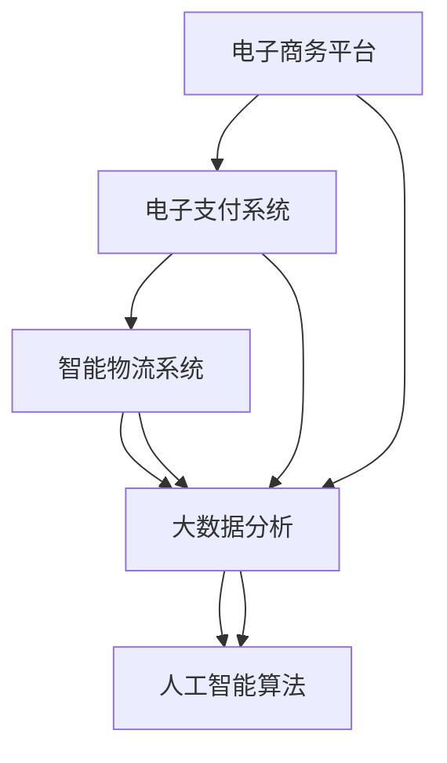
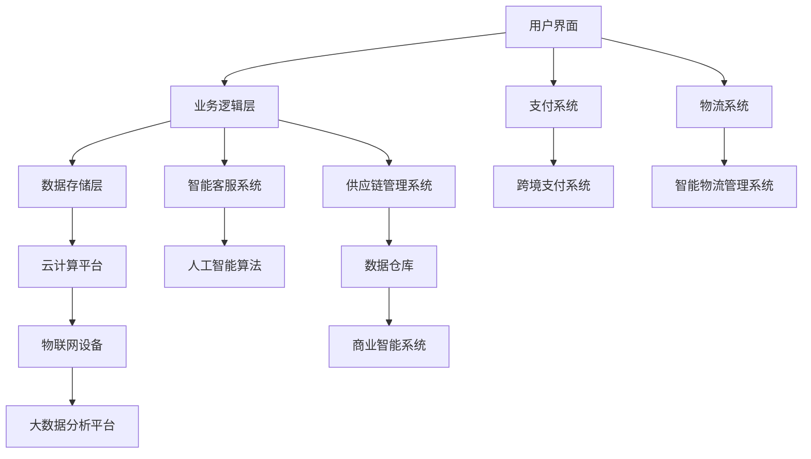

                 

## 摘要

随着全球化的深入发展和信息技术的迅速进步，全球贸易正经历一场深刻的数字化转型。本文以“2050年的全球贸易：从跨境电商到数字贸易的贸易数字化转型”为题，系统地探讨了贸易数字化转型的背景、概念、发展现状、影响及未来趋势。首先，文章介绍了贸易数字化转型的概念与背景，分析了其定义、特征、驱动因素和当前发展状况。随后，文章深入探讨了跨境电商的崛起与发展，包括其定义、模式、优势与劣势、生态系统以及发展趋势。接着，文章详细介绍了数字贸易平台与技术，包括平台的概念与功能、技术架构、关键技术及案例分析。此外，文章还分析了数字贸易政策与法规的发展、挑战及国际合作，以及数字贸易对全球经济、可持续发展的影响。最后，文章展望了数字贸易的未来发展趋势、全球格局及对我国的影响与应对策略。通过本文的探讨，读者可以全面了解贸易数字化转型的重要性及其对未来全球贸易的深远影响。文章旨在为政策制定者、企业家和研究者提供有价值的参考和启示，推动全球贸易的健康发展。

### 1.1 引言

全球贸易作为世界经济发展的关键驱动力，经历了数千年的演变和发展。从早期的以物易物到现代农业时代的商品贸易，再到工业革命后的机械化大规模生产，全球贸易始终在不断进步和变革。然而，随着信息技术的飞速发展，特别是在互联网、大数据、人工智能等技术的推动下，全球贸易正迎来一场前所未有的数字化转型。

#### 全球贸易的发展历程

- **农业时代**：以物易物为特征的原始贸易形式，人们通过直接交换所需的物品来满足生活需求。
- **工业时代**：工业革命带来机械化生产，商品生产效率大幅提升，贸易规模迅速扩大，国际分工逐步形成。
- **信息化时代**：互联网的普及使得全球信息交流变得更加便捷，电子商务逐渐兴起，贸易形式和方式发生了根本性变化。
- **数字贸易时代**：大数据、人工智能、物联网等新兴技术的应用，进一步加速了全球贸易的数字化转型。

#### 贸易数字化的意义与影响

贸易数字化不仅仅是技术层面的变革，更是全球贸易体系的一次深刻重塑。其意义和影响主要体现在以下几个方面：

- **提高效率**：数字化手段可以显著降低交易成本，简化交易流程，提高贸易效率。例如，通过电子支付和智能物流系统，贸易双方可以实时完成交易和交付，大大缩短了交易时间。
- **拓宽市场**：互联网打破了地理限制，使得企业能够轻松进入全球市场。跨境电商平台的兴起，使得中小企业也能够通过在线平台将商品销售到世界各地，极大地拓宽了市场空间。
- **促进创新**：数字化贸易激发了企业的创新活力。企业可以利用大数据分析、人工智能等技术，优化供应链管理，提升产品和服务质量，从而在激烈的市场竞争中脱颖而出。
- **优化资源配置**：数字贸易使得资源配置更加高效。通过大数据分析和智能算法，可以更准确地预测市场需求，优化库存管理，减少浪费，提高资源利用率。

#### 贸易数字化转型的重要性

贸易数字化不仅仅是技术进步的产物，更是全球经济一体化和可持续发展的重要驱动力。在全球经济面临诸多不确定性的背景下，贸易数字化有助于提高经济韧性，促进全球经济的稳定和可持续发展。

- **提升经济竞争力**：通过数字化手段，企业可以更加灵活地应对市场变化，提高生产效率和产品质量，从而增强竞争力。
- **推动产业升级**：数字贸易促进了传统产业的转型升级，推动了新兴产业的发展，为经济增长注入新的动力。
- **促进可持续发展**：数字贸易可以实现绿色贸易，通过优化供应链管理、减少浪费，降低碳排放，推动可持续发展目标的实现。

综上所述，贸易数字化转型是全球贸易发展的必然趋势，对全球经济的意义和影响深远。本文将深入探讨贸易数字化转型的各个方面，包括其概念、发展现状、影响及未来趋势，以期为读者提供全面的理解和洞察。

### 1.2 数字贸易的定义与特征

数字贸易，作为一种新兴的贸易形式，依托于互联网和现代信息技术，通过电子商务平台、电子支付系统等手段，实现跨国贸易的数字化、智能化和高效化。它不仅改变了传统贸易的方式，也深刻影响了全球贸易的格局。

#### 数字贸易的定义

数字贸易是指利用互联网、电子商务、大数据、人工智能等数字技术，进行国际贸易活动的过程。它涵盖了从商品采购、支付、物流到售后服务等各个环节的数字化操作。与传统贸易相比，数字贸易不仅减少了纸质文件的使用，还实现了信息的实时传输和处理，极大地提高了贸易效率。

#### 数字贸易的特征

1. **高效率**：数字贸易通过自动化和智能化的技术手段，简化了交易流程，减少了人为干预，从而大大提高了交易效率。例如，电子支付系统可以在几秒钟内完成跨境支付，智能物流系统可以实现实时跟踪货物状态，从而减少物流延误和损失。

2. **低成本**：数字贸易减少了传统贸易中所需的实体仓库、物流和人力资源，降低了交易成本。通过数字化手段，企业可以更加灵活地管理库存，优化供应链，减少库存积压和浪费。

3. **全球化**：互联网的普及使得全球贸易更加便捷和快速。企业可以通过跨境电商平台将商品销售到世界各地，消费者可以随时随地购买全球的商品，从而实现了真正的全球市场一体化。

4. **个性化**：基于大数据和人工智能技术，数字贸易可以为消费者提供更加个性化的购物体验。通过对消费者数据的分析，企业可以精准推荐商品，提高消费者的满意度和忠诚度。

5. **透明性**：数字贸易中的所有交易信息都可以通过互联网实时记录和查询，提高了交易过程的透明度。这种透明性不仅增加了交易的信任度，也减少了欺诈行为。

6. **可持续性**：数字贸易可以通过优化供应链管理、提高资源利用效率等方式，实现绿色贸易和可持续发展。例如，通过智能物流系统减少碳排放，通过电子支付减少纸质文件的使用，从而降低对环境的影响。

#### 数字贸易的核心概念与联系

为了更清晰地理解数字贸易的概念和原理，我们可以使用Mermaid流程图来展示其核心组成部分和它们之间的联系。



- **电子商务平台**：作为数字贸易的核心，电子商务平台提供商品展示、交易、支付等功能。
- **电子支付系统**：实现数字支付，确保交易安全高效。
- **智能物流系统**：提供实时跟踪、优化配送路径等功能。
- **大数据分析**：通过数据挖掘和分析，支持决策制定和运营优化。
- **人工智能算法**：用于个性化推荐、智能客服等，提升用户体验。

通过上述流程图，我们可以看到，这些核心组成部分相互联系，共同构成了数字贸易的技术架构。它们共同作用，实现了贸易过程的数字化、智能化和高效化。

总之，数字贸易作为一种新兴的贸易形式，以其高效率、低成本、全球化、个性化、透明性和可持续性等特征，正在深刻改变全球贸易的格局。理解和掌握数字贸易的概念和特征，对于企业和政策制定者来说，都具有重要意义。

### 1.3 贸易数字化转型的驱动因素

贸易数字化转型是全球贸易发展的重要趋势，这一变革的背后，是多种驱动因素的共同作用。以下是影响贸易数字化转型的几个关键驱动因素：

#### 技术进步

技术进步是贸易数字化转型最为重要的驱动因素之一。互联网、大数据、人工智能、物联网等新兴技术的迅速发展，为数字贸易提供了强大的技术支持。具体来说：

- **互联网**：互联网的普及为全球贸易提供了信息交流和交易平台，使得跨境贸易变得更加便捷和高效。
- **大数据**：大数据技术能够对海量数据进行实时分析和挖掘，帮助企业和政府做出更加精准的决策，优化供应链管理。
- **人工智能**：人工智能技术在数字贸易中的应用，如智能客服、个性化推荐系统等，大大提高了用户体验和运营效率。
- **物联网**：物联网技术实现了对货物、设备和环境的实时监控和管理，提高了物流效率和供应链透明度。

#### 全球化趋势

全球化趋势加速了贸易数字化转型的进程。随着全球经济的深度融合，各国之间的贸易往来日益频繁，数字化手段使得跨国贸易更加便捷和高效。以下是全球化趋势对贸易数字化转型的影响：

- **贸易自由化**：全球化推动贸易自由化进程，降低了贸易壁垒，促进了数字贸易的发展。
- **跨国企业**：跨国企业利用数字化手段在全球范围内优化资源配置，提高竞争力。
- **跨境电子商务**：全球化使得跨境电子商务迅速崛起，成为数字贸易的重要组成部分。

#### 政策支持

政策支持是贸易数字化转型的重要保障。各国政府和国际组织纷纷出台相关政策，推动数字贸易的发展。以下是一些具体的政策支持措施：

- **法律法规**：政府制定相关法律法规，保障数字贸易的合法性和安全性，如网络安全法、电子签名法等。
- **税收优惠**：政府通过税收优惠等措施，鼓励企业进行数字化改造，提高数字贸易的竞争力。
- **基础设施建设**：政府加大对互联网、数据中心等基础设施的投资，为数字贸易提供坚实的基础。
- **国际合作**：政府积极参与国际组织，如世界贸易组织（WTO）、联合国等，推动全球贸易规则制定，促进数字贸易发展。

#### 消费者需求

消费者需求是推动贸易数字化转型的重要动力。随着消费者对便捷、个性化和高品质商品的需求不断增长，数字化手段能够更好地满足这些需求：

- **个性化服务**：数字化技术使得企业可以基于大数据分析，为消费者提供个性化的商品推荐和定制服务。
- **便捷购物**：跨境电商平台和移动应用的发展，使得消费者可以随时随地购买全球商品，大大提高了购物便利性。
- **透明购物**：数字技术使得商品信息更加透明，消费者可以实时查看商品评价、物流状态等，增强了购物信心。

综上所述，技术进步、全球化趋势、政策支持和消费者需求是贸易数字化转型的四大驱动因素。这些因素相互促进，共同推动全球贸易向数字化、智能化方向演进。理解这些驱动因素，有助于更好地把握贸易数字化转型的趋势和机遇。

### 1.4 数字贸易的发展现状

数字贸易作为一种新兴的贸易形式，正在全球范围内迅速发展。随着技术的进步和全球化趋势的加强，数字贸易的规模不断扩大，参与主体日益多样，应用场景不断丰富。以下是数字贸易的发展现状：

#### 全球分布

1. **北美地区**：美国是数字贸易发展最为成熟的地区之一。美国拥有完善的数字基础设施和强大的技术实力，亚马逊、eBay等知名电商平台引领全球数字贸易的发展。此外，加拿大在数字贸易方面也有显著表现，特别是在跨境电子商务领域。

2. **欧洲地区**：欧洲各国在数字贸易方面表现出色，欧盟成员国积极推动数字贸易的发展。德国、英国、法国等国家的电商平台和国际物流系统相对完善，为数字贸易提供了良好的环境。此外，东欧和南欧国家也在迅速追赶，数字贸易发展势头强劲。

3. **亚洲地区**：中国是数字贸易发展最快的国家之一。阿里巴巴、京东等大型电商平台引领全球数字贸易潮流，中国的跨境电商业务在全球范围内占据重要地位。此外，印度、新加坡等亚洲国家的数字贸易发展也迅速，特别是在跨境电商和移动支付领域。

4. **其他地区**：澳大利亚、新西兰等发达国家在数字贸易方面也取得了一定的进展。非洲和拉丁美洲等发展中国家的数字贸易发展相对较慢，但也在逐步推进中。

#### 主要参与者

数字贸易的主要参与者包括以下几类：

1. **跨国公司**：跨国公司利用数字技术进行全球贸易，通过跨境电商平台将产品销售到世界各地。例如，亚马逊、微软、苹果等国际知名企业，在数字贸易中扮演着重要角色。

2. **电商平台**：电商平台是数字贸易的重要平台，如亚马逊、阿里巴巴、eBay等。这些平台不仅为消费者提供便捷的购物体验，也为商家提供全球销售渠道。

3. **中小企业**：数字贸易为中小企业提供了进入全球市场的机会。通过跨境电商平台，中小企业可以轻松地将产品销售到海外市场，提高销售额和竞争力。

4. **物流服务提供商**：物流服务提供商在数字贸易中扮演着关键角色。通过智能物流系统，物流服务提供商能够实现跨境货物的实时跟踪和高效配送。

#### 发展趋势

1. **消费者需求变化**：随着消费者对个性化、高品质商品的需求增加，数字贸易将更加注重消费者体验和个性化服务。大数据和人工智能技术将在这一过程中发挥重要作用。

2. **技术创新**：5G、物联网、区块链等新兴技术的应用，将进一步推动数字贸易的发展。这些技术可以提高交易效率、增强交易安全性，并优化物流和供应链管理。

3. **政策支持**：各国政府纷纷出台支持数字贸易发展的政策，如税收优惠、法律法规完善等。这些政策将有助于数字贸易的规范化和可持续发展。

4. **全球合作**：随着全球贸易一体化进程的加快，各国之间的数字贸易合作将更加紧密。通过国际规则和标准的制定，数字贸易将实现更广泛的应用和更高效的发展。

总之，数字贸易在全球范围内迅速发展，已成为全球贸易的重要组成部分。随着技术的进步和全球化趋势的加强，数字贸易将继续拓展其应用范围，为全球贸易带来更多机遇和挑战。

### 1.5 贸易数字化对企业的影响

贸易数字化不仅改变了全球贸易的格局，也对企业的运营模式、市场拓展和竞争优势产生了深远影响。以下是贸易数字化对企业的主要影响：

#### 降低交易成本

贸易数字化通过简化交易流程、减少人为干预和自动化操作，大幅降低了交易成本。具体来说：

- **电子支付**：数字化支付系统如支付宝、微信支付和信用卡支付，使得跨境支付变得更加快捷和安全，减少了支付过程中的时间和费用。
- **智能物流**：智能物流系统通过实时监控货物状态、优化配送路径，减少了物流成本和运输时间。
- **数字化管理**：企业通过数字化工具如ERP系统、CRM系统等，实现供应链的实时管理和优化，提高了运营效率，降低了管理成本。

#### 提高效率

数字化技术的应用显著提高了企业的运营效率，使企业能够更快速地响应市场需求和客户需求。以下是几个具体方面：

- **自动化流程**：自动化工具和系统如RPA（机器人流程自动化）和AI（人工智能），可以自动完成重复性高、规则明确的任务，减少了人工操作的错误和耗时。
- **实时数据监控**：企业可以通过数字化手段实时监控生产、库存、销售等关键业务数据，及时调整生产和销售策略，提高运营效率。
- **智能决策支持**：基于大数据和人工智能技术的分析工具，可以帮助企业进行市场预测、需求分析等，从而做出更加科学的决策。

#### 拓展市场

贸易数字化使企业能够轻松进入全球市场，拓宽销售渠道，增加销售额。以下是几个具体方面：

- **跨境电商平台**：通过跨境电商平台，如亚马逊、阿里巴巴等，企业可以轻松地将产品销售到世界各地，打破了地域限制。
- **移动应用**：随着移动设备的普及，企业可以通过移动应用和社交媒体平台，更直接地与全球消费者进行互动和销售。
- **本地化营销**：企业可以利用大数据和人工智能技术，进行本地化营销，根据不同地区的消费者偏好和习惯，定制化营销策略，提高市场渗透率。

#### 改善客户体验

数字化技术使企业能够提供更加个性化的客户服务，提升客户满意度和忠诚度。以下是几个具体方面：

- **个性化推荐**：基于大数据和人工智能技术，企业可以根据消费者的购买历史和偏好，提供个性化的商品推荐，提高购物体验。
- **智能客服**：通过智能客服系统，企业可以提供24/7的在线服务，快速响应客户问题，提高客户满意度。
- **透明购物**：数字化技术使得商品信息、物流信息更加透明，消费者可以实时查看订单状态和物流信息，增强了购物信心。

#### 提升竞争优势

贸易数字化使企业能够通过创新和技术应用，提升自身竞争优势。以下是几个具体方面：

- **技术创新**：通过数字化技术，企业可以不断进行技术创新，推出新产品、新服务，保持市场竞争力。
- **数据驱动的决策**：企业通过大数据分析，可以更准确地了解市场需求和消费者行为，做出更加科学的决策。
- **供应链优化**：通过数字化手段，企业可以优化供应链管理，提高供应链效率，降低库存成本，提高生产效率。

总之，贸易数字化对企业的影响是全方位的，不仅降低了交易成本、提高了效率，还拓展了市场、改善了客户体验，并提升了竞争优势。企业应积极拥抱数字化变革，利用数字技术优化运营、提升竞争力，在激烈的市场竞争中立于不败之地。

### 1.6 贸易数字化转型面临的挑战

尽管贸易数字化转型带来了诸多机遇，但其发展过程中也面临一系列挑战。以下是贸易数字化转型所面临的主要挑战：

#### 数据安全与隐私

数据安全与隐私是贸易数字化转型中最突出的挑战之一。在数字贸易中，大量的商业数据和个人信息通过互联网传输，极易成为黑客攻击的目标。以下是一些具体问题：

- **数据泄露风险**：由于网络攻击、系统漏洞等原因，数据泄露事件频发，可能导致敏感信息被窃取，造成严重的经济损失和信誉损害。
- **数据隐私保护**：随着数据量的不断增加，如何保护个人隐私成为一大难题。特别是在跨境数据流动中，不同国家和地区的隐私保护法规存在差异，使得数据保护变得更加复杂。
- **加密技术**：虽然加密技术可以增强数据安全性，但加密算法的破解风险始终存在，需要不断更新和改进。

#### 政策法规

政策法规是贸易数字化转型面临的另一个重大挑战。数字贸易的快速发展对现有法律体系和政策框架提出了新的要求：

- **跨境数据流动**：随着数据跨境流动的增多，各国对于数据跨境流动的监管政策存在差异，可能引发法律冲突和监管难题。
- **数据保护法规**：不同国家和地区的数据保护法规不尽相同，如欧盟的《通用数据保护条例》（GDPR）对数据保护提出了严格要求，对企业合规带来了挑战。
- **税收政策**：数字贸易的税收问题复杂，各国对于跨国公司的税收政策存在争议，可能导致税收冲突和逃避税问题。

#### 技术标准化

技术标准化是贸易数字化转型面临的另一大挑战。数字贸易涉及多种技术，如云计算、物联网、区块链、人工智能等，这些技术标准的统一性有待提高：

- **技术多样性**：不同技术标准之间的兼容性问题，可能导致系统间的互操作性和集成性差，影响数字贸易的顺利进行。
- **技术更新换代**：随着技术的快速进步，旧有技术标准可能被淘汰，新标准尚未普及，导致技术更新换代带来的兼容性问题。
- **标准化组织**：国际标准化组织（ISO）等机构在制定数字贸易技术标准方面发挥着重要作用，但标准的制定和实施过程复杂，需要各方共同努力。

#### 企业适应能力

贸易数字化对企业提出了新的要求，企业需要具备一定的适应能力才能在数字化浪潮中生存和发展：

- **数字化转型能力**：企业需要投入大量资源进行数字化转型，包括技术升级、人才培养等，但并非所有企业都能承担这种转型成本。
- **技术创新能力**：企业需要不断进行技术创新，保持竞争力，但技术创新也存在风险和不确定性。
- **风险管理能力**：企业需要具备强大的风险管理能力，应对数字化带来的风险，如数据安全、合规性等。

总之，贸易数字化转型虽然充满机遇，但同时也面临诸多挑战。解决这些挑战需要政府、企业和技术机构的共同努力，通过政策法规的完善、技术标准的统一和企业能力的提升，推动数字贸易的健康发展。

### 1.7 本书结构

为了帮助读者全面了解贸易数字化转型的各个方面，本书分为七个主要部分，每个部分都有其独特的内容和目标。

#### 第一部分：贸易数字化转型概述

本部分主要介绍贸易数字化转型的背景、概念、特征及发展现状。通过这一部分的阅读，读者可以初步了解贸易数字化转型的基本概念及其在全球贸易中的重要性。

- **第1章：贸易数字化转型的概念与背景**：介绍全球贸易的发展历程以及贸易数字化的意义与影响。
- **第2章：跨境电商的崛起与发展**：探讨跨境电商的定义、模式、优势与劣势及其发展历程。

#### 第二部分：跨境电商的崛起与发展

本部分深入探讨跨境电商的崛起与发展，包括其生态系统、优势与劣势以及未来发展趋势。通过这一部分的阅读，读者可以了解跨境电商的核心特点和未来方向。

- **第3章：跨境电商的定义与模式**：详细解释跨境电商的两种主要模式：B2B和
```bash
# 跨境电商的定义与模式

## 2.1 跨境电商的定义

跨境电商是指通过互联网平台，实现商品从一国向另一国的直接交易和配送。跨境电商不仅涵盖了传统国际贸易的B2B（企业对企业）模式，还包括B2C（企业对消费者）模式。跨境电商通过数字化手段，简化了交易流程，提高了贸易效率，降低了交易成本，使得全球贸易变得更加便捷和高效。

## 2.2 跨境电商的模式

### B2B模式

B2B跨境电商模式指的是企业之间的跨境交易，通常涉及大宗商品、工业用品、原材料等。其主要特点如下：

- **大宗交易**：B2B模式通常涉及大额交易，企业的采购和销售规模较大。
- **B2B平台**：电商平台如阿里巴巴国际站、环球资源等，为B2B跨境电商提供交易和展示平台。
- **供应链管理**：B2B模式强调供应链管理，包括供应商管理、订单处理、物流配送等。

### B2C模式

B2C跨境电商模式指的是企业直接向消费者销售商品，主要面向个人消费者。其主要特点如下：

- **小额交易**：B2C模式通常涉及小额交易，适合单件商品的零售销售。
- **电商平台**：B2C模式的典型代表是亚马逊、eBay、京东等大型电商平台，这些平台提供商品展示、支付、物流等服务。
- **消费者体验**：B2C模式注重消费者体验，通过个性化推荐、快速配送、客户服务等提升用户满意度。

## 2.3 跨境电商的发展历程

跨境电商的发展历程可以分为以下几个阶段：

### 萌芽阶段

- **互联网兴起**：1990年代初期，互联网的普及为跨境电商的萌芽提供了基础。
- **初步尝试**：企业开始通过电子邮件、网络平台进行跨境交易尝试，但规模有限。

### 发展阶段

- **电商平台兴起**：2000年代，亚马逊、eBay等跨境电商平台兴起，推动了跨境电商的快速发展。
- **移动支付普及**：移动支付技术的普及，如支付宝、微信支付，使得跨境支付更加便捷。

### 成熟阶段

- **全球化扩张**：跨境电商企业逐步实现全球化扩张，覆盖更多国家和地区。
- **技术创新**：大数据、人工智能、区块链等技术在跨境电商中的应用，提高了交易效率和安全。

## 2.4 跨境电商的优势与劣势

### 优势

- **拓宽市场**：跨境电商帮助企业进入新的市场，实现全球化布局。
- **降低成本**：通过数字化手段，跨境电商降低了物流、库存、支付等成本。
- **提高效率**：跨境电商平台简化了交易流程，提高了交易效率。

### 劣势

- **运输成本**：跨国运输成本较高，增加了企业的运营成本。
- **文化差异**：不同国家和地区的文化差异可能影响消费者购买决策。
- **语言障碍**：语言障碍可能导致沟通不畅，影响交易过程。

## 2.5 跨境电商的生态系统

跨境电商的生态系统包括以下主要角色：

### 平台运营商

- **电商平台**：如亚马逊、阿里巴巴等，提供商品展示、交易、支付、物流等服务。
- **平台技术**：平台技术包括云计算、大数据、人工智能等，用于提高交易效率和用户体验。

### 跨境卖家

- **中小企业**：通过电商平台开展跨境电商业务，利用数字化手段降低运营成本。
- **大型品牌**：知名品牌通过跨境电商平台销售商品，提高品牌国际知名度。

### 跨境物流服务商

- **国际物流**：如DHL、UPS、联邦快递等，提供跨境物流配送服务。
- **本地配送**：与当地物流公司合作，实现跨境商品的本地化配送。

## 2.6 跨境电商的发展趋势

### 消费者需求变化

- **个性化需求**：消费者对个性化商品的需求增加，跨境电商平台通过大数据和人工智能提供个性化推荐。
- **高品质商品**：消费者对高品质商品的需求上升，跨境电商平台引进更多高品质品牌商品。

### 技术创新

- **5G与物联网**：5G和物联网技术提高物流效率，实现货物实时监控和管理。
- **区块链与人工智能**：区块链技术提高交易透明度和安全性，人工智能技术提升用户体验和运营效率。

通过以上内容，读者可以全面了解跨境电商的定义、模式、发展历程、优势与劣势、生态系统以及发展趋势。这些信息有助于读者深入理解跨境电商的现状及其未来发展前景。

### 3.1 数字贸易平台的概念与功能

数字贸易平台是一种基于互联网和现代信息技术的综合性平台，旨在为贸易双方提供从商品采购、支付、物流到售后服务等全方位的数字化服务。它通过集成多种技术手段，实现贸易流程的自动化、智能化和高效化，从而大幅提升贸易效率，降低交易成本。

#### 概念

数字贸易平台是指依托互联网和现代信息技术，通过电子商务、云计算、大数据、人工智能等技术手段，提供商品展示、交易、支付、物流、售后等一站式服务，实现跨国贸易数字化、智能化和高效化的平台。

#### 功能

数字贸易平台的功能主要包括以下几个方面：

1. **商品展示与交易**：平台提供商品分类、展示、推荐等功能，帮助卖家推广商品，消费者浏览和选择商品。同时，平台提供安全、便捷的在线支付方式，实现交易的电子化。

2. **支付结算**：数字贸易平台支持多种支付方式，如信用卡、电子钱包、移动支付等，确保交易的安全和高效。平台还提供跨境支付功能，简化跨境交易的支付流程。

3. **物流服务**：数字贸易平台与多家物流服务提供商合作，提供全球物流配送服务。平台通过智能物流管理系统，实现货物的实时跟踪、优化配送路径，提高物流效率。

4. **数据分析**：平台通过大数据技术，收集和分析用户行为数据、交易数据等，提供商业智能支持。企业可以利用这些数据，优化供应链管理，提高销售策略。

5. **智能客服**：数字贸易平台集成人工智能技术，提供智能客服服务，实时解答消费者的问题，提升用户体验。

6. **售后服务**：平台提供售后服务，如商品退换货、投诉处理等，保障消费者的合法权益。

#### 平台架构

数字贸易平台的架构通常包括以下几个主要层次：

1. **前端展示层**：负责展示商品信息、用户界面交互等，通过网页、移动应用等方式提供服务。
2. **业务逻辑层**：处理业务逻辑，包括商品管理、交易处理、支付结算、物流管理等，实现业务流程的自动化和智能化。
3. **数据存储层**：存储交易数据、用户数据、商品数据等，通过数据库和缓存系统提供数据支持。
4. **基础设施层**：提供云计算、大数据、人工智能等底层技术支持，确保平台的稳定性和可靠性。

通过上述架构，数字贸易平台能够实现贸易全流程的数字化，提高贸易效率，降低交易成本，为企业和消费者提供更好的服务体验。

### 3.2 数字贸易平台的技术架构

数字贸易平台的技术架构是确保其功能实现和高效运行的核心基础。它通常包括云计算、物联网、大数据等先进技术的综合应用，以下是对这些技术及其在数字贸易平台中作用的具体分析。

#### 云计算

云计算作为数字贸易平台的核心技术之一，为平台提供了强大的计算和存储能力。以下是云计算在数字贸易平台中的具体应用：

1. **弹性计算资源**：云计算平台可以根据业务需求动态调整计算资源，确保在高峰期和低峰期都能够提供稳定、高效的计算服务。
2. **数据存储和管理**：云存储服务提供了安全、可靠、高效的数据存储和管理解决方案，支持大规模数据的存储和快速访问。
3. **数据分析和处理**：云计算平台提供了强大的数据处理和分析工具，如数据仓库、数据挖掘工具等，帮助企业从海量数据中提取有价值的信息，优化业务决策。

#### 物联网

物联网（IoT）技术在数字贸易平台中的应用，主要在于实现货物的实时监控和管理，提高物流效率。以下是物联网在数字贸易平台中的具体应用：

1. **智能物流管理**：物联网设备可以实时监控货物的位置、状态和温度等，通过智能算法优化物流路径，提高配送效率。
2. **设备监控和维护**：物联网技术可以实时监控物流设备的状态，如车辆、仓储设备的运行情况，提前预警潜在故障，减少停机时间和维护成本。
3. **供应链透明化**：物联网技术实现了供应链的全程可视化管理，供应链各方可以实时了解货物的状态和位置，提高供应链透明度和协同效率。

#### 大数据

大数据技术在数字贸易平台中的应用，主要体现在数据分析与决策支持方面。以下是大数据在数字贸易平台中的具体应用：

1. **消费者行为分析**：大数据技术可以收集和分析消费者的购买行为、搜索记录等数据，为企业提供精准的市场洞察，帮助制定个性化的营销策略。
2. **需求预测和库存管理**：通过对历史销售数据、市场趋势等大数据的分析，企业可以更准确地预测市场需求，优化库存管理，减少库存积压和缺货现象。
3. **供应链优化**：大数据技术可以全面分析供应链各环节的数据，如采购、生产、物流等，发现潜在的问题和瓶颈，优化供应链管理，提高整体效率。

#### 技术集成

数字贸易平台的技术架构不仅仅是云计算、物联网和大数据等技术的简单堆叠，还需要实现这些技术之间的无缝集成和协同工作。以下是一个典型的数字贸易平台技术架构图：



- **用户界面**：提供用户与平台交互的接口，展示商品信息、交易流程等。
- **业务逻辑层**：处理用户的操作、交易处理、支付结算、物流管理等业务逻辑。
- **数据存储层**：存储用户数据、交易数据、商品数据等。
- **云计算平台**：提供弹性计算资源和数据存储。
- **物联网设备**：实现货物的实时监控和管理。
- **大数据分析平台**：提供数据分析和决策支持。
- **支付系统**：处理支付结算。
- **物流系统**：提供物流服务。
- **智能客服系统**：提供24/7的智能客服服务。
- **供应链管理系统**：优化供应链管理。
- **跨境支付系统**：处理跨境支付。
- **智能物流管理系统**：实现物流路径优化和实时监控。
- **人工智能算法**：用于个性化推荐、智能客服等。
- **数据仓库**：存储大量交易数据、用户数据等。
- **商业智能系统**：提供商业决策支持。

通过上述技术架构的集成和协同工作，数字贸易平台能够实现高效、智能、安全的全球贸易服务，为企业和消费者提供卓越的贸易体验。

### 3.3 数字贸易平台的关键技术

数字贸易平台的成功依赖于一系列关键技术的应用，这些技术不仅提高了平台的效率和用户体验，还确保了交易的安全性和可靠性。以下是数字贸易平台中几个重要的关键技术及其原理：

#### 区块链

区块链技术是一种分布式账本技术，通过去中心化的方式记录和管理交易数据，确保数据的安全性和透明性。以下是区块链在数字贸易平台中的应用和原理：

1. **去中心化**：区块链通过去中心化的方式，不需要中心化的中介机构，降低了交易的成本和复杂度。
2. **不可篡改性**：区块链上的数据一旦记录，就无法被篡改，确保了交易记录的真实性和可靠性。
3. **智能合约**：区块链技术中的智能合约，是一种自执行合同，根据预定的条件自动执行合同条款，提高了交易的效率和自动化程度。
4. **应用场景**：数字贸易平台可以利用区块链技术实现跨境支付、物流跟踪、供应链管理等功能，提高交易的透明度和安全性。

#### 人工智能

人工智能技术在数字贸易平台中的应用，主要在于提升用户体验、优化业务流程和增强安全性。以下是人工智能在数字贸易平台中的应用和原理：

1. **推荐系统**：人工智能可以通过分析用户的历史购买数据和行为习惯，提供个性化的商品推荐，提高用户满意度和转化率。
2. **智能客服**：智能客服系统利用自然语言处理和机器学习技术，可以24/7地解答用户问题，提高客户服务效率。
3. **风险管理**：人工智能可以通过数据分析，识别潜在的欺诈行为和信用风险，提高交易的安全性。
4. **应用场景**：数字贸易平台可以利用人工智能技术实现个性化推荐、智能客服、风险控制等功能，提升用户体验和运营效率。

#### 云计算

云计算技术为数字贸易平台提供了强大的计算和存储能力，确保平台的稳定性和灵活性。以下是云计算在数字贸易平台中的应用和原理：

1. **弹性计算资源**：云计算平台可以根据业务需求动态调整计算资源，确保在高峰期和低峰期都能够提供稳定、高效的计算服务。
2. **分布式存储**：云计算平台提供了分布式存储解决方案，确保数据的高可用性和安全性。
3. **数据分析和处理**：云计算平台提供了强大的数据处理和分析工具，如数据仓库、数据挖掘工具等，帮助企业从海量数据中提取有价值的信息。
4. **应用场景**：数字贸易平台可以利用云计算技术实现弹性计算、分布式存储、大数据分析等功能，提高平台的性能和可靠性。

#### 物联网

物联网技术通过连接各种设备，实现实时监控和管理，提高了物流和供应链的效率。以下是物联网在数字贸易平台中的应用和原理：

1. **实时监控**：物联网设备可以实时监控货物的位置、状态和温度等，确保物流过程的透明度和可控性。
2. **智能调度**：物联网技术可以实现智能物流调度，优化配送路径，减少运输时间和成本。
3. **设备维护**：物联网技术可以实时监控设备的运行状态，提前预警潜在故障，减少设备故障和停机时间。
4. **应用场景**：数字贸易平台可以利用物联网技术实现实时监控、智能调度、设备维护等功能，提高物流效率和管理水平。

综上所述，区块链、人工智能、云计算和物联网等关键技术，在数字贸易平台中发挥着重要作用。这些技术不仅提高了平台的效率和用户体验，还确保了交易的安全性和可靠性，为数字贸易的健康发展提供了有力支持。

### 3.4 数字贸易平台的案例分析

为了更深入地了解数字贸易平台的实际应用和效果，下面我们将通过两个典型案例：亚马逊全球开店和阿里巴巴国际站，来分析数字贸易平台的运营模式、技术优势和挑战。

#### 亚马逊全球开店

**运营模式**：

亚马逊全球开店（Amazon Global Store）是亚马逊推出的一项服务，旨在帮助全球卖家将产品销售到亚马逊在全球范围内的多个市场。这一模式主要分为以下几个步骤：

1. **商品上架**：卖家在亚马逊平台上注册账号，上传商品信息，包括商品图片、描述、价格等。
2. **市场定位**：亚马逊会根据卖家的商品和目标市场，为卖家提供市场定位建议，优化商品信息，提高曝光率。
3. **订单处理**：买家在亚马逊平台上下单后，卖家需要处理订单，包括商品打包、发货等。
4. **支付结算**：亚马逊提供跨境支付服务，买家支付后，资金会直接转入卖家账户。

**技术优势**：

1. **大数据分析**：亚马逊利用大数据分析技术，为卖家提供市场趋势、消费者行为等数据，帮助卖家优化商品销售策略。
2. **智能物流**：亚马逊拥有全球范围内的物流网络，可以实现快速、安全的跨境物流配送。
3. **全球化运营**：亚马逊在全球多个市场拥有强大的品牌影响力和用户基础，为卖家提供了广阔的销售渠道。

**挑战**：

1. **文化差异**：不同国家和地区的消费者文化、消费习惯和需求存在差异，卖家需要针对不同市场调整产品策略。
2. **本地化运营**：卖家需要了解并遵守不同市场的法律法规，进行本地化运营，这增加了运营复杂度。
3. **物流成本**：跨境物流成本较高，影响卖家利润率。

#### 阿里巴巴国际站

**运营模式**：

阿里巴巴国际站（Alibaba.com）是全球领先的B2B电商平台，主要为全球中小企业提供贸易机会。其运营模式主要包括：

1. **商品展示**：卖家在平台上展示其产品信息，包括产品图片、详细描述等。
2. **在线沟通**：买家可以通过平台与卖家进行实时沟通，了解产品详情和交易条件。
3. **订单确认**：买家确认订单后，卖家需要发货，并通过平台提供物流信息。
4. **支付结算**：阿里巴巴国际站提供多种支付方式，如信用证、支付宝等，确保交易安全。

**技术优势**：

1. **大数据和人工智能**：阿里巴巴利用大数据和人工智能技术，为卖家提供市场洞察、推荐算法等，帮助卖家优化销售策略。
2. **全球化网络**：阿里巴巴在全球多个国家和地区设有分支机构和数据中心，为跨境交易提供了强大的支持。
3. **诚信保障**：阿里巴巴建立了完善的信用评价体系，为买卖双方提供信用保障。

**挑战**：

1. **市场竞争**：阿里巴巴国际站上的卖家众多，市场竞争激烈，卖家需要不断提升产品和服务质量才能脱颖而出。
2. **物流和配送**：跨境物流和配送的复杂性和成本问题，是卖家面临的主要挑战之一。
3. **法律和合规**：不同国家和地区的法律法规存在差异，卖家需要确保其运营符合当地法律法规。

通过上述案例分析，我们可以看到，亚马逊和阿里巴巴国际站作为全球领先的数字贸易平台，在运营模式、技术优势和面临的挑战方面具有显著的相似性和差异性。这些案例不仅展示了数字贸易平台的强大功能和应用前景，也为其他平台和企业提供了宝贵的经验和启示。

### 4.1 数字贸易政策的发展

数字贸易政策的制定和实施对于促进数字贸易的发展至关重要。随着全球贸易的数字化转型，各国政府和国际组织纷纷出台一系列数字贸易政策，旨在推动数字贸易的自由化和规范化。以下是对数字贸易政策发展现状的概述。

#### 政府数字贸易政策

各国政府为了推动数字贸易的发展，制定了一系列政策和支持措施：

1. **税收政策**：许多国家通过减免关税、提供税收优惠政策等手段，鼓励企业参与数字贸易。例如，中国推出了跨境电子商务综合试验区，实施一系列税收优惠措施。

2. **法律法规**：政府制定相关法律法规，保障数字贸易的合法性和安全性。例如，欧盟的《通用数据保护条例》（GDPR）对数据隐私和安全提出了严格的要求，确保跨境数据流动的安全。

3. **基础设施建设**：政府加大对互联网和数据中心等基础设施的投资，为数字贸易提供坚实的基础。例如，印度政府推出了“数字印度”计划，旨在推动数字化基础设施的建设。

4. **支持中小企业**：政府通过提供财政补贴、培训和技术支持等措施，帮助中小企业参与数字贸易。例如，美国的小企业管理局（SBA）提供了一系列数字贸易支持计划。

#### 国际贸易组织政策

国际组织也在积极推动数字贸易政策的制定和实施：

1. **世界贸易组织（WTO）**：WTO在数字贸易领域推动了多边贸易规则的制定。例如，WTO推出的《电子商务协定》（E-commerce Agreement）旨在促进全球电子商务的自由化。

2. **亚太经济合作组织（APEC）**：APEC在推动区域数字贸易合作方面发挥了重要作用。APEC通过《亚太经合组织电子商务框架》等文件，推动成员国之间的数字贸易合作。

3. **区域全面经济伙伴关系协定（RCEP）**：RCEP作为世界上最大的自由贸易区之一，旨在促进成员国之间的数字贸易合作，降低数字贸易壁垒。

#### 数字贸易政策的影响

数字贸易政策的制定和实施对全球贸易产生了深远影响：

1. **促进贸易自由化**：数字贸易政策的推动有助于减少数字贸易壁垒，促进全球贸易自由化，提高全球贸易效率。

2. **降低交易成本**：通过减免关税、提供税收优惠等措施，数字贸易政策有助于降低数字贸易的交易成本，提高企业参与数字贸易的积极性。

3. **促进创新**：数字贸易政策鼓励企业利用新技术和平台开展数字贸易，推动产业创新和技术进步。

4. **提高透明度**：数字贸易政策的实施提高了贸易过程的透明度，降低了交易风险，增强了市场信心。

总之，数字贸易政策的制定和实施是推动数字贸易发展的重要手段。各国政府和国际组织需要共同努力，通过完善政策框架、加强国际合作，推动全球数字贸易的健康、稳定和可持续发展。

### 4.2 数字贸易法规的挑战

数字贸易的快速发展带来了诸多机遇，但同时也引发了一系列法规挑战，这些挑战主要集中在数据跨境流动和个人信息保护方面。

#### 数据跨境流动的法规挑战

数据跨境流动是数字贸易的核心环节，但在不同国家和地区，数据跨境流动的法规存在显著差异，这给数字贸易带来了复杂的问题。

1. **数据主权**：不同国家对于数据主权有着不同的理解和立场。一些国家，如中国、印度和俄罗斯，对数据跨境流动持严格监管态度，要求企业在其境内收集和存储的数据必须留在本地。这限制了跨国公司的业务灵活性和效率。

2. **法规不一致**：全球范围内，各国在数据跨境流动方面的法律法规不尽相同，这导致了国际业务的法律风险。例如，欧盟的《通用数据保护条例》（GDPR）对数据跨境流动有严格的规定，而其他国家可能没有类似的法律框架。

3. **合规成本**：企业需要投入大量资源来遵守不同国家和地区的法规，这增加了合规成本。跨国公司必须建立复杂的数据治理体系，以应对各国法规的要求。

#### 个人信息保护的法规挑战

随着数字贸易的普及，个人信息的收集、处理和传输变得更加频繁和复杂，个人信息保护成为法规挑战的另一个重要方面。

1. **隐私保护法规**：全球范围内，各国对个人信息保护的法律要求日益严格。例如，欧盟的GDPR被认为是目前最严格的个人信息保护法规，要求企业在处理个人信息时必须获得用户的明确同意，并采取严格的数据保护措施。

2. **数据泄露风险**：数字贸易过程中，大量的个人信息在网络上传输和存储，增加了数据泄露的风险。一旦发生数据泄露事件，企业不仅面临经济损失，还会面临严重的法律后果和信誉损害。

3. **跨国数据传输**：数字贸易往往涉及跨国数据传输，如何确保跨国传输过程中的个人信息安全，是一个重要的法规挑战。例如，不同国家和地区的隐私保护法规对跨国数据传输的要求可能存在冲突，导致企业难以操作。

#### 解决方案

为了应对这些法规挑战，企业和政府可以采取以下措施：

1. **建立全球合规框架**：企业需要建立全球合规框架，确保在全球范围内的业务操作符合当地法律法规。这包括建立统一的数据治理政策、数据保护标准和合规流程。

2. **加强技术防护**：企业应加强技术防护，采用先进的加密技术和安全措施，确保数据在传输和存储过程中的安全。例如，使用端到端加密技术、防火墙和安全审计工具等。

3. **国际合作**：政府间应加强国际合作，制定统一的数字贸易法规和标准，降低跨国业务的法律风险。国际组织可以发挥重要作用，推动全球数字贸易法规的一致性和协调性。

4. **加强教育和培训**：企业应加强员工的教育和培训，提高其对数据安全和隐私保护的意识。员工应当了解不同国家和地区的法律法规要求，并掌握相应的数据保护技能。

总之，数字贸易法规的挑战需要企业、政府和国际社会的共同努力来应对。通过建立全球合规框架、加强技术防护、国际合作和员工培训，可以有效降低数字贸易的法规风险，推动数字贸易的健康、稳定和可持续发展。

### 4.3 数字贸易法规的国际合作

数字贸易的全球化特性要求各国在法规层面进行紧密合作，以确保跨国交易的公平性、安全性和透明度。以下是数字贸易法规国际合作的重要方面：

#### 数字贸易协定的制定

1. **世界贸易组织（WTO）**：WTO作为全球贸易的主导机构，致力于推动数字贸易的规则制定。例如，《电子商务协定》为全球电子商务提供了基本的法律框架，促进了跨境数据流动和电子商务的自由化。

2. **区域贸易协定**：区域贸易协定如区域全面经济伙伴关系协定（RCEP）和跨太平洋伙伴关系协定（TPP）等，在推动数字贸易法规的国际合作方面发挥了重要作用。这些协定通常包含专门章节，针对数字贸易的关税减免、数据跨境流动、隐私保护等问题进行规定。

3. **双边协定**：各国通过双边协定，就数字贸易的具体问题进行协商和规定。例如，美国与中国之间的双边贸易协定可能涉及数字贸易领域的合作，包括数据跨境流动、网络安全等。

#### 国际法规的协调

1. **数据隐私保护法规**：随着数字贸易的发展，数据隐私保护成为各国关注的焦点。国际社会通过合作，制定统一的隐私保护标准和规则，如《通用数据保护条例》（GDPR）的全球推广，有助于提高数据跨境流动的透明度和安全性。

2. **跨境数据传输规则**：各国通过国际合作，制定跨境数据传输的规则，确保数据在跨国传输过程中的合法性和安全性。例如，国际数据传输协议（IDTP）等框架为跨国数据传输提供了指导。

3. **网络安全标准**：国际社会在网络安全标准方面进行协调，制定统一的网络安全规则，提高数字贸易的安全性和可靠性。国际标准化组织（ISO）和国际电信联盟（ITU）等机构在这一领域发挥了重要作用。

#### 数字贸易论坛与会议

1. **世界电子商务论坛（WEF）**：世界电子商务论坛是国际社会讨论数字贸易政策和法规的重要平台。各国代表在论坛上交流经验，探讨数字贸易的挑战和解决方案。

2. **APEC电子商务论坛**：亚太经济合作组织（APEC）的电子商务论坛通过区域合作，推动数字贸易法规的一致性和协调性，促进APEC成员国的数字贸易发展。

3. **WTO贸易谈判**：WTO的贸易谈判委员会定期举行会议，讨论数字贸易议题，推动全球数字贸易规则的制定和实施。

#### 跨国合作项目

1. **跨境数据交换项目**：一些跨国合作项目致力于推动跨境数据交换，提高数据跨境流动的效率。例如，欧盟与美国之间的“隐私盾牌”（Privacy Shield）项目，旨在保障跨大西洋数据传输的隐私和安全。

2. **数字贸易创新实验室**：各国政府和企业合作建立数字贸易创新实验室，开展数字贸易相关的研究和实验，推动技术创新和法规改革。

总之，数字贸易法规的国际合作是推动数字贸易健康发展的重要保障。通过制定数字贸易协定、协调国际法规、举办论坛与会议以及开展跨国合作项目，国际社会可以共同应对数字贸易带来的挑战，促进全球数字贸易的繁荣与稳定。

### 4.4 数字贸易政策对我国的影响

数字贸易作为全球贸易的新形态，对我国经济产生了深远的影响。以下将从多个方面分析数字贸易政策对我国的影响，包括现状、挑战与机遇。

#### 我国数字贸易政策的现状

1. **政策支持**：我国政府高度重视数字贸易发展，出台了一系列支持政策。例如，《电子商务法》、《跨境电子商务综合试验区实施方案》等，为数字贸易提供了法律保障和政策支持。

2. **基础设施建设**：我国积极推动数字基础设施建设，加大5G、物联网、人工智能等技术的研发和应用，为数字贸易提供了坚实的技术基础。

3. **税收优惠**：我国在跨境电子商务综合试验区实施了一系列税收优惠政策，如跨境电商零售进口税收减免、跨境电子商务出口退（免）税等，降低了企业的运营成本。

4. **跨境支付**：我国加强与各国的跨境支付合作，推动人民币国际化，提高了跨境支付的自由度和便捷性。

#### 挑战

1. **数据安全与隐私保护**：随着数字贸易的快速发展，数据安全和个人隐私保护问题日益突出。我国在数据跨境流动和个人信息保护方面面临着巨大挑战。

2. **法律法规不一致**：不同国家和地区的数字贸易法律法规存在差异，可能导致我国企业在跨国业务中面临法律风险。

3. **技术标准不统一**：全球数字贸易技术标准尚未统一，我国在国际标准制定中的话语权有限，可能影响我国数字贸易的发展。

4. **人才短缺**：数字贸易领域对人才的需求日益增长，但我国在数字贸易专业人才储备方面存在不足，影响了数字贸易的发展。

#### 机遇

1. **市场潜力巨大**：我国庞大的消费市场和消费潜力为数字贸易提供了广阔的发展空间。跨境电商和数字贸易的快速发展，有助于我国企业开拓全球市场。

2. **技术创新**：我国在5G、人工智能、大数据等领域的创新成果为数字贸易提供了技术支撑，有助于提升我国数字贸易的竞争力。

3. **产业链升级**：数字贸易推动了我国产业链的升级和转型，促进了制造业、服务业等传统产业的数字化、智能化发展。

4. **国际合作**：我国积极参与国际数字贸易合作，通过签署双边和多边协议，推动数字贸易全球治理体系的构建。

#### 应对策略

1. **加强政策支持**：完善数字贸易相关法律法规，加大对数字贸易基础设施的投资，提高数字贸易的便利性和安全性。

2. **推动技术创新**：加大在5G、人工智能、大数据等关键领域的研发投入，提升我国数字贸易的技术水平。

3. **培养专业人才**：加强数字贸易领域人才培养，提高从业人员的专业素质和技能。

4. **加强国际合作**：积极参与国际数字贸易规则制定，推动全球数字贸易治理体系的完善，提高我国在国际数字贸易领域的影响力和话语权。

总之，数字贸易政策对我国经济的影响是全面而深远的。面对挑战，我国应抓住机遇，加强政策支持、技术创新和国际合作，推动数字贸易的健康发展，助力我国经济高质量发展。

### 5.1 数字贸易对国际贸易的影响

数字贸易的崛起不仅改变了企业运营模式，也对国际贸易产生了深远的影响。数字贸易通过提高贸易效率、优化贸易结构和促进全球贸易一体化，显著推动了国际贸易的发展。

#### 提高贸易效率

数字贸易利用互联网和现代信息技术，显著提高了贸易效率。具体表现在以下几个方面：

1. **简化交易流程**：传统贸易通常涉及繁琐的手续和流程，而数字贸易通过电子商务平台，可以实现从商品展示、交易、支付到物流的全流程数字化，大幅减少了人工干预和纸质文件的使用。

2. **缩短交易时间**：数字贸易使得交易过程变得更加快速和便捷。通过电子支付系统，跨境支付可以在几秒钟内完成，减少了支付过程中的时间和成本。

3. **提高物流效率**：数字贸易平台通常与智能物流系统相结合，实现货物的实时跟踪和优化配送路径，提高了物流效率，减少了物流延误和损失。

#### 优化贸易结构

数字贸易不仅提高了贸易效率，还优化了贸易结构，推动了国际贸易的转型升级。以下是数字贸易优化贸易结构的几个方面：

1. **供应链管理优化**：数字贸易通过大数据分析和人工智能技术，帮助企业实现供应链的实时监控和优化。企业可以根据市场需求和库存情况，灵活调整生产计划和供应链管理，减少了库存积压和浪费。

2. **产业结构升级**：数字贸易促进了传统产业的转型升级。通过数字化手段，企业可以实现智能制造、智慧物流等，推动制造业和服务业的智能化发展。

3. **市场多元化**：数字贸易使企业能够轻松进入全球市场，拓宽了市场空间。企业可以通过跨境电商平台，将产品销售到世界各地，实现市场的多元化。

#### 促进全球贸易一体化

数字贸易通过打破地理限制，促进了全球贸易一体化。以下是数字贸易促进全球贸易一体化的几个方面：

1. **降低贸易壁垒**：数字贸易减少了贸易壁垒，使得跨境贸易更加便捷和低成本。通过跨境电商平台，中小企业也能轻松进入全球市场，降低了市场准入门槛。

2. **信息共享**：数字贸易使得信息共享变得更加容易和高效。企业和政府可以通过互联网获取全球市场信息和政策法规，更好地应对市场变化和政策调整。

3. **国际协作**：数字贸易促进了国际协作，各国企业可以通过数字平台进行合作，共享资源和经验，提高全球贸易的协同效应。

总之，数字贸易通过提高贸易效率、优化贸易结构和促进全球贸易一体化，对国际贸易产生了深远影响。随着数字贸易的不断发展，国际贸易将变得更加高效、便捷和多元化，为全球经济增长注入新的动力。

### 5.2 数字贸易对经济发展的影响

数字贸易作为一种新兴的贸易形式，不仅改变了全球贸易的格局，也对经济发展产生了深远的影响。以下是数字贸易对经济发展的影响：

#### 创造就业机会

数字贸易的发展为全球创造了大量的就业机会。一方面，数字贸易带动了电子商务、物流、支付等多个相关行业的发展，直接增加了就业需求。另一方面，数字贸易促使传统产业进行数字化转型，推动了制造业、服务业等领域的智能化升级，间接促进了就业增长。以下是几个具体方面：

1. **电子商务岗位**：随着跨境电商的兴起，电子商务行业迅速发展，产生了大量的电商运营、客服、市场营销等岗位。
2. **物流配送岗位**：数字贸易促进了物流行业的发展，物流配送、仓储管理等岗位需求增加。
3. **技术支持岗位**：数字贸易需要大量的技术支持人才，包括软件开发、网络安全、数据分析等。
4. **传统产业升级**：数字贸易推动了传统产业升级，制造业、服务业等领域的智能化转型也创造了大量新的就业机会。

#### 促进产业升级

数字贸易通过技术创新和产业链的优化，推动了传统产业的升级和转型。以下是数字贸易促进产业升级的几个方面：

1. **智能制造**：数字贸易推动了智能制造的发展，通过物联网、人工智能等技术，实现了生产线的自动化和智能化，提高了生产效率和质量。
2. **智慧物流**：数字贸易平台与智能物流系统的结合，实现了物流过程的实时监控和优化，提高了物流效率，降低了物流成本。
3. **数字化转型**：数字贸易促进了传统产业向数字化、智能化方向的转型，推动了产业链的升级和优化，增强了企业的竞争力。
4. **新产业崛起**：数字贸易催生了新的产业形态，如大数据产业、云计算产业等，为经济发展注入了新的动力。

#### 提高经济效益

数字贸易通过降低交易成本、提高运营效率，提高了整体经济效益。以下是数字贸易提高经济效益的几个方面：

1. **降低交易成本**：数字贸易简化了交易流程，减少了传统贸易中所需的实体仓库、物流和人力资源，降低了交易成本。
2. **提高运营效率**：数字贸易通过自动化和智能化技术，提高了运营效率，减少了人为干预和错误，提高了生产效率和产品质量。
3. **增加税收收入**：数字贸易的发展，带动了相关行业的发展，增加了税收收入，提高了政府的财政收入。
4. **促进消费增长**：数字贸易使消费者能够更方便地购买全球商品，促进了消费增长，提高了居民的生活水平。

总之，数字贸易通过创造就业机会、促进产业升级和提高经济效益，对经济发展产生了积极影响。随着数字贸易的不断发展，其将在全球范围内推动经济结构的优化和增长，为全球经济注入新的活力。

### 5.3 数字贸易对全球供应链的影响

数字贸易的崛起不仅改变了贸易方式，也深刻影响了全球供应链的管理和运作。以下是数字贸易对全球供应链的具体影响：

#### 优化供应链管理

数字贸易通过引入大数据、人工智能和物联网等先进技术，实现了供应链管理的全面优化。以下是数字贸易优化供应链管理的几个方面：

1. **实时监控**：数字贸易平台与物联网设备相结合，可以实时监控货物的位置、状态和运输条件，确保供应链的透明度和可控性。例如，使用GPS和传感器，企业可以实时跟踪货物的运输路径，确保货物安全、及时地送达目的地。

2. **需求预测**：基于大数据分析和人工智能算法，企业可以更准确地预测市场需求，优化库存管理。通过分析历史销售数据、市场趋势等，企业可以提前准备库存，减少库存积压和缺货现象。

3. **智能调度**：数字贸易平台可以实时获取供应链各环节的数据，通过智能调度系统，优化运输路径和物流资源分配，提高物流效率。例如，平台可以根据货物的实时状态和运输需求，自动调整运输计划和配送路线，减少运输时间和成本。

#### 降低供应链风险

数字贸易通过提高供应链的透明度和灵活性，降低了供应链风险。以下是数字贸易降低供应链风险的几个方面：

1. **信息共享**：数字贸易平台可以实时共享供应链信息，包括库存状态、物流进度等，提高了供应链的协同效应。通过信息共享，供应链各方可以及时调整计划和应对突发情况，降低供应链风险。

2. **供应链可视化**：数字贸易平台提供了供应链的可视化管理工具，企业可以通过平台实时查看供应链的各个环节，发现潜在的问题和风险。例如，通过可视化工具，企业可以发现供应链中的瓶颈和延迟，及时采取措施解决。

3. **保险和风险控制**：数字贸易平台可以提供供应链保险和风险控制服务，帮助企业降低供应链风险。例如，平台可以提供物流保险、货物保险等服务，保障企业在供应链过程中可能面临的风险。

#### 提高供应链协同

数字贸易促进了供应链各方的协同，提高了整体供应链的效率和响应能力。以下是数字贸易提高供应链协同的几个方面：

1. **协同工作**：数字贸易平台为供应链各方提供了一个协同工作的平台，企业、物流服务提供商、零售商等可以在平台上实时沟通和协作，提高供应链的协同效率。

2. **数据共享**：数字贸易平台实现了供应链各环节的数据共享，供应链各方可以通过平台获取实时数据，进行协调和决策。例如，零售商可以通过平台了解库存情况，及时调整采购计划，提高供应链的灵活性。

3. **供应链金融**：数字贸易平台可以提供供应链金融服务，如预付款、供应链融资等，帮助企业解决资金问题，提高供应链的流动性。

总之，数字贸易通过优化供应链管理、降低供应链风险和提高供应链协同，对全球供应链产生了深远的影响。随着数字贸易的不断发展，供应链将变得更加高效、灵活和透明，为全球贸易的健康发展提供有力支持。

### 6.1 数字贸易与可持续发展

数字贸易作为全球贸易的新形态，不仅在推动经济全球化方面发挥了重要作用，也在可持续发展中扮演着关键角色。通过优化资源利用、降低环境影响和推动绿色贸易，数字贸易为可持续发展目标提供了有力支持。

#### 绿色贸易

绿色贸易是指通过优化供应链管理、减少浪费和提高资源利用效率，实现可持续发展的贸易形式。数字贸易在推动绿色贸易方面具有以下优势：

1. **智能物流**：数字贸易平台与智能物流系统相结合，可以实现货物的实时监控和优化配送路径，减少能源消耗和碳排放。例如，通过大数据分析和人工智能算法，平台可以自动调整运输计划和配送路径，减少空驶和重复运输，提高物流效率。

2. **绿色供应链**：数字贸易平台通过供应链可视化和管理工具，帮助企业实现供应链的透明化和优化。企业可以通过平台实时监控供应链各环节的资源消耗和环境影响，采取措施减少浪费和污染。例如，企业可以优化库存管理，减少库存积压和过期商品的产生，降低资源浪费。

3. **绿色认证**：数字贸易平台可以提供绿色认证服务，鼓励企业采用环保材料和工艺，提高产品绿色水平。消费者可以通过平台了解产品的环保信息，支持绿色消费。

#### 可持续发展路径

数字贸易通过以下路径推动可持续发展：

1. **技术创新**：数字贸易平台采用先进的技术，如大数据、人工智能、物联网等，优化供应链管理，提高资源利用效率，减少环境影响。例如，通过大数据分析，企业可以更准确地预测市场需求，优化库存和供应链计划，减少资源浪费。

2. **政策支持**：政府可以通过制定和实施相关政策，鼓励企业参与绿色贸易和可持续发展。例如，政府可以提供税收优惠、补贴等政策支持，鼓励企业采用环保技术和绿色材料。

3. **企业社会责任**：企业应承担社会责任，推动绿色贸易和可持续发展。企业可以通过实施环保措施、提高产品环保标准，减少对环境的负面影响。例如，企业可以建立环保工厂、推行绿色生产，减少废物排放和能源消耗。

4. **国际合作**：全球合作是推动可持续发展的重要途径。各国政府、企业和国际组织可以通过合作，制定和实施共同的可持续发展目标和标准，推动全球范围内的绿色贸易和可持续发展。

总之，数字贸易通过推动绿色贸易和可持续发展，为全球经济的可持续发展提供了重要支持。随着数字贸易的不断发展，其将在全球范围内推动经济与环境的协调发展，实现可持续发展的目标。

### 6.2 数字贸易的环保挑战

虽然数字贸易在推动全球贸易效率和经济发展方面具有显著优势，但也不可忽视其带来的环保挑战。以下是数字贸易在环保方面的几个主要挑战：

#### 碳排放

1. **物流环节**：数字贸易的快速发展带来了物流需求的增加，而物流活动是碳排放的主要来源之一。尤其是在跨境物流中，运输距离较长，燃油消耗和碳排放量较大。例如，航空货运虽然速度快，但碳排放量高，而海运虽然环保，但运输时间较长。

2. **数据中心能耗**：数字贸易平台依赖云计算和数据中心，这些设施在运行过程中需要大量的电力，从而产生大量碳排放。尽管数据中心在节能技术方面有所进步，但全球数据中心的总能耗仍在持续上升。

#### 电子废弃物处理

1. **电子废弃物增加**：随着数字贸易的发展，电子产品如电脑、手机、服务器等的需求和供应量不断增长，导致电子废弃物产生量急剧增加。这些废弃物含有有害物质，如重金属和化学物质，对环境和人类健康构成威胁。

2. **处理难度**：电子废弃物处理难度大，需要专业的回收和处理技术。一些发展中国家在电子废弃物处理方面缺乏足够的设施和技术，导致废弃物处理不当，进一步污染环境。

#### 解决方案

为了应对数字贸易带来的环保挑战，可以采取以下解决方案：

1. **绿色物流**：推广绿色物流，通过优化物流路线、提高运输工具的能效、使用环保运输方式等，减少碳排放。例如，采用电动运输工具、发展多式联运等。

2. **节能减排**：数据中心可以通过采用高效节能的设备和技术，如使用节能服务器、优化数据中心冷却系统等，减少能源消耗和碳排放。

3. **电子废弃物回收**：建立完善的电子废弃物回收体系，提高回收和处理技术，确保废弃物得到正确处理。政府和企业可以合作，制定相关政策和法规，鼓励电子废弃物的回收和再利用。

4. **环保教育**：加强环保教育，提高公众和企业对电子废弃物处理和绿色物流的认识，培养环保意识，推动绿色生产和消费。

总之，数字贸易的环保挑战需要全球范围内的合作和努力，通过技术创新、政策支持和公众参与，可以逐步解决这些问题，实现数字贸易与环保的协调发展。

### 6.3 数字贸易的可持续发展路径

在数字贸易迅速发展的背景下，实现可持续发展成为全球贸易的重要目标。以下是从政策支持和企业社会责任两个方面，探讨数字贸易的可持续发展路径。

#### 政策支持

1. **立法与法规**：各国政府应出台相应的法律法规，规范数字贸易活动，保护环境，促进可持续发展。例如，制定电子废弃物处理法规，确保废弃物的安全处理和再利用。

2. **税收优惠**：政府可以通过税收优惠措施，鼓励企业采取绿色生产和环保物流。例如，对使用清洁能源的企业和绿色物流服务提供商提供税收减免。

3. **资金支持**：政府应提供资金支持，帮助中小企业进行绿色技术和设备的改造，提高其环保能力。此外，政府可以设立专项基金，支持绿色贸易项目的研发和推广。

4. **国际合作**：政府间应加强合作，制定和执行全球数字贸易环保标准，推动各国共同应对环保挑战。例如，通过国际协定，协调跨国电子废弃物处理和跨境数据流动的环保政策。

#### 企业社会责任

1. **绿色生产**：企业应采用环保技术和工艺，减少生产过程中的能源消耗和废弃物排放。例如，通过引入智能制造和循环经济理念，实现生产过程的绿色化。

2. **绿色物流**：企业应优化物流网络，采用低碳运输方式，减少碳排放。例如，通过使用电动运输工具、优化配送路线，提高物流效率，减少能源消耗。

3. **电子废弃物管理**：企业应建立完善的电子废弃物回收和处理体系，确保废弃物的安全处理和再利用。企业可以与专业的废弃物处理公司合作，进行废弃物的回收和资源化利用。

4. **环保教育**：企业应加强环保教育，提高员工和消费者的环保意识。例如，通过开展环保培训和宣传活动，提高员工对绿色生产和环保物流的认识，引导消费者选择绿色产品。

5. **透明度与责任**：企业应公开其环保政策和绩效，接受公众和监管机构的监督。通过定期发布环境报告，企业可以增强透明度，提高社会责任感，促进可持续发展。

总之，通过政策支持和企业社会责任的共同努力，数字贸易可以实现可持续发展。政府和企业应携手合作，推动绿色贸易的发展，为全球经济的可持续发展做出贡献。

### 7.1 数字贸易的未来发展趋势

随着技术的不断进步和全球贸易格局的变化，数字贸易在未来将继续快速发展，并呈现出几个显著的趋势。以下是数字贸易未来发展的几个关键趋势：

#### 5G与物联网

1. **5G技术的普及**：5G技术的高速率、低延迟和大规模连接能力，将为数字贸易提供强大的技术支撑。5G的普及将大幅提升数字贸易平台的响应速度和处理能力，使得实时交易和智能物流成为可能。

2. **物联网的应用**：物联网技术将在数字贸易中发挥更加重要的作用，通过连接各种设备，实现货物的实时监控和管理。物联网技术将提高供应链的透明度和效率，优化物流过程，降低运输成本。

#### 区块链与人工智能

1. **区块链技术的应用**：区块链技术将在数字贸易中发挥越来越重要的作用，通过去中心化和不可篡改的特性，提高交易的安全性和透明度。区块链将用于实现跨境支付、供应链管理、智能合约等功能，降低交易成本和风险。

2. **人工智能的融合**：人工智能技术将在数字贸易中广泛应用，通过大数据分析和机器学习，提供个性化的推荐、智能客服和风险控制等服务。人工智能将提高用户体验和运营效率，推动数字贸易的智能化发展。

#### 新兴技术的融合应用

1. **元宇宙**：元宇宙（Metaverse）作为新兴的概念，将结合虚拟现实（VR）、增强现实（AR）等技术，为数字贸易创造全新的交互方式和体验。消费者可以在虚拟市场中购物、体验产品，企业则可以通过元宇宙进行品牌推广和销售。

2. **云计算与边缘计算**：云计算和边缘计算的结合，将实现数据的高效存储和处理，为数字贸易提供强大的计算能力。边缘计算将数据处理分散到网络边缘，减少延迟，提高实时性，满足数字贸易对快速响应的需求。

#### 跨界融合

1. **跨界融合**：数字贸易将与其他领域如金融科技、医疗健康、教育等实现跨界融合，推动产业数字化和智能化发展。例如，通过区块链技术，可以实现医疗数据的安全共享和追溯，推动医疗健康领域的发展。

2. **全球化布局**：数字贸易将进一步推动全球贸易一体化，跨国公司和企业将通过数字平台，实现全球化布局。全球化布局将打破地域限制，促进全球资源和市场的优化配置。

总之，数字贸易的未来发展将受到5G、物联网、区块链、人工智能等新兴技术的驱动，呈现出多元化、智能化和全球化的趋势。这些趋势将为全球贸易带来新的机遇和挑战，推动全球经济向更高效、更可持续的方向发展。

### 7.2 数字贸易的全球格局

随着数字贸易的快速发展，全球贸易格局正在经历深刻的变化。数字贸易的崛起不仅改变了传统贸易的运作模式，也重新定义了全球贸易的竞争格局。以下是数字贸易对全球贸易格局的影响和未来趋势：

#### 全球贸易格局的变化

1. **中心与边缘的重新定义**：在数字贸易时代，传统的贸易中心与边缘的概念正在发生改变。数字贸易平台使得企业可以轻松进入全球市场，不再局限于地理上的中心位置。企业和消费者通过数字平台，可以实现跨国交易，打破了地域限制。

2. **市场力量的转移**：数字贸易平台巨头如亚马逊、阿里巴巴等，凭借其强大的技术优势和用户基础，在全球贸易中扮演着越来越重要的角色。这些平台不仅影响了全球贸易的流程和模式，也改变了全球贸易的竞争格局。

3. **全球供应链的重构**：数字贸易推动了全球供应链的优化和重构。通过物联网和区块链技术，供应链变得更加透明和高效，企业能够实时监控和管理供应链各环节，降低成本，提高效率。

#### 数字贸易的未来趋势

1. **技术融合与创新**：随着5G、人工智能、区块链等新兴技术的不断进步，数字贸易将实现更高效、更智能的运作。这些技术的融合和创新，将推动数字贸易向更高效、更安全的方向发展。

2. **区域贸易一体化**：数字贸易将进一步推动区域贸易一体化。通过区域贸易协定和数字贸易平台的合作，各国之间将实现更紧密的贸易联系，形成区域贸易一体化格局。

3. **全球化布局**：数字贸易将促进企业全球化布局。跨国公司通过数字平台，可以实现全球化运营，优化资源配置，提高竞争力。全球化布局将带来更多的市场机遇，同时也带来新的挑战。

4. **可持续贸易发展**：数字贸易将推动可持续贸易发展。通过绿色物流和环保技术，数字贸易可以实现更环保、更可持续的贸易模式。全球贸易将更加注重环境保护和社会责任，实现经济、社会和环境的协调发展。

总之，数字贸易正在重塑全球贸易格局，推动贸易模式、供应链管理和市场竞争方式的变革。未来，数字贸易将继续在全球范围内发展，带来新的机遇和挑战，为全球贸易注入新的活力。

### 7.3 数字贸易对我国的影响与应对策略

数字贸易的迅速发展不仅改变了全球贸易的格局，也对我国的经济结构、产业发展和国际竞争力产生了深远的影响。以下将分析数字贸易对我国的影响，并提出相应的应对策略。

#### 我国数字贸易的发展机遇

1. **市场潜力**：我国拥有庞大的消费市场和电子商务基础，数字贸易为我国企业提供了巨大的市场机遇。通过跨境电商，我国企业能够将产品销售到全球各地，实现市场的多元化和全球化。

2. **产业升级**：数字贸易推动了我国传统产业的升级和转型。通过数字化手段，企业可以实现智能制造、智慧物流等，提高生产效率和质量，降低成本。

3. **技术创新**：数字贸易的发展促进了我国在5G、人工智能、区块链等新兴技术的研发和应用。这些技术的创新将提升我国在全球数字贸易中的技术实力和竞争力。

4. **国际合作**：数字贸易为我国提供了更多国际合作的机会。通过参与国际数字贸易规则制定和合作项目，我国可以提升在国际数字贸易领域的影响力和话语权。

#### 我国数字贸易的挑战

1. **数据安全与隐私**：随着数字贸易的发展，数据安全和隐私保护问题日益突出。我国在数据跨境流动和个人信息保护方面面临巨大挑战，需要加强法律法规建设和技术防护。

2. **法律法规不一致**：不同国家和地区的数字贸易法律法规存在差异，可能导致我国企业在跨国业务中面临法律风险。需要加强国际合作，推动全球数字贸易法规的一致性和协调性。

3. **技术标准不统一**：全球数字贸易技术标准尚未统一，我国在国际标准制定中的话语权有限。需要加强技术创新和国际合作，提高我国在国际数字贸易标准制定中的影响力。

4. **人才短缺**：数字贸易领域对人才的需求日益增长，但我国在数字贸易专业人才储备方面存在不足。需要加强数字贸易人才的培养和引进，提高人才素质和技能。

#### 应对策略

1. **加强政策支持**：政府应出台更多支持数字贸易发展的政策，包括税收优惠、财政补贴、人才培养等，鼓励企业积极参与数字贸易。

2. **推动技术创新**：加大在5G、人工智能、区块链等关键领域的研发投入，提升我国数字贸易的技术水平，提高国际竞争力。

3. **加强国际合作**：积极参与国际数字贸易合作，推动全球数字贸易规则制定，提高我国在国际数字贸易领域的影响力和话语权。

4. **完善法律法规**：加强数字贸易相关法律法规的建设，保护数据安全和隐私，为数字贸易提供法律保障。

5. **培养专业人才**：加强数字贸易人才的培养和引进，提高人才素质和技能，满足数字贸易发展的需求。

6. **优化产业布局**：优化数字贸易产业布局，推动区域协调发展，提高数字贸易的整体竞争力。

总之，数字贸易为我国带来了巨大的发展机遇，同时也带来了挑战。通过加强政策支持、推动技术创新、加强国际合作和人才培养，我国可以更好地应对数字贸易的发展，实现经济的可持续发展。

### 附录

#### 附录A：数字贸易相关资源

1. **研究报告**
   - 《全球数字贸易发展报告》
   - 《中国数字经济发展与数字贸易研究报告》
   - 《数字贸易：现状、挑战与未来》

2. **政策文件**
   - 《跨境电子商务综合试验区实施方案》
   - 《电子商务法》
   - 《关于跨境电子商务综合试验区有关政策的公告》

3. **数字贸易平台列表**
   - 亚马逊全球开店
   - 阿里巴巴国际站
   - eBay
   - PayPal

4. **数字贸易技术工具**
   - 云计算平台：AWS、Azure、Google Cloud
   - 物流管理系统：DHL、UPS、FedEx
   - 大数据分析工具：Hadoop、Spark、Tableau
   - 区块链平台：Ethereum、Hyperledger

#### 附录B：数字贸易常用术语解释

1. **跨境电商**
   - 跨境电商是指通过电子商务平台，实现商品从一国向另一国的直接交易和配送。

2. **数字贸易平台**
   - 数字贸易平台是一种基于互联网和现代信息技术的综合性平台，提供商品展示、交易、支付、物流等一站式服务。

3. **云计算**
   - 云计算是一种通过网络访问共享的计算机资源，包括服务器、存储、应用程序等，以按需、可扩展的方式提供服务。

4. **物联网**
   - 物联网是指通过互联网连接各种物理设备和传感器，实现设备之间的互联互通和智能控制。

5. **大数据**
   - 大数据是指大规模、复杂和多样化的数据集合，需要通过特殊的方法和技术进行存储、管理和分析。

6. **区块链**
   - 区块链是一种分布式数据库技术，通过加密算法和时间戳，确保数据的不可篡改性和安全性。

7. **人工智能**
   - 人工智能是指通过计算机模拟人类智能行为的技术，包括机器学习、自然语言处理、计算机视觉等。

通过上述资源和术语解释，读者可以更加深入地了解数字贸易的相关知识和实际应用，为研究和实践提供有益的参考。

