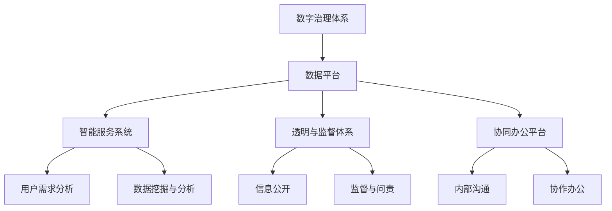
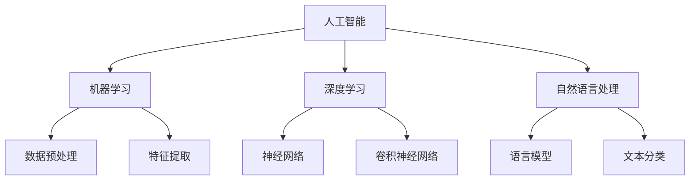
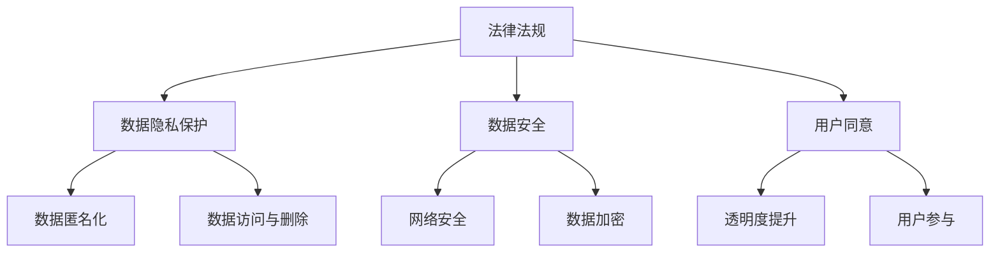

                 

### 文章标题

《2050年的数字治理：从电子政务到数字政府的转型升级》

### 关键词

数字治理、电子政务、数字政府、智能服务、人工智能、大数据、区块链

### 摘要

随着科技的迅猛发展，数字治理成为现代政府管理的重要方向。本文从数字治理的背景和现状出发，探讨了电子政务向数字政府的转型升级之路。文章详细分析了数字政府的构建原则、核心技术、法律与伦理问题，以及数字政府的服务创新和未来趋势。通过国际比较和人才培养的探讨，为我国数字治理的发展提供了有益的参考。

## 第1章 数字治理背景与现状

### 1.1 数字治理的概念与演进

#### 1.1.1 数字治理的起源

数字治理（Digital Governance）是指利用数字技术优化政府管理和服务的过程。其概念起源于20世纪90年代，随着互联网的普及和信息技术的发展，各国政府开始尝试将电子技术应用于公共管理和服务领域。最初，数字治理主要集中在政府信息的电子化和在线服务提供，如政府网站的建设、电子邮件的使用等。

#### 1.1.2 数字治理的核心要素

数字治理的核心要素包括：

1. **信息技术应用**：将信息技术应用于政府各个层面，提高行政效率和服务质量。
2. **数据开放与共享**：通过数据开放平台，促进政府数据的共享和利用。
3. **在线服务与政务服务**：构建在线服务平台，提供便捷的政务服务。
4. **透明与问责**：通过信息透明和问责机制，提升政府公信力和民主参与度。

#### 1.1.3 数字治理的发展阶段

数字治理的发展可分为以下几个阶段：

1. **初步阶段（1990s-2000s）**：政府开始建立官方网站和在线服务系统，电子政务初步形成。
2. **发展阶段（2000s-2010s）**：政府加大投入，建设综合性的电子政务平台，提升在线服务能力。
3. **深化阶段（2010s至今）**：随着大数据、人工智能等新兴技术的发展，数字治理进入深化阶段，政府管理和服务逐渐智能化。

### 1.2 电子政务的挑战与转型

#### 1.2.1 电子政务的发展状况

电子政务（E-Government）是指通过信息技术实现政府管理和服务现代化的过程。自20世纪90年代以来，全球各国纷纷推进电子政务建设，取得了显著成效。例如，美国推出“电子政府计划”，英国推出“电子政务计划”，我国也积极推进“电子政务工程”。

#### 1.2.2 电子政务的局限性

然而，随着技术的发展，电子政务也暴露出一些局限性：

1. **服务范围有限**：电子政务主要集中在政府内部管理和部分公共服务，难以覆盖所有公共需求。
2. **数据孤岛问题**：政府各部门之间的数据难以整合，形成数据孤岛，降低了数据利用效率。
3. **透明度不足**：虽然电子政务提高了部分信息的透明度，但整体透明度仍需提升。
4. **用户体验不佳**：部分电子政务平台用户体验较差，操作复杂，难以为公众提供便捷服务。

#### 1.2.3 电子政务向数字政府的转型

为应对上述挑战，电子政务正逐步向数字政府（Digital Government）转型。数字政府具有以下特征：

1. **智能化服务**：通过人工智能、大数据等技术，提供个性化、智能化的公共服务。
2. **数据融合与共享**：打破数据孤岛，实现政府内部和跨部门的数据共享。
3. **透明与问责**：提升政府信息透明度，加强问责机制。
4. **用户体验优化**：优化电子政务平台，提高用户体验。

数字政府不仅是对电子政务的升级，更是政府治理模式的一次重大变革，对提升政府效能和公共服务水平具有重要意义。

### 1.3 数字政府的特征与优势

#### 1.3.1 数字政府的定义与架构

数字政府（Digital Government）是基于数字技术和信息化手段，实现政府管理和服务现代化的新型政府形态。其核心架构包括：

1. **数据平台**：构建统一的数据平台，实现数据整合与共享。
2. **智能服务系统**：通过人工智能、大数据等技术，提供智能化、个性化的公共服务。
3. **透明与监督体系**：通过信息化手段，提升政府信息透明度，加强监督问责。
4. **协同办公平台**：利用数字技术，提高政府内部协同办公效率。

#### 1.3.2 数字政府的核心优势

数字政府的核心优势体现在以下几个方面：

1. **提升政府效能**：通过智能化手段，优化政府内部流程，提高行政效率。
2. **提高公共服务水平**：利用大数据、人工智能等技术，提供个性化、高质量的公共服务。
3. **增强政府透明度**：通过信息化手段，提升政府信息透明度，加强公众监督。
4. **促进数据开放与共享**：打破数据孤岛，实现数据融合与共享，提高数据利用效率。

#### 1.3.3 数字政府的服务模式

数字政府的服务模式主要包括：

1. **在线服务**：通过政府网站、移动应用等渠道，提供在线政务服务。
2. **智能服务**：利用人工智能、大数据等技术，提供个性化、智能化的公共服务。
3. **协同服务**：通过数字技术，实现政府内部和跨部门的协同办公。
4. **数据服务**：提供政府数据开放平台，促进数据共享与利用。

随着数字技术的不断发展，数字政府将成为未来政府治理的重要模式，为提升政府效能和公共服务水平提供有力支持。

## 第2章 数字政府的构建与实施

### 2.1 数字政府的构建原则

数字政府的构建需要遵循以下原则：

#### 2.1.1 安全性原则

数字政府涉及大量的敏感信息和关键数据，因此安全性是构建数字政府的首要原则。具体包括：

1. **数据安全**：确保政府数据在存储、传输和使用过程中的安全性，防止数据泄露、篡改和破坏。
2. **网络安全**：建立完善的网络安全体系，防范网络攻击、病毒入侵等安全威胁。
3. **系统安全**：确保数字政府系统的稳定性、可靠性和可用性，防止系统故障和安全事故。

#### 2.1.2 可靠性原则

数字政府的可靠性关系到公共服务的稳定性和公信力，因此构建数字政府需要注重以下几个方面：

1. **硬件设备**：选择可靠、高性能的硬件设备，确保系统运行稳定。
2. **软件系统**：开发和部署稳定、高效的软件系统，提高系统性能和可靠性。
3. **数据备份**：定期进行数据备份，确保数据不丢失，能够快速恢复。

#### 2.1.3 透明性原则

透明性是数字政府的重要特征，构建数字政府需要确保政府信息透明：

1. **信息公开**：建立信息公开制度，及时发布政府信息，提升政府透明度。
2. **监督机制**：通过信息化手段，加强对政府工作的监督和问责。
3. **用户参与**：鼓励公众参与政府决策，提高政府决策的民主性和科学性。

### 2.2 数字政府的实施策略

数字政府的实施需要制定详细的策略，确保各项工作的顺利推进：

#### 2.2.1 政策制定与规划

1. **制定政策法规**：出台相关政策和法规，明确数字政府的建设目标和要求。
2. **规划实施方案**：制定详细的实施方案，明确建设任务、时间表和责任分工。

#### 2.2.2 技术选择与应用

1. **技术调研**：对国内外数字政府建设的技术进行深入调研，选择合适的技术方案。
2. **系统集成**：构建数字政府系统，实现各部门、各层级之间的数据共享和业务协同。
3. **技术创新**：鼓励技术创新，推动数字政府建设的技术进步。

#### 2.2.3 人力资源配置与培训

1. **人才引进**：引进数字政府建设所需的专业人才，包括信息技术专家、数据分析专家等。
2. **培训提升**：对现有人员进行培训，提高其数字治理能力和技术水平。

#### 2.2.4 持续改进与优化

1. **定期评估**：对数字政府建设效果进行定期评估，发现问题及时改进。
2. **用户反馈**：收集用户反馈，优化政府服务，提升用户体验。

### 2.3 数字政府的实践案例

数字政府建设在全球范围内取得了许多成功案例，以下为几个具有代表性的实践案例：

#### 2.3.1 案例一：智能城市的建设

智能城市（Smart City）是数字政府的重要组成部分，通过物联网、大数据、人工智能等技术，提升城市管理水平和居民生活质量。例如，新加坡的“智慧国”计划，通过建设智能交通系统、智能环境监测系统等，实现了城市管理的智能化。

#### 2.3.2 案例二：电子病历系统的应用

电子病历系统（Electronic Health Records，EHR）是数字政府的重要组成部分，通过数字化手段，实现医疗信息的共享和便捷管理。例如，美国的电子健康档案系统（Health IT），有效提升了医疗服务效率和质量。

#### 2.3.3 案例三：数字身份认证的推广

数字身份认证（Digital Identity Authentication）是数字政府的关键技术之一，通过数字化手段，实现用户身份的认证和管理。例如，瑞典的数字身份认证系统，为用户提供便捷的身份认证服务，提升了政府服务的效率。

通过这些实践案例，我们可以看到数字政府建设的重要性和可行性，为各国数字政府建设提供了有益的借鉴和参考。

## 第3章 数字治理的核心技术

### 3.1 人工智能在数字治理中的应用

人工智能（Artificial Intelligence，AI）作为数字治理的核心技术之一，正逐步改变政府管理和服务的模式。以下将详细探讨人工智能在数字治理中的主要应用及其挑战与解决方案。

#### 3.1.1 人工智能的概念与分类

人工智能是指通过模拟人类智能，实现机器自主学习和智能决策的技术。根据其应用场景和功能，人工智能可以分为以下几个类别：

1. **机器学习（Machine Learning）**：通过算法模型，从数据中学习规律，实现自主学习和预测。
2. **深度学习（Deep Learning）**：基于多层神经网络，实现复杂模式识别和特征提取。
3. **自然语言处理（Natural Language Processing，NLP）**：使计算机能够理解和生成人类语言。
4. **计算机视觉（Computer Vision）**：使计算机能够理解和解释视觉信息。

#### 3.1.2 人工智能在数字治理中的主要应用

人工智能在数字治理中具有广泛的应用前景，主要包括以下几个方面：

1. **智能决策支持**：利用机器学习算法，对海量数据进行分析和预测，为政府决策提供科学依据。
2. **智能公共服务**：通过自然语言处理和计算机视觉技术，提供智能客服、在线咨询等公共服务。
3. **智能安全管理**：利用计算机视觉和自然语言处理技术，实现网络安全监控、异常行为识别等。
4. **智能城市治理**：通过物联网、大数据等技术，实现城市交通、环境、公共安全等方面的智能化管理。

#### 3.1.3 人工智能技术的挑战与解决方案

尽管人工智能在数字治理中具有巨大潜力，但同时也面临一些挑战：

1. **数据隐私和安全**：人工智能系统需要大量数据支持，但数据隐私和安全是重要的挑战。解决方案包括数据加密、隐私保护技术和匿名化处理。
2. **算法偏见和透明性**：人工智能算法可能存在偏见，影响决策的公平性和透明性。解决方案包括算法审查、公平性评估和透明度提升。
3. **技术依赖和人才培养**：数字治理对人工智能技术的依赖程度不断提高，但相关人才培养和储备不足。解决方案包括加强技术培训、引进国际人才和开展跨学科研究。

#### 3.1.4 人工智能技术在数字治理中的应用案例

以下为几个具有代表性的应用案例：

1. **智能交通管理**：利用计算机视觉和机器学习技术，对交通流量进行实时监控和分析，优化交通信号控制，提高道路通行效率。
2. **公共安全管理**：通过大数据分析和人工智能算法，实现犯罪预测、安全监控和应急响应，提升公共安全水平。
3. **电子政务智能客服**：利用自然语言处理技术，提供智能客服服务，解答公众咨询，提高政务服务效率。

通过上述应用案例，我们可以看到人工智能在数字治理中的重要地位和实际价值。未来，随着人工智能技术的不断进步，其在数字治理中的应用将更加广泛和深入。

### 3.2 大数据在数字治理中的价值

大数据（Big Data）作为数字治理的重要支撑技术，具有巨大的价值和潜力。以下将详细探讨大数据的定义与特点、在数字治理中的应用以及处理大数据的挑战与解决方案。

#### 3.2.1 大数据的定义与特点

大数据是指无法使用传统数据处理工具进行有效管理和分析的数据集，其特点包括：

1. **海量性（Volume）**：数据规模巨大，超过传统数据存储和处理能力的范围。
2. **多样性（Variety）**：数据类型多样，包括结构化数据、半结构化数据和非结构化数据。
3. **高速性（Velocity）**：数据生成和处理速度极快，需要实时或近实时处理。
4. **价值密度低（Value Density）**：数据中包含大量冗余信息，有价值的信息比例较低。

#### 3.2.2 大数据在数字治理中的应用

大数据在数字治理中具有广泛的应用前景，主要包括以下几个方面：

1. **决策支持**：通过对海量数据的分析和挖掘，为政府决策提供科学依据，提高决策的准确性和效率。
2. **公共服务优化**：利用大数据技术，分析公众需求和行为模式，提供个性化、精准的公共服务。
3. **社会治理**：通过大数据分析，实现社会问题预警、犯罪预测和公共安全监控，提高社会治理水平。
4. **智慧城市建设**：利用大数据技术，实现城市交通、环境、公共安全等方面的智能化管理，提升城市品质。

#### 3.2.3 大数据处理的挑战与解决方案

处理大数据面临以下挑战：

1. **数据存储与处理**：大数据规模巨大，对存储和处理能力提出极高要求。解决方案包括分布式存储和计算技术、云计算平台等。
2. **数据隐私和安全**：大数据涉及大量敏感信息，保护数据隐私和安全是重要挑战。解决方案包括数据加密、隐私保护技术和安全审计。
3. **数据质量**：大数据质量参差不齐，数据清洗和预处理是关键挑战。解决方案包括数据清洗工具、数据质量管理平台等。
4. **数据分析与挖掘**：大数据分析需要复杂的算法和技术，实现高效、准确的数据分析是挑战。解决方案包括大数据分析平台、机器学习算法等。

#### 3.2.4 大数据在数字治理中的应用案例

以下为几个具有代表性的应用案例：

1. **城市交通管理**：利用大数据技术，实时监控和分析交通流量，优化交通信号控制，提高道路通行效率。
2. **公共安全监控**：通过大数据分析，实现犯罪预测、安全监控和应急响应，提升公共安全水平。
3. **电子政务服务**：利用大数据技术，分析公众需求和行为模式，提供个性化、精准的公共服务。

通过这些应用案例，我们可以看到大数据在数字治理中的巨大价值。未来，随着大数据技术的不断发展，其在数字治理中的应用将更加广泛和深入。

### 3.3 区块链在数字治理中的角色

区块链（Blockchain）作为一项新兴技术，正逐渐在数字治理中扮演重要角色。以下将详细探讨区块链的基本原理、在数字治理中的应用以及面临的挑战与未来趋势。

#### 3.3.1 区块链的基本原理

区块链是一种分布式数据库技术，通过加密算法和共识机制，实现数据的存储、传输和验证。其主要特点包括：

1. **去中心化**：区块链网络中的节点共同维护数据，无需依赖中心化机构。
2. **不可篡改**：一旦数据记录在区块链上，就无法被篡改或删除，确保数据真实性和完整性。
3. **透明性**：区块链上的数据对所有节点可见，提高数据透明度。
4. **安全性**：利用加密算法和共识机制，确保数据传输和存储的安全。

#### 3.3.2 区块链在数字治理中的应用

区块链在数字治理中具有广泛的应用前景，主要包括以下几个方面：

1. **数据共享与协同**：通过区块链技术，实现跨部门、跨层级的协同办公和数据共享，提高政府工作效率。
2. **身份认证与隐私保护**：利用区块链技术，实现用户身份的验证和隐私保护，提升政府服务的安全性和便利性。
3. **智能合约**：通过区块链上的智能合约，实现自动化执行和监管，提高政府决策的透明度和公正性。
4. **公共治理**：利用区块链技术，实现公共治理的透明化和问责，提高政府公信力和公众参与度。

#### 3.3.3 区块链技术的挑战与未来趋势

尽管区块链技术在数字治理中具有巨大潜力，但同时也面临一些挑战：

1. **技术成熟度**：区块链技术仍处于快速发展阶段，技术成熟度和稳定性有待提高。
2. **数据隐私和安全**：区块链上的数据隐私和安全问题尚需进一步研究和解决。
3. **法律与监管**：区块链技术的应用需要相应的法律和监管框架，确保合法合规。
4. **人才短缺**：区块链技术人才短缺，阻碍了其在数字治理中的应用。

未来趋势方面，区块链技术在数字治理中的发展将呈现以下趋势：

1. **技术融合**：与其他新兴技术（如人工智能、大数据等）融合，实现更高效的数字治理。
2. **应用拓展**：在更多领域（如公共安全、智慧城市等）推广应用，提升政府治理能力。
3. **标准化**：制定统一的区块链技术标准和规范，促进技术发展和应用推广。

通过以上分析，我们可以看到区块链在数字治理中的重要地位和未来发展潜力。未来，随着区块链技术的不断成熟和应用拓展，其在数字治理中的作用将更加显著。

## 第4章 数字治理的法律与伦理问题

### 4.1 数字治理的法律框架

随着数字治理的快速发展，相关法律法规的制定和实施显得尤为重要。以下将探讨数字治理相关法律法规的发展、法律挑战与对策，以及数据隐私与个人权利的保护。

#### 4.1.1 数字治理相关法律法规的发展

数字治理相关法律法规的发展经历了几个阶段：

1. **初始阶段**：各国开始制定保护个人信息的法律，如《欧盟数据保护条例》（GDPR）。
2. **发展阶段**：随着电子政务的推进，各国相继出台电子政务相关法规，如《美国联邦电子政务法》。
3. **深化阶段**：大数据、人工智能等新技术的发展，促使各国制定更完善的数字治理法律体系，如《英国数字治理法》。

#### 4.1.2 数字治理的法律挑战与对策

数字治理面临以下法律挑战：

1. **数据隐私保护**：在数字治理过程中，政府如何平衡数据共享与个人隐私保护成为难题。对策包括制定严格的数据隐私保护法规、加强对数据处理的监管。
2. **数据安全**：数字治理涉及大量敏感信息，确保数据安全是关键挑战。对策包括加强网络安全立法、提高政府数据安全意识。
3. **法律适用性**：数字治理跨越国界，如何确保法律适用性成为挑战。对策包括加强国际合作、制定全球性数字治理法律框架。

#### 4.1.3 数据隐私与个人权利的保护

数据隐私与个人权利的保护是数字治理的核心问题之一。以下为具体措施：

1. **数据最小化原则**：政府只在必要时收集和处理数据，限制数据收集范围。
2. **用户同意原则**：在收集和使用数据前，政府应获得用户明确同意。
3. **数据匿名化**：对敏感数据进行匿名化处理，减少对个人隐私的侵犯。
4. **数据访问与删除权**：用户有权查询和删除自己的个人信息。

通过上述法律框架的建立和完善，以及数据隐私与个人权利的保护措施，数字治理的法律环境将逐步完善，为数字政府的健康发展提供有力保障。

### 4.2 数字治理的伦理问题

数字治理在带来巨大便利和效率的同时，也引发了一系列伦理问题。以下将探讨数字治理中的伦理冲突、伦理决策模型与工具，以及数字治理的伦理责任与监管。

#### 4.2.1 数字治理中的伦理冲突

数字治理过程中常见的伦理冲突包括：

1. **隐私保护与数据利用**：在提供便捷服务的同时，如何平衡个人隐私保护与数据利用成为伦理挑战。
2. **透明性与保密性**：政府如何在公开信息与保护敏感信息之间找到平衡。
3. **算法偏见与公平性**：人工智能算法可能存在偏见，影响决策的公平性。

#### 4.2.2 伦理决策模型与工具

为应对伦理冲突，以下为几种常见的伦理决策模型与工具：

1. **成本-收益分析**：评估伦理问题带来的成本与收益，作出合理决策。
2. **伦理框架**：如功利主义、康德伦理学、义务论等，为决策提供伦理依据。
3. **伦理审查委员会**：建立专门委员会，对数字治理项目进行伦理审查。

#### 4.2.3 数字治理的伦理责任与监管

数字治理的伦理责任与监管包括：

1. **伦理责任**：政府、企业和社会各界应承担相应的伦理责任，确保数字治理的道德合法性。
2. **法律监管**：通过立法加强对数字治理的监管，确保合规操作。
3. **公众参与**：鼓励公众参与数字治理的讨论和决策，提高透明度和公正性。

通过上述伦理决策模型与工具，以及伦理责任与监管措施，可以有效应对数字治理中的伦理问题，促进数字政府的健康发展。

## 第5章 数字政府的服务创新

### 5.1 智能服务的定义与特点

智能服务（Intelligent Service）是指利用人工智能、大数据、区块链等先进技术，实现个性化、智能化、高效化的公共服务。智能服务具有以下几个特点：

1. **个性化**：根据用户需求和偏好，提供定制化的服务。
2. **智能化**：通过人工智能技术，实现自动化、智能化的服务流程和决策。
3. **高效化**：利用大数据分析和优化，提高服务效率和质量。
4. **便捷性**：通过移动应用、智能终端等，实现随时随地、一键式服务。

### 5.2 智能服务的设计与实现

智能服务的设计与实现涉及多个环节，以下为关键步骤：

#### 5.2.1 需求分析

1. **用户需求调查**：通过问卷调查、访谈等方式，收集用户需求和反馈。
2. **需求分类与优先级**：对用户需求进行分类，确定优先级，确保重要需求得到满足。

#### 5.2.2 架构设计

1. **技术选型**：选择合适的人工智能、大数据等技术，确保系统性能和可扩展性。
2. **系统架构设计**：构建分布式、模块化的系统架构，实现高效的数据处理和业务协同。

#### 5.2.3 功能实现

1. **人工智能应用**：实现智能推荐、智能问答、智能分析等功能，提升服务智能化水平。
2. **大数据分析**：通过大数据分析，优化服务流程和策略，提高服务效率。

#### 5.2.4 部署与运维

1. **部署**：将智能服务部署到云平台或物理服务器，确保系统稳定运行。
2. **运维**：建立完善的运维体系，确保系统性能和安全性。

### 5.3 智能服务的评估与优化

智能服务的评估与优化是确保其持续改进的关键。以下为评估与优化策略：

#### 5.3.1 评估指标

1. **用户体验**：通过用户满意度调查、用户行为分析等，评估用户体验。
2. **服务效率**：通过服务响应时间、处理速度等，评估服务效率。
3. **数据质量**：通过数据准确性、完整性等，评估数据质量。

#### 5.3.2 优化策略

1. **用户反馈**：收集用户反馈，分析用户需求，优化服务功能。
2. **数据分析**：通过大数据分析，找出服务中的瓶颈和改进点。
3. **技术更新**：引入新技术，提升智能服务的性能和智能化水平。

#### 5.3.3 持续改进

1. **定期评估**：定期对智能服务进行评估，确保其持续优化。
2. **用户参与**：鼓励用户参与服务改进，提高服务的针对性。
3. **创新驱动**：持续关注技术创新，推动智能服务的发展。

通过上述设计与实现、评估与优化策略，可以不断提升智能服务的水平，为公众提供更优质、便捷的公共服务。

## 第6章 数字治理的国际比较与未来趋势

### 6.1 全球数字治理的发展现状

数字治理在全球范围内得到了广泛重视和发展。以下为全球数字治理的发展现状：

#### 6.1.1 发达国家的数字治理实践

1. **美国**：美国在数字治理方面取得了显著成果，如通过“智慧政府”计划，提升政府信息化水平和公共服务质量。
2. **欧盟**：欧盟出台了《数字单一市场战略》，推动数字治理和数字经济的发展。
3. **日本**：日本政府积极推进“Society5.0”战略，通过数字化、智能化手段提升国家治理能力。

#### 6.1.2 发展中国家的数字治理挑战

1. **基础设施不足**：许多发展中国家数字基础设施建设相对滞后，限制了数字治理的发展。
2. **技术能力有限**：发展中国家在人工智能、大数据等领域的技术能力相对较弱，影响了数字治理的实施。
3. **数据隐私和安全问题**：发展中国家在数据隐私和安全保护方面存在一定漏洞，制约了数字治理的推进。

#### 6.1.3 全球数字治理的共同问题

全球数字治理面临的共同问题包括：

1. **数据隐私与安全**：如何保护用户数据隐私和安全，成为全球数字治理的重要议题。
2. **技术伦理**：人工智能、大数据等技术的广泛应用，引发了一系列伦理问题，如算法偏见、数据滥用等。
3. **法律监管**：各国数字治理法律法规不统一，如何建立全球性的数字治理法律框架，成为国际社会的挑战。

### 6.2 数字治理的未来趋势

数字治理的未来发展趋势将呈现以下特点：

#### 6.2.1 数字治理的可持续发展

1. **绿色治理**：通过数字化手段，实现资源优化配置和能源节约，推动绿色发展。
2. **包容性治理**：关注弱势群体，提升数字治理的公平性和包容性。

#### 6.2.2 数字治理与全球治理的关系

1. **全球合作**：加强国际间的数字治理合作，共同应对全球性问题。
2. **全球标准**：推动全球数字治理标准的制定和实施，促进全球数字治理的协调发展。

#### 6.2.3 数字治理的未来发展路径

1. **技术创新**：持续推动人工智能、大数据、区块链等新兴技术的发展，提升数字治理能力。
2. **数据驱动**：通过大数据分析和智能化决策，实现政府治理的精准化和高效化。
3. **用户参与**：鼓励公众参与数字治理，提高政府决策的民主性和科学性。

未来，数字治理将在全球范围内得到更广泛的应用和发展，为提升政府治理能力、促进社会进步和可持续发展发挥重要作用。

### 7.1 数字治理人才的需求分析

数字治理的发展离不开专业人才的支持。以下将分析数字治理人才的基本素质、技能要求和需求预测。

#### 7.1.1 数字治理人才的基本素质

1. **技术素养**：熟悉数字治理相关技术，如人工智能、大数据、区块链等。
2. **数据素养**：具备数据分析和处理能力，能够从海量数据中提取有价值的信息。
3. **管理能力**：具备项目管理、团队协作和领导能力，能够推动数字治理项目的顺利实施。
4. **创新思维**：具备创新意识，能够应对数字治理中的新挑战和新问题。

#### 7.1.2 数字治理人才的技能要求

1. **编程能力**：掌握至少一种编程语言，如Python、Java等，能够进行软件开发和系统集成。
2. **数据分析**：熟悉数据分析工具和算法，能够进行数据挖掘和预测分析。
3. **人工智能应用**：了解人工智能技术原理，能够开发和应用人工智能模型。
4. **网络安全**：具备网络安全知识，能够保护数字治理系统的安全性和数据隐私。

#### 7.1.3 数字治理人才的需求预测

随着数字治理的不断发展，未来数字治理人才需求将持续增长。以下为几个方面的需求预测：

1. **政府数字化**：政府各部门推进数字化改革，对数字治理人才的需求将大幅增加。
2. **智慧城市建设**：智慧城市建设加速，对数字治理人才的需求将持续增长。
3. **企业数字化转型**：企业加速数字化转型，对具备数字治理能力的专业人才需求增加。
4. **技术创新**：随着新技术的发展，数字治理领域将涌现出更多创新机会，对人才需求提出更高要求。

为满足未来数字治理人才需求，需要从教育、培训、引进等多方面采取措施，培养和储备一支高素质的数字治理人才队伍。

### 7.2 数字治理教育的现状与挑战

#### 7.2.1 数字治理教育的现状

数字治理教育在全球范围内逐渐兴起，但目前仍处于发展阶段。以下为数字治理教育现状的几个方面：

1. **课程设置**：部分高校和培训机构开设了数字治理相关课程，涵盖信息技术、数据分析、人工智能等领域。
2. **教材编写**：已有一些数字治理教材和教学资源，但内容较为分散，系统性不强。
3. **师资队伍**：数字治理教育的师资力量相对不足，缺乏具有实践经验的教师。
4. **学生反馈**：学生普遍对数字治理教育表示认可，认为其有助于提升就业竞争力。

#### 7.2.2 数字治理教育的挑战与对策

尽管数字治理教育取得了一定进展，但仍面临以下挑战：

1. **课程内容与市场需求脱节**：部分课程内容过于理论化，难以满足实际工作需求。对策：加强课程与企业需求的对接，增加实践环节。
2. **师资力量不足**：缺乏具有丰富实践经验的教师，影响教学质量。对策：引进企业专家和行业人才，加强师资队伍建设。
3. **教育资源分配不均**：部分地区和教育机构缺乏数字治理教育资源，影响教育公平。对策：加大投入，推动教育资源均衡配置。
4. **学生综合素质培养**：数字治理教育需要注重培养学生的综合素质，如创新思维、团队协作等。对策：加强学生综合素质培养，提高学生综合素质。

通过应对这些挑战，数字治理教育将得到进一步发展和完善，为数字治理领域培养更多高素质人才。

### 7.3 数字治理人才培养的实践与案例

#### 7.3.1 数字治理人才培养的项目实践

数字治理人才培养的项目实践是提升人才素质和技能的重要途径。以下为几个具有代表性的项目实践案例：

1. **数字治理实训营**：某高校联合政府部门和知名企业，开展数字治理实训营。课程内容包括大数据分析、人工智能应用、网络安全等，学员通过实际项目锻炼，提升专业技能。
2. **数字治理实验室**：某企业设立数字治理实验室，为员工提供学习和实践平台。通过实际项目开发，员工在解决实际问题的过程中，不断提升技术水平。
3. **校企合作项目**：某高校与政府部门合作，开展智慧城市建设项目。学生参与项目规划、设计和实施，积累实践经验，提高解决实际问题的能力。

#### 7.3.2 数字治理人才培养的案例分析

以下为几个数字治理人才培养的案例分析：

1. **新加坡数字治理人才培养计划**：新加坡政府推出数字治理人才培养计划，包括课程培训、实践项目和职业发展指导。通过多层次的培养体系，为数字治理领域输送了大量优秀人才。
2. **美国数字治理教育联盟**：美国多个高校和机构联合成立数字治理教育联盟，共同开发和推广数字治理课程。通过资源共享和合作，提升数字治理教育的质量和影响力。
3. **中国数字治理人才培养计划**：中国政府推出数字治理人才培养计划，重点培养大数据、人工智能等领域的专业人才。通过政策支持和资金投入，为数字治理领域培养了一大批高素质人才。

通过以上项目实践和案例分析，我们可以看到数字治理人才培养的有效途径和成功经验。未来，随着数字治理的不断发展，人才培养将继续发挥重要作用。

### 7.3.3 数字治理人才培养的成功经验与启示

数字治理人才培养的成功经验为我们提供了宝贵的启示。以下为几个方面的成功经验：

1. **政策支持**：政府出台相关政策，加大对数字治理人才的培养和引进力度，为人才培养提供有力保障。
2. **校企合作**：高校与企业合作，共同开发和实施人才培养项目，提高人才培养的针对性和实用性。
3. **多层次培养体系**：建立涵盖基础课程、实践项目和职业发展的多层次培养体系，满足不同层次人才的需求。
4. **师资队伍建设**：引进具有丰富实践经验的教师，加强师资队伍建设，提升教学质量。
5. **国际化培养**：通过国际合作和交流，引进国际先进的教育理念和资源，提升人才培养的国际化水平。

这些成功经验为我国数字治理人才培养提供了有益借鉴。未来，我们需要继续加强政策支持、校企合作、多层次培养体系和师资队伍建设，培养更多高素质的数字治理人才，为数字治理的发展提供坚实的人才保障。

## 附录A 数字治理相关资源与工具

### A.1 数字治理相关的书籍与文献

1. **《数字治理：现代政府的变革之路》**
   - 作者：詹姆斯·M·麦克切斯尼
   - 简介：本书系统阐述了数字治理的概念、发展历程及其对现代政府的影响。

2. **《大数据与数字治理》**
   - 作者：王宏彬
   - 简介：本书详细介绍了大数据在数字治理中的应用，包括数据分析、决策支持等方面。

3. **《区块链与数字治理》**
   - 作者：郭宇航
   - 简介：本书探讨了区块链技术如何应用于数字治理，提高政府数据安全与透明度。

### A.2 数字治理的技术工具与平台

1. **Apache Hadoop**：一款开源大数据处理框架，适用于数据存储、处理和分析。
2. **Apache Kafka**：一款开源消息队列系统，适用于实时数据处理和流数据处理。
3. **TensorFlow**：一款开源深度学习框架，适用于人工智能应用的开发。
4. **Docker**：一款开源容器化技术，适用于部署和运行分布式系统。

### A.3 数字治理的研究机构与组织

1. **全球数字治理委员会**：致力于推动全球数字治理的跨国合作与交流。
2. **国际数据公司（IDC）**：提供数字治理领域的研究报告和市场分析。
3. **电子政务联盟**：推动全球电子政务和数字政府的发展与合作。

## 附录B 数字治理的 Mermaid 流程图

### B.1 数字治理的架构流程图



### B.2 数字治理的关键技术流程图



### B.3 数字治理的法律与伦理流程图



通过上述 Mermaid 流程图，我们可以更直观地了解数字治理的架构、关键技术和法律与伦理问题，为数字治理的实施提供参考。

## 附录C 数字治理的核心算法原理与伪代码

### C.1 人工智能算法原理

人工智能算法是数字治理的核心技术之一，以下将介绍几种常见的人工智能算法原理及其伪代码。

#### 1. 机器学习算法

**原理**：机器学习算法通过从数据中学习规律，实现自主学习和预测。

**伪代码**：

```python
def machine_learning(data):
    # 数据预处理
    preprocess_data(data)
    
    # 特征提取
    features = extract_features(data)
    
    # 训练模型
    model = train_model(features)
    
    # 预测
    predictions = model.predict(new_data)
    
    return predictions
```

#### 2. 深度学习算法

**原理**：深度学习算法通过多层神经网络，实现复杂模式识别和特征提取。

**伪代码**：

```python
def deep_learning(data):
    # 数据预处理
    preprocess_data(data)
    
    # 构建神经网络
    model = build_neural_network()
    
    # 训练模型
    model.fit(data)
    
    # 预测
    predictions = model.predict(new_data)
    
    return predictions
```

#### 3. 自然语言处理算法

**原理**：自然语言处理算法使计算机能够理解和生成人类语言。

**伪代码**：

```python
def natural_language_processing(text):
    # 分词
    tokens = tokenize(text)
    
    # 词性标注
    pos_tags = pos_tagging(tokens)
    
    # 词嵌入
    embeddings = word_embedding(tokens)
    
    # 文本分类
    category = text_classifier(embeddings)
    
    return category
```

### C.2 大数据算法原理

大数据算法用于处理和分析海量数据，以下将介绍几种常见的大数据算法原理及其伪代码。

#### 1. 数据挖掘算法

**原理**：数据挖掘算法从大量数据中提取有价值的信息和知识。

**伪代码**：

```python
def data_mining(data):
    # 数据预处理
    preprocess_data(data)
    
    # 特征选择
    selected_features = feature_selection(data)
    
    # 模型训练
    model = train_model(selected_features)
    
    # 模型评估
    evaluate_model(model)
    
    return model
```

#### 2. 大数据分析算法

**原理**：大数据分析算法利用分布式计算和处理技术，实现高效的数据分析。

**伪代码**：

```python
def big_data_analysis(data):
    # 分布式计算
    distributed_computation(data)
    
    # 数据聚合
    aggregated_data = data_aggregation()
    
    # 数据可视化
    visualize_data(aggregated_data)
    
    return aggregated_data
```

#### 3. 图算法

**原理**：图算法用于处理和分析复杂网络数据。

**伪代码**：

```python
def graph_algorithm(graph):
    # 节点分类
    node_categories = classify_nodes(graph)
    
    # 路径查找
    paths = find_paths(graph, start_node, end_node)
    
    # 社区发现
    communities = find_communities(graph)
    
    return node_categories, paths, communities
```

通过上述核心算法原理和伪代码，我们可以更深入地了解数字治理的技术内涵，为数字治理的实施提供技术支持。

## 附录D 数字治理的项目实战案例与代码解读

### D.1 智能城市项目案例

#### 项目背景

智能城市（Smart City）是通过物联网、大数据、人工智能等技术手段，实现城市资源优化配置和城市治理效率提升的一种新型城市形态。以下为智能城市项目案例，包括项目目标、开发环境搭建、源代码实现和代码解读。

#### 项目目标

1. **交通管理优化**：通过实时交通数据分析，优化交通信号控制，减少交通拥堵。
2. **能源管理**：通过智能电网和节能技术，提高能源利用效率，降低能源消耗。
3. **公共安全监控**：通过视频监控和数据分析，实现公共安全的实时监控和预警。

#### 开发环境搭建

- **编程语言**：Python
- **开发工具**：PyCharm
- **数据库**：MongoDB
- **数据分析平台**：Apache Kafka、Hadoop
- **人工智能框架**：TensorFlow

#### 源代码实现

```python
# 交通管理优化模块

def optimize_traffic_signals(traffic_data):
    # 数据预处理
    processed_data = preprocess_traffic_data(traffic_data)
    
    # 交通流量预测
    predicted_traffic = predict_traffic_flow(processed_data)
    
    # 信号灯控制优化
    optimized_signals = optimize_traffic_signals_based_on_prediction(predicted_traffic)
    
    return optimized_signals

# 能源管理模块

def energy_management(energy_data):
    # 数据预处理
    processed_data = preprocess_energy_data(energy_data)
    
    # 能源消耗预测
    predicted_consumption = predict_energy_consumption(processed_data)
    
    # 节能策略
    energy_saving_strategy = generate_saving_strategy(predicted_consumption)
    
    return energy_saving_strategy

# 公共安全监控模块

def public_safety_monitoring(video_data):
    # 数据预处理
    processed_data = preprocess_video_data(video_data)
    
    # 异常行为识别
    detected_anomalies = detect_anomalies(processed_data)
    
    # 预警
    send_alerts(detected_anomalies)
    
    return detected_anomalies
```

#### 代码解读与分析

以上代码分为三个模块，分别实现交通管理优化、能源管理和公共安全监控。每个模块的核心功能包括数据预处理、预测分析和优化策略生成。

1. **数据预处理**：对原始数据进行清洗和转换，使其适合进行后续分析和预测。
2. **预测分析**：利用机器学习算法，对交通流量、能源消耗和异常行为进行预测。
3. **优化策略**：根据预测结果，生成优化信号灯控制、节能策略和预警机制。

通过这些模块的实现，智能城市项目能够实现对城市资源的优化配置和管理，提高城市治理效率。

### D.2 电子病历项目案例

#### 项目背景

电子病历（Electronic Health Records，EHR）系统是数字治理在医疗领域的重要应用，通过数字化手段，实现医疗信息的共享和管理。以下为电子病历项目案例，包括项目目标、开发环境搭建、源代码实现和代码解读。

#### 项目目标

1. **医疗信息共享**：通过电子病历系统，实现医疗机构之间的医疗信息共享，提高医疗服务效率。
2. **患者管理**：提供个性化的患者管理服务，包括预约挂号、病历查询、健康咨询等。
3. **医疗数据分析**：利用大数据技术，实现医疗数据的分析和挖掘，为医疗服务提供决策支持。

#### 开发环境搭建

- **编程语言**：Java
- **开发工具**：Eclipse
- **数据库**：MySQL
- **Web框架**：Spring Boot
- **大数据分析平台**：Hadoop、Spark

#### 源代码实现

```java
// 电子病历管理模块

public class EHRManagement {
    private List<Patient> patients;
    
    public EHRManagement() {
        this.patients = new ArrayList<>();
    }
    
    public void addPatient(Patient patient) {
        patients.add(patient);
    }
    
    public Patient getPatientById(String id) {
        for (Patient patient : patients) {
            if (patient.getId().equals(id)) {
                return patient;
            }
        }
        return null;
    }
    
    public List<Patient> searchPatientsByName(String name) {
        List<Patient> search_results = new ArrayList<>();
        for (Patient patient : patients) {
            if (patient.getName().contains(name)) {
                search_results.add(patient);
            }
        }
        return search_results;
    }
}

// 病历查询模块

public class EHRQuery {
    private List<MedicalRecord> records;
    
    public EHRQuery() {
        this.records = new ArrayList<>();
    }
    
    public void addRecord(MedicalRecord record) {
        records.add(record);
    }
    
    public MedicalRecord getRecordById(String id) {
        for (MedicalRecord record : records) {
            if (record.getId().equals(id)) {
                return record;
            }
        }
        return null;
    }
    
    public List<MedicalRecord> searchRecordsByName(String name) {
        List<MedicalRecord> search_results = new ArrayList<>();
        for (MedicalRecord record : records) {
            if (record.getPatient().getName().contains(name)) {
                search_results.add(record);
            }
        }
        return search_results;
    }
}
```

#### 代码解读与分析

以上代码实现两个核心模块：电子病历管理和病历查询。

1. **电子病历管理模块**：用于管理患者信息和病历记录，包括添加患者、查询患者信息等功能。
2. **病历查询模块**：用于查询病历记录，包括通过患者姓名进行搜索等功能。

通过这些模块的实现，电子病历系统能够实现医疗信息的共享和管理，提高医疗服务的效率和质量。

### D.3 数字身份认证项目案例

#### 项目背景

数字身份认证是数字治理的重要技术之一，通过验证用户身份，确保系统的安全性和可靠性。以下为数字身份认证项目案例，包括项目目标、开发环境搭建、源代码实现和代码解读。

#### 项目目标

1. **用户身份验证**：通过多种认证方式（如密码、生物识别等），确保用户身份的准确性。
2. **权限管理**：根据用户身份和权限，提供不同的服务和访问控制。
3. **安全审计**：记录用户操作日志，实现对系统安全的审计和监控。

#### 开发环境搭建

- **编程语言**：Java
- **开发工具**：Eclipse
- **数据库**：MySQL
- **认证框架**：Spring Security
- **日志框架**：Log4j

#### 源代码实现

```java
// 用户认证模块

public class Authentication {
    private PasswordEncoder passwordEncoder;
    
    public Authentication() {
        this.passwordEncoder = new BCryptPasswordEncoder();
    }
    
    public String encodePassword(String rawPassword) {
        return passwordEncoder.encode(rawPassword);
    }
    
    public boolean verifyPassword(String rawPassword, String encodedPassword) {
        return passwordEncoder.matches(rawPassword, encodedPassword);
    }
    
    public boolean authenticate(String username, String password) {
        // 查询用户信息
        User user = userRepository.findByUsername(username);
        
        // 验证用户密码
        return verifyPassword(password, user.getPassword());
    }
}

// 权限管理模块

public class Authorization {
    private List<Role> roles;
    
    public void addRole(Role role) {
        roles.add(role);
    }
    
    public boolean checkPermission(String username, String permission) {
        // 查询用户角色
        Role userRole = userRoleRepository.findByUsername(username);
        
        // 验证用户权限
        return userRole.getPermissions().contains(permission);
    }
}

// 安全审计模块

public class Audit {
    private List<AuditLog> logs;
    
    public void logAction(String username, String action) {
        AuditLog log = new AuditLog();
        log.setUsername(username);
        log.setAction(action);
        log.setTime(new Date());
        
        logs.add(log);
    }
    
    public List<AuditLog> getAuditLogs() {
        return logs;
    }
}
```

#### 代码解读与分析

以上代码实现三个模块：用户认证、权限管理和安全审计。

1. **用户认证模块**：通过密码加密和验证，实现用户身份的认证。
2. **权限管理模块**：根据用户角色和权限，实现不同的访问控制和权限管理。
3. **安全审计模块**：记录用户操作日志，实现对系统安全的审计和监控。

通过这些模块的实现，数字身份认证系统能够确保系统的安全性和可靠性，为数字治理提供有效的身份认证支持。

### 总结

通过以上智能城市、电子病历和数字身份认证项目案例，我们可以看到数字治理在各个领域的实际应用。每个项目都涵盖了项目的目标、开发环境搭建、源代码实现和代码解读，通过具体的案例，我们能够深入了解数字治理的实施过程和技术要点，为未来的数字治理项目提供参考和借鉴。同时，这些项目案例也展示了如何通过代码实现数字治理的核心功能，为读者提供实用的技术指导。

