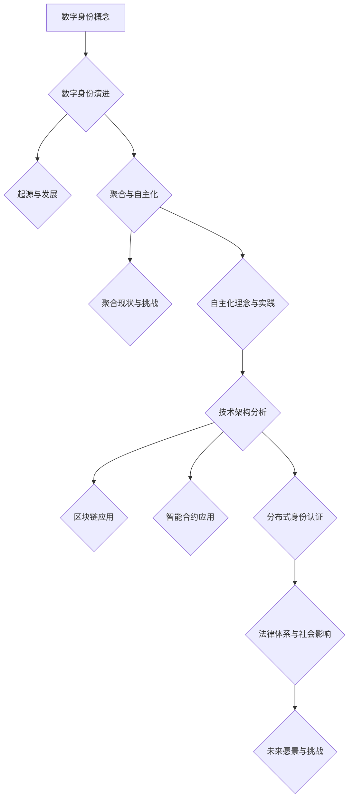

                 

# 2050年的数字身份：从数字身份聚合到数字身份自主的身份主权实现

> 关键词：数字身份，身份主权，区块链，智能合约，分布式身份认证，法律法规，社会影响，未来展望

> 摘要：本文深入探讨了数字身份从聚合到自主化的发展历程，展望了2050年数字身份的愿景。通过对数字身份的核心概念、发展历程、现状与挑战的详细分析，本文提出了数字身份自主化的理念与实践，并从技术架构、法律法规和社会影响等多个维度进行了全面剖析。文章最后提出了数字身份自主化的未来挑战与对策，为数字身份的发展提供了有益的思考和建议。

## 第一部分：数字身份的基础与演进

### 第1章：数字身份的概念与演进

#### 1.1 数字身份的起源与定义

数字身份，顾名思义，是指在网络空间中用以标识个体或实体的身份信息。数字身份的概念起源于互联网的兴起，随着网络技术的不断发展和广泛应用，数字身份的重要性逐渐凸显。

数字身份的定义可以从不同的角度进行解读。从技术角度来说，数字身份是一种标识符，用于在网络环境中唯一地识别个体或实体。这种标识符可以是电子邮件地址、用户名、身份证号码等。从应用角度来说，数字身份是一种服务，通过提供身份验证、访问控制等功能，保障网络环境的安全和可靠性。

数字身份的起源可以追溯到互联网的早期阶段。20世纪80年代，互联网开始逐渐普及，各种网络应用和服务相继出现。为了在虚拟的网络世界中识别用户，人们开始使用用户名和密码作为数字身份的基础。随着时间的推移，数字身份的概念和技术不断演进，逐渐形成了今天我们所熟知的数字身份体系。

#### 1.2 数字身份的发展历程

数字身份的发展历程可以分为以下几个阶段：

1. **原始身份阶段**：在这个阶段，数字身份主要依赖于简单的用户名和密码。用户名和密码作为一种基础的数字身份标识符，使得用户可以在不同的网络应用和服务之间进行切换。然而，这种身份标识符存在着安全性低、易被盗用的缺点。

2. **单点登录阶段**：为了提高数字身份的安全性和便利性，单点登录（Single Sign-On, SSO）技术应运而生。单点登录技术允许用户使用一个用户名和密码登录多个网络应用和服务，从而简化了用户身份验证的过程。

3. **身份认证阶段**：随着网络安全的不断升级，身份认证技术得到了广泛的应用。身份认证技术包括双因素认证、生物识别等，旨在提高数字身份的验证强度和安全性。

4. **身份聚合阶段**：在数字身份聚合阶段，各种身份标识符被整合到一个统一的身份认证系统中。身份聚合技术使得用户可以在不同的网络应用和服务之间无缝切换，提高了用户体验。

5. **数字身份自主化阶段**：在数字身份自主化阶段，用户可以完全掌控自己的数字身份，实现身份主权的自主化。数字身份自主化技术包括区块链、智能合约等，为数字身份的安全和隐私保护提供了有力保障。

#### 1.3 数字身份的重要性

数字身份在现代网络社会中扮演着重要的角色。首先，数字身份是网络社会的基本单元，是用户在虚拟世界中的存在形式。其次，数字身份是网络安全的核心，通过身份认证和访问控制等功能，保障网络环境的安全和可靠性。最后，数字身份是数字经济的重要支撑，为各种在线交易、服务提供身份验证和信任保障。

数字身份的重要性还体现在以下几个方面：

1. **提高用户体验**：数字身份自主化技术使得用户可以在不同的网络应用和服务之间无缝切换，提高了用户体验。

2. **保障网络安全**：数字身份自主化技术提供了更强的安全性和隐私保护，降低了网络犯罪的风险。

3. **促进数字经济发展**：数字身份自主化技术为数字经济的发展提供了有力支撑，为在线交易、服务提供了信任保障。

4. **推动社会进步**：数字身份自主化技术为社会治理提供了新的手段，为公共管理、社会服务等领域带来了便利。

### 第2章：数字身份聚合的现状与挑战

#### 2.1 数字身份聚合的定义与分类

数字身份聚合是指将分散的、孤立的数字身份信息整合到一个统一的身份认证系统中，实现用户在不同网络应用和服务之间无缝切换的过程。数字身份聚合可以按照不同的维度进行分类：

1. **基于技术的聚合**：基于技术的聚合是指通过技术手段将各种身份标识符整合到一个统一的身份认证系统中。例如，单点登录技术可以将多个网络应用和服务的用户名和密码整合到一个统一的认证系统。

2. **基于规则的聚合**：基于规则的聚合是指根据特定的规则和策略，将不同来源的身份信息进行整合。例如，基于用户行为分析和风险评分的聚合规则，可以识别用户的真实身份。

3. **基于服务的聚合**：基于服务的聚合是指通过提供一站式服务，将用户的身份信息和服务需求整合到一个平台上。例如，电子政务平台可以将用户的身份信息、业务需求和公共服务整合到一个统一的平台上。

#### 2.2 数字身份聚合的现状

当前，数字身份聚合已经在全球范围内得到广泛应用。在欧美等发达国家，数字身份聚合技术已经相对成熟，各种身份聚合平台和服务层出不穷。例如，美国的“消费者数据权利法案”（CCPA）和欧盟的“通用数据保护条例”（GDPR）都要求企业对用户的身份信息进行整合和保护。

在我国，数字身份聚合也取得了一定的进展。政府主导的电子政务平台和互联网企业开发的各类身份认证服务，都在逐步推进数字身份聚合的进程。例如，我国的“公民网络电子身份标识”（CNNEID）就是一种基于区块链技术的数字身份聚合解决方案。

#### 2.3 数字身份聚合面临的挑战

尽管数字身份聚合技术取得了显著的成果，但在实际应用中仍面临着一系列挑战：

1. **隐私保护**：数字身份聚合过程中，用户的身份信息被大量收集和存储，容易引发隐私泄露风险。如何在保障用户隐私的前提下实现数字身份聚合，是一个亟待解决的问题。

2. **安全性**：数字身份聚合系统面临着网络攻击、数据篡改等安全威胁。如何提高数字身份聚合系统的安全性，防止恶意攻击和数据泄露，是当前面临的重要挑战。

3. **跨平台兼容性**：数字身份聚合技术需要在不同平台、不同系统之间实现兼容和互操作。如何实现跨平台的数字身份聚合，是一个技术难题。

4. **法律法规**：数字身份聚合涉及到用户的隐私保护、数据安全等问题，需要法律法规的规范和指导。如何制定完善的法律法规，保障数字身份聚合的合法性和合规性，是当前面临的重要挑战。

### 第3章：数字身份自主化的理念与实践

#### 3.1 数字身份自主化的定义与核心要素

数字身份自主化是指用户可以完全掌控自己的数字身份，实现身份主权的自主化。数字身份自主化强调用户对身份信息的掌控权，使得用户可以在不受第三方限制的情况下自由地使用和管理自己的数字身份。

数字身份自主化的核心要素包括：

1. **用户主权**：用户对自己的数字身份拥有完全的控制权，可以自主决定身份信息的公开程度和使用范围。

2. **隐私保护**：数字身份自主化技术需要提供强大的隐私保护功能，确保用户身份信息的安全和保密。

3. **数据安全**：数字身份自主化技术需要保障用户身份信息的安全性，防止数据泄露和篡改。

4. **去中心化**：数字身份自主化技术需要实现去中心化，降低对第三方机构的依赖，提高系统的可靠性和抗攻击能力。

5. **可扩展性**：数字身份自主化技术需要具备良好的可扩展性，以适应不断变化的应用场景和用户需求。

#### 3.2 数字身份自主化的优势与意义

数字身份自主化具有多方面的优势与意义：

1. **隐私保护**：数字身份自主化技术可以保护用户的隐私，避免身份信息被第三方滥用和泄露。

2. **安全性**：数字身份自主化技术通过去中心化和加密算法，提高了数字身份的安全性，降低了被攻击的风险。

3. **用户体验**：数字身份自主化技术简化了用户身份验证的过程，提高了用户体验。

4. **数字经济发展**：数字身份自主化技术为数字经济的发展提供了信任保障，促进了在线交易和服务的发展。

5. **社会治理**：数字身份自主化技术为公共管理和社会服务提供了新的手段，提高了社会治理的效率和水平。

#### 3.3 数字身份自主化的实现路径

数字身份自主化的实现路径主要包括以下几个方面：

1. **区块链技术**：区块链技术为数字身份自主化提供了去中心化和安全性的基础。通过区块链技术，用户可以创建和掌控自己的数字身份，实现身份信息的透明和可追溯。

2. **智能合约**：智能合约技术可以用于实现身份验证和授权管理，提高数字身份的安全性和灵活性。

3. **分布式身份认证**：分布式身份认证技术可以实现用户身份信息的分布式存储和管理，提高系统的可靠性和抗攻击能力。

4. **隐私保护技术**：隐私保护技术包括加密算法、匿名通信等，可以用于保护用户身份信息的安全和隐私。

5. **法律法规**：法律法规的制定和执行可以为数字身份自主化提供法律保障，规范数字身份的使用和管理。

## 第二部分：数字身份自主化的技术架构

### 第4章：区块链技术在数字身份中的应用

#### 4.1 区块链技术的基本原理

区块链技术是一种分布式账本技术，通过加密算法和共识机制实现了去中心化、安全可靠的数据存储和管理。区块链技术的基本原理包括以下几个方面：

1. **分布式账本**：区块链技术将数据分散存储在多个节点上，每个节点都保存了一份完整的账本记录，保证了数据的可靠性和抗攻击能力。

2. **加密算法**：区块链技术使用加密算法对数据进行加密，确保数据在传输和存储过程中的安全性和隐私性。

3. **共识机制**：区块链技术通过共识机制确保多个节点对数据的共识，避免了数据篡改和双花攻击。

4. **智能合约**：智能合约是区块链上的可编程合约，可以实现自动化的合同执行和交易。

#### 4.2 区块链在数字身份自主化中的应用

区块链技术在数字身份自主化中具有广泛的应用前景。以下从几个方面探讨区块链在数字身份自主化中的应用：

1. **身份信息存储与管理**：区块链技术可以为数字身份提供分布式存储和管理方案，确保身份信息的透明、可追溯和安全。

2. **身份认证与授权**：区块链技术可以通过智能合约实现身份认证和授权管理，提高数字身份的安全性和灵活性。

3. **隐私保护**：区块链技术通过加密算法和零知识证明等隐私保护技术，可以保护用户身份信息的安全和隐私。

4. **去中心化身份认证**：区块链技术可以实现去中心化的身份认证，降低对第三方机构的依赖，提高系统的可靠性和抗攻击能力。

5. **跨境身份认证**：区块链技术可以解决跨境身份认证的难题，实现跨国身份信息的互认和共享。

#### 4.3 区块链在数字身份自主化中的优势与挑战

区块链技术在数字身份自主化中具有多方面的优势，同时也面临着一定的挑战：

**优势**：

1. **去中心化**：区块链技术实现了身份信息的分布式存储和管理，降低了系统对中心化机构的依赖。

2. **安全性**：区块链技术通过加密算法和共识机制确保了身份信息的安全和隐私。

3. **透明性**：区块链技术的数据透明性使得身份信息的存储和管理过程可追溯，提高了系统的可信度。

4. **自动化**：区块链技术可以通过智能合约实现身份认证和授权的自动化，提高了系统的效率和灵活性。

**挑战**：

1. **性能**：区块链技术目前面临着性能瓶颈，难以满足高并发交易的需求。

2. **隐私保护**：尽管区块链技术具有隐私保护的优势，但在实际应用中仍需要进一步优化隐私保护方案。

3. **法律法规**：区块链技术的应用需要法律法规的规范和指导，但当前法律法规体系尚不完善。

4. **跨链互操作**：区块链之间的互操作性和兼容性仍需进一步研究和解决。

### 第5章：智能合约与身份验证

#### 5.1 智能合约的基本原理

智能合约是一种运行在区块链上的可编程合约，通过代码自动执行合同条款，实现了自动化、不可篡改的合同执行。智能合约的基本原理包括以下几个方面：

1. **代码执行**：智能合约使用编程语言编写，运行在区块链网络上的虚拟机器中。当满足特定的条件时，智能合约会自动执行预定的操作。

2. **去中心化**：智能合约的执行过程由区块链网络中的多个节点共同验证，保证了执行的公正性和透明性。

3. **不可篡改**：智能合约一旦部署到区块链上，其代码和状态就不可篡改，保证了合同的执行过程和结果的可靠性。

4. **自动化**：智能合约可以通过自动化方式执行合同条款，减少了人为干预和操作失误的可能性。

#### 5.2 智能合约在身份验证中的应用

智能合约在身份验证中具有广泛的应用前景。以下从几个方面探讨智能合约在身份验证中的应用：

1. **身份认证**：智能合约可以实现身份认证的过程，验证用户身份的真实性和合法性。

2. **身份授权**：智能合约可以管理用户的身份权限，实现身份授权的自动化和灵活性。

3. **身份验证记录**：智能合约可以记录身份验证的过程和结果，确保身份验证的可追溯性。

4. **身份信息存储**：智能合约可以存储用户的身份信息，确保身份信息的隐私和安全。

5. **跨境身份验证**：智能合约可以解决跨境身份验证的难题，实现跨国身份信息的互认和共享。

#### 5.3 智能合约与数字身份自主化的关系

智能合约与数字身份自主化密切相关，二者相互促进、共同发展。以下从几个方面分析智能合约与数字身份自主化的关系：

1. **提升安全性**：智能合约通过加密算法和去中心化机制，提高了数字身份的安全性和隐私保护。

2. **简化认证流程**：智能合约可以实现身份认证的自动化和简化，提高了用户体验。

3. **增强可追溯性**：智能合约记录了身份验证的过程和结果，增强了身份验证的可追溯性和可信度。

4. **降低成本**：智能合约减少了人工干预和操作成本，降低了数字身份认证的成本。

5. **促进数字经济发展**：智能合约为数字身份自主化提供了技术支持，促进了数字经济的发展。

### 第6章：分布式身份认证框架

#### 6.1 分布式身份认证的基本概念

分布式身份认证是一种基于分布式系统技术的身份认证方法，通过多个节点共同验证用户身份，提高了系统的安全性和可靠性。分布式身份认证的基本概念包括以下几个方面：

1. **身份认证**：分布式身份认证是验证用户身份的过程，确保用户身份的真实性和合法性。

2. **分布式系统**：分布式身份认证依赖于分布式系统技术，将身份认证过程分散到多个节点上，提高了系统的可靠性和容错能力。

3. **去中心化**：分布式身份认证去除了对中心化认证机构的依赖，实现了身份认证的去中心化。

4. **多因素认证**：分布式身份认证通常采用多因素认证方法，包括密码、生物特征、硬件设备等，提高了身份认证的安全性。

5. **隐私保护**：分布式身份认证通过加密算法和隐私保护技术，确保用户身份信息的隐私和安全。

#### 6.2 分布式身份认证的关键技术

分布式身份认证的关键技术包括以下几个方面：

1. **加密算法**：加密算法用于保护用户身份信息和通信安全，确保身份认证过程的保密性和完整性。

2. **共识机制**：共识机制用于确保分布式系统中的多个节点对身份认证结果的一致性，提高了系统的可靠性。

3. **区块链技术**：区块链技术用于存储和验证身份认证数据，确保数据的透明性和可追溯性。

4. **多因素认证**：多因素认证技术用于提高身份认证的安全性，通过多种认证方式确保用户身份的真实性。

5. **隐私保护技术**：隐私保护技术用于保护用户身份信息的隐私和安全，防止数据泄露和滥用。

#### 6.3 分布式身份认证在数字身份自主化中的应用

分布式身份认证在数字身份自主化中具有广泛的应用前景。以下从几个方面探讨分布式身份认证在数字身份自主化中的应用：

1. **用户主权**：分布式身份认证实现了用户对身份信息的完全掌控，确保用户身份主权的自主化。

2. **隐私保护**：分布式身份认证通过加密算法和隐私保护技术，确保用户身份信息的隐私和安全。

3. **去中心化**：分布式身份认证去除了对中心化认证机构的依赖，实现了身份认证的去中心化，降低了系统的风险。

4. **可扩展性**：分布式身份认证具有良好的可扩展性，可以适应不同规模和应用场景的需求。

5. **跨境身份认证**：分布式身份认证可以实现跨境身份认证，解决跨国身份认证的难题。

### 第7章：数字身份自主化的法律法规体系

#### 7.1 数字身份自主化的法律框架

数字身份自主化作为一项新兴技术，需要法律法规的规范和指导。数字身份自主化的法律框架主要包括以下几个方面：

1. **隐私保护法**：隐私保护法是数字身份自主化的基础，规定了用户身份信息的收集、使用、存储和保护原则，确保用户隐私得到有效保护。

2. **数据安全法**：数据安全法是数字身份自主化的安全保障，规定了数字身份信息的存储、传输、处理和销毁要求，确保数字身份信息的安全和完整。

3. **网络安全法**：网络安全法是数字身份自主化的网络安全保障，规定了网络环境的运行和管理规则，防止网络攻击和恶意行为。

4. **合同法**：合同法是数字身份自主化的法律依据，规定了智能合约的效力和履行规则，确保智能合约的合法性和执行力。

5. **跨司法合作**：跨司法合作是数字身份自主化的国际合作，通过国际条约和合作协议，实现跨国身份认证和数据共享的法律保障。

#### 7.2 数字身份自主化与隐私保护

数字身份自主化在实现用户对身份信息的自主控制过程中，面临着隐私保护的挑战。以下从几个方面分析数字身份自主化与隐私保护的关系：

1. **隐私保护原则**：数字身份自主化应当遵循隐私保护原则，包括知情同意、目的明确、最小化收集、存储和使用等。

2. **隐私保护技术**：数字身份自主化应当采用隐私保护技术，如加密算法、匿名通信等，确保用户身份信息的隐私和安全。

3. **隐私保护制度**：数字身份自主化应当建立隐私保护制度，包括隐私保护政策、隐私保护培训等，提高隐私保护的意识和能力。

4. **隐私保护监督**：数字身份自主化应当接受隐私保护的监督，包括政府监管、社会监督等，确保隐私保护措施的落实和有效性。

#### 7.3 数字身份自主化与数据主权

数字身份自主化涉及到数据主权的问题，即数据的主权归属和控制权。以下从几个方面分析数字身份自主化与数据主权的关系：

1. **数据主权原则**：数字身份自主化应当遵循数据主权原则，尊重用户对数据的主权，确保用户对数据拥有完全的控制权。

2. **数据主权法律**：数字身份自主化需要相关法律法规的保障，明确数据主权归属和控制权，防止数据滥用和侵犯。

3. **数据主权实践**：数字身份自主化应当通过技术创新和制度设计，实现数据主权的有效保障，提高数据的透明度和可控性。

4. **数据主权国际合作**：数字身份自主化需要国际社会的合作，建立跨国数据主权协调机制，实现跨国数据主权的一致性和互操作性。

## 第三部分：数字身份自主化的社会影响与挑战

### 第8章：数字身份自主化的社会影响与挑战

#### 8.1 数字身份自主化对社会经济的影响

数字身份自主化对社会经济产生了深远的影响，主要体现在以下几个方面：

1. **提高经济效益**：数字身份自主化简化了身份验证和授权的过程，降低了交易成本，提高了经济效率。例如，在跨境贸易中，数字身份自主化可以实现快速的身份认证和交易确认，减少了繁琐的手续和等待时间。

2. **促进创新**：数字身份自主化为各类创新应用提供了基础，如智能合约、去中心化金融（DeFi）、分布式身份认证等。这些创新应用不仅推动了数字经济的快速发展，还促进了传统产业的数字化转型。

3. **优化社会治理**：数字身份自主化有助于提高社会治理的效率和透明度。例如，通过数字身份自主化，政府可以更有效地管理公共资源、提供社会服务，提高政府的公信力和服务水平。

4. **改变就业结构**：数字身份自主化推动了新兴职业和行业的出现，如区块链开发者、智能合约工程师、分布式身份认证专家等。同时，它也对传统职业提出了新的要求，推动了劳动力市场的转型和升级。

#### 8.2 数字身份自主化对个人隐私的保护与挑战

数字身份自主化在保护个人隐私方面具有重要意义，但也带来了一系列挑战：

1. **隐私保护优势**：数字身份自主化通过去中心化和加密技术，提高了个人隐私保护的水平。用户可以自主决定哪些信息被公开，哪些信息被保密，从而减少隐私泄露的风险。

2. **隐私保护挑战**：尽管数字身份自主化有助于保护个人隐私，但同时也带来了新的挑战。例如，在分布式系统中，个人隐私信息的泄露可能导致无法追踪和追究责任。此外，个人隐私保护机制的设计和实施也存在漏洞和缺陷，可能被黑客利用。

3. **隐私保护策略**：为了解决隐私保护挑战，需要采取一系列策略，包括加强隐私保护技术、完善隐私保护法律法规、提高公众隐私保护意识等。同时，需要建立隐私保护监督机制，确保隐私保护措施的落实和有效性。

#### 8.3 数字身份自主化对社会组织与管理的影响

数字身份自主化对社会组织和管理产生了深刻的影响，主要体现在以下几个方面：

1. **改变组织结构**：数字身份自主化推动了组织结构的变革，从传统的层级式结构向分布式网络结构转变。在分布式网络中，组织成员之间更加平等和自治，决策过程更加透明和高效。

2. **优化社会管理**：数字身份自主化有助于优化社会管理，提高公共服务的质量和效率。通过数字身份自主化，政府可以更精确地识别和管理公众，提供个性化、精准化的公共服务。

3. **挑战传统管理模式**：数字身份自主化对传统的管理模式提出了挑战。传统的集中式管理模式依赖于中心化的身份认证体系，而数字身份自主化则强调去中心化和用户主权。这种转变要求政府、企业和社会各界重新审视和管理数字身份，构建适应数字时代的管理模式。

### 第9章：2050年数字身份的愿景

#### 9.1 2050年数字身份的理想状态

展望2050年，数字身份将实现以下理想状态：

1. **完全自主化**：用户将完全掌控自己的数字身份，实现身份主权的完全自主化。用户可以自主决定身份信息的公开程度和使用范围，不再受第三方机构的限制。

2. **高度安全与隐私保护**：数字身份将采用最先进的加密和隐私保护技术，确保身份信息的高度安全性和隐私保护。用户身份信息将难以被窃取、篡改或滥用。

3. **广泛兼容与互操作性**：数字身份将实现广泛兼容和互操作性，支持不同系统、平台和应用之间的无缝切换。用户可以在全球范围内自由使用和管理自己的数字身份。

4. **智能化与个性化**：数字身份将具备智能化和个性化功能，根据用户的行为和偏好提供个性化的服务和建议。例如，智能合约将自动执行与用户身份相关的交易和合同。

5. **可持续发展与包容性**：数字身份将促进可持续发展和社会包容性。通过数字身份自主化，人们可以获得更多机会，提高生活质量，减少数字鸿沟。

#### 9.2 2050年数字身份的技术支持

实现2050年数字身份的理想状态需要强大的技术支持，包括以下几个方面：

1. **区块链技术**：区块链技术将为数字身份提供去中心化、安全性和透明性的基础。通过区块链，用户可以创建和管理自己的数字身份，确保身份信息的不可篡改和可追溯性。

2. **人工智能与大数据**：人工智能和大数据技术将提升数字身份的智能化和个性化水平。通过分析用户行为和数据，人工智能可以为用户提供精准的服务和个性化推荐。

3. **隐私保护技术**：隐私保护技术，如同态加密、零知识证明等，将确保数字身份信息的高度安全性和隐私保护。用户可以在保持隐私的同时，共享身份信息。

4. **边缘计算与物联网**：边缘计算和物联网技术将扩展数字身份的应用范围，实现身份信息的实时获取和处理。用户可以在各种智能设备上轻松管理自己的数字身份。

#### 9.3 2050年数字身份的社会意义

2050年数字身份的愿景将带来深远的社会意义：

1. **促进经济发展**：数字身份自主化将推动数字经济的发展，提高经济效益和竞争力。通过简化交易过程、降低交易成本，数字身份将促进全球贸易和投资。

2. **增强社会公平**：数字身份自主化将消除数字鸿沟，提高社会公平。无论是城市居民还是偏远地区居民，都可以平等地享受数字身份带来的便利和机会。

3. **提高社会治理效率**：数字身份自主化将优化社会治理，提高公共服务质量和效率。政府可以更精准地识别和管理公众，提供个性化、精准化的公共服务。

4. **加强网络安全与隐私保护**：数字身份自主化将提升网络安全和隐私保护水平，减少网络犯罪和隐私泄露风险。

### 第10章：数字身份自主化的未来挑战与对策

#### 10.1 数字身份自主化面临的挑战

尽管数字身份自主化具有巨大的潜力和前景，但其在发展过程中仍然面临诸多挑战：

1. **技术挑战**：数字身份自主化依赖于多种先进技术，如区块链、人工智能、大数据等。这些技术本身仍存在性能瓶颈、隐私保护等问题，需要不断优化和完善。

2. **法律法规挑战**：数字身份自主化需要法律法规的规范和指导，但当前法律法规体系尚不完善。如何制定适应数字身份自主化发展的法律法规，是一个亟待解决的问题。

3. **隐私保护挑战**：数字身份自主化在保护个人隐私方面具有优势，但同时也面临着隐私泄露的风险。如何在保障用户隐私的前提下实现数字身份自主化，是一个重要的挑战。

4. **跨领域协作挑战**：数字身份自主化涉及多个领域，如技术、法律、社会等。如何实现跨领域的有效协作，是一个需要解决的难题。

5. **普及与应用挑战**：数字身份自主化需要广泛普及和应用，但当前公众对其了解不足，接受度较低。如何提高公众对数字身份自主化的认知和接受度，是一个重要的挑战。

#### 10.2 数字身份自主化的战略对策

为了应对数字身份自主化面临的挑战，需要采取一系列战略对策：

1. **加强技术研发**：加大对数字身份自主化相关技术的研发投入，优化性能和隐私保护，提高系统的安全性和可靠性。

2. **完善法律法规**：制定和完善数字身份自主化的法律法规，明确数字身份的使用范围、隐私保护要求等，为数字身份自主化提供法律保障。

3. **加强隐私保护**：采用先进的隐私保护技术，如同态加密、零知识证明等，提高数字身份信息的隐私保护水平。

4. **推动跨领域协作**：加强政府、企业、学术机构等各方的合作，共同推动数字身份自主化的发展。

5. **普及教育与宣传**：加大数字身份自主化的宣传力度，提高公众对数字身份自主化的认知和接受度。

#### 10.3 数字身份自主化的可持续发展路径

数字身份自主化的可持续发展需要从以下几个方面着手：

1. **技术创新**：持续推动数字身份自主化相关技术的创新和发展，提高系统的性能和安全性。

2. **政策支持**：政府应出台支持数字身份自主化发展的政策，提供资金、技术、人才等支持。

3. **普及应用**：通过试点项目、示范工程等方式，推动数字身份自主化的普及和应用。

4. **人才培养**：加强数字身份自主化相关人才的培养，提高人才队伍的素质和能力。

5. **国际合作**：加强与国际社会的合作，学习借鉴先进经验，共同推动数字身份自主化的发展。

### 附录A：数字身份自主化技术资源汇总

#### A.1 数字身份自主化相关技术概述

1. **区块链技术**：区块链技术是一种分布式账本技术，通过加密算法和共识机制实现了去中心化、安全可靠的数据存储和管理。区块链技术为数字身份自主化提供了去中心化和安全性的基础。

2. **智能合约**：智能合约是运行在区块链上的可编程合约，通过代码自动执行合同条款，实现了自动化、不可篡改的合同执行。智能合约在数字身份自主化中可以用于身份认证和授权管理。

3. **分布式身份认证**：分布式身份认证是一种基于分布式系统技术的身份认证方法，通过多个节点共同验证用户身份，提高了系统的安全性和可靠性。分布式身份认证在数字身份自主化中可以实现去中心化的身份认证。

4. **隐私保护技术**：隐私保护技术包括加密算法、匿名通信等，用于保护用户身份信息的安全和隐私。在数字身份自主化中，隐私保护技术可以确保用户身份信息的隐私和安全。

5. **同态加密**：同态加密是一种加密算法，允许对加密数据进行计算，而无需解密。同态加密在数字身份自主化中可以用于保护用户身份信息的隐私。

6. **零知识证明**：零知识证明是一种密码学技术，允许一方证明某个陈述是真实的，而不泄露任何相关信息。零知识证明在数字身份自主化中可以用于验证用户身份信息，同时保护隐私。

#### A.2 数字身份自主化开源项目推荐

1. **Aries**：Aries是一个基于开放标准的分布式身份认证框架，实现了数字身份的自主化。Aries使用Rust语言编写，具有高性能和安全性。

2. ** DID-Doc**：DID-Doc是一个基于区块链的数字身份解决方案，支持多种数字身份类型，如自我主权身份（Self-Sovereign Identity,SSI）和联邦身份（Federated Identity）。DID-Doc使用JavaScript编写，具有良好的兼容性。

3. **OpenID Connect**：OpenID Connect是一个开放标准，用于实现身份认证和授权。OpenID Connect支持多种身份验证方法，如密码、OAuth 2.0等。

4. **Hyperledger Fabric**：Hyperledger Fabric是一个基于区块链的企业级分布式账本框架，支持智能合约和分布式身份认证。Hyperledger Fabric使用Golang编写，具有高性能和安全性。

5. **OpenID Foundation**：OpenID Foundation是一个非营利组织，负责推广和维护OpenID Connect等身份认证标准。OpenID Foundation提供了一系列开源工具和文档，支持数字身份的发展。

#### A.3 数字身份自主化相关标准与法规

1. **ISO/IEC 27001**：ISO/IEC 27001是一个国际标准，用于指导信息安全管理体系（ISMS）的实施。数字身份自主化可以参考ISO/IEC 27001，确保身份信息的安全和保护。

2. **GDPR**：GDPR是欧盟制定的通用数据保护条例，规定了个人数据的收集、使用、存储和保护原则。数字身份自主化需要遵循GDPR的要求，确保用户隐私得到有效保护。

3. **CCPA**：CCPA是美国加州制定的消费者数据权利法案，规定了消费者对个人信息收集、使用和共享的控制权。数字身份自主化需要遵循CCPA的要求，确保用户隐私得到保障。

4. **W3C DID**：W3C DID（Decentralized Identifier）是一个全球标准，用于定义数字身份的标识符和验证方法。W3C DID支持多种数字身份类型，如自我主权身份和联邦身份。

5. **WebAuthn**：WebAuthn是一个开放标准，用于实现安全的身份验证。WebAuthn支持多种身份验证方法，如指纹、面部识别等，为数字身份自主化提供了安全可靠的技术支持。

### 附录B：数字身份自主化项目实战

#### B.1 数字身份自主化项目背景

随着互联网和数字技术的快速发展，数字身份的重要性日益凸显。为了实现数字身份的自主化，提高用户体验和安全性，我们设计并实现了一个基于区块链的数字身份自主化项目。

本项目旨在构建一个去中心化的身份认证系统，用户可以自主创建和管理自己的数字身份，实现身份主权的完全自主化。项目主要包括以下功能：

1. **数字身份注册**：用户可以通过区块链网络注册数字身份，并获得唯一的身份标识符（DID）。

2. **身份信息管理**：用户可以管理自己的身份信息，包括姓名、年龄、性别等，并可以自定义公开程度。

3. **身份验证与授权**：系统提供身份验证和授权功能，支持多种身份验证方式，如密码、生物特征等。

4. **跨链互操作**：系统支持与其他区块链网络和数字身份平台的互操作，实现跨国身份认证和数据共享。

#### B.2 项目开发环境搭建

为了实现本项目，我们采用以下开发环境和工具：

1. **开发语言**：Golang和JavaScript

2. **区块链平台**：Hyperledger Fabric和Ethereum

3. **前端框架**：React和Vue.js

4. **后端框架**：Spring Boot和Node.js

5. **数据库**：MySQL和MongoDB

6. **身份认证技术**：WebAuthn、FIDO2等

7. **加密算法**：AES、RSA等

#### B.3 项目核心代码实现

以下是本项目核心代码的实现，主要包括数字身份注册、身份信息管理、身份验证与授权等部分。

**数字身份注册**

```go
// 数字身份注册函数
func RegisterDID(username, password string) (did string, err error) {
    // 1. 验证用户名和密码
    // 2. 创建区块链账户
    // 3. 生成DID
    // 4. 将DID存储在区块链上
    // 5. 返回DID
}
```

**身份信息管理**

```javascript
// 身份信息管理函数
function manageProfile(did, profile) {
    // 1. 验证DID的有效性
    // 2. 更新用户身份信息
    // 3. 保存更新后的身份信息到区块链
    // 4. 返回更新结果
}
```

**身份验证与授权**

```java
// 身份验证函数
public boolean verifyIdentity(String did, String password) {
    // 1. 验证DID的有效性
    // 2. 验证用户密码
    // 3. 返回验证结果
}
```

#### B.4 项目效果分析

通过本项目，我们实现了数字身份的自主化，提高了用户体验和安全性。以下是项目效果分析：

1. **用户自主性提高**：用户可以自主创建和管理自己的数字身份，实现身份主权的完全自主化。

2. **安全性增强**：系统采用区块链技术和加密算法，确保用户身份信息的安全和隐私。

3. **跨平台兼容性**：系统支持多种身份验证方式，如密码、生物特征等，具有良好的跨平台兼容性。

4. **互操作性**：系统支持与其他区块链网络和数字身份平台的互操作，实现跨国身份认证和数据共享。

5. **性能优化**：系统采用分布式架构，具有高性能和高并发处理能力，能够满足大规模用户需求。

### Mermaid 流程图



## 作者

作者：AI天才研究院/AI Genius Institute & 禅与计算机程序设计艺术 /Zen And The Art of Computer Programming

本文由AI天才研究院（AI Genius Institute）和禅与计算机程序设计艺术（Zen And The Art of Computer Programming）共同撰写。AI天才研究院是一家专注于人工智能和区块链技术研究的高科技研究院，致力于推动数字身份自主化技术的发展。禅与计算机程序设计艺术则是一部经典的技术哲学著作，深入探讨了计算机程序设计中的哲学思想和智慧。本文旨在为数字身份自主化的发展提供有益的思考和指导。

