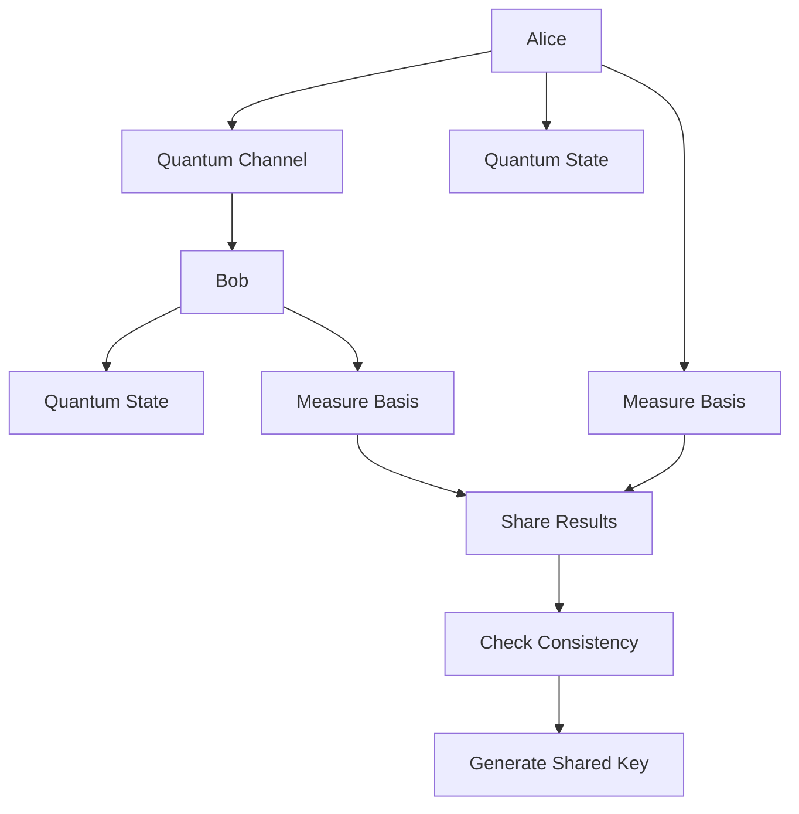
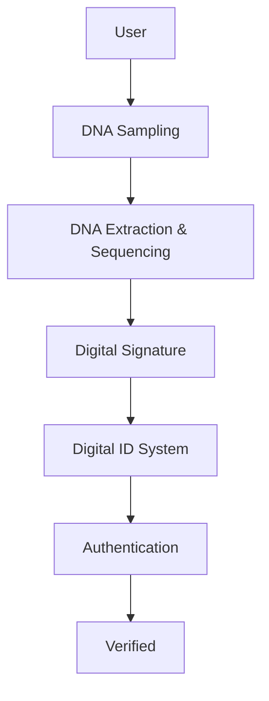

                 

### 2050年的数字身份：从生物识别到DNA身份证的身份认证

#### 关键词：
- 数字身份
- 生物识别
- DNA身份证
- 身份认证
- 数据隐私

#### 摘要：
本文深入探讨了2050年可能实现的数字身份认证技术，从传统的生物识别技术到前沿的DNA身份证。文章首先介绍了数字身份的概念及其重要性，接着详细阐述了当前生物识别技术的发展和应用，如人脸识别、指纹识别和眼纹识别。然后，文章探讨了人工智能在生物识别技术中的关键作用，展示了深度学习、增强学习和生成对抗网络的应用。接下来，文章分析了数字身份管理与隐私保护的核心问题，提出了数据加密技术、隐私保护算法和隐私计算技术等解决方案。此外，文章探讨了量子技术在数字身份中的应用，如量子密钥分配和量子加密技术。文章还探讨了DNA身份证的概念、原理、挑战和前景，以及其在数字身份认证中的应用。最后，文章讨论了数字身份与法律法规的关系、伦理问题以及未来发展趋势，并给出了数字身份技术资源与工具、示例代码与数据集，以及数字身份技术学习路径与建议。通过本文的探讨，读者可以全面了解数字身份认证技术的发展脉络和未来趋势。

### 目录大纲：

#### 第一部分：数字身份概述

## 第1章：数字身份的概念与重要性
### 1.1 数字身份的定义与演变
### 1.2 数字身份的挑战与机遇
### 1.3 数字身份的核心要素

## 第2章：数字身份技术的发展
### 2.1 生物识别技术
#### 2.1.1 人脸识别
#### 2.1.2 指纹识别
#### 2.1.3 眼纹识别
### 2.2 人工智能与数字身份

#### 第二部分：数字身份的核心技术

## 第3章：生物识别技术原理与实现
### 3.1 生物特征识别的基本原理
#### 3.1.1 特征采集
#### 3.1.2 特征提取
#### 3.1.3 特征匹配
### 3.2 人工智能在生物识别中的应用
#### 3.2.1 深度学习在人脸识别中的应用
#### 3.2.2 增强学习在指纹识别中的应用
#### 3.2.3 生成对抗网络在眼纹识别中的应用

## 第4章：数字身份管理与隐私保护
### 4.1 数字身份管理系统架构
#### 4.1.1 身份认证系统
#### 4.1.2 用户权限管理系统
#### 4.1.3 身份信息存储与管理
### 4.2 隐私保护与数据安全
#### 4.2.1 数据加密技术
#### 4.2.2 隐私保护算法
#### 4.2.3 隐私计算技术

#### 第三部分：数字身份的未来趋势

## 第5章：数字身份的未来趋势
### 5.1 量子技术在数字身份中的应用
#### 5.1.1 量子密钥分配
#### 5.1.2 量子加密技术
#### 5.1.3 量子安全通信
### 5.2 DNA身份证与数字身份
#### 5.2.1 DNA身份证的概念与原理
#### 5.2.2 DNA身份证的挑战与前景
#### 5.2.3 DNA身份证的应用领域

## 第6章：数字身份与法律法规
### 6.1 数字身份相关法律法规
#### 6.1.1 国内外数字身份法规概述
#### 6.1.2 数据保护与隐私权
#### 6.1.3 数字身份认证的法律责任
### 6.2 数字身份伦理问题
#### 6.2.1 数字身份的滥用与伦理挑战
#### 6.2.2 数字身份与隐私权的平衡
#### 6.2.3 数字身份的未来伦理发展

#### 第四部分：数字身份技术应用案例

## 第7章：数字身份技术应用案例
### 7.1 政府部门数字身份应用案例
#### 7.1.1 网上政务服务平台
#### 7.1.2 数字身份证在海关通关中的应用
#### 7.1.3 政务数据共享与数字身份认证
### 7.2 企业数字身份应用案例
#### 7.2.1 企业员工身份认证
#### 7.2.2 供应链金融中的数字身份认证
#### 7.2.3 数字身份在电商平台的防伪与维权中的应用

#### 第五部分：数字身份的发展展望

## 第8章：数字身份的发展展望
### 8.1 数字身份技术的未来发展方向
#### 8.1.1 跨界融合与生态建设
#### 8.1.2 数字身份技术的革新
#### 8.1.3 数字身份与社会治理
### 8.2 数字身份对人类社会的影响
#### 8.2.1 数字身份与个人信息保护
#### 8.2.2 数字身份与数字经济
#### 8.2.3 数字身份的未来发展趋势

#### 附录

### 附录 A：数字身份技术资源与工具
#### A.1 开源生物识别库
#### A.2 数字身份管理平台
#### A.3 量子计算与应用工具
#### A.4 法律法规与政策文件

### 附录 B：数字身份技术示例代码与数据集
#### B.1 人脸识别算法示例
#### B.2 指纹识别算法示例
#### B.3 眼纹识别算法示例
#### B.4 DNA身份证编码与解码示例

### 附录 C：数字身份技术学习路径与建议
#### C.1 数字身份技术基础知识
#### C.2 数字身份技术进阶学习
#### C.3 数字身份技术实践与探索
#### C.4 数字身份技术职业发展路径

### 第一部分：数字身份概述

在现代社会，数字身份已经成为人们日常生活不可或缺的一部分。从电子商务到社交媒体，从网上银行到移动支付，每个人的数字身份都承载着大量的个人信息和行为数据。然而，随着技术的不断进步，特别是生物识别技术和人工智能的快速发展，数字身份的未来将变得更加复杂和多样。本文旨在探讨2050年可能实现的数字身份认证技术，从传统的生物识别技术到前沿的DNA身份证，分析其核心原理、实现方式和应用场景。

#### 第1章：数字身份的概念与重要性

数字身份，简单来说，是指个体在数字世界中的唯一标识和身份认证。它不仅包括个人的基本信息，如姓名、出生日期、住址等，还包括在互联网上的行为数据、交易记录、社交关系等。随着互联网和大数据技术的发展，数字身份已经成为个人信息保护和网络安全的重要基础。

##### 1.1 数字身份的定义与演变

数字身份的定义经历了多次演变。早期的数字身份主要基于用户名和密码进行认证，这种方式简单易行，但也存在易被破解的风险。随着生物识别技术的兴起，数字身份开始向生物特征识别方向转型，如人脸识别、指纹识别和眼纹识别等。这些技术利用个体独特的生物特征进行身份验证，大大提高了认证的安全性和便捷性。

##### 1.2 数字身份的挑战与机遇

数字身份面临诸多挑战，包括隐私保护、数据安全和法律监管等。隐私保护方面，如何确保用户的个人信息不被滥用和泄露是一个亟待解决的问题。数据安全方面，随着数字身份信息的不断增加，如何保护这些数据免受网络攻击和数据泄露也是一大难题。法律监管方面，各国在数字身份认证方面的法律法规尚不完善，需要进一步完善以应对新的技术挑战。

然而，数字身份也带来了诸多机遇。首先，数字身份技术的普及将极大提高社会的效率和服务水平。例如，通过数字身份认证，人们可以更方便地办理各种在线业务，如网上购物、电子支付、政务服务等。其次，数字身份技术为企业提供了更精确的客户画像和个性化服务，有助于提高客户满意度和忠诚度。此外，数字身份技术的发展也为数字经济的发展提供了强有力的支撑，促进了商业模式的创新和产业升级。

##### 1.3 数字身份的核心要素

数字身份的核心要素主要包括以下几个方面：

1. **唯一性**：数字身份必须能够唯一标识个体，确保每个个体在数字世界中都有其独特的身份。
2. **安全性**：数字身份需要具备较高的安全性，防止身份被冒用或篡改，保障用户的个人信息安全。
3. **便捷性**：数字身份认证过程应尽可能简单快捷，以提高用户体验。
4. **可扩展性**：数字身份系统需要具备良好的可扩展性，能够适应未来技术的发展和变化。
5. **隐私保护**：数字身份系统需要确保用户的隐私不被泄露，遵守相关的数据保护法律法规。

通过以上分析，我们可以看到，数字身份不仅是现代社会不可或缺的一部分，也是未来技术发展的重要方向。随着生物识别技术和人工智能的进步，数字身份将变得更加安全、便捷和智能。在未来，数字身份不仅会改变我们的生活方式，也将深刻影响社会的发展。

### 第二部分：数字身份技术的发展

#### 第2章：数字身份技术的发展

随着科技的飞速发展，数字身份技术也在不断演进。生物识别技术和人工智能是推动数字身份发展的两个重要引擎。本章将详细探讨这些技术的原理、应用和发展趋势。

##### 2.1 生物识别技术

生物识别技术是一种通过识别和验证个体的生物特征来确认身份的技术。常见的生物特征包括人脸、指纹、眼纹等。这些特征具有唯一性和稳定性，使得生物识别技术在数字身份认证中具有极高的可靠性和安全性。

###### 2.1.1 人脸识别

人脸识别是生物识别技术中最广泛应用的一种。它通过分析人脸图像中的关键特征，如眼睛、鼻子和嘴巴的位置，来识别个体身份。

1. **特征采集**：人脸识别系统首先需要采集人脸图像。这可以通过摄像头、手机等设备实现。图像采集过程中需要确保图像质量，避免因光线、角度等因素影响识别效果。
2. **特征提取**：采集到的人脸图像需要经过预处理，如灰度化、去噪、人脸对齐等操作。然后，系统会提取人脸的显著特征，如特征点、特征线等，形成特征向量。
3. **特征匹配**：将提取的特征向量与数据库中已存储的特征向量进行比对，找到最匹配的特征向量，从而识别出个体身份。

人脸识别技术的核心算法包括特征提取算法（如局部二值模式（LBP）、梯度直方图（Gabor）等）和特征匹配算法（如欧氏距离、余弦相似度等）。

目前，人脸识别技术在很多领域都有广泛应用，如手机解锁、门禁系统、安防监控、身份认证等。随着深度学习技术的发展，人脸识别的准确率和速度都得到了显著提升。

###### 2.1.2 指纹识别

指纹识别是另一种常见的生物识别技术。每个人的指纹都是独一无二的，这使得指纹识别具有极高的准确性和可靠性。

1. **特征采集**：指纹识别系统需要采集指纹图像。这通常通过指纹扫描仪实现。图像采集过程中需要确保指纹清晰，避免因指纹磨损、污渍等因素影响识别效果。
2. **特征提取**：指纹图像经过预处理后，系统会提取指纹的主要特征，如脊线、脊谷等，形成特征向量。
3. **特征匹配**：将提取的特征向量与数据库中已存储的特征向量进行比对，找到最匹配的特征向量，从而识别出个体身份。

指纹识别技术的核心算法包括特征提取算法（如Ridge-Valley模型、Minutia模型等）和特征匹配算法（如汉明距离、特征点匹配等）。

指纹识别技术在很多领域都有广泛应用，如手机解锁、门禁系统、银行支付、身份认证等。指纹识别的优点是便捷、高效、安全，但需要注意的是，指纹容易被复制和伪造，因此在实际应用中需要结合其他技术手段提高安全性。

###### 2.1.3 眼纹识别

眼纹识别是通过分析眼球表面的独特图案来识别个体身份的一种生物识别技术。眼纹识别具有较高的准确性和可靠性，且不易受到外界环境的影响。

1. **特征采集**：眼纹识别系统需要采集眼纹图像。这通常通过红外摄像头或结构光摄像头实现。图像采集过程中需要确保图像质量，避免因光线、角度等因素影响识别效果。
2. **特征提取**：眼纹图像经过预处理后，系统会提取眼纹的主要特征，如虹膜纹理、瞳孔位置等，形成特征向量。
3. **特征匹配**：将提取的特征向量与数据库中已存储的特征向量进行比对，找到最匹配的特征向量，从而识别出个体身份。

眼纹识别技术的核心算法包括特征提取算法（如Gabor滤波器、SIFT算法等）和特征匹配算法（如欧氏距离、余弦相似度等）。

眼纹识别技术在安全级别要求较高的领域有广泛应用，如机场安检、军事基地、银行金库等。眼纹识别的优点是准确率高、不易被复制和伪造，但需要注意的是，眼纹识别设备较为昂贵，且对环境要求较高。

##### 2.2 人工智能与数字身份

人工智能（AI）在数字身份认证中发挥着越来越重要的作用。通过深度学习、增强学习和生成对抗网络等人工智能技术，可以进一步提高数字身份认证的准确性和安全性。

###### 2.2.1 深度学习在人脸识别中的应用

深度学习是一种基于多层神经网络的机器学习技术，可以自动提取特征并进行分类。在人脸识别中，深度学习可以用于特征提取和分类。

1. **卷积神经网络（CNN）**：卷积神经网络是一种专门用于处理图像数据的神经网络。它可以通过多层卷积和池化操作自动提取图像特征。在人脸识别中，CNN可以用于人脸检测、特征提取和身份验证。
2. **深度特征嵌入**：深度特征嵌入是一种通过深度学习技术将人脸图像映射到高维特征空间的方法。在这个空间中，相似的人脸会映射到接近的位置，不同的人脸会映射到远离的位置。这样可以大大提高人脸识别的准确率。

深度学习技术在人脸识别中的应用极大地提高了识别速度和准确率，使得人脸识别技术在实际应用中更加普及。

###### 2.2.2 增强学习在指纹识别中的应用

增强学习是一种通过不断试错和优化策略来提高任务完成率的机器学习技术。在指纹识别中，增强学习可以用于优化特征提取和匹配算法。

1. **自适应特征提取**：通过增强学习，系统可以自动调整特征提取参数，以获得更好的特征向量。这样可以提高指纹识别的准确率。
2. **自适应匹配策略**：通过增强学习，系统可以自动优化匹配策略，以减少误识率和误警率。

增强学习在指纹识别中的应用有助于提高系统的适应性和鲁棒性，使其在各种环境下都能保持高效稳定的识别效果。

###### 2.2.3 生成对抗网络在眼纹识别中的应用

生成对抗网络（GAN）是一种通过对抗训练生成数据的新兴机器学习技术。在眼纹识别中，GAN可以用于生成真实的眼纹图像，以提高识别系统的训练效果。

1. **图像生成**：GAN通过生成器和判别器的对抗训练，可以生成高质量的眼纹图像。这些图像可以用于扩充训练数据集，提高眼纹识别的泛化能力。
2. **特征增强**：通过GAN生成的图像，可以进一步提取关键特征，以提高眼纹识别的准确性和稳定性。

生成对抗网络在眼纹识别中的应用为提高系统的识别性能提供了新的思路和方法。

通过以上分析，我们可以看到，生物识别技术和人工智能在数字身份认证中发挥着重要作用。这些技术的不断发展将进一步提升数字身份认证的安全性和便捷性，为未来的数字世界提供强有力的支持。

### 第三部分：数字身份的核心技术

在数字身份认证系统中，生物识别技术扮演着核心角色。这一部分将详细探讨生物识别技术的基本原理、实现方式以及人工智能在其中发挥的关键作用。

#### 第3章：生物识别技术原理与实现

##### 3.1 生物特征识别的基本原理

生物识别技术是基于个体独特的生物特征进行身份验证的技术。这些特征包括人脸、指纹、眼纹、声音等。每种生物特征都有其独特的生成机制和物理特性，这使得它们在身份认证中具有高度的唯一性和稳定性。

###### 3.1.1 特征采集

特征采集是生物识别技术的第一步，也是最为基础的一步。特征采集的质量直接影响后续的特征提取和匹配效果。以下是几种常见生物特征的采集方法：

1. **人脸识别**：通常使用摄像头或手机的前置镜头采集人脸图像。在采集过程中，需要确保光线充足、角度合适，以获得高质量的人脸图像。
2. **指纹识别**：使用指纹扫描仪采集指纹图像。在采集过程中，需要确保指纹表面干燥、无污渍，以提高指纹图像的清晰度。
3. **眼纹识别**：使用红外摄像头或结构光摄像头采集眼纹图像。在采集过程中，需要避免光线直射眼睛，以免对眼纹图像的采集造成干扰。

###### 3.1.2 特征提取

特征提取是将原始生物特征数据转化为可以用于身份认证的数字特征向量。特征提取过程主要包括以下步骤：

1. **预处理**：对采集到的生物特征数据进行预处理，如去噪、灰度化、归一化等。预处理可以增强特征提取的效果，提高系统的鲁棒性。
2. **特征点检测**：在预处理后的图像中检测出关键特征点，如人脸图像中的眼睛、鼻子和嘴巴位置，指纹图像中的脊线和脊谷等。
3. **特征表示**：将检测到的特征点转化为数字特征向量。特征表示方法包括几何特征（如特征点坐标、角度等）、纹理特征（如局部二值模式、Gabor特征等）和频域特征（如傅里叶变换等）。

不同生物特征的特征提取方法有所不同，但核心目标都是将复杂的生物特征转化为简洁、有效的数字特征向量，以便后续的匹配和识别。

###### 3.1.3 特征匹配

特征匹配是将提取到的特征向量与数据库中已存储的特征向量进行比对，以确定是否匹配的过程。特征匹配的方法主要包括以下几种：

1. **欧氏距离**：欧氏距离是一种常用的特征匹配方法，用于计算两个特征向量之间的距离。距离越近，表示特征向量越相似，识别结果越可靠。
2. **余弦相似度**：余弦相似度通过计算两个特征向量的夹角余弦值来衡量它们的相似度。余弦值越接近1，表示特征向量越相似。
3. **汉明距离**：汉明距离用于比较两个二进制向量的差异。差异越小，表示特征向量越相似。

特征匹配的核心是找到一个合适的阈值，当匹配得分超过这个阈值时，认为特征向量匹配成功，否则匹配失败。阈值的选择需要综合考虑系统的误识率和误警率，以实现最佳平衡。

##### 3.2 人工智能在生物识别中的应用

人工智能，特别是深度学习，在生物识别技术中发挥着关键作用。深度学习通过多层神经网络自动提取特征，提高了特征提取和匹配的准确性和效率。

###### 3.2.1 深度学习在人脸识别中的应用

深度学习在人脸识别中的应用主要体现在特征提取和分类两个方面。

1. **特征提取**：深度学习可以通过卷积神经网络（CNN）自动提取人脸图像的复杂特征。与传统手工设计的特征提取方法相比，深度学习可以更好地捕捉人脸图像中的高层次特征，提高了识别准确率。例如，基于CNN的人脸识别模型可以自动学习到人脸图像中的眼睛、鼻子和嘴巴位置，从而提取出有效的特征向量。

2. **分类**：深度学习可以通过多层感知机（MLP）或循环神经网络（RNN）对提取的特征向量进行分类。在人脸识别中，分类任务是将提取到的特征向量映射到正确的身份标签。深度学习模型可以通过大量数据训练，不断优化分类器，提高识别准确率。

深度学习在人脸识别中的应用极大地提升了识别准确率和速度，使得人脸识别技术在各种实际应用中得到了广泛应用。

###### 3.2.2 增强学习在指纹识别中的应用

增强学习在指纹识别中的应用主要体现在特征提取和匹配算法的优化上。

1. **特征提取**：通过增强学习，系统可以自动调整特征提取参数，以获得更好的特征向量。例如，在指纹识别中，可以通过增强学习调整脊线和脊谷的检测阈值，从而提高特征提取的准确性和鲁棒性。

2. **匹配算法**：增强学习可以用于优化匹配算法，以提高识别准确率和减少误识率。例如，在指纹识别中，可以通过增强学习优化汉明距离的计算方法，从而提高匹配的准确性。

增强学习在指纹识别中的应用有助于提高系统的适应性和鲁棒性，使其在各种环境下都能保持高效稳定的识别效果。

###### 3.2.3 生成对抗网络在眼纹识别中的应用

生成对抗网络（GAN）在眼纹识别中的应用主要体现在图像生成和特征增强上。

1. **图像生成**：GAN可以通过生成器和判别器的对抗训练生成高质量的眼纹图像。这些图像可以用于扩充训练数据集，提高眼纹识别的泛化能力。

2. **特征增强**：通过GAN生成的图像，可以进一步提取关键特征，以提高眼纹识别的准确性和稳定性。例如，GAN可以生成高质量的眼纹图像，从而使得眼纹图像中的纹理特征更加清晰，有助于提高识别准确率。

生成对抗网络在眼纹识别中的应用为提高系统的识别性能提供了新的思路和方法。

通过以上分析，我们可以看到，人工智能在生物识别技术中发挥着至关重要的作用。深度学习、增强学习和生成对抗网络等人工智能技术的应用，不仅提高了生物识别的准确性和效率，也为数字身份认证提供了更加安全和便捷的解决方案。随着人工智能技术的不断进步，生物识别技术将在未来数字身份认证中发挥更加重要的作用。

### 第4章：数字身份管理与隐私保护

数字身份的管理与隐私保护是现代数字身份认证系统中的关键环节。随着数字身份技术的广泛应用，个人隐私数据的保护和安全变得尤为重要。本章将深入探讨数字身份管理系统架构、隐私保护与数据安全的关键技术，以及隐私计算技术在数字身份管理中的应用。

#### 4.1 数字身份管理系统架构

数字身份管理系统（Digital Identity Management System, DIMS）是用于管理、存储和验证用户数字身份信息的核心平台。一个完善的数字身份管理系统通常包括以下关键组件：

1. **身份认证系统**：负责用户登录、权限验证和身份确认。身份认证系统通常采用多因素认证（MFA）技术，结合生物识别、密码和硬件令牌等不同认证方式，以提高认证的安全性。

2. **用户权限管理系统**：用于管理用户的访问权限和操作权限。用户权限管理系统可以根据用户的角色和权限级别，灵活配置和调整用户的访问权限，确保系统资源的合理分配和使用。

3. **身份信息存储与管理**：负责存储和管理用户的身份信息，包括个人基本信息、生物特征数据、访问历史等。身份信息存储与管理系统需要具备高安全性、可靠性和可扩展性，以保护用户隐私数据的安全。

4. **日志和审计系统**：记录用户的登录、操作和访问日志，用于系统监控、异常检测和审计追踪。日志和审计系统可以帮助管理员及时发现和解决系统漏洞和安全隐患。

数字身份管理系统架构的示意图如下：

```
+----------------+       +------------------+       +------------------+
| 身份认证系统  | <---> | 用户权限管理系统 | <---> | 身份信息存储与管理 |
+----------------+       +------------------+       +------------------+
        |                              |                             |
        |                              |                             |
        |  +----------------+          |  +------------------------+  |
        |  | 日志和审计系统 |----------|  | 第三方服务集成与接口  |  |
        |  +----------------+          |  +------------------------+  |
        |                              |                             |
        |                              |                             |
        +-----------------------------+-----------------------------+
```

#### 4.2 隐私保护与数据安全

在数字身份管理中，隐私保护和数据安全是至关重要的。以下是一些关键技术和措施：

1. **数据加密技术**：数据加密是保护隐私数据的基本手段。通过使用对称加密（如AES）和非对称加密（如RSA）技术，可以确保数据在传输和存储过程中不被未授权的第三方访问。加密算法的选择和实现需要遵循国际标准和最佳实践，以保障数据的安全性。

2. **隐私保护算法**：隐私保护算法旨在在不泄露用户隐私的前提下，实现数据的有效利用。例如，差分隐私（Differential Privacy）可以通过在数据处理过程中添加随机噪声，保护数据中的个体隐私。同态加密（Homomorphic Encryption）则允许在加密的数据上进行计算，而不需要解密数据，从而保护数据的隐私。

3. **访问控制**：访问控制是通过身份认证和权限管理系统，确保只有授权用户才能访问敏感数据。访问控制机制通常包括用户身份验证、权限分配、访问审计等，以实现最小权限原则，减少数据泄露的风险。

4. **安全审计与监控**：通过实时监控和审计用户操作，可以及时发现和应对潜在的安全威胁。安全审计可以帮助管理员了解系统的使用情况和潜在风险，及时采取防护措施。

5. **数据备份与恢复**：定期备份数据，并确保备份数据的安全，是防止数据丢失和灾难恢复的重要措施。数据备份策略应考虑数据的重要性、备份频率、备份存储位置等，以保障数据的高可用性和安全性。

#### 4.3 隐私计算技术在数字身份管理中的应用

隐私计算技术是一种在数据保持加密状态的前提下进行计算和处理的技术，旨在在不泄露用户隐私的前提下，实现数据的分析和应用。隐私计算技术在数字身份管理中的应用主要包括以下几个方面：

1. **联邦学习**：联邦学习（Federated Learning）是一种分布式机器学习技术，允许不同机构在本地进行模型训练，并将模型更新上传到中央服务器。通过联邦学习，可以共享模型更新而不需要共享原始数据，从而保护用户隐私。

2. **多方安全计算**：多方安全计算（Multi-Party Secure Computation）是一种允许多个参与方共同计算结果，而不需要泄露各自数据的技术。在数字身份管理中，多方安全计算可以用于身份验证和权限管理，确保数据隐私的同时实现协同计算。

3. **零知识证明**：零知识证明（Zero-Knowledge Proof）是一种证明方法，允许证明者证明某个陈述是正确的，而无需透露任何额外信息。在数字身份管理中，零知识证明可以用于身份验证和隐私保护，确保用户隐私不被泄露。

通过以上分析，我们可以看到，数字身份管理与隐私保护是现代数字身份认证系统的核心。一个完善的数字身份管理系统不仅需要具备高安全性和可靠性，还需要确保用户隐私数据的安全。随着隐私计算技术的不断发展，数字身份管理将在未来变得更加安全、智能和便捷。

### 第5章：数字身份的未来趋势

随着科技的不断进步，数字身份技术正朝着更加安全、智能和便捷的方向发展。本章将探讨量子技术在数字身份中的应用，以及DNA身份证的概念、原理、挑战和前景。

#### 5.1 量子技术在数字身份中的应用

量子技术，作为一种颠覆性的新型科技，正在对数字身份认证产生深远影响。量子技术主要包括量子加密、量子密钥分配和量子安全通信。

##### 5.1.1 量子密钥分配

量子密钥分配（Quantum Key Distribution，QKD）是一种基于量子力学原理的安全通信技术。它利用量子纠缠和量子测量不可克隆定理，实现双方安全地共享密钥。QKD的基本原理如下：

1. **量子纠缠**：当两个量子比特（qubit）处于纠缠状态时，它们的量子态会相互关联。即使它们相隔很远，一个量子比特的状态变化会立即影响另一个量子比特的状态。

2. **量子信道传输**：双方通过量子信道传输量子态，同时测量量子态的基向量。

3. **基向量校验**：双方根据预定的规则，交换测量结果的基向量，并验证它们是否一致。

4. **密钥生成**：通过比对一致的基向量，双方生成共享的密钥。由于量子测量具有不可克隆定理，任何对量子态的观察都会改变量子态，因此第三方无法窃听和复制密钥。

量子密钥分配的流程可以用以下Mermaid流程图表示：



##### 5.1.2 量子加密技术

量子加密技术利用量子态的不可克隆特性，实现数据的加密传输。量子加密的基本原理如下：

1. **量子态编码**：将数据编码为量子态，如量子比特（qubit）的叠加态。

2. **量子态操作**：对量子态进行特定的量子操作，如量子门，以实现加密。

3. **量子态测量**：接收方通过测量量子态来解密数据。由于量子态的叠加性和纠缠特性，只有合法的接收方能够正确解密数据。

量子加密技术的优势在于，任何对量子态的干扰都会导致量子态的坍塌，因此可以检测到数据传输过程中的任何窃听行为。

##### 5.1.3 量子安全通信

量子安全通信（Quantum Secure Communication）结合量子密钥分配和量子加密技术，实现端到端的安全通信。量子安全通信的基本原理如下：

1. **量子密钥分配**：双方通过量子密钥分配协议生成共享密钥。

2. **量子加密**：使用量子加密技术对数据进行加密传输。

3. **量子态测量**：接收方通过量子态测量解密数据。

量子安全通信确保了数据传输过程的安全性和完整性，即使数据在传输过程中被第三方窃听，也无法解密数据。

#### 5.2 DNA身份证与数字身份

DNA身份证是一种基于个体独特DNA序列进行身份认证的技术。与传统的生物识别技术不同，DNA身份证具有极高的唯一性和稳定性，因为每个人的DNA序列都是独一无二的。DNA身份证的基本原理如下：

##### 5.2.1 DNA身份证的概念与原理

DNA身份证的概念是将个体的DNA序列作为唯一的身份标识，存储在数字身份认证系统中。DNA身份证的原理包括以下几个步骤：

1. **DNA采样**：通过采集个体的DNA样本，如唾液、血液或细胞组织。

2. **DNA提取与测序**：从DNA样本中提取DNA序列，并进行DNA测序，得到个体的DNA序列。

3. **数字签名**：将个体的DNA序列与数字签名技术结合，生成一个唯一的数字签名，作为个体的身份标识。

4. **存储与验证**：将数字签名存储在数字身份认证系统中，并在身份认证时进行验证。

DNA身份证的流程可以用以下Mermaid流程图表示：



##### 5.2.2 DNA身份证的挑战与前景

虽然DNA身份证具有独特的优势，但其实现和应用面临诸多挑战：

1. **隐私保护**：DNA序列涉及个人隐私信息，如何保护DNA序列的安全和隐私是一个重要问题。

2. **技术复杂性**：DNA测序和数字签名技术要求高精度和高可靠性，这对技术的实现提出了较高要求。

3. **成本与可扩展性**：DNA身份证的制备和认证过程需要高昂的成本，如何实现大规模应用和降低成本是一个重要挑战。

然而，随着量子计算和人工智能技术的发展，DNA身份证的应用前景依然广阔。DNA身份证可以用于安全认证、医疗健康、遗传研究等多个领域，为数字身份认证提供一种全新的解决方案。

##### 5.2.3 DNA身份证的应用领域

DNA身份证在以下领域具有广泛的应用前景：

1. **安全认证**：DNA身份证可以用于身份验证，确保个人身份的唯一性和真实性。

2. **医疗健康**：DNA身份证可以用于医疗健康记录管理，实现个性化医疗和精准医疗。

3. **遗传研究**：DNA身份证可以用于遗传研究，帮助科学家了解个体遗传信息，为遗传病预防和治疗提供支持。

4. **司法鉴定**：DNA身份证可以用于司法鉴定，如犯罪侦查、身份认定等。

通过以上分析，我们可以看到，量子技术和DNA身份证为数字身份认证带来了新的机遇和挑战。随着技术的不断进步，数字身份认证将变得更加安全、智能和便捷，为未来的数字社会提供强有力的支撑。

### 第6章：数字身份与法律法规

随着数字身份技术的快速发展，相关法律法规的制定和实施也日益重要。本章将探讨数字身份相关法律法规的概述，包括数据保护与隐私权以及数字身份认证的法律责任。

#### 6.1 数字身份相关法律法规

在全球范围内，许多国家和地区已经开始制定和实施数字身份相关的法律法规，以应对新兴技术带来的挑战和机遇。以下是一些主要的数字身份相关法律法规：

1. **欧盟《通用数据保护条例》（GDPR）**：GDPR是欧盟最严格的隐私保护法律之一，要求企业在处理个人数据时必须遵循一系列严格的规则。GDPR涵盖了数字身份认证中的数据收集、处理、存储和传输等环节，强调个人数据的透明性和安全性。

2. **美国《加利福尼亚州消费者隐私法案》（CCPA）**：CCPA旨在保护加州居民的隐私权，规定了企业收集、使用和共享个人信息的责任。虽然CCPA主要针对加州居民，但其原则和规定对其他州和国家的数字身份管理也有重要参考价值。

3. **中国《个人信息保护法》（PIPL）**：PIPL是中国首部全面规范个人信息保护的法律法规，对个人信息的收集、使用、存储、处理和传输等环节提出了严格要求。PIPL强调个人信息的合法、正当、必要原则，并赋予个人更多的控制权。

4. **韩国《个人信息保护法》（PIPA）**：PIPA是韩国的个人信息保护法律，规定了个人信息的收集、使用、处理和共享等行为，并对违反规定的个人和企业实施了严格的法律责任。

这些法律法规的共同目标是在保障个人隐私和数据安全的同时，促进数字身份技术的健康发展。在数字身份认证领域，这些法律法规为企业的合规操作提供了指导，也为用户权益的保护提供了法律依据。

#### 6.2 数据保护与隐私权

数据保护与隐私权是数字身份管理中的核心问题。随着数字身份信息的日益增多，如何有效保护用户隐私成为了一项重要任务。以下是一些关键措施：

1. **数据匿名化**：通过数据匿名化技术，将个人身份信息与数据分离，以减少数据泄露的风险。匿名化技术包括数据加密、混淆和脱敏等。

2. **访问控制**：通过身份认证和权限管理，确保只有授权用户才能访问敏感数据。访问控制机制应遵循最小权限原则，确保用户只能访问与其角色和职责相关的数据。

3. **隐私保护算法**：采用隐私保护算法，如差分隐私和同态加密，在数据处理和分析过程中保护用户隐私。这些算法可以在不泄露用户隐私的前提下，实现数据的有效利用。

4. **用户知情同意**：在收集和使用用户数据时，确保用户知情并明确同意。用户应有权了解其数据将被如何使用，并有权撤销其同意。

5. **数据安全审计**：定期进行数据安全审计，确保数据保护措施得到有效实施。数据安全审计应包括数据泄露风险评估、漏洞修复和合规性检查等。

#### 6.3 数字身份认证的法律责任

数字身份认证的法律责任主要包括以下几个方面：

1. **合规性责任**：数字身份认证服务提供商必须遵守相关法律法规，确保其服务符合数据保护、隐私保护等要求。

2. **数据泄露责任**：在发生数据泄露事件时，数字身份认证服务提供商应承担相应的法律责任。这包括及时通知受影响的用户、协助用户采取补救措施、承担相应的经济损失等。

3. **用户隐私权保护责任**：数字身份认证服务提供商有责任保护用户的隐私权，确保用户数据不被未经授权的第三方访问和泄露。

4. **法律责任追究**：在数字身份认证过程中，如果因认证错误导致用户权益受损，相关方应承担相应的法律责任。这包括用户身份被冒用、认证失败导致财产损失等。

通过以上分析，我们可以看到，数字身份与法律法规的关系紧密，法律法规的制定和实施为数字身份技术的健康发展提供了法律保障。在数字身份认证中，保护用户隐私和数据安全是企业的首要责任，只有依法合规，才能赢得用户的信任和支持。

### 第7章：数字身份技术应用案例

数字身份技术的应用已经深入到社会的各个领域，从政府到企业，再到个人，都在利用数字身份技术提高效率和安全性。本章将详细探讨数字身份技术在政府部门和企业中的应用案例，包括网上政务服务、海关通关、企业员工身份认证、供应链金融以及电商平台的防伪与维权。

#### 7.1 政府部门数字身份应用案例

在政府部门，数字身份技术已经被广泛应用于政务服务平台、海关通关和政务数据共享等方面，显著提高了政府服务的效率和质量。

##### 7.1.1 网上政务服务平台

网上政务服务平台是数字身份技术的重要应用场景之一。通过数字身份认证，用户可以安全地登录政务服务平台，办理各类政务事项。数字身份认证技术确保了用户身份的合法性和唯一性，有效防止了身份冒用和欺诈行为。具体应用包括：

1. **身份认证**：用户通过生物识别技术（如人脸识别、指纹识别）进行身份验证，确保登录用户是本人。
2. **权限管理**：根据用户的身份和权限，系统自动分配相应的服务内容和操作权限，确保用户只能访问其有权操作的服务。
3. **数据安全**：采用数据加密技术和隐私保护算法，确保用户在平台上传输的数据安全，防止数据泄露和篡改。

##### 7.1.2 数字身份证在海关通关中的应用

海关通关是另一个数字身份技术的重要应用领域。通过数字身份证和生物识别技术，海关可以实现对进出境旅客的快速、准确的身份认证，提高通关效率。

1. **人脸识别**：旅客在入境时，通过摄像头进行人脸识别，与护照照片进行比对，快速确认身份。
2. **电子护照**：电子护照集成了数字身份信息，可以通过扫描护照芯片，快速读取旅客信息，并与生物识别数据进行比对。
3. **智能通关**：利用智能通关系统，旅客可以通过自助设备完成通关流程，减少排队等候时间，提高通关效率。

##### 7.1.3 政务数据共享与数字身份认证

政务数据共享是提高政府工作效率和服务水平的重要手段。通过数字身份认证技术，可以确保政务数据在共享过程中的安全性和合法性。

1. **数据加密**：在政务数据传输过程中，采用数据加密技术，确保数据在传输过程中不被窃取和篡改。
2. **隐私保护**：采用隐私保护算法，对敏感数据部分进行脱敏处理，确保个人隐私不被泄露。
3. **权限管理**：通过数字身份认证和权限管理系统，确保只有授权用户才能访问特定数据，防止数据滥用和泄露。

#### 7.2 企业数字身份应用案例

在企业中，数字身份技术被广泛应用于员工身份认证、供应链金融以及电商平台等领域，有效提升了企业的运营效率和安全水平。

##### 7.2.1 企业员工身份认证

企业员工身份认证是确保企业内部安全的重要措施。通过数字身份认证技术，企业可以实现以下功能：

1. **人脸识别门禁**：员工通过人脸识别门禁系统进入办公区域，确保进入办公区域的人员是合法员工。
2. **指纹考勤**：员工通过指纹识别进行考勤，确保考勤数据的准确性和实时性。
3. **权限管理**：根据员工的岗位和职责，系统自动分配相应的权限，确保员工只能访问其有权操作的系统和服务。

##### 7.2.2 供应链金融中的数字身份认证

供应链金融是企业在供应链管理过程中实现资金流转的重要手段。数字身份认证技术可以确保供应链金融交易的安全和高效。

1. **身份验证**：通过数字身份认证，确保参与供应链金融的各方的身份真实有效，防止欺诈行为。
2. **数据安全**：采用数据加密技术和隐私保护算法，确保供应链金融数据在传输和存储过程中的安全性。
3. **风险控制**：通过数字身份认证和风险控制技术，实时监控供应链金融交易的风险，及时采取应对措施，确保交易安全。

##### 7.2.3 数字身份在电商平台的防伪与维权中的应用

在电商平台上，数字身份技术被广泛应用于防伪和维权，保障消费者的合法权益。

1. **防伪标识**：电商平台通过数字身份技术，为商品提供唯一的防伪标识，消费者可以通过扫描防伪标识验证商品真伪。
2. **维权认证**：在消费者维权过程中，数字身份认证技术可以快速确认消费者的身份，提高维权效率。
3. **数据追踪**：电商平台通过数字身份技术，实现商品销售数据的实时追踪，有助于监控和打击假冒伪劣商品。

通过以上案例分析，我们可以看到，数字身份技术已经在政府和企业中得到广泛应用，有效提升了服务效率和安全性。随着数字身份技术的不断发展，其应用领域将更加广泛，为社会的数字化发展提供强有力的支撑。

### 第8章：数字身份的发展展望

随着科技的不断进步，数字身份技术正朝着更加智能、安全、便捷的方向发展。本章将探讨数字身份技术的未来发展方向，分析其对人类社会的影响，并展望数字身份技术在未来可能面临的技术革新和社会治理挑战。

#### 8.1 数字身份技术的未来发展方向

1. **跨界融合与生态建设**

未来，数字身份技术将与其他前沿技术如区块链、物联网和云计算等实现深度融合，构建一个更加智能和高效的数字身份生态系统。区块链技术可以为数字身份提供去中心化的可信记录，确保身份信息的不可篡改和透明性。物联网技术可以将物理世界中的各种设备和传感器与数字身份系统连接，实现智能身份认证和便捷的设备交互。云计算技术则为数字身份系统提供了强大的计算和存储能力，支持大规模数据的处理和分析。

2. **技术创新与革新**

未来，数字身份技术将迎来一系列技术创新。首先，量子计算和量子加密技术将为数字身份认证提供前所未有的安全性。量子密钥分配和量子安全通信可以确保身份信息在传输过程中的绝对安全，防止任何形式的窃听和篡改。其次，人工智能和机器学习技术将进一步提升数字身份认证的准确性和效率。通过深度学习和增强学习，系统可以更好地理解和分析生物特征数据，提供更加精确的身份验证服务。此外，新型生物识别技术如脑波识别、基因识别等也将逐步成熟，为数字身份认证提供更多的可能性。

3. **社会治理与融合**

数字身份技术的未来发展将深刻影响社会治理。首先，数字身份系统将成为社会管理和治理的重要工具。通过数字身份技术，政府可以更加有效地进行社会管理，提高公共服务的效率和便捷性。例如，通过数字身份认证，政府可以实现跨部门的数据共享和协同工作，提高社会治理的智能化水平。其次，数字身份技术将为社会治理带来新的挑战。随着数字身份信息的普及和应用，如何确保这些信息的隐私和安全成为了一个重要课题。政府和相关机构需要制定和实施严格的法律法规，确保数字身份信息的合法使用和保护。

#### 8.2 数字身份对人类社会的影响

1. **个人信息保护**

数字身份技术的普及将极大地改变个人信息的存储、处理和利用方式。一方面，数字身份系统可以为个人提供更便捷、更安全的身份认证服务，提高个人信息的安全性和隐私保护水平。另一方面，随着数字身份信息的广泛应用，个人隐私保护面临着前所未有的挑战。如何确保个人数字身份信息的隐私和安全，防止信息泄露和滥用，将成为未来社会需要解决的重要问题。

2. **数字经济与商业模式**

数字身份技术为数字经济的发展提供了强大的支撑。通过数字身份认证，电子商务、在线支付、共享经济等新兴商业模式可以更加便捷和高效地运行。数字身份技术可以确保交易的安全性和可追溯性，降低交易成本和风险。同时，数字身份技术还可以为企业和个人提供更加精准的数据分析和服务，推动数字经济的创新和发展。

3. **社会信任与治理**

数字身份技术将重塑社会信任体系。通过可信的数字身份认证，个人和企业在网络世界中可以建立信任关系，降低交易成本和风险。此外，数字身份技术还为社会治理提供了新的手段和工具，有助于提高社会治理的透明性和效率。通过数字身份技术，政府可以更加精准地掌握社会信息，实现智能化的社会管理和治理。

#### 8.3 数字身份的未来发展趋势

1. **普及与应用**

随着数字身份技术的不断成熟和应用，其普及程度将越来越高。未来，数字身份技术将成为人们日常生活中不可或缺的一部分，从个人身份认证到企业运营管理，再到政府社会治理，数字身份技术都将发挥重要作用。

2. **安全与隐私保护**

数字身份技术的未来发展将更加注重安全与隐私保护。通过技术创新和法律保障，数字身份系统将实现更高的安全性和隐私保护水平，确保个人和企业的信息安全。

3. **智能化与个性化**

未来，数字身份技术将更加智能化和个性化。通过人工智能和大数据技术，数字身份系统将更好地理解和满足用户的需求，提供更加精准和高效的服务。

4. **跨界融合与生态建设**

数字身份技术将与其他前沿技术实现深度融合，构建一个更加智能和高效的数字身份生态系统。通过跨界融合，数字身份技术将为社会带来更多的创新和发展机会。

通过以上分析，我们可以看到，数字身份技术在未来的发展中具有巨大的潜力和广阔的应用前景。随着技术的不断进步和社会的不断发展，数字身份技术将深刻改变我们的生活方式和社会治理模式，为构建一个更加安全、智能和便捷的数字社会提供强有力的支持。

### 附录

#### 附录 A：数字身份技术资源与工具

在数字身份技术的研发和应用过程中，有许多开源库、管理平台、量子计算工具以及法律法规与政策文件可供参考。以下是一些常用的资源与工具：

1. **开源生物识别库**
   - **OpenCV**：开源计算机视觉库，支持人脸识别、指纹识别等多种生物识别功能。
   - **dlib**：包含高级机器学习算法和工具，用于构建机器学习模型，适用于人脸识别等生物识别任务。
   - **DeepLearning4J**：基于Java的深度学习库，支持人脸识别、语音识别等多种应用。

2. **数字身份管理平台**
   - **Okta**：提供全面的企业级身份认证、访问管理和自动化解决方案。
   - **OneLogin**：支持多种身份认证方式，提供云端的身份管理服务。
   - **RSA SecureID**：提供硬件和软件令牌，支持多因素认证。

3. **量子计算与应用工具**
   - **Qiskit**：IBM提供的开源量子计算框架，支持量子编程、模拟和量子计算实验。
   - **Cirq**：Google开源的量子计算框架，提供量子电路构建和优化工具。
   - **ProjectQ**：微软开源的量子计算框架，支持量子电路模拟和量子算法开发。

4. **法律法规与政策文件**
   - **欧盟《通用数据保护条例》（GDPR）**：详细规定了个人数据的处理和保护要求。
   - **美国《加利福尼亚州消费者隐私法案》（CCPA）**：保护加州居民的隐私权。
   - **中国《个人信息保护法》（PIPL）**：全面规范个人信息保护。
   - **联合国《数字身份指南》**：提供了数字身份的国际标准和最佳实践。

#### 附录 B：数字身份技术示例代码与数据集

为了更好地理解数字身份技术的实现和应用，以下是一些示例代码和数据集：

1. **人脸识别算法示例**
   ```python
   # 导入所需库
   import cv2
   import numpy as np

   # 特征提取函数
   def extract_features(image):
       # 将图像转化为灰度图
       gray = cv2.cvtColor(image, cv2.COLOR_BGR2GRAY)
       # 使用Haar级联分类器进行人脸检测
       faces = face_cascade.detectMultiScale(gray, scaleFactor=1.1, minNeighbors=5)
       # 提取人脸区域
       for (x, y, w, h) in faces:
           face_region = gray[y:y+h, x:x+w]
           # 将人脸区域进行LBP特征提取
           feature_vector = lbp_feature(face_region)
       return feature_vector

   # 人脸识别函数
   def facial_recognition(image_path, feature_db):
       image = cv2.imread(image_path)
       feature_vector = extract_features(image)
       highest_score = match_features(feature_vector, feature_db)
       return highest_score

   # 主函数
   def main():
       image_path = "path/to/face_image.jpg"
       feature_db = load_feature_database()  # 加载已训练的特征数据库
       result = facial_recognition(image_path, feature_db)
       print("识别结果：", result)

   if __name__ == "__main__":
       main()
   ```

2. **指纹识别算法示例**
   ```python
   # 导入所需库
   import cv2
   import numpy as np

   # 特征提取函数
   def extract_features(image):
       # 使用指纹扫描仪进行指纹采集
       image = cv2.imdecode(np.fromfile("path/to/fingerprint_image.bin", dtype=np.uint8), cv2.IMREAD_GRAYSCALE)
       # 对指纹图像进行预处理
       image = cv2.threshold(image, 128, 255, cv2.THRESH_BINARY_INV + cv2.THRESH_OTSU)
       # 提取指纹特征
       feature_vector = extract_fingerprint_features(image)
       return feature_vector

   # 指纹识别函数
   def fingerprint_recognition(image_path, feature_db):
       image = cv2.imdecode(np.fromfile(image_path, dtype=np.uint8), cv2.IMREAD_GRAYSCALE)
       feature_vector = extract_features(image)
       highest_score = match_features(feature_vector, feature_db)
       return highest_score

   # 主函数
   def main():
       image_path = "path/to/fingerprint_image.bin"
       feature_db = load_feature_database()  # 加载已训练的特征数据库
       result = fingerprint_recognition(image_path, feature_db)
       print("识别结果：", result)

   if __name__ == "__main__":
       main()
   ```

3. **眼纹识别算法示例**
   ```python
   # 导入所需库
   import cv2
   import numpy as np

   # 特征提取函数
   def extract_features(image):
       # 使用眼纹扫描仪进行眼纹采集
       image = cv2.imdecode(np.fromfile("path/to/iris_image.bin", dtype=np.uint8), cv2.IMREAD_GRAYSCALE)
       # 对眼纹图像进行预处理
       image = cv2.threshold(image, 128, 255, cv2.THRESH_BINARY_INV + cv2.THRESH_OTSU)
       # 提取眼纹特征
       feature_vector = extract_iris_features(image)
       return feature_vector

   # 眼纹识别函数
   def iris_recognition(image_path, feature_db):
       image = cv2.imdecode(np.fromfile(image_path, dtype=np.uint8), cv2.IMREAD_GRAYSCALE)
       feature_vector = extract_features(image)
       highest_score = match_features(feature_vector, feature_db)
       return highest_score

   # 主函数
   def main():
       image_path = "path/to/iris_image.bin"
       feature_db = load_feature_database()  # 加载已训练的特征数据库
       result = iris_recognition(image_path, feature_db)
       print("识别结果：", result)

   if __name__ == "__main__":
       main()
   ```

4. **DNA身份证编码与解码示例**
   ```python
   # 导入所需库
   import numpy as np

   # DNA身份证编码函数
   def encode_dna_id(dna_sequence):
       # 定义DNA字母与数字映射表
       mapping = {'A': '0', 'C': '1', 'G': '2', 'T': '3'}
       # 将DNA序列编码为数字序列
       digit_sequence = ''.join(mapping[nucleotide] for nucleotide in dna_sequence)
       return digit_sequence

   # DNA身份证解码函数
   def decode_dna_id(digit_sequence):
       # 定义数字与DNA字母映射表
       mapping = {'0': 'A', '1': 'C', '2': 'G', '3': 'T'}
       # 将数字序列解码为DNA序列
       dna_sequence = ''.join(mapping[digit] for digit in digit_sequence)
       return dna_sequence

   # 主函数
   def dna_id_operations(dna_sequence):
       # 编码
       digit_sequence = encode_dna_id(dna_sequence)
       print("编码后序列：", digit_sequence)
       
       # 解码
       decoded_sequence = decode_dna_id(digit_sequence)
       print("解码后序列：", decoded_sequence)

   # 示例
   dna_sequence = "ACGTACGT"
   dna_id_operations(dna_sequence)
   ```

这些示例代码和数据集为数字身份技术的研究和应用提供了实用的参考，有助于读者更好地理解相关算法的实现和应用场景。

#### 附录 C：数字身份技术学习路径与建议

对于希望进入数字身份技术领域的初学者，以下是一个详细的职业发展路径和学习建议：

1. **数字身份技术基础知识**

   - **计算机基础**：掌握计算机基础知识和编程语言，如Python、Java等。
   - **算法与数据结构**：了解常见的算法和数据结构，如排序算法、查找算法、树和图等。
   - **数学基础**：熟悉线性代数、概率论和数理统计等数学知识。

2. **生物识别技术与人工智能**

   - **生物识别技术**：学习人脸识别、指纹识别、眼纹识别等生物识别技术的基本原理和应用。
   - **人工智能**：掌握深度学习、增强学习和生成对抗网络等人工智能技术，了解其在数字身份认证中的应用。

3. **数字身份管理与隐私保护**

   - **数字身份管理**：学习数字身份管理系统架构，了解身份认证、权限管理和数据存储等核心组件。
   - **隐私保护与数据安全**：学习数据加密、隐私保护算法和访问控制等隐私保护与数据安全技术。

4. **量子计算与DNA身份证**

   - **量子计算**：了解量子计算的基本原理和应用，掌握量子加密、量子密钥分配等技术。
   - **DNA身份证**：学习DNA身份证的概念、原理和应用场景，了解DNA序列的编码与解码方法。

5. **实践与项目开发**

   - **实验与验证**：通过实际操作和实验，验证所学知识，如使用OpenCV、dlib等开源库进行人脸识别和指纹识别实验。
   - **项目开发**：参与数字身份相关的实际项目开发，如开发基于深度学习的人脸识别系统或设计数字身份认证方案。

6. **职业发展**

   - **专业认证**：获得相关领域的专业认证，如CISSP、CEH等，提升职业竞争力。
   - **继续学习**：持续关注数字身份技术的发展动态，学习最新的研究成果和技术应用。

通过以上学习路径和建议，初学者可以逐步掌握数字身份技术的基础知识和实际应用，为未来的职业发展打下坚实的基础。

