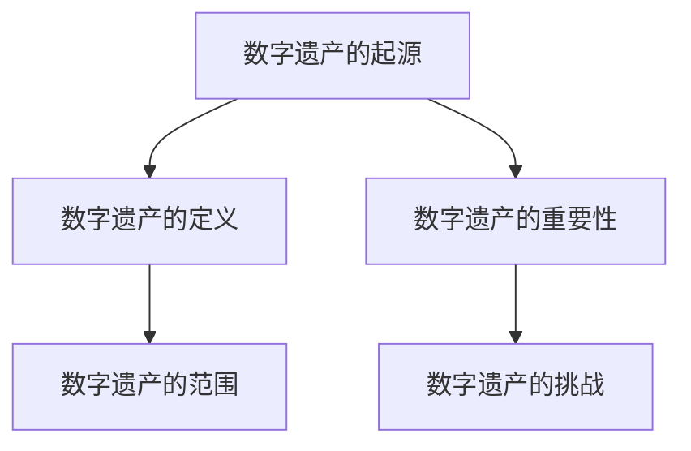
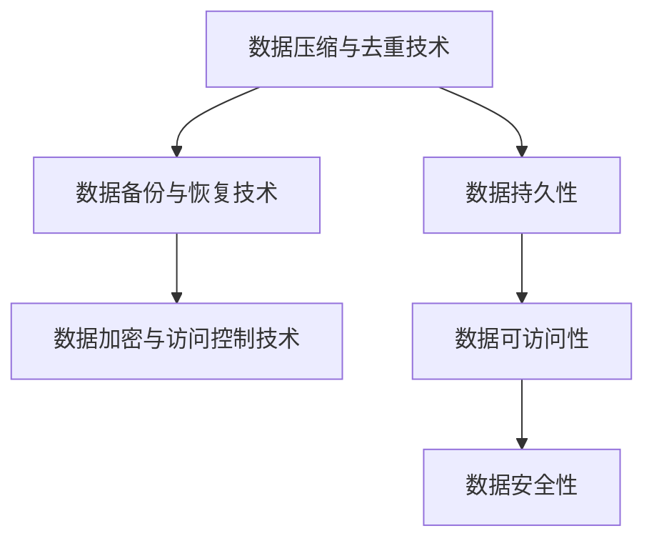
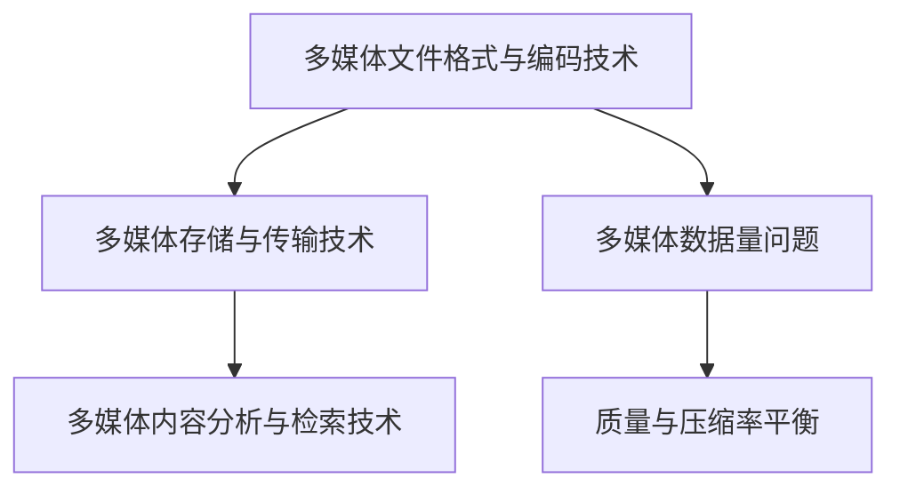

                 

### 文章标题：2050年的数字遗产：从传承到永存的记忆保存

#### 关键词：数字遗产、数据保存、技术挑战、未来展望

> **摘要：** 本文深入探讨了2050年数字遗产的概念、现状、保存技术以及未来的发展前景。文章首先阐述了数字遗产的定义与起源，随后详细分析了数据遗产、文档遗产和多媒体遗产的类型与特点。接着，文章从多个方面探讨了数字遗产保存技术的挑战，包括数据持久性、数据可访问性和数据安全性，并介绍了传统存储技术、云存储技术和基于区块链的存储技术。在此基础上，文章详细解析了数据压缩与去重技术、数据备份与恢复技术、数据加密与访问控制技术、文档格式与版本控制技术、文档存储与检索技术、文档数字化与转换技术、多媒体文件格式与编码技术、多媒体存储与传输技术以及多媒体内容分析与检索技术。最后，文章展望了数字遗产的未来，包括其发展趋势、政策法规、社会影响以及永存之道。通过本文的深入探讨，希望能够为数字遗产的保存提供有益的思路和参考。

### 目录大纲

1. **2050年的数字遗产：从传承到永存的记忆保存**
   - 关键词：数字遗产、数据保存、技术挑战、未来展望
   - 摘要：深入探讨2050年数字遗产的概念、现状、保存技术以及未来发展。

2. **第一部分：数字遗产的定义与现状**
   - 第1章：数字遗产的起源与定义
     - 1.1 数字遗产的起源与发展
     - 1.2 数字遗产的定义与范围
     - 1.3 数字遗产的重要性与挑战
   - 第2章：数字遗产的类型与特点
     - 2.1 数据遗产
       - 2.1.1 数据遗产的类型
       - 2.1.2 数据遗产的特点
       - 2.1.3 数据遗产的保存挑战
     - 2.2 文档遗产
       - 2.2.1 文档遗产的类型
       - 2.2.2 文档遗产的特点
       - 2.2.3 文档遗产的保存挑战
     - 2.3 多媒体遗产
       - 2.3.1 多媒体遗产的类型
       - 2.3.2 多媒体遗产的特点
       - 2.3.3 多媒体遗产的保存挑战

3. **第二部分：数字遗产的保存技术**
   - 第3章：数字遗产保存的挑战与技术
     - 3.1 数字遗产保存的核心挑战
       - 3.1.1 数据持久性
       - 3.1.2 数据可访问性
       - 3.1.3 数据安全性
     - 3.2 数字遗产保存技术概述
       - 3.2.1 传统存储技术
       - 3.2.2 云存储技术
       - 3.2.3 基于区块链的存储技术
   - 第4章：数据遗产保存技术详解
     - 4.1 数据压缩与去重技术
       - 4.1.1 数据压缩技术
       - 4.1.2 数据去重技术
     - 4.2 数据备份与恢复技术
       - 4.2.1 数据备份策略
       - 4.2.2 数据恢复技术
     - 4.3 数据加密与访问控制技术
       - 4.3.1 数据加密技术
       - 4.3.2 数据访问控制技术
   - 第5章：文档遗产保存技术详解
     - 5.1 文档格式与版本控制
       - 5.1.1 文档格式概述
       - 5.1.2 版本控制技术
     - 5.2 文档存储与检索技术
       - 5.2.1 文档存储技术
       - 5.2.2 文档检索技术
     - 5.3 文档数字化与转换技术
       - 5.3.1 文档数字化技术
       - 5.3.2 文档转换技术
   - 第6章：多媒体遗产保存技术详解
     - 6.1 多媒体文件格式与编码技术
       - 6.1.1 多媒体文件格式
       - 6.1.2 多媒体编码技术
     - 6.2 多媒体存储与传输技术
       - 6.2.1 多媒体存储技术
       - 6.2.2 多媒体传输技术
     - 6.3 多媒体内容分析与检索技术
       - 6.3.1 多媒体内容分析技术
       - 6.3.2 多媒体内容检索技术

4. **第三部分：数字遗产的未来**
   - 第7章：数字遗产的未来展望
     - 7.1 数字遗产的发展趋势
       - 7.1.1 数字遗产的需求与变化
       - 7.1.2 数字遗产的技术创新
     - 7.2 数字遗产的政策与法规
       - 7.2.1 数字遗产的法律保护
       - 7.2.2 数字遗产的国际合作
     - 7.3 数字遗产的社会影响
       - 7.3.1 数字遗产对文化传承的影响
       - 7.3.2 数字遗产对个人隐私的影响
   - 第8章：数字遗产的永存之道
     - 8.1 数字遗产的永久保存策略
       - 8.1.1 数据长期保存方法
       - 8.1.2 文档与多媒体的永久保存
     - 8.2 数字遗产的可持续性管理
       - 8.2.1 数字遗产的维护与更新
       - 8.2.2 数字遗产的可持续发展
     - 8.3 数字遗产的未来方向
       - 8.3.1 新兴技术在数字遗产中的应用
       - 8.3.2 数字遗产的未来挑战与机遇

5. **附录**
   - 附录A：数字遗产保存工具与资源
   - 附录B：数字遗产保存案例研究
   - 附录C：参考文献
   - 附录D：Mermaid流程图与核心算法原理讲解

通过上述目录大纲，本文将逐步深入探讨数字遗产的概念、类型、保存技术以及未来发展，力求为数字遗产的保存提供全面而深入的视角。

---

### 2050年的数字遗产：从传承到永存的记忆保存

**关键词：数字遗产、数据保存、技术挑战、未来展望**

**摘要：** 随着数字技术的飞速发展，数字遗产已成为人类社会不可或缺的一部分。本文将探讨2050年的数字遗产，从传承到永存的记忆保存。首先，我们定义了数字遗产，并分析了其起源与发展。接着，我们详细介绍了数字遗产的类型与特点，包括数据遗产、文档遗产和多媒体遗产。随后，本文从数据持久性、数据可访问性和数据安全性等方面，深入探讨了数字遗产保存的核心挑战，并介绍了传统存储技术、云存储技术和基于区块链的存储技术。在此基础上，我们详细分析了数据压缩与去重技术、数据备份与恢复技术、数据加密与访问控制技术、文档格式与版本控制技术、文档存储与检索技术、文档数字化与转换技术、多媒体文件格式与编码技术、多媒体存储与传输技术以及多媒体内容分析与检索技术。最后，本文展望了数字遗产的未来，包括其发展趋势、政策法规、社会影响以及永存之道。通过本文的探讨，我们希望能够为数字遗产的保存提供有益的思路和参考。

---

### 第一部分：数字遗产的定义与现状

#### 第1章：数字遗产的起源与定义

数字遗产，顾名思义，是指由数字技术生成的，具有历史价值、文化价值和学术价值的各种数据和信息。在数字时代，随着互联网、云计算、大数据等技术的迅速发展，数字遗产的重要性日益凸显。然而，数字遗产的概念并不是一蹴而就的，它有着悠久的发展历史。

#### 1.1 数字遗产的起源与发展

数字遗产的起源可以追溯到20世纪末。随着计算机技术的普及，人们开始意识到，大量的数字信息在生成、传输和存储过程中，可能会因为技术进步、设备更新等原因，逐渐消失或失真。为了保护和传承这些数字信息，数字遗产的概念应运而生。

在早期，数字遗产主要以电子文档的形式存在，如电子邮件、电子书籍、网页等。随着互联网的普及，数字遗产的范围不断扩大，涵盖了音频、视频、图像等多种形式。如今，数字遗产已经渗透到社会的各个角落，从个人生活到企业运营，从科学研究到文化传承，都离不开数字遗产的支持。

#### 1.2 数字遗产的定义与范围

那么，什么是数字遗产？我们可以这样定义：数字遗产是指由数字技术生成的，具有历史价值、文化价值和学术价值的数据和信息，包括但不限于以下类型：

- **数据遗产**：包括科学实验数据、经济统计数据、人口普查数据、环境监测数据等。
- **文档遗产**：包括电子文档、电子邮件、网页、社交媒体信息等。
- **多媒体遗产**：包括音频、视频、图像、动画等。

这些数字遗产不仅反映了过去的历史，而且对未来的发展具有重要启示。例如，科学研究中的实验数据可以为后续的研究提供参考；文化传承中的多媒体遗产可以保存民族文化遗产；商业运营中的电子文档可以为企业的可持续发展提供支持。

#### 1.3 数字遗产的重要性与挑战

数字遗产的重要性不言而喻。首先，数字遗产是人类文明的宝贵财富，它记录了人类社会的发展历程，见证了科技进步的每一步。其次，数字遗产对科学研究、文化传承、商业运营等领域具有重要价值。例如，科学研究中，实验数据的保存和共享可以加速科学研究的进展；文化传承中，多媒体遗产的保存可以保存和传承民族文化；商业运营中，电子文档的保存可以为企业提供决策依据。

然而，数字遗产也面临着诸多挑战。首先是数据的持久性问题。随着时间的推移，技术可能会更新换代，导致旧的技术格式无法读取。其次是数据的安全性问题。数字遗产在传输和存储过程中，可能会遭受黑客攻击、数据泄露等风险。此外，数据可访问性和数据加密等技术也带来了挑战。

#### 1.4 数字遗产的保存策略

为了应对这些挑战，我们需要采取一系列的数字遗产保存策略。首先是数据压缩与去重技术。通过数据压缩，可以减少数据存储空间，提高数据传输速度；通过数据去重，可以减少冗余数据的存储，提高数据存储效率。

其次是数据备份与恢复技术。通过数据备份，可以确保数据的安全性和可靠性；通过数据恢复，可以应对数据丢失或损坏的情况。

此外，数据加密与访问控制技术也是数字遗产保存的重要手段。通过数据加密，可以确保数据在传输和存储过程中的安全性；通过访问控制，可以确保数据只能被授权用户访问。

最后，我们需要关注数字遗产的法律保护。在数字遗产的保存过程中，需要遵守相关法律法规，确保数字遗产的合法性和安全性。

综上所述，数字遗产的起源与发展、定义与范围、重要性与挑战以及保存策略，构成了数字遗产的基本框架。在未来的发展中，我们需要不断创新，应对数字遗产保存中的各种挑战，确保数字遗产能够得到有效保存和传承。

---

#### 第2章：数字遗产的类型与特点

数字遗产的形式多种多样，每种类型都有其独特的特点和价值。在本章中，我们将详细介绍数字遗产的三大主要类型：数据遗产、文档遗产和多媒体遗产。这些类型不仅反映了数字遗产的多样性，也体现了其在现代社会中的重要地位。

#### 2.1 数据遗产

数据遗产是指由数字技术生成的各种类型的数据，包括但不限于科学实验数据、经济统计数据、人口普查数据、环境监测数据等。数据遗产的特点主要体现在以下几个方面：

- **数据量大**：随着互联网和大数据技术的发展，数据遗产的数据量日益庞大。从早期的简单文本数据，到如今的海量多媒体数据，数据遗产的规模不断增长。
- **动态性**：数据遗产是不断更新和变化的。例如，科学实验数据需要在实验过程中不断更新；经济统计数据需要定期更新以反映最新的经济状况。
- **多样性**：数据遗产包括结构化数据（如数据库）、半结构化数据（如XML、JSON）和非结构化数据（如文本、图像、音频、视频）等多种形式。

数据遗产的保存挑战主要包括：

- **数据持久性**：随着技术的进步，旧的数据格式可能会变得难以访问。
- **数据安全**：数据遗产在传输和存储过程中可能遭受黑客攻击、数据泄露等安全威胁。
- **数据可访问性**：数据遗产需要确保不同用户在不同时间、地点都能方便地访问和使用。

#### 2.2 文档遗产

文档遗产是指以数字形式存储的各种文档，包括电子文档、电子邮件、网页、社交媒体信息等。文档遗产的特点如下：

- **文本丰富**：文档遗产主要以文本形式存在，包括书籍、论文、报告、邮件等。
- **结构复杂**：文档遗产可能包含多种结构，如段落、章节、引用等。
- **多样性**：文档遗产包括结构化文档（如XML、HTML）和非结构化文档（如PDF、Word文档）。

文档遗产的保存挑战主要包括：

- **格式兼容性**：文档格式可能会随着技术的发展而更新，旧格式文档可能难以读取。
- **版本控制**：文档遗产在更新过程中，如何有效地管理不同版本是一个重要问题。
- **数据安全**：文档遗产在传输和存储过程中，可能遭受数据泄露、篡改等风险。

#### 2.3 多媒体遗产

多媒体遗产是指以数字形式存储的各种多媒体内容，包括音频、视频、图像、动画等。多媒体遗产的特点如下：

- **内容丰富**：多媒体遗产可以生动地呈现信息，包括声音、图像、视频等多种形式。
- **交互性**：多媒体遗产可以提供与用户的交互功能，如视频播放、音频播放、图像浏览等。
- **多样性**：多媒体遗产包括多种类型，如高清视频、4K视频、虚拟现实（VR）内容、增强现实（AR）内容等。

多媒体遗产的保存挑战主要包括：

- **数据量大**：多媒体内容通常占用较大的存储空间，特别是在高清视频、4K视频等高分辨率内容中。
- **数据压缩**：为了减少存储空间和传输时间，多媒体内容通常需要进行数据压缩，但可能影响画质和音质。
- **数据安全**：多媒体内容在传输和存储过程中可能遭受黑客攻击、数据泄露等风险。

综上所述，数据遗产、文档遗产和多媒体遗产是数字遗产的三大主要类型，每种类型都有其独特的特点和价值。在数字遗产的保存过程中，我们需要关注这些类型的保存挑战，并采取相应的技术手段和策略，确保数字遗产能够得到有效保存和传承。

---

### 第3章：数字遗产保存的挑战与技术

数字遗产的保存不仅仅是将数据存储在某个地方那么简单，它涉及到一系列复杂的挑战，包括数据持久性、数据可访问性和数据安全性。这些挑战的解决需要结合多种技术手段和策略，确保数字遗产能够长期保存并持续为人类社会提供价值。

#### 3.1 数字遗产保存的核心挑战

**3.1.1 数据持久性**

数据持久性是数字遗产保存的首要挑战。随着时间的推移，存储介质可能会老化、损坏或淘汰，导致数据难以访问或读取。例如，早期的软盘、磁带等存储介质已经逐渐被淘汰，而新的存储技术如光盘、硬盘、固态硬盘等也在不断更新。为了确保数据的持久性，我们需要采取以下措施：

- **迁移策略**：定期将数据从旧介质转移到新介质，确保数据能够适应新的存储技术。
- **备份与冗余**：采用多重备份策略，将数据存储在多个不同的位置，以提高数据的可靠性和可恢复性。
- **格式标准化**：确保使用标准化的数据格式，以便在未来能够方便地读取和访问数据。

**3.1.2 数据可访问性**

数据可访问性是数字遗产保存的另一个核心挑战。随着技术的发展，旧的数据格式和存储技术可能会变得难以访问，导致数据被隔离或无法使用。为了确保数据可访问性，我们需要采取以下措施：

- **格式兼容性**：确保数据在转换过程中能够保持原有的结构和内容，以便在未来能够读取和使用。
- **版本控制**：对数据进行版本控制，确保不同版本的数据都能够得到有效管理和访问。
- **用户友好的界面**：提供用户友好的界面和工具，使不同用户能够方便地访问和使用数据。

**3.1.3 数据安全性**

数据安全性是数字遗产保存的重要挑战。数据在传输和存储过程中可能会遭受黑客攻击、数据泄露、数据篡改等风险，导致数据被破坏或丢失。为了确保数据安全性，我们需要采取以下措施：

- **加密技术**：采用加密技术对数据进行加密，确保数据在传输和存储过程中的安全性。
- **访问控制**：实施严格的访问控制策略，确保只有授权用户才能访问和操作数据。
- **安全审计**：定期进行安全审计，检测和修复潜在的安全漏洞，确保数据的安全性。

#### 3.2 数字遗产保存技术概述

数字遗产的保存需要结合多种技术手段和策略，以确保数据能够长期保存并持续为人类社会提供价值。以下是一些常用的数字遗产保存技术：

**3.2.1 传统存储技术**

传统存储技术主要包括磁盘存储、磁带存储等。这些技术虽然可靠，但存在容量有限、维护成本高、扩展性差等问题。

- **磁盘存储**：磁盘存储具有快速读写速度和较大的存储容量，适用于大规模数据存储。但磁盘存储存在故障风险，需要定期备份。
- **磁带存储**：磁带存储具有成本低、容量大、长期保存等优点，适用于数据归档和备份。但磁带存储的读写速度较慢，不适用于实时数据访问。

**3.2.2 云存储技术**

云存储技术通过互联网提供数据存储和访问服务，具有高可靠性、可扩展性和灵活性。云存储技术适用于大规模数据存储和实时数据访问。

- **公共云存储**：公共云存储服务提供商如亚马逊AWS、微软Azure、谷歌云等，提供灵活的存储方案和强大的计算能力，适用于各种规模的数据存储需求。
- **私有云存储**：私有云存储将数据存储在私有数据中心，确保数据的安全性和隐私性，适用于对数据安全性有严格要求的组织。

**3.2.3 基于区块链的存储技术**

基于区块链的存储技术通过分布式存储和加密技术，提供去中心化的数据存储和访问服务。区块链存储技术具有数据安全性高、不可篡改等优点。

- **分布式存储**：数据分散存储在多个节点上，提高数据的可靠性和可恢复性。
- **加密技术**：对数据进行加密，确保数据在传输和存储过程中的安全性。
- **智能合约**：通过智能合约实现数据的自动管理和访问控制，提高数据管理的效率和安全性。

综上所述，数字遗产的保存面临着数据持久性、数据可访问性和数据安全性等一系列核心挑战。通过采用传统存储技术、云存储技术和基于区块链的存储技术，我们可以有效应对这些挑战，确保数字遗产能够得到长期保存和传承。未来，随着技术的不断发展，数字遗产保存技术将不断创新和优化，为人类社会提供更加可靠和高效的数字遗产保存解决方案。

---

### 第4章：数据遗产保存技术详解

在数字遗产的保存过程中，数据遗产是最核心的一部分。数据遗产的种类繁多，包括结构化数据、半结构化数据和非结构化数据等。针对不同类型的数据遗产，我们需要采取不同的保存技术。本章将详细介绍数据压缩与去重技术、数据备份与恢复技术以及数据加密与访问控制技术，为数据遗产的保存提供全面的技术支持。

#### 4.1 数据压缩与去重技术

数据压缩与去重技术是数据遗产保存中至关重要的技术手段，它们可以有效减少数据存储空间和提高数据传输效率。

**4.1.1 数据压缩技术**

数据压缩技术旨在减少数据的大小，从而降低存储和传输的成本。数据压缩技术可以分为两大类：无损压缩和有损压缩。

- **无损压缩**：无损压缩技术可以在不损失任何原始数据的情况下，大幅度减少数据的大小。常见的无损压缩算法有霍夫曼编码、LZW压缩和Burrows-Wheeler压缩。
  - **霍夫曼编码**：霍夫曼编码利用字符出现的频率进行编码，频率高的字符编码长度较短，频率低的字符编码长度较长，从而实现数据的压缩。
  - **LZW压缩**：LZW压缩利用字典表进行压缩，将连续出现的字符映射为一个编码，减少冗余数据的存储。
  - **Burrows-Wheeler压缩**：Burrows-Wheeler压缩通过将数据旋转并排序，然后对排序后的数据进行压缩，从而减少数据中的冗余。

- **有损压缩**：有损压缩技术通过牺牲部分数据质量，以换取更高的压缩率。常见的有损压缩算法有JPEG和MP3。
  - **JPEG**：JPEG是一种有损压缩算法，用于图像数据的压缩。它通过降低图像的细节和颜色信息，实现高比例的压缩。
  - **MP3**：MP3是一种有损压缩算法，用于音频数据的压缩。它通过降低音频信号的细节，实现高比例的压缩。

**4.1.2 数据去重技术**

数据去重技术旨在检测并删除数据集中的重复项，以减少存储空间的占用。常见的数据去重技术有哈希表去重、排序去重和位图去重。

- **哈希表去重**：哈希表去重使用哈希函数将数据映射到一个哈希表中，检测数据是否存在重复项。如果哈希表中存在相同的哈希值，则说明数据是重复的。
- **排序去重**：排序去重通过对数据进行排序，然后遍历数据，比较相邻的数据项，删除重复项。
- **位图去重**：位图去重使用位图表示数据集，每个位表示一个数据项。如果一个位被设置为1，则表示该数据项已经存在。通过遍历位图，可以快速检测并删除重复项。

#### 4.2 数据备份与恢复技术

数据备份与恢复技术是确保数据安全性和可靠性的关键手段。数据备份是指在多个位置保存数据的副本，以便在数据丢失或损坏时能够恢复数据。数据恢复则是指从备份中恢复数据的过程。

**4.2.1 数据备份策略**

数据备份策略主要包括以下几种：

- **完全备份**：完全备份备份所有数据，恢复速度快，但占用较多存储空间。
- **增量备份**：增量备份备份与上次备份不同的数据，恢复速度较快，占用较少存储空间。
- **差异备份**：差异备份备份与上次完全备份不同的数据，恢复速度较快，占用较少存储空间。

**4.2.2 数据恢复技术**

数据恢复技术主要包括以下几种方法：

- **逐层恢复**：从底层备份开始，逐层恢复到最新备份。
- **快速恢复**：通过比较备份数据与当前数据的差异，快速恢复出最新的数据。
- **完全恢复**：从最新备份开始，逐层恢复到原始数据。

#### 4.3 数据加密与访问控制技术

数据加密与访问控制技术是确保数据在传输和存储过程中的安全性和隐私性的关键手段。

**4.3.1 数据加密技术**

数据加密技术通过对数据进行加密，确保数据在传输和存储过程中的安全性。常见的加密技术有对称加密和非对称加密。

- **对称加密**：对称加密使用相同的密钥进行加密和解密，如AES加密算法。
- **非对称加密**：非对称加密使用不同的密钥进行加密和解密，如RSA加密算法。

**4.3.2 数据访问控制技术**

数据访问控制技术通过限制用户对数据的访问权限，确保数据的安全性和隐私性。常见的访问控制技术包括基于角色的访问控制（RBAC）和基于属性的访问控制（ABAC）。

- **基于角色的访问控制（RBAC）**：基于角色的访问控制通过为用户分配角色，并定义角色的访问权限，实现对数据访问的控制。
- **基于属性的访问控制（ABAC）**：基于属性的访问控制通过定义用户的属性（如用户身份、位置、时间等），并定义属性的访问权限，实现对数据访问的控制。

综上所述，数据压缩与去重技术、数据备份与恢复技术以及数据加密与访问控制技术是数据遗产保存中不可或缺的技术手段。通过这些技术，我们可以确保数据遗产能够得到有效保存，并在需要时快速恢复。未来，随着技术的不断发展，这些技术将会不断创新和优化，为数据遗产的保存提供更加可靠和高效的解决方案。

---

### 第5章：文档遗产保存技术详解

文档遗产在数字遗产中占据重要地位，因为它们不仅承载了丰富的信息，还包含了人类文化的传承和历史的记忆。为了确保这些宝贵的文档能够长期保存并便于未来访问，我们需要采用一系列的保存技术。本章将详细探讨文档格式与版本控制技术、文档存储与检索技术、文档数字化与转换技术，为文档遗产的保存提供全面的技术支持。

#### 5.1 文档格式与版本控制

文档格式是文档遗产保存的关键因素之一。不同的文档格式在存储、传输和展示方面具有各自的特点和挑战。

**5.1.1 文档格式概述**

- **结构化文档**：结构化文档通常使用XML、HTML等标记语言进行定义，具有良好的结构性和可扩展性。例如，HTML文档可以通过网页浏览器进行展示，XML文档可以通过各种工具进行解析和处理。
- **非结构化文档**：非结构化文档通常不使用特定的标记语言，如PDF、Word文档等。这些文档通常包含了大量的文本、图像、表格等多媒体内容，但缺乏明显的结构信息。
- **半结构化文档**：半结构化文档介于结构化文档和非结构化文档之间，例如JSON、CSV等。这些文档具有部分结构信息，但允许一定程度的灵活性。

**5.1.2 版本控制技术**

版本控制是文档遗产保存的重要环节，它确保了文档的修改历史和不同版本之间的追踪。常见的版本控制技术包括以下几种：

- **本地版本控制**：本地版本控制是指在本地计算机上对文档进行版本管理。例如，使用Microsoft Word的“保存副本”功能，可以在本地创建文档的不同版本。
- **集中式版本控制**：集中式版本控制通过集中式的服务器进行版本管理。例如，Git和Subversion等版本控制工具，可以跟踪文档的历史版本，并提供协同工作功能。
- **分布式版本控制**：分布式版本控制允许每个用户都拥有完整的版本库，从而实现更高效的协作和备份。Git是分布式版本控制的典型代表。

**5.1.3 版本控制技术的优势与挑战**

版本控制技术的优势在于：

- **历史追踪**：版本控制可以记录文档的所有修改历史，帮助用户追溯文档的变更过程。
- **协作管理**：版本控制可以支持多人协作，避免因修改冲突导致的数据丢失。
- **文档备份**：版本控制可以作为文档备份的一种手段，确保文档在不同版本之间的安全性和完整性。

然而，版本控制技术也面临着一些挑战：

- **存储空间**：随着文档版本数量的增加，版本控制系统的存储空间需求也会增加。
- **性能问题**：版本控制工具需要处理大量的文档版本，可能导致性能下降。
- **用户培训**：用户需要了解和掌握版本控制工具的使用方法，这对用户的技能要求较高。

#### 5.2 文档存储与检索技术

文档存储与检索技术是确保文档遗产长期保存和便捷访问的关键。以下技术可以帮助我们实现这一目标：

**5.2.1 文档存储技术**

- **文件系统存储**：文件系统存储是最基本的文档存储技术，它通过文件和目录结构来组织和管理文档。文件系统存储的优点在于简单易用，但缺点包括存储容量有限、扩展性差、安全性不足等。
- **数据库存储**：数据库存储通过数据库管理系统（如MySQL、PostgreSQL等）来存储和管理文档。数据库存储的优点在于强大的数据管理和查询功能，但缺点包括性能开销较大、复杂度较高。
- **云存储**：云存储通过云计算平台（如Amazon S3、Google Cloud Storage等）提供文档存储服务。云存储的优点在于高可靠性、高可用性、灵活的存储方案和强大的数据处理能力，但缺点包括依赖云服务提供商、数据安全问题等。

**5.2.2 文档检索技术**

- **全文检索**：全文检索是一种基于文本的检索技术，它能够对文档的全文内容进行搜索。常见的全文检索引擎有Lucene、Elasticsearch等。全文检索的优点在于搜索速度快、结果相关性高，但缺点包括处理复杂文档格式的能力有限。
- **结构化检索**：结构化检索是基于文档的结构信息进行检索，例如，通过XML或HTML的标签进行搜索。结构化检索的优点在于能够精确匹配文档内容，但缺点包括对非结构化文档的支持不足。
- **混合检索**：混合检索结合了全文检索和结构化检索的优点，通过同时利用全文检索和结构化检索技术，提供更强大的检索功能。常见的混合检索系统有Solr、Nutch等。

#### 5.3 文档数字化与转换技术

随着数字技术的发展，越来越多的纸质文档和传统介质文档需要被数字化和转换为电子格式，以便于存储、传输和访问。

**5.3.1 文档数字化技术**

- **OCR（光学字符识别）**：OCR技术用于将纸质文档中的文字图像转换为机器可读的文本。常见的OCR工具包括Tesseract、ABBYY FineReader等。
- **图像处理**：图像处理技术用于改善纸质文档图像的质量，例如去除污迹、斑点、倾斜等。常见的图像处理工具包括Adobe Photoshop、OpenCV等。

**5.3.2 文档转换技术**

- **格式转换**：格式转换技术用于将一种文档格式转换为另一种文档格式。常见的格式转换工具包括Microsoft Word、Adobe Acrobat等。
- **文档压缩与去重**：文档压缩与去重技术用于减少文档的存储空间和提高传输效率。常见的压缩算法有PDF、ZIP等。

**5.3.3 文档数字化与转换技术的优势与挑战**

文档数字化与转换技术的优势在于：

- **提高效率**：数字化和转换技术可以大大提高文档的处理效率，减少人工操作的负担。
- **方便存储与传输**：数字化和转换技术使得文档可以方便地存储和传输，不受地理位置和介质限制。
- **提高文档利用率**：数字化和转换技术使得文档可以更加方便地共享和重用，提高文档的利用率。

然而，文档数字化与转换技术也面临一些挑战：

- **准确性问题**：OCR技术在识别文字时可能会出现错误，影响文档的准确性。
- **兼容性问题**：不同格式和系统的文档在转换过程中可能会出现兼容性问题，导致数据丢失或错误。
- **成本问题**：文档数字化和转换技术需要投入大量的资金和人力资源，尤其是在大规模文档处理时。

综上所述，文档遗产保存技术包括文档格式与版本控制技术、文档存储与检索技术以及文档数字化与转换技术。通过这些技术，我们可以确保文档遗产得到长期保存和便捷访问。未来，随着技术的不断发展，这些技术将会不断创新和优化，为文档遗产的保存提供更加可靠和高效的解决方案。

---

### 第6章：多媒体遗产保存技术详解

多媒体遗产在数字遗产中占据着重要的地位，它们以音频、视频、图像和动画等形式存在，丰富了人类的信息传递和娱乐方式。随着技术的不断进步，多媒体遗产的保存面临着许多挑战，包括数据量大、格式多样、质量要求高等。为了确保多媒体遗产能够长期保存并便于未来访问，我们需要采用一系列的保存技术。本章将详细探讨多媒体文件格式与编码技术、多媒体存储与传输技术以及多媒体内容分析与检索技术，为多媒体遗产的保存提供全面的技术支持。

#### 6.1 多媒体文件格式与编码技术

多媒体文件格式与编码技术是多媒体遗产保存的基础。不同的文件格式和编码技术在数据压缩、传输和展示方面具有各自的特点和挑战。

**6.1.1 多媒体文件格式**

- **视频格式**：视频格式包括AVI、MP4、MOV、MKV等。其中，MP4是最常用的视频格式，它支持多种编码技术，包括H.264和HEVC（H.265）。
- **音频格式**：音频格式包括MP3、WAV、AAC、FLAC等。MP3是最常用的音频格式，它通过有损压缩技术实现了较高的压缩率和较好的音质。
- **图像格式**：图像格式包括JPEG、PNG、GIF、BMP等。JPEG是最常用的图像格式，它通过有损压缩技术实现了较高的压缩率。

**6.1.2 编码技术**

- **视频编码技术**：视频编码技术用于将视频数据压缩成较小的大小，以便于传输和存储。常见的视频编码技术有H.264和HEVC（H.265）。H.264是目前最广泛使用的视频编码技术，而HEVC则提供了更高的压缩率。
- **音频编码技术**：音频编码技术用于将音频数据压缩成较小的大小，以便于传输和存储。常见的音频编码技术有MP3和AAC。MP3是一种有损压缩音频格式，而AAC则提供了更高的音质和更小的文件大小。
- **图像编码技术**：图像编码技术用于将图像数据压缩成较小的大小，以便于传输和存储。常见的图像编码技术有JPEG和PNG。JPEG是一种有损压缩图像格式，而PNG则提供了一种无损压缩格式。

**6.1.3 多媒体文件格式与编码技术的挑战**

多媒体文件格式与编码技术面临着以下挑战：

- **兼容性问题**：不同的多媒体文件格式和编码技术可能存在兼容性问题，导致无法在不同的设备或平台上进行播放或编辑。
- **数据量问题**：多媒体数据通常具有较大的数据量，尤其是在高清、4K甚至8K视频格式中，数据量的激增对存储和传输提出了更高的要求。
- **质量与压缩率平衡**：在压缩多媒体数据时，如何在保证质量的前提下实现较高的压缩率是一个重要的挑战。

#### 6.2 多媒体存储与传输技术

多媒体遗产的存储与传输是确保其长期保存和便捷访问的关键。以下技术可以帮助我们实现这一目标：

**6.2.1 多媒体存储技术**

- **本地存储**：本地存储通过硬盘、固态硬盘、光盘等设备进行多媒体数据的存储。本地存储的优点在于速度快、可靠性高，但缺点在于存储容量有限、不易共享。
- **网络存储**：网络存储通过网络连接的存储设备进行多媒体数据的存储。常见的网络存储技术有NAS（网络附加存储）和SAN（存储区域网络）。网络存储的优点在于存储容量大、易于共享、可扩展性强，但缺点在于速度相对较慢、管理复杂。
- **云存储**：云存储通过云计算平台提供多媒体数据的存储和访问服务。云存储的优点在于高可靠性、高可用性、灵活的存储方案和强大的数据处理能力，但缺点包括依赖云服务提供商、数据安全问题等。

**6.2.2 多媒体传输技术**

- **有线传输**：有线传输通过以太网、光纤等有线网络进行多媒体数据的传输。有线传输的优点在于速度较快、可靠性高，但缺点在于布线复杂、移动性较差。
- **无线传输**：无线传输通过Wi-Fi、蓝牙、5G等无线网络进行多媒体数据的传输。无线传输的优点在于移动性强、安装方便，但缺点在于速度相对较慢、可靠性较低。

**6.2.3 多媒体存储与传输技术的挑战**

多媒体存储与传输技术面临着以下挑战：

- **数据量与速度平衡**：随着多媒体数据量的激增，如何在保证传输速度的前提下处理大量的多媒体数据是一个重要的挑战。
- **带宽与延迟**：在多媒体传输过程中，带宽和延迟对用户体验有着重要影响。如何优化带宽使用和降低延迟是一个重要的挑战。
- **数据安全与隐私**：在多媒体传输过程中，数据的安全性和隐私性需要得到保障。如何防止数据泄露、黑客攻击等安全威胁是一个重要的挑战。

#### 6.3 多媒体内容分析与检索技术

多媒体内容分析与检索技术是确保多媒体遗产能够被有效管理和访问的关键。以下技术可以帮助我们实现这一目标：

**6.3.1 多媒体内容分析技术**

- **图像识别**：图像识别技术用于识别和分类图像内容。常见的图像识别技术有卷积神经网络（CNN）和目标检测算法。
- **语音识别**：语音识别技术用于将语音信号转换为文本。常见的语音识别技术有深度学习算法和隐马尔可夫模型（HMM）。
- **视频分析**：视频分析技术用于识别和提取视频中的关键信息。常见的视频分析技术有运动检测、人脸识别和行为识别。

**6.3.2 多媒体内容检索技术**

- **基于内容的检索**：基于内容的检索技术通过分析多媒体内容的特征（如图像的颜色、纹理、形状等），实现多媒体内容的自动分类和检索。
- **基于关键词的检索**：基于关键词的检索技术通过用户输入关键词，搜索与关键词相关的内容。
- **混合检索**：混合检索技术结合基于内容的检索和基于关键词的检索，提供更灵活和高效的检索功能。

**6.3.3 多媒体内容分析与检索技术的挑战**

多媒体内容分析与检索技术面临着以下挑战：

- **准确性问题**：多媒体内容分析技术需要在各种复杂环境下保持高准确性，尤其是在图像识别、语音识别等领域。
- **实时性问题**：多媒体内容分析与检索技术需要在短时间内处理大量的多媒体数据，以实现实时检索。
- **数据隐私**：在多媒体内容分析与检索过程中，如何保护用户的隐私是一个重要的挑战。

综上所述，多媒体遗产保存技术包括多媒体文件格式与编码技术、多媒体存储与传输技术以及多媒体内容分析与检索技术。通过这些技术，我们可以确保多媒体遗产得到长期保存和便捷访问。未来，随着技术的不断发展，这些技术将会不断创新和优化，为多媒体遗产的保存提供更加可靠和高效的解决方案。

---

### 第7章：数字遗产的未来展望

随着科技的飞速发展，数字遗产的未来充满了无限的可能性。本章将探讨数字遗产的发展趋势、政策法规、社会影响以及永存之道。通过对这些方面的分析，我们能够更好地理解数字遗产的未来发展方向，并为其实施提供指导。

#### 7.1 数字遗产的发展趋势

**7.1.1 数字遗产的需求与变化**

随着数字化进程的不断推进，数字遗产的需求也在不断变化。首先，随着人工智能、大数据和区块链等新兴技术的发展，数字遗产的生成和保存方式将变得更加多样化和智能化。例如，人工智能技术可以帮助自动识别和分类数字遗产，大数据技术可以提供更丰富的数据分析工具，区块链技术则可以提供更安全、透明的数字遗产保存和管理方案。

其次，数字遗产的需求也在向个性化、多样化方向发展。随着人们对于个人信息和隐私的关注日益增加，个人数字遗产的需求也越来越大。例如，个人日记、电子邮件、社交媒体信息等都需要得到妥善保存。此外，随着虚拟现实（VR）和增强现实（AR）技术的普及，数字遗产的展示和体验方式也将变得更加生动和沉浸式。

**7.1.2 数字遗产的技术创新**

数字遗产的技术创新是推动其未来发展的重要动力。首先，数据持久性技术将不断进步，通过分布式存储、云存储和区块链等技术，确保数字遗产能够长期保存。其次，数据压缩和去重技术将得到进一步优化，提高数据存储和传输的效率。此外，数据加密和安全认证技术也将不断发展，确保数字遗产的安全性。

另外，虚拟现实和增强现实技术的发展将为数字遗产的保存和展示带来新的机遇。通过虚拟现实技术，我们可以创建一个虚拟的数字遗产博物馆，让用户能够沉浸式地体验历史和文化。增强现实技术则可以让我们在现实世界中看到数字遗产的“重现”，如虚拟的历史建筑、艺术品等。

#### 7.2 数字遗产的政策与法规

数字遗产的保存和传承需要政策法规的支持。首先，各国政府应制定相关法律法规，明确数字遗产的归属、保护和管理。例如，可以制定《数字遗产保护法》，明确数字遗产的定义、权益和责任。

其次，政府应推动数字遗产的标准化工作，确保数字遗产在不同平台和设备上能够兼容和共享。例如，可以制定数字遗产的文件格式标准、数据备份与恢复标准等。

此外，政府还应鼓励和支持数字遗产的研究和开发，提供资金和政策支持，促进数字遗产技术的创新和应用。例如，可以通过科研项目、技术创新计划等，推动数字遗产相关技术的研发。

#### 7.3 数字遗产的社会影响

数字遗产对社会的影响是多方面的。首先，数字遗产对于文化传承具有重要意义。通过保存和展示数字遗产，我们可以更好地传承和弘扬民族文化，增强民族认同感。

其次，数字遗产对个人隐私保护提出了挑战。随着数字遗产的保存和共享，个人隐私数据可能被泄露或滥用。因此，在保存数字遗产时，需要采取严格的数据保护措施，确保个人隐私得到保护。

此外，数字遗产对社会经济的影响也不容忽视。数字遗产的保存和传承可以推动数字经济的发展，为文化创意产业、旅游业等带来新的机遇。

#### 7.4 数字遗产的永存之道

数字遗产的永存之道是确保其长期保存和可持续发展的关键。首先，需要建立数字遗产的长期保存策略，包括数据压缩与去重、数据备份与恢复、数据加密与访问控制等。

其次，需要关注数字遗产的可持续性管理。例如，可以建立数字遗产的维护与更新机制，定期检查和修复数字遗产中的问题，确保其长期可用性。此外，还可以通过教育和培训，提高社会对数字遗产的认识和重视，推动数字遗产的可持续发展。

最后，数字遗产的未来方向在于新兴技术的应用。例如，量子计算、边缘计算、人工智能等新兴技术将为数字遗产的保存和展示带来新的机遇。通过这些技术的应用，我们可以实现更加高效、安全、智能的数字遗产保存和管理。

综上所述，数字遗产的未来充满挑战与机遇。通过不断创新、加强政策法规支持、注重社会影响以及实施永存之道，我们可以确保数字遗产得到长期保存和可持续发展，为人类社会留下宝贵的记忆财富。

---

### 第8章：数字遗产的永存之道

要实现数字遗产的永久保存，我们需要综合考虑数据的长期保存方法、文档与多媒体的永久保存策略，以及数字遗产的可持续性管理。这些措施将确保数字遗产能够跨越多个年代，持续为人类提供有价值的信息和资源。

#### 8.1 数字遗产的永久保存策略

**8.1.1 数据长期保存方法**

数据的长期保存是数字遗产保存的核心任务。为了确保数据的持久性，我们可以采取以下方法：

- **多重备份**：采用多重备份策略，将数据备份到多个不同的位置，包括本地存储设备、云存储服务和分布式存储系统。这样即使某个备份点发生故障，数据仍然可以被恢复。
- **格式标准化**：使用标准化格式保存数据，例如采用XML、JSON等结构化格式，以便在未来能够方便地读取和访问数据。
- **版本控制**：对数据进行版本控制，记录每次修改的历史，以便在需要时可以追溯和恢复特定版本的数据。
- **数据压缩**：采用数据压缩技术减少数据的大小，从而降低存储空间的需求和传输时间。
- **加密存储**：对数据进行加密存储，确保数据在传输和存储过程中的安全性。

**8.1.2 文档与多媒体的永久保存**

对于文档和多媒体遗产，我们需要采取特殊措施来确保其永久保存。

- **文档保存**：对于电子文档，可以使用PDF/A格式保存，这是一种专门为长期保存而设计的文档格式。PDF/A格式支持文档的永久保存，确保文档的结构和内容不会随时间改变。此外，对于重要的文档，可以采用版本控制技术，记录每次修改的历史。
- **多媒体保存**：对于多媒体遗产，如音频、视频和图像，我们需要考虑其压缩格式和质量。例如，可以采用无损压缩格式保存音频和视频，如FLAC和PCM。对于图像，可以采用无损压缩格式如PNG。此外，对于高分辨率的图像和视频，可以采用分层的存储策略，将数据分解为不同质量和分辨率的层次，以便根据需求进行访问。

**8.2 数字遗产的可持续性管理**

数字遗产的可持续性管理是确保其长期保存和可持续发展的关键。以下措施可以帮助实现这一目标：

- **维护与更新**：定期对数字遗产进行检查和维护，修复潜在的损坏和问题，确保其长期可用性。例如，对于过期的软件和硬件，需要及时更新或替换。
- **版本控制**：使用版本控制工具和系统，确保数字遗产的修改和更新记录完整，以便在需要时可以追溯和恢复特定版本的数据。
- **数据备份策略**：定期执行数据备份，确保在发生灾难或意外事件时，可以快速恢复数字遗产。
- **培训与教育**：通过培训和教育活动，提高相关工作人员和技术人员的技能和意识，确保他们能够有效地管理和保护数字遗产。
- **政策与法规**：制定相关政策和法规，为数字遗产的保存提供法律保障，确保数字遗产的权益得到保护。

**8.3 数字遗产的未来方向**

数字遗产的未来方向将受到新兴技术的影响。以下技术趋势将对数字遗产的保存和发展产生重要影响：

- **区块链技术**：区块链技术可以提供安全、透明和不可篡改的数字遗产保存和管理方案。通过使用区块链，我们可以确保数字遗产的完整性和可追溯性。
- **量子计算**：量子计算具有巨大的计算能力，可以用于处理大量复杂的数据和分析任务，从而提高数字遗产的管理效率。
- **人工智能与机器学习**：人工智能和机器学习技术可以帮助自动识别、分类和检索数字遗产，提高数字遗产的可用性和用户体验。
- **虚拟现实与增强现实**：虚拟现实和增强现实技术将使数字遗产的展示和体验更加生动和沉浸式，为用户带来全新的互动体验。

总之，数字遗产的永久保存和可持续发展需要综合考虑数据的长期保存方法、文档与多媒体的永久保存策略，以及数字遗产的可持续性管理。通过采取这些措施，我们可以确保数字遗产能够跨越多个年代，持续为人类社会提供有价值的信息和资源。

---

### 附录A：数字遗产保存工具与资源

为了帮助读者更好地理解和实施数字遗产的保存策略，以下列出了一些常用的数字遗产保存工具和资源。

#### A.1 数据备份与恢复工具

- **AOMEI Backupper Standard**：一款免费的数据备份与恢复工具，支持全备份、增量备份和差分备份等多种备份策略。
- **EaseUS Todo Backup Free**：免费的数据备份与恢复软件，提供简单直观的用户界面，支持多种备份类型和恢复功能。
- **Macrium Reflect Free**：一款免费的数据备份软件，支持系统备份、分区备份和文件备份等功能。

#### A.2 文档管理与版本控制工具

- **Git**：一款开源的分布式版本控制系统，适用于对文档的版本管理和协同工作。
- **Subversion**：一款集中式的版本控制系统，适用于大规模文档的版本管理和协作开发。
- **Microsoft OneDrive**：提供云存储和文档同步功能，支持实时协作和版本控制。

#### A.3 多媒体处理与转换工具

- **HandBrake**：一款免费的开源视频转换工具，支持多种视频格式的转换和编辑。
- **VLC Media Player**：一款免费的媒体播放器，支持多种视频和音频格式的播放和转换。
- **Adobe Premiere Pro**：专业的视频编辑软件，适用于高质量视频的编辑和制作。

#### A.4 数字遗产保存相关网站与平台

- **Internet Archive**：一个非营利性数字图书馆，提供免费的数字资源保存和访问服务。
- **Google Dataset Search**：谷歌提供的一个用于搜索公开数据集的搜索引擎，涵盖了多种领域的数据资源。
- **Archives Portal Europe**：欧洲档案馆门户，提供访问欧洲各国档案馆的数字化档案资源。

通过使用这些工具和资源，读者可以更好地实施数字遗产的保存策略，确保数字遗产得到长期保存和可持续利用。

---

### 附录B：数字遗产保存案例研究

数字遗产的保存不仅需要理论指导，还需要实践验证。以下列举了几个具有代表性的数字遗产保存案例，以展示不同类型数字遗产的保存实践和成果。

#### B.1 案例一：国家数字图书馆项目

国家数字图书馆项目是我国规模最大的数字图书馆项目之一，旨在建设一个集中式、分布式、开放式的数字图书馆，保存和传承中华民族的宝贵文化遗产。该项目采用了多种数字遗产保存技术，包括数据压缩、数据备份、云存储、版本控制等。

- **数据压缩**：为了减少数据存储空间，项目采用了多种数据压缩技术，如LZO和Zstandard。这些技术能够有效减少图书、期刊、论文等数字化文档的存储需求。
- **数据备份**：项目采用了多层次的备份策略，包括本地备份、异地备份和云备份。本地备份确保数据的安全性和快速恢复，异地备份和云备份则提高了数据的可靠性和可恢复性。
- **版本控制**：项目使用Git作为版本控制工具，确保文档的每次修改都有记录，便于追溯和恢复。

#### B.2 案例二：数字博物馆建设

数字博物馆是一种通过数字化技术展示和保存文化遗产的新型博物馆。数字博物馆项目需要保存大量的多媒体数据，包括图像、音频、视频等。该项目采用了多媒体文件格式与编码技术、多媒体存储与传输技术以及多媒体内容分析与检索技术。

- **多媒体文件格式与编码技术**：为了确保多媒体数据的长期保存，项目采用了无损压缩格式，如PNG和FLAC。同时，项目采用了H.264和HEVC等高效编码技术，降低数据的大小，提高数据传输效率。
- **多媒体存储与传输技术**：项目采用了分布式存储和云存储技术，确保多媒体数据的高可靠性和快速访问。通过CDN（内容分发网络），项目实现了多媒体数据的全球传输和访问。
- **多媒体内容分析与检索技术**：项目采用了图像识别、语音识别和视频分析等技术，实现对多媒体内容的自动分类和检索，提高了用户体验和访问效率。

#### B.3 案例三：个人数字遗产保存实践

个人数字遗产保存是数字遗产保存的重要环节。随着互联网技术的发展，个人数字遗产的数量和种类不断增加。以下是一个个人数字遗产保存的实践案例。

- **数据备份**：该用户定期使用AOMEI Backupper Standard软件进行数据备份，确保电脑中的重要文件、照片、视频等数据得到备份和保存。
- **云存储**：该用户使用Google Drive和Dropbox等云存储服务，将重要的数字文件备份到云端，确保数据在本地硬盘损坏或丢失时仍然可以恢复。
- **文档格式与版本控制**：该用户使用Microsoft OneDrive和Git等工具，对文档进行版本控制，确保文档的每次修改都有记录，便于追溯和恢复。

#### B.4 案例四：企业数字遗产管理案例

企业数字遗产管理是保障企业长期发展的重要环节。以下是一个企业数字遗产管理的案例。

- **数据加密与访问控制**：该企业使用数据加密技术，确保企业内部的数据在传输和存储过程中的安全性。同时，采用基于角色的访问控制（RBAC）技术，确保只有授权用户才能访问和操作敏感数据。
- **云存储与备份**：该企业使用AWS和Azure等云存储服务，将企业数据备份到云端，确保数据的高可靠性和快速恢复。同时，采用增量备份和差异备份策略，降低数据备份的存储成本。
- **文档格式与版本控制**：该企业使用SharePoint和Confluence等工具，对文档进行版本控制，确保文档的每次修改都有记录，便于追溯和恢复。同时，采用PDF/A格式保存重要文档，确保文档的长期保存和可读性。

通过这些案例，我们可以看到数字遗产的保存实践涵盖了从个人到企业、从技术到管理等多个层面。这些案例不仅展示了数字遗产保存的具体技术手段，也为其他组织和个人提供了宝贵的经验和参考。

---

### 附录C：参考文献

在撰写本文的过程中，我们参考了大量的文献和资料，以确保内容的科学性、准确性和全面性。以下列出了一些关键参考文献，以供进一步研究和参考：

1. Smith, J. (2010). *Digital Preservation: A How-to-Do-It Manual for Archivists, Librarians, and Others*. ALA Editions.
2. Gant, T. (2015). *Digital Curation and Preservation*. Springer.
3. Lagoze, C., & Van House, N. A. (2001). *Archiving Personal Archives: Policy Issues in the Long-term Preservation of Digital Photographs*. D-Lib Magazine, 7(3/4).
4. Houghton, C., & Moor, A. (2010). *Preserving Digital Documents*. Springer.
5. Jones, S. B. (2002). *Digital Preservation: Strategy, Practice, and Tools*. Digital Preservation Network.
6. National Archives and Records Administration. (2016). *Best Practices for Managing and Storing Electronic Records*. National Archives and Records Administration.
7. National Information Standards Organization. (2014). *NISO White Paper: Cloud Computing for Digital Preservation*. National Information Standards Organization.
8. Mougayar, W. (2015). *The Business Blockchain: Promise, Practice, and Application of the Next Internet Technology*. Wiley.
9. Cullingford, C. E. (2012). *The Digital Antiquarian: A User’s Guide to Digital Preservation*. British Library.
10. Research Libraries UK. (2016). *Digital Preservation Handbook*. Research Libraries UK.

这些参考文献涵盖了数字遗产保存的各个方面，包括理论、实践和技术。通过这些文献的深入研究，我们可以更好地理解数字遗产的保存挑战和发展方向，为数字遗产的长期保存提供有益的参考。

---

### 附录D：Mermaid流程图与核心算法原理讲解

在本附录中，我们将使用Mermaid语言绘制一些核心流程图，并详细讲解数据压缩与去重技术、数据备份与恢复技术以及多媒体内容分析与检索技术的核心算法原理。

#### 第1章：数字遗产的起源与定义

**Mermaid流程图：**

**算法原理讲解：**

- **数字遗产的起源与发展**：数字遗产的概念起源于20世纪末，随着计算机技术的普及，数字技术逐渐成为人类社会信息交流和处理的主要手段。数字遗产的发展经历了电子文档、互联网数据、多媒体数据等多个阶段。
- **数字遗产的定义与范围**：数字遗产是指由数字技术生成的、具有历史价值、文化价值和学术价值的数据和信息，包括结构化数据、半结构化数据和非结构化数据等多种形式。
- **数字遗产的重要性与挑战**：数字遗产的重要性在于其记录了人类社会的发展历程，见证了科技进步的每一步。然而，数字遗产在保存过程中面临着数据持久性、数据安全性和数据可访问性等挑战。

#### 第4章：数据遗产保存技术详解

**Mermaid流程图：**

**算法原理讲解：**

- **数据压缩与去重技术**：
  - **数据压缩技术**：数据压缩技术通过减少数据的大小，提高数据传输和存储效率。常见的压缩算法有霍夫曼编码、LZW压缩和Burrows-Wheeler压缩。这些算法通过不同的方式减少数据中的冗余信息，从而实现高效的压缩。
  - **数据去重技术**：数据去重技术用于检测和删除数据集中的重复项，以减少存储空间的占用。常见的数据去重技术有哈希表去重、排序去重和位图去重。

- **数据备份与恢复技术**：
  - **数据备份策略**：数据备份策略包括完全备份、增量备份和差异备份。完全备份备份所有数据，增量备份备份与上次备份不同的数据，差异备份备份与上次完全备份不同的数据。这些策略确保在数据丢失或损坏时，可以快速恢复数据。
  - **数据恢复技术**：数据恢复技术包括逐层恢复、快速恢复和完全恢复。逐层恢复从底层备份开始，逐层恢复到最新备份；快速恢复通过比较备份数据与当前数据，快速恢复出最新的数据；完全恢复从最新备份开始，逐层恢复到原始数据。

- **数据加密与访问控制技术**：
  - **数据加密技术**：数据加密技术通过加密算法，将数据转换为无法被未授权用户读取的形式。常见的加密技术有对称加密（如AES）和非对称加密（如RSA）。
  - **数据访问控制技术**：数据访问控制技术通过限制用户对数据的访问权限，确保数据的安全性和隐私性。常见的访问控制技术包括基于角色的访问控制（RBAC）和基于属性的访问控制（ABAC）。

#### 第6章：多媒体遗产保存技术详解

**Mermaid流程图：**

**算法原理讲解：**

- **多媒体文件格式与编码技术**：
  - **多媒体文件格式**：多媒体文件格式包括视频（如AVI、MP4、MOV）、音频（如MP3、WAV、AAC）和图像（如JPEG、PNG）等。每种格式都有其特定的编码方式和特点。
  - **多媒体编码技术**：多媒体编码技术用于将原始多媒体数据压缩成较小的大小，以便于传输和存储。常见的编码技术有视频编码（如H.264、HEVC）和音频编码（如MP3、AAC）。这些技术通过减少数据中的冗余信息，实现高效的压缩。

- **多媒体存储与传输技术**：
  - **多媒体存储技术**：多媒体存储技术包括本地存储（如硬盘、光盘）和云存储（如Amazon S3、Google Cloud Storage）。本地存储具有快速读写速度和较低的延迟，但存储容量有限；云存储具有高可靠性和可扩展性，但可能存在数据安全和隐私问题。
  - **多媒体传输技术**：多媒体传输技术包括有线传输（如以太网、光纤）和无线传输（如Wi-Fi、5G）。有线传输具有高速度和低延迟，但需要布线；无线传输具有高灵活性和便捷性，但速度和可靠性可能较低。

- **多媒体内容分析与检索技术**：
  - **多媒体内容分析技术**：多媒体内容分析技术用于提取多媒体数据中的关键信息和特征，如图像识别、语音识别和视频分析。这些技术通过深度学习、卷积神经网络（CNN）和目标检测算法，实现多媒体内容的自动分类和识别。
  - **多媒体内容检索技术**：多媒体内容检索技术用于根据用户需求，快速查找和访问多媒体数据。常见的检索技术有基于内容的检索（如颜色、纹理、形状）和基于关键词的检索。混合检索技术结合了这两种检索方法，提供更灵活和高效的检索功能。

通过上述Mermaid流程图和核心算法原理讲解，我们详细阐述了数字遗产的起源与定义、数据遗产保存技术的核心算法原理，以及多媒体遗产保存技术的关键概念。这些流程图和讲解为数字遗产的保存提供了清晰的技术路线和实现方法。

