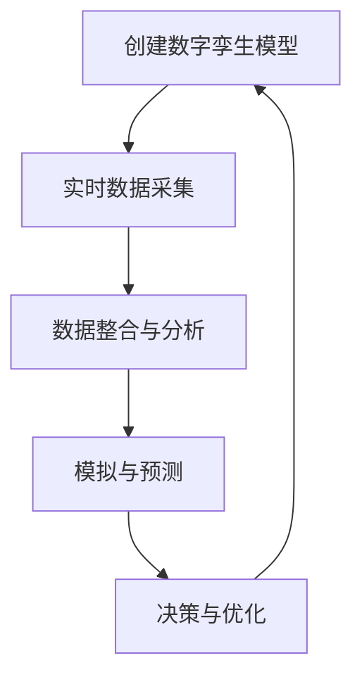
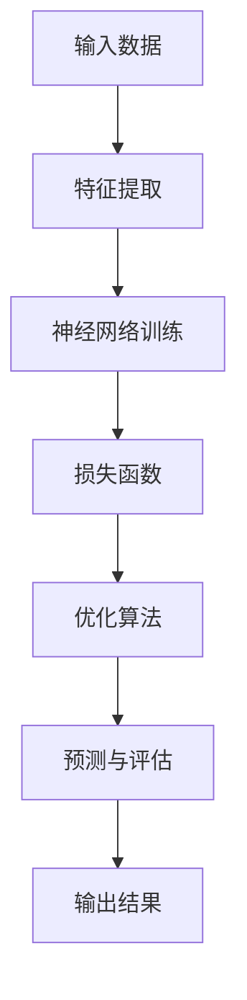

                 

# 2050年的智慧城市：从数字孪生到自组织城市的城市进化

## 关键词
智慧城市、数字孪生、物联网、大数据、人工智能、区块链、5G、城市规划、可持续发展

## 摘要
随着科技的飞速发展，智慧城市已经成为全球城市发展的新趋势。本文深入探讨了2050年智慧城市的愿景，从数字孪生到自组织城市的进化过程。文章首先介绍了智慧城市的概念与演变，接着详细解析了数字孪生技术、物联网、大数据、人工智能、区块链和5G等关键技术。随后，文章论述了智慧城市的规划和设计原则、案例研究以及可持续发展的重要性。最后，文章展望了智慧城市的未来发展趋势，探讨了其对人类生活和社会的影响。

## 引言
在21世纪的今天，全球城市化进程不断加速，城市面临着前所未有的挑战，如人口增长、资源短缺、环境污染、交通拥堵等。智慧城市作为一种新兴的城市发展模式，通过集成先进的数字技术，旨在实现城市的高效管理、智能服务和可持续发展。2050年的智慧城市将是数字孪生、物联网、大数据、人工智能、区块链和5G等技术的集大成者，它不仅能够模拟和预测城市运行状态，还能实现自我优化和自组织。本文将带领读者走进2050年的智慧城市，逐步揭示这一未来的图景。

## 第一部分：智慧城市的基础

### 第1章：智慧城市的概念与演变
#### 1.1 智慧城市的定义与背景
智慧城市是指通过信息通信技术（ICT）手段，实现城市各系统间的数据互联和智能协同，从而提高城市运行效率、居民生活质量以及生态环境质量。智慧城市的理念源于20世纪90年代，当时信息技术和互联网的快速发展为城市智能化提供了新的契机。

#### 1.2 智慧城市的发展历程
智慧城市的发展历程可以分为三个阶段：1.0时代是信息化城市，以信息资源的数字化和普及化为主；2.0时代是协同化城市，强调不同城市系统和部门之间的协同合作；3.0时代是智能化城市，以人工智能和大数据为核心，实现全面智能化。

#### 1.3 智慧城市的核心目标与价值
智慧城市的核心目标包括：提高城市运行效率、提升居民生活质量、促进经济和社会可持续发展。智慧城市通过优化城市资源配置、提高公共服务水平、增强城市抗灾能力，实现社会、经济、环境的和谐发展。

### 第2章：数字孪生技术原理与应用
#### 2.1 数字孪生技术的定义与原理
数字孪生技术是通过建立虚拟仿真模型，实现对物理实体的全生命周期管理。它通过实时数据采集、模型仿真和预测分析，实现对物理世界的精准模拟和预测。

#### 2.2 数字孪生技术在智慧城市建设中的应用
数字孪生技术在智慧城市建设中具有广泛应用，如城市规划、交通管理、环境保护、能源管理等方面。通过数字孪生技术，可以实现城市运行状态的实时监测和预测，为城市管理者提供科学决策依据。

#### 2.3 数字孪生技术的挑战与解决方案
数字孪生技术面临的挑战包括数据采集与处理的复杂性、模型构建的准确性、技术实现的可行性等。解决方案包括提高数据处理能力、优化模型算法、加强技术研究和人才培养。

### 第3章：物联网与智慧城市
#### 3.1 物联网技术的概念与发展
物联网技术是指通过互联网将各种物理设备连接起来，实现信息交换和通信。物联网技术的发展历程可以分为三个阶段：感知层、网络层和应用层。

#### 3.2 物联网技术在智慧城市中的应用
物联网技术在智慧城市中的应用涵盖了交通、能源、环境、安防等多个领域。通过物联网技术，可以实现城市信息的实时采集、传输和处理，提高城市管理的智能化水平。

#### 3.3 物联网技术与数字孪生的融合
物联网技术与数字孪生的融合，可以实现城市运行数据的全面采集和实时分析，为城市管理者提供更精准的决策支持。数字孪生技术为物联网提供了模拟和预测的工具，而物联网技术为数字孪生提供了丰富的数据来源。

### 第4章：大数据与智慧城市
#### 4.1 大数据的基本概念与处理技术
大数据是指无法用传统数据处理工具进行捕捉、管理和处理的数据集合。大数据的处理技术包括数据采集、数据存储、数据分析和数据可视化等。

#### 4.2 大数据在智慧城市中的应用
大数据在智慧城市中的应用非常广泛，如交通管理、公共安全、城市管理、智慧医疗等。通过大数据分析，可以实现城市运行状态的实时监测和预测，为城市管理者提供科学决策依据。

#### 4.3 大数据治理与隐私保护
大数据治理和隐私保护是智慧城市建设中不可忽视的问题。通过建立健全的数据治理体系和隐私保护机制，可以确保大数据在智慧城市中的安全和合理应用。

## 第二部分：智慧城市的关键技术

### 第5章：人工智能与智慧城市
#### 5.1 人工智能的基本概念与原理
人工智能是指模拟人类智能的理论、方法、技术及应用。人工智能的核心技术包括机器学习、深度学习、自然语言处理、计算机视觉等。

#### 5.2 人工智能在智慧城市中的应用
人工智能在智慧城市中的应用非常广泛，如智能交通管理、智能安防、智能医疗、智能环境监测等。通过人工智能技术，可以实现城市运行状态的智能监测和预测，提高城市管理效率。

#### 5.3 人工智能技术的挑战与未来发展趋势
人工智能技术在智慧城市中的应用面临着数据质量、算法可靠性、安全隐私等方面的挑战。未来，人工智能技术将朝着更加智能化、自适应化和安全化的方向发展。

### 第6章：区块链与智慧城市
#### 6.1 区块链的基本原理与特性
区块链是一种分布式数据库技术，通过去中心化和加密算法确保数据的安全性和不可篡改性。区块链的基本特性包括去中心化、安全性、透明性和可追溯性。

#### 6.2 区块链在智慧城市中的应用
区块链在智慧城市中的应用包括智慧交通、智慧能源、智慧医疗、智慧金融等领域。通过区块链技术，可以实现城市各系统间的数据共享和协同工作，提高城市管理的透明度和效率。

#### 6.3 区块链与数字孪生、物联网的融合
区块链与数字孪生、物联网的融合，可以实现城市运行数据的去中心化存储和管理，提高数据的安全性和可信度。数字孪生技术为区块链提供了丰富的数据来源，而区块链技术为数字孪生提供了数据共享和协同工作的机制。

### 第7章：5G与智慧城市
#### 7.1 5G网络的基本原理与特性
5G网络是指第五代移动通信网络，具有高速率、大容量、低时延、广覆盖等特性。5G网络将推动物联网、人工智能、虚拟现实等技术的发展。

#### 7.2 5G在智慧城市中的应用
5G在智慧城市中的应用包括智能交通、智能安防、智能医疗、智能能源等领域。通过5G网络，可以实现城市信息的实时传输和处理，提高城市管理的效率和智能化水平。

#### 7.3 5G与物联网、人工智能的融合
5G与物联网、人工智能的融合，将推动智慧城市的全面发展。5G网络为物联网提供了高速传输通道，为人工智能提供了实时数据支持，为智慧城市的建设提供了强大的技术保障。

## 第三部分：智慧城市的建设与实践

### 第8章：智慧城市的规划和设计
#### 8.1 智慧城市规划的基本原则
智慧城市规划应遵循系统性、协同性、开放性、创新性等基本原则。通过科学合理的规划，实现城市资源的优化配置和城市功能的有序发展。

#### 8.2 智慧城市的设计方法与工具
智慧城市的设计方法包括需求分析、系统架构设计、数据整合与处理、系统集成与优化等。设计工具包括BIM（建筑信息模型）、GIS（地理信息系统）、数字孪生平台等。

#### 8.3 智慧城市的风险评估与控制
智慧城市在建设过程中，需要进行全面的风险评估和控制。通过识别风险、评估风险影响和制定应对措施，确保智慧城市建设的顺利进行。

### 第9章：智慧城市的案例研究
#### 9.1 国际智慧城市案例介绍
国际上的智慧城市案例包括新加坡的“智慧国2030”、伦敦的“智能城市”、阿姆斯特丹的“智能交通”等。这些案例展示了智慧城市在不同领域的应用和实践。

#### 9.2 国内智慧城市案例介绍
国内的智慧城市案例包括深圳的“智慧城市”、苏州的“数字城市”、宁波的“智慧环保”等。这些案例展示了国内智慧城市建设的成果和经验。

#### 9.3 智慧城市案例分析
通过对国内外智慧城市案例的分析，可以总结出智慧城市建设的关键要素和成功经验。为其他城市提供借鉴和参考，推动智慧城市的普及和发展。

### 第10章：智慧城市的可持续发展
#### 10.1 智慧城市的社会影响
智慧城市的发展将对社会产生深远影响，如提高居民生活质量、促进就业、改善社会治理等。智慧城市的社会影响需要从多个层面进行综合考虑。

#### 10.2 智慧城市的经济影响
智慧城市的发展将推动城市经济的转型升级，促进新兴产业的发展，提高城市竞争力。智慧城市的经济影响需要从产业、投资、就业等多个方面进行分析。

#### 10.3 智慧城市的环境与可持续发展
智慧城市的发展需要注重环境保护和可持续发展。通过优化资源利用、减少污染排放、推广绿色技术等，实现城市环境的可持续性。

## 附录

### 附录A：智慧城市建设资源与工具
#### A.1 开源智慧城市平台
开源智慧城市平台包括OpenCity、CityIOT、SmartCityOS等。这些平台提供了智慧城市建设的核心功能和工具，支持各种应用开发和系统集成。

#### A.2 智慧城市相关书籍与论文
智慧城市相关的书籍和论文涵盖了智慧城市的理论、方法、技术和实践。读者可以通过这些资源深入了解智慧城市的相关知识。

#### A.3 智慧城市相关的在线课程与培训
智慧城市相关的在线课程和培训包括Coursera、Udacity、edX等平台上的专业课程。这些课程提供了系统的智慧城市知识体系和实践指导。

### 第11章：智慧城市的未来展望
#### 11.1 智慧城市的未来发展趋势
未来，智慧城市将朝着更加智能化、个性化、自适应化的方向发展。随着技术的不断进步，智慧城市将实现更高的效率和更优的服务。

#### 11.2 智慧城市的创新与挑战
智慧城市的创新包括新技术、新应用、新模式的不断涌现。与此同时，智慧城市也面临着数据隐私、信息安全、法律监管等方面的挑战。

#### 11.3 智慧城市对人类生活的影响与反思
智慧城市将对人类生活产生深远影响，改变人们的生活方式和社会结构。同时，也需要对智慧城市的负面影响进行反思和解决。

## 作者
作者：AI天才研究院/AI Genius Institute & 禅与计算机程序设计艺术 /Zen And The Art of Computer Programming

### 附录：核心概念与联系

#### 数字孪生技术流程图


#### 人工智能核心算法原理图


#### 核心算法伪代码
```python
# 输入数据
data = ...

# 特征提取
features = extract_features(data)

# 神经网络训练
model = train_neural_network(features)

# 损失函数
loss = compute_loss(model)

# 优化算法
model = optimize_loss(model)

# 预测与评估
predictions = predict(model)
evaluate(predictions)
```

#### 数学模型与公式
$$ y = f(x) = \frac{1}{1 + e^{-x}} $$

**举例说明：**
假设输入特征 `x` 为 `[2, 3, 4]`，使用上述公式计算输出结果 `y`：
$$ y = \frac{1}{1 + e^{-2}} + \frac{1}{1 + e^{-3}} + \frac{1}{1 + e^{-4}} $$
$$ y ≈ 0.9709 + 0.9131 + 0.8808 $$
$$ y ≈ 2.7648 $$

#### 项目实战

**案例：智慧交通信号灯优化**

**1. 环境搭建：**
- 安装Python环境
- 安装TensorFlow库

**2. 代码实现：**
```python
import tensorflow as tf

# 定义输入层
inputs = tf.keras.layers.Input(shape=(3,))

# 定义特征提取层
x = tf.keras.layers.Dense(64, activation='relu')(inputs)

# 定义输出层
outputs = tf.keras.layers.Dense(1, activation='sigmoid')(x)

# 创建模型
model = tf.keras.Model(inputs, outputs)

# 编译模型
model.compile(optimizer='adam', loss='binary_crossentropy', metrics=['accuracy'])

# 加载训练数据
train_data = ...

# 训练模型
model.fit(train_data, epochs=10)
```

**3. 代码解读与分析：**
- 导入TensorFlow库
- 定义输入层、特征提取层和输出层
- 创建模型并编译
- 加载训练数据并训练模型

**4. 结果评估：**
- 输出模型的准确率、召回率等指标
- 分析模型在实际交通信号灯优化中的应用效果

通过以上案例，我们展示了如何利用人工智能技术实现智慧交通信号灯的优化。未来，随着技术的不断发展，智慧城市将迎来更多的应用场景和发展机遇。

