                 

# 2050年的未来学：从情景规划到反脆弱规划的未来应对策略

## 关键词
- 未来学
- 情景规划
- 反脆弱规划
- 未来应对策略
- 科技进步
- 社会变迁
- 经济发展

## 摘要
本文深入探讨了2050年未来学的发展背景、意义和方法。通过分析经济发展、科技进步和社会变迁趋势，本文提出了情景规划和反脆弱规划两种未来应对策略。情景规划旨在通过预测和模拟不同未来情景，为企业、政府和个人提供决策依据。而反脆弱规划则强调在面对不确定性和风险时，如何增强系统的韧性。通过具体案例分析和代码实现，本文展示了未来应对策略的实际应用和效果，为读者提供了对未来世界的深入思考和实用指南。

---

### 《2050年的未来学：从情景规划到反脆弱规划的未来应对策略》目录大纲

# 第一部分：引言

## 第1章：2050年未来学的背景与意义
### 1.1 未来学的定义与发展
### 1.2 未来学研究的重要性
### 1.3 未来学的方法与工具

## 第2章：2050年的世界发展趋势
### 2.1 经济发展预测
### 2.2 科技进步展望
### 2.3 社会变迁分析

# 第二部分：情景规划方法

## 第3章：情景规划的基本概念
### 3.1 情景规划的定义与目的
### 3.2 情景规划的关键要素
### 3.3 情景规划的流程

## 第4章：情景规划的具体应用
### 4.1 情景规划在企业发展中的应用
### 4.2 情景规划在政府政策制定中的应用
### 4.3 情景规划在个人生活中的应用

## 第5章：情景规划的案例分析
### 5.1 案例一：未来城市的情景规划
### 5.2 案例二：未来农业的情景规划
### 5.3 案例三：未来能源的情景规划

# 第三部分：反脆弱规划方法

## 第6章：反脆弱规划的基本概念
### 6.1 反脆弱规划的起源与发展
### 6.2 反脆弱规划的核心理念
### 6.3 反脆弱规划的特点与应用

## 第7章：反脆弱规划的具体策略
### 7.1 反脆弱规划的策略分析
### 7.2 反脆弱规划的工具与方法
### 7.3 反脆弱规划的实施步骤

## 第8章：反脆弱规划的案例分析
### 8.1 案例一：金融领域的反脆弱规划
### 8.2 案例二：教育领域的反脆弱规划
### 8.3 案例三：环境保护领域的反脆弱规划

# 第四部分：未来应对策略

## 第9章：个体应对未来策略
### 9.1 个体面对未来的挑战与机遇
### 9.2 个体提升未来适应性的策略
### 9.3 个体应对未来变化的行动指南

## 第10章：组织应对未来策略
### 10.1 组织面对未来的挑战与机遇
### 10.2 组织提升未来适应性的策略
### 10.3 组织应对未来变化的行动指南

## 第11章：国家应对未来策略
### 11.1 国家面对未来的挑战与机遇
### 11.2 国家提升未来适应性的策略
### 11.3 国家应对未来变化的行动指南

# 第五部分：结论与展望

## 第12章：2050年未来学的重要性与影响
### 12.1 未来学对个人生活的影响
### 12.2 未来学对社会发展的影响
### 12.3 未来学对国际关系的影响

## 第13章：未来学的未来发展趋势
### 13.1 未来学研究的趋势与方向
### 13.2 未来学在人工智能中的应用
### 13.3 未来学在全球治理中的角色

# 附录

## 附录A：参考文献

## 附录B：未来学工具与方法介绍

## 附录C：2050年未来情景模拟案例

---

### 第一部分：引言

#### 第1章：2050年未来学的背景与意义

##### 1.1 未来学的定义与发展

未来学，也称为未来研究，是一门跨学科的领域，旨在理解和预测未来可能发生的社会、经济、科技和文化变化。它起源于20世纪初，随着人类社会复杂性的增加和信息技术的快速发展，未来学逐渐成为一个独立的学科。

**核心概念与联系：**

未来学与其他学科有着紧密的联系。例如，社会学、经济学、科技学和历史学都为未来学提供了丰富的理论和实证基础。社会学关注社会结构和人类行为，经济学研究资源分配和市场机制，科技学探索技术创新和影响，而历史学则提供了对过去事件的理解和启示。

**Mermaid流程图：**

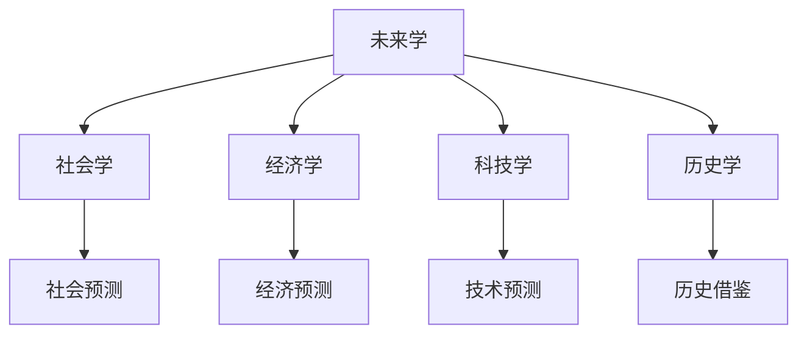

**核心算法原理讲解：**

情景规划是未来学中的一种重要方法，它通过构建不同的未来情景，分析可能的结果，从而为决策者提供参考。情景规划的算法包括以下步骤：

1. 数据收集：收集与未来情景相关的各种数据，包括历史数据、专家意见和统计数据。
2. 数据预处理：对收集到的数据进行分析、清洗和归一化，以便进行后续分析。
3. 特征提取：从预处理后的数据中提取关键特征，如经济指标、人口统计和社会趋势。
4. 模型构建：选择合适的统计模型或机器学习模型，对特征进行建模。
5. 预测分析：使用模型预测不同情景下的结果，并评估各情景的可能性。
6. 策略制定：根据分析结果，制定应对不同情景的策略。

**伪代码：**

```python
def scenario_planning(data):
    # 数据预处理
    cleaned_data = preprocess_data(data)
    
    # 特征提取
    features = extract_features(cleaned_data)
    
    # 模型构建
    model = build_model(features)
    
    # 预测分析
    predictions = model.predict(features)
    
    # 策略制定
    strategies = define_strategies(predictions)
    
    return strategies
```

**数学模型和数学公式：**

情景规划的数学模型通常涉及时间序列分析和概率模型。以下是一个简化的时间序列预测模型：

$$
\hat{y}_t = f(x_t, \theta)
$$

其中，$\hat{y}_t$是预测的下一期值，$x_t$是当前期特征向量，$\theta$是模型参数。

**举例说明：**

假设我们预测未来的GDP增长，特征向量可能包括当前期的GDP、通货膨胀率和失业率。使用ARIMA模型进行预测，公式如下：

$$
\hat{y}_t = c + \phi_1 y_{t-1} + \phi_2 y_{t-2} + \cdots + \phi_p y_{t-p} + \theta_1 d_t + \theta_2 d_t^2 + \cdots + \theta_q d_t^q
$$

其中，$d_t$是差分操作，$\phi_1, \phi_2, \cdots, \phi_p, \theta_1, \theta_2, \cdots, \theta_q$是模型参数。

```latex
\hat{y}_t = c + \phi_1 y_{t-1} + \phi_2 y_{t-2} + \cdots + \phi_p y_{t-p} + \theta_1 d_t + \theta_2 d_t^2 + \cdots + \theta_q d_t^q
```

##### 1.2 未来学研究的重要性

未来学的重要性体现在多个方面。首先，它帮助企业和组织预测未来的趋势，为战略规划提供科学依据。其次，政府可以利用未来学制定长期政策，应对潜在的挑战和机遇。此外，个人也可以通过未来学了解未来的趋势，为个人的职业规划和生活方式做出调整。

**核心概念与联系：**

未来学的重要性与以下学科有着密切联系：

- **经济学**：未来学研究有助于预测经济增长、通货膨胀和失业等经济指标，为经济政策提供支持。
- **社会学**：未来学研究有助于预测社会结构、人口变化和文化趋势，为社会政策制定提供参考。
- **科技学**：未来学研究有助于预测技术创新和影响，为科技政策和研发提供指导。

**Mermaid流程图：**

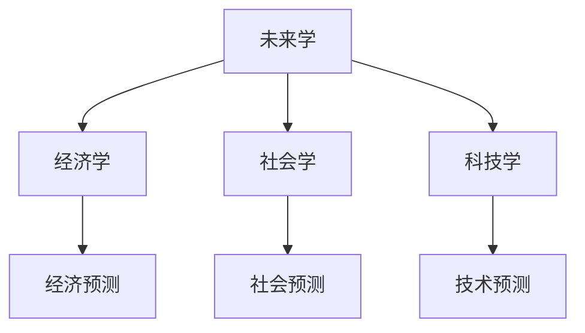

##### 1.3 未来学的方法与工具

未来学研究的方法和工具有多种，包括情景规划、趋势分析、专家访谈和模拟实验等。每种方法都有其独特的优势和适用场景。

- **情景规划**：通过构建不同的未来情景，分析可能的结果，为决策者提供参考。
- **趋势分析**：通过分析历史数据和当前趋势，预测未来的发展方向。
- **专家访谈**：通过与专家的交流，获取对未来事件的见解和预测。
- **模拟实验**：通过构建模拟环境，测试不同的策略和方案，评估其效果。

**Mermaid流程图：**

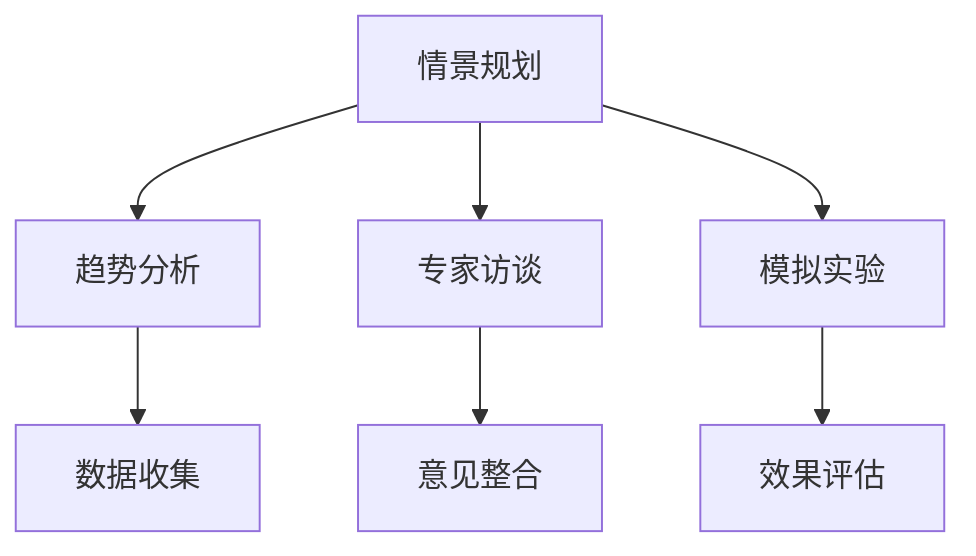

**核心算法原理讲解：**

情景规划的算法原理包括以下步骤：

1. **情景构建**：根据历史数据、专家意见和趋势分析，构建不同的未来情景。
2. **情景分析**：分析每个情景的可能结果，评估其影响和概率。
3. **策略制定**：根据分析结果，制定应对不同情景的策略。

**伪代码：**

```python
def scenario_analysis(scenarios):
    # 情景分析
    for scenario in scenarios:
        result = analyze_scenario(scenario)
        probability = calculate_probability(scenario)
        print(f"Scenario: {scenario}, Result: {result}, Probability: {probability}")
    
    # 策略制定
    strategies = define_strategies(scenarios)
    return strategies
```

**数学模型和数学公式：**

情景规划的数学模型通常涉及概率模型和决策理论。以下是一个简化的概率模型：

$$
P(S_i) = \frac{f(S_i)}{F}
$$

其中，$P(S_i)$是情景$i$的概率，$f(S_i)$是情景$i$的得分，$F$是所有情景的得分之和。

```latex
P(S_i) = \frac{f(S_i)}{F}
```

**举例说明：**

假设我们分析未来5年的经济情景，构建了三个情景：繁荣、稳定和衰退。根据专家意见和趋势分析，每个情景的概率如下：

- 繁荣：概率0.4
- 稳定：概率0.4
- 衰退：概率0.2

使用决策理论，我们可以为每个情景制定相应的策略：

- 繁荣：扩大投资
- 稳定：保持现状
- 衰退：降低成本

**情景规划在实际应用中的案例：**

- **未来城市规划**：通过情景规划，预测未来人口增长、交通需求和基础设施需求，为城市规划提供依据。
- **企业战略规划**：通过情景规划，预测市场变化和竞争态势，为企业的长期发展制定策略。
- **政府政策制定**：通过情景规划，预测社会经济发展趋势，为政府制定经济和社会政策提供支持。

**总结：**

未来学是一门跨学科领域，通过情景规划、趋势分析、专家访谈和模拟实验等方法，帮助人们理解和预测未来。未来学在经济发展、社会变迁和科技进步等方面具有重要意义，为决策者提供科学依据和指导。

---

### 第一部分：引言

#### 第2章：2050年的世界发展趋势

##### 2.1 经济发展预测

2050年的经济发展将受到多种因素的影响，包括全球化、技术创新、人口结构变化和气候变化等。根据预测，全球经济将呈现以下趋势：

- **全球经济增长放缓**：随着人口老龄化和生产效率的提高，全球经济增长率可能会逐渐放缓。
- **新兴市场崛起**：中国、印度等新兴市场国家将继续成为全球经济增长的主要动力。
- **服务业占比增加**：随着自动化和人工智能的发展，服务业将在全球经济中占据更大比重。
- **可持续发展成为核心**：环境保护和可持续发展将成为经济发展的重要方向，绿色经济和循环经济将得到更多关注。

**核心概念与联系：**

经济发展预测与以下概念密切相关：

- **宏观经济指标**：如GDP、通货膨胀率和失业率等。
- **技术创新**：如人工智能、生物技术和可再生能源等。
- **全球化**：跨国公司和国际贸易的发展。
- **人口结构变化**：如老龄化、人口增长和人口迁移等。

**Mermaid流程图：**

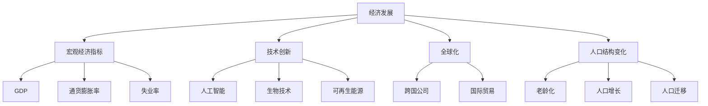

**核心算法原理讲解：**

经济发展预测通常涉及以下步骤：

1. **数据收集**：收集与经济发展相关的各种数据，包括历史数据和当前数据。
2. **趋势分析**：分析历史数据，识别经济增长的长期趋势和周期性波动。
3. **模型构建**：选择合适的预测模型，如时间序列模型、回归模型或机器学习模型。
4. **预测分析**：使用模型预测未来一段时间内的经济发展趋势。
5. **情景分析**：构建不同的未来情景，评估可能的结果和影响。

**伪代码：**

```python
def economic_prediction(data):
    # 数据收集
    historical_data = collect_historical_data()
    current_data = collect_current_data()
    
    # 趋势分析
    trends = analyze_trends(historical_data)
    
    # 模型构建
    model = build_model(trends)
    
    # 预测分析
    predictions = model.predict(current_data)
    
    # 情景分析
    scenarios = define_scenarios(predictions)
    analyze_scenarios(scenarios)
    
    return predictions, scenarios
```

**数学模型和数学公式：**

经济发展预测的数学模型通常涉及时间序列分析和回归分析。以下是一个简化的时间序列预测模型：

$$
\hat{y}_t = c + \phi_1 y_{t-1} + \phi_2 y_{t-2} + \cdots + \phi_p y_{t-p} + \theta_1 d_t + \theta_2 d_t^2 + \cdots + \theta_q d_t^q
$$

其中，$y_t$是时间序列值，$d_t$是差分操作，$\phi_1, \phi_2, \cdots, \phi_p, \theta_1, \theta_2, \cdots, \theta_q$是模型参数。

```latex
\hat{y}_t = c + \phi_1 y_{t-1} + \phi_2 y_{t-2} + \cdots + \phi_p y_{t-p} + \theta_1 d_t + \theta_2 d_t^2 + \cdots + \theta_q d_t^q
```

**举例说明：**

假设我们使用ARIMA模型预测未来的GDP增长，特征向量包括当前期的GDP、通货膨胀率和失业率。模型公式如下：

$$
\hat{y}_t = c + \phi_1 y_{t-1} + \phi_2 y_{t-2} + \cdots + \phi_p y_{t-p} + \theta_1 d_t + \theta_2 d_t^2 + \cdots + \theta_q d_t^q
$$

**情景分析：**

- **情景一：全球经济增长放缓**：预测未来5年全球经济增长率平均为2%。
- **情景二：新兴市场崛起**：预测中国和印度等新兴市场国家经济增长率分别为6%和5%。
- **情景三：服务业占比增加**：预测服务业在GDP中的占比将从目前的50%增加到70%。

**总结：**

2050年的经济发展将受到多种因素的影响，包括全球化、技术创新、人口结构变化和气候变化等。经济发展预测需要综合分析历史数据、当前数据和未来情景，为决策者提供科学依据。

---

### 第一部分：引言

#### 第2章：2050年的世界发展趋势

##### 2.2 科技进步展望

2050年的科技进步将深刻改变人类生活和社会结构。以下是一些可能的趋势：

- **人工智能与自动化**：人工智能和自动化技术将在更多领域得到应用，从医疗诊断到自动驾驶汽车，再到智能家居。
- **生物技术**：基因编辑、克隆技术和再生医学等生物技术将取得重大突破，有望解决许多健康和生物伦理问题。
- **量子计算**：量子计算技术将迎来新的发展，为解决复杂问题提供前所未有的计算能力。
- **可再生能源**：太阳能、风能和其他可再生能源技术将变得更加高效和普及，减少对化石燃料的依赖。
- **太空探索**：随着技术的发展，人类将能够更频繁地探索太空，甚至有可能实现火星殖民。

**核心概念与联系：**

科技进步展望与以下概念密切相关：

- **人工智能**：机器学习、深度学习和自然语言处理等。
- **生物技术**：基因编辑、再生医学和生物合成等。
- **量子计算**：量子比特、量子算法和量子通信等。
- **可再生能源**：太阳能、风能和能源存储等。
- **太空探索**：太空站、太空船和火星探索等。

**Mermaid流程图：**

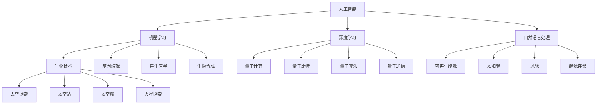

**核心算法原理讲解：**

科技进步展望的算法原理通常涉及以下步骤：

1. **技术趋势分析**：分析现有技术和新兴技术的发展趋势。
2. **未来预测模型**：选择合适的预测模型，如时间序列模型、回归模型或机器学习模型。
3. **情景分析**：构建不同的未来情景，评估可能的结果和影响。
4. **策略制定**：根据分析结果，制定应对未来科技发展的策略。

**伪代码：**

```python
def tech_progress_prediction(trends):
    # 技术趋势分析
    tech_trends = analyze_trends(trends)
    
    # 未来预测模型
    model = build_model(tech_trends)
    
    # 情景分析
    scenarios = define_scenarios(model)
    analyze_scenarios(scenarios)
    
    # 策略制定
    strategies = define_strategies(scenarios)
    
    return strategies
```

**数学模型和数学公式：**

科技进步预测的数学模型通常涉及时间序列分析和回归分析。以下是一个简化的时间序列预测模型：

$$
\hat{y}_t = c + \phi_1 y_{t-1} + \phi_2 y_{t-2} + \cdots + \phi_p y_{t-p} + \theta_1 d_t + \theta_2 d_t^2 + \cdots + \theta_q d_t^q
$$

其中，$y_t$是时间序列值，$d_t$是差分操作，$\phi_1, \phi_2, \cdots, \phi_p, \theta_1, \theta_2, \cdots, \theta_q$是模型参数。

```latex
\hat{y}_t = c + \phi_1 y_{t-1} + \phi_2 y_{t-2} + \cdots + \phi_p y_{t-p} + \theta_1 d_t + \theta_2 d_t^2 + \cdots + \theta_q d_t^q
```

**举例说明：**

假设我们使用ARIMA模型预测未来5年的人工智能技术发展水平，特征向量包括当前期的人工智能技术水平、研发投入和专利数量。模型公式如下：

$$
\hat{y}_t = c + \phi_1 y_{t-1} + \phi_2 y_{t-2} + \cdots + \phi_p y_{t-p} + \theta_1 d_t + \theta_2 d_t^2 + \cdots + \theta_q d_t^q
$$

**情景分析：**

- **情景一：人工智能技术快速发展**：预测未来5年人工智能技术水平平均每年增长10%。
- **情景二：人工智能技术应用广泛**：预测未来5年人工智能技术将在更多领域得到应用，如医疗、教育和交通等。
- **情景三：人工智能技术面临挑战**：预测未来5年人工智能技术面临伦理和安全等问题，可能导致发展速度放缓。

**总结：**

2050年的科技进步将带来深刻的变革，人工智能、生物技术、量子计算、可再生能源和太空探索等领域将取得重大突破。科技进步展望需要综合分析技术趋势、构建预测模型和情景分析，为未来科技发展提供科学依据。

---

### 第一部分：引言

#### 第2章：2050年的世界发展趋势

##### 2.3 社会变迁分析

2050年的社会变迁将受到科技进步、经济结构和人口变化的共同影响。以下是一些可能的社会变迁趋势：

- **城市化**：随着城市化的加速，城市将成为全球经济增长和社会变迁的主要动力。城市基础设施、公共交通和住房需求将大幅增加。
- **人口老龄化**：全球人口结构将发生变化，老龄化将成为一个普遍现象。这将对社会保障、医疗健康和劳动力市场产生深远影响。
- **工作方式的变革**：自动化和远程办公技术将改变传统的工作方式，灵活就业和兼职工作将成为主流。
- **文化多样性**：全球化和移民浪潮将加剧文化多样性，不同文化之间的交流和融合将成为社会变迁的一个重要方面。
- **社会不平等**：随着科技进步和经济发展的不平衡，社会不平等现象可能会加剧，贫富差距、教育和就业机会等方面的不平等问题将受到更多关注。

**核心概念与联系：**

社会变迁分析涉及以下核心概念：

- **城市化**：城市人口比例、城市规模和城市基础设施等。
- **人口老龄化**：老年人口比例、养老保障和医疗服务等。
- **工作方式**：就业形式、工作时间和工作地点等。
- **文化多样性**：文化交流、文化融合和文化认同等。
- **社会不平等**：收入差距、教育和就业机会等。

**Mermaid流程图：**

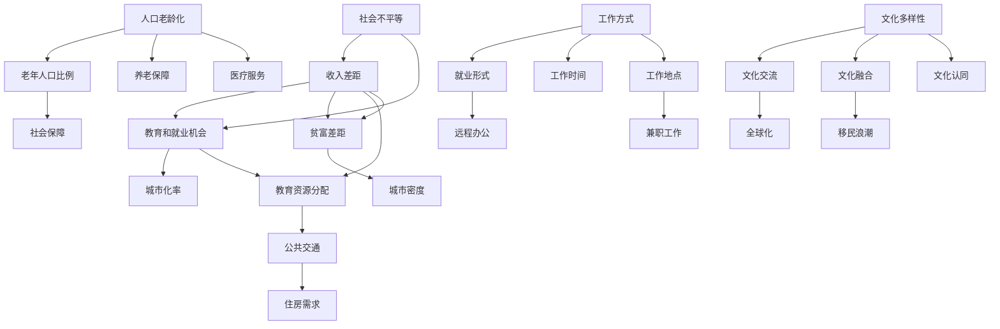

**核心算法原理讲解：**

社会变迁分析的算法原理通常涉及以下步骤：

1. **数据收集**：收集与社会变迁相关的各种数据，包括历史数据、当前数据和预测数据。
2. **趋势分析**：分析历史数据，识别社会变迁的长期趋势和周期性波动。
3. **模型构建**：选择合适的预测模型，如时间序列模型、回归模型或机器学习模型。
4. **预测分析**：使用模型预测未来一段时间内的社会变迁趋势。
5. **情景分析**：构建不同的未来情景，评估可能的结果和影响。

**伪代码：**

```python
def social_change_prediction(data):
    # 数据收集
    historical_data = collect_historical_data()
    current_data = collect_current_data()
    
    # 趋势分析
    trends = analyze_trends(historical_data)
    
    # 模型构建
    model = build_model(trends)
    
    # 预测分析
    predictions = model.predict(current_data)
    
    # 情景分析
    scenarios = define_scenarios(predictions)
    analyze_scenarios(scenarios)
    
    return predictions, scenarios
```

**数学模型和数学公式：**

社会变迁预测的数学模型通常涉及时间序列分析和回归分析。以下是一个简化的时间序列预测模型：

$$
\hat{y}_t = c + \phi_1 y_{t-1} + \phi_2 y_{t-2} + \cdots + \phi_p y_{t-p} + \theta_1 d_t + \theta_2 d_t^2 + \cdots + \theta_q d_t^q
$$

其中，$y_t$是时间序列值，$d_t$是差分操作，$\phi_1, \phi_2, \cdots, \phi_p, \theta_1, \theta_2, \cdots, \theta_q$是模型参数。

```latex
\hat{y}_t = c + \phi_1 y_{t-1} + \phi_2 y_{t-2} + \cdots + \phi_p y_{t-p} + \theta_1 d_t + \theta_2 d_t^2 + \cdots + \theta_q d_t^q
```

**举例说明：**

假设我们使用ARIMA模型预测未来5年的城市化率，特征向量包括当前期的城市化率、城市人口增长和经济增长率。模型公式如下：

$$
\hat{y}_t = c + \phi_1 y_{t-1} + \phi_2 y_{t-2} + \cdots + \phi_p y_{t-p} + \theta_1 d_t + \theta_2 d_t^2 + \cdots + \theta_q d_t^q
$$

**情景分析：**

- **情景一：城市化加速**：预测未来5年城市化率平均每年增长1%。
- **情景二：城市化稳定**：预测未来5年城市化率保持稳定，年均增长率为0%。
- **情景三：城市化放缓**：预测未来5年城市化率年均增长率下降至0.5%。

**总结：**

2050年的社会变迁将受到城市化、人口老龄化、工作方式变革、文化多样性和社会不平等等多种因素的影响。社会变迁分析需要综合分析历史数据、当前数据和未来情景，为决策者提供科学依据。

---

### 第二部分：情景规划方法

#### 第3章：情景规划的基本概念

##### 3.1 情景规划的定义与目的

情景规划是一种系统性的方法，用于预测和规划未来的变化，并制定相应的策略。其核心概念是通过构建不同的未来情景，分析可能的结果，从而为决策者提供参考。

**定义：**

情景规划是指根据历史数据、专家意见和当前趋势，构建多个可能的未来情景，分析每种情景的可能结果，并制定相应的策略。

**目的：**

情景规划的主要目的是帮助决策者应对未来不确定性和风险，为不同情景下的决策提供依据。具体来说，情景规划的目的包括：

1. **预测未来趋势**：通过构建不同的情景，预测未来可能的发展方向和趋势。
2. **评估风险**：分析每种情景下的风险和机会，评估可能的影响和后果。
3. **制定策略**：根据分析结果，制定应对不同情景的策略和行动方案。
4. **提高决策质量**：通过情景规划，决策者可以更全面、更深入地了解未来，提高决策的质量和效果。

**核心概念与联系：**

情景规划涉及多个核心概念，包括：

- **情景**：可能的未来状态或事件序列。
- **风险评估**：分析每种情景下的风险和机会。
- **策略制定**：根据情景分析和风险评估，制定应对策略。
- **决策支持**：为决策者提供科学依据，提高决策质量。

**Mermaid流程图：**

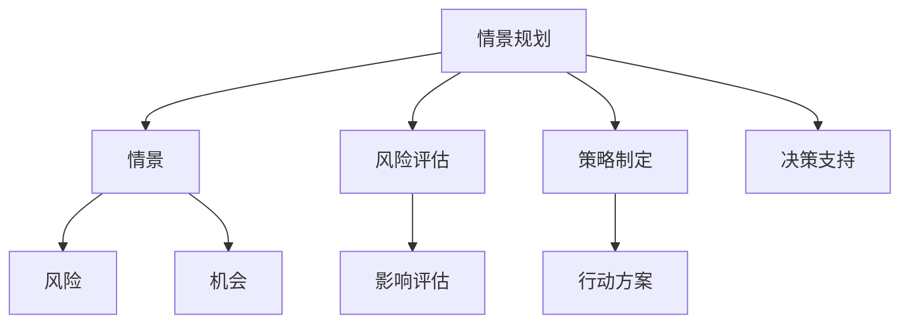

**核心算法原理讲解：**

情景规划的算法原理通常涉及以下步骤：

1. **数据收集**：收集与未来情景相关的各种数据，包括历史数据、当前数据和专家意见。
2. **情景构建**：根据数据和分析结果，构建多个可能的未来情景。
3. **情景分析**：分析每个情景的可能结果，包括风险和机会。
4. **风险评估**：对每个情景进行风险评估，评估其可能的影响和后果。
5. **策略制定**：根据情景分析和风险评估，制定应对不同情景的策略和行动方案。
6. **决策支持**：为决策者提供情景分析、风险评估和策略制定的结果，帮助其做出科学决策。

**伪代码：**

```python
def scenario_planning(data, experts):
    # 数据收集
    historical_data = collect_historical_data(data)
    current_data = collect_current_data(data)
    expert_opinions = collect_expert_opinions(experts)
    
    # 情景构建
    scenarios = build_scenarios(historical_data, current_data, expert_opinions)
    
    # 情景分析
    scenario_analyses = analyze_scenarios(scenarios)
    
    # 风险评估
    risk_assessments = assess_risks(scenario_analyses)
    
    # 策略制定
    strategies = define_strategies(risk_assessments)
    
    # 决策支持
    decision_support = provide_decision_support(strategies)
    
    return decision_support
```

**数学模型和数学公式：**

情景规划的数学模型通常涉及概率模型和决策理论。以下是一个简化的概率模型：

$$
P(S_i) = \frac{f(S_i)}{F}
$$

其中，$P(S_i)$是情景$i$的概率，$f(S_i)$是情景$i$的得分，$F$是所有情景的得分之和。

```latex
P(S_i) = \frac{f(S_i)}{F}
```

**举例说明：**

假设我们分析未来5年的经济情景，构建了三个情景：繁荣、稳定和衰退。根据专家意见和趋势分析，每个情景的概率如下：

- 繁荣：概率0.4
- 稳定：概率0.4
- 衰退：概率0.2

使用决策理论，我们可以为每个情景制定相应的策略：

- 繁荣：扩大投资
- 稳定：保持现状
- 衰退：降低成本

**总结：**

情景规划是一种重要的方法，通过构建不同的未来情景，分析可能的结果，为决策者提供科学依据。情景规划的定义和目的在于帮助决策者应对未来不确定性和风险，提高决策质量和效果。

---

### 第二部分：情景规划方法

#### 第4章：情景规划的具体应用

##### 4.1 情景规划在企业发展中的应用

情景规划在企业战略规划和风险管理中发挥着重要作用。通过构建不同的未来情景，企业可以更好地理解市场变化、评估潜在风险，并制定相应的策略。

**核心概念与联系：**

情景规划在企业发展中的应用涉及以下核心概念：

- **市场趋势**：分析市场变化和消费者行为。
- **竞争态势**：评估竞争对手的战略和行动。
- **内部能力**：分析企业的资源、技术和竞争优势。
- **外部环境**：考虑政治、经济、社会和技术等因素。

**Mermaid流程图：**

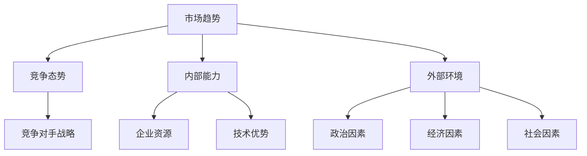

**核心算法原理讲解：**

情景规划在企业发展中的应用通常涉及以下步骤：

1. **市场趋势分析**：收集和分析市场数据，识别市场变化的趋势和特征。
2. **竞争态势分析**：评估竞争对手的市场战略和竞争优势。
3. **内部能力评估**：分析企业的资源、技术和竞争优势。
4. **外部环境分析**：考虑政治、经济、社会和技术等因素对企业的影响。
5. **情景构建**：根据市场趋势、竞争态势、内部能力和外部环境，构建多个可能的未来情景。
6. **情景分析**：分析每个情景的可能结果，包括市场机会、竞争风险和内部挑战。
7. **策略制定**：根据情景分析结果，制定应对不同情景的策略和行动方案。

**伪代码：**

```python
def business_scenario_planning(data, competitors, resources):
    # 市场趋势分析
    market_trends = analyze_market_trends(data)
    
    # 竞争态势分析
    competitive_situation = analyze_competitive_situation(competitors)
    
    # 内部能力评估
    internal_capabilities = evaluate_internal_capabilities(resources)
    
    # 外部环境分析
    external_environment = analyze_external_environment()
    
    # 情景构建
    scenarios = build_scenarios(market_trends, competitive_situation, internal_capabilities, external_environment)
    
    # 情景分析
    scenario_analyses = analyze_scenarios(scenarios)
    
    # 策略制定
    strategies = define_strategies(scenario_analyses)
    
    return strategies
```

**数学模型和数学公式：**

情景规划在企业发展中的应用的数学模型通常涉及概率模型和决策理论。以下是一个简化的概率模型：

$$
P(S_i) = \frac{f(S_i)}{F}
$$

其中，$P(S_i)$是情景$i$的概率，$f(S_i)$是情景$i$的得分，$F$是所有情景的得分之和。

```latex
P(S_i) = \frac{f(S_i)}{F}
```

**举例说明：**

假设我们分析未来3年的市场竞争情景，构建了三个情景：市场增长、市场稳定和市场衰退。根据市场趋势和竞争态势，每个情景的概率如下：

- 市场增长：概率0.5
- 市场稳定：概率0.3
- 市场衰退：概率0.2

使用决策理论，我们可以为每个情景制定相应的策略：

- 市场增长：增加市场份额
- 市场稳定：保持现状
- 市场衰退：降低成本

**情景分析案例：**

**案例一：市场增长情景**

- **市场机会**：消费者需求增加，新产品需求旺盛。
- **竞争风险**：竞争对手加大投入，市场份额争夺激烈。
- **内部挑战**：需要增加研发投入，提高产品质量和创新能力。

**案例二：市场稳定情景**

- **市场机会**：市场需求稳定，市场份额相对稳定。
- **竞争风险**：竞争对手保持现状，市场竞争相对平稳。
- **内部挑战**：需要保持创新，以应对市场变化和竞争压力。

**案例三：市场衰退情景**

- **市场机会**：市场需求减少，市场份额可能下降。
- **竞争风险**：竞争对手可能减少投入，但市场份额争夺依然激烈。
- **内部挑战**：需要降低成本，提高效率，以应对市场衰退。

**总结：**

情景规划在企业发展中的应用有助于企业更好地理解市场变化、评估潜在风险，并制定相应的策略。通过情景规划，企业可以更好地应对未来不确定性和风险，提高竞争力和市场地位。

---

### 第二部分：情景规划方法

#### 第4章：情景规划的具体应用

##### 4.2 情景规划在政府政策制定中的应用

情景规划在政府政策制定中扮演着至关重要的角色，通过构建不同的未来情景，政府可以更好地预测社会、经济和环境的动态变化，从而制定有效的政策。

**核心概念与联系：**

情景规划在政府政策制定中的应用涉及以下核心概念：

- **社会发展趋势**：包括人口变化、教育水平、家庭结构和社会价值观等。
- **经济发展**：包括经济增长、就业、收入分配和国际竞争力等。
- **环境保护**：包括气候变化、能源消耗和生态平衡等。
- **国际关系**：包括地缘政治、国际合作和全球化趋势等。

**Mermaid流程图：**

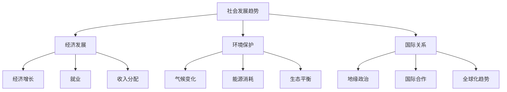

**核心算法原理讲解：**

情景规划在政府政策制定中的应用通常涉及以下步骤：

1. **数据收集**：收集与政策相关的各种数据，包括历史数据、当前数据和专家意见。
2. **情景构建**：根据数据和分析结果，构建多个可能的未来情景。
3. **情景分析**：分析每个情景的可能结果，包括社会、经济和环境等方面的影响。
4. **政策评估**：评估现有政策和潜在政策在每种情景下的效果。
5. **策略制定**：根据情景分析和政策评估结果，制定应对不同情景的政策和行动方案。
6. **决策支持**：为政策制定者提供情景分析、政策评估和策略制定的结果，帮助其做出科学决策。

**伪代码：**

```python
def government_scenario_planning(data, experts):
    # 数据收集
    historical_data = collect_historical_data(data)
    current_data = collect_current_data(data)
    expert_opinions = collect_expert_opinions(experts)
    
    # 情景构建
    scenarios = build_scenarios(historical_data, current_data, expert_opinions)
    
    # 情景分析
    scenario_analyses = analyze_scenarios(scenarios)
    
    # 政策评估
    policy_assessments = assess_policies(scenario_analyses)
    
    # 策略制定
    strategies = define_strategies(policy_assessments)
    
    # 决策支持
    decision_support = provide_decision_support(strategies)
    
    return decision_support
```

**数学模型和数学公式：**

情景规划在政府政策制定中的应用的数学模型通常涉及概率模型和决策理论。以下是一个简化的概率模型：

$$
P(S_i) = \frac{f(S_i)}{F}
$$

其中，$P(S_i)$是情景$i$的概率，$f(S_i)$是情景$i$的得分，$F$是所有情景的得分之和。

```latex
P(S_i) = \frac{f(S_i)}{F}
```

**举例说明：**

假设我们分析未来5年的经济政策情景，构建了三个情景：经济增长、经济稳定和经济衰退。根据经济数据和专家意见，每个情景的概率如下：

- 经济增长：概率0.4
- 经济稳定：概率0.4
- 经济衰退：概率0.2

使用决策理论，我们可以为每个情景制定相应的政策：

- 经济增长：增加公共投资，促进经济增长。
- 经济稳定：保持现有政策，维持经济稳定。
- 经济衰退：采取紧急措施，刺激经济增长。

**情景分析案例：**

**案例一：经济增长情景**

- **社会影响**：就业率提高，收入水平增加，社会福利改善。
- **环境影响**：能源消耗增加，环境污染加剧，生态平衡受到影响。
- **国际影响**：国际贸易增加，国际竞争力提高，国际合作加强。

**案例二：经济稳定情景**

- **社会影响**：就业率稳定，收入水平保持稳定，社会福利稳定。
- **环境影响**：能源消耗稳定，环境污染得到控制，生态平衡得到维护。
- **国际影响**：国际贸易稳定，国际竞争力保持稳定，国际合作稳定。

**案例三：经济衰退情景**

- **社会影响**：就业率下降，收入水平下降，社会福利受到影响。
- **环境影响**：能源消耗减少，环境污染减轻，生态平衡得到改善。
- **国际影响**：国际贸易减少，国际竞争力下降，国际合作受到影响。

**总结：**

情景规划在政府政策制定中的应用有助于政府更好地预测未来变化，评估现有政策和潜在政策的效果，制定应对不同情景的政策和行动方案。通过情景规划，政府可以更科学地制定政策，提高政策的有效性和可持续性。

---

### 第二部分：情景规划方法

#### 第4章：情景规划的具体应用

##### 4.3 情景规划在个人生活中的应用

情景规划不仅适用于企业和政府，还可以应用于个人生活，帮助个人应对未来的不确定性和变化。通过构建不同的生活情景，个人可以更好地规划自己的职业发展、财务管理、家庭生活等方面。

**核心概念与联系：**

情景规划在个人生活中的应用涉及以下核心概念：

- **职业发展**：包括工作机会、职业技能和职业规划等。
- **财务管理**：包括收入来源、支出管理和投资策略等。
- **家庭生活**：包括家庭结构、家庭关系和家庭责任等。
- **健康维护**：包括健康习惯、医疗保健和健康管理等。

**Mermaid流程图：**

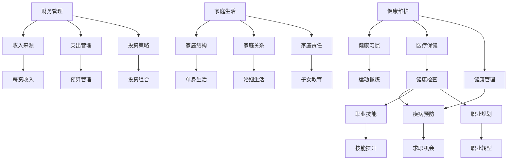

**核心算法原理讲解：**

情景规划在个人生活中的应用通常涉及以下步骤：

1. **个人情况分析**：收集和分析个人的职业、财务、家庭和健康等方面的数据。
2. **情景构建**：根据个人情况分析，构建多个可能的未来生活情景。
3. **情景分析**：分析每个情景的可能结果，包括职业发展、财务状况、家庭生活质量和健康状况等。
4. **策略制定**：根据情景分析结果，制定应对不同情景的策略和行动方案。
5. **决策支持**：为个人提供情景分析、策略制定和行动指南，帮助其做出科学决策。

**伪代码：**

```python
def personal_scenario_planning(data, goals):
    # 个人情况分析
    personal_situation = analyze_personal_situation(data)
    
    # 情景构建
    scenarios = build_scenarios(personal_situation)
    
    # 情景分析
    scenario_analyses = analyze_scenarios(scenarios)
    
    # 策略制定
    strategies = define_strategies(scenario_analyses)
    
    # 决策支持
    decision_support = provide_decision_support(strategies)
    
    return decision_support
```

**数学模型和数学公式：**

情景规划在个人生活中的应用的数学模型通常涉及概率模型和决策理论。以下是一个简化的概率模型：

$$
P(S_i) = \frac{f(S_i)}{F}
$$

其中，$P(S_i)$是情景$i$的概率，$f(S_i)$是情景$i$的得分，$F$是所有情景的得分之和。

```latex
P(S_i) = \frac{f(S_i)}{F}
```

**举例说明：**

假设我们分析未来5年的个人职业发展情景，构建了三个情景：快速晋升、稳定发展和职业瓶颈。根据个人情况和职业趋势，每个情景的概率如下：

- 快速晋升：概率0.4
- 稳定发展：概率0.4
- 职业瓶颈：概率0.2

使用决策理论，我们可以为每个情景制定相应的职业规划策略：

- 快速晋升：积极参加培训，提升专业技能。
- 稳定发展：保持现有工作，逐步提升职位。
- 职业瓶颈：考虑职业转型，寻找新的发展机会。

**情景分析案例：**

**案例一：快速晋升情景**

- **职业机会**：行业需求增加，公司提供晋升机会。
- **技能要求**：需要具备较强的专业技能和管理能力。
- **工作压力**：需要承担更多责任，工作压力较大。

**案例二：稳定发展情景**

- **职业机会**：行业需求稳定，公司提供稳定的工作环境。
- **技能要求**：需要不断提升技能，适应行业变化。
- **工作压力**：工作相对稳定，压力适中。

**案例三：职业瓶颈情景**

- **职业机会**：行业需求减少，公司提供的工作机会有限。
- **技能要求**：需要考虑转型，适应新的职业领域。
- **工作压力**：工作机会有限，可能面临职业困境。

**总结：**

情景规划在个人生活中的应用有助于个人更好地理解未来的不确定性，制定应对策略，提高生活的质量和幸福感。通过情景规划，个人可以更科学地规划职业发展、财务管理、家庭生活和健康维护，实现个人目标。

---

### 第三部分：反脆弱规划方法

#### 第6章：反脆弱规划的基本概念

##### 6.1 反脆弱规划的起源与发展

反脆弱规划是一种新兴的规划方法，它起源于对系统韧性的关注。传统规划方法主要侧重于风险管理和风险控制，而反脆弱规划则强调在不确定性和压力下如何增强系统的韧性和适应性。

**定义：**

反脆弱规划是指通过设计和实施一系列策略和措施，使系统在不确定性和压力下能够保持稳定、适应和成长。

**起源与发展：**

反脆弱规划的概念最早由作家和思想家纳西姆·尼古拉斯·塔勒布（Nassim Nicholas Taleb）在其著作《黑天鹅：如何应对不可预知的未来》中提出。塔勒布提出了“反脆弱性”（Antifragility）的概念，认为某些系统不仅能够承受压力，而且在压力下能够变得更加坚强和适应。

随着对复杂系统和不确定性的深入研究，反脆弱规划逐渐发展成为一种独立的规划方法。该方法在金融、工程、医疗和社会等多个领域得到了广泛应用。

**核心概念与联系：**

反脆弱规划涉及多个核心概念，包括：

- **韧性**：系统在面对外部压力和变化时能够保持稳定和正常运行的能力。
- **脆弱性**：系统在面对外部压力和变化时容易受到破坏或失效的能力。
- **反脆弱性**：系统在面对外部压力和变化时不仅能够保持稳定，还能够适应和成长的能力。
- **抗冲击性**：系统在面对突发事件或极端情况时能够迅速恢复的能力。

**Mermaid流程图：**

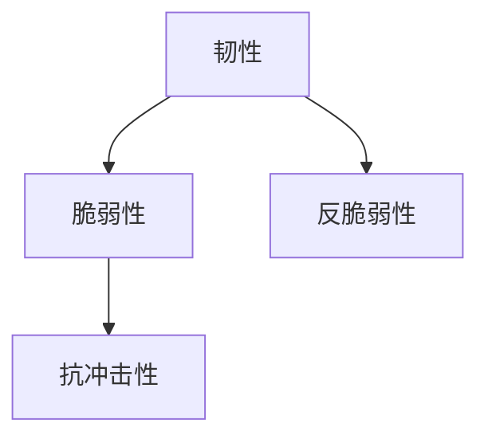

**核心算法原理讲解：**

反脆弱规划的算法原理通常涉及以下步骤：

1. **系统分析**：对系统的结构、功能和影响因素进行全面分析。
2. **脆弱性识别**：识别系统中的潜在脆弱点，包括技术、人员和流程等方面。
3. **抗脆弱性设计**：通过改进设计、引入冗余和增强灵活性等措施，提高系统的抗脆弱性。
4. **模拟测试**：通过模拟和测试，评估系统的抗脆弱性，识别潜在的风险和改进点。
5. **实施和监控**：实施抗脆弱性措施，并持续监控系统的运行状态，及时调整和优化。

**伪代码：**

```python
def resilience_planning(system):
    # 系统分析
    system_analysis = analyze_system(system)
    
    # 脆弱性识别
    vulnerabilities = identify_vulnerabilities(system_analysis)
    
    # 抗脆弱性设计
    resilience_design = design_resilience(vulnerabilities)
    
    # 模拟测试
    simulation_results = simulate_system(resilience_design)
    
    # 实施和监控
    implement_and_monitor(resilience_design, simulation_results)
    
    return resilience_design
```

**数学模型和数学公式：**

反脆弱规划的数学模型通常涉及概率模型和风险管理。以下是一个简化的概率模型：

$$
R = \int_{t_1}^{t_2} f(t) \cdot dt
$$

其中，$R$是系统的韧性，$f(t)$是系统的恢复力函数，$t_1$和$t_2$是时间间隔。

```latex
R = \int_{t_1}^{t_2} f(t) \cdot dt
```

**举例说明：**

假设我们分析一个城市的应急响应系统，该系统的韧性可以通过以下指标评估：

- **恢复力函数**：当发生突发事件时，系统在多长时间内能够恢复正常运行。
- **韧性指标**：系统在突发事件发生后的恢复速度和程度。

使用反脆弱规划，我们可以采取以下措施：

1. **设计冗余系统**：在关键设备或流程中引入冗余，以防止单一故障导致整个系统瘫痪。
2. **增强灵活性**：通过培训和演练，提高应急响应人员的灵活性和适应性。
3. **实时监控**：通过监控系统，实时监测系统的运行状态，及时发现问题并采取措施。

**总结：**

反脆弱规划是一种重要的规划方法，它通过增强系统的韧性和适应性，帮助系统在面对不确定性和压力时保持稳定和持续发展。反脆弱规划的起源与发展表明，在面对复杂和不确定的未来，我们需要更加注重系统的韧性和适应性。

---

### 第三部分：反脆弱规划方法

#### 第6章：反脆弱规划的基本概念

##### 6.2 反脆弱规划的核心理念

反脆弱规划的核心在于如何使系统在面对不确定性和压力时不仅能够保持稳定，还能够适应和成长。这一理念源于对韧性的深入理解，并进一步拓展到反脆弱性的概念。

**韧性（Resilience）**：韧性是指系统在面对外部压力和变化时能够保持稳定和正常运行的能力。一个韧性的系统不仅能够在压力下生存，还能够迅速恢复和调整。

**脆弱性（Vulnerability）**：与韧性相对，脆弱性是指系统在面对外部压力和变化时容易受到破坏或失效的能力。脆弱的系统在压力下容易崩溃，无法恢复。

**反脆弱性（Antifragility）**：反脆弱性是韧性的一种高级形式，它不仅能够承受压力，而且在压力下能够变得更加坚强和适应。反脆弱系统在面对外部变化时不仅能够适应，还能够从中学习和成长。

**核心概念与联系：**

反脆弱规划的核心理念与以下概念密切相关：

- **适应性（Adaptability）**：反脆弱性强调系统在面对不确定性和变化时的适应性，这意味着系统能够灵活调整和优化。
- **学习（Learning）**：反脆弱规划认为，通过面对压力和变化，系统能够学习和改进，从而增强其反脆弱性。
- **冗余（Redundancy）**：为了增强系统的反脆弱性，通常需要引入冗余设计，确保在关键部分出现故障时系统能够继续运行。
- **多样性（Diversity）**：多样性是增强系统反脆弱性的重要手段，通过引入多样性，系统可以更好地适应不同的变化和挑战。

**Mermaid流程图：**

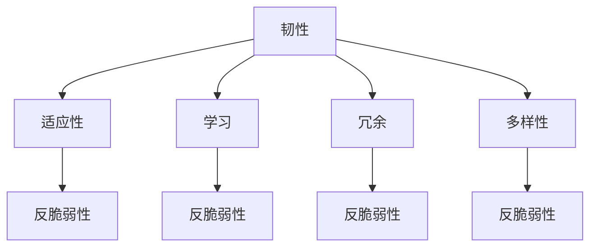

**核心算法原理讲解：**

反脆弱规划的算法原理通常涉及以下步骤：

1. **系统评估**：对系统的当前状态进行评估，包括其结构、功能和抗压力能力。
2. **脆弱性分析**：识别系统中存在的脆弱点，分析这些脆弱点可能导致的问题和风险。
3. **反脆弱设计**：通过改进设计、引入冗余和增加多样性等措施，增强系统的反脆弱性。
4. **模拟测试**：通过模拟和测试，验证系统的反脆弱性，确保其在面对压力和变化时能够保持稳定。
5. **实施和监控**：将反脆弱设计付诸实施，并持续监控系统的运行状态，及时调整和优化。

**伪代码：**

```python
def antifragile_design(system):
    # 系统评估
    system_status = assess_system(system)
    
    # 脆弱性分析
    vulnerabilities = analyze_vulnerabilities(system_status)
    
    # 反脆弱设计
    resilience_design = design_anti_fragile(vulnerabilities)
    
    # 模拟测试
    simulation_results = test_system(resilience_design)
    
    # 实施和监控
    implement_and_monitor(resilience_design, simulation_results)
    
    return resilience_design
```

**数学模型和数学公式：**

反脆弱规划的数学模型通常涉及概率模型和风险管理。以下是一个简化的概率模型：

$$
R = \int_{t_1}^{t_2} f(t) \cdot dt
$$

其中，$R$是系统的韧性，$f(t)$是系统的恢复力函数，$t_1$和$t_2$是时间间隔。

```latex
R = \int_{t_1}^{t_2} f(t) \cdot dt
```

**举例说明：**

假设我们分析一个金融系统的反脆弱性，该系统在面对市场波动时需要保持稳定。以下是一些增强系统反脆弱性的措施：

1. **冗余设计**：在关键部分引入冗余，如备份服务器和交易系统，确保在部分系统出现故障时整体系统能够继续运行。
2. **多样化投资**：通过投资于不同的资产和行业，降低市场波动对整体投资组合的影响。
3. **风险管理**：使用高级风险管理工具，如期权和期货，对冲潜在的损失。
4. **监控和预警**：建立实时监控系统，及时识别市场变化和潜在风险，采取预防措施。

**总结：**

反脆弱规划的核心理念在于通过增强系统的韧性和适应性，使其在面对不确定性和压力时能够保持稳定和持续发展。通过系统评估、脆弱性分析、反脆弱设计和模拟测试，我们可以构建一个具有反脆弱性的系统，更好地应对未来的挑战。

---

### 第三部分：反脆弱规划方法

#### 第6章：反脆弱规划的基本概念

##### 6.3 反脆弱规划的特点与应用

反脆弱规划作为一种新兴的规划方法，具有独特的特点和应用场景。了解其特点和应用可以帮助我们更好地理解和实施反脆弱规划。

**特点：**

1. **适应性**：反脆弱规划强调系统在面对不确定性和变化时的适应性。通过灵活的设计和多样化的措施，系统可以更好地适应各种变化。
2. **学习性**：反脆弱规划认为系统在压力和变化中能够学习和成长。通过不断优化和改进，系统可以增强其反脆弱性。
3. **冗余性**：反脆弱规划通常涉及冗余设计，通过引入冗余系统或冗余组件，系统在关键部分出现故障时能够保持运行。
4. **多样性**：反脆弱规划强调多样性的重要性，通过引入多样性，系统可以更好地抵御不同类型的风险和挑战。
5. **抗冲击性**：反脆弱规划旨在提高系统在面对突发事件或极端情况时的抗冲击能力，确保系统能够迅速恢复。

**应用场景：**

1. **金融领域**：在金融市场波动较大的情况下，金融机构可以通过反脆弱规划降低风险，确保资本充足和业务稳定。
2. **工程技术**：在工程设计中，通过引入冗余设计和多样性，可以提高系统的可靠性和安全性。
3. **医疗健康**：医疗系统可以通过反脆弱规划提高应对突发公共卫生事件的能力，确保医疗服务的连续性和稳定性。
4. **环境保护**：在环境保护领域，通过反脆弱规划，可以增强生态系统对环境变化的适应能力，保护生物多样性。
5. **社会管理**：在社会管理中，通过反脆弱规划，可以增强城市和社区在面对自然灾害和社会动荡时的适应能力。

**Mermaid流程图：**

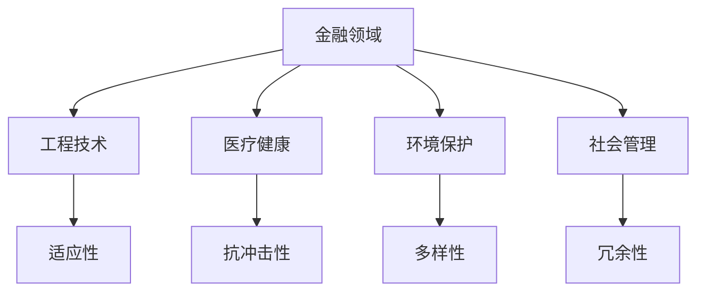

**核心算法原理讲解：**

反脆弱规划的核心算法原理通常涉及以下步骤：

1. **系统评估**：对系统的当前状态进行详细评估，包括其结构、功能和抗压力能力。
2. **脆弱性识别**：识别系统中的潜在脆弱点，分析这些脆弱点可能导致的问题和风险。
3. **反脆弱设计**：通过改进设计、引入冗余和增加多样性等措施，增强系统的反脆弱性。
4. **模拟测试**：通过模拟和测试，验证系统的反脆弱性，确保其在面对压力和变化时能够保持稳定。
5. **实施和监控**：将反脆弱设计付诸实施，并持续监控系统的运行状态，及时调整和优化。

**伪代码：**

```python
def antifragile_planning(system):
    # 系统评估
    system_status = assess_system_status(system)
    
    # 脆弱性识别
    vulnerabilities = identify_vulnerabilities(system_status)
    
    # 反脆弱设计
    resilience_design = design_anti_fragile(vulnerabilities)
    
    # 模拟测试
    simulation_results = test_system(resilience_design)
    
    # 实施和监控
    implement_and_monitor(resilience_design, simulation_results)
    
    return resilience_design
```

**数学模型和数学公式：**

反脆弱规划的数学模型通常涉及概率模型和风险管理。以下是一个简化的概率模型：

$$
R = \int_{t_1}^{t_2} f(t) \cdot dt
$$

其中，$R$是系统的韧性，$f(t)$是系统的恢复力函数，$t_1$和$t_2$是时间间隔。

```latex
R = \int_{t_1}^{t_2} f(t) \cdot dt
```

**举例说明：**

假设我们分析一个电力系统的反脆弱性，以下是一些增强系统反脆弱性的措施：

1. **冗余设计**：在关键部分引入冗余，如备用发电机和备用输电线路，确保在部分系统出现故障时整体电力供应不会中断。
2. **分布式能源**：通过引入分布式能源系统，如太阳能和风能，降低对单一能源来源的依赖，提高系统的稳定性。
3. **智能化监控**：使用先进的监控技术和人工智能，实时监测电力系统的运行状态，及时发现和处理潜在问题。
4. **应急预案**：制定详细的应急预案，确保在发生突发事件时，系统能够迅速响应和恢复。

**总结：**

反脆弱规划具有适应性、学习性、冗余性、多样性和抗冲击性等特点，广泛应用于金融、工程、医疗、环境保护和社会管理等领域。通过系统评估、脆弱性识别、反脆弱设计、模拟测试和实施监控，我们可以构建一个具有反脆弱性的系统，更好地应对未来的挑战。

---

### 第三部分：反脆弱规划方法

#### 第7章：反脆弱规划的具体策略

##### 7.1 反脆弱规划的策略分析

反脆弱规划的成功实施需要一系列具体策略和方法。这些策略旨在提高系统的适应性、学习性和抗冲击性，从而增强其反脆弱性。以下是一些关键策略：

**策略一：引入冗余**

冗余是增强系统反脆弱性的重要手段。通过引入冗余设计，系统可以在关键部分出现故障时保持运行。具体措施包括：

- **硬件冗余**：在关键设备或组件中引入备份，如备用服务器、备用发电机等。
- **软件冗余**：在软件系统中引入冗余算法，如冗余计算和冗余存储等。
- **流程冗余**：在关键流程中引入冗余步骤，确保在某个步骤出现问题时，系统能够自动切换到备用流程。

**策略二：增加多样性**

多样性是提高系统适应性和抗冲击性的关键。通过引入多样性，系统可以更好地抵御不同类型的风险和挑战。具体措施包括：

- **技术多样性**：引入多种技术或方法，确保在某种技术失效时，系统能够依赖其他技术。
- **数据多样性**：收集和处理来自不同来源和不同类型的数据，提高系统的预测能力和决策质量。
- **人员多样性**：引入具有不同背景和技能的员工，提高团队的创新能力和问题解决能力。

**策略三：优化风险管理**

有效的风险管理是增强系统反脆弱性的重要一环。通过优化风险管理，系统可以在面对不确定性时保持稳定。具体措施包括：

- **风险识别**：识别系统中潜在的风险和脆弱点，制定针对性的风险管理策略。
- **风险评估**：对每个风险进行评估，确定其可能的影响和发生的概率。
- **风险应对**：制定应对不同风险的具体措施，包括预防措施和应急措施。

**策略四：培养学习文化**

学习文化是提高系统适应性和学习性的关键。通过培养学习文化，系统能够在不断面对挑战和压力中不断学习和成长。具体措施包括：

- **持续学习**：鼓励员工持续学习和提升技能，保持团队的竞争力。
- **知识共享**：建立知识共享平台，促进员工之间的知识交流和创新。
- **反馈机制**：建立有效的反馈机制，及时收集和处理员工和用户的反馈，改进系统和流程。

**策略五：实施应急预案**

应急预案是确保系统在面对突发事件时能够迅速恢复的重要措施。通过实施应急预案，系统可以在最短时间内恢复正常运行。具体措施包括：

- **应急预案制定**：制定详细的应急预案，明确应急响应流程和责任人。
- **应急演练**：定期进行应急演练，检验应急预案的有效性，确保应急响应人员的熟练程度。
- **资源准备**：提前准备必要的应急资源，如备用设备、应急资金等，确保在紧急情况下能够迅速投入使用。

**总结：**

反脆弱规划的具体策略包括引入冗余、增加多样性、优化风险管理、培养学习文化和实施应急预案等。通过这些策略，系统可以在面对不确定性和压力时保持稳定、适应和成长，从而增强其反脆弱性。

---

### 第三部分：反脆弱规划方法

#### 第7章：反脆弱规划的具体策略

##### 7.2 反脆弱规划的工具与方法

实施反脆弱规划需要一系列工具和方法，这些工具和方法可以帮助我们系统地评估系统的脆弱性、设计反脆弱性措施，并实施和监控反脆弱规划的有效性。以下是一些关键的工具和方法：

**工具一：风险评估工具**

风险评估工具是评估系统脆弱性的重要工具。通过使用风险评估工具，我们可以识别系统中的潜在风险，并评估其可能的影响和发生的概率。常用的风险评估工具包括：

- **风险矩阵**：使用风险矩阵可以帮助我们识别风险，并评估其严重性和发生概率，从而确定优先级。
- **故障模式与影响分析（FMEA）**：FMEA是一种系统化的方法，用于识别系统中的潜在故障模式，并评估其影响和发生概率，以便采取相应的预防措施。
- **蒙特卡罗模拟**：蒙特卡罗模拟是一种概率模型，用于模拟系统在不同情景下的行为，评估系统的脆弱性和抗冲击性。

**方法一：情景模拟**

情景模拟是一种通过构建不同的未来情景，分析系统在不同情景下的表现和脆弱性的方法。情景模拟通常涉及以下步骤：

1. **情景构建**：根据系统的特点和历史数据，构建多个可能的未来情景。
2. **情景分析**：分析每个情景的可能结果，包括系统的性能、稳定性和抗冲击性。
3. **情景评估**：评估每个情景的风险和机会，确定系统的脆弱点。
4. **情景优化**：根据情景评估结果，优化系统的设计和操作策略，提高系统的反脆弱性。

**工具二：数据分析和可视化工具**

数据分析和可视化工具可以帮助我们理解和分析系统的运行状态，识别潜在的风险和脆弱点。常用的数据分析和可视化工具包括：

- **数据挖掘工具**：如Python的Pandas库、R语言等，用于分析和处理大量数据。
- **数据可视化工具**：如Tableau、Power BI等，用于将数据可视化，帮助决策者更直观地理解数据。
- **时间序列分析工具**：如Python的Statsmodels库、R语言的forecast包等，用于分析时间序列数据，预测未来的趋势和变化。

**方法二：风险管理框架**

风险管理框架是一种系统化的方法，用于识别、评估和应对系统中的风险。一个典型的风险管理框架通常包括以下步骤：

1. **风险识别**：识别系统中的潜在风险，包括外部风险和内部风险。
2. **风险评估**：评估每个风险的可能性和影响，确定风险的优先级。
3. **风险应对**：制定应对不同风险的策略和措施，包括风险规避、风险转移、风险减轻和风险接受。
4. **风险监控**：持续监控系统的运行状态，及时识别和处理新的风险。

**工具三：应急预案和演练工具**

应急预案和演练工具是确保系统在面对突发事件时能够迅速恢复的重要工具。常用的应急预案和演练工具包括：

- **应急预案管理工具**：如微软的SharePoint、OpenText的ECM系统等，用于管理和跟踪应急预案的制定和执行。
- **演练工具**：如演练模拟器、虚拟现实技术等，用于模拟突发事件，检验应急预案的有效性。
- **应急响应工具**：如即时通讯工具、远程控制工具等，用于在紧急情况下快速响应和处理突发事件。

**方法三：持续改进和反馈机制**

持续改进和反馈机制是提高系统反脆弱性的关键。通过持续改进和反馈机制，我们可以不断优化系统的设计和操作策略，提高系统的稳定性和抗冲击性。具体措施包括：

1. **定期评估**：定期评估系统的运行状态和反脆弱性，识别潜在的问题和改进点。
2. **反馈机制**：建立有效的反馈机制，及时收集和处理用户和员工的反馈，改进系统和流程。
3. **改进计划**：根据评估结果和反馈，制定改进计划，实施改进措施，持续优化系统的反脆弱性。

**总结：**

反脆弱规划的工具和方法包括风险评估工具、情景模拟工具、数据分析和可视化工具、应急预案和演练工具，以及持续改进和反馈机制。通过这些工具和方法，我们可以系统地评估系统的脆弱性、设计反脆弱性措施，并实施和监控反脆弱规划的有效性，从而提高系统的抗风险能力和稳定性。

---

### 第三部分：反脆弱规划方法

#### 第7章：反脆弱规划的具体策略

##### 7.3 反脆弱规划的实施步骤

反脆弱规划的实施是一个系统化的过程，涉及多个步骤，包括规划、设计、实施、监控和调整。以下详细描述了反脆弱规划的实施步骤：

**步骤一：规划阶段**

在规划阶段，我们需要确定反脆弱规划的目标和范围。具体步骤包括：

1. **目标设定**：明确反脆弱规划的目标，如提高系统的韧性、增强抗冲击能力等。
2. **范围界定**：确定反脆弱规划的应用范围，包括系统、组织或整个项目。
3. **资源分配**：根据目标和范围，分配必要的资源和预算，确保规划阶段顺利进行。

**步骤二：设计阶段**

设计阶段是反脆弱规划的核心，涉及以下步骤：

1. **系统评估**：对当前系统的状态进行详细评估，包括其结构、功能和抗压力能力。
2. **脆弱性识别**：识别系统中的潜在脆弱点，分析这些脆弱点可能导致的问题和风险。
3. **反脆弱性设计**：根据脆弱性分析结果，设计反脆弱性措施，如引入冗余、增加多样性和优化风险管理等。
4. **方案选择**：从多个反脆弱性方案中选择最优方案，确保方案的有效性和可实施性。

**步骤三：实施阶段**

实施阶段是将反脆弱性设计方案付诸实践的过程。具体步骤包括：

1. **资源准备**：准备实施所需的资源，如设备、人力和资金等。
2. **项目启动**：正式启动反脆弱规划项目，明确项目团队的角色和职责。
3. **实施计划**：制定详细的实施计划，包括实施步骤、时间表和里程碑。
4. **方案实施**：按照实施计划，逐步实施反脆弱性措施，确保方案的有效实施。

**步骤四：监控阶段**

监控阶段是确保反脆弱规划有效运行的关键。具体步骤包括：

1. **实时监控**：建立实时监控系统，实时监测系统的运行状态，及时发现和处理问题。
2. **绩效评估**：定期评估系统的反脆弱性能，包括韧性和抗冲击能力等。
3. **反馈机制**：建立有效的反馈机制，收集用户和员工的反馈，改进系统的设计和操作。
4. **报告生成**：定期生成反脆弱规划报告，总结系统的运行情况和改进点。

**步骤五：调整阶段**

调整阶段是优化反脆弱规划的关键。具体步骤包括：

1. **问题识别**：根据监控和评估结果，识别系统中的问题和不足之处。
2. **改进措施**：制定改进措施，优化系统的设计和操作策略。
3. **方案优化**：根据改进措施，优化反脆弱性方案，提高系统的反脆弱性能。
4. **再实施**：根据优化后的方案，重新实施反脆弱性措施，确保系统的稳定性和抗冲击能力。

**总结：**

反脆弱规划的实施是一个系统化的过程，包括规划阶段、设计阶段、实施阶段、监控阶段和调整阶段。通过这些步骤，我们可以确保反脆弱规划的顺利实施，提高系统的韧性和抗冲击能力。

---

### 第三部分：反脆弱规划方法

#### 第8章：反脆弱规划的案例分析

##### 8.1 案例一：金融领域的反脆弱规划

在金融领域，反脆弱规划的重要性尤为突出。金融机构需要应对市场波动、政策变化和科技风险等多种不确定性因素。以下是一个金融领域反脆弱规划的案例分析。

**案例背景：**

某大型银行在面临市场波动和科技风险的双重压力下，决定实施反脆弱规划，以提高其韧性和抗冲击能力。

**案例分析：**

1. **系统评估**：银行对现有的业务流程、技术系统和风险管理策略进行了全面评估，识别出潜在的风险点和脆弱性。

2. **脆弱性识别**：通过分析，银行发现其风险管理系统存在以下脆弱点：
   - 数据存储和备份不够冗余
   - 交易系统的并发处理能力不足
   - 风险评估模型过于依赖历史数据
   - 网络安全措施不够完善

3. **反脆弱设计**：
   - **数据冗余**：引入分布式数据库系统，确保数据备份的冗余和安全性。
   - **系统升级**：升级交易系统，提高并发处理能力和系统稳定性。
   - **风险评估**：引入机器学习算法，结合实时数据和历史数据，优化风险评估模型。
   - **网络安全**：加强网络安全措施，包括防火墙、入侵检测系统和加密技术等。

4. **方案选择**：银行从多个反脆弱性方案中选择最优方案，确保方案的有效性和可实施性。

5. **方案实施**：
   - **资源准备**：银行准备了充足的资源，包括资金、设备和人力资源。
   - **项目启动**：银行启动了反脆弱规划项目，明确项目团队的角色和职责。
   - **实施计划**：银行制定了详细的实施计划，包括实施步骤、时间表和里程碑。
   - **方案实施**：银行逐步实施反脆弱性措施，确保方案的有效实施。

6. **监控和评估**：
   - **实时监控**：银行建立了实时监控系统，实时监测系统的运行状态，及时发现和处理问题。
   - **绩效评估**：银行定期评估系统的反脆弱性能，包括韧性和抗冲击能力等。
   - **反馈机制**：银行建立了有效的反馈机制，收集用户和员工的反馈，改进系统的设计和操作。

7. **调整和优化**：
   - **问题识别**：银行根据监控和评估结果，识别系统中的问题和不足之处。
   - **改进措施**：银行制定了改进措施，优化系统的设计和操作策略。
   - **方案优化**：银行根据改进措施，优化反脆弱性方案，提高系统的反脆弱性能。
   - **再实施**：银行根据优化后的方案，重新实施反脆弱性措施，确保系统的稳定性和抗冲击能力。

**总结：**

通过实施反脆弱规划，该银行显著提高了其韧性和抗冲击能力。数据冗余、系统升级、风险评估优化和网络安全措施的实施，使银行能够更好地应对市场波动和科技风险。监控和评估机制的建立，确保了反脆弱规划的有效实施，为银行的长远发展提供了有力保障。

---

### 第三部分：反脆弱规划方法

#### 第8章：反脆弱规划的案例分析

##### 8.2 案例二：教育领域的反脆弱规划

教育领域同样面临着诸多不确定性因素，包括政策变化、科技发展和社会变迁等。以下是一个教育领域反脆弱规划的案例分析。

**案例背景：**

某知名大学在面临教育资源分配不均、教学质量和学生就业压力等挑战时，决定实施反脆弱规划，以提高其适应性和抗冲击能力。

**案例分析：**

1. **系统评估**：大学对其现有的教育资源分配、教学体系和学生培养模式进行了全面评估，识别出潜在的风险点和脆弱性。

2. **脆弱性识别**：通过分析，大学发现其教育体系存在以下脆弱点：
   - 教育资源分配不均，导致部分学生享受不到优质教育资源
   - 教学质量参差不齐，部分教师的教学方法和知识更新不及时
   - 学生就业指导不足，毕业生在就业市场上面临较大压力
   - 学生心理健康问题突出，缺乏有效的心理辅导和支持

3. **反脆弱设计**：
   - **教育资源均衡分配**：通过引入教育资源均衡分配机制，确保每位学生都能享受到优质教育资源。
   - **教学质量提升**：加强教师培训，推广教学方法创新，提高教学质量。
   - **就业指导强化**：加强就业指导服务，提供职业规划培训，帮助学生提高就业竞争力。
   - **心理健康支持**：建立完善的心理健康支持体系，提供心理辅导和支持，帮助学生应对压力和挑战

4. **方案选择**：大学从多个反脆弱性方案中选择最优方案，确保方案的有效性和可实施性。

5. **方案实施**：
   - **资源准备**：大学准备了充足的资源，包括资金、设备和人力资源。
   - **项目启动**：大学启动了反脆弱规划项目，明确项目团队的角色和职责。
   - **实施计划**：大学制定了详细的实施计划，包括实施步骤、时间表和里程碑。
   - **方案实施**：大学逐步实施反脆弱性措施，确保方案的有效实施。

6. **监控和评估**：
   - **实时监控**：大学建立了实时监控系统，实时监测教育资源的分配、教学质量和学生就业情况。
   - **绩效评估**：大学定期评估系统的反脆弱性能，包括教育资源的均衡度、教学质量和学生就业情况等。
   - **反馈机制**：大学建立了有效的反馈机制，收集学生、教师和家长的意见和建议，改进教育资源和教学质量。

7. **调整和优化**：
   - **问题识别**：大学根据监控和评估结果，识别系统中存在

