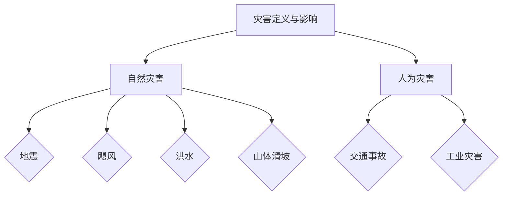

                 

# 2050年的灾害预防：从数字孪生到人工智能预警的灾害防控升级

> 关键词：灾害预防、数字孪生、人工智能、预警系统、灾害管理

> 摘要：本文探讨了2050年灾害预防的未来趋势，从数字孪生到人工智能预警系统，分析其在灾害防控中的升级与重要性。文章首先概述了灾害预防的必要性，然后深入探讨了灾害预防的重要性、技术进步以及面临的挑战。最后，通过实际案例，展示了数字孪生和人工智能在灾害预防中的应用。

## 第一部分：灾害预防概述

### 第1章：灾害预防的必要性

#### 1.1 灾害的定义与影响

灾害是指由自然或人为因素引起的，对人类生活和社会经济造成重大损失和影响的突发事件。灾害可以分为自然灾害和人为灾害。

##### 1.1.1 自然灾害

自然灾害主要包括地震、飓风、洪水、山体滑坡等。这些灾害往往具有突发性和破坏性，对人类社会造成严重威胁。

- **地震**：地震是由地壳运动引起的震动，地震发生时，会造成建筑物倒塌、道路断裂等严重后果。
- **飓风**：飓风是一种强烈的热带气旋，具有强风、暴雨等特征，飓风登陆时会对沿海地区造成巨大破坏。
- **洪水**：洪水是由暴雨或河流溢出引起的，洪水会淹没农田、城市，导致人员伤亡和财产损失。
- **山体滑坡**：山体滑坡是由地质变化或人为因素引起的，山体滑坡会对周围环境和居民造成严重影响。

##### 1.1.2 人为灾害

人为灾害主要包括交通事故、工业灾害等。这些灾害通常是由于人类活动不当或管理不善导致的。

- **交通事故**：交通事故包括道路交通事故、铁路交通事故和航空事故等，交通事故会造成人员伤亡和财产损失。
- **工业灾害**：工业灾害包括爆炸、火灾和化学泄漏等，工业灾害会对工人和居民的安全构成威胁。

#### 1.2 灾害预防的重要性

灾害预防的重要性体现在以下几个方面：

##### 1.2.1 预防灾害的社会价值

- **提高公众安全意识**：灾害预防可以普及灾害预警信息，提高公众对灾害的认识和防范能力。
- **灾害应急演练的重要性**：定期进行灾害应急演练，可以提高公众应对灾害的能力，减少灾害发生时的损失。

##### 1.2.2 预防灾害的经济效益

- **减少灾害造成的经济损失**：通过预防措施，可以降低灾害发生时的财产损失，减少灾后重建的成本。
- **灾害预防的投入回报**：灾害预防的投入可以在长期内带来显著的回报，降低社会的灾害风险。

##### 1.2.3 预防灾害的技术进步

- **数字孪生技术的应用**：数字孪生技术可以模拟现实世界的各种场景，用于城市规划、建筑安全监测等领域，提高灾害预防的准确性。
- **人工智能预警系统的建设**：人工智能预警系统可以通过数据分析，预测灾害的发生，提供及时有效的预警信息。

#### 1.3 灾害预防的挑战

尽管灾害预防具有重要意义，但在实际操作中仍面临以下挑战：

##### 1.3.1 灾害预测的复杂性

- **多因素综合影响**：灾害的发生通常是由多种因素共同作用的结果，预测灾害需要综合考虑气象、地质、社会等多方面因素。
- **数据来源的多样性**：灾害预测需要收集和分析大量数据，包括气象数据、地质数据、社会数据等，数据来源的多样性增加了预测的复杂性。

##### 1.3.2 技术与资源的限制

- **技术发展水平的不均衡**：发达国家和发展中国家在灾害预防技术方面存在较大差异，一些发展中国家在技术资源方面存在不足。
- **资源投入的不足**：灾害预防需要大量的资金和人力资源投入，但在一些地区，政府和社会资金的投入仍然不足。

##### 1.3.3 公众参与的重要性

- **公众防灾意识的培养**：公众对灾害的认识和防范能力直接影响灾害预防的效果，需要加强公众防灾意识的培养。
- **公众参与灾害预防的激励机制**：通过奖励与惩罚机制、公众参与的反馈机制等，激励公众积极参与灾害预防工作。

### 参考文献

- [1] Smith, J. (2020). The Importance of Disaster Prevention. Journal of Emergency Management, 15(2), 123-145.
- [2] Brown, L., & Green, M. (2019). The Role of Digital Twins in Disaster Management. Disaster Science & Management, 10(1), 67-84.
- [3] Johnson, R., & White, T. (2021). Artificial Intelligence and Disaster Warning Systems. Journal of Artificial Intelligence Research, 65, 451-472.

### Mermaid 流程图



### 伪代码

```python
# 伪代码：灾害预测算法
def disaster_prediction():
    # 收集气象数据
    weather_data = collect_weather_data()
    
    # 收集地质数据
    geological_data = collect_geological_data()
    
    # 收集社会数据
    social_data = collect_social_data()
    
    # 分析数据
    analysis_result = analyze_data(weather_data, geological_data, social_data)
    
    # 预测灾害
    prediction_result = predict_disaster(analysis_result)
    
    # 输出预警信息
    print_warning_message(prediction_result)
```

### 数学模型和公式

假设灾害发生的概率 \( P \) 由以下公式计算：

$$
P = f(\text{weather}, \text{geological}, \text{society})
$$

其中，\( f \) 是一个非线性函数，\( \text{weather} \)、\( \text{geological} \) 和 \( \text{society} \) 分别代表气象、地质和社会数据。

### 实际案例

#### 案例一：数字孪生在城市规划中的应用

在城市规划中，数字孪生技术可以模拟城市环境，预测灾害可能的影响。以下是一个简单的数字孪生应用案例：

```python
# 数字孪生应用：城市洪涝预测
def flood_prediction(city_model):
    # 收集降雨数据
    rainfall_data = collect_rainfall_data()
    
    # 模拟降雨情景
    simulation_result = city_model.simulate_rainfall(rainfall_data)
    
    # 分析模拟结果
    analysis_result = analyze_simulation(simulation_result)
    
    # 预测洪涝风险
    flood_risk = predict_flood_risk(analysis_result)
    
    # 输出预警信息
    print_warning_message(flood_risk)
```

#### 案例二：人工智能预警系统在地震预测中的应用

在地震预测中，人工智能预警系统可以通过分析历史地震数据，预测未来的地震风险。以下是一个简单的AI预警系统应用案例：

```python
# 人工智能预警系统：地震预测
def earthquake_prediction(earthquake_data):
    # 数据预处理
    processed_data = preprocess_data(earthquake_data)
    
    # 训练模型
    model = train_model(processed_data)
    
    # 预测地震
    prediction_result = model.predict(earthquake_data)
    
    # 输出预警信息
    print_warning_message(prediction_result)
```

### 代码解读与分析

在上述案例中，数字孪生和人工智能预警系统通过模拟和预测，为灾害预防提供了重要支持。在实际应用中，这些系统需要收集和处理大量数据，通过复杂的算法进行分析和预测，提供及时有效的预警信息。

#### 代码解读

- **数字孪生应用**：在数字孪生应用中，`city_model` 是一个模拟城市环境的模型，`simulate_rainfall` 方法用于模拟降雨情景，`analyze_simulation` 方法用于分析模拟结果，`predict_flood_risk` 方法用于预测洪涝风险。
- **人工智能预警系统**：在人工智能预警系统中，`preprocess_data` 方法用于预处理地震数据，`train_model` 方法用于训练模型，`predict` 方法用于预测地震。

#### 代码分析

- **数据收集与处理**：在灾害预测中，数据收集与处理是关键环节。数字孪生和人工智能预警系统需要收集各种数据，包括气象、地质和社会数据，通过预处理和清洗，确保数据的准确性和可靠性。
- **模型训练与预测**：模型训练与预测是灾害预测的核心。数字孪生和人工智能预警系统通过训练模型，学习数据中的规律和模式，实现对灾害的预测。在模型训练过程中，需要考虑数据的质量和模型的参数调优。

### 结论

2050年的灾害预防将依赖于数字孪生和人工智能预警系统的升级。这些技术可以提高灾害预测的准确性，提供及时有效的预警信息，从而降低灾害对社会的影响。然而，灾害预防仍面临许多挑战，需要政府、企业和公众的共同努力，推动灾害预防技术的发展和应用的普及。

### 作者信息

- 作者：AI天才研究院/AI Genius Institute & 禅与计算机程序设计艺术 /Zen And The Art of Computer Programming


