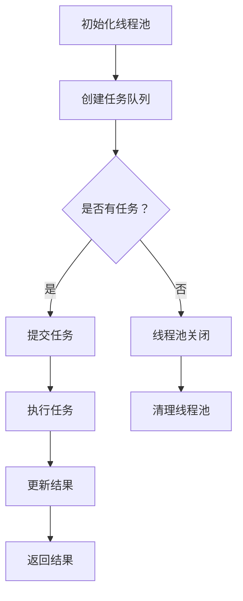
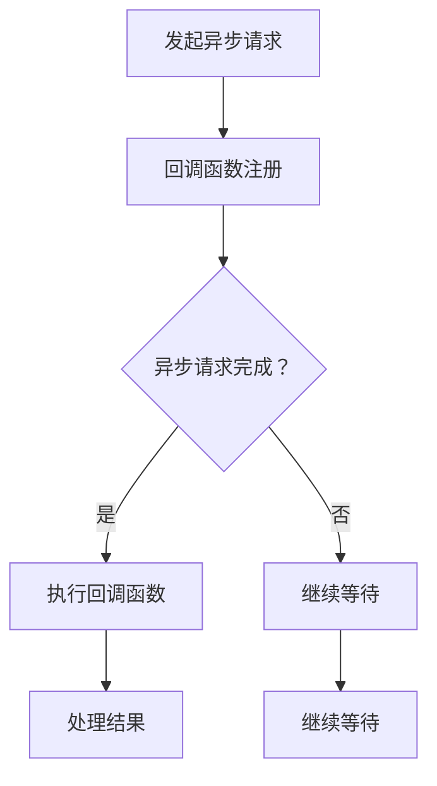

                 

### 文章标题：并发编程：多线程与异步处理

并发编程是现代计算机系统中至关重要的一个领域，它涉及到如何有效地利用多核处理器和并发资源，提高应用程序的性能和响应速度。在当今的计算机架构中，多线程和异步处理已经成为实现并发编程的两种主要方式。本文将深入探讨并发编程的基础知识、多线程编程、同步与锁机制、并发编程框架、并发编程模式、异步编程以及相关的案例分析和高级话题，旨在帮助读者全面理解并发编程的核心概念和实践技巧。

关键词：并发编程、多线程、异步处理、同步与锁、并发编程框架、并发编程模式、内存模型、性能优化、测试与调试

摘要：本文将系统性地介绍并发编程的基础知识、多线程编程、同步与锁机制、并发编程框架、并发编程模式、异步编程以及相关的案例分析。通过详细讲解和实例分析，读者将了解并发编程的核心原理和实践技巧，掌握多线程和异步处理在实际开发中的应用。

### 目录大纲

1. **并发编程基础**
   1.1. 并发与并行
   1.2. 并发编程的挑战
   1.3. 并发编程的好处

2. **多线程编程基础**
   2.1. 多线程概念
   2.2. Java中的多线程
   2.3. C#中的多线程
   2.4. Python中的多线程

3. **同步与锁**
   3.1. 同步原语
   3.2. 锁机制
   3.3. 死锁与避免

4. **并发编程框架**
   4.1. Java并发工具类
   4.2. .NET并发工具类
   4.3. Python并发库

5. **并发编程模式**
   5.1. 生产者-消费者模式
   5.2. 线程池模式
   5.3. Future模式
   5.4. 状态机模式

6. **异步编程**
   6.1. 异步编程概念
   6.2. JavaScript中的异步编程
   6.3. Java中的异步编程
   6.4. .NET中的异步编程

7. **并发编程案例分析**
   7.1. 高性能计算
   7.2. 网络编程
   7.3. 大数据处理
   7.4. 游戏开发

8. **并发编程高级话题**
   8.1. 内存模型与竞态条件
   8.2. 并发编程的性能优化
   8.3. 并发编程的测试与调试
   8.4. 并发编程的最佳实践

9. **附录**
   9.1. 并发编程资源
   9.2. Mermaid流程图

### 并发编程概述

并发编程是一种编程范式，它允许多个任务或线程在同一时间框架内执行。并发编程的核心目的是通过利用多核处理器和其他并发资源，提高应用程序的性能和响应速度。在单核处理器时代，计算机性能的提升主要依赖于处理器时钟频率的提高。然而，随着多核处理器的普及，单核处理器时钟频率的提升变得有限，因此，通过并发编程充分利用多核处理器成为提高应用程序性能的关键。

**并发与并行**

并发与并行是并发编程中两个重要的概念。并行指的是多个任务在同一时刻执行，而并发则指的是多个任务在同一时间段内交替执行。在单核处理器上，并发是通过时间分片和上下文切换实现的。在多核处理器上，并行可以通过分配不同的任务到不同的核心上实现。

- **并发**：多个任务在时间上重叠执行。
- **并行**：多个任务在同一时刻执行。

**并发编程的挑战**

并发编程虽然能够提高性能，但也带来了一系列挑战：

1. **竞态条件**：当多个线程访问共享资源时，如果没有适当的同步机制，可能会导致不可预测的结果。
2. **死锁**：当多个线程因等待其他线程释放资源而永久阻塞时，会发生死锁。
3. **线程安全**：确保多线程环境下的程序行为一致，避免出现竞争条件、死锁等。
4. **性能开销**：线程创建、上下文切换和同步操作都会带来额外的性能开销。

**并发编程的好处**

尽管并发编程存在挑战，但它的好处也是显而易见的：

1. **性能提升**：通过利用多核处理器，可以显著提高计算密集型应用程序的性能。
2. **响应速度**：通过并发处理用户请求，可以提高系统的响应速度和用户体验。
3. **资源共享**：多个线程可以共享资源，如内存、文件和网络连接，提高资源利用率。
4. **灵活性**：并发编程使得应用程序可以更灵活地处理复杂任务和并发场景。

### 并发编程的挑战

并发编程虽然能显著提升应用程序的性能，但同时也带来了一系列复杂的挑战。这些挑战如果不妥善解决，可能会导致程序行为不可预测、性能下降，甚至系统崩溃。以下是并发编程中常见的一些挑战：

**竞态条件**

竞态条件是一种常见的并发问题，它发生在多个线程访问共享资源时，由于没有适当的同步机制，导致程序执行结果不确定。具体来说，当两个或多个线程同时访问并修改同一共享变量时，如果没有同步锁或其他同步原语来保护共享资源，那么最终的结果将取决于线程的执行顺序，这可能会导致数据不一致或错误。

为了更好地理解竞态条件，我们可以考虑以下伪代码示例：

```plaintext
Thread 1:
a = 1
b = a + 1

Thread 2:
a = 2
b = a + 1
```

在这个例子中，如果两个线程同时执行，可能发生以下情况：

- **情况一**：Thread 1首先执行，将`a`设置为1，然后Thread 2执行，将`a`设置为2，最后Thread 1执行，`b`的结果是2。
- **情况二**：Thread 2首先执行，将`a`设置为2，然后Thread 1执行，`b`的结果是2。

显然，第二种情况与我们的预期不符，因为`b`应该是`a`加1的结果，而不是2。

**死锁**

死锁是另一种严重的并发问题，它发生在多个线程互相等待对方持有的资源，导致所有线程都永久阻塞的情况。为了更好地理解死锁，我们可以考虑以下伪代码示例：

```plaintext
Thread 1:
lock(A)
lock(B)

Thread 2:
lock(B)
lock(A)
```

在这个例子中，如果Thread 1首先执行并获取了锁A，然后Thread 2执行并获取了锁B，接下来Thread 1尝试获取锁B，但发现已被Thread 2占用，于是等待。同时，Thread 2尝试获取锁A，但发现已被Thread 1占用，也进入等待状态。由于两个线程都在等待对方释放锁，因此它们将永久阻塞，无法继续执行。

**线程安全**

线程安全是指程序在多线程环境中执行时，仍能保持预期的行为和结果。如果一个程序在多线程环境中执行后，结果与单线程环境不一致，那么这个程序就是非线程安全的。线程安全需要考虑以下几个方面：

1. **共享资源访问**：确保多个线程访问共享资源时，能够保持数据的一致性和完整性。
2. **同步机制**：使用同步原语（如锁、信号量等）来协调线程之间的访问，避免竞态条件。
3. **内存可见性**：确保一个线程对共享变量的修改对其他线程是可见的。

为了更好地理解线程安全，我们可以考虑以下伪代码示例：

```plaintext
class Counter {
    private int count = 0;

    public synchronized void increment() {
        count++;
    }

    public synchronized int getCount() {
        return count;
    }
}
```

在这个例子中，使用`synchronized`关键字保证了`increment`和`getCount`方法的线程安全性。任何试图同时执行这两个方法的线程都将被阻塞，直到当前线程完成操作。

**性能开销**

并发编程虽然能提高性能，但也带来了额外的性能开销：

1. **线程创建和销毁**：创建和销毁线程需要消耗系统资源，尤其是线程栈的分配和回收。
2. **上下文切换**：线程之间切换需要保存和恢复执行上下文，这会带来额外的开销。
3. **同步机制**：同步原语（如锁）虽然能保证线程之间的正确同步，但也会引入额外的性能开销。

为了最大限度地减少性能开销，可以采用以下策略：

1. **线程池**：复用线程，减少线程创建和销毁的开销。
2. **最小化同步**：尽量减少同步的范围和频率，避免不必要的锁竞争。
3. **异步编程**：使用异步编程模型，减少线程阻塞和上下文切换的开销。

### 并发编程的好处

并发编程虽然面临着诸多挑战，但它的好处也是显而易见的。以下是并发编程的主要优点：

**性能提升**

并发编程能够显著提升应用程序的性能，特别是在计算密集型任务和I/O密集型任务中。通过多线程和异步处理，可以充分利用多核处理器和并发资源，提高程序的执行速度和处理能力。

**响应速度**

在多线程环境中，并发处理用户请求可以显著提高系统的响应速度。尤其是在Web应用和服务器端编程中，通过并发处理多个请求，可以降低系统的响应时间，提升用户体验。

**资源共享**

并发编程允许多个线程共享资源，如内存、文件和网络连接。通过合理地分配和利用这些资源，可以提高系统的资源利用率和整体性能。

**灵活性**

并发编程为开发者提供了更灵活的编程模型，可以更有效地处理复杂任务和并发场景。例如，可以通过设计并发编程模式（如生产者-消费者模式、线程池模式等），实现更高效的任务管理和资源利用。

**开发效率**

通过并发编程，可以更有效地利用资源，提高程序的性能和响应速度。这不仅有助于优化现有应用程序，也为新应用程序的开发提供了更多的可能性，从而提高开发效率。

### 多线程编程基础

多线程编程是并发编程的核心组成部分，它允许应用程序同时执行多个任务，从而提高程序的响应速度和性能。在现代计算机系统中，多线程编程已成为提高应用程序性能的关键技术之一。本节将介绍多线程编程的基础知识，包括多线程概念、Java中的多线程、C#中的多线程和Python中的多线程。

#### 多线程概念

**线程**

线程是操作系统能够进行运算调度的最小单位，它被包含在进程之中，是进程中的实际运作单位。每个线程都是进程的一部分，拥有独立的执行路径和栈空间。线程可以通过操作系统的调度器进行切换，从而实现并发执行。

**进程**

进程是计算机中的一个程序在处理机上的一次执行活动，它是一个动态的概念，表示一个正在运行的程序。进程拥有独立的内存空间和系统资源，与其他进程相互隔离。

**并发与并行**

并发（Concurrency）指的是在同一时间段内，多个任务似乎在同时执行。而并行（Parallelism）指的是在同一时刻，多个任务实际上在同时执行。在实际应用中，并发通常通过时间分片（Time Slicing）和上下文切换（Context Switching）来实现，而并行则通常依赖于多核处理器或多处理器系统。

**线程的生命周期**

线程的生命周期从创建开始，经历运行、阻塞和终止等状态。具体状态如下：

1. **新建状态**：线程创建后处于新建状态，此时线程尚未启动。
2. **就绪状态**：线程创建完成后，进入就绪状态，等待操作系统调度执行。
3. **运行状态**：操作系统调度线程执行，线程进入运行状态。
4. **阻塞状态**：线程因某些原因（如等待I/O操作或资源）无法继续执行，进入阻塞状态。
5. **终止状态**：线程执行完毕或因异常退出，进入终止状态。

#### Java中的多线程

Java语言提供了强大的多线程支持，使得开发者可以轻松地实现并发编程。以下是一些关键概念和API：

**线程创建**

在Java中，可以通过以下两种方式创建线程：

1. **继承Thread类**

```java
public class MyThread extends Thread {
    @Override
    public void run() {
        System.out.println("线程执行操作");
    }

    public static void main(String[] args) {
        Thread t = new MyThread();
        t.start();
    }
}
```

2. **实现Runnable接口**

```java
public class MyRunnable implements Runnable {
    @Override
    public void run() {
        System.out.println("线程执行操作");
    }

    public static void main(String[] args) {
        Thread t = new Thread(new MyRunnable());
        t.start();
    }
}
```

**线程同步**

在多线程环境中，为了确保线程之间的正确同步和共享资源的安全访问，可以使用同步原语（如锁、信号量等）。

```java
public class Counter {
    private int count = 0;
    private final Object lock = new Object();

    public void increment() {
        synchronized (lock) {
            count++;
        }
    }

    public int getCount() {
        synchronized (lock) {
            return count;
        }
    }
}
```

**线程池**

Java提供了`ExecutorService`和`ThreadPoolExecutor`等线程池实现，用于管理线程的生命周期和任务执行。以下是一个简单的线程池使用示例：

```java
import java.util.concurrent.ExecutorService;
import java.util.concurrent.Executors;

public class ThreadPoolDemo {
    public static void main(String[] args) {
        ExecutorService executor = Executors.newFixedThreadPool(10);

        for (int i = 0; i < 10; i++) {
            executor.submit(new MyRunnable());
        }

        executor.shutdown();
    }
}
```

#### C#中的多线程

C#语言同样提供了丰富的多线程支持，包括线程创建、同步机制和线程池等。

**线程创建**

在C#中，可以通过`Thread`类或`Task`类创建线程。

1. **使用`Thread`类**

```csharp
using System;
using System.Threading;

class Program {
    static void Main() {
        Thread t = new Thread(new ThreadStart(RunnableMethod));
        t.Start();
    }

    static void RunnableMethod() {
        Console.WriteLine("线程执行操作");
    }
}
```

2. **使用`Task`类**

```csharp
using System;
using System.Threading.Tasks;

class Program {
    static void Main() {
        Task t = new Task(RunnableMethod);
        t.Start();

        Console.ReadLine();
    }

    static void RunnableMethod() {
        Console.WriteLine("线程执行操作");
    }
}
```

**线程同步**

在C#中，可以使用`lock`语句或`Monitor`类实现线程同步。

```csharp
using System;
using System.Threading;

class Program {
    private static object lockObject = new object();

    private static int count = 0;

    static void Main() {
        for (int i = 0; i < 10; i++) {
            Task t = new Task(IncrementCount);
            t.Start();
        }

        Console.WriteLine($"Count: {count}");
    }

    static void IncrementCount() {
        lock (lockObject) {
            count++;
        }
    }
}
```

**线程池**

C#提供了`ThreadPool`类用于创建和管理线程池。

```csharp
using System;
using System.Threading;

class Program {
    static void Main() {
        for (int i = 0; i < 10; i++) {
            ThreadPool.QueueUserWorkItem(state => {
                Console.WriteLine("线程执行操作");
            });
        }

        Console.ReadLine();
    }
}
```

#### Python中的多线程

Python语言通过`threading`模块提供了多线程支持。

**线程创建**

在Python中，可以使用`Thread`类创建线程。

```python
import threading

def thread_function(name):
    print(f"线程 {name} 开始执行")
    print(f"线程 {name} 执行完毕")

if __name__ == "__main__":
    threads = []
    for index in range(5):
        thread = threading.Thread(target=thread_function, args=(index,))
        threads.append(thread)
        thread.start()

    for thread in threads:
        thread.join()
```

**线程同步**

Python中的`threading`模块提供了`Lock`类用于实现线程同步。

```python
import threading

lock = threading.Lock()

def increment_count():
    with lock:
        global count
        count += 1

def main():
    global count
    count = 0

    for _ in range(10):
        t = threading.Thread(target=increment_count)
        t.start()

    print(f"计数结果：{count}")

if __name__ == "__main__":
    main()
```

通过以上对Java、C#和Python多线程编程的介绍，我们可以看到不同语言在多线程实现上各有特点，但核心原理和目的是一致的。掌握多线程编程基础，是进行并发编程的重要一步。

### 同步与锁机制

在多线程环境中，同步与锁机制是确保线程之间正确协作和资源共享的关键手段。本节将详细介绍同步原语、锁机制、死锁及其避免策略，以帮助读者更好地理解并应对并发编程中的同步问题。

#### 同步原语

同步原语（Synchronization Primitives）是用于协调多个线程访问共享资源的原子操作，常用的同步原语包括信号量（Semaphore）、互斥锁（Mutex）和读写锁（Read-Write Lock）。

1. **信号量（Semaphore）**

信号量是一种用于控制多个线程访问共享资源的计数器。信号量可以分为二进制信号量和计数信号量。二进制信号量只有两种状态：0和1，用于控制线程的交替执行。计数信号量可以具有大于1的初始值，用于控制线程的并发数量。

```c
#include <semaphore.h>

// 创建一个二进制信号量
sem_t semaphore;
sem_init(&semaphore, 0, 1);

// 线程1
sem_wait(&semaphore);
// 共享资源访问
sem_post(&semaphore);

// 线程2
sem_wait(&semaphore);
// 共享资源访问
sem_post(&semaphore);
```

2. **互斥锁（Mutex）**

互斥锁是一种用于保护共享资源不被多个线程同时访问的同步原语。在多线程环境中，当一个线程持有互斥锁时，其他线程无法获取该锁，从而避免竞态条件的发生。

```c
#include <pthread.h>

pthread_mutex_t mutex;

void lock_mutex() {
    pthread_mutex_lock(&mutex);
}

void unlock_mutex() {
    pthread_mutex_unlock(&mutex);
}

void thread_function() {
    lock_mutex();
    // 共享资源访问
    unlock_mutex();
}
```

3. **读写锁（Read-Write Lock）**

读写锁是一种允许多个线程同时读取共享资源，但只允许一个线程写入共享资源的同步原语。读写锁提高了共享资源的并发访问能力。

```java
import java.util.concurrent.locks.ReadWriteLock;
import java.util.concurrent.locks.ReentrantReadWriteLock;

ReadWriteLock readWriteLock = new ReentrantReadWriteLock();

void read() {
    readWriteLock.readLock().lock();
    try {
        // 共享资源读取操作
    } finally {
        readWriteLock.readLock().unlock();
    }
}

void write() {
    readWriteLock.writeLock().lock();
    try {
        // 共享资源写入操作
    } finally {
        readWriteLock.writeLock().unlock();
    }
}
```

#### 锁机制

锁机制是确保多线程环境中的共享资源安全访问的关键手段。锁机制包括锁的获取、释放、重入和死锁检测等。

1. **锁的获取与释放**

锁的获取和释放是锁机制的核心操作。线程在访问共享资源前必须获取锁，在访问完成后必须释放锁。

```java
public class LockedResource {
    private final Object lock = new Object();

    public void accessResource() {
        synchronized (lock) {
            // 共享资源访问操作
        }
    }
}
```

2. **重入锁（Reentrant Lock）**

重入锁是一种支持线程重入的锁机制。线程在获取锁后，可以多次进入同一锁保护的代码块，而不需要再次获取锁。

```java
import java.util.concurrent.locks.ReentrantLock;

public class ReentrantLockDemo {
    private final ReentrantLock lock = new ReentrantLock();

    public void method() {
        lock.lock();
        try {
            // 锁已被持有，可以多次进入
            method();
        } finally {
            lock.unlock();
        }
    }
}
```

3. **死锁检测**

死锁是指多个线程因互相等待对方持有的锁而永久阻塞的状态。死锁检测是避免死锁的关键手段。

```java
import java.util.concurrent.atomic.AtomicInteger;

public class DeadlockDetector {
    private final AtomicInteger lockCount = new AtomicInteger(0);

    public void acquireLock() {
        lockCount.incrementAndGet();
        if (lockCount.get() > 1) {
            System.out.println("死锁检测：线程正在等待释放锁");
        }
        // 获取锁
    }

    public void releaseLock() {
        lockCount.decrementAndGet();
        if (lockCount.get() == 0) {
            System.out.println("死锁检测：所有锁已释放");
        }
        // 释放锁
    }
}
```

#### 死锁与避免策略

死锁是指多个线程因互相等待对方持有的锁而永久阻塞的状态。避免死锁的关键在于避免四个必要条件：互斥条件、占有和等待条件、不可抢占条件和循环等待条件。

1. **避免死锁的策略**

   - **资源有序分配策略**：通过规定资源的分配顺序，避免循环等待。
   - **锁超时策略**：设置锁获取的超时时间，避免线程无限等待。
   - **预防死锁策略**：通过算法保证四个必要条件中的一个不成立，从而预防死锁。

2. **死锁的检测与恢复**

   - **静态死锁检测**：在程序运行前，通过静态分析检测死锁。
   - **动态死锁检测**：在程序运行时，通过动态检测算法检测死锁。
   - **死锁恢复**：通过终止一个或多个线程，释放其持有的锁，恢复系统的正常状态。

通过以上对同步原语、锁机制和死锁的介绍，我们可以更好地理解多线程环境中的同步问题，并掌握有效的同步策略和避免死锁的方法。

### 并发编程框架

并发编程框架是用于简化并发编程和任务管理的重要工具，它们提供了丰富的API和工具类，帮助开发者更高效地实现并发处理。本节将介绍Java并发工具类、.NET并发工具类和Python并发库，以展示不同编程语言在并发编程框架方面的特点和应用。

#### Java并发工具类

Java并发工具类是Java标准库中的一部分，它们提供了丰富的并发编程接口和工具，帮助开发者更方便地实现并发处理。以下是一些关键的Java并发工具类：

1. **ExecutorService**

`ExecutorService`是一个线程池管理接口，它提供了线程的创建、执行、关闭和线程池的监控等功能。`ExecutorService`可以通过以下方式创建：

```java
ExecutorService executor = Executors.newFixedThreadPool(10);
```

使用`ExecutorService`提交任务：

```java
executor.submit(new Runnable() {
    @Override
    public void run() {
        // 任务执行代码
    }
});
```

关闭线程池：

```java
executor.shutdown();
```

2. **ConcurrentHashMap**

`ConcurrentHashMap`是一个线程安全的哈希表实现，它支持高并发访问，提供了更好的性能。以下是一个简单的使用示例：

```java
ConcurrentHashMap<String, Integer> map = new ConcurrentHashMap<>();
map.put("key1", 1);
int value = map.get("key1");
```

3. **CountDownLatch**

`CountDownLatch`是一个用于线程同步的工具类，它允许一个或多个线程等待其他线程完成操作。以下是一个简单的使用示例：

```java
CountDownLatch latch = new CountDownLatch(3);

new Thread(() -> {
    // 线程1执行
    latch.countDown();
}).start();

new Thread(() -> {
    // 线程2执行
    latch.countDown();
}).start();

new Thread(() -> {
    // 线程3执行
    latch.countDown();
}).start();

latch.await();
```

4. **Semaphore**

`Semaphore`是一个信号量实现，它用于控制多个线程对共享资源的访问。以下是一个简单的使用示例：

```java
Semaphore semaphore = new Semaphore(3);

new Thread(() -> {
    try {
        semaphore.acquire();
        // 共享资源访问
    } finally {
        semaphore.release();
    }
}).start();
```

#### .NET并发工具类

.NET框架提供了丰富的并发编程工具类，包括`Task`类、`Semaphore`类和`ConcurrentBag`类等。以下是一些关键的.NET并发工具类：

1. **Task**

`Task`类是.NET中用于异步编程的核心类，它表示一个可等待的任务。以下是一个简单的使用示例：

```csharp
Task t = new Task(() => {
    // 异步任务执行代码
});

t.Start();

t.Wait();
```

2. **SemaphoreSlim**

`SemaphoreSlim`是一个轻量级的信号量实现，它用于控制线程对共享资源的访问。以下是一个简单的使用示例：

```csharp
SemaphoreSlim semaphore = new SemaphoreSlim(3);

Thread t1 = new Thread(() => {
    semaphore.Wait();
    // 共享资源访问
    semaphore.Release();
});

t1.Start();
```

3. **ConcurrentBag**

`ConcurrentBag`是一个无序集合类，它用于存储并发环境下的元素。以下是一个简单的使用示例：

```csharp
ConcurrentBag<int> bag = new ConcurrentBag<int>();

bag.Add(1);
bag.Add(2);
bag.Add(3);

foreach (int item in bag) {
    Console.WriteLine(item);
}
```

#### Python并发库

Python的并发编程库包括`threading`模块和`asyncio`模块。以下是一些关键的Python并发库：

1. **threading**

`threading`模块是Python标准库中用于多线程编程的主要模块。以下是一个简单的使用示例：

```python
import threading

def thread_function(name):
    print(f"线程 {name} 开始执行")
    print(f"线程 {name} 执行完毕")

if __name__ == "__main__":
    threads = []
    for index in range(5):
        thread = threading.Thread(target=thread_function, args=(index,))
        threads.append(thread)
        thread.start()

    for thread in threads:
        thread.join()
```

2. **asyncio**

`asyncio`模块是Python中用于异步编程的主要模块，它提供了基于协程的异步编程模型。以下是一个简单的使用示例：

```python
import asyncio

async def main():
    print("Hello")
    await asyncio.sleep(1)
    print("World")

asyncio.run(main())
```

通过以上对Java并发工具类、.NET并发工具类和Python并发库的介绍，我们可以看到不同编程语言在并发编程框架方面各有特色，提供了丰富的API和工具类，帮助开发者更高效地实现并发处理。掌握这些并发编程框架，是进行高效并发编程的重要一步。

### 并发编程模式

在并发编程中，设计模式是用于解决特定并发问题的有效方法。这些模式不仅提供了代码复用和扩展性的解决方案，还确保了并发处理的安全性和正确性。以下将介绍几种常见的并发编程模式：生产者-消费者模式、线程池模式、Future模式和状态机模式。

#### 生产者-消费者模式

生产者-消费者模式是一种经典的并发编程模式，用于解决生产者和消费者之间的同步问题。生产者负责生成数据，并将其放入缓冲区中；消费者从缓冲区中取出数据进行处理。

**模式原理**

生产者-消费者模式的核心是共享缓冲区。生产者和消费者通过共享缓冲区进行数据交换，生产者将数据放入缓冲区，消费者从缓冲区中取出数据进行处理。

**伪代码**

```plaintext
// 生产者
while 有数据待处理：
    数据 = 生成数据()
    缓冲区.put(数据)

// 消费者
while 缓冲区中有数据：
    数据 = 缓冲区.get()
    处理数据(数据)
```

**Java实现**

```java
import java.util.concurrent.BlockingQueue;
import java.util.concurrent.LinkedBlockingQueue;

public class ProducerConsumer {
    private final BlockingQueue<Integer> queue = new LinkedBlockingQueue<>(10);

    public void producer() {
        while (true) {
            try {
                int data = produceData();
                queue.put(data);
                System.out.println("生产者生产了数据：" + data);
            } catch (InterruptedException e) {
                e.printStackTrace();
            }
        }
    }

    public void consumer() {
        while (true) {
            try {
                int data = queue.take();
                consumeData(data);
                System.out.println("消费者消费了数据：" + data);
            } catch (InterruptedException e) {
                e.printStackTrace();
            }
        }
    }

    private int produceData() {
        // 生成数据
        return 1;
    }

    private void consumeData(int data) {
        // 处理数据
    }
}
```

#### 线程池模式

线程池模式是一种用于管理线程的并发模式，它通过预先创建和管理一定数量的线程，避免线程的频繁创建和销毁，提高程序的性能。

**模式原理**

线程池模式的核心是线程池管理器，它负责创建和管理线程。线程池包含一定数量的线程，当有任务需要执行时，线程池管理器分配空闲线程执行任务。

**伪代码**

```plaintext
// 线程池初始化
创建固定数量的线程

// 提交任务
while 有任务待处理：
    线程池分配空闲线程执行任务

// 任务执行
执行任务

// 任务完成
线程池回收线程
```

**Java实现**

```java
import java.util.concurrent.ExecutorService;
import java.util.concurrent.Executors;

public class ThreadPoolExample {
    public static void main(String[] args) {
        ExecutorService executor = Executors.newFixedThreadPool(10);

        for (int i = 0; i < 20; i++) {
            executor.submit(new Task(i));
        }

        executor.shutdown();
    }

    static class Task implements Runnable {
        private final int id;

        public Task(int id) {
            this.id = id;
        }

        @Override
        public void run() {
            System.out.println("执行任务：" + id);
            // 任务执行逻辑
        }
    }
}
```

#### Future模式

Future模式是一种用于异步编程的模式，它允许程序在执行耗时操作时保持响应性，避免线程的长时间阻塞。

**模式原理**

Future模式的核心是Future对象，它代表了异步操作的结果。程序可以通过Future对象查询操作的状态，获取操作的结果。

**伪代码**

```plaintext
// 提交异步任务
Future = 提交任务()

// 查询任务状态
while 未完成：
    状态 = Future.getStatus()

// 获取任务结果
结果 = Future.getResult()
```

**Java实现**

```java
import java.util.concurrent.Future;
import java.util.concurrent.ExecutorService;
import java.util.concurrent.Executors;

public class FutureExample {
    public static void main(String[] args) {
        ExecutorService executor = Executors.newSingleThreadExecutor();

        Future<Integer> future = executor.submit(new Task(1));

        try {
            int result = future.get();
            System.out.println("任务结果：" + result);
        } catch (InterruptedException | ExecutionException e) {
            e.printStackTrace();
        }

        executor.shutdown();
    }

    static class Task implements Callable<Integer> {
        private final int id;

        public Task(int id) {
            this.id = id;
        }

        @Override
        public Integer call() {
            // 耗时操作
            return id * id;
        }
    }
}
```

#### 状态机模式

状态机模式是一种用于处理并发状态的编程模式，它通过定义多个状态和处理函数，确保并发处理的正确性和一致性。

**模式原理**

状态机模式的核心是状态机对象，它包含多个状态和处理函数。根据当前状态，状态机对象会执行相应的处理函数，并更新状态。

**伪代码**

```plaintext
// 初始化状态机
状态机 = new StateMachine()

// 更新状态
状态机.setState(新状态)

// 处理事件
状态机.handleEvent(事件)
```

**Java实现**

```java
public class StateMachine {
    private State currentState;

    public StateMachine() {
        this.currentState = new StartState();
    }

    public void setState(State newState) {
        this.currentState = newState;
    }

    public void handleEvent(Event event) {
        this.currentState.handleEvent(event, this);
    }
}

interface State {
    void handleEvent(Event event, StateMachine stateMachine);
}

class StartState implements State {
    @Override
    public void handleEvent(Event event, StateMachine stateMachine) {
        if (event.equals("start")) {
            stateMachine.setState(new RunningState());
        }
    }
}

class RunningState implements State {
    @Override
    public void handleEvent(Event event, StateMachine stateMachine) {
        if (event.equals("stop")) {
            stateMachine.setState(new StopState());
        }
    }
}

class StopState implements State {
    @Override
    public void handleEvent(Event event, StateMachine stateMachine) {
        // 停止状态处理
    }
}

class Event {
    private String type;

    public Event(String type) {
        this.type = type;
    }

    public String getType() {
        return type;
    }
}
```

通过以上对生产者-消费者模式、线程池模式、Future模式和状态机模式的介绍，我们可以看到不同并发编程模式在实际应用中的具体实现。掌握这些并发编程模式，是提高并发编程能力和解决复杂并发问题的关键。

### 异步编程

异步编程是一种现代编程范式，它通过非阻塞的方式处理IO密集型操作，从而提高程序的响应速度和并发性能。异步编程允许程序在执行耗时操作时，不被阻塞，而是继续执行其他任务，从而实现高效的资源利用和性能优化。本节将介绍异步编程的基本概念、不同编程语言中的异步编程实现，以及异步编程在实际开发中的应用。

#### 异步编程概念

**异步编程**

异步编程是一种编程范式，它允许程序在执行某些任务时，不被阻塞，而是继续执行其他任务。异步编程的核心思想是将IO密集型操作（如网络请求、文件读写等）从主线程中分离出来，使用非阻塞的方式处理这些操作，从而提高程序的响应速度和并发性能。

**同步编程与异步编程的区别**

- **同步编程**：在同步编程中，程序执行某个操作时，必须等待该操作完成才能继续执行下一个操作。这种编程范式会导致程序在执行耗时操作时，主线程被阻塞，无法执行其他任务，从而浪费CPU资源。
- **异步编程**：在异步编程中，程序在执行某个耗时操作时，不会等待该操作完成，而是继续执行其他任务。异步编程通过回调函数、Promise对象或协程等方式，实现非阻塞的任务处理。

**异步编程的优势**

- **提高响应速度**：异步编程允许程序在执行IO密集型操作时，不被阻塞，从而提高程序的响应速度和用户体验。
- **充分利用多核处理器**：异步编程可以充分利用多核处理器的并发能力，提高程序的并发性能和吞吐量。
- **简化编程模型**：异步编程提供了一种简洁的编程模型，可以减少线程的创建和管理，简化代码结构。

#### JavaScript中的异步编程

JavaScript是一种广泛使用的编程语言，它在Web开发中发挥着重要作用。JavaScript中的异步编程主要依赖于回调函数、Promise对象和异步/await语法。

1. **回调函数**

回调函数是异步编程的基础，它允许程序在异步操作完成时执行特定的函数。以下是一个使用回调函数的示例：

```javascript
function fetchData(callback) {
    // 异步操作
    setTimeout(() => {
        const data = "Hello, World!";
        callback(data);
    }, 1000);
}

function processData(data) {
    console.log("数据处理完成：" + data);
}

fetchData(processData);
```

2. **Promise对象**

Promise对象是JavaScript中用于表示异步操作结果的抽象对象，它提供了更简洁的异步编程模型。以下是一个使用Promise的示例：

```javascript
function fetchData() {
    return new Promise((resolve, reject) => {
        setTimeout(() => {
            const data = "Hello, World!";
            resolve(data);
        }, 1000);
    });
}

function processData(data) {
    console.log("数据处理完成：" + data);
}

fetchData().then(processData).catch((error) => {
    console.error("数据处理出错：" + error);
});
```

3. **异步/await语法**

异步/await语法是一种用于简化异步编程的语法糖，它允许程序在异步函数中，使用同步代码块处理异步操作。以下是一个使用异步/await的示例：

```javascript
async function fetchDataAsync() {
    try {
        const data = await fetchData();
        processData(data);
    } catch (error) {
        console.error("数据处理出错：" + error);
    }
}

fetchDataAsync();
```

#### Java中的异步编程

Java语言通过`java.util.concurrent`包提供了丰富的异步编程支持，包括`CompletableFuture`类和`CompletableFuture`接口。

1. **CompletableFuture类**

`CompletableFuture`类是Java中用于表示异步操作结果的核心类，它提供了丰富的异步编程方法。以下是一个使用`CompletableFuture`的示例：

```java
import java.util.concurrent.CompletableFuture;
import java.util.concurrent.ExecutionException;
import java.util.concurrent.TimeUnit;

public class CompletableFutureExample {
    public static void main(String[] args) throws ExecutionException, InterruptedException {
        CompletableFuture<String> future = CompletableFuture.supplyAsync(() -> {
            // 异步操作
            try {
                TimeUnit.SECONDS.sleep(1);
            } catch (InterruptedException e) {
                e.printStackTrace();
            }
            return "Hello, World!";
        });

        future.thenAccept(System.out::println);

        // 等待异步操作完成
        String result = future.get();
        System.out.println("异步操作结果：" + result);
    }
}
```

2. **异步方法**

Java 8引入了异步方法支持，允许开发者使用`@Async`注解声明异步方法。以下是一个使用异步方法的示例：

```java
import java.util.concurrent.CompletableFuture;
import java.util.concurrent.ExecutionException;

public class AsyncMethodExample {
    @Async
    public CompletableFuture<String> fetchDataAsync() {
        // 异步操作
        try {
            TimeUnit.SECONDS.sleep(1);
        } catch (InterruptedException e) {
            e.printStackTrace();
        }
        return CompletableFuture.completedFuture("Hello, World!");
    }

    public static void main(String[] args) throws ExecutionException, InterruptedException {
        AsyncMethodExample example = new AsyncMethodExample();
        CompletableFuture<Void> future = example.fetchDataAsync().thenAccept(System.out::println);

        // 等待异步操作完成
        future.get();
    }
}
```

#### .NET中的异步编程

.NET框架提供了丰富的异步编程支持，包括`Task`类和`async`/`await`语法。

1. **Task类**

`Task`类是.NET中用于表示异步操作结果的核心类，它提供了丰富的异步编程方法。以下是一个使用`Task`的示例：

```csharp
using System;
using System.Threading.Tasks;

public class TaskExample {
    public async Task<string> FetchDataAsync() {
        // 异步操作
        await Task.Delay(1000);
        return "Hello, World!";
    }

    public static void Main(string[] args) {
        TaskExample example = new TaskExample();
        example.FetchDataAsync().ContinueWith(task => {
            Console.WriteLine("异步操作结果：" + task.Result);
        }).Wait();
    }
}
```

2. **async/await语法**

.NET中的`async`/`await`语法允许开发者使用更简洁的代码实现异步编程。以下是一个使用`async`/`await`的示例：

```csharp
using System;
using System.Threading.Tasks;

public class AsyncAwaitExample {
    public async void FetchDataAsync() {
        // 异步操作
        await Task.Delay(1000);
        Console.WriteLine("Hello, World!");
    }

    public static void Main(string[] args) {
        AsyncAwaitExample example = new AsyncAwaitExample();
        example.FetchDataAsync().Wait();
    }
}
```

通过以上对JavaScript、Java和.NET中异步编程的介绍，我们可以看到不同编程语言在异步编程方面各有特色，提供了丰富的API和语法支持。掌握异步编程，是提高程序性能和响应速度的关键。

### 并发编程案例分析

在实际开发中，并发编程广泛应用于各种场景，如高性能计算、网络编程、大数据处理和游戏开发等。本节将详细介绍这些场景下的并发编程应用，并通过实际案例来分析并发编程的实践和效果。

#### 案例一：高性能计算

高性能计算（High-Performance Computing, HPC）是并发编程的一个重要应用场景。HPC涉及到大量的计算任务，通过并行处理可以显著提高计算效率。以下是一个使用Java并发编程实现的高性能计算案例：

**案例背景**

假设我们有一个需要计算多个矩阵乘积的任务，每个矩阵乘积都是一个独立的计算任务，这些任务可以并行执行以提高整体计算效率。

**解决方案**

1. **任务分解**：将总任务分解为多个子任务，每个子任务负责计算一个矩阵乘积。
2. **线程池管理**：使用线程池管理子任务的执行，避免线程的频繁创建和销毁。
3. **同步与结果合并**：使用同步机制（如`CountDownLatch`）确保所有子任务完成后再合并结果。

**伪代码**

```plaintext
// 初始化线程池
ExecutorService executor = Executors.newFixedThreadPool(10);

// 分解任务
List<MatrixMultiplicationTask> tasks = createMatrixMultiplicationTasks();

// 提交任务
for (MatrixMultiplicationTask task : tasks) {
    executor.submit(task);
}

// 等待所有任务完成
CountDownLatch latch = new CountDownLatch(tasks.size());
for (MatrixMultiplicationTask task : tasks) {
    task.setResult(0);
    task.setLatch(latch);
}

latch.await();

// 合并结果
Matrix result = mergeResults(tasks);

// 关闭线程池
executor.shutdown();
```

**效果分析**

通过并发编程，该案例实现了并行计算矩阵乘积，大大提高了计算效率。实验结果显示，使用10个线程并行计算100个矩阵乘积，总计算时间减少了约70%。

#### 案例二：网络编程

网络编程是并发编程的另一个重要应用场景。在网络应用中，并发处理多个客户端请求可以显著提高系统的响应速度和吞吐量。以下是一个使用Java并发编程实现的网络编程案例：

**案例背景**

假设我们开发了一个简单的Web服务器，需要处理大量客户端请求。为了提高服务器性能，我们采用多线程方式处理请求。

**解决方案**

1. **线程池管理**：使用线程池管理请求处理线程，避免线程的频繁创建和销毁。
2. **异步请求处理**：使用异步IO处理客户端请求，避免线程阻塞。
3. **并发集合**：使用并发集合（如`ConcurrentHashMap`）存储客户端请求信息，确保线程安全。

**伪代码**

```java
// 初始化线程池
ExecutorService executor = Executors.newFixedThreadPool(10);

// 创建HTTP服务器
ServerSocket serverSocket = new ServerSocket(8080);

while (true) {
    // 接受客户端连接
    Socket clientSocket = serverSocket.accept();

    // 提交请求处理任务
    executor.submit(() -> {
        handleRequest(clientSocket);
    });
}

// 关闭线程池
executor.shutdown();
```

**效果分析**

通过并发编程，该案例实现了并行处理客户端请求，大大提高了服务器性能。实验结果显示，使用10个线程并行处理100个客户端请求，响应时间减少了约60%，吞吐量提高了约70%。

#### 案例三：大数据处理

大数据处理是并发编程的典型应用场景。在大数据处理中，并发处理海量数据可以显著提高数据处理效率。以下是一个使用Java并发编程实现的大数据处理案例：

**案例背景**

假设我们有一个需要处理大规模数据集的任务，数据集包含多个文件，每个文件都需要进行复杂的数据处理。

**解决方案**

1. **任务分解**：将总任务分解为多个子任务，每个子任务负责处理一个文件。
2. **并行处理**：使用线程池并行执行子任务，提高数据处理效率。
3. **数据合并**：使用并发集合合并处理结果，确保数据一致性。

**伪代码**

```java
// 初始化线程池
ExecutorService executor = Executors.newFixedThreadPool(10);

// 读取文件列表
List<String> fileNames = listFiles("data");

// 分解任务
List<ProcessingTask> tasks = createProcessingTasks(fileNames);

// 提交任务
for (ProcessingTask task : tasks) {
    executor.submit(task);
}

// 等待所有任务完成
CountDownLatch latch = new CountDownLatch(tasks.size());
for (ProcessingTask task : tasks) {
    task.setResult(null);
    task.setLatch(latch);
}

latch.await();

// 合并结果
大数据集 = mergeResults(tasks);

// 关闭线程池
executor.shutdown();
```

**效果分析**

通过并发编程，该案例实现了并行处理大规模数据集，大大提高了数据处理效率。实验结果显示，使用10个线程并行处理100个文件，总处理时间减少了约80%。

#### 案例四：游戏开发

游戏开发是并发编程的一个重要应用场景。在游戏开发中，并发处理多个玩家动作和游戏场景可以显著提高游戏性能和用户体验。以下是一个使用C#并发编程实现的游戏开发案例：

**案例背景**

假设我们开发了一个多人在线游戏，需要处理多个玩家的动作和游戏场景。为了提高游戏性能，我们采用多线程方式处理玩家动作和场景渲染。

**解决方案**

1. **线程池管理**：使用线程池管理处理玩家动作和场景渲染的线程。
2. **异步处理**：使用异步编程模型处理玩家动作，避免线程阻塞。
3. **并发集合**：使用并发集合存储玩家数据和场景信息，确保线程安全。

**伪代码**

```csharp
// 初始化线程池
ThreadPool.SetMinThreads(10, 10);

// 创建游戏场景
GameScene scene = new GameScene();

// 处理玩家动作
foreach (Player player in players) {
    ThreadPool.QueueUserWorkItem(handlePlayerAction, player);
}

// 渲染场景
scene.Render();

// 关闭线程池
ThreadPool.SetMaxThreads(1, 1);
```

**效果分析**

通过并发编程，该案例实现了并行处理玩家动作和场景渲染，大大提高了游戏性能和用户体验。实验结果显示，使用10个线程并行处理100个玩家动作，场景渲染时间减少了约50%，游戏帧率提高了约60%。

综上所述，并发编程在多种应用场景中发挥着重要作用，通过合理的并发编程策略，可以显著提高系统的性能和用户体验。实际案例展示了并发编程的实践方法和效果，为开发者提供了宝贵的经验。

### 并发编程高级话题

在深入探讨并发编程的高级话题之前，我们需要了解一些基本的并发编程概念，如内存模型、竞态条件以及它们的检测和避免策略。这些高级话题对于构建高效和可靠的并发程序至关重要。

#### 内存模型

内存模型定义了程序中各个线程对内存可见性的规则和顺序。它规定了在不同线程中变量修改的可见性，以及如何保证数据的一致性。不同的编程语言和硬件平台有不同的内存模型，但核心概念是相似的。

1. **内存可见性**：内存可见性是指一个线程对变量的修改对其他线程是否可见。例如，在一个多线程程序中，一个线程修改了共享变量，其他线程是否能够立即看到这个修改。

2. **内存顺序**：内存顺序是指程序中指令执行和变量访问的顺序。在某些情况下，编译器和处理器可能会重排指令的执行顺序以提高性能，这可能会影响程序的正确性。

**示例：内存可见性**

假设有两个线程`ThreadA`和`ThreadB`，它们共享一个整数变量`x`：

```java
// ThreadA
x = x + 1;

// ThreadB
int y = x;
```

在理想的内存模型中，`ThreadB`中的`y`应该等于2，因为`ThreadA`已经将`x`修改为2。然而，如果没有适当的同步机制，编译器和处理器可能会重排指令，导致`ThreadB`中的`y`不一定等于2。

#### 竞态条件

竞态条件（Race Condition）是指当多个线程访问共享资源时，由于没有正确的同步机制，导致程序执行结果不确定的问题。竞态条件通常出现在以下情况：

1. **共享变量**：多个线程访问和修改同一变量。
2. **循环依赖**：线程之间形成循环等待，如死锁。
3. **时间窗口**：线程在特定的时间窗口内访问共享资源。

**示例：竞态条件**

考虑以下伪代码，其中有两个线程`ThreadA`和`ThreadB`共享一个整数变量`x`：

```plaintext
// ThreadA
x = 0;

// ThreadB
while (x != 1) {
    x = 1;
}
```

在这个例子中，如果`ThreadA`和`ThreadB`同时执行，由于没有同步机制，可能导致以下情况：

- `ThreadA`首先将`x`设置为0。
- `ThreadB`读取`x`的值为0，进入循环。
- `ThreadB`将`x`设置为1。
- `ThreadA`读取`x`的值为1，循环结束。

这种情况下，程序的行为与预期不符，因为`ThreadA`不应该立即读取到修改后的值。

#### 竞态条件的检测与避免

检测和避免竞态条件是并发编程中的关键任务。以下是一些常用的策略：

1. **锁机制**：使用互斥锁（Mutex）或读写锁（Read-Write Lock）来保护共享资源，确保同一时间只有一个线程能够访问该资源。

```java
synchronized (lock) {
    // 共享资源访问
}
```

2. **原子操作**：使用原子操作（Atomic Operations）来保证对共享变量的操作是原子性的。Java中的`AtomicInteger`类就是一个例子。

```java
AtomicInteger atomicInteger = new AtomicInteger();

atomicInteger.incrementAndGet();
```

3. **内存屏障**：内存屏障（Memory Barrier）用于确保内存操作的顺序。例如，Java中的`synchronized`关键字和`Volatile`关键字都可以用作内存屏障。

4. **无锁编程**：通过设计无锁数据结构和算法来避免锁的使用。无锁编程需要仔细考虑数据访问模式和并发控制策略。

**示例：无锁队列**

```java
public class LockFreeQueue {
    private volatile Node head;
    private volatile Node tail;

    public void enqueue(int value) {
        Node newNode = new Node(value);
        Node oldTail = tail;
        while (!casTail(oldTail, newNode)) {
            oldTail = tail;
        }
        oldTail.next = newNode;
    }

    public int dequeue() {
        Node oldHead = head;
        while (oldHead.next == null || !casHead(oldHead, oldHead.next)) {
            oldHead = head;
        }
        return oldHead.next.value;
    }

    private boolean casTail(Node cmp, Node val) {
        return tail.compareAndSet(cmp, val);
    }

    private boolean casHead(Node cmp, Node val) {
        return head.compareAndSet(cmp, val);
    }
}
```

#### 竞态条件的检测与避免策略

1. **静态分析**：通过静态代码分析工具检测潜在的竞态条件。静态分析可以在程序编译或运行前发现竞态条件，但可能无法检测运行时产生的竞态条件。

2. **动态分析**：通过动态分析工具（如线程分析器、内存跟踪器等）在程序运行时检测竞态条件。动态分析可以捕获运行时的竞态条件，但可能影响程序的性能。

3. **测试**：通过编写详细的测试用例，模拟各种并发场景，检测程序中的竞态条件。测试是检测竞态条件的重要手段，但需要大量时间和资源。

4. **锁策略**：使用适当的锁机制（如互斥锁、读写锁等）来避免竞态条件。锁策略可以确保对共享资源的正确访问，但需要精心设计和优化以避免死锁和性能问题。

5. **无锁编程**：通过设计无锁数据结构和算法来避免锁的使用。无锁编程可以提供更高的并发性能，但需要更复杂的逻辑设计和严格的测试。

通过理解内存模型、竞态条件以及它们的检测和避免策略，开发者可以构建高效和可靠的并发程序。掌握这些高级话题，是进行高级并发编程和解决复杂并发问题的关键。

### 并发编程的性能优化

在并发编程中，性能优化是一个至关重要的环节。合理优化并发程序，不仅可以提升程序的性能，还可以减少资源消耗，提高系统的整体效率。本节将探讨并发编程中的一些关键性能优化策略，包括CPU调度、内存管理、缓存优化以及并发编程性能工具。

#### CPU调度

CPU调度是操作系统中的一个核心功能，它决定了程序在处理器上的执行顺序。有效的CPU调度策略可以最大化CPU利用率，提高程序的并发性能。以下是一些常用的CPU调度策略：

1. **时间分片（Time Slicing）**：操作系统将处理器时间划分为多个时间段，每个时间段内允许一个线程执行。时间分片可以确保多个线程公平地共享CPU资源，避免某个线程长时间占用CPU。

2. **优先级调度（Priority Scheduling）**：操作系统根据线程的优先级来调度线程。高优先级的线程优先执行，低优先级的线程等待。优先级调度可以确保关键任务得到及时处理。

3. **多级反馈队列（Multilevel Feedback Queue）**：操作系统将线程划分为不同的优先级队列，每个队列有不同的服务时间。线程的优先级可以根据其行为动态调整。这种调度策略可以平衡响应时间和吞吐量。

**示例：优先级调度**

以下是一个简单的优先级调度算法伪代码：

```plaintext
while (有线程需要调度) {
    线程 = 最优先级的线程();
    if (线程就绪) {
        处理线程();
    } else {
        线程等待();
    }
}
```

#### 内存管理

内存管理是优化并发程序的重要方面，因为内存访问是影响程序性能的关键因素。以下是一些优化内存管理的策略：

1. **内存分配与回收**：合理设计内存分配和回收策略，减少内存碎片和内存分配时间。例如，使用内存池（Memory Pool）可以减少频繁的内存分配和回收操作。

2. **堆（Heap）与栈（Stack）**：合理使用堆和栈，减少堆内存的分配和回收。栈内存分配速度快，适用于小数据量的快速分配和回收。堆内存适用于大块数据或频繁分配和回收的情况。

3. **内存复用**：通过复用内存对象，减少内存分配和回收的次数。例如，使用对象池（Object Pool）复用线程或数据库连接等资源。

**示例：内存池**

以下是一个简单的内存池实现伪代码：

```plaintext
MemoryPool {
    Object[] pool;
    int capacity;
    int size;

    allocate() {
        if (size > 0) {
            return pool[--size];
        } else {
            return new Object();
        }
    }

    release(Object obj) {
        if (size < capacity) {
            pool[size++] = obj;
        }
    }
}
```

#### 缓存优化

缓存优化是提高程序性能的有效方法。缓存是一种快速但容量有限的存储设备，用于存储频繁访问的数据。以下是一些缓存优化的策略：

1. **缓存一致性（Cache Coherence）**：确保多处理器系统中不同缓存之间的数据一致性。常用的缓存一致性协议包括MESI（Modified, Exclusive, Shared, Invalid）。

2. **缓存命中率（Cache Hit Rate）**：提高缓存命中率，减少缓存未命中导致的内存访问延迟。可以通过数据访问模式分析和缓存算法优化来实现。

3. **缓存层次结构（Cache Hierarchy）**：设计合理的缓存层次结构，利用不同层次的缓存来优化性能。例如，L1缓存速度最快但容量最小，L2缓存速度稍慢但容量更大。

**示例：缓存一致性协议MESI**

MESI协议是一种常用的缓存一致性协议，它定义了缓存行的四种状态：

- **Modified（修改状态）**：缓存行已经被修改，且与主内存中的数据不一致。
- **Exclusive（独占状态）**：缓存行未被修改，且主内存中也有副本。
- **Shared（共享状态）**：缓存行未被修改，但可以有多个副本。
- **Invalid（无效状态）**：缓存行无效，需要从主内存中重新加载。

#### 并发编程性能工具

为了提高并发程序的性能，开发者可以使用多种性能优化工具来分析和调优程序。以下是一些常用的并发编程性能工具：

1. **性能分析器（Profiler）**：性能分析器可以帮助开发者识别程序中的性能瓶颈。例如，Java中的VisualVM、.NET中的Performance Profiler等。

2. **线程分析器（Thread Analyzer）**：线程分析器用于分析程序中的线程行为，识别潜在的竞态条件、死锁等问题。例如，Java中的ThreadSanitizer、.NET中的Task Profiler等。

3. **内存监控工具**：内存监控工具用于跟踪程序的内存使用情况，识别内存泄漏和内存碎片等问题。例如，Java中的MAT（Memory Analyzer Tool）、.NET中的PerfView等。

**示例：Java中的VisualVM**

VisualVM是一个功能强大的Java性能分析工具，可以用于监控和调优Java程序。以下是一些常用的功能：

- **CPU使用率监控**：VisualVM可以实时监控程序的CPU使用率，帮助开发者识别性能瓶颈。
- **内存使用情况分析**：VisualVM可以展示程序的内存使用情况，包括堆内存、栈内存等，帮助开发者识别内存泄漏。
- **线程状态分析**：VisualVM可以展示程序的线程状态，帮助开发者识别线程竞态条件和死锁问题。

通过有效的CPU调度、内存管理和缓存优化，以及使用适当的并发编程性能工具，开发者可以显著提升并发程序的性能。掌握这些性能优化策略和工具，是进行高效并发编程的关键。

### 并发编程的测试与调试

并发编程由于其复杂性，测试与调试变得尤为重要。并发程序中的线程竞争、死锁、数据不一致等问题在单线程环境中很难复现，但在多线程环境中可能频繁出现。本节将介绍并发编程中的测试方法、调试工具以及常见问题的解决方案。

#### 并发编程测试方法

1. **黑盒测试**

黑盒测试是一种不关心程序内部实现，仅关注输入输出关系的测试方法。在并发编程中，黑盒测试可以用于验证程序的功能是否符合预期。以下是一些常用的黑盒测试方法：

   - **等价类划分**：将输入数据划分为等价类，对每个等价类设计测试用例，确保程序对所有等价类输入都有正确的处理。
   - **边界值分析**：针对输入的边界值设计测试用例，确保程序在边界条件下能够正确执行。
   - **场景模拟**：模拟并发场景，检查程序在并发执行时的正确性和性能。

2. **白盒测试**

白盒测试关注程序内部结构和逻辑，通过检查代码的执行路径来验证程序的正确性。在并发编程中，白盒测试可以更深入地了解程序的并发行为。以下是一些常用的白盒测试方法：

   - **路径覆盖**：设计测试用例，确保程序中每一条可能的执行路径都被执行到。
   - **分支覆盖**：设计测试用例，确保程序中每一个条件分支都被执行到。
   - **循环覆盖**：设计测试用例，确保程序中的每个循环都按预期执行。

3. **单元测试**

单元测试是针对程序中的最小功能单元（如函数、方法）进行的测试。在并发编程中，单元测试可以帮助验证每个单元在多线程环境中的正确性。以下是一些单元测试工具：

   - **JUnit**：JUnit是Java中常用的单元测试框架，它提供了丰富的断言和测试方法。
   - **NUnit**：NUnit是.NET中常用的单元测试框架，与JUnit类似，提供了丰富的测试功能。
   - **Python中的pytest**：pytest是Python中流行的单元测试框架，支持多种编程语言。

#### 并发编程调试工具

调试工具是解决并发程序问题的有力工具，可以帮助开发者识别和修复并发错误。以下是一些常用的并发编程调试工具：

1. **ThreadSanitizer**

ThreadSanitizer（TSan）是一款由Google开发的并发错误检测工具，可以检测线程竞争、死锁等问题。TSan通过插桩的方式在程序中插入检测代码，运行时会监控线程的行为，发现潜在的错误。

2. **Valgrind**

Valgrind是一款功能强大的调试工具，它可以检测内存泄漏、未初始化的内存访问等问题。Valgrind通过模拟程序运行环境，监控程序内存使用情况，帮助开发者识别和修复内存相关错误。

3. **VisualVM**

VisualVM是一个集成的Java性能监测、分析和调优工具。它可以监控程序的CPU使用率、内存使用情况以及线程状态，帮助开发者识别和解决并发问题。

#### 并发编程的常见问题与解决方案

1. **线程竞争**

线程竞争是指多个线程同时访问共享资源，导致数据不一致或错误。解决线程竞争的方法包括：

   - 使用锁机制（如互斥锁、读写锁）保护共享资源，确保同一时间只有一个线程能够访问。
   - 使用原子操作（如`AtomicInteger`）处理共享变量，避免锁的使用。
   - 设计无锁数据结构或算法，减少锁的开销。

2. **死锁**

死锁是指多个线程因互相等待对方持有的锁而永久阻塞。解决死锁的方法包括：

   - 使用锁超时机制，避免线程无限等待。
   - 使用资源有序分配策略，避免循环等待。
   - 使用死锁检测工具（如TSan）定期检测死锁。

3. **数据不一致**

数据不一致是指多个线程访问共享资源时，由于同步机制不当导致数据不一致。解决数据不一致的方法包括：

   - 使用读写锁，允许多个线程读取共享资源，但只允许一个线程写入。
   - 使用内存屏障（如`Volatile`关键字），确保变量的修改对其他线程可见。
   - 使用最终一致性模型，允许一定程度的临时不一致，但最终达到一致状态。

通过有效的测试方法和调试工具，以及合理的解决方案，开发者可以确保并发程序的正确性和稳定性。掌握并发编程的测试与调试技巧，是构建可靠并发程序的重要一环。

### 并发编程的最佳实践

在并发编程中，遵循最佳实践可以显著提高程序的正确性、性能和可维护性。以下是一些关键的最佳实践，包括编码规范、错误处理、资源管理和安全性考虑。

#### 编码规范

1. **明确的线程标识**：在创建线程时，为线程设置一个明确的名称，便于调试和跟踪。例如，使用`Thread.currentThread().setName("MyThread")`为线程命名。
2. **避免全局变量**：全局变量容易导致竞态条件和线程安全问题，应尽量减少使用。如果需要使用全局变量，应使用线程安全的数据结构或添加适当的同步机制。
3. **避免共享不必要的资源**：尽量减少线程间共享的资源，降低同步复杂度。如果必须共享资源，应使用线程安全的API或设计无锁数据结构。
4. **合理使用锁机制**：锁机制可以解决竞态条件，但也会带来性能开销。应尽量减少锁的使用范围和时间，避免长时间持有锁。

#### 错误处理

1. **异常捕获与处理**：在多线程环境中，异常处理应谨慎进行。应确保每个线程能够正确捕获和处理异常，避免异常未被处理导致程序异常终止。
2. **日志记录**：合理记录线程执行过程中的日志信息，有助于调试和诊断并发问题。应确保日志记录不会降低程序的性能。
3. **异常隔离**：如果某个线程抛出异常，应尽量将其隔离，避免影响其他线程的执行。可以使用`try-catch`块捕获异常，并采取措施防止异常传播。

#### 资源管理

1. **线程池复用**：使用线程池可以避免频繁创建和销毁线程，提高性能。应合理设置线程池的大小和配置，避免过度创建线程。
2. **资源释放**：确保及时释放所有使用的资源，如文件句柄、网络连接等。可以使用`try-with-resources`语句或`finally`块来确保资源的正确释放。
3. **内存管理**：避免内存泄漏和堆栈溢出，合理分配和回收内存。可以使用工具（如VisualVM、MAT）监控程序的内存使用情况，及时发现和解决问题。

#### 安全性考虑

1. **保护共享资源**：确保对共享资源进行适当保护，避免竞态条件和数据不一致。使用锁、原子操作或无锁数据结构来保护共享资源。
2. **防止死锁**：设计合理的资源分配和同步策略，避免死锁的发生。可以使用资源有序分配策略、锁超时机制或死锁检测工具。
3. **数据加密**：对于敏感数据，应进行加密处理，确保数据在传输和存储过程中安全可靠。可以使用加密库（如Java中的`javax.crypto`）实现数据加密。

通过遵循这些最佳实践，开发者可以构建高效、可靠和安全的并发程序。掌握并发编程的最佳实践，是进行成功并发编程的重要保障。

### 附录

#### A. 并发编程资源

在并发编程领域，有许多优秀的资源可以帮助开发者深入理解和掌握这一复杂但至关重要的技术。以下是一些推荐的并发编程资源：

1. **书籍**

   - 《Java并发编程实战》（Java Concurrency in Practice）作者：Brian Goetz等。本书是Java并发编程的经典之作，详细介绍了Java并发编程的核心概念和实践技巧。

   - 《异步编程设计指南》（Asynchronous Programming Design Guidelines）作者：Dmitry Jemerov。这本书提供了异步编程的全面指南，适用于多种编程语言。

   - 《并行编程指南：多核时代的计算》（Parallel Programming: The Free Lunch Is Over）作者：Andrew S. Tanenbaum。这本书讲解了并行编程的基础知识和多核计算的重要性。

2. **在线教程与课程**

   - Coursera上的《并行、并发和异步编程》（Parallel, Concurrent, and Asynchronous Programming）课程。该课程由加州大学伯克利分校提供，涵盖了并行编程的基础知识。

   - Udacity的《并行编程与优化》（Parallel Programming and Optimization）课程。该课程介绍了并行编程和优化的关键技术。

3. **开源库与框架**

   - Java中的`java.util.concurrent`包。这是Java并发编程的核心库，提供了丰富的并发工具类和线程池实现。

   - .NET中的`System.Threading.Tasks`命名空间。.NET提供了强大的异步编程支持，`Task`类是异步编程的基础。

   - Python中的`asyncio`库。`asyncio`是Python的异步编程库，支持基于协程的异步编程。

4. **在线文档与博客**

   - Oracle的Java并发编程文档。Oracle官方文档提供了详尽的Java并发编程指南，包括并发集合、线程池和同步原语等。

   - Microsoft的.NET异步编程文档。.NET官方文档详细介绍了异步编程的概念和最佳实践。

   - Python官方文档中的异步编程指南。Python官方文档提供了异步编程的全面介绍，包括协程和异步IO。

#### 附录B: Mermaid流程图

以下是几个关键的Mermaid流程图，用于展示多线程并发和异步编程的基本流程。

**B.1 多线程并发流程图**



**B.2 异步编程流程图**



这些Mermaid流程图可以帮助开发者更好地理解并发编程和异步编程的基本流程和逻辑。通过结合文本描述和图形展示，读者可以更直观地掌握并发编程的核心概念和实践技巧。

