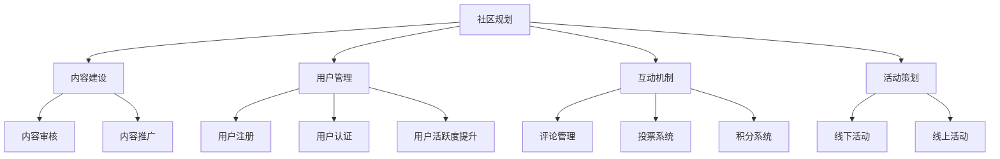

                 

### 文章标题

《建立技术社区：影响力与机遇》

---

**关键词**：技术社区，影响力，机遇，内容建设，社区管理，社区互动，社区营销，运营实战，未来趋势，成功指南

**摘要**：本文旨在探讨如何建立一个有影响力的技术社区，从核心要素、运营实战、未来趋势等方面进行分析。通过深入剖析技术社区的定义、重要性、机遇，以及内容建设、社区管理、社区互动、社区营销等关键要素，提供全面的运营策略和实践案例，为技术社区建设者提供有价值的参考和指导。同时，展望技术社区的未来发展趋势，探讨技术与社区的融合，以及成功建立技术社区的关键要素，以期为读者提供全方位的思考和行动指南。

---

### 第一部分：引言

#### 1.1 技术社区的重要性

**1.1.1 技术社区的定义与特点**

技术社区是一个由共同兴趣或专业领域的人组成的在线平台，用户可以在其中分享知识、经验、观点和资源。技术社区的特点包括：

- **开放性**：技术社区欢迎各种背景和水平的用户参与，提供广泛的讨论空间。
- **互动性**：社区成员之间可以进行即时交流、讨论和合作，增强互动体验。
- **多元化**：技术社区涵盖多个领域，从软件开发到人工智能、区块链等，满足不同用户的需求。
- **共享性**：社区成员可以共享知识、资源和经验，促进共同成长。
- **合作性**：技术社区鼓励成员之间的合作，共同解决技术难题，推动技术创新。

**1.1.2 技术社区对企业的影响**

技术社区对企业具有深远的影响，主要体现在以下几个方面：

- **品牌影响力**：企业通过建立技术社区，展示其技术实力和专业性，提升品牌影响力。
- **市场洞察**：企业可以与社区成员互动，了解市场需求和趋势，为产品开发提供洞察。
- **用户反馈**：技术社区为用户提供了反馈渠道，企业可以收集用户意见和建议，优化产品和服务。
- **人才招聘**：技术社区吸引了许多专业人才，为企业提供了招聘和培养人才的机会。
- **合作机会**：技术社区为企业和行业合作伙伴提供了交流平台，促进合作和协同创新。

#### 1.2 技术社区的机遇

**1.2.1 社区驱动的创新**

技术社区为创新提供了广阔的土壤。通过社区成员的互动和合作，可以激发出许多新颖的创意和技术方案。社区驱动的创新具有以下优势：

- **快速迭代**：社区成员可以实时反馈和优化创意，实现快速迭代。
- **多元视角**：不同背景和领域的成员可以提供多样化的观点，促进创新。
- **资源共享**：社区成员可以共享资源和知识，降低创新成本。
- **持续激励**：社区的创新氛围可以激励成员不断尝试和探索，推动技术进步。

**1.2.2 技术社区的商业化**

技术社区的商业化是指通过社区运营获得经济利益的过程。商业化技术社区的主要模式包括：

- **广告收入**：在社区中投放广告，根据广告点击量或展示次数获得收入。
- **会员订阅**：提供付费会员服务，会员可以享受更多特权，如专属内容、个性化服务等。
- **活动收费**：举办线下活动或线上研讨会，收取门票费用。
- **产品销售**：销售与社区主题相关的书籍、课程、工具等。
- **品牌合作**：与品牌合作，提供定制化的服务或解决方案，获得品牌赞助。

#### 1.3 技术社区的发展现状

当前，技术社区在全球范围内得到了广泛的发展，主要表现在以下几个方面：

- **数量增长**：随着互联网的普及，技术社区的数量呈现快速增长趋势，涵盖了多个领域和行业。
- **用户规模扩大**：技术社区吸引了越来越多的用户加入，用户规模不断扩大，形成了庞大的用户群体。
- **商业模式创新**：技术社区不断探索新的商业模式，从广告、会员订阅到活动收费等，实现了多元化盈利。
- **技术应用深入**：大数据、人工智能等新技术在技术社区中得到了广泛应用，提高了社区的运营效率和服务质量。

总之，技术社区已经成为信息技术领域的重要组成部分，具有巨大的发展潜力和商业价值。在接下来的章节中，我们将深入探讨技术社区的核心要素，以及如何有效地运营和管理技术社区。

### 第二部分：技术社区的核心要素

#### 2.1 内容建设

**2.1.1 内容策略**

内容建设是技术社区的核心，一个丰富、高质量的内容体系能够吸引和留住用户，提高社区的活跃度。以下是一些关键内容策略：

- **定位明确**：社区内容应明确针对特定的受众群体，如开发者、创业者、研究人员等。
- **多样化形式**：内容形式应多样化，包括文章、视频、直播、问答等，满足不同用户的需求。
- **更新频率**：保持高更新频率，定期发布新内容，保持用户的关注和活跃。
- **专业性与实用性**：内容应具有较高的专业性和实用性，帮助用户解决实际问题。
- **互动性**：鼓励用户在内容下方留言，进行讨论和互动，提高用户参与度。

**2.1.2 内容质量保障**

内容质量直接影响到用户对社区的满意度和社区的口碑。以下措施可以保障内容质量：

- **内容审核**：建立内容审核机制，确保发布的内容符合社区规范和标准。
- **作者资质**：对内容作者进行资质审核，确保其具备相关领域的专业知识和经验。
- **用户反馈**：建立用户反馈机制，收集用户对内容的意见和建议，及时调整和改进。
- **技术支持**：提供技术支持，帮助作者解决内容创作中的技术难题，提高内容质量。

**2.1.3 内容推广与传播**

内容的价值在于传播和被更多人看到。以下是一些内容推广和传播的策略：

- **SEO优化**：优化内容SEO，提高在搜索引擎中的排名，吸引更多潜在用户。
- **社交媒体**：利用社交媒体平台宣传和推广内容，增加曝光度和访问量。
- **合作交流**：与其他技术社区、媒体、专家等进行合作交流，扩大影响力。
- **活动营销**：通过举办线上线下活动，吸引用户参与和分享，提高内容传播效果。

#### 2.2 社区管理

**2.2.1 社区规则设定**

社区规则是维护社区秩序和氛围的重要保障。以下是一些社区规则设定的原则：

- **明确性**：规则应明确、具体，让用户一目了然。
- **公平性**：规则应公平对待所有用户，避免偏袒和歧视。
- **可执行性**：规则应具有可操作性，能够实际执行和监督。
- **灵活性**：规则应具有一定的灵活性，能够根据社区发展和用户需求进行调整。

**2.2.2 社区成员管理**

社区成员管理包括用户注册、认证、权限分配等环节。以下是一些关键点：

- **注册流程**：简化注册流程，提高用户体验。
- **认证体系**：建立认证体系，区分不同角色的用户，如普通用户、认证会员、管理员等。
- **权限分配**：根据用户角色和贡献程度，合理分配权限，保障社区安全和秩序。
- **用户行为监控**：监控用户行为，及时发现和处理违规行为，维护社区健康氛围。

**2.2.3 社区活跃度提升**

提升社区活跃度是社区管理的重要目标。以下是一些提升社区活跃度的策略：

- **互动机制**：设计有趣的互动机制，如投票、问答、积分系统等，鼓励用户参与。
- **活动策划**：定期举办线上线下活动，吸引用户参与和互动。
- **优秀内容激励**：奖励优秀内容创作者，提高他们的积极性和创作热情。
- **社群运营**：建立社群运营团队，与用户保持密切互动，了解用户需求和反馈。

#### 2.3 社区互动

**2.3.1 互动机制设计**

互动机制是社区运营的核心，决定了用户的参与度和互动效果。以下是一些互动机制设计的要点：

- **多样化互动方式**：提供多样化的互动方式，如评论、点赞、分享、直播等。
- **激励机制**：设计激励机制，如积分、奖品等，鼓励用户积极参与互动。
- **用户反馈**：建立用户反馈机制，收集用户对互动机制的反馈，不断优化和改进。
- **个性化推荐**：基于用户行为和兴趣，个性化推荐相关内容和互动机会，提高用户参与度。

**2.3.2 用户参与度提升**

提升用户参与度是社区运营的关键。以下是一些提升用户参与度的策略：

- **内容共创**：鼓励用户参与内容创作，如发起话题、撰写博客等。
- **用户互动**：设计互动活动，如问答、竞赛、投票等，激发用户参与热情。
- **社群运营**：建立社群，组织线上和线下活动，增强用户归属感和参与感。
- **激励机制**：通过积分、奖品等方式，激励用户积极参与社区活动。

**2.3.3 互动效果评估**

评估互动效果是社区运营的重要环节。以下是一些互动效果评估的方法：

- **用户活跃度**：通过统计用户发帖、评论、点赞等行为，评估用户的活跃度。
- **互动质量**：评估用户互动的内容和质量，如观点是否独到、评论是否具有建设性等。
- **用户满意度**：通过调查问卷、用户反馈等方式，了解用户对互动效果的满意度。
- **效果改进**：根据评估结果，不断优化互动机制和活动策划，提高互动效果。

通过以上核心要素的构建和优化，技术社区可以形成一个良好的生态，促进成员之间的互动和合作，实现社区的长期发展。

### 第三部分：技术社区运营实战

#### 3.1 社区运营流程

**3.1.1 运营团队搭建**

社区运营的成功离不开专业的运营团队。搭建运营团队时，应考虑以下几个方面：

- **团队规模**：根据社区规模和需求，确定团队人数和职位设置。
- **岗位分工**：明确各岗位的职责，如内容运营、用户运营、活动策划、技术支持等。
- **技能要求**：招聘具有相关经验和技能的人才，确保团队具备良好的专业素养。
- **培训机制**：建立培训机制，提高团队成员的运营能力和专业技能。

**3.1.2 运营策略制定**

制定有效的运营策略是社区成功的关键。以下是一些关键运营策略：

- **内容策略**：根据社区定位和用户需求，制定内容发布和推广策略。
- **用户策略**：通过用户画像分析，了解用户特征和需求，制定针对性的用户运营策略。
- **活动策略**：策划线上线下活动，提高用户参与度和社区活跃度。
- **营销策略**：利用多种营销手段，如SEO、SEM、社交媒体推广等，扩大社区影响力。

**3.1.3 运营效果监控**

监控运营效果是评估运营策略有效性的重要手段。以下是一些运营效果监控的方法：

- **数据指标**：制定关键数据指标（KPI），如用户增长率、活跃度、留存率等，监控社区运营效果。
- **数据分析**：定期分析运营数据，发现问题和机会，优化运营策略。
- **用户反馈**：收集用户反馈，了解用户需求和满意度，及时调整运营方向。
- **效果评估**：通过A/B测试、实验等方法，评估不同运营策略的效果，持续优化运营方案。

#### 3.2 社区案例分析

**3.2.1 成功案例分享**

以下是一些技术社区的成功案例，分析其成功原因和经验：

- **GitHub**：GitHub 是一个全球最大的开源社区，通过提供代码托管和协作平台，吸引了大量的开发者和项目。其成功原因在于：

  - **用户体验**：提供简单、易用的平台，方便用户上传、管理和分享代码。
  - **社区氛围**：鼓励用户参与和贡献，建立积极、健康的社区文化。
  - **技术创新**：不断引入新技术，如GitHub Actions、GitHub Sponsors等，提升平台的功能和服务质量。

- **Stack Overflow**：Stack Overflow 是一个面向开发者的问答社区，通过用户提供问题和答案，帮助开发者解决技术难题。其成功原因在于：

  - **内容质量**：确保问答内容的高质量和实用性，为用户提供有价值的信息。
  - **用户激励机制**：通过积分、徽章等方式激励用户积极参与和贡献。
  - **社区合作**：与企业和组织合作，提供定制化的解决方案和服务。

**3.2.2 失败案例剖析**

以下是一些技术社区失败案例的分析，探讨其失败原因和教训：

- **Google+**：Google+ 是 Google 推出的社交网络平台，但由于缺乏有效的运营策略和用户体验，最终未能成功。其失败原因在于：

  - **内容空洞**：内容质量较低，缺乏吸引力和价值。
  - **用户体验不佳**：界面复杂，功能繁多，用户难以适应。
  - **缺乏创新**：未能在社区运营和互动机制上做出突破，导致用户流失。

- **Reddit**：Reddit 是一个知名的社交新闻网站，但由于管理不善和社区氛围问题，一度陷入低谷。其失败原因在于：

  - **社区管理混乱**：缺乏有效的社区管理和规则设定，导致低质量内容和恶意行为泛滥。
  - **用户体验不佳**：用户体验差，缺乏互动性和参与感。
  - **商业模式不清**：未能在商业化方面找到合适的路径，导致盈利困难。

**3.2.3 案例启示与借鉴**

通过成功和失败案例的分析，我们可以得到以下启示和借鉴：

- **注重用户体验**：提供优质的内容和服务，满足用户需求和期望，是社区成功的关键。
- **有效的社区管理**：建立良好的社区规则和管理机制，维护社区秩序和氛围。
- **创新和持续改进**：不断引入新技术和运营策略，提升社区功能和用户体验。
- **商业模式探索**：找到适合自身的商业模式，实现可持续发展和盈利。

通过借鉴成功经验，规避失败教训，技术社区可以更好地运营和发展。

#### 3.3 社区运营工具

**3.3.1 社区平台选择**

选择合适的社区平台是社区运营的第一步。以下是一些社区平台的选择标准：

- **功能需求**：根据社区定位和需求，选择具备所需功能的平台，如论坛、博客、问答等。
- **用户量级**：考虑社区用户量级，选择支持大规模用户访问和互动的平台。
- **扩展性**：选择具有良好扩展性的平台，以便未来功能升级和扩展。
- **技术支持**：考虑平台的技术支持和服务，确保社区运营顺利进行。

**3.3.2 社区工具配置**

配置适合社区运营的工具，可以提高运营效率和效果。以下是一些常用社区工具：

- **内容管理系统**（CMS）：如WordPress、Joomla等，用于内容发布和管理。
- **社区管理工具**：如Discourse、phpBB等，用于社区讨论和管理。
- **互动工具**：如Slack、微信等，用于团队协作和用户互动。
- **数据分析工具**：如Google Analytics、Mixpanel等，用于数据分析和管理。

**3.3.3 工具使用与优化**

合理使用和优化社区工具，可以提高社区运营的效果。以下是一些建议：

- **培训与指导**：为团队成员提供培训，确保他们熟悉和使用工具。
- **定制化设置**：根据社区特点和需求，进行工具的定制化设置，提升用户体验。
- **数据分析**：定期分析工具使用数据，发现问题和机会，优化工具配置和使用。
- **迭代更新**：关注工具的最新动态，及时更新和升级，确保工具的功能和安全。

通过以上社区运营工具的选择、配置和使用，技术社区可以实现高效的运营和管理，为用户提供优质的服务和体验。

### 第四部分：技术社区的未来趋势

#### 4.1 社区生态建设

**4.1.1 社区生态的定义与价值**

社区生态是指围绕技术社区建立的一系列相互关联、相互促进的组成部分，包括用户、内容创作者、企业、投资者等。社区生态的价值主要体现在以下几个方面：

- **资源共享**：社区生态中的各方可以共享资源，如知识、信息、技术等，提高资源利用效率。
- **协同创新**：社区生态中的成员可以协同创新，共同解决技术难题，推动技术进步。
- **经济增长**：社区生态可以带动相关产业的发展，创造就业机会，促进经济增长。
- **可持续发展**：社区生态注重长期发展，通过持续的创新和优化，实现可持续发展。

**4.1.2 社区生态的构建策略**

构建一个健康的社区生态需要以下策略：

- **明确目标**：明确社区生态的目标和愿景，确保各方目标的协同和一致。
- **激励机制**：建立激励机制，鼓励用户、内容创作者、企业等积极参与社区生态的建设。
- **合作机制**：建立合作机制，促进各方之间的协同和创新，实现共赢。
- **治理机制**：建立有效的治理机制，维护社区生态的秩序和公平性。
- **持续发展**：注重社区生态的可持续发展，关注社区成员的长期利益和需求。

**4.1.3 社区生态的可持续发展**

社区生态的可持续发展是社区生态建设的重要目标。以下是一些实现社区生态可持续发展的策略：

- **多元化收入**：通过多元化的收入来源，降低对单一收入模式的依赖，提高社区的财务稳定性。
- **用户忠诚度**：通过提供优质的服务和体验，提高用户的忠诚度，增强社区的粘性。
- **社区自治**：鼓励社区成员参与社区治理，提高社区的自治能力和自我管理能力。
- **技术创新**：持续引入新技术，提高社区的服务质量和运营效率，推动社区的发展。
- **社会责任**：关注社区的社会责任，积极参与公益事业，提升社区的社会价值。

#### 4.2 社区与企业的合作

**4.2.1 合作模式探讨**

社区与企业的合作模式多种多样，以下是一些常见的合作模式：

- **内容合作**：企业可以与社区合作，提供专业内容或赞助内容创作，提升社区内容质量。
- **广告合作**：社区可以为企业提供广告位，帮助企业扩大品牌影响力。
- **活动合作**：社区可以与企业共同举办线上线下活动，提高用户参与度和活动效果。
- **技术开发**：企业可以与社区合作，共同开发技术解决方案，推动技术创新。
- **投资合作**：投资者可以通过社区了解项目进展和市场趋势，为优质项目提供资金支持。

**4.2.2 合作优势分析**

社区与企业的合作具有以下优势：

- **资源共享**：通过合作，社区和企业可以实现资源的共享和互补，提高资源利用效率。
- **品牌提升**：社区和企业合作，可以提升双方的品牌影响力，实现双赢。
- **市场拓展**：社区为企业提供了广阔的市场机会，帮助企业拓展客户群体。
- **技术创新**：社区为企业提供了技术创新的土壤，促进企业的技术创新和产品升级。
- **用户互动**：社区为企业提供了与用户互动的平台，帮助企业更好地了解用户需求和反馈。

**4.2.3 合作案例分享**

以下是一些社区与企业合作的案例：

- **GitHub 与微软**：GitHub 与微软合作，推出 GitHub Actions，为企业提供自动化开发和部署工具，提高了开发效率。
- **Stack Overflow 与亚马逊**：Stack Overflow 与亚马逊合作，提供亚马逊 AWS 的技术支持和资源，帮助开发者解决云计算相关问题。
- **技术社区与创业公司**：一些技术社区与创业公司合作，提供平台资源和推广机会，帮助创业公司快速发展。

通过合作，社区和企业可以实现共同发展，推动技术的进步和创新的实现。

#### 4.3 社区与技术的结合

**4.3.1 新技术背景下的社区发展**

随着新技术的不断涌现，技术社区也在不断发展。以下是一些新技术背景下的社区发展趋势：

- **人工智能**：人工智能技术可以帮助社区进行内容推荐、用户行为分析等，提高社区运营效率和服务质量。
- **区块链**：区块链技术可以为社区提供安全、透明的数据管理和交易功能，增强社区信任和互动。
- **大数据**：大数据技术可以帮助社区进行用户画像分析、行为预测等，为运营决策提供有力支持。
- **云计算**：云计算技术可以为社区提供弹性、高效的计算和存储资源，降低运营成本，提高服务稳定性。

**4.3.2 技术赋能社区的创新实践**

技术赋能社区的创新实践体现在以下几个方面：

- **智能问答系统**：利用自然语言处理技术，提供智能问答系统，帮助用户快速找到解决方案。
- **社交网络分析**：利用社交网络分析技术，挖掘社区中的关键节点和影响力用户，提高社区运营效率。
- **个性化推荐**：利用机器学习技术，为用户推荐感兴趣的内容和互动机会，提高用户粘性和参与度。
- **在线教育**：利用在线教育平台，提供课程、教程和培训，帮助用户提升技能和知识水平。

**4.3.3 技术驱动社区的未来展望**

技术驱动社区的未来展望包括以下几个方面：

- **智能化管理**：随着技术的进步，社区管理将更加智能化，通过自动化和数据分析实现高效运营。
- **个性化体验**：技术将使社区提供更加个性化的服务和体验，满足用户个性化需求。
- **多元化互动**：技术将带来更多样化的互动方式，如虚拟现实、增强现实等，提升用户的互动体验。
- **全球化发展**：技术将打破地域限制，推动社区在全球范围内的扩展和合作，实现全球化发展。

通过技术与社区的深度融合，技术社区将迎来更加广阔的发展前景，为用户和行业带来更多的价值。

### 第五部分：技术社区成功指南

#### 5.1 成功要素

**5.1.1 明确目标**

建立技术社区的第一步是明确目标。目标应包括短期和长期目标，如：

- **短期目标**：吸引用户、提高活跃度、建立品牌知名度等。
- **长期目标**：实现可持续发展、推动技术创新、成为行业领导者等。

明确目标有助于指导社区建设和运营，确保社区朝着正确的方向前进。

**5.1.2 倾听用户**

用户是技术社区的核心，社区的成功离不开用户的参与和支持。倾听用户的需求和反馈，是建立成功社区的关键。以下是一些建议：

- **用户调研**：通过问卷调查、访谈等方式，了解用户的需求和痛点。
- **用户反馈**：建立用户反馈机制，收集用户的意见和建议。
- **用户互动**：与用户保持密切互动，回答用户的问题，解决用户的困扰。

通过倾听用户，社区可以更好地满足用户需求，提高用户满意度和忠诚度。

**5.1.3 不断创新**

在技术快速发展的今天，社区要持续保持竞争力，必须不断创新。以下是一些创新建议：

- **内容创新**：定期推出新颖、有价值的内容，吸引和留住用户。
- **互动创新**：设计新颖的互动活动，提高用户参与度和互动效果。
- **技术创新**：引入新技术，提升社区的功能和服务质量。
- **商业模式创新**：探索新的商业模式，实现社区的商业化运营。

通过不断创新，社区可以吸引更多用户，提高用户粘性，实现可持续发展。

#### 5.2 失败教训

**5.2.1 预防社区崩溃**

社区崩溃是社区运营中的一大风险，以下是一些预防措施：

- **备份与恢复**：定期备份社区数据，确保在出现问题时可以快速恢复。
- **系统监控**：监控系统性能，及时发现和处理系统异常。
- **容灾备份**：建立容灾备份系统，确保在主系统出现问题时，可以快速切换到备份系统。

通过以上措施，可以降低社区崩溃的风险，确保社区的稳定运行。

**5.2.2 消除用户抵触**

用户抵触是社区运营中常见的问题，以下是一些消除用户抵触的措施：

- **提高内容质量**：提供高质量的内容，满足用户需求，提高用户满意度。
- **优化用户体验**：简化操作流程，提高社区界面友好度，提高用户体验。
- **积极互动**：与用户保持积极互动，回答用户问题，解决用户困扰。
- **公正处理**：公正处理用户问题和纠纷，维护社区秩序和公平性。

通过以上措施，可以降低用户抵触情绪，提高用户满意度和忠诚度。

**5.2.3 实现盈利模式**

实现盈利模式是社区长期发展的关键，以下是一些盈利模式：

- **广告收入**：在社区中投放广告，根据广告点击量或展示次数获得收入。
- **会员订阅**：提供付费会员服务，会员可以享受更多特权，如专属内容、个性化服务等。
- **活动收费**：举办线上线下活动，收取门票费用。
- **产品销售**：销售与社区主题相关的书籍、课程、工具等。
- **品牌合作**：与品牌合作，提供定制化的服务或解决方案，获得品牌赞助。

通过以上盈利模式，社区可以实现可持续发展和盈利。

#### 5.3 长期发展策略

**5.3.1 社区文化塑造**

社区文化是社区长期发展的重要基石，以下是一些社区文化塑造的策略：

- **价值观传递**：明确社区价值观，传递给用户，形成共同的价值观。
- **社区精神**：培养社区精神，如互助、共享、创新等，形成积极的社区氛围。
- **文化传承**：通过活动和活动，传承社区文化，增强社区成员的归属感。

通过以上策略，可以塑造一个积极、健康的社区文化，为社区长期发展提供支持。

**5.3.2 成长路径规划**

成长路径规划是社区长期发展的重要策略，以下是一些成长路径规划的建议：

- **用户增长**：制定用户增长计划，通过内容推广、活动策划等方式，吸引更多用户加入。
- **内容建设**：不断优化内容体系，提高内容质量和数量，满足用户需求。
- **运营优化**：持续优化社区运营策略，提高社区活跃度和用户满意度。
- **商业模式**：探索适合社区的商业模式，实现可持续发展。

通过以上策略，社区可以制定明确的成长路径，实现长期发展。

**5.3.3 持续创新动力**

持续创新是社区保持竞争力的关键，以下是一些持续创新动力的策略：

- **技术创新**：关注新技术动态，引入新技术，提升社区功能和服务质量。
- **合作创新**：与合作伙伴共同探索创新，实现协同发展。
- **用户需求**：关注用户需求，不断优化和改进社区服务。
- **激励机制**：建立激励机制，鼓励用户和社区成员参与创新。

通过以上策略，社区可以保持持续创新动力，推动社区发展。

通过以上成功要素、失败教训和长期发展策略，技术社区可以更好地规划和实现其长期发展目标。

### 附录

#### 附录 A：技术社区资源汇总

**A.1 知名技术社区介绍**

- GitHub：全球最大的开源社区，提供代码托管和协作平台。
- Stack Overflow：面向开发者的问答社区，帮助开发者解决技术难题。
- Reddit：一个基于社区投票的社交新闻网站，涵盖多个技术领域。
- Hacker News：一个以技术创业和创业投资为主题的社区。
- Quora：一个知识分享社区，用户可以提问和回答问题。

**A.2 技术社区运营工具推荐**

- Discourse：一个开源的社区论坛平台，支持丰富的互动功能。
- phpBB：一个开源的论坛软件，功能强大且易于扩展。
- WordPress：一个广泛使用的博客平台，适合建立内容丰富的社区。
- Slack：一个团队协作工具，可以用于社区内部沟通和互动。
- Trello：一个项目管理工具，可以用于社区项目规划和任务分配。

**A.3 技术社区研究文献推荐**

- "Community Building on the Web: Strategies and Tactics" by Tara Hunt
- "The Wealth of Networks: How Social Production Transforms Markets and Freedom" by Yochai Benkler
- "The Social Network Era: How Social Media is Changing the Way We Live and Work" by唐·泰平 (Don Tapscott)
- "Understanding the Networked Organization: Insights from Social Network Research" by K.D. Alexander and J.P. Glaser
- "The Power of Pull: How Small Moves, Smartly Made, Can Set Big Things in Motion" by John Hagel III, John Seely Brown, and Lang Davison

通过以上资源，技术社区建设者可以更好地了解和利用技术社区的相关资源和研究成果。

#### 附录 B：技术社区运营手册

**B.1 社区运营流程图**

**B.2 社区管理指南**

- **社区规则制定**：制定明确、公正、易理解的社区规则，确保社区秩序和公平性。
- **管理员职责**：明确管理员职责，包括内容审核、用户管理、互动监控等。
- **用户行为规范**：规范用户行为，鼓励积极互动，杜绝恶意行为和违规操作。
- **紧急处理**：制定紧急处理流程，快速应对突发事件，确保社区稳定运行。

**B.3 社区互动策略**

- **互动机制设计**：设计多样化的互动机制，如评论、点赞、分享、投票等，激发用户参与。
- **激励机制**：建立激励机制，如积分、奖品等，鼓励用户积极参与互动。
- **用户反馈**：建立用户反馈机制，收集用户意见和建议，不断优化互动机制。
- **数据分析**：分析互动数据，了解用户行为和需求，优化互动策略。

通过以上运营手册，社区管理者可以更好地规划和执行社区运营工作，提高社区活跃度和用户满意度。

### 附录 C：技术社区案例集

**C.1 成功案例分享**

以下是一些技术社区的成功案例，分析其成功原因：

- **GitHub**：成功原因包括用户体验优秀、技术创新、社区氛围积极等。GitHub 通过提供强大的代码托管和协作功能，吸引了大量的开发者，成为全球最大的开源社区之一。

- **Stack Overflow**：成功原因包括内容质量高、用户激励机制完善、社区氛围健康等。Stack Overflow 通过提供高质量的问答内容，帮助开发者解决技术难题，成为最受欢迎的技术问答社区。

- **Reddit**：成功原因包括内容多样化、用户参与度高、社区文化独特等。Reddit 覆盖了广泛的领域，用户可以自由发表观点和参与讨论，形成了独特的社区文化。

**C.2 失败案例剖析**

以下是一些技术社区失败案例的原因：

- **Google+**：失败原因包括用户体验不佳、内容空洞、缺乏创新等。Google+ 在推出时未能提供独特的价值，用户体验较差，导致用户流失。

- **Digg**：失败原因包括用户参与度低、商业模式不清、竞争激烈等。Digg 未能有效吸引和留住用户，商业模式也不够清晰，最终被其他竞争者超越。

**C.3 案例启示与借鉴**

通过成功和失败案例的分析，可以得到以下启示：

- **注重用户体验**：提供优质的内容和服务，满足用户需求，是社区成功的关键。
- **不断创新**：持续引入新技术和运营策略，保持社区活力和竞争力。
- **社区文化**：建立积极、健康的社区文化，促进用户参与和互动。
- **商业模式**：找到适合社区的商业模式，实现可持续发展。

技术社区建设者可以借鉴这些经验，优化社区运营，提高社区的成功率。

