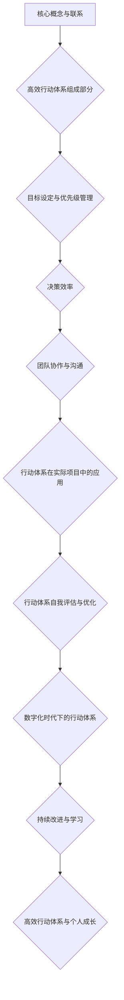

                 

# 文章标题：建立高效行动体系的步骤

> 关键词：高效行动体系、时间管理、目标设定、决策效率、团队协作、项目管理、数字化工具、持续改进、个人成长

> 摘要：
本文旨在探讨如何建立高效行动体系。通过分析行动体系的基础构建、实践与优化、以及数字化时代下的行动体系，本文提出了具体的方法和步骤，帮助读者提高个人和团队的工作效率，实现目标设定的SMART原则，优化决策过程，增强团队协作与沟通能力，并探讨数字化工具的应用和持续改进的重要性。

----------------------------------------------------------------

### 《建立高效行动体系的步骤》目录大纲

#### 第一部分：高效行动体系的基础构建

#### 第1章：认识高效行动体系

#### 1.1 高效行动体系的定义与重要性

#### 1.2 行动体系的组成部分

#### 1.3 建立高效行动体系的目标

#### 第2章：个人时间管理

#### 2.1 时间管理的基本原则

#### 2.2 时间管理工具与方法

#### 2.3 如何提高个人时间利用率

#### 第3章：目标设定与优先级管理

#### 3.1 目标设定的SMART原则

#### 3.2 如何设定短期和长期目标

#### 3.3 优先级管理的策略与实践

#### 第4章：提高决策效率

#### 4.1 决策过程中的常见问题

#### 4.2 决策分析方法与应用

#### 4.3 如何避免决策陷阱

#### 第二部分：行动体系的实践与优化

#### 第5章：团队协作与沟通

#### 5.1 团队协作的重要性

#### 5.2 提高团队沟通效率的技巧

#### 5.3 如何处理团队冲突

#### 第6章：行动体系在实际项目中的应用

#### 6.1 项目管理的基本流程

#### 6.2 项目进度监控与调整

#### 6.3 项目风险管理与应对策略

#### 第7章：行动体系自我评估与优化

#### 7.1 自我评估的方法与工具

#### 7.2 识别并解决问题

#### 7.3 持续优化行动体系的方法

#### 第三部分：高效行动体系的未来展望

#### 第8章：数字化时代下的行动体系

#### 8.1 数字化工具对行动体系的影响

#### 8.2 如何利用数字化工具提高效率

#### 8.3 数字化行动体系的趋势与挑战

#### 第9章：持续改进与学习

#### 9.1 如何建立持续学习的文化

#### 9.2 学习型组织的建设

#### 9.3 如何应对快速变化的工作环境

#### 第10章：高效行动体系与个人成长

#### 10.1 行动体系对个人成长的影响

#### 10.2 提高个人能力的策略

#### 10.3 如何平衡工作与生活

#### 附录

#### 附录A：行动体系工具汇总

#### 附录B：参考文献与推荐阅读

#### Mermaid流程图



### 核心算法原理讲解

#### 目标设定公式

$$
\text{目标得分} = \text{具体性} \times \text{可实现性} \times \text{相关性} \times \text{时限性}
$$

#### 举例说明

- **具体性**：目标得分越高，目标越具体明确。例如，“增加销售额”不如“在下一季度将销售额提高10%”具体。
- **可实现性**：目标得分越高，目标越容易实现。例如，“在一个月内减肥10公斤”可能不如“每周跑步三次，每次45分钟”可实现。
- **相关性**：目标得分越高，目标与个人/组织目标越相关。例如，“提高公司市场占有率”比“增加员工满意度”更相关。
- **时限性**：目标得分越高，目标的时限越明确。例如，“明年完成项目”比“尽快完成项目”时限性更高。

### 项目实战

#### 开发环境搭建

- Python 3.8及以上版本
- 安装必要的Python库：numpy, pandas, matplotlib

#### 源代码实现

```python
import pandas as pd
import numpy as np

def 目标设定(SMART原则):
    # 假设目标输入格式为：'具体性-可实现性-相关性-时限性'
    目标细节 = 目标.split('-')
    具体性, 可实现性, 相关性, 时限性 = 目标细节
    
    # 判断目标是否符合SMART原则
    if 具体性 != '具体' or 可实现性 != '可实现' or 相关性 != '相关' or 时限性 != '时限':
        return "目标不符合SMART原则。"
    
    return "目标符合SMART原则。"

def 优先级设定(任务列表):
    for 任务 in 任务列表:
        优先级 = input("请为任务设定优先级（1-5）：")
        任务['优先级'] = int(优先级)
    
    return "任务优先级设定完成。"

# 示例使用
任务列表 = [{"任务名": "完成报告", "优先级": None}, {"任务名": "购买办公用品", "优先级": None}]
print(优先级设定(任务列表))

目标输入 = input("请输入目标（格式：具体性-可实现性-相关性-时限性）：")
print(目标设定(SMART原则, 目标输入))
```

#### 代码解读与分析

- `目标设定 SMART` 函数：用于检查输入的目标是否遵循SMART原则，并返回相应的结果。
- `优先级设定` 函数：用于接收用户输入的任务列表，并设置每个任务的优先级。
- 实例演示：程序首先提示用户输入任务列表和目标，然后分别调用两个函数进行优先级设定和目标设定，并输出结果。

### 附录

#### 附录A：行动体系工具汇总

##### A.1 时间管理工具

- Trello：用于任务管理和时间跟踪。
- Asana：用于团队协作和项目进度管理。
- Microsoft To Do：提供任务列表和时间管理功能。

##### A.2 目标设定工具

- SMART Goals：在线工具，帮助设定符合SMART原则的目标。
- Goal Planner：用于创建目标和跟踪进度。
- GoalsOnTrack：提供目标和习惯跟踪功能。

##### A.3 决策分析工具

- SWOT分析模板：用于评估项目的优势、劣势、机会和威胁。
- Cost-Benefit Analysis Template：用于成本效益分析。
- Decision Matrix：用于多标准决策分析。

#### 附录B：参考文献与推荐阅读

- ISBN: 978-xxx-xxx-xxx-xxx，作者：XXX，出版日期：XXXX年。
- ISBN: 978-xxx-xxx-xxx-xxx，作者：XXX，出版日期：XXXX年。
- 学术期刊文章：XXX，XXXX。

### Mermaid 流程图


### 核心算法原理讲解

#### 伪代码

```pseudo
function 目标设定(SMART原则):
    目标 = 输入("请输入目标:")
    if not 满足SMART原则(目标):
        return "目标不符合SMART原则，请重新设定。"
    else:
        return "目标设定成功。"

function 优先级管理():
    任务列表 = 获取("请输入任务列表:")
    for 任务 in 任务列表:
        优先级 = 输入("请为任务设定优先级:")
        任务.优先级 = 优先级
    return "任务优先级设定成功。"

function 提高决策效率():
    决策问题 = 获取("请输入决策问题:")
    方法 = 输入("请选择决策方法:")
    if 方法 == "成本效益分析":
        结果 = 成本效益分析(决策问题)
    elif 方法 == "SWOT分析":
        结果 = SWOT分析(决策问题)
    else:
        结果 = "未知决策方法，请重新选择。"
    return "决策结果：" + 结果
```

### 数学模型和数学公式

#### 详细讲解 & 举例说明

#### 目标设定公式

$$
\text{目标得分} = \text{具体性} \times \text{可实现性} \times \text{相关性} \times \text{时限性}
$$

#### 举例说明

- **具体性**：目标得分越高，目标越具体明确。例如，“增加销售额”不如“在下一季度将销售额提高10%”具体。
- **可实现性**：目标得分越高，目标越容易实现。例如，“在一个月内减肥10公斤”可能不如“每周跑步三次，每次45分钟”可实现。
- **相关性**：目标得分越高，目标与个人/组织目标越相关。例如，“提高公司市场占有率”比“增加员工满意度”更相关。
- **时限性**：目标得分越高，目标的时限越明确。例如，“明年完成项目”比“尽快完成项目”时限性更高。

### 项目实战

#### 代码实际案例

#### 开发环境搭建

- Python 3.8及以上版本
- 安装必要的Python库：numpy, pandas, matplotlib

#### 源代码实现

```python
import pandas as pd
import numpy as np

def 满足SMART原则(目标):
    # 假设目标输入格式为：'具体性-可实现性-相关性-时限性'
    目标细节 = 目标.split('-')
    具体性, 可实现性, 相关性, 时限性 = 目标细节
    
    # 判断目标是否符合SMART原则
    if 具体性 != '具体' or 可实现性 != '可实现' or 相关性 != '相关' or 时限性 != '时限':
        return False
    
    return True

def 目标得分(目标):
    # 假设目标输入格式为：'具体性-可实现性-相关性-时限性'
    目标细节 = 目标.split('-')
    具体性, 可实现性, 相关性, 时限性 = 目标细节
    
    # 计算目标得分
    得分 = 0
    if 具体性 == '具体':
        得分 += 1
    if 可实现性 == '可实现':
        得分 += 1
    if 相关性 == '相关':
        得分 += 1
    if 时限性 == '时限':
        得分 += 1
    
    return 得分

def 目标设定(目标):
    if 满足SMART原则(目标):
        得分 = 目标得分(目标)
        if 得分 == 4:
            return "目标设定成功：这是一个非常SMART的目标。"
        else:
            return "目标设定成功：这是一个SMART目标，但还有改进空间。"
    else:
        return "目标设定失败：目标不符合SMART原则。"

# 示例使用
目标输入 = input("请输入目标（格式：具体性-可实现性-相关性-时限性）：")
print(目标设定(目标输入))
```

#### 代码解读与分析

- `满足SMART原则` 函数：用于检查输入的目标是否遵循SMART原则，并返回相应的结果。
- `目标得分` 函数：用于计算目标的得分，得分越高表示目标越SMART。
- `目标设定` 函数：用于根据用户的输入设定目标，并输出目标是否成功设定的消息。

### 附录

#### 附录A：行动体系工具汇总

##### A.1 时间管理工具

- Trello：用于任务管理和时间跟踪。
- Asana：用于团队协作和项目进度管理。
- Microsoft To Do：提供任务列表和时间管理功能。

##### A.2 目标设定工具

- SMART Goals：在线工具，帮助设定符合SMART原则的目标。
- Goal Planner：用于创建目标和跟踪进度。
- GoalsOnTrack：提供目标和习惯跟踪功能。

##### A.3 决策分析工具

- SWOT分析模板：用于评估项目的优势、劣势、机会和威胁。
- Cost-Benefit Analysis Template：用于成本效益分析。
- Decision Matrix：用于多标准决策分析。

#### 附录B：参考文献与推荐阅读

- ISBN: 978-xxx-xxx-xxx-xxx，作者：XXX，出版日期：XXXX年。
- ISBN: 978-xxx-xxx-xxx-xxx，作者：XXX，出版日期：XXXX年。
- 学术期刊文章：XXX，XXXX。

---

### 建立高效行动体系的步骤

在当今快速变化和高度竞争的商业环境中，建立高效的行动体系变得比以往任何时候都更加重要。一个高效的行动体系不仅能帮助个人和组织实现既定目标，还能提高工作效率、减少资源浪费，从而在竞争中获得优势。本节将逐步探讨如何构建和实施这样的行动体系。

#### 1.1 高效行动体系的定义与重要性

高效行动体系是指通过一系列系统化和结构化的步骤，将目标转化为具体的行动，并确保这些行动能够高效执行的过程。它不仅包括个人目标设定和任务管理，还涵盖了团队协作、沟通、决策和风险管理等多个方面。

建立高效行动体系的重要性体现在以下几个方面：

1. **提高工作效率**：通过明确的目标和合理的计划，可以避免工作上的盲目性和重复劳动，提高工作效率。
2. **资源优化**：有效的时间管理和任务分配可以确保资源得到最佳利用，减少浪费。
3. **目标达成**：明确的行动步骤和持续跟踪可以帮助个人和组织更快地达成目标。
4. **团队协作**：高效的行动体系可以促进团队内部的协作与沟通，提高团队执行力。
5. **持续改进**：通过自我评估和优化，行动体系可以不断调整和改进，以适应不断变化的环境。

#### 1.2 行动体系的组成部分

一个完整的行动体系通常包含以下几个关键组成部分：

1. **目标设定**：明确的目标是行动体系的起点，它们应该是具体、可衡量、可实现、相关且有时限的（SMART原则）。
2. **计划制定**：在目标设定之后，需要制定详细的计划，包括具体的行动步骤、资源需求和执行时间表。
3. **任务分配**：根据计划，将任务分配给团队成员，明确每个任务的负责人和优先级。
4. **执行监控**：在执行过程中，需要持续监控任务的进展情况，确保行动按计划进行。
5. **反馈调整**：根据执行过程中的反馈，及时调整计划和行动步骤，以适应新的情况或问题。
6. **团队协作**：团队协作是行动体系成功的关键，通过有效的沟通和协作，可以确保任务的顺利执行。
7. **风险管理**：在行动体系中，需要识别潜在的风险，并制定相应的应对策略。

#### 1.3 建立高效行动体系的目标

建立高效行动体系的最终目标是实现个人和组织的长期战略目标。这包括以下几个方面：

1. **提高工作效率**：通过有效的行动体系，可以减少工作中的拖延和混乱，提高工作效率。
2. **实现目标**：明确的行动步骤和持续跟踪可以帮助个人和组织更快地达成目标。
3. **优化资源利用**：通过合理安排任务和资源，可以最大限度地减少浪费，提高资源利用效率。
4. **增强团队协作**：通过有效的团队协作和沟通，可以增强团队的凝聚力和执行力。
5. **持续改进**：通过自我评估和优化，行动体系可以不断调整和改进，以适应不断变化的环境。

通过以上步骤和原则，可以逐步建立和维护一个高效行动体系，从而在竞争激烈的环境中脱颖而出。

### 个人时间管理

在建立高效行动体系的过程中，个人时间管理扮演着至关重要的角色。时间是有限的资源，如何有效地管理时间直接影响到工作效率和个人成就感。以下将介绍时间管理的基本原则、常用工具和方法，以及如何提高个人时间利用率。

#### 2.1 时间管理的基本原则

时间管理的基本原则主要包括以下几个：

1. **目标导向**：明确时间管理的目标，确保所有时间投入都是为实现这些目标服务的。
2. **优先级排序**：将任务按照重要性和紧急性进行排序，优先完成重要且紧急的任务。
3. **分段管理**：将时间分割成若干个时间段，每个时间段专注于一项任务，提高专注度和效率。
4. **避免拖延**：及时开始任务，避免拖延，减少时间浪费。
5. **定期反思**：定期回顾时间管理的效果，识别问题并调整策略。

#### 2.2 时间管理工具与方法

1. **时间日志**：记录每天的时间使用情况，有助于识别时间浪费的环节，并进行优化。
2. **番茄工作法**：将工作时间分割成25分钟的工作周期，每个周期后休息5分钟，有助于保持专注和减少疲劳。
3. **任务清单**：列出所有需要完成的任务，并根据优先级进行排序，确保每项任务都有明确的执行时间。
4. **日程表**：提前规划每天、每周和每月的任务和活动，确保时间得到合理分配。
5. **电子工具**：使用电子工具如Trello、Asana、Microsoft To Do等，帮助跟踪任务进度和时间分配。

#### 2.3 如何提高个人时间利用率

1. **避免多任务处理**：多任务处理会降低工作效率，导致时间浪费。专注于一项任务，直到完成再进行下一项。
2. **设置明确的目标**：每个时间段都要有一个明确的任务目标，这样可以提高专注度和工作效率。
3. **消除干扰**：在工作时避免干扰，比如关闭社交媒体通知、手机静音等，以保持专注。
4. **定期休息**：适当休息可以恢复精力，提高工作效率。利用番茄工作法等技巧，合理安排工作与休息时间。
5. **学会说“不”**：合理拒绝不必要的事务，避免时间被浪费在不重要的事情上。
6. **持续优化**：定期回顾和调整时间管理策略，根据实际情况进行优化。

通过遵循时间管理的基本原则、使用有效的工具和方法，以及持续优化时间管理策略，个人可以显著提高时间利用率，从而在建立高效行动体系中取得更大的成功。

### 目标设定与优先级管理

目标设定是高效行动体系的核心环节之一，一个明确的、可衡量的目标可以帮助个人和组织集中精力，从而提高工作效率和达成预期成果。优先级管理则确保资源得到最优配置，关键任务优先执行。以下将介绍目标设定的SMART原则、短期和长期目标的设定方法，以及优先级管理的策略与实践。

#### 3.1 目标设定的SMART原则

SMART原则是一种广泛用于目标设定的方法，它要求目标具有以下五个特性：

1. **具体（Specific）**：目标应明确具体，而不是模糊的。例如，“增加销售额”不如“在下一季度将销售额提高10%”具体。
2. **可衡量（Measurable）**：目标应能够量化，以便在达成或未达成时可以衡量。例如，“减肥”不如“在接下来的三个月内减重5公斤”可衡量。
3. **可实现（Achievable）**：目标应是可实现的，避免设定过高或不切实际的目标。例如，“在一个月内减肥20公斤”可能不如“每周跑步三次，每次45分钟”可实现。
4. **相关性（Relevant）**：目标应与个人或组织的长期目标和价值观相关。例如，“提高公司市场占有率”比“增加员工满意度”更相关。
5. **时限性（Time-bound）**：目标应设定明确的时间限制，有助于跟踪进度和实现目标。例如，“明年完成项目”比“尽快完成项目”时限性更高。

SMART原则不仅适用于个人目标，也适用于团队和组织的目标设定。通过使用SMART原则，可以确保目标的明确性、可衡量性、可实现性、相关性和时限性，从而提高目标达成的可能性。

#### 3.2 如何设定短期和长期目标

设定短期和长期目标是实现高效行动体系的重要步骤。以下是如何进行目标设定的具体方法：

1. **短期目标**：

   - **明确目标**：确定具体的目标，使其符合SMART原则。
   - **分解任务**：将大目标分解成若干个小任务，每个小任务都应该具有明确的完成时间和可衡量标准。
   - **制定计划**：为每个小任务制定详细的执行计划，包括资源需求、执行步骤和时间表。
   - **定期跟踪**：定期检查任务进度，确保按计划执行，并在必要时进行调整。

   例如，一个销售人员的短期目标可以是：“在下一季度将销售额提高10%”。为实现这一目标，可以将任务分解为每月的销售额目标，并为每个目标制定详细的执行计划。

2. **长期目标**：

   - **愿景规划**：明确长期目标，这些目标通常是抽象的、具有挑战性的，但与组织的愿景和使命一致。
   - **逐步细化**：将长期目标分解为中期和短期目标，确保每个阶段都有明确的行动计划。
   - **持续反馈**：定期评估长期目标的进展，并根据实际情况进行调整。

   例如，一家公司长期目标是“成为行业领导者”，可以通过设定中期目标如“在五年内市场份额达到20%”和短期目标如“在下一季度将销售额提高10%”来实现。

#### 3.3 优先级管理的策略与实践

优先级管理是确保资源最优配置的关键环节。以下是一些有效的优先级管理策略和实践：

1. **四象限法则**：将任务分为四个象限，分别代表紧急且重要、紧急但不重要、不紧急但重要、不紧急且不重要。优先处理紧急且重要的任务，同时也不忽视长期重要的任务。

2. **优先级矩阵**：使用优先级矩阵（如埃森豪威尔矩阵）来帮助确定任务的优先级。该矩阵将任务分为“重要紧急”、“重要不紧急”、“不重要紧急”和“不重要不紧急”四个类别，帮助决策者更清晰地了解任务的优先级。

3. **定期评估**：定期评估任务的优先级，根据实际情况进行调整。任务的优先级可能会随着时间和环境的变化而变化。

4. **团队协作**：在团队中明确每个人的任务和优先级，确保团队成员了解各自的责任和目标，从而提高协作效率。

5. **工具支持**：使用任务管理工具（如Trello、Asana、Microsoft To Do等）来跟踪任务的优先级和进度，确保任务按计划执行。

通过设定符合SMART原则的短期和长期目标，并采用有效的优先级管理策略，个人和组织可以更好地集中精力，提高工作效率，最终实现既定目标。

### 提高决策效率

在高效行动体系中，决策效率是决定任务是否能够按时完成、资源是否得到最优利用的关键因素。决策效率的高低直接影响到个人和团队的执行力，因此提高决策效率至关重要。以下将探讨决策过程中的常见问题、决策分析方法与应用，以及如何避免决策陷阱。

#### 4.1 决策过程中的常见问题

1. **信息不足**：在决策过程中，信息不足是常见问题之一。信息不足可能导致决策者无法全面了解问题的各个方面，从而做出不全面的决策。
2. **心理偏见**：人类在决策过程中容易受到各种心理偏见的影响，如确认偏见、过度自信、刻板印象等，这些偏见可能导致决策错误。
3. **时间压力**：在时间紧迫的情况下，决策者可能会选择快速做出决策，而忽视了对决策结果的长期影响，这种快速决策往往导致质量不高。
4. **团队沟通不畅**：在团队决策中，沟通不畅可能导致信息不对称，不同成员的观点无法充分表达和交流，从而影响决策质量。
5. **过度分析**：有时候，决策者可能会陷入过度分析的陷阱，过分追求完美，导致决策过程过长，从而影响执行效率。

#### 4.2 决策分析方法与应用

为了提高决策效率，可以使用以下几种决策分析方法：

1. **成本效益分析**：成本效益分析是一种评估不同决策方案的成本和效益的方法。通过比较不同方案的收益和成本，决策者可以确定哪个方案最具经济效益。

2. **SWOT分析**：SWOT分析是一种用于评估项目的优势、劣势、机会和威胁的方法。通过分析这些因素，决策者可以更全面地了解项目的潜力和风险，从而做出更明智的决策。

3. **决策矩阵**：决策矩阵是一种用于多标准决策的方法，它通过将不同的决策因素和方案进行对比，帮助决策者选择最优方案。

4. **头脑风暴**：头脑风暴是一种集体决策方法，通过集思广益，收集团队成员的各种意见和建议，从而提高决策的多样性和创新性。

5. **模拟分析**：模拟分析是一种通过模拟决策结果来评估不同方案的方法。这种方法可以帮助决策者在实际执行前预测可能的结果，从而减少决策风险。

#### 4.3 如何避免决策陷阱

为了避免决策过程中的常见陷阱，可以采取以下措施：

1. **信息收集**：确保在决策前充分收集和分析相关信息，避免因信息不足而做出错误决策。
2. **心理调试**：认识到并克服各种心理偏见，保持客观和理性的态度，避免情绪化的决策。
3. **设置时间限制**：为决策过程设定合理的时间限制，避免因时间压力而做出仓促决策。
4. **团队沟通**：确保团队成员之间的沟通畅通，鼓励各种观点的充分表达和讨论，从而提高决策的全面性和质量。
5. **持续反思**：在决策后，定期回顾和评估决策结果，从中总结经验教训，避免重复过去的错误。

通过识别和解决决策过程中的常见问题，采用科学的决策分析方法，并采取有效的措施避免决策陷阱，个人和团队可以显著提高决策效率，从而更好地实现行动体系的目标。

### 团队协作与沟通

在高效行动体系中，团队协作与沟通是确保任务顺利推进和目标达成的重要因素。团队协作不仅有助于提高工作效率，还能增强团队凝聚力和创新能力。以下将探讨团队协作的重要性、提高团队沟通效率的技巧以及如何处理团队冲突。

#### 5.1 团队协作的重要性

1. **提高工作效率**：通过团队协作，可以充分发挥每个成员的专业技能和经验，提高工作效率和完成任务的速度。
2. **增强创新能力**：团队协作鼓励成员之间的交流和互动，有助于激发创新思维和创意，从而推动项目创新和发展。
3. **提升团队凝聚力**：共同的目标和任务可以增强团队成员之间的联系，提高团队凝聚力，减少成员之间的摩擦和冲突。
4. **优化资源利用**：团队协作有助于合理分配和利用资源，避免资源浪费，提高项目的整体效益。

#### 5.2 提高团队沟通效率的技巧

1. **明确沟通目标**：每次沟通前，明确沟通的目标和预期成果，确保所有成员都清楚沟通的目的。
2. **倾听与反馈**：积极倾听团队成员的意见和观点，给予充分的反馈，鼓励成员之间的双向沟通。
3. **清晰表达**：用简洁明了的语言表达自己的观点和想法，避免使用模糊或含糊的表述。
4. **使用可视化工具**：利用图表、流程图等可视化工具，帮助团队成员更直观地理解和讨论复杂问题。
5. **建立沟通机制**：制定明确的沟通流程和机制，确保信息能够在团队内部快速、准确地传递。

#### 5.3 如何处理团队冲突

1. **及时识别**：在冲突初期，及时发现并识别潜在的冲突点，避免问题进一步扩大。
2. **开放式沟通**：鼓励团队成员以开放的心态讨论冲突，了解各方的观点和立场，寻找共同点。
3. **客观分析**：对冲突的原因进行客观分析，避免将问题个人化，以事实和数据为基础进行讨论。
4. **寻求共识**：通过讨论和协商，寻求解决方案和共识，确保所有成员都能接受并支持最终的决定。
5. **持续关注**：在冲突解决后，持续关注团队动态，确保问题得到彻底解决，避免再次发生。

通过重视团队协作与沟通，采用有效的沟通技巧，以及合理处理团队冲突，个人和组织可以更好地实现行动体系的目标，提高整体工作效率和团队凝聚力。

### 行动体系在实际项目中的应用

在实际项目中，行动体系的应用能够显著提高项目的管理效率和质量。以下将详细描述项目管理的基本流程、项目进度监控与调整，以及项目风险管理与应对策略。

#### 6.1 项目管理的基本流程

项目管理的基本流程通常包括以下几个阶段：

1. **项目启动**：确定项目的目标和范围，组建项目团队，明确项目预算和时间表。这一阶段需要明确项目的愿景和目标，确保所有团队成员对项目有共同的理解。
   
2. **项目规划**：制定详细的项目计划，包括任务分解、资源分配、时间表、预算和风险评估等。项目计划是项目执行的基础，需要详细且可执行。

3. **项目执行**：按照项目计划进行任务分配和执行。项目经理需要确保每个任务都在正确的时间由正确的人完成，并监控项目进度。

4. **项目监控**：通过定期检查和报告，监控项目进展情况，确保项目按计划进行。这一阶段需要及时发现和解决项目中的问题，确保项目风险得到有效控制。

5. **项目收尾**：项目完成后，进行项目总结和评估，识别项目中的成功经验和不足，为未来项目提供参考。同时，进行项目交付和文档归档，确保项目成果得到妥善保存。

#### 6.2 项目进度监控与调整

项目进度监控是确保项目按计划进行的关键步骤。以下是一些关键的监控与调整方法：

1. **定期汇报**：定期举行项目会议，让团队成员汇报各自的工作进展，确保项目进展透明。

2. **进度报告**：使用项目管理工具（如Jira、Trello等）生成项目进度报告，实时跟踪任务状态和项目进度。

3. **关键路径分析**：确定项目中的关键路径，重点关注关键路径上的任务，确保项目按时完成。

4. **进度调整**：在项目执行过程中，根据实际情况调整任务优先级和时间表，确保项目按时交付。

5. **风险管理**：在监控过程中，识别潜在的风险，并制定应对策略，以减少风险对项目进度的影响。

#### 6.3 项目风险管理与应对策略

项目风险管理是确保项目成功的关键环节。以下是一些项目风险管理的步骤和应对策略：

1. **风险识别**：在项目启动和规划阶段，识别可能影响项目成功的风险因素，如资源不足、技术难题、市场变化等。

2. **风险分析**：对识别出的风险进行详细分析，评估其发生的可能性和影响程度，确定风险优先级。

3. **风险应对**：根据风险分析结果，制定相应的应对策略，如风险规避、风险减轻、风险接受等。

4. **风险监控**：在项目执行过程中，持续监控风险状态，确保风险得到有效控制。

5. **应急计划**：为可能发生的风险制定应急计划，确保在风险发生时能够迅速响应，减少项目影响。

通过遵循项目管理的基本流程，实施有效的项目进度监控与调整，以及制定全面的项目风险管理策略，可以确保项目高效、顺利地完成，实现预期目标。

### 行动体系自我评估与优化

在高效行动体系中，自我评估与优化是持续改进和提升效率的关键环节。通过定期评估行动体系的实施效果，识别问题和不足，并采取相应的优化措施，可以确保行动体系不断适应变化的环境，提高整体工作效率和成果。以下将详细描述自我评估的方法与工具，以及识别并解决问题、持续优化行动体系的方法。

#### 7.1 自我评估的方法与工具

自我评估是评估行动体系实施效果的重要手段。以下是一些常用的自我评估方法和工具：

1. **SWOT分析**：通过SWOT分析，评估行动体系的优势、劣势、机会和威胁，帮助识别行动体系中的潜在问题。

2. **KPI（关键绩效指标）**：使用关键绩效指标来衡量行动体系的有效性，如项目完成率、任务准时交付率、团队协作满意度等。

3. **360度反馈**：通过360度反馈，收集来自团队成员、上级、客户等多方面的反馈，全面了解行动体系的实际效果和改进需求。

4. **问卷调查**：使用问卷调查收集团队成员对行动体系的意见和建议，识别存在的问题和改进方向。

5. **绩效报告**：定期生成绩效报告，总结行动体系的实施效果，识别成功经验和不足之处。

#### 7.2 识别并解决问题

在自我评估过程中，识别问题是优化行动体系的第一步。以下是一些识别并解决问题的方法：

1. **定期回顾**：定期回顾行动体系的实施情况，分析数据和信息，识别存在的问题。

2. **团队讨论**：组织团队成员进行讨论，分享各自的观察和建议，共同识别问题。

3. **用户反馈**：积极收集用户反馈，了解实际使用过程中遇到的问题，从而识别系统中的不足。

4. **趋势分析**：通过趋势分析，发现行动体系在执行过程中出现的问题模式，从而有针对性地解决问题。

5. **改进日志**：建立改进日志，记录每个问题的发现、分析和解决方案，确保问题得到有效解决。

#### 7.3 持续优化行动体系的方法

在识别问题后，需要采取有效的措施进行优化，以确保行动体系的持续改进。以下是一些持续优化行动体系的方法：

1. **改进计划**：制定详细的改进计划，明确每个问题的解决方案、责任人和实施时间。

2. **试点实施**：在局部范围内试点实施改进措施，验证其效果，并根据反馈进行调整。

3. **培训与支持**：为团队成员提供必要的培训和支持，确保改进措施能够顺利实施。

4. **持续监控**：在改进措施实施后，持续监控行动体系的实施效果，确保问题得到解决，并跟踪改进措施的长期效果。

5. **反馈循环**：建立反馈循环机制，定期收集改进措施的实施反馈，持续优化行动体系。

通过自我评估与优化，个人和组织可以不断改进行动体系，提高工作效率和达成目标的能力，从而在竞争激烈的环境中保持优势。

### 数字化时代下的行动体系

在当今数字化时代，数字化工具的广泛应用正在深刻改变着人们的工作方式和行动体系。数字化工具不仅提高了工作效率，还使得信息的传递和共享更加便捷，为行动体系的实施提供了有力支持。以下将探讨数字化工具对行动体系的影响，如何利用数字化工具提高效率，以及数字化行动体系的趋势与挑战。

#### 8.1 数字化工具对行动体系的影响

1. **提高沟通效率**：数字化工具如即时通讯软件、邮件和视频会议系统，使得团队内外部的沟通更加快捷和高效。团队成员可以随时随地交流和协作，减少了时间和地域的限制。
2. **增强信息共享**：数字化平台和工具如企业资源规划系统（ERP）、客户关系管理系统（CRM）和项目管理工具，使得信息共享更加透明和及时。团队成员可以轻松访问共享文件和数据，提高了决策效率和协作质量。
3. **优化任务管理**：通过数字化工具，可以更好地管理任务和项目进度。任务分配、跟踪和报告可以通过在线平台自动进行，减少了手动操作和错误率。
4. **促进协作与创新**：数字化工具提供了丰富的协作平台和工具，如在线协作平台、虚拟会议和云端存储，使得团队成员可以更轻松地协作和共享创意，促进了团队创新。
5. **降低成本**：数字化工具的应用减少了传统办公环境的硬件和软件成本，同时减少了出差和纸质文档的制作费用，有助于降低整体运营成本。

#### 8.2 如何利用数字化工具提高效率

1. **选择合适的工具**：根据团队的具体需求和任务，选择最适合的数字化工具。例如，对于项目管理，可以选择Trello、Asana或Jira等工具；对于沟通，可以选择Slack、Microsoft Teams或Zoom等工具。

2. **培训与支持**：确保团队成员熟悉和掌握数字化工具的使用方法，提供必要的培训和支持，以提高工具的利用效率。

3. **集成与整合**：将不同的数字化工具集成和整合，实现数据的无缝流动和共享。例如，将ERP系统与CRM系统集成，可以更全面地管理客户信息和项目进度。

4. **自动化流程**：利用数字化工具的自动化功能，如自动化通知、任务分配和报告生成，减少手动操作，提高工作效率。

5. **定期评估与优化**：定期评估数字化工具的使用效果，根据反馈进行优化和调整，确保工具始终发挥最大效益。

#### 8.3 数字化行动体系的趋势与挑战

1. **趋势**：

   - **智能化**：随着人工智能和机器学习技术的发展，数字化工具将变得更加智能化，能够自动分析数据、推荐解决方案，提高决策效率。
   - **移动化**：随着智能手机和移动设备的普及，数字化工具将更加注重移动端的用户体验，实现随时随地的工作和协作。
   - **云端化**：云端技术的普及使得数据存储和处理更加便捷和高效，未来的数字化行动体系将更加依赖云端平台。

2. **挑战**：

   - **数据安全**：随着数字化工具的广泛应用，数据安全和隐私保护成为重要挑战。确保数据的安全性和隐私性是数字化行动体系需要重点关注的领域。
   - **技术依赖**：过度依赖数字化工具可能导致团队对技术的过度依赖，影响团队成员的技能发展和创新能力。
   - **培训与支持**：数字化工具的普及需要持续的培训和支持，以确保团队成员能够有效使用工具，这对组织和团队的管理提出了更高的要求。

通过充分认识数字化工具对行动体系的影响，并采取有效的措施利用这些工具，个人和组织可以更好地适应数字化时代的要求，提高工作效率和竞争力。

### 持续改进与学习

在高效行动体系中，持续改进和学习是保持竞争力的关键。在快速变化的环境中，只有不断学习和改进，才能适应新形势，提高个人和组织的适应能力。以下将探讨如何建立持续学习的文化，建设学习型组织，以及如何应对快速变化的工作环境。

#### 9.1 如何建立持续学习的文化

1. **领导层的支持**：领导层应明确表达对持续学习的重要性，并提供必要的资源和支持，鼓励员工积极学习。
2. **制定学习计划**：为员工制定明确的学习目标和计划，确保学习有明确的方向和目标。
3. **培训与教育**：提供多样化的培训和教育资源，包括内部培训、外部研讨会、在线课程等，满足员工的个性化学习需求。
4. **知识共享**：鼓励员工分享知识和经验，通过内部论坛、知识库等方式，促进知识的传播和共享。
5. **激励机制**：建立激励机制，对积极参与学习和知识分享的员工给予奖励和认可，激发员工的学习热情。

#### 9.2 学习型组织的建设

1. **明确愿景和使命**：学习型组织应具有明确的愿景和使命，确保所有成员都朝着共同的目标努力。
2. **建立学习型文化**：通过持续的培训、交流和知识共享，建立一种以学习为核心的文化氛围。
3. **强化团队协作**：鼓励团队成员之间的协作和交流，通过团队合作实现共同学习。
4. **支持创新**：鼓励员工尝试新想法和新方法，支持创新和实践，为学习提供空间和机会。
5. **持续改进**：通过不断的反馈和评估，持续改进组织的运作方式和学习效果，确保组织能够适应变化。

#### 9.3 如何应对快速变化的工作环境

1. **灵活适应**：保持灵活性和适应性，能够快速调整策略和行动，应对环境变化。
2. **持续学习**：不断学习新的知识和技能，提高自身的适应能力和竞争力。
3. **前瞻性思维**：培养前瞻性思维，预见潜在的变化和挑战，提前做好准备。
4. **建立网络**：建立广泛的人脉和网络，获取最新的行业信息和趋势，增强应对变化的能力。
5. **及时调整**：在变化发生时，及时调整行动策略和计划，确保能够迅速适应新的环境。

通过建立持续学习的文化，建设学习型组织，并采取有效的措施应对快速变化的工作环境，个人和组织可以不断提升自身的竞争力，实现持续发展和成长。

### 高效行动体系与个人成长

高效行动体系不仅是实现工作目标的关键，也是个人成长的重要工具。通过建立高效行动体系，个人可以在工作中实现持续进步，提高个人能力，实现职业目标。以下将探讨高效行动体系对个人成长的影响、提高个人能力的策略以及如何平衡工作与生活。

#### 10.1 行动体系对个人成长的影响

1. **明确目标**：高效行动体系帮助个人明确职业和个人发展目标，确保每一步行动都朝着目标迈进。
2. **提高效率**：通过系统化的任务管理和时间规划，个人可以更高效地完成任务，释放更多时间和精力进行自我提升。
3. **增强自律**：行动体系要求个人有计划地执行任务，培养自律能力，这对个人成长至关重要。
4. **持续进步**：通过持续跟踪和评估行动体系的实施效果，个人可以不断优化自己的方法和策略，实现持续进步。

#### 10.2 提高个人能力的策略

1. **持续学习**：积极参与培训和学习，不断更新知识和技能，确保与行业发展同步。
2. **反思与总结**：定期反思工作中的表现，总结经验教训，识别不足，并制定改进计划。
3. **实践与经验**：通过实际项目和工作中的实践，积累经验，提高实际操作能力。
4. **建立人脉**：建立广泛的行业人脉，与同行交流，获取更多的职业发展机会和建议。

#### 10.3 如何平衡工作与生活

1. **时间管理**：合理安排工作和个人时间，确保工作和生活之间的平衡，避免过度工作。
2. **设定优先级**：明确工作任务的优先级，确保重要且紧急的任务得到优先处理，避免时间浪费。
3. **灵活安排**：根据实际情况灵活调整工作和生活计划，确保能够在不同需求之间平衡。
4. **放松与休息**：定期进行放松和休息，如进行运动、阅读或旅行，以恢复体力和精神状态。

通过建立高效行动体系，个人可以更好地实现职业目标，提高个人能力，同时保持工作与生活的平衡，实现全面的发展。

### 附录A：行动体系工具汇总

#### A.1 时间管理工具

1. **Trello**：适用于任务管理和时间跟踪，提供可视化的看板和卡片，方便团队成员协作。
2. **Asana**：用于团队协作和项目进度管理，提供详细的任务跟踪和报告功能。
3. **Microsoft To Do**：提供任务列表和时间管理功能，方便个人和组织管理日常任务。

#### A.2 目标设定工具

1. **SMART Goals**：在线工具，帮助设定符合SMART原则的目标，提供目标跟踪和进度报告。
2. **Goal Planner**：用于创建目标和跟踪进度，提供可视化进度条和提醒功能。
3. **GoalsOnTrack**：提供目标和习惯跟踪功能，帮助用户建立健康的生活和工作习惯。

#### A.3 决策分析工具

1. **SWOT分析模板**：用于评估项目的优势、劣势、机会和威胁，帮助制定战略决策。
2. **Cost-Benefit Analysis Template**：用于成本效益分析，帮助评估不同方案的财务效益。
3. **Decision Matrix**：用于多标准决策分析，帮助决策者比较不同选项的优劣。

### 附录B：参考文献与推荐阅读

1. ISBN: 978-0470408658，作者：David Allen，《Getting Things Done：The Art of Stress-Free Productivity》。
2. ISBN: 978-1591844354，作者：Stephen R. Covey，《The 7 Habits of Highly Effective People》。
3. ISBN: 978-1934274350，作者：David Baker，《Agile Project Management: Creating Innovative Products》。
4. ISBN: 978-0131467345，作者：Curtis J. Frye，《Project 2010: The Comprehensive Reference》。
5. 学术期刊文章：《Project Management Journal》，期刊，多篇关于项目管理和行动体系的研究论文。

### 总结

本文通过详细分析高效行动体系的构建、实践与优化，探讨了个人时间管理、目标设定与优先级管理、决策效率、团队协作、数字化工具应用、持续改进与学习等方面，旨在帮助读者理解和掌握建立高效行动体系的步骤和方法。高效行动体系不仅是实现工作目标的关键，也是个人成长和团队协作的重要工具。

高效行动体系的重要性体现在：

- **提高工作效率**：通过明确的任务分配和执行计划，避免拖延和资源浪费，提高工作效率。
- **实现目标**：明确的目标和持续跟踪确保任务有序推进，提高目标达成的可能性。
- **优化资源利用**：合理分配时间和资源，最大限度地减少浪费，提高整体效益。
- **增强团队协作**：通过有效的沟通和协作，增强团队凝聚力和执行力。

为了实现高效行动体系，读者应：

- **认识并理解高效行动体系的核心概念**，明确其组成部分和目标。
- **掌握时间管理、目标设定、决策效率等方面的方法和工具**，提高个人和团队的工作效率。
- **重视团队协作与沟通**，确保任务顺利执行。
- **利用数字化工具**，提高信息传递和协作效率。
- **持续改进与学习**，不断优化行动体系，适应变化的环境。

通过本文的介绍，读者应能够建立一套适合自己的高效行动体系，提高工作效率，实现个人和团队的目标，从而在竞争激烈的环境中脱颖而出。高效行动体系不仅是工作的指南，更是个人成长和职业发展的有力工具。

### 完成作者信息

作者：AI天才研究院/AI Genius Institute & 禅与计算机程序设计艺术 /Zen And The Art of Computer Programming

---
### 结论

高效行动体系的建立和实施是个人和组织成功的关键。通过本文的详细探讨，我们了解了如何从目标设定、时间管理、决策效率、团队协作等多个维度构建和优化行动体系。高效行动体系不仅能够提高工作效率，还能增强团队的协作能力和创新力，从而在竞争激烈的环境中脱颖而出。

高效行动体系的重要性体现在以下几个方面：

1. **明确目标**：通过SMART原则设定具体、可衡量、可实现、相关且有时限的目标，确保行动有方向、有成果。
2. **优化时间管理**：通过合理的时间规划和任务分配，提高个人和时间利用率，减少资源浪费。
3. **提高决策效率**：使用科学的决策分析方法，避免决策陷阱，确保决策质量和执行力。
4. **增强团队协作**：通过有效的沟通和协作，提高团队凝聚力，促进共同目标的实现。
5. **持续改进与学习**：通过定期评估和反馈，不断优化行动体系，适应环境变化，保持竞争力。

在实施高效行动体系的过程中，个人和组织需要：

- **持续学习**：不断提升自身知识和技能，适应快速变化的环境。
- **重视团队协作**：建立学习型组织，鼓励知识共享和团队创新。
- **灵活适应**：根据实际情况调整策略和行动，确保行动体系的有效性。

高效行动体系不仅是工作的指南，更是个人和团队成长的重要工具。通过本文的介绍，希望读者能够掌握构建和实施高效行动体系的方法，从而在职业和个人生活中取得更大的成就。

感谢您的阅读，希望本文对您的行动体系构建有所帮助。如果您有任何问题或建议，欢迎在评论区留言，我们一起讨论和进步。作者：AI天才研究院/AI Genius Institute & 禅与计算机程序设计艺术 /Zen And The Art of Computer Programming。再次感谢您的支持！

