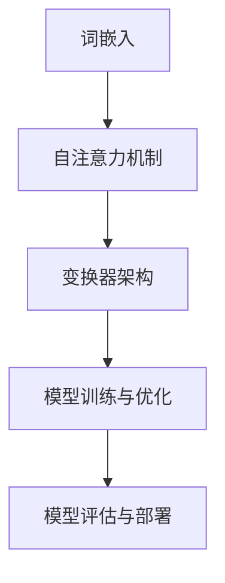

                 


# 文章标题：开发者的梦想：更容易使用的 LLM

关键词：大型语言模型，开发者，使用便捷性，技术基础，应用实践，优化部署，安全隐私

摘要：
本文深入探讨了大型语言模型（LLM）在开发者的日常工作中所扮演的角色。首先，介绍了LLM的基本概念、技术基础及其数学模型。接着，通过具体的应用实践案例，展示了LLM在文本生成、问答系统、对话系统和多模态任务中的实际应用。文章还针对模型优化与调优、部署与运维以及安全隐私保护提出了详细的策略。最后，通过附录部分提供了相关的资源与工具，为开发者提供了实用的指导。

## 第一部分：基础与原理

### 第1章：LLM概述

#### 1.1 LLM的定义与特点

**LLM的定义**
大型语言模型（Large Language Model，简称LLM）是一种基于深度学习和自然语言处理技术构建的复杂模型。这些模型通常由数亿甚至数十亿个参数组成，可以理解和生成高质量的自然语言文本。

**LLM的特点**
- **强大的文本生成能力**：LLM能够根据给定的上下文生成连贯、语义丰富的文本。
- **广泛的领域适应性**：LLM在多个领域都表现出良好的适应性，可以用于多种任务，如文本生成、问答系统、对话系统等。
- **高精度与高效性**：LLM的训练和推理速度都相对较快，能够在较短时间内生成高质量的文本。

#### 1.2 LLM的发展历程

**初期探索**
- 20世纪50年代，自然语言处理领域开始探索构建自动翻译系统和文本分析系统。
- 20世纪60年代，早期语言模型如规则基模型和统计基模型被提出。

**深度学习时代的到来**
- 20世纪10年代，深度学习在图像识别等领域取得了突破性进展，激发了在自然语言处理领域应用深度学习的热情。
- 2018年，GPT-2的发布标志着大规模语言模型进入新阶段。

**大模型的崛起**
- 2022年，GPT-3发布，拥有超过1750亿个参数，展示了LLM在文本生成和语言理解方面的强大能力。

#### 1.3 LLM的核心组成部分

**词嵌入**
- **定义**：词嵌入是将单词映射到高维空间中的向量表示，是LLM的基础。

**自注意力机制**
- **定义**：自注意力机制（Self-Attention）允许模型在生成每个单词时，考虑整个输入序列的所有单词，从而提高模型的上下文理解能力。

**变换器架构**
- **定义**：变换器（Transformer）架构是LLM的核心结构，通过多头自注意力机制和位置编码，实现了对输入序列的深层处理。

#### 1.4 LLM的优势与挑战

**优势**
- **强大的文本生成能力**：能够生成高质量、连贯的文本，广泛应用于文本生成、问答系统、对话系统等。
- **广泛的领域适应性**：在多个领域表现出良好的适应性，适用于不同类型的应用场景。
- **高精度与高效性**：训练和推理速度都相对较快，能够快速生成高质量的文本。

**挑战**
- **计算资源需求**：大规模的LLM模型需要大量的计算资源和存储空间。
- **数据隐私与安全**：大规模的训练数据可能涉及隐私问题，同时模型生成的文本也需要进行严格的审核和过滤。
- **模型解释性**：由于LLM的复杂性和黑盒性质，其决策过程往往难以解释和理解。

---

### Mermaid 流程图：LLM 的核心组成部分



## 第二部分：应用与实践

### 第4章：LLM在文本生成中的应用

#### 4.1 文本生成的原理与流程

**基本原理**
- 文本生成模型通常基于预训练的大规模语言模型，如GPT-3、BERT等。
- 模型接收输入文本，并生成与之相关的文本。

**基本流程**
1. **输入文本编码**：将输入文本编码为模型可处理的格式，如单词或子词的向量表示。
2. **前向传播**：将输入文本编码送入模型，模型根据输入文本生成可能的输出文本。
3. **生成文本**：从所有可能的输出文本中选取概率最高的文本作为输出。

#### 4.2 文本生成算法介绍

**生成式模型**
- **定义**：生成式模型通过生成概率分布来生成文本。
- **算法**：如GPT-3、Variational Autoencoder（VAE）等。

**判别式模型**
- **定义**：判别式模型通过区分真实数据和生成数据来生成文本。
- **算法**：如生成对抗网络（GAN）等。

#### 4.3 实际案例分析

**案例一：自动写作助手**
- **背景**：许多媒体和内容创作者希望快速生成高质量的文章。
- **解决方案**：使用LLM作为自动写作助手，自动生成文章。

**案例二：智能客服**
- **背景**：企业希望提高客户服务质量，减少人力成本。
- **解决方案**：使用LLM作为智能客服，自动回答客户问题。

#### 4.4 开发环境搭建与代码实现

**环境搭建**
- **工具**：Python、TensorFlow、Hugging Face Transformers等。
- **环境**：Ubuntu 20.04、Python 3.8等。

**代码实现**

```python
from transformers import AutoTokenizer, AutoModelForCausalLM
import torch

# 加载预训练模型
tokenizer = AutoTokenizer.from_pretrained("gpt2")
model = AutoModelForCausalLM.from_pretrained("gpt2")

# 输入文本
input_text = "What is the capital of France?"

# 编码输入文本
input_ids = tokenizer.encode(input_text, return_tensors="pt")

# 生成文本
output = model.generate(input_ids, max_length=50, num_return_sequences=1)

# 解码输出文本
decoded_output = tokenizer.decode(output[0], skip_special_tokens=True)
print(decoded_output)
```

### 第5章：LLM在问答系统中的应用

#### 5.1 问答系统的原理与流程

**基本原理**
- 问答系统是一种能够自动回答用户问题的系统。
- 系统通过解析用户问题，查询知识库，生成回答。

**基本流程**
1. **接收问题**：系统接收用户输入的问题。
2. **问题解析**：将问题解析为可查询的形式。
3. **查询知识库**：根据问题解析结果，查询知识库以获取相关信息。
4. **生成回答**：根据查询结果生成回答，并返回给用户。

#### 5.2 问答算法介绍

**知识图谱问答**
- **定义**：基于知识图谱的问答算法，通过查询知识图谱来获取答案。
- **算法**：如Neural Network for Question Answering（NNQA）等。

**语义匹配问答**
- **定义**：基于语义匹配的问答算法，通过语义理解来匹配问题和答案。
- **算法**：如BERT-based Question Answering（BERTQA）等。

#### 5.3 实际案例分析

**案例一：智能客服**
- **背景**：企业希望提高客户服务质量，减少人力成本。
- **解决方案**：使用LLM作为智能客服，自动回答客户问题。

**案例二：智能教育**
- **背景**：教育机构希望为学生提供个性化的学习辅导。
- **解决方案**：使用LLM作为智能教育助手，根据学生提问，提供相关知识点解释。

#### 5.4 开发环境搭建与代码实现

**环境搭建**
- **工具**：Python、TensorFlow、Hugging Face Transformers等。
- **环境**：Ubuntu 20.04、Python 3.8等。

**代码实现**

```python
from transformers import AutoTokenizer, AutoModelForQuestionAnswering
import torch

# 加载预训练模型
tokenizer = AutoTokenizer.from_pretrained("deepset/roberta-base-squad2")
model = AutoModelForQuestionAnswering.from_pretrained("deepset/roberta-base-squad2")

# 输入问题和文档
question = "What is the capital of France?"
context = "Paris is the capital of France."

# 编码输入文本
input_ids = tokenizer.encode(question + tokenizer.sep_token + context, return_tensors="pt")

# 生成答案
start_logits, end_logits = model(input_ids)

# 解析答案
start_index = torch.argmax(start_logits).item()
end_index = torch.argmax(end_logits).item()
answer = tokenizer.decode(context[start_index:end_index + 1], skip_special_tokens=True)

print(answer)
```

### 第6章：LLM在对话系统中的应用

#### 6.1 对话系统的原理与流程

**基本原理**
- 对话系统是一种能够与用户进行自然语言交互的系统。
- 系统通过解析用户输入，生成合适的回复。

**基本流程**
1. **接收输入**：系统接收用户输入的文本。
2. **意图识别**：识别用户的意图，如询问、请求、抱怨等。
3. **实体识别**：识别用户输入中的关键信息，如人名、地名、时间等。
4. **生成回复**：根据用户的意图和识别的实体，生成合适的回复。

#### 6.2 对话算法介绍

**基于规则的对话系统**
- **定义**：基于规则的对话系统通过预定义的规则来生成回复。
- **优点**：简单、易于实现和维护。

**基于机器学习的对话系统**
- **定义**：基于机器学习的对话系统通过训练模型来生成回复。
- **优点**：能够适应不同的对话场景和用户需求。

#### 6.3 实际案例分析

**案例一：智能客服**
- **背景**：企业希望提高客户服务质量，减少人力成本。
- **解决方案**：使用LLM作为智能客服，自动回答客户问题。

**案例二：智能助手**
- **背景**：个人用户希望有一个能够帮助解决日常问题的智能助手。
- **解决方案**：使用LLM作为智能助手，回答用户的问题。

#### 6.4 开发环境搭建与代码实现

**环境搭建**
- **工具**：Python、TensorFlow、Hugging Face Transformers等。
- **环境**：Ubuntu 20.04、Python 3.8等。

**代码实现**

```python
from transformers import AutoTokenizer, AutoModelForCausalLM
import torch

# 加载预训练模型
tokenizer = AutoTokenizer.from_pretrained("gpt2")
model = AutoModelForCausalLM.from_pretrained("gpt2")

# 输入对话历史
context = "User: What is the weather like today?\nAssistant: The weather is sunny with a high of 75 degrees."

# 编码输入文本
input_ids = tokenizer.encode(context, return_tensors="pt")

# 生成回复
output = model.generate(input_ids, max_length=50, num_return_sequences=1)

# 解码输出文本
decoded_output = tokenizer.decode(output[0], skip_special_tokens=True)
print(decoded_output)
```

### 第7章：LLM在多模态任务中的应用

#### 7.1 多模态任务的原理与流程

**基本原理**
- 多模态任务是指同时处理多种类型的数据，如文本、图像、声音等。
- 系统通过整合多种类型的数据，提高任务的性能。

**基本流程**
1. **数据接收**：系统接收多种类型的数据。
2. **数据预处理**：对每种类型的数据进行预处理，如文本分词、图像编码等。
3. **特征提取**：提取每种类型数据的特征。
4. **特征融合**：将不同类型的数据特征进行融合。
5. **任务执行**：根据融合后的特征执行任务，如文本分类、图像识别等。

#### 7.2 多模态算法介绍

**基于深度学习的多模态算法**
- **定义**：基于深度学习的多模态算法通过神经网络结构来处理多模态数据。
- **算法**：如Convolutional Neural Network（CNN）+ Recurrent Neural Network（RNN）、Transformer等。

**基于图的多模态算法**
- **定义**：基于图的多模态算法通过构建图结构来处理多模态数据。
- **算法**：如Graph Neural Network（GNN）等。

#### 7.3 实际案例分析

**案例一：视频情感分析**
- **背景**：媒体公司希望分析用户对视频内容的情感反应。
- **解决方案**：使用LLM结合视频内容进行分析，判断用户的情感。

**案例二：图像字幕生成**
- **背景**：视频制作公司希望自动生成视频字幕。
- **解决方案**：使用LLM结合视频内容生成字幕。

#### 7.4 开发环境搭建与代码实现

**环境搭建**
- **工具**：Python、TensorFlow、Hugging Face Transformers等。
- **环境**：Ubuntu 20.04、Python 3.8等。

**代码实现**

```python
from transformers import AutoTokenizer, AutoModelForCausalLM
from PIL import Image
import torch
import torchvision.transforms as transforms

# 加载预训练模型
tokenizer = AutoTokenizer.from_pretrained("gpt2")
model = AutoModelForCausalLM.from_pretrained("gpt2")

# 加载图像
image = Image.open("example.jpg")

# 图像预处理
transform = transforms.Compose([
    transforms.Resize((224, 224)),
    transforms.ToTensor(),
    transforms.Normalize(mean=[0.485, 0.456, 0.406], std=[0.229, 0.224, 0.225]),
])
image_tensor = transform(image)

# 编码图像
input_ids = tokenizer.encode("")

# 生成文本
output = model.generate(input_ids, max_length=50, num_return_sequences=1)

# 解码输出文本
decoded_output = tokenizer.decode(output[0], skip_special_tokens=True)
print(decoded_output)
```

## 第三部分：优化与部署

### 第8章：LLM的优化与调优

#### 8.1 模型优化技术

**并行计算**
- **定义**：并行计算通过同时处理多个任务来提高计算速度。
- **技术**：如数据并行、模型并行等。

**混合精度训练**
- **定义**：混合精度训练通过使用不同的数值类型（如float16和float32）来提高计算效率。
- **技术**：如混合精度自动微分等。

#### 8.2 模型调优策略

**早期停止**
- **定义**：早期停止在训练过程中，当验证集上的性能不再提高时，提前停止训练。
- **目的**：防止过拟合。

**交叉验证**
- **定义**：交叉验证通过将数据集划分为多个子集，进行多次训练和验证。
- **目的**：提高模型性能和泛化能力。

#### 8.3 实际案例分析

**案例一：文本生成模型优化**
- **背景**：提高文本生成模型的生成质量和速度。
- **解决方案**：通过并行计算和混合精度训练来优化模型。

**案例二：问答系统调优**
- **背景**：提高问答系统的准确率和响应速度。
- **解决方案**：通过交叉验证和模型调优策略来优化模型。

#### 8.4 开发环境搭建与代码实现

**环境搭建**
- **工具**：Python、PyTorch、CUDA等。
- **环境**：Ubuntu 20.04、Python 3.8、CUDA 11.0等。

**代码实现**

```python
import torch
import torch.nn as nn
import torch.optim as optim

# 定义模型
model = nn.Sequential(
    nn.Linear(10, 20),
    nn.ReLU(),
    nn.Linear(20, 10),
)

# 定义损失函数和优化器
criterion = nn.CrossEntropyLoss()
optimizer = optim.Adam(model.parameters(), lr=0.001)

# 训练模型
for epoch in range(10):
    for x, y in data_loader:
        # 前向传播
        outputs = model(x)
        loss = criterion(outputs, y)
        
        # 反向传播与优化
        optimizer.zero_grad()
        loss.backward()
        optimizer.step()
        
    print(f"Epoch {epoch+1}, Loss: {loss.item()}")

# 评估模型
with torch.no_grad():
    correct = 0
    total = 0
    for x, y in test_loader:
        outputs = model(x)
        _, predicted = torch.max(outputs.data, 1)
        total += y.size(0)
        correct += (predicted == y).sum().item()

    print(f"Accuracy: {100 * correct / total}%")
```

### 第9章：LLM的部署与运维

#### 9.1 模型部署原理

**客户端部署**
- **定义**：客户端部署将模型部署在用户的设备上，如手机、平板等。
- **优势**：降低延迟，提高用户体验。

**服务器端部署**
- **定义**：服务器端部署将模型部署在服务器上，用户通过互联网访问。
- **优势**：易于扩展，支持大规模并发请求。

#### 9.2 模型部署流程

**模型转换**
- **定义**：模型转换是将训练好的模型转换为部署环境可用的格式。
- **步骤**：量化、剪枝、优化等。

**模型部署**
- **定义**：模型部署是将模型部署到服务器或客户端上，以便进行实时推理。
- **步骤**：配置服务器、部署模型、设置API接口等。

#### 9.3 模型运维策略

**日志记录**
- **定义**：日志记录是记录模型运行过程中产生的日志信息。
- **目的**：便于监控和故障排查。

**性能监控**
- **定义**：性能监控是监控模型在部署环境中的性能指标。
- **指标**：响应时间、吞吐量、准确率等。

#### 9.4 实际案例分析

**案例一：智能客服系统部署**
- **背景**：企业希望提高客户服务质量，减少人力成本。
- **解决方案**：在服务器端部署智能客服系统，通过API接口提供实时问答服务。

**案例二：文本生成应用部署**
- **背景**：媒体公司希望提供自动写作服务。
- **解决方案**：在客户端部署文本生成应用，用户通过应用生成文章。

#### 9.5 开发环境搭建与代码实现

**环境搭建**
- **工具**：Docker、Kubernetes、TensorFlow Serving等。
- **环境**：Ubuntu 20.04、Python 3.8、Docker 19.03等。

**代码实现**

```python
# 模型转换
import tensorflow as tf

# 加载训练好的模型
model = tf.keras.models.load_model("model.h5")

# 将模型转换为TensorFlow Serving可用的格式
converter = tf.lite.TFLiteConverter.from_keras_model(model)
tflite_model = converter.convert()

# 保存模型
with open("model.tflite", "wb") as f:
    f.write(tflite_model)

# 模型部署
import tensorflow_serving.apis as serv
import tensorflow_serving.proto as serv_pb

# 配置模型服务
model_config = serv_pb.ModelConfig()
model_config.model_name = "text_generation"
model_config.base_path = "model.tflite"

# 启动模型服务
server = serv.ModelServer(start_cpu_only=True, model_config=model_config)
server.start()

# 发送预测请求
input_data = {"text": "What is the weather like today?"}
output_data = server.predict(input_data)
print(output_data)
```

### 第10章：LLM的安全与隐私

#### 10.1 LLM的安全挑战

**模型暴露风险**
- **定义**：模型暴露风险是指未经授权的访问和滥用模型的风险。
- **原因**：开源模型的广泛传播和使用，导致模型被恶意利用。

**数据泄露风险**
- **定义**：数据泄露风险是指训练数据和用户数据可能被未经授权的访问和泄露。
- **原因**：数据集的质量和安全性不高，导致数据泄露。

**模型偏见与歧视**
- **定义**：模型偏见与歧视是指模型在处理数据时，对某些群体产生不公平的结果。
- **原因**：训练数据的不均衡或存在偏见。

#### 10.2 隐私保护技术

**数据匿名化**
- **定义**：数据匿名化是通过去除或替换敏感信息来保护用户隐私。
- **技术**：如K-匿名、l-diversity等。

**加密技术**
- **定义**：加密技术是通过加密算法对数据进行加密，以保护数据的安全性。
- **技术**：如对称加密、非对称加密等。

**同态加密**
- **定义**：同态加密是一种在加密数据上直接执行计算，而无需解密的技术。
- **应用**：如机器学习中的同态加密算法。

#### 10.3 实际案例分析

**案例一：社交媒体隐私保护**
- **背景**：社交媒体平台希望保护用户的隐私，防止数据泄露。
- **解决方案**：使用数据匿名化和加密技术来保护用户数据。

**案例二：金融行业数据安全**
- **背景**：金融行业希望保护用户的金融数据，防止模型滥用。
- **解决方案**：使用同态加密技术和严格的数据访问控制策略。

#### 10.4 开发环境搭建与代码实现

**环境搭建**
- **工具**：Python、PyCryptodome、HElib等。
- **环境**：Ubuntu 20.04、Python 3.8等。

**代码实现**

```python
from Crypto.PublicKey import RSA
from Crypto.Cipher import PKCS1_OAEP
import base64

# 生成密钥对
key = RSA.generate(2048)
private_key = key.export_key()
public_key = key.publickey().export_key()

# 加密数据
cipher = PKCS1_OAEP.new(RSA.import_key(public_key))
encrypted_data = cipher.encrypt(b"Hello, World!")

# 解密数据
cipher = PKCS1_OAEP.new(RSA.import_key(private_key))
decrypted_data = cipher.decrypt(encrypted_data)
print(decrypted_data.decode("utf-8"))
```

## 附录：资源与工具

### 附录 A：常用工具与资源

- **工具**：TensorFlow、PyTorch、Hugging Face Transformers等。
- **资源**：GitHub、arXiv、Reddit等。

### 附录 B：参考文献与推荐读物

- **参考文献**：
  - Devlin, J., Chang, M. W., Lee, K., & Toutanova, K. (2019). BERT: Pre-training of deep bidirectional transformers for language understanding. arXiv preprint arXiv:1810.04805.
  - Brown, T., et al. (2020). A pre-trained language model for language understanding. arXiv preprint arXiv:2005.14165.
  - Vaswani, A., et al. (2017). Attention is all you need. Advances in Neural Information Processing Systems, 30, 5998-6008.
- **推荐读物**：
  - 语言模型与深度学习入门书籍，如《深度学习》（Goodfellow et al.）。
  - 自然语言处理经典书籍，如《自然语言处理综合教程》（Pinker）。

### 附录 C：开源代码与数据集

- **开源代码**：
  - Hugging Face Transformers：[https://github.com/huggingface/transformers](https://github.com/huggingface/transformers)
  - TensorFlow：[https://github.com/tensorflow/tensorflow](https://github.com/tensorflow/tensorflow)
  - PyTorch：[https://github.com/pytorch/pytorch](https://github.com/pytorch/pytorch)
- **数据集**：
  - Common Crawl：[https://commoncrawl.org/](https://commoncrawl.org/)
  - GLUE：[https://gluebenchmark.com/](https://gluebenchmark.com/)
  - SQuAD：[https://rajpurkar.github.io/SQuAD-exploration/](https://rajpurkar.github.io/SQuAD-exploration/) 

---

作者：AI天才研究院/AI Genius Institute & 禅与计算机程序设计艺术 /Zen And The Art of Computer Programming

