                 

# 开源技术推动AI进步的重要性

> 关键词：开源技术、人工智能、深度学习、AI发展、伦理、安全、全球合作

> 摘要：本文旨在探讨开源技术对人工智能（AI）发展的推动作用。通过分析开源技术的起源、特点及应用领域，本文阐述了开源技术如何成为AI领域的重要推动力量。文章还将探讨开源技术对AI研发、商业化、教育、伦理和安全方面的影响，以及开源技术在全球AI合作中的角色。最后，本文将展望开源技术在AI领域的未来发展趋势，总结其对AI进步的推动作用。

### 第一部分: 开源技术对AI发展的推动作用

#### 第1章: 开源技术概述

##### 1.1 开源运动的起源与发展

开源运动的起源可以追溯到20世纪90年代，当时的互联网刚刚兴起，软件开发者开始在互联网上分享源代码，以促进协作和改进。这一运动的核心思想是自由软件和开放源代码，倡导软件的自由共享和修改。最早的知名开源项目之一是Linux操作系统，它由Linus Torvalds在1991年发布，吸引了全球范围内的开发者共同参与。

随着开源运动的不断发展，越来越多的项目和社区涌现出来。开源技术的特点逐渐显现，如开放性、透明性、协作性和灵活性。这些特点使得开源技术在全球范围内得到了广泛的应用和认可。

##### 1.2 开源技术的特点与优势

开源技术具有以下特点与优势：

1. **开放性**：开源技术的源代码是公开的，任何人都可以访问和修改。这种开放性促进了技术的创新和改进，因为更多的人可以参与到技术的开发和优化过程中。

2. **透明性**：开源技术的开发过程是透明的，任何人都可以查看和跟踪项目的进展。这种透明性有助于提高项目的可信度和可靠性。

3. **协作性**：开源技术鼓励开发者之间的协作和合作。通过协作，开发者可以共同解决技术难题，提高开发效率。

4. **灵活性**：开源技术可以根据用户的需求进行定制和修改。这种灵活性使得用户可以根据自己的需求来优化和使用技术。

5. **可定制性**：开源技术可以轻松地集成到其他系统中，与其他技术进行整合。这种可定制性为用户提供了更多的选择和灵活性。

##### 1.3 开源技术的应用领域

开源技术广泛应用于各个领域，其中最为重要的是操作系统、数据库、云计算、大数据和人工智能。在操作系统方面，Linux已经成为主流操作系统之一，广泛应用于服务器、桌面和移动设备。在数据库领域，MySQL、PostgreSQL等开源数据库已经成为企业级数据库的首选。在云计算领域，OpenStack、Kubernetes等开源项目为云服务提供商和用户提供了强大的基础设施支持。在大数据领域，Hadoop、Spark等开源项目已经成为大数据处理和分析的重要工具。在人工智能领域，TensorFlow、PyTorch、Keras等开源深度学习框架为研究者提供了丰富的资源和工具。

#### 第2章: 开源技术对AI发展的推动作用

##### 2.1 开源技术在AI领域的重要性

开源技术在人工智能领域具有重要的地位，因为人工智能的发展依赖于大量的数据、算法和工具。开源技术为人工智能的研究者提供了丰富的资源和工具，促进了人工智能的快速发展。

1. **数据**：开源技术为人工智能提供了大量的数据集，如ImageNet、CIFAR-10等，这些数据集是训练和评估AI模型的重要资源。

2. **算法**：开源技术提供了丰富的算法库，如TensorFlow、PyTorch等，这些算法库为研究者提供了强大的算法支持。

3. **工具**：开源技术为人工智能提供了各种工具，如Jupyter Notebook、Google Colab等，这些工具使得研究者可以方便地进行实验和开发。

##### 2.2 开源技术在AI研发中的应用

开源技术在AI研发中的应用主要体现在以下几个方面：

1. **深度学习框架**：TensorFlow、PyTorch、Keras等开源深度学习框架为研究者提供了强大的算法支持和工具集。这些框架具有以下特点：

   - **架构**：TensorFlow和PyTorch都采用了计算图（Compute Graph）的方式，通过定义计算图来构建和训练模型。Keras则通过高层次的API简化了模型的构建过程。
   
   - **特点**：TensorFlow具有强大的生态和工具支持，如TensorBoard、TensorFlow Lite等。PyTorch以其动态计算图和灵活性著称，适合快速迭代和实验。Keras则以其简单易用的API而受到广泛欢迎。

   - **优势**：这些框架都支持多种编程语言，如Python、C++等，使得研究者可以根据自己的需求选择合适的框架。

2. **数据预处理工具**：开源技术提供了丰富的数据预处理工具，如NumPy、Pandas等。这些工具可以帮助研究者进行数据清洗、转换和预处理，为AI模型的训练提供高质量的数据。

3. **评估工具**：开源技术提供了各种评估工具，如Metrics、Scikit-learn等。这些工具可以帮助研究者评估AI模型的性能和效果，优化模型的参数和架构。

##### 2.3 开源技术在AI商业化中的应用

开源技术对AI商业化的推动作用主要体现在以下几个方面：

1. **开源AI工具和平台的发展**：随着AI技术的商业化，越来越多的开源AI工具和平台应运而生。如Google Colab、AWS Sagemaker、Azure Machine Learning等，这些平台为企业和开发者提供了便捷的AI开发环境和工具支持。

2. **开源AI模型的应用**：开源技术为企业和开发者提供了丰富的AI模型和应用案例。如人脸识别、语音识别、自然语言处理等，这些模型和应用可以为企业提供强大的技术支持，加快AI商业化的进程。

3. **开源AI社区的贡献**：开源社区为AI技术的发展和推广做出了巨大贡献。开源社区中的开发者不仅积极参与技术的研发和优化，还通过分享经验和技术，促进了AI知识的普及和传播。

### 第二部分: 开源技术在AI领域的影响

#### 第3章: 开源技术对AI教育的影响

##### 3.1 开源技术在AI教育中的应用

开源资源在教育领域具有重要价值，为AI教育提供了丰富的资源和平台。以下是一些主要的开源资源：

1. **在线课程**：许多顶尖大学和机构提供免费的在线课程，如Coursera、edX、Udacity等。这些课程涵盖了AI的各个领域，从基础理论到应用实践，为学生提供了系统的学习路径。

2. **教材**：开源教材如《深度学习》（Deep Learning）和《Python深度学习》（Python Deep Learning）等，提供了详细的理论和实践指导，帮助学生深入了解AI技术。

3. **实验平台**：开源实验平台如Google Colab、Kaggle等，为研究者提供了便捷的计算资源和数据集，使得学生和研究者可以轻松进行AI实验和项目开发。

##### 3.2 开源技术促进AI知识的普及

开源技术通过以下方式促进了AI知识的普及：

1. **打破知识壁垒**：开源技术使得AI知识和技术更加开放和普及。任何人都可以访问和利用开源资源进行学习和研究，不再受限于传统的学术和商业壁垒。

2. **降低学习门槛**：开源技术提供了丰富的工具和资源，降低了学习AI的门槛。学生和初学者可以通过开源资源进行实践和探索，逐步掌握AI技术和方法论。

3. **共享经验和知识**：开源社区鼓励知识共享和合作。通过开源项目，开发者可以分享自己的经验和成果，为其他开发者提供帮助和支持。

#### 第4章: 开源技术在AI伦理和安全方面的作用

##### 4.1 开源技术在AI伦理方面的影响

开源技术对AI伦理的讨论和规范制定产生了积极影响：

1. **促进伦理讨论**：开源技术使得AI伦理问题更加公开和透明。开发者可以在开源项目中讨论和反思AI伦理问题，推动社会对AI伦理的关注和讨论。

2. **规范制定**：开源社区可以共同制定AI伦理规范和标准。通过开放和协作的方式，开源社区可以共同探索和制定适用于AI发展的伦理规范，指导AI技术的应用和发展。

##### 4.2 开源技术在AI安全方面的贡献

开源技术为提高AI系统的安全性做出了重要贡献：

1. **安全工具和平台**：开源技术提供了丰富的安全工具和平台，如PyTorch Security、OpenAI Gym等，帮助开发者检测、防护和修复AI系统的安全漏洞。

2. **安全研究**：开源社区鼓励安全研究，通过共享研究成果和工具，促进AI安全领域的发展。开源项目如AI Safety Lab、OpenAI等，为AI安全研究提供了重要的支持。

3. **透明性和审查**：开源技术的开放性和透明性使得AI系统的安全性更容易受到审查和评估。开源项目允许其他开发者审查代码和算法，发现和修复潜在的安全问题。

### 第三部分: 开源技术在全球AI合作中的角色

#### 第5章: 开源技术在全球AI合作中的角色

##### 5.1 全球AI合作的现状与挑战

全球AI合作正面临着一系列现状与挑战：

1. **国际合作项目**：全球范围内有许多AI国际合作项目，如欧盟的Horizon 2020计划、美国的AI Research Office等。这些项目旨在促进AI技术的研究和开发，推动全球AI合作。

2. **研究机构和企业的合作**：全球范围内的研究机构和企业在AI领域进行了广泛的合作。例如，谷歌、微软、IBM等科技巨头与高校和研究机构合作，共同推动AI技术的发展。

3. **现状与挑战**：全球AI合作面临的主要挑战包括数据隐私、知识产权保护、伦理规范制定和国际竞争等。这些挑战需要全球范围内的协作和合作来解决。

##### 5.2 开源技术在促进全球AI合作中的作用

开源技术在促进全球AI合作中发挥着重要作用：

1. **开源框架和平台的跨国合作**：开源框架和平台如TensorFlow、PyTorch等，为全球开发者提供了统一的开发环境和工具。通过这些开源框架和平台，开发者可以方便地跨国合作，共同推动AI技术的发展。

2. **知识共享和协作**：开源社区鼓励知识共享和协作。全球范围内的开发者可以在开源项目中共享自己的研究成果和经验，共同解决技术难题。

3. **解决全球合作难题**：开源技术可以解决全球AI合作中的许多难题。例如，开源框架和平台可以降低跨国合作的门槛，促进知识共享和协作。开源社区可以共同制定AI伦理规范和标准，推动全球AI合作的健康发展。

### 第四部分: 开源技术未来的发展趋势

#### 第6章: 开源技术未来的发展趋势

##### 6.1 开源技术在AI领域的未来趋势

开源技术在人工智能领域的未来发展趋势包括：

1. **算法创新**：随着AI技术的发展，开源社区将不断推动算法的创新。例如，在深度学习领域，可能会出现更多高效、可扩展的算法和框架。

2. **工具优化**：开源社区将持续优化AI开发工具和平台，提高开发效率和性能。例如，通过改进计算图引擎和优化模型部署，开源技术将更加高效地支持AI应用。

3. **生态构建**：开源技术将在AI领域构建更加完善的生态系统。这包括从数据采集、数据处理到模型训练和部署的各个环节，为开发者提供全方位的支持。

##### 6.2 开源技术对AI行业的长期影响

开源技术对AI行业的长期影响将体现在以下几个方面：

1. **技术标准的制定**：开源社区将在AI领域制定一系列技术标准，规范AI技术的发展和应用。这些标准将有助于促进AI行业的健康发展，降低技术壁垒。

2. **行业生态的构建**：开源技术将推动AI行业的生态构建，促进各行业之间的融合和创新。例如，医疗、金融、交通等领域将受益于AI技术的发展，实现产业升级和转型。

3. **全球合作深化**：开源技术将促进全球范围内的AI合作，推动全球AI技术的发展和应用。通过开源社区的协作，各国将共同应对AI领域面临的挑战，实现共同进步。

### 第五部分: 结论与展望

#### 第7章: 结论与展望

##### 7.1 开源技术对AI进步的总结

开源技术对人工智能的进步具有重要作用。通过开放共享、协作创新和知识普及，开源技术为AI领域提供了丰富的资源和工具，推动了AI技术的发展和应用。开源技术在AI研发、商业化、教育和伦理安全等方面发挥了重要作用，成为AI领域的重要推动力量。

##### 7.2 开源技术的未来发展方向

开源技术在人工智能领域的未来发展方向包括：

1. **算法创新**：开源社区将继续推动AI算法的创新，为研究者提供更多高效、可扩展的算法和框架。

2. **工具优化**：开源社区将不断优化AI开发工具和平台，提高开发效率和性能，为开发者提供更全面的解决方案。

3. **生态构建**：开源技术将在AI领域构建更加完善的生态系统，促进各行业之间的融合和创新。

4. **全球合作**：开源技术将推动全球范围内的AI合作，实现各国在AI领域的共同进步。

### 附录

#### 附录A.1 主流开源深度学习框架对比

- **TensorFlow**：由谷歌开发，具有强大的生态和工具支持，如TensorFlow Lite、TensorFlow Serving等。适用于各种规模的AI项目，从研究到生产。
- **PyTorch**：由Facebook开发，以动态计算图和灵活性著称，适合快速迭代和实验。具有丰富的API和良好的文档。
- **Keras**：基于TensorFlow和Theano，提供了简单易用的API，适用于快速构建和训练模型。

#### 附录A.2 开源AI技术工具和平台推荐

- **Google Colab**：提供了免费的GPU和TPU计算资源，方便进行深度学习实验。
- **AWS Sagemaker**：提供了完整的AI开发和服务工具，支持多种深度学习框架。

#### 附录A.3 开源AI社区和论坛指南

- **GitHub**：全球最大的开源代码托管平台，提供了丰富的AI项目资源。
- **AIStack**：一个专注于AI技术的开源社区，提供了AI工具、资源和教程。

### 作者

作者：AI天才研究院/AI Genius Institute & 禅与计算机程序设计艺术 /Zen And The Art of Computer Programming

---

#### 核心概念与联系

开源技术、人工智能、深度学习、AI发展、伦理、安全、全球合作。

---

#### 第一部分: 开源技术对AI发展的推动作用

**1.1.1 开源运动的起源**

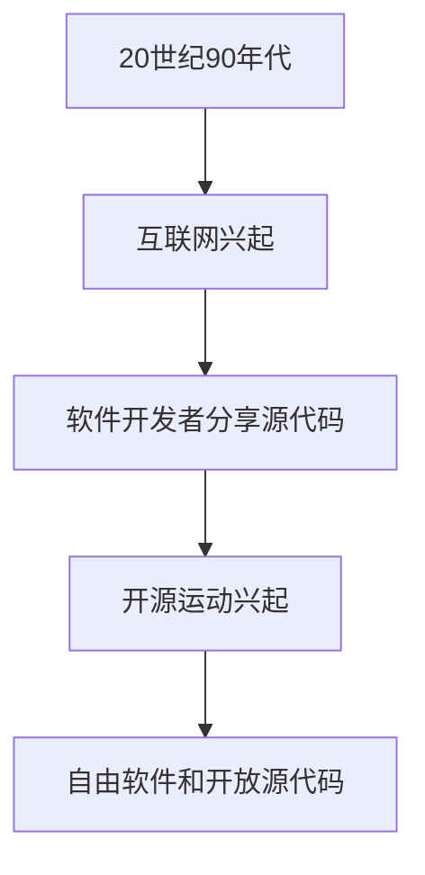

**1.2.1 开源技术的特点**

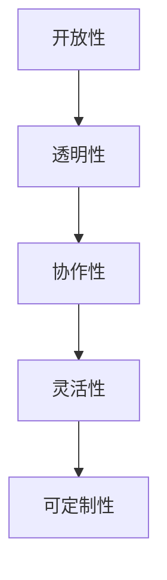

**1.3.1 开源技术的应用领域**

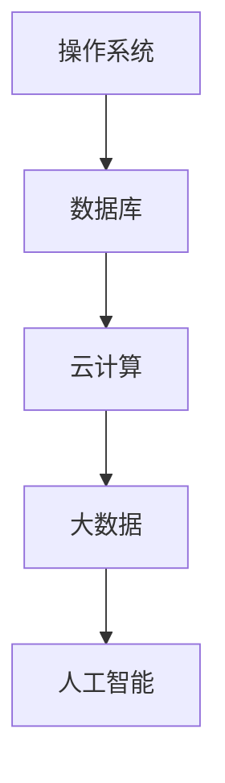

---

#### 第二部分: 开源技术对AI发展的推动作用

**2.1.1 开源技术在AI领域的重要性**

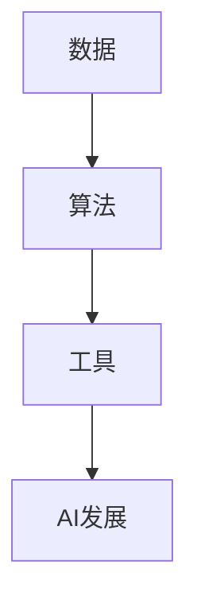

**2.2.1 开源深度学习框架**

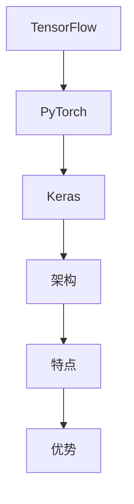

**2.3.1 开源技术对AI商业化的推动作用**

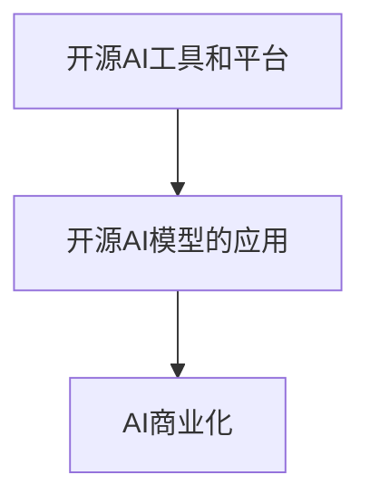

---

#### 第三部分: 开源技术在AI领域的影响

**3.1.1 开源资源在教育中的价值**

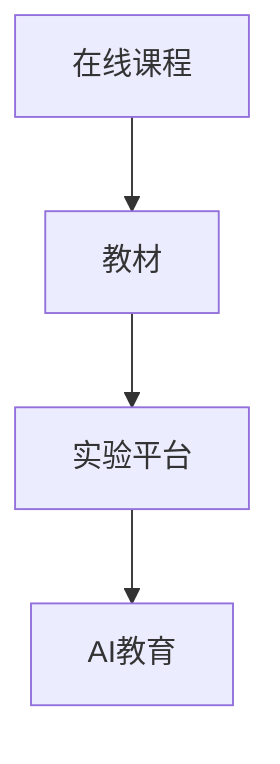

**3.2.1 开源技术如何普及AI知识**

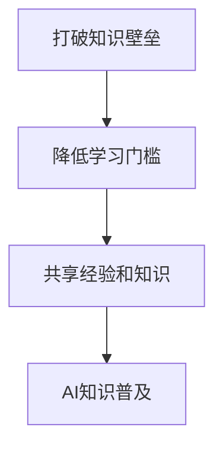

---

#### 第四部分: 开源技术在全球AI合作中的角色

**5.1.1 全球AI合作的现状**

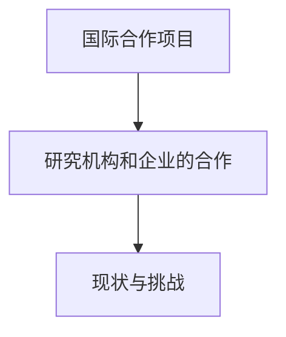

**5.2.1 开源技术在促进全球AI合作中的应用**

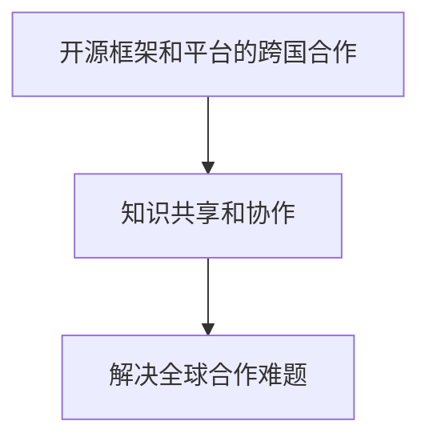

---

#### 第六部分: 开源技术未来的发展趋势

**6.1.1 开源技术在AI领域的未来趋势**

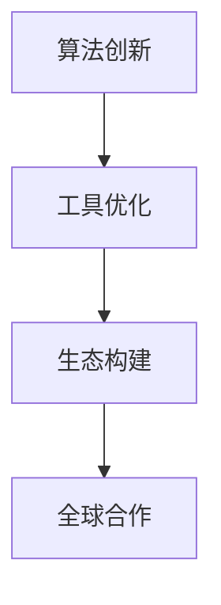

**6.2.1 开源技术对AI行业的长期影响**

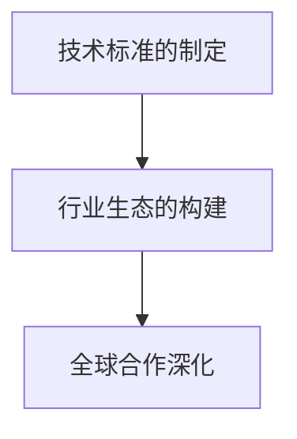

---

#### 附录A.1 主流开源深度学习框架对比

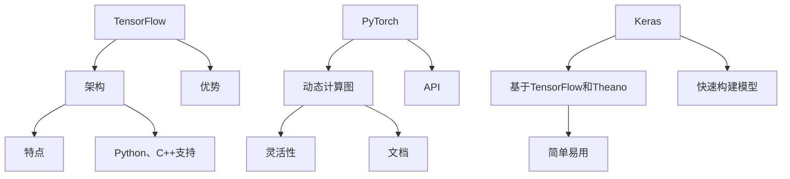

---

#### 附录A.2 开源AI技术工具和平台推荐

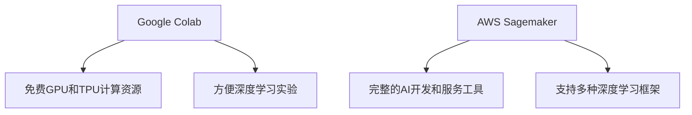

---

#### 附录A.3 开源AI社区和论坛指南

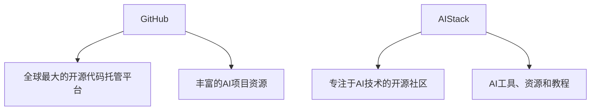

