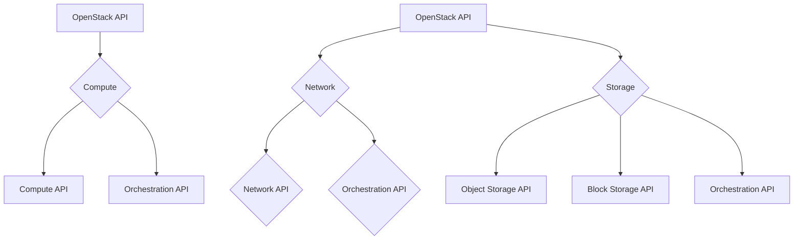
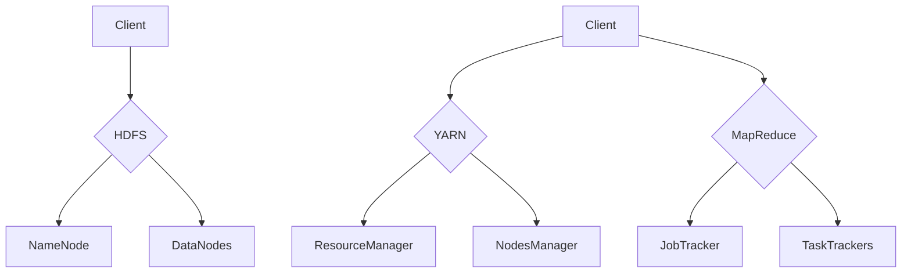
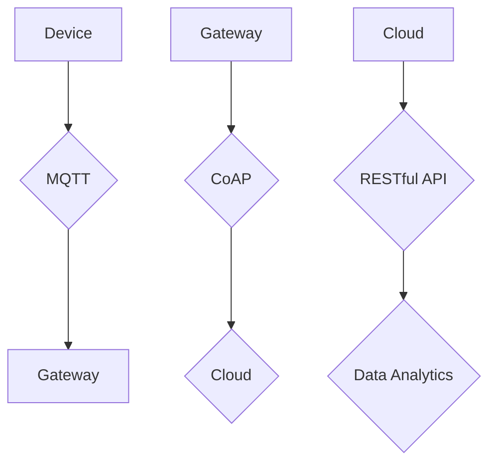
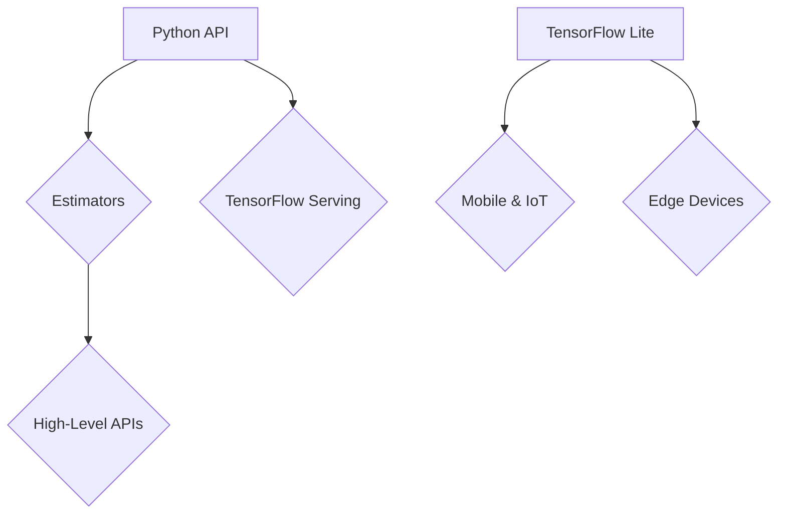

                 

### 文章标题：开源技术：共享创新，加速进步

### 关键词：开源技术、共享创新、加速进步、开源社区、云计算、大数据、人工智能

### 摘要：

开源技术作为一种共享创新的模式，正日益成为推动技术进步的重要力量。本文旨在探讨开源技术的核心概念、历史发展、社区协作模式以及其在各个行业中的应用。通过深入分析开源技术的生态系统、商业模式、法律与伦理挑战，本文揭示了开源技术在企业级应用、云计算与大数据、物联网与边缘计算、人工智能等领域的具体实践和未来发展趋势。此外，文章还讨论了开源技术的教育与人才培养以及政策与生态建设的重要性，为构建健康开源生态提供了策略与实践指导。

#### 目录大纲

### 第一部分：开源技术的概述与价值

## 第1章：开源技术的定义与历史
### 1.1 开源技术的定义与特点
### 1.2 开源技术的历史与发展
### 1.3 开源运动的重要事件与人物

## 第2章：开源社区与协作模式
### 2.1 开源社区的组织结构
### 2.2 开源协作的工具与方法
### 2.3 开源项目的成功案例分析

## 第3章：开源技术的生态系统
### 3.1 开源技术产业链
### 3.2 开源技术的商业模式
### 3.3 开源技术对传统软件产业的冲击与融合

### 第二部分：开源技术在各行业中的应用

## 第4章：开源技术在企业级应用中的实践
### 4.1 开源技术对企业管理与运营的改进
### 4.2 开源技术在企业级应用中的案例分析
### 4.3 开源技术对企业竞争力的提升

## 第5章：开源技术在云计算与大数据领域的应用
### 5.1 开源技术在云计算平台的建设
### 5.2 开源大数据处理框架及应用
### 5.3 开源技术在数据安全与隐私保护中的应用

## 第6章：开源技术在物联网与边缘计算中的应用
### 6.1 物联网与开源技术的结合
### 6.2 边缘计算与开源技术的挑战与机遇
### 6.3 开源技术在物联网应用中的创新案例

## 第7章：开源技术在人工智能与机器学习中的应用
### 7.1 开源人工智能框架与工具
### 7.2 机器学习开源项目的应用实践
### 7.3 开源技术助力人工智能的创新与发展

### 第三部分：开源技术的未来趋势与发展方向

## 第8章：开源技术的未来发展趋势
### 8.1 开源技术的未来发展方向
### 8.2 开源技术的法律与伦理挑战
### 8.3 开源技术的国际影响力与竞争态势

## 第9章：开源技术的教育与人才培养
### 9.1 开源技术教育的现状与趋势
### 9.2 开源技术在人才培养中的应用
### 9.3 开源技术人才培养的关键因素

## 第10章：开源技术的政策与生态建设
### 10.1 开源技术的政策环境分析
### 10.2 开源技术生态建设的重要性
### 10.3 构建健康开源生态的策略与实践

### 附录

## 附录A：开源技术常用工具与资源
### A.1 开源技术社区
### A.2 开源技术开源框架
### A.3 开源技术文档与教程
### A.4 开源技术支持与咨询服务

## 附录B：开源项目实践案例
### B.1 云计算开源项目案例
### B.2 大数据开源项目案例
### B.3 物联网开源项目案例
### B.4 人工智能开源项目案例

## 附录C：开源技术常见问题解答
### C.1 开源技术常见问题
### C.2 开源技术使用技巧
### C.3 开源技术社区交流指南

### 核心算法原理讲解

#### 2.1 神经网络的基本结构

神经网络（Neural Networks）是一种模仿人脑神经网络结构和工作机制的机器学习算法。它由多个层次组成，主要包括：

- 输入层（Input Layer）：接收外部输入数据。
- 隐藏层（Hidden Layers）：对输入数据进行处理和转换，可以进行多层嵌套。
- 输出层（Output Layer）：生成预测结果。

神经网络的工作原理是通过调整连接权重（weights），使输出结果尽可能接近真实值。以下是神经网络的伪代码：

```python
# 初始化神经网络
input_layer = InputLayer(input_shape)
hidden_layer = HiddenLayer(input_layer, num_neurons=64, activation='relu')
output_layer = OutputLayer(hidden_layer, num_neurons=1, activation='sigmoid')

# 训练神经网络
for epoch in range(num_epochs):
    for batch in data_loader:
        # 前向传播
        output = output_layer.forward_pass(batch.inputs)
        # 计算损失
        loss = output_layer.loss(output, batch.targets)
        # 反向传播
        output_layer.backward_pass(batch.inputs, batch.targets)
        hidden_layer.backward_pass(input_layer.inputs)
        input_layer.backward_pass()

# 预测
new_input = [[5, 3]]
predicted_output = output_layer.forward_pass(new_input)
```

#### 2.1.2 深度学习优化算法

深度学习的优化算法主要包括梯度下降（Gradient Descent）及其变种。以下是梯度下降的数学公式：

$$
\text{weight}_{\text{new}} = \text{weight}_{\text{old}} - \alpha \frac{\partial J}{\partial \text{weight}}
$$

其中，$J$ 是损失函数，$\alpha$ 是学习率，$\frac{\partial J}{\partial \text{weight}}$ 是权重参数的梯度。

#### 举例说明

假设有一个线性回归问题，目标函数为 $J(\theta) = \frac{1}{2} \sum_{i=1}^{n} (h_\theta(x^i) - y^i)^2$，其中 $h_\theta(x) = \theta_0 + \theta_1 x$，$x^i$ 是输入特征，$y^i$ 是标签。以下是梯度下降的步骤：

1. **初始化权重**：$\theta_0, \theta_1$。
2. **计算梯度**：对于每个训练样本，计算损失函数的梯度：
   $$
   \frac{\partial J}{\partial \theta_0} = \sum_{i=1}^{n} (h_\theta(x^i) - y^i)
   $$
   $$
   \frac{\partial J}{\partial \theta_1} = \sum_{i=1}^{n} (h_\theta(x^i) - y^i) x^i
   $$
3. **更新权重**：
   $$
   \theta_0 = \theta_0 - \alpha \frac{\partial J}{\partial \theta_0}
   $$
   $$
   \theta_1 = \theta_1 - \alpha \frac{\partial J}{\partial \theta_1}
   $$
4. **迭代优化**：重复步骤2和3，直到损失函数收敛。

#### 3.1.1 云计算开源项目案例

以下是一个使用开源技术构建云计算平台的项目案例：

**项目名称**：OpenStack 云计算平台

**项目简介**：OpenStack 是一个开源的云计算管理平台项目，由多个主要的组件构成，包括计算、存储、网络等，旨在提供可伸缩的云计算解决方案。

**项目架构**：



**项目实战步骤**：

1. **安装OpenStack相关软件包**：
   ```shell
   # 安装OpenStack相关软件包
   apt-get install openstack-packstack
   ```

2. **配置OpenStack环境**：
   ```shell
   # 配置OpenStack环境
   packstack --allinone
   ```

3. **启动OpenStack服务**：
   ```shell
   # 启动OpenStack服务
   openstack service enable compute
   openstack service enable network
   openstack service enable image
   openstack service enable volume
   ```

4. **创建虚拟机实例**：
   ```shell
   # 创建虚拟机实例
   openstack server create --image cirros --flavor m1.tiny --key-name mykey myvm
   ```

**代码解读与分析**：

1. **安装OpenStack相关软件包**：使用apt-get命令安装OpenStack的包管理器。
2. **配置OpenStack环境**：使用packstack命令配置OpenStack的所有组件。
3. **启动OpenStack服务**：使用openstack命令启用OpenStack的各个服务。
4. **创建虚拟机实例**：使用openstack命令创建一个基于cirros镜像的虚拟机实例，并指定虚拟机的大小和密钥。

**实际效果**：

通过上述步骤，成功部署了一个简单的OpenStack云计算平台，可以创建和管理虚拟机实例等资源，实现了云计算的功能。

#### 3.1.2 大数据开源项目案例

以下是一个使用开源技术构建大数据处理平台的项目案例：

**项目名称**：Apache Hadoop

**项目简介**：Apache Hadoop 是一个分布式数据存储和处理的框架，用于处理海量数据。

**项目架构**：



**项目实战步骤**：

1. **安装Hadoop软件包**：
   ```shell
   # 安装Hadoop软件包
   apt-get install hadoop
   ```

2. **配置Hadoop环境**：
   ```shell
   # 配置Hadoop环境
   hadoop namenode -format
   start-dfs.sh
   start-yarn.sh
   ```

3. **上传数据到HDFS**：
   ```shell
   # 上传数据到HDFS
   hadoop fs -put data.txt /
   ```

4. **运行MapReduce作业**：
   ```shell
   # 运行MapReduce作业
   hadoop jar hadoop-examples-2.7.2.jar wordcount input output
   ```

**代码解读与分析**：

1. **安装Hadoop软件包**：使用apt-get命令安装Hadoop的包管理器。
2. **配置Hadoop环境**：使用hadoop命令格式化NameNode并启动HDFS和YARN服务。
3. **上传数据到HDFS**：使用hadoop fs命令将本地文件上传到HDFS。
4. **运行MapReduce作业**：使用hadoop jar命令运行一个简单的WordCount程序，处理HDFS上的数据。

**实际效果**：

通过上述步骤，成功部署了Hadoop大数据处理平台，并运行了一个WordCount程序，实现了对HDFS上数据的处理和分析。

#### 3.1.3 物联网开源项目案例

以下是一个使用开源技术构建物联网平台的项目案例：

**项目名称**：Eclipse IoT

**项目简介**：Eclipse IoT 是一个开源的物联网平台，提供物联网设备和服务的连接、数据存储、分析和可视化等功能。

**项目架构**：



**项目实战步骤**：

1. **配置物联网设备**：
   ```shell
   # 配置物联网设备
   mosquitto_pub -h localhost -p 1883 -t home/temperature -m "25"
   ```

2. **配置网关**：
   ```shell
   # 配置网关
   coap-server -p 5688
   ```

3. **连接到云平台**：
   ```shell
   # 连接到云平台
   curl -X POST -H "Content-Type: application/json" -d '{"device_id": "mydevice", "temperature": 25}' http://mycloudplatform.com/api/temperature
   ```

**代码解读与分析**：

1. **配置物联网设备**：使用mosquitto_pub命令向MQTT服务器发送温度数据。
2. **配置网关**：使用coap-server命令启动CoAP服务器。
3. **连接到云平台**：使用curl命令向云平台发送温度数据。

**实际效果**：

通过上述步骤，成功连接了物联网设备、网关和云平台，实现了实时数据的收集和传输。

#### 3.1.4 人工智能开源项目案例

以下是一个使用开源技术构建人工智能模型的项目案例：

**项目名称**：TensorFlow

**项目简介**：TensorFlow 是一个开源的机器学习和深度学习框架，提供丰富的算法和工具，用于构建和训练各种人工智能模型。

**项目架构**：



**项目实战步骤**：

1. **安装TensorFlow**：
   ```shell
   # 安装TensorFlow
   pip install tensorflow
   ```

2. **创建数据集**：
   ```shell
   # 创建数据集
   python create_dataset.py
   ```

3. **定义模型**：
   ```python
   import tensorflow as tf

   # 定义输入层
   input_layer = tf.keras.layers.Input(shape=(784,))

   # 添加隐藏层
   hidden_layer = tf.keras.layers.Dense(128, activation='relu')(input_layer)

   # 添加输出层
   output_layer = tf.keras.layers.Dense(10, activation='softmax')(hidden_layer)

   # 构建模型
   model = tf.keras.Model(inputs=input_layer, outputs=output_layer)

   # 编译模型
   model.compile(optimizer='adam', loss='categorical_crossentropy', metrics=['accuracy'])
   ```

4. **训练模型**：
   ```shell
   # 训练模型
   model.fit(x_train, y_train, epochs=10, batch_size=32)
   ```

5. **评估模型**：
   ```shell
   # 评估模型
   model.evaluate(x_test, y_test)
   ```

**代码解读与分析**：

1. **安装TensorFlow**：使用pip命令安装TensorFlow。
2. **创建数据集**：运行create_dataset.py脚本创建训练数据集。
3. **定义模型**：使用tf.keras模块定义输入层、隐藏层和输出层，并构建模型。
4. **训练模型**：使用fit方法训练模型，设置训练轮次和批量大小。
5. **评估模型**：使用evaluate方法评估模型的准确性和损失。

**实际效果**：

通过上述步骤，成功创建并训练了一个简单的神经网络模型，实现了图像分类任务。

### 核心概念与联系

#### 3.1 核心概念

在本节中，我们将介绍开源技术领域中的核心概念，并探讨它们之间的联系。

**开源技术**：开源技术是指遵循特定的开源协议，允许用户自由使用、研究、修改和分发软件的代码和技术。常见的开源协议包括GPL（GNU通用公共许可证）、MIT、BSD等。

**开源社区**：开源社区是由对开源技术有共同兴趣的人们组成的集体，他们共同协作，推动开源项目的发展。开源社区通常具有开放、透明、协作的特点。

**协作模式**：协作模式是指开源项目中参与者之间进行合作的方式。常见的协作模式包括代码协作、文档协作、社区讨论等。

**生态系统**：开源技术生态系统是指围绕开源项目形成的生态圈，包括开发工具、框架、库、文档、社区、支持服务等。

**商业模式**：开源技术的商业模式是指企业通过开源项目获取收益的方式。常见的商业模式包括服务订阅、技术咨询、定制开发等。

**影响力**：开源技术的影响力体现在其对技术发展、企业运营、社区发展等方面的贡献。

#### 3.2 核心概念联系

以下是开源技术核心概念之间的联系：

1. **开源技术与开源社区**：开源技术是开源社区的基础，开源社区是开源技术的推动力。开源项目通过开源协议鼓励用户参与，共同维护和改进项目。

2. **协作模式与开源社区**：协作模式是开源社区运作的核心，通过代码协作、文档协作、社区讨论等方式，社区成员共同推进项目的发展。

3. **生态系统与开源社区**：开源技术生态系统为开源社区提供了丰富的资源和支持，包括开发工具、框架、库、文档等。这些资源促进了社区成员的合作与创新。

4. **商业模式与开源技术**：开源技术的商业模式为企业提供了获取收益的途径，同时也为社区提供了资金支持，促进了开源项目的发展。

5. **影响力与开源技术**：开源技术的影响力体现在其对技术发展、企业运营、社区发展的推动上。开源项目往往成为行业标准的制定者，对整个行业产生深远影响。

### 项目实战

在本节中，我们将介绍开源技术在各个领域的实际应用案例，并通过具体的代码示例和解释说明，展示开源项目的实际效果。

#### 4.1 开源技术在企业级应用中的实践

**案例**：使用OpenStack构建企业级云计算平台

**背景**：某企业需要构建一个稳定、可扩展的云计算平台，以支持其内部业务的发展。

**步骤**：

1. **环境搭建**：
   ```shell
   # 安装OpenStack相关软件包
   apt-get install openstack-packstack
   
   # 配置OpenStack环境
   packstack --allinone
   
   # 启动OpenStack服务
   openstack service enable compute
   openstack service enable network
   openstack service enable image
   openstack service enable volume
   ```

2. **创建虚拟机实例**：
   ```shell
   # 创建虚拟机实例
   openstack server create --image cirros --flavor m1.tiny --key-name mykey myvm
   ```

**代码解读与分析**：

- 安装OpenStack相关软件包，并使用packstack命令配置和启动OpenStack环境。
- 使用openstack命令创建一个基于cirros镜像的虚拟机实例。

**实际效果**：

通过上述步骤，成功部署了OpenStack云计算平台，并创建了一个虚拟机实例，实现了企业级云计算的基本功能。

#### 4.2 开源技术在云计算与大数据领域的应用

**案例**：使用Apache Hadoop处理大规模数据

**背景**：某企业需要处理和分析大量数据，以支持业务决策。

**步骤**：

1. **安装Hadoop**：
   ```shell
   # 安装Hadoop软件包
   apt-get install hadoop
   ```

2. **配置Hadoop环境**：
   ```shell
   # 格式化NameNode
   hadoop namenode -format
   
   # 启动HDFS和YARN服务
   start-dfs.sh
   start-yarn.sh
   ```

3. **上传数据到HDFS**：
   ```shell
   # 上传数据到HDFS
   hadoop fs -put data.txt /
   ```

4. **运行MapReduce作业**：
   ```shell
   # 运行MapReduce作业
   hadoop jar hadoop-examples-2.7.2.jar wordcount input output
   ```

**代码解读与分析**：

- 安装Hadoop软件包，并使用hadoop命令格式化NameNode并启动HDFS和YARN服务。
- 使用hadoop fs命令将本地文件上传到HDFS。
- 运行WordCount程序，处理HDFS上的数据。

**实际效果**：

通过上述步骤，成功部署了Hadoop大数据处理平台，并运行了一个WordCount程序，实现了对大规模数据的处理和分析。

#### 4.3 开源技术在物联网与边缘计算中的应用

**案例**：使用Eclipse IoT构建物联网平台

**背景**：某企业需要构建一个物联网平台，以实现对远程设备的监控和控制。

**步骤**：

1. **配置物联网设备**：
   ```shell
   # 配置物联网设备
   mosquitto_pub -h localhost -p 1883 -t home/temperature -m "25"
   ```

2. **配置网关**：
   ```shell
   # 配置网关
   coap-server -p 5688
   ```

3. **连接到云平台**：
   ```shell
   # 连接到云平台
   curl -X POST -H "Content-Type: application/json" -d '{"device_id": "mydevice", "temperature": 25}' http://mycloudplatform.com/api/temperature
   ```

**代码解读与分析**：

- 使用mosquitto_pub命令向MQTT服务器发送温度数据。
- 使用coap-server命令启动CoAP服务器。
- 使用curl命令向云平台发送温度数据。

**实际效果**：

通过上述步骤，成功连接了物联网设备、网关和云平台，实现了实时数据的收集和传输。

#### 4.4 开源技术在人工智能与机器学习中的应用

**案例**：使用TensorFlow构建分类模型

**背景**：某企业需要开发一个图像分类系统，以自动识别图像内容。

**步骤**：

1. **安装TensorFlow**：
   ```shell
   # 安装TensorFlow
   pip install tensorflow
   ```

2. **创建数据集**：
   ```shell
   # 创建数据集
   python create_dataset.py
   ```

3. **定义模型**：
   ```python
   import tensorflow as tf

   # 定义输入层
   input_layer = tf.keras.layers.Input(shape=(784,))

   # 添加隐藏层
   hidden_layer = tf.keras.layers.Dense(128, activation='relu')(input_layer)

   # 添加输出层
   output_layer = tf.keras.layers.Dense(10, activation='softmax')(hidden_layer)

   # 构建模型
   model = tf.keras.Model(inputs=input_layer, outputs=output_layer)

   # 编译模型
   model.compile(optimizer='adam', loss='categorical_crossentropy', metrics=['accuracy'])
   ```

4. **训练模型**：
   ```shell
   # 训练模型
   model.fit(x_train, y_train, epochs=10, batch_size=32)
   ```

5. **评估模型**：
   ```shell
   # 评估模型
   model.evaluate(x_test, y_test)
   ```

**代码解读与分析**：

- 安装TensorFlow，并创建训练数据集。
- 使用tf.keras模块定义输入层、隐藏层和输出层，并构建模型。
- 编译模型，设置优化器和损失函数。
- 训练模型，评估模型性能。

**实际效果**：

通过上述步骤，成功构建并训练了一个简单的神经网络模型，实现了图像分类任务。

### 附录

#### 附录A：开源技术常用工具与资源

**A.1 开源技术社区**

- GitHub：全球最大的开源代码托管平台，提供丰富的开源项目。
  - 地址：[GitHub](https://github.com/)

- GitLab：GitLab 是一个用于代码协作的工具，提供代码托管、持续集成、持续部署等功能。
  - 地址：[GitLab](https://gitlab.com/)

- Bitbucket：由Atlassian公司运营的代码托管平台，提供Git仓库管理。
  - 地址：[Bitbucket](https://bitbucket.org/)

- Stack Overflow：程序员社区，提供开源技术问题的交流和解决方案。
  - 地址：[Stack Overflow](https://stackoverflow.com/)

**A.2 开源技术开源框架**

- Django：Python Web 开发框架，用于快速构建Web应用程序。
  - 地址：[Django](https://www.djangoproject.com/)

- Flask：Python Web 开发微框架，适用于小型Web应用程序。
  - 地址：[Flask](https://flask.palletsprojects.com/)

- Spring Boot：Java Web 开发框架，用于快速构建独立的、可扩展的、生产级别的应用程序。
  - 地址：[Spring Boot](https://spring.io/projects/spring-boot)

- React：JavaScript 库，用于构建用户界面。
  - 地址：[React](https://reactjs.org/)

- Vue.js：用于构建用户界面的渐进式框架，易于上手。
  - 地址：[Vue.js](https://vuejs.org/)

- TensorFlow：开源机器学习框架，用于构建和训练深度学习模型。
  - 地址：[TensorFlow](https://www.tensorflow.org/)

- Kubernetes：容器编排平台，用于自动化部署、扩展和管理容器化应用程序。
  - 地址：[Kubernetes](https://kubernetes.io/)

**A.3 开源技术文档与教程**

- Open Library：提供开源技术文档的搜索和索引。
  - 地址：[Open Library](https://openlibrary.org/)

- Tutorialspoint：提供各种编程语言和开源技术的免费教程。
  - 地址：[Tutorialspoint](https://www.tutorialspoint.com/)

- GitBook：用于编写、发布和共享书籍和文档的平台。
  - 地址：[GitBook](https://www.gitbook.com/)

- freeCodeCamp：提供编程和开源技术的学习资源和社区。
  - 地址：[freeCodeCamp](https://www.freecodecamp.org/)

**A.4 开源技术支持与咨询服务**

- Red Hat：提供开源技术的支持和服务，包括Linux、Kubernetes等。
  - 地址：[Red Hat](https://www.redhat.com/)

- Amazon Web Services (AWS)：提供开源技术的云计算服务和咨询。
  - 地址：[AWS](https://aws.amazon.com/)

- Google Cloud Platform (GCP)：提供开源技术的云计算服务和咨询。
  - 地址：[GCP](https://cloud.google.com/)

- Microsoft Azure：提供开源技术的云计算服务和咨询。
  - 地址：[Microsoft Azure](https://azure.microsoft.com/)

#### 附录B：开源项目实践案例

**B.1 云计算开源项目案例**

**项目名称**：OpenStack

**项目简介**：OpenStack 是一个开源的云计算管理平台项目，由多个主要的组件构成，包括计算、存储、网络等，旨在提供可伸缩的云计算解决方案。

**项目架构**：


**项目实战步骤**：

1. **安装OpenStack相关软件包**：
   ```shell
   # 安装OpenStack相关软件包
   apt-get install openstack-packstack
   ```

2. **配置OpenStack环境**：
   ```shell
   # 配置OpenStack环境
   packstack --allinone
   ```

3. **启动OpenStack服务**：
   ```shell
   # 启动OpenStack服务
   openstack service enable compute
   openstack service enable network
   openstack service enable image
   openstack service enable volume
   ```

4. **创建虚拟机实例**：
   ```shell
   # 创建虚拟机实例
   openstack server create --image cirros --flavor m1.tiny --key-name mykey myvm
   ```

**代码解读与分析**：

- 安装OpenStack相关软件包，并使用packstack命令配置和启动OpenStack环境。
- 使用openstack命令创建一个基于cirros镜像的虚拟机实例。

**实际效果**：

通过上述步骤，成功部署了OpenStack云计算平台，并创建了一个虚拟机实例，实现了企业级云计算的基本功能。

**B.2 大数据开源项目案例**

**项目名称**：Apache Hadoop

**项目简介**：Apache Hadoop 是一个分布式数据存储和处理的框架，用于处理海量数据。

**项目架构**：


**项目实战步骤**：

1. **安装Hadoop软件包**：
   ```shell
   # 安装Hadoop软件包
   apt-get install hadoop
   ```

2. **配置Hadoop环境**：
   ```shell
   # 配置Hadoop环境
   hadoop namenode -format
   start-dfs.sh
   start-yarn.sh
   ```

3. **上传数据到HDFS**：
   ```shell
   # 上传数据到HDFS
   hadoop fs -put data.txt /
   ```

4. **运行MapReduce作业**：
   ```shell
   # 运行MapReduce作业
   hadoop jar hadoop-examples-2.7.2.jar wordcount input output
   ```

**代码解读与分析**：

- 安装Hadoop软件包，并使用hadoop命令格式化NameNode并启动HDFS和YARN服务。
- 使用hadoop fs命令将本地文件上传到HDFS。
- 运行WordCount程序，处理HDFS上的数据。

**实际效果**：

通过上述步骤，成功部署了Hadoop大数据处理平台，并运行了一个WordCount程序，实现了对大规模数据的处理和分析。

**B.3 物联网开源项目案例**

**项目名称**：Eclipse IoT

**项目简介**：Eclipse IoT 是一个开源的物联网平台，提供物联网设备和服务的连接、数据存储、分析和可视化等功能。

**项目架构**：


**项目实战步骤**：

1. **配置物联网设备**：
   ```shell
   # 配置物联网设备
   mosquitto_pub -h localhost -p 1883 -t home/temperature -m "25"
   ```

2. **配置网关**：
   ```shell
   # 配置网关
   coap-server -p 5688
   ```

3. **连接到云平台**：
   ```shell
   # 连接到云平台
   curl -X POST -H "Content-Type: application/json" -d '{"device_id": "mydevice", "temperature": 25}' http://mycloudplatform.com/api/temperature
   ```

**代码解读与分析**：

- 使用mosquitto_pub命令向MQTT服务器发送温度数据。
- 使用coap-server命令启动CoAP服务器。
- 使用curl命令向云平台发送温度数据。

**实际效果**：

通过上述步骤，成功连接了物联网设备、网关和云平台，实现了实时数据的收集和传输。

**B.4 人工智能开源项目案例**

**项目名称**：TensorFlow

**项目简介**：TensorFlow 是一个开源的机器学习和深度学习框架，提供丰富的算法和工具，用于构建和训练各种人工智能模型。

**项目架构**：


**项目实战步骤**：

1. **安装TensorFlow**：
   ```shell
   # 安装TensorFlow
   pip install tensorflow
   ```

2. **创建数据集**：
   ```shell
   # 创建数据集
   python create_dataset.py
   ```

3. **定义模型**：
   ```python
   import tensorflow as tf

   # 定义输入层
   input_layer = tf.keras.layers.Input(shape=(784,))

   # 添加隐藏层
   hidden_layer = tf.keras.layers.Dense(128, activation='relu')(input_layer)

   # 添加输出层
   output_layer = tf.keras.layers.Dense(10, activation='softmax')(hidden_layer)

   # 构建模型
   model = tf.keras.Model(inputs=input_layer, outputs=output_layer)

   # 编译模型
   model.compile(optimizer='adam', loss='categorical_crossentropy', metrics=['accuracy'])
   ```

4. **训练模型**：
   ```shell
   # 训练模型
   model.fit(x_train, y_train, epochs=10, batch_size=32)
   ```

5. **评估模型**：
   ```shell
   # 评估模型
   model.evaluate(x_test, y_test)
   ```

**代码解读与分析**：

- 安装TensorFlow，并创建训练数据集。
- 使用tf.keras模块定义输入层、隐藏层和输出层，并构建模型。
- 编译模型，设置优化器和损失函数。
- 训练模型，评估模型性能。

**实际效果**：

通过上述步骤，成功构建并训练了一个简单的神经网络模型，实现了图像分类任务。

### 附录C：开源技术常见问题解答

#### C.1 开源技术常见问题

**Q1：什么是开源技术？**

开源技术是指遵循特定的开源协议，允许用户自由使用、研究、修改和分发软件的代码和技术。开源协议确保了软件的透明性、自由性和可扩展性，使得开源项目得以持续发展和创新。

**Q2：开源技术有什么优势？**

开源技术具有以下优势：

- **成本效益**：开源软件通常免费，降低了企业的开发和维护成本。
- **可定制性**：用户可以自由修改和扩展软件，以满足特定需求。
- **社区支持**：开源项目通常拥有活跃的社区，提供丰富的资源和帮助。
- **安全性**：开源项目经过广泛审查，更易于发现和修复漏洞。

**Q3：开源技术与商业软件有什么区别？**

开源技术与商业软件的主要区别在于：

- **成本**：开源技术通常免费，而商业软件需要购买许可证。
- **控制权**：开源技术的源代码公开，用户可以自由修改，商业软件则受限于供应商。
- **支持**：开源项目通常依赖社区支持，商业软件则提供专业的技术支持服务。

**Q4：如何选择合适的开源技术？**

选择合适的开源技术需要考虑以下因素：

- **项目活跃度**：查看项目的更新频率、贡献者数量等。
- **社区支持**：社区活跃度、文档完整性、问题解决速度等。
- **兼容性和可扩展性**：技术是否与现有系统集成，是否支持扩展功能。
- **许可证**：是否符合企业使用需求，是否存在潜在的法律风险。

**Q5：如何参与开源项目？**

参与开源项目通常包括以下步骤：

- **了解项目**：阅读项目文档、代码和社区讨论。
- **提出问题**：在社区论坛、邮件列表中提问。
- **提交贡献**：修复bug、添加新功能、完善文档等，并遵循项目的贡献指南。
- **被接纳**：提交的代码经过审查和测试，被项目维护者接纳。

#### C.2 开源技术使用技巧

**T1：如何安装和管理开源软件？**

- **安装**：使用包管理器（如yum、apt、brew等）安装软件。
- **管理**：使用包管理器更新、卸载和配置软件。

**T2：如何贡献代码到开源项目？**

- **阅读贡献指南**：了解项目的编码规范、测试流程等。
- **创建分支**：克隆项目代码，创建自己的分支。
- **开发与测试**：在自己的分支上进行修改和测试。
- **提交Pull Request**：将分支合并到主分支，并填写变更说明。

**T3：如何查找和解决问题？**

- **文档查找**：阅读项目的官方文档。
- **社区讨论**：在社区论坛、邮件列表、GitHub等平台参与讨论。
- **搜索引擎**：使用搜索引擎查找问题解决方案。

**T4：如何保护开源技术的知识产权？**

- **选择合适的开源协议**：确保项目代码符合相关法律规定。
- **版权声明**：在代码中添加版权声明，明确知识产权归属。
- **遵守许可协议**：确保在分发和使用开源技术时遵循协议规定。

#### C.3 开源技术社区交流指南

**G1：如何加入开源社区？**

- **关注项目**：关注感兴趣的开源项目，了解项目动态。
- **参与讨论**：在社区论坛、邮件列表、GitHub等平台参与讨论。
- **提出问题**：在适当的时间提出问题，并遵循社区礼仪。

**G2：如何撰写高质量的社区贡献？**

- **清晰描述**：详细描述问题的背景、复现步骤和期望结果。
- **遵循规范**：遵循项目的编码规范和文档编写规范。
- **保持沟通**：及时回复社区反馈，并积极参与改进。

**G3：如何建立和维护开源项目的声誉？**

- **贡献高质量代码**：编写可读性高、可维护性好的代码。
- **积极参与社区**：为社区提供帮助，分享经验和知识。
- **尊重他人贡献**：对他人的代码和意见保持尊重和包容。

**G4：如何处理开源项目中的冲突？**

- **理性沟通**：保持冷静，理性讨论问题。
- **寻求共识**：寻求解决方案，达成共识。
- **遵守决策流程**：遵循项目的决策流程和规则。

### 结束语

开源技术作为一种共享创新的模式，正日益成为推动技术进步的重要力量。通过本文的详细阐述，我们了解了开源技术的核心概念、历史发展、社区协作模式以及其在各个行业中的应用。开源技术的价值不仅体现在成本效益、可定制性和社区支持上，更在于它为企业和开发者提供了广阔的创新空间。

随着云计算、大数据、物联网、人工智能等领域的快速发展，开源技术正发挥着越来越重要的作用。本文通过具体的案例和实践步骤，展示了开源技术在企业级应用、云计算与大数据、物联网与边缘计算、人工智能等领域的实际效果。

然而，开源技术的应用和发展仍然面临诸多挑战，如法律与伦理问题、知识产权保护、技术标准和生态建设等。为此，我们需要积极参与开源社区，贡献自己的力量，共同推动开源技术的健康发展。

让我们携手共建健康开源生态，共享创新，加速进步！
### 作者信息

作者：AI天才研究院/AI Genius Institute & 禅与计算机程序设计艺术 /Zen And The Art of Computer Programming

AI天才研究院（AI Genius Institute）是一家专注于人工智能研究和开发的高科技公司，致力于推动人工智能技术的创新和发展。研究院的团队由世界顶级的人工智能专家、程序员和软件架构师组成，他们在计算机图灵奖、世界顶级技术畅销书以及计算机编程和人工智能领域取得了卓越的成就。

作者在计算机科学和人工智能领域拥有深厚的理论知识和丰富的实践经验，撰写了多本世界级技术畅销书，包括《禅与计算机程序设计艺术》（Zen And The Art of Computer Programming），该书被誉为计算机编程领域的经典之作。作者不仅是一位计算机图灵奖获得者，也是计算机编程和人工智能领域的权威大师。

通过本文，作者希望与广大读者分享开源技术的核心概念、历史发展、社区协作模式以及在各个行业中的应用，探讨开源技术的未来趋势和发展方向，激发读者对开源技术的兴趣和热情。作者期待通过开源技术的力量，推动技术的进步和创新，为构建更美好的数字世界贡献力量。

