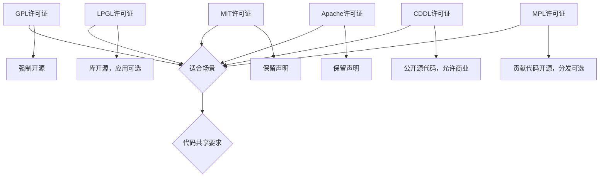
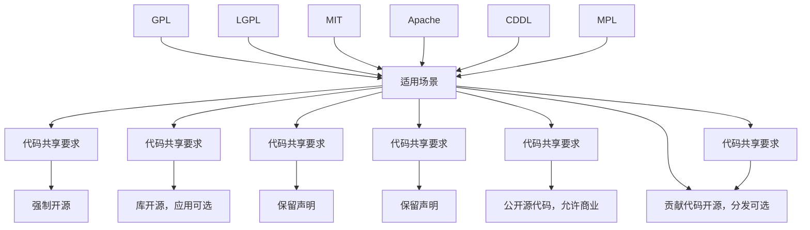

                 

### 文章标题

《开源许可证选择：商业化考虑因素》

#### 关键词

- 开源许可证
- 商业化考虑
- GPL
- LGPL
- MIT License
- Apache License 2.0
- CDDL
- MPL

#### 摘要

本文旨在深入探讨开源许可证的选择对商业化的影响。通过详细分析常见开源许可证的特点，以及商业化环境中的考虑因素，本文揭示了在开源许可证选择过程中如何平衡商业利益与法律合规。同时，通过案例分析，提供了实用的指导和建议，以帮助企业和开发者做出明智的选择。

## 《开源许可证选择：商业化考虑因素》目录大纲

### 第一部分：开源许可证概述

#### # 1. 开源许可证概述

##### 1.1 开源许可证的定义与作用

###### 1.1.1 开源许可证的基本概念

###### 1.1.2 开源许可证的作用

##### 1.2 常见开源许可证介绍

###### 1.2.1 GPL (GNU General Public License)

###### 1.2.2 LGPL (GNU Lesser General Public License)

###### 1.2.3 MIT License

###### 1.2.4 Apache License 2.0

###### 1.2.5 CDDL (Common Development and Distribution License)

###### 1.2.6 MPL (Mozilla Public License)

### 第二部分：商业化考虑因素

#### # 2. 商业化考虑因素

##### 2.1 商业模型与开源许可证选择

###### 2.1.1 商业模型与开源许可证的关系

###### 2.1.2 开源许可证对商业模型的影响

##### 2.2 商业风险与开源许可证选择

###### 2.2.1 商业风险分析

###### 2.2.2 开源许可证对商业风险的影响

##### 2.3 商业利益与开源许可证选择

###### 2.3.1 商业利益最大化

###### 2.3.2 开源许可证对商业利益的影响

##### 2.4 开源许可证选择案例分析

###### 2.4.1 案例一：阿里巴巴开源许可证选择

###### 2.4.2 案例二：华为开源许可证选择

### 第三部分：开源许可证应用与合规

#### # 3. 开源许可证应用与合规

##### 3.1 开源许可证应用流程

###### 3.1.1 开源许可证获取与评估

###### 3.1.2 开源许可证合规性检查

##### 3.2 开源许可证合规性挑战

###### 3.2.1 合规性挑战分析

###### 3.2.2 合规性解决方案

##### 3.3 开源许可证合规性实践

###### 3.3.1 开源许可证合规性管理

###### 3.3.2 开源许可证合规性培训

### 第四部分：开源许可证的未来趋势

#### # 4. 开源许可证的未来趋势

##### 4.1 开源许可证发展现状

###### 4.1.1 开源许可证的种类和数量增长

###### 4.1.2 开源许可证的应用领域扩展

##### 4.2 开源许可证趋势分析

###### 4.2.1 法律法规的变化

###### 4.2.2 技术与商业环境的变化

##### 4.3 开源许可证未来展望

###### 4.3.1 新开源许可证的诞生

###### 4.3.2 开源许可证的生态合作

### 附录

#### # 附录 A: 开源许可证列表

###### A.1 GPL (GNU General Public License)

###### A.2 LGPL (GNU Lesser General Public License)

###### A.3 MIT License

###### A.4 Apache License 2.0

###### A.5 CDDL (Common Development and Distribution License)

###### A.6 MPL (Mozilla Public License)### 第一部分：开源许可证概述

#### # 1. 开源许可证概述

##### 1.1 开源许可证的定义与作用

###### 1.1.1 开源许可证的基本概念

开源许可证，也称为开源协议，是一套法律文件，用于定义软件的版权和使用条款。它确保软件的源代码可以自由地被用户查看、修改和分发，从而促进技术共享和创新。开源许可证的作用在于保护开源软件项目的版权，同时允许他人以非专有方式使用、修改和分发这些软件。

###### 1.1.2 开源许可证的作用

开源许可证的主要作用包括：

1. **版权保护**：确保软件开发者的权利不受侵犯，同时允许他人合法使用代码。
2. **使用自由**：确保用户可以自由地使用、学习、修改和分发软件。
3. **促进创新**：通过共享技术知识，加速软件的开发和改进。
4. **提高透明度**：用户可以查看源代码，提高软件的可靠性和安全性。

##### 1.2 常见开源许可证介绍

在众多开源许可证中，以下几种是最为常见和广泛使用的：

###### 1.2.1 GPL (GNU General Public License)

**定义**：GPL 是由自由软件基金会（FSF）推出的强copyleft许可证。

**核心原则**：GPL 强调软件的自由，即用户有权运行、研究、修改和分发软件。任何基于GPL软件修改后的代码也必须以GPL许可证开源。

**适用场景**：适合希望保护软件自由和防止其被商业化的项目。

**代码共享要求**：强制要求分发软件的源代码，并且任何修改都必须公开。

###### 1.2.2 LGPL (GNU Lesser General Public License)

**定义**：LGPL 是 GPL 的一个变种，旨在降低对库和组件的依赖性。

**核心原则**：LGPL 允许软件链接到GPL库，而不需要整个应用程序也遵循GPL。这样可以允许商业软件使用LGPL库，同时保持其自身的商业许可。

**适用场景**：适合希望保持商业灵活性，但又希望库代码保持开源的项目。

**代码共享要求**：对于库代码，允许商业闭源；但对于应用程序，如果使用了LGPL库，则需要开源。

###### 1.2.3 MIT License

**定义**：MIT 许可证是最为自由的开源许可证之一。

**核心原则**：MIT 许可证仅要求用户在修改后的代码中保留原作者的许可声明，不强制开源。

**适用场景**：适合希望保持最大灵活性，允许广泛使用的项目。

**代码共享要求**：允许用户自由使用、修改和分发，但需保留版权声明。

###### 1.2.4 Apache License 2.0

**定义**：Apache 许可证是另一种宽松的许可，广泛应用于企业级开源项目。

**核心原则**：Apache 许可证允许用户自由使用、修改和分发软件，同时要求保留许可声明。

**适用场景**：适合希望保持商业灵活性和广泛使用的项目。

**代码共享要求**：允许用户自由使用、修改和分发，但需保留许可声明。

###### 1.2.5 CDDL (Common Development and Distribution License)

**定义**：CDDL 是 Sun Microsystems 推出的一种开源许可证。

**核心原则**：CDDL 强调源代码和二进制代码的公开，但允许商业使用。

**适用场景**：适合希望保持商业灵活性的项目。

**代码共享要求**：要求公开源代码，但不强制要求修改后的代码开源。

###### 1.2.6 MPL (Mozilla Public License)

**定义**：MPL 是 Mozilla Foundation 推出的一种开源许可证。

**核心原则**：MPL 强调源代码的公开，同时允许商业使用，但要求贡献代码也遵循MPL。

**适用场景**：适合希望保持代码开放性同时具有商业灵活性的项目。

**代码共享要求**：要求贡献代码遵循MPL，但不强制要求分发软件的源代码。

#### Mermaid 流程图

通过上述的流程图，我们可以更清晰地看到不同开源许可证的核心原则和适用场景，以及其代码共享的具体要求。

### 1.1.1 开源许可证的基本概念

开源许可证，通常指的是软件许可证，它们是一系列法律文件，定义了软件的使用、复制、修改和分发条件。这些许可证确保软件的源代码（而非仅仅可执行的二进制形式）可以被自由访问，使用和修改，从而促进技术共享、合作和不断进化。

在开源许可证的发展历程中，许多组织和个人致力于推动开源文化的形成。自由软件基金会（FSF）是最早推动开源许可证的机构之一，他们在1989年发布了GNU General Public License（GPL），这是最早的强copyleft许可证，旨在保护软件的自由和用户的基本权利。随后，随着开源运动的不断发展和壮大，出现了多种多样的开源许可证，以适应不同类型项目和商业需求。

开源许可证的基本要素包括：

1. **版权声明**：明确指出软件的版权信息，包括版权持有者和版权年限。
2. **使用许可**：详细描述用户可以如何使用软件，包括运行、查看、学习、修改和分发。
3. **许可条件**：规定用户在使用、修改和分发软件时必须遵守的具体规则。
4. **免责声明**：明确指出许可证持有者不对软件的使用效果承担责任。

开源许可证的种类繁多，但主要可以分为以下几种类型：

1. **强copyleft许可证**：如GPL和AGPL，它们确保软件及其修改版都必须以开源的形式分发，以保持软件的自由。
2. **弱copyleft许可证**：如LGPL，它们允许软件与商业软件结合，但库代码必须开源。
3. **非强copyleft许可证**：如MIT、BSD和Apache，这些许可证提供更为宽松的条件，允许用户自由使用、修改和分发软件，无需开源。

#### 1.1.2 开源许可证的作用

开源许可证在软件生态系统中发挥着至关重要的作用，它们不仅保护了软件开发者的权益，还极大地促进了技术进步和商业创新。以下是开源许可证的主要作用：

1. **保障版权**：开源许可证通过明确版权归属和使用条件，确保了软件开发者的权益不受侵犯。这对于那些希望将自己的智慧和努力投入到开源项目中的开发者尤为重要。

2. **促进知识共享**：开源许可证允许用户自由地查看、修改和分发软件，从而促进了技术知识的传播和共享。这种共享文化不仅推动了开源项目的持续发展，还激发了无数的创新思想。

3. **提升软件质量**：通过开源许可证，用户可以自由地查看和修改源代码，这意味着代码的漏洞和缺陷可以更快地被发现和修复。同时，开源项目通常会有更广泛的社区参与，这有助于提高代码的可维护性和稳定性。

4. **推动商业发展**：许多企业利用开源许可证来构建其商业模型，通过提供开源软件和增值服务来创造收入。这种模式不仅有助于降低开发成本，还能加速产品上市时间，提高市场竞争力。

5. **降低开发成本**：使用开源软件可以大大降低企业的技术门槛和研发成本。许多开源工具和框架都是免费且高效的，企业可以节省大量的资金用于其他更具战略性的投资。

6. **增强品牌影响力**：对于一些企业来说，开源项目不仅可以带来商业上的收益，还可以提升其品牌形象。通过积极参与开源社区，企业可以展示其技术实力和社会责任感，从而在市场中获得更多的认可。

7. **提高协作效率**：开源许可证鼓励开发者之间的合作和交流，这有助于建立更紧密的社区关系。通过协作，项目可以更快地迭代，更有效地解决问题，从而提高整体的开发效率。

总之，开源许可证不仅为软件开发者提供了法律保障，还促进了技术进步和商业创新。它们是开源生态系统中的关键组成部分，对于推动全球信息技术的发展起到了不可替代的作用。

### 1.2 常见开源许可证介绍

在开源世界中，存在多种不同的开源许可证，每种许可证都有其独特的特点和应用场景。以下将详细介绍几种常见开源许可证，包括它们的定义、核心原则、适用场景以及代码共享要求。

#### 1.2.1 GPL (GNU General Public License)

**定义**：GPL，即GNU General Public License，由自由软件基金会（FSF）发布，是使用最广泛的强copyleft许可证之一。

**核心原则**：GPL 强调软件的自由，即用户有权运行、研究、修改和分发软件。任何基于GPL软件修改后的代码也必须以GPL许可证开源。

**适用场景**：适合希望保护软件自由和防止其被商业化的项目，如操作系统和大型应用软件。

**代码共享要求**：强制要求分发软件的源代码，并且任何修改都必须公开。这意味着一旦某个项目采用GPL许可证，所有依赖它的项目也必须遵守同样的规则，以确保整个软件生态系统都保持开源。

#### 1.2.2 LGPL (GNU Lesser General Public License)

**定义**：LGPL，即GNU Lesser General Public License，是GPL的一个变种，旨在降低对库和组件的依赖性。

**核心原则**：LGPL 允许软件链接到GPL库，而不需要整个应用程序也遵循GPL。这样可以允许商业软件使用LGPL库，同时保持其自身的商业许可。

**适用场景**：适合希望保持商业灵活性的项目，特别是需要与其他商业软件集成的情况。

**代码共享要求**：对于库代码，允许商业闭源；但对于应用程序，如果使用了LGPL库，则需要开源。这种灵活性使得LGPL成为许多商业项目的首选许可证。

#### 1.2.3 MIT License

**定义**：MIT License，也称为Expat License，是最为自由的开源许可证之一。

**核心原则**：MIT License 仅要求用户在修改后的代码中保留原作者的许可声明，不强制开源。

**适用场景**：适合希望保持最大灵活性的项目，如小工具、库和框架。

**代码共享要求**：允许用户自由使用、修改和分发，但需保留版权声明。这使得MIT License成为最受欢迎的许可证之一，因为它提供了极高的使用自由度。

#### 1.2.4 Apache License 2.0

**定义**：Apache License 2.0，是一种宽松的许可，广泛应用于企业级开源项目。

**核心原则**：Apache License 2.0 允许用户自由使用、修改和分发软件，同时要求保留许可声明。

**适用场景**：适合希望保持商业灵活性和广泛使用的项目，如大型框架和工具。

**代码共享要求**：允许用户自由使用、修改和分发，但需保留许可声明。Apache License 2.0 在企业中被广泛采用，因为它提供了一个平衡的自由度和商业灵活性。

#### 1.2.5 CDDL (Common Development and Distribution License)

**定义**：CDDL，即Common Development and Distribution License，由Sun Microsystems推出。

**核心原则**：CDDL 强调源代码和二进制代码的公开，但允许商业使用。

**适用场景**：适合希望保持商业灵活性的项目，尤其是在企业环境中。

**代码共享要求**：要求公开源代码，但不强制要求修改后的代码开源。这使得CDDL在商业项目中具有吸引力，因为它允许更灵活的商业模型。

#### 1.2.6 MPL (Mozilla Public License)

**定义**：MPL，即Mozilla Public License，由Mozilla Foundation推出。

**核心原则**：MPL 强调源代码的公开，同时允许商业使用，但要求贡献代码也遵循MPL。

**适用场景**：适合希望保持代码开放性同时具有商业灵活性的项目，如互联网服务和浏览器插件。

**代码共享要求**：要求贡献代码遵循MPL，但不强制要求分发软件的源代码。这使得MPL在需要广泛社区参与的项目中具有吸引力。

#### Mermaid 流程图

通过上述流程图，我们可以更直观地理解不同开源许可证的适用场景和代码共享要求。理解这些许可证的特点和区别，对于选择合适的开源许可证至关重要。

### 2.1 商业模型与开源许可证选择

在现代商业环境中，开源许可证的选择与商业模型的构建密切相关。不同的开源许可证会对企业的商业模式产生显著影响，从而影响企业在市场中竞争的能力。因此，深入理解商业模型与开源许可证之间的关系，以及开源许可证对商业模型的影响，对于企业和开发者来说尤为重要。

#### 2.1.1 商业模型与开源许可证的关系

商业模型是指企业如何创造、传递和获取价值的系统。开源许可证作为法律文件，规定了软件的使用、复制、修改和分发条件，直接影响了企业对软件的利用方式和商业模式的构建。以下是几种常见的商业模型与开源许可证的关系：

1. **自由软件商业模式**：在这种模式下，企业通过提供免费的开源软件吸引用户，并通过提供增值服务（如技术支持、培训、定制开发等）来获取收入。例如，MySQL最初是GPL许可证，后来Oracle公司通过提供商业支持服务来获取收入。

2. **开源+商业许可证模式**：在这种模式下，企业将核心软件开源，同时提供商业许可证，允许企业用户在商业环境中使用该软件，但需要支付费用。这种模式允许企业利用开源社区的力量进行软件开发，同时保持对核心商业逻辑的控制。例如，Red Hat提供基于Linux的商业支持和服务，通过这种方式获得了巨大的商业成功。

3. **开源+云服务模式**：在这种模式下，企业通过提供基于开源软件的云服务来获取收入。用户无需购买软件或安装，只需按需付费使用服务。这种模式利用了云计算的灵活性和开源软件的低成本优势，适合需要快速部署和弹性扩展的企业。例如，亚马逊AWS的许多服务都是基于开源软件构建的。

4. **开源+硬件模式**：在这种模式下，企业通过提供开源的软件与硬件结合的解决方案来获取收入。开源软件可以降低硬件成本，而硬件的定制化服务则可以增加企业的附加值。例如，Raspberry Pi通过提供开源的软件和硬件解决方案，吸引了大量开发者和教育用户。

5. **开源+捐赠模式**：在这种模式下，企业通过提供免费的开源软件，并依靠用户捐赠来维持项目的发展。这种模式适合那些具有强烈社区驱动特征的项目，如一些非营利组织和开源社区项目。

#### 2.1.2 开源许可证对商业模型的影响

开源许可证对商业模型的影响是多方面的，包括商业灵活性、风险管理和利润最大化等。以下是开源许可证对商业模型的主要影响：

1. **商业灵活性**：不同的开源许可证提供了不同的商业灵活性。例如，GPL许可证强制要求分发软件的源代码，这可能会限制企业将软件商业化。相比之下，MIT、Apache和BSD等许可证提供了更高的灵活性，允许企业自由地使用、修改和分发软件，从而更容易构建多样化的商业模式。

2. **风险管理**：开源许可证的选择直接影响企业的风险管理。强copyleft许可证（如GPL）可能会导致更高的法律风险，因为它们要求所有依赖该软件的项目也必须开源。而宽松的许可证（如MIT和Apache）则提供了更多的商业灵活性，降低了法律风险。

3. **利润最大化**：开源许可证的选择也会影响企业的利润最大化策略。通过提供商业许可证，企业可以在开源软件的基础上创造额外的收入来源。例如，Red Hat通过提供商业支持和服务，成功地将开源软件商业化，实现了高额利润。

4. **市场定位**：开源许可证的选择会影响企业的市场定位。某些许可证（如GPL）可能会给企业带来“自由软件”的标签，这有助于树立企业开放和创新的形象，吸引技术驱动的用户。而其他许可证（如MIT和Apache）则可能更受商业用户欢迎，因为它们提供了更高的商业灵活性。

5. **合作伙伴关系**：开源许可证的选择也会影响企业与合作伙伴之间的关系。一些许可证（如GPL）可能会对合作伙伴产生约束，因为它们要求所有合作伙伴也必须遵循相同的开源规则。而其他许可证（如Apache）则提供了更大的合作空间，允许企业与合作伙伴在不同层面进行合作。

总之，开源许可证的选择与商业模型的构建密切相关。理解不同开源许可证的特点和影响，可以帮助企业和开发者更好地制定商业策略，实现商业利益的最大化。

### 2.2 商业风险与开源许可证选择

在商业环境中，开源许可证的选择不仅仅是技术决策，更是一个复杂的商业风险管理过程。不同的开源许可证可能带来不同的法律风险、技术风险和商业风险，因此企业在选择开源许可证时需要全面考虑各种风险因素。

#### 2.2.1 商业风险分析

1. **法律风险**：开源许可证的法律风险主要源于许可证的强制条款和版权要求。强copyleft许可证（如GPL）要求任何基于该许可证的修改都必须以开源形式公开，这可能会限制企业的商业灵活性。如果企业没有正确理解和遵守这些条款，可能会面临法律诉讼和版权纠纷的风险。此外，不同国家和地区的版权法律也存在差异，企业在选择开源许可证时需要考虑到这些法律差异。

2. **技术风险**：开源许可证可能影响企业对技术的控制。例如，某些许可证（如GPL）要求企业必须开源其修改后的代码，这可能限制了企业对核心技术的控制和保密。此外，某些许可证可能会限制企业与其他软件或硬件集成，这可能会影响企业的技术灵活性和创新性。

3. **商业风险**：开源许可证的选择可能会影响企业的商业模式和利润。强copyleft许可证可能会限制企业通过闭源软件获取收入，而宽松的许可证（如MIT和Apache）则可能提供更多的商业灵活性。此外，开源许可证可能会影响企业与合作伙伴的关系，因为合作伙伴可能对许可证有不同的要求。

4. **市场风险**：不同的开源许可证可能影响企业的市场定位和用户接受度。某些许可证（如GPL）可能会给企业带来“自由软件”的标签，这有助于吸引技术驱动的用户，但可能对商业用户产生负面影响。相反，宽松的许可证可能更受商业用户欢迎，因为它们提供了更高的商业灵活性。

#### 2.2.2 开源许可证对商业风险的影响

1. **GPL许可证**：GPL是最具挑战性的开源许可证之一，它强制要求企业开源其修改后的代码。这可能会增加企业的法律风险，因为它要求企业对代码的每一个改动都要进行开源。此外，GPL许可证可能会限制企业的商业模式，因为它不允许企业通过闭源软件获取收入。然而，GPL也有其优点，如强大的社区支持和技术共享。

2. **MIT、Apache和BSD许可证**：这些许可证提供了更高的商业灵活性，允许企业自由地使用、修改和分发软件，而不需要开源。这种灵活性有助于降低企业的法律风险和技术风险，同时支持多样化的商业模式。然而，这些许可证的宽松性也可能导致企业的技术秘密泄露，增加商业风险。

3. **LGPL许可证**：LGPL是一种介于强copyleft和弱copyleft之间的许可证。它允许软件与商业软件结合，但库代码必须开源。这种灵活性有助于降低企业的法律风险，同时保持商业灵活性。LGPL适用于需要与商业软件集成的项目，如开源企业级应用程序。

4. **MPL许可证**：MPL强调源代码的公开，但允许商业使用。它要求贡献代码遵循MPL，但不强制要求分发软件的源代码。这种灵活性适用于需要广泛社区参与的互联网服务和浏览器插件项目。

总之，开源许可证的选择对企业商业风险具有重要影响。企业在选择开源许可证时需要综合考虑各种风险因素，以制定出最适合自身商业策略的许可证方案。

### 2.3 商业利益与开源许可证选择

在商业环境中，开源许可证的选择不仅是法律和技术层面的决策，更是关乎商业利益的战略性选择。不同类型的开源许可证对企业的商业利益有着深远的影响，企业需要根据自身的商业目标、市场需求和竞争环境，选择最合适的开源许可证，以实现商业利益的最大化。

#### 2.3.1 商业利益最大化

商业利益最大化是企业选择开源许可证的主要目标之一。为了实现这一目标，企业需要从以下几个方面考虑：

1. **成本效益**：开源许可证可以大幅降低企业的软件开发成本。通过使用免费的开源软件，企业可以避免高昂的软件购买和定制开发费用。因此，在选择开源许可证时，企业应优先考虑那些提供成本效益的许可证，如MIT、Apache和BSD许可证。

2. **市场定位**：开源许可证的选择会影响企业的市场定位和品牌形象。企业可以通过选择适合自身市场定位的许可证，来吸引目标客户。例如，选择GPL许可证可能有助于树立企业开放和创新的形象，吸引技术驱动的用户群体。

3. **商业模式**：开源许可证的选择会直接影响企业的商业模式。企业可以通过选择合适的开源许可证，来构建多元化的商业模式，实现收入的多样化和可持续增长。例如，通过提供商业支持、增值服务或云服务，企业可以在开源软件的基础上创造额外的收入来源。

4. **技术竞争**：开源许可证的选择还会影响企业的技术竞争能力。企业可以通过选择适合自身技术路线的许可证，来确保技术优势的保持和扩展。例如，选择Apache许可证可以提供更高的技术灵活性，有助于企业快速适应市场变化。

#### 2.3.2 开源许可证对商业利益的影响

不同类型的开源许可证对商业利益有着不同的影响，以下是一些具体的影响：

1. **GPL许可证**：GPL许可证是一种强copyleft许可证，它要求任何基于GPL软件的修改都必须以开源形式公开。虽然这可能会限制企业的商业模式，例如通过闭源软件获取收入，但GPL许可证也有其优点。它有助于确保软件的自由和开放性，从而吸引技术驱动的用户群体。此外，GPL许可证的强制开源特性有助于提高代码的质量和安全性，因为更多的开发者可以参与代码的审查和优化。因此，对于希望保持软件自由性和技术优势的企业，GPL许可证是一个合理的选择。

2. **MIT、Apache和BSD许可证**：这些许可证提供更高的商业灵活性，允许企业自由地使用、修改和分发软件，而不需要开源。这种灵活性使得企业可以更灵活地构建多元化的商业模式，例如通过提供商业支持、增值服务或云服务来获取收入。此外，这些许可证的宽松性也降低了企业的法律风险，因为企业不需要公开其修改后的代码。因此，这些许可证是许多商业项目和企业开发者的首选，特别是那些注重商业灵活性、成本效益和技术创新的企业。

3. **LGPL许可证**：LGPL是一种介于强copyleft和弱copyleft之间的许可证。它允许软件与商业软件结合，但要求库代码开源。这种灵活性有助于企业在保持商业灵活性的同时，确保关键技术的开源和共享。因此，LGPL许可证适用于那些需要与商业软件集成的项目，特别是那些希望在开源社区中保持技术领导地位的企业。

4. **MPL许可证**：MPL许可证强调源代码的公开，但允许商业使用，并要求贡献代码遵循MPL。这种许可证适用于需要广泛社区参与的互联网服务和浏览器插件项目。MPL许可证有助于确保软件的开放性和灵活性，同时允许企业通过提供商业支持和服务来创造收入。

总之，开源许可证的选择对企业商业利益具有重要影响。企业需要根据自身的商业目标、市场需求和竞争环境，选择最适合的开源许可证，以实现商业利益的最大化。不同的开源许可证各有优缺点，企业应根据具体情况做出明智的选择。

#### 2.4.1 案例一：阿里巴巴开源许可证选择

阿里巴巴集团是中国领先的互联网科技公司，其成功离不开开源技术的支持。阿里巴巴在开源许可证的选择上有着独特的策略，通过合理利用不同类型的开源许可证，实现了商业利益的最大化。

**背景**

阿里巴巴集团在多个领域都有深厚的开源项目积累，包括云计算、大数据、人工智能等。这些项目不仅为阿里巴巴自身提供了强大的技术支持，也通过开源的方式贡献给了全球开发者社区。阿里巴巴的开源策略旨在推动技术进步，增强品牌影响力，并创造新的商业机会。

**开源许可证选择**

1. **Apache License 2.0**：阿里巴巴的大部分开源项目采用了Apache License 2.0。这种许可证提供了较高的商业灵活性，允许企业自由地使用、修改和分发软件，同时要求保留许可声明。Apache License 2.0 的宽松条件有助于阿里巴巴开源项目被更广泛地使用和集成，提高了项目的知名度和影响力。

2. **GPL许可证**：虽然Apache License 2.0 是阿里巴巴的首选，但在某些特定项目上，阿里巴巴也选择了GPL许可证。例如，其操作系统团队开源的ApsaraDB 项目采用了GPL许可证。选择GPL许可证的原因在于，这些项目具有显著的自由软件特征，阿里巴巴希望通过强copyleft的特性来确保这些项目能够保持开源和共享。

3. **LGPL许可证**：阿里巴巴的部分中间件项目采用了LGPL许可证。LGPL许可证允许库代码开源，但应用程序可以闭源，这种灵活性使得阿里巴巴能够在保持核心库代码开源的同时，为商业用户提供定制化的解决方案。

**案例分析**

阿里巴巴通过灵活运用不同类型的开源许可证，实现了以下商业利益：

1. **技术优势**：通过开源项目，阿里巴巴积累了丰富的技术经验，提升了技术竞争力。例如，其开源的Flink大数据处理框架，不仅在技术上取得了突破，还吸引了大量开发者参与，进一步增强了阿里巴巴在大数据领域的领先地位。

2. **品牌影响力**：阿里巴巴通过开源项目展示了其开放、创新的品牌形象，增强了品牌影响力。开源项目的广泛使用和社区参与，使得阿里巴巴在技术圈内获得了高度认可，提高了企业的声誉。

3. **商业机会**：阿里巴巴通过提供基于开源项目的商业支持和服务，创造了新的商业机会。例如，通过提供商业版本的Hadoop分布式计算平台，阿里巴巴为企业用户提供了更多定制化服务，从而实现了商业收益。

总之，阿里巴巴通过合理选择和运用不同类型的开源许可证，成功实现了商业利益的最大化。这一案例表明，企业在开源许可证的选择上需要根据自身的技术路线、商业目标和市场环境，做出灵活、战略性的决策。

#### 2.4.2 案例二：华为开源许可证选择

华为是全球领先的通信设备和解决方案提供商，其在开源领域的积极参与不仅推动了技术创新，也提升了企业的品牌影响力。华为在开源许可证的选择上有着明确的策略，通过灵活运用各类开源许可证，实现了商业利益的最大化。

**背景**

华为在云计算、大数据、物联网等领域拥有众多创新的开源项目，这些项目为华为的产品和服务提供了强大的技术支持。华为的开放战略旨在促进技术共享和合作，加强与全球开发者的联系，从而推动整个行业的进步。

**开源许可证选择**

1. **Apache License 2.0**：华为的大部分开源项目采用了Apache License 2.0。Apache License 2.0 是一种宽松的许可证，允许用户自由使用、修改和分发软件，同时要求保留许可声明。这种许可证的高灵活性和商业友好性，使得华为的开源项目能够被广泛使用和集成，有助于提升项目的普及率和影响力。

2. **GPL许可证**：尽管Apache License 2.0 是华为的首选，但在一些特定项目上，华为选择了GPL许可证。例如，华为开源的OpenSDS项目就采用了GPL许可证。选择GPL许可证的原因在于，这些项目具有显著的自由软件特征，华为希望通过强copyleft的特性来确保项目能够保持开源和共享。

3. **MIT许可证**：华为的某些项目也采用了MIT许可证。MIT许可证是一种非常自由的开源许可证，它允许用户自由使用、修改和分发软件，但不需要开源。这种灵活性使得华为的项目在保持较高自由度的同时，也方便了商业用户的使用。

**案例分析**

华为通过合理选择和运用不同类型的开源许可证，实现了以下商业利益：

1. **技术创新**：通过开源项目，华为积累了大量的技术经验和创新成果。例如，华为开源的OpenEuler操作系统，通过社区合作和广泛的技术贡献，不断提升其性能和稳定性，成为全球重要的开源操作系统之一。

2. **品牌影响力**：华为通过开源项目展示了其开放、创新的品牌形象，增强了品牌影响力。开源项目的成功和广泛使用，使得华为在技术圈内获得了高度认可，提升了企业的声誉。

3. **商业机会**：华为通过提供基于开源项目的商业支持和服务，创造了新的商业机会。例如，华为通过OpenSDS项目提供的存储解决方案，为企业用户提供了定制化的服务，实现了商业收益。

4. **合作生态**：华为通过开源项目吸引了全球开发者的参与，建立了强大的合作生态。这种合作不仅有助于技术的进步，也为华为带来了更多的合作机会和创新动力。

总之，华为通过灵活运用不同类型的开源许可证，成功实现了商业利益的最大化。这一案例表明，企业在开源许可证的选择上需要根据自身的技术路线、商业目标和市场环境，做出灵活、战略性的决策。

### 3.1 开源许可证应用流程

在企业和开发者的日常工作中，合理应用和管理开源许可证至关重要。这不仅能够确保遵守法律和道德规范，还能维护企业的技术声誉和商业利益。以下将详细阐述开源许可证的获取与评估流程，以及如何进行开源许可证的合规性检查。

#### 3.1.1 开源许可证获取与评估

1. **获取开源许可证**

   开源许可证的获取通常包括以下几个步骤：

   - **查找合适的开源许可证**：首先，需要确定适合项目需求的开源许可证。常见的开源许可证包括GPL、LGPL、MIT、Apache等。可以通过开源社区网站（如GitHub、GitLab等）或开源许可证数据库（如OpenSource.org）查找合适的许可证。
   - **下载和阅读许可证文档**：找到适合的许可证后，下载并仔细阅读许可证文档，了解其具体条款和条件。
   - **确认许可证版本**：开源许可证可能有多个版本，例如GPL有GPLv2和GPLv3两个版本。确保下载的许可证版本符合项目要求。

2. **评估开源许可证**

   在获取开源许可证后，需要对其进行全面评估，以确保符合项目需求。评估内容通常包括：

   - **许可条款理解**：确保完全理解许可证的条款和条件，特别是关于源代码公开、修改和分发的要求。
   - **许可灵活性**：评估许可证是否提供了足够的灵活性，以满足项目的商业需求和开发目标。
   - **合规风险**：分析许可证可能带来的法律风险和合规风险，特别是与商业模型和合作伙伴关系的潜在冲突。
   - **社区影响**：考虑许可证对项目社区的影响，是否能够促进项目的持续发展和社区参与。

3. **决策和选择**

   根据评估结果，决策并选择最合适的开源许可证。如果存在多个可选项，需要权衡不同许可证的优缺点，选择最符合项目需求和商业利益的许可证。

#### 3.1.2 开源许可证合规性检查

在确定使用特定开源许可证后，必须进行全面的合规性检查，以确保项目的所有使用、修改和分发都符合许可证的要求。合规性检查通常包括以下步骤：

1. **合规性评估**：

   - **使用条款合规**：检查项目的使用方式是否符合许可证的要求。例如，对于GPL许可证，必须确保任何基于项目的修改都公开源代码。
   - **贡献代码管理**：对于涉及多个贡献者的项目，需要确保所有贡献的代码都遵循相同的开源许可证，并符合许可证的条款。

2. **文档和声明**：

   - **保留许可声明**：在项目的源代码、文档和发布说明中，保留原始许可证的声明，明确指出项目的开源许可信息。
   - **贡献者协议**：确保所有贡献者签署了贡献者协议，确认其代码的使用符合开源许可证的要求。

3. **内部审计**：

   - **代码审查**：定期进行代码审查，确保项目的每个部分都符合开源许可证的要求，避免潜在的法律风险。
   - **许可证更新**：跟踪开源许可证的变更和更新，确保项目持续符合最新的许可证条款。

4. **外部审核**：

   - **第三方审核**：可以考虑聘请专业的法律顾问或第三方审核机构，对项目的开源许可证合规性进行独立审核，确保符合所有相关法律和法规。

5. **培训和教育**：

   - **合规性培训**：为项目团队成员提供开源许可证合规性的培训，确保他们了解许可证的要求和最佳实践。
   - **持续教育**：定期更新合规性培训内容，确保团队成员始终掌握最新的开源许可证知识和合规要求。

通过以上流程，企业和开发者可以确保开源许可证的应用和管理符合法律和道德规范，最大限度地降低法律风险，保护商业利益，并促进项目的持续发展。

### 3.2 开源许可证合规性挑战

在开源许可证的应用过程中，企业和开发者可能会遇到一系列合规性挑战。这些挑战不仅影响项目的合法性和商业利益，还可能对企业的声誉和运营造成负面影响。以下是几种常见的合规性挑战以及相应的解决方案。

#### 3.2.1 合规性挑战分析

1. **许可证混淆**：

   许可证混淆是企业在开源许可证选择和应用中最常见的挑战之一。企业在面对多种开源许可证时，可能会选择错误或混淆许可证类型，导致项目合规性问题。例如，选择一个与商业模型不符的强copyleft许可证（如GPL），可能会限制企业的商业灵活性。

   **解决方案**：为了防止许可证混淆，企业和开发者应建立清晰的许可证选择流程。首先，明确项目的商业目标和需求，然后根据需求选择合适的许可证。此外，定期进行许可证的审查和更新，确保项目使用的许可证与项目需求相匹配。

2. **贡献代码管理**：

   在开源项目中，贡献代码的管理是另一个合规性挑战。如果项目包含多个贡献者的代码，必须确保每个贡献者的代码都符合开源许可证的要求。否则，可能会违反开源许可证的条款，导致法律风险。

   **解决方案**：为了有效管理贡献代码，项目应建立严格的贡献者协议和代码审核流程。所有贡献者必须签署贡献者协议，明确其代码的授权和使用方式。此外，定期进行代码审查，确保贡献的代码符合许可证的要求。

3. **许可声明保留**：

   在开源项目中，保留许可声明是合规性的关键。如果项目没有正确保留许可声明，可能会违反开源许可证的要求，导致法律纠纷。

   **解决方案**：在项目的源代码、文档和发布说明中，明确保留原始许可证的声明，并确保许可声明始终可见。项目团队应定期检查和更新许可声明，确保其与项目的最新版本保持一致。

4. **外部依赖管理**：

   开源项目通常依赖于其他开源项目或第三方库。如果依赖项目的许可证与主项目的许可证不兼容，可能会导致合规性问题。

   **解决方案**：在引入外部依赖时，应仔细审查依赖项目的许可证，确保其与主项目的许可证兼容。如果存在兼容性问题，应考虑替换依赖项或与依赖项目的维护者协商解决。

5. **合规性培训**：

   项目团队成员对开源许可证的理解和合规性意识的缺乏，也是常见的合规性挑战。团队成员可能不了解许可证的具体条款和合规要求，导致无意中违反开源许可证。

   **解决方案**：定期为项目团队成员提供开源许可证合规性的培训，确保他们了解开源许可证的基本概念和要求。此外，建立合规性指南和最佳实践，帮助团队成员在日常工作中遵守开源许可证的条款。

#### 3.2.2 合规性解决方案

1. **建立合规性管理体系**：

   企业应建立完善的合规性管理体系，包括许可证选择、贡献代码管理、许可声明保留和外部依赖管理等环节。合规性管理体系应涵盖从项目立项到发布和维护的全过程。

2. **自动化工具**：

   利用开源合规性自动化工具，如FOSSA和WhiteSource，可以帮助企业自动识别和评估开源许可证的合规性风险。这些工具可以检测项目的依赖项，分析许可证兼容性，并提供合规性报告。

3. **法律顾问支持**：

   在处理复杂的开源许可证合规问题时，企业应寻求专业的法律顾问支持。法律顾问可以提供专业的合规性建议，帮助企业解决潜在的合规性纠纷。

4. **定期审计**：

   定期对项目的开源许可证合规性进行内部和外部审计，确保项目始终符合最新的开源许可证要求。审计结果应记录在案，并作为改进合规性的依据。

5. **培训和宣传**：

   定期为项目团队成员提供开源许可证合规性的培训，提高他们的合规性意识和能力。通过宣传和推广开源许可证合规性的重要性，增强团队成员的合规性意识。

通过上述解决方案，企业和开发者可以更好地应对开源许可证合规性的挑战，确保项目的合法性和商业利益，同时维护企业的声誉和运营稳定。

### 3.3 开源许可证合规性实践

为了确保开源许可证的合规性，企业和开发者需要实施一系列有效的合规性管理措施，并开展全面的合规性培训。以下将详细讨论如何进行开源许可证合规性管理，以及如何通过培训提高团队成员的合规性意识。

#### 3.3.1 开源许可证合规性管理

1. **建立合规性政策**：

   企业应制定详细的合规性政策，明确开源许可证的管理流程和合规要求。合规性政策应包括以下内容：

   - **许可证选择标准**：明确项目选择开源许可证的流程和标准，确保许可证符合项目的商业需求和技术目标。
   - **贡献代码管理**：规定贡献代码的审核和确认流程，确保每个贡献者的代码都符合开源许可证的要求。
   - **许可声明保留**：明确在项目的源代码、文档和发布说明中保留许可声明的要求和方式。
   - **外部依赖管理**：规定引入外部依赖项的审核流程和许可证兼容性要求。

2. **制定合规性流程**：

   建立完善的合规性流程，确保项目的每一个环节都符合开源许可证的要求。合规性流程应包括以下步骤：

   - **许可证评估**：在项目立项阶段，对潜在的开源许可证进行评估，确保其符合项目的商业目标和合规要求。
   - **代码审核**：定期对项目的源代码进行审核，确保代码符合开源许可证的要求，特别是对于贡献代码的审核。
   - **合规性审查**：定期进行合规性审查，包括内部审查和外部审计，确保项目的所有操作都符合开源许可证的条款。

3. **自动化工具支持**：

   利用开源合规性自动化工具，如FOSSA和WhiteSource，可以提高合规性管理的效率。这些工具可以自动识别和评估项目的开源许可证合规性风险，提供合规性报告和建议。

4. **合规性监控**：

   建立合规性监控机制，实时监控项目的开源许可证合规性。通过监控工具，可以及时发现和处理潜在的风险和违规行为。

5. **记录和报告**：

   记录所有与开源许可证合规性相关的重要活动和决策，包括许可证评估、代码审核、合规性审查和合规性监控的结果。定期生成合规性报告，向管理层和相关部门汇报合规性状况。

#### 3.3.2 开源许可证合规性培训

1. **合规性意识培训**：

   为项目团队成员提供定期的开源许可证合规性培训，提高他们的合规性意识和知识。培训内容应包括：

   - **开源许可证的基本概念和种类**：介绍开源许可证的定义、特点和应用场景。
   - **许可证的合规要求**：详细讲解不同开源许可证的合规要求，如代码公开、贡献代码管理、许可声明保留等。
   - **合规性实践**：通过实际案例和场景，讲解如何在实际项目中遵守开源许可证的要求。

2. **技能培训**：

   提供技能培训，帮助团队成员掌握开源许可证合规性的具体操作技能。技能培训内容包括：

   - **开源许可证评估**：如何评估开源许可证是否符合项目的商业和技术需求。
   - **代码审核**：如何对项目代码进行审核，确保符合开源许可证的要求。
   - **合规性工具使用**：如何使用开源合规性自动化工具，如FOSSA和WhiteSource，提高合规性管理的效率。

3. **持续教育**：

   开源许可证的合规性要求可能会发生变化，因此需要提供持续的教育和培训。定期更新培训内容和材料，确保团队成员始终掌握最新的合规性知识和最佳实践。

4. **互动和反馈**：

   在培训过程中，鼓励团队成员互动和提问，解决他们在合规性实践中遇到的问题。通过互动和反馈，可以提高培训效果，确保团队成员能够真正理解和掌握合规性要求。

5. **合规性考核**：

   定期对团队成员的合规性知识进行考核，确保他们掌握开源许可证的合规要求。考核可以通过在线测试、案例分析等方式进行。

通过建立完善的合规性管理体系和开展全面的合规性培训，企业和开发者可以确保开源许可证的合规性，降低法律风险，保护商业利益，并促进项目的可持续发展。

### 4.1 开源许可证发展现状

开源许可证的发展经历了多年的演变，随着开源运动的不断推进，开源许可证的种类和数量也在迅速增长。如今，开源许可证已经成为软件生态系统的重要组成部分，对技术进步和商业创新产生了深远的影响。

#### 4.1.1 开源许可证的种类和数量增长

近年来，开源许可证的种类和数量呈现出爆炸式增长。根据OpenSource.org的数据，截至2023年，已登记的开源许可证数量超过100种，其中一些常见的许可证如GPL、MIT、Apache、BSD等已经成为开发者社区和企业的标准选择。这些许可证不仅在种类上丰富多样，而且在条款和条件上也不断演变，以适应不同的商业和技术需求。

开源许可证的增长不仅体现在数量上，还体现在其应用领域的扩展。最初，开源许可证主要应用于开源软件项目，但随着云计算、大数据、物联网等新兴技术的发展，开源许可证的应用范围也不断扩大，涵盖了更多的技术领域。

#### 4.1.2 开源许可证的应用领域扩展

1. **云计算**：在云计算领域，开源许可证的应用非常广泛。许多云计算平台和框架，如Kubernetes、Docker、OpenStack等，都采用了开源许可证。这些开源项目通过许可证的约束，确保了软件的自由和开放性，吸引了大量的社区参与，推动了云计算技术的发展。

2. **大数据**：大数据领域同样受益于开源许可证的推动。开源的大数据工具和平台，如Hadoop、Spark、Flink等，通过开源许可证的保障，吸引了全球开发者共同参与，加速了大数据技术的创新和进步。

3. **人工智能**：人工智能领域也出现了大量的开源许可证项目。例如，TensorFlow、PyTorch等深度学习框架采用了开源许可证，促进了人工智能技术的普及和应用。

4. **物联网**：物联网（IoT）领域的开源项目，如Eclipse IoT、Node-RED等，通过开源许可证的方式，推动了物联网技术的标准化和普及。

开源许可证的应用领域扩展，不仅促进了技术的进步，还推动了商业创新。企业通过开源许可证，可以降低开发成本，加速产品上市时间，提高市场竞争力。同时，开源许可证也为企业创造了新的商业模式，如提供基于开源软件的商业支持和服务、构建云服务和平台等。

总之，开源许可证的发展现状表明，开源许可证已经成为技术生态系统中不可或缺的一部分。随着开源运动的不断推进，开源许可证的种类和数量将继续增长，应用领域也将进一步扩展，为技术进步和商业创新提供持续的动力。

### 4.2 开源许可证趋势分析

开源许可证的发展不仅受到技术进步的推动，也受到法律法规变化和新兴商业环境的影响。以下分析开源许可证的未来趋势，探讨这些趋势如何影响开源许可证的选择和应用。

#### 4.2.1 法律法规的变化

开源许可证的法律法规环境正在不断演变。一些国家和地区开始加强对开源许可证的法律保护，这可能会对开源许可证的选择和应用产生重要影响。

1. **版权法的改进**：随着版权法的改进，开源许可证的法律保护将更加稳固。例如，美国2017年通过的《创新法案》（NOIAD Act）强化了对开源项目的版权保护，提高了开发者对开源软件的控制力。

2. **反垄断法的应用**：反垄断法的应用也可能影响开源许可证的选择。在某些情况下，开源许可证可能会被视为反垄断行为的一部分，特别是在涉及市场主导的开源项目时。这可能导致开源许可证的设计和实施更加谨慎。

3. **国际法律法规的统一**：随着全球开源活动的增加，国际法律法规的统一趋势也在加强。这将有助于减少法律不确定性，为跨国开源项目提供更加稳定和可预测的法律环境。

#### 4.2.2 技术与商业环境的变化

技术和商业环境的变化同样影响开源许可证的演变。

1. **云服务和边缘计算的兴起**：随着云计算和边缘计算的发展，开源许可证的应用场景也在扩展。例如，Kubernetes和Docker等容器技术项目的许可证选择需要适应云服务的特定要求，这可能导致新的许可证种类和条款的出现。

2. **人工智能和机器学习的普及**：人工智能和机器学习技术的快速发展，也促使开源许可证的更新和改进。例如，一些新的开源许可证开始关注数据隐私和知识产权保护，以适应人工智能领域的新需求。

3. **商业模式的多样化**：随着商业模式的多样化，企业对开源许可证的需求也在变化。例如，一些企业可能更倾向于使用强copyleft许可证（如GPL），以确保软件的自由和开放性，而另一些企业可能更倾向于使用宽松的许可证（如MIT），以提供更大的商业灵活性。

4. **开源社区的角色**：开源社区在开源许可证的发展中扮演着重要角色。社区成员通过不断讨论和改进许可证条款，推动开源许可证的进化。这种社区参与有望促进更公平和透明的开源许可证体系。

#### 4.2.3 未来展望

开源许可证的未来趋势将体现在以下几个方面：

1. **更灵活的许可证设计**：随着技术和商业环境的变化，开源许可证将更加灵活，以适应不同的需求和场景。新的许可证种类和条款可能会不断出现，以满足不同领域和项目的特定要求。

2. **多许可证组合的广泛应用**：多许可证组合（即一个项目中使用多个许可证）将变得更加常见，以平衡商业灵活性和开源原则。这种组合策略可以更好地满足复杂项目中的多样化和灵活化需求。

3. **全球协调与统一**：全球开源社区和各国法律部门将加强合作，推动开源许可证的全球协调和统一。这将有助于减少法律不确定性，提高开源项目的国际可移植性。

4. **更注重社区参与**：开源许可证的发展将更加注重社区参与和反馈，以推动许可证的透明和公正。社区成员的参与将确保许可证能够更好地反映技术和商业需求。

总之，开源许可证的发展趋势反映了技术与商业环境的变革。随着法律和技术的进步，开源许可证将变得更加多样化和灵活，为开源生态系统的持续发展提供强有力的支持。

### 4.3 开源许可证未来展望

开源许可证的未来发展将受到技术进步、商业环境和法律框架的深刻影响。以下将探讨开源许可证的未来趋势，包括新开源许可证的诞生、开源许可证生态合作的加强，以及开源许可证如何在未来技术领域中发挥重要作用。

#### 4.3.1 新开源许可证的诞生

随着技术的不断演进和商业模式的多样化，未来可能会出现更多新型开源许可证。这些新许可证将针对特定领域和需求，提供更细粒度的许可条款和更灵活的授权方式。

1. **定制化许可证**：针对特定技术领域，如人工智能、物联网和区块链，可能会出现定制化的开源许可证。这些许可证将更注重数据隐私、知识产权保护和安全性，以适应新兴技术的特定需求。

2. **混合许可证**：混合许可证将结合不同开源许可证的特点，提供更灵活的授权机制。例如，一个混合许可证可能会同时包含强copyleft和弱copyleft的元素，允许部分代码开源，部分代码闭源，以平衡商业利益和技术自由。

3. **自动化和智能合约许可证**：随着区块链和智能合约技术的发展，未来可能会出现基于区块链的自动化开源许可证。这些许可证将利用智能合约的不可篡改性和自动执行特性，确保开源许可的条款得到严格遵循。

#### 4.3.2 开源许可证的生态合作

开源许可证的发展将更加依赖全球社区的协作和合作。开源社区和各利益相关方将共同努力，推动开源许可证的标准化和互操作性，以促进开源生态系统的繁荣。

1. **全球统一标准**：为了减少法律不确定性，全球开源社区将推动开源许可证的统一标准。这包括制定跨地区的许可证规范，确保许可证在不同司法辖区具有一致的法律效力。

2. **社区参与和反馈**：开源许可证的改进将更加依赖社区的参与和反馈。社区成员将积极参与许可证的设计和审查过程，确保许可证能够适应不断变化的技术和商业需求。

3. **多机构合作**：开源社区、企业和法律部门将加强合作，共同推动开源许可证的发展。例如，开源许可证基金会（如OSI）和法律机构（如知识产权局）将合作制定和推广新的开源许可证。

#### 4.3.3 开源许可证在未来技术领域的重要性

开源许可证在未来技术领域中将继续发挥关键作用，推动技术进步和商业创新。

1. **云计算和边缘计算**：随着云计算和边缘计算的发展，开源许可证将在这些领域中扮演重要角色。开源许可证将确保云计算平台和服务的自由和开放性，促进技术的标准化和互操作性。

2. **人工智能和机器学习**：在人工智能和机器学习领域，开源许可证将促进技术的普及和应用。开源许可证将确保这些领域的核心技术和算法的自由共享，加速创新和进步。

3. **物联网和智能设备**：开源许可证将在物联网和智能设备领域发挥重要作用。开源协议将确保物联网设备和平台的互操作性，促进智能设备的互联互通，推动物联网生态系统的繁荣。

4. **区块链和去中心化技术**：开源许可证将推动区块链和去中心化技术的发展。开源协议将确保这些技术的透明性和公平性，促进区块链应用的广泛采用。

总之，开源许可证的未来发展将随着技术进步和商业环境的变化而不断演进。新开源许可证的诞生、开源许可证生态合作的加强，以及开源许可证在各个技术领域的重要性，将共同推动开源生态系统的持续繁荣和发展。

## 附录 A: 开源许可证列表

#### A.1 GPL (GNU General Public License)

**定义**：GPL 是由自由软件基金会（FSF）推出的强copyleft许可证。

**核心原则**：GPL 强调软件的自由，即用户有权运行、研究、修改和分发软件。任何基于GPL软件修改后的代码也必须以GPL许可证开源。

**适用场景**：适合希望保护软件自由和防止其被商业化的项目，如操作系统和大型应用软件。

**代码共享要求**：强制要求分发软件的源代码，并且任何修改都必须公开。

#### A.2 LGPL (GNU Lesser General Public License)

**定义**：LGPL 是 GPL 的一个变种，旨在降低对库和组件的依赖性。

**核心原则**：LGPL 允许软件链接到GPL库，而不需要整个应用程序也遵循GPL。这样可以允许商业软件使用LGPL库，同时保持其自身的商业许可。

**适用场景**：适合希望保持商业灵活性的项目，特别是需要与其他商业软件集成的情况。

**代码共享要求**：对于库代码，允许商业闭源；但对于应用程序，如果使用了LGPL库，则需要开源。

#### A.3 MIT License

**定义**：MIT License，也称为Expat License，是最为自由的开源许可证之一。

**核心原则**：MIT License 仅要求用户在修改后的代码中保留原作者的许可声明，不强制开源。

**适用场景**：适合希望保持最大灵活性的项目，如小工具、库和框架。

**代码共享要求**：允许用户自由使用、修改和分发，但需保留版权声明。

#### A.4 Apache License 2.0

**定义**：Apache License 2.0，是一种宽松的许可，广泛应用于企业级开源项目。

**核心原则**：Apache License 2.0 允许用户自由使用、修改和分发软件，同时要求保留许可声明。

**适用场景**：适合希望保持商业灵活性和广泛使用的项目，如大型框架和工具。

**代码共享要求**：允许用户自由使用、修改和分发，但需保留许可声明。

#### A.5 CDDL (Common Development and Distribution License)

**定义**：CDDL 是 Sun Microsystems 推出的一种开源许可证。

**核心原则**：CDDL 强调源代码和二进制代码的公开，但允许商业使用。

**适用场景**：适合希望保持商业灵活性的项目，尤其是在企业环境中。

**代码共享要求**：要求公开源代码，但不强制要求修改后的代码开源。

#### A.6 MPL (Mozilla Public License)

**定义**：MPL 是 Mozilla Foundation 推出的一种开源许可证。

**核心原则**：MPL 强调源代码的公开，同时允许商业使用，但要求贡献代码也遵循MPL。

**适用场景**：适合希望保持代码开放性同时具有商业灵活性的项目，如互联网服务和浏览器插件。

**代码共享要求**：要求贡献代码遵循MPL，但不强制要求分发软件的源代码。

通过上述附录，我们可以更加全面地了解不同开源许可证的定义、核心原则、适用场景以及代码共享要求。这有助于企业在选择开源许可证时做出更加明智的决策。

### 结语

开源许可证的选择是商业决策中至关重要的一环。本文通过详细分析开源许可证的定义、特点、商业化考虑因素、合规性实践以及未来趋势，揭示了开源许可证在企业战略中的重要性。企业在选择开源许可证时，需综合考虑商业模型、风险管理和利润最大化目标，确保符合自身的发展需求。

随着开源运动的不断推进和技术的快速演进，开源许可证的种类和数量将继续增长，应用领域也将不断扩大。企业和开发者应保持对开源许可证的持续关注，灵活运用不同类型的许可证，以适应不断变化的技术和商业环境。

在此，感谢您的耐心阅读。如果您对开源许可证的选择和实践有任何疑问或建议，欢迎在评论区留言，我们期待与您共同探讨和分享更多开源技术的实践经验。作者：AI天才研究院/AI Genius Institute & 禅与计算机程序设计艺术/Zen And The Art of Computer Programming。再次感谢您的支持！

