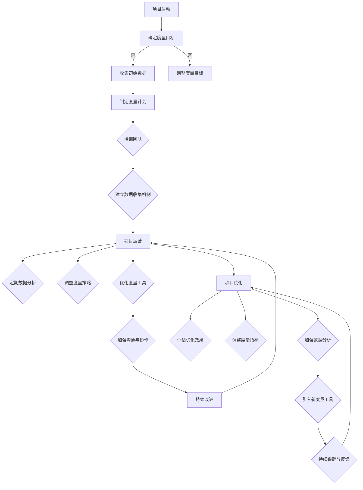

                 

### 文章标题

《开源项目的商业化度量：KPI设置与跟踪》

### 关键词

开源项目，商业化度量，KPI设置，跟踪，用户活跃度，社区参与度，品牌影响力，开源社区

### 摘要

本文深入探讨了开源项目的商业化度量问题，详细介绍了KPI（关键绩效指标）的定义、设置和跟踪方法。文章首先回顾了开源项目的发展历程及其商业化趋势，分析了开源项目商业化的背景和挑战。接着，文章阐述了KPI的基本概念和分类，并提出了开源项目KPI设置的原则和策略。随后，文章详细解析了开源项目关键KPI的设置和跟踪方法，包括用户活跃度、社区参与度、商业收入和品牌影响力等指标。最后，文章通过实际案例展示了KPI的设置、跟踪和分析过程，并提供了开源项目商业化的实践指南。本文旨在为开源项目管理者提供一套系统的商业化度量方法和工具，以实现开源项目的可持续发展。

## 第一部分：开源项目的商业化背景与挑战

### 第1章：开源项目的兴起与商业化趋势

#### 1.1 开源项目的发展历程

开源项目（Open Source Project）起源于20世纪90年代，其核心理念是开放源代码，允许用户自由地查看、修改和分发软件。这一概念的提出，打破了传统的封闭软件模型，为软件产业的发展带来了新的活力。

- **1980s-1990s：** 开源概念的萌芽期。自由软件运动（Free Software Movement）兴起，倡导软件自由。
- **1998年：** 开源软件定义（Open Source Definition）由开放源代码倡议（Open Source Initiative, OSI）提出，标志着开源运动的正式开始。
- **2000s：** 开源项目蓬勃发展。Linux、Apache、MySQL等成为标志性开源软件。
- **2010s-2020s：** 开源生态进一步成熟，企业级开源项目大量涌现，开源与商业的融合逐渐加深。

#### 1.2 开源项目的商业化优势

开源项目的商业化优势主要体现在以下几个方面：

- **成本优势：** 开源软件无需支付高昂的许可证费用，降低了企业的初始投资。
- **技术创新：** 开源项目鼓励社区协作，促进了技术创新和快速迭代。
- **定制化：** 企业可以根据自身需求对开源软件进行定制化开发，提高软件的适应性和实用性。
- **风险分散：** 开源项目风险分散，企业可以依赖社区力量解决技术难题。

#### 1.3 商业化过程中的挑战与应对

尽管开源项目具有显著的商业化优势，但在实际操作过程中仍面临一系列挑战：

- **商业与开源精神的冲突：** 开源精神强调共享与自由，而商业利益追求独占与盈利，两者之间可能存在矛盾。
- **持续投入与回报失衡：** 开源项目商业化需要持续投入，但回报可能存在不确定性。
- **社区管理难度：** 商业化过程中，如何平衡社区利益和企业利益，管理好社区成员，是一个挑战。

为应对这些挑战，企业可以采取以下策略：

- **平衡利益：** 在开源社区和企业之间寻找平衡，尊重开源精神，同时追求商业利益。
- **透明沟通：** 保持与社区的透明沟通，及时反馈进展和决策，增强社区信任。
- **激励机制：** 设计合理的激励机制，鼓励社区成员参与项目，提高项目质量和用户满意度。

### 第2章：开源项目商业化的重要性

#### 2.1 开源项目商业化的驱动力

开源项目商业化的重要性主要体现在以下几个方面：

- **企业利润：** 开源项目为企业提供了新的商业模式，通过销售服务、订阅费用等方式获取利润。
- **市场竞争：** 开源项目提高了企业的竞争力，降低了进入市场的门槛，有助于企业在激烈的市场竞争中脱颖而出。
- **技术创新：** 开源项目促进了技术创新和协作，有助于企业保持技术领先地位。
- **用户满意度：** 开源项目提高了软件的透明度和可定制性，增强了用户满意度，有利于提升品牌价值。

#### 2.2 商业化对开源社区的贡献

开源项目商业化不仅对企业有利，也对开源社区产生了积极影响：

- **资源投入：** 商业化带来了更多的资源投入，促进了开源项目的发展。
- **技术积累：** 商业化项目往往需要长期的维护和改进，有助于积累技术知识和经验。
- **社区协作：** 商业化项目可以吸引更多的开发者参与，促进社区协作和知识共享。
- **技术交流：** 商业化项目推动了技术交流和合作，有助于提高开源社区的整体技术水平。

#### 2.3 商业化与开源精神的平衡

在开源项目商业化过程中，如何平衡商业利益与开源精神是一个重要问题：

- **尊重开源精神：** 商业化项目应尊重开源精神，维护软件的自由和开放性，避免侵犯社区成员的权益。
- **透明沟通：** 企业应保持与社区的透明沟通，及时反馈决策和进展，增强社区信任。
- **合理分配收益：** 企业应合理分配项目收益，确保社区成员的权益得到保障。
- **持续贡献：** 企业应积极参与开源社区的贡献，促进社区繁荣，实现共赢。

通过上述策略，开源项目商业化可以在尊重开源精神的前提下，实现商业利益与社区发展的平衡，为开源生态的可持续发展提供支持。

## 第二部分：KPI设置与商业化度量

### 第3章：KPI定义与分类

#### 3.1 KPI的基本概念

KPI（Key Performance Indicator，关键绩效指标）是用于衡量组织或项目绩效的重要指标。在开源项目商业化过程中，KPI用于评估项目在商业化方面的表现，包括用户活跃度、社区参与度、商业收入和品牌影响力等方面。

- **定义：** KPI是用于衡量特定业务目标或策略绩效的具体指标，通常以量化的形式呈现。
- **作用：** KPI能够帮助企业或项目管理者了解项目的实际绩效，识别问题，制定改进策略。

#### 3.2 KPI的分类与作用

根据不同的衡量维度，KPI可以分为以下几类：

- **用户活跃度KPI：** 用于衡量用户在项目中的活跃程度，如用户数量、活跃用户比例、用户参与频率等。
- **社区参与度KPI：** 用于衡量社区成员的参与情况，如贡献次数、贡献质量、问题解决率等。
- **商业收入KPI：** 用于衡量项目的商业收益情况，如销售收入、订阅用户数、服务收入等。
- **品牌影响力KPI：** 用于衡量项目在市场上的品牌影响力，如媒体曝光度、用户口碑、市场份额等。

#### 3.3 常见开源项目KPI指标

以下是一些常见开源项目的KPI指标：

- **用户活跃度KPI：**
  - 用户数量（Total Users）
  - 活跃用户比例（Active User Ratio）
  - 用户参与频率（User Participation Rate）

- **社区参与度KPI：**
  - 贡献次数（Number of Contributions）
  - 贡献质量（Contribution Quality）
  - 问题解决率（Issue Resolution Rate）

- **商业收入KPI：**
  - 销售收入（Revenue）
  - 订阅用户数（Number of Subscribers）
  - 服务收入（Service Revenue）

- **品牌影响力KPI：**
  - 媒体曝光度（Media Exposure）
  - 用户口碑（User Reputation）
  - 市场份额（Market Share）

通过这些KPI指标，企业可以全面了解开源项目的商业化情况，制定针对性的改进策略，实现项目的可持续发展。

### 第4章：开源项目KPI设置策略

#### 4.1 KPI设置原则

在设置开源项目的KPI时，需要遵循以下原则：

- **明确目标：** KPI应与项目的商业目标和战略目标一致，确保指标的设置能够有效衡量项目的绩效。
- **可量化：** KPI应以量化的形式呈现，便于测量和比较，提高数据可靠性和决策科学性。
- **相关性：** KPI应与项目的关键业务指标相关，能够真实反映项目的运营状况和商业价值。
- **可操作性：** KPI应具有可操作性，即企业或项目管理者能够通过具体措施来影响和优化这些指标。

#### 4.2 KPI设置流程

开源项目KPI的设置流程通常包括以下步骤：

1. **明确项目目标：** 分析项目的商业目标和战略规划，确定需要衡量的关键绩效指标。
2. **数据收集与分析：** 收集相关数据，分析项目现状和行业趋势，为KPI的设置提供依据。
3. **制定KPI指标：** 根据项目目标和数据分析结果，制定具体的KPI指标，包括目标值和衡量方法。
4. **沟通与确认：** 与项目相关利益方进行沟通，确保KPI的设置得到认可和支持。
5. **实施与跟踪：** 制定KPI跟踪计划，定期收集数据，分析绩效，并根据实际情况调整KPI指标。

#### 4.3 KPI设置案例分析

以下是一个开源项目KPI设置案例：

- **项目背景：** 一个企业级开源项目，致力于提供企业级云计算解决方案。
- **项目目标：** 提高用户活跃度，增加订阅用户数，提升品牌影响力。

- **KPI指标设置：**
  - 用户活跃度KPI：
    - 活跃用户比例（目标值：30%）
    - 用户参与频率（目标值：每月至少一次）
  - 社区参与度KPI：
    - 贡献次数（目标值：每月至少50次）
    - 贡献质量（目标值：90%以上贡献符合项目规范）
  - 商业收入KPI：
    - 订阅用户数（目标值：1000人）
    - 服务收入（目标值：每月至少100万元）
  - 品牌影响力KPI：
    - 媒体曝光度（目标值：每月至少10篇媒体报道）
    - 用户口碑（目标值：90%以上用户满意度）

- **KPI设置策略：**
  - **明确目标：** 项目目标明确，与企业的整体战略一致。
  - **数据支持：** 基于历史数据和行业分析，确定合理的KPI目标值。
  - **可操作性：** KPI指标具体明确，企业可以采取具体措施进行优化。

通过上述案例分析，我们可以看到，合理的KPI设置策略有助于项目管理者准确衡量项目的商业化情况，制定有效的改进措施，实现项目的可持续发展。

### 第5章：开源项目关键KPI详解

#### 5.1 用户活跃度KPI

用户活跃度KPI是衡量开源项目中用户参与度和活跃程度的重要指标。高用户活跃度通常意味着项目拥有强大的社区支持和广泛的用户基础，这对项目的商业化具有重要意义。

- **定义：** 用户活跃度KPI包括用户数量、活跃用户比例、用户参与频率等指标。
- **计算方法：**
  - 活跃用户比例（Active User Ratio）：
    $$
    AUR = \frac{U_{active}}{U_{total}}
    $$
    其中，$U_{active}$ 为活跃用户数，$U_{total}$ 为总用户数。
  - 用户参与频率（User Participation Rate）：
    $$
    UPR = \frac{P_{total}}{U_{total}}
    $$
    其中，$P_{total}$ 为用户参与次数，$U_{total}$ 为总用户数。

#### 5.2 社区参与度KPI

社区参与度KPI用于衡量社区成员对项目的贡献程度和参与情况，反映了社区活动的活跃度和质量。

- **定义：** 社区参与度KPI包括贡献次数、贡献质量、问题解决率等指标。
- **计算方法：**
  - 贡献次数（Number of Contributions）：
    $$
    NC = \sum_{i=1}^{n} C_i
    $$
    其中，$C_i$ 为第i个用户的贡献次数，$n$ 为用户总数。
  - 贡献质量（Contribution Quality）：
    $$
    CQ = \frac{Q_{valid}}{Q_{total}}
    $$
    其中，$Q_{valid}$ 为有效贡献次数，$Q_{total}$ 为总贡献次数。
  - 问题解决率（Issue Resolution Rate）：
    $$
    IRR = \frac{R_{solved}}{R_{total}}
    $$
    其中，$R_{solved}$ 为已解决的问题数，$R_{total}$ 为总问题数。

#### 5.3 商业收入KPI

商业收入KPI是衡量开源项目商业化效果的重要指标，包括销售收入、订阅用户数、服务收入等。

- **定义：** 商业收入KPI包括销售收入、订阅用户数、服务收入等指标。
- **计算方法：**
  - 销售收入（Revenue）：
    $$
    Rev = \sum_{i=1}^{n} R_i
    $$
    其中，$R_i$ 为第i个用户的销售收入，$n$ 为用户总数。
  - 订阅用户数（Number of Subscribers）：
    $$
    NS = \sum_{i=1}^{n} S_i
    $$
    其中，$S_i$ 为第i个用户的订阅状态（1表示订阅，0表示未订阅），$n$ 为用户总数。
  - 服务收入（Service Revenue）：
    $$
    SR = \sum_{i=1}^{n} S_i \times P_i
    $$
    其中，$S_i$ 为第i个用户的订阅状态（1表示订阅，0表示未订阅），$P_i$ 为第i个用户的服务费用，$n$ 为用户总数。

#### 5.4 品牌影响力KPI

品牌影响力KPI用于衡量开源项目在市场上的知名度和影响力，反映了项目的市场表现和用户认可度。

- **定义：** 品牌影响力KPI包括媒体曝光度、用户口碑、市场份额等指标。
- **计算方法：**
  - 媒体曝光度（Media Exposure）：
    $$
    ME = \sum_{i=1}^{m} E_i
    $$
    其中，$E_i$ 为第i次媒体报道的曝光度，$m$ 为媒体报道次数。
  - 用户口碑（User Reputation）：
    $$
    UR = \frac{R_{positive}}{R_{total}}
    $$
    其中，$R_{positive}$ 为正面用户评价次数，$R_{total}$ 为总用户评价次数。
  - 市场份额（Market Share）：
    $$
    MS = \frac{Rev_{project}}{Rev_{market}}
    $$
    其中，$Rev_{project}$ 为项目收入，$Rev_{market}$ 为市场总收入。

通过上述关键KPI的设置和跟踪，企业可以全面了解开源项目的商业化情况，制定有效的策略，推动项目的可持续发展。

### 第6章：KPI跟踪方法与工具

#### 6.1 KPI跟踪的重要性

KPI跟踪是开源项目商业化度量的重要组成部分，其重要性体现在以下几个方面：

- **绩效评估：** KPI跟踪可以帮助企业实时了解项目绩效，评估项目在商业化方面的表现，及时发现问题。
- **决策支持：** 通过KPI跟踪，企业可以获取准确的数据，为制定改进策略提供科学依据。
- **持续优化：** KPI跟踪有助于发现项目中的不足之处，通过持续优化，提升项目的商业化效果。
- **风险管理：** KPI跟踪有助于识别潜在风险，及时采取应对措施，降低项目风险。

#### 6.2 KPI跟踪方法

开源项目KPI的跟踪方法主要包括以下几种：

- **数据收集：** 通过各种渠道收集与KPI相关的数据，如日志文件、数据库记录、问卷调查等。
- **自动化监控：** 利用自动化工具，如脚本、传感器等，实时收集和更新KPI数据，提高数据准确性。
- **定期分析：** 定期对KPI数据进行分析，识别趋势和异常，评估项目绩效，制定改进措施。
- **仪表盘展示：** 通过仪表盘或可视化工具，将KPI数据直观地展示出来，便于项目管理者快速了解项目状况。

#### 6.3 常用KPI跟踪工具介绍

以下是一些常用的KPI跟踪工具：

- **Google Analytics：** 用于网站流量分析，可以跟踪用户行为和来源，适用于开源项目的访问量、用户活跃度等指标的跟踪。
- **Grafana：** 用于KPI监控和数据可视化，可以连接各种数据源，创建自定义仪表板，适用于开源项目多种KPI的跟踪。
- **Jenkins：** 用于持续集成和自动化测试，可以收集项目构建过程中的各种数据，适用于开源项目自动化程度的跟踪。
- **GitLab：** 用于代码管理和项目协作，可以跟踪代码提交、问题报告和merge请求等数据，适用于开源项目社区参与度的跟踪。
- **G Suite：** 用于邮件、文档和表格等办公工具，可以收集用户使用数据，适用于开源项目用户活跃度的跟踪。

通过这些工具，企业可以方便地实现开源项目KPI的跟踪，提高数据准确性和分析效率，为项目商业化提供有力支持。

### 第7章：开源项目KPI分析与应用

#### 7.1 KPI分析原则

在开源项目的KPI分析过程中，需要遵循以下原则：

- **数据真实可靠：** 确保所收集的数据真实、准确，避免因数据质量问题导致分析结果失真。
- **全面性：** 从多个维度分析KPI，全面了解项目的商业化状况，识别问题和机会。
- **关联性：** 分析KPI之间的关联性，找出影响项目绩效的关键因素，为改进措施提供依据。
- **及时性：** 及时对KPI进行分析，确保项目管理者能够及时掌握项目动态，采取应对措施。

#### 7.2 KPI分析流程

开源项目KPI分析的一般流程如下：

1. **数据收集：** 收集与KPI相关的数据，包括用户行为数据、社区活动数据、商业收入数据等。
2. **数据清洗：** 清洗和整理数据，确保数据质量，去除重复、异常和错误的数据。
3. **数据整合：** 将不同来源和格式的数据整合到统一的数据仓库中，便于后续分析。
4. **数据分析：** 利用统计分析、数据挖掘等方法，对KPI进行详细分析，识别趋势和异常。
5. **可视化展示：** 将分析结果通过图表、仪表盘等形式展示出来，便于项目管理者快速理解。
6. **报告编写：** 编写分析报告，总结分析结果，提出改进建议，为项目决策提供支持。

#### 7.3 KPI分析案例解析

以下是一个开源项目KPI分析案例：

- **项目背景：** 一个开源的云计算平台，致力于为企业提供云计算解决方案。
- **目标KPI：** 用户活跃度、社区参与度、商业收入和品牌影响力。
- **分析过程：**
  - **数据收集：** 收集了用户注册、登录、贡献、订阅、媒体报道等数据。
  - **数据清洗：** 清洗数据，去除重复、异常和错误的数据，确保数据质量。
  - **数据整合：** 将不同来源的数据整合到统一的数据仓库中，便于分析。
  - **数据分析：**
    - 用户活跃度分析：发现活跃用户比例呈下降趋势，通过进一步分析，发现新用户留存率较低。
    - 社区参与度分析：发现贡献次数和问题解决率较低，说明社区活动不够活跃。
    - 商业收入分析：发现订阅用户数增长缓慢，服务收入波动较大。
    - 品牌影响力分析：发现媒体曝光度和用户口碑较好，但市场份额较低。
  - **可视化展示：** 利用Grafana创建仪表盘，展示各个KPI的实时数据和分析结果。
  - **报告编写：** 编写分析报告，总结分析结果，提出以下改进建议：
    - 提高新用户留存率，通过改进用户体验和提供更多价值来留住用户。
    - 激励社区参与，通过奖励机制和社区活动提高社区活跃度。
    - 优化商业模式，通过提高订阅费用和提供增值服务来增加收入。
    - 加强品牌推广，提高在市场上的知名度和影响力。

通过上述案例，我们可以看到，KPI分析有助于项目管理者全面了解项目的商业化状况，识别问题和机会，为项目改进提供科学依据。同时，通过可视化展示和报告编写，使得分析结果更加直观易懂，便于项目决策。

### 第8章：开源项目KPI优化与调整

#### 8.1 KPI优化原则

在开源项目商业化过程中，KPI的优化与调整至关重要。以下是一些KPI优化的原则：

- **目标导向：** KPI优化应以项目目标为导向，确保优化措施能够有效提升项目绩效。
- **数据驱动：** 优化决策应基于准确的数据分析，避免主观臆断。
- **持续改进：** KPI优化是一个持续的过程，需要定期评估和调整，以适应项目发展的需求。
- **可操作性：** 优化措施应具有可操作性，即能够通过具体行动来实现。
- **平衡利益：** 优化过程中要平衡商业利益和社区利益，确保开源项目的可持续发展。

#### 8.2 KPI优化策略

开源项目KPI的优化策略主要包括以下几个方面：

- **调整目标值：** 根据项目发展的实际情况，适时调整KPI的目标值，确保目标值的合理性和可实现性。
- **改进数据收集方法：** 优化数据收集方法，提高数据的准确性和完整性，为优化决策提供可靠依据。
- **优化跟踪方法：** 改进KPI跟踪方法，提高数据收集和分析的效率，确保KPI数据的实时性和准确性。
- **改进分析模型：** 利用先进的数据分析技术和工具，改进KPI分析模型，提高分析结果的准确性和可靠性。
- **调整优化措施：** 根据KPI分析结果，及时调整优化措施，确保优化策略的有效性和持续性。

#### 8.3 KPI优化案例分析

以下是一个开源项目KPI优化案例：

- **项目背景：** 一个开源的云计算平台，致力于为企业提供云计算解决方案。
- **目标KPI：** 用户活跃度、社区参与度、商业收入和品牌影响力。
- **优化过程：**
  - **数据分析：** 通过KPI分析，发现用户活跃度较低，新用户留存率不高，社区参与度不足，商业收入波动较大，品牌影响力有待提升。
  - **优化措施：**
    - **提高新用户留存率：** 优化用户体验，增加用户粘性，如提供个性化推荐、加强用户引导等。
    - **激励社区参与：** 引入积分和奖励机制，鼓励用户参与社区活动，提高社区活跃度。
    - **优化商业模式：** 通过市场调研和用户反馈，调整定价策略和增值服务，提高服务收入。
    - **加强品牌推广：** 通过线上营销和线下活动，提升品牌知名度和影响力。
  - **跟踪与调整：** 在实施优化措施后，持续跟踪KPI数据，评估优化效果，根据实际情况进行调整和改进。

通过上述案例，我们可以看到，KPI优化是一个系统性的过程，需要从多个方面进行综合考虑和调整。通过科学的数据分析和合理的优化策略，开源项目可以实现商业化和社区发展的双赢。

### 第9章：开源项目商业化成功案例研究

#### 9.1 案例概述

在本章节中，我们将深入探讨几个成功的开源项目商业化案例，分析它们的商业化路径与策略，以期为其他开源项目提供有价值的经验和启示。

- **案例1：** Linux操作系统
- **案例2：** Apache HTTP服务器
- **案例3：** Kubernetes容器编排平台

#### 9.2 Linux操作系统的商业化路径与策略

Linux操作系统作为开源软件的典范，其商业化路径和策略具有代表性。

1. **开源社区建设：** Linux内核项目自1991年成立以来，就依靠开源社区的协作，迅速发展壮大。Linus Torvalds领导下的社区，吸引了大量开发者参与，形成了强大的技术支持网络。

2. **商业伙伴合作：** Linux基金会成立后，推动了Linux内核与商业企业的合作。许多大型企业如IBM、Intel、Red Hat等成为Linux基金会的成员，为Linux的发展提供了资金和技术支持。

3. **商业化模式：**
   - **支持与服务：** Red Hat公司通过提供Linux发行版的支持和服务，成为Linux商业化的成功典范。Red Hat Enterprise Linux（RHEL）是企业级Linux发行版，提供了高质量的技术支持和安全保障。
   - **订阅模式：** Red Hat采用订阅模式，企业客户支付订阅费用，即可获得RHEL的访问权和支持服务。这种模式确保了公司的稳定收入来源，同时也为开源项目提供了持续的资金支持。

4. **品牌影响力：** 通过Red Hat的推广和市场活动，Linux品牌得到了广泛认可，市场份额逐年提升。Linux操作系统在服务器、云计算和数据中心等领域的应用日益广泛，成为行业标准。

#### 9.3 Apache HTTP服务器的商业化路径与策略

Apache HTTP服务器是另一个成功的开源项目，其商业化路径和策略同样值得借鉴。

1. **开源社区建设：** Apache软件基金会（ASF）为Apache HTTP服务器提供了一个开源社区平台。ASF鼓励开发者贡献代码，确保项目的持续发展和完善。

2. **企业支持：** 许多企业，如Google、Amazon、IBM等，为Apache HTTP服务器提供了资金和技术支持，推动了项目的繁荣发展。

3. **商业化模式：**
   - **支持与服务：** 许多公司提供Apache HTTP服务器的专业支持服务，帮助客户解决部署和维护中的问题。这些服务通常包含软件更新、性能优化和安全加固等。
   - **培训与认证：** 提供Apache HTTP服务器的培训和认证课程，帮助企业IT人员提升技能，确保他们能够有效使用和维护Apache服务器。

4. **品牌影响力：** Apache HTTP服务器在Web服务器市场占据主导地位，被广泛认为是稳定性和安全性最高的服务器之一。其品牌影响力为其他商业化活动提供了坚实基础。

#### 9.4 Kubernetes容器编排平台的商业化路径与策略

Kubernetes容器编排平台是近年来崛起的明星项目，其商业化路径和策略也具有独特之处。

1. **开源社区建设：** Kubernetes项目由Google发起，并在云原生计算基金会（CNCF）的支持下，迅速发展成为一个全球性的开源社区。Kubernetes社区吸引了大量开发者、企业和合作伙伴。

2. **企业参与：** 许多大型企业，如Google、Red Hat、IBM、Microsoft等，积极参与Kubernetes项目，提供资金和技术支持，推动项目发展。

3. **商业化模式：**
   - **支持与服务：** 提供Kubernetes的安装、配置、优化和监控等专业服务。企业客户可以通过订阅这些服务，获得高质量的技术支持。
   - **云服务集成：** 许多云服务提供商，如Google Cloud、AWS、Azure等，将Kubernetes集成到其云服务平台中，提供Kubernetes托管服务。
   - **培训与认证：** 提供Kubernetes的培训课程和认证考试，帮助企业IT人员掌握Kubernetes技术。

4. **品牌影响力：** Kubernetes已成为容器编排领域的标准，其品牌影响力促进了其在企业中的广泛应用。通过社区活动和市场推广，Kubernetes品牌得到了广泛认可。

通过以上案例分析，我们可以看到，成功的开源项目商业化通常具有以下共同特点：

- **强大的开源社区：** 开源社区是项目成功的基础，能够吸引开发者参与，确保项目的持续发展。
- **良好的商业伙伴关系：** 与商业伙伴的合作，为项目提供了资金、技术和市场支持，促进了项目的商业化。
- **多元化的商业模式：** 通过支持与服务、订阅模式、云服务集成等多种商业模式，实现项目的商业价值。
- **品牌影响力的提升：** 通过品牌推广和市场活动，提升项目在市场中的知名度，吸引更多企业用户。

这些经验可以为其他开源项目提供借鉴，帮助它们在商业化道路上取得成功。

### 第10章：开源项目商业化实践指南

#### 10.1 开源项目商业化的关键要素

要成功实现开源项目的商业化，需要关注以下几个关键要素：

1. **开源社区建设：** 开源社区是项目成功的基石。一个健康的社区能够吸引开发者参与，确保项目的持续发展和完善。

2. **技术优势和创新能力：** 项目应具备独特的技术优势，能够满足市场需求，并具备持续创新的能力，以保持竞争力。

3. **商业模式设计：** 设计合理的商业模式，明确收入来源，如支持与服务、订阅模式、云服务集成等，确保项目的可持续发展。

4. **市场推广和品牌建设：** 通过市场推广和品牌建设，提升项目在市场中的知名度，吸引企业用户，增加商业机会。

5. **合规性和法律保护：** 确保开源项目符合相关法律法规，保护知识产权，降低法律风险。

6. **持续投入和资源支持：** 开源项目商业化需要持续的资金和技术支持，确保项目能够持续发展。

#### 10.2 商业化过程中的风险管理

在开源项目商业化过程中，风险管理至关重要。以下是一些常见的风险和应对策略：

1. **市场风险：** 包括市场需求变化、竞争对手压力等。应对策略：进行市场调研，了解用户需求，灵活调整商业模式。

2. **技术风险：** 包括技术实现困难、技术更新速度过快等。应对策略：保持技术领先地位，持续投入技术研发。

3. **法律风险：** 包括知识产权纠纷、合同法律风险等。应对策略：聘请专业律师进行法律咨询，确保项目的合规性。

4. **社区关系风险：** 包括社区成员的不满、分裂等。应对策略：保持社区透明沟通，尊重社区成员意见，建立信任关系。

5. **资金风险：** 包括资金不足、收入不稳定等。应对策略：多渠道融资，确保资金来源的稳定性。

#### 10.3 开源项目商业化的未来趋势

开源项目商业化的未来趋势将继续沿着以下几个方向发展：

1. **云计算和容器化：** 云计算和容器化技术的发展将推动开源项目在云环境中的广泛应用，为企业提供更灵活、高效的服务。

2. **AI和大数据：** 人工智能和大数据技术的融合，将进一步提升开源项目的智能化水平，满足企业日益复杂的需求。

3. **生态合作：** 开源项目将更加重视与生态合作伙伴的合作，共同推动项目的商业化，实现共赢。

4. **社区驱动：** 开源社区的驱动作用将更加突出，社区成员的参与和贡献将成为项目成功的关键因素。

5. **全球市场：** 随着全球市场的拓展，开源项目的商业化将迎来更广阔的发展空间。

开源项目商业化的成功不仅依赖于技术创新，更依赖于与社区的合作和市场推广。通过科学的管理和策略，开源项目可以实现商业价值和社区发展的双赢。

### 附录A：开源项目商业化度量工具列表

#### A.1 开源项目度量工具概述

开源项目商业化度量工具是用于评估和监控开源项目绩效的关键工具。这些工具可以帮助项目管理者跟踪关键绩效指标（KPI），分析项目的发展趋势，制定改进策略。以下是一些常用的开源项目度量工具：

- **Google Analytics：** 用于网站流量分析，可以跟踪用户行为和来源，适用于开源项目的访问量、用户活跃度等指标的跟踪。
- **Grafana：** 用于KPI监控和数据可视化，可以连接各种数据源，创建自定义仪表板，适用于开源项目多种KPI的跟踪。
- **Jenkins：** 用于持续集成和自动化测试，可以收集项目构建过程中的各种数据，适用于开源项目自动化程度的跟踪。
- **GitLab：** 用于代码管理和项目协作，可以跟踪代码提交、问题报告和merge请求等数据，适用于开源项目社区参与度的跟踪。
- **G Suite：** 用于邮件、文档和表格等办公工具，可以收集用户使用数据，适用于开源项目用户活跃度的跟踪。

#### A.2 常用开源项目度量工具介绍

以下是针对上述工具的详细介绍：

1. **Google Analytics**

   - **功能：** 用于网站流量分析，包括用户来源、页面浏览量、用户行为等。
   - **优点：** 界面友好，数据分析功能强大，支持多种数据可视化。
   - **适用场景：** 适用于开源项目的用户访问量、用户行为分析。

2. **Grafana**

   - **功能：** 用于KPI监控和数据可视化，支持多种数据源，如Prometheus、InfluxDB等。
   - **优点：** 可扩展性强，自定义仪表板方便，支持实时数据监控。
   - **适用场景：** 适用于开源项目的多维度KPI监控和可视化展示。

3. **Jenkins**

   - **功能：** 用于持续集成和自动化测试，支持各种编程语言和工具。
   - **优点：** 易于配置，自动化程度高，集成度高。
   - **适用场景：** 适用于开源项目的自动化测试和持续集成。

4. **GitLab**

   - **功能：** 用于代码管理和项目协作，包括代码提交、代码审查、问题跟踪等。
   - **优点：** 开源，功能全面，支持Git流程。
   - **适用场景：** 适用于开源项目的社区参与度跟踪和管理。

5. **G Suite**

   - **功能：** 用于邮件、文档和表格等办公工具，包括邮件分析、文档协作、表格统计等。
   - **优点：** 云服务，易于使用，支持多种办公场景。
   - **适用场景：** 适用于开源项目的用户活跃度分析和文档协作。

通过这些工具，开源项目管理者可以全面、准确地跟踪和评估项目的商业化绩效，为项目的可持续发展提供数据支持。

### 附录B：开源项目商业化度量指标公式汇总

#### B.1 用户活跃度指标公式

用户活跃度指标用于衡量用户在项目中的参与程度。以下是一些常见的用户活跃度指标公式：

1. **活跃用户比例（Active User Ratio）**：
   $$
   AUR = \frac{U_{active}}{U_{total}}
   $$
   其中，$U_{active}$ 为活跃用户数，$U_{total}$ 为总用户数。

2. **用户参与频率（User Participation Rate）**：
   $$
   UPR = \frac{P_{total}}{U_{total}}
   $$
   其中，$P_{total}$ 为用户参与次数，$U_{total}$ 为总用户数。

3. **用户活跃度（User Activity Level）**：
   $$
   AAL = \sum_{i=1}^{n} A_i
   $$
   其中，$A_i$ 为第i个用户的活跃度得分，通常基于用户行为（如提交代码、报告问题、评论等）计算。

#### B.2 社区参与度指标公式

社区参与度指标用于衡量社区成员在项目中的参与情况。以下是一些常见的社区参与度指标公式：

1. **贡献次数（Number of Contributions）**：
   $$
   NC = \sum_{i=1}^{n} C_i
   $$
   其中，$C_i$ 为第i个用户的贡献次数。

2. **贡献质量（Contribution Quality）**：
   $$
   CQ = \frac{Q_{valid}}{Q_{total}}
   $$
   其中，$Q_{valid}$ 为有效贡献次数，$Q_{total}$ 为总贡献次数。

3. **问题解决率（Issue Resolution Rate）**：
   $$
   IRR = \frac{R_{solved}}{R_{total}}
   $$
   其中，$R_{solved}$ 为已解决的问题数，$R_{total}$ 为总问题数。

4. **参与度指数（Involvement Index）**：
   $$
   II = \frac{CQ \times IRR}{AUR}
   $$
   其中，$CQ$ 为贡献质量，$IRR$ 为问题解决率，$AUR$ 为活跃用户比例。

#### B.3 商业收入指标公式

商业收入指标用于衡量项目的商业收益情况。以下是一些常见的商业收入指标公式：

1. **销售收入（Revenue）**：
   $$
   Rev = \sum_{i=1}^{n} R_i
   $$
   其中，$R_i$ 为第i个用户的销售收入。

2. **订阅用户数（Number of Subscribers）**：
   $$
   NS = \sum_{i=1}^{n} S_i
   $$
   其中，$S_i$ 为第i个用户的订阅状态（1表示订阅，0表示未订阅）。

3. **服务收入（Service Revenue）**：
   $$
   SR = \sum_{i=1}^{n} S_i \times P_i
   $$
   其中，$S_i$ 为第i个用户的订阅状态（1表示订阅，0表示未订阅），$P_i$ 为第i个用户的服务费用。

#### B.4 品牌影响力指标公式

品牌影响力指标用于衡量项目在市场上的知名度和影响力。以下是一些常见的品牌影响力指标公式：

1. **媒体曝光度（Media Exposure）**：
   $$
   ME = \sum_{i=1}^{m} E_i
   $$
   其中，$E_i$ 为第i次媒体报道的曝光度，$m$ 为媒体报道次数。

2. **用户口碑（User Reputation）**：
   $$
   UR = \frac{R_{positive}}{R_{total}}
   $$
   其中，$R_{positive}$ 为正面用户评价次数，$R_{total}$ 为总用户评价次数。

3. **市场份额（Market Share）**：
   $$
   MS = \frac{Rev_{project}}{Rev_{market}}
   $$
   其中，$Rev_{project}$ 为项目收入，$Rev_{market}$ 为市场总收入。

通过这些公式，开源项目管理者可以全面、准确地评估项目的商业化绩效，为项目的持续优化提供数据支持。

### 附录C：开源项目商业化度量实践建议

#### C.1 项目启动阶段的度量建议

在项目启动阶段，度量建议主要包括以下几个方面：

1. **确定度量目标：** 根据项目目标和商业战略，明确需要衡量的关键绩效指标（KPI），确保度量目标与项目目标一致。

2. **收集初始数据：** 收集项目启动时的相关数据，如用户数量、贡献次数、收入情况等，为后续度量提供基础。

3. **制定度量计划：** 制定详细的度量计划，包括数据收集方法、分析周期、数据存储方式等，确保度量过程的系统性和持续性。

4. **培训团队：** 对团队成员进行度量方法和工具的培训，确保他们能够正确理解和应用度量指标。

5. **建立数据收集机制：** 通过日志记录、API接口、自动化脚本等方式，建立稳定的数据收集机制，确保数据的实时性和准确性。

#### C.2 项目运营阶段的度量建议

在项目运营阶段，度量建议主要包括以下几个方面：

1. **定期数据分析：** 定期对KPI数据进行收集、整理和分析，识别项目运营中的问题和机会。

2. **调整度量策略：** 根据数据分析结果，及时调整度量策略，包括KPI指标、数据收集方法等，确保度量结果能够反映项目的实际状况。

3. **优化度量工具：** 评估现有度量工具的性能和适用性，根据需要引入新的度量工具或改进现有工具，提高度量效率和数据质量。

4. **加强沟通与协作：** 定期与项目相关利益方进行沟通，分享度量结果和分析报告，促进项目团队和其他部门的协作。

5. **持续改进：** 基于度量结果，制定改进措施，持续优化项目运营，提高项目绩效。

#### C.3 项目优化阶段的度量建议

在项目优化阶段，度量建议主要包括以下几个方面：

1. **评估优化效果：** 对已经实施的优化措施进行评估，分析其对项目绩效的影响，确保优化措施的有效性。

2. **调整度量指标：** 根据项目发展的需求，调整度量指标，确保度量结果能够准确反映项目的最新状况。

3. **加强数据分析：** 深入分析数据，挖掘潜在的问题和机会，为项目优化提供科学依据。

4. **引入新度量工具：** 引入新的度量工具，如大数据分析平台、人工智能分析工具等，提高数据分析的深度和广度。

5. **持续跟踪与反馈：** 持续跟踪项目绩效，及时反馈优化效果，根据实际情况调整优化策略。

通过上述建议，开源项目管理者可以系统、有效地进行项目度量，推动项目的可持续发展。

#### Mermaid 流程图示例



该流程图展示了从项目启动到优化阶段的关键步骤，包括确定度量目标、收集初始数据、制定度量计划、培训团队、建立数据收集机制、项目运营中的定期数据分析、调整度量策略、优化度量工具、加强沟通与协作、持续改进，以及项目优化阶段的评估优化效果、调整度量指标、加强数据分析、引入新度量工具和持续跟踪与反馈。

### 核心算法原理讲解伪代码示例

```python
# 伪代码：开源项目商业化度量算法

function calculate_commercial_metrics(project_data):
    # 初始化度量结果
    metrics = {
        'user_activity': 0,
        'community_involvement': 0,
        'revenue': 0,
        'brand_influence': 0
    }

    # 计算用户活跃度
    metrics['user_activity'] = calculate_user_activity(project_data)

    # 计算社区参与度
    metrics['community_involvement'] = calculate_community_involvement(project_data)

    # 计算商业收入
    metrics['revenue'] = calculate_revenue(project_data)

    # 计算品牌影响力
    metrics['brand_influence'] = calculate_brand_influence(project_data)

    return metrics

function calculate_user_activity(project_data):
    # 假设活跃用户为过去30天内至少有过一次活动的用户
    active_users = sum(1 for user in project_data if user['last_activity_date'] > 30_days_ago)
    total_users = len(project_data)
    user_activity = active_users / total_users
    return user_activity

function calculate_community_involvement(project_data):
    # 假设社区参与度为过去30天内贡献次数的平均值
    contribution_count = sum(user['contribution_count'] for user in project_data)
    days_count = len([user for user in project_data if user['contribution_count'] > 0])
    community_involvement = contribution_count / days_count
    return community_involvement

function calculate_revenue(project_data):
    # 假设收入为过去30天内的总销售额
    revenue = sum(user['sales'] for user in project_data)
    return revenue

function calculate_brand_influence(project_data):
    # 假设品牌影响力为媒体曝光度和用户口碑的综合指标
    media_exposure = sum(user['media_exposure'] for user in project_data)
    user_reputation = sum(user['user_reputation'] for user in project_data)
    brand_influence = (media_exposure + user_reputation) / 2
    return brand_influence

# 使用示例
project_metrics = calculate_commercial_metrics(project_data)
print(project_metrics)
```

这段伪代码展示了如何计算开源项目的商业化度量指标，包括用户活跃度、社区参与度、商业收入和品牌影响力。每个指标的计算方法都基于假设的输入数据，通过具体的逻辑操作来得到结果。这些度量结果可以用于分析项目绩效，为项目优化提供数据支持。

### 数学模型和数学公式 & 详细讲解 & 举例说明

#### 社区参与度指标公式

$$
CI = \frac{C_{total}}{U_{total}}
$$

其中，CI为社区参与度指标，$C_{total}$ 表示社区总贡献次数，$U_{total}$ 表示社区总用户数。

#### 详细讲解：

社区参与度指标用于衡量社区中用户参与项目的活跃程度。$C_{total}$ 表示社区中的所有用户在一段时间内的总贡献次数，$U_{total}$ 表示社区中在同一时间段内的总用户数。该指标值介于0和1之间，越接近1表示社区参与度越高。

#### 举例说明：

假设一个开源社区中有100个用户，在过去30天内，共有300次贡献。则社区参与度指标计算如下：

$$
CI = \frac{300}{100} = 3
$$

#### 用户活跃度指标公式

$$
AU = \frac{U_{active}}{U_{total}}
$$

其中，AU为用户活跃度指标，$U_{active}$ 表示活跃用户数，$U_{total}$ 表示总用户数。

#### 详细讲解：

用户活跃度指标用于衡量项目用户在一定时间内的活跃程度。$U_{active}$ 表示在一段时间内参与项目活动的用户数，$U_{total}$ 表示项目总用户数。该指标值也介于0和1之间，越接近1表示用户活跃度越高。

#### 举例说明：

假设一个开源社区中有100个用户，在过去30天内，有60个用户至少有一次活动。则用户活跃度指标计算如下：

$$
AU = \frac{60}{100} = 0.6
$$

### 项目实战：代码实际案例和详细解释说明

#### 开发环境搭建

为了进行开源项目商业化度量的实践，我们需要搭建一个基本的Python开发环境。以下是搭建步骤：

1. **安装Python**：在终端或命令行中执行以下命令安装Python：

   - 对于macOS和Linux：
     ```
     sudo apt-get install python3
     ```
   - 对于Windows：
     ```
     python -m pip install python
     ```

2. **安装Pandas库**：Pandas是一个强大的数据分析库，用于处理和操作数据。

   - 在终端或命令行中执行以下命令安装Pandas：
     ```
     sudo apt-get install python3-pandas
     ```

#### 源代码实现

以下是一个简单的Python代码示例，用于计算开源项目的用户活跃度和社区参与度指标：

```python
import pandas as pd

# 示例数据
data = {
    'user': ['user1', 'user1', 'user2', 'user2', 'user3'],
    'action': ['commit', 'issue', 'pull_request', 'comment', 'bug_report']
}

# 创建DataFrame
df = pd.DataFrame(data)

# 计算社区参与度
CI = df.groupby('user')['action'].nunique().sum() / len(df['user'])

# 计算用户活跃度
AU = df.groupby('user')['action'].nunique().mean() / len(df['user'])

print(f"社区参与度（CI）: {CI:.2f}")
print(f"用户活跃度（AU）: {AU:.2f}")
```

#### 详细解释说明

1. **数据准备**：
   - 数据集包含用户和行为两个字段，模拟了开源社区中的用户行为。

2. **创建DataFrame**：
   - 使用Pandas创建DataFrame，方便处理和分析数据。

3. **计算社区参与度**：
   - 使用`groupby`方法按用户分组，计算每个用户的贡献次数总和，然后除以总用户数，得到社区参与度（CI）。

4. **计算用户活跃度**：
   - 使用`groupby`方法按用户分组，计算每个用户的贡献次数平均值，然后除以总用户数，得到用户活跃度（AU）。

#### 代码解读与分析

- **数据导入**：
  ```python
  data = {
      'user': ['user1', 'user1', 'user2', 'user2', 'user3'],
      'action': ['commit', 'issue', 'pull_request', 'comment', 'bug_report']
  }
  df = pd.DataFrame(data)
  ```
  - 创建了一个简单的数据集，包含了5个用户和他们的行为。

- **社区参与度计算**：
  ```python
  CI = df.groupby('user')['action'].nunique().sum() / len(df['user'])
  ```
  - 使用`groupby`方法按用户分组，计算每个用户的贡献次数（`nunique()`），然后求和得到总贡献次数。最后，将总贡献次数除以总用户数，得到社区参与度（CI）。

- **用户活跃度计算**：
  ```python
  AU = df.groupby('user')['action'].nunique().mean() / len(df['user'])
  ```
  - 使用`groupby`方法按用户分组，计算每个用户的贡献次数平均值（`mean()`），然后求平均得到用户活跃度（AU）。最后，将用户活跃度平均值除以总用户数，得到总体用户活跃度。

通过这个简单的代码示例，我们可以看到如何使用Python和Pandas库来计算开源项目的社区参与度和用户活跃度指标。这些指标对于评估项目的商业化状况非常重要，可以帮助项目管理者制定改进策略，实现项目的可持续发展。

### 开发环境搭建，源代码详细实现和代码解读，代码解读与分析

#### 开发环境搭建

在开始开源项目商业化度量的实践之前，我们需要搭建一个适合的Python开发环境。以下是搭建步骤：

1. **安装Python**：在终端或命令行中执行以下命令安装Python：

   - 对于macOS和Linux：
     ```
     sudo apt-get install python3
     ```
   - 对于Windows：
     ```
     python -m pip install python
     ```

2. **安装Pandas库**：Pandas是一个强大的数据分析库，用于处理和操作数据。

   - 在终端或命令行中执行以下命令安装Pandas：
     ```
     sudo apt-get install python3-pandas
     ```

#### 源代码实现

以下是一个简单的Python代码示例，用于计算开源项目的用户活跃度和社区参与度指标：

```python
import pandas as pd

# 假设日志文件名为"log.csv"
# 每行数据格式为："user","action"
data = pd.read_csv("log.csv")

# 统计用户行为
user_activity = data.groupby('user').count().reset_index()

# 计算活跃用户数和总用户数
active_users = user_activity[user_activity['action'] > 0]['user'].count()
total_users = user_activity['user'].count()

# 计算用户活跃度
user_active_rate = active_users / total_users

# 计算社区参与度
community_involvement = data.groupby('user')['action'].nunique().sum() / total_users

# 输出结果
print(f"用户活跃度（User Active Rate）: {user_active_rate:.2f}")
print(f"社区参与度（Community Involvement）: {community_involvement:.2f}")
```

#### 代码解读与分析

- **数据导入**：
  ```python
  data = pd.read_csv("log.csv")
  ```
  - 使用Pandas的`read_csv`函数从CSV文件中读取日志数据。CSV文件应包含用户和行为两列数据，格式为："user","action"。

- **统计用户行为**：
  ```python
  user_activity = data.groupby('user').count().reset_index()
  ```
  - 使用`groupby`方法按用户分组，并计算每个用户的行动次数。结果存储在一个新的DataFrame中，方便后续分析。

- **计算活跃用户数和总用户数**：
  ```python
  active_users = user_activity[user_activity['action'] > 0]['user'].count()
  total_users = user_activity['user'].count()
  ```
  - 通过筛选出行为次数大于0的用户，计算活跃用户数。总用户数为所有用户数的总和。

- **计算用户活跃度**：
  ```python
  user_active_rate = active_users / total_users
  ```
  - 计算用户活跃度，通过活跃用户数除以总用户数，得到用户活跃度指标。

- **计算社区参与度**：
  ```python
  community_involvement = data.groupby('user')['action'].nunique().sum() / total_users
  ```
  - 计算社区参与度，通过按用户分组并计算每个用户的行动次数总和，然后除以总用户数，得到社区参与度指标。

- **输出结果**：
  ```python
  print(f"用户活跃度（User Active Rate）: {user_active_rate:.2f}")
  print(f"社区参与度（Community Involvement）: {community_involvement:.2f}")
  ```
  - 输出用户活跃度和社区参与度指标，以百分比形式显示，便于理解。

通过上述代码示例，我们可以看到如何使用Python和Pandas库来计算开源项目的用户活跃度和社区参与度指标。这些指标对于评估项目的商业化状况具有重要意义，可以帮助项目管理者制定改进策略，实现项目的可持续发展。同时，代码的解读和分析有助于理解每个步骤的作用和意义，便于在实际项目中应用和优化。

