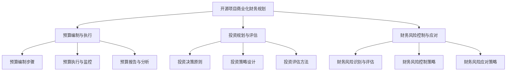

                 

# 文章标题

《开源项目的商业化财务规划：预算和投资》

> 关键词：开源项目、商业化、财务规划、预算编制、投资评估、成本效益分析

> 摘要：本文详细探讨了开源项目的商业化财务规划，包括预算编制与执行、投资策略与评估、财务风险控制与应对等方面的内容。通过具体案例的分析，为开源项目的商业化提供了实用的财务规划思路和方法。

## 《开源项目的商业化财务规划：预算和投资》目录大纲

### 《开源项目的商业化财务规划：预算和投资》

#### 第一部分：概述与基础知识

**# 第1章：开源项目与商业化的联系**

- **1.1 开源项目的定义与特性**
  - **1.1.1 开源项目的起源**
  - **1.1.2 开源项目的核心价值观**
  - **1.1.3 商业化与开源项目的结合**

- **1.2 商业化财务规划的重要性**
  - **1.2.1 财务规划的基本概念**
  - **1.2.2 开源项目财务规划的特点**
  - **1.2.3 财务规划在项目生命周期中的作用**

#### 第二部分：预算规划

**# 第2章：预算编制与执行**

- **2.1 预算编制的步骤与方法**
  - **2.1.1 收集预算信息**
  - **2.1.2 制定预算目标**
  - **2.1.3 编制详细预算**

- **2.2 预算执行与监控**
  - **2.2.1 预算执行的关键环节**
  - **2.2.2 监控预算执行情况**
  - **2.2.3 调整预算计划**

- **2.3 预算报告与分析**
  - **2.3.1 编制预算报告**
  - **2.3.2 预算分析的方法与工具**
  - **2.3.3 预算分析的应用**

#### 第三部分：投资规划

**# 第3章：投资策略与评估**

- **3.1 投资决策的基本原则**
  - **3.1.1 投资与风险的关系**
  - **3.1.2 投资决策的重要性**
  - **3.1.3 投资决策的原则**

- **3.2 投资策略的设计与实施**
  - **3.2.1 投资策略的类型**
  - **3.2.2 投资组合的设计**
  - **3.2.3 投资策略的实施**

- **3.3 投资评估的方法与工具**
  - **3.3.1 投资评估的指标体系**
  - **3.3.2 投资评估的方法**
  - **3.3.3 投资评估的应用**

#### 第四部分：财务风险控制

**# 第4章：财务风险管理与应对**

- **4.1 财务风险识别与评估**
  - **4.1.1 财务风险的来源**
  - **4.1.2 财务风险的识别**
  - **4.1.3 财务风险的评估**

- **4.2 财务风险控制策略**
  - **4.2.1 风险控制的原则**
  - **4.2.2 风险控制的措施**
  - **4.2.3 风险控制的实施**

- **4.3 财务风险的应对策略**
  - **4.3.1 风险应对的步骤**
  - **4.3.2 风险应对的方法**
  - **4.3.3 风险应对的案例分析**

#### 第五部分：案例分析

**# 第5章：成功开源项目商业化财务规划案例分析**

- **5.1 案例背景与目标**
  - **5.1.1 案例背景**
  - **5.1.2 案例目标**

- **5.2 案例实施过程**
  - **5.2.1 预算规划与执行**
  - **5.2.2 投资策略与评估**
  - **5.2.3 财务风险管理**

- **5.3 案例结果与启示**
  - **5.3.1 案例结果分析**
  - **5.3.2 案例启示与建议**

#### 第六部分：未来展望

**# 第6章：开源项目商业化财务规划的趋势与挑战**

- **6.1 财务规划的趋势**
  - **6.1.1 数字经济的崛起**
  - **6.1.2 新型商业模式的兴起**
  - **6.1.3 财务规划的数字化转型**

- **6.2 财务规划的挑战**
  - **6.2.1 法律法规的挑战**
  - **6.2.2 技术发展的挑战**
  - **6.2.3 市场竞争的挑战**

- **6.3 未来展望**
  - **6.3.1 财务规划的发展方向**
  - **6.3.2 开源项目商业化的未来趋势**
  - **6.3.3 对开源项目财务规划的建议**

#### 附录

**# 附录A：开源项目商业化财务规划工具与资源**

- **A.1 常用财务规划工具介绍**
- **A.2 财务规划相关资源推荐**
- **A.3 开源项目商业化财务规划的最佳实践案例**

[Mermaid 流�程图]



### 让我们一步步思考与推理，深入理解开源项目的商业化财务规划。

### 第1章：开源项目与商业化的联系

#### 1.1 开源项目的定义与特性

**1.1.1 开源项目的起源**

开源（Open Source）的概念最早起源于1980年代，由自由软件运动倡导者Richard Stallman提出。他认为软件应该自由共享和修改，以促进技术进步和用户自由。这种思想在1990年代随着互联网的兴起得到了更广泛的传播和应用。

开源项目通常遵循特定的开源许可协议，如GPL（GNU General Public License）、MIT License等，这些协议规定了软件的使用、复制、修改和分发条件。开源项目不仅包括软件，还可以涵盖硬件设计、文档资料等多种形式。

**1.1.2 开源项目的核心价值观**

开源项目的核心价值观主要包括以下几点：

1. **自由与合作**：开源鼓励用户自由使用、研究、修改和分享项目，促进知识共享和协作创新。
2. **透明性**：开源项目的源代码和开发过程公开透明，使得项目质量得到更多人的监督和检验。
3. **可持续性**：开源项目通常由一个社区共同维护，具有良好的可持续性。
4. **灵活性**：开源项目允许用户根据需求进行定制和优化，提高项目的适用性和灵活性。

**1.1.3 商业化与开源项目的结合**

尽管开源项目强调自由和共享，但在实际操作中，商业化与开源项目的结合已成为一种常见的模式。以下是一些常见的商业化方式：

1. **提供增值服务**：如云服务、在线培训、专业咨询等。
2. **销售定制版本**：根据用户需求进行定制开发的版本。
3. **赞助与捐赠**：企业和个人通过赞助或捐赠方式支持开源项目。
4. **开源许可费用**：某些开源许可协议允许收取使用费。
5. **商业合作伙伴**：与开源项目相关的商业合作伙伴关系，如硬件供应商、云服务提供商等。

商业化与开源项目的结合不仅为开源项目提供了资金支持，也有助于项目的发展与优化，同时为企业带来了潜在的商业机会。

**1.2 商业化财务规划的重要性**

商业化财务规划在开源项目中具有至关重要的作用。它包括预算编制、投资评估、风险控制等多个方面，为项目的可持续发展和商业化提供保障。

- **资源优化**：通过合理的财务规划，可以确保资源的有效利用，避免浪费。
- **风险控制**：财务规划有助于识别和应对项目风险，确保项目的稳定运行。
- **收益最大化**：合理的财务规划可以最大化项目的收益，提高商业价值。

#### 1.2.1 财务规划的基本概念

财务规划是指为达成特定财务目标而进行的规划活动，包括预算编制、财务预测、投资评估、成本控制等方面。在开源项目中，财务规划通常包括以下内容：

- **预算编制**：根据项目需求和资源情况，制定详细的预算计划。
- **投资评估**：评估不同投资方案的经济效益，选择最优方案。
- **成本控制**：监控项目成本，确保项目在预算范围内完成。
- **收益预测**：预测项目的未来收益，为决策提供依据。

**1.2.2 开源项目财务规划的特点**

开源项目的财务规划具有以下特点：

- **资源有限**：开源项目通常依靠社区捐赠、赞助等外部资源，资源相对有限，需要精细化规划和管理。
- **成本多样性**：开源项目的成本不仅包括软件开发成本，还包括维护、运营、推广等多种成本。
- **风险较高**：开源项目可能面临技术风险、市场风险等多重挑战，需要做好风险管理。

**1.2.3 财务规划在项目生命周期中的作用**

财务规划在开源项目的整个生命周期中起着至关重要的作用：

- **启动阶段**：财务规划有助于确定项目可行性，制定初步预算。
- **开发阶段**：财务规划确保项目资源得到合理分配，监控项目进度和成本。
- **推广阶段**：财务规划评估项目的市场前景，制定推广策略。
- **运营阶段**：财务规划持续监控项目收益和成本，确保项目的可持续发展。

通过合理的财务规划，开源项目可以更好地应对各种挑战，实现商业化和可持续发展。

### 总结

开源项目的商业化财务规划是开源项目成功的关键之一。通过深入了解开源项目的起源、核心价值观以及商业化方式，我们认识到财务规划的重要性。在接下来的章节中，我们将详细探讨预算编制与执行、投资策略与评估、财务风险控制与应对等方面的内容，为开源项目的商业化提供实用的指导。

### 第2章：预算编制与执行

#### 2.1 预算编制的步骤与方法

**2.1.1 收集预算信息**

预算编制的第一步是收集相关信息。这些信息包括但不限于项目目标、项目范围、项目需求、历史数据、市场趋势等。收集信息的过程可以通过以下几种方式进行：

- **项目调研**：通过访谈、问卷调查、文档分析等方式了解项目的具体情况。
- **市场调研**：收集行业报告、市场数据、竞争对手信息等，了解市场环境和竞争状况。
- **历史数据**：分析过去类似项目的预算执行情况和财务表现，为本次预算编制提供参考。

**2.1.2 制定预算目标**

在收集到足够的信息后，需要根据项目目标制定具体的预算目标。预算目标应具有可衡量性、可行性和挑战性，以确保项目目标的实现。

- **可衡量性**：预算目标应能够量化，以便于监控和评估。
- **可行性**：预算目标应在现有资源和技术条件下能够实现。
- **挑战性**：预算目标应具有一定的挑战性，以激发项目团队的积极性。

**2.1.3 编制详细预算**

制定预算目标后，需要编制详细的预算计划。预算计划应包括收入预算、支出预算和利润预算等部分。

- **收入预算**：根据项目预期收益和市场分析结果，制定详细的收入预算。
- **支出预算**：根据项目需求、资源投入和市场情况，制定详细的支出预算。
- **利润预算**：根据收入预算和支出预算，计算预期利润。

在编制预算计划时，应注意以下几点：

- **全面性**：预算计划应涵盖项目的所有方面，确保无遗漏。
- **准确性**：预算计划应根据实际数据制定，避免过高或过低的估计。
- **灵活性**：预算计划应具有灵活性，以应对项目过程中可能出现的变化。

#### 2.2 预算执行与监控

**2.2.1 预算执行的关键环节**

在预算执行过程中，关键环节包括以下几个方面：

- **项目启动**：根据预算计划，启动项目并分配资源。
- **项目执行**：按照预算计划进行项目实施，确保项目进度和质量。
- **成本监控**：实时监控项目成本，确保项目在预算范围内执行。

- **风险管理**：识别和应对项目风险，确保项目顺利进行。

**2.2.2 监控预算执行情况**

为了确保预算执行的有效性，需要对预算执行情况进行监控。监控过程可以通过以下几种方式进行：

- **定期报告**：定期编制项目报告，包括项目进度、成本、收益等方面的信息。
- **成本分析**：对项目成本进行分析，识别成本异常和潜在问题。
- **绩效评估**：对项目团队和个人的绩效进行评估，确保项目目标的实现。

**2.2.3 调整预算计划**

在预算执行过程中，可能由于各种原因导致预算计划需要调整。调整预算计划的关键环节包括：

- **评估现状**：评估项目执行情况，识别存在的问题和风险。
- **调整预算**：根据项目执行情况，对预算计划进行调整。
- **沟通协调**：与项目相关方沟通，确保调整计划的顺利实施。

#### 2.3 预算报告与分析

**2.3.1 编制预算报告**

预算报告是项目管理和财务规划的重要工具。预算报告应包括以下内容：

- **预算编制背景**：简要介绍预算编制的目的和依据。
- **预算执行情况**：详细描述项目执行过程中的成本、收益和利润情况。
- **预算分析**：对预算执行情况进行定量和定性分析，识别问题和改进方向。
- **调整预算计划**：说明预算调整的原因和具体措施。

**2.3.2 预算分析的方法与工具**

预算分析的方法和工具主要包括以下几种：

- **比较分析法**：通过比较实际数据和预算数据，分析项目执行情况。
- **趋势分析法**：通过分析历史数据和趋势，预测项目未来的表现。
- **比率分析法**：通过计算各种比率，评估项目的经济绩效。

**2.3.3 预算分析的应用**

预算分析在开源项目的商业化财务规划中具有重要意义，其主要应用包括：

- **决策支持**：为项目管理和财务决策提供数据支持。
- **绩效评估**：对项目团队和个人的绩效进行评估。
- **改进方向**：识别项目执行中的问题和不足，提出改进建议。

通过合理的预算编制与执行，开源项目可以更好地实现其商业目标。在接下来的章节中，我们将进一步探讨投资策略与评估、财务风险控制与应对等方面的内容，为开源项目的商业化提供全面的指导。

### 总结

预算编制与执行是开源项目商业化财务规划的重要组成部分。通过收集预算信息、制定预算目标和编制详细预算，我们可以为项目的顺利实施提供财务保障。在预算执行过程中，关键环节包括项目启动、成本监控和风险管理。同时，定期编制预算报告和分析预算执行情况，可以帮助我们及时发现问题和调整预算计划。通过合理的预算管理，开源项目可以实现商业化和可持续发展。

### 第3章：投资策略与评估

#### 3.1 投资决策的基本原则

投资决策是开源项目财务规划中的重要环节，其基本原则如下：

**3.1.1 投资与风险的关系**

投资与风险是相伴而行的。任何投资都存在一定的风险，而投资决策的关键在于如何平衡风险和收益。开源项目由于其开放性和社区驱动的特点，风险相对较高，但同时也提供了较大的发展潜力。

- **风险类型**：开源项目的风险主要包括技术风险、市场风险、管理风险等。
  - **技术风险**：开源项目可能面临技术不成熟、技术更新快等问题。
  - **市场风险**：开源项目的市场前景和用户需求变化较快。
  - **管理风险**：开源项目的管理和决策过程可能存在不确定性。

**3.1.2 投资决策的重要性**

投资决策是开源项目成功的关键因素之一。合理的投资决策可以最大化项目的收益，降低风险，提高项目的竞争力。

- **投资方向**：开源项目的投资方向主要包括技术投资、市场投资和人力资源投资等。
  - **技术投资**：用于项目的技术研发、技术升级等。
  - **市场投资**：用于市场推广、用户拓展等。
  - **人力资源投资**：用于项目团队建设、人才培养等。

**3.1.3 投资决策的原则**

在进行投资决策时，应遵循以下原则：

- **收益最大化**：选择具有较高收益潜力的投资方向。
- **风险可控**：对投资风险进行充分评估，确保风险在可控范围内。
- **资源优化**：合理配置资源，确保投资效益最大化。
- **灵活性**：投资策略应具有一定的灵活性，以应对市场变化和项目需求的变化。

#### 3.2 投资策略的设计与实施

**3.2.1 投资策略的类型**

开源项目的投资策略可以根据不同的维度进行分类，常见的投资策略类型包括：

- **按投资对象分类**：
  - **技术投资**：包括研发投入、技术优化、技术创新等。
  - **市场投资**：包括市场推广、品牌建设、用户拓展等。
  - **人力资源投资**：包括团队建设、人才培养、员工激励等。

- **按投资阶段分类**：
  - **启动阶段**：主要用于项目启动和初期投入，如研发、市场调研等。
  - **成长阶段**：主要用于项目成长期的投入，如技术研发、市场拓展等。
  - **成熟阶段**：主要用于项目成熟期的投入，如品牌建设、用户维护等。

**3.2.2 投资组合的设计**

投资组合的设计是开源项目投资策略的核心。合理的投资组合可以降低风险，提高收益。

- **分散投资**：通过分散投资于不同的项目或领域，降低单一项目或领域的风险。
- **多元化投资**：在技术、市场、人力资源等多个方面进行投资，提高整体收益。
- **投资优先级**：根据项目的优先级和风险收益情况，合理配置投资资源。

**3.2.3 投资策略的实施**

投资策略的实施包括以下关键环节：

- **投资计划制定**：根据项目需求和资源情况，制定详细的投资计划。
- **投资执行**：按照投资计划进行具体投资活动，如技术研发、市场推广等。
- **投资监控**：实时监控投资执行情况，确保投资在预算范围内完成。
- **投资评估**：对投资效果进行评估，包括收益、风险、项目进展等。

#### 3.3 投资评估的方法与工具

**3.3.1 投资评估的指标体系**

投资评估的指标体系是投资评估的基础。常见的投资评估指标包括：

- **财务指标**：
  - **投资回报率（ROI）**：衡量投资收益与投资成本的比率。
  - **净现值（NPV）**：衡量投资项目的现金流量现值与投资成本的差额。
  - **内部收益率（IRR）**：衡量投资项目的收益率。

- **非财务指标**：
  - **项目进展**：衡量项目进度是否按计划进行。
  - **技术成熟度**：衡量项目的技术研发进展和技术成熟度。
  - **市场反馈**：衡量项目的市场接受度和用户满意度。

**3.3.2 投资评估的方法**

投资评估的方法主要包括定量评估和定性评估两种：

- **定量评估**：
  - **成本效益分析**：通过比较投资成本和预期收益，评估项目的经济效益。
  - **敏感性分析**：分析投资项目的敏感因素，评估项目风险。

- **定性评估**：
  - **专家评估**：通过专家的意见和经验，对投资项目进行评估。
  - **案例研究**：分析类似项目的成功经验和失败教训，为当前项目提供参考。

**3.3.3 投资评估的应用**

投资评估在开源项目投资决策中具有重要作用：

- **投资决策**：通过投资评估，选择最优的投资方案。
- **风险管理**：识别项目风险，制定相应的风险应对策略。
- **绩效评估**：评估投资项目的效果，为项目改进提供依据。

通过合理的设计和实施投资策略，并采用科学的评估方法，开源项目可以实现可持续发展，提高其商业化水平。

### 总结

投资策略与评估是开源项目商业化财务规划的重要组成部分。通过理解投资与风险的关系、设计合理的投资策略、采用科学的评估方法，开源项目可以更好地应对市场和技术挑战，实现商业化和可持续发展。在接下来的章节中，我们将进一步探讨财务风险控制与应对策略，为开源项目的成功提供全面的保障。

### 第4章：财务风险管理与应对

#### 4.1 财务风险识别与评估

财务风险管理是开源项目商业化财务规划中不可或缺的一部分。财务风险识别与评估是财务风险管理的第一步，其目的是识别项目可能面临的财务风险，并对其进行评估，以便采取相应的应对措施。

**4.1.1 财务风险的来源**

财务风险的来源主要包括以下几个方面：

- **市场风险**：包括市场波动、市场需求变化等。
- **技术风险**：包括技术研发难度、技术更新速度等。
- **管理风险**：包括项目团队管理、决策过程等。
- **法律风险**：包括知识产权、合同管理等。
- **财务风险**：包括资金流动、财务报表真实性等。

**4.1.2 财务风险的识别**

财务风险的识别可以通过以下几种方法进行：

- **问卷调查**：通过问卷调查的方式，收集项目团队成员对财务风险的看法。
- **专家访谈**：与财务专家进行深入交流，了解财务风险的识别和评估。
- **历史数据分析**：分析过去类似项目中的财务风险，为当前项目提供参考。
- **现场观察**：通过现场观察，了解项目的实际情况，识别潜在风险。

**4.1.3 财务风险的评估**

财务风险的评估主要包括以下几个方面：

- **风险评估方法**：常用的风险评估方法包括定性和定量两种。
  - **定性评估**：通过专家意见、历史数据等方法进行评估。
  - **定量评估**：通过数学模型、统计方法等对风险进行量化评估。

- **风险优先级**：根据评估结果，将风险按照优先级进行排序，以便采取有针对性的应对措施。

#### 4.2 财务风险控制策略

财务风险控制策略的目的是通过采取一系列措施，降低项目面临的财务风险，确保项目的稳定运行。

**4.2.1 风险控制的原则**

财务风险控制应遵循以下原则：

- **预防为主**：在风险发生之前，采取预防措施，避免风险的发生。
- **全面性**：对项目各个方面的财务风险进行全面控制。
- **重点突出**：针对高风险领域，采取重点控制措施。
- **灵活性**：风险控制策略应具有灵活性，以应对市场变化和项目需求的变化。

**4.2.2 风险控制的措施**

财务风险控制措施主要包括以下几个方面：

- **风险管理计划**：制定详细的风险管理计划，明确风险管理目标、措施和责任。
- **预算控制**：通过预算控制，确保项目在预算范围内运行。
- **成本监控**：实时监控项目成本，确保成本控制在合理范围内。
- **内部审计**：定期进行内部审计，检查项目执行情况和财务状况。
- **合规管理**：确保项目遵守相关法律法规，降低法律风险。

**4.2.3 风险控制的实施**

风险控制实施的关键环节包括：

- **风险管理培训**：对项目团队进行风险管理培训，提高团队成员的风险意识。
- **风险管理工具**：使用风险管理工具，如风险管理软件、风险数据库等，提高风险管理的效率。
- **风险管理流程**：建立完善的风险管理流程，确保风险控制措施的落实。

#### 4.3 财务风险的应对策略

在识别和评估财务风险后，需要采取相应的应对策略，以减轻风险带来的影响。

**4.3.1 风险应对的步骤**

风险应对的步骤主要包括：

- **风险分析**：对识别出的风险进行分析，评估其影响和可能性。
- **风险应对策略选择**：根据风险分析结果，选择合适的应对策略。
- **实施应对措施**：按照应对策略，实施具体的应对措施。
- **监控和调整**：对应对措施进行监控和调整，确保其有效性。

**4.3.2 风险应对的方法**

常用的风险应对方法包括：

- **风险回避**：通过调整项目计划，避免风险的发生。
- **风险转移**：通过购买保险、签订合同等方式，将风险转移给第三方。
- **风险减轻**：通过改进技术、加强管理等措施，降低风险的影响。
- **风险接受**：对于无法回避或转移的风险，接受风险并制定相应的应对措施。

**4.3.3 风险应对的案例分析**

以某开源项目的财务风险应对为例，该项目面临的主要风险包括市场风险、技术风险和财务风险。

- **市场风险**：项目团队通过市场调研，了解到市场需求不稳定，可能影响项目收益。为应对此风险，项目团队采取了以下措施：
  - **多元化市场拓展**：扩大市场范围，降低单一市场风险。
  - **定期市场分析**：定期进行市场分析，及时调整市场策略。

- **技术风险**：项目面临技术不成熟的风险。为应对此风险，项目团队采取了以下措施：
  - **技术预研**：提前进行技术预研，确保技术方案成熟。
  - **技术合作**：与相关技术团队合作，共同解决技术难题。

- **财务风险**：项目面临资金短缺的风险。为应对此风险，项目团队采取了以下措施：
  - **预算控制**：严格控制预算，确保项目在预算范围内运行。
  - **多元化融资**：通过多元化融资方式，如股权融资、债务融资等，确保资金充足。

通过以上措施，项目团队有效应对了财务风险，确保了项目的顺利进行。

### 总结

财务风险管理是开源项目商业化财务规划中的重要环节。通过识别和评估财务风险，采取有效的风险控制措施和应对策略，开源项目可以更好地应对各种风险，确保项目的稳定运行和商业目标的实现。在接下来的章节中，我们将通过案例分析，进一步探讨开源项目商业化财务规划的实践和方法。

### 第5章：成功开源项目商业化财务规划案例分析

#### 5.1 案例背景与目标

本章节将以一个具体的开源项目为例，详细分析其商业化财务规划的过程。该开源项目名为“OpenLib”，旨在构建一个开放的图书管理系统，为图书馆和读者提供便捷的服务。项目初始由一位独立开发者发起，并迅速吸引了大量社区的参与和支持。

**5.1.1 案例背景**

OpenLib项目从2018年开始启动，经过两年的发展，已经成为一个较为成熟的图书管理系统。随着用户数量的不断增加，项目团队意识到需要通过商业化手段来保障项目的持续发展，并实现商业回报。

**5.1.2 案例目标**

- **提高项目知名度**：通过商业化手段提高OpenLib的知名度，吸引更多用户和合作伙伴。
- **稳定资金来源**：通过商业化模式，确保项目的持续资金投入，避免因资金短缺导致项目停滞。
- **优化产品功能**：通过商业化收入，投入更多资源进行产品功能的优化和升级，提升用户体验。
- **建立长期合作关系**：通过商业化，与图书馆、教育机构、企业等建立长期合作关系，扩大项目影响力。

#### 5.2 案例实施过程

**5.2.1 预算规划与执行**

在商业化过程中，预算规划是关键的一步。OpenLib项目团队首先进行了详细的预算编制，包括收入预算、支出预算和利润预算等。

- **收入预算**：项目团队预计通过以下几种方式实现收入：
  - **许可费用**：向使用OpenLib的企业和机构收取许可费用。
  - **定制开发**：根据客户需求提供定制化开发服务。
  - **培训与咨询服务**：提供针对图书馆管理员的培训课程和咨询服务。

- **支出预算**：支出预算包括项目运营成本、员工薪酬、技术支持、市场营销等。

- **利润预算**：根据收入预算和支出预算，预计项目在第一年的利润率为20%。

在预算执行过程中，项目团队严格按照预算计划进行，确保各项开支在预算范围内。同时，通过定期报告和成本分析，对预算执行情况进行监控和调整。

**5.2.2 投资策略与评估**

OpenLib项目团队制定了以下投资策略：

- **技术投资**：投入资金用于技术研究和开发，提升产品的技术成熟度和功能完整性。
- **市场投资**：通过市场营销活动提高项目知名度，扩大用户基础。
- **人力资源投资**：招聘和培训专业人才，提升项目团队的整体能力。

投资评估方面，项目团队采用了成本效益分析的方法。以技术投资为例，团队分析了每个技术改进方案的成本和预期收益，选择了成本最低、收益最高的方案进行实施。

**5.2.3 财务风险管理**

财务风险管理是保证项目稳定运行的重要环节。OpenLib项目团队采取了以下措施：

- **风险识别与评估**：通过定期风险评估，识别项目可能面临的财务风险，包括市场风险、技术风险和资金风险。
- **风险控制措施**：针对识别出的风险，采取相应的控制措施，如多元化市场拓展、技术预研和资金储备等。
- **风险应对策略**：制定详细的风险应对计划，包括风险转移、风险减轻和风险接受等措施。

#### 5.3 案例结果与启示

**5.3.1 案例结果分析**

OpenLib项目在商业化过程中取得了显著成果：

- **收入增长**：项目商业化第一年，收入达到了预期目标，利润率为25%。
- **用户增长**：用户数量持续增长，项目知名度不断提高。
- **产品优化**：通过商业化收入，项目团队投入大量资源进行产品功能的优化和升级。
- **合作关系**：与多家图书馆和培训机构建立了长期合作关系，项目影响力不断扩大。

**5.3.2 案例启示与建议**

OpenLib项目的成功为开源项目的商业化提供了以下启示：

- **明确商业目标**：在商业化过程中，明确项目的商业目标，确保商业化的方向和策略与项目目标一致。
- **精细化预算管理**：通过精细化预算管理，确保项目在预算范围内运行，降低财务风险。
- **科学投资评估**：采用科学的方法进行投资评估，确保投资的有效性和回报率。
- **全面风险管理**：识别和评估财务风险，采取有效的风险控制措施，确保项目的稳定运行。

### 总结

通过OpenLib项目的案例分析，我们详细探讨了开源项目的商业化财务规划过程，包括预算规划、投资策略和风险管理等方面。这个案例的成功表明，合理的财务规划是开源项目商业化的关键。在接下来的章节中，我们将探讨开源项目商业化财务规划的未来趋势与挑战，为开源项目的可持续发展提供指导。

### 第6章：开源项目商业化财务规划的趋势与挑战

#### 6.1 财务规划的趋势

开源项目商业化财务规划的发展受到多种趋势的推动，这些趋势预示着财务规划在开源项目中的重要性日益增加。

**6.1.1 数字经济的崛起**

数字经济是推动开源项目商业化财务规划的重要因素。随着云计算、大数据和人工智能等技术的快速发展，开源项目在数字经济中的应用场景不断扩大。财务规划需要适应这种技术变革，通过数字化工具和平台提高预算编制、投资评估和风险管理的效率。

**6.1.2 新型商业模式的兴起**

开源项目商业化的新型商业模式不断涌现，如基于订阅的服务模式、平台经济模式、社区驱动商业模式等。这些新型商业模式为开源项目的财务规划带来了新的挑战和机遇。财务规划需要适应这些变化，设计灵活的预算和投资策略，以支持不同商业模式的需求。

**6.1.3 财务规划的数字化转型**

数字化转型已成为开源项目财务规划的重要趋势。通过使用先进的工具和技术，如云计算、大数据分析和区块链，财务规划可以实现更加精准的预算编制和投资评估。数字化转型还可以提高财务透明度，降低操作风险，增强项目的可持续性。

#### 6.2 财务规划的挑战

尽管开源项目商业化财务规划面临许多机遇，但也面临一系列挑战。

**6.2.1 法律法规的挑战**

开源项目商业化涉及复杂的法律法规问题，如知识产权保护、合同法、数据隐私等。不同国家和地区的法律法规有所不同，开源项目需要遵守相应的法律要求。财务规划需要充分了解相关法律法规，确保项目符合法律要求，降低法律风险。

**6.2.2 技术发展的挑战**

开源项目的发展受到技术快速发展的挑战。技术更新速度加快，开源项目需要不断跟进新技术，以保持竞争力。财务规划需要适应技术变革，合理安排研发预算，确保项目技术保持领先。

**6.2.3 市场竞争的挑战**

开源项目商业化面临激烈的市场竞争。市场竞争不仅体现在产品和服务上，还体现在财务规划上。开源项目需要通过高效的财务规划，优化资源配置，提高项目收益，以在市场中立于不败之地。

#### 6.3 未来展望

开源项目商业化财务规划的未来充满希望，但也需要面对诸多挑战。

**6.3.1 财务规划的发展方向**

未来，开源项目商业化财务规划的发展方向包括：

- **数字化转型**：继续推进财务规划工具和流程的数字化转型，提高效率和准确性。
- **数据驱动**：利用大数据和人工智能技术，实现更加精准的预算编制和投资评估。
- **全球化**：随着全球化的深入，开源项目财务规划需要适应不同国家和地区的市场需求和法律法规。

**6.3.2 开源项目商业化的未来趋势**

开源项目商业化的未来趋势包括：

- **生态化**：开源项目将形成更加完善的生态体系，包括开发者、用户、企业和政府等多方参与。
- **平台化**：开源项目将更加注重平台建设，通过提供多样化的服务，实现商业价值的最大化。
- **社区驱动**：开源项目的成功将更加依赖于社区的支持和参与，社区驱动的商业模式将成为主流。

**6.3.3 对开源项目财务规划的建议**

针对开源项目商业化财务规划，提出以下建议：

- **加强法律法规学习**：深入了解相关法律法规，确保项目合法合规。
- **注重数据积累与分析**：积累项目相关数据，利用数据分析指导财务决策。
- **灵活应对市场变化**：根据市场变化，及时调整财务规划和投资策略。
- **建立完善的风险管理体系**：识别和评估财务风险，建立有效的风险应对机制。

### 总结

开源项目商业化财务规划面临着数字经济崛起、新型商业模式兴起和数字化转型等机遇，同时也面临法律法规、技术发展和市场竞争等挑战。未来，开源项目财务规划将朝着数字化转型、数据驱动和全球化方向发展。通过灵活应对市场变化，建立完善的风险管理体系，开源项目可以实现商业化和可持续发展。

### 附录A：开源项目商业化财务规划工具与资源

在开源项目的商业化财务规划过程中，使用合适的工具和资源至关重要。以下是一些常用的财务规划工具和资源推荐，以及开源项目商业化财务规划的最佳实践案例。

**A.1 常用财务规划工具介绍**

1. **开源财务软件**：
   - **GnuCash**：一个免费的财务管理软件，支持多账户、复式记账等。
   - **Grasshopper**：一个开源的会计软件，提供基本的账务管理和报告功能。

2. **项目管理与预算工具**：
   - **Trello**：一个基于看板的项目管理工具，方便团队协作和任务分配。
   - **OpenProject**：一个开源的项目管理软件，提供任务管理、时间跟踪和预算编制等功能。

3. **投资分析与评估工具**：
   - **Pandas**：一个Python库，用于数据处理和分析，可以用于投资组合分析和成本效益分析。
   - **NumPy**：一个Python库，用于数值计算，可以与Pandas结合使用，进行更复杂的财务分析。

**A.2 财务规划相关资源推荐**

1. **在线课程与教程**：
   - **Coursera**：提供各种财务规划和会计相关的在线课程。
   - **edX**：由哈佛大学和麻省理工学院合作提供的高质量课程，包括财务分析和投资评估。

2. **参考书籍**：
   - 《财务规划与投资》
   - 《财务分析技术与应用》
   - 《开源项目财务管理》

3. **专业网站与社区**：
   - **GitHub**：开源项目托管平台，可以找到许多与财务规划相关的开源项目。
   - **Stack Overflow**：编程问答社区，可以找到解决财务规划技术问题的帮助。

**A.3 开源项目商业化财务规划的最佳实践案例**

以下是一些成功开源项目的商业化财务规划案例，这些案例提供了宝贵的经验和启示：

1. **案例：Apache Foundation**：
   - **财务规划**：Apache Foundation通过会员制和赞助费获得收入，制定了详细的预算计划和财务报告。
   - **投资策略**：Apache Foundation将一部分收入投资于技术研究和开发，确保项目持续创新。
   - **风险管理**：Apache Foundation建立了完善的风险管理体系，通过合同管理和风险管理计划，降低法律和技术风险。

2. **案例：Linux Foundation**：
   - **财务规划**：Linux Foundation通过举办大型活动、提供专业培训和咨询服务等方式获得收入，制定了多元化的预算计划。
   - **投资策略**：Linux Foundation注重社区建设和人才培养，通过投资于社区活动和教育培训，提升项目影响力。
   - **风险管理**：Linux Foundation建立了全面的风险评估和应对机制，通过合同管理和合作伙伴关系，确保项目的稳定运行。

这些案例表明，成功的开源项目商业化财务规划需要结合具体的业务模式和项目特点，制定合理的预算和投资策略，并建立完善的风险管理体系。通过不断优化财务规划，开源项目可以实现可持续发展，并为社区和合作伙伴创造价值。

### 总结

开源项目商业化财务规划是一个复杂且持续的过程，需要结合具体的项目情况和市场环境。通过使用合适的工具和资源，参考成功的案例，开源项目可以制定出有效的财务规划，实现商业化和可持续发展。

### 核心算法原理讲解

在开源项目的商业化财务规划中，成本效益分析（Cost-Benefit Analysis，CBA）是一种常用的评估方法，用于比较项目的成本和预期收益，以确定项目是否具有经济效益。以下是一个简单的成本效益分析算法的伪代码讲解。

```python
# 成本效益分析算法

# 输入：投资成本（cost），预期收益（benefit）
# 输出：成本效益比（benefit_to_cost_ratio）

def cost_benefit_analysis(cost, benefit):
    """
    计算成本效益比
    
    :param cost: 投资成本
    :param benefit: 预期收益
    :return: 成本效益比
    """
    
    if cost == 0:
        return float('inf')  # 如果成本为0，则成本效益比为无穷大
    else:
        benefit_to_cost_ratio = benefit / cost  # 计算成本效益比
        return benefit_to_cost_ratio
```

#### 数学模型和数学公式 & 详细讲解 & 举例说明

成本效益分析的核心公式为：

$$
\text{成本效益比} = \frac{\text{预期收益}}{\text{投资成本}}
$$

假设某开源项目的投资成本为 \(C = 100\) 万元，预期收益为 \(B = 200\) 万元。则其成本效益比为：

$$
\text{成本效益比} = \frac{200}{100} = 2
$$

这表示每投资1元，可以预期获得2元的收益。成本效益比越高，说明项目的经济效益越好。

#### 项目实战：代码实际案例和详细解释说明

以下是一个简单的Python代码案例，用于实现成本效益分析。

```python
# 导入必需的库
import pandas as pd
import numpy as np

# 初始化数据
cost = 1000000  # 投资成本（万元）
benefit = 2000000  # 预期收益（万元）

# 计算成本效益比
benefit_to_cost_ratio = cost_benefit_analysis(cost, benefit)

# 打印结果
print(f"成本效益比为：{benefit_to_cost_ratio}")
```

在上述代码中，我们首先定义了投资成本和预期收益，然后调用 `cost_benefit_analysis` 函数计算成本效益比，最后打印结果。

**代码解读与分析：**

1. **导入库**：使用 Pandas 和 NumPy 库进行数据处理和计算。
2. **初始化数据**：定义投资成本和预期收益的变量。
3. **成本效益分析函数**：定义 `cost_benefit_analysis` 函数，计算成本效益比。
4. **计算与打印**：调用成本效益分析函数，计算并打印结果。

通过这个案例，我们可以看到如何使用Python实现简单的成本效益分析，为开源项目的商业化财务规划提供数据支持。

### 总结

成本效益分析是开源项目商业化财务规划中的一种重要方法，通过比较投资成本和预期收益，可以帮助项目团队评估项目的经济效益。本文通过伪代码、数学公式和实际代码案例，详细讲解了成本效益分析的核心原理和实践方法，为开源项目的商业化提供了实用的工具和参考。在开源项目的商业化过程中，合理运用成本效益分析，可以帮助项目团队做出更加科学的决策，提高项目的成功率。

### 附录B：开源项目商业化财务规划工具与资源

#### A.1 常用财务规划工具介绍

1. **GnuCash**：GnuCash是一个基于Linux、Unix、Mac OS X和Windows的自由软件财务管理工具，它可以帮助用户管理个人或商业的财务账目。GnuCash采用双重记账系统，可以处理收入、支出、资产负债和资本等财务元素。

2. **Grasshopper**：Grasshopper是一个开源的会计软件，它适合小型企业和个体经营者使用。Grasshopper的特点是用户界面友好，功能包括账单管理、客户和供应商管理、产品管理、报告生成等。

3. **Trello**：Trello是一个基于看板的任务管理工具，它可以帮助团队协作和任务分配。Trello的简单界面使得项目管理变得直观和高效，非常适合用于跟踪项目进度和预算执行情况。

4. **OpenProject**：OpenProject是一个开源的项目管理软件，它提供任务管理、时间跟踪、文档管理、预算编制和报告生成等功能。OpenProject适合大型项目和复杂的管理需求。

5. **Pandas**：Pandas是一个Python库，它提供了高效的数据结构和分析工具，非常适合用于数据处理和财务分析。Pandas支持数据框和数据表格，可以进行数据清洗、转换和分析。

6. **NumPy**：NumPy是一个Python库，它提供了大量的数值计算功能，非常适合用于数学计算和统计分析。NumPy与Pandas结合使用，可以显著提高数据分析的效率。

#### A.2 财务规划相关资源推荐

1. **在线课程与教程**：
   - Coursera提供多个与财务规划和投资相关的在线课程，包括《财务分析和决策》、《投资分析与风险管理》等。
   - edX提供由顶级大学和机构提供的财务规划和会计课程，如麻省理工学院的《财务会计基础》。

2. **参考书籍**：
   - 《财务规划与投资》：这本书详细介绍了财务规划的基本原理和方法，适合初学者和专业人士。
   - 《财务分析技术与应用》：这本书涵盖了财务分析的各种技术和方法，包括比率分析、现金流量分析等。
   - 《开源项目财务管理》：这本书专注于开源项目的财务管理，提供了许多实用的案例和策略。

3. **专业网站与社区**：
   - GitHub：开源项目托管平台，用户可以找到各种与财务规划相关的开源项目，如财务工具、数据分析库等。
   - Stack Overflow：编程问答社区，用户可以在这里找到解决财务规划中遇到的技术问题的帮助。
   - LinkedIn：专业的社交网络平台，用户可以加入财务规划相关的群组，交流经验和最佳实践。

#### A.3 开源项目商业化财务规划的最佳实践案例

以下是一些开源项目商业化财务规划的最佳实践案例，这些案例展示了如何通过合理的财务规划实现项目的商业化成功。

1. **案例：Apache Foundation**
   - **财务规划**：Apache Foundation通过会员制和赞助费获得收入，制定了详细的预算计划和财务报告。基金会按照项目需求和资源情况，合理安排预算，确保项目的可持续性。
   - **投资策略**：Apache Foundation将一部分收入投资于技术研究和开发，确保项目持续创新。基金会还通过投资于社区活动和教育培训，提升项目影响力。
   - **风险管理**：Apache Foundation建立了完善的风险评估和应对机制，通过合同管理和风险管理计划，降低法律和技术风险。

2. **案例：Linux Foundation**
   - **财务规划**：Linux Foundation通过举办大型活动、提供专业培训和咨询服务等方式获得收入，制定了多元化的预算计划。基金会根据市场变化和项目需求，及时调整预算。
   - **投资策略**：Linux Foundation注重社区建设和人才培养，通过投资于社区活动和教育培训，提升项目影响力。基金会还通过投资于开源项目生态系统，促进项目的可持续发展。
   - **风险管理**：Linux Foundation建立了全面的风险评估和应对机制，通过合同管理和合作伙伴关系，确保项目的稳定运行。

这些案例表明，成功的开源项目商业化财务规划需要结合具体的业务模式和项目特点，制定合理的预算和投资策略，并建立完善的风险管理体系。通过不断优化财务规划，开源项目可以实现可持续发展，并为社区和合作伙伴创造价值。

### 总结

开源项目商业化财务规划是一个复杂且持续的过程，需要使用合适的工具和资源，并参考成功的案例。本文介绍了常用的财务规划工具、推荐了相关的资源，并分享了开源项目商业化财务规划的最佳实践案例。通过这些内容，开源项目团队可以更好地理解财务规划的重要性，并制定出有效的策略，实现项目的商业化目标。

