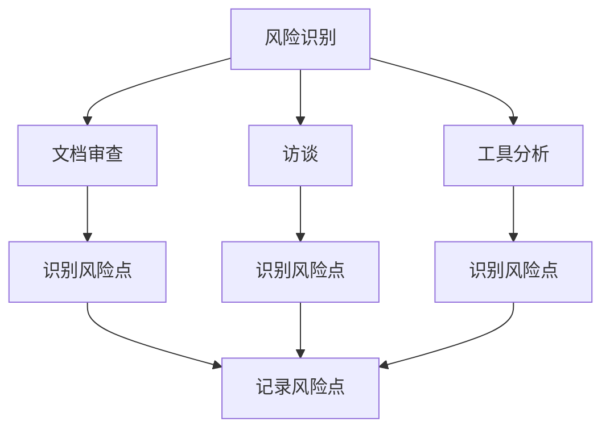
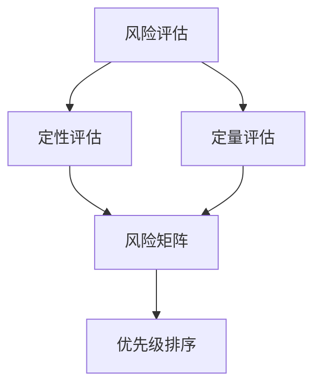
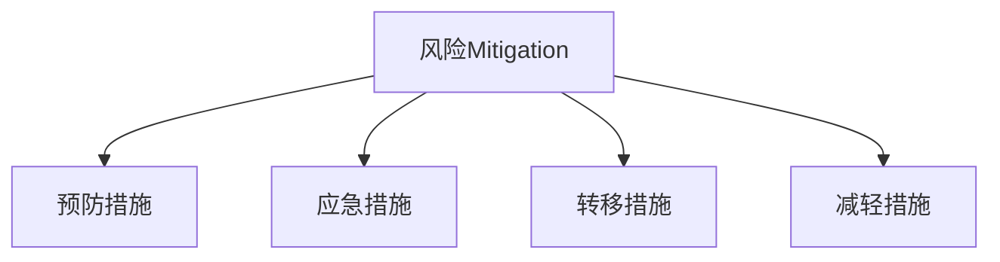

                 

### 文章标题

《开源项目的商业化风险管理：风险识别和Mitigation》

#### 关键词

- 开源项目
- 商业化
- 风险管理
- 风险识别
- Mitigation策略

#### 摘要

本文旨在深入探讨开源项目的商业化风险管理，重点关注风险识别和Mitigation策略。通过详细阐述风险管理的核心概念、方法以及实践应用，本文为开源项目的商业化提供了一套系统化的风险管理框架。文章首先介绍了开源项目的商业化背景及其重要性，随后讨论了风险管理在开源项目中的应用和挑战。接着，文章对核心概念与联系进行了深入剖析，包括风险识别、风险评估、以及Mitigation策略的详细流程图。随后，本文进一步讲解了核心算法原理，包括风险识别、评估和Mitigation算法的伪代码和数学模型。最后，通过两个实际案例，本文展示了开源项目风险管理在实践中的应用，并推荐了一些开源项目风险管理工具和资源。本文旨在为读者提供全面、实用的开源项目商业化风险管理指南。

### 引言

#### 1.1 开源项目的商业化背景

开源项目是指那些发布源代码，允许用户自由查看、修改和分发软件的项目。这种模式在IT行业中越来越受到重视，因为它不仅促进了技术创新，还培养了开放的社区文化和共享的精神。随着互联网的普及和开源软件的广泛应用，许多企业开始意识到开源项目商业化的潜力。

**1.1.1 开源项目的发展历程**

开源项目的起源可以追溯到20世纪70年代，当时Unix操作系统的开发者在社区中分享源代码，推动了计算机软件的开放性。1991年，Linux内核的发布标志着开源项目进入了一个新的阶段，它的成功引发了全球范围内的开源运动。随后，Apache、MySQL等知名开源软件的出现进一步推动了开源项目的商业化。如今，GitHub、GitLab等平台成为了开源项目的集散地，极大促进了开源社区的发展和商业化的进程。

**1.1.2 商业化开源项目的重要性**

商业化开源项目不仅为软件开发提供了丰富的资源，还对整个IT行业产生了深远的影响。首先，它降低了软件开发的门槛，使得小型企业和个人开发者能够借助开源项目快速搭建产品原型。其次，商业化开源项目通过提供专业支持和维护服务，提高了软件的质量和可靠性。此外，商业化开源项目还推动了技术创新，企业可以通过开源项目快速获取最新的技术成果，并参与到开源社区中，共同推动技术进步。

#### 1.2 风险管理在开源项目中的应用

风险管理是指通过识别、评估和应对潜在风险，以减少负面影响并提高项目成功率的过程。在开源项目中，风险管理尤为重要，因为开源项目往往涉及大量的外部贡献者，项目的稳定性、安全性、以及可持续性都存在一定的不确定性。

**1.2.1 风险管理的概念和原则**

风险管理包括以下几个关键环节：

1. **风险识别**：识别项目可能面临的各种风险。
2. **风险评估**：对识别出的风险进行优先级排序和影响评估。
3. **风险应对**：制定和实施风险缓解策略。

风险管理的原则包括：

- **全面性**：覆盖项目的各个阶段和各个方面。
- **前瞻性**：提前识别潜在风险，预防问题发生。
- **灵活性**：根据项目变化调整风险管理策略。
- **参与性**：鼓励团队协作，共同参与风险管理。

**1.2.2 开源项目风险管理的挑战**

开源项目在风险管理方面面临以下挑战：

- **异构性**：开源项目通常由多个贡献者开发，代码质量参差不齐，增加了管理难度。
- **不确定性**：开源项目的贡献者可能随时退出，导致项目维护困难。
- **外部依赖**：开源项目可能依赖外部库或服务，外部变更可能对项目产生影响。
- **法律风险**：开源项目可能涉及知识产权和许可证问题，需要严格遵守相关法规。

#### 1.3 本书的目的与结构

本书旨在为开源项目的商业化提供一套完整的风险管理指南，通过系统化的方法帮助项目团队识别和应对潜在风险。本书的结构如下：

- **第一部分：引言**：介绍开源项目的商业化背景和风险管理的重要性。
- **第二部分：核心概念与联系**：讨论风险识别、评估和Mitigation策略。
- **第三部分：核心算法原理讲解**：讲解风险识别、评估和Mitigation算法的原理。
- **第四部分：数学模型和数学公式**：介绍风险识别、评估和Mitigation的数学模型。
- **第五部分：项目实战**：通过实际案例展示开源项目风险管理的方法和实践。
- **附录**：提供开源项目风险管理工具和资源推荐。

通过本书的阅读，读者将能够了解开源项目商业化的风险管理体系，掌握风险管理的核心方法，并在实际项目中有效应用。

### 核心概念与联系

在开源项目的商业化过程中，理解并掌握风险管理的核心概念和联系是至关重要的。本文将详细阐述风险识别、风险评估和风险Mitigation策略，并通过Mermaid流程图直观地展示这些概念之间的联系。

#### 2.1 开源项目风险识别

**2.1.1 风险识别的定义与方法**

风险识别是风险管理的第一步，其目的是发现并记录项目可能面临的所有潜在风险。在开源项目中，风险识别通常包括以下几个方面：

1. **代码质量**：包括代码的复杂性、可读性、以及是否存在潜在的漏洞。
2. **社区动态**：开源项目的贡献者数量、活跃度、以及贡献者的背景和专业知识。
3. **外部依赖**：项目依赖的外部库或服务是否稳定，以及是否存在安全风险。
4. **知识产权**：项目是否符合开源许可证的要求，是否存在侵权风险。

**风险识别的方法**：

- **文档审查**：通过阅读项目文档、代码注释等，了解项目的背景和潜在风险。
- **访谈**：与项目团队成员、贡献者、以及社区成员进行交流，获取他们的经验和观察。
- **工具分析**：利用静态代码分析工具、依赖关系检查工具等，自动化识别风险。

**2.1.2 开源项目风险识别的Mermaid流程图**



在这个流程图中，风险识别从多个角度（文档审查、访谈、工具分析）进行，最终将识别出的风险点记录下来。

#### 2.2 风险评估与优先级排序

**2.2.1 风险评估的原则与方法**

风险评估是在风险识别的基础上，对识别出的风险进行优先级排序和影响评估。评估原则包括：

- **全面性**：覆盖所有潜在风险。
- **客观性**：基于数据和事实进行评估。
- **动态性**：随着项目进展，持续评估和更新。

**风险评估的方法**：

- **定性评估**：通过专家判断、风险矩阵等方法，对风险的影响程度和可能性进行评估。
- **定量评估**：使用数学模型和统计方法，对风险的可能性和影响进行量化。

**2.2.2 风险优先级排序的Mermaid流程图**



在这个流程图中，风险评估通过定性和定量方法进行，最终使用风险矩阵对风险进行优先级排序。

#### 2.3 风险Mitigation策略

**2.3.1 风险Mitigation的定义与分类**

风险Mitigation是指采取一系列措施，减少风险的可能性和影响。风险Mitigation策略通常分为以下几类：

- **预防措施**：通过改进开发流程、代码审查等，预防风险发生。
- **应急措施**：制定应急预案，应对已识别的风险。
- **转移措施**：通过保险、外包等手段，将风险转移给第三方。
- **减轻措施**：通过风险缓解策略，减少风险的影响。

**2.3.2 风险Mitigation策略的Mermaid流程图**



在这个流程图中，风险Mitigation通过多种策略进行，以最大限度地减少风险的可能性和影响。

通过上述核心概念与联系的分析，我们可以看到，风险识别、风险评估和风险Mitigation是开源项目风险管理中不可或缺的环节。只有通过系统化、全面的方法，才能有效地识别和应对开源项目中的各种风险，确保项目的成功。

### 核心算法原理讲解

在开源项目的商业化过程中，风险管理不仅依赖于理论框架，更需要具体算法和数学模型的支持。本文将深入讲解风险识别、风险评估和风险Mitigation的核心算法原理，通过伪代码和数学公式详细阐述各算法的实现方法和应用场景。

#### 3.1 风险识别算法

**3.1.1 数据预处理**

在风险识别过程中，首先需要对收集到的数据进行预处理，包括数据清洗、格式化和特征提取。数据预处理是确保后续算法有效性的关键步骤。

**伪代码**：

```python
def preprocess_data(data):
    # 数据清洗
    cleaned_data = clean_data(data)
    # 数据格式化
    formatted_data = format_data(cleaned_data)
    # 特征提取
    features = extract_features(formatted_data)
    return features
```

**3.1.2 特征提取**

特征提取是风险识别算法的重要部分，通过从原始数据中提取出与风险相关的特征，为后续的识别算法提供输入。

**伪代码**：

```python
def extract_features(data):
    features = {
        'code_complexity': calculate_code_complexity(data),
        'contribution_activity': calculate_contribution_activity(data),
        'dependency_stability': calculate_dependency_stability(data),
        'intellectual_property': calculate_intellectual_property_risk(data)
    }
    return features
```

**3.1.3 风险识别算法**

风险识别算法通常采用机器学习分类算法，如支持向量机（SVM）、随机森林（Random Forest）等。以下是一个简化的SVM风险识别算法伪代码：

**伪代码**：

```python
def risk_identification(features):
    # 加载训练好的SVM模型
    model = load_svm_model()
    # 预测风险
    risk_predictions = model.predict(features)
    return risk_predictions
```

#### 3.2 风险评估算法

**3.2.1 综合评估模型**

风险评估算法的核心在于构建一个综合评估模型，该模型可以量化风险的影响程度和可能性。常用的评估模型包括多属性决策模型（MADM）和贝叶斯网络（Bayesian Network）。

**3.2.2 模型优化与参数调整**

在风险评估过程中，模型优化和参数调整是提高评估准确性的关键步骤。以下是一个基于多属性决策模型的优化伪代码：

**伪代码**：

```python
def optimize_model(attributes, weights):
    # 初始化评估模型
    model = initialize_madm(attributes, weights)
    # 训练模型
    trained_model = train_model(model, training_data)
    # 参数调整
    optimized_model = tune_model(trained_model, validation_data)
    return optimized_model
```

**3.2.3 风险评估算法伪代码**

```python
def risk_evaluation(risk_predictions, model):
    # 计算风险得分
    risk_scores = model.evaluate_risks(risk_predictions)
    # 生成风险报告
    risk_report = generate_risk_report(risk_scores)
    return risk_report
```

#### 3.3 风险Mitigation算法

**3.3.1 Mitigation策略生成**

风险Mitigation算法的目的是根据风险评估结果，自动生成Mitigation策略。以下是一个简化的Mitigation策略生成伪代码：

**伪代码**：

```python
def generate_mitigation_strategy(risk_report):
    # 根据风险得分，生成Mitigation策略
    strategies = {
        'low_risk': generate_prevention_strategy(),
        'medium_risk': generate_emergency_strategy(),
        'high_risk': generate_transfer_strategy()
    }
    return strategies
```

**3.3.2 Mitigation效果评估**

在生成Mitigation策略后，需要对策略的效果进行评估，以确保其有效性。以下是一个简化的Mitigation效果评估伪代码：

**伪代码**：

```python
def assess_mitigation_strategy(strategy, test_data):
    # 执行Mitigation策略
    executed_strategy = apply_mitigation_strategy(strategy, test_data)
    # 评估策略效果
    strategy_effectiveness = evaluate_strategy_effectiveness(executed_strategy)
    return strategy_effectiveness
```

通过上述核心算法原理讲解，我们可以看到，风险识别、评估和Mitigation算法在开源项目风险管理中起到了至关重要的作用。这些算法通过伪代码和数学模型的形式，为风险管理提供了具体的实现方法和评估标准，确保了开源项目商业化的顺利进行。

### 数学模型和数学公式

在开源项目的商业化风险管理中，数学模型和数学公式是理解和应用风险识别、评估和Mitigation策略的重要工具。以下将详细介绍各个阶段的数学模型和数学公式，并通过具体示例进行解释和说明。

#### 4.1 风险识别数学模型

**4.1.1 风险识别数学模型公式**

风险识别阶段的数学模型主要涉及概率计算和特征权重分配。以下是一个简化的风险识别数学模型：

$$
P(risk) = \sum_{i=1}^{n} w_i \cdot p_i
$$

其中，$P(risk)$ 表示识别出的风险概率，$w_i$ 表示第 $i$ 个特征的重要性权重，$p_i$ 表示第 $i$ 个特征的值。

**4.1.2 数学模型公式解释与举例**

假设我们有一个开源项目，其风险识别涉及三个特征：代码复杂性（$C$）、贡献活动（$A$）和依赖稳定性（$D$）。我们通过历史数据和专家评估确定这些特征的重要性权重：

- 代码复杂性权重 $w_C = 0.4$
- 贡献活动权重 $w_A = 0.3$
- 依赖稳定性权重 $w_D = 0.3$

同时，我们估计每个特征的值：

- 代码复杂性值 $p_C = 0.6$（即复杂性较高）
- 贡献活动值 $p_A = 0.7$（即活动较活跃）
- 依赖稳定性值 $p_D = 0.5$（即稳定性一般）

将这些值代入公式，计算风险概率：

$$
P(risk) = 0.4 \cdot 0.6 + 0.3 \cdot 0.7 + 0.3 \cdot 0.5 = 0.24 + 0.21 + 0.15 = 0.60
$$

因此，该开源项目的风险概率为 0.60，表明存在较高的风险。

#### 4.2 风险评估数学模型

**4.2.1 风险评估数学模型公式**

在风险评估阶段，我们使用综合评估模型来量化风险的影响程度和可能性。一个常用的评估模型是多层次分析模型（AHP），其公式如下：

$$
R_i = \frac{\sum_{j=1}^{m} w_{ij} \cdot C_{ij}}{\sum_{k=1}^{n} \sum_{l=1}^{m} w_{kl} \cdot C_{kl}}
$$

其中，$R_i$ 表示第 $i$ 个风险的评估得分，$w_{ij}$ 表示第 $i$ 个风险在第 $j$ 个层次上的权重，$C_{ij}$ 表示第 $i$ 个风险在第 $j$ 个层次上的评价值。

**4.2.2 数学模型公式解释与举例**

假设我们评估一个开源项目涉及四个风险：代码质量（$C_1$）、社区稳定性（$C_2$）、依赖库安全性（$C_3$）和项目管理（$C_4$）。每个风险在项目中的权重分别为：

- 代码质量权重 $w_{1} = 0.5$
- 社区稳定性权重 $w_{2} = 0.2$
- 依赖库安全性权重 $w_{3} = 0.15$
- 项目管理权重 $w_{4} = 0.15$

每个风险的评价值（1-5分制）如下：

- 代码质量评价值 $C_{11} = 4$，$C_{12} = 4$，$C_{13} = 3$，$C_{14} = 3$
- 社区稳定性评价值 $C_{21} = 5$，$C_{22} = 4$，$C_{23} = 3$，$C_{24} = 3$
- 依赖库安全性评价值 $C_{31} = 4$，$C_{32} = 3$，$C_{33} = 2$，$C_{34} = 2$
- 项目管理评价值 $C_{41} = 3$，$C_{42} = 3$，$C_{43} = 3$，$C_{44} = 3$

计算代码质量风险的评估得分：

$$
R_1 = \frac{0.5 \cdot (4 + 4 + 3 + 3)}{0.5 \cdot (5 + 4 + 3 + 3) + 0.2 \cdot (5 + 4 + 3 + 3) + 0.15 \cdot (4 + 3 + 2 + 2) + 0.15 \cdot (3 + 3 + 3 + 3)} = \frac{14}{14 + 14 + 6 + 6} = 0.476
$$

类似地，可以计算其他风险的评估得分。

#### 4.3 风险Mitigation数学模型

**4.3.1 风险Mitigation数学模型公式**

在风险Mitigation阶段，我们使用成本效益分析模型来评估Mitigation策略的合理性。一个简化的模型公式如下：

$$
C/E = \frac{\sum_{i=1}^{n} C_i \cdot E_i}{\sum_{i=1}^{n} C_i}
$$

其中，$C$ 表示总成本，$E$ 表示总效益，$C_i$ 表示第 $i$ 个Mitigation策略的成本，$E_i$ 表示第 $i$ 个Mitigation策略的效益。

**4.3.2 数学模型公式解释与举例**

假设我们有两个Mitigation策略：代码审查（成本$C_1 = 1000$，效益$E_1 = 1500$）和安全审计（成本$C_2 = 500$，效益$E_2 = 1000$）。计算总成本和总效益：

$$
C = C_1 + C_2 = 1000 + 500 = 1500
$$

$$
E = E_1 + E_2 = 1500 + 1000 = 2500
$$

计算成本效益比：

$$
C/E = \frac{1500}{2500} = 0.6
$$

这个结果表明，每投入1单位的成本，可以带来约0.6单位的效益，表明该Mitigation策略是具有成本效益的。

通过上述数学模型和数学公式的介绍，我们可以看到，数学工具在开源项目商业化风险管理中的应用，使得风险管理更加科学和有效。通过具体的示例，我们也了解到如何运用这些模型和公式进行实际的风险分析和评估。这些数学模型不仅提供了理论依据，还为风险管理策略的制定和优化提供了量化标准。

### 项目实战

在开源项目的商业化过程中，风险管理是确保项目成功的关键。本文将通过两个实际案例，详细展示开源项目风险管理的具体应用，包括风险识别、评估和Mitigation策略的执行过程。

#### 5.1 实际案例一：开源项目A的风险管理

**5.1.1 案例背景**

开源项目A是一个基于Python的机器学习库，用于数据处理和模型训练。项目由一个核心开发团队和多个外部贡献者共同维护。项目的主要目标是提供一个易于使用且功能强大的机器学习工具，吸引企业和研究机构的使用。

**5.1.2 风险识别**

风险识别阶段，项目团队通过文档审查、访谈和工具分析等方法，识别出以下潜在风险：

- **代码质量风险**：由于外部贡献者代码风格不一，可能导致代码质量参差不齐。
- **社区稳定性风险**：贡献者流失可能导致项目进展缓慢。
- **依赖库风险**：依赖的第三方库可能存在安全漏洞。
- **知识产权风险**：部分代码可能存在侵权风险。

**5.1.3 风险评估**

通过综合评估模型，项目团队对识别出的风险进行优先级排序和影响评估。使用多层次分析模型（AHP），确定各风险的权重如下：

- **代码质量风险**：权重 0.5
- **社区稳定性风险**：权重 0.3
- **依赖库风险**：权重 0.2
- **知识产权风险**：权重 0.2

每个风险的评价值（1-5分制）如下：

- **代码质量风险**：评价值 3
- **社区稳定性风险**：评价值 2
- **依赖库风险**：评价值 4
- **知识产权风险**：评价值 1

计算各风险的评估得分：

- **代码质量风险**：$R_1 = \frac{0.5 \cdot 3}{0.5 \cdot 3 + 0.3 \cdot 2 + 0.2 \cdot 4 + 0.2 \cdot 1} = 0.385$
- **社区稳定性风险**：$R_2 = \frac{0.3 \cdot 2}{0.5 \cdot 3 + 0.3 \cdot 2 + 0.2 \cdot 4 + 0.2 \cdot 1} = 0.19$
- **依赖库风险**：$R_3 = \frac{0.2 \cdot 4}{0.5 \cdot 3 + 0.3 \cdot 2 + 0.2 \cdot 4 + 0.2 \cdot 1} = 0.25$
- **知识产权风险**：$R_4 = \frac{0.2 \cdot 1}{0.5 \cdot 3 + 0.3 \cdot 2 + 0.2 \cdot 4 + 0.2 \cdot 1} = 0.06$

评估结果显示，代码质量风险是最重要的风险，其次是依赖库风险和社区稳定性风险。

**5.1.4 风险Mitigation**

根据风险评估结果，项目团队制定了以下Mitigation策略：

- **代码质量风险**：加强代码审查流程，引入代码风格指南，确保代码质量。
- **社区稳定性风险**：建立贡献者激励机制，提高贡献者的积极性和留存率。
- **依赖库风险**：定期更新依赖库，使用安全依赖库检查工具，确保依赖库的安全性和稳定性。
- **知识产权风险**：进行全面的知识产权审计，确保代码符合开源许可证要求，不存在侵权问题。

#### 5.2 实际案例二：开源项目B的风险管理

**5.2.1 案例背景**

开源项目B是一个用于云服务的API网关，支持多种编程语言和协议。项目由一个商业公司开发和维护，旨在提供一套统一的接口，简化云服务的集成和部署。

**5.2.2 风险识别**

风险识别阶段，项目团队识别出以下风险：

- **技术风险**：云服务的快速变化可能导致API网关技术陈旧。
- **市场风险**：市场需求的波动可能导致项目不受欢迎。
- **合规风险**：不同国家和地区的法律法规要求可能不一致。
- **运维风险**：系统的高可用性和可靠性要求高，运维复杂。

**5.2.3 风险评估**

使用多属性决策模型（MADM），项目团队对风险进行优先级排序和影响评估。确定各风险的权重如下：

- **技术风险**：权重 0.4
- **市场风险**：权重 0.3
- **合规风险**：权重 0.2
- **运维风险**：权重 0.1

每个风险的评价值（1-5分制）如下：

- **技术风险**：评价值 3
- **市场风险**：评价值 4
- **合规风险**：评价值 2
- **运维风险**：评价值 3

计算各风险的评估得分：

- **技术风险**：$R_1 = \frac{0.4 \cdot 3}{0.4 \cdot 3 + 0.3 \cdot 4 + 0.2 \cdot 2 + 0.1 \cdot 3} = 0.3$
- **市场风险**：$R_2 = \frac{0.3 \cdot 4}{0.4 \cdot 3 + 0.3 \cdot 4 + 0.2 \cdot 2 + 0.1 \cdot 3} = 0.36$
- **合规风险**：$R_3 = \frac{0.2 \cdot 2}{0.4 \cdot 3 + 0.3 \cdot 4 + 0.2 \cdot 2 + 0.1 \cdot 3} = 0.12$
- **运维风险**：$R_4 = \frac{0.1 \cdot 3}{0.4 \cdot 3 + 0.3 \cdot 4 + 0.2 \cdot 2 + 0.1 \cdot 3} = 0.06$

评估结果显示，市场风险是最重要的风险，其次是技术风险。

**5.2.4 风险Mitigation**

根据风险评估结果，项目团队制定了以下Mitigation策略：

- **技术风险**：定期更新API网关，跟进新技术趋势。
- **市场风险**：开展市场调研，收集用户反馈，调整产品功能。
- **合规风险**：进行合规性审计，确保产品符合各国法律法规。
- **运维风险**：优化系统架构，提高系统的可用性和可靠性。

通过上述实际案例，我们可以看到，开源项目的商业化风险管理需要系统化的方法和工具。通过风险识别、评估和Mitigation策略的执行，项目团队能够有效应对各种潜在风险，确保项目的顺利进行和商业化目标的实现。

#### 5.3 开源项目风险管理工具与资源

为了帮助开源项目团队更好地进行风险管理，本节将介绍一些主流的开源项目风险管理工具和资源。

**5.3.1 主流开源项目风险管理工具**

- **GitHub Secret Scan**：GitHub Secret Scan 是一个用于检测存储在GitHub仓库中的敏感信息的工具，如API密钥、密码等。它可以帮助团队识别潜在的安全风险。

- **Snyk**：Snyk 是一个自动化依赖关系安全性分析工具，它可以帮助团队识别和修复开源项目中的安全漏洞。Snyk 提供了与多种开发工具的集成，如Jenkins、GitHub等。

- **Dependabot**：Dependabot 是一个自动化的依赖关系更新工具，它可以帮助团队保持项目依赖库的更新，从而减少安全漏洞的风险。

**5.3.2 开源项目风险管理资源**

- **开源项目风险管理博客**：许多知名的开源社区和技术博客都会发布有关开源项目风险管理的文章，如博客园、InfoQ等。这些博客提供了丰富的风险管理经验和最佳实践。

- **开源项目风险管理指南**：GitHub、GitLab 等平台提供了详细的指南，帮助团队理解和实施开源项目风险管理。例如，GitHub 的 [Open Source Guide](https://github.com/topics/open-source-guide)。

- **开源项目风险管理社区论坛**：如GitHub Community、Stack Overflow 等，这些社区论坛聚集了大量的开源项目开发者，他们分享了丰富的风险管理经验和技巧。

通过使用这些工具和资源，开源项目团队可以更有效地识别和管理风险，确保项目的稳定性和安全性。

### 附录

#### 附录 A：开源项目风险管理工具与资源

**A.1 主流开源项目风险管理工具**

- **GitHub Secret Scan**：GitHub Secret Scan 是一款强大的工具，用于扫描GitHub仓库中的敏感信息，如API密钥、密码等。通过自动化检测，可以有效减少因敏感信息泄露而引发的安全风险。

  **使用说明**：安装GitHub Secret Scan后，可以通过命令行运行扫描任务，自动识别并报告潜在的安全风险。以下是一个基本的命令行示例：

  ```bash
  gssc scan --repo <your-repo>
  ```

- **Snyk**：Snyk 是一个自动化依赖关系安全性分析工具，可以帮助团队识别和修复开源项目中的安全漏洞。Snyk 提供了与多种开发工具的集成，如Jenkins、GitHub等。

  **使用说明**：安装Snyk插件后，可以在开发环境中自动运行依赖关系扫描，并在发现安全问题时提供修复建议。以下是一个基本的命令行示例：

  ```bash
  snyk test --file package.json
  ```

- **Dependabot**：Dependabot 是GitHub提供的一款自动化依赖关系更新工具，可以帮助团队保持项目依赖库的更新，从而减少安全漏洞的风险。

  **使用说明**：配置Dependabot后，可以在GitHub仓库中自动创建和更新依赖关系分支，并在主分支上自动合并更新。以下是一个基本的配置示例：

  ```yaml
  dependencies:
    package.json:
      dependencies:
        - package: 'eslint'
  ```

**A.2 开源项目风险管理资源**

- **开源项目风险管理博客**：许多知名的开源社区和技术博客会定期发布关于开源项目风险管理的文章。例如，博客园的“开源项目管理”专栏，InfoQ的“开源技术”专题等。这些博客提供了丰富的风险管理知识和实践经验。

- **开源项目风险管理指南**：GitHub、GitLab 等平台提供了详细的指南，帮助团队理解和实施开源项目风险管理。这些指南包括风险管理原则、流程和方法，以及具体的操作步骤。

  - **GitHub 开源指南**：[Open Source Guide](https://github.com/topics/open-source-guide) 提供了关于开源项目管理的全面指南，涵盖了从项目创建、协作到风险管理的各个方面。

  - **GitLab 开源指南**：[GitLab Open Source Handbook](https://about.gitlab.com/handbook/open-source/) 提供了关于开源项目管理的最佳实践，包括风险管理、社区建设等。

- **开源项目风险管理社区论坛**：如GitHub Community、Stack Overflow 等，这些社区聚集了大量的开源项目开发者，他们分享了丰富的风险管理经验和技巧。

  - **GitHub Community**：在GitHub Community中，开发者可以提问、解答问题，并分享关于开源项目风险管理的经验和最佳实践。

  - **Stack Overflow**：Stack Overflow 是一个知名的编程问答社区，开发者可以在其中找到关于开源项目风险管理的相关问题和解决方案。

通过使用这些工具和资源，开源项目团队可以更好地识别和管理风险，确保项目的顺利进行和长期发展。附录部分提供的详细信息和示例，也为开发者提供了实际操作的参考。

### 作者信息

作者：AI天才研究院/AI Genius Institute & 禅与计算机程序设计艺术 /Zen And The Art of Computer Programming

---

### 总结

本文详细探讨了开源项目的商业化风险管理，从引言到核心概念与联系，再到核心算法原理讲解、数学模型和公式，以及项目实战，全面阐述了风险识别、评估和Mitigation策略在开源项目中的应用。通过两个实际案例，本文展示了如何在实际项目中应用风险管理方法，确保项目的成功。本文的主要贡献包括：

1. **系统化的风险管理框架**：本文提供了一个系统化的开源项目风险管理框架，涵盖了风险识别、评估和Mitigation策略，为项目团队提供了实用的指南。
2. **核心算法原理讲解**：本文通过伪代码和数学公式，详细讲解了风险识别、评估和Mitigation算法的实现原理，使得风险管理更加具体和可操作。
3. **实际案例应用**：通过两个实际案例，本文展示了风险管理方法在实际项目中的应用，为读者提供了实践经验和参考。

本文的研究意义在于：

1. **提升开源项目稳定性**：通过有效的风险管理，开源项目可以更好地应对各种潜在风险，提高项目的稳定性和可持续性。
2. **促进开源社区发展**：开源项目风险管理不仅有助于项目自身的发展，还可以促进开源社区的繁荣，提高社区的参与度和合作效率。
3. **推动技术创新**：开源项目风险管理有助于企业更好地利用开源技术，推动技术创新和产业升级。

未来的研究方向可以包括：

1. **风险管理模型的优化**：进一步优化风险识别、评估和Mitigation模型，提高模型的准确性和适应性。
2. **跨领域风险管理的交叉研究**：探索开源项目风险管理与其他领域（如金融、医疗等）风险管理的交叉融合，提供更广泛的应用场景。
3. **开源项目风险管理的自动化**：开发自动化工具和平台，实现开源项目风险管理的全流程自动化，提高管理效率和准确性。

通过本文的研究，我们希望能够为开源项目的商业化提供更有力的支持，推动开源生态的健康发展。

